# Day 11 | Database Design Philosophy: Requirement Analysis, Technology Selection, and Schema Design Strategies

Yesterday, we explored the three-fold ontology of caching. Today, we delve into the final destination of data: the **persistence layer**.

If caching is the system's short-term memory, then the database is its long-term memory and knowledge base. When the cache fails, the system restarts, or during disaster recovery, the database bears the responsibility of reconstructing the system's worldview.

But more importantly: **Database design directly determines the effectiveness of the caching strategy.** A flawed database schema can render even the most perfect caching design futile.

## The Ontology of Database Design: From Existence to Structure

Before starting database design, we might need to clarify one question first:

**What is data?**

### The Nature of Data: A Recorded Consequence of Behavior

A student, fully engrossed in a lecture, jots down key points of their personal understanding onto a medium. A doctor, after diagnosing a patient's self-described symptoms, progressively records the patient's feelings and their own diagnostic estimations based on professional assessment. The Wall Street stock market continuously records buying and selling prices, which are then compiled by other professional managers into charts, curves, or expert analysis reports.

Have you noticed the pattern? Regardless of the medium—be it lecture notes, medical records, or stock price fluctuations—they all fundamentally follow a single rule:

```
Behavior => Impact (is recorded) = Recorded Data
```

All data represents the impact caused by the execution of a certain **behavior**.

This impact can be a concrete description based on an abstract concept, like the dialectical analysis of grammar in linguistics or the derivation of formulas in mathematics. Or, it can be the new, recorded, concrete impact generated after a state has undergone a certain **behavior**, much like how we understand an author's worldview by reading their work.

So why do we have **behavior**? What is the basis for our actions?

```
Requirement
```

Before we perform any action, it is inevitably driven by a primal or well-considered need. When thirsty, we subconsciously look for water; when faced with danger, we subconsciously flee or fight. At the same time, when we feel thirsty, we might also consider that we are in a library and thus restrain the act of drinking until we are in a situation where it is permissible.

Therefore, we can refine the data generation process as follows:

```
Requirement => Conduct => Effect
```

And this is the most crucial concept in Domain-Driven Design.

All our system designs have an origin. As system architects, we must understand, comprehend, and ultimately deconstruct the requirements.

So, for database design, we also need to analyze the source of the data, understand the reason for its existence, and then proceed with the design.

The storage and synchronization methods for the raw files of a professional filmmaker in the middle of creation are vastly different from the storage and synchronization methods for a movie released on Netflix. Their storage and usage context requirements are entirely different.

### Shifting Perspectives: From a Single Fact to Multiple Interpretations

We just established the core process: `Requirement => Conduct => Effect`. Let's continue with a deeper question: **Who is recording? And in what context?**

The same "effect" can be recorded as vastly different "data" in the eyes of different "observers."

Imagine the completion of a transaction at an online bookstore (the effect):

- **For the finance department:** This is an accounting entry. Their requirement is "reconciliation and tax reporting," and the data they record is "order amount, tax, payment method, timestamp."
- **For the warehouse department:** This is an inventory change. Their requirement is "inventory management," and the data they record is "product SKU, quantity shipped, remaining stock."
- **For the marketing department:** This is a user behavior. Their requirement is "analyzing preferences for recommendations," and the data they record is "user ID, purchased product category, purchase correlations."

**There is only one Fact:** A transaction occurred.
**But there are multiple versions of Data:** Each department, based on its own "requirement," extracts, transforms, and records the fragments of this "effect" that are meaningful to them.

This is the embodiment of the "Bounded Context" concept in system design. Each context (department) has its own language and data model, both serving the specific needs of that context.

Therefore, our data generation process can be further refined to:

```
Within a "Specific Context" =>
  A "Specific Requirement" drives =>
    A "Specific Behavior" which produces =>
      A "Single Effect" that is =>
        Interpreted from "Multiple Perspectives" as =>
          "Multiple forms of Recorded Data"
```

This understanding directly leads to the core strategies of modern database architecture, such as:

1.  **Microservices:** Each service (context) has its own database because their "interpretation" of and "requirements" for the data are different. Forcing a unified database would only lead to a chaotic model and unclear responsibilities.
2.  **CQRS (Command Query Responsibility Segregation):** Separating the databases for "recording behavior" (the Command side) and "querying interpretations" (the Query side). Write operations are optimized for recording facts, while read operations are optimized for fast queries from specific perspectives.
3.  **Event Sourcing:** Instead of storing the "state," a series of immutable "effects" (events) are stored. Any "current state" of the system is merely one "interpretation" or "projection" of historical events.

So, when we design a schema, we should no longer ask, "What attributes does this thing have?" Instead, we should ask:

- **What requirement in which context is this data meant to satisfy?** (Locating the Bounded Context)
- **Which behavior generated this data?** (Tracing the Event/Command)
- **How many different perspectives will query and interpret this data in the future?** (Planning Query Models / Read Models)

By understanding that data is an "interpreted effect," we can break free from a monolithic, rigid database design mindset and embrace a flexible, multi-dimensional data architecture that is more adaptable to complex business changes.
## Deep Dive into Core Design Strategies

### 1. Master Data Management (MDM) Strategy

Imagine if, in a library, the counter staff, administrators, and procurement departments each had their **own** member roster.

- A member updates their phone number at the counter.
- But when the procurement department notifies them that a pre-ordered new book has arrived, they still use the old number.
- The administrators use the old address when sending annual reports.

This is the chaos caused by data inconsistency, a problem we encounter constantly in daily life. In enterprises, the cost of such chaos is enormous: sending goods to the wrong address, issuing incorrect invoices, and losing customers.

The core purpose of **Master Data Management (MDM)** is to resolve this chaos by establishing a single, universally recognized, and trustworthy source of data across the entire organization.

**Core Design Philosophy:**

**Single Source of Truth (SSoT)**

This is the soul of MDM. It mandates: "Authoritative data about 'customers' can only be obtained from me; standard information about 'products' must also be queried from me."

It is not a data storage center where all data is placed. It is the authoritative center for data, defining the "correct version" of the most critical and core data. Other systems (such as order systems, logistics systems) can replicate this data for use, but when the most accurate data is needed, they must return to the master data system to query it.

**Quick Summary**

- All systems obtain basic data from the same master file.
- A fundamental solution to avoid data inconsistency.
- Reduces maintenance costs and error risks.

**Separation of Reference Data and Transactional Data**

- **Master Data (Reference Data)**:
  - Nature: "Nouns" in the business. They are relatively static entities that are repeatedly referenced.
  - Characteristics: Changes slowly, but once changed, the impact is widespread.
  - Examples: Stock listing codes, basic customer information, product specifications, branch addresses, country codes.
- **Transactional Data (Behavior-Based Data)**: Changes frequently, with high timeliness requirements.
  - Nature: "Verbs" in the business. They describe "events" that occur at a specific point in time.
  - Characteristics: Generated frequently, large in volume, and usually not modified after creation.
  - Examples: An order, a payment, a shipping record.

We can think of it this way: a "transaction" (transactional data) refers to "who the customer is" and "what product was bought" (master data).

Without master data, every order would have to repeatedly record the complete customer address and product description. If a customer moves, we would have to modify all historical orders, which is impossible.

**Version Control and Timeliness Management**

```
Effective Date → Active Period → Expiration Date → Historical Preservation
```


This is the most complex and valuable part of MDM in practice. Although master data changes slowly, it does change. This means master data cannot just have a "current state"; it must be able to answer:

- "What was the price of this product at a certain point in the past?"
- "What will this customer's address be at a certain point in the future?"

Therefore, the lifecycle management of `Effective Date → Active Period → Expiration Date`, and the design in the AWS example code that simultaneously uses `master_data_versions` (historical versions table) and `master_data_current` (current active version table), are precisely to achieve this ability to query data across time.

This is crucial for financial reconciliation, legal compliance, and business analysis.

**Basic Read/Write Flow**

```mermaid
graph TD
    subgraph "Write Flow update_master_record"
        A[Start Update Request] --> B(Start Transaction in RDS)
        B --> C{1. Write New Version to<br/>master_data_versions}
        C --> D{2. Check if Effective Immediately}
        D -->|Yes| E{3. Update master_data_current}
        E --> F[4. Invalidate Related Cache in ElastiCache]
        F --> G[5. Publish Change Event via EventBridge]
        G --> H(Commit RDS Transaction)
        D -->|No (Future Effective)| H
        H --> I[End]
    end

    subgraph "Read Flow get_master_data"
        J[Start Read Request] --> K{Query Historical Data?}
        K -->|No (Query Current Data)| L{1a. Query Cache in ElastiCache}
        L -->|Cache Hit| M[Return Cached Data]
        L -->|Cache Miss| N{2a. Query RDS master_data_current}
        N --> O{Data Found?}
        O -->|Yes| P[3a. Write Data back to ElastiCache]
        P --> Q[Return Data]
        O -->|No| Q

        K -->|Yes (Query Historical Data)| R{1b. Query Specific Time Point Version in<br/>RDS master_data_versions}
        R --> Q
        M --> S[End]
        Q --> S
    end
```

**Write Logic (update_master_record)**:

- Transactional: All write operations are wrapped in a transaction to ensure atomicity—"all or nothing."
- Version Control: Writes to both the versions table and the current table simultaneously, perfectly balancing historical traceability with current query performance.
- Cache Invalidation: Upon data update, cache invalidation is immediately performed to ensure data consistency.
  **Read Logic (get_master_data):**
- Cache-Aside: Queries the cache first; if not found, queries the database and populates the cache. This is the most classic caching pattern.
- Time-Travel Support: Capable of querying historical data at a specific point in time using the `as_of_date` parameter, which is one of the most valuable features of an MDM system.

#### AWS Implementation: Enterprise-Grade Master Data Management System

**AWS Service Architecture Combination**

- RDS (PostgreSQL): Serves as the "Single Source of Truth (SSoT)," leveraging its transactional capabilities (ACID) to ensure strong consistency of core data, which is the cornerstone of MDM. Correct choice.
- ElastiCache (Redis): Acts as a "Distributed Cache," alleviating read pressure on the primary database and providing high-performance data access for downstream systems. This is a standard high-performance architecture pattern.
- DynamoDB: Although RDS can also record changes, using DynamoDB can create a fast, scalable, independent audit log for other systems to quickly query change history without impacting primary database performance.
- EventBridge: Functions as an "Event Notification" hub, proactively informing all relevant systems after master data changes. This achieves loose coupling between systems, which is critical for modern microservice architectures.

```yaml
# AWS Service Configuration for Enterprise-Grade Master Data Management System
MasterDataManagementServices:
  # Core Data Storage Layer
  CoreStorage:
    PrimaryDatabase:
      Service: "Amazon RDS PostgreSQL"
      Instance: "db.r6g.2xlarge"
      Storage: "2TB gp3 SSD"
      MultiAZ: true
      ReadReplicas: 3
      BackupRetention: 35
      Encryption: "AES-256"

    VersioningStore:
      Service: "Amazon DynamoDB"
      TableName: "master-data-versions"
      BillingMode: "ON_DEMAND"
      GlobalTables: true
      PointInTimeRecovery: true

  # Distributed Cache Layer
  CacheLayer:
    DistributedCache:
      Service: "Amazon ElastiCache Redis"
      NodeType: "cache.r6g.xlarge"
      Nodes: 3
      ClusterMode: true
      Encryption: "in-transit and at-rest"

    CDNCache:
      Service: "Amazon CloudFront"
      Origins: "ALB + ElastiCache"
      TTL: "3600 seconds"

  # Event Processing and Notification
  EventProcessing:
    EventBus:
      Service: "Amazon EventBridge"
      Rules: "master-data-change-*"
      Targets: ["Lambda", "SQS", "SNS"]

    MessageQueue:
      Service: "Amazon SQS"
      Type: "FIFO Queue"
      VisibilityTimeout: "300s"
      DeadLetterQueue: true

    Notifications:
      Service: "Amazon SNS"
      Topics: ["master-data-updates", "system-alerts"]
      Subscriptions: ["Email", "SMS", "Lambda"]

  # Compute and Processing
  ComputeServices:
    APIGateway:
      Service: "Amazon API Gateway"
      Type: "REST API"
      Authentication: "AWS Cognito"
      RateLimit: "1000 req/sec"

    BusinessLogic:
      Service: "AWS Lambda"
      Runtime: "Python 3.11"
      Memory: "1024 MB"
      Timeout: "15 minutes"
      Concurrency: "100"

    BackgroundProcessing:
      Service: "Amazon ECS Fargate"
      CPU: "2 vCPU"
      Memory: "4 GB"
      AutoScaling: true

  # Monitoring and Audit
  ObservabilityStack:
    Monitoring:
      Service: "Amazon CloudWatch"
      Metrics: "Custom + Built-in"
      Alarms: "20+ alerts"
      Dashboards: "Executive + Technical"

    Logging:
      Service: "Amazon CloudWatch Logs"
      RetentionPeriod: "90 days"
      LogGroups: "by service"

    Tracing:
      Service: "AWS X-Ray"
      SamplingRate: "10%"
      TracingEnabled: true

    AuditTrail:
      Service: "AWS CloudTrail"
      LogFileValidation: true
      MultiRegion: true

  # Security and Compliance
  SecurityServices:
    IdentityManagement:
      Service: "AWS IAM"
      Roles: "least-privilege"
      Policies: "resource-based"

    SecretsManagement:
      Service: "AWS Secrets Manager"
      AutoRotation: true
      CrossRegionReplication: true

    KeyManagement:
      Service: "AWS KMS"
      KeyRotation: "annual"
      CustomerManagedKeys: true

    NetworkSecurity:
      Service: "AWS VPC"
      Subnets: "private + public"
      SecurityGroups: "restrictive"
      NACLs: "additional layer"

  # Disaster Recovery
  DisasterRecovery:
    Backup:
      Service: "AWS Backup"
      Schedule: "daily + weekly"
      RetentionPeriod: "7 years"
      CrossRegionCopy: true

    ReplicationTarget:
      Service: "Secondary AWS Region"
      RPO: "< 1 hour"
      RTO: "< 4 hours"

# Cost Estimation (Monthly Cost)
CostEstimation:
  RDS: "$2,400/month"
  ElastiCache: "$1,200/month"
  DynamoDB: "$800/month"
  Lambda: "$300/month"
  Other: "$800/month"
  Total: "$5,500/month"
```

**AWS Service Architecture Diagram**


---

### 2. Event-Driven Architecture (Event-Driven Design)

Let's return to our library analogy once again.

Traditional database design is like a librarian who only cares about "the present."

We ask them: "Where is *Night Flight*?" They'll tell us directly: "On shelf A-7." But if we follow up with: "Where was this book yesterday at 3 PM?"

They'll look perplexed, because they only record the final state of books—all the changes in between have been lost.

```
 "Night Flight" is a book I love dearly. I highly recommend it :))
```

**Core Concept:**

The philosophy of event-driven design: **Record "what happened," not "what it became."** Event-driven architecture, especially Event Sourcing, adopts a completely different philosophy. It's like a meticulous historian who maintains not a list of books, but an immutable ledger that is never modified.

Programming languages have a concept to manage this abstract concreteness: **Linked List (Node-List)**. All events necessarily have their connected preceding and following events. **By replaying history, we can reconstruct the state at any point in time.**

So, back to our library counter—when we examine the event log of a book's journey, we would see:

- `09:15`: Member Alice returned *Night Flight* at Library C.
- `11:30`: The administrator moved *Night Flight* from Library C to Library B.
- `15:10`: The part-timer shelved *Night Flight* from the return cart onto shelf A-7.

This is the event stream.

See? We don't store the book's "location" (state); we only store each "movement" (event) of the book.

Traditional CRUD is "destructive." When we execute `UPDATE users SET status = 'inactive'`, we permanently lose the user's previous state—information is destroyed in the update.

Event Sourcing is "constructive." It records a `UserDeactivated` event. All historical information nodes are preserved.

**Quick Summary:**

- Don't store state, only store events
- Current state = result of replaying all historical events

**Application Scenarios:**

1. Microservices Integration:

- This is the core application of EDA.
- In an e-commerce platform, when the "Order Service" generates an `OrderCreated` event, it can be completely unaware of which downstream services need this information. The **"Inventory Service"** can subscribe to this event to deduct inventory, the **"Logistics Service"** can subscribe to it to prepare shipment, and the **"Notification Service"** can subscribe to it to send confirmation emails. Services are completely decoupled and can be independently developed, deployed, and scaled.

2. Asynchronous Workflows:

- EDA excels at handling **time-consuming, sequential background tasks**. For example: After a user uploads a video, the backend immediately publishes a `VideoReceived` event and responds with "Upload successful, transcoding in progress." One or more dedicated "transcoding services" will receive this event and perform time-consuming video compression, watermarking, etc., in the background. The user doesn't need to wait in place—excellent user experience.

3. Real-time Data Processing & IoT:

- Scenario: Processing endless data streams. Temperature and humidity readings from thousands of IoT devices, or real-time stock price fluctuations in financial markets—each data point is an event. EDA architecture can efficiently filter, transform, aggregate these event streams, and trigger real-time alerts or update dashboards.

4. Audit and Compliance:

- Scenario: When "what happened" is more important than "what it is now." In finance, healthcare, or legal domains, having an immutable record of every transaction and every medical record modification is a fundamental requirement for compliance. Any state of the system can be recreated from these historical events.

**Advantages:**

- Complete operational trail
- Support for time travel
- Natural auditing capabilities

However, this "write tasks on a whiteboard and leave" communication style also brings its own unique complexities and challenges:

1. **Cognitive Model Complexity**: The system's control flow becomes opaque. After an event is published, it's difficult to intuitively track "what happens next?" This makes debugging extremely challenging.
2. **Eventual Consistency**: Because services process asynchronously, the system will have brief state inconsistencies across different parts. For example, an order is created, but inventory may not yet be deducted. This places higher demands on both development and user experience design.
3. **Event Schema Evolution & Versioning**: If the message format on the "task whiteboard" changes (e.g., the order event adds a "discount code" field), all downstream services must be able to handle both old and new formats, or they'll crash. This typically requires introducing additional tools for management.
4. **Message Broker Reliability**: That "task whiteboard" (such as Kafka, EventBridge) becomes the heart of the system. If it fails, the entire system will collapse. Therefore, it must be designed to be highly available and reliable—a complex and expensive engineering effort.
5. **Testing Difficulty**: End-to-end integration testing becomes extremely difficult because we need to verify that after an event is triggered, all related downstream services have correctly completed their respective work.

In summary, EDA provides extreme flexibility and scalability, but at the cost of increased overall system complexity and tolerance for "eventual consistency." Choosing it means we must be prepared to trade the management of a complex "asynchronous collaboration system" for the "simplicity and independence" of individual services.

#### AWS Implementation: Event Sourcing for Investment Trading System


**Write Flow (left side):**

When a trading action occurs, the application calls `store_trade_event`.
This function first writes the trade event to DynamoDB's `PortfolioEvents` table. This is our "event log"—immutable and permanent.
After successful write, the same event is published to the Kinesis data stream.
Other downstream services interested in this event (e.g., reporting services, risk calculation services) will subscribe to and receive the event from Kinesis, then execute their respective business logic. This process is asynchronous and decoupled.

**Read/Rebuild Flow (right side):**

When querying the "current state" of a portfolio is needed, the application calls `rebuild_portfolio_state`.
The system queries DynamoDB to retrieve all historical event records for that portfolio.
In the application's memory, starting from the first event, it "replays" these events step by step, like fast-forwarding through a movie.
After replaying all events, it obtains the precise state of the portfolio at a specific point in time and returns it to the requester.

**AWS Service Architecture Composition**


```python
class PortfolioEventStore:
    """Event Sourcing implementation for investment portfolios"""

    def __init__(self):
        self.event_store = boto3.client('dynamodb')
        self.event_stream = boto3.client('kinesis')

    async def store_trade_event(self, portfolio_id, event):
        """Store trade event to DynamoDB"""

        event_record = {
            'portfolio_id': {'S': portfolio_id},
            'event_id': {'S': str(uuid.uuid4())},
            'event_type': {'S': event.type},
            'event_data': {'S': json.dumps(event.data)},
            'timestamp': {'N': str(int(time.time() * 1000))},
            'sequence_number': {'N': str(await self.get_next_sequence(portfolio_id))}
        }

        # Strong consistency write
        await self.event_store.put_item(
            TableName='PortfolioEvents',
            Item=event_record,
            ConditionExpression='attribute_not_exists(event_id)'
        )

        # Asynchronously send to Kinesis for consumption by other services
        await self.event_stream.put_record(
            StreamName='portfolio-events',
            Data=json.dumps(event_record),
            PartitionKey=portfolio_id
        )

    async def rebuild_portfolio_state(self, portfolio_id, as_of_time=None):
        """Rebuild portfolio state from events"""

        query_params = {
            'TableName': 'PortfolioEvents',
            'KeyConditionExpression': 'portfolio_id = :pid',
            'ExpressionAttributeValues': {':pid': {'S': portfolio_id}},
            'ScanIndexForward': True  # Chronological order
        }

        if as_of_time:
            query_params['FilterExpression'] = 'timestamp <= :time'
            query_params['ExpressionAttributeValues'][':time'] = {'N': str(as_of_time)}

        events = await self.event_store.query(**query_params)

        # Replay events to rebuild state
        portfolio_state = PortfolioState()
        for event_item in events['Items']:
            event = self.deserialize_event(event_item)
            portfolio_state.apply_event(event)

        return portfolio_state
```

Let's look at a scenario question:

```
Using stock ticker EDA implementation as an example, do I need to create a separate stock trading table for each user?
```

The answer is: Absolutely not.

Creating a data table for each stock for each user is a common design misconception that leads to a "table explosion" disaster. An active user might trade hundreds of stocks; ten thousand users could generate hundreds of thousands or even millions of tables, which is unfeasible for management, maintenance, and querying.

**Correct Table Design Approach: Center Around "Event Streams"**

In EDA, we shouldn't think "what tables should I create to store state," but rather **"for which entities should I create event streams."**

In the stock trading scenario, the core business entity (the "aggregate root" in DDD) is **"the user's investment portfolio" or "trading account,"** not individual stocks. In reality, all of a user's trading behaviors (conduct) happen around their specific portfolio (requirement).

Therefore, we only need one event table, which I'll call `TradingEvents`. This table records all trading events for all users and all portfolios.

Ideal `TradingEvents` Table Structure (using DynamoDB as example)

| Field Name (Attribute) | Role                   | Example                                             | Notes                                                                                                                                        |
| :--------------------- | :--------------------- | :-------------------------------------------------- | :------------------------------------------------------------------------------------------------------------------------------------------- |
| portfolio_id           | Partition Key          | user123-portfolio-A                                 | Core design: All events belonging to the same portfolio are physically stored together, maximizing query efficiency.                         |
| sequence_number        | Sort Key               | 1, 2, 3, ...                                        | Core design: Guarantees strict sequential order for all events within a portfolio—the foundation for replaying history and rebuilding state. |
| event_id               | Event unique identifier| uuid-v4-string                                      | Used to ensure event uniqueness and prevent duplicate processing.                                                                            |
| event_type             | Event type             | STOCK_BOUGHT, STOCK_SOLD                            | Describes "what happened," determining how business logic processes this event.                                                              |
| event_payload          | Event content (JSON)   | {"symbol": "AAPL", "quantity": 10, "price": 175.50} | Records specific event details.                                                                                                              |
| timestamp              | Event occurrence time  | 2025-09-12T10:00:00Z                                | Records real-world business time for audit and analysis.                                                                                     |


---

### 3. CQRS (Command Query Responsibility Segregation)

Let's give our library's poor administrators and exhausted part-timers a break. Now we'll turn our attention to the World Cup final soccer stadium—watched simultaneously by nearly a third of the world's population, a highly anticipated and thrilling event.

Events on the field change in an instant; a millisecond's difference could mean the difference between kneeling before the championship podium or witnessing the birth of a new football legend. However, the stadium has limited physical space. If all the world's athletes, media, and fans were concentrated in the same stadium, it would be physically impossible—we're humans, not LEGO bricks. So the vast majority of us still experience it through **media (recording behavior)** and their **coverage (the impact of recording)**.

When a player commits a foul, the referee blows the whistle and shows a yellow card. They pull out a notebook and meticulously record: `player number`, `time`, `foul type`. Meanwhile, on the sidelines, various media outlets spring into action. The radio broadcaster immediately relays who received the yellow card from their seat. Online news reporters instantly publish ticker updates appearing on TV programs. On-site live reporters immediately focus on the referee and the anxious, protesting player, waiting for subsequent events to unfold.

See? **There is only one fact** (the referee recorded a yellow card), but **there are thousands of ways to present the data**. If we forced all media outlets to read the referee's scribbled, keyword-only notebook, it would be a disaster.

What's happening on the field is the singular "fact."

**Command Side - The Referee on the Field**
`The referee blows the whistle and shows a yellow card. They pull out a notebook and meticulously record...` This action is a "command." It changes the official state of the match. The referee's notebook is the "Write Model," designed with **absolute accuracy and rule consistency** as its goals. It doesn't care whether the coverage is exciting; it only cares whether the record is error-free.

**Query Side - Broadcasting Units and Media**

Meanwhile, on the sidelines, various media outlets have completely different needs (queries):

- **TV/Radio Broadcasters**: They need real-time data streams for broadcasting. Their "query model" is a dashboard containing `current score`, `match time`, `possession`, `live events (such as: shots, corner kicks)`. It's optimized for **speed and narrative**.
- **Breaking News Reporters**: They need to immediately publish the most critical information. Their "query model" might just be an extremely simple event list: `"Messi scores! Argentina leads 1:0!"`. It's optimized for **timeliness**.
- **Evening News Analysts**: They need complete post-match statistics to write in-depth reports. Their "query model" is a complex aggregate report containing `player distance run`, `pass completion rate`, `shot distribution map`. It's optimized for **depth and analysis**.
- **Social Media Editors**: They need exciting clips to attract attention. Their "query model" is GIFs of goals, short videos of controversial calls. It's optimized for **interactivity and virality**.

The core philosophy of CQRS is: **Let the referee focus on accurate record-keeping (commands), while allowing each media outlet to build the most suitable viewing notes (queries) for their own needs.**

**Abstract Concept**: Write-optimized structure ≠ Query-optimized structure

**Design Principles:**

- **Command Side:**

  - Highly normalized
  - Strong consistency requirements
  - Write performance optimization

- **Query Side:**

  - Extensive denormalization
  - Eventual consistency
  - Read performance optimization

**Practical Benefits:**

- Read/write load separation
- Independent scaling for each side
- Complex queries don't impact core business

**Application Scenarios:**

CQRS is not a silver bullet. It introduces additional complexity, so it should only be used in scenarios where the benefits clearly outweigh the costs. Here are several classic scenarios where CQRS delivers maximum value:

1.  **High-traffic, read-intensive systems (read demand is the square root or more of writes)**:

    - **Scenario**: E-commerce platform product catalogs, news media article pages, social platform content feeds. In these systems, read operations (browsing products, reading articles) far exceed write operations (placing orders, publishing articles).
    - **Why choose CQRS**: The query side can be scaled independently. For example, we can deploy a read database cluster of 10 nodes and a high-performance cache layer to handle browsing requests from millions of users, while the write side may only need a single, stable database instance. This prevents read traffic from overwhelming the core transaction system.

2.  **Complex queries and diverse data views**:

    - **Scenario**: Business Intelligence (BI) dashboards, data analytics platforms, admin backends. These systems need to generate multiple completely different views from the same core data. For example, sales data needs to be presented simultaneously as "sales trend chart by region," "profit analysis report by product category," and "high-value customer activity list."
    - **Why choose CQRS**: A specially optimized "read model" can be built for each query need. The trend chart model might be a pre-computed time series data table; the profit analysis report might be a denormalized wide table; and the customer list might be an index stored in a search engine (like OpenSearch). This avoids executing numerous complex, slow `JOIN`s and aggregation operations on a single, normalized database.

3.  **Combination with Event Sourcing**:

    - **Scenario**: Financial trading systems, audit log systems, any domain requiring complete historical traceability. In these scenarios, the system's core is an immutable event log.
    - **Why choose CQRS**: CQRS is a natural companion to Event Sourcing.
      - **Command Side**: Validates commands and transforms them into events, then stores events in the event log (such as DynamoDB or Kinesis). This is the only write operation.
      - **Query Side**: By subscribing to the event stream, builds and updates various "projections," i.e., read models. The system's "current state" itself is a read model projected from all historical events.

4.  **High-concurrency collaborative domains**:
    - **Scenario**: Online collaborative documents (like Google Docs), multi-user shared Gantt charts, collaborative editing design tools. Multiple users simultaneously operate on the same resource.
    - **Why choose CQRS**: Can narrow the scope of conflict handling. All "write" operations (Commands) can be processed serially (e.g., through a FIFO queue), ensuring consistency and sequential order of state changes. Meanwhile, each user's "read" operations can quickly retrieve data from read models optimized for them, without being blocked by other users' write operations.

**Challenges and Complexities:**

1.  **Eventual Consistency**: This is CQRS's biggest challenge. After a user updates data, an immediate query may still show old data. This requires careful front-end UI/UX design (e.g., displaying "Updating..." or using optimistic updates).
2.  **Double Models**: Developers need to maintain command models and one or more query models, increasing code complexity and development workload.
3.  **Infrastructure Complexity**: Requires introducing middleware like event buses (like EventBridge), message queues (like SQS) to synchronize data between the two sides, increasing operational costs and potential failure points.
4.  **Data Synchronization and Replay**: If the query side's read model is corrupted or needs structural changes, a mechanism to "replay" historical events to rebuild the read model may be needed—a complex process.

#### AWS Implementation: CQRS for Football Match Events

```mermaid
graph TD
    subgraph "Event Occurrence (Source of Truth)"
        A[⚽ Event on the Field<br/>Referee Whistle + Yellow Card]
    end

    subgraph "Command Side - Write Model"
        A --> B[📝 Referee Records Command<br/>RecordYellowCardCommand]
        B --> C[🔍 Business Logic Validation<br/>- Is player on field<br/>- Is match in progress]
        C --> D[💾 Write Normalized Data<br/>Amazon RDS PostgreSQL]

        subgraph "Normalized Table Structure"
            D1[📋 Bookings Table<br/>booking_id, player_id, referee_id]
            D2[👤 Players Table<br/>player_id, player_name, team_id]
            D3[🏆 Teams Table<br/>team_id, team_name, country]
            D4[⚠️ FoulTypes Table<br/>foul_type_id, description]
            D5[👨‍⚖️ Referees Table<br/>referee_id, referee_name]
        end

        D --> D1
        D --> D2
        D --> D3
        D --> D4
        D --> D5

        D --> E[📡 Publish Domain Event<br/>PlayerBookedEvent]
        E --> F[🌐 Amazon EventBridge<br/>Event Bus]
    end

    subgraph "Event Distribution and Routing"
        F --> G{🎯 Event Routing Rules}
        G -->|TV Broadcast Event| H1[📺 SQS: tv-broadcast-queue]
        G -->|Breaking News Event| H2[📰 SQS: news-alert-queue]
        G -->|Social Media Event| H3[📱 SQS: social-media-queue]
        G -->|Post-match Analysis Event| H4[📊 SQS: analytics-queue]
    end

    subgraph "Query Side - Read Model Update"
        H1 --> I1[⚡ Lambda: UpdateTVDashboard]
        H2 --> I2[⚡ Lambda: UpdateNewsAlert]
        H3 --> I3[⚡ Lambda: UpdateSocialFeed]
        H4 --> I4[⚡ Lambda: UpdateAnalytics]

        subgraph "Denormalized Read Models"
            J1[📺 TVLiveEvents Table<br/>DynamoDB<br/>event_time, player_name, team_name, description]
            J2[📰 NewsAlerts Table<br/>DynamoDB<br/>headline, urgency_level, formatted_text]
            J3[📱 SocialMediaFeed Table<br/>DynamoDB<br/>post_content, hashtags, media_urls]
            J4[📊 MatchAnalytics Table<br/>DynamoDB<br/>player_stats, team_performance, aggregated_data]
        end

        I1 --> J1
        I2 --> J2
        I3 --> J3
        I4 --> J4
    end

    subgraph "Media Queries (Ultra-fast Reads)"
        K1[📺 TV Broadcaster<br/>Query Live Events] --> L1[🚀 Direct Read TVLiveEvents<br/>Millisecond Response]
        K2[📰 Breaking News Reporter<br/>Query Important News] --> L2[🚀 Direct Read NewsAlerts<br/>Millisecond Response]
        K3[📱 Social Media Editor<br/>Query Popular Content] --> L3[🚀 Direct Read SocialMediaFeed<br/>Millisecond Response]
        K4[📊 Analyst<br/>Query Statistics] --> L4[🚀 Direct Read MatchAnalytics<br/>Millisecond Response]

        J1 --> L1
        J2 --> L2
        J3 --> L3
        J4 --> L4
    end

    subgraph "Cache Acceleration Layer"
        M[⚡ ElastiCache Redis<br/>Hot Query Cache]
        L1 --> M
        L2 --> M
        L3 --> M
        L4 --> M
    end

    subgraph "Monitoring and Observability"
        N1[📊 CloudWatch<br/>Event Processing Metrics]
        N2[🔍 X-Ray<br/>Distributed Tracing]
        N3[📝 CloudWatch Logs<br/>Event Processing Logs]

        F --> N1
        I1 --> N1
        I2 --> N1
        I3 --> N1
        I4 --> N1

        B --> N2
        I1 --> N2

        E --> N3
        F --> N3
    end

    %% Style definitions
    classDef command fill:#e3f2fd,stroke:#1976d2,stroke-width:2px,color:#000
    classDef query fill:#e8f5e8,stroke:#388e3c,stroke-width:2px,color:#000
    classDef event fill:#f3e5f5,stroke:#7b1fa2,stroke-width:2px,color:#000
    classDef storage fill:#fff3e0,stroke:#f57c00,stroke-width:2px,color:#000
    classDef media fill:#fce4ec,stroke:#c2185b,stroke-width:2px,color:#000

    class B,C,D,D1,D2,D3,D4,D5 command
    class I1,I2,I3,I4,J1,J2,J3,J4,L1,L2,L3,L4 query
    class E,F,G,H1,H2,H3,H4 event
    class M,N1,N2,N3 storage
    class K1,K2,K3,K4 media
```



```python
class FootballMatchCQRS:
    """CQRS implementation for football matches"""

    def __init__(self):
        # Command side: normalized relational database
        self.command_db = boto3.client('rds-data', database='football_command')

        # Query side: denormalized NoSQL database
        self.query_db = boto3.client('dynamodb')

        # Event bus
        self.event_bridge = boto3.client('events')

        # Cache layer
        self.cache = boto3.client('elasticache')

    async def record_yellow_card_command(self, match_id, player_id, referee_id, foul_type_id, minute):
        """Command side: Record yellow card event (normalized storage)"""

        async with self.command_db.begin_transaction() as tx:
            # 1. Business logic validation
            await self.validate_yellow_card_business_rules(match_id, player_id, minute)

            # 2. Write to normalized relational tables
            booking_id = await tx.execute("""
                INSERT INTO bookings (match_id, player_id, referee_id, foul_type_id, game_minute, timestamp)
                VALUES (:match_id, :player_id, :referee_id, :foul_type_id, :minute, NOW())
                RETURNING booking_id
            """, {
                'match_id': match_id,
                'player_id': player_id,
                'referee_id': referee_id,
                'foul_type_id': foul_type_id,
                'minute': minute
            })

            # 3. Update player cumulative statistics (in same transaction)
            await tx.execute("""
                UPDATE player_match_stats
                SET yellow_cards = yellow_cards + 1
                WHERE match_id = :match_id AND player_id = :player_id
            """, {'match_id': match_id, 'player_id': player_id})

            # 4. Publish domain event
            await self.publish_player_booked_event(booking_id, match_id, player_id, foul_type_id, minute)

    async def publish_player_booked_event(self, booking_id, match_id, player_id, foul_type_id, minute):
        """Publish player booked event"""

        # Compose complete event data from normalized tables
        event_data = await self.build_complete_event_data(match_id, player_id, foul_type_id)

        await self.event_bridge.put_events(
            Entries=[
                {
                    'Source': 'com.football.match',
                    'DetailType': 'PlayerBooked',
                    'Detail': json.dumps({
                        'booking_id': booking_id,
                        'match_id': match_id,
                        'player_name': event_data['player_name'],
                        'team_name': event_data['team_name'],
                        'foul_description': event_data['foul_description'],
                        'game_minute': minute,
                        'timestamp': datetime.utcnow().isoformat()
                    }),
                    'EventBusName': 'football-events'
                }
            ]
        )

    async def update_tv_dashboard_projection(self, event):
        """Update TV broadcast dashboard (query side projection)"""

        # Create denormalized record optimized for TV broadcast
        tv_event = {
            'event_id': {'S': str(uuid.uuid4())},
            'match_id': {'S': event['match_id']},
            'display_text': {'S': f"{event['player_name']} ({event['team_name']}) - {event['foul_description']}"},
            'game_minute': {'N': str(event['game_minute'])},
            'urgency_level': {'S': 'MEDIUM'},
            'created_at': {'N': str(int(time.time()))},
            'ttl': {'N': str(int(time.time()) + 86400)}  # Auto-cleanup after 24 hours
        }

        # Write to query table designed specifically for TV stations
        await self.query_db.put_item(
            TableName='TVLiveEvents',
            Item=tv_event
        )

        # Also update cache for TV stations' millisecond-level queries
        await self.cache.set(
            f"tv:live_events:{event['match_id']}",
            json.dumps(tv_event),
            ex=3600  # 1-hour cache
        )

    async def update_news_alert_projection(self, event):
        """Update news alert projection"""

        # Create news headline optimized data structure
        news_alert = {
            'alert_id': {'S': str(uuid.uuid4())},
            'headline': {'S': f"⚠️ {event['player_name']} receives yellow card!"},
            'sub_headline': {'S': f"{event['team_name']} vs Opponent - Minute {event['game_minute']}"},
            'urgency_score': {'N': '75'},
            'category': {'S': 'BOOKING'},
            'formatted_content': {'S': self.format_news_content(event)},
            'created_at': {'N': str(int(time.time()))}
        }

        await self.query_db.put_item(
            TableName='NewsAlerts',
            Item=news_alert
        )

    async def update_social_media_projection(self, event):
        """Update social media projection"""

        social_post = {
            'post_id': {'S': str(uuid.uuid4())},
            'content': {'S': f"🟨 {event['player_name']} gets booked in minute {event['game_minute']}!"},
            'hashtags': {'SS': ['#WorldCup', f"#{event['team_name']}", '#YellowCard']},
            'media_type': {'S': 'TEXT_WITH_EMOJI'},
            'engagement_score': {'N': '0'},
            'created_at': {'N': str(int(time.time()))}
        }

        await self.query_db.put_item(
            TableName='SocialMediaFeed',
            Item=social_post
        )

    async def update_analytics_projection(self, event):
        """Update analyst statistics projection"""

        # Update player statistics
        await self.query_db.update_item(
            TableName='MatchAnalytics',
            Key={
                'analysis_type': {'S': 'PLAYER_STATS'},
                'entity_id': {'S': f"player_{event['player_id']}"}
            },
            UpdateExpression='ADD yellow_cards :inc SET last_updated = :timestamp',
            ExpressionAttributeValues={
                ':inc': {'N': '1'},
                ':timestamp': {'N': str(int(time.time()))}
            }
        )

        # Update team statistics
        await self.query_db.update_item(
            TableName='MatchAnalytics',
            Key={
                'analysis_type': {'S': 'TEAM_STATS'},
                'entity_id': {'S': f"team_{event['team_id']}"}
            },
            UpdateExpression='ADD total_bookings :inc SET last_updated = :timestamp',
            ExpressionAttributeValues={
                ':inc': {'N': '1'},
                ':timestamp': {'N': str(int(time.time()))}
            }
        )

    # Ultra-fast query methods for each media outlet
    async def get_tv_live_events(self, match_id):
        """TV station query: Millisecond-level response"""

        # Check cache first
        cached = await self.cache.get(f"tv:live_events:{match_id}")
        if cached:
            return json.loads(cached)

        # Cache miss, query DynamoDB
        response = await self.query_db.query(
            TableName='TVLiveEvents',
            KeyConditionExpression='match_id = :match_id',
            ExpressionAttributeValues={':match_id': {'S': match_id}},
            ScanIndexForward=False,  # Latest events first
            Limit=10
        )

        events = [self.deserialize_tv_event(item) for item in response['Items']]

        # Backfill cache
        await self.cache.set(f"tv:live_events:{match_id}", json.dumps(events), ex=300)

        return events

    async def get_breaking_news(self, urgency_threshold=70):
        """Breaking news reporter query: Sorted by urgency"""

        response = await self.query_db.scan(
            TableName='NewsAlerts',
            FilterExpression='urgency_score >= :threshold',
            ExpressionAttributeValues={':threshold': {'N': str(urgency_threshold)}},
            Limit=5
        )

        return [self.deserialize_news_alert(item) for item in response['Items']]

    async def get_trending_social_content(self):
        """Social media editor query: Sorted by engagement"""

        response = await self.query_db.scan(
            TableName='SocialMediaFeed',
            IndexName='EngagementScoreIndex',
            ScanIndexForward=False,  # High engagement first
            Limit=20
        )

        return [self.deserialize_social_post(item) for item in response['Items']]

    async def get_match_analytics(self, match_id):
        """Analyst query: Complete statistical data"""

        response = await self.query_db.query(
            TableName='MatchAnalytics',
            KeyConditionExpression='match_id = :match_id',
            ExpressionAttributeValues={':match_id': {'S': match_id}}
        )

        return [self.deserialize_analytics(item) for item in response['Items']]
```

---

### 4. Multi-Tenancy Architecture

Since we're talking about TV broadcasting, I'm reminded of a research project I assisted with during my university years: "Netflix Asia Audience Preference Cluster Profiling Analysis." This was a very interesting research project where I had the privilege of seeing Netflix's viewer preference video dataset and various movie/TV series classification data tables from a certain time period. The ultimate goal was to help build a preference network graph for multiple demographic groups across different types of audiovisual works to assist in building a recommendation model.

I digress. Let's turn our attention to Netflix's content management. Imagine Netflix needs to provide a unified video management platform for hundreds of content production studios, distributors, and rights holders globally, but each "tenant" has completely different needs and permissions. Multi-tenancy architecture also needs to provide differentiated services for tenants in different states.

1. Content exclusive to Asia cannot be seen by other continents
2. Raw footage from a Spanish studio needs post-production by a Canadian imaging studio - while the management team in France must be able to see file status updates
3. Audiovisual works whose current season broadcast rights have ended are about to be archived, but are known to resume broadcasting in 3 years.

All studios and teams are using their respective cloud systems, but in reality, it's built on **one large pool**.

**Abstract Concept**: One application serves multiple "tenants" simultaneously, with each tenant believing they're using a dedicated system

- **Four Core Design Philosophy Indicators**:

  - **Isolation**: The marketing team absolutely cannot see unreleased content still in production. Each tenant's data and operations must be completely isolated.

  - **Sharing**: All studios share the same video encoding, storage, and distribution infrastructure. No one needs to build their own global CDN network.

  - **Customization**: Some studios need 4K HDR high-quality production workflows, while some independent filmmakers only need 1080p. The platform must support different service tiers.

  - **Scalability**: When new production studios join, the system should be able to scale seamlessly without re-architecting the entire platform.

#### Three Classic Multi-Tenancy Models: Using Netflix Video Management as Example

**Shared storage, shared data structure**, **Shared infrastructure, independent storage space**, **Completely independent infrastructure**

#### Model 1: Shared Storage, Shared Data Structure (Shared S3 Bucket, Shared Prefix Structure)

This is like all production studios' videos being stored in the same massive S3 repository, but differentiated through folder structure and access permissions.


**Video Lifecycle Embodiment in Shared Model**:

- **Production Videos** (`production/`): High-frequency read/write, requires version control, multi-person collaboration
- **Published Videos** (`published/`): High-frequency read, requires global CDN distribution
- **Archived Videos** (`archived/`): Low-frequency access, can be moved to cheaper storage tiers

**S3 Storage Strategy**:

```python
# S3 storage strategy based on video status
S3_STORAGE_POLICIES = {
    'production': {
        'storage_class': 'STANDARD',
        'versioning': True,
        'encryption': 'aws:kms',
        'backup_frequency': 'hourly',
        'cost_per_gb_month': 0.023
    },
    'published': {
        'storage_class': 'STANDARD',
        'cdn_distribution': True,
        'global_replication': True,
        'cost_per_gb_month': 0.023
    },
    'archived': {
        'storage_class': 'GLACIER_FLEXIBLE_RETRIEVAL',
        'versioning': False,
        'retrieval_time': '1-5 minutes',
        'cost_per_gb_month': 0.0036
    }
}
```

**Advantages**:

- **Lowest Cost**: All tenants share the same S3 bucket, maximizing resource utilization
- **Simple Management**: Only need to maintain one repository, unified lifecycle policies and monitoring
- **Best Flexibility**: Adding new tenants only requires creating new prefix folders, no reconfiguration needed

**Disadvantages**:

- **Isolation Risk**: IAM misconfiguration could lead to data leakage (Disney accidentally sees HBO content)
- **Performance Risk**: Heavy uploads from popular studios might affect other tenants' access speeds
- **Customization Limitations**: All tenants must use the same storage class and lifecycle policies

#### Model 2: Shared Infrastructure, Separate S3 Buckets (Shared Infrastructure, Separate Storage Spaces)

This is like each production studio having their own dedicated "warehouse," but sharing the same logistics distribution system.


**Video Status-Driven Automated Management**:

```python
class ContentLifecycleManager:
    """Automated lifecycle management based on video status"""

    def __init__(self, tenant_id):
        self.tenant_bucket = f"{tenant_id}-content-bucket"
        self.lifecycle_policies = {
            'production': {
                'standard_ia_transition': 30,  # Transition to IA after 30 days
                'glacier_transition': 90,      # Transition to Glacier after 90 days
                'expiration': None             # Never delete
            },
            'published': {
                'standard_ia_transition': 365, # Transition to IA after 1 year
                'glacier_transition': 1095,    # Transition to Glacier after 3 years
                'expiration': None
            },
            'archived': {
                'immediate_glacier': True,     # Immediately transition to Glacier
                'deep_archive_transition': 90, # Transition to Deep Archive after 90 days
                'expiration': 2555             # Delete after 7 years
            }
        }

    async def transition_content_status(self, content_id, from_status, to_status):
        """Content status transition triggers storage policy changes"""

        if from_status == 'production' and to_status == 'published':
            # Production complete, prepare for release
            await self.create_distribution_copies(content_id)
            await self.enable_global_cdn(content_id)
            await self.setup_drm_protection(content_id)

        elif from_status == 'published' and to_status == 'archived':
            # Rights expired, archival processing
            await self.disable_cdn_distribution(content_id)
            await self.transition_to_glacier(content_id)
            await self.update_metadata_only_access(content_id)

    async def create_distribution_copies(self, content_id):
        """Create multiple format versions for distribution"""

        source_key = f"production/{content_id}/master.mp4"

        # Create different quality versions
        encoding_jobs = [
            {'resolution': '4K', 'bitrate': '15000k', 'target': 'premium'},
            {'resolution': '1080p', 'bitrate': '5000k', 'target': 'standard'},
            {'resolution': '720p', 'bitrate': '2500k', 'target': 'mobile'},
            {'resolution': '480p', 'bitrate': '1000k', 'target': 'low_bandwidth'}
        ]

        for job in encoding_jobs:
            await self.submit_encoding_job(source_key, job)

    async def intelligent_cost_optimization(self):
        """Intelligent cost optimization based on viewing data"""

        # Analyze viewing data from last 90 days
        viewing_analytics = await self.get_viewing_analytics(days=90)

        for content_id, analytics in viewing_analytics.items():
            if analytics['views_per_day'] < 1:
                # Low viewership content, consider storage downgrade
                await self.suggest_storage_downgrade(content_id)
            elif analytics['views_per_day'] > 1000:
                # High viewership content, consider storage upgrade
                await self.suggest_storage_upgrade(content_id)
```

**Advantages**:

- **Medium Isolation**: Each tenant has completely independent storage space, reducing data leakage risk
- **Customization Flexibility**: Can set different lifecycle policies and storage tiers for different tenants
- **Performance Isolation**: Large tenants' operations don't directly affect small tenants' storage performance

**Disadvantages**:

- **Increased Management Complexity**: Need to manage hundreds of different S3 buckets
- **Difficult Cost Visibility**: Requires more complex cost allocation mechanisms
- **Difficult Cross-Tenant Analysis**: Hard to perform platform-wide content analysis and trend forecasting

#### Model 3: Completely Independent Infrastructure (Dedicated Infrastructure)

This is like each major production studio having its own complete production, storage, and distribution infrastructure.


**Enterprise Content Management Architecture**:

```python
class EnterpriseContentInfrastructure:
    """Dedicated infrastructure for enterprise tenants"""

    def __init__(self, tenant_id, tier='enterprise'):
        self.tenant_id = tenant_id
        self.tier = tier
        self.infrastructure_config = self.get_tier_config(tier)

    def get_tier_config(self, tier):
        """Configure infrastructure based on tenant tier"""

        configs = {
            'enterprise': {
                'dedicated_account': True,
                'vpc': 'dedicated',
                's3_buckets': 'multiple_specialized',
                'cloudfront': 'dedicated_distribution',
                'mediaconvert': 'reserved_capacity',
                'monitoring': 'detailed_metrics',
                'support': '24/7_premium',
                'monthly_cost': 50000,
                'content_limits': 'unlimited'
            },
            'professional': {
                'dedicated_account': False,
                'vpc': 'shared_with_isolation',
                's3_buckets': 'dedicated_bucket',
                'cloudfront': 'shared_distribution',
                'mediaconvert': 'on_demand',
                'monitoring': 'standard_metrics',
                'support': 'business_hours',
                'monthly_cost': 5000,
                'content_limits': '10TB'
            },
            'indie': {
                'dedicated_account': False,
                'vpc': 'shared',
                's3_buckets': 'shared_with_prefix',
                'cloudfront': 'shared_basic',
                'mediaconvert': 'spot_instances',
                'monitoring': 'basic_metrics',
                'support': 'community',
                'monthly_cost': 500,
                'content_limits': '1TB'
            }
        }

        return configs.get(tier, configs['indie'])

    async def provision_dedicated_infrastructure(self):
        """Provision dedicated infrastructure for enterprise tenants"""

        if self.tier == 'enterprise':
            # Create dedicated AWS account
            dedicated_account = await self.create_dedicated_aws_account()

            # Set up dedicated content lifecycle policies
            await self.setup_content_lifecycle_policies(dedicated_account)

            # Configure global distribution network
            await self.setup_global_distribution_network(dedicated_account)

            # Set up dedicated security and compliance measures
            await self.setup_security_compliance(dedicated_account)

    async def setup_content_lifecycle_policies(self, account_id):
        """Set up content lifecycle automation"""

        lifecycle_rules = {
            'production_content': {
                'versioning': True,
                'mfa_delete': True,
                'backup_frequency': 'real_time',
                'retention_policy': 'indefinite',
                'access_logging': True
            },
            'published_content': {
                'replication': 'cross_region',
                'cdn_integration': True,
                'analytics_tracking': True,
                'drm_protection': True
            },
            'archived_content': {
                'storage_class_transition': {
                    'to_ia': 30,
                    'to_glacier': 90,
                    'to_deep_archive': 365
                },
                'retrieval_policy': 'expedited_available',
                'metadata_preservation': True
            }
        }

        for content_type, rules in lifecycle_rules.items():
            await self.apply_lifecycle_rules(account_id, content_type, rules)
```

**Advantages**:

- **Highest Isolation**: Complete data and infrastructure isolation, zero data leakage risk
- **Maximum Customization**: Each tenant can have completely customized architecture and policies
- **Independent Performance**: Large tenants' operations completely don't affect other tenants
- **Compliance**: Easy to meet strict industry regulatory requirements (such as film industry copyright protection)

**Disadvantages**:

- **Highest Cost**: Each tenant needs independent infrastructure resources
- **Complex Management**: Need to manage multiple AWS accounts and complex cross-account permissions
- **Resource Waste**: Small tenants may not fully utilize resources allocated to them

#### Simulating Netflix: Intelligent Tiered Hybrid Model Based on Content Value

Let's try to simulate a real-world scenario. In an actual Netflix content platform, resources should be dynamically allocated based on content's commercial value, production cost, and expected viewership, so our design would adopt a hybrid model.


##### AWS S3 Multi-Tenancy Fake Code Implementation

```python
class NetflixContentMultiTenantPlatform:
    """Netflix-style multi-tenant content platform"""

    def __init__(self):
        self.tenant_strategies = {
            'hollywood_studio': {
                'model': 'dedicated_infrastructure',
                'storage': 'dedicated_s3_account',
                'cdn': 'dedicated_cloudfront',
                'encoding': 'reserved_mediaconvert',
                'isolation': 'account_level',
                'max_content_size': 'unlimited',
                'monthly_cost': 50000,
                'sla': '99.99%'
            },
            'streaming_platform': {
                'model': 'dedicated_storage',
                'storage': 'dedicated_s3_bucket',
                'cdn': 'shared_cloudfront_with_dedicated_behaviors',
                'encoding': 'on_demand_mediaconvert',
                'isolation': 'bucket_level',
                'max_content_size': '100TB',
                'monthly_cost': 5000,
                'sla': '99.9%'
            },
            'independent_creator': {
                'model': 'shared_infrastructure',
                'storage': 'shared_s3_with_prefix',
                'cdn': 'shared_cloudfront_basic',
                'encoding': 'spot_mediaconvert',
                'isolation': 'prefix_level',
                'max_content_size': '1TB',
                'monthly_cost': 500,
                'sla': '99.5%'
            }
        }

        # AWS service clients
        self.s3 = boto3.client('s3')
        self.cloudfront = boto3.client('cloudfront')
        self.mediaconvert = boto3.client('mediaconvert')
        self.organizations = boto3.client('organizations')

    async def onboard_content_provider(self, provider_info):
        """Configure infrastructure for new content providers"""

        # 1. Assess provider tier
        tier = await self.evaluate_provider_tier(provider_info)
        strategy = self.tenant_strategies[tier]

        # 2. Configure storage infrastructure
        storage_config = await self.setup_storage_infrastructure(provider_info, strategy)

        # 3. Configure content distribution network
        cdn_config = await self.setup_cdn_infrastructure(provider_info, strategy)

        # 4. Set up content lifecycle management
        lifecycle_config = await self.setup_content_lifecycle(provider_info, strategy)

        # 5. Establish monitoring and billing
        monitoring_config = await self.setup_monitoring_billing(provider_info, strategy)

        return {
            'provider_id': provider_info['id'],
            'tier': tier,
            'storage': storage_config,
            'cdn': cdn_config,
            'lifecycle': lifecycle_config,
            'monitoring': monitoring_config,
            'monthly_cost_estimate': strategy['monthly_cost']
        }

    async def setup_storage_infrastructure(self, provider_info, strategy):
        """Set up storage infrastructure based on strategy"""

        if strategy['model'] == 'dedicated_infrastructure':
            # Create dedicated AWS account for Hollywood studios
            account_config = await self.create_dedicated_aws_account(provider_info)

            bucket_config = await self.create_dedicated_account_buckets(
                account_config['account_id'], provider_info
            )

        elif strategy['model'] == 'dedicated_storage':
            # Create dedicated S3 bucket for streaming platforms
            bucket_config = await self.create_dedicated_bucket(provider_info)

        else:  # shared_infrastructure
            # Allocate shared bucket prefix for independent creators
            bucket_config = await self.allocate_shared_bucket_prefix(provider_info)

        # Set up lifecycle policies
        await self.configure_content_lifecycle_policies(bucket_config, strategy)

        return bucket_config

    async def create_dedicated_bucket(self, provider_info):
        """Create dedicated bucket for medium-scale tenants"""

        bucket_name = f"{provider_info['id']}-content-{uuid.uuid4().hex[:8]}"

        # Create primary content bucket
        await self.s3.create_bucket(
            Bucket=bucket_name,
            CreateBucketConfiguration={'LocationConstraint': 'us-west-2'}
        )

        # Enable versioning
        await self.s3.put_bucket_versioning(
            Bucket=bucket_name,
            VersioningConfiguration={'Status': 'Enabled'}
        )

        # Set up encryption
        await self.s3.put_bucket_encryption(
            Bucket=bucket_name,
            ServerSideEncryptionConfiguration={
                'Rules': [{
                    'ApplyServerSideEncryptionByDefault': {
                        'SSEAlgorithm': 'aws:kms',
                        'KMSMasterKeyID': f"arn:aws:kms:us-west-2:account:key/{provider_info['kms_key']}"
                    }
                }]
            }
        )

        # Set up access logging
        await self.s3.put_bucket_logging(
            Bucket=bucket_name,
            BucketLoggingStatus={
                'LoggingEnabled': {
                    'TargetBucket': 'netflix-access-logs',
                    'TargetPrefix': f"content-access/{provider_info['id']}/"
                }
            }
        )

        return {
            'bucket_name': bucket_name,
            'type': 'dedicated',
            'provider_id': provider_info['id'],
            'versioning': True,
            'encryption': 'kms',
            'regions': ['us-west-2', 'us-east-1', 'eu-west-1']
        }

    async def configure_content_lifecycle_policies(self, bucket_config, strategy):
        """Configure lifecycle policies based on content status"""

        lifecycle_rules = []

        # Production content lifecycle
        production_rule = {
            'ID': 'ProductionContentLifecycle',
            'Status': 'Enabled',
            'Filter': {'Prefix': 'production/'},
            'Transitions': [
                {
                    'Days': 30,
                    'StorageClass': 'STANDARD_IA'
                },
                {
                    'Days': 90,
                    'StorageClass': 'GLACIER'
                }
            ]
        }

        # Published content lifecycle
        published_rule = {
            'ID': 'PublishedContentLifecycle',
            'Status': 'Enabled',
            'Filter': {'Prefix': 'published/'},
            'Transitions': [
                {
                    'Days': 365,
                    'StorageClass': 'STANDARD_IA'
                },
                {
                    'Days': 1095,  # 3 years
                    'StorageClass': 'GLACIER'
                }
            ]
        }

        # Archived content lifecycle
        archived_rule = {
            'ID': 'ArchivedContentLifecycle',
            'Status': 'Enabled',
            'Filter': {'Prefix': 'archived/'},
            'Transitions': [
                {
                    'Days': 1,
                    'StorageClass': 'GLACIER'
                },
                {
                    'Days': 90,
                    'StorageClass': 'DEEP_ARCHIVE'
                }
            ]
        }

        lifecycle_rules.extend([production_rule, published_rule, archived_rule])

        # Apply lifecycle policies
        await self.s3.put_bucket_lifecycle_configuration(
            Bucket=bucket_config['bucket_name'],
            LifecycleConfiguration={'Rules': lifecycle_rules}
        )

    async def intelligent_content_placement(self, content_metadata):
        """Intelligent placement decision based on content characteristics"""

        # Analyze content characteristics
        analysis = {
            'production_budget': content_metadata.get('budget', 0),
            'expected_viewership': content_metadata.get('expected_views', 0),
            'content_type': content_metadata.get('type', 'unknown'),
            'target_audience': content_metadata.get('audience', 'general'),
            'release_strategy': content_metadata.get('release', 'standard')
        }

        # Determine storage strategy
        if analysis['production_budget'] > 100_000_000:  # $100M+
            storage_tier = 'premium'
            storage_class = 'STANDARD'
            replication = 'cross_region'
            cdn_tier = 'dedicated_edge_locations'

        elif analysis['expected_viewership'] > 10_000_000:  # 10M+ views
            storage_tier = 'standard'
            storage_class = 'STANDARD'
            replication = 'same_region'
            cdn_tier = 'shared_optimized'

        else:
            storage_tier = 'basic'
            storage_class = 'STANDARD_IA'
            replication = 'none'
            cdn_tier = 'shared_basic'

        return {
            'storage_tier': storage_tier,
            'storage_class': storage_class,
            'replication_strategy': replication,
            'cdn_configuration': cdn_tier,
            'estimated_monthly_cost': self.calculate_storage_cost(analysis, storage_tier)
        }

    async def handle_viral_content_scaling(self, content_id, metrics):
        """Handle automatic scaling for viral content"""

        # Detect viral indicators
        if (metrics['views_per_hour'] > 100000 and
            metrics['growth_rate'] > 5.0 and
            metrics['geographic_spread'] > 10):

            # Auto upgrade storage tier
            await self.upgrade_content_storage_tier(content_id, 'premium')

            # Enable global edge caching
            await self.enable_global_edge_caching(content_id)

            # Increase CDN capacity
            await self.scale_cdn_capacity(content_id, multiplier=10)

            # Notify content team
            await self.notify_viral_content_detected(content_id, metrics)

    async def cost_optimization_analysis(self, provider_id):
        """Perform cost optimization analysis for tenants"""

        # Collect usage metrics from past 30 days
        usage_metrics = await self.collect_usage_metrics(provider_id, days=30)

        # Analyze access patterns
        access_patterns = await self.analyze_access_patterns(usage_metrics)

        # Generate optimization recommendations
        recommendations = []

        for content_item in access_patterns:
            if content_item['views_per_day'] < 1:
                recommendations.append({
                    'content_id': content_item['id'],
                    'action': 'move_to_glacier',
                    'potential_savings': content_item['current_cost'] * 0.8,
                    'impact': 'minimal'
                })
            elif content_item['views_per_day'] > 1000:
                recommendations.append({
                    'content_id': content_item['id'],
                    'action': 'upgrade_to_premium',
                    'additional_cost': content_item['current_cost'] * 0.3,
                    'benefit': 'improved_user_experience'
                })

        return {
            'current_monthly_cost': sum(item['current_cost'] for item in access_patterns),
            'potential_monthly_savings': sum(rec['potential_savings'] for rec in recommendations if 'potential_savings' in rec),
            'recommendations': recommendations,
            'optimization_score': self.calculate_optimization_score(recommendations)
        }
```

Through the Netflix content platform analogy, we can see the essence of multi-tenancy architecture:

1. **Marketing teams** are like "small tenants": need flexible resources, version control, collaboration features, but cost-sensitive
2. **Image studios** are like "growing tenants": need high performance, global distribution, willing to pay for quality
3. **Popular broadcast videos** are like "stable large tenants": need long-term stability, cost-effectiveness, compliant archiving

**Selection Guide**:

- **Shared Model**: Suitable for independent creators, emerging studios (< 1TB content, < $500/month budget)
- **Hybrid Model**: Suitable for medium-sized production companies, streaming platforms (1-100TB content, $500-5000/month budget)
- **Dedicated Model**: Suitable for Hollywood majors, global media conglomerates (> 100TB content, > $5000/month budget)

The wisdom of multi-tenancy architecture, like Netflix's recommendation algorithm: **Provide just-right services for users with different needs, neither wasting resources nor sacrificing experience**.

---

### 5. Sharding Strategies

I recently watched *Arcane*, and I have to say "Soda Pop" is a really catchy song. Based on my previous experience managing client brands (I was an intern at Ogilvy for a while during school), this is a very clever and strategic move—using animation as a vehicle to expand into new customer segments.

Let's forget about servers and databases for now. We're now the chief producer of a major entertainment company (like HYBE or JYP).

Imagine if our company only managed one—the only—super idol group. Even if this group had 20 members capable of handling all styles, they still couldn't satisfy the preferences of all fans globally, nor could they simultaneously tour in the Americas, Europe, and Asia.

At this point, we'd realize and have to face a fundamental problem: no single group can **scale up infinitely** to conquer all markets.

So we'd inevitably abandon the fantasy of "creating a super group that appeals to everyone" and instead adopt the strategy of **"launching multiple independent groups with differentiated styles for different markets and fan bases."**

Those who like young and energetic will be one customer segment, those who prefer mature and deep storytelling will be another, and those who want to see non-human characters will be yet another.

See? In this process, we've unconsciously implemented a sharding/grouping strategy—and this is even a marketing theory!

**The core philosophy of sharding** is to **abandon** the fantasy of "creating an omnipotent wish-granting machine/tool," and instead adopt the strategy of **"launching multiple differentiated solutions for different needs and contexts."** This is "divide and conquer," also known as horizontal scaling (Scale-Out).

From the fans' perspective, they might be following the music and artists under the "HYBE" or "JYP" label (a single logical entity). Fans just want to say: "I want to hear the latest K-Pop," without caring too much about which specific group sings it (unless they're fans of a particular group).

When a potential fan (request) appears:

1. The fan encounters the company's music on YouTube or Spotify (the application).
2. The company's planning center (routing layer), through algorithms and market analysis, accurately determines which group (Shard) this fan is most likely to enjoy based on their listening preferences, age, region (shard key).
3. The system will prioritize recommending that group's music and content to this fan.

Therefore, the entire entertainment empire is unified in branding, but in terms of music products and fan operations, it's composed of many independent, autonomous groups.

```mermaid
graph TD
    A[Potential Fan] --> B[Entertainment Company Planning Center (Routing Layer)<br/>Shard Key: Music Taste/User Profile]
    B -- Preference: Hip-hop, Strong Style --> C[Shard 1<br/>Group A (e.g., BTS)]
    B -- Preference: Fresh, Pop Dance --> D[Shard 2<br/>Group B (e.g., NewJeans)]
    B -- Preference: Rock, Band Style --> E[Shard 3<br/>Group C (e.g., DAY6)]
```

The ultimate goal isn't to make a single group "faster" at releasing new songs, but to make the company's overall influence map incredibly "large." It's to allow the company's total fanbase and revenue to grow linearly with the increase in successful groups (servers), thereby breaking through the market limits of a single group.

So we can summarize **Sharding Strategies'** core philosophical concept: **Achieve linear scalability through differentiation of needs, characteristics, and contexts**

---

Since we've segmented the fan market for different groups, the highest guiding principle for designing a good strategy is: let the vast majority of fan interactions be completed within a single group's ecosystem, and strive to avoid requiring fans to follow multiple groups simultaneously to get a complete experience.

As mentioned above, based on music style, member image appeal, and group image (cute/handsome/edgy), we have a basic need (Domain requirement) and hope to satisfy our needs as quickly and completely as possible in this environment—perhaps collecting albums and posters, fan interactions and meet-and-greets, or even wanting to see idol groups participate in variety shows or act in movies.

This leads to three key design principles:

1. Choose a High Cohesion Shard Key:

- This is the key to success or failure of the sharding strategy. The shard key is the rule we use to decide "which group should manage this fan."
- Principle: The chosen key (the group's music style, concept, member appeal) must be able to highly aggregate fan loyalty within the same shard. A group's "concept" is the best shard key. Once a fan becomes a die-hard fan of a certain group (like SEVENTEEN's CARAT), all their consumption, interactions, and discussions will revolve around this group. This makes fan management and commercial monetization extremely efficient. If a group's style changes frequently, fans may drift to other groups, causing disaster.

2. Pursue Even Market Distribution:

- We can't allocate all top resources (best songwriters, MV directors) to just one group, causing that group to become super popular ("Hotspot") while other groups languish, ultimately leading to uneven overall company development.
- Principle: The company's resource allocation and planning strategy must allow fan traffic and commercial revenue to be evenly distributed across all promising groups, avoiding single-point dependency. If one group is too hot, when they need to rest or enlist in military service, it will cause huge impact to the company.

3. Plan for Cross-Shard Activities (Scatter-Gather):

- There will always be activities that require cross-group collaboration, such as "company family concerts" or "year-end special collaboration stages."
- Principles:
  - Identify it: Identify which are inevitable cross-group collaborations from the planning stage.
  - Isolate it: Family concert preparation and ticket sales are an independent large project with complexity far higher than a single group's tour, and won't affect each group's daily activities.
  - Accept it: Both fans and the company accept that family concerts require longer preparation, higher costs, and usually only happen once a year, not every month. This is like cross-shard queries—expensive and shouldn't be done frequently.

Congratulations, we're now a chief producer with domain sharding strategy capabilities. In the future, even if we don't become software engineers, we can become social engineers.

Ending our brief but brilliant chief producer career, let's look back at how database design concepts would say it:

**Core Philosophical Concept**: **Achieve linear scalability through differentiation of needs, characteristics, and contexts**

**Three Key Design Principles**:

1. Choose a High Cohesion Shard Key

- The chosen key must aggregate highly related data within the same shard.
- The chosen key must have high uniqueness and identifiability

2. Pursue Even Data Distribution

- One overloaded and crashed shard will drag down the entire system's performance.
- The choice of shard key and sharding algorithm (such as hash sharding) must allow data and request load to be evenly distributed across all domain shards.
- Don't **pollute** the domain meaning of sharding requirements for the sake of even distribution

3. Plan for Cross-Shard Queries (Scatter-Gather)

- There will always be operations that can't avoid crossing shards, such as when our data requirement description has **Total**, **Sum**, **All**
- Principles:
  - Identify it: Identify which are inevitable cross-shard queries from the design stage.
  - Isolate it: Core business and secondary business requirements must be separated. For example: online stock trading. To avoid I/O resource contention, the core (writing) gets more resources, while reading is usually directed to a dedicated analysis system (this connects with CQRS and hot-cold separation thinking).
  - Accept it: Accept that these queries will have higher latency and usually can only provide "eventual consistency" results.

**Horizontal Sharding Thinking Context**: Business <=> Characteristics <=> Data Lifecycle

**Shard by Business Logic**:

- Geographic sharding: Asia region, Americas region, Europe region
- Time sharding: 2023, 2024, 2025
- Customer sharding: Enterprise customers, individual customers

**Shard by Data Characteristics**:

- Popularity sharding: Popular products vs unpopular products
- Frequency sharding: High-frequency trading vs low-frequency trading
- Size sharding: Large orders vs small orders

**Shard Routing Design**:

- Consistent hashing: Ensure even data distribution
- Range sharding: Divide by business logic
- Directory service: Centrally manage shard mapping

In summary, sharding strategy is an art of "segmentation" and "trade-offs." Its core is to address the ultimate challenge of "scale," and its method is to decompose a big problem into countless small problems, and through clever design, turn most requests into simple small problems to solve.

#### AWS Specialized Implementation: Trading Wall Street Markets from Singapore

This is a very common scenario in stock trading—we must do everything possible to overcome vast distances, anxious traders, and sharks biting signal cables to complete our stock trades. Below are the 4 core challenges after decontextualization, following the logical thinking of **Business Requirements** > **Characteristics** > **Data Lifecycle**.

```
Core Challenges:

1. Geographic Latency: The physical fiber distance from Singapore to New York causes hundreds of milliseconds of latency, which is fatal in financial trading.
2. Data Deluge (High Velocity): Market ticks change in an instant, trading instructions require extremely fast response.
3. Read/Write Asymmetry: Traders read market quotes far more frequently than they place orders (writes).
4. Consistency Requirements: Trading instruction writes must be strongly consistent, no errors allowed.
```

These are the objective core requirement patterns we clarified after long meetings when facing this need. But there are still limitations beyond human capability. Let's analyze how to solve the challenges step by step.

**Core Contradiction: Laws of Physics vs. Financial Needs**

1. Laws of Physics (Latency): A round trip on fiber from Singapore to New York has a physical latency of around 200-300 milliseconds. This is unacceptable for high-frequency trading.
2. Financial Needs (Consistency): A stock trade's "order placement" and "execution" are absolute "facts" that must be recorded with strong consistency closest to the exchange (New York), allowing no ambiguity or delay.
3. User Experience (Real-time): Users in Singapore want to "immediately" see their portfolio update after placing an order, and want to "immediately" see the latest market quotes.

First, to solve the physical problem, we can adopt the same physical solution—directly establish trading services where events occur intensively. We minimize the most critical write latency. Writes from the matching engine to the database must complete in microseconds or milliseconds.

We can deploy the "final destination" of all trading instructions—the write master shard—closest to exchanges (like NYSE, NASDAQ) in a data center, such as AWS's us-east-1 (Northern Virginia), and use a database with ACID transaction capabilities, such as Amazon RDS (PostgreSQL), ensuring atomicity and durability of each trade.

Does this architecture look familiar? **Core functionality applies to writes**. When we see this keyword, we must immediately think of **CQRS read-write separation strategy**. This way we can avoid missing trading opportunities due to latency. After the write master shard in New York completes a trade or receives new market quotes, it will immediately publish these "events" to a high-speed data stream service (like Amazon Kinesis).

~~Then we immediately send the completed trading results back to Singapore exchange~~

If we did this, we'd immediately pay the high cost of latency. Note that when reading, the actual need is: wanting to **"immediately"** see **"data"** with business logic meaning. Everything must be analyzed and reconstructed from the **demand side (Domain)**. So for this architectural solution, the best approach is actually to continue the concept logic of **executing locally**, minimizing the cost of executing business-oriented data processing after trade completion, then placing the cost segment on the relatively less demanding purchase strategy writes and trade result reads. In Singapore's database architecture, I only need to retain the **order command** and **trade effectiveness** databases.

The core philosophy of this architecture is: completely separate "fact-changing behavior (trading)" from "fact result interpretation business logic (analysis and presentation)" **geographically** and **systematically**.

```mermaid
graph TD
    subgraph "Singapore Region (ap-southeast-1)"
        A[User Browser/App<br/><b>AWS Amplify</b>] --> B[<b>Amazon API Gateway</b><br/>(Edge-optimized)]
        B --> |Read Request (GET)| L[Query Service<br/><b>AWS Lambda</b>]
        L --> M[<b>Amazon Aurora Global DB (Read Replica)</b><br/>Read-only replica]
        M --> L --> B --> A

        B -- |Write Request (POST)| C
    end

    subgraph "AWS Global Backbone Network"
        C[<b>AWS Global Accelerator</b><br/>Optimized routing, reduce cross-ocean latency] --> D
    end

    subgraph "New York/Northern Virginia Region (us-east-1)"
        D[<b>Amazon API Gateway</b><br/>(Regional Endpoint)] --> E[Command Processing Service<br/><b>AWS Lambda / AWS Fargate</b>]
        E --> F[<b>Amazon Aurora Global DB (Primary)</b><br/>Write master]

        F -- Trigger (CDC) --> G[<b>Amazon Kinesis Data Streams</b><br/>Raw trading event stream]
        G --> H[Event Enrichment Service<br/><b>AWS Lambda</b>]
        H --> I[<b>Amazon EventBridge</b><br/>High-level business event bus]
    end

    subgraph "Cross-Region Data Sync"
        I -- EventBridge Cross-Region Rule --> J[<b>Amazon EventBridge (Singapore)</b>]
        F -- Aurora Global DB Physical Replication (<1s) --> M
    end

    subgraph "Singapore Region (ap-southeast-1) - State Update"
        J --> K[<b>Amazon SQS</b><br/>Buffering & Decoupling]
        K --> L_update[Query Model Update Service<br/><b>AWS Lambda</b>]
        L_update --> M
    end

    style M fill:#e8f5e8,stroke:#388e3c,stroke-width:2px
    style F fill:#e3f2fd,stroke:#1976d2,stroke-width:2px
```

**Flow Detailed Explanation**

1. Command Transmission (Singapore → New York)

- A user in Singapore issues a "buy 10 shares of AAPL" trading instruction.
- This instruction (Command) is encapsulated and sent via optimized networks like AWS Global Accelerator with minimum latency to the "Trade Execution Service" deployed in New York. This is a key design point: the only remote write entry point.

2. Fact Recording (Within New York)

- The New York service receives the command and performs necessary validation.
- It interacts with the "Trading Database" (e.g., Amazon RDS) to record this trade in a strongly consistent transaction. This is the only, immutable "fact" in the system.

3. Raw Event Generation (Within New York)

- After the trade is successfully written to the database, a raw, low-level event is immediately generated, such as `TradeExecutedV1`, which might only contain `trade_id, user_id, symbol, quantity, price`.
- This raw event is published to an Amazon Kinesis data stream. Kinesis is well-suited for handling high-throughput, ordered raw data streams.

4. Business Logic Enrichment (Within New York)

- This step is the essence of the design. One or more "Trade Enrichment/Enhancement Services" (typically Lambda functions) subscribe to the Kinesis stream.
- When it receives a `TradeExecutedV1` event, it executes what we call "business logic processing." For example:
  - Query the user's position cost, calculate realized/unrealized profit and loss from this trade.
  - Update the user's portfolio total value and risk exposure.
  - Check if any risk control rules or stop-loss thresholds have been triggered.
- After processing, it doesn't return data directly, but generates one or more brand new, richly business-meaningful high-level events, such as `PortfolioValueUpdated`, `TradeProfitCalculated`, or `RiskThresholdBreached`.

5. High-Level Event Distribution and Return (New York → Singapore)

- These high-level events are published to Amazon EventBridge. EventBridge excels at intelligent content-based routing.
- We set up a "cross-region rule" on EventBridge to forward all these high-level events from New York to Singapore region's EventBridge bus.

6. Local State Update (Within Singapore)

- Singapore's EventBridge receives the events and triggers the local "Query Model Update Service."
- This service parses event content and updates the "Local Read Database" specifically optimized for Singapore users. This database might be an Aurora read replica or DynamoDB tables. Its structure is denormalized, designed entirely for fast queries.

**Design Advantages Summary**

- Clear Responsibilities: The New York side focuses on execution and recording, ensuring transaction atomicity and speed. The Singapore side focuses on analysis and presentation, ensuring smooth user experience.
- Data Refinement: What crosses the Pacific is no longer raw data requiring client-side processing, but "information" that has been "digested" and "refined" by New York-side services with direct business value. This greatly reduces processing complexity on the Singapore side.
- Flexibility and Scalability: If we need to add new business analysis in the future (e.g., add anti-money laundering monitoring), we only need to add a new Lambda in New York to consume the Kinesis raw event stream and generate new high-level events, without changing any existing processes.
- Solve Latency: All read operations by users in Singapore (viewing reports, refreshing positions) access the local database with extremely fast response. The only latency is reflected in the time from "placing order" to "seeing the update on Singapore's dashboard," and this time has been optimized to the extreme through asynchronous event-driven design.

In summary, sharding strategy is an art of "segmentation" and "trade-offs." Its core is to address the ultimate challenge of "scale," and its method is to decompose a big problem into countless small problems, and through clever design, turn most requests into simple small problems to solve.

---

### 6. Data Tiering (Hot-Cold Data Separation)

This is an extremely important strategy in large systems that is often overlooked by beginners. Its core isn't technical—it's an economic mindset. And it's very easy to confuse or conflate with caching design strategies.

Let's use an example we encounter every day to understand: **the wardrobe**.

Imagine if our wardrobe were an infinitely large, temperature and humidity controlled, professionally managed top-tier dressing room—that would be great. We'd have a collection of various bags, countless classic designer watches, innumerable shoe styles. Simply put—we're Middle Eastern oil tycoons with an entire skyscraper department store as our wardrobe.

But reality is, even then, our living space (storage resources) is limited and expensive; not to mention, searching also requires time costs.

We wouldn't put a high school uniform we haven't worn in over a decade in the same most accessible spot in our wardrobe as tomorrow's formal suit or frequently worn T-shirts. That's illogical and wastes valuable space.

**The core philosophy of hot-cold data tiering** is acknowledging that "all data are **not** created equal." Data's value and access frequency decline sharply over time. Therefore, we should, like organizing a wardrobe, **precisely match data storage costs with their current business value and access frequency**.

Its ultimate goal isn't "fast" or "big," but **"cost-effective."** It's about storing massive amounts of data at the lowest total cost without sacrificing necessary performance.

We might wonder: **Isn't this tiering just caching?**

This is an excellent question—it means we're starting to consider the **requirement implementation** and **common patterns** behind these strategies. They seem similar, both mentioning "hot" and "cold," but the core problems they solve, their starting points, and ultimate purposes are completely different.

Simply put: Caching is for **"speed,"** while hot-cold tiering is for **"savings."**

**Caching** is a `"replication"` strategy, while **Hot-Cold Data Tiering** is a `"moving"` strategy.

Let's step away from the wardrobe and go to the refrigerator where I keep my favorite Pepsi.

**Caching Strategy - My Refrigerator's Cold Zone**

- Philosophy: To let me **get the fastest** what I **eat most often**.
- Action: I buy a whole case of Pepsi from the supermarket (database), but I don't put the entire case on the kitchen counter. I take out one bottle and put it on the refrigerator door shelf (**in-memory cache / Redis**). This Pepsi bottle is a "copy" of the original Pepsi, intended to let me grab it within a second when thirsty.
- Core Problem: Solves the "access speed" problem.
- Data Entity: When the Pepsi in the fridge runs out, I need to get a new one from the storage room. The original data's (original copy's) location never changed.

**Hot-Cold Data Tiering - My Refrigerator vs. Basement Freezer**

- Philosophy: To store all food at minimum cost while not making the fridge too crowded.
- Actions:
  - Hot Tier: This week's steaks and vegetables go in the refrigerator's cold zone (high-performance SSD / RDS).
  - Cold Tier: Frozen pizzas and ice cream I bought for eating a month later, I'll move them to the large standalone freezer in the basement that uses more electricity but has huge capacity (low-cost object storage / S3).
  - Frozen Tier: Last Thanksgiving's leftover "turkey" that may never be eaten again—I vacuum-seal it, throw it to the bottom of the freezer, then destroy it in the garage when I remember someday (archive storage / S3 Glacier).
- Core Problem: Solves the **"storage cost"** problem.
- Data Entity: This is a **"moving"** process. The frozen pizza's **original data (original copy)** is truly moved from the expensive "hot tier" to the cheap "cold tier."

So, they're not the same thing. But in a complete system architecture, they often work together:

We add a **cache layer (like ElastiCache)** in front of the **"hot tier"** database (like RDS) to handle the highest traffic peaks. Meanwhile, we set up a **hot-cold tiering** strategy to periodically **"move"** old, rarely accessed data from RDS to S3 automatically, saving expensive RDS storage fees.

Now let's forget about the turkey in the freezer and turn back to the wardrobe.

The **abstract concept** of tiering is to establish a "smart butler (Lifecycle Policy)" that, based on rules we set (like "this garment hasn't been worn in over 90 days"), **automatically moves** eligible clothes from the wardrobe's outer layer to drawers, then from drawers to boxes under the bed.

- **Hot Data: Clothes hanging on the wardrobe's outer layer, within arm's reach** - Of course, they might also be on the bed or under the pillow. These are recently worn, might be worn tomorrow. In systems, this corresponds to data stored on the most expensive, fastest **memory (In-Memory Cache, Redis)** or **high-speed SSD**, requiring millisecond or even microsecond access.

- **Warm Data: Clothes folded and placed in wardrobe drawers.** We don't wear them daily, but might wear them once a week. Retrieving them requires the extra action of "pulling open a drawer." In systems, this corresponds to data stored on standard **SSD (like RDS)**, requiring millisecond-level access.

- **Cold Data: Seasonal clothes packed in boxes, placed on top of the wardrobe or under the bed.** We only touch them every few months. Retrieving them requires moving boxes and opening them, which takes more time. In systems, this corresponds to data stored on cheap **object storage (like Amazon S3 Standard)**, with access latency possibly in tens to hundreds of milliseconds.

- **Frozen Data: Packed and stored in the basement of our hometown or external warehouse—high school uniforms, commemorative T-shirts.** We'll almost never wear them again, but they have sentimental value or compliance requirements (what if there's a class reunion?). Retrieving them requires a "plan"—driving over there, spending several hours to find them. In systems, this corresponds to data stored in **archive storage (like Amazon S3 Glacier)**, requiring minutes to hours to access.

```mermaid
graph TD
    subgraph "Data Lifecycle"
        A[Hot<br/>Memory/SSD<br/>Frequently worn clothes] -->|Over 30 days unaccessed| B[Warm<br/>Standard SSD<br/>Clothes in drawers]
        B -->|Over 90 days unaccessed| C[Cold<br/>Object Storage S3<br/>Seasonal clothes under bed]
        C -->|Over 1 year unaccessed| D[Frozen<br/>Archive Storage Glacier<br/>Mementos at hometown]
    end

    subgraph "Access Cost and Latency"
        A -- "Cost:$$$$<br/>Latency:Microseconds" --> B
        B -- "Cost:$$$<br/>Latency:Milliseconds" --> C
        C -- "Cost:$$<br/>Latency:Seconds" --> D
        D -- "Cost:$<br/>Latency:Minutes/Hours"
    end
```

Since we want to automatically organize data like a butler, we need to follow several key design principles:

**Design Principles: Balance Between Cost, Performance, and Availability**

1. Define Clear Lifecycle Policies:

- This is the strategy's foundation. We must be able to answer: "What kind of data counts as cold data?"
- Principle: Policies must be based on objective and quantifiable metrics. The most common is time. For example:
  - Transaction orders move from RDS (warm) to S3 (cold) 30 days after "completed" status.
  - User logs move from S3 Standard (cold) to S3 Glacier (frozen) after 90 days.
  - After 7 years, completely delete from Glacier to comply with GDPR regulations.

2. Ensure Transparent Access:

- Our application shouldn't need a completely different complex logic to retrieve a garment stored in the basement.
- Principle: The system should provide a unified data access view. When an application requests a 5-year-old order, the data layer should automatically extract data from Glacier rather than directly telling the application "not found." This might mean the API needs to support asynchronous response modes, i.e., "Your request is received, we'll notify you when the data is ready."

3. Automate Data Movement:

- We don't want to manually move tens of thousands of clothes from the wardrobe to the basement every month.
- Principle: Data movement between different tiers must be automated, reliable, and monitorable. This is usually achieved through scheduled jobs or cloud service built-in lifecycle rules (like S3 Lifecycle Policies). We must ensure no data is lost during migration and log every migration for auditing.

4. Balance Retrieval Cost and Time:

- Storing everything in the cheapest "frozen tier" sounds tempting, but it's a trap.
- Principle: Must consider **"the cost of retrieving data."** The cost of urgently retrieving large amounts of data from Glacier can be very high. During design, must confirm with business stakeholders: For cold and frozen data, what's the maximum acceptable wait time and highest retrieval budget? This determines whether we should choose S3 IA (immediate access but slightly more expensive) or S3 Glacier (wait a few minutes but extremely cheap).

**Abstract Tiering Concepts**:

- **Hot Data:**
  - In-memory databases (Redis/Hazelcast)
  - High-speed SSD
  - Microsecond-level access requirements

- **Warm Data:**
  - Traditional SSD
  - Relational databases
  - Millisecond-level access requirements

- **Cold Data:**
  - Mechanical hard drives
  - Object storage (S3)
  - Second-level access requirements

- **Frozen Data:**
  - Tape storage
  - Archive systems
  - Minute-level access requirements

**Common Application Scenarios:**

- Almost all large systems will encounter this; if not, it's time for us to run

Below we'll look at some complete "scenario questions" that fully demonstrate the power of hot-cold tiering.

#### AWS Implementation 1: IoT TSMC Wafer Factory Data Lifecycle

Imagine we're TSMC's system architects, responsible for handling a wafer/chip factory with thousands of sensors distributed throughout, reporting temperature, pressure, vibration frequency data at millisecond-level streaming. These data's value decays by the second.

- Core Requirement Philosophy: Real-time data for **immediate reaction**, historical data for **learning**.
- Abstract Concept: Data transitions from `"real-time alert" value => decays to "trend analysis" value => finally becomes "model training" value`.

- Hot Tier: Last 1 hour's raw data.
  - Business Requirement: Real-time dashboards, anomaly detection (like temperature exceeding limits), trigger alerts.
  - Storage: Amazon Timestream's In-Memory Store. Designed specifically for ultra-fast writing and querying of time-series data.
- Warm Tier: Last 24 hours' aggregated data (e.g., average temperature per minute).
  - Business Requirement: Generate daily/weekly performance reports, analyze short-term trends.
  - Storage: Amazon Timestream's Magnetic Store. Timestream automatically downgrades old raw data to lower-cost disk tier while supporting queries.
- Cold Tier: Raw data over 3 days old.
  - Business Requirement: For training machine learning models, predictive maintenance analysis.
  - Storage: Amazon S3. Timestream can configure rules to automatically export oldest data to S3 Data Lake.
- Frozen Tier: Business-oriented information over 365 days old.
  - Business Requirement: For model training records, data usage personnel log records, etc.
  - Storage: Deep Archive. Timestream can configure rules to automatically archive oldest data.

```mermaid
graph TD
    subgraph "Data Generation Layer (Millisecond Level)"
        A[🏭 Smart Factory Sensors] --> B[AWS IoT Core<br/>(MQTT Protocol Access)]
    end

    subgraph "Hot Tier - Immediate Reaction (Seconds/Minutes)"
        B --> C[AWS IoT Rules Engine]
        C -->|Real-time Alerts| D[Amazon SNS<br/>Send alerts to operations personnel]
        C -->|Write to Time-series DB| E[Amazon Timestream<br/>(In-Memory Store)]
        E --> F[Grafana / QuickSight<br/>Real-time Monitoring Dashboard]
    end

    subgraph "Warm Tier - Short-term Analysis (Hours/Days)"
        E -- Auto Downgrade --> G[Amazon Timestream<br/>(Magnetic Store)]
        G --> H[Generate Daily/Weekly Reports<br/>(Lambda + QuickSight)]
    end

    subgraph "Cold Tier - Long-term Analysis (Months/Years)"
        G -- Auto Export --> I[Amazon S3 Data Lake<br/>(Parquet Format)]
        I --> J[Amazon Athena<br/>(Ad-hoc SQL Queries)]
        J --> K[BI Tools<br/>(Tableau, PowerBI)]
    end

    subgraph "Frozen Tier - Model Training (All History)"
        I -- S3 Lifecycle Rules --> L[Amazon S3 Glacier Deep Archive]
        L -- On-demand Restore --> M[Amazon SageMaker<br/>(Train Predictive Maintenance Model)]
    end

    %% Style definitions
    classDef hot fill:#fce4ec,stroke:#c2185b
    classDef warm fill:#fff9c4,stroke:#fbc02d
    classDef cold fill:#e3f2fd,stroke:#1976d2
    classDef frozen fill:#eceff1,stroke:#546e7a

    class D,E,F hot
    class G,H warm
    class I,J,K cold
    class L,M frozen
```

Fake Code Implementation: Timestream and S3 Lifecycle Management

```python
import boto3
import time

class SmartFactoryDataTiering:
    def __init__(self, database_name='SmartFactoryDB', table_name='SensorData'):
        self.timestream = boto3.client('timestream-write')
        self.s3 = boto3.client('s3')
        self.db_name = database_name
        self.table_name = table_name

    def setup_timestream_retention(self):
        """
        Set Timestream's memory and disk retention policies
        Hot tier -> Warm tier
        """
        try:
            self.timestream.update_table(
                DatabaseName=self.db_name,
                TableName=self.table_name,
                RetentionProperties={
                    'MemoryStoreRetentionPeriodInHours': 24,  # Hot tier: Data retained in memory for 24 hours
                    'MagneticStoreRetentionPeriodInDays': 90 # Warm tier: Data retained on disk for 90 days
                }
            )
            print("Timestream retention policy (Hot -> Warm) updated.")
        except Exception as e:
            print(f"Error updating Timestream policy: {e}")

    def setup_s3_lifecycle_policy(self, bucket_name):
        """
        Set S3 lifecycle policies
        Cold tier -> Frozen tier
        """
        lifecycle_policy = {
            'Rules': [
                {
                    'ID': 'MoveToGlacierAfter90Days',
                    'Status': 'Enabled',
                    'Filter': {'Prefix': 'sensor-data-archive/'},
                    'Transitions': [
                        {
                            'Days': 90, # Cold tier: Data retained in S3 Standard for 90 days
                            'StorageClass': 'GLACIER'
                        }
                    ]
                },
                {
                    'ID': 'MoveToDeepArchiveAfter1Year',
                    'Status': 'Enabled',
                    'Filter': {'Prefix': 'sensor-data-archive/'},
                    'Transitions': [
                        {
                            'Days': 365, # Frozen tier: Move to Deep Archive after 1 year
                            'StorageClass': 'DEEP_ARCHIVE'
                        }
                    ]
                },
                {
                    'ID': 'ExpireAfter7Years',
                    'Status': 'Enabled',
                    'Filter': {'Prefix': 'sensor-data-archive/'},
                    'Expiration': {
                        'Days': 2555 # Delete after 7 years for compliance
                    }
                }
            ]
        }
        try:
            self.s3.put_bucket_lifecycle_configuration(
                Bucket=bucket_name,
                LifecycleConfiguration=lifecycle_policy
            )
            print(f"S3 lifecycle policy (Cold -> Frozen) for bucket '{bucket_name}' updated.")
        except Exception as e:
            print(f"Error updating S3 policy: {e}")

# Usage example
# manager = SmartFactoryDataTiering()
# manager.setup_timestream_retention()
# manager.setup_s3_lifecycle_policy('my-iot-data-lake-bucket')
```

#### AWS Implementation 2: AI ML/LLM Data Tiering Architecture Design

In machine learning workflows and generative AI agent training, data value is closely related to its stage in the "model lifecycle." The entire process from data preparation to model deployment applies tiering thinking.

- Core Philosophy: Provide the most cost-effective storage for each stage of the process: `Exploration => Training => Inference => Archiving`.
- Abstract Concept: Data transforms from "raw materials" to "refined features," then to "model artifacts," finally becoming "historical archives."

- Hot Tier: Feature datasets currently used for training (Feature Store).
  - Business Requirement: Model training and real-time inference need extremely low latency access to features.
  - Storage: Amazon SageMaker Feature Store (underlying might be DynamoDB or S3, but with high-performance API).
- Cold Tier: Raw datasets, experiment records, historical training data.
  - Business Requirement: Data scientists need to explore and prepare new training sets.
  - Storage: Amazon S3. This is the ideal storage location for all raw data and intermediate products.
- Frozen Tier: Old version model artifacts and training logs.
  - Business Requirement: For model reproducibility and compliance auditing, need long-term archiving of all trained models and their related metadata.
  - Storage: Amazon S3 Glacier.

```mermaid
graph TD
    subgraph "Data Lake - Raw Materials"
        A[Various Business Data Sources<br/>(RDS, S3, On-premise)] --> B[AWS Glue<br/>(ETL Tasks)]
        B --> C[🧊 Cold/Frozen Tier<br/><b>Amazon S3</b><br/>(Raw and Historical Data)]
    end

    subgraph "Feature Engineering"
        C -- Data Scientists Explore --> D[Amazon SageMaker Studio<br/>(Jupyter Notebook)]
        D --> E[🔥 Hot Tier<br/><b>Amazon SageMaker Feature Store</b><br/>(Online/Offline Features)]
    end

    subgraph "Model Training"
        E -- Offline Features --> F[SageMaker Training Job]
        F --> G[🧊 Cold Tier<br/><b>Amazon S3</b><br/>(Model Artifacts .tar.gz)]
        G --> H[SageMaker Model Registry<br/>(Model Version & Metadata)]
    end

    subgraph "Model Inference"
        I[User Request] --> J[SageMaker Endpoint<br/>(Real-time Inference)]
        J -- Online Feature Query --> E
        J --> K[Return Prediction Result]
    end

    subgraph "Model Monitoring and Archiving"
        H -- Old Version Models --> L[🧊 Frozen Tier<br/><b>S3 Glacier Deep Archive</b><br/>(Model Archive for Auditing)]
        J -- Capture Inference Data --> M[🧊 Cold Tier<br/><b>Amazon S3</b><br/>(For Model Drift Detection)]
    end

    %% Style definitions
    classDef hot fill:#fce4ec,stroke:#c2185b
    classDef cold fill:#e3f2fd,stroke:#1976d2
    classDef frozen fill:#eceff1,stroke:#546e7a

    class E hot
    class C,G,M cold
    class L frozen
```

Fake Code Implementation: SageMaker Feature Store and S3 Collaboration

```python
import boto3
from sagemaker.feature_store.feature_group import FeatureGroup

class MLOpsDataTiering:
    def __init__(self, sagemaker_session):
        self.sagemaker_session = sagemaker_session
        self.s3 = boto3.client('s3')

    def create_feature_store(self, feature_group_name, s3_uri):
        """
        Create feature group, transform cold data in S3 to hot data
        Cold tier -> Hot tier
        """
        feature_group = FeatureGroup(
            name=feature_group_name,
            sagemaker_session=self.sagemaker_session
        )

        # ... (define features)

        feature_group.create(
            s3_uri=s3_uri, # S3 URI for offline store (cold tier backup)
            online_store_config=True, # Enable online store for low-latency access (hot tier)
            # ...
        )
        print(f"Feature Group '{feature_group_name}' created. Data is now in Hot Tier.")
        return feature_group

    def archive_old_models(self, model_registry_name, bucket_name):
        """
        Archive old version models from S3 cold tier to frozen tier
        Cold tier -> Frozen tier
        """
        sagemaker = boto3.client('sagemaker')
        paginator = sagemaker.get_paginator('list_model_packages')

        for page in paginator.paginate(ModelPackageGroupName=model_registry_name):
            for model_package in page['ModelPackageSummaryList']:
                # Assume we archive models from a year ago that are not Approved
                one_year_ago = datetime.now() - timedelta(days=365)
                if model_package['CreationTime'] < one_year_ago and model_package['ModelApprovalStatus'] != 'Approved':

                    model_s3_uri = model_package['InferenceSpecification']['Containers'][0]['ModelDataUrl']
                    s3_key = model_s3_uri.replace(f"s3://{bucket_name}/", "")

                    print(f"Archiving model: {s3_key} to Glacier Deep Archive...")

                    # Copy to a prefix with lifecycle rules
                    archive_key = f"model-archive/{s3_key}"
                    self.s3.copy_object(
                        Bucket=bucket_name,
                        CopySource={'Bucket': bucket_name, 'Key': s3_key},
                        Key=archive_key,
                        StorageClass='DEEP_ARCHIVE' # Directly specify storage class
                    )

                    # Can delete original S3 object here to save costs
                    # self.s3.delete_object(Bucket=bucket_name, Key=s3_key)

# Usage example
# ml_tiering = MLOpsDataTiering(sagemaker_session)
# # Load data from S3 to hot tier
# ml_tiering.create_feature_store('user-activity-features', 's3://my-data-lake/processed/user-activity/')
# # Archive old models
# ml_tiering.archive_old_models('my-recommendation-model-group', 'my-ml-models-bucket')
```

In both scenarios, hot-cold tiering isn't an isolated strategy, but rather a dynamic balancing art of cost and performance deeply embedded in the entire business process.

```python
IoT: Tiering basis is time decay vs ML: Tiering basis is process stage.
```

In summary, as long as there's a **"data value decays over time"** phenomenon in the system, and **"storage cost"** is a factor to consider (in fact, always and almost), then hot-cold data tiering is a **trade-off** strategy that must be included in the design toolbox.

---

### 7. Microservices Database Patterns

Don't you find it strange? Before discussing **Microservices Database Patterns**, we've already touched upon it in many of the core design strategies we've covered. What makes microservices database patterns worthy of being a design strategy? Why isn't it just a simple tool pattern?

Let's change the scenario. This time, instead of talking about libraries, let's run a modern professional restaurant kitchen (the restaurant is called OverCook) - a case most commonly cited when discussing system design: Waiter-API <=> System-Kitchen <=> Database-Refrigerator.

Why is **Microservices Database Pattern** itself a "core strategy"? It clearly looks like an "application" of other strategies?

This is because, before opening a restaurant, the first **strategic decision** a head chef (architect) must make is not "which knife to buy," but **"How should this restaurant's kitchen be organized?"**. We could certainly use a **Monolithic** approach requiring all kitchen staff to be decathletes, where everyone can handle everything from washing vegetables, cutting, stir-frying, stewing soup to making desserts. But this is too costly - the preparatory work before switching between different tasks (memory, cache restoration), cleanliness (VM integration) must all ensure that all processes **don't go wrong!**

This is a very important issue. Note that when we choose **Monolithic**, it also means: once the kitchen catches fire, or if improperly prepared malodorous ingredients are placed in the refrigerator (database), the entire restaurant workflow may explode instantly. Ultimately, we face restaurant bankruptcy declarations and a stream of customer complaint letters.

But if we establish a kitchen team composed of multiple professional stations - dedicated "cold station," dedicated "grill station," dedicated "sauce station," and dedicated "pastry station" - once a single service has problems, we can immediately isolate, troubleshoot, and attempt to restart or clear the database.

**"Microservices Database Pattern"** is not a tool parallel to other strategies; it is the top-level blueprint that drives and contains other strategies, a core strategy for trade-offs regarding **operational performance**, **risk-bearing capacity**, and **service costs**.

```python
Core Philosophy: **Decentralized Data Ownership & Domain Autonomy**
Abstract Concept: From "Shared Large Refrigerator" to "Each Station's Professional Toolbox"
```

The philosophy of traditional monolithic architecture is "centralized control," where all data is uniformly managed by one central database. The core philosophy of microservices database patterns is exactly the opposite - it's "decentralization." It advocates that data ownership and responsibility should be **tightly bound to its business domain**.

In other words, the `User Service` should be the sole owner and authority of "user data," and the `Order Service` should be the sole owner and authority of "order data." No other service has the right to directly touch data that doesn't belong to it. This is data **boundary demarcation** and **accountability** in data application design, not simply technical unification.

Imagine the kitchen's operational model:

- **Monolithic Architecture:** The entire kitchen shares one giant, chaotic central refrigerator (Shared Database). The grill chef's raw meat, the pastry chef's cream, and the cold station chef's sashimi are all crammed together. When the pastry chef wants to adjust the refrigerator temperature, it may cause the raw meat to spoil, leading to disaster.
- **Microservices Architecture:** Each professional station (grill station, pastry station) has its own **dedicated, task-optimized** toolbox and small prep refrigerator **(Database per Service)**. The grill station has a high-temperature grill, the pastry station has a constant-temperature oven. They each manage their own ingredients without interfering with each other.

This abstract concept is: for each independent business capability, equip it with an independent, customized data management solution.

To realize this "decentralization" philosophy, we must follow several inviolable design principles:

1. **Database per Service**:

- Principle: This is the golden rule. Each microservice must have its own private persistent storage. Multiple services are absolutely not allowed to share the same database schema, or even the same database instance.
- Philosophy: Each station (service) owns its own independent tools and ingredients (database). We won't force a pastry chef to use a barbecue iron plate to make soufflés, because their "domain" needs are completely different. The grill station cares about meat doneness; the pastry station cares about flour gluten.
- Purpose: Ensure loose coupling between services. Allow each team to independently choose the database technology most suitable for their business (SQL, NoSQL, Graph...), and to independently modify and evolve their data model without needing to notify or coordinate with other teams.

2. **Communication Through APIs Only**:

- Principle: If a service needs data from another service, it must request it through that service's public API. Direct cross-service database connections are strictly prohibited.
- Philosophy: All requirements must strictly follow processes and standard protocols for data application. A jar labeled "salt" in the refrigerator cannot guarantee that the contents are really "salt" - it may have been flavor-adjusted to become truffle salt, or may have long been used for sugar - this could be the updated content from someone who previously violated the rules by directly querying the database.
- Purpose: Protect service encapsulation. APIs are the public "contract" between services, ensuring that data access is managed, secure, and monitorable. Direct database access is equivalent to "breaking in through the back door," destroying all rules and autonomy.

3. **Embrace Eventual Consistency**:

- Principle: For business processes that need to span multiple services (e.g., placing an order requires both deducting inventory and processing payment), abandon traditional cross-database ACID transactions. Instead, use patterns like Saga and Event Sourcing to coordinate.
- Philosophy: A customer orders a "surf and turf meal," including one steak and one lobster. This requires collaboration between the "grill station" and "seafood station." This is not a single synchronous action; it's a "story (Saga)" composed of multiple independent steps.
- Purpose: Achieve resilience and scalability in distributed systems. We abandon the "strong consistency transactions" that lock all stations' resources simultaneously, accepting that the system may have state inconsistencies for an extremely short time, but guarantee that through asynchronous "events" and "compensation" processing, it will eventually reach a correct, consistent state.

**Database Decomposition Strategy**:

- **Decompose by Business Domain**:

  - User Service: User basic data, authentication information
  - Order Service: Orders, payments, logistics
  - Product Service: Product catalog, inventory, pricing
  - Recommendation Service: User behavior, recommendation algorithms

- **Cross-Service Data Consistency**:

  - Saga Pattern: Distributed transaction coordination
  - Event Sourcing: Asynchronous eventual consistency
  - Compensation Pattern: Failure rollback mechanism

#### AWS Implementation: Microservices Database Architecture Design

Microservices database patterns have many successful application cases in the real world. This is the cornerstone of microservice architecture, and most modern large-scale applications use this pattern.

**Scenario 1: E-commerce Platform**

```python
# Typical e-commerce platform microservice decomposition
service_division = {
    "User Service": {
        "Responsibility": "User registration, login, personal data management",
        "Database": "PostgreSQL (ACID guarantees user data consistency)",
        "Core Data": ["User basic data", "Authentication info", "Preference settings"]
    },
    "Product Service": {
        "Responsibility": "Product catalog, search, category management",
        "Database": "Elasticsearch (Fast full-text search)",
        "Core Data": ["Product information", "Category tags", "Search index"]
    },
    "Order Service": {
        "Responsibility": "Order creation, status tracking, history records",
        "Database": "DynamoDB (High concurrent write capacity)",
        "Core Data": ["Order details", "Transaction records", "Logistics status"]
    },
    "Inventory Service": {
        "Responsibility": "Inventory management, inventory deduction, restocking notifications",
        "Database": "Redis + PostgreSQL (Cache + Persistence)",
        "Core Data": ["Real-time inventory", "Reserved inventory", "Restocking plan"]
    },
    "Recommendation Service": {
        "Responsibility": "Personalized recommendations, user behavior analysis",
        "Database": "Neo4j (Graph database for handling relationships)",
        "Core Data": ["User behavior graph", "Product associations", "Recommendation algorithm models"]
    }
}
```

**Scenario 2: FinTech Platform**

```python
# FinTech platform microservice architecture
fintech_service_division = {
    "Account Service": {
        "Responsibility": "Account opening, KYC, account state management",
        "Database": "PostgreSQL (Strong consistency requirement)",
        "Compliance Requirements": "Meet financial regulations, data cannot be lost"
    },
    "Transaction Service": {
        "Responsibility": "Transfers, payments, transaction records",
        "Database": "PostgreSQL + Redis (ACID + High-speed processing)",
        "Special Requirements": "Support high concurrency, prevent duplicate deductions"
    },
    "Risk Control Service": {
        "Responsibility": "Risk assessment, anomaly detection, anti-money laundering",
        "Database": "Neo4j + ClickHouse (Relationship analysis + Time-series analysis)",
        "Core Capability": "Real-time risk calculation, association analysis"
    },
    "Reporting Service": {
        "Responsibility": "Financial reports, regulatory reports, analytics dashboards",
        "Database": "ClickHouse (OLAP analytical database)",
        "Data Source": "Asynchronously aggregate data from other services"
    }
}
```

**Scenario 3: IoT Platform**

```python
# IoT platform microservice and data tiering strategy
IoT_service_architecture = {
    "Device Management Service": {
        "Responsibility": "Device registration, status monitoring, firmware updates",
        "Database": "MongoDB (Flexible schema adapts to different devices)",
        "Challenge": "Device type diversity, frequent schema changes"
    },
    "Data Collection Service": {
        "Responsibility": "Real-time data reception, data validation, preliminary processing",
        "Database": "InfluxDB (Time-series database)",
        "Characteristics": "High write throughput, time-series optimization"
    },
    "Analytics Service": {
        "Responsibility": "Data analysis, trend forecasting, anomaly detection",
        "Database": "ClickHouse + S3 (Hot-cold tiering)",
        "Architecture": "Hot data fast query, cold data long-term storage"
    },
    "Notification Service": {
        "Responsibility": "Alert notifications, status push, report generation",
        "Database": "Redis (Fast read-write cache)",
        "Integration": "Deep integration with message queues"
    }
}
```

Below is the specific architecture design for implementing microservices database patterns on the AWS cloud platform:


#### Cross-Service Transaction Saga Pattern Implementation


This architecture design embodies the core advantages of microservices database patterns:

1. **Service Autonomy**: Each service selects the most suitable database technology
2. **Loose Coupling**: Asynchronous communication between services through event-driven approach
3. **Scalability**: Each service can scale independently
4. **Fault Tolerance**: Single service failure doesn't affect the overall system
5. **Technology Diversity**: Different services can use different technology stacks

### 8. Graph Database Design Thinking

Finally, let's discuss an interesting type of database design: **Graph databases (GDB)**.

If SQL databases organize the world into neat Excel tables, with "normalization" as the core design principle, aiming for data integrity and zero redundancy - "designed for the data itself" - then graph databases directly store the world's "relational network" itself, **"designed for the questions you want to ask"**. Its design thinking is closer to our brain's intuition. We must act like journalists, constantly asking: **Based on this data node, what will we most want to know in the future?**

In the world of graph databases, "relationships" are no longer something found indirectly through JOIN operations - they themselves are first-class citizens, as important as "entities." This gives them unparalleled advantages when handling highly connected data. This is precisely why this database design structure is particularly suitable for **continuous domains**.

**Relationship-Oriented Thinking**:

```
- Not "What attributes does this entity have?"
- But "What relationships exist between these entities?"
```

Forget tables, columns, and primary keys. We need to look at data with a new perspective - **relationships**.

A graph database has three most important concepts: Nodes - Edges (Relationships) - Properties

- Nodes (Nodes) - Entities

  - These are our "nouns," very similar to the "entities" we learned about in **ERD (Event-Driven)**.
  - For example: Person, Movie, Company, Account.
  - Nodes can have labels to categorize them. A node can have multiple labels, which is very flexible. For instance, a person can be both a Person and an Actor.

- Edges (Edges / Relationships) - Relationships

  - This is the soul of graph databases! Edges connecting nodes create **meaning**, representing the **"conduct"** between them.
  - Edges are **directed**: `(A)-[Relationship]->(B)` and `(B)-[Relationship]->(A)` are different.
  - Edges have **types**: for example, [:ACTED_IN] (acted in), [:DIRECTED] (directed), [:FRIENDS_WITH] (is friends with).
  - Edges can have properties: This is where they're more powerful than SQL junction tables. For example, on the edge (Tom Hanks)-[:ACTED_IN]->(Forrest Gump), you can add the property {role: "Forrest Gump"}. On the edge (UserA)-[:PURCHASED]->(ProductB), you can add properties {date: "2025-09-15", rating: 5}.

- Properties (Properties) - Descriptions

  - Both nodes and edges can have their own properties, existing as key-value pairs.
  - For example, a Person node can have {name: "Tom Hanks", born: 1956}.

When we encounter problems that can be described as `"finding...paths"`, `"analyzing...associations"`, `"who is the center of..."`, `"what characteristics does this group have"`, etc., with clear **indicators** and **relationships**, we should include "graph databases" as a powerful tool in our consideration.

**Design Thinking Transformation**:

In SQL, to find "friends of friends of A," we need to self-JOIN the user table twice, and performance degrades sharply as data volume and relationship depth increase (friends of friends of friends... * N). In graph databases, this question becomes "starting from node A, walk two steps along the `FRIENDS_WITH` edges and see which people we can reach." This operation is native and extremely efficient for graph databases. We no longer need to create numerous "junction tables" or "association tables" for normalization. Many-to-many relationships in graphs are simply direct edges, very intuitive!

```python
Information that used to require JOINing {N} tables can now possibly be described with just one edge with rich properties.
```

Understanding this design thinking, we find that graph databases are particularly suitable for scenarios where "relationships" are more important than "entities" themselves.

**Common Application Scenarios: Social Networks / Financial Risk Control / Recommendation Systems / Network & IT Operations**

1. **Social Networks** - Classic Scenario

- Model: `(Person)-[:FRIENDS_WITH]->(Person)`, `(Person)-[:LIKES]->(Post)`, `(Person)-[:MEMBER_OF]->(Group)`.
- Applications:

  - Friend Recommendations: "Find friends of my friends who aren't my friends yet." This is a simple two-step traversal.
  - Influence Analysis: In the network, who are the key opinion leaders (KOLs)? (Who has the most connections, or is at the network center).
  - Information Propagation Path: How did a piece of fake news spread through the population?

2. Financial Risk Control & Fraud Detection

- Model: `(Person)-[:HAS_ACCOUNT]->(BankAccount)`, `(Person)-[:USES_DEVICE]->(Device)`, `(BankAccount)-[:SENT_TO]->(BankAccount)`.
- Applications:
  - Fraud Gang Identification: Do several seemingly unrelated accounts all use the same device or IP address for registration or login? Do they transfer money to each other in a short time, forming an unusual closed loop?
  - Money Laundering Pattern Analysis: Does money go through multiple complex transfer paths and eventually return near the source? Graph cycle detection algorithms can easily discover this pattern.

3. Recommendation Engines

- Model: `(Customer)-[:PURCHASED]->(Product)`, `(Customer)-[:VIEWED]->(Product)`, `(Product)-[:IN_CATEGORY]->(Category)`.
- Applications:
  - Collaborative Filtering: "What other products did customers who purchased product A also buy?" Graph databases can quickly find paths like `(CustomerA)-[:PURCHASED]->(ProductA)<-[:PURCHASED]-(CustomerB)-[:PURCHASED]->(ProductB)`, then recommend ProductB to CustomerA.
  - Content-Based Recommendations: "Recommend other movies with the same actors or directors as movies this user has liked."

4. Network & IT Operations

- Model: `(Server)-[:CONNECTED_TO]->(Switch)`, `(Application)-[:RUNS_ON]->(Server)`, `(Database)-[:DEPENDS_ON]->(Server)`.
- Applications:
  - Root Cause Analysis: When an application slows down, what are the states of the database, servers, and network switches it depends on? Graphs let us quickly see the entire dependency chain and find the root cause.

Let's visualize a political party affiliation cluster network analysis system:


In this data structure, we can easily identify several key points:

1. Gravity Centers & Clusters:

- Progressive Party and Conservative Party act like two gravity centers, pulling their respective supporters (P1, P2 and P3, P4) toward themselves.
- Values Social Justice (BeliefX) becomes a secondary center, tightly connecting P1 and P2. Similarly, Values Traditional Values (BeliefY) binds P3 and P4.

2. Bridge Nodes:

- Finance/Law (Job2), Master's/PhD (Edu2), and High Income (Inc2) become critically important nodes. They act as bridges, directly connecting P1 and P4 who belong to different political parties.
- Visually, you'll see P1 and P4 pulled apart by their respective parties and beliefs, yet strongly pulled together by these three shared socioeconomic background traits. This vividly demonstrates their "both opposed yet similar" complex relationship.

3. Network Density & Community Boundaries:

- Between P1 and P2, and between P3 and P4, connections are very dense, forming two clear communities.
- Connections between communities (like the link between P1 and P4) are relatively sparse, which also helps us identify community boundaries.

Do you see it? This is where graph databases are most powerful and effective. Based on **edges (relationships)**, we can easily interpret the meaning of data. We no longer need to think about how to "simulate" relationships through junction tables, but can directly "describe" relationships. Graph databases transform the intuitive thinking process of depicting complex relationships on a whiteboard into a data structure that can be stored and queried. It's a direct mapping of real-world network relationships, not a tabular abstraction. Our goal in application is to design a "road network" that makes our core queries as smooth as driving on a highway. Constantly think about how to answer our questions with the fewest "steps" (traversals), and adjust the nodes, edges, and properties in the data structure accordingly.

In applications, when **Relationship-First** keywords appear, it represents that this common data access scenario **focuses on domain chains**, which is when graph thinking is particularly suitable for database design.

At this point, we actually discover something: in this scenario where **query needs absolutely outweigh write needs**, doesn't it fit well with **CQRS (read-write separation)** applications? Can we use this design context of minimizing **query** steps to maximize our read performance?

Absolutely yes, and this is exactly one of the "mental methods" running in the minds of many senior architects when handling high-performance systems.

This touches on a core concept: **Graph database design thinking is essentially an extreme, query-oriented "denormalization" philosophy.**

Let's use Uber Eats for a practical example:

#### AWS Implementation: Uber Eats' Meal Recommendation Relationship Network Inference System

When we open the Uber Eats App, the backend executes queries similar to these:

- What else did people who ordered A (maybe the Domino's Pizza we ordered last time) also order?
- What cuisines might we (current account info) like?

Let's follow the **domain context** step by step to think about how we can design Nodes and Edges (Relationships):

> What else did people who ordered A (Domino's Pizza + Pepsi - really recommend) also order?

1. Find the restaurants (`Restaurant X`) we (`User A`) recently ordered from
2. Find all other users (`User B`, `User C`) who also ordered from `Restaurant X`
3. Traverse which restaurants these users also ordered from that we've never ordered (`Restaurant Y`, `Restaurant Z`)
4. Present `Restaurant Y` and `Restaurant Z` as recommendation results
5. Since `Restaurant Z` paid for the enterprise push plan, place `Restaurant Z` at the top of the recommendation list (index=0)

> What cuisines might we (`User A`) like?

1. Find the cuisines we most frequently order (`Cuisine A`, `Cuisine B`)
2. Search through contextual associations (geographic location / cuisine chains)
   1. Near our geographic location, find other restaurants offering these cuisines `Restaurant W`
   2. Find `Cuisine C` that's often loved together with `Cuisine A`, and recommend restaurants offering `Cuisine C` (e.g., American restaurants often get Mexican restaurants pushed)

But on a platform like Uber Eats with millions of users, hundreds of thousands of restaurants, and tens of millions of meals, at least the above two scenarios must be satisfied, not to mention common ones like "nearby most popular restaurants" or "most ordered meals."

Having only general search results cannot satisfy the marketing profit maximization needs of personalized recommendations, such as:

- "Recommend some restaurants this user **might like but has never ordered from**."
- "What **other cuisines** do users who like **'Japanese Ramen'** and **'Spicy Hot Pot'** usually also enjoy?"
- "Find a **group of people** with **similar tastes** to this user and see what **new things** they've ordered recently."

What these questions have in common is that they heavily depend on **"relationships"** - relationships between users and restaurants, between users and cuisines, implied relationships between users. Handling these problems with traditional SQL requires extremely complex and slow JOIN queries, unable to meet real-time recommendation needs. At the same time, designing a predictive model specifically for each different scenario would be extremely disproportionate in cost-benefit terms.

So let's proceed with our **Graph Model Design (The Blueprint)**:

- Nodes:

  - User: Properties include user ID, geographic location, etc.
  - Restaurant: Properties include restaurant name, address, cuisine tags.
  - MenuItem: Properties include meal name, price, ingredients.
  - Cuisine: For example, "Japanese," "Italian," "Sichuan."
  - Ingredient: For example, "beef," "cheese," "chili."

- Edges / Relationships:

  - (User) -[`:ORDERED {date, rating}`]-> (Restaurant): User ordered from a restaurant, edge can have properties like date and rating.
  - (User) -[`:FAVORITED`]-> (Restaurant): User favorited a restaurant.
  - (Restaurant) -[`:SERVES`]-> (Cuisine): Restaurant offers a certain cuisine.
  - (MenuItem) -[`:CONTAINS`]-> (Ingredient): Meal contains certain ingredients.


**Practical Simulation Scenario: Recommend new restaurants that "Xiao Ming (User_A)" might like.**

1. Trigger Recommendation: Xiao Ming opens the App and scrolls to the recommendation section. The mobile App sends a "request recommendation" API request (step 6).
2. API Gateway & Trigger: API Gateway receives the request, validates identity, then triggers Recommendation Service Lambda (LambdaRecommend) (step 7).

3. Core Graph Query: LambdaRecommend's core task is to send a graph query to Amazon Neptune (step 8). The logic of this query is "collaborative filtering":

> - "Find people with similar tastes to Xiao Ming (User_A) and see what restaurants they like that Xiao Ming hasn't tried."

Describing this logic in graph query language:

- a. Find the restaurants Xiao Ming (User_A) has ordered from (Rest_1 - Ichiran Ramen).
- b. Find other people who also ordered from Rest_1 (User_B - Xiao Zi).
- c. See what other restaurants Xiao Zi has ordered from (Rest_3 - Wowprime).
- d. Check if Xiao Ming has ordered from Rest_3. Discover he hasn't.
- e. Therefore, Rest_3 (Wowprime) becomes a strong recommendation candidate.

4. Return Results: Neptune efficiently completes this traversal and returns Rest_3's ID to LambdaRecommend (step 9).

5. Data Enrichment (Optional): After LambdaRecommend receives Rest_3's ID, it may query DynamoDB again for detailed restaurant information like full name, address, image URL, etc. (step 10). DynamoDB is very suitable for this type of fast key-value lookup.

6. Present to User: LambdaRecommend packages the complete recommendation results (including restaurant name, images, etc.) into JSON and returns it to Xiao Ming's mobile App through API Gateway (step 11). Xiao Ming then sees "Wowprime" appear in his recommendation list.

This recommendation can succeed on the premise that the data in the graph is real-time. This is the role of the "asynchronous graph update path."

**How does data enter the graph? (Asynchronous path)**

1. App sends "order request" (step 1), API Gateway triggers Order Lambda (step 2).
2. Order Lambda does two things:

- 3a: Write detailed order records to DynamoDB as permanent transaction records.
- 3b: Simultaneously, send a simplified event like { "userId": "User_A", "restaurantId": "Rest_2", "action": "ORDER" } to Kinesis Data Streams.

4. After Kinesis receives the event, it automatically triggers Graph Update Lambda (step 4).
5. Graph Update Lambda parses the event and executes an update statement in Neptune: Find the ORDERED edge between User_A and Rest_2 and increment its count property by 1 (step 5).

This architecture achieves perfect **read-write separation** and **separation of concerns**:

- Transaction path (DynamoDB) is fast and stable, handling core transactions
- Analysis/recommendation path (Neptune) focuses on complex relationship queries, providing deep insights
- Kinesis acts as an asynchronous bridge between the two, ensuring system resilience and decoupling

When we encounter problems that can be described as "finding...paths," "analyzing...associations," "who is the center of...," "what characteristics does this group have," especially emphasizing **reads absolutely outweigh writes** and valuing **domain continuity**, we should include **"Graph Databases"** as a powerful tool in our consideration.

## Abstract Principles for Design Strategy Selection

The journey of database design begins with a deep understanding of the **business domain**, passes through rational tool selection, and ultimately lands on the delicate balance between performance and resilience. It is the silent hero of **business logic implementation**. It may not be noticed in the early stages, but when systems face tremendous traffic and complex requirements, its solid architecture will determine the system's success or failure. This foresight and strategic thinking is precisely what elevates database design from **"technical application"** to **"design art"**.

```
Successful database design is a strategic art of constant trade-offs and compromises among "business requirements," "technical reality," and "future changes."
```

When making database technology selections, we must do good **requirement analysis** work. To some extent, as architects and engineers, our understanding of the business domain must and **should** be deeper than others. What is the **core value** of the system? **What does the data look like?** **What does the system most commonly do with data?** **What is the future growth curve of the system's scale?**

We must have a deep understanding of contexts and tools to proceed with `Requirement Analysis` => `Technology Selection` => `Schema Design`.

The philosophy of database design is a journey from abstract to concrete, which is also the most important, core concept of **DDD**:

1. Start with "People": Understand user needs and contexts.
2. Refine into "Stories": Transform needs into business processes of behaviors and impacts.
3. Select "Tools": Based on story characteristics (consistency, query patterns, scale), choose appropriate technology combinations.
4. Build "Models": Design different schemas for different perspectives, allowing stories to be efficiently recorded and told.

### Solid Design Process: Requirement Analysis => Technology Selection => Schema Design

At the beginning, we must first forget about technology and become detectives and psychologists. We must deeply understand the "business story," finding the **core protagonists (Entities)**, the **relationships** between them, the **stories that will happen (Operations)**, and the **rules that must be followed (Constraints)**.

At this stage, we must:

```python
Forget technology, focus on "business logic" and "data stories"
```

The more time we spend on the requirement analysis stage, the lower the probability of rework later. A vague blueprint will only build a shaky, dangerous building.

Using the previously mentioned tiered tenancy - Netflix as an example:

Before starting the design of a streaming video platform, we can first gradually clarify our abstract **business implementation logic concepts** in the following order:

1. **Who are the Protagonists (Entities)?**

- What are the core roles or objects in our system? For example: `User`, `VideoContent`, `Studio`, `License`. These are the main "nouns" in our future database.
- Then we need to proactively divide them into broader categories based on major types to avoid overly clustered concepts that lead to subsequent loss of focus. For video content, we can distinguish between **single independent works** (movies) and **continuous works** (series, reality shows). At this point, we can already use `category` for conceptual distinction.
- Why not use `tag` is because: `category` represents an **essential, mutually exclusive classification**. A work is either a movie or a series - this classification determines its basic data structure (e.g., series have seasons and episodes, movies don't). While `tag` (labels) are **descriptive, non-mutually exclusive attributes** - a movie can simultaneously have "sci-fi," "action," "Oscar-winning" tags. In the requirement analysis stage, distinguishing between "essential classification" and "descriptive tags" is crucial.

2. **What Relationships Exist Between Them (Relationships)?**

- `User` **WATCHES** `VideoContent`, can also **RATES** it.
- `VideoContent` is **PRODUCED_BY** a `Studio`.
- Broadcast rights of `VideoContent` in specific `Regions` are **LICENSED_UNDER** a `License`.
- A `User` can have multiple `Profiles`, such as "Dad," "Mom," "Kids" under a family sharing account.

3. **What Stories Will Happen (Operations)?**

- **High-Frequency Reads**: Users browse catalogs, search videos, watch videos. This is **the main traffic source** of the system, **extremely sensitive to latency**.
- **Medium-Frequency Writes**: System records user viewing history, updates progress timestamps for partially watched videos, stores user ratings.
- **Low-Frequency Writes**: Content team uploads new video content, updates work covers or descriptions, sets new license agreements.

4. **Rules That Must Be Followed (Constraints)?**

- **Geographic Restrictions**: An anime with Japanese regional rights absolutely cannot be watched from US IP addresses.
- **Age Ratings**: "Kids" profiles cannot search or watch restricted content.
- **License Expiration**: After a license agreement expires, corresponding video content must immediately be taken down in related regions.
- **Account Limits**: A standard account can only watch simultaneously on two devices at most.

Let's use this logical approach to verify two scenarios: **Uber Eats** and **TSMC Wafer Factory IoT**

#### Uber Eats Requirement Analysis Context

1. Who are the Protagonists (Entities)?

- `User`: Customers placing orders.
- `Restaurant`: Merchants providing meals.
- `Courier`: Delivery partners responsible for transporting meals.
- `Order`: A complete transaction record, the key connecting all protagonists.
- `MenuItem`: Specific items on the menu.
- `Cuisine`: Classifications like "Japanese," "Italian," "Fast Food."
- `PaymentMethod`: Like credit card, Apple Pay.

2. What Relationships Exist Between Them (Relationships)?

- A `User` **PLACES** multiple `Orders`.
- An `Order` **BELONGS_TO** only one `User`, and **ORDERED_FROM** one `Restaurant`.
- An `Order` **CONTAINS** multiple `MenuItems`.
- An `Order` at a specific stage will be **ASSIGNED_TO** a `Courier`.
- A `Restaurant` **SERVES** multiple `MenuItems`, and **SPECIALIZES_IN** one or multiple `Cuisines`.
- A `User` **HAS_PAYMENT_METHOD** for multiple `PaymentMethods`.

3. What Stories Will Happen (Operations)?

- Ultra High-Frequency Read/Update (Real-time Streaming):
  - `Courier` real-time location tracking. These are moving points on the map, extremely sensitive to latency.
- High-Frequency Read (Read-Heavy):
  - `User` browses nearby restaurant lists, scrolls through menus, searches for specific meals.
  - `User` queries ongoing order status (accepted, preparing, delivering).
- High-Frequency Write (Write-Heavy):
  - `User` submits `Orders`. This is the system's write bottleneck during meal peak hours.
- Medium-Frequency Write (Medium-Write):
  - `User` rates `Restaurants` or `MenuItems`.
  - `User` adds `Restaurants` to favorites.
- Low-Frequency Write (Low-Write):
  - `Restaurant` updates menu, prices, or operating hours.
  - `User` adds or deletes `PaymentMethods`.

4. Rules That Must Be Followed (Constraints)?

- Geographic Restrictions: `Users` can only see `Restaurants` within their delivery range.
- Time Restrictions: `Users` can only order from `Restaurants` that are currently open.
- Transaction Atomicity: `Order` creation and `Payment` success must be atomic operations; if payment fails, the order cannot be created.
- State Consistency: Order `Status` updates (e.g., "Courier picked up food") must be visible in real-time to both `User` and `Restaurant`.
- Exclusivity: An `Order` can only be delivered by one `Courier` at a time.

#### TSMC Wafer Factory IoT Requirement Analysis Context

We must first deeply understand the "business story" of wafer manufacturing, clarifying the physical meaning behind the data:

1. Who are the Protagonists (Entities)?

- `Machine`: Equipment like etchers, exposure machines - sources of data generation.
- `Sensor`: Specific measurement units installed on machines, like thermometers, pressure gauges.
- `Wafer`: Products being processed, each with a unique ID.
- `Lot/Batch`: A group of wafers processed together, sharing the same process parameters.
- `Recipe`: A set of instructions defining machine settings when processing a batch.
- `Operator`: Personnel responsible for monitoring and operating machines.

2. What Relationships Exist Between Them (Relationships)?

- A `Machine` has multiple `Sensors` installed.
- A `Machine` at a specific time is processing a specific `Wafer` from a certain `Lot`.
- A `Lot's` processing follows a `Recipe`.
- When data is abnormal, the system needs to notify specific `Operators`.

3. What Stories Will Happen (Operations)?

- **Ultra High-Frequency Write**: Tens of thousands of `Sensors` continuously write measurement data (temperature, pressure, vibration) to the system in milliseconds. **This is the system's main load**.
- **High-Frequency Read**:
  - Real-time Monitoring: `Operator` dashboards need second-level updates, displaying key parameter curves for the last few minutes.
  - Real-time Alerts: System needs continuous scanning of incoming data; once a `Lot` parameter (like temperature) deviates from `Recipe` settings, alerts must trigger within seconds.
- **Medium-Frequency Read**:
  - Yield Analysis: Quality engineers need to query complete processing history of a `Lot` on a `Machine` to analyze yield decline causes. Query ranges are typically hours to days.
- **Low-Frequency Read**:

  - Trend Analysis & Model Training: R&D engineers need to analyze years of data to optimize `Recipes` or train predictive maintenance machine learning models. Query ranges are extremely large, but real-time requirements aren't high.

  4. Rules That Must Be Followed (Constraints)?

- Data Integrity: No `Sensor` data can be lost, as a single missing data point may cause entire batch yield analysis failure.
- Time Precision: All data must have timestamps accurate to milliseconds, and order absolutely cannot be wrong. Time is the most important dimension in this domain.
- Data Retention Strategy: For quality traceability and compliance requirements, raw data may need to be retained for years.
- Low-Latency Alerts: When anomalies occur, total latency from data generation to alert trigger must be controlled within seconds.

---

We have a concept of requirement analysis (architectural blueprint) as follows:

- Requirement Analysis (Architectural Blueprint):
  - Core Philosophy: Forget technology, become a detective and psychologist.
  - Mission: Deeply understand the "business story," finding the system's core protagonists (Entities), relationships between them (Relationships), stories that will happen (Operations), and rules that must be followed (Constraints).
  - Output: A technology-independent conceptual model (like ERD), which is the highest guiding principle for all subsequent work.

---

After initially clarifying requirements, the next important milestone is **Technology Selection**.

Theoretically, when requirement coverage in known discussion areas (see <Business Logic Transformation>) has approached **80%** as much as possible, this is very close to our initial concrete system, and also meets the strategic differentiation of the 80/20 trade-off principle. We should have a concept:

**Under these `Stories That Will Happen (Operations)`, due to `Rules That Must Be Followed (Constraints)`, I will build corresponding database designs**

At this point, there's an analysis tool called the **Diamond Model**.

This is an abstract decision-making art that helps us trade off among four key facets to polish the best design. The four dimensions are: Business Logic, Data Characteristics, Application Patterns, System Scale.

1. Business Logic (Source of Value): What is the system's core value? (Consistency vs. Availability)
2. Data Characteristics (Data's Nature): What does data naturally look like? (Structured vs. Unstructured)
3. Application Patterns (System's Behavior): What does the system most commonly do with data? (Read-write ratio, query patterns)
4. System Scale (Future Curve): How will the system grow? (Vertical scaling vs. Horizontal scaling)

The essence of the Diamond Model is that it emphasizes these dimensions interact with each other. A good design won't look at just one facet, but will comprehensively evaluate and find that delicate balance point amid seemingly conflicting requirements. For example, to handle "massive scale" (dimension four), we might relax requirements for real-time consistency in "business logic" (dimension one).

We can make technical choices based on the characteristics of `Stories That Will Happen (Operations)` of `Core Protagonists (Entities)` in the initial `Stories That Will Happen (Operations)`. Common characteristics are as follows:

**Data Change Frequency**:

- High-frequency changes → Event-driven + CQRS
- Medium-frequency changes → Traditional CRUD + Cache
- Low-frequency changes → Master Data Management pattern

**Data Volume Scale**:

- Below TB level → Vertical scaling + Read replicas
- TB to PB level → Horizontal sharding
- Above PB level → Distributed + Hot-cold tiering

**Consistency Requirements**:

- Strong consistency → ACID transactions
- Eventual consistency → Event-driven
- Session consistency → Read-write separation

**Query Patterns**:

- Simple queries → Relational databases
- Complex analytics → Columnar databases
- Graph traversal → Graph databases
- Full-text search → Search engines

**Disaster Recovery**:

- High availability → Multi-AZ
- Cross-region replication → Global Tables
- Disaster recovery → Cross-Region

#### TSMC Wafer Factory IoT Technology Selection Analysis Context

This time let's change the order and start from **Wafer IoT `Stories That Will Happen (Operations)`**.

> - **Ultra High-Frequency Write**:
>   - Tens of thousands of `Sensors` continuously write measurement data (temperature, pressure, vibration) to the system in milliseconds. **This is the system's main load**.
> - **High-Frequency Read**:
>   - Real-time Monitoring: `Operator` dashboards need second-level updates, displaying key parameter curves for the last few minutes.
>   - Real-time Alerts: System needs continuous scanning of incoming data; once a `Lot` parameter (like temperature) deviates from `Recipe` settings, alerts must trigger within seconds.
> - **Medium-Frequency Read**:
>   - Yield Analysis: Quality engineers need to query complete processing history of a `Lot` on a `Machine` to analyze yield decline causes. Query ranges are typically hours to days.
> - **Low-Frequency Read**:
>   - Trend Analysis & Model Training: R&D engineers need to analyze years of data to optimize `Recipes` or train predictive maintenance machine learning models. Query ranges are extremely large, but real-time requirements aren't high

From requirement analysis we see that data value and access patterns are highly related to its "age." This is a **"Hot-Cold Data Tiering"** and **"CQRS"** mixed application scenario.

1. Hot Tier - Real-time Monitoring & Alerts

- Requirement: Handle ultra high-frequency writes and real-time time-series queries.
- Selection: Time-Series Database, like Amazon Timestream.
  -Timestream is designed for time-series data, its In-Memory Store can handle massive writes, and is extremely optimized for time-range queries, perfectly meeting real-time dashboard and alert needs.

2. Warm Tier - Short-term Yield Analysis

- Requirement: Perform more complex analytical queries on data from days or weeks.
- Selection: Time-series database's disk tier, like Amazon Timestream's Magnetic Store.
  - Timestream automatically downgrades data exceeding memory retention to lower-cost disk tier. Applications don't need to modify query logic to simultaneously query hot and warm tier data.

3. Cold/Frozen Tier - Long-term Analysis & Archiving

- Requirement: Store years of historical data at lowest cost, with capability for large-scale batch analysis.
- Selection: Data Lake, like Amazon S3 + AWS Glue + Amazon Athena.
  - `S3` provides nearly infinite, extremely low-cost storage.
  - `AWS Glue` converts data from Timestream or directly from IoT sources to analysis-friendly `Parquet` format.
  - `Amazon Athena` lets engineers directly use standard SQL for ad-hoc queries on massive S3 data without managing servers.

#### Netflix's Multi-Domain Technology Selection Analysis Context

From the above requirement analysis we can clearly see that Netflix isn't a single system, but a federation composed of multiple "sub-universes" with different requirements. Forcing one database to solve all problems is like using only one type of screwdriver to assemble an entire computer - doomed to fail. Therefore, we must adopt a "Polyglot Persistence" strategy.

> - **High-Frequency Reads**:
>   - Users browse catalogs, search videos, watch videos. This is **the main traffic source** of the system, **extremely sensitive to latency**.
> - **Medium-Frequency Writes**:
>   - System records user viewing history, updates progress timestamps for partially watched videos, stores user ratings.
> - **Low-Frequency Writes**:
>   - Content team uploads new video content, updates work covers or descriptions, sets new license agreements.

1. **Video Catalog, Search & Personalized Recommendations (Metadata Domain)**

   - **Requirement**: Need to handle semi-structured metadata (actors, descriptions, tags), supporting powerful full-text search and complex association queries (recommendations).
   - **Selection**: **Document Database (like MongoDB) + Search Engine (like OpenSearch/Elasticsearch)**.
     - `MongoDB` stores detailed video metadata, its flexible schema is very suitable for diverse content attributes.
     - `OpenSearch` builds search indexes, providing efficient keyword search, category filtering, and aggregation analysis. Recommendation engine relationship data can also be partially stored in graph database `Neptune`.

2. **User Viewing History & State (Behavior Log Domain)**

   - **Requirement**: Extremely high write throughput (millions of users updating viewing state per second), acceptable eventual consistency, relatively simple query patterns (usually query by user ID).
   - **Selection**: **Key-Value/Wide-Column Database (like DynamoDB or Cassandra)**.
     - `DynamoDB`'s key-value model is very suitable for designs with `UserID` as partition key and `VideoID` or `Timestamp` as sort key, providing near-infinite scalability and low-latency reads/writes.

3. **User Accounts, Subscriptions & Payments (Transaction Domain)**
   - **Requirement**: Absolute strong consistency (ACID), needs to support complex transaction operations (e.g., payment failure needs to rollback subscription status).
   - **Selection**: **Relational Database (like PostgreSQL or MySQL)**.
     - `PostgreSQL`'s transaction capability and mature ecosystem is the irreplaceable choice for handling financial-related data, ensuring account accuracy.

#### Uber Eats Technology Selection Analysis Context

> - Ultra High-Frequency Read/Update (Real-time Streaming):
>   - `Courier` real-time location tracking. These are moving points on the map, extremely sensitive to latency.
> - High-Frequency Read (Read-Heavy):
>   - `User` browses nearby restaurant lists, scrolls through menus, searches for specific meals.
>   - `User` queries ongoing order status (accepted, preparing, delivering).
> - High-Frequency Write (Write-Heavy):
>   - `User` submits `Orders`. This is the system's write bottleneck during meal peak hours.
> - Medium-Frequency Write (Medium-Write):
>   - `User` rates `Restaurants` or `MenuItems`.
>   - `User` adds `Restaurants` to favorites.
> - Low-Frequency Write (Low-Write):
>   - `Restaurant` updates menu, prices, or operating hours.
>   - `User` adds or deletes `PaymentMethods`.

Requirement analysis clearly tells us that Uber Eats' business is composed of multiple "Bounded Contexts" with very different characteristics.

1. Order & Transaction Domain (Core Transactions)

- Requirement: Extremely high write throughput (especially during peak hours), high availability, acceptable eventual consistency (reports can be slower). Query patterns are relatively fixed (query by order ID or user ID).
- Selection: Key-Value/Document Database (like DynamoDB). Its key-value model is very suitable for fast reads/writes based on `order_id`, and can easily handle traffic peaks, achieving horizontal scaling.

2. Restaurant & Menu Domain (Master Data)

- Requirement: Reads far exceed writes, needs to guarantee strong data consistency (menu prices cannot be wrong), relatively stable data structure.
- Selection: Relational Database (like PostgreSQL) + Cache Layer (like Redis). PostgreSQL manages authoritative restaurant and menu master data, Redis caches popular restaurant menu information to handle massive browsing requests.

3. Courier Logistics Domain (Geospatial & Real-time Streaming)

- Requirement: Handle ultra high-frequency location updates, support efficient geospatial queries (e.g., "find 5 available couriers closest to the restaurant").
- Selection: In-Memory Database (like Redis) + Message Queue (like Kinesis/Kafka). Redis's Geo-spatial commands can extremely efficiently handle real-time geolocation storage and queries. Kinesis handles receiving and buffering massive location update data streams.

4. Search & Recommendation Domain (Relationship Exploration)

- Requirement: Handle complex relationship queries, like "what else do people who ordered from this restaurant like?" or "what new restaurants have people with similar tastes to me ordered recently?"
- Selection: Graph Database (like Neptune). As we mentioned before, this is the domain graph databases excel at, efficiently traversing complex "user-restaurant-cuisine" relationship networks.

### Selection Matrix Based on Domain Characteristics

#### AWS Database Selection Decision Flowchart

```mermaid
flowchart TD
    A[System Requirement Analysis] --> B{Workload Type?}

    B -->|OLTP Transactional| C{Consistency Requirement?}
    B -->|OLAP Analytical| D{Data Model?}
    B -->|Search Type| E[OpenSearch + CloudFront]
    B -->|Time-Series| F[Timestream + Redis]
    B -->|Graph Relationship| G[Neptune + Redis]

    C -->|Strong Consistency| H{Data Model?}
    C -->|Eventual Consistency| I{Data Model?}

    H -->|Relational| J[RDS PostgreSQL<br/>+ ElastiCache Redis<br/>+ Multi-AZ]
    H -->|Document| K[DocumentDB<br/>+ DAX<br/>+ Cross-Region]

    I -->|Document| L[DynamoDB<br/>+ DAX<br/>+ Global Tables]
    I -->|Key-Value| M[ElastiCache<br/>+ Cross-AZ<br/>+ Backup]

    D -->|Columnar Storage| N[Redshift<br/>+ Spectrum<br/>+ S3 Data Lake]
    D -->|Document Analysis| O[EMR + S3<br/>+ Glue<br/>+ Athena]

    E --> P[Cost-Benefit Analysis]
    F --> P
    G --> P
    J --> P
    K --> P
    L --> P
    M --> P
    N --> P
    O --> P

    P --> Q{Budget Range?}
    Q -->|< $1000/month| R[Basic Configuration]
    Q -->|$1000-5000/month| S[Standard Configuration]
    Q -->|> $5000/month| T[Enterprise Configuration]

    R --> U[Final Architecture Recommendation]
    S --> U
    T --> U
```

#### Detailed Selection Decision Matrix

```mermaid
graph LR
    subgraph "Decision Dimensions"
        A1[Workload<br/>OLTP/OLAP/Search/Graph]
        A2[Consistency Requirement<br/>Strong/Eventual/Causal]
        A3[Data Model<br/>Relational/Document/KV]
        A4[Scale Requirement<br/>GB/TB/PB Level]
    end

    subgraph "AWS Service Selection"
        B1[RDS PostgreSQL<br/>Relational OLTP<br/>Strong Consistency]
        B2[DynamoDB<br/>NoSQL OLTP<br/>Eventual Consistency]
        B3[Redshift<br/>Columnar OLAP<br/>Analytical Queries]
        B4[Neptune<br/>Graph Database<br/>Relationship Queries]
        B5[OpenSearch<br/>Full-Text Search<br/>Log Analysis]
        B6[Timestream<br/>Time-Series<br/>IoT Monitoring]
    end

    subgraph "Caching Strategy"
        C1[ElastiCache Redis<br/>Millisecond Cache]
        C2[DAX<br/>DynamoDB Acceleration]
        C3[CloudFront<br/>Edge Cache]
    end

    subgraph "Disaster Recovery"
        D1[Multi-AZ<br/>High Availability]
        D2[Global Tables<br/>Cross-Region Replication]
        D3[Cross-Region<br/>Disaster Recovery]
    end

    A1 --> B1
    A1 --> B2
    A1 --> B3
    A2 --> B1
    A2 --> B2
    A3 --> B4
    A4 --> B5
    A4 --> B6

    B1 --> C1
    B2 --> C2
    B3 --> C3
    B4 --> C1
    B5 --> C3
    B6 --> C1

    B1 --> D1
    B2 --> D2
    B3 --> D3
    B4 --> D3
    B5 --> D3
    B6 --> D3
```

#### Cost-Performance Trade-off Analysis

```mermaid
quadrantChart
    title "AWS Database Services Cost-Performance Quadrant"
    x-axis "Low Cost" --> "High Cost"
    y-axis "Low Performance" --> "High Performance"

    quadrant-1 "High Performance High Cost"
    quadrant-2 "High Performance Low Cost"
    quadrant-3 "Low Performance Low Cost"
    quadrant-4 "Low Performance High Cost"

    "RDS PostgreSQL": [0.7, 0.8]
    "DynamoDB": [0.5, 0.9]
    "ElastiCache": [0.8, 0.95]
    "Redshift": [0.6, 0.7]
    "Neptune": [0.75, 0.6]
    "OpenSearch": [0.4, 0.65]
    "Timestream": [0.3, 0.7]
    "S3": [0.1, 0.3]
    "DocumentDB": [0.65, 0.7]
```

Our exploration began with a fundamental question: What is data? The conclusion is that data is not simply objective static attributes, but "**impacts** generated by **behaviors** driven by specific requirements **in specific contexts**, recorded after interpretation from multiple perspectives."

```
Requirement => Conduct => Effect
```

This understanding is the cornerstone for understanding all modern database strategies. It explains why there's no omnipotent database, and directly leads to the birth of `CQRS`, `Microservices`, and `Event Sourcing` architectures.

Based on the above philosophy, we deeply analyzed eight core strategies addressing different business challenges, each born to resolve contradictions in specific contexts:

1. Master Data Management (MDM): To solve "data chaos," establish a cross-system, trustworthy "Single Source of Truth."
2. Event-Driven Architecture (EDA): To solve "loss of state change history," instead record a series of immutable "events," emphasizing "what happened" rather than "what it became."
3. CQRS (Command Query Responsibility Segregation): To solve the contradiction of "different read-write model requirements," completely separate system write (command) and read (query) operations, each optimized independently.
4. Multi-Tenancy Architecture: To solve the balance of "resource sharing and data isolation," provide multi-level solutions from shared to dedicated to match different tenants' cost and security requirements.
5. Sharding Strategy: To solve "single-point performance bottlenecks," through "divide and conquer" thinking, horizontally scale massive data across multiple shards to achieve near-infinite scalability.
6. Hot-Cold Data Tiering: To solve the trade-off between "storage cost and access performance," acknowledge data value decays over time, automatically "moving" data through its lifecycle to the most cost-effective storage tier.
7. Microservices Database Pattern: To solve "organizational and system complexity," advocate "decentralization," letting each service own its own database, achieving domain autonomy and technical independence.
8. Graph Database Design Thinking: To solve "complex relationship query" performance problems, treat "relationships" as first-class citizens, designed specifically for "finding paths" and "analyzing associations" scenarios.

Finally, we placed all strategies under a unified design framework:

- Solid Design Process: Always follow the `Requirement Analysis -> Technology Selection -> Schema Design` process, ensuring every technical decision has solid business logic support.
- Diamond Decision Model: During technology selection, systematically trade off and compromise by evaluating four dimensions: Business Logic, Data Characteristics, Application Patterns, System Scale, finding the strategy combination most suitable for current context.

In summary, we've together understood how database design elevates from simple technical application to an art of continuously seeking optimal balance points among `"business requirements"`, `"technical reality"`, and `"future changes"`. An excellent architect, like an experienced head chef, will select the most appropriate kitchenware (design strategies) for different dishes (business scenarios), ultimately cooking a stable, efficient, and resilient system feast.

This has dragged on quite long and I apologize, but since database design affects the most foundational root of the entire system, I had to explain it a bit less vaguely here. Actually, each core design strategy corresponds to a database design ecosystem and is itself a grand field of study.

Tomorrow we'll have something lighter - a simple chat about Git version control strategies.

---
