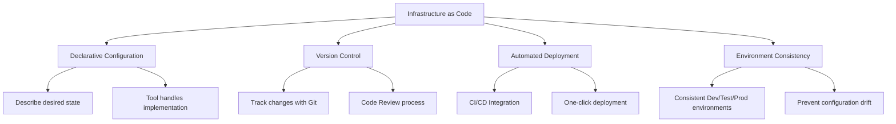
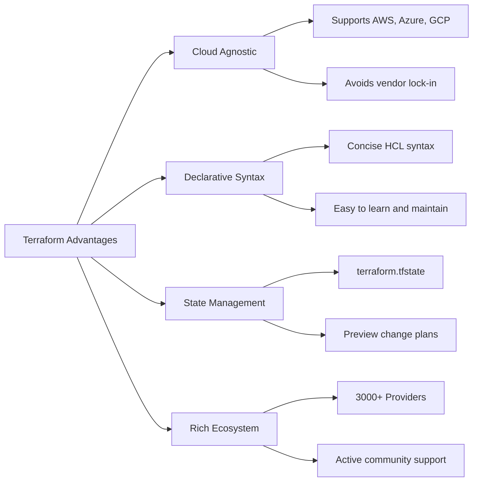

# Day 14 | Infrastructure as Code: Codifying and Version Controlling Infrastructure with Terraform

In modern development workflows, we can already build and maintain our virtual environment infrastructure through version-controlled documentation. This is an evolution to be thankful for.

Let's first review the difficulties of infrastructure management in the pre-IaC era:

**Scenario 1: The Nightmare of Manual Configuration**

```
Operations Engineer A: "I manually adjusted the database connection pool size in the production environment."
Operations Engineer B: "What? I didn't know. I also changed the network settings yesterday."
Development Team: "Why does the testing environment behave differently from the production environment?"

**Core Problems**:
- Configuration Drift
- Environment Inconsistency
- Difficulty in Tracking Changes
- Knowledge concentrated in individuals
```

**Scenario 2: The Uncertainty of Disaster Recovery**

```
3 AM, the production environment is down...

Team Leader: "How long until it's restored?"
Operations Engineer: "I need to rebuild all the services... maybe 6 hours?"
Team Leader: "Why so long?"
Operations Engineer: "Because I need to recall all the manual configuration steps..."

**Core Problems**:
- Unpredictable recovery time
- Lack of a standardized rebuilding process
- Over-reliance on personal memory
- Inability to quantify disaster recovery capabilities
```

**Scenario 3: The Bottleneck of Scaling Demands**

```
Product Manager: "We need to quickly expand to a new region."
DevOps: "How long will it take?"
Product Manager: "Preferably within a week."
DevOps: "A week? Just applying for resources takes three days, and configuring the environment takes another five..."

**Core Problems**:
- Manual processes slow down business pace
- Repetitive work wastes manpower
- Linear growth in scaling costs
- Inability to respond quickly to market demands
```

These IT horror stories are probably familiar to everyone to some extent. Similarly, I don't want us to become actors—or even the main characters—in them. Yesterday, we discussed cross-team collaboration design, establishing standards for API documentation and team collaboration. Today, let's shift our focus to the underlying infrastructure management and explore how to use the concept of Infrastructure as Code (IaC) with Terraform to codify and version control our infrastructure.

If yesterday's theme was **"getting the team to speak the same language and making it versionable,"** then today's theme is **"making infrastructure predictable, repeatable, and versionable."**

## The Core Concept of Infrastructure as Code

Infrastructure as Code (IaC) is a methodology for managing and provisioning infrastructure through code. It transforms traditionally manual infrastructure management tasks into versionable, repeatable, and executable code.

Imagine this: `From "building a custom villa by hand" to "designing a city that can be infinitely replicated."
In the past, managing servers and networks (i.e., "infrastructure") was like a master craftsman building a custom villa by hand.

- He relied on years of experience and memory to lay bricks, pull wires, and connect pipes.
- Want to add a window? He has to go to the site and knock down a wall.
- Want to build an identical one next door? He can only try to build it again from memory, but it's likely that some details, like the location of outlets or the brand of pipes, will be different.
- If the villa unfortunately catches fire (like Notre Dame), rebuilding would be a long nightmare because all the craftsmanship exists only in the master's head.

This is the world without IaC: manual, person-dependent, difficult to replicate, and full of uncertainty. The birth of IaC was not just to record all basic environment parameters and settings, but to manage them through version control. **We invented the "architectural blueprint" (Infrastructure as Code).**

We no longer lay bricks by hand. Instead, we focus on drawing an extremely detailed architectural blueprint. This blueprint is our "Code."

With it, we can easily:

- Describe the final state: The blueprint doesn't say "lay three bricks, then turn left." It directly declares, "I need a wall 3 meters high and 5 meters wide." We only describe **"What we want," not "How to do it."**
- Version Control: This blueprint (code) can be saved and modified like a Word document. Every change is recorded (e.g., using Git). We can clearly see who changed the window from square to round and when. This is "version control."
- Repeatability: With this blueprint, we can give it to any construction team, and they can build an identical villa. Want to build a hundred? Just give them a hundred copies of the blueprint.



**The Core Value Proposition of IaC**

1.  **Reproducibility**
    *   The same code produces the same result in any environment.
    *   Eliminates the "it works on my machine" problem.

2.  **Traceability**
    *   All infrastructure changes have a complete Git history.
    *   Can roll back to any configuration state at any time.

3.  **Testability**
    *   Infrastructure configurations can be unit-tested and integration-tested.
    *   Discover potential problems before deployment.

4.  **Collaboration**
    *   Infrastructure configuration becomes a shared team asset.
    *   Improve configuration quality through Code Review.

## In-depth Analysis of Terraform

We have the perfect blueprint (code), but who is responsible for the construction?

**Terraform is that super general contractor.** (And no, not Mario).

Among the many IaC tools, Terraform stands out for several reasons:



It perfectly implements the IaC philosophy, allowing us to use a single "blueprint" (code) to define, preview, and automatically build our digital kingdom in the cloud. It understands our blueprint (Terraform's HCL syntax) and communicates with all the building material suppliers in the world (like AWS, Google Cloud, Azure). When we hand over the blueprint, it doesn't start work immediately. Instead, it first provides a construction plan, telling us: "According to your blueprint, I will create a host, set up a database, configure the network..." We can review this plan to ensure everything is correct. Once confirmed, we tell it "Start work!", and it will automatically and precisely orchestrate all resources to build our infrastructure.

Finally, when we no longer need this building, we just need to tell the general contractor, and it can dismantle everything cleanly, leaving no construction debris behind.

We are not just learning a tool, but a more advanced, more reliable, and more scalable modern engineering method. We can finally transform from a hardworking bricklayer into a system architect focused on Domain practice.

### Terraform Core Concepts

#### 1. Providers

```hcl
# Define cloud providers
terraform {
  required_providers {
    aws = {
      source  = "hashicorp/aws"
      version = "~> 5.0"
    }
    kubernetes = {
      source  = "hashicorp/kubernetes"
      version = "~> 2.23"
    }
  }
}

# Configure the AWS Provider
provider "aws" {
  region = var.aws_region

  default_tags {
    tags = {
      Environment = var.environment
      Project     = var.project_name
      ManagedBy   = "terraform"
    }
  }
}
```

#### 2. Resources

```hcl
# Create a VPC
resource "aws_vpc" "main" {
  cidr_block           = var.vpc_cidr
  enable_dns_hostnames = true
  enable_dns_support   = true

  tags = {
    Name = "${var.project_name}-vpc"
  }
}

# Create a Subnet
resource "aws_subnet" "public" {
  count = length(var.availability_zones)

  vpc_id                  = aws_vpc.main.id
  cidr_block              = cidrsubnet(var.vpc_cidr, 8, count.index)
  availability_zone       = var.availability_zones[count.index]
  map_public_ip_on_launch = true

  tags = {
    Name = "${var.project_name}-public-subnet-${count.index + 1}"
    Type = "public"
  }
}
```

#### 3. Variables

```hcl
# variables.tf
variable "aws_region" {
  description = "AWS region for resources"
  type        = string
  default     = "ap-northeast-1"
}

variable "environment" {
  description = "Environment name"
  type        = string
  validation {
    condition     = contains(["dev", "staging", "prod"], var.environment)
    error_message = "Environment must be dev, staging, or prod."
  }
}

variable "instance_type" {
  description = "EC2 instance type"
  type        = string
  default     = "t3.micro"
}

variable "availability_zones" {
  description = "List of availability zones"
  type        = list(string)
  default     = ["ap-northeast-1a", "ap-northeast-1c", "ap-northeast-1d"]
}
```

#### 4. Outputs

```hcl
# outputs.tf
output "vpc_id" {
  description = "ID of the VPC"
  value       = aws_vpc.main.id
}

output "public_subnet_ids" {
  description = "IDs of the public subnets"
  value       = aws_subnet.public[*].id
}

output "load_balancer_dns" {
  description = "DNS name of the load balancer"
  value       = aws_lb.main.dns_name
  sensitive   = false
}
```

#### 5. Data Sources

```hcl
# Get the latest Amazon Linux AMI
data "aws_ami" "amazon_linux" {
  most_recent = true
  owners      = ["amazon"]

  filter {
    name   = "name"
    values = ["amzn2-ami-hvm-*-x86_64-gp2"]
  }

  filter {
    name   = "virtualization-type"
    values = ["hvm"]
  }
}

# Get current AWS account information
data "aws_caller_identity" "current" {}

# Get available zone information
data "aws_availability_zones" "available" {
  state = "available"
}
```

### Terraform Workflow

#### 1. Initialization Phase (terraform init)

```bash
# Initialize Terraform working directory
terraform init

# Upgrade Providers
terraform init -upgrade

# Specify backend configuration
terraform init -backend-config="bucket=my-terraform-state"
```

#### 2. Planning Phase (terraform plan)

```bash
# Generate execution plan
terraform plan

# Save the plan to a file
terraform plan -out=tfplan

# Plan for a specific environment
terraform plan -var-file="environments/prod.tfvars"
```

#### 3. Application Phase (terraform apply)

```bash
# Apply changes
terraform apply

# Use a saved plan
terraform apply tfplan

# Auto-approve (for CI/CD)
terraform apply -auto-approve
```

#### 4. Destruction Phase (terraform destroy)

```bash
# Destroy all resources
terraform destroy

# Destroy for a specific environment
terraform destroy -var-file="environments/dev.tfvars"
```

## Practical Case: A Complete Web Application Infrastructure

Let's demonstrate the practical application of Terraform with a complete case:

### Project Structure

```
terraform-web-app/
├── main.tf                 # Main resource definitions
├── variables.tf           # Variable definitions
├── outputs.tf            # Output definitions
├── terraform.tfvars      # Variable values
├── versions.tf           # Provider version constraints
├── modules/
│   ├── networking/       # Networking module
│   ├── compute/         # Compute module
│   ├── database/        # Database module
│   └── security/        # Security module
└── environments/
    ├── dev/
    ├── staging/
    └── prod/
```

### Main Configuration Files

#### main.tf

```hcl
# Local variable definitions
locals {
  common_tags = {
    Environment = var.environment
    Project     = var.project_name
    ManagedBy   = "terraform"
    Owner       = var.owner
  }
}

# Networking module
module "networking" {
  source = "./modules/networking"

  project_name       = var.project_name
  environment        = var.environment
  vpc_cidr          = var.vpc_cidr
  availability_zones = var.availability_zones

  tags = local.common_tags
}

# Security module
module "security" {
  source = "./modules/security"

  project_name = var.project_name
  environment  = var.environment
  vpc_id       = module.networking.vpc_id

  tags = local.common_tags
}

# Compute module
module "compute" {
  source = "./modules/compute"

  project_name          = var.project_name
  environment           = var.environment
  instance_type         = var.instance_type
  min_size             = var.min_size
  max_size             = var.max_size
  desired_capacity     = var.desired_capacity

  vpc_id               = module.networking.vpc_id
  private_subnet_ids   = module.networking.private_subnet_ids
  public_subnet_ids    = module.networking.public_subnet_ids
  security_group_ids   = [module.security.web_security_group_id]

  tags = local.common_tags
}

# Database module
module "database" {
  source = "./modules/database"

  project_name       = var.project_name
  environment        = var.environment
  engine_version     = var.db_engine_version
  instance_class     = var.db_instance_class
  allocated_storage  = var.db_allocated_storage

  vpc_id            = module.networking.vpc_id
  private_subnet_ids = module.networking.private_subnet_ids
  security_group_ids = [module.security.db_security_group_id]

  tags = local.common_tags
}
```

### Networking Module (modules/networking/main.tf)

```hcl
# VPC
resource "aws_vpc" "main" {
  cidr_block           = var.vpc_cidr
  enable_dns_hostnames = true
  enable_dns_support   = true

  tags = merge(var.tags, {
    Name = "${var.project_name}-${var.environment}-vpc"
  })
}

# Internet Gateway
resource "aws_internet_gateway" "main" {
  vpc_id = aws_vpc.main.id

  tags = merge(var.tags, {
    Name = "${var.project_name}-${var.environment}-igw"
  })
}

# Public Subnets
resource "aws_subnet" "public" {
  count = length(var.availability_zones)

  vpc_id                  = aws_vpc.main.id
  cidr_block              = cidrsubnet(var.vpc_cidr, 8, count.index)
  availability_zone       = var.availability_zones[count.index]
  map_public_ip_on_launch = true

  tags = merge(var.tags, {
    Name = "${var.project_name}-${var.environment}-public-subnet-${count.index + 1}"
    Type = "public"
  })
}

# Private Subnets
resource "aws_subnet" "private" {
  count = length(var.availability_zones)

  vpc_id            = aws_vpc.main.id
  cidr_block        = cidrsubnet(var.vpc_cidr, 8, count.index + 100)
  availability_zone = var.availability_zones[count.index]

  tags = merge(var.tags, {
    Name = "${var.project_name}-${var.environment}-private-subnet-${count.index + 1}"
    Type = "private"
  })
}

# NAT Gateways
resource "aws_eip" "nat" {
  count = length(var.availability_zones)

  domain = "vpc"

  tags = merge(var.tags, {
    Name = "${var.project_name}-${var.environment}-eip-${count.index + 1}"
  })

  depends_on = [aws_internet_gateway.main]
}

resource "aws_nat_gateway" "main" {
  count = length(var.availability_zones)

  allocation_id = aws_eip.nat[count.index].id
  subnet_id     = aws_subnet.public[count.index].id

  tags = merge(var.tags, {
    Name = "${var.project_name}-${var.environment}-nat-${count.index + 1}"
  })

  depends_on = [aws_internet_gateway.main]
}

# Route Tables
resource "aws_route_table" "public" {
  vpc_id = aws_vpc.main.id

  route {
    cidr_block = "0.0.0.0/0"
    gateway_id = aws_internet_gateway.main.id
  }

  tags = merge(var.tags, {
    Name = "${var.project_name}-${var.environment}-public-rt"
  })
}

resource "aws_route_table" "private" {
  count = length(var.availability_zones)

  vpc_id = aws_vpc.main.id

  route {
    cidr_block     = "0.0.0.0/0"
    nat_gateway_id = aws_nat_gateway.main[count.index].id
  }

  tags = merge(var.tags, {
    Name = "${var.project_name}-${var.environment}-private-rt-${count.index + 1}"
  })
}

# Route Table Associations
resource "aws_route_table_association" "public" {
  count = length(var.availability_zones)

  subnet_id      = aws_subnet.public[count.index].id
  route_table_id = aws_route_table.public.id
}

resource "aws_route_table_association" "private" {
  count = length(var.availability_zones)

  subnet_id      = aws_subnet.private[count.index].id
  route_table_id = aws_route_table.private[count.index].id
}
```

### Compute Module (modules/compute/main.tf)

```hcl
# Launch Template
resource "aws_launch_template" "web" {
  name_prefix   = "${var.project_name}-${var.environment}-"
  image_id      = data.aws_ami.amazon_linux.id
  instance_type = var.instance_type

  vpc_security_group_ids = var.security_group_ids

  user_data = base64encode(templatefile("${path.module}/user-data.sh", {
    environment = var.environment
  }))

  tag_specifications {
    resource_type = "instance"
    tags = merge(var.tags, {
      Name = "${var.project_name}-${var.environment}-web-server"
    })
  }

  lifecycle {
    create_before_destroy = true
  }
}

# Auto Scaling Group
resource "aws_autoscaling_group" "web" {
  name                = "${var.project_name}-${var.environment}-asg"
  vpc_zone_identifier = var.private_subnet_ids
  target_group_arns   = [aws_lb_target_group.web.arn]
  health_check_type   = "ELB"
  health_check_grace_period = 300

  min_size         = var.min_size
  max_size         = var.max_size
  desired_capacity = var.desired_capacity

  launch_template {
    id      = aws_launch_template.web.id
    version = "$Latest"
  }

  tag {
    key                 = "Name"
    value               = "${var.project_name}-${var.environment}-asg"
    propagate_at_launch = false
  }

  dynamic "tag" {
    for_each = var.tags
    content {
      key                 = tag.key
      value               = tag.value
      propagate_at_launch = false
    }
  }
}

# Application Load Balancer
resource "aws_lb" "web" {
  name               = "${var.project_name}-${var.environment}-alb"
  internal           = false
  load_balancer_type = "application"
  security_groups    = var.security_group_ids
  subnets            = var.public_subnet_ids

  enable_deletion_protection = var.environment == "prod" ? true : false

  tags = var.tags
}

# Target Group
resource "aws_lb_target_group" "web" {
  name     = "${var.project_name}-${var.environment}-tg"
  port     = 80
  protocol = "HTTP"
  vpc_id   = var.vpc_id

  health_check {
    enabled             = true
    healthy_threshold   = 2
    interval            = 30
    matcher             = "200"
    path                = "/health"
    port                = "traffic-port"
    protocol            = "HTTP"
    timeout             = 5
    unhealthy_threshold = 2
  }

  tags = var.tags
}

# Listener
resource "aws_lb_listener" "web" {
  load_balancer_arn = aws_lb.web.arn
  port              = "80"
  protocol          = "HTTP"

  default_action {
    type             = "forward"
    target_group_arn = aws_lb_target_group.web.arn
  }
}
```

### Environment-Specific Configurations

#### environments/prod/terraform.tfvars

```hcl
# Project basic information
project_name = "my-web-app"
environment  = "prod"
owner        = "devops-team"

# Network configuration
aws_region         = "ap-northeast-1"
vpc_cidr          = "10.0.0.0/16"
availability_zones = ["ap-northeast-1a", "ap-northeast-1c", "ap-northeast-1d"]

# Compute resource configuration
instance_type    = "t3.medium"
min_size        = 2
max_size        = 10
desired_capacity = 3

# Database configuration
db_engine_version    = "13.7"
db_instance_class    = "db.t3.medium"
db_allocated_storage = 100
```

#### environments/dev/terraform.tfvars

```hcl
# Project basic information
project_name = "my-web-app"
environment  = "dev"
owner        = "dev-team"

# Network configuration
aws_region         = "ap-northeast-1"
vpc_cidr          = "10.1.0.0/16"
availability_zones = ["ap-northeast-1a", "ap-northeast-1c"]

# Compute resource configuration
instance_type    = "t3.micro"
min_size        = 1
max_size        = 3
desired_capacity = 1

# Database configuration
db_engine_version    = "13.7"
db_instance_class    = "db.t3.micro"
db_allocated_storage = 20
```

## Advanced Topics: Terraform Best Practices

### 1. State Management

#### Remote State Backend Configuration

```hcl
# backend.tf
terraform {
  backend "s3" {
    bucket         = "my-terraform-state-bucket"
    key            = "environments/prod/terraform.tfstate"
    region         = "ap-northeast-1"
    encrypt        = true
    dynamodb_table = "terraform-state-lock"
  }
}
```

#### State Locking and Team Collaboration

```hcl
# DynamoDB table for state locking
resource "aws_dynamodb_table" "terraform_state_lock" {
  name           = "terraform-state-lock"
  billing_mode   = "PAY_PER_REQUEST"
  hash_key       = "LockID"

  attribute {
    name = "LockID"
    type = "S"
  }

  tags = {
    Name        = "Terraform State Lock Table"
    Environment = "all"
  }
}
```

### 2. Workspace Management

```bash
# Create a new workspace
terraform workspace new dev
terraform workspace new staging
terraform workspace new prod

# Switch workspace
terraform workspace select prod

# List all workspaces
terraform workspace list

# Conditional configuration based on workspace
locals {
  environment_config = {
    dev = {
      instance_type = "t3.micro"
      min_size     = 1
      max_size     = 2
    }
    staging = {
      instance_type = "t3.small"
      min_size     = 1
      max_size     = 3
    }
    prod = {
      instance_type = "t3.medium"
      min_size     = 2
      max_size     = 10
    }
  }

  current_env = local.environment_config[terraform.workspace]
}
```

### 3. Modular Design Principles

#### Module Structure Best Practices

```
modules/
├── networking/
│   ├── main.tf
│   ├── variables.tf
│   ├── outputs.tf
│   └── README.md
├── compute/
│   ├── main.tf
│   ├── variables.tf
│   ├── outputs.tf
│   ├── user-data.sh
│   └── README.md
└── database/
    ├── main.tf
    ├── variables.tf
    ├── outputs.tf
    └── README.md
```

#### Module Versioning

```hcl
# Module versioning using Git tags
module "networking" {
  source = "git::https://github.com/company/terraform-modules.git//networking?ref=v1.2.0"

  # Module input parameters...
}

# Using the Terraform Registry
module "vpc" {
  source  = "terraform-aws-modules/vpc/aws"
  version = "~> 3.0"

  # Module input parameters...
}
```

### 4. Security Best Practices

#### Sensitive Data Management

```hcl
# Using AWS Secrets Manager
data "aws_secretsmanager_secret" "db_password" {
  name = "${var.project_name}-${var.environment}-db-password"
}

data "aws_secretsmanager_secret_version" "db_password" {
  secret_id = data.aws_secretsmanager_secret.db_password.id
}

# Using sensitive data in resources
resource "aws_db_instance" "main" {
  # ... other configurations ...

  password = jsondecode(data.aws_secretsmanager_secret_version.db_password.secret_string)["password"]

  # Prevent password from appearing in plan output
  lifecycle {
    ignore_changes = [password]
  }
}

# Mark Output as sensitive
output "database_endpoint" {
  value     = aws_db_instance.main.endpoint
  sensitive = true
}
```

#### IAM Role Least Privilege Principle

```hcl
# EC2 execution role
resource "aws_iam_role" "ec2_role" {
  name = "${var.project_name}-${var.environment}-ec2-role"

  assume_role_policy = jsonencode({
    Version = "2012-10-17"
    Statement = [
      {
        Action = "sts:AssumeRole"
        Effect = "Allow"
        Principal = {
          Service = "ec2.amazonaws.com"
        }
      }
    ]
  })
}

# Specific permission policy
resource "aws_iam_role_policy" "ec2_policy" {
  name = "${var.project_name}-${var.environment}-ec2-policy"
  role = aws_iam_role.ec2_role.id

  policy = jsonencode({
    Version = "2012-10-17"
    Statement = [
      {
        Effect = "Allow"
        Action = [
          "s3:GetObject",
          "s3:PutObject"
        ]
        Resource = [
          "${aws_s3_bucket.app_bucket.arn}/*"
        ]
      },
      {
        Effect = "Allow"
        Action = [
          "cloudwatch:PutMetricData",
          "logs:CreateLogGroup",
          "logs:CreateLogStream",
          "logs:PutLogEvents"
        ]
        Resource = "*"
      }
    ]
  })
}
```

### 5. CI/CD Integration

#### GitHub Actions Workflow

```yaml
# .github/workflows/terraform.yml
name: "Terraform CI/CD"

on:
  push:
    branches: [main, develop]
  pull_request:
    branches: [main]

env:
  TF_VERSION: 1.5.0
  AWS_REGION: ap-northeast-1

jobs:
  terraform:
    name: "Terraform"
    runs-on: ubuntu-latest

    strategy:
      matrix:
        environment: [dev, staging, prod]

    steps:
      - name: Checkout
        uses: actions/checkout@v3

      - name: Setup Terraform
        uses: hashicorp/setup-terraform@v2
        with:
          terraform_version: ${{ env.TF_VERSION }}

      - name: Configure AWS credentials
        uses: aws-actions/configure-aws-credentials@v2
        with:
          aws-access-key-id: ${{ secrets.AWS_ACCESS_KEY_ID }}
          aws-secret-access-key: ${{ secrets.AWS_SECRET_ACCESS_KEY }}
          aws-region: ${{ env.AWS_REGION }}

      - name: Terraform Format Check
        run: terraform fmt -check -recursive

      - name: Terraform Init
        run: |
          terraform init \
            -backend-config="bucket=${{ secrets.TF_STATE_BUCKET }}" \
            -backend-config="key=environments/${{ matrix.environment }}/terraform.tfstate"

      - name: Terraform Validate
        run: terraform validate

      - name: Terraform Plan
        run: |
          terraform plan \
            -var-file="environments/${{ matrix.environment }}.tfvars" \
            -out=tfplan-${{ matrix.environment }}

      - name: Terraform Apply (Production)
        if: github.ref == 'refs/heads/main' && matrix.environment == 'prod'
        run: terraform apply tfplan-${{ matrix.environment }}

      - name: Terraform Apply (Non-Production)
        if: github.ref == 'refs/heads/develop' && matrix.environment != 'prod'
        run: terraform apply tfplan-${{ matrix.environment }}
```

### 6. Monitoring and Observability

#### CloudWatch Integration

```hcl
# CloudWatch Log Groups
resource "aws_cloudwatch_log_group" "app_logs" {
  name              = "/aws/ec2/${var.project_name}-${var.environment}"
  retention_in_days = var.environment == "prod" ? 30 : 7

  tags = var.tags
}

# Custom Metrics
resource "aws_cloudwatch_metric_alarm" "application_errors" {
  alarm_name          = "${var.project_name}-${var.environment}-app-errors"
  comparison_operator = "GreaterThanThreshold"
  evaluation_periods  = "2"
  metric_name         = "ApplicationErrors"
  namespace           = "Custom/Application"
  period              = "300"
  statistic           = "Sum"
  threshold           = "10"
  alarm_description   = "This metric monitors application errors"

  alarm_actions = [aws_sns_topic.alerts.arn]

  tags = var.tags
}

# SNS Topic for Alerts
resource "aws_sns_topic" "alerts" {
  name = "${var.project_name}-${var.environment}-alerts"

  tags = var.tags
}

resource "aws_sns_topic_subscription" "email_alerts" {
  topic_arn = aws_sns_topic.alerts.arn
  protocol  = "email"
  endpoint  = var.alert_email
}
```

### 7. Cost Optimization

#### Resource Tagging Strategy

```hcl
# Unified tagging strategy
locals {
  required_tags = {
    Environment   = var.environment
    Project      = var.project_name
    Owner        = var.owner
    CostCenter   = var.cost_center
    CreatedBy    = "terraform"
    CreatedDate  = formatdate("YYYY-MM-DD", timestamp())
  }

  optional_tags = var.additional_tags

  all_tags = merge(local.required_tags, local.optional_tags)
}

# Apply tags to all resources
resource "aws_instance" "web" {
  # ... other configurations ...

  tags = local.all_tags
}
```

#### Spot Instance Integration

```hcl
# Mixed Instance Policy for Cost Optimization
resource "aws_autoscaling_group" "web" {
  name                = "${var.project_name}-${var.environment}-asg"
  vpc_zone_identifier = var.private_subnet_ids
  target_group_arns   = [aws_lb_target_group.web.arn]

  min_size         = var.min_size
  max_size         = var.max_size
  desired_capacity = var.desired_capacity

  mixed_instances_policy {
    launch_template {
      launch_template_specification {
        launch_template_id = aws_launch_template.web.id
        version           = "$Latest"
      }

      override {
        instance_type = "t3.medium"
      }
      override {
        instance_type = "t3a.medium"
      }
      override {
        instance_type = "t2.medium"
      }
    }

    instances_distribution {
      on_demand_base_capacity                  = 1
      on_demand_percentage_above_base_capacity = 25
      spot_allocation_strategy                 = "diversified"
    }
  }
}
```

## Building a Sustainable Technical Foundation

The implementation of Infrastructure as Code through Terraform has brought revolutionary changes to modern software development. We started from the pain points of traditional manual operations, delved into the core concepts of IaC, the in-depth application of Terraform, and a complete practical case.

### Reaffirming Core Values

**Technological Transformation**:

-   **Repeatability**: Eliminates the "environment snowflake" problem, ensuring infrastructure consistency.
-   **Traceability**: Achieves complete tracking of infrastructure changes through Git version control.
-   **Testability**: Infrastructure configurations can be automatically tested and validated.
-   **Collaboration**: Infrastructure becomes a shared team asset, supporting multi-person collaborative development.

**Organizational Impact**:

-   **Increased Efficiency**: Automation replaces manual operations, significantly shortening deployment times.
-   **Reduced Risk**: Standardized processes reduce human error and configuration drift.
-   **Business Agility**: Quickly respond to business needs, supporting rapid scaling and deployment.
-   **Cost Optimization**: Achieve precise cost control by managing resources through code.

### Key Implementation Factors

#### 1. Incremental Adoption Strategy

Don't try to migrate all infrastructure to Terraform at once. Instead:

-   Start adopting IaC with new projects.
-   Select an existing service of moderate complexity for a migration pilot.
-   Gradually build the team's Terraform expertise.
-   Establish a standardized module library and best practice guidelines.

#### 2. Building a Collaborative Team Culture

-   Establish a Code Review culture to ensure the quality of infrastructure changes.
-   Develop a clear Git workflow and branching strategy.
-   Regularly conduct Terraform knowledge sharing and training.
-   Build a cross-team IaC community to promote experience sharing.

#### 3. Toolchain Integration Ecosystem

-   CI/CD pipeline integration to achieve automated deployment.
-   Integration of monitoring and observability tools.
-   Automation of security scanning and compliance checks.
-   Integration of cost management and optimization tools.

### The Mindset Shift from Manual Ops to Code Ops

When we shift from "manually configuring servers" to "writing infrastructure code," we are actually undergoing a fundamental mindset upgrade:

**Traditional Mindset**: "I need a server to run my application."
**IaC Mindset**: "I need to define a repeatable, maintainable, and scalable computing environment."

This mindset shift brings not only changes in technical implementation but also a rethinking of the entire software delivery process. We begin to treat infrastructure as part of the software product, applying software engineering best practices to manage it.

### Future Outlook: Infrastructure as Software

As the Terraform ecosystem continues to evolve, we are witnessing the rise of "Infrastructure as Software":

-   **Smarter Resource Management**: AI-assisted resource optimization and cost forecasting.
-   **Deeper Cloud Integration**: Further improvements in multi-cloud management and cloud agnosticism.
-   **More Powerful Policy as Code**: Automated checks for security and compliance requirements.
-   **Better Developer Experience**: IDE integration, syntax highlighting, real-time validation.

Implementing Infrastructure as Code with Terraform is not just a technological choice, but a strategic decision to invest in the future. Every line of Terraform code, every module design, every optimization of state management is building a more resilient and agile technical foundation for the team and organization.

The next time you need to expand to a new region, the next time you need to recover from a disaster quickly, the next time a new team member needs to understand the system architecture, these investments in Infrastructure as Code will yield huge compound returns.

**Terraform allows us to be not just "engineers who maintain infrastructure," but "architects who design sustainable systems."**

This is the true value of Infrastructure as Code: it makes infrastructure predictable, repeatable, and evolvable, laying a solid foundation for modern software development. In this rapidly changing technological environment, mastering IaC is no longer an option, but a necessity—it is a core competency that every modern software team should possess.
