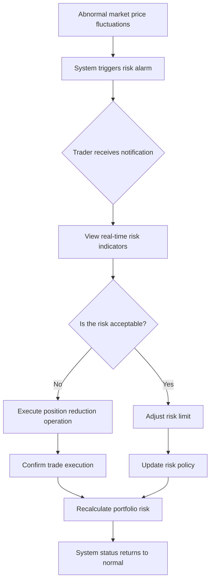
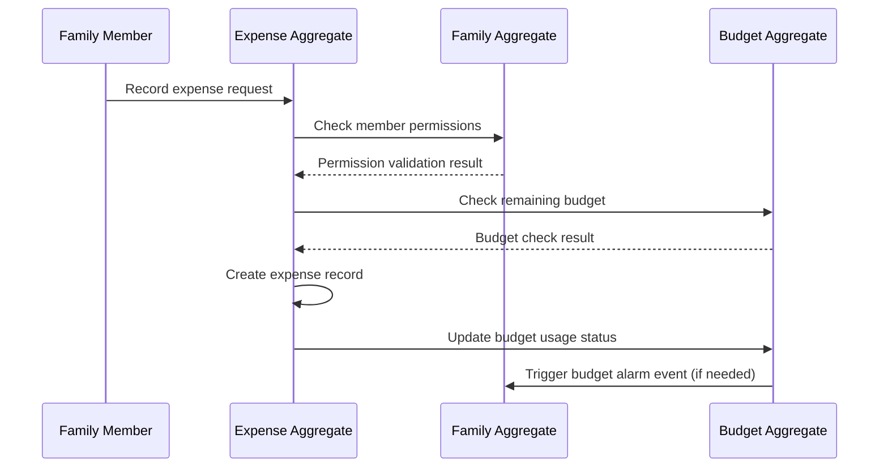
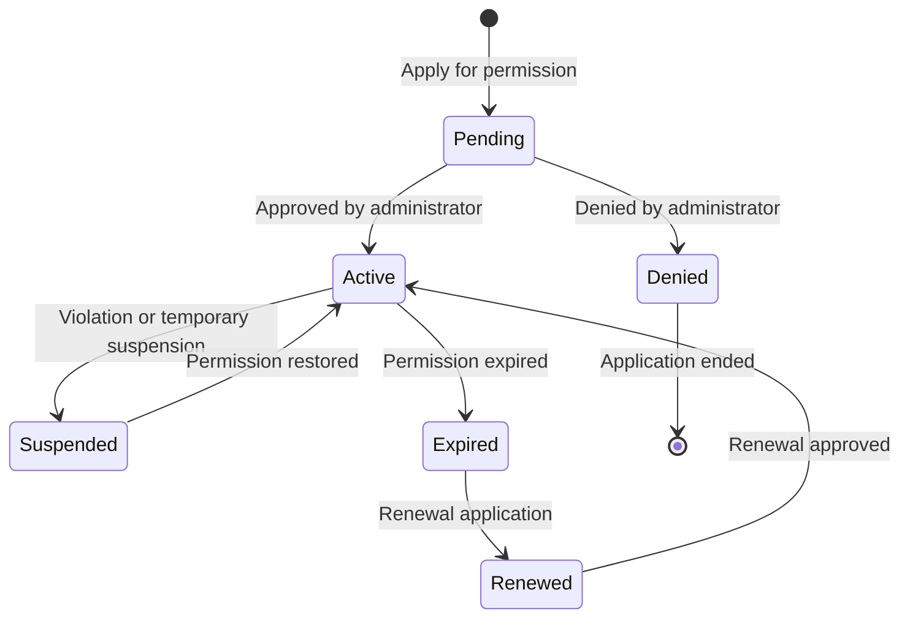

# Day 5 | User's System Operation Scenarios - User Story and Scenario Flow

Yesterday, we completed the design of domain aggregates and established the static structure of business logic. But aggregates are just a conceptual framework, the real value lies in **how users interact with these business concepts**.

Today, we need to solve a key problem: **How to transform abstract aggregate boundaries into a concrete user operation experience?**

This is not just a matter of User Story writing skills, but a **philosophical transformation from a system perspective to a user perspective**. We need to make complex business logic intuitive and operable, while providing clear technical requirements for tomorrow's AWS service selection.

## The Ontology of User Story: From Function to Experience

### Redefining the Value of User Story

Traditional User Stories often stop at functional descriptions:

```
As an investor, I want to view my holdings so that I can understand my current investment situation.
```

But a User Story based on DDD aggregate design should reflect **business value and operational context**:

```
As a professional trader, I need to get a complete risk analysis of my holdings within 30 seconds,
so that I can quickly make decisions to increase or decrease my position when the market fluctuates,
ensuring that my portfolio risk is always within a controllable range.
```

The differences are:

- **Role concretization**: From "investor" to "professional trader"
- **Time constraint**: A clear performance requirement of 30 seconds
- **Business goal**: Risk control rather than just information viewing
- **Operational context**: Quick decision-making under market fluctuations

### The Three-Layer Architecture of User Story

**Layer 1: Role Identification Layer** - Role definition based on aggregate ownership
**Layer 2: Operational Context Layer** - Scene design based on aggregate state changes
**Layer 3: Technical Constraint Layer** - System limitations based on non-functional requirements

Let's use the six cases for an in-depth analysis:

## Case 1: User Story Design for the Investment Trading System

### Role System Based on the Portfolio Aggregate

Yesterday, we designed the Portfolio aggregate. Today, we need to define user roles based on this aggregate:

```typescript
// Portfolio aggregate review
class Portfolio {
  private portfolioId: PortfolioId;
  private traderId: TraderId; // ← Basis for role identification
  private holdings: Holdings[];
  private riskLimit: RiskLimit; // ← Embodiment of role permissions
}
```

**Role Permission Matrix**:

| Role | Portfolio Ownership | Operation Permissions | Technical Requirements |
| --- | --- | --- | --- |
| **Primary Trader** | Full ownership | CRUD all operations | < 100ms response |
| **Risk Manager** | Read-only access | View + risk adjustment | Real-time monitoring |
| **Compliance Officer** | Audit access | View + report generation | Historical data access |
| **System Admin** | Technical access | System status management | Operations dashboard |

### Epic Decomposition: From Aggregate Capabilities to User Stories

**Epic: Portfolio Management**

Based on the core capabilities of the Portfolio aggregate, we decompose the following User Stories:

**Story 1: Real-time Holdings Viewing**

```
As a professional trader,
I need to view my real-time holdings status and profit/loss situation at any time,
so that I can quickly assess my current investment performance and risk exposure.

Acceptance Criteria:
- Holdings data latency does not exceed 5 seconds
- Includes real-time profit/loss calculation
- Supports multi-currency display
- Can be grouped by asset class or region

Technical Constraints:
- API response time < 100ms
- Supports 2000+ concurrent queries
- Data consistency requirement: Strong consistency
```

**Story 2: Risk Limit Management**

```
As a professional trader,
I need to set and adjust my portfolio risk limits,
so that I can ensure my trading behavior is in line with my risk tolerance and investment strategy.

Acceptance Criteria:
- Can set total position limit, single-stock weight limit, and industry concentration limit
- Modification effective time < 1 minute
- Provides real-time warnings for risk limit violations
- Supports limit settings for different time periods (day/week/month)

Technical Constraints:
- Setting changes require strong consistency
- Risk calculation latency < 200ms
- Supports complex multi-dimensional risk rules
```

**Story 3: Fast Trade Execution**

```
As a professional trader,
I need to execute trade orders immediately when market opportunities arise,
so that I can seize fleeting price advantages and maximize investment returns.

Acceptance Criteria:
- Time from order placement to confirmation < 2 seconds
- Supports market orders and limit orders
- Automatic risk check before trading
- Provides clear error messages on execution failure

Technical Constraints:
- Trading system high availability > 99.99%
- Supports peak trading volume of 5000 TPS
- Integration with external brokerage APIs
```

### Scenario Design for Operational Flows

**Scenario: Rapid Risk Adjustment under Abnormal Market Fluctuations**



**User Story Set Corresponding to the Scenario**:

- Risk monitoring and alarming (background automatic execution)
- Real-time risk indicator viewing (query operation)
- Fast position reduction trading (write operation)
- Risk policy adjustment (configuration operation)

Each operation corresponds to different technical requirements, providing a basis for tomorrow's AWS service selection.

## Case 2: Collaborative User Story for the Family Financial System

### Complex Role Design Based on Multi-Aggregate Collaboration

Yesterday, we designed three aggregates: Family, Budget, and Expense. Today, we need to handle the collaboration scenarios between them:

**User Story Pattern for Multi-Role Collaboration**:

**Story: Collaborative Management of Family Budget**

```
As the head of family finance,
I need to set spending permissions and budget limits for different family members,
so that while maintaining family financial transparency, I can ensure that spending behavior is within a controllable range.

Primary Actor: Head of family finance
Secondary Actors:
- Family members (managed)
- System automation service (budget monitoring)

Main Flow:
1. The head sets the total monthly family budget (Family aggregate)
2. Assigns spending limits and category permissions to each member (Family aggregate → Budget aggregate)
3. The system sends permission setting notifications to relevant members (cross-aggregate event)
4. Members start recording expenses within their authorized scope (Expense aggregate)
5. The system monitors budget usage in real time (Budget aggregate monitoring)
6. Automatically notifies relevant personnel when the budget is close to the limit (event-driven notification)

Technical Constraints:
- Strong consistency of permission settings (to avoid race conditions for overspending)
- High concurrency of expense recording (multiple members recording at the same time)
- Near real-time budget monitoring (latency < 5 minutes is acceptable)
```

### State Management of the Permission Matrix

**Permission State Design of the Family Aggregate**:

```typescript
class FamilyMember {
  constructor(
    public memberId: MemberId,
    public role: FamilyRole, // ADMIN | MEMBER | CHILD
    public spendingLimit: Money, // Spending permission
    public categories: Category[], // Spendable categories
    public status: MemberStatus // ACTIVE | SUSPENDED | PENDING
  ) {}
}

enum FamilyRole {
  ADMIN = "ADMIN", // Can set all rules
  MEMBER = "MEMBER", // Can record expenses, view their own data
  CHILD = "CHILD", // Restricted spending permission
}
```

**Cross-Aggregate Permission Check Flow**:



## Case 3: Data-driven Story for the Health Monitoring System

### State Scenarios Based on Time-Series Data

The health monitoring system has unique data characteristics: the coexistence of **continuity** and **abnormality**.

**Story: Intelligent Processing of Abnormal Data**

```
As a health monitoring user,
I need the system to automatically identify my abnormal health data and provide corresponding suggestions and warnings,
so that I can adjust my lifestyle habits or seek medical attention in a timely manner to ensure the continuous improvement of my health.

Complex Scenarios:
- Normal data: Automatic recording, periodic analysis
- Borderline data: The system reminds the user to confirm
- Abnormal data: Immediate warning, suggested action
- Continuous abnormality: Escalated warning, suggested medical attention

State Transition Scenarios:
Normal → Borderline → User confirmation or system automatic judgment → Normal/Abnormal
Abnormal → Continuous monitoring → Persistent abnormality/Return to normal
Persistent abnormality → Suggested medical attention → Pending/Processed
```

**Technical Challenges of Concurrent Multi-State**:

```typescript
// State management of the HealthProfile aggregate
class HealthMetric {
  constructor(
    public metricType: MetricType,
    public currentValue: number,
    public status: HealthStatus,
    public trend: TrendAnalysis,
    public alertLevel: AlertLevel
  ) {}
}

enum HealthStatus {
  NORMAL = "NORMAL",
  BORDERLINE = "BORDERLINE",
  ABNORMAL = "ABNORMAL",
  CRITICAL = "CRITICAL",
}

enum AlertLevel {
  NONE = "NONE",
  INFO = "INFO", // Data recording notification
  WARNING = "WARNING", // Borderline value warning
  URGENT = "URGENT", // Abnormal value urgent notification
}
```

## Role Management: Permission Architecture Based on Aggregates

### DDD Principles for Permission Design

**Principle 1: Aggregate ownership determines basic permissions**

- The Owner of the Portfolio aggregate has full control
- The Admin of the Family aggregate has member management rights
- The Owner of the HealthProfile aggregate has data control rights

**Principle 2: Cross-aggregate operations require explicit authorization**

- Operations on the Order aggregate require authorization from the Portfolio aggregate
- Creation of an Expense aggregate requires authorization from the Family aggregate
- Creation of a DeviceReading aggregate requires authorization from the HealthProfile aggregate

**Principle 3: Role permissions correspond to business logic**

```typescript
// Permission design based on aggregates
interface Permission {
  aggregateType: string;
  aggregateId: string;
  operations: Operation[];
  constraints: Constraint[];
}

interface Operation {
  type: "CREATE" | "READ" | "UPDATE" | "DELETE";
  fields?: string[]; // Field-level permissions
  conditions?: string[]; // Conditional restrictions
}

// Actual permission configuration
const traderPermissions: Permission[] = [
  {
    aggregateType: "Portfolio",
    aggregateId: "portfolio-123",
    operations: [
      { type: "READ", fields: ["*"] },
      { type: "UPDATE", fields: ["holdings", "riskLimit"] },
      { type: "CREATE", fields: ["tradeOrder"] },
    ],
    constraints: [
      "trading_hours_only",
      "risk_limit_check",
      "compliance_approval_for_large_orders",
    ],
  },
  {
    aggregateType: "Order",
    aggregateId: "*", // Can operate on all orders created by oneself
    operations: [
      { type: "READ", fields: ["*"] },
      {
        type: "UPDATE",
        fields: ["status"],
        conditions: ["only_pending_orders"],
      },
    ],
    constraints: ["no_modification_after_submission"],
  },
];
```

### State Management of Dynamic Permissions

**Lifecycle of Permission State**:



**Considerations for Technical Implementation**:

- Real-time effectiveness of permission changes (strong consistency requirement)
- High performance of permission checks (checked for every API call)
- Traceability of permission history (compliance and audit requirements)

## Status Scenario: Operational Scenarios Driven by Aggregate State

### Design Methodology for State Scenarios

The state change of each aggregate will produce a corresponding user operation scenario:

**State Scenario Analysis for the Investment Trading System**:

```mermaid
graph TB
    subgraph "Portfolio Aggregate State"
        PS1[Empty Portfolio] --> PS2[Active Portfolio]
        PS2 --> PS3[Risk-exceeded Portfolio]
        PS3 --> PS2
        PS2 --> PS4[Liquidating Portfolio]
        PS4 --> PS1
    end

    subgraph "Order Aggregate State"
        OS1[Draft] --> OS2[Submitted]
        OS2 --> OS3[Executing]
        OS2 --> OS4[Rejected]
        OS3 --> OS5[Executed]
        OS3 --> OS6[Partially Executed]
        OS6 --> OS5
    end

    subgraph "Cross-Aggregate Coordination"
        PS2 -.-> OS1: Create trade
        OS5 -.-> PS2: Update holdings
        PS3 -.-> OS4: Reject high-risk trade
    end
```

**User Story for Each State**:

**Portfolio Empty → Active**:

```
Story: Initialize Investment Portfolio
As a new user, I need to set my initial funds and risk preference,
so that I can start my investment activities.

Operational Flow:
1. Set initial cash amount
2. Configure risk limit parameters
3. Select an investment strategy template
4. Confirm portfolio initialization

Technical Requirements:
- Atomicity of the initialization operation
- Reasonableness validation of risk parameters
- Friendliness of the user guidance flow
```

**Active Portfolio → Risk-exceeded Portfolio**:

```
Story: Automatic Handling of Risk Exceedance
As the system, I need to automatically take protective measures when the portfolio risk is exceeded,
so that I can reduce the user's potential losses.

Automation Flow:
1. Real-time monitoring of portfolio risk indicators
2. Identification of risk exceedance situations
3. Suspension of high-risk trading permissions
4. Notification to the user and risk control personnel
5. Provision of risk reduction suggestions

Technical Requirements:
- Real-time risk calculation (< 30 seconds)
- Immediate effect of permission control
- Reliability of multi-channel notifications
```

### Handling Strategy for Complex State Scenarios

**Multi-Role State Coordination in the Family Financial System**:

```
Scenario: Family coordination when the budget is nearly exhausted
Initial State: Family budget has 10% remaining
Trigger Condition: Any member attempts to record a large expense

State Transition Flow:
1. The Budget aggregate detects that the budget is tight
2. The system suspends the spending permissions of all members
3. Notifies the family administrator to handle the budget adjustment
4. The administrator chooses to: Increase the budget OR maintain the limit
5. The system updates the permissions of all members according to the decision
6. Resumes the normal spending process

Technical Challenges of Cross-Aggregate Coordination:
- Consistency guarantee of multi-aggregate state
- Atomic operation of permission changes
- Reliability mechanism for state recovery
```

## Providing a Requirements Basis for AWS Service Selection

### Mapping from User Stories to Technical Constraints

Through today's User Story analysis, we have provided clear technical requirements for tomorrow's AWS service selection:

**High-frequency Real-time Operation Requirements** (Investment Trading):

- API response time: < 100ms
- Concurrency support: 2000+ TPS
- Availability requirement: 99.99%
- Data consistency: Strong consistency

→ **To be discussed tomorrow**: Selection criteria for Lambda vs ECS

**Collaborative Data Operation Requirements** (Family Finance):

- Multi-user concurrency: Medium frequency but requires conflict handling
- Permission check: Required for every operation
- Data consistency: Eventual consistency is acceptable
- Cost-sensitive: Family users are price-sensitive

→ **To be discussed tomorrow**: Cost optimization strategy for ALB + Auto Scaling

**Data-intensive Processing Requirements** (Health Monitoring):

- Data ingestion: Continuous data stream from IoT devices
- Storage requirement: Long-term preservation of time-series data
- Analysis requirement: Trend analysis and anomaly detection
- Geographical distribution: Users are distributed in different regions

→ **To be discussed tomorrow**: Trade-offs of CDN + Multi-Region deployment

### The Impact of Operation Modes on Architectural Patterns

**Synchronous operation mode** → Requires low-latency services
**Asynchronous operation mode** → Can accept higher latency
**Batch operation mode** → Requires high-throughput services
**Real-time collaboration mode** → Requires a state synchronization mechanism

Each operation mode corresponds to a different combination of AWS services, which will be the core of tomorrow's discussion.

## Preview of Tomorrow's Technical Selection

Based on the User Stories and operational scenario analysis established today, tomorrow we will have an in-depth discussion on:

### 🏗️ The Art of Trade-offs in Service Selection

**Lambda vs ECS**:

- When to choose Serverless? When to choose Container?
- A selection matrix based on operation frequency and response time

**ALB vs API Gateway**:

- How do different load patterns affect the choice?
- Detailed comparison and analysis of cost models

**Regional vs Global Deployment**:

- How does user distribution affect the architectural strategy?
- Use cases for CDN and edge computing

### 💰 Cost Control Strategies

**Instance Type Optimization**:

- Risk assessment of Spot Instances
- Commitment strategy for Reserved Instances
- The elastic balance of On-Demand

**DDoS Protection Levels**:

- Protection requirements for different business scenarios
- The choice between Shield Standard vs Shield Advanced

## Today's Design Takeaways

- **User Stories are the concrete expression of aggregate capabilities**: A good Story reflects the business value of the aggregate
- **Role permissions are designed based on aggregate boundaries**: Technical permissions should correspond to business concepts
- **State scenarios drive the operational experience**: Each state transition is a user journey
- **Operational context determines technical selection**: Different usage patterns require different technical strategies

Remember: What we established today is not a feature list, but a complete description of the operational experience. These descriptions will directly drive tomorrow's technical architecture decisions, ensuring that the AWS services we choose can truly meet the user's operational needs.

---

> "A User Story is not a list of features, but a design of experience. Each Story is a complete scenario of user interaction with the system's aggregates, and the technical requirements of these scenarios will determine our architectural choices."