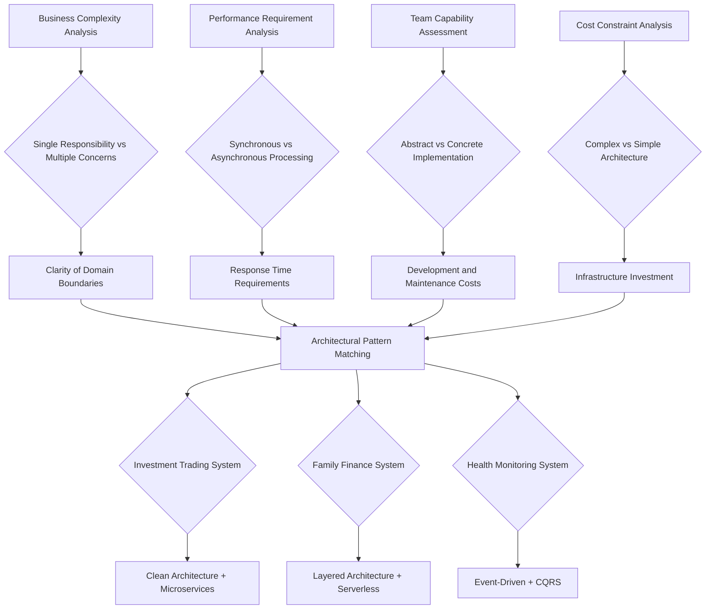
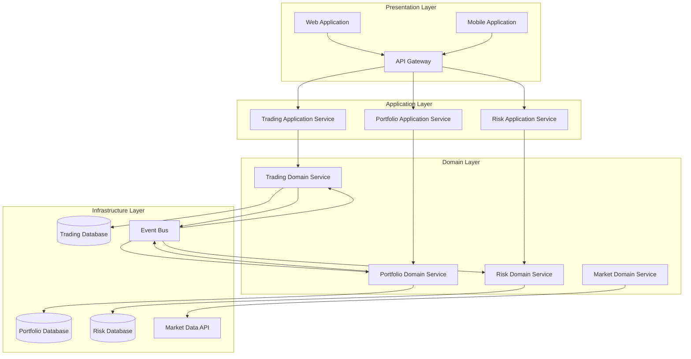
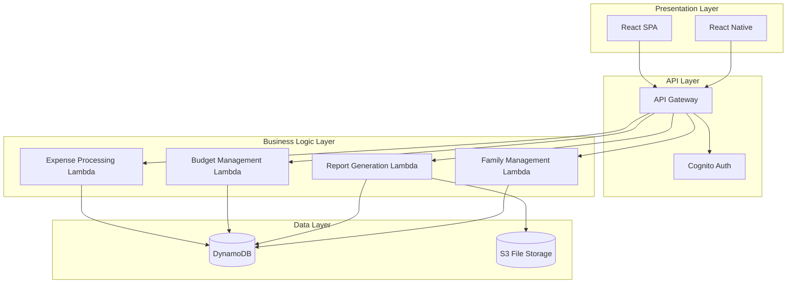
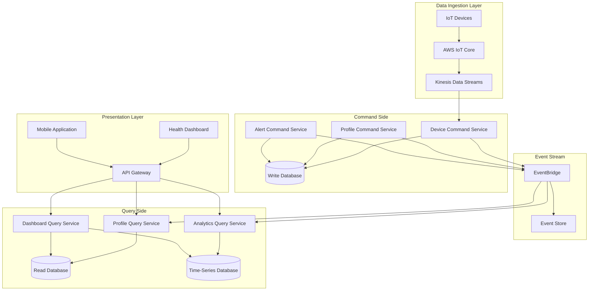
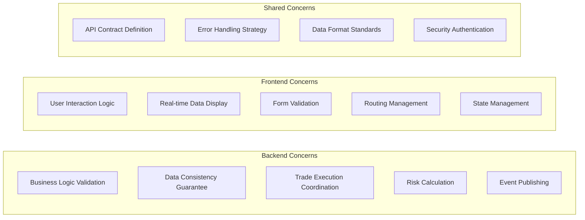

# Day 7 | Drawing Your First System Blueprint: Architecture Selection and Design

After six days of in-depth analysis, we have established a complete design foundation: from philosophical thinking to domain modeling, from user needs to service selection. The core problem to be solved today is:

**How to integrate all these analyses into an executable system architecture blueprint?**

This is not just a technical problem of drawing diagrams, but a matter of **system engineering from abstract thinking to concrete implementation**. Every architectural decision must have a clear deductive logic, and every technology choice must serve business goals.

## A Systematic Methodology for Architecture Selection

### Deductive Logic from Requirement-Driven to Architectural Patterns

Based on the analysis of the past six days, we have established a **decision framework for selecting architectural patterns**:



### Architecture Adaptability Assessment Matrix

Based on the previous User Story analysis and service selection, we create an adaptability assessment for the three systems:

| Assessment Dimension          | Investment Trading | Family Finance | Health Monitoring | Weight |
| ----------------------------- | ------------------ | -------------- | ----------------- | ------ |
| **Business Complexity**       | 9/10               | 4/10           | 7/10              | 25%    |
| **Performance Requirements**  | 10/10              | 3/10           | 6/10              | 30%    |
| **Consistency Requirements**  | 10/10              | 5/10           | 7/10              | 20%    |
| **Development Resources**     | 8/10               | 3/10           | 6/10              | 15%    |
| **Maintenance Complexity Tolerance** | 8/10               | 2/10           | 5/10              | 10%    |

Based on this assessment, we can deduce the most suitable architectural pattern for each system.

For the convenience of data presentation in the Iron Man series, Mermaid is used for codified representation. The advantage of Mermaid is that it allows for version control of files and adjustments to domain changes using Git. However, there are many tools on the market for system design visualization and narrative for shared understanding. draw.io is also a good option.

## Investment Trading System: Clean Architecture + Microservices Design

### Architecture Selection Deduction Process

**Why choose Clean Architecture?**

Based on the aggregate design from Day 4 and the User Story analysis from Day 5:

1.  **High Business Complexity**: Multiple aggregates like Portfolio, Order, and Risk require clear boundaries.
2.  **Strict Testing Requirements**: Every function in a financial system must have complete test coverage.
3.  **Frequent Business Changes**: Regulatory policies and market rules change often, requiring a stable architectural foundation.

**Why choose Microservices?**

Based on the service selection analysis from Day 6:

1.  **Independent Scaling Needs**: Trade execution, risk calculation, and market data have different performance characteristics.
2.  **Team Autonomy**: Different business domains can be independently developed and deployed by specialized teams.
3.  **Fault Isolation**: The failure of a single service should not affect the entire trading system.

### Complete Architecture Design



### Microservice Boundary Design

Based on the aggregate boundaries from Day 4, we design the microservice decomposition:

**Trading Service**

```yaml
Responsibility: Manages the lifecycle of trading orders.
Aggregates: Order, Trade
APIs:
  - POST /orders # Create a trading order
  - GET /orders/{id} # Query order status
  - PUT /orders/{id}/cancel # Cancel an order

Data Ownership:
  - Order data
  - Trade execution records
  - Market interface configurations

Events Published:
  - OrderCreated
  - OrderExecuted
  - OrderCancelled

Events Consumed:
  - PortfolioValidated
  - RiskAssessed
```

**Portfolio Service**

```yaml
Responsibility: Manages portfolio state and holdings.
Aggregates: Portfolio, Holdings
APIs:
  - GET /portfolios/{id} # Query portfolio details
  - PUT /portfolios/{id}/holdings # Update holdings
  - POST /portfolios/{id}/validate # Validate trading capability

Data Ownership:
  - Basic portfolio information
  - Detailed holdings data
  - Cash balance records

Events Published:
  - PortfolioValidated
  - PortfolioUpdated
  - HoldingsChanged

Events Consumed:
  - OrderExecuted
  - RiskLimitChanged
```

**Risk Service**

```yaml
Responsibility: Risk assessment and limit management.
Aggregates: RiskProfile, RiskMetric
APIs:
  - POST /risk/assess # Real-time risk assessment
  - GET /risk/profiles/{id} # Query risk profile
  - PUT /risk/limits/{id} # Update risk limits

Data Ownership:
  - Risk parameter configurations
  - Historical risk metrics
  - Limit setting records

Events Published:
  - RiskAssessed
  - RiskLimitExceeded
  - RiskLimitChanged

Events Consumed:
  - PortfolioUpdated
  - MarketVolatilityChanged
```

### Clean Architecture Implementation Details

**Implementation of Dependency Inversion**:

```typescript
// Domain Layer - Pure business logic
export class Portfolio {
  constructor(
    private portfolioId: PortfolioId,
    private holdings: Holdings[],
    private cashBalance: Money
  ) {}

  validateTrade(
    order: TradeOrder,
    riskAssessment: RiskAssessment
  ): ValidationResult {
    // Pure business logic, no dependency on any external technology
    if (!this.hasSufficientFunds(order)) {
      return ValidationResult.failed("Insufficient funds");
    }

    if (riskAssessment.exceedsLimit()) {
      return ValidationResult.failed("Risk limit exceeded");
    }

    return ValidationResult.success();
  }
}

// Application Layer - Use case coordination
export class ValidateTradeUseCase {
  constructor(
    private portfolioRepository: PortfolioRepository, // Interface, not implementation
    private riskService: RiskService, // Interface, not implementation
    private eventPublisher: EventPublisher // Interface, not implementation
  ) {}

  async execute(command: ValidateTradeCommand): Promise<ValidationResult> {
    // Coordinates domain objects, does not contain business logic
    const portfolio = await this.portfolioRepository.findById(
      command.portfolioId
    );
    const riskAssessment = await this.riskService.assess(
      portfolio,
      command.order
    );

    const result = portfolio.validateTrade(command.order, riskAssessment);

    if (result.isValid) {
      await this.eventPublisher.publish(
        new TradeValidatedEvent(command.portfolioId, command.order)
      );
    }

    return result;
  }
}

// Infrastructure Layer - Technical implementation
export class DynamoDBPortfolioRepository implements PortfolioRepository {
  constructor(private dynamoClient: DynamoDB.DocumentClient) {}

  async findById(portfolioId: PortfolioId): Promise<Portfolio> {
    const params = {
      TableName: "Portfolios",
      Key: { portfolioId: portfolioId.value },
    };

    const result = await this.dynamoClient.get(params).promise();
    return this.mapToDomain(result.Item);
  }
}
```

## Family Finance System: Layered Architecture + Serverless Design

### Architecture Selection Deduction Process

**Why choose a Layered Architecture?**

1.  **Relatively Simple Business Logic**: Mainly CRUD operations and basic business rule validation.
2.  **Limited Development Resources**: Need for rapid development and time-to-market, with a small team size.
3.  **Sensitive to Maintenance Costs**: Long-term maintenance requires a simple and easy-to-understand architecture.

**Why choose Serverless?**

Based on the cost analysis from Day 6:

1.  **Irregular Usage Patterns**: The access patterns of family users vary greatly.
2.  **Cost Control Priority**: Lambda's pay-per-use model best fits the cost requirements.
3.  **Simplified Operations**: No need to manage servers, reducing operational complexity.

### Simplified Architecture Design



### Layered Architecture Implementation

**Simplified Three-Layer Structure**:

```typescript
// Presentation Layer - API Handler
export const expenseHandler = async (
  event: APIGatewayEvent
): Promise<APIGatewayResponse> => {
  try {
    const expenseData = JSON.parse(event.body);

    // Directly call the business logic layer
    const result = await ExpenseService.createExpense(expenseData);

    return {
      statusCode: 200,
      body: JSON.stringify(result),
    };
  } catch (error) {
    return {
      statusCode: 500,
      body: JSON.stringify({ error: error.message }),
    };
  }
};

// Business Logic Layer - Simplified service layer
export class ExpenseService {
  static async createExpense(expenseData: ExpenseData): Promise<Expense> {
    // Basic business logic validation
    const validation = await this.validateExpense(expenseData);
    if (!validation.isValid) {
      throw new Error(validation.errors.join(", "));
    }

    // Check budget limit
    const budgetCheck = await BudgetService.checkLimit(
      expenseData.familyId,
      expenseData.category,
      expenseData.amount
    );

    if (!budgetCheck.allowed) {
      throw new Error("Budget limit exceeded");
    }

    // Save data
    const expense = await ExpenseRepository.save(expenseData);

    // Update budget usage
    await BudgetService.updateUsage(
      expenseData.familyId,
      expenseData.category,
      expenseData.amount
    );

    return expense;
  }
}

// Data Layer - Simplified data access
export class ExpenseRepository {
  static async save(expenseData: ExpenseData): Promise<Expense> {
    const params = {
      TableName: "FamilyExpenses",
      Item: {
        familyId: expenseData.familyId,
        expenseId: generateId(),
        amount: expenseData.amount,
        category: expenseData.category,
        description: expenseData.description,
        createdAt: new Date().toISOString(),
      },
    };

    await dynamoClient.put(params).promise();
    return params.Item as Expense;
  }
}
```

### Serverless Optimization Strategies

**Lambda Function Organization**:

```yaml
# Organize Lambda functions by functional area
Functions:
  expense-create:
    handler: src/handlers/expense.create
    memorySize: 256
    timeout: 10
    events:
      - http:
          path: /expenses
          method: post
          authorizer: aws_iam

  expense-list:
    handler: src/handlers/expense.list
    memorySize: 512
    timeout: 30
    events:
      - http:
          path: /expenses
          method: get
          authorizer: aws_iam

  budget-check:
    handler: src/handlers/budget.check
    memorySize: 256
    timeout: 5

  report-generate:
    handler: src/handlers/report.generate
    memorySize: 3008
    timeout: 900 # 15 minutes, for large data volume reports
    events:
      - schedule: cron(0 6 1 * ? *) # Generate monthly report at 6 AM on the 1st of each month
```

## Health Monitoring System: Event-Driven + CQRS Design

### Architecture Selection Deduction Process

**Why choose an Event-Driven Architecture?**

1.  **Data Flow Characteristics**: IoT devices continuously generate data streams, which are naturally suited for event processing.
2.  **Asynchronous Processing Needs**: Data analysis and alerts do not require synchronous responses.
3.  **Decoupling Needs**: Device data collection, analysis processing, and user interface should evolve independently.

**Why choose CQRS?**

1.  **Read/Write Separation Needs**: Writes (device data) and reads (user queries) have completely different characteristics.
2.  **Query Optimization Needs**: Health trend analysis requires complex time-series queries.
3.  **Scalability Needs**: As the number of devices grows, the difference in read and write loads will become larger.

### Event-Driven Architecture Design



### CQRS Implementation Strategy

**Command Side - Data Write Optimization**:

```typescript
// Command Side - Focus on data writing
export class DeviceDataCommandHandler {
  constructor(
    private eventStore: EventStore,
    private writeDatabase: WriteDatabase
  ) {}

  async handleDeviceReading(
    command: RecordDeviceReadingCommand
  ): Promise<void> {
    // 1. Validate device data
    const validation = this.validateReading(command.reading);
    if (!validation.isValid) {
      throw new InvalidDeviceReadingError(validation.errors);
    }

    // 2. Store raw data (write-optimized)
    await this.writeDatabase.insertReading({
      deviceId: command.deviceId,
      userId: command.userId,
      reading: command.reading,
      timestamp: command.timestamp,
      rawData: command.rawData,
    });

    // 3. Publish an event to trigger query side update
    const event = new DeviceReadingRecordedEvent(
      command.deviceId,
      command.userId,
      command.reading,
      command.timestamp
    );

    await this.eventStore.append(event);
  }
}

// Event Handler - Update query side data
export class HealthProfileProjectionHandler {
  constructor(
    private readDatabase: ReadDatabase,
    private timeSeriesDB: TimeSeriesDatabase
  ) {}

  @EventHandler(DeviceReadingRecordedEvent)
  async onDeviceReadingRecorded(
    event: DeviceReadingRecordedEvent
  ): Promise<void> {
    // Update user health profile (query-optimized data structure)
    await this.readDatabase.updateHealthProfile(event.userId, {
      lastReading: event.reading,
      lastUpdated: event.timestamp,
      deviceStatus: "active",
    });

    // Update time-series data (analytics-optimized)
    await this.timeSeriesDB.insertMetric({
      userId: event.userId,
      metricType: event.reading.type,
      value: event.reading.value,
      timestamp: event.timestamp,
      tags: {
        deviceId: event.deviceId,
        dataQuality: event.reading.quality,
      },
    });

    // Check if an alert needs to be triggered
    const alertCheck = await this.checkAlertConditions(
      event.userId,
      event.reading
    );
    if (alertCheck.shouldAlert) {
      await this.publishAlertEvent(alertCheck.alert);
    }
  }
}
```

**Query Side - Read Optimization**:

```typescript
// Query Side - Focus on query performance
export class HealthAnalyticsQueryService {
  constructor(
    private timeSeriesDB: TimeSeriesDatabase,
    private readDatabase: ReadDatabase,
    private cacheService: CacheService
  ) {}

  async getTrendAnalysis(
    userId: string,
    period: TimePeriod
  ): Promise<TrendAnalysis> {
    // Check cache
    const cacheKey = `trend:${userId}:${period.toString()}`;
    const cached = await this.cacheService.get(cacheKey);
    if (cached) {
      return cached;
    }

    // Query from time-series database (query-optimized)
    const metrics = await this.timeSeriesDB.query({
      userId: userId,
      timeRange: {
        start: period.startTime,
        end: period.endTime,
      },
      aggregation: {
        interval: "1h",
        functions: ["avg", "min", "max", "stddev"],
      },
    });

    // Calculate trend analysis
    const analysis = this.calculateTrends(metrics);

    // Cache the result (TTL: 1 hour)
    await this.cacheService.set(cacheKey, analysis, 3600);

    return analysis;
  }
}
```

## Architecture Boundaries and Frontend Preparation

### Delineating Frontend and Backend Responsibilities

Based on today's architecture design, we lay the foundation for tomorrow's frontend architecture:

**Frontend-Backend Boundary for the Investment Trading System**:



**Extracting Frontend Architecture Requirements**:

1.  **Real-time Requirement**: Real-time updates of trading data → WebSocket + State Management
2.  **Complex Interactions**: Multi-step trading flows → State Machine + Routing Design
3.  **Data-Intensive**: Numerous charts and data displays → Componentization + Performance Optimization
4.  **Security**: Financial-grade frontend security → Authentication + Permission Control

### API Design Preparation

**Hybrid RESTful + GraphQL Strategy**:

```yaml
# Investment Trading System API Design
TradingAPI:
  REST:
    - Trading Operations: POST /orders, PUT /orders/{id}
    - Status Queries: GET /portfolios/{id}, GET /orders/{id}
    - Configuration Management: PUT /risk-limits/{id}

  GraphQL:
    - Complex Queries: Holding details + real-time prices + risk metrics
    - Personalized Dashboards: User-defined data combinations
    - Real-time Subscriptions: Price updates, order status changes

  WebSocket:
    - Real-time market data
    - Trade execution notifications
    - Risk alert pushes

# Family Finance System API Design
FamilyFinanceAPI:
  REST:
    - All operations: Simple CRUD interfaces
    - Cache-friendly: GET requests make extensive use of caching

  GraphQL: Not used (adds complexity, violates simplification principle)
  WebSocket: Not used (low real-time requirement)

# Health Monitoring System API Design
HealthAPI:
  REST:
    - Configuration Operations: Device management, user settings
    - Basic Queries: Current status, simple reports

  GraphQL:
    - Complex Analytics Queries: Multi-dimensional health data combinations
    - Custom Dashboards: Flexible data combinations

  WebSocket:
    - Device status updates
    - Health alert pushes
    - Real-time monitoring data
```

### Component-Based Architecture Preview

Based on today's backend architecture design, tomorrow we will design the corresponding frontend component architecture:

**Investment Trading System Frontend**:

-   **Core Feature Components**: TradingPanel, PortfolioView, RiskMonitor
-   **Dynamic Routing**: Conditional routing based on user permissions
-   **Frontend DDD Application**: Frontend aggregates corresponding to backend aggregate boundaries

**Family Finance System Frontend**:

-   **Simplified Component Library**: ExpenseForm, BudgetChart, FamilyDashboard
-   **Static Routing**: Simple page navigation structure
-   **Lightweight State Management**: Context API or Zustand

**Health Monitoring System Frontend**:

-   **Data-Driven Components**: HealthChart, DevicePanel, AlertCenter
-   **Responsive Design**: Component system adaptable to multiple devices
-   **Real-time Update Architecture**: WebSocket + State Synchronization

## Preview of Tomorrow's Frontend Design

Building on the system architecture foundation established today, tomorrow we will delve into:

### 🎨 Building a Design System

-   **Atomic Design Methodology**: Component hierarchy from atoms to templates
-   **Design Token System**: Systematic management of colors, fonts, and spacing
-   **Theming System Design**: Architectural design supporting multiple themes

### 🏗️ Frontend Architecture Patterns

-   **Core-Feature-Service Architecture**: Organizational pattern for large frontend applications
-   **Dynamic Routing System**: Routing design based on permissions and business logic
-   **Frontend DDD Practices**: Mapping and implementation of domain concepts on the frontend

### 📱 Modern Frontend Technologies

-   **Component-Based Design System**: Reusable and maintainable component architecture
-   **State Management Strategies**: Organization and management of state in complex applications
-   **Performance Optimization Solutions**: Frontend performance optimization for large data volumes

## Today's Architectural Wisdom Summary

-   **Architecture selection is a requirement-driven system engineering process**: Every choice has a clear deductive logic.
-   **Different systems require different architectural strategies**: The trade-offs between complexity, performance, and cost vary.
-   **Clearly define frontend-backend boundaries**: This lays the foundation for effective team collaboration.
-   **Architecture design is an ongoing evolutionary process**: It requires continuous optimization and adjustment as the business develops.

Remember: What we designed today is not the final solution, but the optimal solution under the current constraints. As business develops and technology advances, these architectures need to be continuously evaluated and evolved.

---

> "System architecture is creative engineering under constraints. We are not pursuing a perfect design, but seeking a solution that can best serve the business goals under the current conditions. What we design is not the final solution, but the optimal solution under the current constraints. As business develops and technology advances, these architectures need to be continuously evaluated and evolved."
