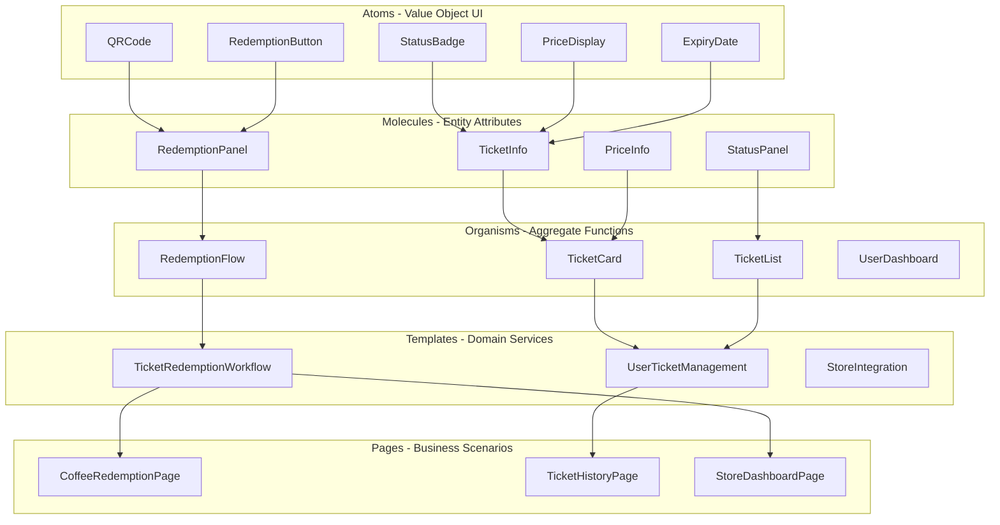
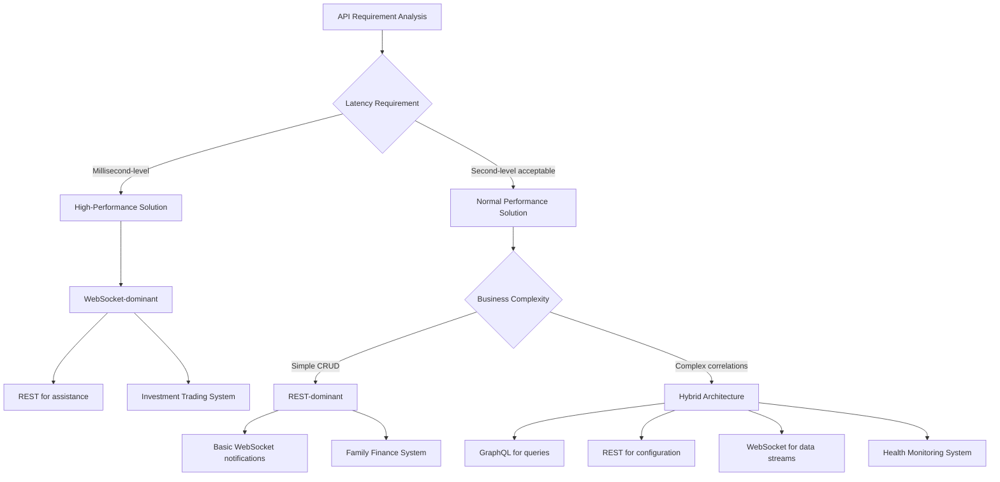
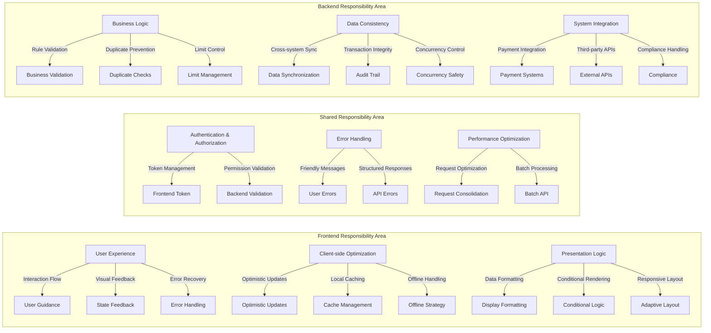

# Day 8 | Systematizing UI Component Module Design: Introducing Design Systems and Atomic Architecture

After seven days of building a complete structure from philosophical thinking to backend architecture, today we address a key question: **How do we implement a systematic component design on the frontend that reflects the backend's aggregate boundaries and business logic?**

This is not just a technical issue of UI components, but a **complete engineering of mapping from the domain model to the user interface**. Every frontend component should correspond to a clear business concept, and every interaction flow should reflect the natural evolution of domain logic.

## The Ontology of Design Systems: From Business Logic to Visual Language

### Redefining the Value of a "Design System"

Traditional design systems often focus only on visual consistency:

```
Design System = Colors + Fonts + Spacing + Component Library
```

But a DDD-based design system should embody a **systematic translation from business language to visual language**:

```
DDD Design System = Domain Concepts + User Intent + Interaction Patterns + Visual Representation
```

### Mapping from Aggregate Boundaries to Frontend Component Domains

Using a common electronic ticket system as an example, we can establish the following mapping relationship:

**Ticket Aggregate → Frontend Component Domain Mapping**:

```typescript
// Backend Aggregate Boundary
Ticket Aggregate ↔ TicketDomain Component Domain
├── Ticket Entity ↔ TicketCard Component
├── RedemptionCode Value Object ↔ QRCodeDisplay Component
└── TicketStatus Value Object ↔ StatusIndicator Component

User Aggregate ↔ UserDomain Component Domain
├── User Entity ↔ UserProfile Component
├── Preferences Value Object ↔ SettingsPanel Component
└── AuthToken Value Object ↔ AuthStatus Component
```

This mapping ensures consistency between frontend components and business logic, with each component having a clear boundary of responsibility.

At the same time, when designing complex systems, **layered management of cognitive load** is one of the core principles of frontend architecture and design philosophy.

When understanding information, humans often need to switch between different levels of abstraction. We can divide this into three main layers: the **Conceptual Layer**, the **Perceptual Layer**, and the **Translational Layer**.

```typescript
Layered Management of Cognitive Load:
├── Conceptual Layer: Abstract representation of business logic
├── Perceptual Layer: Concrete presentation of visuals and interactions
└── Translational Layer: The correspondence mechanism between concept and perception
```

The **Conceptual Layer** is responsible for carrying the abstract representation of business logic; it is the original source of user and system intent. The **Perceptual Layer** is the concrete visual and interactive presentation, ensuring that abstract intent can enter the user's mental model in an intuitive and easy-to-understand way. The **Translational Layer** acts as a bridge, translating business language into visual language, ensuring a seamless correspondence between "abstract intent" and "concrete expression."

This "philosophy of translating business language to visual language" is embodied in every frontend component. Each component is not just a functional module, but a field for language translation.

For example, in an investment trading system, the abstract business concept of "risk" is often translated into a red warning visual symbol, allowing users to intuitively perceive danger in the shortest possible time. "Opportunity" is conveyed with a green prompt to signal positive information, helping investors make quick decisions. "Uncertainty" is often presented through a dynamic loading state, allowing the system's ambiguity to be perceived as a state of "waiting" and "continuous calculation." Of course, this part also varies depending on cultural background, as seen in the different color markings for stock market values in the US and Taiwan.

The same logic applies to a family finance system, where the abstract meaning of business language is transformed into different visual strategies. For example, "budget control" is often intuitively displayed with progress bars and warning symbols to show the balance of income and expenditure. "Family collaboration" is made clear through multi-user status indicators, making interactions between members obvious at a glance. "Spending habits" are visualized with categorized charts, helping users abstract their daily consumption behavior into structured patterns, thus forming an intuitive perception of their financial health.

In a health monitoring system, the translation logic focuses more on the intuitive presentation of "temporality" and "abnormality." "Physiological cycles" are conveyed with time-series animations to show dynamic changes, making the abstract concept of a cycle concrete and visible. "Health trends" are mapped with gradient colors, allowing users to naturally feel the improvement or decline of their condition. As for "abnormal alerts," they are created with pulsating reminders to create a sense of immediacy and urgency, ensuring that important information is captured instantly.

In summary, layered management of cognitive load is not just a design technique, but a design philosophy. It creates a complete translation chain from abstract to concrete, allowing business logic to be "visualized," "perceived," and "contextualized."

The value of this method is that it not only reduces the user's cognitive pressure but also enhances the system's scalability and interpretability in various scenarios. This is the main reason I will now discuss Atomic Design.

## Atomic Design: A Hierarchical Implementation of Domain Concepts

### The DDD Significance of Atomic Design

Atomic Design is a clear and deconstructive thinking tool for requirements. It can effectively assist us in breaking down existing pages into modules and components by combining context or domain, and it can also be used to build a complete system from scratch by designing atomic components.

Brad Frost's Atomic Design methodology needs to be reinterpreted in the context of DDD:

**Atoms**: UI representation of domain value objects

-   Basic business concepts like Money, Status, Code, etc.
-   These are indivisible units of business meaning.

**Molecules**: Combinations of attributes of a domain entity

-   Grouping related value objects into meaningful UI fragments.
-   Corresponds to attribute groups of an entity.

**Organisms**: Complete expression of a domain aggregate

-   Implementation of a complete business function.
-   Corresponds to the core capabilities of an aggregate.

**Templates**: Coordination layer of domain services

-   Business processes that span across aggregates.
-   Structure for complex user journeys.

**Pages**: Specific instances of business scenarios

-   The complete operation for a specific role in a specific context.

Let's use the ticket system again for a simple example.

### Atomic Design in Practice for a Ticket System



**Concrete Implementation Example**:

```typescript
// Atom Layer: UI representation of the Status value object
interface StatusBadgeProps {
  status: TicketStatus;
  size?: "sm" | "md" | "lg";
  variant?: "filled" | "outlined";
}

const StatusBadge: React.FC<StatusBadgeProps> = ({
  status,
  size = "md",
  variant = "filled",
}) => {
  const getStatusConfig = (): StatusConfig => {
    switch (status) {
      case TicketStatus.AVAILABLE:
        return { color: "green", label: "Available", icon: "check-circle" };
      case TicketStatus.USED:
        return { color: "gray", label: "Used", icon: "check" };
      case TicketStatus.EXPIRED:
        return { color: "red", label: "Expired", icon: "x-circle" };
      case TicketStatus.PENDING:
        return { color: "yellow", label: "Processing", icon: "clock" };
    }
  };

  const config = getStatusConfig();

  return (
    <span className={`status-badge ${config.color} ${size} ${variant}`}>
      <Icon name={config.icon} />
      {config.label}
    </span>
  );
};

// Molecule Layer: Combination of attributes of the Ticket entity
interface TicketInfoProps {
  ticket: Ticket;
  showDetails?: boolean;
}

const TicketInfo: React.FC<TicketInfoProps> = ({
  ticket,
  showDetails = true,
}) => {
  return (
    <div className="ticket-info">
      <div className="ticket-header">
        <h3>{ticket.productName}</h3>
        <StatusBadge status={ticket.status} />
      </div>

      {showDetails && (
        <div className="ticket-details">
          <PriceDisplay
            amount={ticket.value}
            originalPrice={ticket.originalPrice}
          />
          <ExpiryDate date={ticket.expiryDate} />
          <div className="store-info">
            <span>Applicable Stores: {ticket.applicableStores.join(", ")}</span>
          </div>
        </div>
      )}
    </div>
  );
};

// Organism Layer: Complete expression of the Ticket aggregate
interface TicketCardProps {
  ticket: Ticket;
  onRedeem?: (ticket: Ticket) => void;
  onViewDetails?: (ticket: Ticket) => void;
}

const TicketCard: React.FC<TicketCardProps> = ({
  ticket,
  onRedeem,
  onViewDetails,
}) => {
  const canRedeem = ticket.isRedeemable();
  const isNearExpiry = ticket.isNearExpiry();

  return (
    <div className={`ticket-card ${isNearExpiry ? "near-expiry" : ""}`}>
      <TicketInfo ticket={ticket} />

      {canRedeem && <RedemptionPanel ticket={ticket} onRedeem={onRedeem} />}

      <div className="ticket-actions">
        <button
          onClick={() => onViewDetails?.(ticket)}
          className="btn-secondary"
        >
          View Details
        </button>

        {canRedeem && (
          <button onClick={() => onRedeem?.(ticket)} className="btn-primary">
            Redeem Now
          </button>
        )}
      </div>

      {isNearExpiry && (
        <div className="expiry-warning">
          <Icon name="alert-triangle" />
          Expiring soon, please use it as soon as possible.
        </div>
      )}
    </div>
  );
};
```

## Cognitive Correspondence of Frontend Architecture Boundaries

**The Necessity of Frontend Architecture Planning: A Common Language for Cross-Functional Teams**

After discussing the hierarchical implementation of domain concepts in Atomic Design, let's move on to a further concept: **how to place the designed components and modules**.

The organization of frontend architecture is not just about code structure, but a **strategy for dividing cognitive domains**.

Many engineers and clients often think, "Why does the frontend need architectural planning?" or "Isn't frontend development just about turning design mockups into web pages?" But in reality, the complexity of frontend systems is often no less than that of the backend.

From a Product Manager's (PM) perspective, frontend architecture is about the speed of feature delivery, the quality of user experience, and the long-term evolution capability of the product. A frontend without a good architecture will lead to the following problems:

-   Feature development cycles get longer and longer: When a PM proposes a seemingly simple requirement like "add a new filter condition," if the frontend lacks a good architecture, the development team may need to modify a dozen files and test countless pages. A task originally estimated for 1 day becomes 1 week. This is because the related logic is scattered everywhere, with no unified management mechanism.

-   Risk of inconsistent user experience: A frontend without architectural specifications is prone to having the same function behave differently on different pages. For example, the "delete" function might be a red button on page A, a text link on page B, and require a double-click confirmation on page C. Users have to relearn the operating logic for each page, greatly reducing the product's usability.

-   Difficulty in error tracking and problem localization: When a user reports a bug, if the frontend code structure is chaotic, the development team may spend a lot of time locating the problem. This directly affects customer service efficiency and user satisfaction.

From the perspective of pre-acceptance assurance, QA engineers need to design test cases, perform regression testing, and ensure product quality. These tasks directly depend on the quality of the frontend architecture and will very clearly and directly affect the efficiency of testing work.

-   Reusability of test cases: A good frontend architecture will manage the same functional components uniformly. For example, if the "login form" uses the same component throughout the system, QA only needs to perform a complete test on this component once to ensure that all pages using it have the same quality assurance. Conversely, if each page has its own implementation of the login form, QA needs to repeat the test multiple times.

-   Creation of automated tests: A structured frontend architecture makes it easier to create automated tests. When components have clear input and output definitions, QA can more easily write stable test scripts. A chaotic code structure will make automated tests fragile, often failing due to minor modifications.

-   Scope control of regression testing: When a certain function changes, a good architecture allows QA to clearly know which related functions need to be tested. If the architecture is well-designed, modifying the "user information" component will only affect a few specific pages, not the entire system.

In summary, architectural planning is like urban planning; it defines the boundaries and interaction rules of different functional areas. Without good architectural planning, the code will quickly become unmaintainable "spaghetti code."

Modern frontends are no longer just the "presentation layer"; they carry a large amount of business logic. User permission control, data validation, state management, error handling, etc., all need to be implemented on the frontend. Without architectural planning, this logic will be scattered everywhere, making it difficult to test and maintain.

### Overview of Mainstream Frontend Architecture Patterns

**The Evolution of Traditional MVC Architecture on the Frontend**:

Early frontend development mainly used jQuery + page templates (Pug, Gulp). However, with the rise of Single Page Applications (SPA), the frontend required more complex architectural patterns. The following will briefly introduce the common architectural strategies today:

**Component-Based Architecture**, **Feature-Based Architecture**, **Layered Architecture**

**1. Component-Based Architecture**

This is currently the most mainstream frontend architecture pattern, represented by React, Vue, and Angular:

```
project-root/
├── src/
│   ├── components/           # Reusable components
│   │   ├── Button/
│   │   ├── Modal/
│   │   └── DataTable/
│   ├── pages/               # Page-level components
│   │   ├── Home/
│   │   ├── Profile/
│   │   └── Settings/
│   ├── hooks/               # Custom Hooks (React)
│   ├── stores/              # State management
│   ├── services/            # API services
│   └── utils/               # Utility functions
```

**Applicable Scenarios**: Small to medium-sized projects, teams with average technical skills, need for rapid development.
**Advantages**: Gentle learning curve, fast development speed, rich community resources.
**Disadvantages**: In large projects, it's easy for component responsibilities to become unclear, leading to code duplication.

**2. Feature-Based Architecture**

Organizes code by business features, with each feature module containing all related code for that feature:

```
project-root/
├── src/
│   ├── features/
│   │   ├── authentication/
│   │   │   ├── components/
│   │   │   ├── hooks/
│   │   │   ├── services/
│   │   │   ├── stores/
│   │   │   └── types/
│   │   ├── user-management/
│   │   │   ├── components/
│   │   │   ├── hooks/
│   │   │   └── services/
│   │   └── product-catalog/
│   ├── shared/              # Shared resources
│   │   ├── components/
│   │   ├── hooks/
│   │   └── utils/
│   └── core/               # Core functionalities
│       ├── api/
│       ├── auth/
│       └── routing/
```

**Applicable Scenarios**: Medium to large-sized projects, multi-team collaboration, complex business logic.
**Advantages**: High module independence, clear responsibilities, easy to test.
**Disadvantages**: More complex initial setup, requires more architectural planning.

**3. Layered Architecture**

Divides the application into different logical layers, with each layer responsible for specific duties:

```
project-root/
├── src/
│   ├── presentation/        # Presentation Layer
│   │   ├── components/
│   │   ├── pages/
│   │   └── layouts/
│   ├── application/         # Application Layer
│   │   ├── stores/
│   │   ├── hooks/
│   │   └── services/
│   ├── domain/              # Domain Layer
│   │   ├── entities/
│   │   ├── repositories/
│   │   └── use-cases/
│   └── infrastructure/      # Infrastructure Layer
│       ├── api/
│       ├── storage/
│       └── external-services/
```

**Applicable Scenarios**: Enterprise-level applications, long-term maintenance projects, complex business logic.
**Advantages**: Clear separation of responsibilities, easy to test, conforms to SOLID principles.
**Disadvantages**: Steep learning curve, slower initial development speed.

### Core-Shared-Feature vs. Next.js DDD Architecture Comparison

**In-depth Analysis of Core-Shared-Feature Architecture**:

This architecture divides the code into three main levels, each with clear responsibility boundaries:

```
src/
├── core/                    # Core Layer: Application's infrastructure
│   ├── api/
│   │   ├── client.ts        # API client configuration
│   │   ├── interceptors.ts  # Request/response interceptors
│   │   └── endpoints.ts     # API endpoint definitions
│   ├── auth/
│   │   ├── AuthContext.tsx  # Authentication context
│   │   ├── AuthGuard.tsx    # Route guard
│   │   └── auth.service.ts  # Authentication service
│   ├── router/
│   │   ├── Router.tsx       # Router configuration
│   │   ├── routes.ts        # Route definitions
│   │   └── guards.ts        # Route guard logic
│   ├── store/
│   │   ├── index.ts         # Root state management configuration
│   │   ├── middleware.ts    # Middleware
│   │   └── persistConfig.ts # Persistence configuration
│   └── types/
│       ├── api.ts           # API-related types
│       ├── auth.ts          # Authentication-related types
│       └── common.ts        # Common types
├── shared/                  # Shared Layer: Reusable components and logic
│   ├── components/
│   │   ├── ui/              # Basic UI components
│   │   │   ├── Button/
│   │   │   │   ├── Button.tsx
│   │   │   │   ├── Button.test.tsx
│   │   │   │   ├── Button.stories.tsx
│   │   │   │   └── index.ts
│   │   │   ├── Input/
│   │   │   ├── Modal/
│   │   │   └── Table/
│   │   ├── layout/          # Layout components
│   │   │   ├── Header/
│   │   │   ├── Sidebar/
│   │   │   └── Footer/
│   │   └── form/            # Form components
│   │       ├── FormField/
│   │       ├── Validation/
│   │       └── FormBuilder/
│   ├── hooks/
│   │   ├── useApi.ts        # API call Hook
│   │   ├── useDebounce.ts   # Debounce Hook
│   │   ├── useLocalStorage.ts # Local storage Hook
│   │   └── usePermission.ts # Permission check Hook
│   ├── utils/
│   │   ├── formatters.ts    # Formatting utilities
│   │   ├── validators.ts    # Validation utilities
│   │   ├── constants.ts     # Constant definitions
│   │   └── helpers.ts       # Helper functions
│   └── services/
│       ├── storage.service.ts # Storage service
│       ├── notification.service.ts # Notification service
│       └── analytics.service.ts # Analytics service
└── features/                # Feature Layer: Specific business functionalities
    ├── authentication/
    │   ├── components/
    │   │   ├── LoginForm/
    │   │   │   ├── LoginForm.tsx
    │   │   │   ├── LoginForm.test.tsx
    │   │   │   └── useLoginForm.ts
    │   │   ├── RegisterForm/
    │   │   └── PasswordReset/
    │   ├── pages/
    │   │   ├── LoginPage.tsx
    │   │   ├── RegisterPage.tsx
    │   │   └── ForgotPasswordPage.tsx
    │   ├── store/
    │   │   ├── authSlice.ts # Redux Toolkit slice
    │   │   └── authThunks.ts # Asynchronous operations
    │   ├── services/
    │   │   └── auth.api.ts  # Authentication-related API
    │   ├── types/
    │   │   └── auth.types.ts # Authentication-related types
    │   └── utils/
    │       └── authHelpers.ts
    ├── user-management/
    │   ├── components/
    │   │   ├── UserList/
    │   │   ├── UserForm/
    │   │   └── UserProfile/
    │   ├── pages/
    │   │   ├── UsersPage.tsx
    │   │   └── UserDetailPage.tsx
    │   ├── store/
    │   │   └── userSlice.ts
    │   └── services/
    │       └── user.api.ts
    └── dashboard/
        ├── components/
        │   ├── StatsCard/
        │   ├── ChartWidget/
        │   └── RecentActivity/
        ├── pages/
        │   └── DashboardPage.tsx
        └── hooks/
            └── useDashboardData.ts
```

**Advantages of Core-Shared-Feature**:

1.  **Clear Separation of Responsibilities**: The Core layer handles application infrastructure, the Shared layer provides reusable components, and the Feature layer implements specific business functionalities. The responsibilities of each level are very clear, allowing new team members to quickly understand the code structure.

2.  **High Reusability**: Components and utilities in the Shared layer can be reused across multiple Features, avoiding code duplication. When you need to use the same UI component or business logic in multiple features, you just need to reference it from the Shared layer.

3.  **Easy to Test**: Each layer can be tested independently. The basic services in the Core layer can be unit tested, the components in the Shared layer can be component tested, and the business logic in the Feature layer can be integration tested.

4.  **Team Collaboration Friendly**: Different teams can be responsible for different Features, while the Core and Shared layers can be maintained by an architecture team. This can prevent conflicts caused by multiple teams modifying the same code.

**Disadvantages of Core-Shared-Feature**:

1.  **Complex Initial Setup**: It requires pre-designing the boundaries and interfaces of each layer, which demands higher architectural design skills. If the boundaries are not designed properly, the cost of refactoring later will be high.

2.  **Managing Dependencies Between Features**: When Features need to share some logic, it requires careful consideration of whether it should be promoted to the Shared layer or if the dependency should be resolved in another way.

3.  **Learning Curve**: New engineers need to understand the design philosophy of the entire architecture to correctly organize code between the layers.

**In-depth Analysis of Next.js DDD Architecture**:

An architecture combining Next.js with Domain-Driven Design focuses more on domain modeling and the organization of business logic:

```
src/
├── app/                     # Next.js 13+ App Router
│   ├── (auth)/             # Route group
│   │   ├── login/
│   │   │   └── page.tsx
│   │   └── register/
│   │       └── page.tsx
│   ├── dashboard/
│   │   ├── page.tsx
│   │   └── layout.tsx
│   ├── users/
│   │   ├── page.tsx
│   │   ├── [id]/
│   │   │   └── page.tsx
│   │   └── loading.tsx
│   ├── api/                # API Routes
│   │   ├── auth/
│   │   │   └── route.ts
│   │   └── users/
│   │       └── route.ts
│   ├── globals.css
│   ├── layout.tsx
│   └── page.tsx
├── domains/                 # Domain Layer
│   ├── auth/
│   │   ├── entities/
│   │   │   ├── User.ts     # User entity
│   │   │   └── Session.ts  # Session entity
│   │   ├── repositories/
│   │   │   └── UserRepository.ts
│   │   ├── services/
│   │   │   ├── AuthService.ts
│   │   │   └── UserService.ts
│   │   ├── value-objects/
│   │   │   ├── Email.ts
│   │   │   └── Password.ts
│   │   └── use-cases/
│   │       ├── LoginUseCase.ts
│   │       ├── RegisterUseCase.ts
│   │       └── LogoutUseCase.ts
│   ├── user-management/
│   │   ├── entities/
│   │   │   └── UserProfile.ts
│   │   ├── repositories/
│   │   │   └── UserProfileRepository.ts
│   │   ├── services/
│   │   │   └── UserManagementService.ts
│   │   └── use-cases/
│   │       ├── GetUserListUseCase.ts
│   │       ├── CreateUserUseCase.ts
│   │       └── UpdateUserUseCase.ts
│   └── shared/
│       ├── entities/
│       │   └── BaseEntity.ts
│       ├── value-objects/
│       │   ├── Id.ts
│       │   └── DateRange.ts
│       └── interfaces/
│           ├── Repository.ts
│           └── UseCase.ts
├── infrastructure/          # Infrastructure Layer
│   ├── database/
│   │   ├── prisma/
│   │   │   ├── schema.prisma
│   │   │   └── migrations/
│   │   └── repositories/
│   │       ├── PrismaUserRepository.ts
│   │       └── PrismaUserProfileRepository.ts
│   ├── external-services/
│   │   ├── EmailService.ts
│   │   └── PaymentService.ts
│   ├── auth/
│   │   └── NextAuthConfig.ts
│   └── api/
│       └── ApiClient.ts
├── presentation/            # Presentation Layer
│   ├── components/
│   │   ├── auth/
│   │   │   ├── LoginForm.tsx
│   │   │   └── RegisterForm.tsx
│   │   ├── users/
│   │   │   ├── UserList.tsx
│   │   │   └── UserCard.tsx
│   │   └── shared/
│   │       ├── Button.tsx
│   │       ├── Input.tsx
│   │       └── Modal.tsx
│   ├── hooks/
│   │   ├── useAuth.ts
│   │   └── useUsers.ts
│   └── providers/
│       ├── AuthProvider.tsx
│       └── QueryProvider.tsx
└── application/             # Application Layer
    ├── dto/
    │   ├── auth/
    │   │   ├── LoginDto.ts
    │   │   └── RegisterDto.ts
    │   └── users/
    │       ├── CreateUserDto.ts
    │       └── UpdateUserDto.ts
    ├── handlers/
    │   ├── auth/
    │   │   ├── LoginHandler.ts
    │   │   └── RegisterHandler.ts
    │   └── users/
    │       ├── GetUsersHandler.ts
    │       └── CreateUserHandler.ts
    └── middleware/
        ├── AuthMiddleware.ts
        └── ValidationMiddleware.ts
```

**Advantages of Next.js DDD**:

1.  **Centralized Business Logic**: The Domain layer contains all business logic and rules, separating business logic from technical implementation. When business requirements change, modifications are mainly made in the Domain layer, minimizing the impact on other layers.

2.  **Full-Stack Consistency**: The frontend and backend share the same domain model and business logic, reducing cognitive load and communication costs between them. The API design also aligns more closely with the business logic.

3.  **Excellent Testability**: The business logic in the Domain layer can be tested completely detached from technical details. Use Cases can be unit tested using dependency injection.

4.  **Technology Agnostic**: The Domain layer does not depend on any specific technology or framework. When the technology stack needs to be switched, the business logic can remain unchanged.

**Disadvantages of Next.js DDD**:

1.  **Steep Learning Curve**: It requires a deep understanding of DDD concepts and design patterns, demanding a higher technical level from the team. Junior engineers may take a longer time to master it.

2.  **Slower Initial Development Speed**: It requires designing multiple levels of abstraction, such as entities, value objects, and use cases, which slows down the initial development speed.

3.  **Risk of Over-Engineering**: For simple CRUD applications, DDD may introduce unnecessary complexity. It's necessary to judge its applicability based on the project's scale and complexity.

### Decision Framework for Architecture Selection

**Project Scale-Driven Architecture Selection**:

1.  **Small Projects (< 10 pages, < 3 developers)**:
    -   Recommendation: Simple component-based architecture
    -   Reason: Rapid development, reduces over-engineering.

2.  **Medium Projects (10-50 pages, 3-10 developers)**:
    -   Recommendation: Core-Shared-Feature architecture
    -   Reason: Balances development efficiency and code organization.

3.  **Large Projects (> 50 pages, > 10 developers)**:
    -   Recommendation: Next.js DDD architecture or micro-frontend architecture
    -   Reason: Complex business logic requires stricter architectural constraints.

**Consideration of Team's Technical Level**:

-   **Junior Team**: Choose an architecture with a gentle learning curve, focusing on understandability and development efficiency.
-   **Senior Team**: Can choose a more complex but higher long-term benefit architecture, focusing on maintainability and scalability.
-   **Mixed Team**: Choose an architecture with clear boundaries, allowing developers of different levels to work on different layers.

**Impact of Business Characteristics**:

-   **Products with rapid iterations**: Choose an architecture that prioritizes development speed.
-   **Products with long-term maintenance**: Choose an architecture that prioritizes maintainability.
-   **Products with multi-team collaboration**: Choose an architecture with a high degree of modularity.

## API Design Strategies and Frontend-Backend Collaboration Boundaries

### Core Design Principles

In a well-governed frontend-backend collaboration system, we typically use a five-layer framework: **"Intent—Contract—Transport—Consistency—Observation"**. First, the business intent defines measurable experience and data timeliness. Second, the **contract** fixes boundaries and predictability. Then, an appropriate transport form is chosen to deliver the data. At the same time, a consistency strategy ensures that read and write semantics align with business risks. Finally, observation completes the closed loop of experience with testability, traceability, and retrospective capabilities.

In terms of **contract and boundaries**, adopting a contract-first approach and version governance (REST/OpenAPI, GraphQL SDL, gRPC/proto) can minimize cross-team risks. The frontend aligns with the display model using typed DTOs (or GraphQL fragments), avoiding leaking database shapes to the UI. The backend bears the **"final responsibility"** for business rules, permissions, and data consistency, while the frontend only handles presentation and experience (including optimistic updates, error recovery, and offline strategies).

In summary, the maturity of frontend-backend collaboration and API design is not about how many protocols are stacked, but whether the responsibilities and risks can be front-loaded with clear contracts based on business characteristics, and whether experience, performance, and correctness can be achieved simultaneously with appropriate transport and consistency semantics.

The following briefly discusses suitable API protocol designs based on business characteristics.

Choose the most suitable API technology stack based on business characteristics:

-   **High-Frequency Trading System**: WebSocket-dominant + REST for assistance
-   **Family Finance System**: REST-dominant + basic WebSocket
-   **Health Monitoring System**: Hybrid architecture (REST + GraphQL + WebSocket)

### Investment Trading System

```typescript
// Core Strategy: WebSocket + Priority Message Queue
class TradingAPI {
  // Main WebSocket channel: real-time trading and market data
  // REST for assistance: configuration and historical queries
  // Key: millisecond-level latency optimization
}
```

### Family Finance System

```typescript
// Core Strategy: REST + Simple WebSocket notifications
class FamilyFinanceAPI {
  // REST-dominant: simple CRUD operations
  // WebSocket for assistance: collaboration notifications
  // Key: simple development and maintenance
}
```

### Health Monitoring System

```typescript
// Core Strategy: REST + GraphQL + WebSocket hybrid
class HealthMonitorAPI {
  // REST: basic queries and configuration
  // GraphQL: complex correlation analysis
  // WebSocket: IoT data streams and alerts
  // Key: data type optimization strategy
}
```

## Technology Selection Guiding Principles

| System Characteristic | Recommended Tech Stack | Application Scenario         |
| --------------------- | ---------------------- | ---------------------------- |
| Ultra-low Latency     | WebSocket-dominant     | Trading, gaming, real-time collaboration |
| Simple and Reliable   | REST-dominant          | Enterprise internal, small applications |
| Complex Queries       | GraphQL for enhancement| Data analysis, personalized services |
| Data Stream Processing| Hybrid architecture    | IoT, monitoring, social media |

## Comparison of System Architectures for Three Business Scenarios

```mermaid
graph TB
    subgraph "Investment Trading System - Extreme Performance"
        Trading[Trading Frontend]
        TradingWS[Main WebSocket Channel]
        TradingREST[Auxiliary REST API]
        TradingDB[(Market Database)]

        Trading --> TradingWS
        Trading --> TradingREST
        TradingWS --> TradingDB
        TradingREST --> TradingDB

        TradingWS -.-> |Real-time Prices| Trading
        TradingWS -.-> |Trade Execution| Trading
        TradingREST -.-> |Configuration Queries| Trading
    end

    subgraph "Family Finance System - Simple and Reliable"
        Family[Finance Frontend]
        FamilyREST[Main REST API]
        FamilyWS[Collaboration Notifications]
        FamilyDB[(Finance Database)]

        Family --> FamilyREST
        Family --> FamilyWS
        FamilyREST --> FamilyDB
        FamilyWS --> FamilyDB

        FamilyREST -.-> |CRUD Operations| Family
        FamilyWS -.-> |Real-time Notifications| Family
    end

    subgraph "Health Monitoring System - Data Stream Driven"
        Health[Health Frontend]
        HealthREST[REST API]
        HealthGQL[GraphQL API]
        HealthWS[WebSocket Stream]
        HealthDB[(Health Database)]
        IoT[IoT Devices]

        Health --> HealthREST
        Health --> HealthGQL
        Health --> HealthWS
        IoT --> HealthWS

        HealthREST --> HealthDB
        HealthGQL --> HealthDB
        HealthWS --> HealthDB

        HealthREST -.-> |Basic Queries| Health
        HealthGQL -.-> |Complex Analysis| Health
        HealthWS -.-> |Real-time Data| Health
    end
```



## API Technology Selection Decision Tree



## Delineating Frontend-Backend Responsibilities



## Best Practices for Boundary Coordination

1.  **Clear Division of Responsibilities**: Avoid duplicating logic between frontend and backend.
2.  **Unified Error Handling**: A structured error response mechanism.
3.  **Collaborative Performance Optimization**: Frontend caching + backend batch processing.
4.  **Consistent Security Strategy**: Coordinated token management and permission validation.
5.  **Monitoring and Logging**: Full-stack tracing and problem localization.

## Building the Foundation for Day 9's High-Concurrency Architecture

After a brief discussion on frontend architecture, tomorrow we will turn our attention back to architectural scenarios and AWS:

### Strategies for Data-Intensive Applications

-   **Request Optimization and Batch Processing**: Reduce network overhead and improve user experience.
-   **State Synchronization and Conflict Resolution**: Handling concurrent operations from multiple users.

### Microservices Architecture

-   **Circuit Breaker Pattern**: Fault isolation and graceful degradation.
-   **Distributed Tracing**: Cross-service user operation tracing and debugging.

### Optimization of AWS High-Concurrency Architecture

-   **CDN and Edge Computing**: How to maximize the benefits of CloudFront.
-   **Lambda@Edge**: Edge execution strategies.
-   **API Gateway Throttling**: Handling throttling responses.

## Today's Systematic Takeaways

-   **A design system is a visual translation of business language**: Every design decision should reflect a business concept.
-   **Atomic Design + DDD = An organic component hierarchy**: A natural mapping from value objects to aggregates.
-   **Core-Share-Feature vs. DDD Layered Architecture reflects domain boundaries**: Frontend architecture trade-offs and correspondence with backend aggregate boundaries.

Remember: What we built today is not a UI framework, but a systematic expression of business logic in the visual layer. Each component carries a specific business semantic, and every design decision should serve the user's business goals.

---

> "Components are not the building blocks of UI, but the visual carriers of business concepts. We are not designing interfaces, but the medium for dialogue between the user and the business domain. A true design system is the art of translation that makes complex business logic intuitively perceptible."
