# Day 9 | High Concurrency and Rate Limiting Design: How to Avoid Resource Bottlenecks

Yesterday, we established three API architectures: WebSocket-dominant for investment trading, simplified REST for family finance, and a hybrid strategy for health monitoring. Today, we address a more fundamental question: **When a system faces a large number of concurrent requests, how do we design the data flow architecture to avoid bottlenecks and lay the foundation for cache optimization?**

This is not just a technical capacity planning problem, but a **philosophical approach to data-intensive applications**. As Martin Kleppmann points out in *Designing Data-Intensive Applications*, the challenge of modern systems is not compute-intensive, but how to handle data flow under the constraints of **reliability, scalability, and maintainability**.

## The Essence of High Concurrency: Data Flow Patterns and Access Characteristics

### Re-understanding the Essence of "High Concurrency"

Traditionally, we understand high concurrency as "handling a large number of requests simultaneously." However, Kleppmann offers a more profound perspective:

**Concurrency is not a quantitative problem, but a qualitative challenge**:

```
Traditional View: Concurrency = Number of requests processed per second
Data-Intensive View: Concurrency = Coordination complexity under data consistency constraints
```

**The manifestation of the three pillars (Reliability, Scalability, Maintainability) in concurrency scenarios**:

**Reliability**: The system continues to work correctly even when some components fail.

-   Investment Trading: Trading orders cannot be lost or executed multiple times.
-   Family Finance: Expense records cannot become inconsistent due to concurrency.
-   Health Monitoring: Device data cannot be permanently lost due to network issues.

**Scalability**: The system can handle increased load.

-   Horizontal Scaling: Adding more machines.
-   Vertical Scaling: Enhancing the performance of a single machine.
-   Functional Scaling: Managing system complexity.

**Maintainability**: The system can be effectively operated, understood, and modified.

-   Observability: Understanding the system's operational status.
-   Operability: Effectively keeping the system running.
-   Simplicity: Managing complexity and avoiding accidental complexity.

Traditionally, we understand high concurrency as "handling a large number of requests simultaneously," but from a system architecture perspective, concurrency is essentially a **management challenge of data flow patterns**:

### Systematic Identification of Concurrency Bottleneck Issues

| Level          | Metric Name                         | Description                                          | Common Detection Tools / Methods                   |
| -------------- | ----------------------------------- | ---------------------------------------------------- | -------------------------------------------------- |
| **Application**| Throughput (RPS/QPS)                | Number of requests processed per second, measures system capacity | JMeter, k6, Locust, New Relic                      |
|                | Response Latency                    | Time from request entry to response, focusing on P50/P95/P99 | APM (Datadog, New Relic), OpenTelemetry            |
|                | Error Rate                          | Percentage of HTTP 4xx/5xx, reflects application robustness | APM, ELK, Sentry                                   |
|                | Concurrent Connections              | Number of users/sessions handled simultaneously      | System Monitoring (Prometheus, Grafana)            |
|                | Queue Length                        | Backlog in thread pools, task queues                 | Micrometer, RabbitMQ/Kafka metrics                 |
|                | Wait Time                           | Time spent waiting in DB connection pools, API Gateway queues | APM Trace, pgbouncer stats                         |
|                | Memory/GC Behavior                  | GC pauses, Heap usage, affecting application response time | JVisualVM, JFR, Prometheus Exporter                |
| **Database**   | Query Latency                       | Time taken for a single SQL query or transaction     | MySQL Slow Query Log, pg_stat_statements           |
|                | Queries Per Second (QPS/TPS)        | Database throughput                                  | MySQL performance_schema, Postgres metrics         |
|                | Slow Query %                        | Percentage of queries exceeding a threshold          | Slow query log analysis, pt-query-digest           |
|                | Index Hit Ratio                     | Whether queries effectively use indexes              | EXPLAIN, pg_stat_user_indexes                      |
|                | Cache Hit Ratio                     | Hit rate of DB buffer pool / Redis/Memcached         | MySQL InnoDB metrics, Redis INFO                   |
|                | Lock Waits/Deadlocks                | Waits or deadlocks caused by transaction conflicts   | MySQL Performance Schema, pg_locks                 |
|                | Connection Pool Usage               | Whether connection pool resources are saturated      | HikariCP metrics, pgbouncer stats                  |

In our main discussion context, the data flow characteristics are as follows:

**Analysis of Data Flow Characteristics for the Three Systems**:

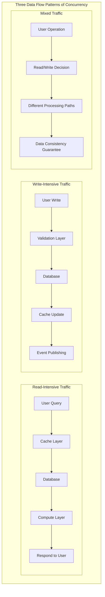

| System             | Main Traffic Pattern          | Access Pattern   | Consistency Requirement | Cache Friendliness |
| ------------------ | ----------------------------- | ---------------- | ----------------------- | ------------------ |
| Investment Trading | Read-intensive (90%) + Key Writes (10%) | Hotspot concentrated | Strong Consistency      | High               |
| Family Finance     | Read/Write balanced (60:40)   | Dispersed evenly | Eventual Consistency    | Medium             |
| Health Monitoring  | Write-intensive (70%) + Analytics Reads (30%) | Time-series pattern | Sequential Consistency  | Low                |

When we talk about concurrency, the most important thing is to understand the philosophy of **prevention is better than cure**: how to avoid performance bottlenecks in the design phase, rather than firefighting after problems occur.

---

## Part 1: Preventing Application Layer Performance Bottlenecks - Four Core Concepts (Connection Pooling, Asynchronous Processing, Caching, Batch Processing)

### Concept 1: Connection Pooling - "The Wisdom of Resource Reuse"

**Core Idea**: Imagine managing seats in a public library.

-   If every reader had to bring their own table and chair and clean up when they leave, it would be very inefficient.
-   The library prepares seats in advance. Readers come, sit, and leave the seat for the next person.
-   A database connection pool works on the same principle.

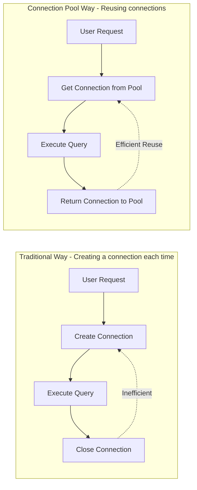

**Key Thinking Points**:

-   **Pre-allocation**: Prepare resources in advance to avoid the overhead of temporary creation.
-   **Reusability**: One connection can be used by multiple requests in turn.
-   **Boundary Control**: Set minimum and maximum connection numbers to avoid resource waste or shortage.

### Concept 2: Asynchronous Processing - "Decoupling Time and Space"

**Core Idea**: Imagine the ordering process in a restaurant.

-   Traditional way: Customer orders → Chef cooks → Customer waits → Food is served → Payment.
-   Asynchronous way: Customer orders → Gets a number and leaves → Chef cooks → Number is called for pickup.

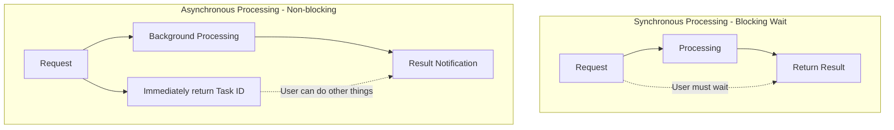

**Key Thinking Points**:

-   **Decoupling Time**: Separate processing time from response time.
-   **Increasing Throughput**: More requests can be accepted in the same amount of time.
-   **User Experience**: Users don't have to wait idly; they can do other things.

### Concept 3: Caching - "The Hierarchy of Memory"

**Core Idea**: Like the human memory system.

-   **Short-term memory**: A phone number you just memorized (local cache).
-   **Long-term memory**: A familiar friend's phone number (distributed cache).
-   **External memory**: Looking up a phone book (database).

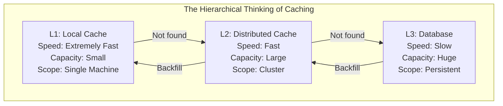

**Key Thinking Points**:

-   **Proximity Principle**: Data closer to the user is accessed faster.
-   **Hotspot Concentration**: Frequently used data is placed in fast-access locations.
-   **Capacity Trade-off**: Trading space for time, and cost for performance.

### Concept 4: Batch Processing - "The Economic Effect of Bulk"

**Core Idea**: Like the logic of courier delivery.

-   You don't send a vehicle for every single package received.
-   Instead, you accumulate a certain number or wait until a specific time to deliver them all at once.

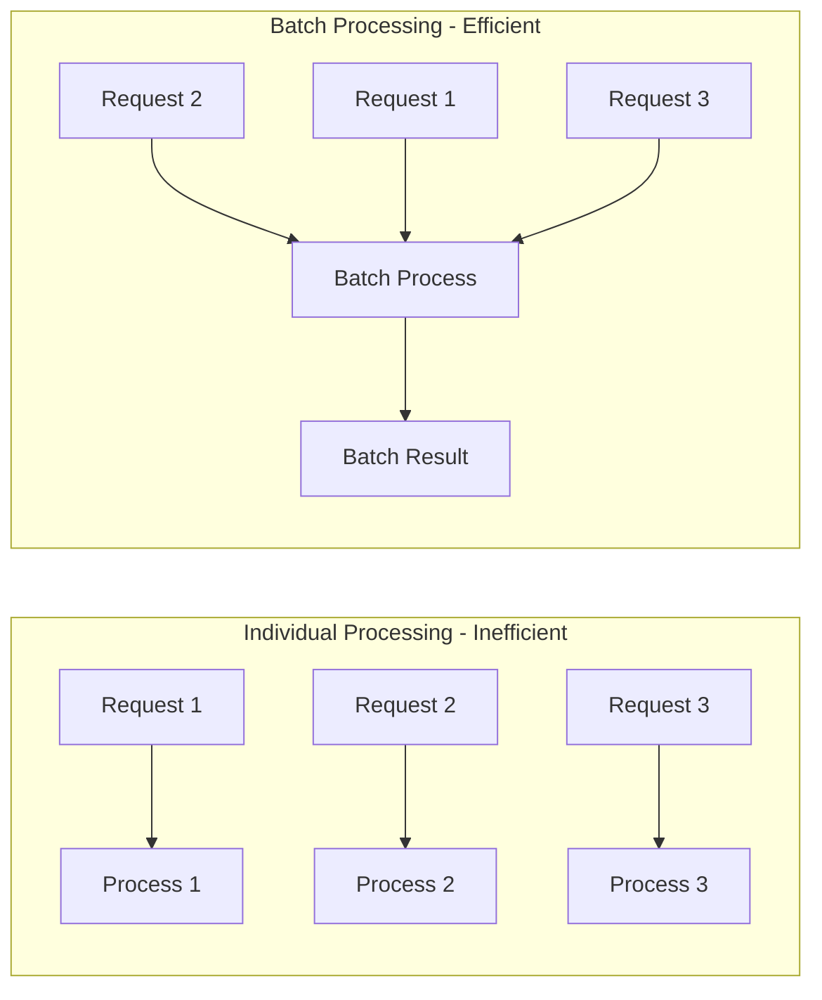

**Key Thinking Points**:

-   **Aggregation Effect**: Combining multiple small tasks into one large task.
-   **Amortizing Cost**: Fixed overhead is shared among multiple operations.
-   **Time Trade-off**: A slight delay in exchange for higher overall efficiency.

---

## Part 2: Preventing Data Layer Performance Bottlenecks - Four Core Strategies (Indexing, Query Optimization, Partitioning/Sharding, Read/Write Splitting)

### Strategy 1: Indexing - "The Directory System of Data"

**Core Idea**: Like the classification system in a library.

-   Without a catalog: To find a book, you have to search shelf by shelf.
-   With a catalog: You check the catalog and quickly locate the specific position.

```mermaid
graph TB
    subgraph "The Essential Thinking of Indexing"
        subgraph "Without Index"
            N1[Full Table Scan] --> N2[Row-by-row check] --> N3[Find Target]
            N2 -.->|Efficiency: O(n)| N3
        end

        subgraph "With Index"
            H1[Index Lookup] --> H2[Direct Location] --> H3[Get Data]
            H2 -.->|Efficiency: O(log n)| H3
        end
    end
```

**Key Thinking Points**:

-   **Space for Time**: Using extra storage space to gain query speed.
-   **Selectivity Principle**: The effectiveness of an index depends on the uniqueness of the data.
-   **Maintenance Cost**: Indexes need to be updated synchronously when data changes.

### Strategy 2: Query Optimization - "The Art of Asking Questions"

**Core Idea**: Like the skill of asking for information.

-   Bad question: "Do you know everything about this person?"
-   Good question: "Do you know John Smith's phone number?"

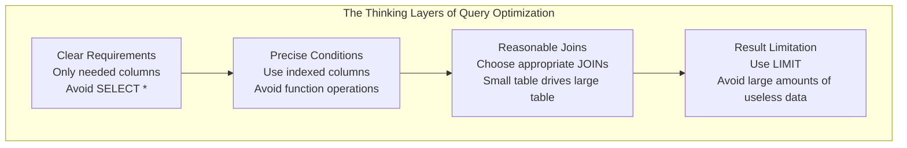

**Key Thinking Points**:

-   **Precise Expression**: The more specific the query condition, the easier it is for the system to optimize.
-   **Principle of Minimality**: Only take what is needed, not more.
-   **Optimal Path**: Choose the most effective data access path.

### Strategy 3: Partitioning/Sharding - "The Wisdom of Divide and Conquer"

**Core Idea**: Like managing a huge library.

-   Single library: All books are together, making it difficult to find anything.
-   Branch management: Divided into several small libraries by subject, each managed independently.

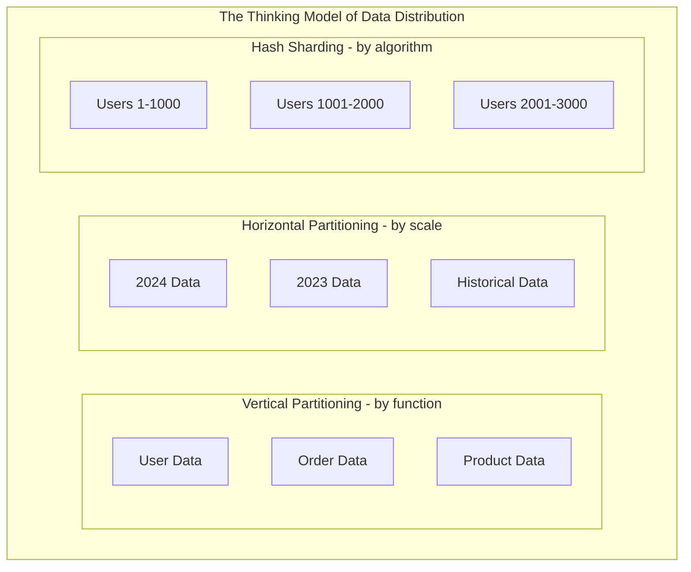

**Key Thinking Points**:

-   **Scale Control**: Decomposing a large problem into multiple small problems.
-   **Parallel Processing**: Multiple shards can work simultaneously.
-   **Locality**: Related data is kept together to reduce cross-shard queries.

### Strategy 4: Read/Write Splitting - "The Efficiency of Specialization"

**Core Idea**: Like the division of labor in a hospital.

-   Registration desk: Specializes in handling registrations (write operations).
-   Information desk: Specializes in answering questions (read operations).
-   Each has its own duty and they don't interfere with each other.

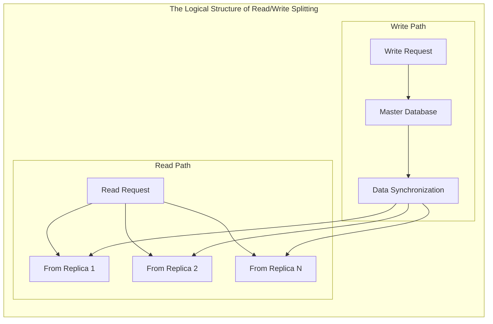

**Key Thinking Points**:

-   **Separation of Duties**: Read and write operations use different resources.
-   **Load Distribution**: Multiple read replicas share the query pressure.
-   **Consistency Trade-off**: Accepting a brief data delay in exchange for performance.

---

## Part 3: System Coordination Optimization - Holistic Thinking (Cache Consistency, Transaction Boundaries)

### Concept 1: Cache Consistency - "The Art of Synchronization"

**Core Challenge**: Imagine multiple people editing the same document simultaneously.

-   How to ensure everyone sees the latest version?
-   How to handle conflicts?
-   How to balance efficiency and accuracy?

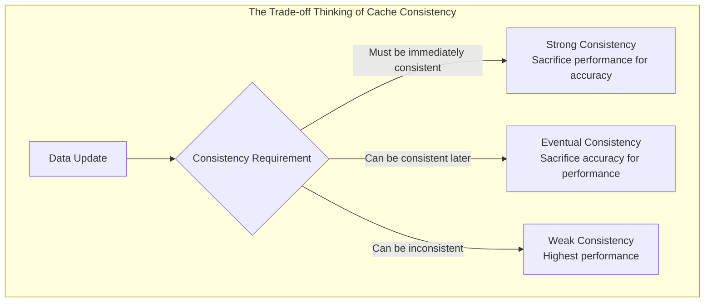

### Concept 2: Transaction Boundaries - "The Scope of Responsibility"

**Core Idea**: Like the logic of signing a contract.

-   Contract scope too large: High risk, prone to problems.
-   Contract scope too small: Inefficient, back-and-forth signing.
-   Appropriate scope: Clear responsibilities, manageable risks.

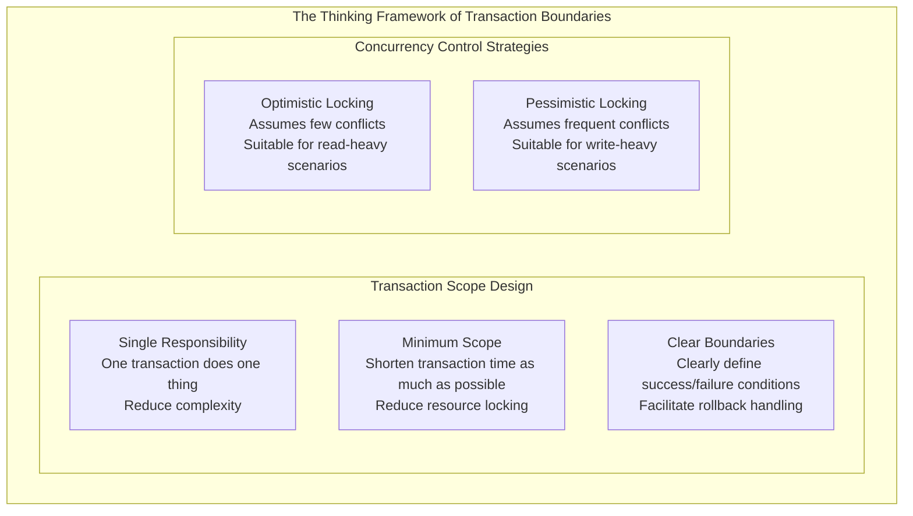

---

## Part 4: Abstract Model of Rate Limiting Design: The Balance of Protection and Guidance

### The Triple Goal of Rate Limiting

Rate limiting is not just about protecting system resources, but an **intelligent regulation mechanism for data traffic**:

**Protection**: Preventing system overload.
**Guidance**: Optimizing resource usage efficiency.
**Prediction**: Providing data for cache preheating.

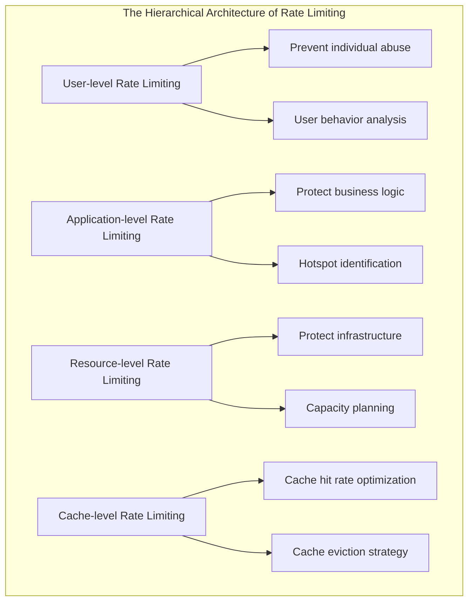

### 3.1 The Systematic Design Philosophy of Rate Limiting

**FluxNinja's 2x2 Framework** provides a standard methodology for rate limiting design in 2024, dividing strategies into four quadrants, each corresponding to different business scenarios and technical implementations:

```mermaid
quadrantChart
    title The 2x2 Framework for Rate Limiting Strategy Selection
    x-axis Static Strategy --> Adaptive Strategy
    y-axis Global Rate Limiting --> Per-User Rate Limiting

    quadrant-1 Intelligent Personalized Rate Limiting
        : Netflix user-level concurrency control
        : Stripe per-customer API quota
        : Achieved 40% performance improvement

    quadrant-2 Enterprise-level Global Rate Limiting
        : AWS API Gateway
        : Cloud service total volume control
        : Protects infrastructure

    quadrant-3 Basic Service Protection
        : Traditional Rate Limiting
        : Fixed QPS threshold
        : Simple and reliable

    quadrant-4 Intelligent Traffic Control
        : Adaptive concurrency limiting
        : Based on latency feedback
        : Reduced average latency by 35%
```

### 3.2 The Core Breakthrough of Adaptive Rate Limiting Algorithms

**Netflix's Adaptive Concurrency Limiting algorithm**, based on Little's Law, has achieved a major breakthrough in the field of rate limiting:

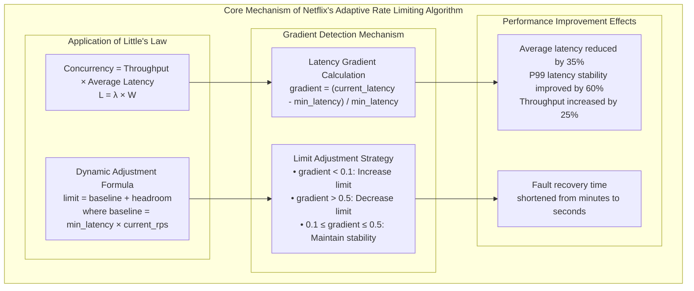

### 3.3 Algorithm Performance Benchmarks and Selection Strategy

Based on the latest stress test data from 2024, the performance of different rate limiting algorithms in standardized scenarios:

```mermaid
xychart-beta
    title "Performance Benchmark Comparison of Rate Limiting Algorithms (10K concurrent requests)"
    x-axis [Token_Bucket, Sliding_Window, Fixed_Window, Leaky_Bucket]
    y-axis "QPS Processing Capability" 0 50000
    bar [45000, 42000, 38000, 35000]
```

```mermaid
xychart-beta
    title "P99 Latency Performance Comparison"
    x-axis [Token_Bucket, Sliding_Window, Fixed_Window, Leaky_Bucket]
    y-axis "Latency (ms)" 0 30
    line [12, 15, 22, 18]
```

**Algorithm Selection Decision Tree**:

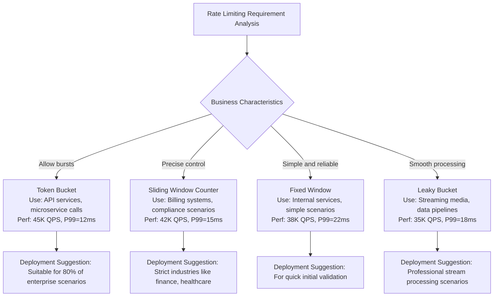

## Conclusion: The Core Philosophy of Performance Optimization

### The Hierarchical Thinking of Design Principles

```mermaid
pyramid
    title The Wisdom Pyramid of Performance Optimization
    "Preventive Design" : 40
    "Monitoring and Alerting" : 30
    "Problem Diagnosis" : 20
    "Emergency Firefighting" : 10
```

**First Layer: Preventive Design (Most Important)**

-   Consider concurrency and scalability in the system design phase.
-   Choose appropriate architectural patterns and technical solutions.
-   Establish reasonable resource allocation and boundary settings.

**Second Layer: Monitoring and Alerting**

-   Establish a comprehensive monitoring system.
-   Set reasonable alert thresholds.
-   Discover potential problems in advance.

**Third Layer: Problem Diagnosis**

-   Quickly locate performance bottlenecks.
-   Analyze the root cause.
-   Develop targeted solutions.

**Fourth Layer: Emergency Firefighting**

-   Temporary performance tuning.
-   Emergency scaling.
-   Contingency degradation plans.

### A Thinking Framework for Practical Application

When we face a system design problem, we need to ask ourselves these questions:

1.  **Resource Reuse**: Can this operation reuse existing resources?
2.  **Asynchronous Decoupling**: Does this process have to be completed immediately? Can it be handled asynchronously?
3.  **Cache Acceleration**: Will this data be accessed repeatedly? Can it be cached?
4.  **Batch Processing**: Can multiple similar operations be processed together?
5.  **Divide and Conquer**: Can this large problem be broken down into smaller ones?
6.  **Specialization**: Can different types of operations be handled separately?

Remember: **The best performance optimization is to avoid performance problems in the design phase, not to solve them after they occur.**

## AWS Best Practices Summary

### AWS Service Selection Guide

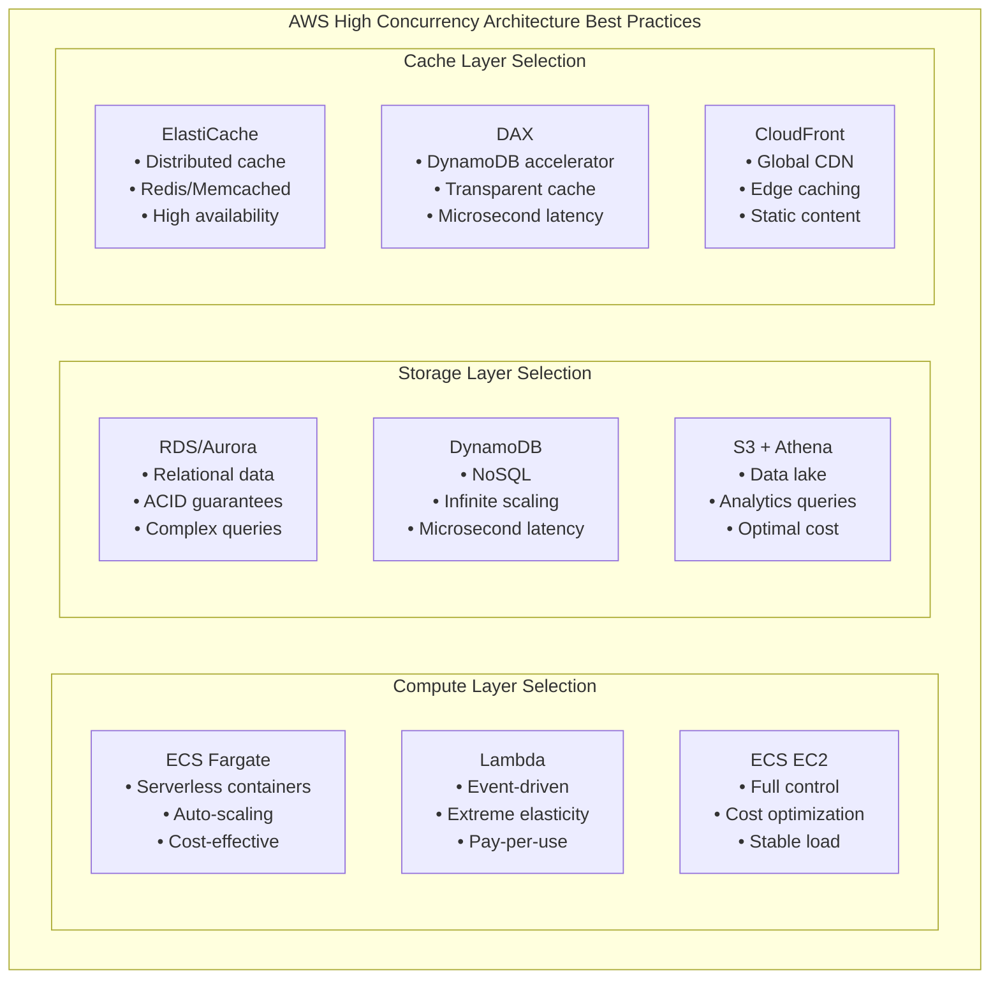

### Cost Optimization Strategies

| Service Combination                 | Applicable Scenario          | Cost Characteristics       | Performance Characteristics      |
| ----------------------------------- | ---------------------------- | -------------------------- | -------------------------------- |
| **Lambda + DynamoDB + DAX**         | Bursty traffic, event-driven | Pay-per-use, controllable cost | Extreme elasticity, cold start latency |
| **ECS Fargate + Aurora Serverless** | Predictable load, auto-scaling | Balanced cost and performance | Fast scaling, good stability     |
| **ECS EC2 + RDS + ElastiCache**     | Stable high load, cost-sensitive | Reserved instances save 60% | Highest performance, complex management |

### Monitoring and Alerting Configuration

**CloudWatch Key Metrics**:

-   **Application Layer**: ECS CPU/Memory Utilization, Lambda Execution Time, API Gateway Latency
-   **Database Layer**: RDS Connections, Aurora Replication Lag, DynamoDB Read/Write Capacity
-   **Cache Layer**: ElastiCache Hit Rate, DAX Latency, CloudFront Cache Hit Ratio

**Automation Best Practices**:

-   Use Auto Scaling to automatically adjust resources based on metrics.
-   Set CloudWatch alarms for preventive monitoring.
-   Utilize AWS Config to ensure best practice configurations.

Finally, based on actual performance testing and cost analysis, we provide differentiated AWS configuration recommendations for the three scenarios we have been discussing:

**Investment Trading System: Extreme Performance Configuration**

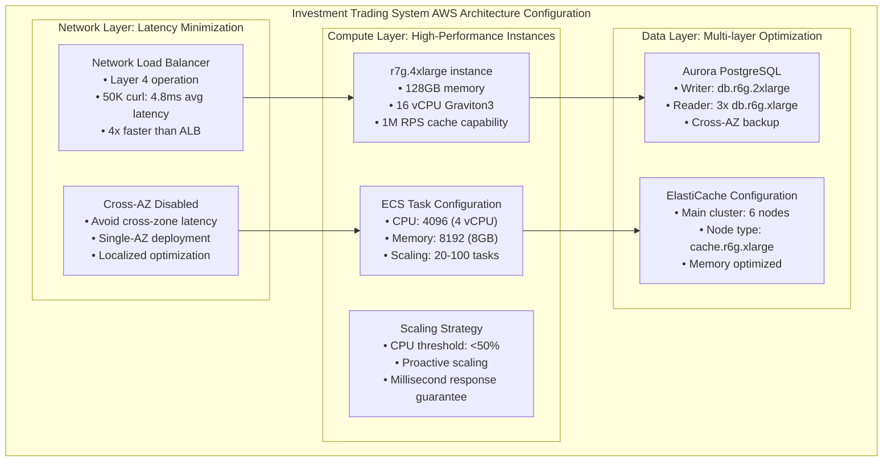

**Family Finance System: Cost Optimization Configuration**

```mermaid
graph TB
    subgraph "Family Finance System AWS Cost-Optimized Architecture"
        subgraph "Hybrid Compute Strategy"
            H1["Lambda + ECS Hybrid<br/>• Lambda: Bursty processing<br/>• ECS: Stable load<br/>• Cost: 60% savings"]
            H2["ECS Configuration<br/>• CPU: 1024 (1 vCPU)<br/>• Memory: 2048 (2GB)<br/>• Scaling: 2-10 tasks"]
            H3["Lambda Configuration<br/>• Memory: 512MB<br/>• Timeout: 30s<br/>• Concurrency: 100"]
        end

        subgraph "Database Simplification"
            DB1["RDS PostgreSQL<br/>• Instance: db.t4g.medium<br/>• Storage: General Purpose SSD<br/>• Backup: 7-day retention"]
            DB2["ElastiCache Savings<br/>• Node: cache.t4g.medium<br/>• Single node: Dev environment<br/>• 2 nodes: Prod environment"]
        end

        subgraph "Cost Control Strategies"
            CC1["Spot Instances<br/>• ECS Spot: 70% cost savings<br/>• Non-critical loads<br/>• Automatic failover"]
            CC2["Reserved Instances<br/>• 1-year term: 40% discount<br/>• 3-year term: 60% discount<br/>• Suitable for stable loads"]
        end

        H1 --> DB1 --> CC1
        H2 --> DB2 --> CC2
        H3 --> CC1
    end
```

These AWS service configurations provide a concrete technical foundation for tomorrow's cache design:

-   **Multi-layer Cache Architecture**: ElastiCache + Application Cache + CDN
-   **Cache Strategy Selection**: Based on ECS task count and load patterns
-   **Cost Optimization**: Cost-benefit analysis of different service combinations
-   **Monitoring Integration**: CloudWatch metrics-driven cache strategy adjustments

## Today's Concurrency Design Philosophy

-   **The essence of concurrency is the art of managing data flow**: Different traffic patterns require different architectural strategies.
-   **Rate limiting is for guidance, not blocking**: Intelligent rate limiting creates conditions for cache optimization.
-   **Data layering serves cache strategy**: The layering of hot, warm, and cold data directly corresponds to cache levels.
-   **Architectural evolution reflects complexity management**: A gradual progression from monolith to microservices to event-driven.

### The Three Stages of Architectural Evolution

#### Stage 1: Concurrency Optimization in Monolithic Architecture

-   **Core Strategy**: Concentrate all performance on a single entity, relying on "vertical scaling" to support demand.
-   **Symbolic Meaning**: Like a tree trunk growing upwards, continuously stacking energy in the same direction.
-   **Limitation**: Once hardware limits are exceeded, expansion space is limited.

#### Stage 2: Concurrency Coordination in Microservices Architecture

-   **Core Strategy**: Achieve group resilience through multi-service parallelism and auto-scaling.
-   **Symbolic Meaning**: Like an orchestra, achieving greater volume and harmony through coordination and division of labor.
-   **Limitation**: Cross-service communication, latency, and consistency management become new challenges.

#### Stage 3: Concurrency Stream Processing in Event-Driven Architecture

-   **Core Strategy**: With events as the smallest unit, the system can perceive and respond elastically in real-time.
-   **Symbolic Meaning**: Like a continuously flowing river that can adjust its speed and direction based on changes in terrain and time.
-   **Limitation**: Event ordering, temporal consistency, and the stability of stream processing become the bottlenecks of the new era.

#### Abstract Evolutionary Trajectory

1.  **Centralized Strengthening**: Make a single point larger, maintaining order with hardware and simple gatekeeping.
2.  **Distributed Orchestration**: Multiple points in parallel, maintaining overall harmony through coordination and sharing.
3.  **Dynamic Flow**: With events as the pulse, adapting to the environment through flow control and elastic response.

Overall, these three layers of abstraction reveal an evolutionary path from **Static Stability → Dynamic Coordination → Fluid Adaptation**.

```mermaid
flowchart TD
    A[Stage 1: Monolithic Architecture\n"Centralized Strengthening"] --> B[Stage 2: Microservices Architecture\n"Distributed Orchestration"]
    B --> C[Stage 3: Event-Driven Architecture\n"Dynamic Flow"]

    subgraph S1[Monolith Characteristics]
      A1[(Vertical Scaling)]
      A2[(Local Cache)]
      A3[(Simple Rate Limit)]
    end
    A --> A1 & A2 & A3

    subgraph S2[Microservices Characteristics]
      B1[(Horizontal Scaling)]
      B2[(Distributed Cache)]
      B3[(Multi-tier Limit)]
    end
    B --> B1 & B2 & B3

    subgraph S3[Event-Driven Characteristics]
      C1[(Elastic Event-driven)]
      C2[(Streaming Cache)]
      C3[(Backpressure Control)]
    end
    C --> C1 & C2 & C3

```

Remember: The ultimate goal of high-concurrency design is not to handle more requests, but to provide users with a stable, fast, and cost-optimized service experience. Every choice of concurrency strategy should serve the overall architecture's **reliability, scalability, and maintainability**.

---

> "The true art of concurrent systems lies in this: we are not designing machines to handle traffic, but intelligent pipelines to guide the flow of data. Every architectural decision should make data flow to the right place, at the right time, in the right way."