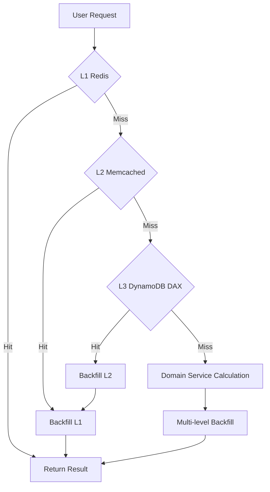

# Day 10 | The Philosophy of Caching Strategies: The Art of Balancing Time, Space, and Consistency

After nine days of modeling and analysis, we have defined the essence, boundaries, and interaction patterns of our system. But now we face a more practical problem: **How can we make these carefully designed domain concepts respond quickly to user needs under real-world constraints?**

When an investment trading system needs to complete risk calculations in milliseconds, a family finance system must support simultaneous operations by multiple people, and a health monitoring system has to process massive amounts of IoT data, pure business logic computation is no longer sufficient to meet performance requirements.

This is the ontological significance of **cache design**: **to inject time and space optimization strategies into the system while maintaining domain purity.**

Every caching decision affects user experience, system cost, and data correctness. Therefore, the architectural design of caching is undoubtedly a top priority in Domain-Driven Design.

In every requirement confirmation, we need to and must ask:

**What is the tolerance for latency and data inconsistency in this business scenario? How much development and operational cost are we willing to pay for it?**

We will now progressively discuss the most common situations and issues we encounter in caching. Here is a brief list of topics:

- The Ontological Trinity of Cache: Local, Cloud, Data-Side
- Three Levels of Data Consistency: Strong, Eventual, Causal
- The Dialectical Relationship Between Security Exposure and Performance
- Cache Invalidation Strategies: The Philosophy of Time
- Cost Modeling: ROI-Driven Cache Decisions
- Cache Monitoring: The Three Dimensions of Observability

Remember this framework: **Hotness determines location**, **tolerance determines model**, **coupling determines implementation**. When we face any scenario that requires caching, we first analyze it using these three principles, and the technology selection will naturally follow.

## The Ontological Trinity of Cache: Local, Cloud, Data-Side

**When should the cache be updated? How do we find the optimal balance between cost control and system performance? How do we handle the data consistency issues brought by caching?**

Caching is not just a technical optimization; it's a deep consideration of the **state of data's existence**. All data, at different locations and different times, has its specific meaning and value.

The essence of a cache is like placing a bookshelf next to us.

This bookshelf can be on our desk (**local cache**), in the downstairs reading room (**cloud cache**), or even in a quick-access locker at the library entrance (**database cache**).

But here come the problems:

1.  **Limited Space**: Our bookshelf can't hold all the books. If we put book A on it, we might have to remove book B. This is the **Eviction Policy**, such as LRU (Least Recently Used).
2.  **Information Becomes Outdated**: The books in the library are updated, but the ones on our shelf are still the old versions. This is the **Consistency** problem.
3.  **Management Cost**: We have to spend effort organizing the bookshelf, deciding which books to keep and which to update. This is the cost of the **Caching Strategy**.

Therefore, all caching design techniques revolve around this core question: "How to maximize the storage of the most valuable and up-to-date information in a limited bookshelf space with minimal management cost."

A common way to classify data is: Hot Data, Warm Data, and Cold Data.

**Hot Data**: For example, the real-time stock price in a trading system, or a trending post on social media.

-   **Characteristics**: Extremely high read frequency, very short timeliness (seconds or even milliseconds).
-   **Selection Basis**: Speed is everything. We need the fastest bookshelf, and it must be closest to us.
-   **Technology Selection**: In-Memory Cache, such as Redis or Memcached. They store data directly in memory, with read speeds at the microsecond level, as fast as our brain's memory.
-   **Pros and Cons**:
    -   **Pro**: Ultimate speed.
    -   **Con**: Expensive (memory is much more expensive than disk), and data is volatile (lost on power failure unless there's an additional persistence mechanism).

**Warm Data**: For example, our personal profile page, or a product catalog that doesn't change often.

-   **Characteristics**: High read frequency, but can tolerate a few minutes or even hours of delay.
-   **Selection Basis**: Balance cost and performance. It can be placed close to the user, but in a location we don't have to maintain ourselves.
-   **Technology Selection**: CDN (Content Delivery Network), such as CloudFront or Cloudflare. They have nodes all over the world (reading rooms) and can cache our data in a location closest to the user.
-   **Pros and Cons**:
    -   **Pro**: Significantly reduces server load and improves access speed for global users.
    -   **Con**: Mainly suitable for public or semi-public data. Caching configuration for personalized dynamic content is complex, and cache invalidation (updates) is not immediate.

**Cold Data**: For example, transaction records from several years ago, or data of inactive users.

-   **Characteristics**: Rarely read, but must be accessible when needed.
-   **Selection Basis**: Minimize cost. It's fine to fetch it directly from the library (database), or even consider moving these books to a cheaper underground archive. This type of data is usually not worth caching.

```mermaid
graph TB
    subgraph "Data Timeliness Matrix"
        A1[Real-time Price Data<br/>Second-level updates]
        A2[User Position Data<br/>Updated on trade]
        A3[Risk Indicator Data<br/>Minute-level recalculation]
        A4[Historical Report Data<br/>Daily updates]

        B1[Family Budget Status<br/>Updated on expense]
        B2[Monthly Statistics<br/>Daily updates]
        B3[User Preference Settings<br/>Manual updates]
        B4[Historical Expense Data<br/>Immutable data]

        C1[Device Real-time Data<br/>Minute-level updates]
        C2[Health Trend Analysis<br/>Hourly updates]
        C3[Alert Threshold Settings<br/>Manual updates]
        C4[Medical History Records<br/>Append-only data]
    end

    subgraph "Cache Strategy Mapping"
        S1[Write-Through<br/>Write and cache immediately<br/>Strong Consistency]
        S2[Write-Behind<br/>Delayed write<br/>Eventual Consistency]
        S3[Cache-Aside<br/>Manual management<br/>Causal Consistency]
        S4[Read-Through<br/>Penetrating read<br/>Configurable Consistency]
    end

    subgraph "Technology Implementation"
        T1[Redis Cluster<br/>+ ElastiCache]
        T2[DynamoDB DAX<br/>+ Lambda Async]
        T3[Application Cache<br/>+ EventBridge]
        T4[CloudFront<br/>+ S3 Origin]
    end

    %% Investment Trading System Mapping
    A1 --> S1
    A1 --> T1
    A2 --> S2
    A2 --> T2
    A3 --> S3
    A3 --> T1
    A4 --> S4
    A4 --> T4

    %% Family Finance System Mapping
    B1 --> S3
    B1 --> T3
    B2 --> S4
    B2 --> T2
    B3 --> S3
    B3 --> T3
    B4 --> S4
    B4 --> T4

    %% Health Monitoring System Mapping
    C1 --> S1
    C1 --> T1
    C2 --> S2
    C2 --> T2
    C3 --> S3
    C3 --> T3
    C4 --> S4
    C4 --> T4

    %% Strategy to Technology Association
    S1 --> T1
    S2 --> T2
    S3 --> T3
    S4 --> T4

    classDef hotData fill:#ff6b6b,stroke:#333,stroke-width:2px,color:#fff
    classDef warmData fill:#ffd93d,stroke:#333,stroke-width:2px,color:#333
    classDef coldData fill:#6bcf7f,stroke:#333,stroke-width:2px,color:#333
    classDef strategy fill:#4ecdc4,stroke:#333,stroke-width:2px,color:#fff
    classDef tech fill:#a8e6cf,stroke:#333,stroke-width:2px,color:#333

    class A1,C1 hotData
    class A2,A3,B1,B2,C2 warmData
    class A4,B3,B4,C3,C4 coldData
    class S1,S2,S3,S4 strategy
    class T1,T2,T3,T4 tech
```



Combining this with the proximity of cache locations, we can identify several common layers: Local, Cloud, and Data-side.

### The First Existence: Local Cache - Data Closest to User Consciousness

**Philosophical Positioning**: The local cache is the most direct point of contact between data and user perception. It answers the question, "What data should be immediately available?"

#### Local Cache Design for an Investment Trading System

```javascript
// Domain abstraction for front-end local cache
class PortfolioLocalCache {
  constructor() {
    this.realtimeData = new Map(); // Real-time data: prices, positions
    this.calculatedMetrics = new Map(); // Calculated results: risk values, P&L
    this.userPreferences = new Map(); // User preferences: UI settings, alert thresholds
  }

  // Core insight: The invalidation strategy for different data reflects its business importance
  getDataWithStrategy(key, dataType) {
    switch (dataType) {
      case "REAL_TIME_PRICE":
        return this.getOrFetch(key, 100); // 100ms expiration
      case "RISK_CALCULATION":
        return this.getOrFetch(key, 1000); // 1s expiration, allows for brief delay
      case "USER_PREFERENCES":
        return this.getOrFetch(key, 300000); // 5-minute expiration, stability is a priority
    }
  }
}
```

**Design Philosophy of Local Cache**:

1.  **Minimize Cognitive Load**: The most frequently used functions should have zero latency.
2.  **Offline Fault Tolerance**: The system can still partially function during network interruptions.
3.  **Privacy-First Strategy**: Sensitive data is prioritized for local processing.

**AWS Implementation Strategy**:

```yaml
# CloudFront Edge Locations as an extension of the local cache
CloudFrontDistribution:
  PriceClass: PriceClass_All
  CacheBehaviors:
    - PathPattern: "/api/realtime/*"
      CachePolicyId: 4135ea2d-6df8-44a3-9df3-4b5a84be39ad # Caching Disabled
    - PathPattern: "/api/historical/*"
      CachePolicyId: 658327ea-f89d-4fab-a63d-7e88639e58f6 # Caching Optimized
      TTL: 3600 # 1-hour cache, historical data is relatively stable
```

### The Second Existence: Cloud Cache - Coordination Center for Distributed Data

**Philosophical Positioning**: The cloud cache is a coordination mechanism for data sharing among multiple services. It solves the problem of "how to maintain a consistent view of data in a distributed environment."

#### Design of a Multi-Level Cloud Cache Architecture

```python
# Hierarchical design of cloud cache
class DistributedCacheStrategy:
    def __init__(self):
        self.l1_cache = ElastiCacheRedis(node_type="cache.r6g.large")
        self.l2_cache = ElastiCacheMemcached(node_type="cache.r6g.xlarge")
        self.l3_cache = DynamoDBDAX()  # Database cache layer

    async def get_portfolio_risk(self, portfolio_id):
        # L1: Hot data, millisecond access
        risk_data = await self.l1_cache.get(f"risk:{portfolio_id}")
        if risk_data:
            return risk_data

        # L2: Warm data, supports complex calculation results
        risk_data = await self.l2_cache.get(f"risk:{portfolio_id}")
        if risk_data:
            await self.l1_cache.set(f"risk:{portfolio_id}", risk_data, ttl=60)
            return risk_data

        # L3: Cold data, retrieved from the database cache layer
        risk_data = await self.calculate_and_cache_risk(portfolio_id)
        return risk_data
```

**Domain Mapping of Cloud Cache**:



**Strategic Decisions Based on Cost Considerations**:

```yaml
# ElastiCache cost optimization configuration
RedisCluster:
  NodeType: cache.r6g.large # Memory-optimized
  NumCacheNodes: 3
  AutomaticFailoverEnabled: true
  MultiAZEnabled: true
  # Cost analysis: $0.2016/hour * 3 nodes * 24 * 30 = $435.5/month

MemcachedCluster:
  NodeType: cache.r6g.xlarge # Larger capacity, lower unit cost
  NumCacheNodes: 2
  # Cost analysis: $0.4032/hour * 2 nodes * 24 * 30 = $580.6/month
# Total cache cost: $1016.1/month
# Benefit: Reduce RDS queries by 80%, saving $2000/month in database execution costs
# ROI: (2000 - 1016) / 1016 = 96.8% positive return on investment
```

### The Third Existence: Data-Side Cache - Optimization Closest to the Data's Origin

**Philosophical Positioning**: Data-side caching is the pre-processing and optimization of data in its native environment. It answers the question, "How can we make the data itself more efficient?"

#### The Domain Value of DynamoDB DAX

```python
# Abstraction of DynamoDB DAX as a data-side cache
class DomainDataCache:
    def __init__(self):
        self.dax_client = boto3.client('dax',
                                     endpoint_url='daxs://portfolio-cluster.abcdef.dax-clusters.us-east-1.amazonaws.com')
        self.dynamodb = boto3.resource('dynamodb')

    async def get_portfolio_holdings(self, portfolio_id):
        # DAX automatically handles cache logic, transparent to the application
        response = await self.dax_client.get_item(
            TableName='Portfolios',
            Key={'portfolio_id': {'S': portfolio_id}},
            ConsistentRead=False  # Accept eventual consistency for performance
        )
        return response['Item']
```

**Design Principles of Data-Side Cache**:

1.  **Transparency**: Application code does not need to be aware of the cache's existence.
2.  **Consistency Level**: Choose the appropriate consistency level based on business needs.
3.  **Cost-Effectiveness**: Calculate the balance point between cache cost and query cost.

## Three Levels of Data Consistency: Strong, Eventual, and Causal

### The Domain Semantics of Consistency Models

We must consider how much "data inconsistency" our business can tolerate. This is the most challenging philosophical question in cache design. For example, with bank account balances or trade orders, data inconsistency can lead to direct financial loss or legal issues. In this context, **correctness trumps all**. It's better to be slow than wrong. This requires strong consistency.

#### Strong Consistency, Eventual Consistency, and Causal Consistency

When designing distributed systems, "consistency" is a core issue. Especially when it comes to caching strategies, understanding different consistency models has a direct impact on the system's behavior and performance. Here are the three main consistency models and their characteristics:

#### 1. Strong Consistency

**Concept and Analogy:**
It's like when we type a word in Google Docs, our colleague (theoretically) sees this word **immediately**. Any subsequent operation is based on this latest version. Everyone sees the exact same, unique "truth."

**Characteristics:**

-   **Linearizability**: Once a write operation is complete, any subsequent read operation (regardless of which user or node it comes from) must return the value of that write or a more recent one.
-   **Atomicity**: Operations either succeed completely or fail completely; there are no intermediate states.
-   **Global Order**: All operations in the system appear as if they were executed in a single, global timeline.

**Advantages:**

-   **Low Developer Mental Overhead**: Developers don't need to handle complex situations where data might be stale. The logic is the most intuitive.
-   **Absolute Data Correctness**: For zero-tolerance scenarios like financial transactions, inventory management, and account balances, this is the only choice.

**Disadvantages:**

-   **High Latency**: The system needs to ensure that all replicas have completed the data update before confirming the write success to the client, which increases the time taken for write operations.
-   **Lower Availability**: In the event of a network partition, to guarantee consistency, the system may refuse service (writes or reads), sacrificing availability (violating the 'A' in the CAP theorem).
-   **Poor Scalability**: In geographically distributed systems, the latency of cross-region synchronization becomes a huge bottleneck.

**AWS Application Services:**

-   **Amazon RDS (with a single primary node)**: Traditional relational databases are a classic example of strong consistency. All writes occur on the primary node.
-   **Amazon DynamoDB (with `ConsistentRead=True`)**: When we perform a read, we can explicitly request a "strongly consistent read" from DynamoDB. This reads the latest data directly from the leader partition but consumes more Read Capacity Units (RCUs) and has higher latency.
-   **Amazon ElastiCache for Redis (with transactions or locks)**: By using Redis's `MULTI/EXEC` transactions or distributed locks (like RedLock), you can enforce atomicity and strong consistency for specific operations.

#### 2. Eventual Consistency

**Concept and Analogy:**
We post a photo on Facebook or Instagram. Our friends might not see it in the same millisecond. A friend in the US might see it a few seconds later than a friend in Taiwan, but the system **eventually** guarantees that, after some time, everyone will be able to see the photo.

**Characteristics:**

-   **Eventual Synchronization**: If there are no new updates, eventually all replicas of the data will reach a consistent state.
-   **High Availability**: Even if some nodes or the network have issues, the system can still accept read and write operations, prioritizing service continuity.
-   **No Specific Order**: Does not guarantee the order of updates across different replicas.

**Advantages:**

-   **Low Latency**: Write operations can be completed and returned quickly on a local replica without waiting for all replicas to sync, providing an excellent user experience.
-   **High Availability**: The system has strong fault tolerance and is designed for large-scale, globally distributed systems.
-   **High Throughput**: Read and write operations can be distributed across multiple nodes, greatly increasing the system's throughput.

**Disadvantages:**

-   **High Developer Mental Overhead**: Developers must design application logic that can handle reading stale data.
-   **Temporary Data Inconsistency**: In the time window before synchronization is complete, read operations may retrieve outdated data.

**AWS Application Services:**

-   **Amazon DynamoDB (default read)**: DynamoDB's default read mode is "eventually consistent read," which is fast and costs half as much as a strongly consistent read.
-   **Amazon S3**: S3 provides eventual consistency for overwrite PUTS and DELETES. (Note: S3 now provides strong consistency for PUTS of new objects).
-   **Amazon CloudFront**: A CDN is a classic example of eventual consistency. When we update the origin content, it takes time for the edge nodes around the world to sync the latest content.

#### 3. Causal Consistency

**Concept and Analogy:**
This is a subtle balance in consistency models. Imagine a comment thread on a forum:

1.  We post a topic A.
2.  Someone then posts a comment B in reply to topic A.

Causal consistency guarantees that: **Anyone who sees comment B must also be able to see topic A**. It doesn't care about the order of other unrelated operations, but it strictly protects the order of operations that have a "causal relationship." A user cannot see a "reply" without seeing the "original post."

**Characteristics:**

-   **Preserves Causal Order**: If operation A causally happens before operation B (e.g., B is a response to A), the system guarantees that any process that reads B must also be able to read A.
-   **Concurrent Operations are Unordered**: For concurrent operations that have no causal relationship (e.g., two users commenting on post A at the same time), their order is not guaranteed.

**Advantages:**

-   **Balances Performance and Logical Correctness**: It has better performance and availability than strong consistency, while providing stronger logical guarantees than eventual consistency, avoiding much of the confusion in user experience.
-   **Matches Human Intuition**: Very suitable for scenarios like conversations, comments, and collaborative editing.

**Disadvantages:**

-   **Complex Implementation**: Requires the system to track dependencies between operations (often using techniques like vector clocks), making it harder to implement than eventual consistency.
-   **Still Not Strong Consistency**: For data without a causal relationship, inconsistencies can still exist.

**AWS Application Services:**

-   **Amazon DynamoDB Streams**: This is a very clever application. We can use Streams to capture all modification events (A, B, C...) of a table and ensure they are processed in order. This allows for the reconstruction of causal relationships in downstream systems. For example, in our family finance system example, using Streams to process expense records ensures that the budget is updated in order, which is an implementation of causal consistency.
-   **Amazon QLDB (Quantum Ledger Database)**: QLDB is a verifiable ledger database that records the complete history of data changes. By querying this log, the causal chain of all operations can be explicitly reconstructed.

#### Summary Comparison Table

| Characteristic        | Strong Consistency              | Causal Consistency       | Eventual Consistency              |
| :-------------------- | :------------------------------ | :----------------------- | :-------------------------------- |
| **Core Guarantee**    | Reads the latest write          | Reads must follow their cause | Eventually reads the latest write |
| **Latency**           | High                            | Medium                   | Low                               |
| **Availability**      | Low                             | Medium                   | High                              |
| **Dev Complexity**    | Low                             | High                     | Medium                            |
| **Use Case**          | Banking, Inventory              | Comment systems, Collab docs | Social feeds, Like counts         |
| **AWS Example**       | RDS, DynamoDB(ConsistentRead)   | DynamoDB Streams, QLDB   | S3, DynamoDB(Default), CloudFront |

Different business scenarios have different tolerances for data inconsistency, which directly affects the design of caching strategies. Next, we'll use our ongoing financial scenarios—investment finance and family finance—to discuss the need for consistency in different contexts.

### Consistency Trade-offs in an Investment Trading System

**Scenario Analysis**: When a user operates their investment portfolio on their phone and computer simultaneously:

```python
class PortfolioConsistencyManager:
    def __init__(self):
        self.strong_consistency_cache = RedisCluster(consistency='strong')
        self.eventual_consistency_cache = CloudFrontCache(ttl=300)

    async def handle_trade_order(self, user_id, order):
        # Trade execution: must be strongly consistent
        async with self.strong_consistency_cache.lock(f"portfolio:{user_id}"):
            current_balance = await self.get_account_balance(user_id)
            if current_balance >= order.amount:
                await self.execute_trade(order)
                await self.invalidate_all_portfolio_caches(user_id)

    async def get_portfolio_summary(self, user_id):
        # Portfolio overview: eventual consistency is acceptable
        cached_summary = await self.eventual_consistency_cache.get(f"summary:{user_id}")
        if cached_summary and self.is_acceptable_staleness(cached_summary.timestamp):
            return cached_summary
        return await self.calculate_fresh_summary(user_id)
```

### Collaborative Consistency in a Family Finance System

**Consistency Challenges in Multi-User Collaboration**:

```python
class FamilyFinanceConsistency:
    """Data consistency management among family members"""

    async def record_expense(self, family_id, member_id, expense):
        # Expense recording: requires causal consistency to guarantee operation order
        sequence_id = await self.get_next_sequence(family_id)

        # Use DynamoDB Streams to ensure order
        await self.expenses_table.put_item(
            Item={
                'family_id': family_id,
                'sequence_id': sequence_id,
                'member_id': member_id,
                'expense': expense,
                'timestamp': datetime.utcnow().isoformat()
            }
        )

        # Trigger cache updates for other family members
        await self.notify_family_members(family_id, member_id, expense)
```

**Brief Summary of Business Logic for Cache Strategy Selection**:

| Data Type               | Update Frequency | Consistency Need   | Cache Strategy  | Technology Selection | Business Reason                                  |
| ----------------------- | ---------------- | ------------------ | --------------- | -------------------- | ------------------------------------------------ |
| **Real-time Price**     | Seconds          | Strong Consistency | Write-Through   | Redis Cluster        | Basis for trading decisions, zero tolerance for error |
| **User Holdings**       | Event-driven     | Eventual Consistency | Write-Behind    | DynamoDB DAX         | Frequent writes, brief delay is acceptable       |
| **Risk Metrics**        | Minutes          | Causal Consistency | Cache-Aside     | Application Cache    | Computationally intensive, need to control update timing |
| **Historical Reports**  | Daily            | Eventual Consistency | Read-Through    | CloudFront + S3      | Read-heavy, global distribution needed           |
| **Budget Status**       | On expense       | Causal Consistency | Cache-Aside     | EventBridge          | Family collaboration, requires sequential updates |
| **Device Data**         | Minutes          | Strong Consistency | Write-Through   | Redis Cluster        | Basis for alerts, real-time response needed      |

## The Dialectical Relationship Between Security Exposure and Performance

Simply put, these two are inherently contradictory.

The ultimate pursuit of performance is to replicate and distribute data as much as possible, placing it closest to the user (browser, CDN, in-memory cache) for the fastest response time. But the ultimate pursuit of security is to minimize the number of data copies, preferably having it exist in only one place (like an encrypted database) with the strictest access controls.

One wants to "scatter," the other wants to "gather." This is their dialectical relationship. The art of cache design is to find the most suitable balance between the two for the business.

### Cache as an Expansion of the Attack Surface

Every cache layer is a potential security risk point. This is fundamental to understanding the whole problem. When we create a cache layer for performance, whether it's Redis, Memcached, or a CDN, we create a new target that may be easier to attack than our primary database.

-   **Data Leakage Risk**: If a cache service (like Redis) is not configured with proper access control, an attacker could directly read large amounts of sensitive data from memory.
-   **Data Tampering Risk**: An attacker could modify the content in the cache (e.g., changing a product price to 0), causing business logic to fail.
-   **Man-in-the-Middle Attack**: If communication between the application and the cache is not encrypted, data could be intercepted during transmission.

Since the risks exist, we cannot take an all-or-nothing approach of "cache everything" or "cache nothing." We must develop different caching strategies for data of **different sensitivity levels**.

```python
class SecureCacheDesign:
    """Security-first cache design"""

    def __init__(self):
        self.sensitive_data_policy = {
            'PII': 'NEVER_CACHE',  # Personally Identifiable Information is never cached
            'CREDENTIALS': 'NEVER_CACHE',  # Authentication information is never cached
            'FINANCIAL_DETAILS': 'ENCRYPTED_CACHE_ONLY',  # Financial information is only cached encrypted
            'PREFERENCES': 'LOCAL_CACHE_OK',  # Preference settings can be cached locally
            'PUBLIC_DATA': 'FULL_CACHE_OK'  # Public data can be fully cached
        }

    async def cache_with_security_policy(self, data_type, data, user_context):
        policy = self.sensitive_data_policy.get(data_type)

        if policy == 'NEVER_CACHE':
            return await self.fetch_fresh_data(data, user_context)

        elif policy == 'ENCRYPTED_CACHE_ONLY':
            encrypted_data = await self.encrypt_with_user_key(data, user_context)
            return await self.secure_cache.set_encrypted(data.key, encrypted_data)

        else:
            return await self.standard_cache.set(data.key, data)
```

-   **'PII': 'NEVER_CACHE'**: Personally Identifiable Information like national ID numbers and real names carries extremely high legal and reputational risks if leaked. For security, we sacrifice performance and always read directly from a strictly protected database.
-   **'FINANCIAL_DETAILS': 'ENCRYPTED_CACHE_ONLY'**: Data like account balances and transaction records require high-performance access but are also extremely sensitive. The balance point here is "encrypted cache." Before being stored in the cache, the data is encrypted using a user-specific key. Even if the cache is compromised, the attacker only gets a pile of unreadable ciphertext. This is a subtle compromise between performance and security.
-   **'PREFERENCES': 'LOCAL_CACHE_OK'**: Data like user interface themes and language preferences have low sensitivity and are strongly tied to a single user. Placing them in the local cache (browser cache) is the best choice, providing a zero-latency experience without the risk of a large-scale data breach.

### Secure Cache Implementation in AWS

```yaml
# Redis encrypted cache configuration
ElastiCacheReplicationGroup:
  AtRestEncryptionEnabled: true
  TransitEncryptionEnabled: true
  AuthToken: !Ref RedisAuthToken
  KmsKeyId: !Ref CacheEncryptionKey
  SecurityGroupIds:
    - !Ref CacheSecurityGroup

# Internal VPC cache to minimize exposure
CacheSecurityGroup:
  SecurityGroupIngress:
    - IpProtocol: tcp
      FromPort: 6379
      ToPort: 6379
      SourceSecurityGroupId: !Ref ApplicationSecurityGroup
      # Only allow access from the application layer, deny direct external connections
```

-   **AtRestEncryptionEnabled: true**: Encryption at rest. Ensures that data stored on disk by Redis (whether backups or swap) is encrypted.
-   **TransitEncryptionEnabled: true**: Encryption in transit. Ensures all communication between our application and Redis is encrypted via TLS, preventing network eavesdropping.
-   **AuthToken**: Sets a password for Redis, which is the most basic access control.
-   **SecurityGroupIds**: This is one of the most important security measures. Through AWS Security Groups, we can set a firewall rule that only allows our application servers (ApplicationSecurityGroup) to access Redis on port 6379. This means that even if an attacker scans the internet, they won't even "see" our cache service, greatly reducing the attack surface.

### The Balancing Act Between Performance and Security

The core idea of the "dialectical relationship between security and performance" is: **There is no absolute security, and there is no infinite performance**.

We must act like a venture capitalist, evaluating the "risk exposure" and the "performance return" of each piece of data, and then tailor a comprehensive caching solution for it that includes technical implementation, access policies, and lifecycle management.

**Four-Quadrant Analysis**:

```
      High Security
         |
Low Perf ---|--- High Perf
         |
      Low Security
```

-   **High Sensitivity & High Performance (Top-Right Quadrant)**: This is the most challenging scenario, such as core data for investment trading. The strategy is: use an encrypted in-memory cache with a very short TTL (e.g., 60 seconds). A short TTL means that even if the data is leaked, its validity period is very short, thus reducing the risk.
-   **High Sensitivity & Low Performance (Top-Left Quadrant)**: The simplest decision: do not cache. Security is always the top priority.
-   **Low Sensitivity & High Performance (Bottom-Right Quadrant)**: This is the best place to go all out, such as for public product catalogs or news articles. The strategy is: multi-level caching, from CDN to the application layer, with a long TTL to maximize performance.
-   **Low Sensitivity & Low Performance (Bottom-Left Quadrant)**: A simple application-level cache is sufficient; no complex architecture is needed.

```python
class PerformanceSecurityBalance:
    """Dynamic balance between performance and security"""

    def get_cache_strategy(self, data_sensitivity, performance_requirement):
        strategies = {
            ('HIGH_SENSITIVITY', 'HIGH_PERFORMANCE'): {
                'cache_type': 'encrypted_in_memory',
                'ttl': 60,  # Short cache to reduce exposure time
                'location': 'application_tier_only'
            },
            ('HIGH_SENSITIVITY', 'LOW_PERFORMANCE'): {
                'cache_type': 'no_cache',
                'strategy': 'always_fetch_fresh'
            },
            ('LOW_SENSITIVITY', 'HIGH_PERFORMANCE'): {
                'cache_type': 'multi_tier',
                'ttl': 3600,
                'location': 'edge_and_application'
            },
            ('LOW_SENSITIVITY', 'LOW_PERFORMANCE'): {
                'cache_type': 'simple_cache',
                'ttl': 1800
            }
        }
        return strategies.get((data_sensitivity, performance_requirement))
```

## Cache Invalidation Strategies: The Philosophy of Time

If creating a cache is about shortening the distance in "space," then **cache invalidation strategy** is about managing the dimension of "time." The books on our shelf (cache) will always get old, and the library (database) will always have new editions. When should we throw away the old books? This is the core of invalidation strategy.

### The Dialectic of Active vs. Passive Invalidation

**Passive Invalidation**

This is the simplest driving philosophy: everything has its event lifecycle. We set an "expiration date" for each piece of data, which is the TTL (Time-To-Live). When the time is up, the data naturally "dies," completing its domain task and ending its event.

-   **Advantages**: Extremely simple to implement, low management cost.
-   **Disadvantages**: Users may read stale data until it expires. The TTL setting relies entirely on guesswork and experience, making it difficult to be precise.

**Active Invalidation**

When the "cause" changes, the "effect" must be updated immediately. We don't wait for the TTL to end. Instead, the moment the source data changes, we actively send a signal to forcibly invalidate the data in the cache.

-   **Advantages**: Very high data consistency, minimizes the chance of users reading stale data.
-   **Disadvantages**: Complex to implement, requires coupling the cache invalidation logic with the data writing logic.

```python
class CacheInvalidationPhilosophy:
    def __init__(self):
        self.time_based_invalidation = TTLManager()
        self.event_based_invalidation = EventBridge()
        self.dependency_based_invalidation = DependencyTracker()

    async def invalidate_portfolio_cache(self, portfolio_id, cause):
        """Choose a strategy based on the cause of invalidation"""

        if cause == 'TRADE_EXECUTED':
            # Trade execution: immediately invalidate all related caches
            await self.immediate_invalidation(portfolio_id, [
                'holdings', 'balance', 'risk_metrics', 'performance'
            ])

        elif cause == 'MARKET_DATA_UPDATE':
            # Market data update: gradual invalidation to avoid avalanche
            await self.gradual_invalidation(portfolio_id, [
                'market_value', 'unrealized_pnl'
            ], delay_seconds=random.randint(0, 30))

        elif cause == 'DAILY_ROLLOVER':
            # End-of-day processing: predefined invalidation, batch update
            await self.scheduled_invalidation(portfolio_id, [
                'daily_reports', 'historical_performance'
            ], schedule_time='23:59:00')
```

The passive/active invalidation design in `PortfolioLocalCache` is as follows:
**Passive Invalidation (Natural Expiration)**

1.  **REAL_TIME_PRICE**: TTL set to 100ms. The "truth" of a price is very short-lived.
2.  **RISK_CALCULATION**: TTL set to 1s. The business requirement allows the "truth" of the risk value to be slightly delayed.
3.  **USER_PREFERENCES**: TTL set to 5 minutes. The business requirement considers the "truth" of user preferences to be relatively stable.

**Active Invalidation (Forced Invalidation)**

4.  `cause == 'TRADE_EXECUTED'`: Immediate invalidation. This is a critical business event that creates a new "epoch." The old holdings, balance, and risk metrics are all invalidated in an instant, resetting time immediately.
5.  `cause == 'MARKET_DATA_UPDATE'`: Gradual invalidation. Market data updates frequently. If all related caches were invalidated at the same time, it would cause a large number of requests to hit the database simultaneously, triggering an "avalanche." We choose a gentler approach, invalidating randomly within 0-30 seconds. This is a moderate compromise; sometimes we admit that "absolute real-time" is unnecessary, and by creating a small jitter in time, we gain stability for the entire system.
6.  `cause == 'DAILY_ROLLOVER'`: Scheduled invalidation. This is a planned, premeditated intervention. When we know that time needs to be reset at a specific moment each day, we can set an alarm for a scheduled clearing.

### Prevention Mechanisms for the Avalanche Effect

The flow of time is not always calm. In the world of caching, the **absolute timeliness** of synchronization can lead to disaster. When a large number of caches expire collectively at the same moment (e.g., due to a service restart, or many keys having the same TTL), it's like a dam opening countless floodgates at once. The flood (requests) will instantly overwhelm the downstream database. This is the **"avalanche effect."**

Another common caching issue is **Cache Penetration**, where the cache for a hot data item happens to expire, and countless requests bypass the cache and hit the same data point in the database directly. This is like using a magnifying glass to focus sunlight, which can easily burn through a single point.

```python
class CacheAvalanchePrevention:
    """Systematic prevention of cache avalanche and penetration"""

    def __init__(self):
        self.circuit_breaker = CircuitBreaker(
            failure_threshold=50,
            timeout=30,
            fallback=self.degraded_service
        )

    async def get_with_avalanche_protection(self, key):
        try:
            # Protect with a circuit breaker
            async with self.circuit_breaker:
                data = await self.primary_cache.get(key)
                if data is None:
                    # Use a distributed lock to prevent cache penetration
                    async with self.distributed_lock(f"rebuild:{key}"):
                        data = await self.rebuild_cache_entry(key)
                return data

        except CircuitBreakerOpen:
            # Degraded service: return old cache or default value
            return await self.degraded_service(key)
```

Common solutions are as follows:

1.  **Circuit Breaker**: This is the ultimate line of defense against an "avalanche." When it detects that the database failure rate is too high, it actively "trips," and for a period of time, it no longer forwards requests to the database. Instead, it directly returns a degraded result (like old cached data or a default value). This is a survival wisdom of "sacrificing the part to save the whole."
2.  **Distributed Lock**: This is a powerful tool against "penetration." When a hot data item expires, it only allows the first request to rebuild the cache, while other requests wait. This avoids repeated bombardment of the database.

In summary, the philosophy of "cache invalidation strategy" is a trade-off between "conforming to time (passive invalidation)" and "changing time (active invalidation)." A mature architect is not just satisfied with setting a TTL but will delve deep into the business to analyze the domain, understand the meaning of each event for time, and prepare contingency plans for potential "time disasters."

## Cost Modeling: ROI-Driven Cache Decisions

In the industry, especially in my experience, this part is often the **final judgment** that determines whether a technical solution can be implemented. No matter how elegant, flexible, or maintainable an architecture is, if the economics don't add up, it's just a draft. It's like the trilemma we often encounter; once budget constraints are in place, we are forced to make many trade-offs.

Let's delve into how to think about the "investment" of caching like a CFO.

### TCO Analysis of Cache Investment

First, **caching is not an "expense," but an "investment."** This is the first and most important shift in mindset. **Expenses are consumables, while investments are for generating returns.** When we decide to enable an ElastiCache cluster, we shouldn't think, "I'm going to spend an extra $1000 this month." We should think, "I'm investing $1000, what do I expect in return?"

What is this "Return"? It usually manifests in the following aspects:

1.  **Saved Database Costs**: This is the most direct and easily quantifiable return. If the cache blocks 80% of database read requests, an RDS instance that originally cost $5000 might now only cost $1000. That's a direct gain of +$4000.
2.  **Improved User Experience (UX)**: This is harder to quantify but has immense value. Reducing page load time from 2 seconds to 200 milliseconds could mean a 5% increase in conversion rate for an e-commerce site or a 10% reduction in user churn. We can convert these business metrics into monetary value by building predictive models based on regression analysis of existing traffic data.
3.  **Increased System Throughput**: The original architecture could only handle 1000 requests per second, but with caching, it can handle 10,000. This means our business ceiling has been raised by 10 times, which is future growth potential.

#### Total Cost of Ownership (TCO) Analysis

The cost of an investment is never just the purchase price of the equipment. Let's look at the four common costs:

1.  **Infrastructure Cost**: This is the most visible cost, including ElastiCache/Redis node fees, CDN traffic fees, CloudWatch monitoring fees, etc.
2.  **Development Cost**: This is the most easily overlooked hidden cost. Engineers need to spend time designing, writing, testing, and integrating the caching logic. If two engineers spend a month on it, that's their salary cost for a month.
3.  **Maintenance Cost**: Caching is not a one-time setup. We need to monitor it, scale it, handle alerts, and perform version upgrades. This is also an engineer's time cost.
4.  **Risk Cost (Security & Complexity)**: Introducing a cache increases the system's complexity and attack surface. The cost of an incident caused by incorrect cached data or a security vulnerability can be extremely high.

Now, we can make the formula more concrete:

```python
ROI = (Total Benefit - Total Cost) / Total Cost
```

```python
class CacheCostModel:
    """A formula-based analysis of the full lifecycle cost of caching"""

    def calculate_cache_roi(self, scenario):
        costs = {
            'infrastructure': self.calculate_infrastructure_cost(scenario),
            'development': self.calculate_development_cost(scenario),
            'maintenance': self.calculate_maintenance_cost(scenario),
            'security': self.calculate_security_cost(scenario)
        }

        benefits = {
            'reduced_database_load': self.calculate_db_cost_savings(scenario),
            'improved_user_experience': self.calculate_ux_value(scenario),
            'reduced_compute_cost': self.calculate_compute_savings(scenario)
        }

        total_cost = sum(costs.values())
        total_benefit = sum(benefits.values())

        return {
            'roi': (total_benefit - total_cost) / total_cost,
            'payback_period_months': total_cost / (total_benefit / 12),
            'cost_breakdown': costs,
            'benefit_breakdown': benefits
        }
```

```yaml
# Small-scale system (< 1000 users)
SmallScaleCache:
  Strategy: "Application-level caching only"
  Technology: "In-memory dictionaries + Redis single node"
  Cost: "$50-100/month"
  ROI: "200-300%"

# Medium-scale system (1000-100k users)
MediumScaleCache:
  Strategy: "Multi-tier with CloudFront"
  Technology: "CloudFront + ElastiCache + Application cache"
  Cost: "$500-2000/month"
  ROI: "150-250%"

# Large-scale system (100k+ users)
LargeScaleCache:
  Strategy: "Global distributed cache"
  Technology: "Global CloudFront + Multi-region ElastiCache + DAX"
  Cost: "$5000-20000/month"
  ROI: "100-200%"
```

Let's do a simulation using the example from our notes:

-   **Scenario**: Introducing a Redis cache cluster for a medium-sized system.

-   **Total Cost (TCO)**:
    -   Infrastructure: $1016.1 per month
    -   Development Cost: $20000 (2 engineers for half a month, one-time investment)
    -   Maintenance Cost: $2000 per month (estimated 0.2 FTE)
    -   First Year Total Cost = $20000 + ($1016.1 + $2000) * 12 = $56193.2

-   **Total Benefit**:
    -   Saved Database Cost: $2000 per month
    -   Additional Sales from Improved UX: $1500 per month (hypothetical)
    -   First Year Total Benefit = ($2000 + $1500) * 12 = $42000

-   **First Year ROI Calculation**:
    ```
    ROI = ($42000 - $56193.2) / $56193.2 = -25.2%
    ```
    The result is negative! Does this mean the decision was wrong?

Not necessarily. This brings up another key point of ROI analysis: the time dimension.

**Second Year ROI Calculation (assuming no additional development cost)**:

-   Second Year Cost = ($1016.1 + $2000) * 12 = $36193.2
-   Second Year Benefit = $42000

```
ROI = ($42000 - $36193.2) / $36193.2 = +16%
```

This tells us that the investment takes about a year and a half to "pay back," but it is positive in the long run. This is a data-driven decision. A medium-sized system needs to **balance** labor and infrastructure costs. Introducing managed services (like ElastiCache) and a CDN is reasonable because they can exchange controllable infrastructure costs for significant savings in database costs and improvements in development efficiency.

For a small system, **labor cost** is much higher than infrastructure cost. The optimal strategy is to use the simplest and fastest solution to develop (like in-application memory cache), even if the infrastructure is not the most efficient. The ROI is extremely high because the investment is minimal.

But when we finally move past the limits of a medium-sized system to the traffic of a large-scale system, **infrastructure cost** becomes the dominant factor. At this point, we need to be meticulous, for example, by using Graviton (ARM) instances to reduce costs by 20%, or using Spot instances for cache nodes. At a huge scale, these small optimizations lead to massive cost savings and directly impact the ROI.

In summary, "cost modeling" is the key capability that elevates an architect from a "technical implementer" to a "business value creator." It requires us to focus not only on Hit Ratio and Latency, but also on Trade-offs, TCO, ROI, and Payback Period.

## Cache Monitoring: The Three Dimensions of Observability

If building a cache is an investment, then monitoring is our regular financial audit. It tells us whether this investment is achieving the expected return, whether it has generated unexpected risks, and whether we need to adjust our investment strategy.

Traditional monitoring only cares about "is the service alive," while modern observability aims to answer "why is the service behaving this way." This requires us to examine the cache system from three different dimensions.

### The Domain Meaning of Performance Metrics

#### Dimension One: Technical Health ("What") - How well is the cache itself working?

This is the most basic and direct dimension, measuring the operational state of the cache infrastructure itself.

-   **Hit Ratio**: This is the "soul metric" of the cache. It answers: "Is my cache effective?" A hit ratio consistently below 80% might mean:
    -   Our caching strategy is flawed; we are not caching the "hot data" that users actually need.
    -   Our TTL is set too short; data expires before it can be reused.
    -   The cache capacity is too small, causing useful data to be frequently "evicted."
-   **Latency**: It answers: "Is my cache fast enough?" We usually focus on P99 latency, meaning 99% of requests should complete within this time. If P99 latency is too high (e.g., over 10ms), the cache loses its meaning as a "highway" and may even become a new system bottleneck.
-   **Resource Utilization**: This includes CPU, memory usage, network traffic, etc., and are traditional metrics for monitoring the **health status**. It answers: "How much longer can my cache hold up?" A memory utilization consistently above 80% is a clear signal that the cache capacity is about to be exhausted, and we need to consider scaling up or optimizing data structures.

#### Dimension Two: Business Impact ("So What") - What value has the cache brought to the business?

This is the key dimension that links technical metrics to business value.

A 99.9% hit ratio is a vanity metric if it doesn't bring any business benefits. This dimension answers: "Is my cache investment making money?"

-   **User Experience Score**: This is a composite metric that can be calculated from "page load time," "API response speed," etc. It directly reflects the value of the cache to the end-user and can be quantitatively verified through Usability Testing.
-   **Cost Per Request**: Calculated by `(Total Cache Cost + Penetrated Database Cost) / Total Requests`. This metric clearly shows whether our caching strategy is economically efficient.
-   **Revenue Impact**: This is the highest-level metric. Through A/B testing (one group with cache, one without), we can directly quantify the increase in conversion rate or improvement in user retention brought by the cache and convert it into monetary terms.

#### Dimension Three: Security and Risk ("What If") - What new risks has the cache introduced?

"Is my cache secure?" This is the most easily overlooked dimension, but it can cause the greatest losses.

-   **High Miss Ratio Alert**: This is not just a technical problem but also a business risk. For example, it could indicate a "cache penetration" attack, where an attacker is using a large number of non-existent keys to bypass the cache and directly attack our database.
-   **High Latency Alert**: Persistent high latency may indicate a problem with the cache node or a network bottleneck.
-   **Security Breach Alert**: This is the highest priority alert. Any unauthorized access attempt must trigger the highest level of emergency response, and may even automatically trigger firewall rules to temporarily disable external access to the cache.

---

In summary, the "three dimensions of observability" form a complete decision loop:

1.  The **technical dimension** tells us the current state of the system.
2.  The **business dimension** tells us the value of this current state.
3.  The **security dimension** tells us the risks of this current state.

```python
class CacheObservability:
    """Multi-dimensional analysis of cache observability"""

    def __init__(self):
        self.cloudwatch = boto3.client('cloudwatch')
        self.xray = boto3.client('xray')

    async def monitor_cache_health(self):
        metrics = {
            # Technical metrics
            'hit_ratio': await self.get_hit_ratio(),
            'latency_p99': await self.get_latency_percentile(99),
            'memory_utilization': await self.get_memory_usage(),

            # Business metrics
            'user_experience_score': await self.calculate_ux_score(),
            'cost_per_request': await self.calculate_cost_efficiency(),
            'revenue_impact': await self.estimate_revenue_impact()
        }

        # Automatically adjust cache strategy based on metrics
        await self.adaptive_cache_tuning(metrics)
```

A mature team will display the metrics from these three dimensions on the same dashboard. When we make a decision, such as "Should we extend the TTL of a certain data from 1 minute to 10 minutes?", we will simultaneously see the combined impact of this decision on "hit ratio," "P99 latency," "cost per request," and "data expiration risk," allowing us to evaluate whether our domain business can be presented as expected and weigh the pros and cons in a quantitative way.

### The AWS Philosophy of Alerting Strategy

An alert is not just about "sending an email." It represents the automated reaction the system takes when it touches a predefined "unacceptable" boundary. When we receive a **SecurityBreach** alert, it must immediately trigger a notification to system administrators to get real-time context and weigh whether to intervene.

Common alerting strategies focus on Observability, not just monitoring if the system is "alive," but being able to answer "why is it behaving this way." This usually revolves around the three dimensions we mentioned above (Technical Health, Business Impact, Security & Risk).

**Technical Health: This is the most basic alerting, focusing on the operational state of the infrastructure.**

-   **Metrics**: CPU/Memory utilization, network traffic, disk space, service latency (especially P99 percentile), error rate, cache hit ratio, etc.
-   **Strategy**: Trigger an alert when a metric exceeds a predefined health threshold, e.g., "Memory utilization exceeds 80% for 5 consecutive minutes."

**Business Impact: Links technical metrics to business value, measuring the actual impact of a problem on the business.**

-   **Metrics**: User experience score, cost per request, order success rate, user registration flow failure rate, revenue impact, etc.
-   **Strategy**: Trigger an alert when a metric affecting a core business process shows an anomaly, e.g., "The error rate of the checkout API has increased by 10% in 5 minutes."

**Security and Risk: Monitors potential security threats and abnormal behavior.**

-   **Metrics**: Unauthorized access attempts, abnormal login failure counts, traffic from suspicious IPs, cache penetration attack patterns (large number of requests for non-existent resources), etc.
-   **Strategy**: Any security-related event should trigger the highest priority alert and may trigger automated defense measures, e.g., "Unauthorized access attempt detected, immediately block the source IP and notify the security team."

```yaml
CacheAlarms:
  HighMissRatio:
    MetricName: CacheMissRatio
    Threshold: 0.4 # Over 40% miss rate
    ComparisonOperator: GreaterThanThreshold
    AlarmActions:
      - !Ref ScaleUpCacheCapacity
      - !Ref NotifyEngineering

  HighLatency:
    MetricName: CacheLatencyP99
    Threshold: 10 # 99% of requests exceed 10ms
    EvaluationPeriods: 2
    AlarmActions:
      - !Ref InvestigatePerformance

  SecurityBreach:
    MetricName: UnauthorizedCacheAccess
    Threshold: 1 # Any unauthorized access
    TreatMissingData: breaching
    AlarmActions:
      - !Ref SecurityIncidentResponse
      - !Ref DisableCacheAccess
```

In the AWS ecosystem, we can implement these alerting strategies using the following services and tools:

1.  **Amazon CloudWatch**: This is AWS's core monitoring and alerting service.
    -   **CloudWatch Metrics**: Collects various metrics from AWS services, applications, and servers.
    -   **CloudWatch Alarms**: We can set thresholds based on metrics. When a metric hits a threshold, the alarm changes state and triggers a corresponding action.
    -   **CloudWatch Logs**: Centralizes the collection, monitoring, and analysis of log files from all our systems and applications. We can create metrics and alarms based on specific patterns in the logs (e.g., "ERROR" or "UnauthorizedAccess").

2.  **Amazon Simple Notification Service (Amazon SNS)**: This is AWS's messaging service, often used in conjunction with CloudWatch Alarms. When an alarm is triggered, it can publish a message to a specified "Topic," and endpoints subscribed to that topic (like E-mail, SMS, AWS Lambda functions) will receive the notification.

3.  **AWS Lambda**: Can be an action for a CloudWatch Alarm. This allows us to implement auto-remediation. For example, when high server CPU is detected, it can trigger a Lambda function to automatically restart a service or scale out.

4.  **AWS X-Ray**: Helps developers analyze and debug distributed applications, such as microservices architectures. It can trace the complete path of a request, helping us quickly locate performance bottlenecks and errors, and create alarms based on trace data.

5.  **Amazon EventBridge**: This is a serverless event bus that can connect data from your own applications, SaaS applications, and AWS services. We can create rules to respond to specific events (e.g., a service state changing to "FAILED") and trigger alerts or remediation processes.

We can view and manage all alarms set up in CloudWatch by executing the `Show Alarms` command.

## Tomorrow's Preview: Database Selection and Schema Design Strategies

After today's in-depth discussion of caching strategies, we have understood how to find the balance between time, space, consistency, and security. Tomorrow, we will arrive at the ultimate source of data - the database.

We will learn about:

-   Database selection and design based on requirements
-   Data protection costs and lifecycle
-   SQL vs. NoSQL vs. File
-   The trade-off between performance and consistency