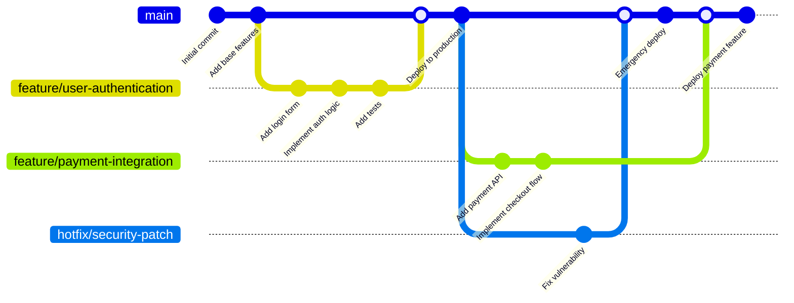
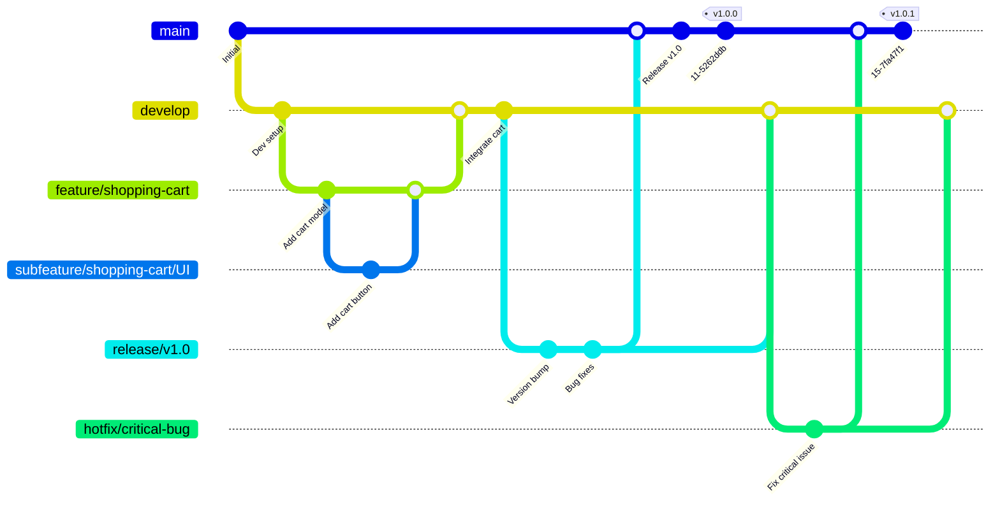
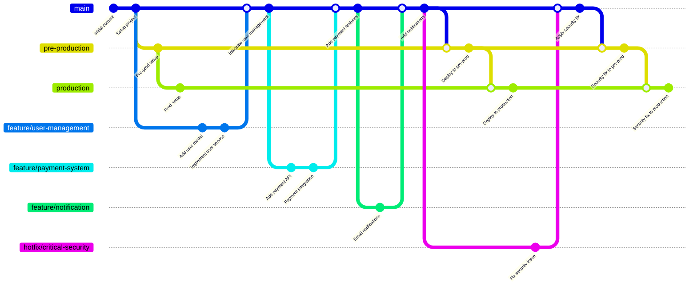
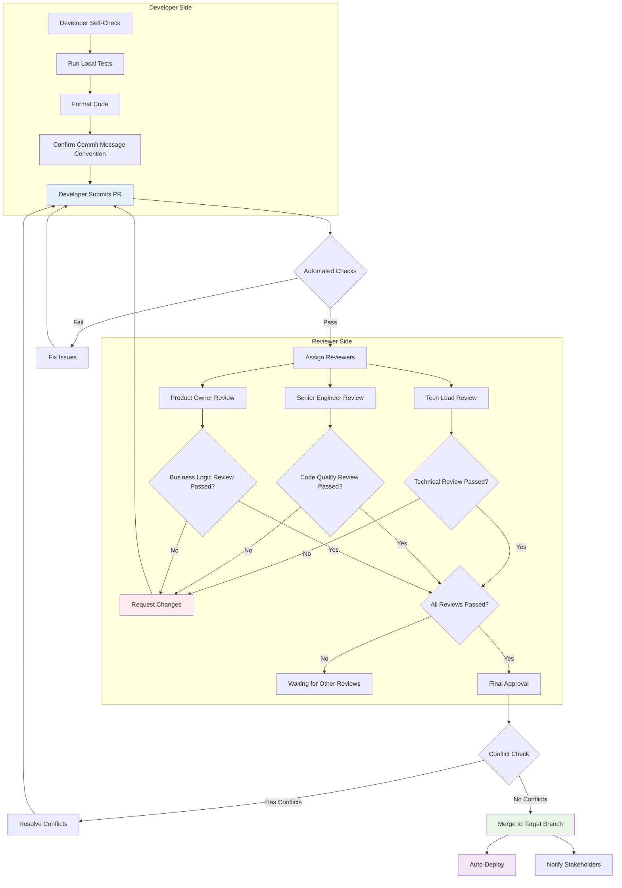
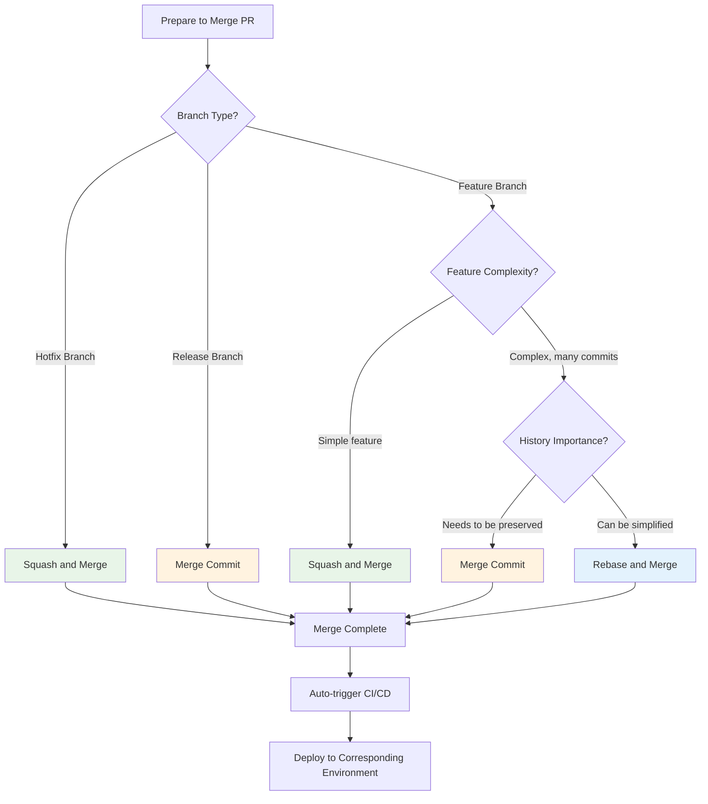

# Day 12 | Version Control Strategy (PR Review Strategy) × Git Flow × Lint Introduction: Code Quality Control and Development Process Standardization

Today, let's talk about something simple and relaxed, which in some ways is more likely to be social engineering than software engineering—especially if we don't diligently sync with the latest branch.

Imagine we're not writing code, but co-authoring a masterpiece like "Harry Potter" or "The Lord of the Rings" with a group of top writers. How would you ensure that everyone's chapters have a consistent style, the plot doesn't have contradictions, there are no typos, and before the final publication, the proofreading and revision process is orderly?
Let's start with a more concrete analogy.

Imagine we are the chief engineering team for a top F1 racing team. Our mission is to build a championship-winning car. How do you ensure that the designs from the aerodynamics, engine, and suspension departments work together perfectly instead of interfering with each other? How do you continuously introduce innovative designs during the season while ensuring the car's absolute stability during the main race? And how do you respond to unexpected situations during a race with lightning-fast pit stops?

Or let's take off our helmets and walk into a fashion design workshop. We are now the creative team for a top fashion brand, preparing for the highly anticipated spring fashion show. How do we ensure that the works of our many designers not only showcase individual talent but also align with the overall theme and brand DNA of the season? How do we manage the complex process from sketches, pattern making, and sample garments to the final fitting, ensuring every piece is flawless? And how do we elegantly handle an unexpected issue with a model's dress just moments before the show starts?

Whether it's building a race car or preparing for a fashion show, the core challenge is the same: **how to enable a team to collaborate systematically in a high-pressure, complex environment, continuously deliver high-quality work, and effectively manage risks.**

In other words, Git, strictly speaking, is just a recording tool. The Git workflow is a process control that has been acculturated. In reality, another face of **version control strategy** is **management methodology**!

This is also the part where AI cannot make decisions and execute for us. Perhaps an AI Agent can perform analysis and provide suggestions in the data world, and even self-grow based on fine-tuned underlying logic—like the famous von Neumann machine. But **conceptual decision-making** and execution policies can only be evaluated and confirmed by us. This is related to the dual constraints of objective ordinary physical laws and mathematical theoretical verification in reality (thank God, I haven't forgotten yet). But it is undeniable that **management** is like a gardener. We must, when we find that our focused race car, clothing, code, and products require trade-offs based on complex situations, re-regulate the future direction based on the **core abstract requirements (Domain)**.

So, let's first understand a few **driving reasons** in management. In the continuous discussion, we will see the management policy styles of `GitHub Flow`, `Git Flow`, and `GitLab Flow`—this is normal, just as we said before:

```python
Git workflow == Acculturated process control == Management science
```

As software development teams scale and project complexity increases, choosing a suitable version control management strategy has become a key factor affecting development efficiency and code quality. In modern software development, **version management is not just a tool for recording code history, but the core foundational process for team collaboration, quality assurance, and risk control.**

## Management Driving Principles

Behind almost every mainstream management methodology, there is one or more core "Drivers," which determine what the methodology cares about most and what problems it prioritizes solving. The main ones are **Process**, **Efficiency**, **Quality**, and the subsequent extensions of **Value** and **Schedule**.

Let's use some short stories to understand the background.

### The Triadic Methodology of Stability (Absolute Justice of Process), Quantity (Rapid Market Entry), and Quality (Flawless Delivery)

Most process management methodologies were born after the Industrial Revolution and the post-WWII industrial structure transformation. At that time, all business owners, already having their own production lines, faced competition and changes in the general environment. Therefore, a clearer and faster response method was needed. Thus, **Process & Control Driven**, **Efficiency & Flow Driven**, and **Quality & Data Driven** methodologies were born.

#### The Absolute Justice of Process

The core philosophy of **Process & Control Driven** is that **success comes from predictability and repeatability**. As long as we establish a robust, clear process and strictly follow it, we can control risks and ensure the project stays on track. `"Are we following the plan?"`, `"Are responsibilities clear?"`, `"Are risks under control?"` are the most important questions in this logical context. This management process is suitable for projects with clear requirements, few changes, and high demands for compliance and documentation (such as construction, government projects). The **`Waterfall Model`** is a typical representation of a Process Driven approach, being the purest linear process, emphasizing the perfect completion of one stage before moving to the next. In addition, there is **`PRINCE2®`**, which extremely emphasizes "control," ensuring every step of the project is under high-level control and always serves business goals through phased management and management by exception. And the culmination of process-driven methods - **`PMBOK®`**, which provides the most comprehensive process "map," defining what should be done and considered from the beginning to the end of a project.

#### Rapid Market Entry

The core philosophy of **Efficiency & Flow Driven** is to **maximize output speed (throughput) and minimize the time from input to output**. The value of a project lies in its smooth **"flow"**; any stagnation, waiting, or rework is waste. The core questions are `"Where is the bottleneck?"`, `"What is slowing us down?"`, `"How can we eliminate waste?"`. This methodology is particularly focused on environments that require rapid delivery, are highly repetitive, and pursue operational efficiency (such as manufacturing, customer service, software maintenance). Representative methodologies include: **`Lean`** - its sole goal is to identify and eliminate all "waste" in the process, allowing value to flow smoothly to the customer; **`Theory of Constraints (TOC)`** - which points out that the efficiency of the entire system depends on the slowest "bottleneck" and all optimization must focus on it; and **`Kanban`** - which forces work to flow smoothly and avoids blockages by visualizing and limiting Work in Progress (WIP).

#### Flawless Quality Delivery

The final part of this phase is **Quality & Data Driven**. Its core philosophy is that **intuition and experience are unreliable; only objective data and rigorous statistical analysis can bring fundamental improvements in quality.** This driving principle is mainly applied in fields with extreme requirements for precision and reliability (such as aviation, medical equipment, semiconductor manufacturing). **Variation is the enemy of quality**, and the results of tasks in execution **must not have discrepancies**. The focus is often on `"What does the data say?"`, `"How large is the process variation?"`, `"What is the root cause of the problem?"`. The methodology actually applied is **`Six Sigma`**. This is the ultimate embodiment of quality-driven, using statistical methods like DMAIC to aim for reducing the defect rate of a process to almost zero.

Looking at an existing pipeline process, a product's mainstream (main) will differentiate its division of labor based on the characteristics of its **Domain's** **requirements**. For example, **Process Driven** was born out of its primary requirement for **sequentiality**—we can't build a house without a foundation. **Efficiency Driven** is for capturing **market coverage**. Once a product is excluded from the market, it's as if it's been sent to the gallows. Rather than being slowly strangled by the noose and waiting to suffocate, it's better to go all-in and deliver the product to the customer first, then adjust based on market feedback. **Quality Driven** focuses on the **error rate**. The most obvious real-world example is the operating room process. If any part of the process goes wrong, a life could be lost. Therefore, for quality-driven approaches, not even a single error is permissible.

Essentially, the first-stage management process methodologies represent a triadic issue of `Stability (Absolute Justice of Process)` <=> `Quantity (Rapid Market Entry)` <=> `Quality (Flawless Delivery)`. But correspondingly, what do we do when we face complex requirements? When the implementation of one methodology's requirement goes to an extreme, the other two aspects will inevitably be abandoned. Blindly pursuing quantity may cause the product to lose all the early-mover advantages in subsequent market competition because the basic quality does not meet the needs. At the same time, blindly pursuing the absolute perfection of specifications may cause all work to be stuck on the design blueprint, thus missing the execution schedule. This led to the birth of the second stage of management methodologies. **`Value Driven`** and **`Schedule Driven`** correspond to `Quality (Flawless Delivery)` x `Quantity (Rapid Market Entry)` and `Stability (Absolute Justice of Process)` x `Quantity (Rapid Market Entry)`, respectively. As for `Quality (Flawless Delivery)` x `Stability (Absolute Justice of Process)`, in theory, it can only be done slowly (e.g., deep-sea exploration, space colonization), so it's not considered—you probably can't physically enter space or the deep sea without solving power and material problems and verifying them, right...?

### Advanced Demand-Driven Needs: "Wanting It All"

As we said at the end of the first stage, when the implementation of one methodology's requirement goes to an extreme, the other two aspects will inevitably be abandoned. This is why **`Value Driven`**, focusing on `Quality (Flawless Delivery)` x `Quantity (Rapid Market Entry)`, and **`Schedule Driven`**, focusing on `Stability (Absolute Justice of Process)` x `Quantity (Rapid Market Entry)`, emerged. After all, there's a saying, `Time is money, my friend`. Just like missing the starting point of a stock market boom, all future profit margins will have a compounding effect, reducing the gap with the market index.

#### Demanding Both Flawless Quality and Rapid Delivery

**Value & Adaptability Driven** was created to solve this problem. **`The only constant is change itself.`** Instead of trying to create a perfect long-term plan, it's better to embrace change, continuously get feedback through rapid, short-cycle deliveries, and ensure we are **always** doing what is **"most valuable to the customer."** When we embrace emerging markets, we can't just ramp up production based on our own imagination. A product nobody wants is basically a loss. If you don't meet the market's needs, why should the market pay for a solution that doesn't satisfy them? `"Are we doing the 'right' thing?"`, `"Does the customer really need this?"`, `"How quickly can we get market feedback?"` These questions need to be intermittently confirmed, especially in fields like innovative product development, software engineering, and marketing, where requirements are uncertain and rapid trial-and-error is needed. As mentioned earlier (see <Building a Deliverable System Design from Scratch>), the **`system's organicity and purpose`** are key. A system is a conceptual life form. Facing the threat of survival (being eliminated by the market), it must constantly confirm market feedback and **evolve** based on that feedback. Therefore, **`Scrum`**, which ensures the team can regularly deliver usable products through short-cycle "Sprints" and adjust the next sprint's goals based on customer feedback, and **`Agile`**, which places "responding to change" above "following a plan," are survival methods for adapting and evolving in a constantly changing and fierce environment.

#### Demanding Both Rapid Delivery and Correct Process

The core philosophy of **Schedule & Dependency Driven** is that **a project's success primarily depends on its ability to be delivered on time.** To achieve this, one must clearly map out the dependencies between all tasks and find the "critical path" that determines the total project duration. `"Which tasks must be completed first?"`, `"Which task's delay will affect the entire project?"`, `"What is our critical path?"` In a large project with numerous and complex dependencies, we must quickly clarify the context and immediately divide the pipeline based on the precedence relationships of all tasks, splitting out parallel workflows as much as possible to reduce wasted waiting time. It's like in large-scale event planning or engineering construction, setting up the venue and preparing engineering materials can be done simultaneously. You don't have to wait for the H-beams to arrive before preparing the right amount of rivets. The methodologies applied here are the **`Critical Path Method (CPM)`** and the **`Program Evaluation and Review Technique (PERT)`**. These two are tools born purely to solve schedule and dependency problems and are the core of schedule management.

## Summary

1.  **Process & Control Driven**
    *   **Core Philosophy:** Success stems from predictability and repeatability. By establishing and strictly following a robust, clear process, we can control risks and keep the project on track.
    *   **Core Questions:** "Are we following the plan?" "Are responsibilities clear?" "Are risks under control?"
    *   **Representative Methodologies:**
        *   **PMBOK®:** Provides the most comprehensive process "map," defining what to do and consider from start to finish. It's the epitome of process-driven.
        *   **PRINCE2®:** Heavily emphasizes "control." Through phased management and management by exception, it ensures every step is under high-level control and serves business goals.
        *   **Waterfall Model:** The purest linear process, emphasizing the perfect completion of one stage before moving to the next.
    *   **Applicable Scenarios:** Projects with clear, stable requirements and high demand for compliance and documentation (e.g., construction, government projects).

2.  **Efficiency & Flow Driven**
    *   **Core Philosophy:** The value of a project lies in its smooth "flow." Any stagnation, waiting, or rework is waste. The goal is to maximize throughput and minimize lead time.
    *   **Core Questions:** "Where is the bottleneck?" "What is slowing us down?" "How can we eliminate waste?"
    *   **Representative Methodologies:**
        *   **Lean:** Its sole purpose is to identify and eliminate all "waste" in the process, allowing value to flow smoothly to the customer.
        *   **Theory of Constraints (TOC):** Pinpoints that the entire system's efficiency is determined by the slowest "bottleneck," and all optimization should focus there.
        *   **Kanban:** Forces work to flow smoothly and prevents blockages through visualization and limiting Work in Progress (WIP).
    *   **Applicable Scenarios:** Environments that are highly repetitive and pursue operational efficiency (e.g., manufacturing, customer service, software maintenance).

3.  **Quality & Data Driven**
    *   **Core Philosophy:** Intuition and experience are unreliable. Only objective data and rigorous statistical analysis can bring fundamental quality improvements. Variation is the enemy of quality.
    *   **Core Questions:** "What does the data say?" "How large is the process variation?" "What is the root cause of the problem?"
    *   **Representative Methodologies:**
        *   **Six Sigma:** The ultimate expression of quality-driven. It uses statistical methods like DMAIC to reduce the defect rate to near zero.
    *   **Applicable Scenarios:** Fields with extreme requirements for precision and reliability (e.g., aviation, medical devices, semiconductor manufacturing).

4.  **Value & Adaptability Driven**
    *   **Core Philosophy:** The only constant is change. Instead of creating a perfect long-term plan, embrace change, get continuous feedback through rapid, short-cycle deliveries, and ensure you are always doing what is "most valuable to the customer."
    *   **Core Questions:** "Are we doing the 'right' thing?" "Does the customer really need this?" "How quickly can we get market feedback?"
    *   **Representative Methodologies:**
        *   **Agile:** This is its manifesto. It values "responding to change" over "following a plan."
        *   **Scrum:** Ensures the team regularly delivers usable products through short-cycle "Sprints" and adjusts the next sprint's goals based on customer feedback.
    *   **Applicable Scenarios:** Areas with uncertain requirements that need rapid trial-and-error, such as innovative product development, software engineering, and marketing.

5.  **Schedule & Dependency Driven**
    *   **Core Philosophy:** A project's success primarily depends on on-time delivery. To achieve this, you must clearly map all task dependencies and find the "critical path" that determines the total duration.
    *   **Core Questions:** "Which tasks must be completed first?" "Which task's delay will affect the entire project?" "What is our critical path?"
    *   **Representative Methodologies:**
        *   **Critical Path Method (CPM)** and **Program Evaluation and Review Technique (PERT):** These are tools created purely to solve schedule and dependency problems and are the core of schedule management.
    *   **Applicable Scenarios:** Projects with numerous and complex dependencies, such as large-scale event planning and engineering construction.

### Mainstream Git Workflow Analysis

Having discussed the `3+2` driving reasons for process management, let's look at the common **Git workflows** in the market today.

`GitHub Flow` aligns very well with the Agile spirit. Every time a feature branch is merged into main, it's deployed directly. This is a manifestation of rapid delivery and continuous integration. The "code review culture establishment" and "commit message standardization" mentioned in your document are all to promote efficient communication in agile development.

#### 1. GitHub Flow - A Simple and Efficient Continuous Deployment Model

`GitHub Flow` is very much in the spirit of Agile. Every time a feature branch is merged into `main`, it is deployed directly. This embodies rapid delivery and continuous integration, making it particularly suitable for teams practicing continuous deployment and rapid iteration.



**GitHub Flow Core Features:**

-   Only one long-lived branch (`main`/`master`)
-   All new features are branched off from `main` into new feature branches
-   Code review is conducted via Pull Requests
-   Merged code is immediately deployed to the production environment

#### 2. Git Flow - A Strict Release Management Model

`Git Flow`, due to its requirements for versions and cycles, is suitable for large projects with fixed release schedules. The merging rules for its branches have clear precedence characteristics reminiscent of the Critical Path Method:

-   `subfeature` must be merged into `feature` first: Although you must build the walls before installing windows and the roof, "laying plumbing and electrical" and "installing windows" might be done concurrently. In fact, to reduce redundant time waste, large features should be broken down into large feature clusters as much as possible at the beginning.
-   `feature` must be merged into `develop` first: This is like the "design blueprint" must be completed before it can be handed over to the "factory" for production. You can't just release an untested feature draft directly online.
-   `develop`, after testing, can create a `release` branch: This is like the factory's "sample" must pass quality control before entering the "mass production preparation" stage.
-   `release` branch, once stable, can be merged into `main`: This is like after "mass production preparation" is complete, the product can be officially "launched for sale."



**Git Flow Branch Types:**

-   **main**: Production environment code
-   **develop**: Development environment integration branch
-   **feature/**: Feature development branch
-   **subfeature/**: Sub-feature (subdomain) development branch under a feature (domain)
-   **release/**: Release preparation branch
-   **hotfix/**: Emergency fix branch

#### 3. GitLab Flow - Environment-Driven Deployment Strategy

GitLab Flow combines the simplicity of GitHub Flow with the environment management of Git Flow:



## Review Process Design

After understanding the various management-driven principles, let's see how these theories are reflected in the actual code review process. **The PR (Pull Request) / MR (Merge Request) review process is essentially a multi-objective optimization management decision system**.

Imagine that each PR is like a "product proposal" that must go through a rigorous "review process" before it can be incorporated into the company's official product line (merged into the main branch). This review process must find the optimal balance between **value creation** and **schedule management**.

**The Complete Code Review Process**



First, on the developer's side, after completing the development of a feature specification, tests must be conducted locally according to the initially discussed **boundaries** and **scenarios**, like an automated quality inspection line in a factory, to ensure the basic specifications are met and to avoid failing to meet the requirements from the very beginning.

Lint allows us to discover and correct "low-level mistakes" at the first opportunity. It "formats" all developers' code into a nearly identical style, greatly improving code readability. This is like requiring all writers to use the same font and layout, so that subsequent proofreading (PR Review) can focus on the "plot" itself, rather than wasting time picking out typos. Therefore, in the flowchart, `P2[Run Local Tests]` must complete the following standards:

1.  Local UnitTest
2.  Local IntegrationTest
3.  ESLint
4.  SonarLint

After modification and adjustment, it is then handed over to `P3[Format Code]` for team style guide integration to avoid unnecessary git diff records, such as line breaks and spaces.

Only after completing the personal checks can it enter the review stage, and it needs to pass three verification gates: **Peer Review Gate**, **Business Review Gate**, and **Quality Review Gate**.

During the development process, for example, there might be confusion or even misuse between the `service` (business logic application layer) and `repository` (external system interface layer). Although this might not affect the functionality, as the code grows, if the logic is not cleanly separated, it will become part of the legacy code mess in the future. Therefore, from the beginning, it must be handed over to another development team partner for a **Peer Review Gate** to confirm the architecture and style.

The **Business Review Gate** and **Quality Review Gate** are not vastly different, and may even be combined when manpower is insufficient (hopefully not). To be specific, the **Business Review** confirms the **perfect business execution rate in a single environment**, while the **Quality Review Gate** verifies the **business execution success rate with maximum coverage in multiple environments**. The most important thing for this review gate is to confirm that the **business function can be executed completely**. Even if the code is elegant and concise, if it ultimately cannot fulfill the initial requirements, it will eventually fall into the slow death of being abandoned by the market. So, the most important thing for the **Business Review Gate** is to ensure the business logic is consistent with the pre-system design (this is the best-case scenario), or with the constantly adjusted business requirements (this is the worst-case scenario - and the most common one).

Here is a simple guide for reference - as I said, `(git version management) is in some ways more likely to be social engineering than software engineering`. Try to maintain a Love & Peace attitude when dealing with it, which is better for our own blood pressure.

**Code Review Guide**

```markdown
### Reviewer Responsibilities

1.  **Timeliness**: Complete reviews within 24 hours.
2.  **Constructiveness**: Provide specific improvement suggestions, not just point out problems.
3.  **Educational**: Share knowledge and best practices.
4.  **Respectfulness**: Maintain a professional and friendly communication attitude.

### Review Focus

-   Business logic correctness
-   Code readability and maintainability
-   Performance impact assessment
-   Security considerations
-   Test coverage

### Common Review Comment Templates

Suggestions for improvement:

-   Consider using `const` instead of `let` since this variable is not reassigned.
-   This function is a bit complex; consider breaking it down into smaller functions.

Questions:

-   Does the error handling logic here consider all edge cases?
-   Why was this implementation chosen over the XYZ approach?

Praise:

-   The test coverage is very comprehensive, especially the handling of edge cases.
- The code structure is clear, and the variable naming is very meaningful.
```

```markdown
### Commit Message Convention

CommitMessageFormat:
Pattern: "{type}: {description}"

Types:
feat: "New feature"
fix: "Bug fix"
docs: "Documentation update"
style: "Code style adjustment"
refactor: "Code refactoring"
test: "Test related"
chore: "Changes to build tools or auxiliary tools"
perf: "Performance optimization"

Examples:

- "feat: add user authentication"
- "fix: resolve timeout issue in payment service"
docs: "update installation instructions"
- "refactor: simplify date formatting functions"
```

Only after the three-party review is complete can the branch be merged. If there are any unacceptable discrepancies, it must be returned to the developer for readjustment. This entire process embodies the essence of systems thinking: **local optimization must serve global optimization**. The design of each review link is not for the "perfection" of the link itself, but for the stability, efficiency, and high quality of the entire software delivery system. Like a precision Swiss watch, each gear (review link) has its specific role and rhythm, and their coordinated operation ultimately ensures the accurate timekeeping (stable delivery) of the entire clock (software system).



Today we discussed the management essence of version control strategies, viewing Git workflows as concrete practices of management methodologies. Tomorrow, let's talk about cross-team collaboration in practice.
