# Day 24 | Defining and Measuring Reliability: SRE Method and Error Budget Practice - Core Concepts of SLI, SLO, and Error Budget, Data-Driven Decisions to Balance Innovation Speed and System Stability

Today, we will discuss the Site Reliability Engineering (SRE) methodology, which transforms `system reliability` from a vague concept into a quantifiable engineering discipline.

In the battlefield of modern software development, a never-ending tug-of-war is staged in almost every organization:

- The Force of Innovation (Devs & Product Managers): They desire rapid iteration, launching new features to capture the market. They are the organization's "accelerator."
- The Force of Stability (Ops & Infra Teams): They are responsible for ensuring the normal operation of services, avoiding failures, and ensuring user experience. They are the organization's "brakes."

Traditionally, the goals of these two forces seem fundamentally opposed, and their communication is often filled with friction, suspicion, and subjective emotional debates.

> "Your new feature crashed the server!"
>
> "Your process is stifling innovation!"

Such arguments are the nightmares of many engineers, day and night.

This conflict stems from the lack of a common language and goal between the two parties. Although we mentioned a common understanding of system boundaries in <Cross-Team Collaboration Design: Technical Documentation, OpenAPI, Shared Contracts: API Documentation and Team Collaboration Standard Establishment>, this tug-of-war is essentially closer to a **zero-sum game**. Pursuing rapid feature releases means you can't guarantee 100% feature completeness, and vice versa. Ensuring 100% feature completeness might mean missing the market timing. One seeks new foundations for system life, while the other ensures the current foundations. Neither is right or wrong; it's just a matter of perspective.

The birth of `SRE (Site Reliability Engineering)` was to resolve this conflict. It proposed a revolutionary viewpoint:

> We **should not ask "whether to hit the brakes"**, but **should ask "how far are we from the cliff ahead?"**

SLI, SLO, and Error Budget are the engineering instruments we use to precisely measure the "distance to the cliff."

I am fortunate to have witnessed the hope of human space colonization while writing this series of articles (in 2025). Breakthroughs in chips, the liberation of computing power, and the increased precision of AI are composite factors that are liberating traditional labor costs. Elon Musk is a dreamer. He could have reinvested his assets into the old financial games to become a new generation of Wall Street family, but he chose to invest his assets in the research and development of new-era space rockets to open up future possibilities for humanity. If I had the chance, I would volunteer for space adventures and colonization—Earth's gravity has bound my soul. Next, please indulge my willfulness and romance, and let me use the "oxygen budget" of a space colony as an example.

**The "Oxygen Budget" of the Moon Colony—A Balance of Survival and Exploration**

We are the captain of a lunar exploration vessel, tasked with exploring a lunar canyon never before visited by humans. There are two main groups on the exploration vessel:

- The scientists on board (the development team): They are eager for new discoveries. They want the submersible to stay longer in the lunar canyon, explore farther into unknown areas, and use high-energy-consuming detection equipment.
- The life support system engineers on board (the operations team): They care about only one thing: ensuring everyone can return to the lunar base alive. They keep a close eye on oxygen levels, battery power, and cabin pressure.

Without SRE, this would be a battle of wills. The scientists would constantly pressure, demanding "just one more hour," while the engineers would firmly oppose, citing "safety first."

**The introduction of SRE is to explicitly define the "oxygen supply" as an error budget.**

- SLO: This mission must begin its return journey with 70% of the oxygen safety reserve remaining.
- Error Budget: This means we have a **30% "exploration budget"** to consume.

Now, all decisions become clear:

- Turn on the high-power sonar detection? Sure, but the dashboard will show that this will consume 5% of the oxygen budget.
- Stay an extra 30 minutes at an interesting crater? Sure, this will consume 10% of the oxygen budget.
- Travel to a more distant lunar mountain range? Sure, but the round trip will consume 15% of the oxygen budget.

The captain and all crew members can see the real-time consumption of the budget on a large screen. Scientists can autonomously decide how to "spend" their budget to maximize scientific results. Once the budget is exhausted, an alarm will automatically sound, the system will lock high-energy-consuming equipment, and the exploration vessel must return unconditionally.

**The importance of SRE**: It transforms the vague concept of "risk" into a quantifiable, tradable, and manageable strategic resource. It allows the team to no longer argue about "whether to take risks," but to jointly decide "where our risk budget should be spent most worthily."

The core insight of SRE is that: **the reliability of a system should not be a vague, elusive art, but a science that can be `precisely defined`, `quantified`, and systematically improved through `engineering methods`**.

## The Core Thinking of SRE Methodology

The first disruptive thinking of SRE is: **100% reliability is a lie, and even more so, a trap.**

Pursuing absolute perfection is not only impractically expensive but also stifles all possibilities for innovation. Besides, users **don't care if our system is 100% available**. They **care that the system is "reliable enough" when they need it**.

Therefore, the core of SRE is not to "eliminate" errors, but to treat "errors" or "unreliability" as a limited, manageable resource. This leads to our three protagonists today: SLI (Service Level Indicators), SLO (Service Level Objectives), and Error Budget.

### From "Never Down" to "Appropriately Reliable"

**The Myth and Trap of 100% Reliability**

Pursuing "five nines" (99.999%) or even higher reliability is not only almost impossible technically (we cannot control backbone networks, hardware failures, or even solar flares), but also a disaster commercially. The cost of reliability does not grow linearly, but exponentially.

- From 99% to 99.9%: May require adding some redundant servers.
- From 99.9% to 99.99%: May require building cross-continental disaster recovery, more complex load balancing, and data synchronization mechanisms.
- From 99.99% to 99.999%: The cost will be unimaginably high, requiring an extremely complex architecture, and this complexity itself will become a new source of failure.

Most importantly, do users really care about this huge investment? Is it really worth giving up developing new features that users are genuinely looking forward to, just to avoid an extra 5 minutes of downtime per year? SRE forces us to ask this question.

SRE proposes a disruptive viewpoint: the reliability of a system is not determined by our servers, but defined by our users.

If our system is down for an hour at 3 a.m. when all users are asleep, then from the user's perspective, our availability is 100%. Conversely, if all our web servers are running normally, but every page takes 30 seconds to load due to slow backend database queries, then from the user's perspective, our service is **"unavailable"**.

This is why we emphasized in the previous lesson that SLIs must reflect the user experience. We are not guarding the running lights of machines, but the satisfaction of users.

The word "Appropriately" in "Appropriately Reliable" is the essence of SRE. It acknowledges that reliability is a feature of the product, it has a cost, and it brings value. Therefore, the level of reliability should be a conscious, data-driven business decision, not an infinitely pursued technical indicator.

A hospital's heart rate monitor system and an online meme generator obviously require vastly different levels of "appropriate" reliability. The task of SRE is to work with product and business parties to precisely define the SLO that fits the product's positioning, no more, no less.

> **A system should be "reliable enough," not "perfectly reliable."**

This standard of "enough" is scientifically defined through SLIs and SLOs.

### The Three Core Pillars of SRE

```
SLI (Service Level Indicators) → "How to quantify"
SLO (Service Level Objectives) → "What is the goal"
Error Budget → "How to decide"
```

If "appropriately reliable" is the guiding philosophy of SRE, then the following three pillars are the action framework for translating that philosophy into daily practice:

- Pillar One: Defining Goals with Data

  - This is the part we have already discussed in depth, and it is the foundation of everything.
  - Core tools: SLI, SLO, Error Budget.
  - Core value: It provides a common, objective, and indisputable language for all stakeholders within the organization (development, operations, product, management). When discussing whether to release a new feature, we no longer say "I think it's too risky" based on feeling, but can clearly point out "Our error budget for this month is only 15% left. Based on past experience, this release has a 50% chance of consuming 20% of the budget, so the risk is too high." This transforms a potential conflict into a rational decision based on probability and data.

- Pillar Two: Engineering against Toil

  - This is the most significant feature that distinguishes SRE from traditional operations.
  - Defining "Toil": Google SRE defines it as manual, repetitive, automatable work that lacks long-term value. For example, manually restarting a crashed service, manually configuring a new server, manually running a script to clean up disk space. This work is not only tedious, but worse, its scale grows linearly with the size of the system, eventually consuming everyone's time.
  - The engineering nature of SRE: SREs are software engineers who solve "operational problems." Their primary task is not to "do" this toil, but to "develop" systems and tools that permanently solve this toil. They will write a program that automatically monitors and restarts services, rather than restarting it by hand. They will use Terraform or Ansible to automate configuration, rather than logging into servers to type commands.
  - The 50% rule: A healthy SRE team should spend at least 50% of its time on engineering projects to reduce future toil or improve system reliability. If toil takes up more than 50% of the time, it is a clear warning sign that the team is being overwhelmed by problems and needs to pause accepting new operational tasks to prioritize automation development.

- Pillar Three: Embracing Risk & Managing Failure

  - This is the cultural embodiment of SRE. In a healthy SRE culture, failure is not a disaster, but the most valuable learning opportunity the system provides us.
  - Blameless Postmortems: When an incident occurs, the primary principle of SRE is to be blameless. The focus is always on what part of the system went wrong, not which operator made a mistake. Because human error is often just a symptom of deeper systemic problems (e.g., poor interface design, lack of safety checks, outdated documentation). Through in-depth, honest post-mortems that do not assign personal blame, the team can find the root cause of the problem and take engineering measures (e.g., adding checks, optimizing processes, strengthening automation) to ensure that similar problems do not happen again.
  - Using the error budget as a risk management tool: The error budget is not just a passive monitoring indicator; it is also an active risk planning tool. The team can consciously "spend" the budget to conduct chaos engineering tests, perform high-risk architectural upgrades, or verify the stability of new features. It gives the team the courage to actively explore the boundaries of the system and embrace innovation within a safe framework.

## SLI: Service Level Indicators - Quantifying User Experience

Having established the macroscopic thinking framework of SRE, it is now time to delve into its most critical practical foundation—Service Level Indicators (SLI).

An SLI (Service Level Indicator) is the "thermometer" we use to measure the health of a service.

A good SLI must satisfy a golden rule: **it must reflect the real user experience**. Users don't feel whether our server's CPU usage is 10% or 90%; but they do feel whether the page loads in 0.5 seconds or 5 seconds after they click the "buy" button.

So, SLIs are indicators viewed from the outside in. Let's take a few examples:

- Availability: What percentage of all "read article" requests successfully return content?
  - Formula: (Number of successful requests / Total number of requests) * 100%
- Latency: What percentage of all successful "search product" requests have a processing time within 300 milliseconds?
  - Formula: (Number of requests with response time < 300ms / Total number of successful requests) * 100%
- Quality: What percentage of all "video playback" requests are streamed in high definition (HD) instead of being downgraded to standard definition (SD)?
  - Formula: (Number of HD playbacks / Total number of playbacks) * 100%

The process of defining SLIs forces us to break away from our engineer-centric perspective and start looking at our own products through the eyes of our users.

### Core Principles of SLI

Having established the macroscopic thinking framework of SRE, it is now time to delve into its most critical practical foundation—Service Level Indicators (SLI).

If SRE is an engineering discipline that makes reliability a science, then SLI is the unit of measurement for this science. Without precise measurement, all goals (SLO) and budgets (Error Budget) are just castles in the air.

An SLI must:

1. **Reflect the real user experience**
2. **Be quantifiable and standardized**
3. **Less is more**
4. **Align with business goals**

**1. Absolute "User-Centricity"**

This is the most important first principle. Always ask: `"What do my users care about?"` not `"What is my server doing?"`

- Bad examples: Server CPU usage, memory consumption, network throughput. These are system metrics. They are the causes of problems, but not the problems themselves. Users have no feeling whether our CPU is at 10% or 90%.
- Good examples: Page load speed, request success rate, file upload completion time. These are experience metrics that users can directly feel.

**2. Quantifiable & Standardized**

An SLI must be a number that can be calculated, usually a ratio or distribution. The most common standardized format is:

> SLI = (Number of good events / Total number of valid events) * 100%

This simple formula forces us to clearly define what constitutes a "good" event and what constitutes a "valid" event. For example, for the availability SLI of an API:

- Good events: Requests with HTTP response codes of 2xx or 3xx.
- Valid events: All requests, but excluding those caused by client-side errors (e.g., HTTP 4xx), because that is not our system's responsibility.

**3. Less is More**

A service should not have dozens of SLIs. Too many indicators lead to too much noise, alert fatigue, and obscure the real focus. Usually, a key user journey only needs to focus on 2-3 core SLIs (e.g., availability, latency, correctness) - we need to focus on **information density**.

**4. Cover Critical User Journeys**

Not all features in our service are equally important. We need to identify the paths that have the highest value for users and the business, and prioritize defining SLIs for them.

- For an e-commerce website: Searching for products -> viewing product details -> adding to cart -> checking out. The reliability of this path is far more important than the reliability of the "modify profile picture" feature.
- For a video platform: Video playback success rate and start-up latency are more core SLIs than posting comments.

**The Four Golden Signals of SLI**:

| **Signal Type** | **Definition** | **User's Concern** | **AWS Implementation Example** |
|---|---|---|---|
| **Latency** | Time to process a request | "How fast does the website load?" | CloudWatch ResponseTime |
| **Traffic** | Measure of system demand | "How many users can the system handle?" | CloudWatch RequestCount |
| **Errors** | Rate of failed requests | "Is the feature working correctly?" | CloudWatch 4xx/5xx Error Rate |
| **Saturation** | Degree of service resource usage | "Will the system crash?" | CloudWatch CPU/Memory Utilization |

As an "Architect of Systems & Experiences," our task is not only to build systems, but also to ensure that the systems we build truly serve the most valuable "experiences." Identifying these key paths is the "anchor point" of our architectural work.

> **The core of SRE practice is not just a `technical issue`, but a `business strategy issue`. The core of SRE practice is actually: `"How to find the soul of a digital product?"`**

This should not rely solely on intuition, but requires a systematic methodology. Here I share a two-dimensional framework combining value and frequency that I used when executing digital marketing campaigns, as well as a three-lens analysis method to accurately locate these paths.

First, to identify the importance of a user path, we must evaluate it from two dimensions: how much **Value** it brings to the business, and how often it is used (**Volume**). By placing all features and paths into this four-quadrant matrix, their priorities become clear at a glance.


**Quadrant 1: The Lifeline - High Value, High Frequency**

Characteristics: This is the heartbeat of our product. Users use these features every day, every hour, and they directly or indirectly contribute to the vast majority of business value.

Examples:

- E-commerce platform: Product search, browsing product list pages
- Video platform: Video playback, homepage content recommendation
- Social platform: Loading the feed

SRE Strategy: Must set the strictest SLI/SLO. Availability, latency, and correctness are all indispensable. The error budget is extremely precious, and any consumption requires immediate attention. This is where we need to invest the most monitoring and automation resources.

**Quadrant 2: Critical Moments - High Value, Low Frequency**

Characteristics: These are decisive, high-risk "final kicks." Users don't perform them often, but when they do, failure is absolutely not allowed. The consequences of failure are often direct revenue loss or user churn.

Examples:

- E-commerce platform: Checkout process, new account registration
- Video platform: Subscription payment
- SaaS service: Data export, annual report generation

SRE Strategy: SLOs are equally strict, especially in terms of Availability and Correctness. The tolerance for latency may be slightly higher than in the first quadrant, but failure is unacceptable. Disaster recovery plans and data consistency guarantees are the focus of this quadrant.

**Quadrant 3: The Periphery - Low Value, Low Frequency**

Characteristics: These are secondary or auxiliary features that have little impact on the core experience.

Examples:

- E-commerce platform: Modifying profile picture, writing product reviews
- Video platform: Changing the theme

SRE Strategy: Set the most lenient SLOs. The focus of monitoring is to ensure they are "not completely broken," rather than pursuing ultimate performance. The error budget for these features can be relatively abundant, and they can even serve as a testing ground for new technologies or high-risk changes.

**Quadrant 4: The Foundation - Low Value, High Frequency**

Characteristics: These are the basic features that form the background of the user experience. They do not directly create huge value themselves, but if they break, they will make the whole product feel "off" and affect user trust.

Examples:

- E-commerce platform: Login, viewing order history
- Video platform: Posting comments, adding to playlists
- General: Viewing help documentation (Help/FAQ)

SRE Strategy: Needs to be reliable, but the SLO can be more lenient than the first two. The focus is on stability and consistency. We can tolerate short-term performance degradation, but not complete unavailability. Self-healing is key here.

Once we have the basic framework, how do we accurately place features into the quadrants? We need to examine our product through three different "lenses." This is our standard operating procedure (SOP).

### The Three-Lens Analysis Method for Identifying Critical SRE Paths

To accurately identify the importance of a user journey, we must examine our product from three different perspectives. This three-lens analysis method ensures that we do not miss any key insights.


**First Lens: The Quantitative Lens - Objective Facts**

This is our first step, letting the data speak.

Tools: Website analytics tools (Google Analytics), Application Performance Monitoring (APM, e.g., Datadog, New Relic), backend logs.

Metrics we are looking for:

- **Traffic/Request Volume**: Which pages, API endpoints are called most frequently? (Positioning X-axis: Frequency)
- **Conversion Funnel**: In the "browse -> add to cart -> checkout" funnel, how many users are there at each step? Which step has the highest drop-off rate?
- **Feature Usage**: What percentage of active users have used a certain feature?
- **Revenue Contribution**: Which transactions or features directly generate revenue? (Positioning Y-axis: Value)

**Second Lens: The Qualitative Lens - Human Insights**

Data tells us "what happened," but qualitative analysis tells us "why it's important."

Tool: Talking to people.

People we need to interview:

- **Product Managers**: They know the product vision and business goals best. Ask them: "If we had to bet our salaries on it, which feature do we think absolutely cannot fail?"
- **Customer Support Team**: They are closest to user complaints. Ask them: "What type of issue gets the most customer support calls? What issue makes users furious?"
- **Sales Team**: They know what features customers are willing to pay for. Ask them: "What selling point of our product is the key to closing a deal?"
- **Users**: If possible, conduct direct user interviews. Ask them: "What is the one thing you want to accomplish most when you open our app today?"

**Third Lens: The Strategic Lens - Future Direction**

Finally, we need to look at it from the company's perspective.

Tools: Company quarterly/annual goals (OKRs), Business Model Canvas, competitor analysis.

Questions we need to think about:

- **Brand Promise**: Is our brand "the fastest," "the most reliable," or "the cheapest"? If we promise "fast," then the SLIs for search and page load speed are crucial.
- **Strategic Goals**: Is the company's goal this quarter to "increase new user registration rate"? If so, the value of the "registration process" path, which is a low-frequency path, should be strategically increased this quarter.
- **Future Development**: Are we about to launch a new feature based on AI recommendations and plan to make it the next growth engine? Then the SLI for this new feature should be considered a potential "lifeline" from day one.

| **Service Type** | **SLI Category** | **Indicator Definition (Formula)** | **Description** |
|---|---|---|---|
| **User Request-Driven Service**<br/>(e.g., Web API, E-commerce site) | Availability | `(HTTP 2xx/3xx responses) / (Total requests - HTTP 4xx responses)` | Measures if the service is "alive" and can successfully handle legitimate requests. |
| | Latency | `(Requests with response time < N ms) / (Total successful requests)` | Measures service responsiveness. Often set at multiple percentiles, like 95% (p95) and 99% (p99). |
| | Correctness | `(Successful requests with expected content) / (Total successful requests)` | Measures if the service response is correct. For example, a search API returning HTTP 200 but with an empty result might be an "incorrect" response. |
| **Data Processing Pipeline**<br/>(e.g., ETL, Report generation) | Freshness | `Data processing completion time - Data generation time < N hours` | Measures the timeliness of data output. Users care if the report data is the latest from yesterday. |
| | Coverage | `(Successfully processed records) / (Total records to be processed)` | Measures if data processing is complete, with no omissions. |
| | Correctness | `(Outputs passing data validation) / (Total outputs)` | Measures if the output data conforms to business rules or quality standards. |
| **Storage System**<br/>(e.g., Database, Object storage) | Availability | `(Successful read/write operations) / (Total read/write operations)` | Measures if the storage system can be accessed normally. |
| | Durability | Usually a design goal, not a real-time SLI | Measures the probability that stored data will not be lost. This is usually guaranteed through architectural design (e.g., multiple replicas, checksums), not real-time monitoring. |

### SLI Monitoring Dashboard Setup

After defining the SLIs, the next step is to visualize them into a dashboard that can guide decisions. A good SRE dashboard should be able to answer the following questions within 30 seconds: "Is our service okay right now? How much room for error do we have left?"

**Dashboard Core Component Architecture**

```mermaid
graph TD
    A[SRE Monitoring Dashboard] --> B[Decision Layer]
    A --> C[Monitoring Layer]
    A --> D[Diagnostic Layer]

    B --> B1[Error Budget Remaining<br/>🟢 Sufficient 🟡 Warning 🔴 Danger]
    B --> B2[Budget Burn Rate<br/>Burn Rate Indicator]
    B --> B3[SLO Attainment Status<br/>✅ Achieved ❌ Violated]

    C --> C1[Real-time SLI Performance<br/>Availability/Latency/Quality]
    C --> C2[SLO Target Line<br/>Promised Passing Grade]
    C --> C3[Trend Analysis<br/>28-day rolling window]

    D --> D1[System Metrics<br/>CPU/Memory/Network]
    D --> D2[Error Logs<br/>Quick Diagnostic Link]
    D --> D3[Event Timeline<br/>Historical Event Review]
```



**1. The SLO Target Line**

This is the most important visual element on the dashboard. A clear horizontal line representing our team's committed goal (e.g., 99.9%). All metrics should be compared against this line.

**2. Current SLI Performance Graph**

A line chart that changes over time, showing the actual SLI performance over a specific time window (e.g., a rolling 28 days). We can see at a glance whether we are currently above or below the target line.

**3. Error Budget Burn-down Chart**

This is the key chart for putting the SRE philosophy into practice at the decision-making level. It shows the percentage of the remaining error budget or the specific "unreliable time" (e.g., 15.3 minutes remaining) from the beginning of the cycle (e.g., the 1st of each month) to the present. When this line approaches zero, everyone will know that the "accelerator" of innovation must be released.

```mermaid
graph LR
    subgraph "Error Budget Consumption Visualization"
        A[Start of Month: 100%<br/>43.2 mins] --> B[Week 1: 95%<br/>41.0 mins]
        B --> C[Week 2: 85%<br/>36.7 mins<br/>🟡 Event Impact]
        C --> D[Week 3: 78%<br/>33.7 mins<br/>🟡 Warning State]
        D --> E[Week 4: 15%<br/>6.5 mins<br/>🔴 Danger State]
    end
```



**4. Burn Rate & Alerts**
A good dashboard not only shows "how much is left," but also predicts "how long it will last."

- Burn Rate: An indicator showing how fast our error budget is being consumed. For example, a Burn Rate = 2 means we are consuming the budget at twice the expected rate and are expected to run out in half the cycle.
- Alerts: Alarms should not only be triggered when "the SLO is violated," as that is already too late. More importantly, a warning should be issued in advance when "if the current consumption rate continues, our budget will be exhausted in X days," giving the team time to react.

**Dashboard Layout Example**

Top left (most prominent position): Display the current remaining error budget in the largest font size. This is the most important basis for decision-making.

Top right: Display a long-term trend chart of several core SLIs (availability, latency) relative to the SLO target line.

Bottom: Provide more detailed data charts, related system metrics (CPU, Memory), and quick links to error logs for in-depth diagnosis (drill-down) when problems occur.

```mermaid
graph TB
    subgraph "SRE Monitoring Dashboard Visual Layout"
        subgraph "Top Area - Key Decision Information"
            A1[Error Budget Remaining<br/>85.3%<br/>🟢 Healthy]
            A2[Budget Burn Rate<br/>Burn Rate: 1.2x<br/>🟡 Slightly Exceeded]
            A3[Current SLO Status<br/>Availability: 99.92%<br/>Latency: P95 450ms<br/>✅ All Met]
        end

        subgraph "Middle Area - Trend Monitoring"
            B1[SLI vs SLO Trend Chart<br/>📈 28-day rolling window]
            B2[Error Budget Burn-down Chart<br/>📉 Budget burn trend]
        end

        subgraph "Bottom Area - Detailed Diagnostics"
            C1[System Metrics<br/>CPU/Memory<br/>Detailed Data]
            C2[Error Logs<br/>Latest 50<br/>Quick Link]
            C3[Event Timeline<br/>Historical Events<br/>Root Cause]
        end
    end
```



Having mastered how to define, measure, and monitor SLIs, we have mastered the cornerstone of SRE practice. Next is SLO setting and error budget management.

## SLO: Service Level Objectives - The Target Line for Reliability

An SLO (Service Level Objective) is the "passing grade" we set for our SLI.

It is a specific goal, a public commitment between us, our users, and our business teams. It is usually defined as a percentage over a specific time window.

Continuing the examples above:

- Availability SLO: "Over the past 28 days, 99.9% of 'read article' requests must be successful."
- Latency SLO: "Over the past 28 days, 95% of 'search product' requests must be completed within 300 milliseconds."

Setting an SLO is an art, and also a business - it's not the higher the better.

A 99.9% SLO (often called "three nines") and a 99.999% SLO ("five nines") have vastly different engineering costs and complexities. We need to ask ourselves: is the huge cost paid for this extra 0.099% of reliability really bringing equivalent value to the user? Or would it be more valuable to invest these resources in developing a new feature?

If SLI is the thermometer, then SLO is the "optimal growing temperature" we set for our greenhouse based on science and experience. If the temperature is too high (the goal is set too strictly), it will exhaust all energy and stifle growth; if the temperature is too low (the goal is set too loosely), the crops (user experience) will wither.

Setting an SLO is not a purely technical decision. It is a delicate diplomatic negotiation, a process of finding the optimal balance between technical feasibility, user expectations, and business costs.

> **An SLO is the result of joint negotiation among product, development, and operations. It is a data-driven boundary that clearly defines what it means for a "service to be running well."**

### The Art and Science of Setting SLOs

Behind an SLO number lies a deep understanding of the business and a precise grasp of technology - it is both a scientific method and an artistic philosophy. The setting of a common SLO needs to balance multiple factors:

```yaml
SLO Setting Considerations:
User Expectations: The bottom line of service quality that users can tolerate
Business Impact: The financial impact of service interruption on the business
Technical Reality: The technical limitations of the system architecture
Cost-Effectiveness: The marginal cost of improving reliability
Risk Tolerance: The organization's acceptance of risk
```

But we can set the context from the two main aspects: **The Science: Data-Driven Objective Basis** and **The Art: Strategy-Oriented Subjective Decision**.

**The Science: Data-Driven Objective Basis**

This is the logical skeleton of the SLO. We don't rely on feelings, but let data guide us to a reasonable starting point.

- **Analyze Historical Performance:**
  - How has our SLI performed over the past quarter or half-year? This is not about looking at the average, but at the distribution.
    - What is the P95 (95th percentile) latency? What is the P99?
  - Historical data is our most honest consultant; it tells us where the system's intrinsic capabilities lie.
  - Directly setting an SLO that far exceeds historical best performance is unrealistic.
- **Understand Diminishing Returns**:
  - The cost of improving from 99% to 99.9% is exponentially different from improving from 99.9% to 99.99%.
  - We must ask: Does the huge engineering resource invested for this extra 0.09% reliability bring equivalent user satisfaction or business return?
    - After a certain point, the return on investment for continuing to improve reliability will drop sharply.
- **Correlate with Business Metrics**:
  - Example: Compare our SLI data with business metrics (e.g., user retention rate, shopping cart abandonment rate, subscription conversion rate).
    - We find an interesting pattern: when page latency drops from 200ms to 100ms, the conversion rate may increase significantly; but from 100ms to 50ms, there may be almost no change.
  - This "cliff" or "plateau" in the data is a strong scientific basis for setting SLOs.

**The Art: Strategy-Oriented Subjective Decision**

If science tells us "where we can go," art tells us "where we should go."

- **Manage User Expectations**:
  - What is the user's definition of "good"? This is often relative.
  - If our competitor's website is lightning fast, then our SLO cannot be too loose.
    - Conversely, if our product is an internal backend system, users' tolerance for occasional latency is much higher.
  - The art is to understand and shape the user's psychological feelings.
- **Reflect Brand Promise**:
  - What brand image does our company want to convey to the world? Is it "ultimate performance" like a top sports car, or "absolute reliability" like a Toyota?
  - Our SLO must be consistent with the brand promise.
    - A financial trading system that claims "never to be interrupted" will necessarily have a much stricter SLO than an experimental social app.
- **Use as a Negotiation Tool**:
  - The SLO is our contract with the product and business teams.
    - When a product manager requests an extremely high SLO, we can use data to clearly show them the engineering cost required to achieve that goal, and ask back: "Are we willing to postpone the development of three new features next quarter for this goal?"
  - This turns a sentimental request into a rational resource allocation discussion.

**Best Practices for Setting SLOs**

Following these principles can make our SLO setting process smoother and more effective.

1. Keep it Simple: Don't try to set SLOs for every corner of the system. Start with the "critical user journeys" we discussed earlier, and choose no more than 3 of the most important SLIs for each journey to set SLOs (usually availability, latency).

2. Never Set 100%: A 100% SLO means zero error budget, which is impossible in the real world. It not only stifles all change and innovation, but also sets a goal that is doomed to fail, which is demoralizing.

3. SLOs are Living, Iterate and Refine: Our first SLO is likely not the most perfect one. Set an initial goal, run it for one or two cycles, and then adjust it based on the actual situation, the rate of error budget consumption, and user feedback. It is a compass that needs continuous calibration.

4. Ensure Shared Ownership: The SLO is not the personal goal of the SRE team. It must be a common contract discussed, agreed upon, and publicly signed by the product, development, and SRE teams. When the error budget is exhausted, the entire product team, not just SRE, bears the consequences (e.g., freezing releases).

5. Clearly Define the Measurement Window: Is our SLO calculated based on the "past 7 days" or the "past 28 days"? A shorter window is more sensitive to failures and reacts faster; a longer window can better reflect long-term trends and avoid overreacting to short-term fluctuations. Usually, a "rolling 28 or 30 days" is a good starting point.

**SLO Implementation Strategy**

Implementing SLOs in an organization is a cultural change that cannot be achieved overnight. It is recommended to adopt a three-stage strategy of "Crawl-Walk-Run."

**Phase 1: Crawl**

- Goal: Learn and validate.
- Actions:
  1. Select 1-2 internal systems or non-absolutely core external services as pilots.
  2. Form a small virtual team with the development and product teams of that service.
  3. Jointly complete a full SLI/SLO definition process.
  4. Build a basic monitoring dashboard.
- Focus: At this stage, the focus is on getting everyone familiar with this language and process, and allowing for mistakes. The accuracy of the SLO is not the most important thing; building consensus and learning from experience is.

**Phase 2: Walk**

- Goal: Standardize and expand.
- Actions:
  1. Consolidate the successful experience of the pilot into a standardized SLO setting SOP.
  2. Expand the SLO practice to all "lifeline" and "critical moment" services.
  3. Begin to formally implement the error budget policy based on SLOs. When the budget is exhausted, there must be clear response measures (e.g., suspending feature releases, holding stability meetings).
- Focus: Transform the SLO from a "monitoring indicator" into a tool that drives decisions. Let the error budget truly begin to affect the team's work priorities.

**Phase 3: Run**

- Goal: Full integration and cultural embedding.
- Actions:
  1. Fully integrate SLOs and error budgets into all organizational processes: quarterly planning, product roadmaps, release reviews, incident response, post-mortems.
  2. Build a company-wide reliability dashboard so that management can also understand the health of the services.
  3. SLOs become one of the bases for evaluating team performance and rewarding high-reliability engineering practices.
- Focus: The SLO is no longer something that the SRE team needs to "push"; it has been internalized as the common language and core culture for thinking and communication throughout the entire technical organization.

## Error Budget: The Balance Between Innovation and Stability

If SLI is the unit of measurement and SLO is the compass, then the "Error Budget" is the **engine and fuel** that drives the entire SRE wheel. It is SRE's most revolutionary invention, a powerful mechanism that transforms an abstract business management philosophy into a daily decision-making process - transforming the concept of SLO from a passive monitoring target into an active management tool.

We will discuss how to design a self-regulating, self-balancing system - not just a technical system, but also an organizational and cultural system. It uses a fair, transparent, data-driven rule (Error Budget) to manage the team's emotions (the impulse for innovation vs. the anxiety for stability), and ultimately achieve a common ideal (creating value for users).

Before we officially start, let's look at a ghost story.

**Decision-Making Mode Comparison: Emotion-Driven vs. Data-Driven**

### Scenario 1: New Feature Release Discussion

> **Traditional Decision Mode (Based on Emotion)**
>
> - **Dev**: "Can we release this new feature? Users have been waiting for it, and our competitors already have it!"
> - **Ops**: "No, the last release caused problems, it's too risky! You developers never consider stability."
> - **Dev**: "But the product manager said this feature will bring a 20% increase in revenue!"
> - **Ops**: "I don't care about revenue, I just know that if the system goes down, everyone will come to blame us."
> - **Dev**: "You operations guys are always conservative, the company will lose its competitiveness if this continues!"
> - **Ops**: "Being conservative is better than being called up in the middle of the night to fix bugs! We worked until 3 a.m. on that last incident."
> - **Manager**: "Stop arguing, can we release it or not? Give me a clear answer!"

> **SRE Decision Mode (Based on Data)**
>
> - **Dev**: "Do we have enough error budget to cover the risk of this release?"
> - **SRE**: "The current error budget is only 15%. Based on historical data, a release of a similar feature has a 30% chance of consuming 10% of the budget."
> - **Dev**: "So that means if the release fails, we will overspend the error budget?"
> - **SRE**: "Yes, but we can reduce the risk. I suggest a canary release to 10% of users first, and observe for 48 hours."
> - **Product**: "What is the risk estimate for the canary release? Will it affect the SLO?"
> - **SRE**: "The risk of the canary release is reduced to 5%, and it is expected to consume 1-2% of the error budget. If successful, we can safely expand to all users."
> - **Manager**: "Good, the data is clear. The canary release plan is approved. Please continue to monitor the error budget status."

### Scenario 2: Emergency Incident Handling

> **Traditional Decision Mode (Based on Emotion)**
>
> - **Ops**: "The system is down! All users can't log in, and the customer service phone is ringing off the hook!"
> - **Dev**: "Impossible, our code from yesterday didn't touch the login logic! It must be an infrastructure problem."
> - **Ops**: "The infrastructure has been stable, it must be a bug in your new code!"
> - **Manager**: "Now is not the time to assign blame, hurry up and find a way to recover!"
> - **Dev**: "How about rolling back to the previous version? But we will lose the security vulnerability fix from yesterday."
> - **Ops**: "Then fix the vulnerability and release again, but I don't know how long it will take, the CEO is already asking..."
> - **Manager**: "How long will it take to fix this if you keep arguing? Give me a time!"

> **SRE Decision Mode (Based on Data)**
>
> - **SRE**: "Login service availability has dropped to 25%, a P1 incident has been triggered, and the error budget is being consumed rapidly."
> - **Dev**: "According to the monitoring data, the problem is in the database connection pool, which coincides with the release time of yesterday's code."
> - **SRE**: "The MTTR target is 30 minutes. Option one: roll back immediately, recover in 5 minutes but reintroduce the security risk."
> - **Security**: "Option two: hotfix the connection pool configuration, recover in 15 minutes and keep the security fix."
> - **Product**: "According to the error budget, we can still afford 8 minutes of downtime. Option two is too risky."
> - **SRE**: "Clear: execute the rollback plan immediately. The security vulnerability fix will be rescheduled, and a stricter testing process will be established."
> - **Manager**: "Agreed. The system will recover in 5 minutes. A safe release plan for the security vulnerability fix will be made next Monday."

Just like the dialogue and the decisions intertwined in the scenarios, **the error budget quantifies "risk" into a "currency" that can be traded and managed**. When the budget is sufficient, the team has the autonomy to innovate boldly; when the budget is exhausted, the entire team's sole goal is to "stop spending," that is, to focus on fixing problems and improving stability until the budget starts to accumulate again. It cleverly unifies the goals of development and operations.

Today, we will completely dismantle this engine, from its `core principles` to its `decision-making framework`, and then to how to materialize it on AWS, a world-class cloud platform.

### The Core Concept of Error Budget

The mathematical definition of an error budget is very simple:

```
Error Budget = (1 - SLO) × Total Time
```

If our availability SLO is 99.9%, then our error budget is 0.1%.

What does this 0.1% represent? It represents the "`allowance for failure`". It's like our pocket money, we can spend it freely. We can use it to:

- Release new features: Any new feature launch has risks, may cause bugs, and consume our error budget.
- Perform system upgrades: Even planned maintenance downtime will consume the error budget.
- Absorb unexpected failures: Unexpected system interruptions will quickly burn our budget.

This 0.1% is no longer a passive "fault tolerance rate," we must view it as an active authorization. It represents the solemn commitment we, as system administrators, make to the product and development teams:

> **"On the premise of not exceeding this 0.1%, you have the right to make mistakes. You can use this budget to take risks, to innovate, to release those new features that may not be perfect but have great potential. This is your currency for innovation."**

Imagine the development team (Dev) and the operations team (Ops/SRE) jointly managing a bank account, and the money in the account is the "error budget."

The **development team** wants to spend money (release new features, make high-risk changes) because spending money may bring higher returns (market share, user satisfaction).

The **operations team's** primary task is to ensure that there is always enough deposit in the account (maintain system stability) to cope with unexpected needs (unexpected failures).

Under this model, the traditional opposition disappears, and the goals of both parties become completely consistent: **how to spend this limited budget in the smartest way to maximize the long-term value of the product.** When the account balance is low, any rational member will agree: now we must stop spending and start earning money (fixing problems, improving stability).

Therefore, just like the two scenarios we mentioned at the beginning, `new feature release discussion` and `emergency incident handling`, we have finally ended the endless tug-of-war in the meeting room.

### Error Budget-Driven Decision Framework

With an error budget, we have a real-time dashboard to guide our decisions. The core is to monitor a key indicator: the budget burn rate.

The burn rate refers to the speed at which we consume the error budget. A healthy burn rate should be approximately 1 (i.e., consuming at the expected rate). When the burn rate > 1, it means we are overdrawing our future innovation capacity.

This is an SOP (Standard Operating Procedure) that we can directly apply:

| **Budget Status** | **Burn Rate (Example)** | **Status Light** | **Core Principle** | **Decision Action** |
|---|---|---|---|---|
| **Healthy**<br/>> 70% remaining | Burn Rate ≈ 1 | 🟢 Green | Encourage Innovation | • Accelerate releases: Allow higher frequency, higher risk feature releases<br/>• Planned experiments: Execute chaos engineering, stress tests, architectural changes<br/>• Schedule maintenance: Perform database upgrades that require brief downtime, etc. |
| **Depleting**<br/>30% - 70% remaining | Burn Rate > 2 | 🟡 Yellow | Proceed with Caution | • Raise the release bar: Only allow low-risk, high-value changes<br/>• Strengthen testing: Require more comprehensive automated test coverage<br/>• Problem analysis: Analyze which feature or change is rapidly consuming the budget and prioritize fixing it |
| **Endangered**<br/>< 30% remaining | Burn Rate > 5 | 🟠 Orange | Prepare to Brake | • Slush: Suspend all non-emergency feature releases<br/>• Form a response team: Composed of Dev and SRE, focusing on improving stability<br/>• Root Cause Analysis (RCA): In-depth investigation of the root cause of rapid budget consumption |
| **Exhausted**<br/>≈ 0% remaining | Burn Rate >> 10 | 🔴 Red | Stability First | • Hard Freeze: Strictly prohibit any functional code changes<br/>• All hands on deck: The entire product team's top priority is to fix bugs, optimize performance, and add tests<br/>• Post-mortem: The freeze can only be lifted after the SLO returns to the target line and the budget begins to accumulate again |

### AWS Implementation of Error Budget

Next, let's use a series of AWS services to build an automated, highly visual error budget management system.

1. Instrumentation - Our Nervous System

- Sources: Amazon CloudWatch Logs (application logs), Application Load Balancer (ALB) Access Logs (request logs), CloudWatch Metrics (system metrics).
- Goal: Capture the raw "good events" and "total events" data needed to define the SLI. For example, the HTTP status codes in the ALB logs.

2. Calculation - Our Analytical Brain

- Tools: CloudWatch Logs Insights or CloudWatch Metric Math.
- Operation: Use Logs Insights to query logs and calculate the number of successful requests and total requests within a specific time window.

```
-- Example: Calculate availability SLI for the past 1 hour
filter @message like /HTTP/
| stats count(backend_status_code) as total_requests,
        count(backend_status_code = 200 or backend_status_code = 304) as good_requests
| extend sli = (good_requests * 100.0 / total_requests)
```

2.  Use Metric Math to publish these calculation results as a custom CloudWatch Metric, named for example `WebApp/AvailabilitySLI`. This step is key, as it turns the SLI into a metric that can be tracked and alerted on over the long term.

3.  Visualization - Our Cockpit Dashboard

- Tools: Amazon CloudWatch Dashboards or Amazon Managed Grafana.
- Core Components:
  - Current SLI Value: A gauge chart showing the real-time SLI percentage, with a red line drawn for the SLO (e.g., 99.9%).
  - Long-term SLI Trend: A line chart showing the SLI performance over the past 28 days, also with the SLO target line overlaid.
  - Error Budget Burn-down Chart: This is the most important chart. We need to use Metric Math to create a new metric `ErrorBudgetRemaining`.

```
ErrorBudgetRemaining = 100 - ((100 - WebApp/AvailabilitySLI) / (100 - SLO_TARGET)) * 100
```

This metric will show how much of our budget is left, starting from 100%.

4. Alerting - Our Early Warning Radar
   - Tools: CloudWatch Alarms combined with Amazon SNS.
   - Alerting Strategy (This is where professionalism shows):
     - Don't just alert when the SLO is violated: That's too late, it's like sounding the alarm after the ship has hit the iceberg.
     - Alert on the "burn rate": Create an alarm based on the burn rate. This is the essence of SRE.
   - Yellow Alert (Paging an Engineer): "If the error budget consumption rate of the past 1 hour continues for 24 hours, it will exhaust 10% of the 28-day budget." This is a high-priority alert that requires engineer intervention.
   - Red Alert (Paging the Team Lead): "If the error budget consumption rate of the past 2 hours continues, it will exhaust all the budget in 3 days." This is a serious alert that requires team lead intervention to consider freezing releases.

## Case Study: SRE Practice for an AI Emotional Matching Platform

The theoretical learning has laid a solid foundation for us. Now, it's time to build the first building with our own hands.

We will simulate a real SRE implementation consultation. We, as external "System and Experience Architects," have been hired by a startup called "SoulSync AI" to design a complete reliability strategy for their core product, the "AI Emotional Matching Platform."

Our task is to transform vague user complaints into a precise, executable engineering blueprint that can guide the company's future development.

### Case Background

**1. Company and Product**

- **Company Name**: SoulSync AI
- **Product Positioning**: A new generation dating platform that focuses on "deep soul matching." It's not just about swiping left or right on photos, but about analyzing users' text input and interaction patterns to generate an "emotional resonance index" and recommend matches using its proprietary AI engine.
- **Business Model**:
  - **Free Version**: Basic matching, swiping, and chatting functions.
  - **Premium Version**: Unlocks the full "emotional resonance analysis report," views detailed matching dimensions with others, and receives daily priority recommendations.

**2. Technical Architecture**

The platform uses a microservices architecture based on AWS:

- **Gateway Service**: The unified entry point for all client (iOS/Android) requests (API Gateway + Lambda/Fargate).
- **UserProfile Service**: Manages user basic information, photos, and preference settings (DynamoDB + S3).
- **Matching Service**: The core AI algorithm resides here. This is a compute-intensive asynchronous service responsible for receiving user behavior data, continuously calculating matching scores, and generating analysis reports (EC2/ECS with GPU + SQS + Batch).
- **Realtime-Chat Service**: A WebSocket-based real-time communication service (API Gateway WebSocket + Lambda + ElastiCache/Redis PubSub).

**3. Core Challenges (a.k.a. Why We Were Hired)**

SoulSync AI is in a period of rapid growth. The CEO and product team are constantly pushing the development team to launch new features (e.g., new AI analysis dimensions, fun quiz games). However, users are starting to leave negative reviews in the App Store, with complaints focusing on:

- "I've been swiping for a long time and haven't seen any new recommendations." (**Matching Latency**)
- "When I chat with someone, sometimes the messages take a long time to send." (**Chat Latency/Failure**)
- "I paid for the analysis report, but it's just spinning." (**Core Feature Failure**)

The development and operations teams are exhausted from firefighting, but lack objective data to explain to management the need to "slow down and consolidate stability." The traditional Dev vs. Ops conflict is brewing. **Our task is to establish the order of SRE.**

---

### Part Two: Complete Design of SLI/SLO/Error Budget

We will use the methodology we learned earlier, starting with identifying Critical User Journeys (CUJ), to tailor SRE metrics for each journey.

#### **Step 1: Identify Critical User Journeys (CUJ)**

We use the "Value x Frequency" four-quadrant analysis method to identify three key journeys:


1.  **Journey 1: Core Matching & Exploration (Lifeline - High Value, High Frequency)**

    - **Description**: The user opens the app, refreshes the recommendation list, and swipes left or right to express interest. This is the heartbeat of the product, where users spend the most time daily.
    - **Core Services**: Gateway Service, UserProfile Service.

2.  **Journey 2: Initiating Conversation & Real-time Interaction (Critical Moment - High Value, Medium Frequency)**

    - **Description**: When a user successfully matches, they send the first message and engage in real-time chat. The success or failure of this step directly determines whether the user can establish a valid connection, making it a critical moment in the experience.
    - **Core Services**: Realtime-Chat Service.

3.  **Journey 3: Generating AI Emotional Report (Paywall - Extremely High Value, Low Frequency)**
    - **Description**: A premium user clicks a button to generate a deep emotional resonance report between themselves and a matched user. This is the core paid feature, and its reliability is directly related to the company's revenue and brand promise.
    - **Core Services**: Matching Service.

#### **Step 2: Design SRE Metrics for Each Journey (SOP)**

Now, we will design specific SLIs, SLOs, and error budgets for these three journeys.

| User Journey | Core Services | SLI Indicator | SLI Definition (Good Events / Valid Total Events) | Suggested SLO | Error Budget (Monthly ≈ 43200 mins) |
| :--- | :--- | :--- | :--- | :--- | :--- |
| **1. Core Matching & Exploration** | Gateway, UserProfile | **Availability**<br><sub>Get Matches</sub> | `(Number of getMatches requests with status code 200) / (Total getMatches requests - 4xx requests)` | **99.9%** | **~43.2 mins**<br><sub>of complete unavailability or errors</sub> |
| | | **Latency**<br><sub>Get Matches</sub> | `(Number of getMatches requests with response time < 800ms) / (Total successful getMatches requests)` | **99%** | **1%** of requests can be slower than 800ms |
| **2. Real-time Interaction** | Realtime-Chat | **Availability**<br><sub>Message Send Success Rate</sub> | `(Number of sendMessage events that received server ACK) / (Total sendMessage events)` | **99.95%** | **~21.6 mins**<br><sub>of message sending failures</sub> |
| | | **Latency**<br><sub>Message Real-time</sub> | `(Number of events from client send to server ACK < 300ms) / (Total successful sendMessage events)` | **99.5%** | **0.5%** of messages can feel delayed |
| **3. AI Emotional Report** | Matching | **Freshness**<br><sub>Report Generation Time</sub> | `(Number of tasks from request to successful report generation < 10 mins) / (Total report generation tasks)` | **98%** | **2%** of reports can make users wait more than 10 minutes |
| | | **Correctness**<br><sub>Report Content Integrity</sub> | `(Number of successfully generated reports that passed all data validations) / (Total successfully generated reports)` | **99.99%** | **0.01% (~4.3 mins)**<br><sub>of budget for generating erroneous or incomplete reports</sub> |

#### **Thinking Behind the Design (The "Why")**

- **Core Matching (99.9% Availability)**: This is the face of the product and must be highly reliable. But occasional network fluctuations or single request failures are acceptable, so 99.9% is a pragmatic starting point, giving the team about 43 minutes of monthly error budget.
- **Real-time Interaction (99.95% Availability)**: A failed message send is more frustrating than not seeing new recommendations. Users have a very low tolerance for "lost messages." Therefore, we set a higher SLO, compressing the error budget to about 21 minutes.
- **AI Report (98% Freshness vs 99.99% Correctness)**: This is an asynchronous background task. Users can accept it being a bit slow occasionally (as long as the app interface has good waiting indicators), so we gave a larger budget of 2% (about 14 hours) to handle computation delays or retries. However, once the report is generated, the content **must not be wrong**, as this is the core value of the paid feature. Therefore, we set an extremely strict SLO for "correctness," giving it a very small error budget.

**Future: Next Actionable Steps**

This design document is the **first version of the reliability contract** we submit to the SoulSync AI management.

Next, our task is to convene a **SLO review meeting** with product, development, and the CEO.

We will present this design, explain the business logic behind each number, and then begin negotiations. Perhaps the CEO believes that the speed of AI report generation is a brand selling point and wants to raise the freshness SLO to 99%. At this point, we can use our architectural knowledge to explain the technical cost required to achieve this goal (e.g., more expensive GPU instances, more complex queue management), and ask back: "Are we willing to postpone the development of new features next quarter for this 1% improvement?"

## SRE Culture Building and Organizational Transformation

This is the last and most challenging mile of the SRE journey. Many teams master the technical details of SLI/SLO but fail because they cannot establish the right culture and structure within the organization. For us, this is the moment to expand our capabilities from designing technical systems to designing human organizational systems - this is not just engineering, but also organizational behavior and leadership. Remember,

> **SRE is not just a set of technical tools, it is a culture.**

To successfully implement it, the organization needs to:

- Embrace Blameless Postmortems: When a failure occurs, the focus is on improving the system, not on blaming individuals.
- Eliminate Toil: Automate all manual, repetitive operational work, allowing engineers to focus on projects that bring long-term value.
- Empower the Team: Trust the team to make the best decisions for the product based on the error budget.

### SRE Team Structure

SRE is not a single position, but a function. This function can be realized through different organizational structures, and there is no single "best" model. The right choice depends on the company's size, culture, product complexity, and technical maturity.

```yaml
SRE Team Role Definitions:

SRE_Manager:
  Responsibilities: "Develop SLO strategy, coordinate cross-team collaboration"
  Skills: "Technical background + management experience"
  KPI: "Overall system reliability metrics"

Site_Reliability_Engineer:
  Responsibilities: "Monitor system health, incident response, reliability improvement"
  Skills: "Operations + development + monitoring tools"
  KPI: "MTTR, number of incidents, degree of automation"

Software_Engineer_in_SRE:
  Responsibilities: "Develop monitoring tools, automate operational processes"
  Skills: "Software development + system architecture"
  KPI: "Degree of toolification, improvement in development efficiency"

Product_SRE:
  Responsibilities: "Collaborate with product teams to define business-related SLOs"
  Skills: "Product thinking + technical understanding"
  KPI: "User experience metrics, business impact analysis"
```

As leaders, our task is to diagnose the current state of the organization and choose or combine the most suitable model. A common evolutionary path is: start with `Embedded SRE` for the core business -> as the scale grows, establish a `Central SRE Team` to unify standards -> eventually evolve into a powerful `Platform SRE Team` to empower the entire organization.

The following are some of the most common SRE team models in the industry. We have organized them into a comparison table for easy understanding of the trade-offs:

| **Model** | **Core Responsibility** | **Pros** | **Challenges** | **Best Suited For** |
|---|---|---|---|---|
| **Embedded SRE** | SRE engineers join specific product/feature development teams directly | • **Deep Context**: Deep understanding of the product<br/>• **Close Collaboration**: Close relationship with developers, smooth communication<br/>• **Rapid Response**: Can quickly solve problems for a specific team | • **Limited Vision**: May only focus on a single product, lacking a global perspective<br/>• **Prone to Alienation**: May be assimilated as the team's "senior ops," getting bogged down in toil<br/>• **Inconsistent Standards**: SRE practices may vary across teams | Early-stage startups, or for the company's most important core product teams |
| **Central Team** | Establish an independent SRE team as internal expert consultants to support multiple product teams | • **Concentration of Experts**: Can attract and cultivate top SRE talent<br/>• **Unified Standards**: Can promote company-wide consistent reliability standards and tools<br/>• **Macroscopic Vision**: Can discover and solve systemic problems from a global perspective | • **May Become a Bottleneck**: If there are too many demands, they will be overwhelmed<br/>• **Lack of Product Context**: Understanding of specific business may not be deep enough<br/>• **"Us vs. Them"**: Easy to create a gap with development teams | Medium to large organizations that need to establish unified reliability standards |
| **Platform SRE** | The SRE team is not responsible for specific products, but for building and maintaining the underlying platform that all development teams use (e.g., Kubernetes, CI/CD, monitoring systems) | • **High Leverage**: Empowers all development teams, allowing them to "self-serve" to improve reliability<br/>• **Focus on the Underlying**: Can concentrate on solving the most complex infrastructure problems<br/>• **Promote Standardization**: Enforce best practices through the platform | • **Distant from Users**: May be disconnected from the end-user experience<br/>• **"Ivory Tower" Risk**: The developed platform may not meet the actual needs of development teams | Large organizations with high technical maturity and a strong platform engineering culture |
| **Kitchen Sink SRE** | Also known as the "do everything" SRE. This is the most common but also the most dangerous anti-pattern. The team is called SRE, but is actually an extension of the traditional operations team, handling all the miscellaneous tasks that no one else wants to do | • **(No obvious pros)** | • **Unclear Goals**: Lacks clear engineering goals<br/>• **Bogged Down in Toil**: Always firefighting, unable to work on long-term value engineering projects<br/>• **High Attrition Rate**: Team members are prone to frustration and burnout | **(Should be avoided at all costs)** |

### SRE Implementation Maturity Model

Implementing SRE is a marathon, not a sprint. We need a map to show us where we are now and the road ahead. This `maturity model` is our map.

| **Maturity Level** | **Key Characteristics** | **Team Focus** | **Key to Level Up** |
|---|---|---|---|
| **Level 0: Traditional Ops** | • Reactive firefighting: Deal with problems after they occur<br/>• Hero culture: Rely on a few experts to solve problems<br/>• Lack of data: Decisions based on intuition and experience<br/>• Silos between Dev and Ops | Monitoring servers (CPU, memory), manually handling alerts | Introduce automation scripts, start collecting basic service metrics |
| **Level 1: Nascent SRE** | • Basic monitoring: Start monitoring service-level metrics<br/>• Toil automation: Start solving repetitive tasks with engineering methods<br/>• Preliminary SLI definition: The team starts discussing what a "good service" is | Developing internal tools, reducing manual operations, building the first SLI dashboard | Formally define SLOs and reach consensus with product and development teams |
| **Level 2: Developing SRE** | • SLOs defined: Reliability has a clear, commonly agreed-upon goal<br/>• Error budget established: Start tracking the error budget, but not yet strictly enforced<br/>• Post-mortems: Start conducting post-mortems, but there may still be a culture of blame | Monitoring SLOs, tracking error budget consumption, pushing for deeper automation | Strictly enforce the error budget policy, let it truly influence release decisions |
| **Level 3: Mature SRE** | • Error budget-driven decisions: Policies like release freezes are strictly followed<br/>• Blameless culture: Post-mortems focus on systemic improvements, not individuals<br/>• 50% engineering time: The SRE team can spend half of its time on engineering projects to improve the system | Proactively working on reliability improvement projects, such as chaos engineering, stress testing, disaster recovery drills | Directly link reliability metrics to business outcomes |
| **Level 4: Strategic SRE** | • Reliability is a product feature: SLOs are treated as business metrics as important as new features<br/>• Proactive risk management: Conduct reliability assessments in the design phase<br/>• SRE empowers the entire organization: SRE culture and practices are widely adopted, not limited to the SRE team | Providing reliability consulting for new products, setting company-wide technical standards, influencing company strategy | SRE becomes one of the company's core competencies |

### SRE Return on Investment Analysis

To make SRE take root in the organization, we must learn to communicate in the language of management. This means we must and need to clearly articulate the business value of SRE. We can follow the logic of marketing and build our business case from two aspects: **"defense" (cost savings)** and **"offense" (opportunity creation)**.

#### Defensive Value (Cost Savings)

This is the easiest part to quantify, aiming to explain how SRE "saves money" for the company.

- Reduce Downtime Costs:
  - Formula: Downtime Cost = Hours of Service Interruption × (Hourly Revenue Loss + Hourly Brand/Reputation Loss)
  - Argument: SRE directly reduces service interruption time through faster fault detection and recovery (MTTD/MTTR), as well as more reliable system design, thereby avoiding direct revenue loss.
- Save Toil Operation Costs:
  - Formula: Toil Cost = Hours per week engineers spend on toil × Engineer's hourly wage × 52 weeks
  - Argument: One of the core responsibilities of SRE is to eliminate toil. As we mentioned in <Developer Experience (DX) Optimization: Internal Tools and Debugging Design>, every manual task that is automated permanently frees up expensive engineer time, allowing them to be invested in more valuable work.
- Reduce Personnel Attrition Costs:
  - Argument: As mentioned in <Developer Experience (DX) Optimization: Internal Tools and Debugging Design>, `operations teams that are constantly under high pressure and in a reactive firefighting state have a very high attrition rate`. The cost of recruiting and training new employees is huge. SRE significantly improves engineer satisfaction and retention by creating a sustainable and predictable work environment.

#### Offensive Value (Opportunity Creation)

This part is harder to quantify directly, but is often the greatest value that SRE brings, aiming to explain how SRE helps the company "make money."

- Increase Innovation Velocity:
  - Argument: The error budget provides a clear, data-driven decision framework for "when it is safe to release new features." This eliminates the endless arguments between development and operations and reduces release delays caused by uncertainty. Faster product iteration means capturing the market earlier and responding to user needs faster.
- Improve User Experience and Retention:
  - Argument: A stable, fast, and reliable product is the cornerstone of user satisfaction and loyalty. SRE directly guarantees the user experience by defending the SLOs. You can use data analysis to correlate improvements in SLOs with improvements in core business metrics (e.g., user registration conversion rate, shopping cart abandonment rate, monthly active user retention rate).
- Enhance Business Expansion Capability:
  - Argument: SRE emphasizes system scalability and resilience from the design stage. This means that when the business experiences explosive growth (e.g., a successful marketing campaign), the system will not crash, and the company can firmly seize market opportunities instead of missing them due to technical problems.

SRE is by no means just an upgraded version of traditional operations. It is an `upgrade of the organizational operating system`, a strategic investment in the company's long-term `agility and resilience`. In the short term, it saves costs through automation and stability; in the long term, it `creates huge business value` by enabling faster innovation and a better user experience.

## Conclusion: The Core Value and Future Outlook of SRE

The core value of SRE is to provide a scientific, systematic methodology to manage the eternal contradiction between "stability" and "agility." It uses the three powerful tools of SLI, SLO, and Error Budget to build a bridge of communication, allowing technology, product, and business to finally have a common language to talk to each other.

In today's increasingly complex era of microservices and cloud-native architectures, the reliability of the system itself is the most core product feature. Mastering SRE is mastering the ability to manage this complexity.

### The Fundamental Shift Brought by SRE

The greatest contribution of the SRE methodology is to **engineer reliability**, transforming it from an art to a science:

1. **Quantification replaces intuition**: Use SLI/SLO to replace "the system feels slow"
2. **Data-driven decisions**: Use the error budget to replace the debate of "should we stop releasing?"
3. **Balance innovation and stability**: Transform the two from an oppositional relationship to a collaborative one
4. **Unify team goals**: Let development, operations, and product stand on the same side

### Implementation Suggestions

```yaml
Phase 1 (Build Foundation - 3 months):
  - Define preliminary SLI/SLO
  - Establish basic monitoring
  - Train the team on concepts
  - Establish SRE roles

Phase 2 (Cultural Transformation - 6 months):
  - Implement error budget
  - Establish decision-making processes
  - Automate basic tasks
  - Cross-team collaboration

Phase 3 (Deep Integration - 12 months):
  - Predictive monitoring
  - Intelligent alerting
  - Automated incident response
  - Continuous improvement cycle

Phase 4 (Operational Excellence - Ongoing):
  - Self-healing systems
  - Machine learning optimization
  - Industry best practices
  - Innovation experiments
```

> **Key Takeaways**:
>
> - **SLI Quantifies Experience**: Define measurable service quality indicators from the user's perspective
> - **SLO Sets Goals**: Balance user expectations, technical reality, and business costs
> - **Error Budget Drives Decisions**: Transform reliability from an emotional debate to a data-driven negotiation
> - **Cultural Transformation**: Unify the goals of development and operations, establish shared responsibility
> - **Continuous Improvement**: Build a learning organization, grow from every incident
>
> ### **The goal of SRE is not zero failures, but to find the optimal balance between innovation speed and system reliability.**
