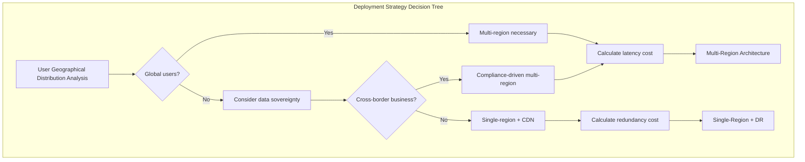

# Day 6 | The Art of Cost Control in Trade-offs: Instance Selection in Cloud Architecture

Yesterday, we established a complete User Story framework, transforming abstract aggregate designs into concrete operational scenarios. Each Story contains clear technical constraints: the investment trading system requires <100ms response, the family finance system needs to handle collaborative conflicts, and the health monitoring system needs to process IoT data streams.

The core challenge we face today is: **How to achieve optimal cost control while meeting these technical requirements?**

This is not just a technical issue of service selection, but a **philosophical trade-off between business value and technical cost**. Behind every architectural decision lies a fundamental question: How much are we willing to pay for performance, reliability, and flexibility?

## The Philosophical Foundation of Cost Trade-offs: The Principle of Value Maximization

### Redefining the Connotation of "Cost"

In cloud architecture, cost is not just the monthly bill, but a **comprehensive trade-off of multi-dimensional resources**:

**Direct Costs**:

- Compute resource fees (EC2, Lambda execution time)
- Storage fees (S3, EBS, data transfer)
- Network fees (CloudFront, cross-region transfer)

**Implicit Costs**:

- Development and maintenance costs (team time, complexity management)
- Opportunity cost (the potential benefits of choosing plan A over plan B)
- Risk cost (availability loss, security vulnerabilities, vendor lock-in)

**Time Costs**:

- Time to Market (product launch speed)
- Accumulation of technical debt (the cost of future refactoring)
- Team learning curve (adaptation time for new technologies)

### Cost Model Design Based on Day 5's Requirements

Looking back at the three typical requirement patterns established yesterday, each pattern corresponds to a different cost sensitivity:

**Investment Trading System: Performance-first Model**

- Cost sensitivity: Low (the cost of performance loss far exceeds the infrastructure cost)
- Optimization goal: Latency minimization > Availability maximization > Cost control
- Trade-off strategy: It is better to over-provision than to have insufficient performance

**Family Finance System: Cost-sensitive Model**

- Cost sensitivity: High (users have limited ability to pay)
- Optimization goal: Cost control > Basic function satisfaction > Performance improvement
- Trade-off strategy: Minimize costs while meeting basic requirements

**Health Monitoring System: Balanced Optimization Model**

- Cost sensitivity: Medium (B2B2C model, need to balance user experience and business viability)
- Optimization goal: Stability > Cost control > Advanced features
- Trade-off strategy: High investment in core functions, cost optimization for edge functions

## ECS vs Lambda: The Art of Trade-offs in Compute Services

### Decision Matrix: From Operational Mode to Service Selection

Based on yesterday's User Story analysis, we have established a detailed compute service selection matrix:

**Lambda Applicability Judgment**:

| Evaluation Dimension | Lambda Advantage Threshold | Investment Trading | Family Finance | Health Monitoring |
| --- | --- | --- | --- | --- |
| Execution Frequency | < 1000 times/hour | ❌ High-frequency trading | ✅ Intermittent recording | ✅ Periodic analysis |
| Execution Duration | < 15 minutes | ✅ Millisecond-level trading | ✅ Simple calculation | ⚠️ Big data analysis |
| Concurrency Requirement | < 1000 concurrent | ❌ 2000+ TPS | ✅ Family scale | ✅ Limited number of devices |
| State Management | Stateless | ⚠️ Complex trading state | ✅ Each operation is independent | ✅ Data stream processing |
| Cold Start Tolerance | > 100ms | ❌ <50ms requirement | ✅ User can wait | ✅ Background processing |

**ECS Applicability Judgment**:

| Evaluation Dimension | ECS Advantage Threshold | Investment Trading | Family Finance | Health Monitoring |
| --- | --- | --- | --- | --- |
| Long-running | > 1 hour | ✅ Market hours operation | ❌ On-demand use | ⚠️ Hybrid mode |
| Complex Dependencies | Multi-service coordination | ✅ Multi-aggregate collaboration | ❌ Single function | ✅ IoT data pipeline |
| Resource Predictability | Stable load | ✅ Fixed trading hours | ❌ Random usage | ⚠️ Device number growth |
| Cost Control | High utilization | ✅ Professional user payment | ❌ Cost-sensitive | ⚠️ Economies of scale |

### Hybrid Architecture Design Strategy

**Investment Trading System: ECS Main Body + Lambda Supplement**

```yaml
# Core Trading Service: ECS Fargate
TradingCore:
  Service: ECS Fargate
  Reason: "Continuous operation, low latency, state management"
  Configuration:
    CPU: 2 vCPU
    Memory: 4 GB
    MinCapacity: 2
    MaxCapacity: 10
    TargetCPU: 70%

# Auxiliary Functions: Lambda
TradingSupport:
  PriceAlert:
    Service: Lambda
    Reason: "Event-driven, intermittent execution"
    Memory: 512 MB
    Timeout: 30s

  ReportGeneration:
    Service: Lambda
    Reason: "Non-real-time, compute-intensive"
    Memory: 3008 MB
    Timeout: 15 min
```

**Family Finance System: Lambda-first Strategy**

```yaml
# Full Serverless Architecture
FamilyFinance:
  ExpenseRecord:
    Service: Lambda
    Memory: 256 MB
    Timeout: 10s
    ConcurrentExecutions: 100

  BudgetCheck:
    Service: Lambda
    Memory: 512 MB
    Timeout: 30s

  MonthlyReport:
    Service: Lambda
    Memory: 1024 MB
    Timeout: 5 min

# Cost Optimization Configuration
CostOptimization:
  ProvisionedConcurrency: 0 # Cold start is acceptable
  ReservedCapacity: false # Usage pattern is not fixed
  SpotInstances: N/A # Lambda manages automatically
```

**Health Monitoring System: Layered Hybrid Architecture**

```yaml
# Data Ingestion Layer: Lambda
DataIngestion:
  IoTDataProcessor:
    Service: Lambda
    Memory: 256 MB
    Timeout: 1 min
    EventSource: IoT Core

# Analysis and Processing Layer: ECS
Analytics:
  TrendAnalysis:
    Service: ECS Fargate
    CPU: 1 vCPU
    Memory: 2 GB
    Schedule: "cron(0 2 * * ? *)" # Every day at 2 am

# Alerting Service: Lambda
Alerting:
  AbnormalDetection:
    Service: Lambda
    Memory: 1024 MB
    Timeout: 30s
    EventSource: DynamoDB Streams
```

### Cost Calculation Model

**Lambda Cost Calculation**:

```
Monthly Cost = (Number of executions × Average execution time × Memory allocation × Lambda unit price) + (Number of requests × Request unit price)

Family Finance System Example:
- Number of executions: 100,000/month
- Average execution time: 200ms
- Memory: 256MB
- Cost: about $2.4/month
```

**ECS Cost Calculation**:

```
Monthly Cost = (vCPU × CPU hours × CPU unit price) + (Memory GB × Memory hours × Memory unit price)

Investment Trading System Example:
- Configuration: 2 vCPU, 4GB RAM
- Running time: 12 hours/day (trading hours)
- Monthly cost: about $58/month
```

## ALB Strategy: The Cost Intelligence of Load Balancing

### The Business Logic of Load Balancer Selection

Different system characteristics determine different load balancing strategies:

**Application Load Balancer vs Network Load Balancer**:

| Feature Comparison | ALB | NLB | Investment Trading | Family Finance | Health Monitoring |
| --- | --- | --- | --- | --- | --- |
| Latency Performance | ~100ms | ~1ms | ✅ NLB needed | ❌ ALB sufficient | ❌ ALB sufficient |
| Layer 7 Functionality | Supported | Not supported | ✅ Routing needed | ✅ Routing needed | ⚠️ Basic requirement |
| TLS Termination | Supported | Supported | ✅ Must-have | ✅ Must-have | ✅ Must-have |
| Cost | Higher | Lower | ✅ Performance-first | ❌ Cost-sensitive | ⚠️ Balanced consideration |

**ALB Configuration for the Investment Trading System**:

```yaml
TradingALB:
  Type: Application Load Balancer
  Scheme: internet-facing

  Listeners:
    HTTPS:443:
      DefaultAction: forward-to-trading-core
      Rules:
        - Condition: path-pattern("/api/market/*")
          Action: forward-to-market-data-service
          Priority: 100
        - Condition: path-pattern("/api/orders/*")
          Action: forward-to-order-service
          Priority: 200

  TargetGroups:
    trading-core:
      Protocol: HTTP
      Port: 8080
      HealthCheck:
        Path: /health
        Interval: 10s
        Timeout: 5s
        HealthyThreshold: 2

  # Cost Optimization Configuration
  CrossZoneLoadBalancing: true # Distribute traffic to avoid hot spots
  DeletionProtection: true # Prevent accidental deletion
  AccessLogs:
    Enabled: true
    S3Bucket: trading-alb-logs
    # Analyze user behavior to optimize routing strategies
```

**Cost-optimized ALB for the Family Finance System**:

```yaml
FamilyFinanceALB:
  Type: Application Load Balancer
  Scheme: internet-facing

  # Cost Optimization Strategy
  IdleTimeout: 60s # Reduce connection time

  TargetGroups:
    serverless-backend:
      Protocol: HTTP
      Port: 80
      TargetType: lambda # Direct integration with Lambda
      HealthCheck:
        Path: /health
        Interval: 30s # Reduce health check frequency

  # Money-saving Configuration
  AccessLogs:
    Enabled: false # Disable logs to save storage costs

  SecurityGroups:
    - family-finance-sg
    # Principle of least privilege to reduce security risk costs
```

### Cost Control of Auto Scaling

**Intelligent Scaling Based on Target Tracking**:

```yaml
AutoScalingPolicy:
  Investment Trading System:
    MetricType: ALBRequestCountPerTarget
    TargetValue: 1000 # 1000 RPS per instance
    ScaleOutCooldown: 60s # Fast scaling to handle sudden traffic
    ScaleInCooldown: 300s # Slow scaling to avoid oscillations

  Family Finance System:
    MetricType: CPUUtilization
    TargetValue: 50% # Lower CPU target to control costs
    ScaleOutCooldown: 300s # Slower scaling, users can wait
    ScaleInCooldown: 600s # Slower scaling to avoid frequent adjustments
```

## DDoS Protection: ROI Calculation of Security Investment

### Business Value Analysis of Protection Levels

Different systems have vastly different vulnerabilities to DDoS attacks and tolerance for losses:

**AWS Shield Protection Level Selection**:

| Protection Level | Cost | Investment Trading | Family Finance | Health Monitoring |
| --- | --- | --- | --- | --- |
| Shield Standard | Free | ❌ Insufficient | ✅ Basically enough | ⚠️ Depends on scale |
| Shield Advanced | $3000/month | ✅ Necessary investment | ❌ Too expensive | ⚠️ B2B can consider |

**Investment Trading System: Shield Advanced + WAF**

```yaml
DDoSProtection:
  Shield: Advanced
  Cost: $3000/month

  Justification: |
    Potential loss from a 1-hour trading interruption:
    - User trading loss: average $50K
    - Brand reputation loss: unquantifiable but huge
    - Regulatory compliance risk: may face regulatory penalties

    Protection cost vs. risk loss = 1:15+ ROI

  WAF Rules:
    - RateLimiting: 100 req/min per IP
    - GeoBlocking: Restrict high-risk regions
    - SQLInjection: Automatic detection and blocking
    - CustomRules: Anomaly detection based on trading patterns
```

**Family Finance System: Shield Standard + CloudFlare**

```yaml
DDoSProtection:
  Shield: Standard (Free)
  CloudFlare: Pro ($20/month)

  Justification: |
    Low risk of attack for family users, limited losses:
    - Value of single-user data: relatively low
    - Impact of downtime: users can use it later
    - Attack motive: low probability of targeted attacks

    Cost control is a priority, basic protection is sufficient

  Protection Strategy:
    - CloudFlare proxy to hide the real IP
    - Basic Rate Limiting
    - Browser Integrity Check
    - Challenge Passage for suspicious traffic
```

**Health Monitoring System: Layered Protection Strategy**

```yaml
DDoSProtection:
  Core Services: Shield Standard
  API Endpoints: WAF ($1-5/month)
  IoT Endpoints: IoT Device Defender

  Risk Assessment: |
    Medical data is sensitive but the attack surface is dispersed:
    - Large number of IoT devices, low value per point
    - User health data is sensitive and needs protection
    - B2B customers have requirements for stability

    Medium level of protection, focusing on protecting core APIs
```

## Region Deployment: Cost Considerations of Geographical Distribution

### Decision Framework for Multi-Region Deployment

**Trade-offs between Single-Region and Multi-Region**:



**Investment Trading System: Low-latency Multi-Region**

```yaml
RegionalDeployment:
  Primary: us-east-1      # US East (largest trading volume)
  Secondary: eu-west-1    # European users
  AsiaSpecific: ap-northeast-1  # Asian market hours

  Architecture:
    - Active-Active: Core trading services
    - Cross-Region Replication: DynamoDB Global Tables
    - Regional Market Data: Localized data sources

  Cost Impact:
    Infrastructure: +200% (3 regions)
    Data Transfer: $0.02/GB cross-region
    Latency Benefit:
      - US-EU: 150ms → 20ms
      - US-Asia: 200ms → 30ms

    Business Justification:
      Each millisecond of latency improvement = 0.1% increase in trade success rate
      Annual trading volume of $1B × 0.3% increase = $3M revenue
      Infrastructure cost increase: $200K/year
      ROI: 15:1
```

**Family Finance System: Single-Region + CDN Strategy**

```yaml
RegionalDeployment:
  Primary: us-east-1      # Single region to reduce costs

  Global Access:
    CloudFront: Global CDN for static resources
    Route53: Intelligent DNS routing

  Cost Optimization:
    Regional: $100/month
    vs Multi-Region: $400/month

    CDN: $20/month
    Total Savings: 70%

    Latency Impact:
    - Static Assets: Global <100ms (CDN)
    - API Calls: 100-300ms (acceptable)

    Business Justification:
    Family finance operations are not real-time, latency is acceptable
    Cost savings > marginal benefit of performance improvement
```

**Health Monitoring System: Layered Regional Strategy**

```yaml
RegionalDeployment:
  CoreServices:
    Primary: us-east-1
    Disaster Recovery: us-west-2

  DataProcessing:
    Regional: Process IoT data locally
    - us-east-1: North American devices
    - eu-west-1: European devices
    - ap-southeast-1: Asia-Pacific devices

  Cost Model:
    Core (Single Region): $500/month
    Regional Processing: $200/month per region
    Total: $1100/month vs $1500/month (Full Multi-Region)

    Performance Benefit:
    IoT data processing latency: 200ms → 50ms
    Impact: More timely device response, improved user experience
```

## CDN and Edge Computing: Cost Optimization of Content Delivery

### ROI Analysis of CDN Strategy

**CloudFront Configuration Strategy**:

**Investment Trading System: Performance-first CDN**

```yaml
CloudFrontDistribution:
  PriceClass: All Regions # Best global performance

  CacheBehaviors:
    "/api/static/*":
      TTL: 3600s # Long cache for static data
      Compress: true

    "/api/market/*":
      TTL: 5s # Short cache for market data
      Headers:
        - Authorization # Personalized content

    "/api/orders/*":
      CachePolicy: CachingDisabled # No caching for trading data
      OriginRequestPolicy: CORS-S3Origin

  Cost Analysis:
    Data Transfer: $0.085/GB (Tier 1)
    Requests: $0.0075/10K requests
    Monthly: ~$500 (high traffic)

    Performance Gain:
      - Static resources: 200ms → 20ms
      - Market data: 100ms → 30ms
      - Significant improvement in user experience, supporting premium pricing
```

**Family Finance System: Cost-optimized CDN**

```yaml
CloudFrontDistribution:
  PriceClass: US_Europe_Asia  # Exclude expensive regions

  CacheBehaviors:
    "/static/*":
      TTL: 86400s            # 24-hour long cache
      Compress: true

    "/api/*":
      TTL: 300s              # 5-minute medium cache

  Cost Analysis:
    Data Transfer: ~$20/month (low traffic)
    Main savings: Reduce origin server load

    Origin Server Savings:
    - Cache hit rate: 80%
    - Server load reduction: 80%
    - Lambda execution count reduction: 80%
    - Monthly savings: $60

    Net Savings: $40/month
```

### Application Scenarios of Edge Computing

**Use Cases for Lambda@Edge**:

```yaml
EdgeComputing:
  Investment Trading System:
    Use Case: User authentication and authorization
    Function:
      Runtime: Node.js 14
      Memory: 128 MB
      Timeout: 5s

    Business Value:
      - Local validation, reducing latency by 50ms
      - Reduce core service load
      - Improve global user experience

  Family Finance System:
    Use Case: A/B testing and feature flags
    Function:
      Runtime: Python 3.9
      Memory: 128 MB
      Timeout: 3s

    Business Value:
      - Dynamic content personalization
      - Low cost for experiments and optimization
      - No need to deploy core service changes
```

## Local-Cloud Hybrid: Cost Trade-offs of Hybrid Cloud

### Application Scenarios of Hybrid Architecture

**Investment Trading System: Localization of Key Data**

```yaml
HybridArchitecture:
  Local Components:
    - Trading execution engine (low latency requirement)
    - Sensitive customer data (compliance requirement)
    - Real-time risk control calculation (data cannot leave the country)

  Cloud Components:
    - Historical data analysis (elastic compute requirement)
    - User interface (global access)
    - Disaster recovery (off-site backup)

  Data Sync Strategy:
    - Real-time: Trade status synchronization
    - Batch: Historical data ETL
    - Event-driven: Business event replication

  Cost Analysis:
    Local Infrastructure: $50K/year
    Cloud Services: $30K/year
    vs Pure Cloud: $80K/year

    Savings: Total cost is the same, but compliance and performance are improved
```

**Health Monitoring System: Edge IoT Processing**

```yaml
HybridArchitecture:
  Edge Components:
    - IoT Gateway (data preprocessing)
    - Local cache (network interruption tolerance)
    - Emergency alerts (real-time response)

  Cloud Components:
    - Big data analysis (machine learning)
    - Long-term storage (historical tracking)
    - User dashboard (remote access)

  Cost Benefits:
    - Reduce data upload costs by 90%
    - Improve system availability by 99%
    - Reduce cloud computing demand by 70%
```

## Preparing for Tomorrow's Architectural Blueprint

### Documentation of Service Selection Decisions

Through today's detailed analysis, we have established a complete service selection decision record for each system:

**Architecture Decision Record (ADR) Template**:

```markdown
## Architecture Decision Record (ADR)

### ADR-001: Compute Service Selection for the Investment Trading System

**Status**: Accepted
**Date**: 2024-09-04
**Deciders**: Architecture Team

**Context**:
Based on the User Story analysis from Day 5, the investment trading system requires:

- API response time < 100ms
- Support for 2000+ TPS concurrency
- 99.99% availability requirement

**Options Considered**:

1. Pure Lambda
2. Pure ECS
3. Hybrid (ECS + Lambda)

**Decision**: Hybrid Architecture

- Core Trading: ECS Fargate
- Support Functions: Lambda

**Rationale**:

- ECS provides continuous operation and low latency
- Lambda handles event-driven auxiliary functions
- The cost is high but the performance benefits are significant

**Consequences**:

- Medium development complexity
- Operations require two systems
- Cost is controllable and performance is optimal

**Compliance**:
Meets the non-functional requirements established in Day 3
Supports the User Story operational experience designed in Day 5
```

### Quantitative Analysis of the Cost Model

**Cost Comparison Summary of the Three Systems**:

| System | Monthly Cost | Main Driver | Cost Optimization Strategy |
| --- | --- | --- | --- |
| Investment Trading | $2,800 | ECS+Shield Advanced | Performance ROI justifies the investment |
| Family Finance | $150 | Lambda+ALB | Strict cost control, functionality is sufficient |
| Health Monitoring | $800 | Hybrid architecture + multi-region | On-demand elasticity, layered optimization |

### Preparation Elements for Tomorrow's Architectural Blueprint

Today's service selection analysis will directly affect tomorrow's architectural design:

**Technology Stack Determined**:

- Compute layer: The choice between ECS and Lambda is clear
- Network layer: ALB/NLB configuration is determined
- Security layer: DDoS protection level is selected
- Distribution layer: Region and CDN strategy is formulated

**Architectural Pattern Preparation**:

- The basis for choosing between monolith and microservices
- The communication mode of synchronous vs asynchronous
- The design of event-driven vs request-driven
- The trade-off between Clean Architecture vs layered architecture

**Non-functional Requirements Met**:

- Performance: Service selection has optimized latency and throughput
- Reliability: Multi-region and backup strategies are determined
- Security: DDoS and access control are configured
- Cost: Each choice has a clear ROI analysis

## Preview of Tomorrow's Architectural Design

Based on the service selection foundation established today, tomorrow we will have an in-depth discussion on:

### The Philosophy of Choosing Architectural Patterns

- Application scenarios of Clean Architecture vs Hexagonal Architecture
- Business-driven decisions for microservices vs monolith architecture
- Design trade-offs of Event-Driven vs Request-Response
- Complexity investment evaluation of CQRS + Event Sourcing

### The Art of Dividing System Boundaries

- Microservice decomposition based on aggregate boundaries
- API Gateway routing strategy design
- Protocol selection for inter-service communication
- Data consistency handling strategy

### System Design for Observability

- Hierarchical design of monitoring metrics
- Implementation strategy for distributed tracing
- Log aggregation and analysis system
- Alerting and incident response mechanism

## Today's Wisdom on Trade-offs

- **Cost is not just money**: Time, complexity, and risk are all dimensions of cost
- **Business value drives technical selection**: Every architectural decision should have a clear ROI
- **There is no silver bullet**: Different systems require different optimization strategies
- **Decisions need to be documented**: Architecture decision records are an important asset for the team

Remember: What we established today is not the optimal solution, but the most suitable solution under specific constraints. As the business develops and technology evolves, these decisions need to be continuously evaluated and adjusted.

---

> "Architectural design is an optimization problem under constraints. We are not looking for a perfect solution, but for the choice that maximizes benefits under the current conditions. Every trade-off is a philosophical judgment: what are we sacrificing for what."
