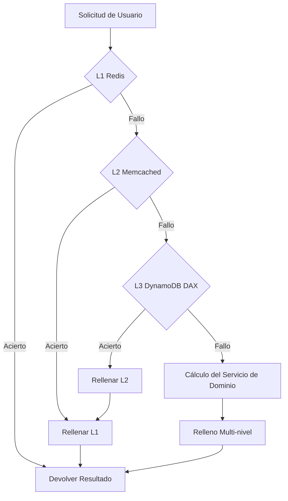

# Día 10 | La Filosofía de las Estrategias de Caché: El Arte de Equilibrar Tiempo, Espacio y Consistencia

Después de nueve días de modelado y análisis, hemos definido la esencia, los límites y los patrones de interacción de nuestro sistema. Pero ahora nos enfrentamos a un problema más práctico: **¿Cómo podemos hacer que estos conceptos de dominio cuidadosamente diseñados respondan rápidamente a las necesidades del usuario bajo las limitaciones del mundo real?**

Cuando un sistema de comercio de inversiones necesita completar cálculos de riesgo en milisegundos, un sistema de finanzas familiares debe soportar operaciones simultáneas de múltiples personas, y un sistema de monitoreo de salud tiene que procesar cantidades masivas de datos de IoT, la computación de lógica de negocio pura ya no es suficiente para cumplir con los requisitos de rendimiento.

Esta es la importancia ontológica del **diseño de caché**: **inyectar estrategias de optimización de tiempo y espacio en el sistema mientras se mantiene la pureza del dominio.**

Cada decisión de caché afecta la experiencia del usuario, el costo del sistema y la corrección de los datos. Por lo tanto, el diseño arquitectónico del caché es, sin duda, una prioridad máxima en el Diseño Orientado al Dominio.

En cada confirmación de requisitos, debemos y tenemos que preguntar:

**¿Cuál es la tolerancia a la latencia y la inconsistencia de datos en este escenario de negocio? ¿Cuánto costo de desarrollo y operativo estamos dispuestos a pagar por ello?**

Ahora discutiremos progresivamente las situaciones y problemas más comunes que encontramos en el almacenamiento en caché. Aquí hay una breve lista de temas:

- La Trinidad Ontológica del Caché: Local, Nube, Lado de los Datos
- Tres Niveles de Consistencia de Datos: Fuerte, Eventual, Causal
- La Relación Dialéctica entre la Exposición a la Seguridad y el Rendimiento
- Estrategias de Invalidación de Caché: La Filosofía del Tiempo
- Modelado de Costos: Decisiones de Caché Basadas en el ROI
- Monitoreo de Caché: Las Tres Dimensiones de la Observabilidad

Recuerde este marco: **La "calidez" determina la ubicación**, **la tolerancia determina el modelo**, **el acoplamiento determina la implementación**. Cuando nos enfrentamos a cualquier escenario que requiera almacenamiento en caché, primero lo analizamos utilizando estos tres principios, y la selección de tecnología seguirá naturalmente.

## La Trinidad Ontológica de la Caché: Local, en la Nube y del Lado de los Datos

**¿Cuándo debe actualizarse la caché? ¿Cómo encontramos el equilibrio óptimo entre el control de costos y el rendimiento del sistema? ¿Cómo manejamos los problemas de consistencia de datos que trae el almacenamiento en caché?**

El almacenamiento en caché no es solo una optimización técnica; es una consideración profunda del **estado de existencia de los datos**. Todos los datos, en diferentes ubicaciones y en diferentes momentos, tienen su significado y valor específicos.

La esencia de una caché es como colocar una estantería junto a nosotros.

Esta estantería puede estar en nuestro escritorio (**caché local**), en la sala de lectura de la planta baja (**caché en la nube**), o incluso en una taquilla de acceso rápido en la entrada de la biblioteca (**caché de base de datos**).

Pero aquí surgen los problemas:

1.  **Espacio Limitado**: Nuestra estantería no puede contener todos los libros. Si ponemos el libro A, es posible que tengamos que quitar el libro B. Esta es la **Política de Evicción** (Eviction Policy), como LRU (Least Recently Used - Menos Recientemente Usado).
2.  **La Información Caduca**: Los libros de la biblioteca se actualizan, pero los de nuestra estantería siguen siendo versiones antiguas. Este es el problema de la **Consistencia**.
3.  **Costo de Gestión**: Tenemos que dedicar esfuerzo a organizar la estantería, decidiendo qué libros conservar y cuáles actualizar. Este es el costo de la **Estrategia de Caché**.

Por lo tanto, todas las técnicas de diseño de caché giran en torno a esta pregunta central: "¿Cómo maximizar el almacenamiento de la información más valiosa y actualizada en un espacio de estantería limitado con un costo de gestión mínimo?".

Una forma común de clasificar los datos es: Datos Calientes (Hot Data), Datos Tibios (Warm Data) y Datos Fríos (Cold Data).

**Datos Calientes (Hot Data)**: Por ejemplo, el precio de las acciones en tiempo real en un sistema de trading, o una publicación de tendencia en redes sociales.

-   **Características**: Frecuencia de lectura extremadamente alta, inmediatez muy corta (segundos o incluso milisegundos).
-   **Base de Selección**: La velocidad lo es todo. Necesitamos la estantería más rápida, y debe estar lo más cerca posible de nosotros.
-   **Selección de Tecnología**: Caché en Memoria (In-Memory Cache), como Redis o Memcached. Almacenan los datos directamente en la memoria, con velocidades de lectura a nivel de microsegundos, tan rápido como la memoria de nuestro cerebro.
-   **Pros y Contras**:
    -   **Pro**: Velocidad máxima.
    -   **Contra**: Caro (la memoria es mucho más costosa que el disco), y los datos son volátiles (se pierden en caso de fallo de energía a menos que haya un mecanismo de persistencia adicional).

**Datos Tibios (Warm Data)**: Por ejemplo, nuestra página de perfil personal, o un catálogo de productos que no cambia con frecuencia.

-   **Características**: Alta frecuencia de lectura, pero puede tolerar unos minutos o incluso horas de retraso.
-   **Base de Selección**: Equilibrio entre costo y rendimiento. Puede colocarse cerca del usuario, pero en una ubicación que no tengamos que mantener nosotros mismos.
-   **Selección de Tecnología**: CDN (Content Delivery Network - Red de Distribución de Contenidos), como CloudFront o Cloudflare. Tienen nodos en todo el mundo (salas de lectura) y pueden almacenar en caché nuestros datos en la ubicación más cercana al usuario.
-   **Pros y Contras**:
    -   **Pro**: Reduce significativamente la carga del servidor y mejora la velocidad de acceso para usuarios globales.
    -   **Contra**: Principalmente adecuado para datos públicos o semipúblicos. La configuración de caché para contenido dinámico personalizado es compleja, y la invalidación de caché (actualizaciones) no es inmediata.

**Datos Fríos (Cold Data)**: Por ejemplo, registros de transacciones de hace varios años, o datos de usuarios inactivos.

-   **Características**: Raramente leídos, pero deben ser accesibles cuando sea necesario.
-   **Base de Selección**: Minimizar el costo. Está bien obtenerlos directamente de la biblioteca (base de datos), o incluso considerar mover estos libros a un archivo subterráneo más barato. Este tipo de datos generalmente no vale la pena almacenarlos en caché.

```mermaid
graph TB
    subgraph "Matriz de Actualidad de Datos"
        A1[Datos de Precios en Tiempo Real<br/>Actualizaciones a nivel de segundo]
        A2[Datos de Posición del Usuario<br/>Actualizado en cada operación]
        A3[Datos de Indicadores de Riesgo<br/>Recálculo a nivel de minuto]
        A4[Datos de Informes Históricos<br/>Actualizaciones diarias]

        B1[Estado del Presupuesto Familiar<br/>Actualizado con cada gasto]
        B2[Estadísticas Mensuales<br/>Actualizaciones diarias]
        B3[Configuración de Preferencias de Usuario<br/>Actualizaciones manuales]
        B4[Datos Históricos de Gastos<br/>Datos inmutables]

        C1[Datos en Tiempo Real del Dispositivo<br/>Actualizaciones a nivel de minuto]
        C2[Análisis de Tendencias de Salud<br/>Actualizaciones cada hora]
        C3[Configuración de Umbrales de Alerta<br/>Actualizaciones manuales]
        C4[Registros de Historial Médico<br/>Datos de solo añadir]
    end

    subgraph "Mapeo de Estrategias de Caché"
        S1[Write-Through<br/>Escribir y cachear inmediatamente<br/>Consistencia Fuerte]
        S2[Write-Behind<br/>Escritura retrasada<br/>Consistencia Eventual]
        S3[Cache-Aside<br/>Gestión manual<br/>Consistencia Causal]
        S4[Read-Through<br/>Lectura penetrante<br/>Consistencia Configurable]
    end

    subgraph "Implementación Tecnológica"
        T1[Redis Cluster<br/>+ ElastiCache]
        T2[DynamoDB DAX<br/>+ Lambda Async]
        T3[Caché de Aplicación<br/>+ EventBridge]
        T4[CloudFront<br/>+ S3 Origin]
    end

    %% Investment Trading System Mapping
    A1 --> S1
    A1 --> T1
    A2 --> S2
    A2 --> T2
    A3 --> S3
    A3 --> T1
    A4 --> S4
    A4 --> T4

    %% Family Finance System Mapping
    B1 --> S3
    B1 --> T3
    B2 --> S4
    B2 --> T2
    B3 --> S3
    B3 --> T3
    B4 --> S4
    B4 --> T4

    %% Health Monitoring System Mapping
    C1 --> S1
    C1 --> T1
    C2 --> S2
    C2 --> T2
    C3 --> S3
    C3 --> T3
    C4 --> S4
    C4 --> T4

    %% Strategy to Technology Association
    S1 --> T1
    S2 --> T2
    S3 --> T3
    S4 --> T4

    classDef hotData fill:#ff6b6b,stroke:#333,stroke-width:2px,color:#fff
    classDef warmData fill:#ffd93d,stroke:#333,stroke-width:2px,color:#333
    classDef coldData fill:#6bcf7f,stroke:#333,stroke-width:2px,color:#333
    classDef strategy fill:#4ecdc4,stroke:#333,stroke-width:2px,color:#fff
    classDef tech fill:#a8e6cf,stroke:#333,stroke-width:2px,color:#333

    class A1,C1 hotData
    class A2,A3,B1,B2,C2 warmData
    class A4,B3,B4,C3,C4 coldData
    class S1,S2,S3,S4 strategy
    class T1,T2,T3,T4 tech
```



Combinando esto con la proximidad de las ubicaciones de caché, podemos identificar varias capas comunes: Local, Nube y Lado de los datos.

### La Primera Existencia: Caché Local - Datos Más Cercanos a la Conciencia del Usuario

**Posicionamiento Filosófico**: La caché local es el punto de contacto más directo entre los datos y la percepción del usuario. Responde a la pregunta: "¿Qué datos deben estar disponibles de inmediato?".

#### Diseño de Caché Local para un Sistema de Trading de Inversiones

```javascript
// Abstracción de dominio para la caché local del front-end
class PortfolioLocalCache {
  constructor() {
    this.realtimeData = new Map(); // Datos en tiempo real: precios, posiciones
    this.calculatedMetrics = new Map(); // Resultados calculados: valores de riesgo, P&L
    this.userPreferences = new Map(); // Preferencias del usuario: configuración de UI, umbrales de alerta
  }

  // Idea central: La estrategia de invalidación para diferentes datos refleja su importancia comercial
  getDataWithStrategy(key, dataType) {
    switch (dataType) {
      case "REAL_TIME_PRICE":
        return this.getOrFetch(key, 100); // Expiración de 100ms
      case "RISK_CALCULATION":
        return this.getOrFetch(key, 1000); // Expiración de 1s, permite un breve retraso
      case "USER_PREFERENCES":
        return this.getOrFetch(key, 300000); // Expiración de 5 minutos, la estabilidad es una prioridad
    }
  }
}
```

**Filosofía de Diseño de la Caché Local**:

1.  **Minimizar la Carga Cognitiva**: Las funciones más utilizadas deben tener latencia cero.
2.  **Tolerancia a Fallos sin Conexión**: El sistema puede seguir funcionando parcialmente durante interrupciones de red.
3.  **Estrategia de Privacidad Primero**: Los datos sensibles se priorizan para el procesamiento local.

**Estrategia de Implementación en AWS**:

```yaml
# Ubicaciones de borde de CloudFront como una extensión de la caché local
CloudFrontDistribution:
  PriceClass: PriceClass_All
  CacheBehaviors:
    - PathPattern: "/api/realtime/*"
      CachePolicyId: 4135ea2d-6df8-44a3-9df3-4b5a84be39ad # Caché Deshabilitada
    - PathPattern: "/api/historical/*"
      CachePolicyId: 658327ea-f89d-4fab-a63d-7e88639e58f6 # Caché Optimizada
      TTL: 3600 # Caché de 1 hora, los datos históricos son relativamente estables
```

### La Segunda Existencia: Caché en la Nube - Centro de Coordinación para Datos Distribuidos

**Posicionamiento Filosófico**: La caché en la nube es un mecanismo de coordinación para el intercambio de datos entre múltiples servicios. Resuelve el problema de "cómo mantener una vista consistente de los datos en un entorno distribuido".

#### Diseño de una Arquitectura de Caché en la Nube de Múltiples Niveles

```python
# Diseño jerárquico de la caché en la nube
class DistributedCacheStrategy:
    def __init__(self):
        self.l1_cache = ElastiCacheRedis(node_type="cache.r6g.large")
        self.l2_cache = ElastiCacheMemcached(node_type="cache.r6g.xlarge")
        self.l3_cache = DynamoDBDAX()  # Capa de caché de la base de datos

    async def get_portfolio_risk(self, portfolio_id):
        # L1: Datos calientes, acceso en milisegundos
        risk_data = await self.l1_cache.get(f"risk:{portfolio_id}")
        if risk_data:
            return risk_data

        # L2: Datos templados, soporta resultados de cálculos complejos
        risk_data = await self.l2_cache.get(f"risk:{portfolio_id}")
        if risk_data:
            await self.l1_cache.set(f"risk:{portfolio_id}", risk_data, ttl=60)
            return risk_data

        # L3: Datos fríos, recuperados de la capa de caché de la base de datos
        risk_data = await self.calculate_and_cache_risk(portfolio_id)
        return risk_data
```

**Mapeo de Dominio de la Caché en la Nube**:



**Decisiones Estratégicas Basadas en Consideraciones de Costo**:

```yaml
# Configuración de optimización de costos de ElastiCache
RedisCluster:
  NodeType: cache.r6g.large # Optimizado para memoria
  NumCacheNodes: 3
  AutomaticFailoverEnabled: true
  MultiAZEnabled: true
  # Análisis de costos: $0.2016/hora * 3 nodos * 24 * 30 = $435.5/mes

MemcachedCluster:
  NodeType: cache.r6g.xlarge # Mayor capacidad, menor costo unitario
  NumCacheNodes: 2
  # Análisis de costos: $0.4032/hora * 2 nodos * 24 * 30 = $580.6/mes
# Costo total de caché: $1016.1/mes
# Beneficio: Reducir las consultas a RDS en un 80%, ahorrando $2000/mes en costos de ejecución de base de datos
# ROI: (2000 - 1016) / 1016 = 96.8% de retorno de inversión positivo
```

### La Tercera Existencia: Caché del Lado de los Datos - Optimización Más Cercana al Origen de los Datos

**Posicionamiento Filosófico**: El almacenamiento en caché del lado de los datos es el preprocesamiento y la optimización de los datos en su entorno nativo. Responde a la pregunta: "¿Cómo podemos hacer que los propios datos sean más eficientes?".

#### El Valor de Dominio de DynamoDB DAX

```python
# Abstracción de DynamoDB DAX como caché del lado de los datos
class DomainDataCache:
    def __init__(self):
        self.dax_client = boto3.client('dax',
                                     endpoint_url='daxs://portfolio-cluster.abcdef.dax-clusters.us-east-1.amazonaws.com')
        self.dynamodb = boto3.resource('dynamodb')

    async def get_portfolio_holdings(self, portfolio_id):
        # DAX maneja automáticamente la lógica de caché, transparente para la aplicación
        response = await self.dax_client.get_item(
            TableName='Portfolios',
            Key={'portfolio_id': {'S': portfolio_id}},
            ConsistentRead=False  # Aceptar consistencia eventual para el rendimiento
        )
        return response['Item']
```

**Principios de Diseño de la Caché del Lado de los Datos**:

1.  **Transparencia**: El código de la aplicación no necesita ser consciente de la existencia de la caché.
2.  **Nivel de Consistencia**: Elegir el nivel de consistencia apropiado según las necesidades del negocio.
3.  **Rentabilidad**: Calcular el punto de equilibrio entre el costo de la caché y el costo de la consulta.

## Tres Niveles de Consistencia de Datos: Fuerte, Eventual y Causal

### La Semántica de Dominio de los Modelos de Consistencia

Debemos considerar cuánta "inconsistencia de datos" puede tolerar nuestro negocio. Esta es la pregunta filosófica más desafiante en el diseño de cachés. Por ejemplo, con los saldos de cuentas bancarias o las órdenes de comercio, la inconsistencia de datos puede llevar a pérdidas financieras directas o problemas legales. En este contexto, **la corrección triunfa sobre todo**. Es mejor ser lento que incorrecto. Esto requiere una consistencia fuerte.

#### Consistencia Fuerte, Consistencia Eventual y Consistencia Causal

Al diseñar sistemas distribuidos, la "consistencia" es un problema central. Especialmente cuando se trata de estrategias de caché, comprender los diferentes modelos de consistencia tiene un impacto directo en el comportamiento y el rendimiento del sistema. Aquí están los tres modelos principales de consistencia y sus características:

#### 1. Consistencia Fuerte

**Concepto y Analogía:**
Es como cuando escribimos una palabra en Google Docs, nuestro colega (teóricamente) ve esta palabra **inmediatamente**. Cualquier operación posterior se basa en esta última versión. Todos ven la misma y única "verdad".

**Características:**

-   **Linealizabilidad**: Una vez que una operación de escritura se completa, cualquier operación de lectura posterior (independientemente del usuario o nodo de donde provenga) debe devolver el valor de esa escritura o uno más reciente.
-   **Atomicidad**: Las operaciones o bien se completan totalmente o bien fallan totalmente; no hay estados intermedios.
-   **Orden Global**: Todas las operaciones en el sistema aparecen como si se hubieran ejecutado en una única línea de tiempo global.

**Ventajas:**

-   **Baja Carga Mental para el Desarrollador**: Los desarrolladores no necesitan manejar situaciones complejas donde los datos podrían estar desactualizados. La lógica es la más intuitiva.
-   **Corrección Absoluta de Datos**: Para escenarios de tolerancia cero como transacciones financieras, gestión de inventario y saldos de cuentas, esta es la única opción.

**Desventajas:**

-   **Alta Latencia**: El sistema necesita asegurar que todas las réplicas hayan completado la actualización de datos antes de confirmar el éxito de la escritura al cliente, lo que aumenta el tiempo que tardan las operaciones de escritura.
-   **Menor Disponibilidad**: En caso de una partición de red, para garantizar la consistencia, el sistema puede rechazar el servicio (escrituras o lecturas), sacrificando la disponibilidad (violando la 'A' en el teorema CAP).
-   **Poca Escalabilidad**: En sistemas distribuidos geográficamente, la latencia de la sincronización entre regiones se convierte en un enorme cuello de botella.

**Servicios de Aplicación de AWS:**

-   **Amazon RDS (con un único nodo primario)**: Las bases de datos relacionales tradicionales son un ejemplo clásico de consistencia fuerte. Todas las escrituras ocurren en el nodo primario.
-   **Amazon DynamoDB (con `ConsistentRead=True`)**: Cuando realizamos una lectura, podemos solicitar explícitamente una "lectura fuertemente consistente" de DynamoDB. Esto lee los datos más recientes directamente de la partición líder, pero consume más Unidades de Capacidad de Lectura (RCUs) y tiene mayor latencia.
-   **Amazon ElastiCache para Redis (con transacciones o bloqueos)**: Al usar las transacciones `MULTI/EXEC` de Redis o bloqueos distribuidos (como RedLock), se puede forzar la atomicidad y la consistencia fuerte para operaciones específicas.

#### 2. Consistencia Eventual

**Concepto y Analogía:**
Publicamos una foto en Facebook o Instagram. Es posible que nuestros amigos no la vean en el mismo milisegundo. Un amigo en EE. UU. podría verla unos segundos más tarde que un amigo en Taiwán, pero el sistema **eventualmente** garantiza que, después de un tiempo, todos podrán ver la foto.

**Características:**

-   **Sincronización Eventual**: Si no hay nuevas actualizaciones, eventualmente todas las réplicas de los datos alcanzarán un estado consistente.
-   **Alta Disponibilidad**: Incluso si algunos nodos o la red tienen problemas, el sistema aún puede aceptar operaciones de lectura y escritura, priorizando la continuidad del servicio.
-   **Sin Orden Específico**: No garantiza el orden de las actualizaciones entre diferentes réplicas.

**Ventajas:**

-   **Baja Latencia**: Las operaciones de escritura se pueden completar y devolver rápidamente en una réplica local sin esperar a que todas las réplicas se sincronicen, proporcionando una excelente experiencia de usuario.
-   **Alta Disponibilidad**: El sistema tiene una fuerte tolerancia a fallos y está diseñado para sistemas distribuidos a gran escala y globalmente.
-   **Alto Rendimiento (Throughput)**: Las operaciones de lectura y escritura se pueden distribuir entre múltiples nodos, aumentando en gran medida el rendimiento del sistema.

**Desventajas:**

-   **Alta Carga Mental para el Desarrollador**: Los desarrolladores deben diseñar la lógica de la aplicación para que pueda manejar la lectura de datos obsoletos.
-   **Inconsistencia Temporal de Datos**: En el período de tiempo antes de que se complete la sincronización, las operaciones de lectura pueden recuperar datos desactualizados.

**Servicios de Aplicación de AWS:**

-   **Amazon DynamoDB (lectura predeterminada)**: El modo de lectura predeterminado de DynamoDB es "lectura eventualmente consistente", que es rápido y cuesta la mitad que una lectura fuertemente consistente.
-   **Amazon S3**: S3 proporciona consistencia eventual para operaciones PUT y DELETE de sobrescritura. (Nota: S3 ahora proporciona consistencia fuerte para operaciones PUT de objetos nuevos).
-   **Amazon CloudFront**: Una CDN es un ejemplo clásico de consistencia eventual. Cuando actualizamos el contenido de origen, lleva tiempo que los nodos de borde de todo el mundo sincronicen el contenido más reciente.

#### 3. Consistencia Causal

**Concepto y Analogía:**
Este es un equilibrio sutil en los modelos de consistencia. Imagina un hilo de comentarios en un foro:

1.  Publicamos un tema A.
2.  Alguien luego publica un comentario B en respuesta al tema A.

La consistencia causal garantiza que: **Cualquiera que vea el comentario B también debe poder ver el tema A**. No le importa el orden de otras operaciones no relacionadas, pero protege estrictamente el orden de las operaciones que tienen una "relación causal". Un usuario no puede ver una "respuesta" sin ver la "publicación original".

**Características:**

-   **Preserva el Orden Causal**: Si la operación A ocurre causalmente antes que la operación B (por ejemplo, B es una respuesta a A), el sistema garantiza que cualquier proceso que lea B también debe poder leer A.
-   **Las Operaciones Concurrentes no están Ordenadas**: Para operaciones concurrentes que no tienen una relación causal (por ejemplo, dos usuarios comentando en la publicación A al mismo tiempo), su orden no está garantizado.

**Ventajas:**

-   **Equilibra Rendimiento y Corrección Lógica**: Tiene un mejor rendimiento y disponibilidad que la consistencia fuerte, al tiempo que proporciona garantías lógicas más sólidas que la consistencia eventual, evitando gran parte de la confusión en la experiencia del usuario.
-   **Coincide con la Intuición Humana**: Muy adecuado para escenarios como conversaciones, comentarios y edición colaborativa.

**Desventajas:**

-   **Implementación Compleja**: Requiere que el sistema rastree las dependencias entre operaciones (a menudo utilizando técnicas como relojes vectoriales), lo que hace que sea más difícil de implementar que la consistencia eventual.
-   **Todavía no es Consistencia Fuerte**: Para datos sin una relación causal, aún pueden existir inconsistencias.

**Servicios de Aplicación de AWS:**

-   **Amazon DynamoDB Streams**: Esta es una aplicación muy inteligente. Podemos usar Streams para capturar todos los eventos de modificación (A, B, C...) de una tabla y asegurar que se procesen en orden. Esto permite la reconstrucción de relaciones causales en sistemas posteriores. Por ejemplo, en nuestro ejemplo de sistema de finanzas familiares, usar Streams para procesar los registros de gastos asegura que el presupuesto se actualice en orden, lo cual es una implementación de consistencia causal.
-   **Amazon QLDB (Quantum Ledger Database)**: QLDB es una base de datos de libro mayor verificable que registra el historial completo de los cambios de datos. Al consultar este registro, la cadena causal de todas las operaciones puede reconstruirse explícitamente.

#### Tabla Comparativa Resumida

| Característica        | Consistencia Fuerte             | Consistencia Causal      | Consistencia Eventual             |
| :-------------------- | :------------------------------ | :----------------------- | :-------------------------------- |
| **Garantía Principal**| Lee la última escritura         | Las lecturas deben seguir su causa | Eventualmente lee la última escritura |
| **Latencia**          | Alta                            | Media                    | Baja                              |
| **Disponibilidad**    | Baja                            | Media                    | Alta                              |
| **Complejidad Dev**   | Baja                            | Alta                     | Media                             |
| **Caso de Uso**       | Banca, Inventario               | Sistemas de comentarios, Docs colaborativos | Feeds sociales, Recuentos de "Me gusta" |
| **Ejemplo AWS**       | RDS, DynamoDB(ConsistentRead)   | DynamoDB Streams, QLDB   | S3, DynamoDB(Default), CloudFront |

Diferentes escenarios de negocio tienen diferentes tolerancias a la inconsistencia de datos, lo que afecta directamente el diseño de las estrategias de caché. A continuación, utilizaremos nuestros escenarios financieros actuales —finanzas de inversión y finanzas familiares— para discutir la necesidad de consistencia en diferentes contextos.

### Compromisos de Consistencia en un Sistema de Trading de Inversiones

**Análisis de Escenario**: Cuando un usuario opera su cartera de inversiones en su teléfono y computadora simultáneamente:

```python
class PortfolioConsistencyManager:
    def __init__(self):
        self.strong_consistency_cache = RedisCluster(consistency='strong')
        self.eventual_consistency_cache = CloudFrontCache(ttl=300)

    async def handle_trade_order(self, user_id, order):
        # Ejecución de la operación: debe ser fuertemente consistente
        async with self.strong_consistency_cache.lock(f"portfolio:{user_id}"):
            current_balance = await self.get_account_balance(user_id)
            if current_balance >= order.amount:
                await self.execute_trade(order)
                await self.invalidate_all_portfolio_caches(user_id)

    async def get_portfolio_summary(self, user_id):
        # Resumen de la cartera: la consistencia eventual es aceptable
        cached_summary = await self.eventual_consistency_cache.get(f"summary:{user_id}")
        if cached_summary and self.is_acceptable_staleness(cached_summary.timestamp):
            return cached_summary
        return await self.calculate_fresh_summary(user_id)
```

### Consistencia Colaborativa en un Sistema de Finanzas Familiares

**Desafíos de Consistencia en la Colaboración Multi-Usuario**:

```python
class FamilyFinanceConsistency:
    """Gestión de la consistencia de datos entre miembros de la familia"""

    async def record_expense(self, family_id, member_id, expense):
        # Registro de gastos: requiere consistencia causal para garantizar el orden de las operaciones
        sequence_id = await self.get_next_sequence(family_id)

        # Usar DynamoDB Streams para asegurar el orden
        await self.expenses_table.put_item(
            Item={
                'family_id': family_id,
                'sequence_id': sequence_id,
                'member_id': member_id,
                'expense': expense,
                'timestamp': datetime.utcnow().isoformat()
            }
        )

        # Activar actualizaciones de caché para otros miembros de la familia
        await self.notify_family_members(family_id, member_id, expense)
```

**Breve Resumen de la Lógica de Negocio para la Selección de Estrategias de Caché**:

| Tipo de Datos           | Frecuencia de Actualización | Necesidad de Consistencia | Estrategia de Caché | Selección de Tecnología | Razón de Negocio                                 |
| ----------------------- | --------------------------- | ------------------------- | ------------------- | ----------------------- | ------------------------------------------------ |
| **Precio en Tiempo Real**| Segundos                    | Consistencia Fuerte       | Write-Through       | Redis Cluster           | Base para decisiones de trading, cero tolerancia a errores |
| **Tenencias de Usuario**| Orientado a Eventos         | Consistencia Eventual     | Write-Behind        | DynamoDB DAX            | Escrituras frecuentes, un breve retraso es aceptable |
| **Métricas de Riesgo**  | Minutos                     | Consistencia Causal       | Cache-Aside         | Caché de Aplicación     | Computacionalmente intensivo, necesita controlar el tiempo de actualización |
| **Informes Históricos** | Diariamente                 | Consistencia Eventual     | Read-Through        | CloudFront + S3         | Lectura intensiva, se necesita distribución global |
| **Estado del Presupuesto**| Al registrar gasto          | Consistencia Causal       | Cache-Aside         | EventBridge             | Colaboración familiar, requiere actualizaciones secuenciales |
| **Datos del Dispositivo**| Minutos                     | Consistencia Fuerte       | Write-Through       | Redis Cluster           | Base para alertas, se necesita respuesta en tiempo real |
