# Día 11 | Filosofía de Diseño de Bases de Datos: Análisis de Requisitos, Selección de Tecnología y Estrategias de Diseño de Esquemas

Ayer exploramos la ontología triple del caché. Hoy profundizamos en el destino final de los datos: la **capa de persistencia**.

Si el caché es la memoria a corto plazo del sistema, entonces la base de datos es su memoria a largo plazo y base de conocimiento. Cuando el caché falla, el sistema se reinicia, o durante la recuperación ante desastres, la base de datos tiene la responsabilidad de reconstruir la visión del mundo del sistema.

Pero lo más importante: **El diseño de la base de datos determina directamente la efectividad de la estrategia de caché.** Un esquema de base de datos defectuoso puede hacer inútil incluso el diseño de caché más perfecto.

###

## La Ontología del Diseño de Bases de Datos: De la Existencia a la Estructura

Antes de comenzar el diseño de una base de datos, primero debemos aclarar una pregunta:

**Qué son los datos?**

### La Naturaleza de los Datos: Una Consecuencia Registrada del Comportamiento

Un estudiante, completamente absorto en una conferencia, anota puntos clave de su comprensión personal en un medio. Un médico, después de diagnosticar los síntomas autodescritos de un paciente, registra progresivamente los sentimientos del paciente y sus propias estimaciones diagnósticas basadas en evaluación profesional. La bolsa de valores de Wall Street registra continuamente precios de compra y venta, que luego son compilados por otros gestores profesionales en gráficos, curvas o informes de análisis experto.

Has notado el patrón? Independientemente del medio?a sean notas de conferencia, historiales médicos o fluctuaciones de precios de acciones?odos siguen fundamentalmente una sola regla:

```
Comportamiento => Impacto (es registrado) = Datos Registrados
```

Todos los datos representan el impacto causado por la ejecución de un cierto **comportamiento**.

Este impacto puede ser una descripción concreta basada en un concepto abstracto, como el análisis dialéctico de la gramática en lingüística o la derivación de fórmulas en matemáticas. O puede ser el nuevo impacto concreto registrado generado después de que un estado ha experimentado un cierto **comportamiento**, muy parecido a cómo entendemos la cosmovisión de un autor al leer su obra.

Entonces, por qué tenemos **comportamiento**? Cuál es la base de nuestras acciones?

```
Requisito
```

Antes de realizar cualquier acción, esta es inevitablemente impulsada por una necesidad primaria o bien considerada. Cuando tenemos sed, subconscientemente buscamos agua; cuando enfrentamos peligro, subconscientemente huimos o luchamos. Al mismo tiempo, cuando sentimos sed, también podríamos considerar que estamos en una biblioteca y así contenemos el acto de beber hasta que estemos en una situación donde sea permisible.

Por lo tanto, podemos refinar el proceso de generación de datos de la siguiente manera:

```
Requisito => Conducta => Efecto
```

Y este es el concepto más crucial en el Diseño Dirigido por Dominio.

Todos nuestros diseños de sistemas tienen un origen. Como arquitectos de sistemas, debemos entender, comprender y finalmente deconstruir los requisitos.

Así que, para el diseño de bases de datos, también necesitamos analizar el origen de los datos, entender la razón de su existencia, y luego proceder con el diseño.

Los métodos de almacenamiento y sincronización para los archivos sin procesar de un cineasta profesional en medio de la creación son enormemente diferentes de los métodos de almacenamiento y sincronización para una película lanzada en Netflix. Sus requisitos de contexto de almacenamiento y uso son completamente diferentes.

###

### Cambio de Perspectivas: De un Hecho Singular a Múltiples Interpretaciones

Acabamos de establecer el proceso central: `Requisito => Conducta => Efecto`. Continuemos con una pregunta más profunda: **Quién está registrando? Y en qué contexto?**

El mismo "efecto" puede ser registrado como "datos" enormemente diferentes a los ojos de diferentes "observadores".

Imaginemos la finalización de una transacción en una librería en línea (el efecto):

- **Para el departamento de finanzas:** Esto es un asiento contable. Su requisito es "conciliación y declaración de impuestos", y los datos que registran son "monto del pedido, impuesto, método de pago, marca de tiempo".
- **Para el departamento de almacén:** Esto es un cambio de inventario. Su requisito es "gestión de inventario", y los datos que registran son "SKU del producto, cantidad enviada, stock restante".
- **Para el departamento de marketing:** Esto es un comportamiento del usuario. Su requisito es "analizar preferencias para recomendaciones", y los datos que registran son "ID de usuario, categoría del producto comprado, correlaciones de compra".

**Hay solo un Hecho:** Ocurrió una transacción.
**Pero hay múltiples versiones de Datos:** Cada departamento, basado en su propio "requisito", extrae, transforma y registra los fragmentos de este "efecto" que son significativos para ellos.

Esta es la encarnación del concepto de "Contexto Delimitado" en el diseño de sistemas. Cada contexto (departamento) tiene su propio lenguaje y modelo de datos, ambos sirviendo las necesidades específicas de ese contexto.

Por lo tanto, nuestro proceso de generación de datos puede refinarse aún más a:

```
Dentro de un "Contexto Específico" =>
  Un "Requisito Específico" impulsa =>
    Un "Comportamiento Específico" que produce =>
      Un "Efecto Singular" que es =>
        Interpretado desde "Múltiples Perspectivas" como =>
          "Múltiples formas de Datos Registrados"
```

Esta comprensión conduce directamente a las estrategias centrales de la arquitectura moderna de bases de datos, tales como:

1.  **Microservicios:** Cada servicio (contexto) tiene su propia base de datos porque su "interpretación" de y "requisitos" para los datos son diferentes. Forzar una base de datos unificada solo conduciría a un modelo caótico y responsabilidades poco claras.
2.  **CQRS (Segregación de Responsabilidad de Comando y Consulta):** Separar las bases de datos para "registrar comportamiento" (el lado de Comando) y "consultar interpretaciones" (el lado de Consulta). Las operaciones de escritura están optimizadas para registrar hechos, mientras que las operaciones de lectura están optimizadas para consultas rápidas desde perspectivas específicas.
3.  **Event Sourcing (Abastecimiento de Eventos):** En lugar de almacenar el "estado", se almacena una serie de "efectos" (eventos) inmutables. Cualquier "estado actual" del sistema es meramente una "interpretación" o "proyección" de eventos históricos.

Entonces, cuando diseñamos un esquema, ya no deberíamos preguntar "Qué atributos tiene esta cosa?" En su lugar, deberíamos preguntar:

- **Qué requisito en qué contexto está destinado a satisfacer estos datos?** (Localizar el Contexto Delimitado)
- **Qué comportamiento generó estos datos?** (Rastrear el Evento/Comando)
- **Cuántas perspectivas diferentes consultarán e interpretarán estos datos en el futuro?** (Planificar Modelos de Consulta / Modelos de Lectura)

Al entender que los datos son un "efecto interpretado", podemos liberarnos de una mentalidad de diseño de base de datos monolítica y rígida y adoptar una arquitectura de datos flexible y multidimensional que es más adaptable a los cambios empresariales complejos.

###
## Análisis Profundo de Estrategias de Diseño Centrales

### 1. Estrategia de Gestión de Datos Maestros (MDM)

Imaginemos si, en una biblioteca, el personal del mostrador, los administradores y los departamentos de adquisiciones cada uno tuvieran su **propia** lista de miembros.

- Un miembro actualiza su número de teléfono en el mostrador.
- Pero cuando el departamento de adquisiciones les notifica que ha llegado un nuevo libro pre-ordenado, todavía usan el número antiguo.
- Los administradores usan la dirección antigua al enviar informes anuales.

Este es el caos causado por la inconsistencia de datos, un problema que encontramos constantemente en la vida diaria. En las empresas, el costo de tal caos es enorme: enviar mercancías a la dirección incorrecta, emitir facturas incorrectas y perder clientes.

El propósito central de la **Gestión de Datos Maestros (MDM)** es resolver este caos estableciendo una fuente única, universalmente reconocida y confiable de datos en toda la organización.

**Filosofía de Diseño Central:**

**Fuente Única de Verdad (SSoT)**

Esta es el alma del MDM. Ordena: "Los datos autorizados sobre 'clientes' solo pueden obtenerse de mí; la información estándar sobre 'productos' también debe consultarse en mí".

No es un centro de almacenamiento de datos donde se colocan todos los datos. Es el centro autorizado para datos, definiendo la "versión correcta" de los datos más críticos y centrales. Otros sistemas (como sistemas de pedidos, sistemas logísticos) pueden replicar estos datos para uso, pero cuando se necesita los datos más precisos, deben regresar al sistema de datos maestros para consultarlos.

**Resumen Rápido**

- Todos los sistemas obtienen datos básicos del mismo archivo maestro.
- Una solución fundamental para evitar inconsistencia de datos.
- Reduce costos de mantenimiento y riesgos de error.

**Separación de Datos de Referencia y Datos Transaccionales**

- **Datos Maestros (Datos de Referencia)**:
  - Naturaleza: "Sustantivos" en el negocio. Son entidades relativamente estáticas que se referencian repetidamente.
  - Características: Cambian lentamente, pero una vez cambiados, el impacto es generalizado.
  - Ejemplos: Códigos de cotización de acciones, información básica del cliente, especificaciones de productos, direcciones de sucursales, códigos de país.
- **Datos Transaccionales (Datos Basados en Comportamiento)**: Cambian frecuentemente, con altos requisitos de puntualidad.
  - Naturaleza: "Verbos" en el negocio. Describen "eventos" que ocurren en un punto específico en el tiempo.
  - Características: Generados frecuentemente, grandes en volumen y generalmente no modificados después de la creación.
  - Ejemplos: Un pedido, un pago, un registro de envío.

Podemos pensar en ello de esta manera: una "transacción" (datos transaccionales) se refiere a "quién es el cliente" y "qué producto se compró" (datos maestros).

Sin datos maestros, cada pedido tendría que registrar repetidamente la dirección completa del cliente y la descripción del producto. Si un cliente se muda, tendríamos que modificar todos los pedidos históricos, lo cual es imposible.

**Control de Versiones y Gestión de Puntualidad**

```
Fecha Efectiva Período Activo Fecha de Expiración Preservación Histórica
```

###

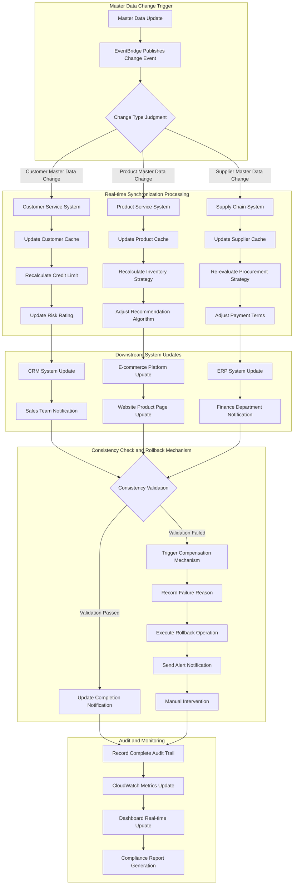

This is the most complex and valuable part of MDM in practice. Although master data changes slowly, it does change. This means master data cannot just have a "current state"; it must be able to answer:

- "What was the price of this product at a certain point in the past?"
- "What will this customer's address be at a certain point in the future?"

Therefore, the lifecycle management of `Effective Date Active Period Expiration Date`, and the design in the AWS example code that simultaneously uses `master_data_versions` (historical versions table) and `master_data_current` (current active version table), are precisely to achieve this ability to query data across time.

This is crucial for financial reconciliation, legal compliance, and business analysis.

**Basic Read/Write Flow**

```mermaid
graph TD
    subgraph "Write Flow update_master_record"
        A[Start Update Request] --> B(Start Transaction in RDS)
        B --> C{1. Write New Version to<br/>master_data_versions}
        C --> D{2. Check if Effective Immediately}
        D -->|Yes| E{3. Update master_data_current}
        E --> F[4. Invalidate Related Cache in ElastiCache]
        F --> G[5. Publish Change Event via EventBridge]
        G --> H(Commit RDS Transaction)
        D -->|No (Future Effective)| H
        H --> I[End]
    end

    subgraph "Read Flow get_master_data"
        J[Start Read Request] --> K{Query Historical Data?}
        K -->|No (Query Current Data)| L{1a. Query Cache in ElastiCache}
        L -->|Cache Hit| M[Return Cached Data]
        L -->|Cache Miss| N{2a. Query RDS master_data_current}
        N --> O{Data Found?}
        O -->|Yes| P[3a. Write Data back to ElastiCache]
        P --> Q[Return Data]
        O -->|No| Q

        K -->|Yes (Query Historical Data)| R{1b. Query Specific Time Point Version in<br/>RDS master_data_versions}
        R --> Q
        M --> S[End]
        Q --> S
    end
```

**Write Logic (update_master_record)**:

- Transactional: All write operations are wrapped in a transaction to ensure atomicityall or nothing."
- Version Control: Writes to both the versions table and the current table simultaneously, perfectly balancing historical traceability with current query performance.
- Cache Invalidation: Upon data update, cache invalidation is immediately performed to ensure data consistency.
  **Read Logic (get_master_data):**
- Cache-Aside: Queries the cache first; if not found, queries the database and populates the cache. This is the most classic caching pattern.
- Time-Travel Support: Capable of querying historical data at a specific point in time using the `as_of_date` parameter, which is one of the most valuable features of an MDM system.

#### AWS Implementation: Enterprise-Grade Master Data Management System

**AWS Service Architecture Combination**

- RDS (PostgreSQL): Serves as the "Single Source of Truth (SSoT)," leveraging its transactional capabilities (ACID) to ensure strong consistency of core data, which is the cornerstone of MDM. Correct choice.
- ElastiCache (Redis): Acts as a "Distributed Cache," alleviating read pressure on the primary database and providing high-performance data access for downstream systems. This is a standard high-performance architecture pattern.
- DynamoDB: Although RDS can also record changes, using DynamoDB can create a fast, scalable, independent audit log for other systems to quickly query change history without impacting primary database performance.
- EventBridge: Functions as an "Event Notification" hub, proactively informing all relevant systems after master data changes. This achieves loose coupling between systems, which is critical for modern microservice architectures.

```yaml
# AWS Service Configuration for Enterprise-Grade Master Data Management System
MasterDataManagementServices:
  # Core Data Storage Layer
  CoreStorage:
    PrimaryDatabase:
      Service: "Amazon RDS PostgreSQL"
      Instance: "db.r6g.2xlarge"
      Storage: "2TB gp3 SSD"
      MultiAZ: true
      ReadReplicas: 3
      BackupRetention: 35
      Encryption: "AES-256"

    VersioningStore:
      Service: "Amazon DynamoDB"
      TableName: "master-data-versions"
      BillingMode: "ON_DEMAND"
      GlobalTables: true
      PointInTimeRecovery: true

  # Distributed Cache Layer
  CacheLayer:
    DistributedCache:
      Service: "Amazon ElastiCache Redis"
      NodeType: "cache.r6g.xlarge"
      Nodes: 3
      ClusterMode: true
      Encryption: "in-transit and at-rest"

    CDNCache:
      Service: "Amazon CloudFront"
      Origins: "ALB + ElastiCache"
      TTL: "3600 seconds"

  # Event Processing and Notification
  EventProcessing:
    EventBus:
      Service: "Amazon EventBridge"
      Rules: "master-data-change-*"
      Targets: ["Lambda", "SQS", "SNS"]

    MessageQueue:
      Service: "Amazon SQS"
      Type: "FIFO Queue"
      VisibilityTimeout: "300s"
      DeadLetterQueue: true

    Notifications:
      Service: "Amazon SNS"
      Topics: ["master-data-updates", "system-alerts"]
      Subscriptions: ["Email", "SMS", "Lambda"]

  # Compute and Processing
  ComputeServices:
    APIGateway:
      Service: "Amazon API Gateway"
      Type: "REST API"
      Authentication: "AWS Cognito"
      RateLimit: "1000 req/sec"

    BusinessLogic:
      Service: "AWS Lambda"
      Runtime: "Python 3.11"
      Memory: "1024 MB"
      Timeout: "15 minutes"
      Concurrency: "100"

    BackgroundProcessing:
      Service: "Amazon ECS Fargate"
      CPU: "2 vCPU"
      Memory: "4 GB"
      AutoScaling: true

  # Monitoring and Audit
  ObservabilityStack:
    Monitoring:
      Service: "Amazon CloudWatch"
      Metrics: "Custom + Built-in"
      Alarms: "20+ alerts"
      Dashboards: "Executive + Technical"

    Logging:
      Service: "Amazon CloudWatch Logs"
      RetentionPeriod: "90 days"
      LogGroups: "by service"

    Tracing:
      Service: "AWS X-Ray"
      SamplingRate: "10%"
      TracingEnabled: true

    AuditTrail:
      Service: "AWS CloudTrail"
      LogFileValidation: true
      MultiRegion: true

  # Security and Compliance
  SecurityServices:
    IdentityManagement:
      Service: "AWS IAM"
      Roles: "least-privilege"
      Policies: "resource-based"

    SecretsManagement:
      Service: "AWS Secrets Manager"
      AutoRotation: true
      CrossRegionReplication: true

    KeyManagement:
      Service: "AWS KMS"
      KeyRotation: "annual"
      CustomerManagedKeys: true

    NetworkSecurity:
      Service: "AWS VPC"
      Subnets: "private + public"
      SecurityGroups: "restrictive"
      NACLs: "additional layer"

  # Disaster Recovery
  DisasterRecovery:
    Backup:
      Service: "AWS Backup"
      Schedule: "daily + weekly"
      RetentionPeriod: "7 years"
      CrossRegionCopy: true

    ReplicationTarget:
      Service: "Secondary AWS Region"
      RPO: "< 1 hour"
      RTO: "< 4 hours"

# Cost Estimation (Monthly Cost)
CostEstimation:
  RDS: "$2,400/month"
  ElastiCache: "$1,200/month"
  DynamoDB: "$800/month"
  Lambda: "$300/month"
  Other: "$800/month"
  Total: "$5,500/month"
```

**AWS Service Architecture Diagram**

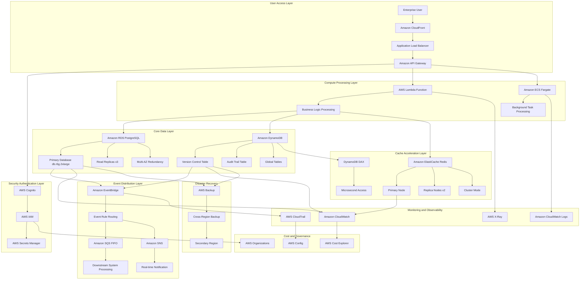

---

### 2. Arquitectura Dirigida por Eventos (Diseño Dirigido por Eventos)

Regresemos a nuestra analogía de la biblioteca una vez más.

El diseño de base de datos tradicional es como un bibliotecario que solo se preocupa por "el presente".

Le preguntamos: "Dónde está *Vuelo Nocturno*?" Nos dirán directamente: "En el estante A-7". Pero si seguimos con: "Dónde estaba este libro ayer a las 3 PM?"

Se verán perplejos, porque solo registran el estado final de los libros?odos los cambios intermedios se han perdido.

```
 "Vuelo Nocturno" es un libro que amo profundamente. Lo recomiendo altamente :))
```

**Concepto Central:**

La filosofía del diseño dirigido por eventos: **Registrar "qué pasó", no "en qué se convirtió".** La arquitectura dirigida por eventos, especialmente Event Sourcing, adopta una filosofía completamente diferente. Es como un historiador meticuloso que mantiene no una lista de libros, sino un libro mayor inmutable que nunca se modifica.

Los lenguajes de programación tienen un concepto para gestionar esta concreción abstracta: **Lista Enlazada (Lista de Nodos)**. Todos los eventos necesariamente tienen sus eventos precedentes y siguientes conectados. **Al reproducir la historia, podemos reconstruir el estado en cualquier punto en el tiempo.**

Así que, de vuelta a nuestro mostrador de biblioteca?uando examinamos el registro de eventos del viaje de un libro, veríamos:

- `09:15`: La miembro Alice devolvió *Vuelo Nocturno* en la Biblioteca C.
- `11:30`: El administrador movió *Vuelo Nocturno* de la Biblioteca C a la Biblioteca B.
- `15:10`: El empleado temporal colocó *Vuelo Nocturno* del carrito de devolución en el estante A-7.

Este es el flujo de eventos.

Ves? No almacenamos la "ubicación" del libro (estado); solo almacenamos cada "movimiento" (evento) del libro.

El CRUD tradicional es "destructivo". Cuando ejecutamos `UPDATE users SET status = 'inactive'`, perdemos permanentemente el estado anterior del usuario?a información se destruye en la actualización.

Event Sourcing es "constructivo". Registra un evento `UserDeactivated`. Todos los nodos de información histórica se preservan.

**Resumen Rápido:**

- No almacenes estado, solo almacena eventos
- Estado actual = resultado de reproducir todos los eventos históricos

**Escenarios de Aplicación:**

1. Integración de Microservicios:

- Esta es la aplicación central de EDA.
- En una plataforma de comercio electrónico, cuando el "Servicio de Pedidos" genera un evento `OrderCreated`, puede estar completamente inconsciente de qué servicios downstream necesitan esta información. El **"Servicio de Inventario"** puede suscribirse a este evento para deducir inventario, el **"Servicio de Logística"** puede suscribirse para preparar el envío, y el **"Servicio de Notificaciones"** puede suscribirse para enviar correos de confirmación. Los servicios están completamente desacoplados y pueden desarrollarse, desplegarse y escalarse independientemente.

2. Flujos de Trabajo Asíncronos:

- EDA sobresale en el manejo de **tareas de fondo secuenciales que consumen tiempo**. Por ejemplo: Después de que un usuario sube un video, el backend inmediatamente publica un evento `VideoReceived` y responde con "Carga exitosa, transcodificación en progreso". Uno o más "servicios de transcodificación" dedicados recibirán este evento y realizarán compresión de video, marcas de agua, etc., que consumen tiempo, en segundo plano. El usuario no necesita esperar en el lugar?xcelente experiencia de usuario.

3. Procesamiento de Datos en Tiempo Real e IoT:

- Escenario: Procesamiento de flujos de datos interminables. Lecturas de temperatura y humedad de miles de dispositivos IoT, o fluctuaciones de precios de acciones en tiempo real en mercados financieros?ada punto de dato es un evento. La arquitectura EDA puede filtrar, transformar, agregar eficientemente estos flujos de eventos, y disparar alertas en tiempo real o actualizar paneles de control.

4. Auditoría y Cumplimiento:

- Escenario: Cuando "qué sucedió" es más importante que "qué es ahora". En finanzas, atención médica o dominios legales, tener un registro inmutable de cada transacción y cada modificación de historial médico es un requisito fundamental para el cumplimiento. Cualquier estado del sistema puede recrearse a partir de estos eventos históricos.

**Ventajas:**

- Rastro operacional completo
- Soporte para viaje en el tiempo
- Capacidades de auditoría natural

Sin embargo, este estilo de comunicación de "escribir tareas en una pizarra y marcharse" también trae sus propias complejidades y desafíos únicos:

1. **Complejidad del Modelo Cognitivo**: El flujo de control del sistema se vuelve opaco. Después de que se publica un evento, es difícil rastrear intuitivamente "qué sucede después?" Esto hace que la depuración sea extremadamente desafiante.
2. **Consistencia Eventual**: Debido a que los servicios procesan asincrónicamente, el sistema tendrá breves inconsistencias de estado en diferentes partes. Por ejemplo, se crea un pedido, pero el inventario puede no haberse deducido aún. Esto coloca mayores demandas tanto en el desarrollo como en el diseño de experiencia de usuario.
3. **Evolución de Esquema de Eventos y Versionado**: Si el formato del mensaje en la "pizarra de tareas" cambia (por ejemplo, el evento de pedido agrega un campo "código de descuento"), todos los servicios downstream deben poder manejar tanto formatos antiguos como nuevos, o colapsarán. Esto típicamente requiere introducir herramientas adicionales para gestión.
4. **Confiabilidad del Intermediario de Mensajes**: Esa "pizarra de tareas" (como Kafka, EventBridge) se convierte en el corazón del sistema. Si falla, todo el sistema colapsará. Por lo tanto, debe diseñarse para ser altamente disponible y confiable?n esfuerzo de ingeniería complejo y costoso.
5. **Dificultad de Pruebas**: Las pruebas de integración de extremo a extremo se vuelven extremadamente difíciles porque necesitamos verificar que después de que se dispara un evento, todos los servicios downstream relacionados han completado correctamente su respectivo trabajo.

En resumen, EDA proporciona extrema flexibilidad y escalabilidad, pero al costo de aumentar la complejidad general del sistema y la tolerancia para "consistencia eventual". Elegirlo significa que debemos estar preparados para intercambiar la gestión de un "sistema de colaboración asíncrona" complejo por la "simplicidad e independencia" de servicios individuales.

###

#### Implementación AWS: Event Sourcing para Sistema de Trading de Inversiones

```mermaid
graph TD
    subgraph "Flujo de Escritura store_trade_event"
        A[Aplicación/Servicio] --> B{Llamar store_trade_event}
        B --> C[1. Crear registro de evento de trade]
        C --> D["2. Escribir a DynamoDB<br/>(tabla PortfolioEvents)"]
        D --> E["3. Publicar evento a Kinesis<br/>(stream portfolio-events)"]
        E --> F["Consumidores Downstream<br/>(ej., Lambda, otros microservicios)"]
        F --> G["Procesar Evento<br/>(ej., actualizar dashboard, cálculo de riesgo)"]
        D -- Escritura de Consistencia Fuerte --> C
    end

    subgraph "Flujo de Lectura/Reconstrucción rebuild_portfolio_state"
        H[Aplicación/Servicio] --> I{Llamar rebuild_portfolio_state}
        I --> J["1. Consultar DynamoDB<br/>(tabla PortfolioEvents)"]
        J --> K["2. Recuperar todos los eventos históricos<br/>para portfolio_id específico"]
        K --> L["3. Reproducir eventos en memoria<br/>en orden cronológico"]
        L --> M["4. Obtener estado de<br/>portfolio reconstruido"]
        M --> N[Devolver estado a aplicación]
    end
```

**Flujo de Escritura (lado izquierdo):**

Cuando ocurre una acción de trading, la aplicación llama a `store_trade_event`.
Esta función primero escribe el evento de trade a la tabla `PortfolioEvents` de DynamoDB. Este es nuestro "registro de eventos"?nmutable y permanente.
Después de una escritura exitosa, el mismo evento se publica al flujo de datos de Kinesis.
Otros servicios downstream interesados en este evento (por ejemplo, servicios de reportes, servicios de cálculo de riesgo) se suscribirán y recibirán el evento de Kinesis, luego ejecutarán su respectiva lógica de negocio. Este proceso es asíncrono y desacoplado.

**Flujo de Lectura/Reconstrucción (lado derecho):**

Cuando se necesita consultar el "estado actual" de un portfolio, la aplicación llama a `rebuild_portfolio_state`.
El sistema consulta DynamoDB para recuperar todos los registros de eventos históricos para ese portfolio.
En la memoria de la aplicación, comenzando desde el primer evento, "reproduce" estos eventos paso a paso, como adelantar rápidamente una película.
Después de reproducir todos los eventos, obtiene el estado preciso del portfolio en un punto específico en el tiempo y lo devuelve al solicitante.

**Composición de Arquitectura de Servicios AWS**

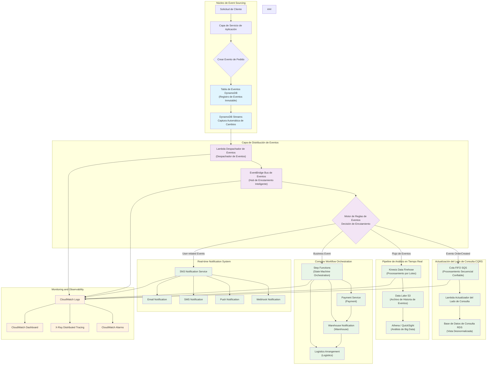

```python
class PortfolioEventStore:
    """Implementación de Event Sourcing para portfolios de inversión"""

    def __init__(self):
        self.event_store = boto3.client('dynamodb')
        self.event_stream = boto3.client('kinesis')

    async def store_trade_event(self, portfolio_id, event):
        """Almacenar evento de trade en DynamoDB"""

        event_record = {
            'portfolio_id': {'S': portfolio_id},
            'event_id': {'S': str(uuid.uuid4())},
            'event_type': {'S': event.type},
            'event_data': {'S': json.dumps(event.data)},
            'timestamp': {'N': str(int(time.time() * 1000))},
            'sequence_number': {'N': str(await self.get_next_sequence(portfolio_id))}
        }

        # Escritura de consistencia fuerte
        await self.event_store.put_item(
            TableName='PortfolioEvents',
            Item=event_record,
            ConditionExpression='attribute_not_exists(event_id)'
        )

        # Enviar asincrónicamente a Kinesis para consumo por otros servicios
        await self.event_stream.put_record(
            StreamName='portfolio-events',
            Data=json.dumps(event_record),
            PartitionKey=portfolio_id
        )

    async def rebuild_portfolio_state(self, portfolio_id, as_of_time=None):
        """Reconstruir estado del portfolio a partir de eventos"""

        query_params = {
            'TableName': 'PortfolioEvents',
            'KeyConditionExpression': 'portfolio_id = :pid',
            'ExpressionAttributeValues': {':pid': {'S': portfolio_id}},
            'ScanIndexForward': True  # Orden cronológico
        }

        if as_of_time:
            query_params['FilterExpression'] = 'timestamp <= :time'
            query_params['ExpressionAttributeValues'][':time'] = {'N': str(as_of_time)}

        events = await self.event_store.query(**query_params)

        # Reproducir eventos para reconstruir estado
        portfolio_state = PortfolioState()
        for event_item in events['Items']:
            event = self.deserialize_event(event_item)
            portfolio_state.apply_event(event)

        return portfolio_state
```

Veamos una pregunta de escenario:

```
Usando la implementación EDA de ticker de acciones como ejemplo, necesito crear una tabla de trading de acciones separada para cada usuario?
```

La respuesta es: Absolutamente no.

Crear una tabla de datos para cada acción para cada usuario es un error de diseño común que conduce a un desastre de "explosión de tablas". Un usuario activo podría comerciar cientos de acciones; diez mil usuarios podrían generar cientos de miles o incluso millones de tablas, lo cual es inviable para gestión, mantenimiento y consultas.

**Enfoque Correcto de Diseño de Tabla: Centrarse en "Flujos de Eventos"**

En EDA, no deberíamos pensar "qué tablas debo crear para almacenar estado", sino más bien **"para qué entidades debo crear flujos de eventos?"**

En el escenario de trading de acciones, la entidad de negocio central (la "raíz agregada" en DDD) es **"el portfolio de inversión del usuario" o "cuenta de trading"**, no acciones individuales. En realidad, todos los comportamientos de trading de un usuario (conducta) ocurren alrededor de su portfolio específico (requisito).

Por lo tanto, solo necesitamos una tabla de eventos, que llamaré `TradingEvents`. Esta tabla registra todos los eventos de trading para todos los usuarios y todos los portfolios.

Estructura Ideal de Tabla `TradingEvents` (usando DynamoDB como ejemplo)

| Nombre de Campo (Atributo) | Rol                    | Ejemplo                                             | Notas                                                                                                                                        |
| :------------------------- | :--------------------- | :-------------------------------------------------- | :------------------------------------------------------------------------------------------------------------------------------------------- |
| portfolio_id               | Partition Key          | user123-portfolio-A                                 | Diseño central: Todos los eventos pertenecientes al mismo portfolio se almacenan físicamente juntos, maximizando eficiencia de consulta.     |
| sequence_number            | Sort Key               | 1, 2, 3, ...                                        | Diseño central: Garantiza orden secuencial estricto para todos los eventos dentro de un portfolio?a base para reproducir historia y reconstruir estado. |
| event_id                   | Identificador único de evento| uuid-v4-string                                | Usado para asegurar unicidad de evento y prevenir procesamiento duplicado.                                                                   |
| event_type                 | Tipo de evento         | STOCK_BOUGHT, STOCK_SOLD                            | Describe "qué pasó", determinando cómo la lógica de negocio procesa este evento.                                                             |
| event_payload              | Contenido del evento (JSON)   | {"symbol": "AAPL", "quantity": 10, "price": 175.50} | Registra detalles específicos del evento.                                                                                                     |
| timestamp                  | Tiempo de ocurrencia del evento  | 2025-09-12T10:00:00Z                         | Registra tiempo de negocio del mundo real para auditoría y análisis.                                                                         |

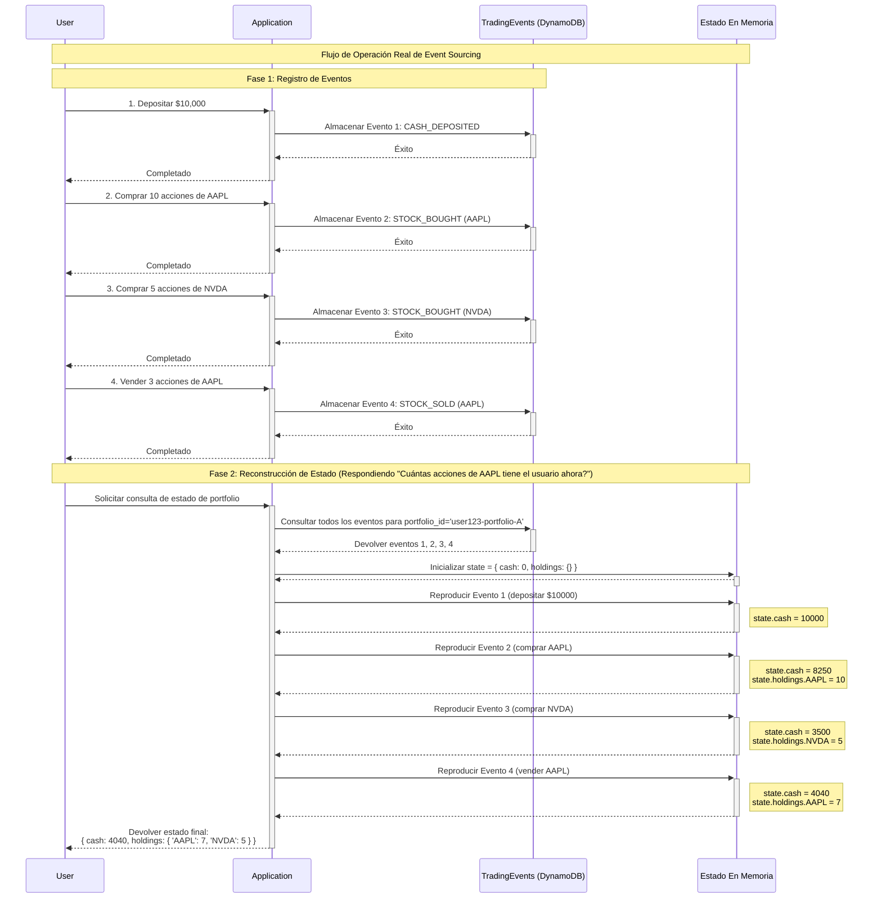

---

### 3. CQRS (Segregación de Responsabilidad de Comando y Consulta)

Démosle un descanso a los pobres administradores de nuestra biblioteca y a los agotados empleados temporales. Ahora dirigiremos nuestra atención al estadio de la final de la Copa del Mundo?bservado simultáneamente por casi un tercio de la población mundial, un evento muy anticipado y emocionante.

Los eventos en el campo cambian en un instante; la diferencia de un milisegundo podría significar la diferencia entre arrodillarse ante el podio de campeones o presenciar el nacimiento de una nueva leyenda del fútbol. Sin embargo, el estadio tiene espacio físico limitado. Si todos los atletas, medios y fanáticos del mundo estuvieran concentrados en el mismo estadio, sería físicamente imposible?omos humanos, no bloques LEGO. Así que la gran mayoría de nosotros todavía lo experimentamos a través de los **medios (comportamiento de registro)** y su **cobertura (el impacto del registro)**.

Cuando un jugador comete una falta, el árbitro pita y muestra una tarjeta amarilla. Saca un cuaderno y meticulosamente registra: `número de jugador`, `tiempo`, `tipo de falta`. Mientras tanto, en las líneas laterales, varios medios de comunicación entran en acción. El locutor de radio inmediatamente transmite quién recibió la tarjeta amarilla desde su asiento. Los reporteros de noticias en línea instantáneamente publican actualizaciones de ticker que aparecen en programas de TV. Los reporteros en vivo en el sitio inmediatamente enfocan al árbitro y al jugador ansioso y protestando, esperando que se desarrollen eventos subsecuentes.

Ves? **Hay solo un hecho** (el árbitro registró una tarjeta amarilla), pero **hay miles de formas de presentar los datos**. Si forzáramos a todos los medios a leer el cuaderno garabateado del árbitro con solo palabras clave, sería un desastre.

Lo que está sucediendo en el campo es el "hecho" singular.

**Lado de Comando - El Árbitro en el Campo**
`El árbitro pita y muestra una tarjeta amarilla. Saca un cuaderno y meticulosamente registra...` Esta acción es un "comando". Cambia el estado oficial del partido. El cuaderno del árbitro es el "Modelo de Escritura", diseñado con **precisión absoluta y consistencia de reglas** como sus objetivos. No le importa si la cobertura es emocionante; solo le importa si el registro está libre de errores.

**Lado de Consulta - Unidades de Transmisión y Medios**

Mientras tanto, en las líneas laterales, varios medios de comunicación tienen necesidades (consultas) completamente diferentes:

- **Transmisores de TV/Radio**: Necesitan flujos de datos en tiempo real para transmitir. Su "modelo de consulta" es un panel de control que contiene `marcador actual`, `tiempo de partido`, `posesión`, `eventos en vivo (como: tiros, tiros de esquina)`. Está optimizado para **velocidad y narrativa**.
- **Reporteros de Noticias de Última Hora**: Necesitan publicar inmediatamente la información más crítica. Su "modelo de consulta" podría ser simplemente una lista de eventos extremadamente simple: `"Messi anota! Argentina lidera 1:0!"`. Está optimizado para **puntualidad**.
- **Analistas de Noticias Vespertinas**: Necesitan estadísticas completas post-partido para escribir informes en profundidad. Su "modelo de consulta" es un informe agregado complejo que contiene `distancia recorrida por jugador`, `tasa de pases completados`, `mapa de distribución de tiros`. Está optimizado para **profundidad y análisis**.
- **Editores de Redes Sociales**: Necesitan clips emocionantes para atraer atención. Su "modelo de consulta" son GIFs de goles, videos cortos de jugadas controvertidas. Está optimizado para **interactividad y viralidad**.

La filosofía central de CQRS es: **Dejar que el árbitro se enfoque en el mantenimiento preciso de registros (comandos), mientras permite que cada medio de comunicación construya las notas de visualización más adecuadas (consultas) para sus propias necesidades.**

**Concepto Abstracto**: Estructura optimizada para escritura Estructura optimizada para consulta

**Principios de Diseño:**

- **Lado de Comando:**

  - Altamente normalizado

###
  - Requisitos de consistencia fuerte
  - Optimización de rendimiento de escritura

- **Lado de Consulta:**

  - Desnormalización extensiva
  - Consistencia eventual
  - Optimización de rendimiento de lectura

**Beneficios Prácticos:**

- Separación de carga de lectura/escritura
- Escalado independiente para cada lado
- Las consultas complejas no impactan el negocio central

**Escenarios de Aplicación:**

CQRS no es una bala de plata. Introduce complejidad adicional, por lo que solo debe usarse en escenarios donde los beneficios claramente superen los costos. Aquí hay varios escenarios clásicos donde CQRS entrega máximo valor:

1.  **Sistemas de alto tráfico e intensivos en lectura (la demanda de lectura es la raíz cuadrada o más de las escrituras)**:

    - **Escenario**: Catálogos de productos de plataformas de comercio electrónico, páginas de artículos de medios de noticias, feeds de contenido de plataformas sociales. En estos sistemas, las operaciones de lectura (navegar productos, leer artículos) superan ampliamente las operaciones de escritura (realizar pedidos, publicar artículos).
    - **Por qué elegir CQRS**: El lado de consulta puede escalarse independientemente. Por ejemplo, podemos desplegar un clúster de base de datos de lectura de 10 nodos y una capa de caché de alto rendimiento para manejar solicitudes de navegación de millones de usuarios, mientras que el lado de escritura puede necesitar solo una única instancia de base de datos estable. Esto evita que el tráfico de lectura abrume el sistema de transacciones central.

2.  **Consultas complejas y vistas de datos diversas**:

    - **Escenario**: Paneles de Business Intelligence (BI), plataformas de análisis de datos, backends administrativos. Estos sistemas necesitan generar múltiples vistas completamente diferentes de los mismos datos centrales. Por ejemplo, los datos de ventas necesitan presentarse simultáneamente como "gráfico de tendencia de ventas por región", "informe de análisis de ganancias por categoría de producto" y "lista de actividad de clientes de alto valor".
    - **Por qué elegir CQRS**: Se puede construir un "modelo de lectura" especialmente optimizado para cada necesidad de consulta. El modelo de gráfico de tendencias podría ser una tabla de datos de series temporales pre-calculada; el informe de análisis de ganancias podría ser una tabla amplia desnormalizada; y la lista de clientes podría ser un índice almacenado en un motor de búsqueda (como OpenSearch). Esto evita ejecutar numerosas operaciones complejas y lentas de `JOIN` y agregación en una única base de datos normalizada.

3.  **Combinación con Event Sourcing**:

    - **Escenario**: Sistemas de trading financiero, sistemas de registro de auditoría, cualquier dominio que requiera trazabilidad histórica completa. En estos escenarios, el núcleo del sistema es un registro de eventos inmutable.
    - **Por qué elegir CQRS**: CQRS es un compañero natural de Event Sourcing.
      - **Lado de Comando**: Valida comandos y los transforma en eventos, luego almacena eventos en el registro de eventos (como DynamoDB o Kinesis). Esta es la única operación de escritura.
      - **Lado de Consulta**: Al suscribirse al flujo de eventos, construye y actualiza varias "proyecciones", es decir, modelos de lectura. El "estado actual" del sistema en sí mismo es un modelo de lectura proyectado de todos los eventos históricos.

4.  **Dominios colaborativos de alta concurrencia**:
    - **Escenario**: Documentos colaborativos en línea (como Google Docs), diagramas de Gantt compartidos multi-usuario, herramientas de diseño de edición colaborativa. Múltiples usuarios operan simultáneamente en el mismo recurso.
    - **Por qué elegir CQRS**: Puede reducir el alcance del manejo de conflictos. Todas las operaciones de "escritura" (Comandos) pueden procesarse en serie (por ejemplo, a través de una cola FIFO), asegurando consistencia y orden secuencial de cambios de estado. Mientras tanto, las operaciones de "lectura" de cada usuario pueden recuperar rápidamente datos de modelos de lectura optimizados para ellos, sin ser bloqueados por operaciones de escritura de otros usuarios.

**Desafíos y Complejidades:**

1.  **Consistencia Eventual**: Este es el mayor desafío de CQRS. Después de que un usuario actualiza datos, una consulta inmediata todavía puede mostrar datos antiguos. Esto requiere un cuidadoso diseño de UI/UX front-end (por ejemplo, mostrar "Actualizando..." o usar actualizaciones optimistas).
2.  **Modelos Dobles**: Los desarrolladores necesitan mantener modelos de comando y uno o más modelos de consulta, aumentando la complejidad del código y la carga de trabajo de desarrollo.
3.  **Complejidad de Infraestructura**: Requiere introducir middleware como buses de eventos (como EventBridge), colas de mensajes (como SQS) para sincronizar datos entre los dos lados, aumentando costos operacionales y puntos de falla potenciales.
4.  **Sincronización y Reproducción de Datos**: Si el modelo de lectura del lado de consulta se corrompe o necesita cambios estructurales, puede necesitarse un mecanismo para "reproducir" eventos históricos para reconstruir el modelo de lectura?n proceso complejo.

###

#### AWS Implementation: CQRS for Football Match Events

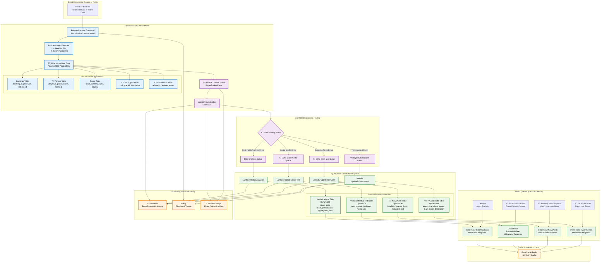

```python
class FootballMatchCQRS:
    """Implementación CQRS para partidos de fútbol"""

    def __init__(self):
        # Lado de comando: base de datos relacional normalizada
        self.command_db = boto3.client('rds-data', database='football_command')

        # Lado de consulta: base de datos NoSQL desnormalizada
        self.query_db = boto3.client('dynamodb')

        # Bus de eventos
        self.event_bridge = boto3.client('events')

        # Capa de caché
        self.cache = boto3.client('elasticache')

    async def record_yellow_card_command(self, match_id, player_id, referee_id, foul_type_id, minute):
        """Lado de comando: Registrar evento de tarjeta amarilla (almacenamiento normalizado)"""

        async with self.command_db.begin_transaction() as tx:
            # 1. Validación de lógica de negocio
            await self.validate_yellow_card_business_rules(match_id, player_id, minute)

            # 2. Escribir en tablas relacionales normalizadas
            booking_id = await tx.execute("""
                INSERT INTO bookings (match_id, player_id, referee_id, foul_type_id, game_minute, timestamp)
                VALUES (:match_id, :player_id, :referee_id, :foul_type_id, :minute, NOW())
                RETURNING booking_id
            """, {
                'match_id': match_id,
                'player_id': player_id,
                'referee_id': referee_id,
                'foul_type_id': foul_type_id,
                'minute': minute
            })

            # 3. Actualizar estadísticas acumulativas del jugador (en la misma transacción)
            await tx.execute("""
                UPDATE player_match_stats
                SET yellow_cards = yellow_cards + 1
                WHERE match_id = :match_id AND player_id = :player_id
            """, {'match_id': match_id, 'player_id': player_id})

            # 4. Publicar evento de dominio
            await self.publish_player_booked_event(booking_id, match_id, player_id, foul_type_id, minute)

    async def publish_player_booked_event(self, booking_id, match_id, player_id, foul_type_id, minute):
        """Publicar evento de jugador amonestado"""

        # Componer datos completos del evento desde tablas normalizadas
        event_data = await self.build_complete_event_data(match_id, player_id, foul_type_id)

        await self.event_bridge.put_events(
            Entries=[
                {
                    'Source': 'com.football.match',
                    'DetailType': 'PlayerBooked',
                    'Detail': json.dumps({
                        'booking_id': booking_id,
                        'match_id': match_id,
                        'player_name': event_data['player_name'],
                        'team_name': event_data['team_name'],
                        'foul_description': event_data['foul_description'],
                        'game_minute': minute,
                        'timestamp': datetime.utcnow().isoformat()
                    }),
                    'EventBusName': 'football-events'
                }
            ]
        )

    async def update_tv_dashboard_projection(self, event):
        """Actualizar panel de transmisión TV (proyección del lado de consulta)"""

        # Crear registro desnormalizado optimizado para transmisión de TV
        tv_event = {
            'event_id': {'S': str(uuid.uuid4())},
            'match_id': {'S': event['match_id']},
            'display_text': {'S': f"{event['player_name']} ({event['team_name']}) - {event['foul_description']}"},
            'game_minute': {'N': str(event['game_minute'])},
            'urgency_level': {'S': 'MEDIUM'},
            'created_at': {'N': str(int(time.time()))},
            'ttl': {'N': str(int(time.time()) + 86400)}  # Auto-limpieza después de 24 horas
        }

        # Escribir en tabla de consulta diseñada específicamente para estaciones de TV
        await self.query_db.put_item(
            TableName='TVLiveEvents',
            Item=tv_event
        )

        # También actualizar caché para consultas a nivel de milisegundos de las estaciones de TV
        await self.cache.set(
            f"tv:live_events:{event['match_id']}",
            json.dumps(tv_event),
            ex=3600  # Caché de 1 hora
        )

    async def update_news_alert_projection(self, event):
        """Actualizar proyección de alerta de noticias"""

        # Crear estructura de datos optimizada para titulares de noticias
        news_alert = {
            'alert_id': {'S': str(uuid.uuid4())},
            'headline': {'S': f"?? {event['player_name']} recibe tarjeta amarilla!"},
            'sub_headline': {'S': f"{event['team_name']} vs Oponente - Minuto {event['game_minute']}"},
            'urgency_score': {'N': '75'},
            'category': {'S': 'BOOKING'},
            'formatted_content': {'S': self.format_news_content(event)},
            'created_at': {'N': str(int(time.time()))}
        }

        await self.query_db.put_item(
            TableName='NewsAlerts',
            Item=news_alert
        )

    async def update_social_media_projection(self, event):
        """Actualizar proyección de redes sociales"""

        social_post = {
            'post_id': {'S': str(uuid.uuid4())},
            'content': {'S': f"? {event['player_name']} es amonestado en el minuto {event['game_minute']}!"},
            'hashtags': {'SS': ['#WorldCup', f"#{event['team_name']}", '#YellowCard']},
            'media_type': {'S': 'TEXT_WITH_EMOJI'},
            'engagement_score': {'N': '0'},
            'created_at': {'N': str(int(time.time()))}
        }

        await self.query_db.put_item(
            TableName='SocialMediaFeed',
            Item=social_post
        )

    async def update_analytics_projection(self, event):
        """Actualizar proyección de estadísticas de analistas"""

        # Actualizar estadísticas del jugador
        await self.query_db.update_item(
            TableName='MatchAnalytics',
            Key={
                'analysis_type': {'S': 'PLAYER_STATS'},
                'entity_id': {'S': f"player_{event['player_id']}"}
            },
            UpdateExpression='ADD yellow_cards :inc SET last_updated = :timestamp',
            ExpressionAttributeValues={
                ':inc': {'N': '1'},
                ':timestamp': {'N': str(int(time.time()))}
            }
        )

        # Actualizar estadísticas del equipo
        await self.query_db.update_item(
            TableName='MatchAnalytics',
            Key={
                'analysis_type': {'S': 'TEAM_STATS'},
                'entity_id': {'S': f"team_{event['team_id']}"}
            },
            UpdateExpression='ADD total_bookings :inc SET last_updated = :timestamp',
            ExpressionAttributeValues={
                ':inc': {'N': '1'},
                ':timestamp': {'N': str(int(time.time()))}
            }
        )

    # Métodos de consulta ultrarrápidos para cada medio de comunicación
    async def get_tv_live_events(self, match_id):
        """Consulta de estación de TV: Respuesta a nivel de milisegundos"""

        # Verificar caché primero
        cached = await self.cache.get(f"tv:live_events:{match_id}")
        if cached:
            return json.loads(cached)

        # Cache miss, consultar DynamoDB
        response = await self.query_db.query(
            TableName='TVLiveEvents',
            KeyConditionExpression='match_id = :match_id',
            ExpressionAttributeValues={':match_id': {'S': match_id}},
            ScanIndexForward=False,  # Eventos más recientes primero
            Limit=10
        )

        events = [self.deserialize_tv_event(item) for item in response['Items']]

        # Rellenar caché
        await self.cache.set(f"tv:live_events:{match_id}", json.dumps(events), ex=300)

        return events

    async def get_breaking_news(self, urgency_threshold=70):
        """Consulta de reportero de noticias de última hora: Ordenado por urgencia"""

        response = await self.query_db.scan(
            TableName='NewsAlerts',
            FilterExpression='urgency_score >= :threshold',
            ExpressionAttributeValues={':threshold': {'N': str(urgency_threshold)}},
            Limit=5
        )

        return [self.deserialize_news_alert(item) for item in response['Items']]

    async def get_trending_social_content(self):
        """Consulta de editor de redes sociales: Ordenado por engagement"""

        response = await self.query_db.scan(
            TableName='SocialMediaFeed',
            IndexName='EngagementScoreIndex',
            ScanIndexForward=False,  # Alto engagement primero
            Limit=20
        )

        return [self.deserialize_social_post(item) for item in response['Items']]

    async def get_match_analytics(self, match_id):
        """Consulta de analista: Datos estadísticos completos"""

        response = await self.query_db.query(
            TableName='MatchAnalytics',
            KeyConditionExpression='match_id = :match_id',
            ExpressionAttributeValues={':match_id': {'S': match_id}}
        )

        return [self.deserialize_analytics(item) for item in response['Items']]
```

###

---

### 4. Arquitectura Multi-Tenant (Multi-Inquilino)

Dado que estamos hablando de transmisiones de TV, recuerdo un proyecto de investigación en el que ayudé durante mis años universitarios: "Análisis de Perfiles de Agrupación de Preferencias de Audiencia de Netflix Asia". Este fue un proyecto de investigación muy interesante donde tuve el privilegio de ver el conjunto de datos de preferencias de espectadores de Netflix y varias tablas de datos de clasificación de películas/series de TV de un cierto período de tiempo. El objetivo final era ayudar a construir un grafo de red de preferencias para múltiples grupos demográficos a través de diferentes tipos de obras audiovisuales para ayudar a construir un modelo de recomendación.

Pero me desvío del tema. Volvamos nuestra atención a la gestión de contenido de Netflix. Imagina que Netflix necesita proporcionar una plataforma unificada de gestión de video para cientos de estudios de producción de contenido, distribuidores y titulares de derechos a nivel global, pero cada "inquilino" tiene necesidades y permisos completamente diferentes. La arquitectura multi-tenant también necesita proporcionar servicios diferenciados para inquilinos en diferentes estados.

1. El contenido exclusivo de Asia no puede ser visto por otros continentes
2. El metraje en bruto de un estudio español necesita posproducción por un estudio de imágenes canadiense - mientras el equipo de gestión en Francia debe poder ver actualizaciones del estado de los archivos
3. Obras audiovisuales cuyos derechos de transmisión de la temporada actual han terminado están a punto de ser archivadas, pero se sabe que reanudarán la transmisión en 3 años.

Todos los estudios y equipos están usando sus respectivos sistemas en la nube, pero en realidad, está construido sobre **un gran pool único**.

**Concepto Abstracto**: Una aplicación sirve a múltiples "inquilinos" simultáneamente, con cada inquilino creyendo que están usando un sistema dedicado

- **Cuatro Indicadores Centrales de Filosofía de Diseño**:

  - **Aislamiento**: El equipo de marketing absolutamente no puede ver contenido no publicado que todavía está en producción. Los datos y operaciones de cada inquilino deben estar completamente aislados.

  - **Compartición**: Todos los estudios comparten la misma infraestructura de codificación, almacenamiento y distribución de video. Nadie necesita construir su propia red CDN global.

  - **Personalización**: Algunos estudios necesitan flujos de trabajo de producción de alta calidad 4K HDR, mientras que algunos cineastas independientes solo necesitan 1080p. La plataforma debe soportar diferentes niveles de servicio.

  - **Escalabilidad**: Cuando nuevos estudios de producción se unen, el sistema debería poder escalar sin problemas sin re-arquitectar toda la plataforma.

#### Tres Modelos Clásicos de Multi-Tenancy: Usando Gestión de Video de Netflix como Ejemplo

**Almacenamiento compartido, estructura de datos compartida**, **Infraestructura compartida, espacio de almacenamiento independiente**, **Infraestructura completamente independiente**

#### Modelo 1: Almacenamiento Compartido, Estructura de Datos Compartida (S3 Bucket Compartido, Estructura de Prefijo Compartida)

Esto es como si los videos de todos los estudios de producción estuvieran almacenados en el mismo repositorio masivo de S3, pero diferenciados a través de estructura de carpetas y permisos de acceso.

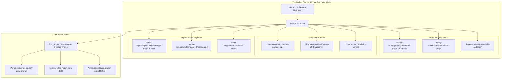

**Personificación del Ciclo de Vida del Video en Modelo Compartido**:

- **Videos de Producción** (`production/`): Lectura/escritura de alta frecuencia, requiere control de versiones, colaboración multipersonal
- **Videos Publicados** (`published/`): Lectura de alta frecuencia, requiere distribución CDN global
- **Videos Archivados** (`archived/`): Acceso de baja frecuencia, pueden moverse a niveles de almacenamiento más baratos

**Estrategia de Almacenamiento S3**:

```python
# Estrategia de almacenamiento S3 basada en el estado del video
S3_STORAGE_POLICIES = {
    'production': {
        'storage_class': 'STANDARD',
        'versioning': True,
        'encryption': 'aws:kms',
        'backup_frequency': 'hourly',
        'cost_per_gb_month': 0.023
    },
    'published': {
        'storage_class': 'STANDARD',
        'cdn_distribution': True,
        'global_replication': True,
        'cost_per_gb_month': 0.023
    },
    'archived': {
        'storage_class': 'GLACIER_FLEXIBLE_RETRIEVAL',
        'versioning': False,
        'retrieval_time': '1-5 minutes',
        'cost_per_gb_month': 0.0036
    }
}
```

**Ventajas**:

- **Costo Más Bajo**: Todos los inquilinos comparten el mismo bucket S3, maximizando la utilización de recursos
- **Gestión Simple**: Solo necesita mantener un repositorio, políticas de ciclo de vida y monitoreo unificados
- **Mejor Flexibilidad**: Agregar nuevos inquilinos solo requiere crear nuevas carpetas de prefijo, sin necesidad de reconfiguración

**Desventajas**:

- **Riesgo de Aislamiento**: Mala configuración de IAM podría llevar a filtración de datos (Disney accidentalmente ve contenido de HBO)
- **Riesgo de Rendimiento**: Subidas masivas de estudios populares podrían afectar las velocidades de acceso de otros inquilinos
- **Limitaciones de Personalización**: Todos los inquilinos deben usar la misma clase de almacenamiento y políticas de ciclo de vida

#### Modelo 2: Infraestructura Compartida, Buckets S3 Separados (Infraestructura Compartida, Espacios de Almacenamiento Separados)

Esto es como si cada estudio de producción tuviera su propio "almacén" dedicado, pero compartiendo el mismo sistema de distribución logística.

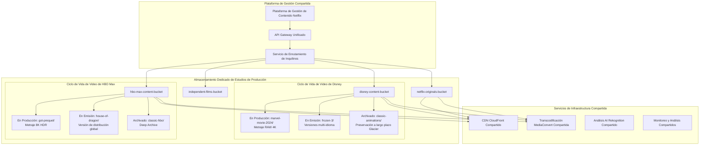

**Gestión Automatizada Basada en Estado del Video**:

```python
class ContentLifecycleManager:
    """Gestión automatizada del ciclo de vida basada en el estado del video"""

    def __init__(self, tenant_id):
        self.tenant_bucket = f"{tenant_id}-content-bucket"
        self.lifecycle_policies = {
            'production': {
                'standard_ia_transition': 30,  # Transición a IA después de 30 días
                'glacier_transition': 90,      # Transición a Glacier después de 90 días
                'expiration': None             # Nunca eliminar
            },
            'published': {
                'standard_ia_transition': 365, # Transición a IA después de 1 año
                'glacier_transition': 1095,    # Transición a Glacier después de 3 años
                'expiration': None
            },
            'archived': {
                'immediate_glacier': True,     # Transición inmediata a Glacier
                'deep_archive_transition': 90, # Transición a Deep Archive después de 90 días
                'expiration': 2555             # Eliminar después de 7 años
            }
        }

    async def transition_content_status(self, content_id, from_status, to_status):
        """La transición de estado de contenido desencadena cambios en la política de almacenamiento"""

        if from_status == 'production' and to_status == 'published':
            # Producción completa, preparar para lanzamiento
            await self.create_distribution_copies(content_id)
            await self.enable_global_cdn(content_id)
            await self.setup_drm_protection(content_id)

        elif from_status == 'published' and to_status == 'archived':
            # Derechos expirados, procesamiento de archivado
            await self.disable_cdn_distribution(content_id)
            await self.transition_to_glacier(content_id)
            await self.update_metadata_only_access(content_id)

    async def create_distribution_copies(self, content_id):
        """Crear múltiples versiones de formato para distribución"""

        source_key = f"production/{content_id}/master.mp4"

        # Crear diferentes versiones de calidad
        encoding_jobs = [
            {'resolution': '4K', 'bitrate': '15000k', 'target': 'premium'},
            {'resolution': '1080p', 'bitrate': '5000k', 'target': 'standard'},
            {'resolution': '720p', 'bitrate': '2500k', 'target': 'mobile'},
            {'resolution': '480p', 'bitrate': '1000k', 'target': 'low_bandwidth'}
        ]

        for job in encoding_jobs:
            await self.submit_encoding_job(source_key, job)

    async def intelligent_cost_optimization(self):
        """Optimización inteligente de costos basada en datos de visualización"""

        # Analizar datos de visualización de los últimos 90 días
        viewing_analytics = await self.get_viewing_analytics(days=90)

        for content_id, analytics in viewing_analytics.items():
            if analytics['views_per_day'] < 1:
                # Contenido de baja audiencia, considerar degradación de almacenamiento
                await self.suggest_storage_downgrade(content_id)
            elif analytics['views_per_day'] > 1000:
                # Contenido de alta audiencia, considerar actualización de almacenamiento
                await self.suggest_storage_upgrade(content_id)
```

**Ventajas**:

- **Aislamiento Medio**: Cada inquilino tiene espacio de almacenamiento completamente independiente, reduciendo el riesgo de filtración de datos
- **Flexibilidad de Personalización**: Puede establecer diferentes políticas de ciclo de vida y niveles de almacenamiento para diferentes inquilinos
- **Aislamiento de Rendimiento**: Las operaciones de inquilinos grandes no afectan directamente el rendimiento de almacenamiento de inquilinos pequeños

**Desventajas**:

- **Complejidad de Gestión Aumentada**: Necesita gestionar cientos de buckets S3 diferentes
- **Visibilidad de Costos Difícil**: Requiere mecanismos más complejos de asignación de costos
- **Análisis Cross-Tenant Difícil**: Difícil realizar análisis de contenido y pronóstico de tendencias a nivel de toda la plataforma

###

#### Modelo 3: Infraestructura Completamente Independiente (Infraestructura Dedicada)

Esto es como si cada gran estudio de producción tuviera su propia infraestructura completa de producción, almacenamiento y distribución.

```mermaid
graph TB
    subgraph "Infraestructura Dedicada de Disney"
        A1[Cuenta AWS de Disney] --> B1[Buckets S3 Dedicados]
        A1 --> C1[Distribución CloudFront Dedicada]
        A1 --> D1[Pipeline MediaConvert Dedicado]
        A1 --> E1[Red VPC Dedicada]

        subgraph "Estratificación de Contenido de Disney"
            B1 --> F1[En Producción: RAW 4K<br/>S3 Standard + Versionado]
            B1 --> F2[Publicación: Multi-formato<br/>S3 + CDN Global]
            B1 --> F3[Colección Clásica: Películas Antiguas<br/>S3 Glacier Deep Archive]
        end
    end

    subgraph "Infraestructura Dedicada de HBO Max"
        A2[Cuenta AWS de HBO] --> B2[Buckets S3 Dedicados]
        A2 --> C2[Distribución CloudFront Dedicada]
        A2 --> D2[Pipeline MediaConvert Dedicado]
        A2 --> E2[Red VPC Dedicada]

        subgraph "Estratificación de Contenido de HBO"
            B2 --> G1[En Producción: 8K HDR<br/>S3 Standard + Respaldo en Tiempo Real]
            B2 --> G2[Transmisión Activa: Series<br/>S3 + Optimización Edge]
            B2 --> G3[Series Completadas: Contenido Antiguo<br/>S3 IA + Restauración Selectiva]
        end
    end

    subgraph "Infraestructura Compartida de Estudio de Cine Independiente"
        A3[Infraestructura Compartida de Películas Independientes] --> B3[Buckets S3 Compartidos]
        A3 --> C3[CloudFront Compartido]
        A3 --> D3[Servicio de Transcodificación Compartido]

        subgraph "Gestión de Contenido de Cine Independiente"
            B3 --> H1[Producción de Bajo Presupuesto<br/>S3 IA + Transcodificación Básica]
            B3 --> H2[Distribución Nicho<br/>CDN bajo demanda]
            B3 --> H3[Archivo de Películas Antiguas<br/>Glacier + Restauración Manual]
        end
    end

    subgraph "Sistema Central de Coordinación de Netflix"
        I[Portal de Socios de Netflix]
        I --> J[Autenticación y Autorización Unificadas]
        I --> K[Panel de Análisis Cross-plataforma]
        I --> L[Gestión Unificada de Derechos]

        A1 --> I
        A2 --> I
        A3 --> I
    end
```

**Arquitectura de Gestión de Contenido Empresarial**:

```python
class EnterpriseContentInfrastructure:
    """Infraestructura dedicada para inquilinos empresariales"""

    def __init__(self, tenant_id, tier='enterprise'):
        self.tenant_id = tenant_id
        self.tier = tier
        self.infrastructure_config = self.get_tier_config(tier)

    def get_tier_config(self, tier):
        """Configurar infraestructura basada en el nivel del inquilino"""

        configs = {
            'enterprise': {
                'dedicated_account': True,
                'vpc': 'dedicated',
                's3_buckets': 'multiple_specialized',
                'cloudfront': 'dedicated_distribution',
                'mediaconvert': 'reserved_capacity',
                'monitoring': 'detailed_metrics',
                'support': '24/7_premium',
                'monthly_cost': 50000,
                'content_limits': 'unlimited'
            },
            'professional': {
                'dedicated_account': False,
                'vpc': 'shared_with_isolation',
                's3_buckets': 'dedicated_bucket',
                'cloudfront': 'shared_distribution',
                'mediaconvert': 'on_demand',
                'monitoring': 'standard_metrics',
                'support': 'business_hours',
                'monthly_cost': 5000,
                'content_limits': '10TB'
            },
            'indie': {
                'dedicated_account': False,
                'vpc': 'shared',
                's3_buckets': 'shared_with_prefix',
                'cloudfront': 'shared_basic',
                'mediaconvert': 'spot_instances',
                'monitoring': 'basic_metrics',
                'support': 'community',
                'monthly_cost': 500,
                'content_limits': '1TB'
            }
        }

        return configs.get(tier, configs['indie'])

    async def provision_dedicated_infrastructure(self):
        """Provisionar infraestructura dedicada para inquilinos empresariales"""

        if self.tier == 'enterprise':
            # Crear cuenta AWS dedicada
            dedicated_account = await self.create_dedicated_aws_account()

            # Configurar políticas de ciclo de vida de contenido dedicadas
            await self.setup_content_lifecycle_policies(dedicated_account)

            # Configurar red de distribución global
            await self.setup_global_distribution_network(dedicated_account)

            # Configurar medidas de seguridad y cumplimiento dedicadas
            await self.setup_security_compliance(dedicated_account)

    async def setup_content_lifecycle_policies(self, account_id):
        """Configurar automatización del ciclo de vida del contenido"""

        lifecycle_rules = {
            'production_content': {
                'versioning': True,
                'mfa_delete': True,
                'backup_frequency': 'real_time',
                'retention_policy': 'indefinite',
                'access_logging': True
            },
            'published_content': {
                'replication': 'cross_region',
                'cdn_integration': True,
                'analytics_tracking': True,
                'drm_protection': True
            },
            'archived_content': {
                'storage_class_transition': {
                    'to_ia': 30,
                    'to_glacier': 90,
                    'to_deep_archive': 365
                },
                'retrieval_policy': 'expedited_available',
                'metadata_preservation': True
            }
        }

        for content_type, rules in lifecycle_rules.items():
            await self.apply_lifecycle_rules(account_id, content_type, rules)
```

**Ventajas**:

- **Aislamiento Más Alto**: Aislamiento completo de datos e infraestructura, riesgo cero de filtración de datos
- **Máxima Personalización**: Cada inquilino puede tener arquitectura y políticas completamente personalizadas
- **Rendimiento Independiente**: Las operaciones de inquilinos grandes no afectan completamente a otros inquilinos
- **Cumplimiento**: Fácil cumplir con requisitos regulatorios estrictos de la industria (como protección de derechos de autor de la industria cinematográfica)

**Desventajas**:

- **Costo Más Alto**: Cada inquilino necesita recursos de infraestructura independientes
- **Gestión Compleja**: Necesita gestionar múltiples cuentas AWS y permisos complejos entre cuentas
- **Desperdicio de Recursos**: Los inquilinos pequeños pueden no utilizar completamente los recursos asignados a ellos

#### Simulando Netflix: Modelo Híbrido Estratificado Inteligente Basado en Valor del Contenido

Intentemos simular un escenario del mundo real. En una plataforma real de contenido de Netflix, los recursos deberían asignarse dinámicamente basándose en el valor comercial del contenido, costo de producción y audiencia esperada, por lo que nuestro diseño adoptaría un modelo híbrido.

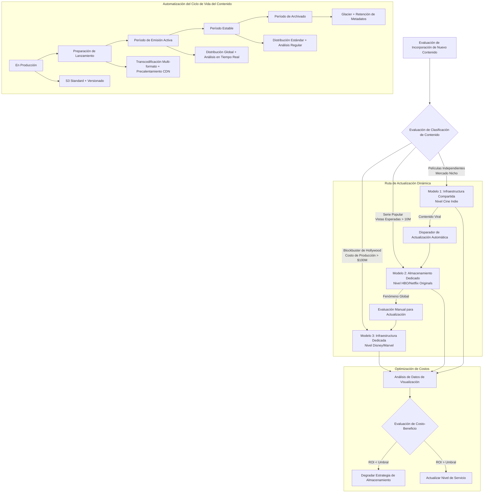

##### Implementación de Código Fake Multi-Tenancy S3 de AWS

```python
class NetflixContentMultiTenantPlatform:
    """Plataforma de contenido multi-tenant estilo Netflix"""

    def __init__(self):
        self.tenant_strategies = {
            'hollywood_studio': {
                'model': 'dedicated_infrastructure',
                'storage': 'dedicated_s3_account',
                'cdn': 'dedicated_cloudfront',
                'encoding': 'reserved_mediaconvert',
                'isolation': 'account_level',
                'max_content_size': 'unlimited',
                'monthly_cost': 50000,
                'sla': '99.99%'
            },
            'streaming_platform': {
                'model': 'dedicated_storage',
                'storage': 'dedicated_s3_bucket',
                'cdn': 'shared_cloudfront_with_dedicated_behaviors',
                'encoding': 'on_demand_mediaconvert',
                'isolation': 'bucket_level',
                'max_content_size': '100TB',
                'monthly_cost': 5000,
                'sla': '99.9%'
            },
            'independent_creator': {
                'model': 'shared_infrastructure',
                'storage': 'shared_s3_with_prefix',
                'cdn': 'shared_cloudfront_basic',
                'encoding': 'spot_mediaconvert',
                'isolation': 'prefix_level',
                'max_content_size': '1TB',
                'monthly_cost': 500,
                'sla': '99.5%'
            }
        }

        # Clientes de servicios AWS
        self.s3 = boto3.client('s3')
        self.cloudfront = boto3.client('cloudfront')
        self.mediaconvert = boto3.client('mediaconvert')
        self.organizations = boto3.client('organizations')

    async def onboard_content_provider(self, provider_info):
        """Configurar infraestructura para nuevos proveedores de contenido"""

        # 1. Evaluar nivel del proveedor
        tier = await self.evaluate_provider_tier(provider_info)
        strategy = self.tenant_strategies[tier]

        # 2. Configurar infraestructura de almacenamiento
        storage_config = await self.setup_storage_infrastructure(provider_info, strategy)

        # 3. Configurar red de distribución de contenido
        cdn_config = await self.setup_cdn_infrastructure(provider_info, strategy)

        # 4. Configurar gestión del ciclo de vida del contenido
        lifecycle_config = await self.setup_content_lifecycle(provider_info, strategy)

        # 5. Establecer monitoreo y facturación
        monitoring_config = await self.setup_monitoring_billing(provider_info, strategy)

        return {
            'provider_id': provider_info['id'],
            'tier': tier,
            'storage': storage_config,
            'cdn': cdn_config,
            'lifecycle': lifecycle_config,
            'monitoring': monitoring_config,
            'monthly_cost_estimate': strategy['monthly_cost']
        }

    async def setup_storage_infrastructure(self, provider_info, strategy):
        """Configurar infraestructura de almacenamiento según estrategia"""

        if strategy['model'] == 'dedicated_infrastructure':
            # Crear cuenta AWS dedicada para estudios de Hollywood
            account_config = await self.create_dedicated_aws_account(provider_info)

            bucket_config = await self.create_dedicated_account_buckets(
                account_config['account_id'], provider_info
            )

        elif strategy['model'] == 'dedicated_storage':
            # Crear bucket S3 dedicado para plataformas de streaming
            bucket_config = await self.create_dedicated_bucket(provider_info)

        else:  # shared_infrastructure
            # Asignar prefijo de bucket compartido para creadores independientes
            bucket_config = await self.allocate_shared_bucket_prefix(provider_info)

        # Configurar políticas de ciclo de vida
        await self.configure_content_lifecycle_policies(bucket_config, strategy)

        return bucket_config

    async def create_dedicated_bucket(self, provider_info):
        """Crear bucket dedicado para inquilinos de escala media"""

        bucket_name = f"{provider_info['id']}-content-{uuid.uuid4().hex[:8]}"

        # Crear bucket de contenido primario
        await self.s3.create_bucket(
            Bucket=bucket_name,
            CreateBucketConfiguration={'LocationConstraint': 'us-west-2'}
        )

        # Habilitar versionado
        await self.s3.put_bucket_versioning(
            Bucket=bucket_name,
            VersioningConfiguration={'Status': 'Enabled'}
        )

        # Configurar encriptación
        await self.s3.put_bucket_encryption(
            Bucket=bucket_name,
            ServerSideEncryptionConfiguration={
                'Rules': [{
                    'ApplyServerSideEncryptionByDefault': {
                        'SSEAlgorithm': 'aws:kms',
                        'KMSMasterKeyID': f"arn:aws:kms:us-west-2:account:key/{provider_info['kms_key']}"
                    }
                }]
            }
        )

        # Configurar registro de acceso
        await self.s3.put_bucket_logging(
            Bucket=bucket_name,
            BucketLoggingStatus={
                'LoggingEnabled': {
                    'TargetBucket': 'netflix-access-logs',
                    'TargetPrefix': f"content-access/{provider_info['id']}/"
                }
            }
        )

        return {
            'bucket_name': bucket_name,
            'type': 'dedicated',
            'provider_id': provider_info['id'],
            'versioning': True,
            'encryption': 'kms',
            'regions': ['us-west-2', 'us-east-1', 'eu-west-1']
        }

    async def configure_content_lifecycle_policies(self, bucket_config, strategy):
        """Configurar políticas de ciclo de vida basadas en el estado del contenido"""

        lifecycle_rules = []

        # Ciclo de vida del contenido de producción
        production_rule = {
            'ID': 'ProductionContentLifecycle',
            'Status': 'Enabled',
            'Filter': {'Prefix': 'production/'},
            'Transitions': [
                {
                    'Days': 30,
                    'StorageClass': 'STANDARD_IA'
                },
                {
                    'Days': 90,
                    'StorageClass': 'GLACIER'
                }
            ]
        }

        # Ciclo de vida del contenido publicado
        published_rule = {
            'ID': 'PublishedContentLifecycle',
            'Status': 'Enabled',
            'Filter': {'Prefix': 'published/'},
            'Transitions': [
                {
                    'Days': 365,
                    'StorageClass': 'STANDARD_IA'
                },
                {
                    'Days': 1095,  # 3 años
                    'StorageClass': 'GLACIER'
                }
            ]
        }

        # Ciclo de vida del contenido archivado
        archived_rule = {
            'ID': 'ArchivedContentLifecycle',
            'Status': 'Enabled',
            'Filter': {'Prefix': 'archived/'},
            'Transitions': [
                {
                    'Days': 1,
                    'StorageClass': 'GLACIER'
                },
                {
                    'Days': 90,
                    'StorageClass': 'DEEP_ARCHIVE'
                }
            ]
        }

        lifecycle_rules.extend([production_rule, published_rule, archived_rule])

        # Aplicar políticas de ciclo de vida
        await self.s3.put_bucket_lifecycle_configuration(
            Bucket=bucket_config['bucket_name'],
            LifecycleConfiguration={'Rules': lifecycle_rules}
        )

    async def intelligent_content_placement(self, content_metadata):
        """Decisión de ubicación inteligente basada en características del contenido"""

        # Analizar características del contenido
        analysis = {
            'production_budget': content_metadata.get('budget', 0),
            'expected_viewership': content_metadata.get('expected_views', 0),
            'content_type': content_metadata.get('type', 'unknown'),
            'target_audience': content_metadata.get('audience', 'general'),
            'release_strategy': content_metadata.get('release', 'standard')
        }

        # Determinar estrategia de almacenamiento
        if analysis['production_budget'] > 100_000_000:  # $100M+
            storage_tier = 'premium'
            storage_class = 'STANDARD'
            replication = 'cross_region'
            cdn_tier = 'dedicated_edge_locations'

        elif analysis['expected_viewership'] > 10_000_000:  # 10M+ vistas
            storage_tier = 'standard'
            storage_class = 'STANDARD'
            replication = 'same_region'
            cdn_tier = 'shared_optimized'

        else:
            storage_tier = 'basic'
            storage_class = 'STANDARD_IA'
            replication = 'none'
            cdn_tier = 'shared_basic'

        return {
            'storage_tier': storage_tier,
            'storage_class': storage_class,
            'replication_strategy': replication,
            'cdn_configuration': cdn_tier,
            'estimated_monthly_cost': self.calculate_storage_cost(analysis, storage_tier)
        }

    async def handle_viral_content_scaling(self, content_id, metrics):
        """Manejar escalado automático para contenido viral"""

        # Detectar indicadores virales
        if (metrics['views_per_hour'] > 100000 and
            metrics['growth_rate'] > 5.0 and
            metrics['geographic_spread'] > 10):

            # Auto actualizar nivel de almacenamiento
            await self.upgrade_content_storage_tier(content_id, 'premium')

            # Habilitar caché global edge
            await self.enable_global_edge_caching(content_id)

            # Aumentar capacidad CDN
            await self.scale_cdn_capacity(content_id, multiplier=10)

            # Notificar al equipo de contenido
            await self.notify_viral_content_detected(content_id, metrics)

    async def cost_optimization_analysis(self, provider_id):
        """Realizar análisis de optimización de costos para inquilinos"""

        # Recopilar métricas de uso de los últimos 30 días
        usage_metrics = await self.collect_usage_metrics(provider_id, days=30)

        # Analizar patrones de acceso
        access_patterns = await self.analyze_access_patterns(usage_metrics)

        # Generar recomendaciones de optimización
        recommendations = []

        for content_item in access_patterns:
            if content_item['views_per_day'] < 1:
                recommendations.append({
                    'content_id': content_item['id'],
                    'action': 'move_to_glacier',
                    'potential_savings': content_item['current_cost'] * 0.8,
                    'impact': 'minimal'
                })
            elif content_item['views_per_day'] > 1000:
                recommendations.append({
                    'content_id': content_item['id'],
                    'action': 'upgrade_to_premium',
                    'additional_cost': content_item['current_cost'] * 0.3,
                    'benefit': 'improved_user_experience'
                })

        return {
            'current_monthly_cost': sum(item['current_cost'] for item in access_patterns),
            'potential_monthly_savings': sum(rec['potential_savings'] for rec in recommendations if 'potential_savings' in rec),
            'recommendations': recommendations,
            'optimization_score': self.calculate_optimization_score(recommendations)
        }
```

A través de la analogía de la plataforma de contenido de Netflix, podemos ver la esencia de la arquitectura multi-tenant:

1. **Equipos de marketing** son como "inquilinos pequeños": necesitan recursos flexibles, control de versiones, características de colaboración, pero sensibles al costo
2. **Estudios de imagen** son como "inquilinos en crecimiento": necesitan alto rendimiento, distribución global, dispuestos a pagar por calidad
3. **Videos de transmisión populares** son como "inquilinos grandes estables": necesitan estabilidad a largo plazo, costo-efectividad, archivado conforme

**Guía de Selección**:

- **Modelo Compartido**: Adecuado para creadores independientes, estudios emergentes (< 1TB contenido, < $500/mes presupuesto)
- **Modelo Híbrido**: Adecuado para compañías de producción de tamaño medio, plataformas de streaming (1-100TB contenido, $500-5000/mes presupuesto)
- **Modelo Dedicado**: Adecuado para grandes de Hollywood, conglomerados de medios globales (> 100TB contenido, > $5000/mes presupuesto)

La sabiduría de la arquitectura multi-tenant, como el algoritmo de recomendación de Netflix: **Proporcionar servicios justos para usuarios con diferentes necesidades, sin desperdiciar recursos ni sacrificar la experiencia**.

###

---

### 5. Estrategias de Sharding

Recientemente vi *Arcane*, y tengo que decir que "Soda Pop" es una canción muy pegadiza. Basándome en mi experiencia previa gestionando marcas de clientes (fui pasante en Ogilvy por un tiempo durante la escuela), este es un movimiento muy inteligente y estratégico?sar la animación como vehículo para expandirse a nuevos segmentos de clientes.

Olvidémonos de servidores y bases de datos por ahora. Ahora somos el productor principal de una gran compañía de entretenimiento (como HYBE o JYP).

Imagina si nuestra compañía solo gestionara un?l único?úper grupo idol. Incluso si este grupo tuviera 20 miembros capaces de manejar todos los estilos, aún no podrían satisfacer las preferencias de todos los fans globalmente, ni podrían hacer giras simultáneas en las Américas, Europa y Asia.

En este punto, nos daríamos cuenta y tendríamos que enfrentar un problema fundamental: ningún grupo individual puede **escalar infinitamente** para conquistar todos los mercados.

Así que inevitablemente abandonaríamos la fantasía de "crear un súper grupo que atraiga a todos" y en su lugar adoptaríamos la estrategia de **"lanzar múltiples grupos independientes con estilos diferenciados para diferentes mercados y bases de fans."**

Aquellos a quienes les gusta lo joven y enérgico serán un segmento de clientes, aquellos que prefieren narrativa madura y profunda serán otro, y aquellos que quieren ver personajes no humanos serán otro más.

Ves? En este proceso, hemos implementado inconscientemente una estrategia de sharding/agrupación?『 esto es incluso una teoría de marketing!

**La filosofía central del sharding** es **abandonar** la fantasía de "crear una máquina/herramienta omnipotente que concede deseos," y en su lugar adoptar la estrategia de **"lanzar múltiples soluciones diferenciadas para diferentes necesidades y contextos."** Esto es "divide y vencerás," también conocido como escalado horizontal (Scale-Out).

Desde la perspectiva de los fans, podrían estar siguiendo la música y artistas bajo la etiqueta "HYBE" o "JYP" (una sola entidad lógica). Los fans solo quieren decir: "Quiero escuchar el último K-Pop," sin importarles demasiado qué grupo específico lo canta (a menos que sean fans de un grupo particular).

Cuando un fan potencial (solicitud) aparece:

1. El fan encuentra la música de la compañía en YouTube o Spotify (la aplicación).
2. El centro de planificación de la compañía (capa de enrutamiento), a través de algoritmos y análisis de mercado, determina con precisión qué grupo (Shard) es más probable que este fan disfrute basándose en sus preferencias de escucha, edad, región (shard key).
3. El sistema priorizará la recomendación de la música y contenido de ese grupo a este fan.

Por lo tanto, todo el imperio del entretenimiento está unificado en branding, pero en términos de productos musicales y operaciones de fans, está compuesto de muchos grupos independientes y autónomos.

```mermaid
graph TD
    A[Fan Potencial] --> B[Centro de Planificación de Compañía de Entretenimiento (Capa de Enrutamiento)<br/>Shard Key: Gusto Musical/Perfil de Usuario]
    B -- Preferencia: Pop Alegre --> C[Shard 1<br/>Grupo A (ej., TWICE)]
    B -- Preferencia: Hip Hop Fuerte --> D[Shard 2<br/>Grupo B (ej., Stray Kids)]
    B -- Preferencia: Rock, Estilo de Banda --> E[Shard 3<br/>Grupo C (ej., DAY6)]
```

El objetivo final no es hacer que un solo grupo sea "más rápido" lanzando nuevas canciones, sino hacer que el mapa de influencia general de la compañía sea increíblemente "grande." Es permitir que la base total de fans y los ingresos de la compañía crezcan linealmente con el aumento de grupos exitosos (servidores), rompiendo así los límites del mercado de un solo grupo.

Así que podemos resumir el concepto filosófico central de las **Estrategias de Sharding**: **Lograr escalabilidad lineal a través de la diferenciación de necesidades, características y contextos**

---

Dado que hemos segmentado el mercado de fans para diferentes grupos, el principio rector más alto para diseñar una buena estrategia es: permitir que la gran mayoría de las interacciones de fans se completen dentro del ecosistema de un solo grupo, y esforzarse por evitar requerir que los fans sigan múltiples grupos simultáneamente para obtener una experiencia completa.

Como se mencionó anteriormente, basándonos en estilo musical, atractivo de imagen de miembros e imagen de grupo (lindo/guapo/edgy), tenemos una necesidad básica (requisito de Dominio) y esperamos satisfacer nuestras necesidades lo más rápida y completamente posible en este entorno?al vez coleccionando álbumes y pósters, interacciones de fans y encuentros, o incluso queriendo ver que los grupos idol participen en programas de variedades o actúen en películas.

Esto lleva a tres principios de diseño clave:

1. Elegir una Shard Key de Alta Cohesión:

- Esta es la clave del éxito o fracaso de la estrategia de sharding. La shard key es la regla que usamos para decidir "qué grupo debería gestionar este fan."
- Principio: La clave elegida (el estilo musical del grupo, concepto, atractivo de miembros) debe poder agregar altamente la lealtad de fans dentro del mismo shard. El "concepto" de un grupo es la mejor shard key. Una vez que un fan se convierte en fan incondicional de cierto grupo (como CARAT de SEVENTEEN), todo su consumo, interacciones y discusiones girarán en torno a este grupo. Esto hace que la gestión de fans y la monetización comercial sean extremadamente eficientes. Si el estilo de un grupo cambia frecuentemente, los fans pueden derivar a otros grupos, causando desastre.

2. Buscar Distribución de Mercado Uniforme:

- No podemos asignar todos los recursos principales (mejores compositores, directores de MV) a solo un grupo, causando que ese grupo se vuelva super popular ("Hotspot") mientras otros grupos languidecen, llevando finalmente a un desarrollo desigual de la compañía en general.
- Principio: La asignación de recursos y estrategia de planificación de la compañía debe permitir que el tráfico de fans y los ingresos comerciales se distribuyan uniformemente entre todos los grupos prometedores, evitando dependencia de un solo punto. Si un grupo está demasiado caliente, cuando necesiten descansar o alistarse en servicio militar, causará un enorme impacto a la compañía.

3. Planificar para Actividades Cross-Shard (Scatter-Gather):

- Siempre habrá actividades que requieran colaboración cross-grupo, como "conciertos familiares de la compañía" o "escenarios de colaboración especiales de fin de año."
- Principios:
  - Identificarlo: Identificar desde la etapa de planificación cuáles son colaboraciones cross-grupo inevitables.
  - Optimizarlo: Preplanearlo y convertirlo en un "evento especial" cuidadosamente diseñado, como el "HYBE Family Concert" anual, en lugar de organizar eventos cross-grupo sin planificación constantemente, causando fatiga en fans y sobrecarga operacional.
  - Aceptarlo: Tanto fans como la compañía aceptan que los conciertos familiares requieren preparación más larga, costos más altos y generalmente solo suceden una vez al año, no todos los meses. Esto es como consultas cross-shard?ostosas y no deberían hacerse frecuentemente.

Felicitaciones, ahora somos un productor principal con capacidades de estrategia de sharding de dominio. En el futuro, incluso si no nos convertimos en ingenieros de software, podemos convertirnos en ingenieros sociales.

Terminando nuestra breve pero brillante carrera como productor principal, miremos atrás cómo los conceptos de diseño de bases de datos lo dirían:

**Concepto Filosófico Central**: **Lograr escalabilidad lineal a través de la diferenciación de necesidades, características y contextos**

**Tres Principios Clave de Diseño**:

1. Elegir una Shard Key de Alta Cohesión

- La clave elegida debe agregar datos altamente relacionados dentro del mismo shard.
- La clave elegida debe tener alta unicidad e identificabilidad

2. Buscar Distribución de Datos Uniforme

- Un shard sobrecargado y caído arrastrará el rendimiento de todo el sistema.
- La elección de shard key y algoritmo de sharding (como hash sharding) debe permitir que los datos y la carga de solicitudes se distribuyan uniformemente entre todos los shards de dominio.
- No **contaminar** el significado de dominio de los requisitos de sharding por el bien de la distribución uniforme

3. Planificar para Consultas Cross-Shard (Scatter-Gather)

- Siempre habrá operaciones que no puedan evitar cruzar shards, como cuando nuestra descripción de requisito de datos tiene **Total**, **Sum**, **All**
- Principios:
  - Identificarlo: Identificar desde la etapa de diseño cuáles son consultas cross-shard inevitables.
  - Optimizarlo: Preplanearlo y hacer que estas consultas sean tan eficientes como sea posible, como usar "tablas de agregación" pregeneradas.
  - Aceptarlo: Aceptar que estas consultas tendrán mayor latencia y generalmente solo pueden proporcionar resultados de "consistencia eventual."

**Contexto de Pensamiento de Sharding Horizontal**: Negocio <=> Características <=> Ciclo de Vida de Datos

**Shard por Lógica de Negocio**:

- Sharding geográfico: Región Asia, región Américas, región Europa
- Sharding de tiempo: 2023, 2024, 2025
- Sharding de clientes: Clientes empresariales, clientes individuales

**Shard por Características de Datos**:

- Sharding de popularidad: Productos populares vs productos impopulares
- Sharding de frecuencia: Trading de alta frecuencia vs trading de baja frecuencia
- Sharding de tamaño: órdenes grandes vs órdenes pequeñas

**Diseño de Enrutamiento de Shard**:

- Hashing consistente: Asegurar distribución uniforme de datos
- Sharding por rangos: Dividir por lógica de negocio
- Servicio de directorio: Gestionar centralmente el mapeo de shards

En resumen, la estrategia de sharding es un arte de "segmentación" y "trade-offs." Su núcleo es abordar el desafío final de "escala," y su método es descomponer un gran problema en innumerables problemas pequeños, y a través de diseño inteligente, convertir la mayoría de solicitudes en problemas pequeños simples de resolver.

#### Implementación Especializada AWS: Trading en Mercados de Wall Street desde Singapur

Este es un escenario muy común en el trading de acciones?ebemos hacer todo lo posible para superar vastas distancias, traders ansiosos y tiburones mordiendo cables de señal para completar nuestras operaciones bursátiles. A continuación se presentan los 4 desafíos centrales después de la descontextualización, siguiendo el pensamiento lógico de **Requisitos de Negocio** > **Características** > **Ciclo de Vida de Datos**.

```
Desafíos Centrales:

1. Latencia Geográfica: La distancia física de fibra de Singapur a Nueva York causa cientos de milisegundos de latencia, lo cual es fatal en el trading financiero.
2. Diluvio de Datos (Alta Velocidad): Los ticks del mercado cambian en un instante, las instrucciones de trading requieren respuesta extremadamente rápida.
3. Asimetría de Lectura/Escritura: Los traders leen cotizaciones del mercado con mucha más frecuencia de la que colocan órdenes (escrituras).
4. Requisitos de Consistencia: Las escrituras de instrucciones de trading deben ser fuertemente consistentes, sin errores permitidos.
```

Estos son los patrones objetivos de requisitos centrales que clarificamos después de largas reuniones al enfrentar esta necesidad. Pero todavía hay limitaciones más allá de la capacidad humana. Analicemos cómo resolver los desafíos paso a paso.

**Contradicción Central: Leyes de la Física vs. Necesidades Financieras**

1. Leyes de la Física (Latencia): Un viaje de ida y vuelta en fibra de Singapur a Nueva York tiene una latencia física de alrededor de 200-300 milisegundos. Esto es inaceptable para trading de alta frecuencia.
2. Necesidades Financieras (Consistencia): La "colocación de orden" y "ejecución" de una operación bursátil son "hechos" absolutos que deben registrarse con consistencia fuerte más cerca del exchange (Nueva York), sin permitir ambigüedad o retraso.
3. Experiencia de Usuario (Tiempo Real): Los usuarios en Singapur quieren ver "inmediatamente" su portafolio actualizado después de colocar una orden, y quieren ver "inmediatamente" las últimas cotizaciones del mercado.

Primero, para resolver el problema físico, podemos adoptar la misma solución física?stablecer directamente servicios de trading donde los eventos ocurren intensivamente. Minimizamos la latencia de escritura más crítica. Las escrituras desde el motor de matching a la base de datos deben completarse en microsegundos o milisegundos.

Podemos desplegar el "destino final" de todas las instrucciones de trading?l shard maestro de escritura?o más cerca posible de los exchanges (como NYSE, NASDAQ) en un centro de datos, como us-east-1 de AWS (Norte de Virginia), y usar una base de datos con capacidades de transacción ACID, como Amazon RDS (PostgreSQL), asegurando atomicidad y durabilidad de cada operación.

Te resulta familiar esta arquitectura? **La funcionalidad central se aplica a las escrituras**. Cuando vemos esta palabra clave, debemos pensar inmediatamente en la **estrategia de separación lectura-escritura CQRS**. De esta manera podemos evitar perder oportunidades de trading debido a latencia. Después de que el shard maestro de escritura en Nueva York completa una operación o recibe nuevas cotizaciones del mercado, inmediatamente publicará estos "eventos" a un servicio de flujo de datos de alta velocidad (como Amazon Kinesis).

~~Luego inmediatamente enviamos los resultados de trading completados de vuelta al exchange de Singapur~~

Si hiciéramos esto, inmediatamente pagaríamos el alto costo de latencia. Nota que al leer, la necesidad real es: querer ver **"inmediatamente"** **"datos"** con significado de lógica de negocio. Todo debe analizarse y reconstruirse desde el **lado de la demanda (Dominio)**. Así que para esta solución arquitectónica, el mejor enfoque es en realidad continuar la lógica conceptual de **ejecutar localmente**, minimizando el costo de ejecutar procesamiento de datos orientado a negocio después de la completación del trading, luego colocando el segmento de costo en las escrituras de estrategia de compra relativamente menos demandantes y las lecturas de resultados de trading. En la arquitectura de base de datos de Singapur, solo necesito retener las bases de datos de **comando de orden** y **efectividad de trading**.

La filosofía central de esta arquitectura es: separar completamente "comportamiento que cambia hechos (trading)" de "lógica de negocio de interpretación de resultados de hechos (análisis y presentación)" **geográficamente** y **sistemáticamente**.

```mermaid
graph TD
    subgraph "Región de Singapur (ap-southeast-1)"
        A[Navegador/App de Usuario<br/><b>AWS Amplify</b>] --> B[<b>Amazon API Gateway</b><br/>(Optimizado para Edge)]
        B --> |Solicitud de Lectura (GET)| L[Servicio de Consulta<br/><b>AWS Lambda</b>]
        L --> M[<b>Amazon Aurora Global DB (Réplica de Lectura)</b><br/>Réplica de solo lectura]
        M --> L --> B --> A

        B -- |Solicitud de Escritura (POST)| C
    end

    subgraph "Red Backbone Global de AWS"
        C[<b>AWS Global Accelerator</b><br/>Enrutamiento optimizado, reducir latencia trans-oceánica] --> D
    end

    subgraph "Región Nueva York/Norte de Virginia (us-east-1)"
        D[<b>Amazon API Gateway</b><br/>(Endpoint Regional)] --> E[Servicio de Procesamiento de Comandos<br/><b>AWS Lambda / AWS Fargate</b>]
        E --> F[<b>Amazon Aurora Global DB (Primaria)</b><br/>Maestro de escritura]

        F -- Disparador (CDC) --> G[<b>Amazon Kinesis Data Streams</b><br/>Flujo de eventos de trading en crudo]
        G --> H[Servicio de Enriquecimiento de Eventos<br/><b>AWS Lambda</b>]
        H --> I[<b>Amazon EventBridge</b><br/>Bus de eventos de negocio de alto nivel]
    end

    subgraph "Sincronización de Datos Cross-Region"
        I -- Regla Cross-Region de EventBridge --> J[<b>Amazon EventBridge (Singapur)</b>]
        F -- Replicación Física de Aurora Global DB (<1s) --> M
    end

    subgraph "Región de Singapur (ap-southeast-1) - Actualización de Estado"
        J --> K[<b>Amazon SQS</b><br/>Buffering y Desacoplamiento]
        K --> L_update[Servicio de Actualización de Modelo de Consulta<br/><b>AWS Lambda</b>]
        L_update --> M
    end

    style M fill:#e8f5e8,stroke:#388e3c,stroke-width:2px
    style F fill:#e3f2fd,stroke:#1976d2,stroke-width:2px
```

**Explicación Detallada del Flujo**

1. Transmisión de Comando (Singapur Nueva York)

- Un usuario en Singapur emite una instrucción de trading "comprar 10 acciones de AAPL".
- Esta instrucción (Comando) se encapsula y envía a través de redes optimizadas como AWS Global Accelerator con latencia mínima al "Servicio de Ejecución de Trading" desplegado en Nueva York. Este es un punto de diseño clave: el único punto de entrada de escritura remota.

2. Registro de Hechos (Dentro de Nueva York)

- El servicio de Nueva York recibe el comando y realiza la validación necesaria.
- Interactúa con la "Base de Datos de Trading" (por ejemplo, Amazon RDS) para registrar este trade en una transacción fuertemente consistente. Este es el único "hecho" inmutable en el sistema.

3. Generación de Evento en Crudo (Dentro de Nueva York)

- Después de que el trade se escribe exitosamente en la base de datos, se genera inmediatamente un evento en crudo de bajo nivel, como `TradeExecutedV1`, que podría contener solo `trade_id, user_id, symbol, quantity, price`.
- Este evento en crudo se publica a un flujo de datos de Amazon Kinesis. Kinesis es muy adecuado para manejar flujos de datos en crudo de alto rendimiento y ordenados.

4. Enriquecimiento de Lógica de Negocio (Dentro de Nueva York)

- Este paso es la esencia del diseño. Uno o más "Servicios de Enriquecimiento/Mejora de Trading" (típicamente funciones Lambda) se suscriben al flujo de Kinesis.
- Cuando recibe un evento `TradeExecutedV1`, ejecuta lo que llamamos "procesamiento de lógica de negocio." Por ejemplo:
  - Consultar el costo de posición del usuario, calcular ganancia/pérdida realizada/no realizada de este trade.
  - Actualizar el valor total del portafolio del usuario y exposición al riesgo.
  - Verificar si se han disparado reglas de control de riesgo o umbrales de stop-loss.
- Después del procesamiento, no devuelve datos directamente, sino que genera uno o más eventos de alto nivel completamente nuevos, ricos en significado de negocio, como `PortfolioValueUpdated`, `TradeProfitCalculated`, o `RiskThresholdBreached`.

5. Distribución y Retorno de Eventos de Alto Nivel (Nueva York Singapur)

- Estos eventos de alto nivel se publican a Amazon EventBridge. EventBridge sobresale en enrutamiento inteligente basado en contenido.
- Configuramos una "regla cross-region" en EventBridge para reenviar todos estos eventos de alto nivel desde Nueva York al bus de EventBridge de la región de Singapur.

6. Actualización de Estado Local (Dentro de Singapur)

- El EventBridge de Singapur recibe los eventos y dispara el "Servicio de Actualización de Modelo de Consulta" local.
- Este servicio analiza el contenido del evento y actualiza la "Base de Datos de Lectura Local" específicamente optimizada para usuarios de Singapur. Esta base de datos podría ser una réplica de lectura de Aurora o tablas de DynamoDB. Su estructura está desnormalizada, diseñada enteramente para consultas rápidas.

**Resumen de Ventajas del Diseño**

- Responsabilidades Claras: El lado de Nueva York se enfoca en ejecución y registro, asegurando atomicidad y velocidad de transacciones. El lado de Singapur se enfoca en análisis y presentación, asegurando experiencia de usuario fluida.
- Refinamiento de Datos: Lo que cruza el Pacífico ya no es datos en crudo que requieren procesamiento del lado del cliente, sino "información" que ha sido "digerida" y "refinada" por servicios del lado de Nueva York con valor de negocio directo. Esto reduce enormemente la complejidad de procesamiento del lado de Singapur.
- Flexibilidad y Escalabilidad: Si necesitamos agregar nuevo análisis de negocio en el futuro (por ejemplo, agregar monitoreo anti-lavado de dinero), solo necesitamos agregar una nueva Lambda en Nueva York para consumir el flujo de eventos en crudo de Kinesis y generar nuevos eventos de alto nivel, sin cambiar ningún proceso existente.
- Resolver Latencia: Todas las operaciones de lectura por usuarios en Singapur (ver reportes, refrescar posiciones) acceden a la base de datos local con respuesta extremadamente rápida. La única latencia se refleja en el tiempo desde "colocar orden" hasta "ver la actualización en el panel de Singapur," y este tiempo ha sido optimizado al extremo a través del diseño event-driven asíncrono.

En resumen, la estrategia de sharding es un arte de "segmentación" y "trade-offs." Su núcleo es abordar el desafío final de "escala," y su método es descomponer un gran problema en innumerables problemas pequeños, y a través de diseño inteligente, convertir la mayoría de solicitudes en problemas pequeños simples de resolver.

###

---

### 6. Data Tiering (Separación de Datos Calientes-Fríos)

Esta es una estrategia extremadamente importante en sistemas grandes que a menudo es pasada por alto por principiantes. Su núcleo no es técnico?s una mentalidad económica. Y es muy fácil confundirla o mezclarla con estrategias de diseño de caché.

Usemos un ejemplo que encontramos todos los días para entender: **el armario**.

Imagina si nuestro armario fuera infinitamente grande, con temperatura y humedad controladas, profesionalmente administrado como un vestidor de primer nivel?so sería genial. Tendríamos una colección de varias bolsas, innumerables relojes de diseñador clásicos, innumerables estilos de zapatos. En pocas palabras?omos magnates petroleros del Medio Oriente con todo un rascacielos como almacén departamental como nuestro armario.

Pero la realidad es que, incluso así, nuestro espacio de vida (recursos de almacenamiento) es limitado y costoso; sin mencionar que buscar también requiere costos de tiempo.

No pondríamos un uniforme de secundaria que no hemos usado en más de una década en el mismo lugar más accesible de nuestro armario que el traje formal de mañana o las camisetas que usamos frecuentemente. Eso es ilógico y desperdicia espacio valioso.

**La filosofía central del tiering de datos calientes-fríos** es reconocer que "no todos los datos son **iguales**." El valor y la frecuencia de acceso de los datos disminuyen bruscamente con el tiempo. Por lo tanto, deberíamos, como organizar un armario, **hacer coincidir precisamente los costos de almacenamiento de datos con su valor de negocio actual y frecuencia de acceso**.

Su objetivo final no es "rápido" o "grande," sino **"cost-effective."** Se trata de almacenar cantidades masivas de datos al menor costo total sin sacrificar el rendimiento necesario.

Podríamos preguntarnos: **No es este tiering simplemente caché?**

Esta es una excelente pregunta?ignifica que estamos empezando a considerar la **implementación de requisitos** y **patrones comunes** detrás de estas estrategias. Parecen similares, ambas mencionando "caliente" y "frío," pero los problemas centrales que resuelven, sus puntos de partida y propósitos finales son completamente diferentes.

Simplemente: El caché es para **"velocidad,"** mientras que el tiering caliente-frío es para **"ahorros."**

**El caché** es una estrategia de `"replicación"`, mientras que el **Tiering de Datos Calientes-Fríos** es una estrategia de `"movimiento"`.

Alejémonos del armario y vayamos al refrigerador donde guardo mi Pepsi favorita.

**Estrategia de Caché - La Zona Fría de Mi Refrigerador**

- Filosofía: Para permitirme **obtener lo más rápido** lo que **como más frecuentemente**.
- Acción: Compro una caja completa de Pepsi del supermercado (base de datos), pero no pongo toda la caja en el mostrador de la cocina. Saco una botella y la pongo en el estante de la puerta del refrigerador (**caché en memoria / Redis**). Esta botella de Pepsi es una "copia" de la Pepsi original, destinada a permitirme agarrarla en un segundo cuando tengo sed.
- Problema Central: Resuelve el problema de "velocidad de acceso".
- Entidad de Datos: Cuando la Pepsi en el refrigerador se acaba, necesito obtener una nueva del cuarto de almacenamiento. La ubicación de los datos originales (copia original) nunca cambió.

**Tiering de Datos Calientes-Fríos - Mi Refrigerador vs. Congelador del Sótano**

- Filosofía: Para almacenar toda la comida al costo mínimo sin hacer que el refrigerador esté demasiado lleno.
- Acciones:
  - Tier Caliente: Los bistecs y vegetales de esta semana van en la zona fría del refrigerador (SSD de alto rendimiento / RDS).
  - Tier Frío: Pizzas congeladas y helado que compré para comer dentro de un mes, los moveré al gran congelador independiente en el sótano que usa más electricidad pero tiene enorme capacidad (almacenamiento de objetos de bajo costo / S3).
  - Tier Congelado: El "pavo" sobrante del Día de Acción de Gracias del año pasado que puede que nunca se coma otra vez?o sello al vacío, lo tiro al fondo del congelador, luego lo destruyo en el garaje cuando lo recuerde algún día (almacenamiento de archivo / S3 Glacier).
- Problema Central: Resuelve el problema de **"costo de almacenamiento"**.
- Entidad de Datos: Este es un proceso de **"movimiento"**. Los **datos originales (copia original)** de la pizza congelada realmente se mueven del "tier caliente" costoso al "tier frío" barato.

Entonces, no son lo mismo. Pero en una arquitectura completa de sistema, a menudo trabajan juntos:

Agregamos una **capa de caché (como ElastiCache)** frente a la base de datos del **"tier caliente"** (como RDS) para manejar los picos de tráfico más altos. Mientras tanto, configuramos una estrategia de **tiering caliente-frío** para **"mover"** periódicamente datos antiguos, raramente accedidos desde RDS a S3 automáticamente, ahorrando costosas tarifas de almacenamiento de RDS.

Ahora olvidemos el pavo en el congelador y volvamos al armario.

El **concepto abstracto** del tiering es establecer un "mayordomo inteligente (Lifecycle Policy)" que, basándose en reglas que establecemos (como "esta prenda no se ha usado en más de 90 días"), **mueva automáticamente** prendas elegibles desde la capa exterior del armario a cajones, luego de cajones a cajas debajo de la cama.

- **Datos Calientes: Ropa colgada en la capa exterior del armario, al alcance de la mano** - Por supuesto, también podrían estar en la cama o debajo de la almohada. Estas son prendas usadas recientemente, podrían usarse mañana. En sistemas, esto corresponde a datos almacenados en la **memoria (In-Memory Cache, Redis)** más costosa y rápida o **SSD de alta velocidad**, requiriendo acceso en milisegundos o incluso microsegundos.

- **Datos Tibios: Ropa doblada y colocada en cajones del armario.** No las usamos diariamente, pero podríamos usarlas una vez a la semana. Recuperarlas requiere la acción extra de "abrir un cajón." En sistemas, esto corresponde a datos almacenados en **SSD estándar (como RDS)**, requiriendo acceso a nivel de milisegundos.

- **Datos Fríos: Ropa de temporada empaquetada en cajas, colocada encima del armario o debajo de la cama.** Solo las tocamos cada pocos meses. Recuperarlas requiere mover cajas y abrirlas, lo cual toma más tiempo. En sistemas, esto corresponde a datos almacenados en **almacenamiento de objetos barato (como Amazon S3 Standard)**, con latencia de acceso posiblemente en decenas a cientos de milisegundos.

- **Datos Congelados: Empaquetados y almacenados en el sótano de nuestra ciudad natal o almacén externo?niformes de secundaria, camisetas conmemorativas.** Casi nunca los usaremos otra vez, pero tienen valor sentimental o requisitos de cumplimiento (qué pasa si hay una reunión de clase?). Recuperarlos requiere un "plan"?onducir hasta allá, pasar varias horas para encontrarlos. En sistemas, esto corresponde a datos almacenados en **almacenamiento de archivo (como Amazon S3 Glacier)**, requiriendo minutos a horas para acceder.

```mermaid
graph TD
    subgraph "Ciclo de Vida de Datos"
        A[Caliente<br/>Memoria/SSD<br/>Ropa usada frecuentemente] -->|Más de 30 días sin acceso| B[Tibio<br/>SSD Estándar<br/>Ropa en cajones]
        B -->|Más de 90 días sin acceso| C[Frío<br/>Almacenamiento de Objetos S3<br/>Ropa de temporada bajo cama]
        C -->|Más de 1 año sin acceso| D[Congelado<br/>Almacenamiento de Archivo Glacier<br/>Recuerdos en ciudad natal]
    end

    subgraph "Costo de Acceso y Latencia"
        A -- "Costo:$$$$<br/>Latencia:Microsegundos" --> B
        B -- "Costo:$$$<br/>Latencia:Milisegundos" --> C
        C -- "Costo:$$<br/>Latencia:Segundos" --> D
        D -- "Costo:$<br/>Latencia:Minutos/Horas"
    end
```

Dado que queremos organizar datos automáticamente como un mayordomo, necesitamos seguir varios principios clave de diseño:

**Principios de Diseño: Equilibrio Entre Costo, Rendimiento y Disponibilidad**

1. Definir Políticas de Ciclo de Vida Claras:

- Esta es la base de la estrategia. Debemos poder responder: "Qué tipo de datos cuenta como datos fríos?"
- Principio: Las políticas deben basarse en métricas objetivas y cuantificables. La más común es el tiempo. Por ejemplo:
  - órdenes de transacción se mueven de RDS (tibio) a S3 (frío) 30 días después del estado "completado".
  - Los registros de usuario se mueven de S3 Standard (frío) a S3 Glacier (congelado) después de 90 días.
  - Después de 7 años, eliminar completamente de Glacier para cumplir con regulaciones GDPR.

2. Asegurar Acceso Transparente:

- Nuestra aplicación no debería necesitar una lógica compleja completamente diferente para recuperar una prenda almacenada en el sótano.
- Principio: El sistema debe proporcionar una vista unificada de acceso a datos. Cuando una aplicación solicita una orden de hace 5 años, la capa de datos debería extraer automáticamente datos de Glacier en lugar de decirle directamente a la aplicación "no encontrado". Esto podría significar que la API necesita soportar modos de respuesta asíncronos, es decir, "Su solicitud ha sido recibida, le notificaremos cuando los datos estén listos."

3. Automatizar el Movimiento de Datos:

- No queremos mover manualmente decenas de miles de prendas del armario al sótano cada mes.
- Principio: El movimiento de datos entre diferentes tiers debe ser automatizado, confiable y monitoreable. Esto usualmente se logra a través de trabajos programados o reglas de ciclo de vida integradas en servicios de nube (como S3 Lifecycle Policies). Debemos asegurar que no se pierdan datos durante la migración y registrar cada migración para auditoría.

4. Equilibrar Costo y Tiempo de Recuperación:

- Almacenar todo en el "tier congelado" más barato suena tentador, pero es una trampa.
- Principio: Debe considerarse **"el costo de recuperar datos."** El costo de recuperar urgentemente grandes cantidades de datos de Glacier puede ser muy alto. Durante el diseño, debe confirmarse con stakeholders de negocio: Para datos fríos y congelados, cuál es el tiempo de espera máximo aceptable y el presupuesto de recuperación más alto? Esto determina si deberíamos elegir S3 IA (acceso inmediato pero ligeramente más costoso) o S3 Glacier (esperar unos minutos pero extremadamente barato).

**Conceptos Abstractos de Tiering**:

- **Datos Calientes:**
  - Bases de datos en memoria (Redis/Hazelcast)
  - SSD de alta velocidad
  - Requisitos de acceso a nivel de microsegundos

- **Datos Tibios:**
  - SSD tradicional
  - Bases de datos relacionales
  - Requisitos de acceso a nivel de milisegundos

- **Datos Fríos:**
  - Discos duros mecánicos
  - Almacenamiento de objetos (S3)
  - Requisitos de acceso a nivel de segundos

- **Datos Congelados:**
  - Almacenamiento en cinta
  - Sistemas de archivo
  - Requisitos de acceso a nivel de minutos

**Escenarios Comunes de Aplicación:**

- Casi todos los sistemas grandes se encontrarán con esto; si no, es hora de que corramos

A continuación veremos algunas "preguntas de escenario" completas que demuestran completamente el poder del tiering caliente-frío.

#### Implementación AWS 1: Ciclo de Vida de Datos de Fábrica de Obleas IoT de TSMC

Imagina que somos los arquitectos de sistemas de TSMC, responsables de manejar una fábrica de obleas/chips con miles de sensores distribuidos por todas partes, reportando datos de temperatura, presión, frecuencia de vibración en streaming a nivel de milisegundos. El valor de estos datos decae por segundos.

- Filosofía de Requisito Central: Datos en tiempo real para **reacción inmediata**, datos históricos para **aprendizaje**.
- Concepto Abstracto: Los datos transicionan de `valor de "alerta en tiempo real" => decae a valor de "análisis de tendencias" => finalmente se convierte en valor de "entrenamiento de modelo"`.

- Tier Caliente: Datos sin procesar de la última hora.
  - Requisito de Negocio: Paneles en tiempo real, detección de anomalías (como temperatura excediendo límites), activar alertas.
  - Almacenamiento: Amazon Timestream's In-Memory Store. Diseñado específicamente para escritura ultra-rápida y consulta de datos de series temporales.
- Tier Tibio: Datos agregados de las últimas 24 horas (ej., temperatura promedio por minuto).
  - Requisito de Negocio: Generar informes de rendimiento diarios/semanales, analizar tendencias a corto plazo.
  - Almacenamiento: Amazon Timestream's Magnetic Store. Timestream automáticamente degrada datos antiguos sin procesar a tier de disco de menor costo mientras soporta consultas.
- Tier Frío: Datos sin procesar con más de 3 días de antigüedad.
  - Requisito de Negocio: Para entrenar modelos de machine learning, análisis de mantenimiento predictivo.
  - Almacenamiento: Amazon S3. Timestream puede configurar reglas para exportar automáticamente datos más antiguos a S3 Data Lake.
- Tier Congelado: Información orientada a negocio con más de 365 días de antigüedad.
  - Requisito de Negocio: Para registros de entrenamiento de modelos, registros de log de personal de uso de datos, etc.
  - Almacenamiento: Deep Archive. Timestream puede configurar reglas para archivar automáticamente datos más antiguos.

```mermaid
graph TD
    subgraph "Capa de Generación de Datos (Nivel de Milisegundos)"
        A[? Sensores de Fábrica Inteligente] --> B[AWS IoT Core<br/>(Acceso Protocolo MQTT)]
    end

    subgraph "Tier Caliente - Reacción Inmediata (Segundos/Minutos)"
        B --> C[AWS IoT Rules Engine]
        C -->|Alertas en Tiempo Real| D[Amazon SNS<br/>Enviar alertas al personal de operaciones]
        C -->|Escribir a BD de Series Temporales| E[Amazon Timestream<br/>(In-Memory Store)]
        E --> F[Grafana / QuickSight<br/>Panel de Monitoreo en Tiempo Real]
    end

    subgraph "Tier Tibio - Análisis a Corto Plazo (Horas/Días)"
        E -- Degradación Automática --> G[Amazon Timestream<br/>(Magnetic Store)]
        G --> H[Generar Informes Diarios/Semanales<br/>(Lambda + QuickSight)]
    end

    subgraph "Tier Frío - Análisis a Largo Plazo (Meses/Años)"
        G -- Exportación Automática --> I[Amazon S3 Data Lake<br/>(Formato Parquet)]
        I --> J[Amazon Athena<br/>(Consultas SQL Ad-hoc)]
        J --> K[Herramientas BI<br/>(Tableau, PowerBI)]
    end

    subgraph "Tier Congelado - Entrenamiento de Modelos (Todo el Historial)"
        I -- Reglas de Ciclo de Vida S3 --> L[Amazon S3 Glacier Deep Archive]
        L -- Restauración Bajo Demanda --> M[Amazon SageMaker<br/>(Entrenar Modelo de Mantenimiento Predictivo)]
    end

    %% Definiciones de estilo
    classDef hot fill:#fce4ec,stroke:#c2185b
    classDef warm fill:#fff9c4,stroke:#fbc02d
    classDef cold fill:#e3f2fd,stroke:#1976d2
    classDef frozen fill:#eceff1,stroke:#546e7a

    class D,E,F hot
    class G,H warm
    class I,J,K cold
    class L,M frozen
```

Implementación de Código Falso: Gestión de Ciclo de Vida de Timestream y S3

```python
import boto3
import time

class SmartFactoryDataTiering:
    def __init__(self, database_name='SmartFactoryDB', table_name='SensorData'):
        self.timestream = boto3.client('timestream-write')
        self.s3 = boto3.client('s3')
        self.db_name = database_name
        self.table_name = table_name

    def setup_timestream_retention(self):
        """
        Establecer políticas de retención de memoria y disco de Timestream
        Tier caliente -> Tier tibio
        """
        try:
            self.timestream.update_table(
                DatabaseName=self.db_name,
                TableName=self.table_name,
                RetentionProperties={
                    'MemoryStoreRetentionPeriodInHours': 24,  # Tier caliente: Datos retenidos en memoria por 24 horas
                    'MagneticStoreRetentionPeriodInDays': 90 # Tier tibio: Datos retenidos en disco por 90 días
                }
            )
            print("Política de retención de Timestream (Caliente -> Tibio) actualizada.")
        except Exception as e:
            print(f"Error actualizando política de Timestream: {e}")

    def setup_s3_lifecycle_policy(self, bucket_name):
        """
        Establecer políticas de ciclo de vida S3
        Tier frío -> Tier congelado
        """
        lifecycle_policy = {
            'Rules': [
                {
                    'ID': 'MoverAGlacierDespues90Dias',
                    'Status': 'Enabled',
                    'Filter': {'Prefix': 'sensor-data-archive/'},
                    'Transitions': [
                        {
                            'Days': 90, # Tier frío: Datos retenidos en S3 Standard por 90 días
                            'StorageClass': 'GLACIER'
                        }
                    ]
                },
                {
                    'ID': 'MoverADeepArchiveDespues1Año',
                    'Status': 'Enabled',
                    'Filter': {'Prefix': 'sensor-data-archive/'},
                    'Transitions': [
                        {
                            'Days': 365, # Tier congelado: Mover a Deep Archive después de 1 año
                            'StorageClass': 'DEEP_ARCHIVE'
                        }
                    ]
                },
                {
                    'ID': 'ExpirarDespues7Años',
                    'Status': 'Enabled',
                    'Filter': {'Prefix': 'sensor-data-archive/'},
                    'Expiration': {
                        'Days': 2555 # Eliminar después de 7 años para cumplimiento
                    }
                }
            ]
        }
        try:
            self.s3.put_bucket_lifecycle_configuration(
                Bucket=bucket_name,
                LifecycleConfiguration=lifecycle_policy
            )
            print(f"Política de ciclo de vida S3 (Frío -> Congelado) para bucket '{bucket_name}' actualizada.")
        except Exception as e:
            print(f"Error actualizando política S3: {e}")

# Ejemplo de uso
# manager = SmartFactoryDataTiering()
# manager.setup_timestream_retention()
# manager.setup_s3_lifecycle_policy('my-iot-data-lake-bucket')
```

#### Implementación AWS 2: Diseño de Arquitectura de Tiering de Datos para AI ML/LLM

En flujos de trabajo de machine learning y entrenamiento de agentes de IA generativa, el valor de los datos está estrechamente relacionado con su etapa en el "ciclo de vida del modelo." Todo el proceso desde la preparación de datos hasta el despliegue del modelo aplica el pensamiento de tiering.

- Filosofía Central: Proporcionar el almacenamiento más cost-effective para cada etapa del proceso: `Exploración => Entrenamiento => Inferencia => Archivado`.
- Concepto Abstracto: Los datos se transforman de "materias primas" a "características refinadas," luego a "artefactos de modelo," finalmente convirtiéndose en "archivos históricos."

- Tier Caliente: Conjuntos de datos de características actualmente usados para entrenamiento (Feature Store).
  - Requisito de Negocio: El entrenamiento del modelo e inferencia en tiempo real necesitan acceso de latencia extremadamente baja a características.
  - Almacenamiento: Amazon SageMaker Feature Store (subyacentemente podría ser DynamoDB o S3, pero con API de alto rendimiento).
- Tier Frío: Conjuntos de datos sin procesar, registros de experimentos, datos de entrenamiento históricos.
  - Requisito de Negocio: Los científicos de datos necesitan explorar y preparar nuevos conjuntos de entrenamiento.
  - Almacenamiento: Amazon S3. Esta es la ubicación ideal de almacenamiento para todos los datos sin procesar y productos intermedios.
- Tier Congelado: Artefactos de modelos de versiones antiguas y registros de entrenamiento.
  - Requisito de Negocio: Para reproducibilidad de modelos y auditoría de cumplimiento, necesidad de archivar a largo plazo todos los modelos entrenados y sus metadatos relacionados.
  - Almacenamiento: Amazon S3 Glacier.

```mermaid
graph TD
    subgraph "Data Lake - Materias Primas"
        A[Varias Fuentes de Datos de Negocio<br/>(RDS, S3, On-premise)] --> B[AWS Glue<br/>(Tareas ETL)]
        B --> C[ Tier Frío/Congelado<br/><b>Amazon S3</b><br/>(Datos Sin Procesar e Históricos)]
    end

    subgraph "Ingeniería de Características"
        C -- Científicos de Datos Exploran --> D[Amazon SageMaker Studio<br/>(Jupyter Notebook)]
        D --> E[? Tier Caliente<br/><b>Amazon SageMaker Feature Store</b><br/>(Características Online/Offline)]
    end

    subgraph "Entrenamiento de Modelos"
        E -- Características Offline --> F[Trabajo de Entrenamiento SageMaker]
        F --> G[ Tier Frío<br/><b>Amazon S3</b><br/>(Artefactos de Modelo .tar.gz)]
        G --> H[Registro de Modelos SageMaker<br/>(Versión de Modelo y Metadatos)]
    end

    subgraph "Inferencia de Modelos"
        I[Solicitud de Usuario] --> J[Endpoint SageMaker<br/>(Inferencia en Tiempo Real)]
        J -- Consulta de Características Online --> E
        J --> K[Retornar Resultado de Predicción]
    end

    subgraph "Monitoreo y Archivado de Modelos"
        H -- Modelos de Versiones Antiguas --> L[ Tier Congelado<br/><b>S3 Glacier Deep Archive</b><br/>(Archivo de Modelos para Auditoría)]
        J -- Capturar Datos de Inferencia --> M[ Tier Frío<br/><b>Amazon S3</b><br/>(Para Detección de Desviación de Modelo)]
    end

    %% Definiciones de estilo
    classDef hot fill:#fce4ec,stroke:#c2185b
    classDef cold fill:#e3f2fd,stroke:#1976d2
    classDef frozen fill:#eceff1,stroke:#546e7a

    class E hot
    class C,G,M cold
    class L frozen
```

Implementación de Código Falso: Colaboración de SageMaker Feature Store y S3

```python
import boto3
from sagemaker.feature_store.feature_group import FeatureGroup
from datetime import datetime, timedelta

class MLOpsDataTiering:
    def __init__(self, sagemaker_session):
        self.sagemaker_session = sagemaker_session
        self.s3 = boto3.client('s3')

    def create_feature_store(self, feature_group_name, s3_uri):
        """
        Crear grupo de características, transformar datos fríos en S3 a datos calientes
        Tier frío -> Tier caliente
        """
        feature_group = FeatureGroup(
            name=feature_group_name,
            sagemaker_session=self.sagemaker_session
        )

        # ... (definir características)

        feature_group.create(
            s3_uri=s3_uri, # URI S3 para almacén offline (respaldo tier frío)
            online_store_config=True, # Habilitar almacén online para acceso de baja latencia (tier caliente)
            # ...
        )
        print(f"Grupo de Características '{feature_group_name}' creado. Los datos ahora están en Tier Caliente.")
        return feature_group

    def archive_old_models(self, model_registry_name, bucket_name):
        """
        Archivar modelos de versiones antiguas desde tier frío S3 a tier congelado
        Tier frío -> Tier congelado
        """
        sagemaker = boto3.client('sagemaker')
        paginator = sagemaker.get_paginator('list_model_packages')

        for page in paginator.paginate(ModelPackageGroupName=model_registry_name):
            for model_package in page['ModelPackageSummaryList']:
                # Asumimos que archivamos modelos de hace un año que no están Aprobados
                one_year_ago = datetime.now() - timedelta(days=365)
                if model_package['CreationTime'] < one_year_ago and model_package['ModelApprovalStatus'] != 'Approved':

                    model_s3_uri = model_package['InferenceSpecification']['Containers'][0]['ModelDataUrl']
                    s3_key = model_s3_uri.replace(f"s3://{bucket_name}/", "")

                    print(f"Archivando modelo: {s3_key} a Glacier Deep Archive...")

                    # Copiar a un prefijo con reglas de ciclo de vida
                    archive_key = f"model-archive/{s3_key}"
                    self.s3.copy_object(
                        Bucket=bucket_name,
                        CopySource={'Bucket': bucket_name, 'Key': s3_key},
                        Key=archive_key,
                        StorageClass='DEEP_ARCHIVE' # Especificar directamente clase de almacenamiento
                    )

                    # Se puede eliminar el objeto S3 original aquí para ahorrar costos
                    # self.s3.delete_object(Bucket=bucket_name, Key=s3_key)

# Ejemplo de uso
# ml_tiering = MLOpsDataTiering(sagemaker_session)
# # Cargar datos desde S3 a tier caliente
# ml_tiering.create_feature_store('user-activity-features', 's3://my-data-lake/processed/user-activity/')
# # Archivar modelos antiguos
# ml_tiering.archive_old_models('my-recommendation-model-group', 'my-ml-models-bucket')
```

En ambos escenarios, el tiering caliente-frío no es una estrategia aislada, sino más bien un arte dinámico de equilibrio de costo y rendimiento profundamente integrado en todo el proceso de negocio.

```python
IoT: Base de tiering es decaimiento temporal vs ML: Base de tiering es etapa del proceso.
```

En resumen, siempre que haya un fenómeno de **"el valor de los datos decae con el tiempo"** en el sistema, y **"costo de almacenamiento"** sea un factor a considerar (de hecho, siempre y casi), entonces el tiering de datos calientes-fríos es una estrategia de **trade-off** que debe incluirse en la caja de herramientas de diseño.

###

---

### 7. Patrones de Base de Datos de Microservicios

No les parece extraño? Antes de discutir **Patrones de Base de Datos de Microservicios**, ya lo hemos tocado en muchas de las estrategias de diseño centrales que hemos cubierto. Qué hace que los patrones de base de datos de microservicios sean dignos de ser una estrategia de diseño? Por qué no es simplemente un patrón de herramienta simple?

Cambiemos el escenario. Esta vez, en lugar de hablar de bibliotecas, corramos una cocina profesional de restaurante moderno (el restaurante se llama OverCook) - un caso más comúnmente citado al discutir diseño de sistemas: Mesero-API <=> Sistema-Cocina <=> Base de Datos-Refrigerador.

Por qué el **Patrón de Base de Datos de Microservicios** mismo es una "estrategia central"? Claramente parece una "aplicación" de otras estrategias?

Esto es porque, antes de abrir un restaurante, la primera **decisión estratégica** que un chef ejecutivo (arquitecto) debe tomar no es "qué cuchillo comprar," sino **"Cómo debería organizarse la cocina de este restaurante?"**. Ciertamente podríamos usar un enfoque **Monolítico** requiriendo que todo el personal de cocina sean decatletas, donde todos pueden manejar todo desde lavar vegetales, cortar, saltear, estofar sopa hasta hacer postres. Pero esto es demasiado costoso - el trabajo preparatorio antes de cambiar entre diferentes tareas (memoria, restauración de caché), limpieza (integración de VM) todo debe asegurar que todos los procesos **no salgan mal!**

Esto es un problema muy importante. Notemos que cuando elegimos **Monolítico**, también significa: una vez que la cocina se incendie, o si ingredientes malolientes preparados inapropiadamente se colocan en el refrigerador (base de datos), todo el flujo de trabajo del restaurante puede explotar instantáneamente. Finalmente, enfrentamos declaraciones de bancarrota del restaurante y una corriente de cartas de queja de clientes.

Pero si establecemos un equipo de cocina compuesto de múltiples estaciones profesionales - "estación fría" dedicada, "estación de parrilla" dedicada, "estación de salsas" dedicada, y "estación de pastelería" dedicada - una vez que un solo servicio tenga problemas, podemos aislar inmediatamente, solucionar problemas, e intentar reiniciar o limpiar la base de datos.

**"Patrón de Base de Datos de Microservicios"** no es una herramienta paralela a otras estrategias; es el plano de nivel superior que impulsa y contiene otras estrategias, una estrategia central para trade-offs con respecto a **rendimiento operacional**, **capacidad de soportar riesgos**, y **costos de servicio**.

```python
Filosofía Central: **Propiedad Descentralizada de Datos & Autonomía de Dominio**
Concepto Abstracto: De "Refrigerador Grande Compartido" a "Caja de Herramientas Profesional de Cada Estación"
```

La filosofía de la arquitectura monolítica tradicional es "control centralizado," donde todos los datos son manejados uniformemente por una base de datos central. La filosofía central de los patrones de base de datos de microservicios es exactamente la opuesta - es "descentralización." Aboga por que la propiedad y responsabilidad de datos debe estar **estrechamente vinculada a su dominio de negocio**.

En otras palabras, el `Servicio de Usuario` debería ser el único propietario y autoridad de "datos de usuario," y el `Servicio de Pedidos` debería ser el único propietario y autoridad de "datos de pedidos." Ningún otro servicio tiene el derecho de tocar directamente datos que no le pertenecen. Esto es **demarcación de límites** de datos y **rendición de cuentas** en diseño de aplicación de datos, no simplemente unificación técnica.

Imaginen el modelo operacional de la cocina:

- **Arquitectura Monolítica:** Toda la cocina comparte un refrigerador central gigante y caótico (Shared Database). La carne cruda del chef de parrilla, la crema del chef de pastelería, y el sashimi del chef de estación fría están todos apiñados juntos. Cuando el chef de pastelería quiere ajustar la temperatura del refrigerador, puede causar que la carne cruda se eche a perder, llevando al desastre.
- **Arquitectura de Microservicios:** Cada estación profesional (estación de parrilla, estación de pastelería) tiene su propia **caja de herramientas dedicada, optimizada para tareas** y pequeño refrigerador de preparación **(Base de Datos por Servicio)**. La estación de parrilla tiene una parrilla de alta temperatura, la estación de pastelería tiene un horno de temperatura constante. Cada uno maneja sus propios ingredientes sin interferir entre sí.

Este concepto abstracto es: para cada capacidad de negocio independiente, equiparla con una solución de gestión de datos independiente y personalizada.

Para realizar esta filosofía de "descentralización," debemos seguir varios principios de diseño inviolables:

1. **Base de Datos por Servicio**:

- Principio: Esta es la regla de oro. Cada microservicio debe tener su propio almacenamiento persistente privado. Múltiples servicios absolutamente no están permitidos compartir el mismo esquema de base de datos, o incluso la misma instancia de base de datos.
- Filosofía: Cada estación (servicio) posee sus propias herramientas e ingredientes independientes (base de datos). No forzaremos a un chef de pastelería a usar una plancha de barbacoa para hacer soufflés, porque sus necesidades de "dominio" son completamente diferentes. La estación de parrilla se preocupa por el punto de cocción de la carne; la estación de pastelería se preocupa por el gluten de la harina.
- Propósito: Asegurar acoplamiento suelto entre servicios. Permitir que cada equipo elija independientemente la tecnología de base de datos más adecuada para su negocio (SQL, NoSQL, Graph...), y modificar y evolucionar independientemente su modelo de datos sin necesitar notificar o coordinar con otros equipos.

2. **Comunicación Solo a Través de APIs**:

- Principio: Si un servicio necesita datos de otro servicio, debe solicitarlos a través de la API pública de ese servicio. Las conexiones directas de base de datos entre servicios están estrictamente prohibidas.
- Filosofía: Todos los requisitos deben seguir estrictamente procesos y protocolos estándar para aplicación de datos. Un frasco etiquetado "sal" en el refrigerador no puede garantizar que el contenido sea realmente "sal" - puede haber sido ajustado de sabor para convertirse en sal de trufa, o puede haber sido usado hace mucho para azúcar - esto podría ser el contenido actualizado de alguien que previamente violó las reglas consultando directamente la base de datos.
- Propósito: Proteger la encapsulación del servicio. Las APIs son el "contrato" público entre servicios, asegurando que el acceso a datos sea manejado, seguro y monitoreable. El acceso directo a base de datos es equivalente a "irrumpir por la puerta trasera," destruyendo todas las reglas y autonomía.

3. **Abrazar Consistencia Eventual**:

- Principio: Para procesos de negocio que necesitan abarcar múltiples servicios (ej., realizar un pedido requiere tanto deducir inventario como procesar pago), abandonar transacciones ACID tradicionales de bases de datos cruzadas. En su lugar, usar patrones como Saga y Event Sourcing para coordinar.
- Filosofía: Un cliente pide una "comida surf and turf," incluyendo un bistec y una langosta. Esto requiere colaboración entre la "estación de parrilla" y "estación de mariscos." Esto no es una sola acción sincrónica; es una "historia (Saga)" compuesta de múltiples pasos independientes.
- Propósito: Lograr resiliencia y escalabilidad en sistemas distribuidos. Abandonamos las "transacciones de consistencia fuerte" que bloquean simultáneamente los recursos de todas las estaciones, aceptando que el sistema pueda tener inconsistencias de estado durante un tiempo extremadamente corto, pero garantizando que a través de "eventos" asíncronos y procesamiento de "compensación," eventualmente alcanzará un estado correcto y consistente.

**Estrategia de Descomposición de Base de Datos**:

- **Descomponer por Dominio de Negocio**:

  - Servicio de Usuario: Datos básicos de usuario, información de autenticación
  - Servicio de Pedidos: Pedidos, pagos, logística
  - Servicio de Productos: Catálogo de productos, inventario, precios
  - Servicio de Recomendaciones: Comportamiento de usuario, algoritmos de recomendación

- **Consistencia de Datos Entre Servicios**:

  - Patrón Saga: Coordinación de transacciones distribuidas
  - Event Sourcing: Consistencia eventual asíncrona
  - Patrón de Compensación: Mecanismo de rollback ante fallos

#### Implementación AWS: Diseño de Arquitectura de Base de Datos de Microservicios

Los patrones de base de datos de microservicios tienen muchos casos de aplicación exitosos en el mundo real. Esta es la piedra angular de la arquitectura de microservicios, y la mayoría de las aplicaciones modernas a gran escala usan este patrón.

**Escenario 1: Plataforma de Comercio Electrónico**

```python
# Descomposición típica de microservicios de plataforma de comercio electrónico
service_division = {
    "Servicio de Usuario": {
        "Responsabilidad": "Registro de usuario, inicio de sesión, gestión de datos personales",
        "Base de Datos": "PostgreSQL (ACID garantiza consistencia de datos de usuario)",
        "Datos Centrales": ["Datos básicos de usuario", "Info de autenticación", "Configuraciones de preferencias"]
    },
    "Servicio de Productos": {
        "Responsabilidad": "Catálogo de productos, búsqueda, gestión de categorías",
        "Base de Datos": "Elasticsearch (Búsqueda de texto completo rápida)",
        "Datos Centrales": ["Información de productos", "Etiquetas de categorías", "Índice de búsqueda"]
    },
    "Servicio de Pedidos": {
        "Responsabilidad": "Creación de pedidos, seguimiento de estado, registros históricos",
        "Base de Datos": "DynamoDB (Alta capacidad de escritura concurrente)",
        "Datos Centrales": ["Detalles de pedidos", "Registros de transacciones", "Estado de logística"]
    },
    "Servicio de Inventario": {
        "Responsabilidad": "Gestión de inventario, deducción de inventario, notificaciones de reabastecimiento",
        "Base de Datos": "Redis + PostgreSQL (Caché + Persistencia)",
        "Datos Centrales": ["Inventario en tiempo real", "Inventario reservado", "Plan de reabastecimiento"]
    },
    "Servicio de Recomendaciones": {
        "Responsabilidad": "Recomendaciones personalizadas, análisis de comportamiento de usuario",
        "Base de Datos": "Neo4j (Base de datos de grafos para manejar relaciones)",
        "Datos Centrales": ["Grafo de comportamiento de usuario", "Asociaciones de productos", "Modelos de algoritmo de recomendación"]
    }
}
```

**Escenario 2: Plataforma FinTech**

```python
# Arquitectura de microservicios de plataforma FinTech
fintech_service_division = {
    "Servicio de Cuenta": {
        "Responsabilidad": "Apertura de cuenta, KYC, gestión de estado de cuenta",
        "Base de Datos": "PostgreSQL (Requisito de consistencia fuerte)",
        "Requisitos de Cumplimiento": "Cumplir con regulaciones financieras, los datos no pueden perderse"
    },
    "Servicio de Transacciones": {
        "Responsabilidad": "Transferencias, pagos, registros de transacciones",
        "Base de Datos": "PostgreSQL + Redis (ACID + Procesamiento de alta velocidad)",
        "Requisitos Especiales": "Soportar alta concurrencia, prevenir deducciones duplicadas"
    },
    "Servicio de Control de Riesgo": {
        "Responsabilidad": "Evaluación de riesgo, detección de anomalías, anti-lavado de dinero",
        "Base de Datos": "Neo4j + ClickHouse (Análisis de relaciones + Análisis de series temporales)",
        "Capacidad Central": "Cálculo de riesgo en tiempo real, análisis de asociaciones"
    },
    "Servicio de Reportes": {
        "Responsabilidad": "Informes financieros, informes regulatorios, paneles analíticos",
        "Base de Datos": "ClickHouse (Base de datos analítica OLAP)",
        "Fuente de Datos": "Agregar datos asíncronamente de otros servicios"
    }
}
```

**Escenario 3: Plataforma IoT**

```python
# Arquitectura de microservicios de plataforma IoT y estrategia de tiering de datos
IoT_service_architecture = {
    "Servicio de Gestión de Dispositivos": {
        "Responsabilidad": "Registro de dispositivos, monitoreo de estado, actualizaciones de firmware",
        "Base de Datos": "MongoDB (Esquema flexible se adapta a diferentes dispositivos)",
        "Desafío": "Diversidad de tipos de dispositivos, cambios frecuentes de esquema"
    },
    "Servicio de Recolección de Datos": {
        "Responsabilidad": "Recepción de datos en tiempo real, validación de datos, procesamiento preliminar",
        "Base de Datos": "InfluxDB (Base de datos de series temporales)",
        "Características": "Alto rendimiento de escritura, optimización de series temporales"
    },
    "Servicio de Analítica": {
        "Responsabilidad": "Análisis de datos, pronóstico de tendencias, detección de anomalías",
        "Base de Datos": "ClickHouse + S3 (Tiering caliente-frío)",
        "Arquitectura": "Datos calientes consulta rápida, datos fríos almacenamiento a largo plazo"
    },
    "Servicio de Notificaciones": {
        "Responsabilidad": "Notificaciones de alerta, push de estado, generación de informes",
        "Base de Datos": "Redis (Caché de lectura-escritura rápida)",
        "Integración": "Integración profunda con colas de mensajes"
    }
}
```

A continuación está el diseño de arquitectura específico para implementar patrones de base de datos de microservicios en la plataforma cloud de AWS:

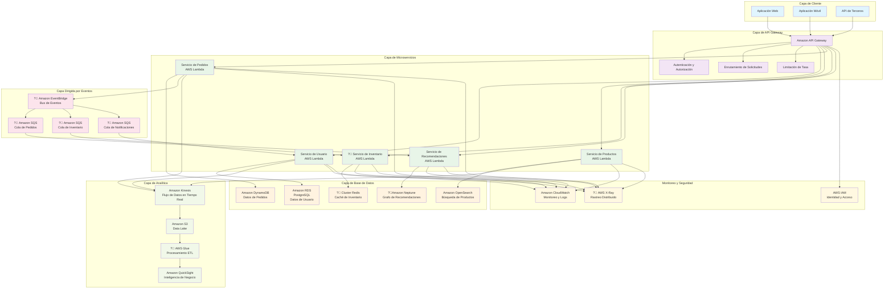

#### Implementación de Patrón Saga de Transacción Entre Servicios

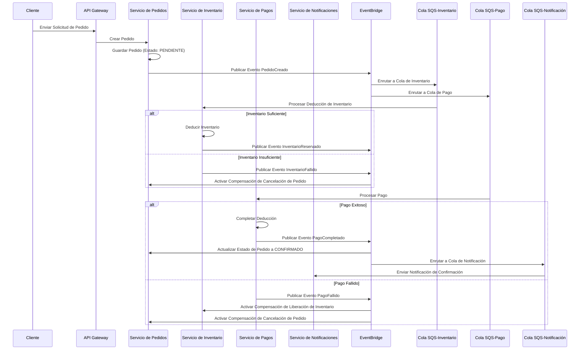

Este diseño de arquitectura encarna las ventajas centrales de los patrones de base de datos de microservicios:

1. **Autonomía de Servicio**: Cada servicio selecciona la tecnología de base de datos más adecuada
2. **Acoplamiento Suelto**: Comunicación asíncrona entre servicios mediante enfoque dirigido por eventos
3. **Escalabilidad**: Cada servicio puede escalar independientemente
4. **Tolerancia a Fallos**: El fallo de un solo servicio no afecta el sistema general
5. **Diversidad Tecnológica**: Diferentes servicios pueden usar diferentes stacks tecnológicos

###

---

### 8. Pensamiento de Diseño de Base de Datos de Grafos

Finalmente, discutamos un tipo interesante de diseño de base de datos: **Bases de datos de grafos (GDB)**.

Si las bases de datos SQL organizan el mundo en tablas de Excel ordenadas, con "normalización" como principio de diseño central, apuntando a la integridad de datos y redundancia cero - "diseñadas para los datos mismos" - entonces las bases de datos de grafos almacenan directamente la "red relacional" del mundo mismo, **"diseñadas para las preguntas que quieres hacer"**. Su pensamiento de diseño está más cerca de la intuición de nuestro cerebro. Debemos actuar como periodistas, preguntando constantemente: **Basándonos en este nodo de datos, qué querremos saber más en el futuro?**

En el mundo de las bases de datos de grafos, las "relaciones" ya no son algo encontrado indirectamente a través de operaciones JOIN - ellas mismas son ciudadanos de primera clase, tan importantes como las "entidades." Esto les da ventajas incomparables al manejar datos altamente conectados. Esta es precisamente la razón por la que esta estructura de diseño de base de datos es particularmente adecuada para **dominios continuos**.

**Pensamiento Orientado a Relaciones**:

```
- No "Qué atributos tiene esta entidad?"
- Sino "Qué relaciones existen entre estas entidades?"
```

Olvidemos las tablas, columnas y claves primarias. Necesitamos mirar los datos con una nueva perspectiva - **relaciones**.

Una base de datos de grafos tiene tres conceptos más importantes: Nodos - Aristas (Relaciones) - Propiedades

- Nodos (Nodes) - Entidades

  - Estos son nuestros "sustantivos," muy similares a las "entidades" que aprendimos en **ERD (Event-Driven)**.
  - Por ejemplo: Persona, Película, Empresa, Cuenta.
  - Los nodos pueden tener etiquetas para categorizarlos. Un nodo puede tener múltiples etiquetas, lo cual es muy flexible. Por ejemplo, una persona puede ser tanto Persona como Actor.

- Aristas (Edges / Relationships) - Relaciones

  - Esta es el alma de las bases de datos de grafos! Las aristas que conectan nodos crean **significado**, representando la **"conducta"** entre ellos.
  - Las aristas son **dirigidas**: `(A)-[Relación]->(B)` y `(B)-[Relación]->(A)` son diferentes.
  - Las aristas tienen **tipos**: por ejemplo, [:ACTU?_EN] (actuó en), [:DIRIGI?] (dirigió), [:AMIGO_DE] (es amigo de).
  - Las aristas pueden tener propiedades: Aquí es donde son más poderosas que las tablas de unión SQL. Por ejemplo, en la arista (Tom Hanks)-[:ACTU?_EN]->(Forrest Gump), puedes agregar la propiedad {rol: "Forrest Gump"}. En la arista (UsuarioA)-[:COMPR?]->(ProductoB), puedes agregar propiedades {fecha: "2025-09-15", calificación: 5}.

- Propiedades (Properties) - Descripciones

  - Tanto los nodos como las aristas pueden tener sus propias propiedades, existiendo como pares clave-valor.
  - Por ejemplo, un nodo Persona puede tener {nombre: "Tom Hanks", nacido: 1956}.

Cuando encontramos problemas que pueden describirse como `"encontrar...caminos"`, `"analizar...asociaciones"`, `"quién es el centro de..."`, `"qué características tiene este grupo"`, etc., con **indicadores** y **relaciones** claros, deberíamos incluir "bases de datos de grafos" como una herramienta poderosa en nuestra consideración.

**Transformación del Pensamiento de Diseño**:

En SQL, para encontrar "amigos de amigos de A," necesitamos hacer self-JOIN en la tabla de usuarios dos veces, y el rendimiento se degrada bruscamente a medida que aumentan el volumen de datos y la profundidad de relación (amigos de amigos de amigos... * N). En bases de datos de grafos, esta pregunta se convierte en "comenzando desde el nodo A, caminar dos pasos a lo largo de las aristas `AMIGO_DE` y ver a qué personas podemos llegar." Esta operación es nativa y extremadamente eficiente para bases de datos de grafos. Ya no necesitamos crear numerosas "tablas de unión" o "tablas de asociación" para normalización. Las relaciones muchos-a-muchos en grafos son simplemente aristas directas, muy intuitivas!

```python
Información que solía requerir hacer JOIN de {N} tablas ahora posiblemente puede describirse con solo una arista con propiedades ricas.
```

Entendiendo este pensamiento de diseño, encontramos que las bases de datos de grafos son particularmente adecuadas para escenarios donde las "relaciones" son más importantes que las "entidades" mismas.

```mermaid
graph TD
    subgraph "Personas"
        P1[Persona A]
        P2[Persona B]
        P3[Persona C]
        P4[Persona D]
    end

    subgraph "Partidos Políticos"
        style PartyA fill:#add8e6,stroke:#333,stroke-width:2px
        style PartyB fill:#ffb3ba,stroke:#333,stroke-width:2px
        PartyA(Partido Progresista)
        PartyB(Partido Conservador)
    end

    subgraph "Rasgos Personales"
        subgraph "Creencias Centrales"
            BeliefX(Valora la Justicia Social)
            BeliefY(Valora los Valores Tradicionales)
        end
        subgraph "Nivel Educativo"
            Edu1(Licenciatura)
            Edu2(Maestría/Doctorado)
        end
        subgraph "Ingreso Anual (10k)"
            Inc1(50-100)
            Inc2(150-300)
        end
        subgraph "Ocupación"
            Job1(Tecnología/Ingeniero)
            Job2(Finanzas/Abogado)
            Job3(Educación/Sector Público)
        end
    end

    %% --- Enlaces de Relación ---

    %% Persona A & B -> Pertenecen al Partido Progresista
    P1 -->|Pertenece a| PartyA
    P2 -->|Pertenece a| PartyA

    %% Persona C & D -> Pertenecen al Partido Conservador
    P3 -->|Pertenece a| PartyB
    P4 -->|Pertenece a| PartyB

    %% --- Representando la red de rasgos de cada persona ---

    %% Persona A: Alta educación, alto ingreso, finanzas, valora la justicia social
    P1 -->|Sostiene| BeliefX
    P1 -->|Educación| Edu2
    P1 -->|Ingreso| Inc2
    P1 -->|Ocupación| Job2

    %% Persona B: Licenciatura, ingreso medio, tecnología, valora la justicia social
    P2 -->|Sostiene| BeliefX
    P2 -->|Educación| Edu1
    P2 -->|Ingreso| Inc1
    P2 -->|Ocupación| Job1

    %% Persona C: Licenciatura, ingreso medio, educador, valora valores tradicionales
    P3 -->|Sostiene| BeliefY
    P3 -->|Educación| Edu1
    P3 -->|Ingreso| Inc1
    P3 -->|Ocupación| Job3

    %% Persona D: Alta educación, alto ingreso, finanzas, valora valores tradicionales
    P4 -->|Sostiene| BeliefY
    P4 -->|Educación| Edu2
    P4 -->|Ingreso| Inc2
    P4 -->|Ocupación| Job2
```

En esta estructura de datos, podemos identificar fácilmente varios puntos clave:

1. Centros de Gravedad y Grupos:

- El Partido Progresista y el Partido Conservador actúan como dos centros de gravedad, atrayendo a sus respectivos partidarios (P1, P2 y P3, P4) hacia ellos mismos.
- Valora la Justicia Social (BeliefX) se convierte en un centro secundario, conectando estrechamente a P1 y P2. De manera similar, Valora los Valores Tradicionales (BeliefY) vincula a P3 y P4.

2. Nodos Puente:

- Finanzas/Derecho (Job2), Maestría/Doctorado (Edu2), y Alto Ingreso (Inc2) se convierten en nodos críticamente importantes. Actúan como puentes, conectando directamente a P1 y P4 que pertenecen a diferentes partidos políticos.
- Visualmente, verás a P1 y P4 separados por sus respectivos partidos y creencias, pero fuertemente unidos por estos tres rasgos compartidos de trasfondo socioeconómico. Esto demuestra vívidamente su relación compleja de "opuestos pero similares".

3. Densidad de Red y Límites Comunitarios:

- Entre P1 y P2, y entre P3 y P4, las conexiones son muy densas, formando dos comunidades claras.
- Las conexiones entre comunidades (como el enlace entre P1 y P4) son relativamente escasas, lo que también nos ayuda a identificar límites comunitarios.

Lo ves? Aquí es donde las bases de datos de grafos son más poderosas y efectivas. Basándose en **aristas (relaciones)**, podemos interpretar fácilmente el significado de los datos. Ya no necesitamos pensar en cómo "simular" relaciones a través de tablas de unión, sino que podemos directamente "describir" relaciones. Las bases de datos de grafos transforman el proceso de pensamiento intuitivo de representar relaciones complejas en una pizarra en una estructura de datos que puede almacenarse y consultarse. Es un mapeo directo de relaciones de red del mundo real, no una abstracción tabular. Nuestro objetivo en la aplicación es diseñar una "red de carreteras" que haga que nuestras consultas centrales sean tan fluidas como conducir en una autopista. Pensar constantemente en cómo responder a nuestras preguntas con la menor cantidad de "pasos" (recorridos), y ajustar los nodos, aristas y propiedades en la estructura de datos en consecuencia.

En aplicaciones, cuando aparecen palabras clave de **Relaciones Primero**, representa que este escenario común de acceso a datos **se centra en cadenas de dominio**, que es cuando el pensamiento de grafos es particularmente adecuado para el diseño de bases de datos.

En este punto, en realidad descubrimos algo: en este escenario donde **las necesidades de consulta superan absolutamente las necesidades de escritura**, no encaja bien con las aplicaciones de **CQRS (separación de lectura-escritura)**? Podemos usar este contexto de diseño de minimizar los pasos de **consulta** para maximizar nuestro rendimiento de lectura?

Absolutamente sí, y esto es exactamente uno de los "métodos mentales" que funcionan en las mentes de muchos arquitectos senior al manejar sistemas de alto rendimiento.

Esto toca un concepto central: **El pensamiento de diseño de bases de datos de grafos es esencialmente una filosofía extrema de "desnormalización" orientada a consultas.**

Usemos Uber Eats como ejemplo práctico:

#### Implementación en AWS: Sistema de Inferencia de Red de Relaciones de Recomendación de Comidas de Uber Eats

Cuando abrimos la App de Uber Eats, el backend ejecuta consultas similares a estas:

- Qué más ordenaron las personas que ordenaron A (tal vez la Domino's Pizza que ordenamos la última vez)?
- Qué cocinas nos podrían gustar (información de cuenta actual)?

Sigamos el **contexto de dominio** paso a paso para pensar en cómo podemos diseñar Nodos y Aristas (Relaciones):

> Qué más ordenaron las personas que ordenaron A (Domino's Pizza + Pepsi - realmente lo recomiendo)?

1. Encontrar los restaurantes (`Restaurant X`) de los que (`User A`) ordenamos recientemente
2. Encontrar todos los demás usuarios (`User B`, `User C`) que también ordenaron de `Restaurant X`
3. Recorrer de qué otros restaurantes ordenaron estos usuarios que nunca hemos ordenado (`Restaurant Y`, `Restaurant Z`)
4. Presentar `Restaurant Y` y `Restaurant Z` como resultados de recomendación
5. Dado que `Restaurant Z` pagó por el plan de promoción empresarial, colocar `Restaurant Z` en la parte superior de la lista de recomendaciones (index=0)

> Qué cocinas nos podrían gustar (`User A`)?

1. Encontrar las cocinas que ordenamos con más frecuencia (`Cuisine A`, `Cuisine B`)
2. Buscar a través de asociaciones contextuales (ubicación geográfica / cadenas de cocina)
   1. Cerca de nuestra ubicación geográfica, encontrar otros restaurantes que ofrecen estas cocinas `Restaurant W`
   2. Encontrar `Cuisine C` que a menudo se ama junto con `Cuisine A`, y recomendar restaurantes que ofrecen `Cuisine C` (por ejemplo, los restaurantes americanos a menudo obtienen promoción de restaurantes mexicanos)

Pero en una plataforma como Uber Eats con millones de usuarios, cientos de miles de restaurantes y decenas de millones de comidas, al menos los dos escenarios anteriores deben satisfacerse, sin mencionar los comunes como "restaurantes más populares cercanos" o "comidas más ordenadas".

Tener solo resultados de búsqueda generales no puede satisfacer las necesidades de maximización de ganancias de marketing de recomendaciones personalizadas, tales como:

- "Recomendar algunos restaurantes que este usuario **podría gustarle pero nunca ha ordenado**."
- "Qué **otras cocinas** suelen disfrutar también los usuarios a quienes les gusta **'Ramen Japonés'** y **'Hot Pot Picante'**?"
- "Encontrar un **grupo de personas** con **gustos similares** a este usuario y ver qué **cosas nuevas** han ordenado recientemente."

Lo que estas preguntas tienen en común es que dependen en gran medida de **"relaciones"** - relaciones entre usuarios y restaurantes, entre usuarios y cocinas, relaciones implícitas entre usuarios. Manejar estos problemas con SQL tradicional requiere consultas JOIN extremadamente complejas y lentas, incapaces de satisfacer las necesidades de recomendación en tiempo real. Al mismo tiempo, diseñar un modelo predictivo específicamente para cada escenario diferente sería extremadamente desproporcionado en términos de costo-beneficio.

Así que procedamos con nuestro **Diseño de Modelo de Grafo (El Plano)**:

- Nodos:

  - User: Las propiedades incluyen ID de usuario, ubicación geográfica, etc.
  - Restaurant: Las propiedades incluyen nombre del restaurante, dirección, etiquetas de cocina.
  - MenuItem: Las propiedades incluyen nombre de la comida, precio, ingredientes.
  - Cuisine: Por ejemplo, "Japonesa," "Italiana," "Sichuan."
  - Ingredient: Por ejemplo, "carne de res," "queso," "chile."

- Aristas / Relaciones:

  - (User) -[`:ORDERED {date, rating}`]-> (Restaurant): El usuario ordenó de un restaurante, la arista puede tener propiedades como fecha y calificación.
  - (User) -[`:FAVORITED`]-> (Restaurant): El usuario marcó como favorito un restaurante.
  - (Restaurant) -[`:SERVES`]-> (Cuisine): El restaurante ofrece una cierta cocina.
  - (MenuItem) -[`:CONTAINS`]-> (Ingredient): La comida contiene ciertos ingredientes.

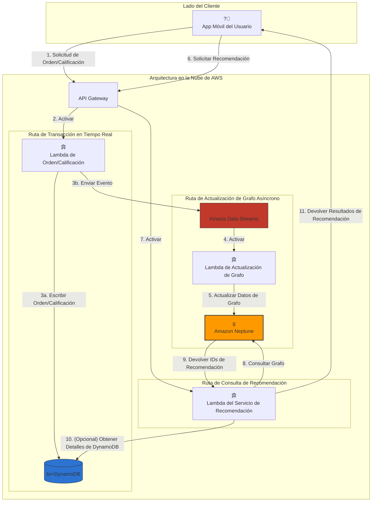

**Escenario de Simulación Práctica: Recomendar nuevos restaurantes que "Xiao Ming (User_A)" podría gustar.**

1. Activar Recomendación: Xiao Ming abre la App y se desplaza a la sección de recomendaciones. La App móvil envía una solicitud API de "solicitar recomendación" (paso 6).
2. API Gateway y Activación: API Gateway recibe la solicitud, valida la identidad, luego activa el Lambda del Servicio de Recomendación (LambdaRecommend) (paso 7).

3. Consulta de Grafo Central: La tarea central de LambdaRecommend es enviar una consulta de grafo a Amazon Neptune (paso 8). La lógica de esta consulta es "filtrado colaborativo":

> - "Encontrar personas con gustos similares a Xiao Ming (User_A) y ver qué restaurantes les gustan que Xiao Ming no ha probado."

Describiendo esta lógica en lenguaje de consulta de grafos:

- a. Encontrar los restaurantes de los que Xiao Ming (User_A) ha ordenado (Rest_1 - Ichiran Ramen).
- b. Encontrar a otras personas que también ordenaron de Rest_1 (User_B - Xiao Zi).
- c. Ver de qué otros restaurantes ha ordenado Xiao Zi (Rest_3 - Wowprime).
- d. Verificar si Xiao Ming ha ordenado de Rest_3. Descubrir que no.
- e. Por lo tanto, Rest_3 (Wowprime) se convierte en un fuerte candidato de recomendación.

4. Devolver Resultados: Neptune completa eficientemente este recorrido y devuelve el ID de Rest_3 a LambdaRecommend (paso 9).

5. Enriquecimiento de Datos (Opcional): Después de que LambdaRecommend recibe el ID de Rest_3, puede consultar nuevamente a DynamoDB para obtener información detallada del restaurante como nombre completo, dirección, URL de imagen, etc. (paso 10). DynamoDB es muy adecuado para este tipo de búsqueda rápida de clave-valor.

6. Presentar al Usuario: LambdaRecommend empaqueta los resultados de recomendación completos (incluido el nombre del restaurante, imágenes, etc.) en JSON y los devuelve a la App móvil de Xiao Ming a través de API Gateway (paso 11). Xiao Ming entonces ve "Wowprime" aparecer en su lista de recomendaciones.

Esta recomendación puede tener éxito con la premisa de que los datos en el grafo son en tiempo real. Este es el papel de la "ruta de actualización de grafo asíncrono."

**Cómo entran los datos al grafo? (Ruta asíncrona)**

1. La App envía "solicitud de orden" (paso 1), API Gateway activa el Lambda de Orden (paso 2).
2. El Lambda de Orden hace dos cosas:

- 3a: Escribir registros de orden detallados a DynamoDB como registros de transacción permanentes.
- 3b: Simultáneamente, enviar un evento simplificado como { "userId": "User_A", "restaurantId": "Rest_2", "action": "ORDER" } a Kinesis Data Streams.

4. Después de que Kinesis recibe el evento, automáticamente activa el Lambda de Actualización de Grafo (paso 4).
5. El Lambda de Actualización de Grafo analiza el evento y ejecuta una declaración de actualización en Neptune: Encontrar la arista ORDERED entre User_A y Rest_2 e incrementar su propiedad count en 1 (paso 5).

Esta arquitectura logra una perfecta **separación de lectura-escritura** y **separación de preocupaciones**:

- Ruta de transacción (DynamoDB) es rápida y estable, manejando transacciones centrales
- Ruta de análisis/recomendación (Neptune) se centra en consultas de relaciones complejas, proporcionando conocimientos profundos
- Kinesis actúa como un puente asíncrono entre los dos, asegurando resiliencia y desacoplamiento del sistema

Cuando encontramos problemas que pueden describirse como "encontrar...caminos," "analizar...asociaciones," "quién es el centro de...," "qué características tiene este grupo," especialmente enfatizando **las lecturas superan absolutamente las escrituras** y valorando **la continuidad del dominio**, deberíamos incluir **"Bases de Datos de Grafos"** como una herramienta poderosa en nuestra consideración.

###

## Principios Abstractos para la Selección de Estrategia de Diseño

El viaje del diseño de bases de datos comienza con una comprensión profunda del **dominio de negocio**, pasa por la selección racional de herramientas, y finalmente aterriza en el delicado equilibrio entre rendimiento y resiliencia. Es el héroe silencioso de la **implementación de lógica de negocio**. Puede no ser notado en las primeras etapas, pero cuando los sistemas enfrentan tráfico tremendo y requisitos complejos, su arquitectura sólida determinará el éxito o fracaso del sistema. Esta previsión y pensamiento estratégico es precisamente lo que eleva el diseño de bases de datos de **"aplicación técnica"** a **"arte de diseño"**.

```
El diseño exitoso de bases de datos es un arte estratégico de constantes compensaciones y compromisos entre "requisitos de negocio," "realidad técnica," y "cambios futuros."
```

Al hacer selecciones de tecnología de bases de datos, debemos hacer un buen trabajo de **análisis de requisitos**. En cierta medida, como arquitectos e ingenieros, nuestra comprensión del dominio de negocio debe y **debería** ser más profunda que la de otros. Cuál es el **valor central** del sistema? **Cómo se ven los datos?** **Qué hace el sistema más comúnmente con los datos?** **Cuál es la curva de crecimiento futuro de la escala del sistema?**

Debemos tener una comprensión profunda de contextos y herramientas para proceder con `Análisis de Requisitos` => `Selección de Tecnología` => `Diseño de Esquema`.

La filosofía del diseño de bases de datos es un viaje de lo abstracto a lo concreto, que también es el concepto más importante y central de **DDD**:

1. Comenzar con "Personas": Entender las necesidades y contextos de los usuarios.
2. Refinar en "Historias": Transformar necesidades en procesos de negocio de comportamientos e impactos.
3. Seleccionar "Herramientas": Basándose en las características de la historia (consistencia, patrones de consulta, escala), elegir combinaciones tecnológicas apropiadas.
4. Construir "Modelos": Diseñar diferentes esquemas para diferentes perspectivas, permitiendo que las historias sean eficientemente registradas y contadas.

### Proceso de Diseño Sólido: Análisis de Requisitos => Selección de Tecnología => Diseño de Esquema

Al principio, primero debemos olvidar la tecnología y convertirnos en detectives y psicólogos. Debemos comprender profundamente la "historia de negocio," encontrando los **protagonistas centrales (Entidades)**, las **relaciones** entre ellos, las **historias que sucederán (Operaciones)**, y las **reglas que deben seguirse (Restricciones)**.

En esta etapa, debemos:

```python
Olvidar la tecnología, enfocarse en "lógica de negocio" e "historias de datos"
```

Cuanto más tiempo pasemos en la etapa de análisis de requisitos, menor será la probabilidad de retrabajo después. Un plano vago solo construirá un edificio tembloroso y peligroso.

Usando el ejemplo mencionado anteriormente de tenencia por niveles - Netflix:

Antes de comenzar el diseño de una plataforma de streaming de video, podemos primero aclarar gradualmente nuestros **conceptos de lógica de implementación de negocio** abstractos en el siguiente orden:

1. **Quiénes son los Protagonistas (Entidades)?**

- Cuáles son los roles u objetos centrales en nuestro sistema? Por ejemplo: `User`, `VideoContent`, `Studio`, `License`. Estos son los principales "sustantivos" en nuestra futura base de datos.
- Luego necesitamos dividirlos proactivamente en categorías más amplias basadas en tipos principales para evitar conceptos excesivamente agrupados que lleven a una pérdida posterior de enfoque. Para contenido de video, podemos distinguir entre **obras independientes únicas** (películas) y **obras continuas** (series, reality shows). En este punto, ya podemos usar `category` para distinción conceptual.
- Por qué no usar `tag` es porque: `category` representa una **clasificación esencial, mutuamente excluyente**. Una obra es una película o una serie - esta clasificación determina su estructura de datos básica (por ejemplo, las series tienen temporadas y episodios, las películas no). Mientras que `tag` (etiquetas) son **atributos descriptivos, no mutuamente excluyentes** - una película puede tener simultáneamente etiquetas de "ciencia ficción," "acción," "ganadora del Oscar". En la etapa de análisis de requisitos, distinguir entre "clasificación esencial" y "etiquetas descriptivas" es crucial.

2. **Qué Relaciones Existen Entre Ellos (Relationships)?**

- `User` **WATCHES** `VideoContent`, también puede **RATES** (calificar).
- `VideoContent` es **PRODUCED_BY** un `Studio`.
- Los derechos de transmisión de `VideoContent` en `Regions` específicas están **LICENSED_UNDER** una `License`.
- Un `User` puede tener múltiples `Profiles`, como "Papá," "Mamá," "Niños" bajo una cuenta compartida familiar.

3. **Qué Historias Sucederán (Operations)?**

- **Lecturas de Alta Frecuencia**: Los usuarios navegan catálogos, buscan videos, ven videos. Esta es **la fuente principal de tráfico** del sistema, **extremadamente sensible a la latencia**.
- **Escrituras de Frecuencia Media**: El sistema registra el historial de visualización del usuario, actualiza marcas de tiempo de progreso para videos parcialmente vistos, almacena calificaciones de usuario.
- **Escrituras de Baja Frecuencia**: El equipo de contenido sube nuevo contenido de video, actualiza portadas o descripciones de obras, establece nuevos acuerdos de licencia.

4. **Reglas que Deben Seguirse (Constraints)?**

- **Restricciones Geográficas**: Un anime con derechos regionales japoneses absolutamente no puede ser visto desde direcciones IP de EE.UU.
- **Clasificaciones por Edad**: Los perfiles de "Niños" no pueden buscar o ver contenido restringido.
- **Vencimiento de Licencia**: Después de que expire un acuerdo de licencia, el contenido de video correspondiente debe ser retirado inmediatamente en regiones relacionadas.
- **Límites de Cuenta**: Una cuenta estándar solo puede ver simultáneamente en dos dispositivos como máximo.

Usemos este enfoque lógico para verificar dos escenarios: **Uber Eats** y **Fábrica de Obleas IoT de TSMC**

#### Contexto de Análisis de Requisitos de Uber Eats

1. Quiénes son los Protagonistas (Entidades)?

- `User`: Clientes que hacen pedidos.
- `Restaurant`: Comerciantes que proporcionan comidas.
- `Courier`: Socios de entrega responsables de transportar comidas.
- `Order`: Un registro de transacción completo, la clave que conecta a todos los protagonistas.
- `MenuItem`: Artículos específicos en el menú.
- `Cuisine`: Clasificaciones como "Japonesa," "Italiana," "Comida Rápida."
- `PaymentMethod`: Como tarjeta de crédito, Apple Pay.

2. Qué Relaciones Existen Entre Ellos (Relationships)?

- Un `User` **PLACES** múltiples `Orders`.
- Un `Order` **BELONGS_TO** solo un `User`, y **ORDERED_FROM** un `Restaurant`.
- Un `Order` **CONTAINS** múltiples `MenuItems`.
- Un `Order` en una etapa específica será **ASSIGNED_TO** un `Courier`.
- Un `Restaurant` **SERVES** múltiples `MenuItems`, y **SPECIALIZES_IN** una o múltiples `Cuisines`.
- Un `User` **HAS_PAYMENT_METHOD** para múltiples `PaymentMethods`.

3. Qué Historias Sucederán (Operations)?

- Lectura/Actualización de Ultra Alta Frecuencia (Streaming en Tiempo Real):
  - Seguimiento de ubicación en tiempo real del `Courier`. Estos son puntos móviles en el mapa, extremadamente sensibles a la latencia.
- Lectura de Alta Frecuencia (Read-Heavy):
  - El `User` navega listas de restaurantes cercanos, se desplaza por menús, busca comidas específicas.
  - El `User` consulta el estado del pedido en curso (aceptado, preparando, entregando).
- Escritura de Alta Frecuencia (Write-Heavy):
  - El `User` envía `Orders`. Este es el cuello de botella de escritura del sistema durante las horas pico de comidas.
- Escritura de Frecuencia Media (Medium-Write):
  - El `User` califica `Restaurants` o `MenuItems`.
  - El `User` agrega `Restaurants` a favoritos.
- Escritura de Baja Frecuencia (Low-Write):
  - El `Restaurant` actualiza menú, precios u horarios de operación.
  - El `User` agrega o elimina `PaymentMethods`.

4. Reglas que Deben Seguirse (Constraints)?

- Restricciones Geográficas: Los `Users` solo pueden ver `Restaurants` dentro de su rango de entrega.
- Restricciones de Tiempo: Los `Users` solo pueden ordenar de `Restaurants` que estén actualmente abiertos.
- Atomicidad de Transacción: La creación de `Order` y el éxito de `Payment` deben ser operaciones atómicas; si el pago falla, el pedido no puede ser creado.
- Consistencia de Estado: Las actualizaciones de `Status` del pedido (por ejemplo, "Courier recogió la comida") deben ser visibles en tiempo real tanto para el `User` como para el `Restaurant`.
- Exclusividad: Un `Order` solo puede ser entregado por un `Courier` a la vez.

#### Contexto de Análisis de Requisitos de IoT de Fábrica de Obleas de TSMC

Primero debemos comprender profundamente la "historia de negocio" de la fabricación de obleas, aclarando el significado físico detrás de los datos:

1. Quiénes son los Protagonistas (Entidades)?

- `Machine`: Equipos como grabadores, máquinas de exposición - fuentes de generación de datos.
- `Sensor`: Unidades de medición específicas instaladas en máquinas, como termómetros, medidores de presión.
- `Wafer`: Productos siendo procesados, cada uno con un ID único.
- `Lot/Batch`: Un grupo de obleas procesadas juntas, compartiendo los mismos parámetros de proceso.
- `Recipe`: Un conjunto de instrucciones que definen la configuración de la máquina al procesar un lote.
- `Operator`: Personal responsable de monitorear y operar máquinas.

2. Qué Relaciones Existen Entre Ellos (Relationships)?

- Una `Machine` tiene múltiples `Sensors` instalados.
- Una `Machine` en un momento específico está procesando un `Wafer` específico de un cierto `Lot`.
- El procesamiento de un `Lot` sigue una `Recipe`.
- Cuando los datos son anormales, el sistema necesita notificar a `Operators` específicos.

3. Qué Historias Sucederán (Operations)?

- **Escritura de Ultra Alta Frecuencia**: Decenas de miles de `Sensors` escriben continuamente datos de medición (temperatura, presión, vibración) al sistema en milisegundos. **Esta es la carga principal del sistema**.
- **Lectura de Alta Frecuencia**:
  - Monitoreo en Tiempo Real: Los tableros de `Operator` necesitan actualizaciones de nivel de segundo, mostrando curvas de parámetros clave de los últimos minutos.
  - Alertas en Tiempo Real: El sistema necesita escaneo continuo de datos entrantes; una vez que un parámetro de `Lot` (como temperatura) se desvía de la configuración de `Recipe`, las alertas deben activarse dentro de segundos.
- **Lectura de Frecuencia Media**:
  - Análisis de Rendimiento: Los ingenieros de calidad necesitan consultar el historial de procesamiento completo de un `Lot` en una `Machine` para analizar las causas de la disminución del rendimiento. Los rangos de consulta son típicamente horas a días.
- **Lectura de Baja Frecuencia**:
  - Análisis de Tendencias y Entrenamiento de Modelos: Los ingenieros de I+D necesitan analizar años de datos para optimizar `Recipes` o entrenar modelos de machine learning de mantenimiento predictivo. Los rangos de consulta son extremadamente grandes, pero los requisitos de tiempo real no son altos.

4. Reglas que Deben Seguirse (Constraints)?

- Integridad de Datos: Ningún dato de `Sensor` puede perderse, ya que un solo punto de datos faltante puede causar el fracaso del análisis de rendimiento de todo el lote.
- Precisión de Tiempo: Todos los datos deben tener marcas de tiempo precisas a milisegundos, y el orden absolutamente no puede estar equivocado. El tiempo es la dimensión más importante en este dominio.
- Estrategia de Retención de Datos: Para trazabilidad de calidad y requisitos de cumplimiento, los datos sin procesar pueden necesitar retenerse durante años.
- Alertas de Baja Latencia: Cuando ocurren anomalías, la latencia total desde la generación de datos hasta el activador de alerta debe controlarse dentro de segundos.

---

Tenemos un concepto de análisis de requisitos (plano arquitectónico) de la siguiente manera:

- Análisis de Requisitos (Plano Arquitectónico):
  - Filosofía Central: Olvidar la tecnología, convertirse en detective y psicólogo.
  - Misión: Comprender profundamente la "historia de negocio," encontrando los protagonistas centrales del sistema (Entidades), relaciones entre ellos (Relationships), historias que sucederán (Operations), y reglas que deben seguirse (Constraints).
  - Salida: Un modelo conceptual independiente de la tecnología (como ERD), que es el principio guía más alto para todo el trabajo posterior.

---

Después de aclarar inicialmente los requisitos, el siguiente hito importante es la **Selección de Tecnología**.

Teóricamente, cuando la cobertura de requisitos en áreas de discusión conocidas (ver <Transformación de Lógica de Negocio>) se ha acercado al **80%** tanto como sea posible, esto está muy cerca de nuestro sistema concreto inicial, y también cumple con la diferenciación estratégica del principio de compensación 80/20. Deberíamos tener un concepto:

**Bajo estas `Historias que Sucederán (Operations)`, debido a `Reglas que Deben Seguirse (Constraints)`, construiré diseños de bases de datos correspondientes**

En este punto, hay una herramienta de análisis llamada el **Modelo Diamante**.

Este es un arte de toma de decisiones abstracto que nos ayuda a hacer compensaciones entre cuatro facetas clave para pulir el mejor diseño. Las cuatro dimensiones son: Lógica de Negocio, Características de Datos, Patrones de Aplicación, Escala del Sistema.

1. Lógica de Negocio (Fuente de Valor): Cuál es el valor central del sistema? (Consistencia vs. Disponibilidad)
2. Características de Datos (Naturaleza de los Datos): Cómo se ven naturalmente los datos? (Estructurados vs. No estructurados)
3. Patrones de Aplicación (Comportamiento del Sistema): Qué hace el sistema más comúnmente con los datos? (Relación lectura-escritura, patrones de consulta)
4. Escala del Sistema (Curva Futura): Cómo crecerá el sistema? (Escalado vertical vs. Escalado horizontal)

La esencia del Modelo Diamante es que enfatiza que estas dimensiones interactúan entre sí. Un buen diseño no solo mirará una faceta, sino que evaluará exhaustivamente y encontrará ese delicado punto de equilibrio en medio de requisitos aparentemente conflictivos. Por ejemplo, para manejar "escala masiva" (dimensión cuatro), podríamos relajar los requisitos de consistencia en tiempo real en "lógica de negocio" (dimensión uno).

Podemos hacer elecciones técnicas basadas en las características de las `Historias que Sucederán (Operations)` de los `Protagonistas Centrales (Entidades)` en las `Historias que Sucederán (Operations)` iniciales. Las características comunes son las siguientes:

**Frecuencia de Cambio de Datos**:

- Cambios de alta frecuencia Dirigido por eventos + CQRS
- Cambios de frecuencia media CRUD tradicional + Caché
- Cambios de baja frecuencia Patrón de Master Data Management

**Escala de Volumen de Datos**:

- Nivel inferior a TB Escalado vertical + Réplicas de lectura
- Nivel de TB a PB Sharding horizontal
- Nivel superior a PB Distribuido + Separación caliente-frío

**Requisitos de Consistencia**:

- Consistencia fuerte Transacciones ACID
- Consistencia eventual Dirigido por eventos
- Consistencia de sesión Separación lectura-escritura

**Patrones de Consulta**:

- Consultas simples Bases de datos relacionales
- Análisis complejos Bases de datos columnares
- Recorrido de grafos Bases de datos de grafos
- Búsqueda de texto completo Motores de búsqueda

**Recuperación ante Desastres**:

- Alta disponibilidad Multi-AZ
- Replicación entre regiones Global Tables
- Recuperación ante desastres Cross-Region

#### Contexto de Análisis de Selección de Tecnología de IoT de Fábrica de Obleas de TSMC

Esta vez cambiemos el orden y comencemos desde **IoT de Obleas `Historias que Sucederán (Operations)`**.

> - **Escritura de Ultra Alta Frecuencia**:
>   - Decenas de miles de `Sensors` escriben continuamente datos de medición (temperatura, presión, vibración) al sistema en milisegundos. **Esta es la carga principal del sistema**.
> - **Lectura de Alta Frecuencia**:
>   - Monitoreo en Tiempo Real: Los tableros de `Operator` necesitan actualizaciones de nivel de segundo, mostrando curvas de parámetros clave de los últimos minutos.
>   - Alertas en Tiempo Real: El sistema necesita escaneo continuo de datos entrantes; una vez que un parámetro de `Lot` (como temperatura) se desvía de la configuración de `Recipe`, las alertas deben activarse dentro de segundos.
> - **Lectura de Frecuencia Media**:
>   - Análisis de Rendimiento: Los ingenieros de calidad necesitan consultar el historial de procesamiento completo de un `Lot` en una `Machine` para analizar las causas de la disminución del rendimiento. Los rangos de consulta son típicamente horas a días.
> - **Lectura de Baja Frecuencia**:
>   - Análisis de Tendencias y Entrenamiento de Modelos: Los ingenieros de I+D necesitan analizar años de datos para optimizar `Recipes` o entrenar modelos de machine learning de mantenimiento predictivo. Los rangos de consulta son extremadamente grandes, pero los requisitos de tiempo real no son altos.

Del análisis de requisitos vemos que el valor de los datos y los patrones de acceso están altamente relacionados con su "edad." Este es un escenario de aplicación mixta de **"Separación de Datos Calientes-Fríos"** y **"CQRS"**.

1. Tier Caliente - Monitoreo en Tiempo Real y Alertas

- Requisito: Manejar escrituras de ultra alta frecuencia y consultas de series temporales en tiempo real.
- Selección: Base de Datos de Series Temporales, como Amazon Timestream.
  - Timestream está diseñado para datos de series temporales, su In-Memory Store puede manejar escrituras masivas, y está extremadamente optimizado para consultas de rango de tiempo, satisfaciendo perfectamente las necesidades de tablero en tiempo real y alertas.

2. Tier Tibio - Análisis de Rendimiento a Corto Plazo

- Requisito: Realizar consultas analíticas más complejas sobre datos de días o semanas.
- Selección: Tier de disco de base de datos de series temporales, como el Magnetic Store de Amazon Timestream.
  - Timestream degrada automáticamente los datos que exceden la retención de memoria al tier de disco de menor costo. Las aplicaciones no necesitan modificar la lógica de consulta para consultar simultáneamente datos de tier caliente y tibio.

3. Tier Frío/Congelado - Análisis a Largo Plazo y Archivo

- Requisito: Almacenar años de datos históricos al menor costo, con capacidad para análisis masivos por lotes.
- Selección: Data Lake, como Amazon S3 + AWS Glue + Amazon Athena.
  - `S3` proporciona almacenamiento casi infinito y extremadamente económico.
  - `AWS Glue` convierte datos de Timestream o directamente de fuentes IoT a formato `Parquet` amigable para el análisis.
  - `Amazon Athena` permite a los ingenieros usar directamente SQL estándar para consultas ad-hoc sobre datos masivos de S3 sin administrar servidores.

#### Contexto de Análisis de Selección de Tecnología Multi-Dominio de Netflix

Del análisis de requisitos anterior podemos ver claramente que Netflix no es un sistema único, sino una federación compuesta por múltiples "sub-universos" con requisitos diferentes. Forzar una base de datos para resolver todos los problemas es como usar solo un tipo de destornillador para ensamblar una computadora completa - condenado al fracaso. Por lo tanto, debemos adoptar una estrategia de "Polyglot Persistence".

> - **Lecturas de Alta Frecuencia**:
>   - Los usuarios navegan catálogos, buscan videos, ven videos. Esta es **la fuente principal de tráfico** del sistema, **extremadamente sensible a la latencia**.
> - **Escrituras de Frecuencia Media**:
>   - El sistema registra el historial de visualización del usuario, actualiza marcas de tiempo de progreso para videos parcialmente vistos, almacena calificaciones de usuario.
> - **Escrituras de Baja Frecuencia**:
>   - El equipo de contenido sube nuevo contenido de video, actualiza portadas o descripciones de obras, establece nuevos acuerdos de licencia.

1. **Catálogo de Video, Búsqueda y Recomendaciones Personalizadas (Dominio de Metadatos)**

   - **Requisito**: Necesita manejar metadatos semi-estructurados (actores, descripciones, etiquetas), soportando búsqueda de texto completo poderosa y consultas de asociación complejas (recomendaciones).
   - **Selección**: **Base de Datos de Documentos (como MongoDB) + Motor de Búsqueda (como OpenSearch/Elasticsearch)**.
     - `MongoDB` almacena metadatos detallados de video, su esquema flexible es muy adecuado para diversos atributos de contenido.
     - `OpenSearch` construye índices de búsqueda, proporcionando búsqueda eficiente de palabras clave, filtrado de categorías y análisis de agregación. Los datos de relación del motor de recomendación también pueden almacenarse parcialmente en la base de datos de grafos `Neptune`.

2. **Historial de Visualización del Usuario y Estado (Dominio de Registro de Comportamiento)**

   - **Requisito**: Rendimiento de escritura extremadamente alto (millones de usuarios actualizando el estado de visualización por segundo), consistencia eventual aceptable, patrones de consulta relativamente simples (usualmente consulta por ID de usuario).
   - **Selección**: **Base de Datos Clave-Valor/Columna Ancha (como DynamoDB o Cassandra)**.
     - El modelo clave-valor de `DynamoDB` es muy adecuado para diseños con `UserID` como clave de partición y `VideoID` o `Timestamp` como clave de ordenación, proporcionando escalabilidad casi infinita y lecturas/escrituras de baja latencia.

3. **Cuentas de Usuario, Suscripciones y Pagos (Dominio de Transacciones)**
   - **Requisito**: Consistencia fuerte absoluta (ACID), necesita soportar operaciones de transacción complejas (por ejemplo, fallo de pago necesita revertir el estado de suscripción).
   - **Selección**: **Base de Datos Relacional (como PostgreSQL o MySQL)**.
     - La capacidad de transacción de `PostgreSQL` y el ecosistema maduro es la opción irreemplazable para manejar datos relacionados con finanzas, asegurando la precisión de la cuenta.

#### Contexto de Análisis de Selección de Tecnología de Uber Eats

> - Lectura/Actualización de Ultra Alta Frecuencia (Streaming en Tiempo Real):
>   - Seguimiento de ubicación en tiempo real del `Courier`. Estos son puntos móviles en el mapa, extremadamente sensibles a la latencia.
> - Lectura de Alta Frecuencia (Read-Heavy):
>   - El `User` navega listas de restaurantes cercanos, se desplaza por menús, busca comidas específicas.
>   - El `User` consulta el estado del pedido en curso (aceptado, preparando, entregando).
> - Escritura de Alta Frecuencia (Write-Heavy):
>   - El `User` envía `Orders`. Este es el cuello de botella de escritura del sistema durante las horas pico de comidas.
> - Escritura de Frecuencia Media (Medium-Write):
>   - El `User` califica `Restaurants` o `MenuItems`.
>   - El `User` agrega `Restaurants` a favoritos.
> - Escritura de Baja Frecuencia (Low-Write):
>   - El `Restaurant` actualiza menú, precios u horarios de operación.
>   - El `User` agrega o elimina `PaymentMethods`.

El análisis de requisitos nos dice claramente que el negocio de Uber Eats está compuesto por múltiples "Contextos Delimitados" con características muy diferentes.

1. Dominio de Orden y Transacción (Transacciones Centrales)

- Requisito: Rendimiento de escritura extremadamente alto (especialmente durante horas pico), alta disponibilidad, consistencia eventual aceptable (los informes pueden ser más lentos). Los patrones de consulta son relativamente fijos (consulta por ID de pedido o ID de usuario).
- Selección: Base de Datos Clave-Valor/Documento (como DynamoDB). Su modelo clave-valor es muy adecuado para lecturas/escrituras rápidas basadas en `order_id`, y puede manejar fácilmente picos de tráfico, logrando escalado horizontal.

2. Dominio de Restaurante y Menú (Master Data)

- Requisito: Las lecturas superan con creces las escrituras, necesita garantizar consistencia fuerte de datos (los precios del menú no pueden estar equivocados), estructura de datos relativamente estable.
- Selección: Base de Datos Relacional (como PostgreSQL) + Capa de Caché (como Redis). PostgreSQL administra los datos maestros autoritativos de restaurantes y menús, Redis almacena en caché información de menú de restaurantes populares para manejar solicitudes masivas de navegación.

3. Dominio de Logística del Courier (Geoespacial y Streaming en Tiempo Real)

- Requisito: Manejar actualizaciones de ubicación de ultra alta frecuencia, soportar consultas geoespaciales eficientes (por ejemplo, "encontrar 5 couriers disponibles más cercanos al restaurante").
- Selección: Base de Datos en Memoria (como Redis) + Cola de Mensajes (como Kinesis/Kafka). Los comandos Geo-espaciales de Redis pueden manejar extremadamente eficientemente el almacenamiento y consultas de geolocalización en tiempo real. Kinesis maneja la recepción y el almacenamiento en búfer de flujos masivos de datos de actualización de ubicación.

4. Dominio de Búsqueda y Recomendación (Exploración de Relaciones)

- Requisito: Manejar consultas de relaciones complejas, como "qué más les gusta a las personas que ordenaron de este restaurante?" o "qué restaurantes nuevos han ordenado recientemente personas con gustos similares a los míos?"
- Selección: Base de Datos de Grafos (como Neptune). Como mencionamos antes, este es el dominio en el que las bases de datos de grafos sobresalen, recorriendo eficientemente redes complejas de relaciones "usuario-restaurante-cocina".

### Matriz de Selección Basada en Características de Dominio

#### Diagrama de Flujo de Decisión de Selección de Base de Datos de AWS

```mermaid
flowchart TD
    A[Análisis de Requisitos del Sistema] --> B{Tipo de Carga de Trabajo?}

    B -->|OLTP Transaccional| C{Requisito de Consistencia?}
    B -->|OLAP Analítico| D{Modelo de Datos?}
    B -->|Tipo de Búsqueda| E[OpenSearch + CloudFront]
    B -->|Series Temporales| F[Timestream + Redis]
    B -->|Relación de Grafos| G[Neptune + Redis]

    C -->|Consistencia Fuerte| H{Modelo de Datos?}
    C -->|Consistencia Eventual| I{Modelo de Datos?}

    H -->|Relacional| J[RDS PostgreSQL<br/>+ ElastiCache Redis<br/>+ Multi-AZ]
    H -->|Documento| K[DocumentDB<br/>+ DAX<br/>+ Cross-Region]

    I -->|Documento| L[DynamoDB<br/>+ DAX<br/>+ Global Tables]
    I -->|Clave-Valor| M[ElastiCache<br/>+ Cross-AZ<br/>+ Backup]

    D -->|Almacenamiento Columnar| N[Redshift<br/>+ Spectrum<br/>+ S3 Data Lake]
    D -->|Análisis de Documentos| O[EMR + S3<br/>+ Glue<br/>+ Athena]

    E --> P[Análisis Costo-Beneficio]
    F --> P
    G --> P
    J --> P
    K --> P
    L --> P
    M --> P
    N --> P
    O --> P

    P --> Q{Rango de Presupuesto?}
    Q -->|< $1000/mes| R[Configuración Básica]
    Q -->|$1000-5000/mes| S[Configuración Estándar]
    Q -->|> $5000/mes| T[Configuración Empresarial]

    R --> U[Recomendación de Arquitectura Final]
    S --> U
    T --> U
```

#### Matriz de Decisión de Selección Detallada

```mermaid
graph LR
    subgraph "Dimensiones de Decisión"
        A1[Carga de Trabajo<br/>OLTP/OLAP/Búsqueda/Grafo]
        A2[Requisito de Consistencia<br/>Fuerte/Eventual/Causal]
        A3[Modelo de Datos<br/>Relacional/Documento/KV]
        A4[Requisito de Escala<br/>Nivel GB/TB/PB]
    end

    subgraph "Selección de Servicio AWS"
        B1[RDS PostgreSQL<br/>OLTP Relacional<br/>Consistencia Fuerte]
        B2[DynamoDB<br/>OLTP NoSQL<br/>Consistencia Eventual]
        B3[Redshift<br/>OLAP Columnar<br/>Consultas Analíticas]
        B4[Neptune<br/>Base de Datos de Grafos<br/>Consultas de Relaciones]
        B5[OpenSearch<br/>Búsqueda de Texto Completo<br/>Análisis de Logs]
        B6[Timestream<br/>Series Temporales<br/>Monitoreo IoT]
    end

    subgraph "Estrategia de Caché"
        C1[ElastiCache Redis<br/>Caché de Milisegundos]
        C2[DAX<br/>Aceleración de DynamoDB]
        C3[CloudFront<br/>Caché de Borde]
    end

    subgraph "Recuperación ante Desastres"
        D1[Multi-AZ<br/>Alta Disponibilidad]
        D2[Global Tables<br/>Replicación Entre Regiones]
        D3[Cross-Region<br/>Recuperación ante Desastres]
    end

    A1 --> B1
    A1 --> B2
    A1 --> B3
    A2 --> B1
    A2 --> B2
    A3 --> B4
    A4 --> B5
    A4 --> B6

    B1 --> C1
    B2 --> C2
    B3 --> C3
    B4 --> C1
    B5 --> C3
    B6 --> C1

    B1 --> D1
    B2 --> D2
    B3 --> D3
    B4 --> D3
    B5 --> D3
    B6 --> D3
```

#### Análisis de Compensación Costo-Rendimiento

```mermaid
quadrantChart
    title "Cuadrante de Costo-Rendimiento de Servicios de Base de Datos de AWS"
    x-axis "Costo Bajo" --> "Costo Alto"
    y-axis "Rendimiento Bajo" --> "Rendimiento Alto"

    quadrant-1 "Alto Rendimiento Alto Costo"
    quadrant-2 "Alto Rendimiento Bajo Costo"
    quadrant-3 "Bajo Rendimiento Bajo Costo"
    quadrant-4 "Bajo Rendimiento Alto Costo"

    "RDS PostgreSQL": [0.7, 0.8]
    "DynamoDB": [0.5, 0.9]
    "ElastiCache": [0.8, 0.95]
    "Redshift": [0.6, 0.7]
    "Neptune": [0.75, 0.6]
    "OpenSearch": [0.4, 0.65]
    "Timestream": [0.3, 0.7]
    "S3": [0.1, 0.3]
    "DocumentDB": [0.65, 0.7]
```

Nuestra exploración comenzó con una pregunta fundamental: Qué son los datos? La conclusión es que los datos no son simplemente atributos estáticos objetivos, sino "**impactos** generados por **comportamientos** impulsados por requisitos específicos **en contextos específicos**, registrados después de la interpretación desde múltiples perspectivas."

```
Requisito => Conducta => Efecto
```

Esta comprensión es la piedra angular para entender todas las estrategias modernas de bases de datos. Explica por qué no hay una base de datos omnipotente, y conduce directamente al nacimiento de las arquitecturas `CQRS`, `Microservicios` y `Event Sourcing`.

Basándonos en la filosofía anterior, analizamos profundamente ocho estrategias centrales que abordan diferentes desafíos de negocio, cada una nacida para resolver contradicciones en contextos específicos:

1. Master Data Management (MDM): Para resolver el "caos de datos," establecer una "Single Source of Truth" confiable entre sistemas.
2. Event-Driven Architecture (EDA): Para resolver la "pérdida del historial de cambios de estado," en su lugar registrar una serie de "eventos" inmutables, enfatizando "qué sucedió" en lugar de "en qué se convirtió."
3. CQRS (Command Query Responsibility Segregation): Para resolver la contradicción de "diferentes requisitos de modelo de lectura-escritura," separar completamente las operaciones de escritura (comando) y lectura (consulta) del sistema, cada una optimizada independientemente.
4. Multi-Tenancy Architecture: Para resolver el equilibrio de "compartir recursos y aislamiento de datos," proporcionar soluciones multinivel desde compartido a dedicado para igualar los requisitos de costo y seguridad de diferentes inquilinos.
5. Sharding Strategy: Para resolver "cuellos de botella de rendimiento de punto único," a través del pensamiento "dividir y conquistar," escalar horizontalmente datos masivos a través de múltiples shards para lograr escalabilidad casi infinita.
6. Hot-Cold Data Tiering: Para resolver la compensación entre "costo de almacenamiento y rendimiento de acceso," reconocer que el valor de los datos decae con el tiempo, "moviendo" automáticamente los datos a través de su ciclo de vida al tier de almacenamiento más rentable.
7. Microservices Database Pattern: Para resolver "complejidad organizacional y de sistemas," abogar por "descentralización," permitiendo que cada servicio tenga su propia base de datos, logrando autonomía de dominio e independencia técnica.
8. Graph Database Design Thinking: Para resolver problemas de rendimiento de "consulta de relaciones complejas," tratar las "relaciones" como ciudadanos de primera clase, diseñadas específicamente para escenarios de "encontrar caminos" y "analizar asociaciones."

Finalmente, colocamos todas las estrategias bajo un marco de diseño unificado:

- Proceso de Diseño Sólido: Seguir siempre el proceso `Análisis de Requisitos -> Selección de Tecnología -> Diseño de Esquema`, asegurando que cada decisión técnica tenga un apoyo sólido de lógica de negocio.
- Modelo de Decisión Diamante: Durante la selección de tecnología, hacer compensaciones y compromisos sistemáticamente evaluando cuatro dimensiones: Lógica de Negocio, Características de Datos, Patrones de Aplicación, Escala del Sistema, encontrando la combinación de estrategias más adecuada para el contexto actual.

En resumen, hemos comprendido juntos cómo el diseño de bases de datos se eleva desde una simple aplicación técnica a un arte de buscar continuamente puntos de equilibrio óptimos entre `"requisitos de negocio"`, `"realidad técnica"` y `"cambios futuros"`. Un arquitecto excelente, como un chef experimentado, seleccionará los utensilios de cocina más apropiados (estrategias de diseño) para diferentes platos (escenarios de negocio), finalmente cocinando un festín de sistema estable, eficiente y resiliente.

Esto se ha extendido bastante y me disculpo, pero dado que el diseño de bases de datos afecta la raíz más fundamental de todo el sistema, tuve que explicarlo un poco menos vagamente aquí. Realmente, cada estrategia de diseño central corresponde a un ecosistema de diseño de bases de datos y es en sí misma un gran campo de estudio.

Mañana tendremos algo más ligero - una simple charla sobre estrategias de control de versiones de Git.

---
