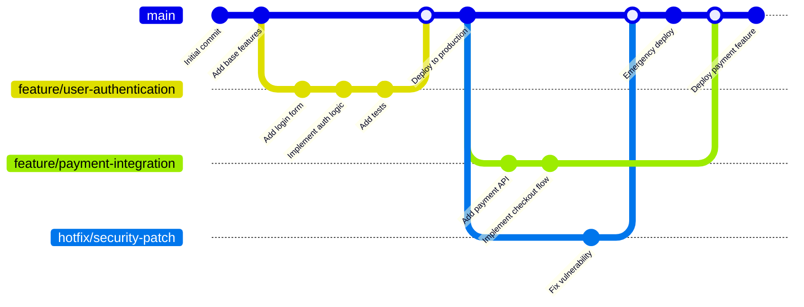
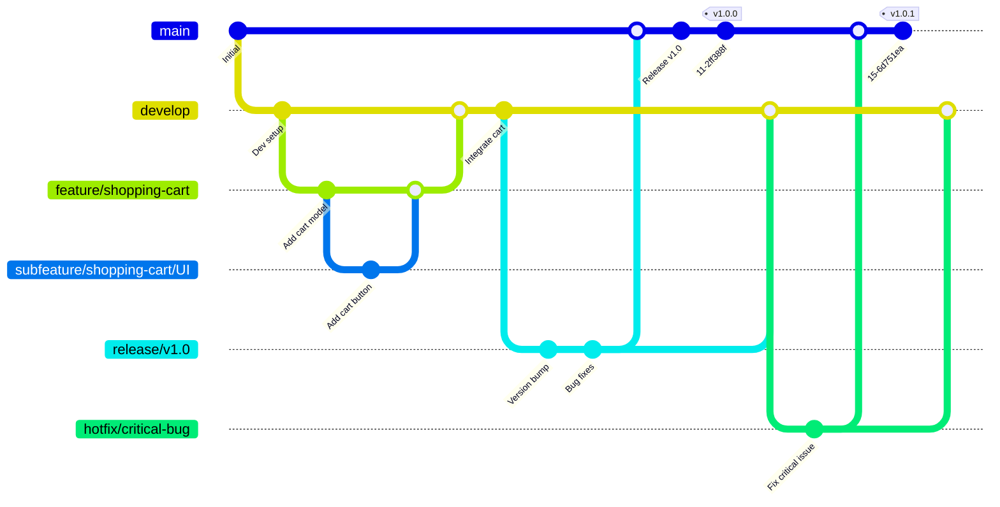
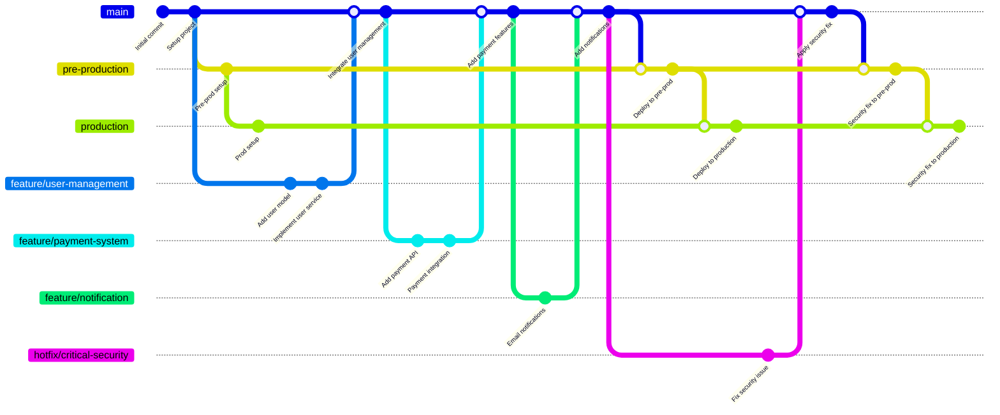
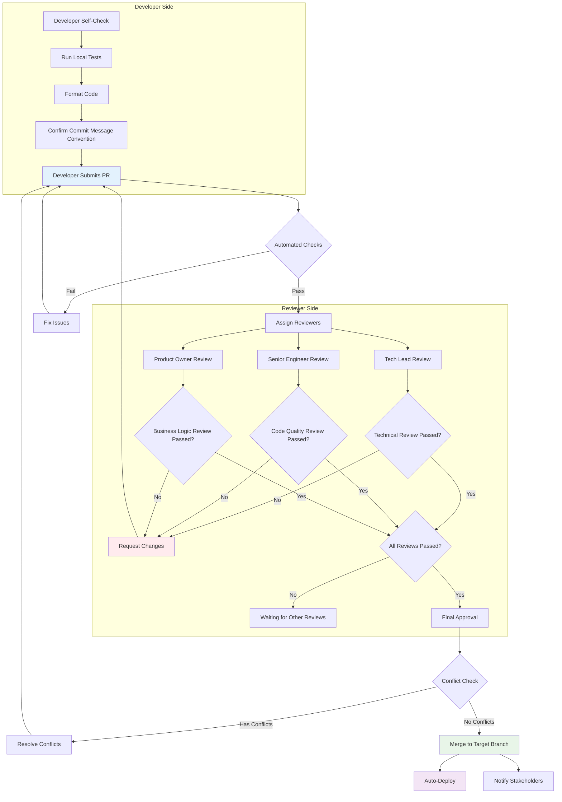
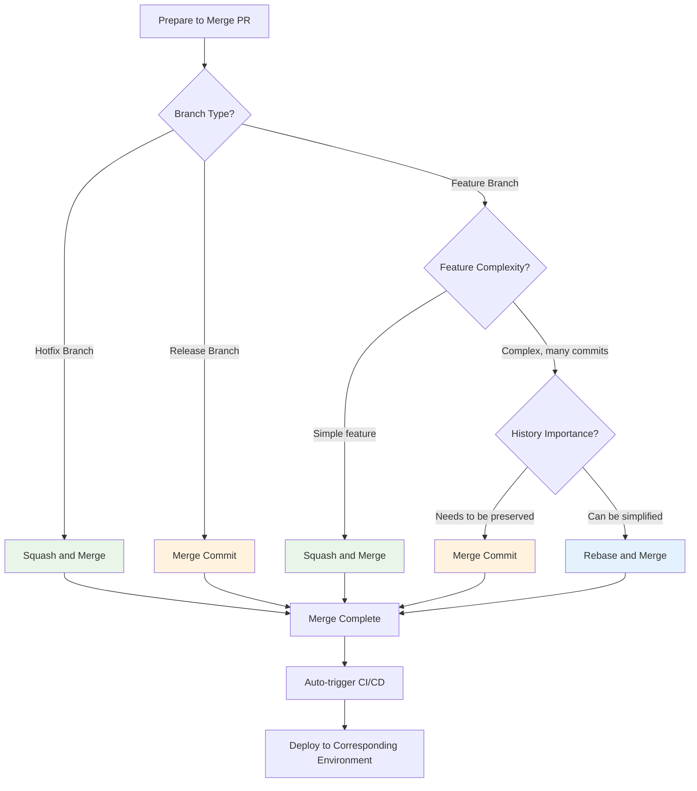

# Día 12 | Estrategia de Control de Versiones (Estrategia de Revisión de PR) × Git Flow × Introducción a Lint: Control de Calidad del Código y Estandarización del Proceso de Desarrollo

Hoy, hablemos de algo simple y relajado, que en algunos aspectos es más probable que sea ingeniería social que ingeniería de software, especialmente si no sincronizamos diligentemente con la última rama.

Imagina que no estamos escribiendo código, sino co-escribiendo una obra maestra como "Harry Potter" o "El Señor de los Anillos" con un grupo de escritores destacados. ¿Cómo asegurarías que los capítulos de todos tengan un estilo consistente, que la trama no tenga contradicciones, que no haya errores tipográficos, y que antes de la publicación final, el proceso de corrección y revisión sea ordenado?
Comencemos con una analogía más concreta.

Imagina que somos el equipo de ingeniería principal de un equipo de F1 de primer nivel. Nuestra misión es construir un coche ganador del campeonato. ¿Cómo aseguras que los diseños de los departamentos de aerodinámica, motor y suspensión funcionen juntos perfectamente en lugar de interferirse entre sí? ¿Cómo introduces continuamente diseños innovadores durante la temporada mientras aseguras la estabilidad absoluta del coche durante la carrera principal? ¿Y cómo respondes a situaciones inesperadas durante una carrera con paradas en boxes ultrarrápidas?

O quitémonos los cascos y entremos en un taller de diseño de moda. Ahora somos el equipo creativo de una marca de moda de primer nivel, preparándonos para el tan esperado desfile de moda de primavera. ¿Cómo aseguramos que las obras de nuestros muchos diseñadores no solo muestren el talento individual, sino que también se alineen con el tema general y el ADN de la marca de la temporada? ¿Cómo gestionamos el proceso complejo desde los bocetos, la elaboración de patrones y las prendas de muestra hasta el ajuste final, asegurando que cada pieza sea impecable? ¿Y cómo manejamos elegantemente un problema inesperado con el vestido de una modelo justo momentos antes de que comience el desfile?

Ya sea construyendo un coche de carreras o preparando un desfile de moda, el desafío central es el mismo: **cómo permitir que un equipo colabore sistemáticamente en un entorno de alta presión y complejidad, entregue continuamente trabajo de alta calidad y gestione eficazmente los riesgos.**

En otras palabras, Git, estrictamente hablando, es solo una herramienta de registro. El flujo de trabajo de Git es un control de procesos que ha sido aculturado. En realidad, ¡otra cara de la **estrategia de control de versiones** es la **metodología de gestión**!

Esta también es la parte donde la IA no puede tomar decisiones y ejecutar por nosotros. Quizás un Agente de IA pueda realizar análisis y proporcionar sugerencias en el mundo de los datos, e incluso auto-crecer basándose en la lógica subyacente ajustada finamente, como la famosa máquina de von Neumann. Pero la **toma de decisiones conceptuales** y las políticas de ejecución solo pueden ser evaluadas y confirmadas por nosotros. Esto está relacionado con las restricciones duales de las leyes físicas ordinarias objetivas y la verificación teórica matemática en la realidad (gracias a Dios, todavía no lo he olvidado). Pero es innegable que la **gestión** es como un jardinero. Debemos, cuando encontramos que nuestro coche de carreras, ropa, código y productos enfocados requieren compensaciones basadas en situaciones complejas, regular nuevamente la dirección futura basándonos en los **requisitos abstractos centrales (Dominio)**.

Entonces, primero comprendamos algunas **razones impulsoras** en la gestión. En la discusión continua, veremos los estilos de política de gestión de `GitHub Flow`, `Git Flow` y `GitLab Flow`; esto es normal, tal como dijimos antes:

```python
Git workflow == Control de procesos aculturado == Ciencia de la gestión
```

A medida que los equipos de desarrollo de software escalan y la complejidad del proyecto aumenta, elegir una estrategia de gestión de control de versiones adecuada se ha convertido en un factor clave que afecta la eficiencia del desarrollo y la calidad del código. En el desarrollo de software moderno, **la gestión de versiones no es solo una herramienta para registrar el historial del código, sino el proceso fundamental central para la colaboración del equipo, el aseguramiento de la calidad y el control de riesgos.**

###

## Principios Impulsores de la Gestión

Detrás de casi cada metodología de gestión convencional, hay uno o más "Impulsores" centrales, que determinan qué es lo que más le importa a la metodología y qué problemas prioriza resolver. Los principales son **Proceso**, **Eficiencia**, **Calidad**, y las extensiones posteriores de **Valor** y **Cronograma**.

Usemos algunas historias cortas para entender el contexto.

### La Metodología Triádica de Estabilidad (Justicia Absoluta del Proceso), Cantidad (Entrada Rápida al Mercado) y Calidad (Entrega Impecable)

La mayoría de las metodologías de gestión de procesos nacieron después de la Revolución Industrial y la transformación de la estructura industrial posterior a la Segunda Guerra Mundial. En ese momento, todos los dueños de negocios, que ya tenían sus propias líneas de producción, enfrentaban competencia y cambios en el entorno general. Por lo tanto, se necesitaba un método de respuesta más claro y rápido. Así, nacieron las metodologías **Impulsadas por Proceso y Control**, **Impulsadas por Eficiencia y Flujo**, e **Impulsadas por Calidad y Datos**.

#### La Justicia Absoluta del Proceso

La filosofía central de **Impulsado por Proceso y Control** es que **el éxito proviene de la previsibilidad y la repetibilidad**. Siempre que establezcamos un proceso robusto y claro y lo sigamos estrictamente, podemos controlar los riesgos y asegurar que el proyecto se mantenga en el camino correcto. `"¿Estamos siguiendo el plan?"`, `"¿Las responsabilidades están claras?"`, `"¿Los riesgos están bajo control?"` son las preguntas más importantes en este contexto lógico. Este proceso de gestión es adecuado para proyectos con requisitos claros, pocos cambios y altas demandas de cumplimiento y documentación (como construcción, proyectos gubernamentales). El **`Modelo en Cascada`** es una representación típica de un enfoque Impulsado por Procesos, siendo el proceso lineal más puro, enfatizando la completitud perfecta de una etapa antes de pasar a la siguiente. Además, está **`PRINCE2®`**, que enfatiza extremadamente el "control", asegurando que cada paso del proyecto esté bajo control de alto nivel y siempre sirva a los objetivos comerciales a través de la gestión por fases y la gestión por excepción. Y la culminación de los métodos impulsados por procesos - **`PMBOK®`**, que proporciona el "mapa" de procesos más completo, definiendo lo que debe hacerse y considerarse desde el principio hasta el final de un proyecto.

#### Entrada Rápida al Mercado

La filosofía central de **Impulsado por Eficiencia y Flujo** es **maximizar la velocidad de salida (rendimiento) y minimizar el tiempo desde la entrada hasta la salida**. El valor de un proyecto radica en su **"flujo"** fluido; cualquier estancamiento, espera o reelaboración es desperdicio. Las preguntas centrales son `"¿Dónde está el cuello de botella?"`, `"¿Qué nos está ralentizando?"`, `"¿Cómo podemos eliminar el desperdicio?"`. Esta metodología está particularmente enfocada en entornos que requieren entrega rápida, son altamente repetitivos y persiguen la eficiencia operativa (como manufactura, servicio al cliente, mantenimiento de software). Las metodologías representativas incluyen: **`Lean`** - su único objetivo es identificar y eliminar todo el "desperdicio" en el proceso, permitiendo que el valor fluya sin problemas al cliente; **`Teoría de Restricciones (TOC)`** - que señala que la eficiencia de todo el sistema depende del "cuello de botella" más lento y toda optimización debe enfocarse en él; y **`Kanban`** - que obliga al trabajo a fluir sin problemas y evita bloqueos al visualizar y limitar el Trabajo en Progreso (WIP).

#### Entrega de Calidad Impecable

La parte final de esta fase es **Impulsado por Calidad y Datos**. Su filosofía central es que **la intuición y la experiencia no son confiables; solo los datos objetivos y el análisis estadístico riguroso pueden traer mejoras fundamentales en la calidad.** Este principio impulsor se aplica principalmente en campos con requisitos extremos de precisión y confiabilidad (como aviación, equipos médicos, fabricación de semiconductores). **La variación es el enemigo de la calidad**, y los resultados de las tareas en ejecución **no deben tener discrepancias**. El enfoque a menudo está en `"¿Qué dicen los datos?"`, `"¿Qué tan grande es la variación del proceso?"`, `"¿Cuál es la causa raíz del problema?"`. La metodología realmente aplicada es **`Six Sigma`**. Esta es la máxima expresión de lo impulsado por la calidad, usando métodos estadísticos como DMAIC para apuntar a reducir la tasa de defectos de un proceso a casi cero.

Observando un proceso de pipeline existente, el mainstream (principal) de un producto diferenciará su división del trabajo según las características de los **requisitos** de su **Dominio**. Por ejemplo, **Impulsado por Procesos** nació de su requisito primario de **secuencialidad**: no podemos construir una casa sin cimientos. **Impulsado por Eficiencia** es para capturar la **cobertura del mercado**. Una vez que un producto es excluido del mercado, es como si hubiera sido enviado a la horca. En lugar de ser estrangulado lentamente por la soga y esperar a asfixiarse, es mejor apostar todo y entregar el producto al cliente primero, luego ajustar según la retroalimentación del mercado. **Impulsado por Calidad** se enfoca en la **tasa de error**. El ejemplo más obvio del mundo real es el proceso de la sala de operaciones. Si alguna parte del proceso sale mal, podría perderse una vida. Por lo tanto, para enfoques impulsados por la calidad, ni siquiera un solo error es permisible.

Esencialmente, las metodologías de procesos de gestión de primera etapa representan un problema triádico de `Estabilidad (Justicia Absoluta del Proceso)` <=> `Cantidad (Entrada Rápida al Mercado)` <=> `Calidad (Entrega Impecable)`. Pero correspondientemente, ¿qué hacemos cuando enfrentamos requisitos complejos? Cuando la implementación del requisito de una metodología va a un extremo, los otros dos aspectos inevitablemente serán abandonados. Perseguir ciegamente la cantidad puede hacer que el producto pierda todas las ventajas de ser pionero en la competencia del mercado posterior porque la calidad básica no cumple con las necesidades. Al mismo tiempo, perseguir ciegamente la perfección absoluta de las especificaciones puede hacer que todo el trabajo se quede atascado en el plano de diseño, perdiendo así el cronograma de ejecución. Esto llevó al nacimiento de la segunda etapa de metodologías de gestión. **`Impulsado por Valor`** e **`Impulsado por Cronograma`** corresponden a `Calidad (Entrega Impecable)` x `Cantidad (Entrada Rápida al Mercado)` y `Estabilidad (Justicia Absoluta del Proceso)` x `Cantidad (Entrada Rápida al Mercado)`, respectivamente. En cuanto a `Calidad (Entrega Impecable)` x `Estabilidad (Justicia Absoluta del Proceso)`, en teoría, solo puede hacerse lentamente (por ejemplo, exploración de aguas profundas, colonización espacial), por lo que no se considera; probablemente no puedas entrar físicamente al espacio o a las aguas profundas sin resolver problemas de energía y materiales y verificarlos, ¿verdad...?

### Necesidades Impulsadas por Demandas Avanzadas: "Queriéndolo Todo"

Como dijimos al final de la primera etapa, cuando la implementación del requisito de una metodología va a un extremo, los otros dos aspectos inevitablemente serán abandonados. Por eso surgieron **`Impulsado por Valor`**, enfocándose en `Calidad (Entrega Impecable)` x `Cantidad (Entrada Rápida al Mercado)`, e **`Impulsado por Cronograma`**, enfocándose en `Estabilidad (Justicia Absoluta del Proceso)` x `Cantidad (Entrada Rápida al Mercado)`. Después de todo, hay un dicho, `El tiempo es dinero, amigo mío`. Justo como perder el punto de partida de un boom del mercado de valores, todos los márgenes de beneficio futuros tendrán un efecto compuesto, reduciendo la brecha con el índice del mercado.

#### Exigiendo Tanto Calidad Impecable como Entrega Rápida

**Impulsado por Valor y Adaptabilidad** fue creado para resolver este problema. **`La única constante es el cambio mismo.`** En lugar de intentar crear un plan perfecto a largo plazo, es mejor abrazar el cambio, obtener retroalimentación continuamente a través de entregas rápidas de ciclo corto, y asegurar que estamos **siempre** haciendo lo que es **"más valioso para el cliente."** Cuando abrazamos mercados emergentes, no podemos simplemente aumentar la producción basándonos en nuestra propia imaginación. Un producto que nadie quiere es básicamente una pérdida. Si no cumples con las necesidades del mercado, ¿por qué debería el mercado pagar por una solución que no los satisface? `"¿Estamos haciendo lo 'correcto'?"`, `"¿El cliente realmente necesita esto?"`, `"¿Qué tan rápido podemos obtener retroalimentación del mercado?"` Estas preguntas necesitan ser confirmadas intermitentemente, especialmente en campos como desarrollo de productos innovadores, ingeniería de software y marketing, donde los requisitos son inciertos y se necesita una rápida prueba y error. Como se mencionó anteriormente (ver <Construyendo un Diseño de Sistema Entregable desde Cero>), la **`organicidad y propósito del sistema`** son clave. Un sistema es una forma de vida conceptual. Enfrentando la amenaza de supervivencia (ser eliminado por el mercado), debe confirmar constantemente la retroalimentación del mercado y **evolucionar** basándose en esa retroalimentación. Por lo tanto, **`Scrum`**, que asegura que el equipo pueda entregar regularmente productos utilizables a través de "Sprints" de ciclo corto y ajustar los objetivos del próximo sprint basándose en la retroalimentación del cliente, y **`Agile`**, que coloca "responder al cambio" por encima de "seguir un plan", son métodos de supervivencia para adaptarse y evolucionar en un entorno constantemente cambiante y feroz.

#### Exigiendo Tanto Entrega Rápida como Proceso Correcto

La filosofía central de **Impulsado por Cronograma y Dependencias** es que **el éxito de un proyecto depende principalmente de su capacidad para ser entregado a tiempo.** Para lograr esto, uno debe mapear claramente las dependencias entre todas las tareas y encontrar la "ruta crítica" que determina la duración total del proyecto. `"¿Qué tareas deben completarse primero?"`, `"¿El retraso de qué tarea afectará a todo el proyecto?"`, `"¿Cuál es nuestra ruta crítica?"` En un proyecto grande con numerosas y complejas dependencias, debemos aclarar rápidamente el contexto e inmediatamente dividir el pipeline basándose en las relaciones de precedencia de todas las tareas, separando flujos de trabajo paralelos tanto como sea posible para reducir el tiempo de espera desperdiciado. Es como en la planificación de eventos a gran escala o la construcción de ingeniería, preparar el lugar y preparar los materiales de ingeniería se puede hacer simultáneamente. No tienes que esperar a que lleguen las vigas H antes de preparar la cantidad correcta de remaches. Las metodologías aplicadas aquí son el **`Método de Ruta Crítica (CPM)`** y la **`Técnica de Revisión y Evaluación de Programas (PERT)`**. Estas dos son herramientas nacidas puramente para resolver problemas de cronograma y dependencias y son el núcleo de la gestión de cronogramas.

###

## Resumen

1.  **Impulsado por Proceso y Control**
    *   **Filosofía Central:** El éxito proviene de la previsibilidad y la repetibilidad. Al establecer y seguir estrictamente un proceso robusto y claro, podemos controlar los riesgos y mantener el proyecto en el camino correcto.
    *   **Preguntas Centrales:** "¿Estamos siguiendo el plan?" "¿Las responsabilidades están claras?" "¿Los riesgos están bajo control?"
    *   **Metodologías Representativas:**
        *   **PMBOK®:** Proporciona el "mapa" de procesos más completo, definiendo qué hacer y considerar de principio a fin. Es el epítome de lo impulsado por procesos.
        *   **PRINCE2®:** Enfatiza enormemente el "control". A través de la gestión por fases y la gestión por excepción, asegura que cada paso esté bajo control de alto nivel y sirva a los objetivos comerciales.
        *   **Modelo en Cascada:** El proceso lineal más puro, enfatizando la completitud perfecta de una etapa antes de pasar a la siguiente.
    *   **Escenarios Aplicables:** Proyectos con requisitos claros y estables y alta demanda de cumplimiento y documentación (por ejemplo, construcción, proyectos gubernamentales).

2.  **Impulsado por Eficiencia y Flujo**
    *   **Filosofía Central:** El valor de un proyecto radica en su "flujo" fluido. Cualquier estancamiento, espera o reelaboración es desperdicio. El objetivo es maximizar el rendimiento y minimizar el tiempo de entrega.
    *   **Preguntas Centrales:** "¿Dónde está el cuello de botella?" "¿Qué nos está ralentizando?" "¿Cómo podemos eliminar el desperdicio?"
    *   **Metodologías Representativas:**
        *   **Lean:** Su único propósito es identificar y eliminar todo el "desperdicio" en el proceso, permitiendo que el valor fluya sin problemas al cliente.
        *   **Teoría de Restricciones (TOC):** Señala que la eficiencia de todo el sistema está determinada por el "cuello de botella" más lento, y toda optimización debe enfocarse allí.
        *   **Kanban:** Obliga al trabajo a fluir sin problemas y previene bloqueos a través de la visualización y la limitación del Trabajo en Progreso (WIP).
    *   **Escenarios Aplicables:** Entornos que son altamente repetitivos y persiguen la eficiencia operativa (por ejemplo, manufactura, servicio al cliente, mantenimiento de software).

3.  **Impulsado por Calidad y Datos**
    *   **Filosofía Central:** La intuición y la experiencia no son confiables. Solo los datos objetivos y el análisis estadístico riguroso pueden traer mejoras fundamentales en la calidad. La variación es el enemigo de la calidad.
    *   **Preguntas Centrales:** "¿Qué dicen los datos?" "¿Qué tan grande es la variación del proceso?" "¿Cuál es la causa raíz del problema?"
    *   **Metodologías Representativas:**
        *   **Six Sigma:** La expresión máxima de lo impulsado por la calidad. Usa métodos estadísticos como DMAIC para reducir la tasa de defectos a casi cero.
    *   **Escenarios Aplicables:** Campos con requisitos extremos de precisión y confiabilidad (por ejemplo, aviación, dispositivos médicos, fabricación de semiconductores).

4.  **Impulsado por Valor y Adaptabilidad**
    *   **Filosofía Central:** La única constante es el cambio. En lugar de crear un plan perfecto a largo plazo, abraza el cambio, obtén retroalimentación continua a través de entregas rápidas de ciclo corto, y asegura que siempre estás haciendo lo que es "más valioso para el cliente."
    *   **Preguntas Centrales:** "¿Estamos haciendo lo 'correcto'?" "¿El cliente realmente necesita esto?" "¿Qué tan rápido podemos obtener retroalimentación del mercado?"
    *   **Metodologías Representativas:**
        *   **Agile:** Este es su manifiesto. Valora "responder al cambio" por encima de "seguir un plan."
        *   **Scrum:** Asegura que el equipo entregue regularmente productos utilizables a través de "Sprints" de ciclo corto y ajuste los objetivos del próximo sprint basándose en la retroalimentación del cliente.
    *   **Escenarios Aplicables:** Áreas con requisitos inciertos que necesitan rápida prueba y error, como desarrollo de productos innovadores, ingeniería de software y marketing.

5.  **Impulsado por Cronograma y Dependencias**
    *   **Filosofía Central:** El éxito de un proyecto depende principalmente de la entrega a tiempo. Para lograr esto, debes mapear claramente todas las dependencias de tareas y encontrar la "ruta crítica" que determina la duración total.
    *   **Preguntas Centrales:** "¿Qué tareas deben completarse primero?" "¿El retraso de qué tarea afectará a todo el proyecto?" "¿Cuál es nuestra ruta crítica?"
    *   **Metodologías Representativas:**
        *   **Método de Ruta Crítica (CPM)** y **Técnica de Revisión y Evaluación de Programas (PERT):** Estas son herramientas creadas puramente para resolver problemas de cronograma y dependencias y son el núcleo de la gestión de cronogramas.
    *   **Escenarios Aplicables:** Proyectos con numerosas y complejas dependencias, como planificación de eventos a gran escala y construcción de ingeniería.

###

### Análisis de Flujos de Trabajo Git Convencionales

Habiendo discutido las razones impulsoras `3+2` para la gestión de procesos, veamos los **flujos de trabajo Git** comunes en el mercado hoy.

`GitHub Flow` se alinea muy bien con el espíritu Agile. Cada vez que una rama de característica se fusiona en main, se despliega directamente. Esta es una manifestación de entrega rápida e integración continua. El "establecimiento de cultura de revisión de código" y la "estandarización de mensajes de commit" mencionados en tu documento son todos para promover la comunicación eficiente en el desarrollo ágil.

#### 1. GitHub Flow - Un Modelo de Despliegue Continuo Simple y Eficiente

`GitHub Flow` está muy en el espíritu de Agile. Cada vez que una rama de característica se fusiona en `main`, se despliega directamente. Esto encarna la entrega rápida y la integración continua, haciéndolo particularmente adecuado para equipos que practican el despliegue continuo y la iteración rápida.



**Características Centrales de GitHub Flow:**

-   Solo una rama de larga duración (`main`/`master`)
-   Todas las nuevas características se ramifican desde `main` en nuevas ramas de características
-   La revisión de código se realiza a través de Pull Requests
-   El código fusionado se despliega inmediatamente al entorno de producción

#### 2. Git Flow - Un Modelo de Gestión de Lanzamiento Estricto

`Git Flow`, debido a sus requisitos de versiones y ciclos, es adecuado para proyectos grandes con cronogramas de lanzamiento fijos. Las reglas de fusión para sus ramas tienen características de precedencia claras que recuerdan al Método de Ruta Crítica:

-   `subfeature` debe fusionarse primero en `feature`: Aunque debes construir las paredes antes de instalar ventanas y el techo, "instalar plomería y electricidad" e "instalar ventanas" podrían hacerse simultáneamente. De hecho, para reducir el desperdicio de tiempo redundante, las características grandes deben desglosarse en grupos de características grandes tanto como sea posible al principio.
-   `feature` debe fusionarse primero en `develop`: Esto es como el "plano de diseño" debe completarse antes de que pueda ser entregado a la "fábrica" para producción. No puedes simplemente lanzar un borrador de característica no probado directamente en línea.
-   `develop`, después de las pruebas, puede crear una rama `release`: Esto es como la "muestra" de la fábrica debe pasar el control de calidad antes de entrar en la etapa de "preparación de producción en masa."
-   La rama `release`, una vez estable, puede fusionarse en `main`: Esto es como después de que la "preparación de producción en masa" esté completa, el producto puede ser oficialmente "lanzado para la venta."



**Tipos de Ramas de Git Flow:**

-   **main**: Código del entorno de producción
-   **develop**: Rama de integración del entorno de desarrollo
-   **feature/**: Rama de desarrollo de características
-   **subfeature/**: Rama de desarrollo de sub-características (subdominio) bajo una característica (dominio)
-   **release/**: Rama de preparación de lanzamiento
-   **hotfix/**: Rama de corrección de emergencia

#### 3. GitLab Flow - Estrategia de Despliegue Impulsada por Entorno

GitLab Flow combina la simplicidad de GitHub Flow con la gestión de entornos de Git Flow:



###

## Diseño del Proceso de Revisión

Después de entender los varios principios impulsores de la gestión, veamos cómo estas teorías se reflejan en el proceso real de revisión de código. **El proceso de revisión de PR (Pull Request) / MR (Merge Request) es esencialmente un sistema de decisión de gestión de optimización multi-objetivo**.

Imagina que cada PR es como una "propuesta de producto" que debe pasar por un riguroso "proceso de revisión" antes de poder ser incorporada en la línea de productos oficial de la compañía (fusionada en la rama principal). Este proceso de revisión debe encontrar el equilibrio óptimo entre **creación de valor** y **gestión de cronogramas**.

**El Proceso Completo de Revisión de Código**



Primero, del lado del desarrollador, después de completar el desarrollo de una especificación de característica, las pruebas deben realizarse localmente según los **límites** y **escenarios** inicialmente discutidos, como una línea de inspección de calidad automatizada en una fábrica, para asegurar que las especificaciones básicas se cumplan y para evitar no cumplir con los requisitos desde el principio.

Lint nos permite descubrir y corregir "errores de bajo nivel" en la primera oportunidad. "Formatea" el código de todos los desarrolladores en un estilo casi idéntico, mejorando enormemente la legibilidad del código. Esto es como requerir que todos los escritores usen la misma fuente y diseño, para que la corrección posterior (PR Review) pueda enfocarse en la "trama" en sí, en lugar de perder tiempo recogiendo errores tipográficos. Por lo tanto, en el diagrama de flujo, `P2[Ejecutar Pruebas Locales]` debe completar los siguientes estándares:

1.  Local UnitTest
2.  Local IntegrationTest
3.  ESLint
4.  SonarLint

Después de la modificación y el ajuste, se entrega a `P3[Formatear Código]` para la integración de la guía de estilo del equipo para evitar registros de git diff innecesarios, como saltos de línea y espacios.

Solo después de completar las verificaciones personales puede entrar en la etapa de revisión, y necesita pasar tres puertas de verificación: **Puerta de Revisión de Pares**, **Puerta de Revisión de Negocio** y **Puerta de Revisión de Calidad**.

Durante el proceso de desarrollo, por ejemplo, podría haber confusión o incluso mal uso entre el `service` (capa de aplicación de lógica de negocio) y el `repository` (capa de interfaz de sistema externo). Aunque esto podría no afectar la funcionalidad, a medida que el código crece, si la lógica no está limpiamente separada, se convertirá en parte del desorden del código heredado en el futuro. Por lo tanto, desde el principio, debe ser entregado a otro compañero del equipo de desarrollo para una **Puerta de Revisión de Pares** para confirmar la arquitectura y el estilo.

La **Puerta de Revisión de Negocio** y la **Puerta de Revisión de Calidad** no son muy diferentes, e incluso pueden combinarse cuando la mano de obra es insuficiente (esperemos que no). Para ser específicos, la **Revisión de Negocio** confirma la **tasa de ejecución de negocio perfecta en un solo entorno**, mientras que la **Puerta de Revisión de Calidad** verifica la **tasa de éxito de ejecución de negocio con máxima cobertura en múltiples entornos**. Lo más importante para esta puerta de revisión es confirmar que la **función de negocio puede ejecutarse completamente**. Incluso si el código es elegante y conciso, si finalmente no puede cumplir con los requisitos iniciales, eventualmente caerá en la muerte lenta de ser abandonado por el mercado. Entonces, lo más importante para la **Puerta de Revisión de Negocio** es asegurar que la lógica de negocio sea consistente con el diseño del sistema previo (este es el mejor escenario), o con los requisitos de negocio constantemente ajustados (este es el peor escenario - y el más común).

Aquí hay una guía simple para referencia - como dije, `(la gestión de versiones git) es en algunos aspectos más probable que sea ingeniería social que ingeniería de software`. Intenta mantener una actitud de Love & Peace al tratar con ello, lo cual es mejor para nuestra propia presión arterial.

**Guía de Revisión de Código**

```markdown
### Responsabilidades del Revisor

1.  **Puntualidad**: Completar las revisiones dentro de 24 horas.
2.  **Constructividad**: Proporcionar sugerencias de mejora específicas, no solo señalar problemas.
3.  **Educacional**: Compartir conocimiento y mejores prácticas.
4.  **Respeto**: Mantener una actitud de comunicación profesional y amigable.

### Enfoque de Revisión

-   Corrección de la lógica de negocio
-   Legibilidad y mantenibilidad del código
-   Evaluación del impacto en el rendimiento
-   Consideraciones de seguridad
-   Cobertura de pruebas

### Plantillas Comunes de Comentarios de Revisión

Sugerencias de mejora:

-   Considera usar `const` en lugar de `let` ya que esta variable no se reasigna.
-   Esta función es un poco compleja; considera dividirla en funciones más pequeñas.

Preguntas:

-   ¿La lógica de manejo de errores aquí considera todos los casos extremos?
-   ¿Por qué se eligió esta implementación sobre el enfoque XYZ?

Elogios:

-   La cobertura de pruebas es muy completa, especialmente el manejo de casos extremos.
-   La estructura del código es clara, y el nombramiento de variables es muy significativo.
```

```markdown
### Convención de Mensaje de Commit

CommitMessageFormat:
Patrón: "{type}: {description}"

Tipos:
feat: "Nueva característica"
fix: "Corrección de error"
docs: "Actualización de documentación"
style: "Ajuste de estilo de código"
refactor: "Refactorización de código"
test: "Relacionado con pruebas"
chore: "Cambios en herramientas de construcción o herramientas auxiliares"
perf: "Optimización de rendimiento"

Ejemplos:

- "feat: add user authentication"
- "fix: resolve timeout issue in payment service"
- "docs: update installation instructions"
- "refactor: simplify date formatting functions"
```

Solo después de que la revisión de tres partes esté completa, la rama puede fusionarse. Si hay discrepancias inaceptables, debe devolverse al desarrollador para un reajuste. Todo este proceso encarna la esencia del pensamiento sistémico: **la optimización local debe servir a la optimización global**. El diseño de cada enlace de revisión no es para la "perfección" del enlace en sí, sino para la estabilidad, eficiencia y alta calidad de todo el sistema de entrega de software. Como un reloj suizo de precisión, cada engranaje (enlace de revisión) tiene su papel y ritmo específicos, y su operación coordinada finalmente asegura el cronometraje preciso (entrega estable) de todo el reloj (sistema de software).



Hoy discutimos la esencia de gestión de las estrategias de control de versiones, viendo los flujos de trabajo de Git como prácticas concretas de metodologías de gestión. Mañana, hablemos sobre la colaboración entre equipos en la práctica.
