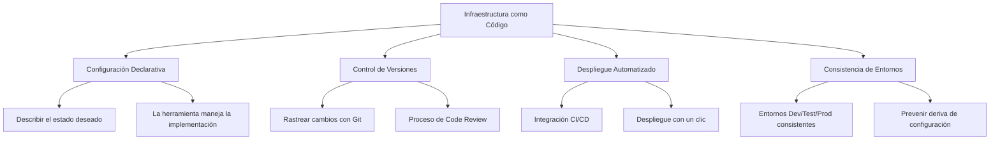
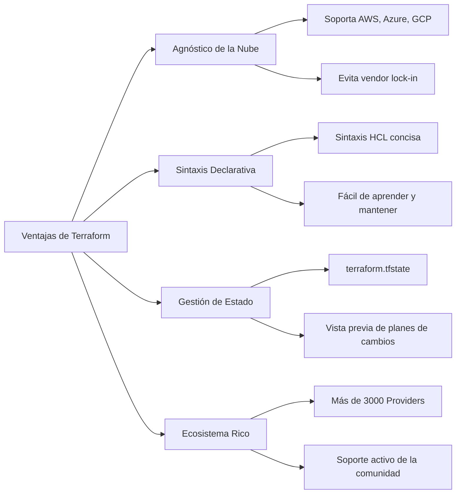

# Día 14 | Infraestructura como Código: Codificando y Controlando la Versión de la Infraestructura con Terraform

En los flujos de trabajo de desarrollo modernos, ya podemos construir y mantener nuestra infraestructura de entorno virtual a través de documentación controlada por versiones. Esta es una evolución por la que debemos estar agradecidos.

Primero revisemos las dificultades de la gestión de infraestructura en la era pre-IaC:

**Escenario 1: La Pesadilla de la Configuración Manual**

```
Ingeniero de Operaciones A: "Ajusté manualmente el tamaño del pool de conexiones de la base de datos en el entorno de producción."
Ingeniero de Operaciones B: "¿Qué? No lo sabía. Yo también cambié la configuración de red ayer."
Equipo de Desarrollo: "¿Por qué el entorno de pruebas se comporta diferente al entorno de producción?"

**Problemas Centrales**:
- Deriva de Configuración
- Inconsistencia de Entornos
- Dificultad para Rastrear Cambios
- Conocimiento concentrado en individuos
```

**Escenario 2: La Incertidumbre de la Recuperación ante Desastres**

```
3 AM, el entorno de producción está caído...

Líder del Equipo: "¿Cuánto tiempo hasta que se restaure?"
Ingeniero de Operaciones: "Necesito reconstruir todos los servicios... ¿tal vez 6 horas?"
Líder del Equipo: "¿Por qué tanto tiempo?"
Ingeniero de Operaciones: "Porque necesito recordar todos los pasos de configuración manual..."

**Problemas Centrales**:
- Tiempo de recuperación impredecible
- Falta de un proceso de reconstrucción estandarizado
- Dependencia excesiva de la memoria personal
- Incapacidad de cuantificar las capacidades de recuperación ante desastres
```

**Escenario 3: El Cuello de Botella de las Demandas de Escalado**

```
Product Manager: "Necesitamos expandirnos rápidamente a una nueva región."
DevOps: "¿Cuánto tiempo tomará?"
Product Manager: "Preferiblemente dentro de una semana."
DevOps: "¿Una semana? Solo solicitar recursos toma tres días, y configurar el entorno otros cinco..."

**Problemas Centrales**:
- Los procesos manuales ralentizan el ritmo del negocio
- El trabajo repetitivo desperdicia mano de obra
- Crecimiento lineal en los costos de escalado
- Incapacidad de responder rápidamente a las demandas del mercado
```

Estas historias de terror de TI probablemente resulten familiares para todos en cierta medida. Del mismo modo, no quiero que nos convirtamos en actores—o incluso en los personajes principales—de ellas. Ayer discutimos el diseño de colaboración entre equipos, estableciendo estándares para la documentación de API y la colaboración del equipo. Hoy, cambiemos nuestro enfoque a la gestión de infraestructura subyacente y exploremos cómo usar el concepto de Infraestructura como Código (IaC) con Terraform para codificar y controlar la versión de nuestra infraestructura.

Si el tema de ayer fue **"hacer que el equipo hable el mismo idioma y hacerlo versionable,"** entonces el tema de hoy es **"hacer que la infraestructura sea predecible, repetible y versionable."**

## El Concepto Central de Infraestructura como Código

La Infraestructura como Código (IaC) es una metodología para gestionar y aprovisionar infraestructura a través de código. Transforma las tareas de gestión de infraestructura tradicionalmente manuales en código versionable, repetible y ejecutable.

Imagina esto: `De "construir una villa personalizada a mano" a "diseñar una ciudad que puede ser replicada infinitamente."
En el pasado, gestionar servidores y redes (es decir, "infraestructura") era como un maestro artesano construyendo una villa personalizada a mano.

- Dependía de años de experiencia y memoria para colocar ladrillos, tirar cables y conectar tuberías.
- ¿Quieres agregar una ventana? Tiene que ir al sitio y derribar una pared.
- ¿Quieres construir una idéntica al lado? Solo puede intentar construirla nuevamente de memoria, pero es probable que algunos detalles, como la ubicación de los enchufes o la marca de las tuberías, sean diferentes.
- Si la villa desafortunadamente se incendia (como Notre Dame), la reconstrucción sería una larga pesadilla porque toda la artesanía existe solo en la cabeza del maestro.

Este es el mundo sin IaC: manual, dependiente de personas, difícil de replicar y lleno de incertidumbre. El nacimiento de IaC no fue solo para registrar todos los parámetros básicos del entorno y la configuración, sino para gestionarlos a través del control de versiones. **Inventamos el "plano arquitectónico" (Infraestructura como Código).**

Ya no colocamos ladrillos a mano. En cambio, nos enfocamos en dibujar un plano arquitectónico extremadamente detallado. Este plano es nuestro "Código."

Con él, podemos fácilmente:

- Describir el estado final: El plano no dice "coloca tres ladrillos, luego gira a la izquierda." Declara directamente, "Necesito una pared de 3 metros de alto y 5 metros de ancho." Solo describimos **"Qué queremos," no "Cómo hacerlo."**
- Control de Versiones: Este plano (código) puede guardarse y modificarse como un documento de Word. Cada cambio se registra (por ejemplo, usando Git). Podemos ver claramente quién cambió la ventana de cuadrada a redonda y cuándo. Esto es "control de versiones."
- Repetibilidad: Con este plano, podemos dárselo a cualquier equipo de construcción, y pueden construir una villa idéntica. ¿Quieres construir cien? Solo dales cien copias del plano.



**La Propuesta de Valor Central de IaC**

1.  **Reproducibilidad**
    *   El mismo código produce el mismo resultado en cualquier entorno.
    *   Elimina el problema de "funciona en mi máquina".

2.  **Trazabilidad**
    *   Todos los cambios de infraestructura tienen un historial completo de Git.
    *   Puede revertir a cualquier estado de configuración en cualquier momento.

3.  **Testabilidad**
    *   Las configuraciones de infraestructura pueden someterse a pruebas unitarias y de integración.
    *   Descubrir problemas potenciales antes del despliegue.

4.  **Colaboración**
    *   La configuración de infraestructura se convierte en un activo compartido del equipo.
    *   Mejorar la calidad de configuración a través de Code Review.

## Análisis en Profundidad de Terraform

Tenemos el plano perfecto (código), pero ¿quién es responsable de la construcción?

**Terraform es ese súper contratista general.** (Y no, no es Mario).

Entre las muchas herramientas de IaC, Terraform se destaca por varias razones:



Implementa perfectamente la filosofía de IaC, permitiéndonos usar un solo "plano" (código) para definir, previsualizar y construir automáticamente nuestro reino digital en la nube. Entiende nuestro plano (sintaxis HCL de Terraform) y se comunica con todos los proveedores de materiales de construcción del mundo (como AWS, Google Cloud, Azure). Cuando le entregamos el plano, no comienza el trabajo de inmediato. En cambio, primero proporciona un plan de construcción, diciéndonos: "Según tu plano, crearé un host, configuraré una base de datos, configuraré la red..." Podemos revisar este plan para asegurarnos de que todo sea correcto. Una vez confirmado, le decimos "¡Comienza el trabajo!", y automática y precisamente orquestará todos los recursos para construir nuestra infraestructura.

Finalmente, cuando ya no necesitemos este edificio, solo necesitamos decirle al contratista general, y puede desmantelar todo de forma limpia, sin dejar escombros de construcción.

No solo estamos aprendiendo una herramienta, sino un método de ingeniería moderno más avanzado, más confiable y más escalable. Finalmente podemos transformarnos de un trabajador diligente que coloca ladrillos en un arquitecto de sistemas enfocado en la práctica del Dominio.

### Conceptos Centrales de Terraform

#### 1. Providers

```hcl
# Definir proveedores de nube
terraform {
  required_providers {
    aws = {
      source  = "hashicorp/aws"
      version = "~> 5.0"
    }
    kubernetes = {
      source  = "hashicorp/kubernetes"
      version = "~> 2.23"
    }
  }
}

# Configurar el Provider de AWS
provider "aws" {
  region = var.aws_region

  default_tags {
    tags = {
      Environment = var.environment
      Project     = var.project_name
      ManagedBy   = "terraform"
    }
  }
}
```

#### 2. Resources

```hcl
# Crear una VPC
resource "aws_vpc" "main" {
  cidr_block           = var.vpc_cidr
  enable_dns_hostnames = true
  enable_dns_support   = true

  tags = {
    Name = "${var.project_name}-vpc"
  }
}

# Crear una Subnet
resource "aws_subnet" "public" {
  count = length(var.availability_zones)

  vpc_id                  = aws_vpc.main.id
  cidr_block              = cidrsubnet(var.vpc_cidr, 8, count.index)
  availability_zone       = var.availability_zones[count.index]
  map_public_ip_on_launch = true

  tags = {
    Name = "${var.project_name}-public-subnet-${count.index + 1}"
    Type = "public"
  }
}
```

#### 3. Variables

```hcl
# variables.tf
variable "aws_region" {
  description = "Región de AWS para recursos"
  type        = string
  default     = "ap-northeast-1"
}

variable "environment" {
  description = "Nombre del entorno"
  type        = string
  validation {
    condition     = contains(["dev", "staging", "prod"], var.environment)
    error_message = "El entorno debe ser dev, staging o prod."
  }
}

variable "instance_type" {
  description = "Tipo de instancia EC2"
  type        = string
  default     = "t3.micro"
}

variable "availability_zones" {
  description = "Lista de zonas de disponibilidad"
  type        = list(string)
  default     = ["ap-northeast-1a", "ap-northeast-1c", "ap-northeast-1d"]
}
```

#### 4. Outputs

```hcl
# outputs.tf
output "vpc_id" {
  description = "ID de la VPC"
  value       = aws_vpc.main.id
}

output "public_subnet_ids" {
  description = "IDs de las subnets públicas"
  value       = aws_subnet.public[*].id
}

output "load_balancer_dns" {
  description = "Nombre DNS del balanceador de carga"
  value       = aws_lb.main.dns_name
  sensitive   = false
}
```

#### 5. Data Sources

```hcl
# Obtener la última AMI de Amazon Linux
data "aws_ami" "amazon_linux" {
  most_recent = true
  owners      = ["amazon"]

  filter {
    name   = "name"
    values = ["amzn2-ami-hvm-*-x86_64-gp2"]
  }

  filter {
    name   = "virtualization-type"
    values = ["hvm"]
  }
}

# Obtener información de la cuenta AWS actual
data "aws_caller_identity" "current" {}

# Obtener información de zonas disponibles
data "aws_availability_zones" "available" {
  state = "available"
}
```

### Flujo de Trabajo de Terraform

#### 1. Fase de Inicialización (terraform init)

```bash
# Inicializar el directorio de trabajo de Terraform
terraform init

# Actualizar Providers
terraform init -upgrade

# Especificar configuración de backend
terraform init -backend-config="bucket=my-terraform-state"
```

#### 2. Fase de Planificación (terraform plan)

```bash
# Generar plan de ejecución
terraform plan

# Guardar el plan en un archivo
terraform plan -out=tfplan

# Planificar para un entorno específico
terraform plan -var-file="environments/prod.tfvars"
```

#### 3. Fase de Aplicación (terraform apply)

```bash
# Aplicar cambios
terraform apply

# Usar un plan guardado
terraform apply tfplan

# Auto-aprobar (para CI/CD)
terraform apply -auto-approve
```

#### 4. Fase de Destrucción (terraform destroy)

```bash
# Destruir todos los recursos
terraform destroy

# Destruir para un entorno específico
terraform destroy -var-file="environments/dev.tfvars"
```

## Caso Práctico: Una Infraestructura Completa de Aplicación Web

Demostremos la aplicación práctica de Terraform con un caso completo:

### Estructura del Proyecto

```
terraform-web-app/
├── main.tf                 # Definiciones principales de recursos
├── variables.tf           # Definiciones de variables
├── outputs.tf            # Definiciones de salidas
├── terraform.tfvars      # Valores de variables
├── versions.tf           # Restricciones de versión de Provider
├── modules/
│   ├── networking/       # Módulo de red
│   ├── compute/         # Módulo de cómputo
│   ├── database/        # Módulo de base de datos
│   └── security/        # Módulo de seguridad
└── environments/
    ├── dev/
    ├── staging/
    └── prod/
```

### Archivos de Configuración Principales

#### main.tf

```hcl
# Definiciones de variables locales
locals {
  common_tags = {
    Environment = var.environment
    Project     = var.project_name
    ManagedBy   = "terraform"
    Owner       = var.owner
  }
}

# Módulo de red
module "networking" {
  source = "./modules/networking"

  project_name       = var.project_name
  environment        = var.environment
  vpc_cidr          = var.vpc_cidr
  availability_zones = var.availability_zones

  tags = local.common_tags
}

# Módulo de seguridad
module "security" {
  source = "./modules/security"

  project_name = var.project_name
  environment  = var.environment
  vpc_id       = module.networking.vpc_id

  tags = local.common_tags
}

# Módulo de cómputo
module "compute" {
  source = "./modules/compute"

  project_name          = var.project_name
  environment           = var.environment
  instance_type         = var.instance_type
  min_size             = var.min_size
  max_size             = var.max_size
  desired_capacity     = var.desired_capacity

  vpc_id               = module.networking.vpc_id
  private_subnet_ids   = module.networking.private_subnet_ids
  public_subnet_ids    = module.networking.public_subnet_ids
  security_group_ids   = [module.security.web_security_group_id]

  tags = local.common_tags
}

# Módulo de base de datos
module "database" {
  source = "./modules/database"

  project_name       = var.project_name
  environment        = var.environment
  engine_version     = var.db_engine_version
  instance_class     = var.db_instance_class
  allocated_storage  = var.db_allocated_storage

  vpc_id            = module.networking.vpc_id
  private_subnet_ids = module.networking.private_subnet_ids
  security_group_ids = [module.security.db_security_group_id]

  tags = local.common_tags
}
```

### Módulo de Red (modules/networking/main.tf)

```hcl
# VPC
resource "aws_vpc" "main" {
  cidr_block           = var.vpc_cidr
  enable_dns_hostnames = true
  enable_dns_support   = true

  tags = merge(var.tags, {
    Name = "${var.project_name}-${var.environment}-vpc"
  })
}

# Internet Gateway
resource "aws_internet_gateway" "main" {
  vpc_id = aws_vpc.main.id

  tags = merge(var.tags, {
    Name = "${var.project_name}-${var.environment}-igw"
  })
}

# Subnets Públicas
resource "aws_subnet" "public" {
  count = length(var.availability_zones)

  vpc_id                  = aws_vpc.main.id
  cidr_block              = cidrsubnet(var.vpc_cidr, 8, count.index)
  availability_zone       = var.availability_zones[count.index]
  map_public_ip_on_launch = true

  tags = merge(var.tags, {
    Name = "${var.project_name}-${var.environment}-public-subnet-${count.index + 1}"
    Type = "public"
  })
}

# Subnets Privadas
resource "aws_subnet" "private" {
  count = length(var.availability_zones)

  vpc_id            = aws_vpc.main.id
  cidr_block        = cidrsubnet(var.vpc_cidr, 8, count.index + 100)
  availability_zone = var.availability_zones[count.index]

  tags = merge(var.tags, {
    Name = "${var.project_name}-${var.environment}-private-subnet-${count.index + 1}"
    Type = "private"
  })
}

# NAT Gateways
resource "aws_eip" "nat" {
  count = length(var.availability_zones)

  domain = "vpc"

  tags = merge(var.tags, {
    Name = "${var.project_name}-${var.environment}-eip-${count.index + 1}"
  })

  depends_on = [aws_internet_gateway.main]
}

resource "aws_nat_gateway" "main" {
  count = length(var.availability_zones)

  allocation_id = aws_eip.nat[count.index].id
  subnet_id     = aws_subnet.public[count.index].id

  tags = merge(var.tags, {
    Name = "${var.project_name}-${var.environment}-nat-${count.index + 1}"
  })

  depends_on = [aws_internet_gateway.main]
}

# Tablas de Rutas
resource "aws_route_table" "public" {
  vpc_id = aws_vpc.main.id

  route {
    cidr_block = "0.0.0.0/0"
    gateway_id = aws_internet_gateway.main.id
  }

  tags = merge(var.tags, {
    Name = "${var.project_name}-${var.environment}-public-rt"
  })
}

resource "aws_route_table" "private" {
  count = length(var.availability_zones)

  vpc_id = aws_vpc.main.id

  route {
    cidr_block     = "0.0.0.0/0"
    nat_gateway_id = aws_nat_gateway.main[count.index].id
  }

  tags = merge(var.tags, {
    Name = "${var.project_name}-${var.environment}-private-rt-${count.index + 1}"
  })
}

# Asociaciones de Tablas de Rutas
resource "aws_route_table_association" "public" {
  count = length(var.availability_zones)

  subnet_id      = aws_subnet.public[count.index].id
  route_table_id = aws_route_table.public.id
}

resource "aws_route_table_association" "private" {
  count = length(var.availability_zones)

  subnet_id      = aws_subnet.private[count.index].id
  route_table_id = aws_route_table.private[count.index].id
}
```

### Módulo de Cómputo (modules/compute/main.tf)

```hcl
# Launch Template
resource "aws_launch_template" "web" {
  name_prefix   = "${var.project_name}-${var.environment}-"
  image_id      = data.aws_ami.amazon_linux.id
  instance_type = var.instance_type

  vpc_security_group_ids = var.security_group_ids

  user_data = base64encode(templatefile("${path.module}/user-data.sh", {
    environment = var.environment
  }))

  tag_specifications {
    resource_type = "instance"
    tags = merge(var.tags, {
      Name = "${var.project_name}-${var.environment}-web-server"
    })
  }

  lifecycle {
    create_before_destroy = true
  }
}

# Auto Scaling Group
resource "aws_autoscaling_group" "web" {
  name                = "${var.project_name}-${var.environment}-asg"
  vpc_zone_identifier = var.private_subnet_ids
  target_group_arns   = [aws_lb_target_group.web.arn]
  health_check_type   = "ELB"
  health_check_grace_period = 300

  min_size         = var.min_size
  max_size         = var.max_size
  desired_capacity = var.desired_capacity

  launch_template {
    id      = aws_launch_template.web.id
    version = "$Latest"
  }

  tag {
    key                 = "Name"
    value               = "${var.project_name}-${var.environment}-asg"
    propagate_at_launch = false
  }

  dynamic "tag" {
    for_each = var.tags
    content {
      key                 = tag.key
      value               = tag.value
      propagate_at_launch = false
    }
  }
}

# Application Load Balancer
resource "aws_lb" "web" {
  name               = "${var.project_name}-${var.environment}-alb"
  internal           = false
  load_balancer_type = "application"
  security_groups    = var.security_group_ids
  subnets            = var.public_subnet_ids

  enable_deletion_protection = var.environment == "prod" ? true : false

  tags = var.tags
}

# Target Group
resource "aws_lb_target_group" "web" {
  name     = "${var.project_name}-${var.environment}-tg"
  port     = 80
  protocol = "HTTP"
  vpc_id   = var.vpc_id

  health_check {
    enabled             = true
    healthy_threshold   = 2
    interval            = 30
    matcher             = "200"
    path                = "/health"
    port                = "traffic-port"
    protocol            = "HTTP"
    timeout             = 5
    unhealthy_threshold = 2
  }

  tags = var.tags
}

# Listener
resource "aws_lb_listener" "web" {
  load_balancer_arn = aws_lb.web.arn
  port              = "80"
  protocol          = "HTTP"

  default_action {
    type             = "forward"
    target_group_arn = aws_lb_target_group.web.arn
  }
}
```

### Configuraciones Específicas por Entorno

#### environments/prod/terraform.tfvars

```hcl
# Información básica del proyecto
project_name = "my-web-app"
environment  = "prod"
owner        = "devops-team"

# Configuración de red
aws_region         = "ap-northeast-1"
vpc_cidr          = "10.0.0.0/16"
availability_zones = ["ap-northeast-1a", "ap-northeast-1c", "ap-northeast-1d"]

# Configuración de recursos de cómputo
instance_type    = "t3.medium"
min_size        = 2
max_size        = 10
desired_capacity = 3

# Configuración de base de datos
db_engine_version    = "13.7"
db_instance_class    = "db.t3.medium"
db_allocated_storage = 100
```

#### environments/dev/terraform.tfvars

```hcl
# Información básica del proyecto
project_name = "my-web-app"
environment  = "dev"
owner        = "dev-team"

# Configuración de red
aws_region         = "ap-northeast-1"
vpc_cidr          = "10.1.0.0/16"
availability_zones = ["ap-northeast-1a", "ap-northeast-1c"]

# Configuración de recursos de cómputo
instance_type    = "t3.micro"
min_size        = 1
max_size        = 3
desired_capacity = 1

# Configuración de base de datos
db_engine_version    = "13.7"
db_instance_class    = "db.t3.micro"
db_allocated_storage = 20
```

## Temas Avanzados: Mejores Prácticas de Terraform

### 1. Gestión de Estado

#### Configuración de Backend de Estado Remoto

```hcl
# backend.tf
terraform {
  backend "s3" {
    bucket         = "my-terraform-state-bucket"
    key            = "environments/prod/terraform.tfstate"
    region         = "ap-northeast-1"
    encrypt        = true
    dynamodb_table = "terraform-state-lock"
  }
}
```

#### Bloqueo de Estado y Colaboración en Equipo

```hcl
# Tabla de DynamoDB para bloqueo de estado
resource "aws_dynamodb_table" "terraform_state_lock" {
  name           = "terraform-state-lock"
  billing_mode   = "PAY_PER_REQUEST"
  hash_key       = "LockID"

  attribute {
    name = "LockID"
    type = "S"
  }

  tags = {
    Name        = "Terraform State Lock Table"
    Environment = "all"
  }
}
```

### 2. Gestión de Workspaces

```bash
# Crear un nuevo workspace
terraform workspace new dev
terraform workspace new staging
terraform workspace new prod

# Cambiar de workspace
terraform workspace select prod

# Listar todos los workspaces
terraform workspace list

# Configuración condicional basada en workspace
locals {
  environment_config = {
    dev = {
      instance_type = "t3.micro"
      min_size     = 1
      max_size     = 2
    }
    staging = {
      instance_type = "t3.small"
      min_size     = 1
      max_size     = 3
    }
    prod = {
      instance_type = "t3.medium"
      min_size     = 2
      max_size     = 10
    }
  }

  current_env = local.environment_config[terraform.workspace]
}
```

### 3. Principios de Diseño Modular

#### Mejores Prácticas de Estructura de Módulos

```
modules/
├── networking/
│   ├── main.tf
│   ├── variables.tf
│   ├── outputs.tf
│   └── README.md
├── compute/
│   ├── main.tf
│   ├── variables.tf
│   ├── outputs.tf
│   ├── user-data.sh
│   └── README.md
└── database/
    ├── main.tf
    ├── variables.tf
    ├── outputs.tf
    └── README.md
```

#### Versionado de Módulos

```hcl
# Versionado de módulos usando etiquetas de Git
module "networking" {
  source = "git::https://github.com/company/terraform-modules.git//networking?ref=v1.2.0"

  # Parámetros de entrada del módulo...
}

# Usando el Terraform Registry
module "vpc" {
  source  = "terraform-aws-modules/vpc/aws"
  version = "~> 3.0"

  # Parámetros de entrada del módulo...
}
```

### 4. Mejores Prácticas de Seguridad

#### Gestión de Datos Sensibles

```hcl
# Usando AWS Secrets Manager
data "aws_secretsmanager_secret" "db_password" {
  name = "${var.project_name}-${var.environment}-db-password"
}

data "aws_secretsmanager_secret_version" "db_password" {
  secret_id = data.aws_secretsmanager_secret.db_password.id
}

# Usando datos sensibles en recursos
resource "aws_db_instance" "main" {
  # ... otras configuraciones ...

  password = jsondecode(data.aws_secretsmanager_secret_version.db_password.secret_string)["password"]

  # Evitar que la contraseña aparezca en la salida del plan
  lifecycle {
    ignore_changes = [password]
  }
}

# Marcar Output como sensible
output "database_endpoint" {
  value     = aws_db_instance.main.endpoint
  sensitive = true
}
```

#### Principio de Privilegio Mínimo para Roles IAM

```hcl
# Rol de ejecución de EC2
resource "aws_iam_role" "ec2_role" {
  name = "${var.project_name}-${var.environment}-ec2-role"

  assume_role_policy = jsonencode({
    Version = "2012-10-17"
    Statement = [
      {
        Action = "sts:AssumeRole"
        Effect = "Allow"
        Principal = {
          Service = "ec2.amazonaws.com"
        }
      }
    ]
  })
}

# Política de permisos específicos
resource "aws_iam_role_policy" "ec2_policy" {
  name = "${var.project_name}-${var.environment}-ec2-policy"
  role = aws_iam_role.ec2_role.id

  policy = jsonencode({
    Version = "2012-10-17"
    Statement = [
      {
        Effect = "Allow"
        Action = [
          "s3:GetObject",
          "s3:PutObject"
        ]
        Resource = [
          "${aws_s3_bucket.app_bucket.arn}/*"
        ]
      },
      {
        Effect = "Allow"
        Action = [
          "cloudwatch:PutMetricData",
          "logs:CreateLogGroup",
          "logs:CreateLogStream",
          "logs:PutLogEvents"
        ]
        Resource = "*"
      }
    ]
  })
}
```

### 5. Integración CI/CD

#### Flujo de Trabajo de GitHub Actions

```yaml
# .github/workflows/terraform.yml
name: "Terraform CI/CD"

on:
  push:
    branches: [main, develop]
  pull_request:
    branches: [main]

env:
  TF_VERSION: 1.5.0
  AWS_REGION: ap-northeast-1

jobs:
  terraform:
    name: "Terraform"
    runs-on: ubuntu-latest

    strategy:
      matrix:
        environment: [dev, staging, prod]

    steps:
      - name: Checkout
        uses: actions/checkout@v3

      - name: Setup Terraform
        uses: hashicorp/setup-terraform@v2
        with:
          terraform_version: ${{ env.TF_VERSION }}

      - name: Configure AWS credentials
        uses: aws-actions/configure-aws-credentials@v2
        with:
          aws-access-key-id: ${{ secrets.AWS_ACCESS_KEY_ID }}
          aws-secret-access-key: ${{ secrets.AWS_SECRET_ACCESS_KEY }}
          aws-region: ${{ env.AWS_REGION }}

      - name: Terraform Format Check
        run: terraform fmt -check -recursive

      - name: Terraform Init
        run: |
          terraform init \
            -backend-config="bucket=${{ secrets.TF_STATE_BUCKET }}" \
            -backend-config="key=environments/${{ matrix.environment }}/terraform.tfstate"

      - name: Terraform Validate
        run: terraform validate

      - name: Terraform Plan
        run: |
          terraform plan \
            -var-file="environments/${{ matrix.environment }}.tfvars" \
            -out=tfplan-${{ matrix.environment }}

      - name: Terraform Apply (Production)
        if: github.ref == 'refs/heads/main' && matrix.environment == 'prod'
        run: terraform apply tfplan-${{ matrix.environment }}

      - name: Terraform Apply (Non-Production)
        if: github.ref == 'refs/heads/develop' && matrix.environment != 'prod'
        run: terraform apply tfplan-${{ matrix.environment }}
```

### 6. Monitoreo y Observabilidad

#### Integración con CloudWatch

```hcl
# Grupos de Logs de CloudWatch
resource "aws_cloudwatch_log_group" "app_logs" {
  name              = "/aws/ec2/${var.project_name}-${var.environment}"
  retention_in_days = var.environment == "prod" ? 30 : 7

  tags = var.tags
}

# Métricas Personalizadas
resource "aws_cloudwatch_metric_alarm" "application_errors" {
  alarm_name          = "${var.project_name}-${var.environment}-app-errors"
  comparison_operator = "GreaterThanThreshold"
  evaluation_periods  = "2"
  metric_name         = "ApplicationErrors"
  namespace           = "Custom/Application"
  period              = "300"
  statistic           = "Sum"
  threshold           = "10"
  alarm_description   = "Esta métrica monitorea los errores de aplicación"

  alarm_actions = [aws_sns_topic.alerts.arn]

  tags = var.tags
}

# Tema SNS para Alertas
resource "aws_sns_topic" "alerts" {
  name = "${var.project_name}-${var.environment}-alerts"

  tags = var.tags
}

resource "aws_sns_topic_subscription" "email_alerts" {
  topic_arn = aws_sns_topic.alerts.arn
  protocol  = "email"
  endpoint  = var.alert_email
}
```

### 7. Optimización de Costos

#### Estrategia de Etiquetado de Recursos

```hcl
# Estrategia de etiquetado unificada
locals {
  required_tags = {
    Environment   = var.environment
    Project      = var.project_name
    Owner        = var.owner
    CostCenter   = var.cost_center
    CreatedBy    = "terraform"
    CreatedDate  = formatdate("YYYY-MM-DD", timestamp())
  }

  optional_tags = var.additional_tags

  all_tags = merge(local.required_tags, local.optional_tags)
}

# Aplicar etiquetas a todos los recursos
resource "aws_instance" "web" {
  # ... otras configuraciones ...

  tags = local.all_tags
}
```

#### Integración de Spot Instances

```hcl
# Política de Instancias Mixtas para Optimización de Costos
resource "aws_autoscaling_group" "web" {
  name                = "${var.project_name}-${var.environment}-asg"
  vpc_zone_identifier = var.private_subnet_ids
  target_group_arns   = [aws_lb_target_group.web.arn]

  min_size         = var.min_size
  max_size         = var.max_size
  desired_capacity = var.desired_capacity

  mixed_instances_policy {
    launch_template {
      launch_template_specification {
        launch_template_id = aws_launch_template.web.id
        version           = "$Latest"
      }

      override {
        instance_type = "t3.medium"
      }
      override {
        instance_type = "t3a.medium"
      }
      override {
        instance_type = "t2.medium"
      }
    }

    instances_distribution {
      on_demand_base_capacity                  = 1
      on_demand_percentage_above_base_capacity = 25
      spot_allocation_strategy                 = "diversified"
    }
  }
}
```

## Construyendo una Base Técnica Sostenible

La implementación de Infraestructura como Código a través de Terraform ha traído cambios revolucionarios al desarrollo de software moderno. Comenzamos desde los puntos de dolor de las operaciones manuales tradicionales, profundizamos en los conceptos centrales de IaC, la aplicación en profundidad de Terraform y un caso práctico completo.

### Reafirmando los Valores Centrales

**Transformación Tecnológica**:

-   **Repetibilidad**: Elimina el problema del "copo de nieve de entornos", asegurando la consistencia de la infraestructura.
-   **Trazabilidad**: Logra el seguimiento completo de los cambios de infraestructura a través del control de versiones de Git.
-   **Testabilidad**: Las configuraciones de infraestructura pueden ser probadas y validadas automáticamente.
-   **Colaboración**: La infraestructura se convierte en un activo compartido del equipo, apoyando el desarrollo colaborativo multipersonal.

**Impacto Organizacional**:

-   **Mayor Eficiencia**: La automatización reemplaza las operaciones manuales, acortando significativamente los tiempos de despliegue.
-   **Riesgo Reducido**: Los procesos estandarizados reducen el error humano y la deriva de configuración.
-   **Agilidad del Negocio**: Responder rápidamente a las necesidades del negocio, apoyando el escalado y despliegue rápidos.
-   **Optimización de Costos**: Lograr un control preciso de costos al gestionar recursos a través de código.

### Factores Clave de Implementación

#### 1. Estrategia de Adopción Incremental

No intentes migrar toda la infraestructura a Terraform de una vez. En su lugar:

-   Comienza adoptando IaC con nuevos proyectos.
-   Selecciona un servicio existente de complejidad moderada para un piloto de migración.
-   Construye gradualmente la experiencia del equipo con Terraform.
-   Establece una biblioteca de módulos estandarizados y guías de mejores prácticas.

#### 2. Construyendo una Cultura de Colaboración en Equipo

-   Establece una cultura de Code Review para asegurar la calidad de los cambios de infraestructura.
-   Desarrolla un flujo de trabajo Git claro y una estrategia de ramificación.
-   Realiza regularmente sesiones de compartir conocimientos y capacitación sobre Terraform.
-   Construye una comunidad de IaC entre equipos para promover el intercambio de experiencias.

#### 3. Ecosistema de Integración de Cadena de Herramientas

-   Integración de pipelines CI/CD para lograr despliegue automatizado.
-   Integración de herramientas de monitoreo y observabilidad.
-   Automatización de escaneo de seguridad y verificaciones de cumplimiento.
-   Integración de herramientas de gestión y optimización de costos.

### El Cambio de Mentalidad de Ops Manual a Ops de Código

Cuando cambiamos de "configurar servidores manualmente" a "escribir código de infraestructura," en realidad estamos experimentando una actualización fundamental de mentalidad:

**Mentalidad Tradicional**: "Necesito un servidor para ejecutar mi aplicación."
**Mentalidad IaC**: "Necesito definir un entorno de cómputo repetible, mantenible y escalable."

Este cambio de mentalidad trae no solo cambios en la implementación técnica, sino también un replanteamiento de todo el proceso de entrega de software. Comenzamos a tratar la infraestructura como parte del producto de software, aplicando las mejores prácticas de ingeniería de software para gestionarla.

### Perspectiva Futura: Infraestructura como Software

A medida que el ecosistema de Terraform continúa evolucionando, estamos siendo testigos del surgimiento de "Infraestructura como Software":

-   **Gestión de Recursos más Inteligente**: Optimización de recursos asistida por IA y pronóstico de costos.
-   **Integración en la Nube más Profunda**: Mejoras adicionales en la gestión multi-nube y el agnosticismo de la nube.
-   **Policy as Code más Poderoso**: Verificaciones automatizadas para requisitos de seguridad y cumplimiento.
-   **Mejor Experiencia del Desarrollador**: Integración con IDE, resaltado de sintaxis, validación en tiempo real.

Implementar Infraestructura como Código con Terraform no es solo una elección tecnológica, sino una decisión estratégica para invertir en el futuro. Cada línea de código de Terraform, cada diseño de módulo, cada optimización de gestión de estado está construyendo una base técnica más resiliente y ágil para el equipo y la organización.

La próxima vez que necesites expandirte a una nueva región, la próxima vez que necesites recuperarte rápidamente de un desastre, la próxima vez que un nuevo miembro del equipo necesite entender la arquitectura del sistema, estas inversiones en Infraestructura como Código generarán enormes retornos compuestos.

**Terraform nos permite ser no solo "ingenieros que mantienen la infraestructura," sino "arquitectos que diseñan sistemas sostenibles."**

Este es el verdadero valor de Infraestructura como Código: hace que la infraestructura sea predecible, repetible y evolutiva, sentando una base sólida para el desarrollo de software moderno. En este entorno tecnológico que cambia rápidamente, dominar IaC ya no es una opción, sino una necesidad—es una competencia central que cada equipo de software moderno debe poseer.
