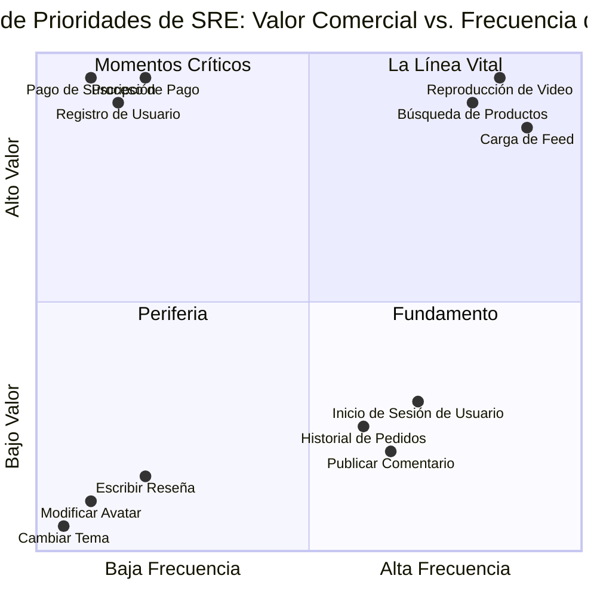
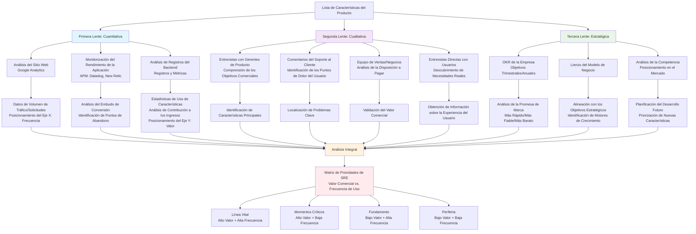
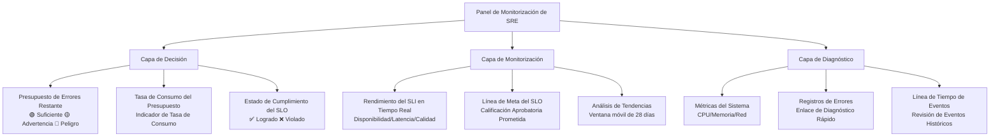
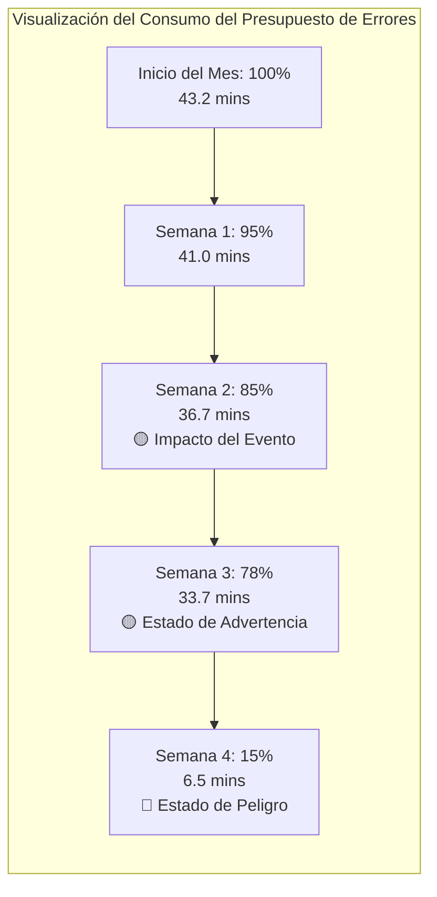
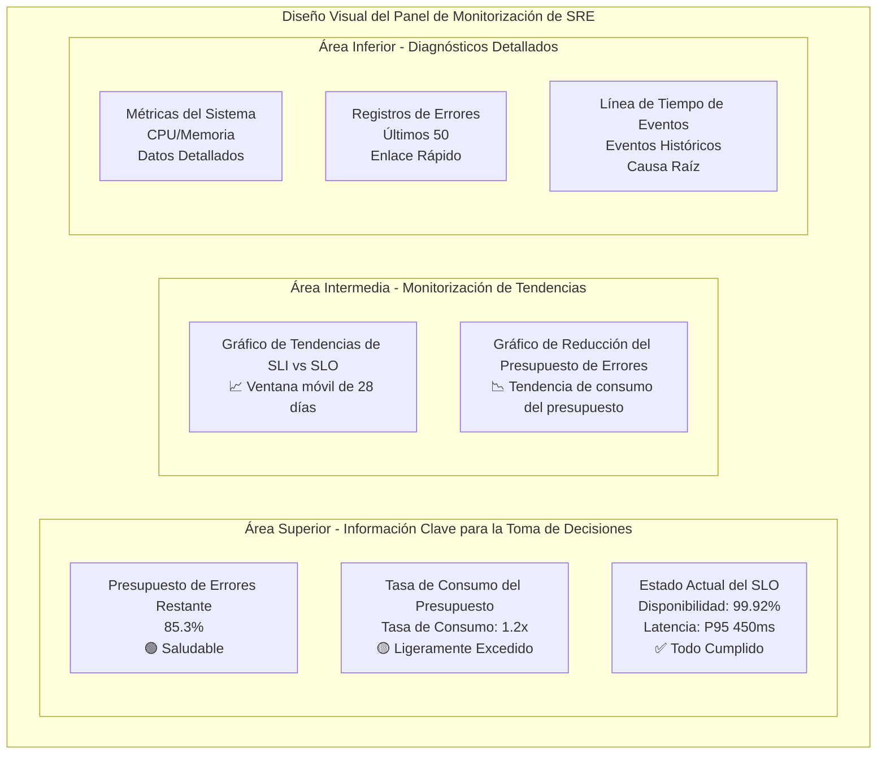
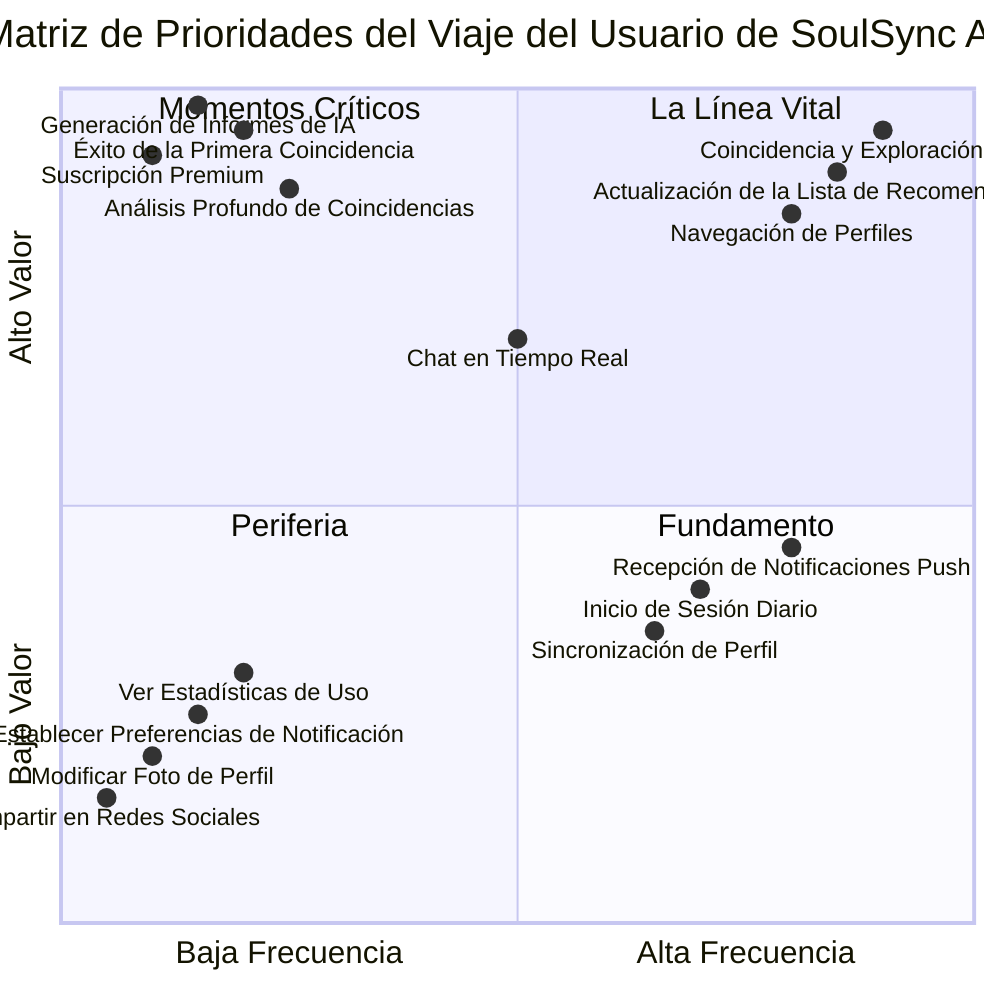

# Día 24 | Definición y Medición de la Fiabilidad: Método SRE y Práctica del Presupuesto de Errores - Conceptos Básicos de SLI, SLO y Presupuesto de Errores, Decisiones Basadas en Datos para Equilibrar la Velocidad de Innovación y la Estabilidad del Sistema

Hoy discutiremos la metodología de Ingeniería de Fiabilidad de Sitios (SRE), que transforma la `fiabilidad del sistema` de un concepto vago en una disciplina de ingeniería cuantificable.

En el campo de batalla del desarrollo de software moderno, se escenifica una guerra sin fin en casi todas las organizaciones:

- La Fuerza de la Innovación (Desarrolladores y Gerentes de Producto): Desean una iteración rápida, lanzando nuevas características para capturar el mercado. Son el "acelerador" de la organización.
- La Fuerza de la Estabilidad (Equipos de Operaciones e Infraestructura): Son responsables de garantizar el funcionamiento normal de los servicios, evitar fallas y garantizar la experiencia del usuario. Son los "frenos" de la organización.

Tradicionalmente, los objetivos de estas dos fuerzas parecen fundamentalmente opuestos, y su comunicación a menudo está llena de fricción, sospecha y debates emocionales subjetivos.

> "¡Tu nueva característica hizo caer el servidor!"
>
> "¡Tu proceso está sofocando la innovación!"

Tales argumentos son las pesadillas de muchos ingenieros, día y noche.

Este conflicto surge de la falta de un lenguaje y un objetivo comunes entre las dos partes. Aunque mencionamos un entendimiento común de los límites del sistema en <Diseño de Colaboración entre Equipos: Documentación Técnica, OpenAPI, Contratos Compartidos: Establecimiento de Estándares de Documentación de API y Colaboración en Equipo>, este tira y afloja es esencialmente más cercano a un **juego de suma cero**. Perseguir lanzamientos rápidos de características significa que no se puede garantizar el 100% de la completitud de las características, y viceversa. Garantizar el 100% de la completitud de las características podría significar perder el momento del mercado. Uno busca nuevas bases para la vida del sistema, mientras que el otro asegura las bases actuales. Ninguno tiene razón o está equivocado; es solo una cuestión de perspectiva.

El nacimiento de `SRE (Site Reliability Engineering)` fue para resolver este conflicto. Propuso un punto de vista revolucionario:

> **No deberíamos preguntar "si debemos pisar el freno"**, sino **deberíamos preguntar "¿a qué distancia estamos del acantilado que tenemos delante?"**

SLI, SLO y el Presupuesto de Errores son los instrumentos de ingeniería que utilizamos para medir con precisión la "distancia al acantilado".

Tengo la suerte de haber presenciado la esperanza de la colonización espacial humana mientras escribía esta serie de artículos (en 2025). Los avances en los chips, la liberación de la potencia informática y la mayor precisión de la IA son factores compuestos que están liberando los costos laborales tradicionales. Elon Musk es un soñador. Podría haber reinvertido sus activos en los viejos juegos financieros para convertirse en una nueva generación de la familia de Wall Street, pero eligió invertir sus activos en la investigación y el desarrollo de cohetes espaciales de la nueva era para abrir posibilidades futuras para la humanidad. Si tuviera la oportunidad, me ofrecería como voluntario para aventuras y colonización espacial: la gravedad de la Tierra ha atado mi alma. A continuación, permítanme mi obstinación y romance, y déjenme usar el "presupuesto de oxígeno" de una colonia espacial como ejemplo.

**El "Presupuesto de Oxígeno" de la Colonia Lunar: un Equilibrio entre Supervivencia y Exploración**

Somos el capitán de una nave de exploración lunar, encargada de explorar un cañón lunar nunca antes visitado por humanos. Hay dos grupos principales en la nave de exploración:

- Los científicos a bordo (el equipo de desarrollo): Están ansiosos por nuevos descubrimientos. Quieren que el sumergible permanezca más tiempo en el cañón lunar, explore más lejos en áreas desconocidas y use equipos de detección de alto consumo de energía.
- Los ingenieros del sistema de soporte vital a bordo (el equipo de operaciones): Solo se preocupan por una cosa: asegurarse de que todos puedan regresar a la base lunar con vida. Vigilan de cerca los niveles de oxígeno, la energía de la batería y la presión de la cabina.

Sin SRE, esto sería una batalla de voluntades. Los científicos presionarían constantemente, exigiendo "solo una hora más", mientras que los ingenieros se opondrían firmemente, citando "la seguridad primero".

**La introducción de SRE es para definir explícitamente el "suministro de oxígeno" como un presupuesto de errores.**

- SLO: Esta misión debe comenzar su viaje de regreso con el 70% de la reserva de seguridad de oxígeno restante.
- Presupuesto de Errores: Esto significa que tenemos un **"presupuesto de exploración" del 30%** para consumir.

Ahora, todas las decisiones se vuelven claras:

- ¿Encender la detección por sonar de alta potencia? Claro, pero el tablero mostrará que esto consumirá el 5% del presupuesto de oxígeno.
- ¿Quedarse 30 minutos extra en un cráter interesante? Claro, esto consumirá el 10% del presupuesto de oxígeno.
- ¿Viajar a una cordillera lunar más distante? Claro, pero el viaje de ida y vuelta consumirá el 15% del presupuesto de oxígeno.

El capitán y toda la tripulación pueden ver el consumo en tiempo real del presupuesto en una pantalla grande. Los científicos pueden decidir de forma autónoma cómo "gastar" su presupuesto para maximizar los resultados científicos. Una vez que se agota el presupuesto, sonará una alarma automáticamente, el sistema bloqueará los equipos de alto consumo de energía y la nave de exploración deberá regresar incondicionalmente.

**La importancia de SRE**: Transforma el vago concepto de "riesgo" en un recurso estratégico cuantificable, negociable y manejable. Permite que el equipo ya no discuta sobre "si tomar riesgos", sino que decida conjuntamente "dónde se debe gastar nuestro presupuesto de riesgo de la manera más valiosa".

La idea central de SRE es que: **la fiabilidad de un sistema no debe ser un arte vago y elusivo, sino una ciencia que puede ser `definida con precisión`, `cuantificada` y mejorada sistemáticamente a través de `métodos de ingeniería`**.

## El Pensamiento Central de la Metodología SRE

El primer pensamiento disruptivo de SRE es: **la fiabilidad del 100% es una mentira, y más aún, una trampa.**

Perseguir la perfección absoluta no solo es imprácticamente costoso, sino que también sofoca todas las posibilidades de innovación. Además, a los usuarios **no les importa si nuestro sistema está disponible al 100%**. Les **importa que el sistema sea "lo suficientemente fiable" cuando lo necesitan**.

Por lo tanto, el núcleo de SRE no es "eliminar" errores, sino tratar los "errores" o la "falta de fiabilidad" como un recurso limitado y manejable. Esto nos lleva a nuestros tres protagonistas de hoy: SLI (Indicadores de Nivel de Servicio), SLO (Objetivos de Nivel de Servicio) y Presupuesto de Errores.

### De "Nunca Caído" a "Apropiadamente Fiable"

**El Mito y la Trampa de la Fiabilidad del 100%**

Perseguir "cinco nueves" (99.999%) o una fiabilidad aún mayor no solo es casi imposible técnicamente (no podemos controlar las redes troncales, las fallas de hardware o incluso las erupciones solares), sino también un desastre comercial. El costo de la fiabilidad no crece linealmente, sino exponencialmente.

- De 99% a 99.9%: Puede requerir agregar algunos servidores redundantes.
- De 99.9% a 99.99%: Puede requerir la construcción de recuperación ante desastres intercontinentales, un equilibrio de carga más complejo y mecanismos de sincronización de datos.
- De 99.99% a 99.999%: El costo será inimaginablemente alto, requiriendo una arquitectura extremadamente compleja, y esta complejidad en sí misma se convertirá en una nueva fuente de fallas.

Lo más importante, ¿realmente les importa a los usuarios esta enorme inversión? ¿Realmente vale la pena renunciar a desarrollar nuevas características que los usuarios esperan genuinamente, solo para evitar 5 minutos adicionales de tiempo de inactividad por año? SRE nos obliga a hacer esta pregunta.

SRE propone un punto de vista disruptivo: la fiabilidad de un sistema no está determinada por nuestros servidores, sino definida por nuestros usuarios.

Si nuestro sistema está inactivo durante una hora a las 3 a.m., cuando todos los usuarios están dormidos, entonces, desde la perspectiva del usuario, nuestra disponibilidad es del 100%. Por el contrario, si todos nuestros servidores web funcionan normalmente, pero cada página tarda 30 segundos en cargarse debido a consultas lentas de la base de datos de backend, entonces, desde la perspectiva del usuario, nuestro servicio es **"no disponible"**.

Es por eso que enfatizamos en la lección anterior que los SLI deben reflejar la experiencia del usuario. No estamos protegiendo las luces de funcionamiento de las máquinas, sino la satisfacción de los usuarios.

La palabra "Apropiadamente" en "Apropiadamente Fiable" es la esencia de SRE. Reconoce que la fiabilidad es una característica del producto, tiene un costo y aporta valor. Por lo tanto, el nivel de fiabilidad debe ser una decisión comercial consciente y basada en datos, no un indicador técnico que se persigue infinitamente.

El sistema de monitorización de la frecuencia cardíaca de un hospital y un generador de memes en línea obviamente requieren niveles de fiabilidad "apropiados" muy diferentes. La tarea de SRE es trabajar con las partes del producto y del negocio para definir con precisión el SLO que se ajusta al posicionamiento del producto, ni más ni menos.

> **Un sistema debe ser "lo suficientemente fiable", no "perfectamente fiable".**

Este estándar de "suficiente" se define científicamente a través de SLI y SLO.

### Los Tres Pilares Centrales de SRE

```
SLI (Indicadores de Nivel de Servicio) → "Cómo cuantificar"
SLO (Objetivos de Nivel de Servicio) → "Cuál es el objetivo"
Presupuesto de Errores → "Cómo decidir"
```

Si "apropiadamente fiable" es la filosofía rectora de SRE, entonces los siguientes tres pilares son el marco de acción para traducir esa filosofía en la práctica diaria:

- Pilar Uno: Definir Metas con Datos

  - Esta es la parte que ya hemos discutido en profundidad, y es la base de todo.
  - Herramientas principales: SLI, SLO, Presupuesto de Errores.
  - Valor principal: Proporciona un lenguaje común, objetivo e indiscutible para todas las partes interesadas dentro de la organización (desarrollo, operaciones, producto, gestión). Al discutir si se debe lanzar una nueva característica, ya no decimos "Creo que es demasiado arriesgado" basándonos en sentimientos, sino que podemos señalar claramente "Nuestro presupuesto de errores para este mes es solo del 15%. Según la experiencia pasada, este lanzamiento tiene un 50% de posibilidades de consumir el 20% del presupuesto, por lo que el riesgo es demasiado alto". Esto transforma un conflicto potencial en una decisión racional basada en la probabilidad y los datos.

- Pilar Dos: Ingeniería contra el Trabajo Monótono

  - Esta es la característica más significativa que distingue a SRE de las operaciones tradicionales.
  - Definición de "Trabajo Monótono": Google SRE lo define como un trabajo manual, repetitivo y automatizable que carece de valor a largo plazo. Por ejemplo, reiniciar manualmente un servicio que se ha caído, configurar manualmente un nuevo servidor, ejecutar manualmente un script para limpiar el espacio en disco. Este trabajo no solo es tedioso, sino que, peor aún, su escala crece linealmente con el tamaño del sistema, consumiendo finalmente el tiempo de todos.
  - La naturaleza de ingeniería de SRE: Los SRE son ingenieros de software que resuelven "problemas operativos". Su tarea principal no es "hacer" este trabajo monótono, sino "desarrollar" sistemas y herramientas que resuelvan permanentemente este trabajo monótono. Escribirán un programa que monitoree y reinicie automáticamente los servicios, en lugar de reiniciarlo a mano. Usarán Terraform o Ansible para automatizar la configuración, en lugar de iniciar sesión en los servidores para escribir comandos.
  - La regla del 50%: Un equipo de SRE saludable debe dedicar al menos el 50% de su tiempo a proyectos de ingeniería para reducir el trabajo monótono futuro o mejorar la fiabilidad del sistema. Si el trabajo monótono ocupa más del 50% del tiempo, es una clara señal de advertencia de que el equipo está siendo abrumado por los problemas y necesita pausar la aceptación de nuevas tareas operativas para priorizar el desarrollo de la automatización.

- Pilar Tres: Abrazar el Riesgo y Gestionar el Fracaso

  - Esta es la encarnación cultural de SRE. En una cultura de SRE saludable, el fracaso no es un desastre, sino la oportunidad de aprendizaje más valiosa que nos brinda el sistema.
  - Post-mortems sin Culpa: Cuando ocurre un incidente, el principio principal de SRE es no culpar. El enfoque siempre está en qué parte del sistema salió mal, no en qué operador cometió un error. Porque el error humano a menudo es solo un síntoma de problemas sistémicos más profundos (p. ej., mal diseño de la interfaz, falta de controles de seguridad, documentación obsoleta). A través de post-mortems profundos y honestos que no asignan culpas personales, el equipo puede encontrar la causa raíz del problema y tomar medidas de ingeniería (p. ej., agregar controles, optimizar procesos, fortalecer la automatización) para garantizar que problemas similares no vuelvan a ocurrir.
  - Usar el presupuesto de errores como una herramienta de gestión de riesgos: El presupuesto de errores no es solo un indicador de monitorización pasivo; también es una herramienta activa de planificación de riesgos. El equipo puede "gastar" conscientemente el presupuesto para realizar pruebas de ingeniería del caos, realizar actualizaciones arquitectónicas de alto riesgo o verificar la estabilidad de nuevas características. Le da al equipo el coraje de explorar activamente los límites del sistema y abrazar la innovación dentro de un marco seguro.

## SLI: Indicadores de Nivel de Servicio - Cuantificando la Experiencia del Usuario

Habiendo establecido el marco de pensamiento macroscópico de SRE, ahora es el momento de profundizar en su base práctica más crítica: los Indicadores de Nivel de Servicio (SLI).

Un SLI (Indicador de Nivel de Servicio) es el "termómetro" que utilizamos para medir la salud de un servicio.

Un buen SLI debe satisfacer una regla de oro: **debe reflejar la experiencia real del usuario**. Los usuarios no sienten si el uso de la CPU de nuestro servidor es del 10% o del 90%; pero sí sienten si la página se carga en 0.5 segundos o en 5 segundos después de hacer clic en el botón "comprar".

Por lo tanto, los SLI son indicadores vistos de afuera hacia adentro. Veamos algunos ejemplos:

- Disponibilidad: ¿Qué porcentaje de todas las solicitudes de "leer artículo" devuelven contenido con éxito?
  - Fórmula: (Número de solicitudes exitosas / Número total de solicitudes) * 100%
- Latencia: ¿Qué porcentaje de todas las solicitudes exitosas de "buscar producto" tienen un tiempo de procesamiento inferior a 300 milisegundos?
  - Fórmula: (Número de solicitudes con tiempo de respuesta < 300ms / Número total de solicitudes exitosas) * 100%
- Calidad: ¿Qué porcentaje de todas las solicitudes de "reproducción de video" se transmiten en alta definición (HD) en lugar de degradarse a definición estándar (SD)?
  - Fórmula: (Número de reproducciones en HD / Número total de reproducciones) * 100%

El proceso de definición de SLI nos obliga a abandonar nuestra perspectiva centrada en el ingeniero y a empezar a ver nuestros propios productos a través de los ojos de nuestros usuarios.

### Principios Básicos de SLI

Habiendo establecido el marco de pensamiento macroscópico de SRE, ahora es el momento de profundizar en su base práctica más crítica: los Indicadores de Nivel de Servicio (SLI).

Si SRE es una disciplina de ingeniería que convierte la fiabilidad en una ciencia, entonces el SLI es la unidad de medida de esta ciencia. Sin una medición precisa, todas las metas (SLO) y los presupuestos (Presupuesto de Errores) son solo castillos en el aire.

Un SLI debe:

1. **Reflejar la experiencia real del usuario**
2. **Ser cuantificable y estandarizado**
3. **Menos es más**
4. **Alinearse con los objetivos comerciales**

**1. "Centrado en el Usuario" Absoluto**

Este es el primer principio más importante. Pregunte siempre: `"`¿Qué les importa a mis usuarios?`"` no `"`¿Qué está haciendo mi servidor?`"`

- Malos ejemplos: Uso de la CPU del servidor, consumo de memoria, rendimiento de la red. Estas son métricas del sistema. Son las causas de los problemas, pero no los problemas en sí. Los usuarios no sienten si nuestra CPU está al 10% o al 90%.
- Buenos ejemplos: Velocidad de carga de la página, tasa de éxito de la solicitud, tiempo de finalización de la carga de archivos. Estas son métricas de experiencia que los usuarios pueden sentir directamente.

**2. Cuantificable y Estandarizado**

Un SLI debe ser un número que se pueda calcular, generalmente una proporción o distribución. El formato estandarizado más común es:

> SLI = (Número de eventos buenos / Número total de eventos válidos) * 100%

Esta simple fórmula nos obliga a definir claramente qué constituye un evento "bueno" y qué constituye un evento "válido". Por ejemplo, para el SLI de disponibilidad de una API:

- Eventos buenos: Solicitudes con códigos de respuesta HTTP 2xx o 3xx.
- Eventos válidos: Todas las solicitudes, pero excluyendo aquellas causadas por errores del lado del cliente (p. ej., HTTP 4xx), porque esa no es responsabilidad de nuestro sistema.

**3. Menos es Más**

Un servicio no debe tener docenas de SLI. Demasiados indicadores conducen a demasiado ruido, fatiga de alertas y ocultan el enfoque real. Por lo general, un viaje clave del usuario solo necesita centrarse en 2-3 SLI principales (p. ej., disponibilidad, latencia, corrección); debemos centrarnos en la **densidad de la información**.

**4. Cubrir los Viajes Críticos del Usuario**

No todas las características de nuestro servicio son igualmente importantes. Necesitamos identificar las rutas que tienen el mayor valor para los usuarios y el negocio, y priorizar la definición de SLI para ellas.

- Para un sitio web de comercio electrónico: Buscar productos -> ver detalles del producto -> agregar al carrito -> pagar. La fiabilidad de esta ruta es mucho más importante que la fiabilidad de la función "modificar foto de perfil".
- Para una plataforma de video: La tasa de éxito de la reproducción de video y la latencia de inicio son SLI más centrales que publicar comentarios.

**Las Cuatro Señales Doradas de SLI**:

| **Tipo de Señal** | **Definición** | **Preocupación del Usuario** | **Ejemplo de Implementación en AWS** |
|---|---|---|---|
| **Latencia** | Tiempo para procesar una solicitud | "¿Qué tan rápido se carga el sitio web?" | CloudWatch ResponseTime |
| **Tráfico** | Medida de la demanda del sistema | "¿Cuántos usuarios puede manejar el sistema?" | CloudWatch RequestCount |
| **Errores** | Tasa de solicitudes fallidas | "¿Funciona correctamente la función?" | Tasa de Error 4xx/5xx de CloudWatch |
| **Saturación** | Grado de uso de los recursos del servicio | "¿Se caerá el sistema?" | Utilización de CPU/Memoria de CloudWatch |

Como "Arquitecto de Sistemas y Experiencias", nuestra tarea no es solo construir sistemas, sino también garantizar que los sistemas que construimos sirvan verdaderamente a las "experiencias" más valiosas. Identificar estas rutas clave es el "punto de anclaje" de nuestro trabajo arquitectónico.

> **El núcleo de la práctica de SRE no es solo un `problema técnico`, sino un `problema de estrategia comercial`. El núcleo de la práctica de SRE es en realidad: `"`¿Cómo encontrar el alma de un producto digital?`"`**

Esto no debe basarse únicamente en la intuición, sino que requiere una metodología sistemática. Aquí comparto un marco bidimensional que combina valor y frecuencia que utilicé al ejecutar campañas de marketing digital, así como un método de análisis de tres lentes para localizar con precisión estas rutas.

Primero, para identificar la importancia de una ruta de usuario, debemos evaluarla desde dos dimensiones: cuánto **Valor** aporta al negocio y con qué frecuencia se usa (**Volumen**). Al colocar todas las características y rutas en esta matriz de cuatro cuadrantes, sus prioridades se vuelven claras de un vistazo.



**Cuadrante 1: La Línea Vital - Alto Valor, Alta Frecuencia**

Características: Este es el latido de nuestro producto. Los usuarios usan estas funciones todos los días, a todas horas, y contribuyen directa o indirectamente a la gran mayoría del valor comercial.

Ejemplos:

- Plataforma de comercio electrónico: Búsqueda de productos, navegación por páginas de listas de productos
- Plataforma de video: Reproducción de video, recomendación de contenido de la página de inicio
- Plataforma social: Carga del feed

Estrategia SRE: Debe establecer el SLI/SLO más estricto. La disponibilidad, la latencia y la corrección son indispensables. El presupuesto de errores es extremadamente precioso, y cualquier consumo requiere atención inmediata. Aquí es donde necesitamos invertir la mayor cantidad de recursos de monitorización y automatización.

**Cuadrante 2: Momentos Críticos - Alto Valor, Baja Frecuencia**

Características: Estos son "tiros finales" decisivos y de alto riesgo. Los usuarios no los realizan con frecuencia, pero cuando lo hacen, el fracaso es absolutamente inaceptable. Las consecuencias del fracaso suelen ser la pérdida directa de ingresos o la pérdida de usuarios.

Ejemplos:

- Plataforma de comercio electrónico: Proceso de pago, registro de nueva cuenta
- Plataforma de video: Pago de suscripción
- Servicio SaaS: Exportación de datos, generación de informes anuales

Estrategia SRE: Los SLO son igualmente estrictos, especialmente en términos de Disponibilidad y Corrección. La tolerancia a la latencia puede ser ligeramente superior a la del primer cuadrante, pero el fracaso es inaceptable. Los planes de recuperación ante desastres y las garantías de consistencia de los datos son el foco de este cuadrante.

**Cuadrante 3: La Periferia - Bajo Valor, Baja Frecuencia**

Características: Son características secundarias o auxiliares que tienen poco impacto en la experiencia central.

Ejemplos:

- Plataforma de comercio electrónico: Modificar foto de perfil, escribir reseñas de productos
- Plataforma de video: Cambiar el tema

Estrategia SRE: Establecer los SLO más indulgentes. El foco de la monitorización es garantizar que "no estén completamente rotos", en lugar de perseguir el rendimiento máximo. El presupuesto de errores para estas características puede ser relativamente abundante, e incluso pueden servir como campo de pruebas para nuevas tecnologías o cambios de alto riesgo.

**Cuadrante 4: El Fundamento - Bajo Valor, Alta Frecuencia**

Características: Son las características básicas que forman el trasfondo de la experiencia del usuario. No crean un gran valor por sí mismas, pero si se rompen, harán que todo el producto se sienta "mal" y afectarán la confianza del usuario.

Ejemplos:

- Plataforma de comercio electrónico: Inicio de sesión, visualización del historial de pedidos
- Plataforma de video: Publicar comentarios, agregar a listas de reproducción
- General: Ver la documentación de ayuda (Ayuda/FAQ)

Estrategia SRE: Necesita ser fiable, pero el SLO puede ser más indulgente que los dos primeros. El foco está en la estabilidad y la consistencia. Podemos tolerar una degradación del rendimiento a corto plazo, pero no una indisponibilidad completa. La autorreparación es clave aquí.

Una vez que tenemos el marco básico, ¿cómo colocamos con precisión las características en los cuadrantes? Necesitamos examinar nuestro producto a través de tres "lentes" diferentes. Este es nuestro procedimiento operativo estándar (SOP).

### El Método de Análisis de Tres Lentes para Identificar Rutas Críticas de SRE

Para identificar con precisión la importancia de un viaje del usuario, debemos examinar nuestro producto desde tres perspectivas diferentes. Este método de análisis de tres lentes garantiza que no nos perdamos ninguna información clave.



**Primera Lente: La Lente Cuantitativa - Hechos Objetivos**

Este es nuestro primer paso, dejar que los datos hablen.

Herramientas: Herramientas de análisis de sitios web (Google Analytics), Monitorización del Rendimiento de la Aplicación (APM, p. ej., Datadog, New Relic), registros de backend.

Métricas que buscamos:

- **Volumen de Tráfico/Solicitudes**: ¿Qué páginas, puntos finales de API se llaman con más frecuencia? (Posicionamiento del eje X: Frecuencia)
- **Embudo de Conversión**: En el embudo "navegar -> agregar al carrito -> pagar", ¿cuántos usuarios hay en cada paso? ¿Qué paso tiene la tasa de abandono más alta?
- **Uso de Características**: ¿Qué porcentaje de usuarios activos ha utilizado una determinada característica?
- **Contribución a los Ingresos**: ¿Qué transacciones o características generan ingresos directamente? (Posicionamiento del eje Y: Valor)

**Segunda Lente: La Lente Cualitativa - Perspectivas Humanas**

Los datos nos dicen "qué pasó", pero el análisis cualitativo nos dice "por qué es importante".

Herramienta: Hablar con la gente.

Personas a las que debemos entrevistar:

- **Gerentes de Producto**: Conocen mejor la visión del producto y los objetivos comerciales. Pregúnteles: "Si tuviéramos que apostar nuestros salarios, ¿qué característica creemos que no puede fallar en absoluto?"
- **Equipo de Soporte al Cliente**: Son los más cercanos a las quejas de los usuarios. Pregúnteles: "¿Qué tipo de problema recibe más llamadas de soporte al cliente? ¿Qué problema enfurece a los usuarios?"
- **Equipo de Ventas**: Saben por qué características están dispuestos a pagar los clientes. Pregúnteles: "¿Qué punto de venta de nuestro producto es la clave para cerrar un trato?"
- **Usuarios**: Si es posible, realice entrevistas directas con los usuarios. Pregúnteles: "¿Qué es lo único que más desea lograr cuando abre nuestra aplicación hoy?"

**Tercera Lente: La Lente Estratégica - Dirección Futura**

Finalmente, debemos mirarlo desde la perspectiva de la empresa.

Herramientas: Objetivos trimestrales/anuales de la empresa (OKR), Lienzo del Modelo de Negocio, análisis de la competencia.

Preguntas en las que debemos pensar:

- **Promesa de Marca**: ¿Es nuestra marca "la más rápida", "la más fiable" o "la más barata"? Si prometemos "rápido", entonces los SLI para la búsqueda y la velocidad de carga de la página son cruciales.
- **Objetivos Estratégicos**: ¿El objetivo de la empresa este trimestre es "aumentar la tasa de registro de nuevos usuarios"? Si es así, el valor de la ruta del "proceso de registro", que es una ruta de baja frecuencia, debe aumentarse estratégicamente este trimestre.
- **Desarrollo Futuro**: ¿Estamos a punto de lanzar una nueva función basada en recomendaciones de IA y planeamos convertirla en el próximo motor de crecimiento? Entonces, el SLI para esta nueva función debe considerarse una potencial "línea vital" desde el primer día.

| **Tipo de Servicio** | **Categoría de SLI** | **Definición del Indicador (Fórmula)** | **Descripción** |
|---|---|---|---|
| **Servicio Impulsado por Solicitudes de Usuario**<br/>(p. ej., API web, sitio de comercio electrónico) | Disponibilidad | `(Respuestas HTTP 2xx/3xx) / (Solicitudes totales - Respuestas HTTP 4xx)` | Mide si el servicio está "vivo" y puede manejar con éxito solicitudes legítimas. |
| | Latencia | `(Solicitudes con tiempo de respuesta < N ms) / (Solicitudes exitosas totales)` | Mide la capacidad de respuesta del servicio. A menudo se establece en múltiples percentiles, como 95% (p95) y 99% (p99). |
| | Corrección | `(Solicitudes exitosas con contenido esperado) / (Solicitudes exitosas totales)` | Mide si la respuesta del servicio es correcta. Por ejemplo, una API de búsqueda que devuelve un HTTP 200 pero con un resultado vacío podría ser una respuesta "incorrecta". |
| **Canalización de Procesamiento de Datos**<br/>(p. ej., ETL, generación de informes) | Frescura | `Tiempo de finalización del procesamiento de datos - Tiempo de generación de datos < N horas` | Mide la puntualidad de la salida de datos. A los usuarios les importa si los datos del informe son los más recientes del día anterior. |
| | Cobertura | `(Registros procesados con éxito) / (Registros totales a procesar)` | Mide si el procesamiento de datos está completo, sin omisiones. |
| | Corrección | `(Salidas que pasan la validación de datos) / (Salidas totales)` | Mide si los datos de salida se ajustan a las reglas comerciales o a los estándares de calidad. |
| **Sistema de Almacenamiento**<br/>(p. ej., Base de datos, Almacenamiento de objetos) | Disponibilidad | `(Operaciones de lectura/escritura exitosas) / (Operaciones totales de lectura/escritura)` | Mide si se puede acceder normalmente al sistema de almacenamiento. |
| | Durabilidad | Generalmente un objetivo de diseño, no un SLI en tiempo real | Mide la probabilidad de que los datos almacenados no se pierdan. Esto generalmente se garantiza a través del diseño arquitectónico (p. ej., múltiples réplicas, sumas de verificación), no de la monitorización en tiempo real. |

### Configuración del Panel de Monitorización de SLI

Después de definir los SLI, el siguiente paso es visualizarlos en un panel que pueda guiar las decisiones. Un buen panel de SRE debería poder responder a las siguientes preguntas en 30 segundos: "¿Está bien nuestro servicio en este momento? ¿Cuánto margen de error nos queda?"

**Arquitectura de Componentes Centrales del Panel**



**1. La Línea de Meta del SLO**

Este es el elemento visual más importante del panel. Una línea horizontal clara que representa el objetivo comprometido de nuestro equipo (p. ej., 99.9%). Todas las métricas deben compararse con esta línea.

**2. Gráfico de Rendimiento del SLI Actual**

Un gráfico de líneas que cambia con el tiempo, que muestra el rendimiento real del SLI en una ventana de tiempo específica (p. ej., una ventana móvil de 28 días). Podemos ver de un vistazo si actualmente estamos por encima o por debajo de la línea de meta.

**3. Gráfico de Reducción del Presupuesto de Errores**

Este es el gráfico clave para poner en práctica la filosofía de SRE a nivel de toma de decisiones. Muestra el porcentaje del presupuesto de errores restante o el "tiempo no fiable" específico (p. ej., 15.3 minutos restantes) desde el comienzo del ciclo (p. ej., el 1 de cada mes) hasta el presente. Cuando esta línea se acerque a cero, todos sabrán que se debe soltar el "acelerador" de la innovación.



**4. Tasa de Consumo y Alertas**
Un buen panel no solo muestra "cuánto queda", sino que también predice "cuánto durará".

- Tasa de Consumo: Un indicador que muestra qué tan rápido se está consumiendo nuestro presupuesto de errores. Por ejemplo, una Tasa de Consumo = 2 significa que estamos consumiendo el presupuesto al doble de la tasa esperada y se espera que se agote en la mitad del ciclo.
- Alertas: Las alarmas no solo deben activarse cuando "se viola el SLO", ya que eso ya es demasiado tarde. Más importante aún, se debe emitir una advertencia por adelantado cuando "si la tasa de consumo actual continúa, nuestro presupuesto se agotará en X días", dando al equipo tiempo para reaccionar.

**Ejemplo de Diseño de Panel**

Arriba a la izquierda (posición más prominente): Muestre el presupuesto de errores restante actual en el tamaño de fuente más grande. Esta es la base más importante para la toma de decisiones.

Arriba a la derecha: Muestre un gráfico de tendencias a largo plazo de varios SLI principales (disponibilidad, latencia) en relación con la línea de meta del SLO.

Abajo: Proporcione gráficos de datos más detallados, métricas del sistema relacionadas (CPU, Memoria) y enlaces rápidos a los registros de errores para un diagnóstico en profundidad (desglose) cuando ocurran problemas.



Habiendo dominado cómo definir, medir y monitorear los SLI, hemos dominado la piedra angular de la práctica de SRE. Lo siguiente es la configuración de SLO y la gestión del presupuesto de errores.

## SLO: Objetivos de Nivel de Servicio - La Línea de Meta para la Fiabilidad

Un SLO (Objetivo de Nivel de Servicio) es la "calificación aprobatoria" que establecemos para nuestro SLI.

Es un objetivo específico, un compromiso público entre nosotros, nuestros usuarios y nuestros equipos comerciales. Generalmente se define como un porcentaje durante una ventana de tiempo específica.

Continuando con los ejemplos anteriores:

- SLO de Disponibilidad: "En los últimos 28 días, el 99.9% de las solicitudes de 'leer artículo' deben ser exitosas".
- SLO de Latencia: "En los últimos 28 días, el 95% de las solicitudes de 'buscar producto' deben completarse en 300 milisegundos".

Establecer un SLO es un arte, y también un negocio; no es cuanto más alto, mejor.

Un SLO del 99.9% (a menudo llamado "tres nueves") y un SLO del 99.999% ("cinco nueves") tienen costos y complejidades de ingeniería muy diferentes. Debemos preguntarnos: ¿el enorme costo pagado por este 0.099% adicional de fiabilidad realmente aporta un valor equivalente al usuario? ¿O sería más valioso invertir estos recursos en desarrollar una nueva característica?

Si el SLI es el termómetro, entonces el SLO es la "temperatura de crecimiento óptima" que establecemos para nuestro invernadero basándonos en la ciencia y la experiencia. Si la temperatura es demasiado alta (el objetivo se establece de forma demasiado estricta), agotará toda la energía y sofocará el crecimiento; si la temperatura es demasiado baja (el objetivo se establece de forma demasiado laxa), los cultivos (experiencia del usuario) se marchitarán.

Establecer un SLO no es una decisión puramente técnica. Es una delicada negociación diplomática, un proceso para encontrar el equilibrio óptimo entre la viabilidad técnica, las expectativas del usuario y los costos comerciales.

> **Un SLO es el resultado de una negociación conjunta entre producto, desarrollo y operaciones. Es un límite basado en datos que define claramente lo que significa que un "servicio funcione bien".**

### El Arte y la Ciencia de Establecer SLO

Detrás de un número de SLO se encuentra una profunda comprensión del negocio y un conocimiento preciso de la tecnología; es tanto un método científico como una filosofía artística. El establecimiento de un SLO común debe equilibrar múltiples factores:

```yaml
Consideraciones para el Establecimiento de SLO:
Expectativas del Usuario: El resultado final de la calidad del servicio que los usuarios pueden tolerar
Impacto Comercial: El impacto financiero de la interrupción del servicio en el negocio
Realidad Técnica: Las limitaciones técnicas de la arquitectura del sistema
Rentabilidad: El costo marginal de mejorar la fiabilidad
Tolerancia al Riesgo: La aceptación del riesgo por parte de la organización
```

Pero podemos establecer el contexto desde los dos aspectos principales: **La Ciencia: Base Objetiva Basada en Datos** y **El Arte: Decisión Subjetiva Orientada a la Estrategia**.

**La Ciencia: Base Objetiva Basada en Datos**

Este es el esqueleto lógico del SLO. No nos basamos en sentimientos, sino que dejamos que los datos nos guíen a un punto de partida razonable.

- **Analizar el Rendimiento Histórico:**
  - ¿Cómo se ha comportado nuestro SLI en el último trimestre o semestre? No se trata de mirar el promedio, sino la distribución.
    - ¿Cuál es la latencia P95 (percentil 95)? ¿Cuál es la P99?
  - Los datos históricos son nuestro consultor más honesto; nos dicen dónde se encuentran las capacidades intrínsecas del sistema.
  - Establecer directamente un SLO que supere con creces el mejor rendimiento histórico no es realista.
- **Comprender los Rendimientos Decrecientes**:
  - El costo de mejorar del 99% al 99.9% es exponencialmente diferente de mejorar del 99.9% al 99.99%.
  - Debemos preguntar: ¿El enorme recurso de ingeniería invertido para este 0.09% adicional de fiabilidad aporta una satisfacción del usuario o un retorno comercial equivalente?
    - Después de cierto punto, el retorno de la inversión para continuar mejorando la fiabilidad caerá drásticamente.
- **Correlacionar con las Métricas Comerciales**:
  - Ejemplo: Compare nuestros datos de SLI con las métricas comerciales (p. ej., tasa de retención de usuarios, tasa de abandono del carrito de compras, tasa de conversión de suscripciones).
    - Encontramos un patrón interesante: cuando la latencia de la página cae de 200 ms a 100 ms, la tasa de conversión puede aumentar significativamente; pero de 100 ms a 50 ms, puede que casi no haya cambios.
  - Este "acantilado" o "meseta" en los datos es una base científica sólida para establecer SLO.

**El Arte: Decisión Subjetiva Orientada a la Estrategia**

Si la ciencia nos dice "a dónde podemos ir", el arte nos dice "a dónde deberíamos ir".

- **Gestionar las Expectativas del Usuario**:
  - ¿Cuál es la definición de "bueno" del usuario? A menudo es relativo.
  - Si el sitio web de nuestro competidor es rapidísimo, entonces nuestro SLO no puede ser demasiado laxo.
    - Por el contrario, si nuestro producto es un sistema de backend interno, la tolerancia de los usuarios a la latencia ocasional es mucho mayor.
  - El arte es comprender y moldear los sentimientos psicológicos del usuario.
- **Reflejar la Promesa de la Marca**:
  - ¿Qué imagen de marca quiere transmitir nuestra empresa al mundo? ¿Es un "rendimiento máximo" como un superdeportivo de lujo, o una "fiabilidad absoluta" como un Toyota?
  - Nuestro SLO debe ser coherente con la promesa de la marca.
    - Un sistema de comercio financiero que afirma "nunca interrumpirse" necesariamente tendrá un SLO mucho más estricto que una aplicación social experimental.
- **Usar como Herramienta de Negociación**:
  - El SLO es nuestro contrato con los equipos de producto y negocio.
    - Cuando un gerente de producto solicita un SLO extremadamente alto, podemos usar datos para mostrarles claramente el costo de ingeniería requerido para lograr ese objetivo y preguntarles: "¿Estamos dispuestos a posponer el desarrollo de tres nuevas características el próximo trimestre para este objetivo?"
  - Esto convierte una solicitud sentimental en una discusión racional sobre la asignación de recursos.

**Mejores Prácticas para Establecer SLO**

Seguir estos principios puede hacer que nuestro proceso de establecimiento de SLO sea más fluido y efectivo.

1. Manténgalo Simple: No intente establecer SLO para cada rincón del sistema. Comience con los "viajes críticos del usuario" que discutimos anteriormente y elija no más de 3 de los SLI más importantes para cada viaje para establecer SLO (generalmente disponibilidad, latencia).

2. Nunca Establezca el 100%: Un SLO del 100% significa cero presupuesto de errores, lo cual es imposible en el mundo real. No solo sofoca todo cambio e innovación, sino que también establece un objetivo que está condenado al fracaso, lo cual es desmoralizador.

3. Los SLO están Vivos, Itere y Refine: Nuestro primer SLO probablemente no sea el más perfecto. Establezca un objetivo inicial, ejecútelo durante uno o dos ciclos y luego ajústelo en función de la situación real, la tasa de consumo del presupuesto de errores y los comentarios de los usuarios. Es una brújula que necesita una calibración continua.

4. Garantice la Propiedad Compartida: El SLO no es el objetivo personal del equipo de SRE. Debe ser un contrato común discutido, acordado y firmado públicamente por los equipos de producto, desarrollo y SRE. Cuando se agota el presupuesto de errores, todo el equipo de producto, no solo SRE, asume las consecuencias (p. ej., congelar los lanzamientos).

5. Defina Claramente la Ventana de Medición: ¿Nuestro SLO se calcula en función de los "últimos 7 días" o los "últimos 28 días"? Una ventana más corta es más sensible a las fallas y reacciona más rápido; una ventana más larga puede reflejar mejor las tendencias a largo plazo y evitar reaccionar de forma exagerada a las fluctuaciones a corto plazo. Por lo general, "28 o 30 días móviles" es un buen punto de partida.

**Estrategia de Implementación de SLO**

Implementar SLO en una organización es un cambio cultural que no se puede lograr de la noche a la mañana. Se recomienda adoptar una estrategia de tres etapas de "Gatear-Caminar-Correr".

**Fase 1: Gatear**

- Objetivo: Aprender y validar.
- Acciones:
  1. Seleccione 1-2 sistemas internos o servicios externos no absolutamente centrales como pilotos.
  2. Forme un pequeño equipo virtual con los equipos de desarrollo y producto de ese servicio.
  3. Complete conjuntamente un proceso completo de definición de SLI/SLO.
  4. Construya un panel de monitorización básico.
- Enfoque: En esta etapa, el enfoque está en familiarizar a todos con este lenguaje y proceso, y en permitir errores. La precisión del SLO no es lo más importante; construir consenso y aprender de la experiencia sí lo es.

**Fase 2: Caminar**

- Objetivo: Estandarizar y expandir.
- Acciones:
  1. Consolide la experiencia exitosa del piloto en un SOP de establecimiento de SLO estandarizado.
  2. Expanda la práctica de SLO a todos los servicios de "línea vital" y "momento crítico".
  3. Comience a implementar formalmente la política de presupuesto de errores basada en SLO. Cuando se agote el presupuesto, debe haber medidas de respuesta claras (p. ej., suspender los lanzamientos de características, celebrar reuniones de estabilidad).
- Enfoque: Transforme el SLO de un "indicador de monitorización" a una herramienta que impulse las decisiones. Deje que el presupuesto de errores realmente comience a afectar las prioridades de trabajo del equipo.

**Fase 3: Correr**

- Objetivo: Integración total e incrustación cultural.
- Acciones:
  1. Integre completamente los SLO y los presupuestos de errores en todos los procesos de la organización: planificación trimestral, hojas de ruta de productos, revisiones de lanzamientos, respuesta a incidentes, post-mortems.
  2. Construya un panel de fiabilidad para toda la empresa para que la gerencia también pueda comprender la salud de los servicios.
  3. Los SLO se convierten en una de las bases para evaluar el rendimiento del equipo y recompensar las prácticas de ingeniería de alta fiabilidad.
- Enfoque: El SLO ya no es algo que el equipo de SRE necesita "empujar"; se ha internalizado como el lenguaje común y la cultura central para pensar y comunicarse en toda la organización técnica.

## Presupuesto de Errores: El Equilibrio entre Innovación y Estabilidad

Si el SLI es la unidad de medida y el SLO es la brújula, entonces el "Presupuesto de Errores" es el **motor y el combustible** que impulsa toda la rueda de SRE. Es la invención más revolucionaria de SRE, un mecanismo poderoso que transforma una filosofía de gestión empresarial abstracta en un proceso de toma de decisiones diario, transformando el concepto de SLO de un objetivo de monitorización pasivo a una herramienta de gestión activa.

Discutiremos cómo diseñar un sistema autorregulado y autoequilibrado, no solo un sistema técnico, sino también un sistema organizacional y cultural. Utiliza una regla justa, transparente y basada en datos (Presupuesto de Errores) para gestionar las emociones del equipo (el impulso por la innovación frente a la ansiedad por la estabilidad) y, en última instancia, lograr un ideal común (crear valor para los usuarios).

Antes de comenzar oficialmente, veamos una historia de fantasmas.

**Comparación del Modo de Toma de Decisiones: Impulsado por la Emoción vs. Impulsado por los Datos**

### Escenario 1: Discusión sobre el Lanzamiento de una Nueva Característica

> **Modo de Decisión Tradicional (Basado en la Emoción)**
>
> - **Desarrollador**: "¿Podemos lanzar esta nueva característica? ¡Los usuarios la han estado esperando y nuestros competidores ya la tienen!"
> - **Operaciones**: "No, el último lanzamiento causó problemas, ¡es demasiado arriesgado! Ustedes, los desarrolladores, nunca consideran la estabilidad".
> - **Desarrollador**: "¡Pero el gerente de producto dijo que esta característica traerá un aumento del 20% en los ingresos!"
> - **Operaciones**: "No me importan los ingresos, solo sé que si el sistema se cae, todos vendrán a culparnos".
> - **Desarrollador**: "¡Ustedes, los de operaciones, siempre son conservadores, la empresa perderá su competitividad si esto continúa!"
> - **Operaciones**: "¡Ser conservador es mejor que ser llamado en medio de la noche para arreglar errores! Trabajamos hasta las 3 a.m. en ese último incidente".
> - **Gerente**: "Dejen de discutir, ¿podemos lanzarlo o no? ¡Denme una respuesta clara!"

> **Modo de Decisión SRE (Basado en Datos)**
>
> - **Desarrollador**: "¿Tenemos suficiente presupuesto de errores para cubrir el riesgo de este lanzamiento?"
> - **SRE**: "El presupuesto de errores actual es solo del 15%. Según los datos históricos, un lanzamiento de una característica similar tiene un 30% de posibilidades de consumir el 10% del presupuesto".
> - **Desarrollador**: "¿Eso significa que si el lanzamiento falla, excederemos el presupuesto de errores?"
> - **SRE**: "Sí, pero podemos reducir el riesgo. Sugiero un lanzamiento canario al 10% de los usuarios primero, y observar durante 48 horas".
> - **Producto**: "¿Cuál es la estimación de riesgo para el lanzamiento canario? ¿Afectará al SLO?"
> - **SRE**: "El riesgo del lanzamiento canario se reduce al 5%, y se espera que consuma el 1-2% del presupuesto de errores. Si tiene éxito, podemos expandirlo de forma segura a todos los usuarios".
> - **Gerente**: "Bien, los datos son claros. Se aprueba el plan de lanzamiento canario. Continúen monitoreando el estado del presupuesto de errores".

### Escenario 2: Manejo de Incidentes de Emergencia

> **Modo de Decisión Tradicional (Basado en la Emoción)**
>
> - **Operaciones**: "¡El sistema está caído! ¡Todos los usuarios no pueden iniciar sesión y el teléfono de servicio al cliente no para de sonar!"
> - **Desarrollador**: "¡Imposible, nuestro código de ayer no tocó la lógica de inicio de sesión! Debe ser un problema de infraestructura".
> - **Operaciones**: "¡La infraestructura ha estado estable, debe ser un error en su nuevo código!"
> - **Gerente**: "¡Ahora no es el momento de buscar culpables, apúrense y encuentren una manera de recuperarse!"
> - **Desarrollador**: "¿Qué tal si revertimos a la versión anterior? Pero perderemos la solución de la vulnerabilidad de seguridad de ayer".
> - **Operaciones**: "Entonces arreglen la vulnerabilidad y lancen de nuevo, pero no sé cuánto tiempo tomará, el CEO ya está preguntando..."
> - **Gerente**: "¿Cuánto tiempo les tomará arreglar esto si siguen discutiendo? ¡Denme un tiempo!"

> **Modo de Decisión SRE (Basado en Datos)**
>
> - **SRE**: "La disponibilidad del servicio de inicio de sesión ha caído al 25%, se ha activado un incidente P1 y el presupuesto de errores se está consumiendo rápidamente".
> - **Desarrollador**: "Según los datos de monitorización, el problema está en el grupo de conexiones de la base de datos, lo que coincide con el tiempo de lanzamiento del código de ayer".
> - **SRE**: "El objetivo de MTTR es de 30 minutos. Opción uno: revertir inmediatamente, recuperarse en 5 minutos pero reintroducir el riesgo de seguridad".
> - **Seguridad**: "Opción dos: aplicar un parche en caliente a la configuración del grupo de conexiones, recuperarse en 15 minutos y mantener la solución de seguridad".
> - **Producto**: "Según el presupuesto de errores, todavía podemos permitirnos 8 minutos de tiempo de inactividad. La opción dos es demasiado arriesgada".
> - **SRE**: "Claro: ejecuten el plan de reversión inmediatamente. La solución de la vulnerabilidad de seguridad se reprogramará y se establecerá un proceso de prueba más estricto".
> - **Gerente**: "De acuerdo. El sistema se recuperará en 5 minutos. El próximo lunes se hará un plan de lanzamiento seguro para la solución de la vulnerabilidad de seguridad".

Al igual que el diálogo y las decisiones entrelazadas en los escenarios, **el presupuesto de errores cuantifica el "riesgo" en una "moneda" que se puede negociar y gestionar**. Cuando el presupuesto es suficiente, el equipo tiene la autonomía de innovar con audacia; cuando el presupuesto se agota, el único objetivo de todo el equipo es "dejar de gastar", es decir, centrarse en solucionar problemas y mejorar la estabilidad hasta que el presupuesto comience a acumularse de nuevo. Unifica inteligentemente los objetivos de desarrollo y operaciones.

Hoy, desmantelaremos por completo este motor, desde sus `principios básicos` hasta su `marco de toma de decisiones`, y luego hasta cómo materializarlo en AWS, una plataforma en la nube de clase mundial.

### El Concepto Central del Presupuesto de Errores

La definición matemática de un presupuesto de errores es muy simple:

```
Presupuesto de Errores = (1 - SLO) × Tiempo Total
```

Si nuestro SLO de disponibilidad es del 99.9%, entonces nuestro presupuesto de errores es del 0.1%.

¿Qué representa este 0.1%? Representa el "`permiso para fallar`". Es como nuestro dinero de bolsillo, podemos gastarlo libremente. Podemos usarlo para:

- Lanzar nuevas características: Cualquier lanzamiento de una nueva característica tiene riesgos, puede causar errores y consumir nuestro presupuesto de errores.
- Realizar actualizaciones del sistema: Incluso el tiempo de inactividad por mantenimiento planificado consumirá el presupuesto de errores.
- Absorber fallas inesperadas: Las interrupciones inesperadas del sistema quemarán rápidamente nuestro presupuesto.

Este 0.1% ya no es una "tasa de tolerancia a fallas" pasiva, debemos verlo como una autorización activa. Representa el compromiso solemne que nosotros, como administradores del sistema, hacemos a los equipos de producto y desarrollo:

> **"Con la premisa de no exceder este 0.1%, tienen derecho a cometer errores. Pueden usar este presupuesto para tomar riesgos, para innovar, para lanzar esas nuevas características que pueden no ser perfectas pero tienen un gran potencial. Esta es su moneda para la innovación."**

Imagine al equipo de desarrollo (Dev) y al equipo de operaciones (Ops/SRE) gestionando conjuntamente una cuenta bancaria, y el dinero en la cuenta es el "presupuesto de errores".

El **equipo de desarrollo** quiere gastar dinero (lanzar nuevas características, hacer cambios de alto riesgo) porque gastar dinero puede traer mayores rendimientos (cuota de mercado, satisfacción del usuario).

La tarea principal del **equipo de operaciones** es garantizar que siempre haya suficiente depósito en la cuenta (mantener la estabilidad del sistema) para hacer frente a necesidades inesperadas (fallas inesperadas).

Bajo este modelo, la oposición tradicional desaparece y los objetivos de ambas partes se vuelven completamente consistentes: **cómo gastar este presupuesto limitado de la manera más inteligente para maximizar el valor a largo plazo del producto.** Cuando el saldo de la cuenta es bajo, cualquier miembro racional estará de acuerdo: ahora debemos dejar de gastar y comenzar a ganar dinero (solucionando problemas, mejorando la estabilidad).

Por lo tanto, al igual que los dos escenarios que mencionamos al principio, la `discusión sobre el lanzamiento de una nueva característica` y el `manejo de incidentes de emergencia`, finalmente hemos terminado con el interminable tira y afloja en la sala de reuniones.

### Marco de Toma de Decisiones Impulsado por el Presupuesto de Errores

Con un presupuesto de errores, tenemos un panel de control en tiempo real para guiar nuestras decisiones. El núcleo es monitorear un indicador clave: la tasa de consumo del presupuesto.

La tasa de consumo se refiere a la velocidad a la que consumimos el presupuesto de errores. Una tasa de consumo saludable debe ser de aproximadamente 1 (es decir, consumir a la tasa esperada). Cuando la tasa de consumo > 1, significa que estamos sobregirando nuestra capacidad de innovación futura.

Este es un SOP (Procedimiento Operativo Estándar) que podemos aplicar directamente:

| **Estado del Presupuesto** | **Tasa de Consumo (Ejemplo)** | **Luz de Estado** | **Principio Básico** | **Acción de Decisión** |
|---|---|---|---|---|
| **Saludable**<br/>> 70% restante | Tasa de Consumo ≈ 1 | 🟢 Verde | Fomentar la Innovación | • Acelerar los lanzamientos: Permitir lanzamientos de características de mayor frecuencia y mayor riesgo<br/>• Experimentos planificados: Ejecutar ingeniería del caos, pruebas de estrés, cambios arquitectónicos<br/>• Programar mantenimiento: Realizar actualizaciones de bases de datos que requieren un breve tiempo de inactividad, etc. |
| **Agotándose**<br/>30% - 70% restante | Tasa de Consumo > 2 | 🟡 Amarillo | Proceder con Precaución | • Elevar el listón de los lanzamientos: Solo permitir cambios de bajo riesgo y alto valor<br/>• Fortalecer las pruebas: Requerir una cobertura de pruebas automatizadas más completa<br/>• Análisis de problemas: Analizar qué característica o cambio está consumiendo rápidamente el presupuesto y priorizar su solución |
| **En Peligro**<br/>< 30% restante | Tasa de Consumo > 5 | 🟠 Naranja | Prepararse para Frenar | • Congelación Parcial: Suspender todos los lanzamientos de características no urgentes<br/>• Formar un equipo de respuesta: Compuesto por Dev y SRE, centrándose en mejorar la estabilidad<br/>• Análisis de Causa Raíz (RCA): Investigación en profundidad de la causa raíz del consumo rápido del presupuesto |
| **Agotado**<br/>≈ 0% restante | Tasa de Consumo >> 10 | 🔴 Rojo | La Estabilidad Primero | • Congelación Total: Prohibir estrictamente cualquier cambio de código funcional<br/>• Todos a la obra: La principal prioridad de todo el equipo de producto es corregir errores, optimizar el rendimiento y agregar pruebas<br/>• Post-mortem: La congelación solo se puede levantar después de que el SLO vuelva a la línea de meta y el presupuesto comience a acumularse nuevamente |

### Implementación del Presupuesto de Errores en AWS

A continuación, utilizaremos una serie de servicios de AWS para construir un sistema de gestión del presupuesto de errores automatizado y altamente visual.

1. Instrumentación: Nuestro Sistema Nervioso

- Fuentes: Registros de Amazon CloudWatch (registros de aplicaciones), Registros de Acceso del Balanceador de Carga de Aplicaciones (ALB) (registros de solicitudes), Métricas de CloudWatch (métricas del sistema).
- Objetivo: Capturar los datos brutos de "eventos buenos" y "eventos totales" necesarios para definir el SLI. Por ejemplo, los códigos de estado HTTP en los registros del ALB.

2. Cálculo: Nuestro Cerebro Analítico

- Herramientas: CloudWatch Logs Insights o CloudWatch Metric Math.
- Operación: Use Logs Insights para consultar los registros y calcular el número de solicitudes exitosas y el número total de solicitudes dentro de una ventana de tiempo específica.

```
-- Ejemplo: Calcular el SLI de disponibilidad de la última hora
filter @message like /HTTP/
| stats count(backend_status_code) as total_requests,
        count(backend_status_code = 200 or backend_status_code = 304) as good_requests
| extend sli = (good_requests * 100.0 / total_requests)
```

2.  Use Metric Math para publicar estos resultados de cálculo como una Métrica de CloudWatch personalizada, con un nombre como por ejemplo `WebApp/AvailabilitySLI`. Este paso es clave, ya que convierte el SLI en una métrica que se puede rastrear y sobre la que se pueden generar alertas a largo plazo.

3.  Visualización: Nuestro Panel de Control

- Herramientas: Paneles de Amazon CloudWatch o Amazon Managed Grafana.
- Componentes Centrales:
  - Valor Actual del SLI: Un gráfico de indicador que muestra el porcentaje del SLI en tiempo real, con una línea roja dibujada para el SLO (p. ej., 99.9%).
  - Tendencia a Largo Plazo del SLI: Un gráfico de líneas que muestra el rendimiento del SLI en los últimos 28 días, también con la línea de meta del SLO superpuesta.
  - Gráfico de Reducción del Presupuesto de Errores: Este es el gráfico más importante. Necesitamos usar Metric Math para crear una nueva métrica `ErrorBudgetRemaining`.

```
ErrorBudgetRemaining = 100 - ((100 - WebApp/AvailabilitySLI) / (100 - SLO_TARGET)) * 100
```

Esta métrica mostrará cuánto de nuestro presupuesto queda, comenzando desde el 100%.

4. Alertas: Nuestro Radar de Alerta Temprana
   - Herramientas: Alarmas de CloudWatch combinadas con Amazon SNS.
   - Estrategia de Alertas (Aquí es donde se demuestra la profesionalidad):
     - No alerte solo cuando se viola el SLO: Eso es demasiado tarde, es como hacer sonar la alarma después de que el barco ha chocado contra el iceberg.
     - Alerte sobre la "tasa de consumo": Cree una alarma basada en la tasa de consumo. Esta es la esencia de SRE.
   - Alerta Amarilla (Llamando a un Ingeniero): "Si la tasa de consumo del presupuesto de errores de la última hora continúa durante 24 horas, agotará el 10% del presupuesto de 28 días". Esta es una alerta de alta prioridad que requiere la intervención de un ingeniero.
   - Alerta Roja (Llamando al Líder del Equipo): "Si la tasa de consumo del presupuesto de errores de las últimas 2 horas continúa, agotará todo el presupuesto en 3 días". Esta es una alerta grave que requiere la intervención del líder del equipo para considerar la congelación de los lanzamientos.

## Estudio de Caso: Práctica de SRE para una Plataforma de Coincidencia Emocional de IA

El aprendizaje teórico nos ha proporcionado una base sólida. Ahora, es el momento de construir el primer edificio con nuestras propias manos.

Simularemos una consulta de implementación de SRE real. Nosotros, como "Arquitectos de Sistemas y Experiencias" externos, hemos sido contratados por una startup llamada "SoulSync AI" para diseñar una estrategia de fiabilidad completa para su producto principal, la "Plataforma de Coincidencia Emocional de IA".

Nuestra tarea es transformar las quejas vagas de los usuarios en un plan de ingeniería preciso y ejecutable que pueda guiar el desarrollo futuro de la empresa.

### Antecedentes del Caso

**1. Empresa y Producto**

- **Nombre de la Empresa**: SoulSync AI
- **Posicionamiento del Producto**: Una plataforma de citas de nueva generación que se centra en la "coincidencia profunda del alma". No se trata solo de deslizar a la izquierda o a la derecha en las fotos, sino de analizar la entrada de texto y los patrones de interacción de los usuarios para generar un "índice de resonancia emocional" y recomendar coincidencias utilizando su motor de IA patentado.
- **Modelo de Negocio**:
  - **Versión Gratuita**: Funciones básicas de coincidencia, deslizamiento y chat.
  - **Versión Premium**: Desbloquea el informe completo de "análisis de resonancia emocional", ve las dimensiones detalladas de la coincidencia con otros y recibe recomendaciones prioritarias diarias.

**2. Arquitectura Técnica**

La plataforma utiliza una arquitectura de microservicios basada en AWS:

- **Servicio de Pasarela**: El punto de entrada unificado para todas las solicitudes del cliente (iOS/Android) (API Gateway + Lambda/Fargate).
- **Servicio de Perfil de Usuario**: Gestiona la información básica del usuario, las fotos y la configuración de preferencias (DynamoDB + S3).
- **Servicio de Coincidencia**: El algoritmo de IA central reside aquí. Este es un servicio asíncrono de cómputo intensivo responsable de recibir datos de comportamiento del usuario, calcular continuamente las puntuaciones de coincidencia y generar informes de análisis (EC2/ECS con GPU + SQS + Batch).
- **Servicio de Chat en Tiempo Real**: Un servicio de comunicación en tiempo real basado en WebSocket (API Gateway WebSocket + Lambda + ElastiCache/Redis PubSub).

**3. Desafíos Centrales (también conocido como Por Qué Nos Contrataron)**

SoulSync AI se encuentra en un período de rápido crecimiento. El CEO y el equipo de producto están presionando constantemente al equipo de desarrollo para que lance nuevas características (p. ej., nuevas dimensiones de análisis de IA, divertidos juegos de preguntas). Sin embargo, los usuarios están comenzando a dejar críticas negativas en la App Store, con quejas que se centran en:

- "He estado deslizando durante mucho tiempo y no he visto ninguna recomendación nueva". (**Latencia de Coincidencia**)
- "Cuando chateo con alguien, a veces los mensajes tardan mucho en enviarse". (**Latencia/Fallo del Chat**)
- "Pagué por el informe de análisis, pero solo está girando". (**Fallo de la Característica Principal**)

Los equipos de desarrollo y operaciones están agotados de apagar incendios, pero carecen de datos objetivos para explicar a la gerencia la necesidad de "desacelerar y consolidar la estabilidad". El conflicto tradicional entre Desarrollo y Operaciones se está gestando. **Nuestra tarea es establecer el orden de SRE.**

---

### Segunda Parte: Diseño Completo de SLI/SLO/Presupuesto de Errores

Utilizaremos la metodología que aprendimos anteriormente, comenzando por identificar los Viajes Críticos del Usuario (CUJ), para adaptar las métricas de SRE para cada viaje.

#### **Paso 1: Identificar los Viajes Críticos del Usuario (CUJ)**

Utilizamos el método de análisis de cuatro cuadrantes "Valor x Frecuencia" para identificar tres viajes clave:



1.  **Viaje 1: Coincidencia y Exploración Central (Línea Vital - Alto Valor, Alta Frecuencia)**

    - **Descripción**: El usuario abre la aplicación, actualiza la lista de recomendaciones y desliza hacia la izquierda o hacia la derecha para expresar interés. Este es el latido del producto, donde los usuarios pasan la mayor parte del tiempo a diario.
    - **Servicios Centrales**: Servicio de Pasarela, Servicio de Perfil de Usuario.

2.  **Viaje 2: Iniciar una Conversación e Interacción en Tiempo Real (Momento Crítico - Alto Valor, Frecuencia Media)**

    - **Descripción**: Cuando un usuario coincide con éxito, envía el primer mensaje y participa en un chat en tiempo real. El éxito o el fracaso de este paso determina directamente si el usuario puede establecer una conexión válida, lo que lo convierte en un momento crítico en la experiencia.
    - **Servicios Centrales**: Servicio de Chat en Tiempo Real.

3.  **Viaje 3: Generación de Informes Emocionales de IA (Muro de Pago - Valor Extremadamente Alto, Baja Frecuencia)**
    - **Descripción**: Un usuario premium hace clic en un botón para generar un informe de resonancia emocional profunda entre él y un usuario con el que ha coincidido. Esta es la característica de pago central, y su fiabilidad está directamente relacionada con los ingresos y la promesa de marca de la empresa.
    - **Servicios Centrales**: Servicio de Coincidencia.

#### **Paso 2: Diseñar Métricas SRE para Cada Viaje (SOP)**

Ahora, diseñaremos SLI, SLO y presupuestos de errores específicos para estos tres viajes.

| Viaje del Usuario | Servicios Centrales | Indicador SLI | Definición de SLI (Eventos Buenos / Total de Eventos Válidos) | SLO Sugerido | Presupuesto de Errores (Mensual ≈ 43200 mins) |
| :--- | :--- | :--- | :--- | :--- | :--- |
| **1. Coincidencia y Exploración Central** | Pasarela, Perfil de Usuario | **Disponibilidad**<br><sub>Obtener Coincidencias</sub> | `(Número de solicitudes getMatches con código de estado 200) / (Total de solicitudes getMatches - solicitudes 4xx)` | **99.9%** | **~43.2 mins**<br><sub>de indisponibilidad total o errores</sub> |
| | | **Latencia**<br><sub>Obtener Coincidencias</sub> | `(Número de solicitudes getMatches con tiempo de respuesta < 800ms) / (Total de solicitudes getMatches exitosas)` | **99%** | **1%** de las solicitudes pueden ser más lentas de 800ms |
| **2. Interacción en Tiempo Real** | Chat en Tiempo Real | **Disponibilidad**<br><sub>Tasa de Éxito de Envío de Mensajes</sub> | `(Número de eventos sendMessage que recibieron ACK del servidor) / (Total de eventos sendMessage)` | **99.95%** | **~21.6 mins**<br><sub>de fallos en el envío de mensajes</sub> |
| | | **Latencia**<br><sub>Mensaje en Tiempo Real</sub> | `(Número de eventos desde el envío del cliente hasta el ACK del servidor < 300ms) / (Total de eventos sendMessage exitosos)` | **99.5%** | **0.5%** de los mensajes pueden sentirse retrasados |
| **3. Informe Emocional de IA** | Coincidencia | **Frescura**<br><sub>Tiempo de Generación del Informe</sub> | `(Número de tareas desde la solicitud hasta la generación exitosa del informe < 10 mins) / (Total de tareas de generación de informes)` | **98%** | **2%** de los informes pueden hacer que los usuarios esperen más de 10 minutos |
| | | **Corrección**<br><sub>Integridad del Contenido del Informe</sub> | `(Número de informes generados con éxito que pasaron todas las validaciones de datos) / (Total de informes generados con éxito)` | **99.99%** | **0.01% (~4.3 mins)**<br><sub>de presupuesto para generar informes erróneos o incompletos</sub> |

#### **Pensamiento Detrás del Diseño (El "Porqué")**

- **Coincidencia Central (99.9% de Disponibilidad)**: Esta es la cara del producto y debe ser altamente fiable. Pero las fluctuaciones ocasionales de la red o las fallas de una sola solicitud son aceptables, por lo que el 99.9% es un punto de partida pragmático, que le da al equipo unos 43 minutos de presupuesto de errores mensual.
- **Interacción en Tiempo Real (99.95% de Disponibilidad)**: Un envío de mensaje fallido es más frustrante que no ver nuevas recomendaciones. Los usuarios tienen una tolerancia muy baja a los "mensajes perdidos". Por lo tanto, establecemos un SLO más alto, comprimiendo el presupuesto de errores a unos 21 minutos.
- **Informe de IA (98% de Frescura vs 99.99% de Corrección)**: Esta es una tarea asíncrona en segundo plano. Los usuarios pueden aceptar que sea un poco lento ocasionalmente (siempre que la interfaz de la aplicación tenga buenos indicadores de espera), por lo que dimos un presupuesto mayor del 2% (unas 14 horas) para manejar retrasos de cómputo o reintentos. Sin embargo, una vez que se genera el informe, el contenido **no debe estar equivocado**, ya que este es el valor central de la función de pago. Por lo tanto, establecimos un SLO extremadamente estricto para la "corrección", dándole un presupuesto de errores muy pequeño.

**Futuro: Próximos Pasos Accionables**

Este documento de diseño es la **primera versión del contrato de fiabilidad** que presentamos a la dirección de SoulSync AI.

A continuación, nuestra tarea es convocar una **reunión de revisión de SLO** con el producto, el desarrollo y el CEO.

Presentaremos este diseño, explicaremos la lógica de negocio detrás de cada número y luego comenzaremos las negociaciones. Quizás el CEO crea que la velocidad de generación de informes de IA es un punto de venta de la marca y quiera elevar el SLO de frescura al 99%. En este punto, podemos usar nuestro conocimiento arquitectónico para explicar el costo técnico requerido para lograr este objetivo (p. ej., instancias de GPU más caras, gestión de colas más compleja) y preguntar: "¿Estamos dispuestos a posponer el desarrollo de nuevas características el próximo trimestre para esta mejora del 1%?"

## Construcción de la Cultura SRE y Transformación Organizacional

Esta es la última y más desafiante milla del viaje de SRE. Muchos equipos dominan los detalles técnicos de SLI/SLO pero fracasan porque no pueden establecer la cultura y la estructura adecuadas dentro de la organización. Para nosotros, este es el momento de expandir nuestras capacidades desde el diseño de sistemas técnicos hasta el diseño de sistemas organizacionales humanos; esto no es solo ingeniería, sino también comportamiento organizacional y liderazgo. Recuerde,

> **SRE no es solo un conjunto de herramientas técnicas, es una cultura.**

Para implementarlo con éxito, la organización necesita:

- Abrazar los Post-mortems sin Culpa: Cuando ocurre una falla, el enfoque está en mejorar el sistema, no en culpar a los individuos.
- Eliminar el Trabajo Monótono: Automatizar todo el trabajo operativo manual y repetitivo, permitiendo que los ingenieros se centren en proyectos que aportan valor a largo plazo.
- Empoderar al Equipo: Confiar en que el equipo tomará las mejores decisiones para el producto basándose en el presupuesto de errores.

### Estructura del Equipo SRE

SRE no es un solo puesto, sino una función. Esta función se puede realizar a través de diferentes estructuras organizativas, y no existe un único modelo "mejor". La elección correcta depende del tamaño de la empresa, la cultura, la complejidad del producto y la madurez técnica.

```yaml
Definiciones de Roles del Equipo SRE:

Gerente_SRE:
  Responsabilidades: "Desarrollar la estrategia de SLO, coordinar la colaboración entre equipos"
  Habilidades: "Experiencia técnica + experiencia en gestión"
  KPI: "Métricas generales de fiabilidad del sistema"

Ingeniero_de_Fiabilidad_de_Sitios:
  Responsabilidades: "Monitorear la salud del sistema, respuesta a incidentes, mejora de la fiabilidad"
  Habilidades: "Operaciones + desarrollo + herramientas de monitorización"
  KPI: "MTTR, número de incidentes, grado de automatización"

Ingeniero_de_Software_en_SRE:
  Responsabilidades: "Desarrollar herramientas de monitorización, automatizar procesos operativos"
  Habilidades: "Desarrollo de software + arquitectura de sistemas"
  KPI: "Grado de herramienta, mejora en la eficiencia del desarrollo"

Producto_SRE:
  Responsabilidades: "Colaborar con los equipos de producto para definir SLO relacionados con el negocio"
  Habilidades: "Pensamiento de producto + comprensión técnica"
  KPI: "Métricas de experiencia del usuario, análisis de impacto comercial"
```

Como líderes, nuestra tarea es diagnosticar el estado actual de la organización y elegir o combinar el modelo más adecuado. Un camino evolutivo común es: comenzar con `SRE Integrado` para el negocio principal -> a medida que la escala crece, establecer un `Equipo Central de SRE` para unificar los estándares -> finalmente evolucionar hacia un poderoso `Equipo de Plataforma SRE` para empoderar a toda la organización.

Los siguientes son algunos de los modelos de equipo de SRE más comunes en la industria. Los hemos organizado en una tabla de comparación para facilitar la comprensión de las compensaciones:

| **Modelo** | **Responsabilidad Central** | **Pros** | **Desafíos** | **Más Adecuado Para** |
|---|---|---|---|---|
| **SRE Integrado** | Los ingenieros de SRE se unen directamente a equipos específicos de desarrollo de productos/características | • **Contexto Profundo**: Comprensión profunda del producto<br/>• **Colaboración Cercana**: Relación cercana con los desarrolladores, comunicación fluida<br/>• **Respuesta Rápida**: Puede resolver problemas rápidamente para un equipo específico | • **Visión Limitada**: Puede centrarse solo en un solo producto, careciendo de una perspectiva global<br/>• **Propenso a la Alienación**: Puede ser asimilado como el "operador senior" del equipo, atascado en el trabajo monótono<br/>• **Estándares Inconsistentes**: Las prácticas de SRE pueden variar entre equipos | Startups en etapa inicial, o para los equipos de productos centrales más importantes de la empresa |
| **Equipo Central** | Establecer un equipo de SRE independiente como consultores expertos internos para apoyar a múltiples equipos de productos | • **Concentración de Expertos**: Puede atraer y cultivar a los mejores talentos de SRE<br/>• **Estándares Unificados**: Puede promover estándares y herramientas de fiabilidad consistentes en toda la empresa<br/>• **Visión Macroscópica**: Puede descubrir y resolver problemas sistémicos desde una perspectiva global | • **Puede Convertirse en un Cuello de Botella**: Si hay demasiadas demandas, se verán abrumados<br/>• **Falta de Contexto del Producto**: La comprensión de un negocio específico puede no ser lo suficientemente profunda<br/>• **"Nosotros contra Ellos"**: Fácil de crear una brecha con los equipos de desarrollo | Organizaciones medianas a grandes que necesitan establecer estándares de fiabilidad unificados |
| **Plataforma SRE** | El equipo de SRE no es responsable de productos específicos, sino de construir y mantener la plataforma subyacente que utilizan todos los equipos de desarrollo (p. ej., Kubernetes, CI/CD, sistemas de monitorización) | • **Alto Apalancamiento**: Empodera a todos los equipos de desarrollo, permitiéndoles "autoservirse" para mejorar la fiabilidad<br/>• **Enfoque en lo Subyacente**: Puede concentrarse en resolver los problemas de infraestructura más complejos<br/>• **Promover la Estandarización**: Hacer cumplir las mejores prácticas a través de la plataforma | • **Distante de los Usuarios**: Puede estar desconectado de la experiencia del usuario final<br/>• **Riesgo de "Torre de Marfil"**: La plataforma desarrollada puede no satisfacer las necesidades reales de los equipos de desarrollo | Organizaciones grandes con alta madurez técnica y una fuerte cultura de ingeniería de plataformas |
| **SRE de Fregadero de Cocina** | También conocido como el SRE "que hace de todo". Este es el antipatrón más común pero también el más peligroso. El equipo se llama SRE, pero en realidad es una extensión del equipo de operaciones tradicional, que se encarga de todas las tareas diversas que nadie más quiere hacer | • **(Sin pros obvios)** | • **Objetivos Poco Claros**: Carece de objetivos de ingeniería claros<br/>• **Atascado en el Trabajo Monótono**: Siempre apagando incendios, incapaz de trabajar en proyectos de ingeniería de valor a largo plazo<br/>• **Alta Tasa de Deserción**: Los miembros del equipo son propensos a la frustración y al agotamiento | **(Debe evitarse a toda costa)** |

### Modelo de Madurez de la Implementación de SRE

Implementar SRE es un maratón, no una carrera de velocidad. Necesitamos un mapa que nos muestre dónde estamos ahora y el camino por delante. Este `modelo de madurez` es nuestro mapa.

| **Nivel de Madurez** | **Características Clave** | **Enfoque del Equipo** | **Clave para Subir de Nivel** |
|---|---|---|---|
| **Nivel 0: Operaciones Tradicionales** | • Apagado de incendios reactivo: Lidiar con los problemas después de que ocurren<br/>• Cultura del héroe: Depender de unos pocos expertos para resolver problemas<br/>• Falta de datos: Decisiones basadas en la intuición y la experiencia<br/>• Silos entre Desarrollo y Operaciones | Monitorización de servidores (CPU, memoria), manejo manual de alertas | Introducir scripts de automatización, comenzar a recopilar métricas básicas de servicio |
| **Nivel 1: SRE Naciente** | • Monitorización básica: Comenzar a monitorear métricas a nivel de servicio<br/>• Automatización del trabajo monótono: Comenzar a resolver tareas repetitivas con métodos de ingeniería<br/>• Definición preliminar de SLI: El equipo comienza a discutir qué es un "buen servicio" | Desarrollar herramientas internas, reducir las operaciones manuales, construir el primer panel de SLI | Definir formalmente los SLO y llegar a un consenso con los equipos de producto y desarrollo |
| **Nivel 2: SRE en Desarrollo** | • SLO definidos: La fiabilidad tiene un objetivo claro y comúnmente acordado<br/>• Presupuesto de errores establecido: Comenzar a rastrear el presupuesto de errores, pero aún no se aplica estrictamente<br/>• Post-mortems: Comenzar a realizar post-mortems, pero todavía puede haber una cultura de culpa | Monitorización de SLO, seguimiento del consumo del presupuesto de errores, impulso a una automatización más profunda | Hacer cumplir estrictamente la política de presupuesto de errores, dejar que realmente influya en las decisiones de lanzamiento |
| **Nivel 3: SRE Maduro** | • Decisiones impulsadas por el presupuesto de errores: Se siguen estrictamente políticas como la congelación de lanzamientos<br/>• Cultura sin culpa: Los post-mortems se centran en mejoras sistémicas, no en individuos<br/>• 50% de tiempo de ingeniería: El equipo de SRE puede dedicar la mitad de su tiempo a proyectos de ingeniería para mejorar el sistema | Trabajar proactivamente en proyectos de mejora de la fiabilidad, como ingeniería del caos, pruebas de estrés, simulacros de recuperación ante desastres | Vincular directamente las métricas de fiabilidad con los resultados comerciales |
| **Nivel 4: SRE Estratégico** | • La fiabilidad es una característica del producto: Los SLO se tratan como métricas comerciales tan importantes como las nuevas características<br/>• Gestión proactiva de riesgos: Realizar evaluaciones de fiabilidad en la fase de diseño<br/>• SRE empodera a toda la organización: La cultura y las prácticas de SRE se adoptan ampliamente, no se limitan al equipo de SRE | Proporcionar consultoría de fiabilidad para nuevos productos, establecer estándares técnicos para toda la empresa, influir en la estrategia de la empresa | SRE se convierte en una de las competencias centrales de la empresa |

### Análisis del Retorno de la Inversión de SRE

Para que SRE se arraigue en la organización, debemos aprender a comunicarnos en el lenguaje de la gestión. Esto significa que debemos y necesitamos articular claramente el valor comercial de SRE. Podemos seguir la lógica del marketing y construir nuestro caso de negocio desde dos aspectos: **"defensa" (ahorro de costos)** y **"ofensiva" (creación de oportunidades)**.

#### Valor Defensivo (Ahorro de Costos)

Esta es la parte más fácil de cuantificar, con el objetivo de explicar cómo SRE "ahorra dinero" para la empresa.

- Reducir los Costos por Tiempo de Inactividad:
  - Fórmula: Costo por Tiempo de Inactividad = Horas de Interrupción del Servicio × (Pérdida de Ingresos por Hora + Pérdida de Marca/Reputación por Hora)
  - Argumento: SRE reduce directamente el tiempo de interrupción del servicio a través de una detección y recuperación de fallas más rápidas (MTTD/MTTR), así como un diseño de sistema más fiable, evitando así la pérdida directa de ingresos.
- Ahorrar Costos de Operación por Trabajo Monótono:
  - Fórmula: Costo del Trabajo Monótono = Horas por semana que los ingenieros dedican al trabajo monótono × Salario por hora del ingeniero × 52 semanas
  - Argumento: Una de las responsabilidades centrales de SRE es eliminar el trabajo monótono. Como mencionamos en <Optimización de la Experiencia del Desarrollador (DX): Herramientas Internas y Diseño de Depuración>, cada tarea manual que se automatiza libera permanentemente el tiempo costoso de los ingenieros, permitiéndoles invertirlo en un trabajo más valioso.
- Reducir los Costos por Rotación de Personal:
  - Argumento: Como se mencionó en <Optimización de la Experiencia del Desarrollador (DX): Herramientas Internas y Diseño de Depuración>, `los equipos de operaciones que están constantemente bajo alta presión y en un estado reactivo de apagar incendios tienen una tasa de rotación muy alta`. El costo de reclutar y capacitar a nuevos empleados es enorme. SRE mejora significativamente la satisfacción y retención de los ingenieros al crear un entorno de trabajo sostenible y predecible.

#### Valor Ofensivo (Creación de Oportunidades)

Esta parte es más difícil de cuantificar directamente, pero a menudo es el mayor valor que aporta SRE, con el objetivo de explicar cómo SRE ayuda a la empresa a "ganar dinero".

- Aumentar la Velocidad de Innovación:
  - Argumento: El presupuesto de errores proporciona un marco de decisión claro y basado en datos para "cuándo es seguro lanzar nuevas características". Esto elimina las discusiones interminables entre desarrollo y operaciones y reduce los retrasos en los lanzamientos causados por la incertidumbre. Una iteración de producto más rápida significa capturar el mercado antes y responder más rápido a las necesidades de los usuarios.
- Mejorar la Experiencia del Usuario y la Retención:
  - Argumento: Un producto estable, rápido y fiable es la piedra angular de la satisfacción y la lealtad del usuario. SRE garantiza directamente la experiencia del usuario al defender los SLO. Puede utilizar el análisis de datos para correlacionar las mejoras en los SLO con las mejoras en las métricas comerciales principales (p. ej., tasa de conversión de registro de usuarios, tasa de abandono del carrito de compras, tasa de retención de usuarios activos mensuales).
- Mejorar la Capacidad de Expansión Comercial:
  - Argumento: SRE enfatiza la escalabilidad y la resiliencia del sistema desde la etapa de diseño. Esto significa que cuando el negocio experimenta un crecimiento explosivo (p. ej., una campaña de marketing exitosa), el sistema no se caerá y la empresa podrá aprovechar firmemente las oportunidades del mercado en lugar de perderlas por problemas técnicos.

SRE no es de ninguna manera solo una versión mejorada de las operaciones tradicionales. Es una `actualización del sistema operativo de la organización`, una inversión estratégica en la `agilidad y resiliencia` a largo plazo de la empresa. A corto plazo, ahorra costos a través de la automatización y la estabilidad; a largo plazo, `crea un enorme valor comercial` al permitir una innovación más rápida y una mejor experiencia del usuario.

## Conclusión: El Valor Central y las Perspectivas Futuras de SRE

El valor central de SRE es proporcionar una metodología científica y sistemática para gestionar la eterna contradicción entre "estabilidad" y "agilidad". Utiliza las tres poderosas herramientas de SLI, SLO y Presupuesto de Errores para construir un puente de comunicación, permitiendo que la tecnología, el producto y el negocio finalmente tengan un lenguaje común para hablar entre sí.

En la era actual, cada vez más compleja, de microservicios y arquitecturas nativas de la nube, la fiabilidad del sistema en sí es la característica más central del producto. Dominar SRE es dominar la capacidad de gestionar esta complejidad.

### El Cambio Fundamental que Trae SRE

La mayor contribución de la metodología SRE es **diseñar la fiabilidad**, transformándola de un arte a una ciencia:

1. **La cuantificación reemplaza la intuición**: Use SLI/SLO para reemplazar "el sistema se siente lento"
2. **Decisiones basadas en datos**: Use el presupuesto de errores para reemplazar el debate de "¿deberíamos dejar de lanzar?"
3. **Equilibrar innovación y estabilidad**: Transformar a los dos de una relación de oposición a una de colaboración
4. **Unificar los objetivos del equipo**: Dejar que el desarrollo, las operaciones y el producto estén del mismo lado

### Sugerencias de Implementación

```yaml
Fase 1 (Construir la Base - 3 meses):
  - Definir SLI/SLO preliminares
  - Establecer una monitorización básica
  - Capacitar al equipo en los conceptos
  - Establecer roles de SRE

Fase 2 (Transformación Cultural - 6 meses):
  - Implementar el presupuesto de errores
  - Establecer procesos de toma de decisiones
  - Automatizar tareas básicas
  - Colaboración entre equipos

Fase 3 (Integración Profunda - 12 meses):
  - Monitorización predictiva
  - Alertas inteligentes
  - Respuesta automatizada a incidentes
  - Ciclo de mejora continua

Fase 4 (Excelencia Operacional - Continuo):
  - Sistemas de autorreparación
  - Optimización con aprendizaje automático
  - Mejores prácticas de la industria
  - Experimentos de innovación
```

> **Puntos Clave**:
>
> - **SLI Cuantifica la Experiencia**: Defina indicadores de calidad de servicio medibles desde la perspectiva del usuario
> - **SLO Establece Metas**: Equilibre las expectativas del usuario, la realidad técnica y los costos comerciales
> - **El Presupuesto de Errores Impulsa las Decisiones**: Transforme la fiabilidad de un debate emocional a una negociación basada en datos
> - **Transformación Cultural**: Unifique los objetivos de desarrollo y operaciones, establezca una responsabilidad compartida
> - **Mejora Continua**: Construya una organización de aprendizaje, crezca con cada incidente
>
> ### **El objetivo de SRE no es cero fallas, sino encontrar el equilibrio óptimo entre la velocidad de innovación y la fiabilidad del sistema.**