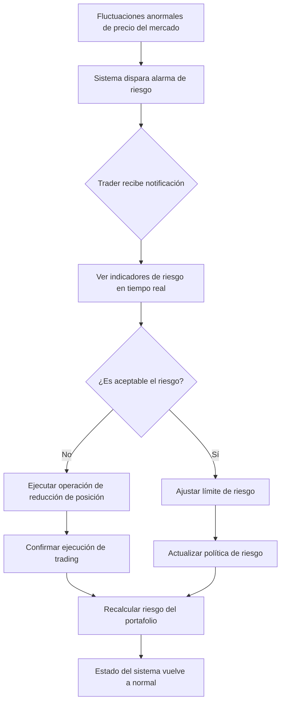
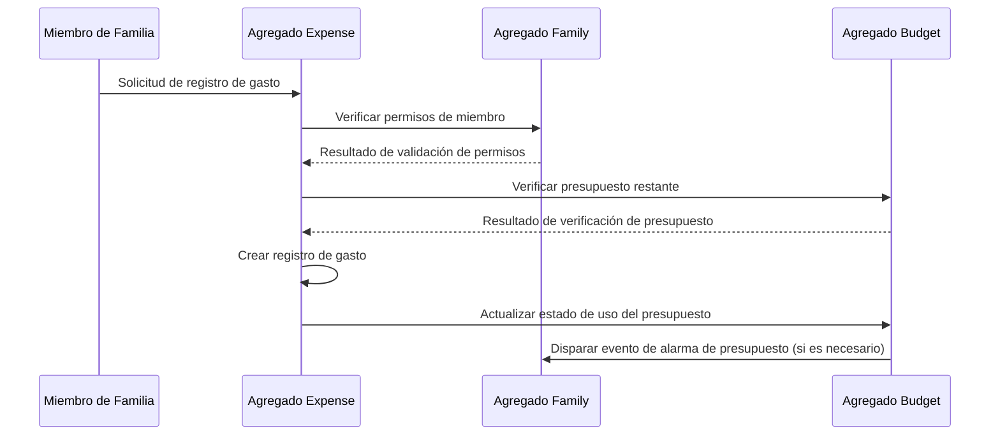
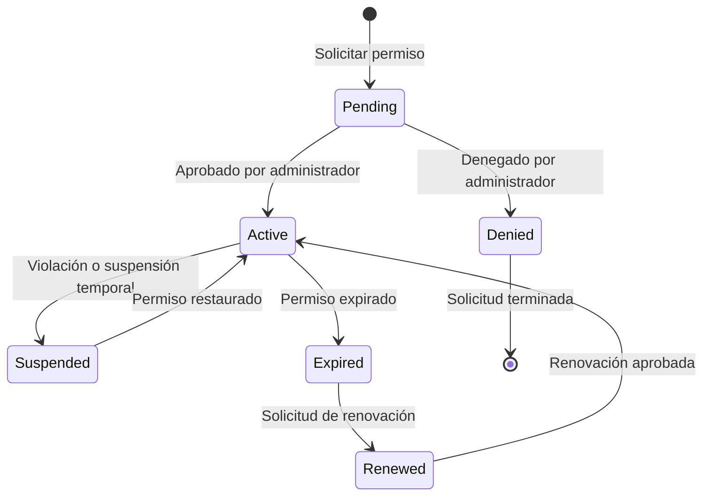

# Día 5 | Escenarios de Operación del Sistema del Usuario - Historia de Usuario y Flujo de Escenarios

Ayer, completamos el diseño de agregados de dominio y establecimos la estructura estática de la lógica de negocio. Pero los agregados son solo un marco conceptual, el valor real radica en **cómo los usuarios interactúan con estos conceptos de negocio**.

Hoy, necesitamos resolver un problema clave: **¿Cómo transformar los límites abstractos de los agregados en una experiencia de operación de usuario concreta?**

Esto no es solo una cuestión de habilidades de escritura de Historias de Usuario, sino una **transformación filosófica desde una perspectiva del sistema hacia una perspectiva del usuario**. Necesitamos hacer que la lógica de negocio compleja sea intuitiva y operable, al mismo tiempo que proporcionamos requisitos técnicos claros para la selección de servicios de AWS de mañana.

## La Ontología de la Historia de Usuario: De la Función a la Experiencia

### Redefiniendo el Valor de la Historia de Usuario

Las Historias de Usuario tradicionales a menudo se detienen en descripciones funcionales:

```
Como inversor, quiero ver mis tenencias para poder entender mi situación de inversión actual.
```

Pero una Historia de Usuario basada en el diseño de agregados DDD debería reflejar **valor de negocio y contexto operacional**:

```
Como trader profesional, necesito obtener un análisis de riesgo completo de mis tenencias en 30 segundos,
para poder tomar decisiones rápidas de aumentar o reducir mi posición cuando el mercado fluctúa,
asegurando que el riesgo de mi portafolio esté siempre dentro de un rango controlable.
```

Las diferencias son:

- **Concretización del rol**: De "inversor" a "trader profesional"
- **Restricción de tiempo**: Un requisito de rendimiento claro de 30 segundos
- **Objetivo de negocio**: Control de riesgo en lugar de solo visualización de información
- **Contexto operacional**: Toma de decisiones rápida bajo fluctuaciones del mercado

### La Arquitectura de Tres Capas de la Historia de Usuario

**Capa 1: Capa de Identificación de Rol** - Definición de rol basada en la propiedad de agregados
**Capa 2: Capa de Contexto Operacional** - Diseño de escena basado en cambios de estado de agregados
**Capa 3: Capa de Restricciones Técnicas** - Limitaciones del sistema basadas en requisitos no funcionales

Usemos los seis casos para un análisis en profundidad:

## Caso 1: Diseño de Historia de Usuario para el Sistema de Trading de Inversiones

### Sistema de Roles Basado en el Agregado Portfolio

Ayer, diseñamos el agregado Portfolio. Hoy, necesitamos definir roles de usuario basados en este agregado:

```typescript
// Revisión del agregado Portfolio
class Portfolio {
  private portfolioId: PortfolioId;
  private traderId: TraderId; // ← Base para la identificación de rol
  private holdings: Holdings[];
  private riskLimit: RiskLimit; // ← Encarnación de permisos de rol
}
```

**Matriz de Permisos de Rol**:

| Rol | Propiedad del Portafolio | Permisos de Operación | Requisitos Técnicos |
| --- | --- | --- | --- |
| **Trader Principal** | Propiedad completa | CRUD todas las operaciones | < 100ms respuesta |
| **Gestor de Riesgo** | Acceso de solo lectura | Ver + ajuste de riesgo | Monitoreo en tiempo real |
| **Oficial de Cumplimiento** | Acceso de auditoría | Ver + generación de informes | Acceso a datos históricos |
| **Administrador del Sistema** | Acceso técnico | Gestión de estado del sistema | Panel de operaciones |

### Descomposición de Épicas: De Capacidades de Agregados a Historias de Usuario

**Épica: Gestión de Portafolio**

Basándonos en las capacidades centrales del agregado Portfolio, descomponemos las siguientes Historias de Usuario:

**Historia 1: Visualización de Tenencias en Tiempo Real**

```
Como trader profesional,
necesito ver mi estado de tenencias en tiempo real y situación de ganancias/pérdidas en cualquier momento,
para poder evaluar rápidamente mi rendimiento de inversión actual y exposición al riesgo.

Criterios de Aceptación:
- La latencia de datos de tenencias no excede 5 segundos
- Incluye cálculo de ganancias/pérdidas en tiempo real
- Soporta visualización multi-moneda
- Puede agruparse por clase de activo o región

Restricciones Técnicas:
- Tiempo de respuesta de API < 100ms
- Soporta 2000+ consultas concurrentes
- Requisito de consistencia de datos: Consistencia fuerte
```

**Historia 2: Gestión de Límites de Riesgo**

```
Como trader profesional,
necesito establecer y ajustar los límites de riesgo de mi portafolio,
para poder asegurar que mi comportamiento de trading esté alineado con mi tolerancia al riesgo y estrategia de inversión.

Criterios de Aceptación:
- Puede establecer límite de posición total, límite de peso por acción y límite de concentración por industria
- Tiempo de efectividad de modificación < 1 minuto
- Proporciona advertencias en tiempo real para violaciones de límites de riesgo
- Soporta configuraciones de límites para diferentes períodos de tiempo (día/semana/mes)

Restricciones Técnicas:
- Los cambios de configuración requieren consistencia fuerte
- Latencia de cálculo de riesgo < 200ms
- Soporta reglas de riesgo complejas multi-dimensionales
```

**Historia 3: Ejecución Rápida de Trading**

```
Como trader profesional,
necesito ejecutar órdenes de trading inmediatamente cuando surgen oportunidades de mercado,
para poder aprovechar las ventajas de precio fugaces y maximizar los retornos de inversión.

Criterios de Aceptación:
- Tiempo desde colocación de orden hasta confirmación < 2 segundos
- Soporta órdenes de mercado y órdenes limitadas
- Verificación de riesgo automática antes del trading
- Proporciona mensajes de error claros en caso de fallo de ejecución

Restricciones Técnicas:
- Alta disponibilidad del sistema de trading > 99.99%
- Soporta volumen pico de trading de 5000 TPS
- Integración con APIs de corredores externos
```

### Diseño de Escenarios para Flujos Operacionales

**Escenario: Ajuste Rápido de Riesgo Bajo Fluctuaciones Anormales del Mercado**



**Conjunto de Historias de Usuario Correspondientes al Escenario**:

- Monitoreo y alarma de riesgo (ejecución automática en segundo plano)
- Visualización de indicadores de riesgo en tiempo real (operación de consulta)
- Trading rápido de reducción de posición (operación de escritura)
- Ajuste de política de riesgo (operación de configuración)

Cada operación corresponde a diferentes requisitos técnicos, proporcionando una base para la selección de servicios de AWS de mañana.

## Caso 2: Historia de Usuario Colaborativa para el Sistema Financiero Familiar

### Diseño de Roles Complejos Basado en Colaboración Multi-Agregado

Ayer, diseñamos tres agregados: Family, Budget y Expense. Hoy, necesitamos manejar los escenarios de colaboración entre ellos:

**Patrón de Historia de Usuario para Colaboración Multi-Rol**:

**Historia: Gestión Colaborativa del Presupuesto Familiar**

```
Como jefe de finanzas familiares,
necesito establecer permisos de gasto y límites de presupuesto para diferentes miembros de la familia,
para que mientras mantengo la transparencia financiera familiar, pueda asegurar que el comportamiento de gasto esté dentro de un rango controlable.

Actor Principal: Jefe de finanzas familiares
Actores Secundarios:
- Miembros de la familia (gestionados)
- Servicio de automatización del sistema (monitoreo de presupuesto)

Flujo Principal:
1. El jefe establece el presupuesto familiar mensual total (agregado Family)
2. Asigna límites de gasto y permisos de categoría a cada miembro (agregado Family → agregado Budget)
3. El sistema envía notificaciones de configuración de permisos a miembros relevantes (evento cross-agregado)
4. Los miembros comienzan a registrar gastos dentro de su ámbito autorizado (agregado Expense)
5. El sistema monitorea el uso del presupuesto en tiempo real (monitoreo del agregado Budget)
6. Notifica automáticamente al personal relevante cuando el presupuesto está cerca del límite (notificación impulsada por eventos)

Restricciones Técnicas:
- Consistencia fuerte de configuraciones de permisos (para evitar condiciones de carrera por sobregasto)
- Alta concurrencia de registro de gastos (múltiples miembros registrando al mismo tiempo)
- Monitoreo de presupuesto casi en tiempo real (latencia < 5 minutos es aceptable)
```

### Gestión de Estado de la Matriz de Permisos

**Diseño de Estado de Permisos del Agregado Family**:

```typescript
class FamilyMember {
  constructor(
    public memberId: MemberId,
    public role: FamilyRole, // ADMIN | MEMBER | CHILD
    public spendingLimit: Money, // Permiso de gasto
    public categories: Category[], // Categorías gastables
    public status: MemberStatus // ACTIVE | SUSPENDED | PENDING
  ) {}
}

enum FamilyRole {
  ADMIN = "ADMIN", // Puede establecer todas las reglas
  MEMBER = "MEMBER", // Puede registrar gastos, ver sus propios datos
  CHILD = "CHILD", // Permiso de gasto restringido
}
```

**Flujo de Verificación de Permisos Cross-Agregado**:



## Caso 3: Historia Impulsada por Datos para el Sistema de Monitoreo de Salud

### Escenarios de Estado Basados en Datos de Series Temporales

El sistema de monitoreo de salud tiene características de datos únicas: la coexistencia de **continuidad** y **anomalía**.

**Historia: Procesamiento Inteligente de Datos Anómalos**

```
Como usuario de monitoreo de salud,
necesito que el sistema identifique automáticamente mis datos de salud anómalos y proporcione sugerencias y advertencias correspondientes,
para poder ajustar mis hábitos de estilo de vida o buscar atención médica de manera oportuna para asegurar la mejora continua de mi salud.

Escenarios Complejos:
- Datos normales: Registro automático, análisis periódico
- Datos límite: El sistema recuerda al usuario confirmar
- Datos anómalos: Advertencia inmediata, acción sugerida
- Anomalía continua: Advertencia escalada, atención médica sugerida

Escenarios de Transición de Estado:
Normal → Límite → Confirmación de usuario o juicio automático del sistema → Normal/Anómalo
Anómalo → Monitoreo continuo → Anomalía persistente/Retorno a normal
Anomalía persistente → Atención médica sugerida → Pendiente/Procesado
```

**Desafíos Técnicos de Multi-Estado Concurrente**:

```typescript
// Gestión de estado del agregado HealthProfile
class HealthMetric {
  constructor(
    public metricType: MetricType,
    public currentValue: number,
    public status: HealthStatus,
    public trend: TrendAnalysis,
    public alertLevel: AlertLevel
  ) {}
}

enum HealthStatus {
  NORMAL = "NORMAL",
  BORDERLINE = "BORDERLINE",
  ABNORMAL = "ABNORMAL",
  CRITICAL = "CRITICAL",
}

enum AlertLevel {
  NONE = "NONE",
  INFO = "INFO", // Notificación de registro de datos
  WARNING = "WARNING", // Advertencia de valor límite
  URGENT = "URGENT", // Notificación urgente de valor anómalo
}
```

## Gestión de Roles: Arquitectura de Permisos Basada en Agregados

### Principios DDD para Diseño de Permisos

**Principio 1: La propiedad de agregados determina permisos básicos**

- El Owner del agregado Portfolio tiene control completo
- El Admin del agregado Family tiene derechos de gestión de miembros
- El Owner del agregado HealthProfile tiene derechos de control de datos

**Principio 2: Las operaciones cross-agregado requieren autorización explícita**

- Las operaciones en el agregado Order requieren autorización del agregado Portfolio
- La creación de un agregado Expense requiere autorización del agregado Family
- La creación de un agregado DeviceReading requiere autorización del agregado HealthProfile

**Principio 3: Los permisos de rol corresponden a la lógica de negocio**

```typescript
// Diseño de permisos basado en agregados
interface Permission {
  aggregateType: string;
  aggregateId: string;
  operations: Operation[];
  constraints: Constraint[];
}

interface Operation {
  type: "CREATE" | "READ" | "UPDATE" | "DELETE";
  fields?: string[]; // Permisos a nivel de campo
  conditions?: string[]; // Restricciones condicionales
}

// Configuración real de permisos
const traderPermissions: Permission[] = [
  {
    aggregateType: "Portfolio",
    aggregateId: "portfolio-123",
    operations: [
      { type: "READ", fields: ["*"] },
      { type: "UPDATE", fields: ["holdings", "riskLimit"] },
      { type: "CREATE", fields: ["tradeOrder"] },
    ],
    constraints: [
      "trading_hours_only",
      "risk_limit_check",
      "compliance_approval_for_large_orders",
    ],
  },
  {
    aggregateType: "Order",
    aggregateId: "*", // Puede operar en todas las órdenes creadas por uno mismo
    operations: [
      { type: "READ", fields: ["*"] },
      {
        type: "UPDATE",
        fields: ["status"],
        conditions: ["only_pending_orders"],
      },
    ],
    constraints: ["no_modification_after_submission"],
  },
];
```

### Gestión de Estado de Permisos Dinámicos

**Ciclo de Vida del Estado de Permisos**:



**Consideraciones para Implementación Técnica**:

- Efectividad en tiempo real de cambios de permisos (requisito de consistencia fuerte)
- Alto rendimiento de verificaciones de permisos (verificado en cada llamada API)
- Trazabilidad del historial de permisos (requisitos de cumplimiento y auditoría)

## Escenario de Estado: Escenarios Operacionales Impulsados por Estado de Agregados

### Metodología de Diseño para Escenarios de Estado

El cambio de estado de cada agregado producirá un escenario de operación de usuario correspondiente:

**Análisis de Escenario de Estado para el Sistema de Trading de Inversiones**:

```mermaid
graph TB
    subgraph "Estado del Agregado Portfolio"
        PS1[Portafolio Vacío] --> PS2[Portafolio Activo]
        PS2 --> PS3[Portafolio con Riesgo Excedido]
        PS3 --> PS2
        PS2 --> PS4[Portafolio en Liquidación]
        PS4 --> PS1
    end

    subgraph "Estado del Agregado Order"
        OS1[Borrador] --> OS2[Enviado]
        OS2 --> OS3[Ejecutando]
        OS2 --> OS4[Rechazado]
        OS3 --> OS5[Ejecutado]
        OS3 --> OS6[Parcialmente Ejecutado]
        OS6 --> OS5
    end

    subgraph "Coordinación Cross-Agregado"
        PS2 -.-> OS1: Crear trading
        OS5 -.-> PS2: Actualizar tenencias
        PS3 -.-> OS4: Rechazar trading de alto riesgo
    end
```

**Historia de Usuario para Cada Estado**:

**Portafolio Vacío → Activo**:

```
Historia: Inicializar Portafolio de Inversión
Como nuevo usuario, necesito establecer mis fondos iniciales y preferencia de riesgo,
para poder comenzar mis actividades de inversión.

Flujo Operacional:
1. Establecer monto de efectivo inicial
2. Configurar parámetros de límite de riesgo
3. Seleccionar una plantilla de estrategia de inversión
4. Confirmar inicialización del portafolio

Requisitos Técnicos:
- Atomicidad de la operación de inicialización
- Validación de razonabilidad de parámetros de riesgo
- Amigabilidad del flujo de guía del usuario
```

**Portafolio Activo → Portafolio con Riesgo Excedido**:

```
Historia: Manejo Automático de Exceso de Riesgo
Como sistema, necesito tomar medidas de protección automáticamente cuando el riesgo del portafolio se excede,
para poder reducir las pérdidas potenciales del usuario.

Flujo de Automatización:
1. Monitoreo en tiempo real de indicadores de riesgo del portafolio
2. Identificación de situaciones de exceso de riesgo
3. Suspensión de permisos de trading de alto riesgo
4. Notificación al usuario y personal de control de riesgo
5. Provisión de sugerencias de reducción de riesgo

Requisitos Técnicos:
- Cálculo de riesgo en tiempo real (< 30 segundos)
- Efecto inmediato de control de permisos
- Confiabilidad de notificaciones multi-canal
```

### Estrategia de Manejo para Escenarios de Estado Complejos

**Coordinación de Estado Multi-Rol en el Sistema Financiero Familiar**:

```
Escenario: Coordinación familiar cuando el presupuesto está casi agotado
Estado Inicial: El presupuesto familiar tiene 10% restante
Condición de Disparo: Cualquier miembro intenta registrar un gasto grande

Flujo de Transición de Estado:
1. El agregado Budget detecta que el presupuesto está ajustado
2. El sistema suspende los permisos de gasto de todos los miembros
3. Notifica al administrador de la familia para manejar el ajuste del presupuesto
4. El administrador elige: Aumentar el presupuesto O mantener el límite
5. El sistema actualiza los permisos de todos los miembros según la decisión
6. Reanuda el proceso de gasto normal

Desafíos Técnicos de Coordinación Cross-Agregado:
- Garantía de consistencia de estado multi-agregado
- Operación atómica de cambios de permisos
- Mecanismo de confiabilidad para recuperación de estado
```

## Proporcionando una Base de Requisitos para la Selección de Servicios de AWS

### Mapeo de Historias de Usuario a Restricciones Técnicas

A través del análisis de Historias de Usuario de hoy, hemos proporcionado requisitos técnicos claros para la selección de servicios de AWS de mañana:

**Requisitos de Operación en Tiempo Real de Alta Frecuencia** (Trading de Inversiones):

- Tiempo de respuesta de API: < 100ms
- Soporte de concurrencia: 2000+ TPS
- Requisito de disponibilidad: 99.99%
- Consistencia de datos: Consistencia fuerte

→ **A discutir mañana**: Criterios de selección para Lambda vs ECS

**Requisitos de Operación de Datos Colaborativos** (Finanzas Familiares):

- Concurrencia multi-usuario: Frecuencia media pero requiere manejo de conflictos
- Verificación de permisos: Requerida para cada operación
- Consistencia de datos: Consistencia eventual es aceptable
- Sensible al costo: Los usuarios familiares son sensibles al precio

→ **A discutir mañana**: Estrategia de optimización de costos para ALB + Auto Scaling

**Requisitos de Procesamiento Intensivo de Datos** (Monitoreo de Salud):

- Ingestión de datos: Flujo de datos continuo de dispositivos IoT
- Requisito de almacenamiento: Preservación a largo plazo de datos de series temporales
- Requisito de análisis: Análisis de tendencias y detección de anomalías
- Distribución geográfica: Los usuarios están distribuidos en diferentes regiones

→ **A discutir mañana**: Compensaciones de despliegue CDN + Multi-Región

### El Impacto de los Modos de Operación en Patrones Arquitectónicos

**Modo de operación síncrona** → Requiere servicios de baja latencia
**Modo de operación asíncrona** → Puede aceptar mayor latencia
**Modo de operación por lotes** → Requiere servicios de alto rendimiento
**Modo de colaboración en tiempo real** → Requiere mecanismo de sincronización de estado

Cada modo de operación corresponde a una combinación diferente de servicios de AWS, que será el núcleo de la discusión de mañana.

## Vista Previa de la Selección Técnica de Mañana

Basándonos en las Historias de Usuario y análisis de escenarios operacionales establecidos hoy, mañana tendremos una discusión en profundidad sobre:

### 🏗️ El Arte de las Compensaciones en la Selección de Servicios

**Lambda vs ECS**:

- ¿Cuándo elegir Serverless? ¿Cuándo elegir Container?
- Una matriz de selección basada en frecuencia de operación y tiempo de respuesta

**ALB vs API Gateway**:

- ¿Cómo afectan los diferentes patrones de carga a la elección?
- Comparación detallada y análisis de modelos de costos

**Despliegue Regional vs Global**:

- ¿Cómo afecta la distribución de usuarios a la estrategia arquitectónica?
- Casos de uso para CDN y edge computing

### 💰 Estrategias de Control de Costos

**Optimización de Tipo de Instancia**:

- Evaluación de riesgo de Spot Instances
- Estrategia de compromiso para Reserved Instances
- El balance elástico de On-Demand

**Niveles de Protección DDoS**:

- Requisitos de protección para diferentes escenarios de negocio
- La elección entre Shield Standard vs Shield Advanced

## Conclusiones del Diseño de Hoy

- **Las Historias de Usuario son la expresión concreta de las capacidades de agregados**: Una buena Historia refleja el valor de negocio del agregado
- **Los permisos de rol se diseñan basados en límites de agregados**: Los permisos técnicos deben corresponder a conceptos de negocio
- **Los escenarios de estado impulsan la experiencia operacional**: Cada transición de estado es un viaje del usuario
- **El contexto operacional determina la selección técnica**: Diferentes patrones de uso requieren diferentes estrategias técnicas

Recuerda: Lo que establecimos hoy no es una lista de características, sino una descripción completa de la experiencia operacional. Estas descripciones impulsarán directamente las decisiones de arquitectura técnica de mañana, asegurando que los servicios de AWS que elijamos puedan realmente satisfacer las necesidades operacionales del usuario.

---

> "Una Historia de Usuario no es una lista de características, sino un diseño de experiencia. Cada Historia es un escenario completo de interacción del usuario con los agregados del sistema, y los requisitos técnicos de estos escenarios determinarán nuestras elecciones arquitectónicas."
