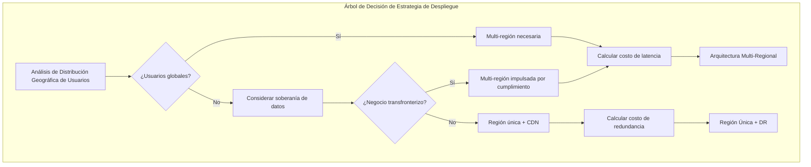

# Día 6 | El Arte del Control de Costos en las Compensaciones: Selección de Instancias en Arquitectura Cloud

Ayer, establecimos un marco completo de Historias de Usuario, transformando diseños de agregados abstractos en escenarios operacionales concretos. Cada Historia contiene restricciones técnicas claras: el sistema de trading de inversiones requiere respuesta <100ms, el sistema de finanzas familiares necesita manejar conflictos colaborativos, y el sistema de monitoreo de salud necesita procesar flujos de datos IoT.

El desafío central que enfrentamos hoy es: **¿Cómo lograr un control de costos óptimo mientras cumplimos con estos requisitos técnicos?**

Esto no es solo un problema técnico de selección de servicios, sino una **compensación filosófica entre el valor de negocio y el costo técnico**. Detrás de cada decisión arquitectónica yace una pregunta fundamental: ¿Cuánto estamos dispuestos a pagar por rendimiento, confiabilidad y flexibilidad?

## La Fundación Filosófica de las Compensaciones de Costos: El Principio de Maximización de Valor

### Redefiniendo la Connotación de "Costo"

En la arquitectura cloud, el costo no es solo la factura mensual, sino una **compensación integral de recursos multi-dimensionales**:

**Costos Directos**:

- Tarifas de recursos de cómputo (EC2, tiempo de ejecución de Lambda)
- Tarifas de almacenamiento (S3, EBS, transferencia de datos)
- Tarifas de red (CloudFront, transferencia entre regiones)

**Costos Implícitos**:

- Costos de desarrollo y mantenimiento (tiempo del equipo, gestión de complejidad)
- Costo de oportunidad (los beneficios potenciales de elegir el plan A sobre el plan B)
- Costo de riesgo (pérdida de disponibilidad, vulnerabilidades de seguridad, vendor lock-in)

**Costos de Tiempo**:

- Time to Market (velocidad de lanzamiento del producto)
- Acumulación de deuda técnica (el costo de futura refactorización)
- Curva de aprendizaje del equipo (tiempo de adaptación para nuevas tecnologías)

### Diseño de Modelo de Costos Basado en los Requisitos del Día 5

Mirando atrás a los tres patrones de requisitos típicos establecidos ayer, cada patrón corresponde a una sensibilidad de costos diferente:

**Sistema de Trading de Inversiones: Modelo de Prioridad de Rendimiento**

- Sensibilidad de costos: Baja (el costo de pérdida de rendimiento excede ampliamente el costo de infraestructura)
- Objetivo de optimización: Minimización de latencia > Maximización de disponibilidad > Control de costos
- Estrategia de compensación: Es mejor sobre-aprovisionar que tener rendimiento insuficiente

**Sistema de Finanzas Familiares: Modelo Sensible a Costos**

- Sensibilidad de costos: Alta (los usuarios tienen capacidad de pago limitada)
- Objetivo de optimización: Control de costos > Satisfacción de funciones básicas > Mejora de rendimiento
- Estrategia de compensación: Minimizar costos mientras se cumplen los requisitos básicos

**Sistema de Monitoreo de Salud: Modelo de Optimización Equilibrada**

- Sensibilidad de costos: Media (modelo B2B2C, necesita equilibrar experiencia de usuario y viabilidad del negocio)
- Objetivo de optimización: Estabilidad > Control de costos > Funciones avanzadas
- Estrategia de compensación: Alta inversión en funciones centrales, optimización de costos para funciones periféricas

## ECS vs Lambda: El Arte de las Compensaciones en Servicios de Cómputo

### Matriz de Decisión: Del Modo Operacional a la Selección de Servicios

Basándonos en el análisis de Historias de Usuario de ayer, hemos establecido una matriz detallada de selección de servicios de cómputo:

**Juicio de Aplicabilidad de Lambda**:

| Dimensión de Evaluación | Umbral de Ventaja de Lambda | Trading de Inversiones | Finanzas Familiares | Monitoreo de Salud |
| --- | --- | --- | --- | --- |
| Frecuencia de Ejecución | < 1000 veces/hora | ❌ Trading de alta frecuencia | ✅ Registro intermitente | ✅ Análisis periódico |
| Duración de Ejecución | < 15 minutos | ✅ Trading a nivel de milisegundos | ✅ Cálculo simple | ⚠️ Análisis de big data |
| Requisito de Concurrencia | < 1000 concurrentes | ❌ 2000+ TPS | ✅ Escala familiar | ✅ Número limitado de dispositivos |
| Gestión de Estado | Sin estado | ⚠️ Estado de trading complejo | ✅ Cada operación es independiente | ✅ Procesamiento de flujo de datos |
| Tolerancia a Cold Start | > 100ms | ❌ Requisito <50ms | ✅ Usuario puede esperar | ✅ Procesamiento en segundo plano |

**Juicio de Aplicabilidad de ECS**:

| Dimensión de Evaluación | Umbral de Ventaja de ECS | Trading de Inversiones | Finanzas Familiares | Monitoreo de Salud |
| --- | --- | --- | --- | --- |
| Ejecución Prolongada | > 1 hora | ✅ Operación en horas de mercado | ❌ Uso bajo demanda | ⚠️ Modo híbrido |
| Dependencias Complejas | Coordinación multi-servicio | ✅ Colaboración multi-agregado | ❌ Función única | ✅ Pipeline de datos IoT |
| Predictibilidad de Recursos | Carga estable | ✅ Horarios de trading fijos | ❌ Uso aleatorio | ⚠️ Crecimiento del número de dispositivos |
| Control de Costos | Alta utilización | ✅ Pago de usuario profesional | ❌ Sensible a costos | ⚠️ Economías de escala |

### Estrategia de Diseño de Arquitectura Híbrida

**Sistema de Trading de Inversiones: ECS Principal + Lambda Suplementario**

```yaml
# Servicio de Trading Central: ECS Fargate
TradingCore:
  Service: ECS Fargate
  Reason: "Operación continua, baja latencia, gestión de estado"
  Configuration:
    CPU: 2 vCPU
    Memory: 4 GB
    MinCapacity: 2
    MaxCapacity: 10
    TargetCPU: 70%

# Funciones Auxiliares: Lambda
TradingSupport:
  PriceAlert:
    Service: Lambda
    Reason: "Impulsado por eventos, ejecución intermitente"
    Memory: 512 MB
    Timeout: 30s

  ReportGeneration:
    Service: Lambda
    Reason: "No tiempo real, intensivo en cómputo"
    Memory: 3008 MB
    Timeout: 15 min
```

**Sistema de Finanzas Familiares: Estrategia Lambda-first**

```yaml
# Arquitectura Serverless Completa
FamilyFinance:
  ExpenseRecord:
    Service: Lambda
    Memory: 256 MB
    Timeout: 10s
    ConcurrentExecutions: 100

  BudgetCheck:
    Service: Lambda
    Memory: 512 MB
    Timeout: 30s

  MonthlyReport:
    Service: Lambda
    Memory: 1024 MB
    Timeout: 5 min

# Configuración de Optimización de Costos
CostOptimization:
  ProvisionedConcurrency: 0 # Cold start es aceptable
  ReservedCapacity: false # Patrón de uso no es fijo
  SpotInstances: N/A # Lambda gestiona automáticamente
```

**Sistema de Monitoreo de Salud: Arquitectura Híbrida por Capas**

```yaml
# Capa de Ingestión de Datos: Lambda
DataIngestion:
  IoTDataProcessor:
    Service: Lambda
    Memory: 256 MB
    Timeout: 1 min
    EventSource: IoT Core

# Capa de Análisis y Procesamiento: ECS
Analytics:
  TrendAnalysis:
    Service: ECS Fargate
    CPU: 1 vCPU
    Memory: 2 GB
    Schedule: "cron(0 2 * * ? *)" # Cada día a las 2 am

# Servicio de Alertas: Lambda
Alerting:
  AbnormalDetection:
    Service: Lambda
    Memory: 1024 MB
    Timeout: 30s
    EventSource: DynamoDB Streams
```

### Modelo de Cálculo de Costos

**Cálculo de Costos de Lambda**:

```
Costo Mensual = (Número de ejecuciones × Tiempo promedio de ejecución × Asignación de memoria × Precio unitario de Lambda) + (Número de solicitudes × Precio unitario de solicitud)

Ejemplo del Sistema de Finanzas Familiares:
- Número de ejecuciones: 100,000/mes
- Tiempo promedio de ejecución: 200ms
- Memoria: 256MB
- Costo: aproximadamente $2.4/mes
```

**Cálculo de Costos de ECS**:

```
Costo Mensual = (vCPU × Horas de CPU × Precio unitario de CPU) + (Memoria GB × Horas de memoria × Precio unitario de memoria)

Ejemplo del Sistema de Trading de Inversiones:
- Configuración: 2 vCPU, 4GB RAM
- Tiempo de ejecución: 12 horas/día (horas de trading)
- Costo mensual: aproximadamente $58/mes
```

## Estrategia ALB: La Inteligencia de Costos del Balanceo de Carga

### La Lógica de Negocio de la Selección de Balanceador de Carga

Diferentes características del sistema determinan diferentes estrategias de balanceo de carga:

**Application Load Balancer vs Network Load Balancer**:

| Comparación de Características | ALB | NLB | Trading de Inversiones | Finanzas Familiares | Monitoreo de Salud |
| --- | --- | --- | --- | --- | --- |
| Rendimiento de Latencia | ~100ms | ~1ms | ✅ NLB necesario | ❌ ALB suficiente | ❌ ALB suficiente |
| Funcionalidad de Capa 7 | Soportado | No soportado | ✅ Enrutamiento necesario | ✅ Enrutamiento necesario | ⚠️ Requisito básico |
| Terminación TLS | Soportado | Soportado | ✅ Imprescindible | ✅ Imprescindible | ✅ Imprescindible |
| Costo | Mayor | Menor | ✅ Prioridad de rendimiento | ❌ Sensible a costos | ⚠️ Consideración equilibrada |

**Configuración ALB para el Sistema de Trading de Inversiones**:

```yaml
TradingALB:
  Type: Application Load Balancer
  Scheme: internet-facing

  Listeners:
    HTTPS:443:
      DefaultAction: forward-to-trading-core
      Rules:
        - Condition: path-pattern("/api/market/*")
          Action: forward-to-market-data-service
          Priority: 100
        - Condition: path-pattern("/api/orders/*")
          Action: forward-to-order-service
          Priority: 200

  TargetGroups:
    trading-core:
      Protocol: HTTP
      Port: 8080
      HealthCheck:
        Path: /health
        Interval: 10s
        Timeout: 5s
        HealthyThreshold: 2

  # Configuración de Optimización de Costos
  CrossZoneLoadBalancing: true # Distribuir tráfico para evitar puntos calientes
  DeletionProtection: true # Prevenir eliminación accidental
  AccessLogs:
    Enabled: true
    S3Bucket: trading-alb-logs
    # Analizar comportamiento del usuario para optimizar estrategias de enrutamiento
```

**ALB optimizado en costos para el Sistema de Finanzas Familiares**:

```yaml
FamilyFinanceALB:
  Type: Application Load Balancer
  Scheme: internet-facing

  # Estrategia de Optimización de Costos
  IdleTimeout: 60s # Reducir tiempo de conexión

  TargetGroups:
    serverless-backend:
      Protocol: HTTP
      Port: 80
      TargetType: lambda # Integración directa con Lambda
      HealthCheck:
        Path: /health
        Interval: 30s # Reducir frecuencia de verificación de salud

  # Configuración de Ahorro de Dinero
  AccessLogs:
    Enabled: false # Deshabilitar logs para ahorrar costos de almacenamiento

  SecurityGroups:
    - family-finance-sg
    # Principio de menor privilegio para reducir costos de riesgo de seguridad
```

### Control de Costos de Auto Scaling

**Escalado Inteligente Basado en Target Tracking**:

```yaml
AutoScalingPolicy:
  Investment Trading System:
    MetricType: ALBRequestCountPerTarget
    TargetValue: 1000 # 1000 RPS por instancia
    ScaleOutCooldown: 60s # Escalado rápido para manejar tráfico repentino
    ScaleInCooldown: 300s # Escalado lento para evitar oscilaciones

  Family Finance System:
    MetricType: CPUUtilization
    TargetValue: 50% # Objetivo de CPU más bajo para controlar costos
    ScaleOutCooldown: 300s # Escalado más lento, usuarios pueden esperar
    ScaleInCooldown: 600s # Escalado más lento para evitar ajustes frecuentes
```

## Protección DDoS: Cálculo ROI de Inversión en Seguridad

### Análisis de Valor de Negocio de Niveles de Protección

Diferentes sistemas tienen vulnerabilidades y tolerancia a pérdidas por ataques DDoS muy diferentes:

**Selección de Nivel de Protección AWS Shield**:

| Nivel de Protección | Costo | Trading de Inversiones | Finanzas Familiares | Monitoreo de Salud |
| --- | --- | --- | --- | --- |
| Shield Standard | Gratis | ❌ Insuficiente | ✅ Básicamente suficiente | ⚠️ Depende de la escala |
| Shield Advanced | $3000/mes | ✅ Inversión necesaria | ❌ Demasiado caro | ⚠️ B2B puede considerar |

**Sistema de Trading de Inversiones: Shield Advanced + WAF**

```yaml
DDoSProtection:
  Shield: Advanced
  Cost: $3000/month

  Justification: |
    Pérdida potencial de una interrupción de trading de 1 hora:
    - Pérdida de trading de usuario: promedio $50K
    - Pérdida de reputación de marca: incuantificable pero enorme
    - Riesgo de cumplimiento regulatorio: puede enfrentar sanciones regulatorias

    Costo de protección vs. pérdida de riesgo = 1:15+ ROI

  WAF Rules:
    - RateLimiting: 100 req/min por IP
    - GeoBlocking: Restringir regiones de alto riesgo
    - SQLInjection: Detección y bloqueo automático
    - CustomRules: Detección de anomalías basada en patrones de trading
```

**Sistema de Finanzas Familiares: Shield Standard + CloudFlare**

```yaml
DDoSProtection:
  Shield: Standard (Gratis)
  CloudFlare: Pro ($20/month)

  Justification: |
    Bajo riesgo de ataque para usuarios familiares, pérdidas limitadas:
    - Valor de datos de usuario individual: relativamente bajo
    - Impacto de tiempo de inactividad: usuarios pueden usarlo después
    - Motivo de ataque: baja probabilidad de ataques dirigidos

    El control de costos es una prioridad, la protección básica es suficiente

  Protection Strategy:
    - Proxy de CloudFlare para ocultar la IP real
    - Rate Limiting básico
    - Browser Integrity Check
    - Challenge Passage para tráfico sospechoso
```

**Sistema de Monitoreo de Salud: Estrategia de Protección por Capas**

```yaml
DDoSProtection:
  Core Services: Shield Standard
  API Endpoints: WAF ($1-5/month)
  IoT Endpoints: IoT Device Defender

  Risk Assessment: |
    Los datos médicos son sensibles pero la superficie de ataque está dispersa:
    - Gran número de dispositivos IoT, bajo valor por punto
    - Los datos de salud del usuario son sensibles y necesitan protección
    - Los clientes B2B tienen requisitos de estabilidad

    Nivel medio de protección, enfocándose en proteger APIs centrales
```

## Despliegue Regional: Consideraciones de Costos de Distribución Geográfica

### Marco de Decisión para Despliegue Multi-Regional

**Compensaciones entre Región Única y Multi-Regional**:



**Sistema de Trading de Inversiones: Multi-Regional de Baja Latencia**

```yaml
RegionalDeployment:
  Primary: us-east-1      # Este de EE.UU. (mayor volumen de trading)
  Secondary: eu-west-1    # Usuarios europeos
  AsiaSpecific: ap-northeast-1  # Horas de mercado asiático

  Architecture:
    - Active-Active: Servicios de trading centrales
    - Cross-Region Replication: DynamoDB Global Tables
    - Regional Market Data: Fuentes de datos localizadas

  Cost Impact:
    Infrastructure: +200% (3 regiones)
    Data Transfer: $0.02/GB entre regiones
    Latency Benefit:
      - US-EU: 150ms → 20ms
      - US-Asia: 200ms → 30ms

    Business Justification:
      Cada milisegundo de mejora de latencia = 0.1% aumento en tasa de éxito de trading
      Volumen de trading anual de $1B × 0.3% aumento = $3M ingresos
      Aumento de costo de infraestructura: $200K/año
      ROI: 15:1
```

**Sistema de Finanzas Familiares: Estrategia Región Única + CDN**

```yaml
RegionalDeployment:
  Primary: us-east-1      # Región única para reducir costos

  Global Access:
    CloudFront: CDN global para recursos estáticos
    Route53: Enrutamiento DNS inteligente

  Cost Optimization:
    Regional: $100/month
    vs Multi-Region: $400/month

    CDN: $20/month
    Total Savings: 70%

    Latency Impact:
    - Static Assets: Global <100ms (CDN)
    - API Calls: 100-300ms (aceptable)

    Business Justification:
    Las operaciones de finanzas familiares no son en tiempo real, la latencia es aceptable
    Ahorro de costos > beneficio marginal de mejora de rendimiento
```

**Sistema de Monitoreo de Salud: Estrategia Regional por Capas**

```yaml
RegionalDeployment:
  CoreServices:
    Primary: us-east-1
    Disaster Recovery: us-west-2

  DataProcessing:
    Regional: Procesar datos IoT localmente
    - us-east-1: Dispositivos de Norteamérica
    - eu-west-1: Dispositivos europeos
    - ap-southeast-1: Dispositivos de Asia-Pacífico

  Cost Model:
    Core (Single Region): $500/month
    Regional Processing: $200/month por región
    Total: $1100/month vs $1500/month (Multi-Regional Completo)

    Performance Benefit:
    Latencia de procesamiento de datos IoT: 200ms → 50ms
    Impacto: Respuesta de dispositivo más oportuna, experiencia de usuario mejorada
```

## CDN y Edge Computing: Optimización de Costos de Entrega de Contenido

### Análisis ROI de Estrategia CDN

**Estrategia de Configuración de CloudFront**:

**Sistema de Trading de Inversiones: CDN de Prioridad de Rendimiento**

```yaml
CloudFrontDistribution:
  PriceClass: All Regions # Mejor rendimiento global

  CacheBehaviors:
    "/api/static/*":
      TTL: 3600s # Caché largo para datos estáticos
      Compress: true

    "/api/market/*":
      TTL: 5s # Caché corto para datos de mercado
      Headers:
        - Authorization # Contenido personalizado

    "/api/orders/*":
      CachePolicy: CachingDisabled # Sin caché para datos de trading
      OriginRequestPolicy: CORS-S3Origin

  Cost Analysis:
    Data Transfer: $0.085/GB (Tier 1)
    Requests: $0.0075/10K requests
    Monthly: ~$500 (alto tráfico)

    Performance Gain:
      - Recursos estáticos: 200ms → 20ms
      - Datos de mercado: 100ms → 30ms
      - Mejora significativa en experiencia de usuario, soportando precios premium
```

**Sistema de Finanzas Familiares: CDN Optimizado en Costos**

```yaml
CloudFrontDistribution:
  PriceClass: US_Europe_Asia  # Excluir regiones caras

  CacheBehaviors:
    "/static/*":
      TTL: 86400s            # Caché largo de 24 horas
      Compress: true

    "/api/*":
      TTL: 300s              # Caché medio de 5 minutos

  Cost Analysis:
    Data Transfer: ~$20/month (bajo tráfico)
    Main savings: Reducir carga del servidor de origen

    Origin Server Savings:
    - Tasa de acierto de caché: 80%
    - Reducción de carga del servidor: 80%
    - Reducción de recuento de ejecución de Lambda: 80%
    - Ahorro mensual: $60

    Net Savings: $40/month
```

### Escenarios de Aplicación de Edge Computing

**Casos de Uso para Lambda@Edge**:

```yaml
EdgeComputing:
  Investment Trading System:
    Use Case: Autenticación y autorización de usuario
    Function:
      Runtime: Node.js 14
      Memory: 128 MB
      Timeout: 5s

    Business Value:
      - Validación local, reduciendo latencia en 50ms
      - Reducir carga del servicio central
      - Mejorar experiencia de usuario global

  Family Finance System:
    Use Case: Pruebas A/B y feature flags
    Function:
      Runtime: Python 3.9
      Memory: 128 MB
      Timeout: 3s

    Business Value:
      - Personalización de contenido dinámico
      - Bajo costo para experimentos y optimización
      - No necesita desplegar cambios del servicio central
```

## Híbrido Local-Cloud: Compensaciones de Costos de Cloud Híbrida

### Escenarios de Aplicación de Arquitectura Híbrida

**Sistema de Trading de Inversiones: Localización de Datos Clave**

```yaml
HybridArchitecture:
  Local Components:
    - Motor de ejecución de trading (requisito de baja latencia)
    - Datos sensibles de clientes (requisito de cumplimiento)
    - Cálculo de control de riesgo en tiempo real (datos no pueden salir del país)

  Cloud Components:
    - Análisis de datos históricos (requisito de cómputo elástico)
    - Interfaz de usuario (acceso global)
    - Recuperación ante desastres (respaldo fuera del sitio)

  Data Sync Strategy:
    - Tiempo real: Sincronización de estado de trading
    - Por lotes: ETL de datos históricos
    - Impulsado por eventos: Replicación de eventos de negocio

  Cost Analysis:
    Local Infrastructure: $50K/año
    Cloud Services: $30K/año
    vs Pure Cloud: $80K/año

    Savings: El costo total es el mismo, pero el cumplimiento y rendimiento mejoran
```

**Sistema de Monitoreo de Salud: Procesamiento IoT de Edge**

```yaml
HybridArchitecture:
  Edge Components:
    - IoT Gateway (preprocesamiento de datos)
    - Caché local (tolerancia a interrupción de red)
    - Alertas de emergencia (respuesta en tiempo real)

  Cloud Components:
    - Análisis de big data (aprendizaje automático)
    - Almacenamiento a largo plazo (seguimiento histórico)
    - Dashboard de usuario (acceso remoto)

  Cost Benefits:
    - Reducir costos de carga de datos en 90%
    - Mejorar disponibilidad del sistema en 99%
    - Reducir demanda de cómputo en cloud en 70%
```

## Preparándose para el Blueprint Arquitectónico de Mañana

### Documentación de Decisiones de Selección de Servicios

A través del análisis detallado de hoy, hemos establecido un registro completo de decisiones de selección de servicios para cada sistema:

**Plantilla de Architecture Decision Record (ADR)**:

```markdown
## Architecture Decision Record (ADR)

### ADR-001: Selección de Servicio de Cómputo para el Sistema de Trading de Inversiones

**Estado**: Aceptado
**Fecha**: 2024-09-04
**Decisores**: Equipo de Arquitectura

**Contexto**:
Basándonos en el análisis de Historias de Usuario del Día 5, el sistema de trading de inversiones requiere:

- Tiempo de respuesta de API < 100ms
- Soporte para concurrencia de 2000+ TPS
- Requisito de disponibilidad de 99.99%

**Opciones Consideradas**:

1. Lambda Puro
2. ECS Puro
3. Híbrido (ECS + Lambda)

**Decisión**: Arquitectura Híbrida

- Trading Central: ECS Fargate
- Funciones de Soporte: Lambda

**Razonamiento**:

- ECS proporciona operación continua y baja latencia
- Lambda maneja funciones auxiliares impulsadas por eventos
- El costo es alto pero los beneficios de rendimiento son significativos

**Consecuencias**:

- Complejidad de desarrollo media
- Las operaciones requieren dos sistemas
- El costo es controlable y el rendimiento es óptimo

**Cumplimiento**:
Cumple con los requisitos no funcionales establecidos en el Día 3
Soporta la experiencia operacional de Historia de Usuario diseñada en el Día 5
```

### Análisis Cuantitativo del Modelo de Costos

**Resumen de Comparación de Costos de los Tres Sistemas**:

| Sistema | Costo Mensual | Impulsor Principal | Estrategia de Optimización de Costos |
| --- | --- | --- | --- |
| Trading de Inversiones | $2,800 | ECS+Shield Advanced | El ROI de rendimiento justifica la inversión |
| Finanzas Familiares | $150 | Lambda+ALB | Control estricto de costos, funcionalidad es suficiente |
| Monitoreo de Salud | $800 | Arquitectura híbrida + multi-región | Elasticidad bajo demanda, optimización por capas |

### Elementos de Preparación para el Blueprint Arquitectónico de Mañana

El análisis de selección de servicios de hoy afectará directamente el diseño arquitectónico de mañana:

**Stack Tecnológico Determinado**:

- Capa de cómputo: La elección entre ECS y Lambda está clara
- Capa de red: La configuración ALB/NLB está determinada
- Capa de seguridad: El nivel de protección DDoS está seleccionado
- Capa de distribución: La estrategia de región y CDN está formulada

**Preparación de Patrón Arquitectónico**:

- La base para elegir entre monolito y microservicios
- El modo de comunicación síncrono vs asíncrono
- El diseño de impulsado por eventos vs impulsado por solicitudes
- La compensación entre Clean Architecture vs arquitectura por capas

**Requisitos No Funcionales Cumplidos**:

- Rendimiento: La selección de servicios ha optimizado latencia y throughput
- Confiabilidad: Las estrategias multi-regionales y de respaldo están determinadas
- Seguridad: DDoS y control de acceso están configurados
- Costo: Cada elección tiene un análisis ROI claro

## Vista Previa del Diseño Arquitectónico de Mañana

Basándonos en la base de selección de servicios establecida hoy, mañana tendremos una discusión en profundidad sobre:

### La Filosofía de Elegir Patrones Arquitectónicos

- Escenarios de aplicación de Clean Architecture vs Hexagonal Architecture
- Decisiones impulsadas por negocio para microservicios vs arquitectura monolítica
- Compensaciones de diseño de Event-Driven vs Request-Response
- Evaluación de inversión de complejidad de CQRS + Event Sourcing

### El Arte de Dividir Límites del Sistema

- Descomposición de microservicios basada en límites de agregados
- Diseño de estrategia de enrutamiento de API Gateway
- Selección de protocolo para comunicación entre servicios
- Estrategia de manejo de consistencia de datos

### Diseño de Sistema para Observabilidad

- Diseño jerárquico de métricas de monitoreo
- Estrategia de implementación para rastreo distribuido
- Sistema de agregación y análisis de logs
- Mecanismo de alertas y respuesta a incidentes

## La Sabiduría de Hoy sobre Compensaciones

- **El costo no es solo dinero**: Tiempo, complejidad y riesgo son todas dimensiones de costo
- **El valor de negocio impulsa la selección técnica**: Cada decisión arquitectónica debe tener un ROI claro
- **No hay bala de plata**: Diferentes sistemas requieren diferentes estrategias de optimización
- **Las decisiones necesitan ser documentadas**: Los registros de decisiones arquitectónicas son un activo importante para el equipo

Recuerda: Lo que establecimos hoy no es la solución óptima, sino la solución más adecuada bajo restricciones específicas. A medida que el negocio se desarrolla y la tecnología evoluciona, estas decisiones necesitan ser continuamente evaluadas y ajustadas.

---

> "El diseño arquitectónico es un problema de optimización bajo restricciones. No estamos buscando una solución perfecta, sino buscando la elección que maximice los beneficios bajo las condiciones actuales. Cada compensación es un juicio filosófico: qué estamos sacrificando por qué."
