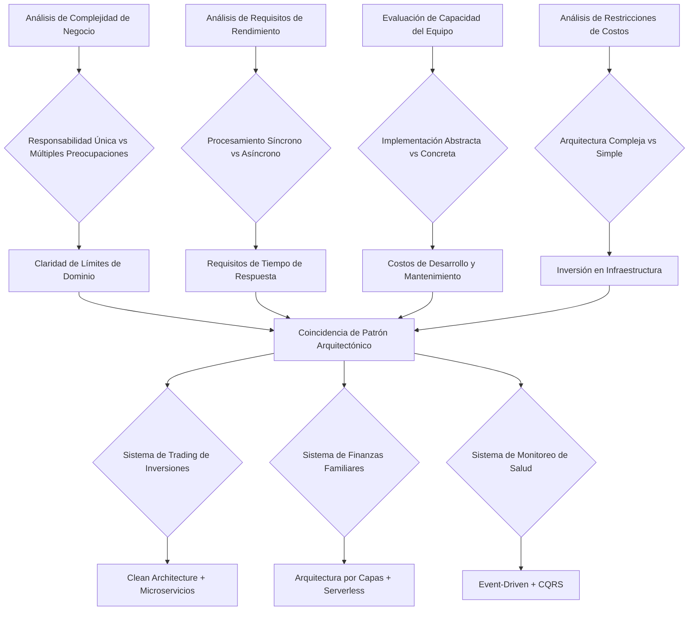
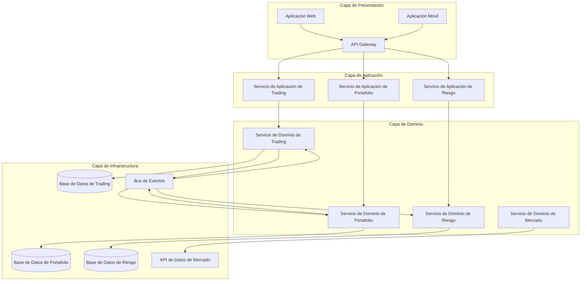
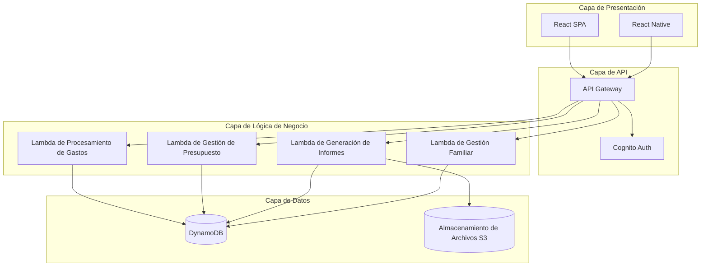
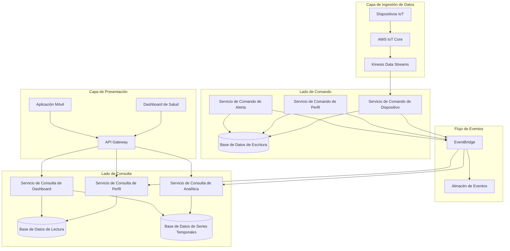
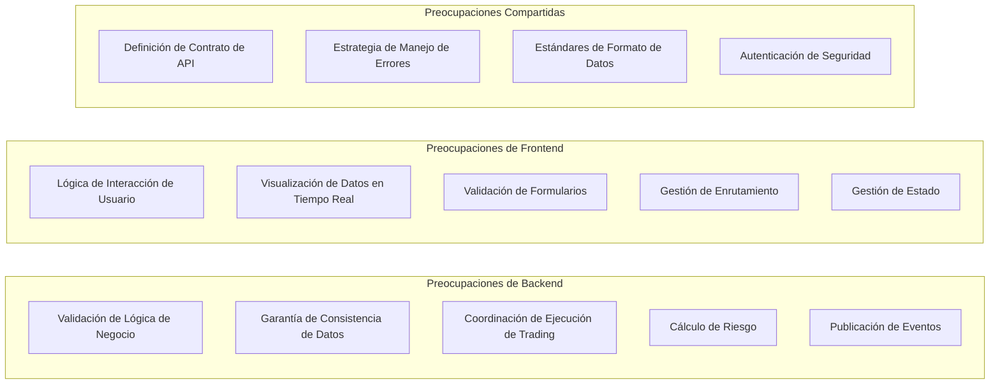

# Día 7 | Dibujando tu Primer Blueprint del Sistema: Selección y Diseño de Arquitectura

Después de seis días de análisis en profundidad, hemos establecido una base de diseño completa: desde el pensamiento filosófico hasta el modelado de dominio, desde las necesidades del usuario hasta la selección de servicios. El problema central a resolver hoy es:

**¿Cómo integrar todos estos análisis en un blueprint de arquitectura de sistema ejecutable?**

Esto no es solo un problema técnico de dibujar diagramas, sino un asunto de **ingeniería de sistemas desde el pensamiento abstracto hasta la implementación concreta**. Cada decisión arquitectónica debe tener una lógica deductiva clara, y cada elección tecnológica debe servir a los objetivos de negocio.

## Una Metodología Sistemática para la Selección de Arquitectura

### Lógica Deductiva de Requisitos a Patrones Arquitectónicos

Basándonos en el análisis de los últimos seis días, hemos establecido un **marco de decisión para seleccionar patrones arquitectónicos**:



### Matriz de Evaluación de Adaptabilidad de Arquitectura

Basándonos en el análisis previo de Historias de Usuario y selección de servicios, creamos una evaluación de adaptabilidad para los tres sistemas:

| Dimensión de Evaluación | Trading de Inversiones | Finanzas Familiares | Monitoreo de Salud | Peso |
| ----------------------------- | ------------------ | -------------- | ----------------- | ------ |
| **Complejidad de Negocio** | 9/10 | 4/10 | 7/10 | 25% |
| **Requisitos de Rendimiento** | 10/10 | 3/10 | 6/10 | 30% |
| **Requisitos de Consistencia** | 10/10 | 5/10 | 7/10 | 20% |
| **Recursos de Desarrollo** | 8/10 | 3/10 | 6/10 | 15% |
| **Tolerancia a Complejidad de Mantenimiento** | 8/10 | 2/10 | 5/10 | 10% |

Basándonos en esta evaluación, podemos deducir el patrón arquitectónico más adecuado para cada sistema.

Para la conveniencia de presentación de datos en la serie Iron Man, se utiliza Mermaid para representación codificada. La ventaja de Mermaid es que permite el control de versiones de archivos y ajustes a cambios de dominio usando Git. Sin embargo, hay muchas herramientas en el mercado para visualización de diseño de sistemas y narrativa para comprensión compartida. draw.io también es una buena opción.

## Sistema de Trading de Inversiones: Diseño Clean Architecture + Microservicios

### Proceso de Deducción de Selección de Arquitectura

**¿Por qué elegir Clean Architecture?**

Basándonos en el diseño de agregados del Día 4 y el análisis de Historias de Usuario del Día 5:

1. **Alta Complejidad de Negocio**: Múltiples agregados como Portfolio, Order y Risk requieren límites claros.
2. **Requisitos de Prueba Estrictos**: Cada función en un sistema financiero debe tener cobertura de prueba completa.
3. **Cambios Frecuentes de Negocio**: Las políticas regulatorias y reglas de mercado cambian a menudo, requiriendo una base arquitectónica estable.

**¿Por qué elegir Microservicios?**

Basándonos en el análisis de selección de servicios del Día 6:

1. **Necesidades de Escalado Independiente**: La ejecución de trading, el cálculo de riesgo y los datos de mercado tienen características de rendimiento diferentes.
2. **Autonomía del Equipo**: Diferentes dominios de negocio pueden ser desarrollados y desplegados independientemente por equipos especializados.
3. **Aislamiento de Fallos**: El fallo de un solo servicio no debe afectar todo el sistema de trading.

### Diseño de Arquitectura Completo



### Diseño de Límites de Microservicios

Basándonos en los límites de agregados del Día 4, diseñamos la descomposición de microservicios:

**Servicio de Trading**

```yaml
Responsabilidad: Gestiona el ciclo de vida de las órdenes de trading.
Agregados: Order, Trade
APIs:
  - POST /orders # Crear una orden de trading
  - GET /orders/{id} # Consultar estado de orden
  - PUT /orders/{id}/cancel # Cancelar una orden

Propiedad de Datos:
  - Datos de órdenes
  - Registros de ejecución de trading
  - Configuraciones de interfaz de mercado

Eventos Publicados:
  - OrderCreated
  - OrderExecuted
  - OrderCancelled

Eventos Consumidos:
  - PortfolioValidated
  - RiskAssessed
```

**Servicio de Portafolio**

```yaml
Responsabilidad: Gestiona el estado del portafolio y las tenencias.
Agregados: Portfolio, Holdings
APIs:
  - GET /portfolios/{id} # Consultar detalles del portafolio
  - PUT /portfolios/{id}/holdings # Actualizar tenencias
  - POST /portfolios/{id}/validate # Validar capacidad de trading

Propiedad de Datos:
  - Información básica del portafolio
  - Datos detallados de tenencias
  - Registros de saldo de efectivo

Eventos Publicados:
  - PortfolioValidated
  - PortfolioUpdated
  - HoldingsChanged

Eventos Consumidos:
  - OrderExecuted
  - RiskLimitChanged
```

**Servicio de Riesgo**

```yaml
Responsabilidad: Evaluación de riesgo y gestión de límites.
Agregados: RiskProfile, RiskMetric
APIs:
  - POST /risk/assess # Evaluación de riesgo en tiempo real
  - GET /risk/profiles/{id} # Consultar perfil de riesgo
  - PUT /risk/limits/{id} # Actualizar límites de riesgo

Propiedad de Datos:
  - Configuraciones de parámetros de riesgo
  - Métricas históricas de riesgo
  - Registros de configuración de límites

Eventos Publicados:
  - RiskAssessed
  - RiskLimitExceeded
  - RiskLimitChanged

Eventos Consumidos:
  - PortfolioUpdated
  - MarketVolatilityChanged
```

### Detalles de Implementación de Clean Architecture

**Implementación de Inversión de Dependencias**:

```typescript
// Capa de Dominio - Lógica de negocio pura
export class Portfolio {
  constructor(
    private portfolioId: PortfolioId,
    private holdings: Holdings[],
    private cashBalance: Money
  ) {}

  validateTrade(
    order: TradeOrder,
    riskAssessment: RiskAssessment
  ): ValidationResult {
    // Lógica de negocio pura, sin dependencia de ninguna tecnología externa
    if (!this.hasSufficientFunds(order)) {
      return ValidationResult.failed("Fondos insuficientes");
    }

    if (riskAssessment.exceedsLimit()) {
      return ValidationResult.failed("Límite de riesgo excedido");
    }

    return ValidationResult.success();
  }
}

// Capa de Aplicación - Coordinación de casos de uso
export class ValidateTradeUseCase {
  constructor(
    private portfolioRepository: PortfolioRepository, // Interfaz, no implementación
    private riskService: RiskService, // Interfaz, no implementación
    private eventPublisher: EventPublisher // Interfaz, no implementación
  ) {}

  async execute(command: ValidateTradeCommand): Promise<ValidationResult> {
    // Coordina objetos de dominio, no contiene lógica de negocio
    const portfolio = await this.portfolioRepository.findById(
      command.portfolioId
    );
    const riskAssessment = await this.riskService.assess(
      portfolio,
      command.order
    );

    const result = portfolio.validateTrade(command.order, riskAssessment);

    if (result.isValid) {
      await this.eventPublisher.publish(
        new TradeValidatedEvent(command.portfolioId, command.order)
      );
    }

    return result;
  }
}

// Capa de Infraestructura - Implementación técnica
export class DynamoDBPortfolioRepository implements PortfolioRepository {
  constructor(private dynamoClient: DynamoDB.DocumentClient) {}

  async findById(portfolioId: PortfolioId): Promise<Portfolio> {
    const params = {
      TableName: "Portfolios",
      Key: { portfolioId: portfolioId.value },
    };

    const result = await this.dynamoClient.get(params).promise();
    return this.mapToDomain(result.Item);
  }
}
```

## Sistema de Finanzas Familiares: Diseño Arquitectura por Capas + Serverless

### Proceso de Deducción de Selección de Arquitectura

**¿Por qué elegir una Arquitectura por Capas?**

1. **Lógica de Negocio Relativamente Simple**: Principalmente operaciones CRUD y validación de reglas de negocio básicas.
2. **Recursos de Desarrollo Limitados**: Necesidad de desarrollo rápido y time-to-market, con un equipo pequeño.
3. **Sensible a Costos de Mantenimiento**: El mantenimiento a largo plazo requiere una arquitectura simple y fácil de entender.

**¿Por qué elegir Serverless?**

Basándonos en el análisis de costos del Día 6:

1. **Patrones de Uso Irregulares**: Los patrones de acceso de usuarios familiares varían mucho.
2. **Prioridad de Control de Costos**: El modelo de pago por uso de Lambda se ajusta mejor a los requisitos de costos.
3. **Operaciones Simplificadas**: No hay necesidad de gestionar servidores, reduciendo la complejidad operacional.

### Diseño de Arquitectura Simplificada



### Implementación de Arquitectura por Capas

**Estructura Simplificada de Tres Capas**:

```typescript
// Capa de Presentación - Manejador de API
export const expenseHandler = async (
  event: APIGatewayEvent
): Promise<APIGatewayResponse> => {
  try {
    const expenseData = JSON.parse(event.body);

    // Llamar directamente a la capa de lógica de negocio
    const result = await ExpenseService.createExpense(expenseData);

    return {
      statusCode: 200,
      body: JSON.stringify(result),
    };
  } catch (error) {
    return {
      statusCode: 500,
      body: JSON.stringify({ error: error.message }),
    };
  }
};

// Capa de Lógica de Negocio - Capa de servicio simplificada
export class ExpenseService {
  static async createExpense(expenseData: ExpenseData): Promise<Expense> {
    // Validación de lógica de negocio básica
    const validation = await this.validateExpense(expenseData);
    if (!validation.isValid) {
      throw new Error(validation.errors.join(", "));
    }

    // Verificar límite de presupuesto
    const budgetCheck = await BudgetService.checkLimit(
      expenseData.familyId,
      expenseData.category,
      expenseData.amount
    );

    if (!budgetCheck.allowed) {
      throw new Error("Límite de presupuesto excedido");
    }

    // Guardar datos
    const expense = await ExpenseRepository.save(expenseData);

    // Actualizar uso del presupuesto
    await BudgetService.updateUsage(
      expenseData.familyId,
      expenseData.category,
      expenseData.amount
    );

    return expense;
  }
}

// Capa de Datos - Acceso a datos simplificado
export class ExpenseRepository {
  static async save(expenseData: ExpenseData): Promise<Expense> {
    const params = {
      TableName: "FamilyExpenses",
      Item: {
        familyId: expenseData.familyId,
        expenseId: generateId(),
        amount: expenseData.amount,
        category: expenseData.category,
        description: expenseData.description,
        createdAt: new Date().toISOString(),
      },
    };

    await dynamoClient.put(params).promise();
    return params.Item as Expense;
  }
}
```

### Estrategias de Optimización de Serverless

**Organización de Funciones Lambda**:

```yaml
# Organizar funciones Lambda por área funcional
Functions:
  expense-create:
    handler: src/handlers/expense.create
    memorySize: 256
    timeout: 10
    events:
      - http:
          path: /expenses
          method: post
          authorizer: aws_iam

  expense-list:
    handler: src/handlers/expense.list
    memorySize: 512
    timeout: 30
    events:
      - http:
          path: /expenses
          method: get
          authorizer: aws_iam

  budget-check:
    handler: src/handlers/budget.check
    memorySize: 256
    timeout: 5

  report-generate:
    handler: src/handlers/report.generate
    memorySize: 3008
    timeout: 900 # 15 minutos, para informes de gran volumen de datos
    events:
      - schedule: cron(0 6 1 * ? *) # Generar informe mensual a las 6 AM el día 1 de cada mes
```

## Sistema de Monitoreo de Salud: Diseño Event-Driven + CQRS

### Proceso de Deducción de Selección de Arquitectura

**¿Por qué elegir una Arquitectura Event-Driven?**

1. **Características de Flujo de Datos**: Los dispositivos IoT generan continuamente flujos de datos, que son naturalmente adecuados para procesamiento de eventos.
2. **Necesidades de Procesamiento Asíncrono**: El análisis de datos y las alertas no requieren respuestas síncronas.
3. **Necesidades de Desacoplamiento**: La recopilación de datos de dispositivos, el procesamiento de análisis y la interfaz de usuario deben evolucionar independientemente.

**¿Por qué elegir CQRS?**

1. **Necesidades de Separación de Lectura/Escritura**: Las escrituras (datos de dispositivo) y las lecturas (consultas de usuario) tienen características completamente diferentes.
2. **Necesidades de Optimización de Consultas**: El análisis de tendencias de salud requiere consultas complejas de series temporales.
3. **Necesidades de Escalabilidad**: A medida que crece el número de dispositivos, la diferencia en las cargas de lectura y escritura se hará mayor.

### Diseño de Arquitectura Event-Driven



### Estrategia de Implementación de CQRS

**Lado de Comando - Optimización de Escritura de Datos**:

```typescript
// Lado de Comando - Enfocado en escritura de datos
export class DeviceDataCommandHandler {
  constructor(
    private eventStore: EventStore,
    private writeDatabase: WriteDatabase
  ) {}

  async handleDeviceReading(
    command: RecordDeviceReadingCommand
  ): Promise<void> {
    // 1. Validar datos de dispositivo
    const validation = this.validateReading(command.reading);
    if (!validation.isValid) {
      throw new InvalidDeviceReadingError(validation.errors);
    }

    // 2. Almacenar datos en bruto (optimizado para escritura)
    await this.writeDatabase.insertReading({
      deviceId: command.deviceId,
      userId: command.userId,
      reading: command.reading,
      timestamp: command.timestamp,
      rawData: command.rawData,
    });

    // 3. Publicar un evento para disparar actualización del lado de consulta
    const event = new DeviceReadingRecordedEvent(
      command.deviceId,
      command.userId,
      command.reading,
      command.timestamp
    );

    await this.eventStore.append(event);
  }
}

// Manejador de Eventos - Actualizar datos del lado de consulta
export class HealthProfileProjectionHandler {
  constructor(
    private readDatabase: ReadDatabase,
    private timeSeriesDB: TimeSeriesDatabase
  ) {}

  @EventHandler(DeviceReadingRecordedEvent)
  async onDeviceReadingRecorded(
    event: DeviceReadingRecordedEvent
  ): Promise<void> {
    // Actualizar perfil de salud del usuario (estructura de datos optimizada para consulta)
    await this.readDatabase.updateHealthProfile(event.userId, {
      lastReading: event.reading,
      lastUpdated: event.timestamp,
      deviceStatus: "active",
    });

    // Actualizar datos de series temporales (optimizado para analítica)
    await this.timeSeriesDB.insertMetric({
      userId: event.userId,
      metricType: event.reading.type,
      value: event.reading.value,
      timestamp: event.timestamp,
      tags: {
        deviceId: event.deviceId,
        dataQuality: event.reading.quality,
      },
    });

    // Verificar si se necesita disparar una alerta
    const alertCheck = await this.checkAlertConditions(
      event.userId,
      event.reading
    );
    if (alertCheck.shouldAlert) {
      await this.publishAlertEvent(alertCheck.alert);
    }
  }
}
```

**Lado de Consulta - Optimización de Lectura**:

```typescript
// Lado de Consulta - Enfocado en rendimiento de consultas
export class HealthAnalyticsQueryService {
  constructor(
    private timeSeriesDB: TimeSeriesDatabase,
    private readDatabase: ReadDatabase,
    private cacheService: CacheService
  ) {}

  async getTrendAnalysis(
    userId: string,
    period: TimePeriod
  ): Promise<TrendAnalysis> {
    // Verificar caché
    const cacheKey = `trend:${userId}:${period.toString()}`;
    const cached = await this.cacheService.get(cacheKey);
    if (cached) {
      return cached;
    }

    // Consultar de base de datos de series temporales (optimizado para consultas)
    const metrics = await this.timeSeriesDB.query({
      userId: userId,
      timeRange: {
        start: period.startTime,
        end: period.endTime,
      },
      aggregation: {
        interval: "1h",
        functions: ["avg", "min", "max", "stddev"],
      },
    });

    // Calcular análisis de tendencias
    const analysis = this.calculateTrends(metrics);

    // Cachear el resultado (TTL: 1 hora)
    await this.cacheService.set(cacheKey, analysis, 3600);

    return analysis;
  }
}
```

## Límites de Arquitectura y Preparación de Frontend

### Delimitando Responsabilidades de Frontend y Backend

Basándonos en el diseño de arquitectura de hoy, sentamos las bases para la arquitectura de frontend de mañana:

**Límite Frontend-Backend para el Sistema de Trading de Inversiones**:



**Extrayendo Requisitos de Arquitectura de Frontend**:

1. **Requisito en Tiempo Real**: Actualizaciones en tiempo real de datos de trading → WebSocket + Gestión de Estado
2. **Interacciones Complejas**: Flujos de trading de múltiples pasos → Máquina de Estado + Diseño de Enrutamiento
3. **Intensivo en Datos**: Numerosos gráficos y visualizaciones de datos → Componentización + Optimización de Rendimiento
4. **Seguridad**: Seguridad de frontend de grado financiero → Autenticación + Control de Permisos

### Preparación de Diseño de API

**Estrategia Híbrida RESTful + GraphQL**:

```yaml
# Diseño de API del Sistema de Trading de Inversiones
TradingAPI:
  REST:
    - Operaciones de Trading: POST /orders, PUT /orders/{id}
    - Consultas de Estado: GET /portfolios/{id}, GET /orders/{id}
    - Gestión de Configuración: PUT /risk-limits/{id}

  GraphQL:
    - Consultas Complejas: Detalles de tenencias + precios en tiempo real + métricas de riesgo
    - Dashboards Personalizados: Combinaciones de datos definidas por el usuario
    - Suscripciones en Tiempo Real: Actualizaciones de precios, cambios de estado de órdenes

  WebSocket:
    - Datos de mercado en tiempo real
    - Notificaciones de ejecución de trading
    - Alertas de riesgo push

# Diseño de API del Sistema de Finanzas Familiares
FamilyFinanceAPI:
  REST:
    - Todas las operaciones: Interfaces CRUD simples
    - Amigable con caché: Las solicitudes GET hacen uso extensivo de caché

  GraphQL: No usado (agrega complejidad, viola principio de simplificación)
  WebSocket: No usado (requisito bajo de tiempo real)

# Diseño de API del Sistema de Monitoreo de Salud
HealthAPI:
  REST:
    - Operaciones de Configuración: Gestión de dispositivos, configuraciones de usuario
    - Consultas Básicas: Estado actual, informes simples

  GraphQL:
    - Consultas de Analítica Compleja: Combinaciones de datos de salud multi-dimensionales
    - Dashboards Personalizados: Combinaciones flexibles de datos

  WebSocket:
    - Actualizaciones de estado de dispositivo
    - Alertas de salud push
    - Datos de monitoreo en tiempo real
```

### Vista Previa de Arquitectura Basada en Componentes

Basándonos en el diseño de arquitectura de backend de hoy, mañana diseñaremos la arquitectura de componentes de frontend correspondiente:

**Frontend del Sistema de Trading de Inversiones**:

- **Componentes de Características Centrales**: TradingPanel, PortfolioView, RiskMonitor
- **Enrutamiento Dinámico**: Enrutamiento condicional basado en permisos de usuario
- **Aplicación de DDD en Frontend**: Agregados de frontend correspondientes a límites de agregados de backend

**Frontend del Sistema de Finanzas Familiares**:

- **Biblioteca de Componentes Simplificada**: ExpenseForm, BudgetChart, FamilyDashboard
- **Enrutamiento Estático**: Estructura de navegación de páginas simple
- **Gestión de Estado Ligera**: Context API o Zustand

**Frontend del Sistema de Monitoreo de Salud**:

- **Componentes Impulsados por Datos**: HealthChart, DevicePanel, AlertCenter
- **Diseño Responsivo**: Sistema de componentes adaptable a múltiples dispositivos
- **Arquitectura de Actualización en Tiempo Real**: WebSocket + Sincronización de Estado

## Vista Previa del Diseño de Frontend de Mañana

Basándonos en la base de arquitectura de sistema establecida hoy, mañana profundizaremos en:

### 🎨 Construyendo un Sistema de Diseño

- **Metodología de Diseño Atómico**: Jerarquía de componentes desde átomos hasta plantillas
- **Sistema de Tokens de Diseño**: Gestión sistemática de colores, fuentes y espaciado
- **Diseño de Sistema de Tematización**: Diseño arquitectónico soportando múltiples temas

### 🏗️ Patrones de Arquitectura de Frontend

- **Arquitectura Core-Feature-Service**: Patrón organizacional para aplicaciones de frontend grandes
- **Sistema de Enrutamiento Dinámico**: Diseño de enrutamiento basado en permisos y lógica de negocio
- **Prácticas de DDD en Frontend**: Mapeo e implementación de conceptos de dominio en el frontend

### 📱 Tecnologías Modernas de Frontend

- **Sistema de Diseño Basado en Componentes**: Arquitectura de componentes reutilizables y mantenibles
- **Estrategias de Gestión de Estado**: Organización y gestión de estado en aplicaciones complejas
- **Soluciones de Optimización de Rendimiento**: Optimización de rendimiento de frontend para grandes volúmenes de datos

## Resumen de Sabiduría Arquitectónica de Hoy

- **La selección de arquitectura es un proceso de ingeniería de sistemas impulsado por requisitos**: Cada elección tiene una lógica deductiva clara.
- **Diferentes sistemas requieren diferentes estrategias arquitectónicas**: Las compensaciones entre complejidad, rendimiento y costos varían.
- **Definir claramente límites frontend-backend**: Esto sienta las bases para la colaboración efectiva del equipo.
- **El diseño arquitectónico es un proceso evolutivo continuo**: Requiere optimización y ajuste continuos a medida que el negocio se desarrolla.

Recuerda: Lo que diseñamos hoy no es la solución final, sino la solución óptima bajo las restricciones actuales. A medida que el negocio se desarrolla y la tecnología avanza, estas arquitecturas necesitan ser continuamente evaluadas y evolucionadas.

---

> "La arquitectura de sistema es ingeniería creativa bajo restricciones. No estamos persiguiendo un diseño perfecto, sino buscando una solución que pueda servir mejor a los objetivos de negocio bajo las condiciones actuales. Lo que diseñamos no es la solución final, sino la solución óptima bajo las restricciones actuales. A medida que el negocio se desarrolla y la tecnología avanza, estas arquitecturas necesitan ser continuamente evaluadas y evolucionadas."
