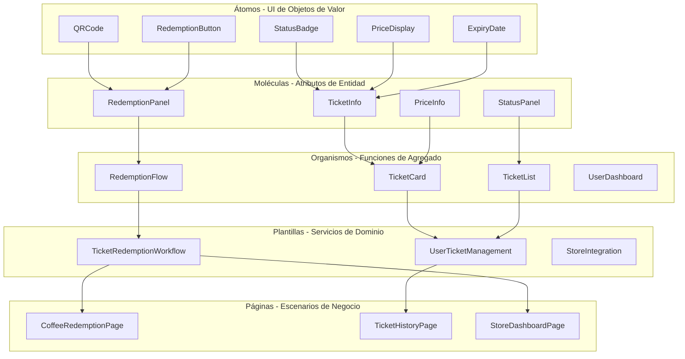
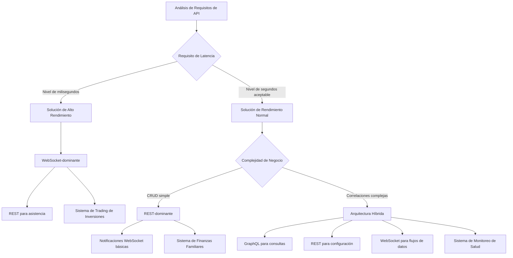
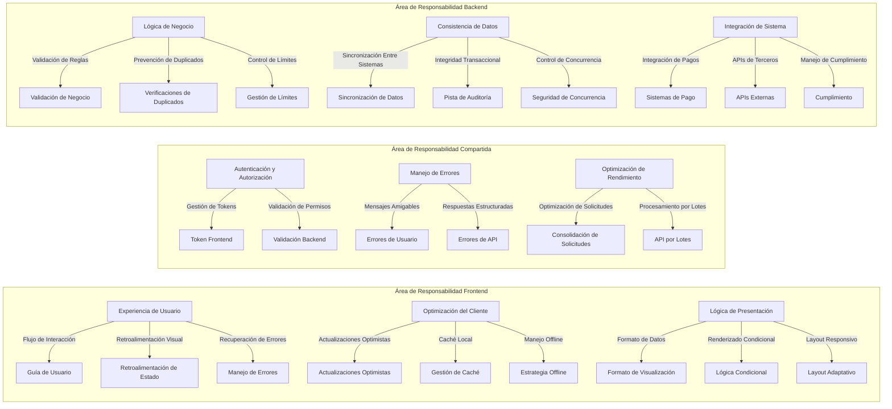

# Día 8 | Sistematizando el Diseño de Módulos de Componentes UI: Introducción a Sistemas de Diseño y Arquitectura Atómica

Después de siete días construyendo una estructura completa desde el pensamiento filosófico hasta la arquitectura backend, hoy abordamos una pregunta clave: **¿Cómo implementamos un diseño sistemático de componentes en el frontend que refleje los límites de agregados del backend y la lógica de negocio?**

Esto no es solo un asunto técnico de componentes UI, sino una **ingeniería completa de mapeo desde el modelo de dominio hacia la interfaz de usuario**. Cada componente frontend debe corresponder a un concepto de negocio claro, y cada flujo de interacción debe reflejar la evolución natural de la lógica de dominio.

## La Ontología de los Sistemas de Diseño: De la Lógica de Negocio al Lenguaje Visual

### Redefiniendo el Valor de un "Sistema de Diseño"

Los sistemas de diseño tradicionales a menudo se enfocan solo en la consistencia visual:

```
Sistema de Diseño = Colores + Fuentes + Espaciado + Biblioteca de Componentes
```

Pero un sistema de diseño basado en DDD debe encarnar una **traducción sistemática del lenguaje de negocio al lenguaje visual**:

```
Sistema de Diseño DDD = Conceptos de Dominio + Intención del Usuario + Patrones de Interacción + Representación Visual
```

### Mapeo desde Límites de Agregados a Dominios de Componentes Frontend

Usando un sistema común de boletos electrónicos como ejemplo, podemos establecer la siguiente relación de mapeo:

**Mapeo Agregado de Boletos → Dominio de Componentes Frontend**:

```typescript
// Límite de Agregado Backend
Agregado de Boleto ↔ Dominio de Componentes TicketDomain
├── Entidad Ticket ↔ Componente TicketCard
├── Objeto de Valor RedemptionCode ↔ Componente QRCodeDisplay
└── Objeto de Valor TicketStatus ↔ Componente StatusIndicator

Agregado de Usuario ↔ Dominio de Componentes UserDomain
├── Entidad User ↔ Componente UserProfile
├── Objeto de Valor Preferences ↔ Componente SettingsPanel
└── Objeto de Valor AuthToken ↔ Componente AuthStatus
```

Este mapeo asegura consistencia entre los componentes frontend y la lógica de negocio, con cada componente teniendo un límite claro de responsabilidad.

Al mismo tiempo, cuando diseñamos sistemas complejos, la **gestión estratificada de la carga cognitiva** es uno de los principios centrales de la arquitectura frontend y la filosofía de diseño.

Al comprender información, los humanos a menudo necesitan cambiar entre diferentes niveles de abstracción. Podemos dividir esto en tres capas principales: la **Capa Conceptual**, la **Capa Perceptual** y la **Capa de Traducción**.

```typescript
Gestión Estratificada de la Carga Cognitiva:
├── Capa Conceptual: Representación abstracta de la lógica de negocio
├── Capa Perceptual: Presentación concreta de visuales e interacciones
└── Capa de Traducción: El mecanismo de correspondencia entre concepto y percepción
```

La **Capa Conceptual** es responsable de llevar la representación abstracta de la lógica de negocio; es la fuente original de la intención del usuario y del sistema. La **Capa Perceptual** es la presentación visual e interactiva concreta, asegurando que la intención abstracta pueda entrar en el modelo mental del usuario de manera intuitiva y fácil de entender. La **Capa de Traducción** actúa como puente, traduciendo el lenguaje de negocio en lenguaje visual, asegurando una correspondencia fluida entre "intención abstracta" y "expresión concreta".

Esta "filosofía de traducir el lenguaje de negocio al lenguaje visual" se encarna en cada componente frontend. Cada componente no es solo un módulo funcional, sino un campo para la traducción de lenguaje.

Por ejemplo, en un sistema de trading de inversiones, el concepto abstracto de negocio de "riesgo" a menudo se traduce en un símbolo visual de advertencia rojo, permitiendo a los usuarios percibir intuitivamente el peligro en el menor tiempo posible. La "oportunidad" se transmite con un aviso verde para señalar información positiva, ayudando a los inversores a tomar decisiones rápidas. La "incertidumbre" a menudo se presenta a través de un estado de carga dinámico, permitiendo que la ambigüedad del sistema se perciba como un estado de "espera" y "cálculo continuo". Por supuesto, esta parte también varía dependiendo del trasfondo cultural, como se ve en las diferentes marcas de color para los valores del mercado de valores en EE.UU. y Taiwán.

La misma lógica se aplica a un sistema de finanzas familiares, donde el significado abstracto del lenguaje de negocio se transforma en diferentes estrategias visuales. Por ejemplo, el "control de presupuesto" a menudo se muestra intuitivamente con barras de progreso y símbolos de advertencia para mostrar el balance de ingresos y gastos. La "colaboración familiar" se hace clara a través de indicadores de estado multiusuario, haciendo obvias las interacciones entre miembros de un vistazo. Los "hábitos de gasto" se visualizan con gráficos categorizados, ayudando a los usuarios a abstraer su comportamiento de consumo diario en patrones estructurados, formando así una percepción intuitiva de su salud financiera.

En un sistema de monitoreo de salud, la lógica de traducción se enfoca más en la presentación intuitiva de "temporalidad" y "anomalía". Los "ciclos fisiológicos" se transmiten con animaciones de series temporales para mostrar cambios dinámicos, haciendo concreto y visible el concepto abstracto de un ciclo. Las "tendencias de salud" se mapean con colores graduales, permitiendo a los usuarios sentir naturalmente la mejora o el deterioro de su condición. En cuanto a las "alertas anormales", se crean con recordatorios pulsantes para crear una sensación de inmediatez y urgencia, asegurando que la información importante se capte instantáneamente.

En resumen, la gestión estratificada de la carga cognitiva no es solo una técnica de diseño, sino una filosofía de diseño. Crea una cadena completa de traducción de lo abstracto a lo concreto, permitiendo que la lógica de negocio sea "visualizada", "percibida" y "contextualizada".

El valor de este método es que no solo reduce la presión cognitiva del usuario, sino que también mejora la escalabilidad e interpretabilidad del sistema en varios escenarios. Esta es la razón principal por la que ahora discutiré el Diseño Atómico.

## Diseño Atómico: Una Implementación Jerárquica de Conceptos de Dominio

### El Significado DDD del Diseño Atómico

El Diseño Atómico es una herramienta de pensamiento clara y deconstructiva para requisitos. Puede ayudarnos efectivamente a descomponer páginas existentes en módulos y componentes combinando contexto o dominio, y también puede usarse para construir un sistema completo desde cero diseñando componentes atómicos.

La metodología de Diseño Atómico de Brad Frost necesita ser reinterpretada en el contexto de DDD:

**Átomos**: Representación UI de objetos de valor de dominio

-   Conceptos básicos de negocio como Dinero, Estado, Código, etc.
-   Estas son unidades indivisibles de significado de negocio.

**Moléculas**: Combinaciones de atributos de una entidad de dominio

-   Agrupando objetos de valor relacionados en fragmentos UI significativos.
-   Corresponde a grupos de atributos de una entidad.

**Organismos**: Expresión completa de un agregado de dominio

-   Implementación de una función de negocio completa.
-   Corresponde a las capacidades centrales de un agregado.

**Plantillas**: Capa de coordinación de servicios de dominio

-   Procesos de negocio que abarcan agregados.
-   Estructura para viajes de usuario complejos.

**Páginas**: Instancias específicas de escenarios de negocio

-   La operación completa para un rol específico en un contexto específico.

Usemos el sistema de boletos nuevamente para un ejemplo simple.

### Diseño Atómico en Práctica para un Sistema de Boletos



**Ejemplo de Implementación Concreta**:

```typescript
// Capa Átomo: Representación UI del objeto de valor Status
interface StatusBadgeProps {
  status: TicketStatus;
  size?: "sm" | "md" | "lg";
  variant?: "filled" | "outlined";
}

const StatusBadge: React.FC<StatusBadgeProps> = ({
  status,
  size = "md",
  variant = "filled",
}) => {
  const getStatusConfig = (): StatusConfig => {
    switch (status) {
      case TicketStatus.AVAILABLE:
        return { color: "green", label: "Disponible", icon: "check-circle" };
      case TicketStatus.USED:
        return { color: "gray", label: "Usado", icon: "check" };
      case TicketStatus.EXPIRED:
        return { color: "red", label: "Expirado", icon: "x-circle" };
      case TicketStatus.PENDING:
        return { color: "yellow", label: "Procesando", icon: "clock" };
    }
  };

  const config = getStatusConfig();

  return (
    <span className={`status-badge ${config.color} ${size} ${variant}`}>
      <Icon name={config.icon} />
      {config.label}
    </span>
  );
};

// Capa Molécula: Combinación de atributos de la entidad Ticket
interface TicketInfoProps {
  ticket: Ticket;
  showDetails?: boolean;
}

const TicketInfo: React.FC<TicketInfoProps> = ({
  ticket,
  showDetails = true,
}) => {
  return (
    <div className="ticket-info">
      <div className="ticket-header">
        <h3>{ticket.productName}</h3>
        <StatusBadge status={ticket.status} />
      </div>

      {showDetails && (
        <div className="ticket-details">
          <PriceDisplay
            amount={ticket.value}
            originalPrice={ticket.originalPrice}
          />
          <ExpiryDate date={ticket.expiryDate} />
          <div className="store-info">
            <span>Tiendas Aplicables: {ticket.applicableStores.join(", ")}</span>
          </div>
        </div>
      )}
    </div>
  );
};

// Capa Organismo: Expresión completa del agregado Ticket
interface TicketCardProps {
  ticket: Ticket;
  onRedeem?: (ticket: Ticket) => void;
  onViewDetails?: (ticket: Ticket) => void;
}

const TicketCard: React.FC<TicketCardProps> = ({
  ticket,
  onRedeem,
  onViewDetails,
}) => {
  const canRedeem = ticket.isRedeemable();
  const isNearExpiry = ticket.isNearExpiry();

  return (
    <div className={`ticket-card ${isNearExpiry ? "near-expiry" : ""}`}>
      <TicketInfo ticket={ticket} />

      {canRedeem && <RedemptionPanel ticket={ticket} onRedeem={onRedeem} />}

      <div className="ticket-actions">
        <button
          onClick={() => onViewDetails?.(ticket)}
          className="btn-secondary"
        >
          Ver Detalles
        </button>

        {canRedeem && (
          <button onClick={() => onRedeem?.(ticket)} className="btn-primary">
            Canjear Ahora
          </button>
        )}
      </div>

      {isNearExpiry && (
        <div className="expiry-warning">
          <Icon name="alert-triangle" />
          Expira pronto, por favor úselo lo antes posible.
        </div>
      )}
    </div>
  );
};
```

## Correspondencia Cognitiva de los Límites de Arquitectura Frontend

**La Necesidad de Planificación de Arquitectura Frontend: Un Lenguaje Común para Equipos Multifuncionales**

Después de discutir la implementación jerárquica de conceptos de dominio en Diseño Atómico, pasemos a un concepto adicional: **cómo ubicar los componentes y módulos diseñados**.

La organización de la arquitectura frontend no es solo sobre estructura de código, sino una **estrategia para dividir dominios cognitivos**.

Muchos ingenieros y clientes a menudo piensan: "¿Por qué el frontend necesita planificación arquitectónica?" o "¿No es el desarrollo frontend solo convertir diseños en páginas web?" Pero en realidad, la complejidad de los sistemas frontend a menudo no es menor que la del backend.

Desde la perspectiva de un Product Manager (PM), la arquitectura frontend trata sobre la velocidad de entrega de características, la calidad de la experiencia del usuario y la capacidad de evolución a largo plazo del producto. Un frontend sin buena arquitectura conducirá a los siguientes problemas:

-   Los ciclos de desarrollo de características se hacen cada vez más largos: Cuando un PM propone un requisito aparentemente simple como "agregar una nueva condición de filtro", si el frontend carece de buena arquitectura, el equipo de desarrollo puede necesitar modificar una docena de archivos y probar innumerables páginas. Una tarea originalmente estimada para 1 día se convierte en 1 semana. Esto se debe a que la lógica relacionada está dispersa por todas partes, sin un mecanismo unificado de gestión.

-   Riesgo de experiencia de usuario inconsistente: Un frontend sin especificaciones arquitectónicas es propenso a tener la misma función comportándose de manera diferente en diferentes páginas. Por ejemplo, la función "eliminar" podría ser un botón rojo en la página A, un enlace de texto en la página B y requerir confirmación de doble clic en la página C. Los usuarios tienen que reaprender la lógica operativa para cada página, reduciendo enormemente la usabilidad del producto.

-   Dificultad en el rastreo de errores y localización de problemas: Cuando un usuario reporta un error, si la estructura del código frontend es caótica, el equipo de desarrollo puede pasar mucho tiempo localizando el problema. Esto afecta directamente la eficiencia del servicio al cliente y la satisfacción del usuario.

Desde la perspectiva de aseguramiento pre-aceptación, los ingenieros QA necesitan diseñar casos de prueba, realizar pruebas de regresión y asegurar la calidad del producto. Estas tareas dependen directamente de la calidad de la arquitectura frontend y afectarán muy claramente y directamente la eficiencia del trabajo de prueba.

-   Reutilización de casos de prueba: Una buena arquitectura frontend gestionará uniformemente los mismos componentes funcionales. Por ejemplo, si el "formulario de inicio de sesión" usa el mismo componente en todo el sistema, QA solo necesita realizar una prueba completa en este componente una vez para asegurar que todas las páginas que lo usan tengan el mismo aseguramiento de calidad. Por el contrario, si cada página tiene su propia implementación del formulario de inicio de sesión, QA necesita repetir la prueba múltiples veces.

-   Creación de pruebas automatizadas: Una arquitectura frontend estructurada hace más fácil crear pruebas automatizadas. Cuando los componentes tienen definiciones claras de entrada y salida, QA puede escribir scripts de prueba estables más fácilmente. Una estructura de código caótica hará que las pruebas automatizadas sean frágiles, fallando a menudo debido a modificaciones menores.

-   Control del alcance de pruebas de regresión: Cuando cierta función cambia, una buena arquitectura permite a QA saber claramente qué funciones relacionadas necesitan ser probadas. Si la arquitectura está bien diseñada, modificar el componente "información de usuario" solo afectará unas pocas páginas específicas, no todo el sistema.

En resumen, la planificación arquitectónica es como la planificación urbana; define los límites y reglas de interacción de diferentes áreas funcionales. Sin buena planificación arquitectónica, el código rápidamente se convertirá en "código espagueti" imposible de mantener.

Los frontends modernos ya no son solo la "capa de presentación"; llevan una gran cantidad de lógica de negocio. Control de permisos de usuario, validación de datos, gestión de estado, manejo de errores, etc., todo necesita ser implementado en el frontend. Sin planificación arquitectónica, esta lógica estará dispersa por todas partes, haciéndola difícil de probar y mantener.

### Resumen de Patrones de Arquitectura Frontend Mainstream

**La Evolución de la Arquitectura MVC Tradicional en el Frontend**:

El desarrollo frontend temprano usaba principalmente jQuery + plantillas de página (Pug, Gulp). Sin embargo, con el auge de las Aplicaciones de Página Única (SPA), el frontend requirió patrones arquitectónicos más complejos. Lo siguiente introducirá brevemente las estrategias arquitectónicas comunes hoy:

**Arquitectura Basada en Componentes**, **Arquitectura Basada en Características**, **Arquitectura en Capas**

**1. Arquitectura Basada en Componentes**

Este es actualmente el patrón de arquitectura frontend más mainstream, representado por React, Vue y Angular:

```
project-root/
├── src/
│   ├── components/           # Componentes reutilizables
│   │   ├── Button/
│   │   ├── Modal/
│   │   └── DataTable/
│   ├── pages/               # Componentes a nivel de página
│   │   ├── Home/
│   │   ├── Profile/
│   │   └── Settings/
│   ├── hooks/               # Custom Hooks (React)
│   ├── stores/              # Gestión de estado
│   ├── services/            # Servicios API
│   └── utils/               # Funciones de utilidad
```

**Escenarios Aplicables**: Proyectos pequeños a medianos, equipos con habilidades técnicas promedio, necesidad de desarrollo rápido.
**Ventajas**: Curva de aprendizaje suave, velocidad de desarrollo rápida, recursos comunitarios ricos.
**Desventajas**: En proyectos grandes, es fácil que las responsabilidades de componentes se vuelvan poco claras, llevando a duplicación de código.

**2. Arquitectura Basada en Características**

Organiza código por características de negocio, con cada módulo de característica conteniendo todo el código relacionado para esa característica:

```
project-root/
├── src/
│   ├── features/
│   │   ├── authentication/
│   │   │   ├── components/
│   │   │   ├── hooks/
│   │   │   ├── services/
│   │   │   ├── stores/
│   │   │   └── types/
│   │   ├── user-management/
│   │   │   ├── components/
│   │   │   ├── hooks/
│   │   │   └── services/
│   │   └── product-catalog/
│   ├── shared/              # Recursos compartidos
│   │   ├── components/
│   │   ├── hooks/
│   │   └── utils/
│   └── core/               # Funcionalidades centrales
│       ├── api/
│       ├── auth/
│       └── routing/
```

**Escenarios Aplicables**: Proyectos medianos a grandes, colaboración multiequipo, lógica de negocio compleja.
**Ventajas**: Alta independencia de módulos, responsabilidades claras, fácil de probar.
**Desventajas**: Configuración inicial más compleja, requiere más planificación arquitectónica.

**3. Arquitectura en Capas**

Divide la aplicación en diferentes capas lógicas, con cada capa responsable de deberes específicos:

```
project-root/
├── src/
│   ├── presentation/        # Capa de Presentación
│   │   ├── components/
│   │   ├── pages/
│   │   └── layouts/
│   ├── application/         # Capa de Aplicación
│   │   ├── stores/
│   │   ├── hooks/
│   │   └── services/
│   ├── domain/              # Capa de Dominio
│   │   ├── entities/
│   │   ├── repositories/
│   │   └── use-cases/
│   └── infrastructure/      # Capa de Infraestructura
│       ├── api/
│       ├── storage/
│       └── external-services/
```

**Escenarios Aplicables**: Aplicaciones a nivel empresarial, proyectos de mantenimiento a largo plazo, lógica de negocio compleja.
**Ventajas**: Clara separación de responsabilidades, fácil de probar, cumple con principios SOLID.
**Desventajas**: Curva de aprendizaje empinada, velocidad de desarrollo inicial más lenta.

### Comparación de Arquitectura Core-Shared-Feature vs. Next.js DDD

**Análisis Profundo de la Arquitectura Core-Shared-Feature**:

Esta arquitectura divide el código en tres niveles principales, cada uno con límites claros de responsabilidad:

```
src/
├── core/                    # Capa Core: Infraestructura de la aplicación
│   ├── api/
│   │   ├── client.ts        # Configuración del cliente API
│   │   ├── interceptors.ts  # Interceptores de solicitud/respuesta
│   │   └── endpoints.ts     # Definiciones de endpoints API
│   ├── auth/
│   │   ├── AuthContext.tsx  # Contexto de autenticación
│   │   ├── AuthGuard.tsx    # Guard de ruta
│   │   └── auth.service.ts  # Servicio de autenticación
│   ├── router/
│   │   ├── Router.tsx       # Configuración del router
│   │   ├── routes.ts        # Definiciones de rutas
│   │   └── guards.ts        # Lógica de guard de rutas
│   ├── store/
│   │   ├── index.ts         # Configuración de gestión de estado raíz
│   │   ├── middleware.ts    # Middleware
│   │   └── persistConfig.ts # Configuración de persistencia
│   └── types/
│       ├── api.ts           # Tipos relacionados con API
│       ├── auth.ts          # Tipos relacionados con autenticación
│       └── common.ts        # Tipos comunes
├── shared/                  # Capa Shared: Componentes y lógica reutilizables
│   ├── components/
│   │   ├── ui/              # Componentes UI básicos
│   │   │   ├── Button/
│   │   │   │   ├── Button.tsx
│   │   │   │   ├── Button.test.tsx
│   │   │   │   ├── Button.stories.tsx
│   │   │   │   └── index.ts
│   │   │   ├── Input/
│   │   │   ├── Modal/
│   │   │   └── Table/
│   │   ├── layout/          # Componentes de layout
│   │   │   ├── Header/
│   │   │   ├── Sidebar/
│   │   │   └── Footer/
│   │   └── form/            # Componentes de formulario
│   │       ├── FormField/
│   │       ├── Validation/
│   │       └── FormBuilder/
│   ├── hooks/
│   │   ├── useApi.ts        # Hook de llamada API
│   │   ├── useDebounce.ts   # Hook de Debounce
│   │   ├── useLocalStorage.ts # Hook de almacenamiento local
│   │   └── usePermission.ts # Hook de verificación de permisos
│   ├── utils/
│   │   ├── formatters.ts    # Utilidades de formateo
│   │   ├── validators.ts    # Utilidades de validación
│   │   ├── constants.ts     # Definiciones de constantes
│   │   └── helpers.ts       # Funciones auxiliares
│   └── services/
│       ├── storage.service.ts # Servicio de almacenamiento
│       ├── notification.service.ts # Servicio de notificación
│       └── analytics.service.ts # Servicio de analíticas
└── features/                # Capa Feature: Funcionalidades de negocio específicas
    ├── authentication/
    │   ├── components/
    │   │   ├── LoginForm/
    │   │   │   ├── LoginForm.tsx
    │   │   │   ├── LoginForm.test.tsx
    │   │   │   └── useLoginForm.ts
    │   │   ├── RegisterForm/
    │   │   └── PasswordReset/
    │   ├── pages/
    │   │   ├── LoginPage.tsx
    │   │   ├── RegisterPage.tsx
    │   │   └── ForgotPasswordPage.tsx
    │   ├── store/
    │   │   ├── authSlice.ts # Redux Toolkit slice
    │   │   └── authThunks.ts # Operaciones asíncronas
    │   ├── services/
    │   │   └── auth.api.ts  # API relacionada con autenticación
    │   ├── types/
    │   │   └── auth.types.ts # Tipos relacionados con autenticación
    │   └── utils/
    │       └── authHelpers.ts
    ├── user-management/
    │   ├── components/
    │   │   ├── UserList/
    │   │   ├── UserForm/
    │   │   └── UserProfile/
    │   ├── pages/
    │   │   ├── UsersPage.tsx
    │   │   └── UserDetailPage.tsx
    │   ├── store/
    │   │   └── userSlice.ts
    │   └── services/
    │       └── user.api.ts
    └── dashboard/
        ├── components/
        │   ├── StatsCard/
        │   ├── ChartWidget/
        │   └── RecentActivity/
        ├── pages/
        │   └── DashboardPage.tsx
        └── hooks/
            └── useDashboardData.ts
```

**Ventajas de Core-Shared-Feature**:

1.  **Clara Separación de Responsabilidades**: La capa Core maneja la infraestructura de la aplicación, la capa Shared proporciona componentes reutilizables, y la capa Feature implementa funcionalidades de negocio específicas. Las responsabilidades de cada nivel son muy claras, permitiendo a nuevos miembros del equipo entender rápidamente la estructura del código.

2.  **Alta Reutilización**: Los componentes y utilidades en la capa Shared pueden reutilizarse a través de múltiples Features, evitando duplicación de código. Cuando necesitas usar el mismo componente UI o lógica de negocio en múltiples características, solo necesitas referenciarlo desde la capa Shared.

3.  **Fácil de Probar**: Cada capa puede probarse independientemente. Los servicios básicos en la capa Core pueden ser probados unitariamente, los componentes en la capa Shared pueden ser probados como componentes, y la lógica de negocio en la capa Feature puede ser probada de integración.

4.  **Amigable para Colaboración en Equipo**: Diferentes equipos pueden ser responsables de diferentes Features, mientras las capas Core y Shared pueden ser mantenidas por un equipo de arquitectura. Esto puede prevenir conflictos causados por múltiples equipos modificando el mismo código.

**Desventajas de Core-Shared-Feature**:

1.  **Configuración Inicial Compleja**: Requiere prediseñar los límites e interfaces de cada capa, lo que demanda mayores habilidades de diseño arquitectónico. Si los límites no se diseñan adecuadamente, el costo de refactorización posterior será alto.

2.  **Gestión de Dependencias Entre Features**: Cuando Features necesitan compartir cierta lógica, requiere una consideración cuidadosa sobre si debe ser promovida a la capa Shared o si la dependencia debe resolverse de otra manera.

3.  **Curva de Aprendizaje**: Los nuevos ingenieros necesitan entender la filosofía de diseño de toda la arquitectura para organizar correctamente el código entre las capas.

**Análisis Profundo de la Arquitectura Next.js DDD**:

Una arquitectura combinando Next.js con Diseño Dirigido por Dominio se enfoca más en el modelado de dominio y la organización de lógica de negocio:

```
src/
├── app/                     # Next.js 13+ App Router
│   ├── (auth)/             # Grupo de ruta
│   │   ├── login/
│   │   │   └── page.tsx
│   │   └── register/
│   │       └── page.tsx
│   ├── dashboard/
│   │   ├── page.tsx
│   │   └── layout.tsx
│   ├── users/
│   │   ├── page.tsx
│   │   ├── [id]/
│   │   │   └── page.tsx
│   │   └── loading.tsx
│   ├── api/                # API Routes
│   │   ├── auth/
│   │   │   └── route.ts
│   │   └── users/
│   │       └── route.ts
│   ├── globals.css
│   ├── layout.tsx
│   └── page.tsx
├── domains/                 # Capa de Dominio
│   ├── auth/
│   │   ├── entities/
│   │   │   ├── User.ts     # Entidad de usuario
│   │   │   └── Session.ts  # Entidad de sesión
│   │   ├── repositories/
│   │   │   └── UserRepository.ts
│   │   ├── services/
│   │   │   ├── AuthService.ts
│   │   │   └── UserService.ts
│   │   ├── value-objects/
│   │   │   ├── Email.ts
│   │   │   └── Password.ts
│   │   └── use-cases/
│   │       ├── LoginUseCase.ts
│   │       ├── RegisterUseCase.ts
│   │       └── LogoutUseCase.ts
│   ├── user-management/
│   │   ├── entities/
│   │   │   └── UserProfile.ts
│   │   ├── repositories/
│   │   │   └── UserProfileRepository.ts
│   │   ├── services/
│   │   │   └── UserManagementService.ts
│   │   └── use-cases/
│   │       ├── GetUserListUseCase.ts
│   │       ├── CreateUserUseCase.ts
│   │       └── UpdateUserUseCase.ts
│   └── shared/
│       ├── entities/
│       │   └── BaseEntity.ts
│       ├── value-objects/
│       │   ├── Id.ts
│       │   └── DateRange.ts
│       └── interfaces/
│           ├── Repository.ts
│           └── UseCase.ts
├── infrastructure/          # Capa de Infraestructura
│   ├── database/
│   │   ├── prisma/
│   │   │   ├── schema.prisma
│   │   │   └── migrations/
│   │   └── repositories/
│   │       ├── PrismaUserRepository.ts
│   │       └── PrismaUserProfileRepository.ts
│   ├── external-services/
│   │   ├── EmailService.ts
│   │   └── PaymentService.ts
│   ├── auth/
│   │   └── NextAuthConfig.ts
│   └── api/
│       └── ApiClient.ts
├── presentation/            # Capa de Presentación
│   ├── components/
│   │   ├── auth/
│   │   │   ├── LoginForm.tsx
│   │   │   └── RegisterForm.tsx
│   │   ├── users/
│   │   │   ├── UserList.tsx
│   │   │   └── UserCard.tsx
│   │   └── shared/
│   │       ├── Button.tsx
│   │       ├── Input.tsx
│   │       └── Modal.tsx
│   ├── hooks/
│   │   ├── useAuth.ts
│   │   └── useUsers.ts
│   └── providers/
│       ├── AuthProvider.tsx
│       └── QueryProvider.tsx
└── application/             # Capa de Aplicación
    ├── dto/
    │   ├── auth/
    │   │   ├── LoginDto.ts
    │   │   └── RegisterDto.ts
    │   └── users/
    │       ├── CreateUserDto.ts
    │       └── UpdateUserDto.ts
    ├── handlers/
    │   ├── auth/
    │   │   ├── LoginHandler.ts
    │   │   └── RegisterHandler.ts
    │   └── users/
    │       ├── GetUsersHandler.ts
    │       └── CreateUserHandler.ts
    └── middleware/
        ├── AuthMiddleware.ts
        └── ValidationMiddleware.ts
```

**Ventajas de Next.js DDD**:

1.  **Lógica de Negocio Centralizada**: La capa Domain contiene toda la lógica y reglas de negocio, separando la lógica de negocio de la implementación técnica. Cuando los requisitos de negocio cambian, las modificaciones se realizan principalmente en la capa Domain, minimizando el impacto en otras capas.

2.  **Consistencia Full-Stack**: El frontend y backend comparten el mismo modelo de dominio y lógica de negocio, reduciendo la carga cognitiva y los costos de comunicación entre ellos. El diseño de API también se alinea más estrechamente con la lógica de negocio.

3.  **Excelente Testeabilidad**: La lógica de negocio en la capa Domain puede probarse completamente desacoplada de detalles técnicos. Los casos de uso pueden probarse unitariamente usando inyección de dependencias.

4.  **Agnóstico de Tecnología**: La capa Domain no depende de ninguna tecnología o framework específico. Cuando el stack tecnológico necesita cambiarse, la lógica de negocio puede permanecer sin cambios.

**Desventajas de Next.js DDD**:

1.  **Curva de Aprendizaje Empinada**: Requiere una comprensión profunda de conceptos DDD y patrones de diseño, demandando un nivel técnico más alto del equipo. Los ingenieros junior pueden tomar más tiempo para dominarlo.

2.  **Velocidad de Desarrollo Inicial Más Lenta**: Requiere diseñar múltiples niveles de abstracción, como entidades, objetos de valor y casos de uso, lo que ralentiza la velocidad de desarrollo inicial.

3.  **Riesgo de Sobre-Ingeniería**: Para aplicaciones CRUD simples, DDD puede introducir complejidad innecesaria. Es necesario juzgar su aplicabilidad basándose en la escala y complejidad del proyecto.

### Marco de Decisión para Selección de Arquitectura

**Selección de Arquitectura Dirigida por Escala de Proyecto**:

1.  **Proyectos Pequeños (< 10 páginas, < 3 desarrolladores)**:
    -   Recomendación: Arquitectura simple basada en componentes
    -   Razón: Desarrollo rápido, reduce sobre-ingeniería.

2.  **Proyectos Medianos (10-50 páginas, 3-10 desarrolladores)**:
    -   Recomendación: Arquitectura Core-Shared-Feature
    -   Razón: Balancea eficiencia de desarrollo y organización de código.

3.  **Proyectos Grandes (> 50 páginas, > 10 desarrolladores)**:
    -   Recomendación: Arquitectura Next.js DDD o arquitectura micro-frontend
    -   Razón: La lógica de negocio compleja requiere restricciones arquitectónicas más estrictas.

**Consideración del Nivel Técnico del Equipo**:

-   **Equipo Junior**: Elegir una arquitectura con curva de aprendizaje suave, enfocándose en comprensibilidad y eficiencia de desarrollo.
-   **Equipo Senior**: Puede elegir una arquitectura más compleja pero con mayor beneficio a largo plazo, enfocándose en mantenibilidad y escalabilidad.
-   **Equipo Mixto**: Elegir una arquitectura con límites claros, permitiendo a desarrolladores de diferentes niveles trabajar en diferentes capas.

**Impacto de Características del Negocio**:

-   **Productos con iteraciones rápidas**: Elegir una arquitectura que priorice velocidad de desarrollo.
-   **Productos con mantenimiento a largo plazo**: Elegir una arquitectura que priorice mantenibilidad.
-   **Productos con colaboración multiequipo**: Elegir una arquitectura con alto grado de modularidad.

## Estrategias de Diseño de API y Límites de Colaboración Frontend-Backend

### Principios de Diseño Central

En un sistema de colaboración frontend-backend bien gobernado, típicamente usamos un framework de cinco capas: **"Intención—Contrato—Transporte—Consistencia—Observación"**. Primero, la intención de negocio define experiencia medible y puntualidad de datos. Segundo, el **contrato** fija límites y predictibilidad. Luego, se elige una forma de transporte apropiada para entregar los datos. Al mismo tiempo, una estrategia de consistencia asegura que las semánticas de lectura y escritura se alineen con los riesgos del negocio. Finalmente, la observación completa el ciclo cerrado de experiencia con capacidades de testeabilidad, trazabilidad y retrospectiva.

En términos de **contrato y límites**, adoptar un enfoque contract-first y gobernanza de versiones (REST/OpenAPI, GraphQL SDL, gRPC/proto) puede minimizar riesgos entre equipos. El frontend se alinea con el modelo de visualización usando DTOs tipados (o fragmentos GraphQL), evitando filtrar formas de base de datos a la UI. El backend asume la **"responsabilidad final"** para reglas de negocio, permisos y consistencia de datos, mientras el frontend solo maneja presentación y experiencia (incluyendo actualizaciones optimistas, recuperación de errores y estrategias offline).

En resumen, la madurez de la colaboración frontend-backend y el diseño de API no se trata de cuántos protocolos se apilan, sino de si las responsabilidades y riesgos pueden ser adelantados con contratos claros basados en características de negocio, y si la experiencia, el rendimiento y la corrección pueden lograrse simultáneamente con semánticas apropiadas de transporte y consistencia.

Lo siguiente discute brevemente diseños de protocolo API adecuados basados en características de negocio.

Elegir el stack tecnológico de API más adecuado basado en características de negocio:

-   **Sistema de Trading de Alta Frecuencia**: WebSocket-dominante + REST para asistencia
-   **Sistema de Finanzas Familiares**: REST-dominante + WebSocket básico
-   **Sistema de Monitoreo de Salud**: Arquitectura híbrida (REST + GraphQL + WebSocket)

### Sistema de Trading de Inversiones

```typescript
// Estrategia Central: WebSocket + Cola de Mensajes Prioritaria
class TradingAPI {
  // Canal WebSocket principal: trading en tiempo real y datos de mercado
  // REST para asistencia: configuración y consultas históricas
  // Clave: optimización de latencia a nivel de milisegundos
}
```

### Sistema de Finanzas Familiares

```typescript
// Estrategia Central: REST + Notificaciones WebSocket simples
class FamilyFinanceAPI {
  // REST-dominante: operaciones CRUD simples
  // WebSocket para asistencia: notificaciones de colaboración
  // Clave: desarrollo y mantenimiento simples
}
```

### Sistema de Monitoreo de Salud

```typescript
// Estrategia Central: REST + GraphQL + WebSocket híbrido
class HealthMonitorAPI {
  // REST: consultas básicas y configuración
  // GraphQL: análisis de correlación complejo
  // WebSocket: flujos de datos IoT y alertas
  // Clave: estrategia de optimización de tipo de datos
}
```

## Principios Guía de Selección de Tecnología

| Característica del Sistema | Stack Tecnológico Recomendado | Escenario de Aplicación         |
| --------------------- | ---------------------- | ---------------------------- |
| Latencia Ultra-Baja     | WebSocket-dominante     | Trading, juegos, colaboración en tiempo real |
| Simple y Confiable   | REST-dominante          | Interno empresarial, aplicaciones pequeñas |
| Consultas Complejas       | GraphQL para mejora| Análisis de datos, servicios personalizados |
| Procesamiento de Flujo de Datos| Arquitectura híbrida    | IoT, monitoreo, redes sociales |

## Comparación de Arquitecturas de Sistema para Tres Escenarios de Negocio

```mermaid
graph TB
    subgraph "Sistema de Trading de Inversiones - Rendimiento Extremo"
        Trading[Frontend de Trading]
        TradingWS[Canal WebSocket Principal]
        TradingREST[API REST Auxiliar]
        TradingDB[(Base de Datos de Mercado)]

        Trading --> TradingWS
        Trading --> TradingREST
        TradingWS --> TradingDB
        TradingREST --> TradingDB

        TradingWS -.-> |Precios en Tiempo Real| Trading
        TradingWS -.-> |Ejecución de Trading| Trading
        TradingREST -.-> |Consultas de Configuración| Trading
    end

    subgraph "Sistema de Finanzas Familiares - Simple y Confiable"
        Family[Frontend de Finanzas]
        FamilyREST[API REST Principal]
        FamilyWS[Notificaciones de Colaboración]
        FamilyDB[(Base de Datos de Finanzas)]

        Family --> FamilyREST
        Family --> FamilyWS
        FamilyREST --> FamilyDB
        FamilyWS --> FamilyDB

        FamilyREST -.-> |Operaciones CRUD| Family
        FamilyWS -.-> |Notificaciones en Tiempo Real| Family
    end

    subgraph "Sistema de Monitoreo de Salud - Dirigido por Flujo de Datos"
        Health[Frontend de Salud]
        HealthREST[API REST]
        HealthGQL[API GraphQL]
        HealthWS[Flujo WebSocket]
        HealthDB[(Base de Datos de Salud)]
        IoT[Dispositivos IoT]

        Health --> HealthREST
        Health --> HealthGQL
        Health --> HealthWS
        IoT --> HealthWS

        HealthREST --> HealthDB
        HealthGQL --> HealthDB
        HealthWS --> HealthDB

        HealthREST -.-> |Consultas Básicas| Health
        HealthGQL -.-> |Análisis Complejo| Health
        HealthWS -.-> |Datos en Tiempo Real| Health
    end
```



## Árbol de Decisión de Selección de Tecnología API



## Delimitando Responsabilidades Frontend-Backend



## Mejores Prácticas para Coordinación de Límites

1.  **Clara División de Responsabilidades**: Evitar duplicar lógica entre frontend y backend.
2.  **Manejo Unificado de Errores**: Un mecanismo de respuesta de error estructurado.
3.  **Optimización de Rendimiento Colaborativo**: Caché frontend + procesamiento por lotes backend.
4.  **Estrategia de Seguridad Consistente**: Gestión coordinada de tokens y validación de permisos.
5.  **Monitoreo y Logging**: Rastreo full-stack y localización de problemas.

## Construyendo los Fundamentos para la Arquitectura de Alta Concurrencia del Día 9

Después de una breve discusión sobre arquitectura frontend, mañana volveremos nuestra atención a escenarios arquitectónicos y AWS:

### Estrategias para Aplicaciones Intensivas en Datos

-   **Optimización de Solicitudes y Procesamiento por Lotes**: Reducir sobrecarga de red y mejorar experiencia de usuario.
-   **Sincronización de Estado y Resolución de Conflictos**: Manejo de operaciones concurrentes de múltiples usuarios.

### Arquitectura de Microservicios

-   **Patrón Circuit Breaker**: Aislamiento de fallos y degradación elegante.
-   **Rastreo Distribuido**: Rastreo y depuración de operaciones de usuario entre servicios.

### Optimización de Arquitectura de Alta Concurrencia en AWS

-   **CDN y Edge Computing**: Cómo maximizar los beneficios de CloudFront.
-   **Lambda@Edge**: Estrategias de ejecución en el borde.
-   **Throttling de API Gateway**: Manejo de respuestas de limitación.

## Conclusiones Sistemáticas de Hoy

-   **Un sistema de diseño es una traducción visual del lenguaje de negocio**: Cada decisión de diseño debe reflejar un concepto de negocio.
-   **Diseño Atómico + DDD = Una jerarquía orgánica de componentes**: Un mapeo natural de objetos de valor a agregados.
-   **Core-Share-Feature vs. Arquitectura en Capas DDD refleja límites de dominio**: Trade-offs de arquitectura frontend y correspondencia con límites de agregados backend.

Recuerda: Lo que construimos hoy no es un framework UI, sino una expresión sistemática de lógica de negocio en la capa visual. Cada componente lleva una semántica de negocio específica, y cada decisión de diseño debe servir a los objetivos de negocio del usuario.

---

> "Los componentes no son los bloques de construcción de la UI, sino los portadores visuales de conceptos de negocio. No estamos diseñando interfaces, sino el medio para el diálogo entre el usuario y el dominio de negocio. Un verdadero sistema de diseño es el arte de traducción que hace que la lógica de negocio compleja sea intuitivamente perceptible."
