# Día 9 | Diseño de Alta Concurrencia y Limitación de Tasa: Cómo Evitar Cuellos de Botella de Recursos

Ayer, establecimos tres arquitecturas de API: WebSocket-dominante para el comercio de inversiones, REST simplificada para finanzas familiares y una estrategia híbrida para la monitorización de la salud. Hoy, abordamos una pregunta más fundamental: **Cuando un sistema se enfrenta a un gran número de solicitudes concurrentes, ¿cómo diseñamos la arquitectura de flujo de datos para evitar cuellos de botella y sentar las bases para la optimización de la caché?**

Esto no es solo un problema técnico de planificación de capacidad, sino un **enfoque filosófico para las aplicaciones intensivas en datos**. Como señala Martin Kleppmann en *Designing Data-Intensive Applications*, el desafío de los sistemas modernos no es la intensidad computacional, sino cómo manejar el flujo de datos bajo las restricciones de **fiabilidad, escalabilidad y mantenibilidad**.

## La Esencia de la Alta Concurrencia: Patrones de Flujo de Datos y Características de Acceso

### Reinterpretando la Esencia de la "Alta Concurrencia"

Tradicionalmente, entendemos la alta concurrencia como "manejar un gran número de solicitudes simultáneamente". Sin embargo, Kleppmann ofrece una perspectiva más profunda:

**La concurrencia no es un problema cuantitativo, sino un desafío cualitativo**:

```
Visión Tradicional: Concurrencia = Número de solicitudes procesadas por segundo
Visión Intensiva en Datos: Concurrencia = Complejidad de coordinación bajo restricciones de consistencia de datos
```

**La manifestación de los tres pilares (Fiabilidad, Escalabilidad, Mantenibilidad) en escenarios de concurrencia**:

**Fiabilidad**: El sistema sigue funcionando correctamente incluso cuando algunos componentes fallan.

-   Comercio de Inversiones: Las órdenes de trading no pueden perderse ni ejecutarse varias veces.
-   Finanzas Familiares: Los registros de gastos no pueden volverse inconsistentes debido a la concurrencia.
-   Monitoreo de Salud: Los datos del dispositivo no pueden perderse permanentemente debido a problemas de red.

**Escalabilidad**: El sistema puede manejar una carga creciente.

-   Escalado Horizontal: Añadir más máquinas.
-   Escalado Vertical: Mejorar el rendimiento de una sola máquina.
-   Escalado Funcional: Gestionar la complejidad del sistema.

**Mantenibilidad**: El sistema puede ser operado, entendido y modificado eficazmente.

-   Observabilidad: Comprender el estado operativo del sistema.
-   Operabilidad: Mantener el sistema funcionando eficazmente.
-   Simplicidad: Gestionar la complejidad y evitar la complejidad accidental.

Tradicionalmente, entendemos la alta concurrencia como "manejar un gran número de solicitudes simultáneamente", but from a system architecture perspective, concurrency is essentially a **management challenge of data flow patterns**:

### Identificación Sistemática de Problemas de Cuello de Botella por Concurrencia

| Nivel          | Nombre de la Métrica                | Descripción                                          | Herramientas / Métodos Comunes de Detección        |
| -------------- | ----------------------------------- | ---------------------------------------------------- | -------------------------------------------------- |
| **Aplicación** | Rendimiento (RPS/QPS)               | Número de solicitudes procesadas por segundo, mide la capacidad del sistema | JMeter, k6, Locust, New Relic                      |
|                | Latencia de Respuesta               | Tiempo desde la entrada de la solicitud hasta la respuesta, centrándose en P50/P95/P99 | APM (Datadog, New Relic), OpenTelemetry            |
|                | Tasa de Errores                     | Porcentaje de HTTP 4xx/5xx, refleja la robustez de la aplicación | APM, ELK, Sentry                                   |
|                | Conexiones Concurrentes             | Número de usuarios/sesiones manejados simultáneamente | Monitoreo del Sistema (Prometheus, Grafana)        |
|                | Longitud de la Cola                 | Retraso en los pools de hilos, colas de tareas       | Micrometer, métricas de RabbitMQ/Kafka             |
|                | Tiempo de Espera                    | Tiempo de espera en pools de conexión de DB, colas de API Gateway | APM Trace, estadísticas de pgbouncer               |
|                | Comportamiento de Memoria/GC        | Pausas de GC, uso de Heap, afectando el tiempo de respuesta de la aplicación | JVisualVM, JFR, Prometheus Exporter                |
| **Base de Datos** | Latencia de Consulta                | Tiempo que tarda una sola consulta SQL o transacción | MySQL Slow Query Log, pg_stat_statements           |
|                | Consultas por Segundo (QPS/TPS)     | Rendimiento de la base de datos                      | MySQL performance_schema, métricas de Postgres     |
|                | % de Consultas Lentas               | Porcentaje de consultas que superan un umbral        | Análisis de logs de consultas lentas, pt-query-digest |
|                | Tasa de Acierto de Índice           | Si las consultas utilizan eficazmente los índices   | EXPLAIN, pg_stat_user_indexes                      |
|                | Tasa de Acierto de Caché            | Tasa de acierto del pool de búfer de DB / Redis/Memcached | Métricas de MySQL InnoDB, Redis INFO               |
|                | Esperas/Interbloqueos por Bloqueo   | Esperas o interbloqueos causados por conflictos de transacción | MySQL Performance Schema, pg_locks                 |
|                | Uso del Pool de Conexiones          | Si los recursos del pool de conexiones están saturados | Métricas de HikariCP, estadísticas de pgbouncer    |

En nuestro contexto de discusión principal, las características del flujo de datos son las siguientes:

**Análisis de las Características del Flujo de Datos para los Tres Sistemas**:

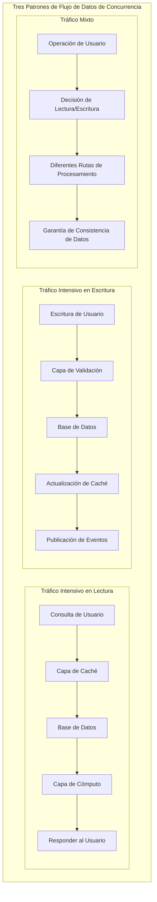

| Sistema            | Patrón de Tráfico Principal     | Patrón de Acceso   | Requisito de Consistencia | Amigabilidad con la Caché |
| ------------------ | ------------------------------- | ------------------ | ------------------------- | ------------------------- |
| Comercio de Inversiones | Intensivo en lectura (90%) + Escrituras clave (10%) | Concentrado en puntos calientes | Consistencia Fuerte       | Alta                      |
| Finanzas Familiares | Lectura/Escritura equilibrado (60:40)   | Disperso uniformemente | Consistencia Eventual     | Media                     |
| Monitoreo de Salud | Intensivo en escritura (70%) + Lecturas analíticas (30%) | Patrón de series temporales | Consistencia Secuencial   | Baja                      |

Cuando hablamos de concurrencia, lo más importante es entender la filosofía de que **más vale prevenir que curar**: cómo evitar cuellos de botella de rendimiento en la fase de diseño, en lugar de apagar incendios después de que surjan los problemas.

---

## Parte 1: Prevención de Cuellos de Botella de Rendimiento en la Capa de Aplicación - Cuatro Conceptos Fundamentales (Pool de Conexiones, Procesamiento Asíncrono, Caché, Procesamiento por Lotes)

### Concepto 1: Pool de Conexiones - "La Sabiduría de la Reutilización de Recursos"

**Idea Central**: Imagina la gestión de asientos en una biblioteca pública.

-   Si cada lector tuviera que traer su propia mesa y silla y limpiar al irse, sería muy ineficiente.
-   La biblioteca prepara los asientos con antelación. Los lectores llegan, se sientan y dejan el asiento para la siguiente persona.
-   Un pool de conexiones a bases de datos funciona bajo el mismo principio.

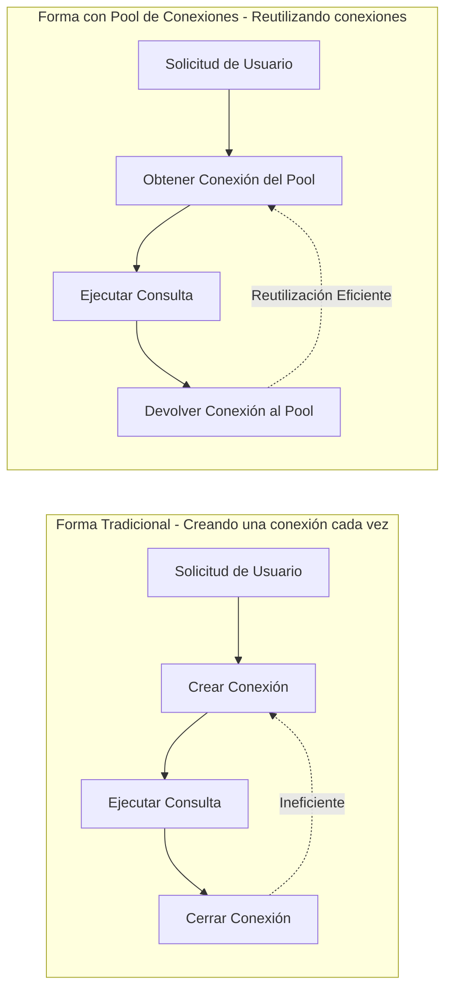

**Puntos Clave de Reflexión**:

-   **Pre-asignación**: Preparar recursos con antelación para evitar la sobrecarga de la creación temporal.
-   **Reutilización**: Una conexión puede ser utilizada por múltiples solicitudes de forma rotatoria.
-   **Control de Límites**: Establecer un número mínimo y máximo de conexiones para evitar el desperdicio o la escasez de recursos.

### Concepto 2: Procesamiento Asíncrono - "Desacoplando Tiempo y Espacio"

**Idea Central**: Imagina el proceso de pedido en un restaurante.

-   Forma tradicional: El cliente pide → El chef cocina → El cliente espera → Se sirve la comida → Pago.
-   Forma asíncrona: El cliente pide → Recibe un número y se va → El chef cocina → Se llama al número para recoger.

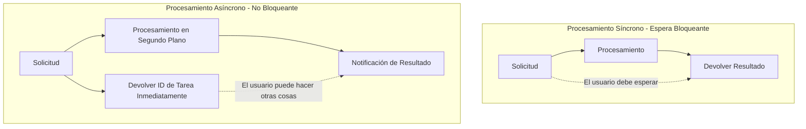

**Puntos Clave de Reflexión**:

-   **Desacoplamiento del Tiempo**: Separar el tiempo de procesamiento del tiempo de respuesta.
-   **Aumento del Rendimiento**: Se pueden aceptar más solicitudes en la misma cantidad de tiempo.
-   **Experiencia del Usuario**: Los usuarios no tienen que esperar ociosamente; pueden hacer otras cosas.

### Concepto 3: Caché - "La Jerarquía de la Memoria"

**Idea Central**: Como el sistema de memoria humana.

-   **Memoria a corto plazo**: Un número de teléfono que acabas de memorizar (caché local).
-   **Memoria a largo plazo**: El número de teléfono de un amigo familiar (caché distribuida).
-   **Memoria externa**: Buscar en una guía telefónica (base de datos).

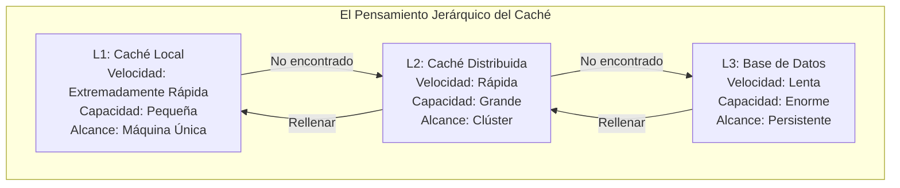

**Puntos Clave de Reflexión**:

-   **Principio de Proximidad**: Los datos más cercanos al usuario se acceden más rápido.
-   **Concentración de Puntos Calientes**: Los datos de uso frecuente se colocan en ubicaciones de acceso rápido.
-   **Compensación de Capacidad**: Intercambiar espacio por tiempo y costo por rendimiento.

### Concepto 4: Procesamiento por Lotes - "El Efecto Económico del Volumen"

**Idea Central**: Como la lógica de la entrega de mensajería.

-   No envías un vehículo por cada paquete individual recibido.
-   En su lugar, acumulas un cierto número o esperas hasta un momento específico para entregarlos todos a la vez.

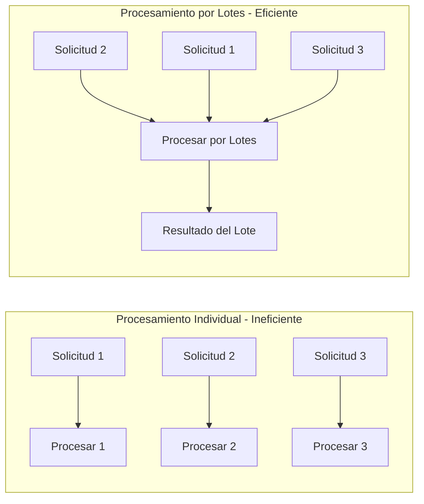

**Puntos Clave de Reflexión**:

-   **Efecto de Agregación**: Combinar múltiples tareas pequeñas en una tarea grande.
-   **Amortización de Costos**: Los gastos generales fijos se comparten entre múltiples operaciones.
-   **Compensación de Tiempo**: Un ligero retraso a cambio de una mayor eficiencia general.

---

## Parte 2: Prevención de cuellos de botella en el rendimiento de la capa de datos - Cuatro estrategias principales (Indexación, Optimización de consultas, Particionamiento/Sharding, División de lectura/escritura)

### Estrategia 1: Indexación - "El sistema de directorio de datos"

**Idea central**: Como el sistema de clasificación en una biblioteca.

-   Sin un catálogo: Para encontrar un libro, tienes que buscar estante por estante.
-   Con un catálogo: Consultas el catálogo y localizas rápidamente la posición específica.

```mermaid
graph TB
    subgraph "El pensamiento esencial de la indexación"
        subgraph "Sin índice"
            N1[Escaneo completo de la tabla] --> N2[Verificación fila por fila] --> N3[Encontrar objetivo]
            N2 -.->|Eficiencia: O(n)| N3
        end

        subgraph "Con índice"
            H1[Búsqueda de índice] --> H2[Ubicación directa] --> H3[Obtener datos]
            H2 -.->|Eficiencia: O(log n)| H3
        end
    end
```

**Puntos clave a considerar**:

-   **Espacio por tiempo**: Usar espacio de almacenamiento adicional para ganar velocidad de consulta.
-   **Principio de selectividad**: La efectividad de un índice depende de la unicidad de los datos.
-   **Costo de mantenimiento**: Los índices deben actualizarse sincrónicamente cuando los datos cambian.

### Estrategia 2: Optimización de consultas - "El arte de hacer preguntas"

**Idea central**: Como la habilidad de pedir información.

-   Pregunta incorrecta: "¿Sabes todo sobre esta persona?"
-   Pregunta correcta: "¿Sabes el número de teléfono de John Smith?"

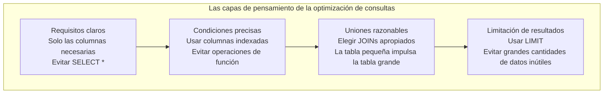

**Puntos clave a considerar**:

-   **Expresión precisa**: Cuanto más específica sea la condición de la consulta, más fácil será para el sistema optimizar.
-   **Principio de minimalidad**: Solo toma lo que se necesita, no más.
-   **Ruta óptima**: Elige la ruta de acceso a los datos más efectiva.

### Estrategia 3: Particionamiento/Sharding - "La sabiduría de dividir y conquistar"

**Idea central**: Como gestionar una biblioteca enorme.

-   Biblioteca única: Todos los libros están juntos, lo que dificulta encontrar algo.
-   Gestión de sucursales: Dividida en varias bibliotecas pequeñas por tema, cada una gestionada de forma independiente.

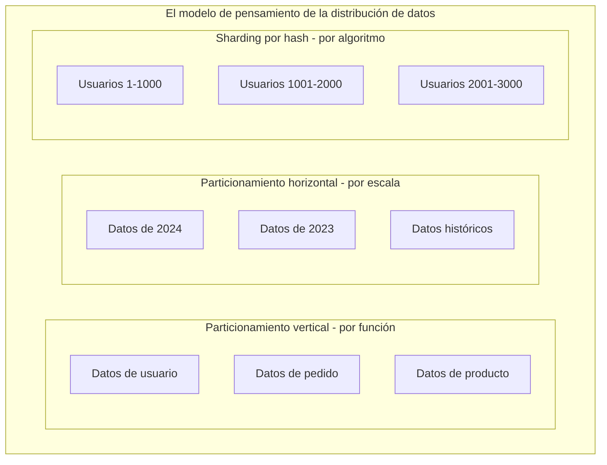

**Puntos clave a considerar**:

-   **Control de escala**: Descomponer un problema grande en múltiples problemas pequeños.
-   **Procesamiento paralelo**: Múltiples shards pueden trabajar simultáneamente.
-   **Localidad**: Los datos relacionados se mantienen juntos para reducir las consultas entre shards.

### Estrategia 4: División de lectura/escritura - "La eficiencia de la especialización"

**Idea central**: Como la división del trabajo en un hospital.

-   Mostrador de registro: Se especializa en manejar registros (operaciones de escritura).
-   Mostrador de información: Se especializa en responder preguntas (operaciones de lectura).
-   Cada uno tiene su propia función y no interfieren entre sí.

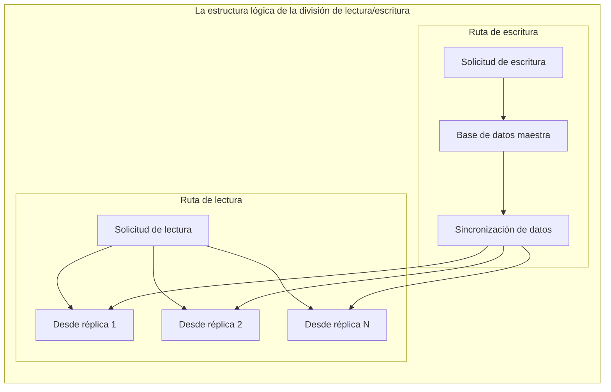

**Puntos clave a considerar**:

-   **Separación de funciones**: Las operaciones de lectura y escritura utilizan diferentes recursos.
-   **Distribución de carga**: Múltiples réplicas de lectura comparten la presión de las consultas.
-   **Compromiso de consistencia**: Aceptar un breve retraso en los datos a cambio de rendimiento.

---

## Parte 3: Optimización de la Coordinación del Sistema - Pensamiento Holístico (Consistencia de Caché, Límites de Transacción)

### Concepto 1: Consistencia de Caché - "El Arte de la Sincronización"

**Desafío Principal**: Imagina a varias personas editando el mismo documento simultáneamente.

-   ¿Cómo asegurar que todos vean la última versión?
-   ¿Cómo manejar los conflictos?
-   ¿Cómo equilibrar eficiencia y precisión?

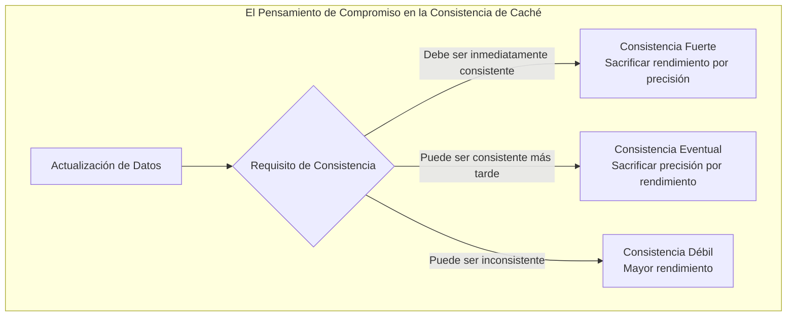

### Concepto 2: Límites de Transacción - "El Alcance de la Responsabilidad"

**Idea Principal**: Como la lógica de firmar un contrato.

-   Alcance del contrato demasiado grande: Alto riesgo, propenso a problemas.
-   Alcance del contrato demasiado pequeño: Ineficiente, firma de ida y vuelta.
-   Alcance apropiado: Responsabilidades claras, riesgos manejables.

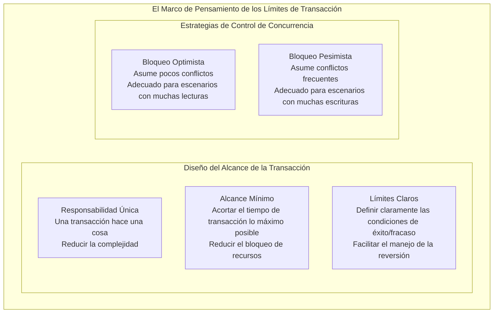

---

## Parte 4: Modelo Abstracto de Diseño de Limitación de Tasa: El Equilibrio entre Protección y Orientación

### El Triple Objetivo de la Limitación de Tasa

La limitación de tasa no se trata solo de proteger los recursos del sistema, sino de un **mecanismo de regulación inteligente para el tráfico de datos**:

**Protección**: Prevenir la sobrecarga del sistema.
**Orientación**: Optimizar el uso de los recursos.
**Predicción**: Proporcionar datos para el precalentamiento de la caché.

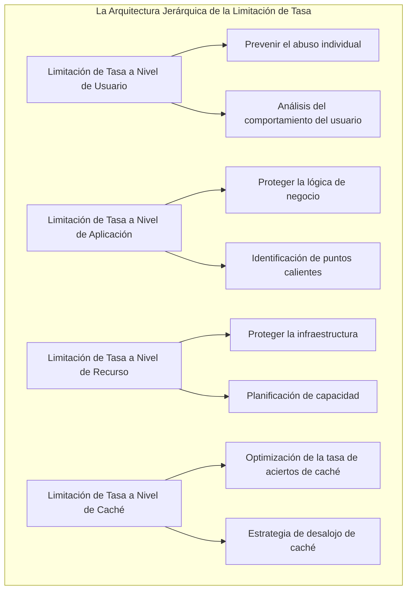

### 3.1 La Filosofía de Diseño Sistemático de la Limitación de Tasa

El **Marco 2x2 de FluxNinja** proporciona una metodología estándar para el diseño de limitación de tasa en 2024, dividiendo las estrategias en cuatro cuadrantes, cada uno correspondiente a diferentes escenarios de negocio e implementaciones técnicas:

```mermaid
quadrantChart
    title El Marco 2x2 para la Selección de Estrategias de Limitación de Tasa
    x-axis Estrategia Estática --> Estrategia Adaptativa
    y-axis Limitación de Tasa Global --> Limitación de Tasa por Usuario

    quadrant-1 Limitación de Tasa Inteligente Personalizada
        : Control de concurrencia a nivel de usuario de Netflix
        : Cuota de API por cliente de Stripe
        : Logró una mejora del rendimiento del 40%

    quadrant-2 Limitación de Tasa Global a Nivel Empresarial
        : AWS API Gateway
        : Control de volumen total de servicios en la nube
        : Protege la infraestructura

    quadrant-3 Protección Básica del Servicio
        : Limitación de Tasa Tradicional
        : Umbral de QPS fijo
        : Simple y fiable

    quadrant-4 Control de Tráfico Inteligente
        : Limitación de concurrencia adaptativa
        : Basado en la retroalimentación de latencia
        : Redujo la latencia promedio en un 35%
```

### 3.2 El Avance Fundamental de los Algoritmos de Limitación de Tasa Adaptativa

El **algoritmo de Limitación de Concurrencia Adaptativa de Netflix**, basado en la Ley de Little, ha logrado un gran avance en el campo de la limitación de tasa:

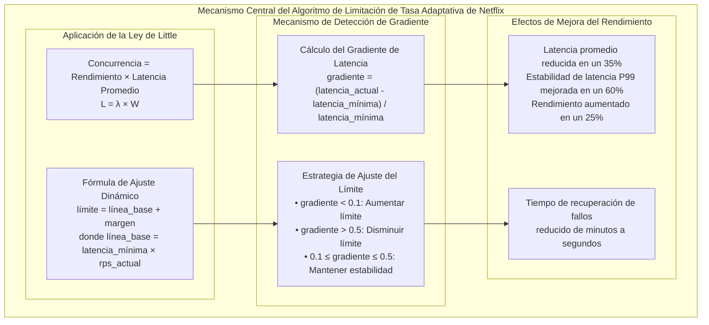

### 3.3 Puntos de Referencia de Rendimiento del Algoritmo y Estrategia de Selección

Basado en los últimos datos de pruebas de estrés de 2024, el rendimiento de diferentes algoritmos de limitación de tasa en escenarios estandarizados:

```mermaid
xychart-beta
    title "Comparación de Puntos de Referencia de Rendimiento de Algoritmos de Limitación de Tasa (10K solicitudes concurrentes)"
    x-axis [Token_Bucket, Sliding_Window, Fixed_Window, Leaky_Bucket]
    y-axis "Capacidad de Procesamiento QPS" 0 50000
    bar [45000, 42000, 38000, 35000]
```

```mermaid
xychart-beta
    title "Comparación de Rendimiento de Latencia P99"
    x-axis [Token_Bucket, Sliding_Window, Fixed_Window, Leaky_Bucket]
    y-axis "Latencia (ms)" 0 30
    line [12, 15, 22, 18]
```

**Árbol de Decisión para la Selección de Algoritmos**:

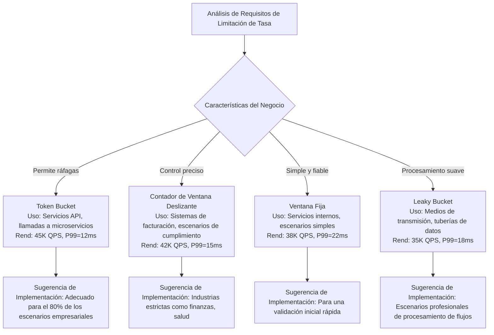

## Conclusión: La Filosofía Central de la Optimización del Rendimiento

### El Pensamiento Jerárquico de los Principios de Diseño

```mermaid
pyramid
    title La Pirámide de la Sabiduría en la Optimización del Rendimiento
    "Diseño Preventivo" : 40
    "Monitoreo y Alertas" : 30
    "Diagnóstico de Problemas" : 20
    "Resolución de Emergencias" : 10
```

**Primera Capa: Diseño Preventivo (La más importante)**

-   Considerar la concurrencia y la escalabilidad en la fase de diseño del sistema.
-   Elegir patrones arquitectónicos y soluciones técnicas apropiadas.
-   Establecer una asignación de recursos y configuraciones de límites razonables.

**Segunda Capa: Monitoreo y Alertas**

-   Establecer un sistema de monitoreo integral.
-   Configurar umbrales de alerta razonables.
-   Descubrir problemas potenciales con antelación.

**Tercera Capa: Diagnóstico de Problemas**

-   Localizar rápidamente los cuellos de botella del rendimiento.
-   Analizar la causa raíz.
-   Desarrollar soluciones específicas.

**Cuarta Capa: Resolución de Emergencias**

-   Ajuste temporal del rendimiento.
-   Escalado de emergencia.
-   Planes de degradación de contingencia.

### Un Marco de Pensamiento para la Aplicación Práctica

Cuando nos enfrentamos a un problema de diseño de sistemas, debemos hacernos estas preguntas:

1.  **Reutilización de Recursos**: ¿Puede esta operación reutilizar recursos existentes?
2.  **Desacoplamiento Asíncrono**: ¿Este proceso tiene que completarse inmediatamente? ¿Puede manejarse de forma asíncrona?
3.  **Aceleración por Caché**: ¿Se accederá a estos datos repetidamente? ¿Se pueden almacenar en caché?
4.  **Procesamiento por Lotes**: ¿Se pueden procesar varias operaciones similares juntas?
5.  **Divide y Vencerás**: ¿Se puede dividir este gran problema en otros más pequeños?
6.  **Especialización**: ¿Se pueden manejar diferentes tipos de operaciones por separado?

Recuerda: **La mejor optimización del rendimiento es evitar los problemas de rendimiento en la fase de diseño, no resolverlos después de que ocurran.**

## Resumen de Mejores Prácticas de AWS

### Guía de Selección de Servicios de AWS

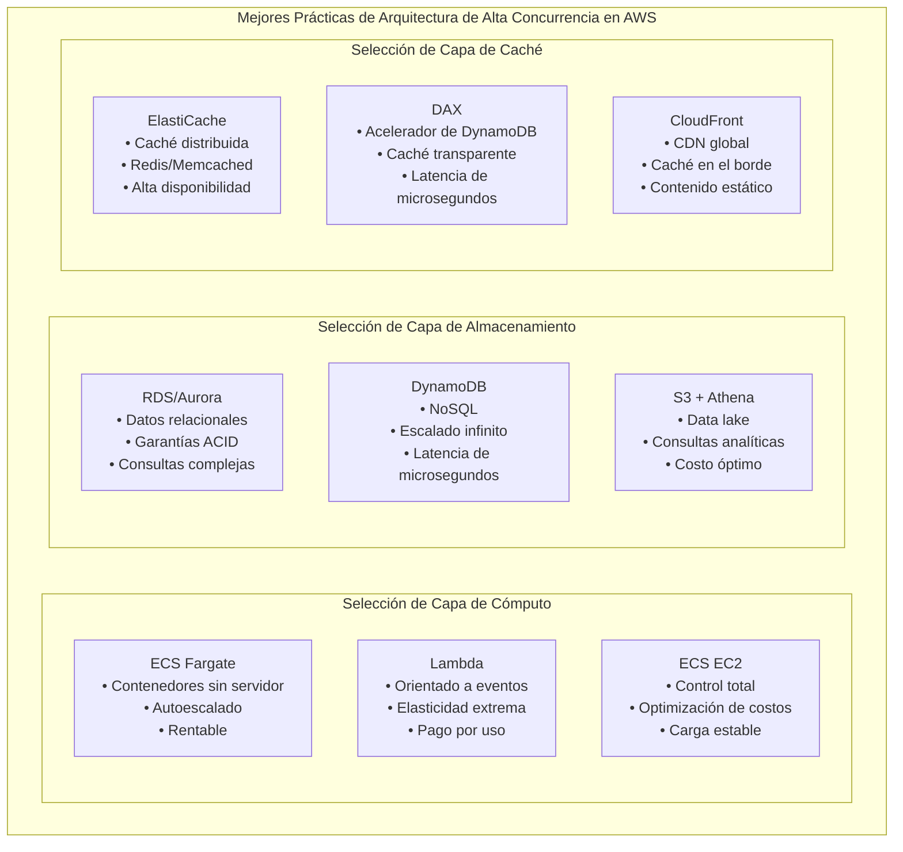

### Estrategias de Optimización de Costos

| Combinación de Servicios            | Escenario Aplicable          | Características de Costo       | Características de Rendimiento      |
| ----------------------------------- | ---------------------------- | -------------------------- | -------------------------------- |
| **Lambda + DynamoDB + DAX**         | Tráfico en ráfagas, orientado a eventos | Pago por uso, costo controlable | Elasticidad extrema, latencia de arranque en frío |
| **ECS Fargate + Aurora Serverless** | Carga predecible, autoescalado | Costo y rendimiento equilibrados | Escalado rápido, buena estabilidad     |
| **ECS EC2 + RDS + ElastiCache**     | Carga alta estable, sensible al costo | Las instancias reservadas ahorran un 60% | Mayor rendimiento, gestión compleja |

### Configuración de Monitoreo y Alertas

**Métricas Clave de CloudWatch**:

-   **Capa de Aplicación**: Utilización de CPU/Memoria de ECS, Tiempo de Ejecución de Lambda, Latencia de API Gateway
-   **Capa de Base de Datos**: Conexiones de RDS, Retraso de Replicación de Aurora, Capacidad de Lectura/Escritura de DynamoDB
-   **Capa de Caché**: Tasa de Aciertos de ElastiCache, Latencia de DAX, Relación de Aciertos de Caché de CloudFront

**Mejores Prácticas de Automatización**:

-   Usar Auto Scaling para ajustar automáticamente los recursos según las métricas.
-   Configurar alarmas de CloudWatch para monitoreo preventivo.
-   Utilizar AWS Config para asegurar configuraciones de mejores prácticas.

Finalmente, basándonos en pruebas de rendimiento reales y análisis de costos, proporcionamos recomendaciones de configuración de AWS diferenciadas para los tres escenarios que hemos estado discutiendo:

**Sistema de Trading de Inversiones: Configuración de Rendimiento Extremo**

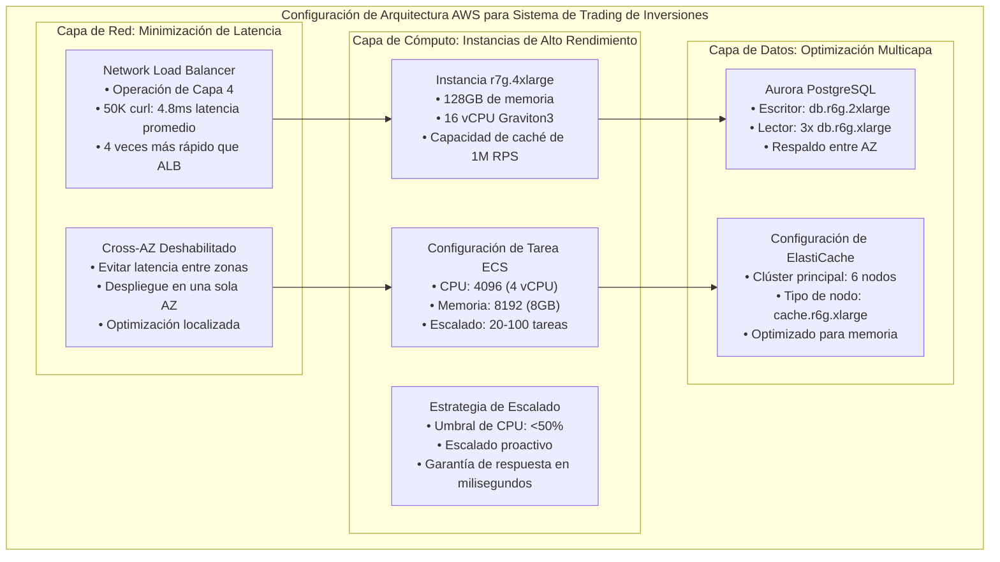

**Sistema de Finanzas Familiares: Configuración de Optimización de Costos**

```mermaid
graph TB
    subgraph "Arquitectura AWS Optimizada para Costos de Sistema de Finanzas Familiares"
        subgraph "Estrategia de Cómputo Híbrida"
            H1["Lambda + ECS Híbrido<br/>• Lambda: Procesamiento en ráfagas<br/>• ECS: Carga estable<br/>• Costo: 60% de ahorro"]
            H2["Configuración de ECS<br/>• CPU: 1024 (1 vCPU)<br/>• Memoria: 2048 (2GB)<br/>• Escalado: 2-10 tareas"]
            H3["Configuración de Lambda<br/>• Memoria: 512MB<br/>• Tiempo de espera: 30s<br/>• Concurrencia: 100"]
        end

        subgraph "Simplificación de Base de Datos"
            DB1["RDS PostgreSQL<br/>• Instancia: db.t4g.medium<br/>• Almacenamiento: SSD de Propósito General<br/>• Respaldo: Retención de 7 días"]
            DB2["Ahorros de ElastiCache<br/>• Nodo: cache.t4g.medium<br/>• Nodo único: Entorno de desarrollo<br/>• 2 nodos: Entorno de producción"]
        end

        subgraph "Estrategias de Control de Costos"
            CC1["Instancias Spot<br/>• ECS Spot: 70% de ahorro de costos<br/>• Cargas no críticas<br/>• Conmutación por error automática"]
            CC2["Instancias Reservadas<br/>• Plazo de 1 año: 40% de descuento<br/>• Plazo de 3 años: 60% de descuento<br/>• Adecuado para cargas estables"]
        end

        H1 --> DB1 --> CC1
        H2 --> DB2 --> CC2
        H3 --> CC1
    end
```

Estas configuraciones de servicios de AWS proporcionan una base técnica concreta para el diseño de caché de mañana:

-   **Arquitectura de Caché Multicapa**: ElastiCache + Caché de Aplicación + CDN
-   **Selección de Estrategia de Caché**: Basada en el número de tareas de ECS y patrones de carga
-   **Optimización de Costos**: Análisis costo-beneficio de diferentes combinaciones de servicios
-   **Integración de Monitoreo**: Ajustes de estrategia de caché impulsados por métricas de CloudWatch

## Filosofía de Diseño de Concurrencia Actual

-   **La esencia de la concurrencia es el arte de gestionar el flujo de datos**: Diferentes patrones de tráfico requieren diferentes estrategias arquitectónicas.
-   **La limitación de tasa es para guiar, no para bloquear**: Una limitación de tasa inteligente crea condiciones para la optimización de la caché.
-   **La estratificación de datos sirve a la estrategia de caché**: La estratificación de datos calientes, templados y fríos corresponde directamente a los niveles de caché.
-   **La evolución arquitectónica refleja la gestión de la complejidad**: Una progresión gradual de monolito a microservicios a arquitectura basada en eventos.

### Las Tres Etapas de la Evolución Arquitectónica

#### Etapa 1: Optimización de la Concurrencia en Arquitectura Monolítica

-   **Estrategia Central**: Concentrar todo el rendimiento en una única entidad, confiando en el "escalado vertical" para soportar la demanda.
-   **Significado Simbólico**: Como el tronco de un árbol que crece hacia arriba, acumulando energía continuamente en la misma dirección.
-   **Limitación**: Una vez que se superan los límites del hardware, el espacio de expansión es limitado.

#### Etapa 2: Coordinación de la Concurrencia en Arquitectura de Microservicios

-   **Estrategia Central**: Lograr la resiliencia del grupo a través del paralelismo de múltiples servicios y el autoescalado.
-   **Significado Simbólico**: Como una orquesta, logrando mayor volumen y armonía a través de la coordinación y la división del trabajo.
-   **Limitación**: La comunicación entre servicios, la latencia y la gestión de la consistencia se convierten en nuevos desafíos.

#### Etapa 3: Procesamiento de Flujo de Concurrencia en Arquitectura Basada en Eventos

-   **Estrategia Central**: Con los eventos como la unidad más pequeña, el sistema puede percibir y responder elásticamente en tiempo real.
-   **Significado Simbólico**: Como un río que fluye continuamente y puede ajustar su velocidad y dirección según los cambios del terreno y el tiempo.
-   **Limitación**: El orden de los eventos, la consistencia temporal y la estabilidad del procesamiento de flujos se convierten en los cuellos de botella de la nueva era.

#### Trayectoria Evolutiva Abstracta

1.  **Fortalecimiento Centralizado**: Hacer un único punto más grande, manteniendo el orden con hardware y una simple gestión de acceso.
2.  **Orquestación Distribuida**: Múltiples puntos en paralelo, manteniendo la armonía general a través de la coordinación y el reparto.
3.  **Flujo Dinámico**: Con los eventos como el pulso, adaptándose al entorno a través del control de flujo y la respuesta elástica.

En general, estas tres capas de abstracción revelan un camino evolutivo desde la **Estabilidad Estática → Coordinación Dinámica → Adaptación Fluida**.

```mermaid
flowchart TD
    A[Etapa 1: Arquitectura Monolítica
"Fortalecimiento Centralizado"] --> B[Etapa 2: Arquitectura de Microservicios
"Orquestación Distribuida"]
    B --> C[Etapa 3: Arquitectura Basada en Eventos
"Flujo Dinámico"]

    subgraph S1[Características del Monolito]
      A1[(Escalado Vertical)]
      A2[(Caché Local)]
      A3[(Límite de Tasa Simple)]
    end
    A --> A1 & A2 & A3

    subgraph S2[Características de Microservicios]
      B1[(Escalado Horizontal)]
      B2[(Caché Distribuida)]
      B3[(Límite de Múltiples Niveles)]
    end
    B --> B1 & B2 & B3

    subgraph S3[Características Basadas en Eventos]
      C1[(Elástico Impulsado por Eventos)]
      C2[(Caché de Streaming)]
      C3[(Control de Contrapresión)]
    end
    C --> C1 & C2 & C3

```

Recuerda: El objetivo final del diseño de alta concurrencia no es manejar más solicitudes, sino proporcionar a los usuarios una experiencia de servicio estable, rápida y optimizada en costos. Cada elección de estrategia de concurrencia debe servir a la **fiabilidad, escalabilidad y mantenibilidad** de la arquitectura general.

---

> "El verdadero arte de los sistemas concurrentes reside en esto: no estamos diseñando máquinas para manejar tráfico, sino tuberías inteligentes para guiar el flujo de datos. Cada decisión arquitectónica debe hacer que los datos fluyan al lugar correcto, en el momento correcto, de la manera correcta."
