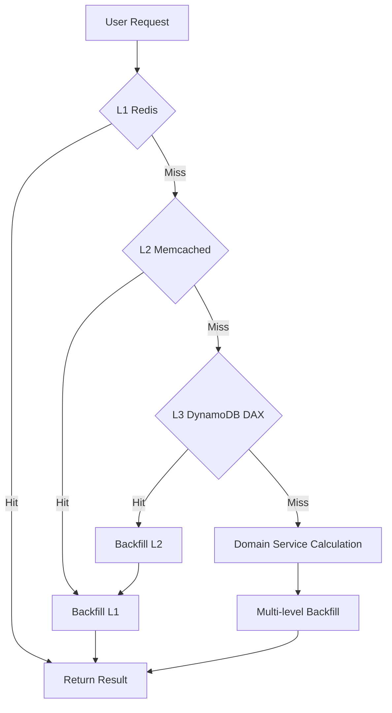

# Day 10 | キャッシング戦略の哲学：時間、空間、一貫性のバランスの技術

9日間のモデリングと分析を経て、システムの本質、境界、相互作用パターンを定義してきました。しかし今、私たちはより実践的な問題に直面しています：**現実世界の制約下で、これらの慎重に設計されたドメイン概念をユーザーのニーズに迅速に応答させるにはどうすればよいでしょうか？**

投資取引システムがミリ秒単位でリスク計算を完了する必要がある場合、家計管理システムが複数人による同時操作をサポートする必要がある場合、健康モニタリングシステムが大量のIoTデータを処理する必要がある場合、純粋なビジネスロジックの計算だけではパフォーマンス要件を満たすことはできません。

これが**キャッシュ設計**の存在論的意義です：**ドメインの純粋性を維持しながら、システムに時間と空間の最適化戦略を注入すること。**

すべてのキャッシング決定は、ユーザー体験、システムコスト、データの正確性に影響を与えます。したがって、キャッシングのアーキテクチャ設計は、ドメイン駆動設計において間違いなく最優先事項です。

すべての要件確認において、私たちは尋ねる必要があり、また尋ねなければなりません：

**このビジネスシナリオにおいて、レイテンシとデータ不整合に対する許容度はどの程度か？そのためにどれだけの開発・運用コストを支払う用意があるか？**

これから、キャッシングにおいて遭遇する最も一般的な状況と問題について段階的に議論していきます。以下はトピックの簡単なリストです：

- キャッシュの存在論的三位一体：ローカル、クラウド、データサイド
- データ一貫性の3つのレベル：強い一貫性、結果整合性、因果整合性
- セキュリティ露出とパフォーマンスの弁証法的関係
- キャッシュ無効化戦略：時間の哲学
- コストモデリング：ROI駆動のキャッシュ決定
- キャッシュモニタリング：観測可能性の3つの次元

このフレームワークを覚えておいてください：**ホットネスが場所を決定し**、**許容度がモデルを決定し**、**結合度が実装を決定する**。キャッシングが必要なシナリオに直面したとき、まずこれら3つの原則を使って分析すれば、技術選択は自然と導き出されます。

## キャッシュの存在論的三位一体：ローカル、クラウド、データサイド

**キャッシュはいつ更新されるべきか？コスト管理とシステムパフォーマンスの最適なバランスをどのように見つけるか？キャッシングがもたらすデータ整合性の問題をどのように扱うか？**

キャッシングは単なる技術的最適化ではなく、**データの存在状態**についての深い考察です。すべてのデータは、異なる場所と異なる時間において、それ固有の意味と価値を持ちます。

キャッシュの本質は、私たちの隣に本棚を置くようなものです。

この本棚は、私たちの机の上（**ローカルキャッシュ**）、階下の読書室（**クラウドキャッシュ**）、あるいは図書館入口の速読ロッカー（**データベースキャッシュ**）にあります。

しかし、ここで問題が発生します：

1.  **限られたスペース**：本棚はすべての本を収容できません。本Aを置けば、本Bを取り除く必要があるかもしれません。これが**追い出しポリシー**、例えばLRU（Least Recently Used：最も最近使われていない）です。
2.  **情報が古くなる**：図書館の本は更新されますが、私たちの棚の本はまだ古いバージョンです。これが**一貫性**の問題です。
3.  **管理コスト**：本棚を整理し、どの本を保管し、どの本を更新するかを決定するために労力を費やさなければなりません。これが**キャッシング戦略**のコストです。

したがって、すべてのキャッシュ設計技術は、この中核的な質問を中心に展開されます：「最小限の管理コストで、限られた本棚スペースに最も価値があり最新の情報をどのように最大限に保存するか。」

データを分類する一般的な方法は、ホットデータ、ウォームデータ、コールドデータです。

**ホットデータ**：例えば、取引システムのリアルタイム株価や、ソーシャルメディアのトレンド投稿。

-   **特徴**：読み取り頻度が非常に高く、時効性が非常に短い（秒単位またはミリ秒単位）。
-   **選択基準**：速度がすべて。最も速い本棚が必要であり、それは私たちに最も近い場所になければなりません。
-   **技術選択**：インメモリキャッシュ、例えばRedisやMemcached。データを直接メモリに保存し、読み取り速度はマイクロ秒レベルで、私たちの脳の記憶と同じくらい速い。
-   **長所と短所**：
    -   **長所**：究極の速度。
    -   **短所**：高価（メモリはディスクよりはるかに高価）、データは揮発性（追加の永続化メカニズムがなければ電源障害で失われる）。

**ウォームデータ**：例えば、私たちの個人プロフィールページや、あまり変更されない製品カタログ。

-   **特徴**：読み取り頻度は高いが、数分または数時間の遅延を許容できる。
-   **選択基準**：コストとパフォーマンスのバランス。ユーザーに近い場所に配置できるが、自分で維持する必要のない場所。
-   **技術選択**：CDN（Content Delivery Network）、例えばCloudFrontやCloudflare。世界中にノード（読書室）があり、ユーザーに最も近い場所にデータをキャッシュできます。
-   **長所と短所**：
    -   **長所**：サーバー負荷を大幅に削減し、グローバルユーザーのアクセス速度を向上させる。
    -   **短所**：主に公開または半公開データに適している。パーソナライズされた動的コンテンツのキャッシュ設定は複雑で、キャッシュ無効化（更新）は即座ではない。

**コールドデータ**：例えば、数年前の取引記録や、非アクティブユーザーのデータ。

-   **特徴**：ほとんど読まれないが、必要なときにアクセスできなければならない。
-   **選択基準**：コストを最小化。図書館（データベース）から直接取得しても構わない、または、これらの本をより安価な地下アーカイブに移動することも検討できます。このタイプのデータは通常キャッシュする価値がありません。

```mermaid
graph TB
    subgraph "Data Timeliness Matrix"
        A1[Real-time Price Data<br/>Second-level updates]
        A2[User Position Data<br/>Updated on trade]
        A3[Risk Indicator Data<br/>Minute-level recalculation]
        A4[Historical Report Data<br/>Daily updates]

        B1[Family Budget Status<br/>Updated on expense]
        B2[Monthly Statistics<br/>Daily updates]
        B3[User Preference Settings<br/>Manual updates]
        B4[Historical Expense Data<br/>Immutable data]

        C1[Device Real-time Data<br/>Minute-level updates]
        C2[Health Trend Analysis<br/>Hourly updates]
        C3[Alert Threshold Settings<br/>Manual updates]
        C4[Medical History Records<br/>Append-only data]
    end

    subgraph "Cache Strategy Mapping"
        S1[Write-Through<br/>Write and cache immediately<br/>Strong Consistency]
        S2[Write-Behind<br/>Delayed write<br/>Eventual Consistency]
        S3[Cache-Aside<br/>Manual management<br/>Causal Consistency]
        S4[Read-Through<br/>Penetrating read<br/>Configurable Consistency]
    end

    subgraph "Technology Implementation"
        T1[Redis Cluster<br/>+ ElastiCache]
        T2[DynamoDB DAX<br/>+ Lambda Async]
        T3[Application Cache<br/>+ EventBridge]
        T4[CloudFront<br/>+ S3 Origin]
    end

    %% Investment Trading System Mapping
    A1 --> S1
    A1 --> T1
    A2 --> S2
    A2 --> T2
    A3 --> S3
    A3 --> T1
    A4 --> S4
    A4 --> T4

    %% Family Finance System Mapping
    B1 --> S3
    B1 --> T3
    B2 --> S4
    B2 --> T2
    B3 --> S3
    B3 --> T3
    B4 --> S4
    B4 --> T4

    %% Health Monitoring System Mapping
    C1 --> S1
    C1 --> T1
    C2 --> S2
    C2 --> T2
    C3 --> S3
    C3 --> T3
    C4 --> S4
    C4 --> T4

    %% Strategy to Technology Association
    S1 --> T1
    S2 --> T2
    S3 --> T3
    S4 --> T4

    classDef hotData fill:#ff6b6b,stroke:#333,stroke-width:2px,color:#fff
    classDef warmData fill:#ffd93d,stroke:#333,stroke-width:2px,color:#333
    classDef coldData fill:#6bcf7f,stroke:#333,stroke-width:2px,color:#333
    classDef strategy fill:#4ecdc4,stroke:#333,stroke-width:2px,color:#fff
    classDef tech fill:#a8e6cf,stroke:#333,stroke-width:2px,color:#333

    class A1,C1 hotData
    class A2,A3,B1,B2,C2 warmData
    class A4,B3,B4,C3,C4 coldData
    class S1,S2,S3,S4 strategy
    class T1,T2,T3,T4 tech
```



これとキャッシュロケーションの近接性を組み合わせると、いくつかの一般的なレイヤーを特定できます：ローカル、クラウド、データサイド。

### 第一の存在：ローカルキャッシュ - ユーザー意識に最も近いデータ

**哲学的位置づけ**：ローカルキャッシュは、データとユーザー認識の最も直接的な接点です。「どのデータがすぐに利用可能であるべきか？」という質問に答えます。

#### 投資取引システムのローカルキャッシュ設計

```javascript
// フロントエンドローカルキャッシュのドメイン抽象化
class PortfolioLocalCache {
  constructor() {
    this.realtimeData = new Map(); // リアルタイムデータ：価格、ポジション
    this.calculatedMetrics = new Map(); // 計算結果：リスク値、損益
    this.userPreferences = new Map(); // ユーザー設定：UI設定、アラートしきい値
  }

  // コア洞察：異なるデータの無効化戦略はそのビジネス重要性を反映する
  getDataWithStrategy(key, dataType) {
    switch (dataType) {
      case "REAL_TIME_PRICE":
        return this.getOrFetch(key, 100); // 100ms有効期限
      case "RISK_CALCULATION":
        return this.getOrFetch(key, 1000); // 1秒有効期限、短い遅延を許容
      case "USER_PREFERENCES":
        return this.getOrFetch(key, 300000); // 5分有効期限、安定性が優先
    }
  }
}
```

**ローカルキャッシュの設計哲学**：

1.  **認知負荷の最小化**：最も頻繁に使用される機能はレイテンシゼロであるべき。
2.  **オフラインフォールトトレランス**：ネットワーク中断時でもシステムは部分的に機能できる。
3.  **プライバシー第一戦略**：機密データは優先的にローカルで処理される。

**AWS実装戦略**：

```yaml
# ローカルキャッシュの拡張としてのCloudFront Edge Locations
CloudFrontDistribution:
  PriceClass: PriceClass_All
  CacheBehaviors:
    - PathPattern: "/api/realtime/*"
      CachePolicyId: 4135ea2d-6df8-44a3-9df3-4b5a84be39ad # Caching Disabled
    - PathPattern: "/api/historical/*"
      CachePolicyId: 658327ea-f89d-4fab-a63d-7e88639e58f6 # Caching Optimized
      TTL: 3600 # 1時間キャッシュ、履歴データは比較的安定
```

### 第二の存在：クラウドキャッシュ - 分散データの調整センター

**哲学的位置づけ**：クラウドキャッシュは、複数のサービス間でのデータ共有のための調整メカニズムです。「分散環境でデータの一貫したビューをどのように維持するか」という問題を解決します。

#### 多層クラウドキャッシュアーキテクチャの設計

```python
# クラウドキャッシュの階層設計
class DistributedCacheStrategy:
    def __init__(self):
        self.l1_cache = ElastiCacheRedis(node_type="cache.r6g.large")
        self.l2_cache = ElastiCacheMemcached(node_type="cache.r6g.xlarge")
        self.l3_cache = DynamoDBDAX()  # データベースキャッシュ層

    async def get_portfolio_risk(self, portfolio_id):
        # L1: ホットデータ、ミリ秒アクセス
        risk_data = await self.l1_cache.get(f"risk:{portfolio_id}")
        if risk_data:
            return risk_data

        # L2: ウォームデータ、複雑な計算結果をサポート
        risk_data = await self.l2_cache.get(f"risk:{portfolio_id}")
        if risk_data:
            await self.l1_cache.set(f"risk:{portfolio_id}", risk_data, ttl=60)
            return risk_data

        # L3: コールドデータ、データベースキャッシュ層から取得
        risk_data = await self.calculate_and_cache_risk(portfolio_id)
        return risk_data
```

**クラウドキャッシュのドメインマッピング**：



**コスト考慮に基づく戦略決定**：

```yaml
# ElastiCacheコスト最適化設定
RedisCluster:
  NodeType: cache.r6g.large # メモリ最適化
  NumCacheNodes: 3
  AutomaticFailoverEnabled: true
  MultiAZEnabled: true
  # コスト分析: $0.2016/時間 * 3ノード * 24 * 30 = $435.5/月

MemcachedCluster:
  NodeType: cache.r6g.xlarge # より大きな容量、より低い単位コスト
  NumCacheNodes: 2
  # コスト分析: $0.4032/時間 * 2ノード * 24 * 30 = $580.6/月
# 合計キャッシュコスト: $1016.1/月
# 利益: RDSクエリを80%削減、データベース実行コストで月$2000節約
# ROI: (2000 - 1016) / 1016 = 96.8% 正の投資収益率
```

### 第三の存在：データサイドキャッシュ - データの起源に最も近い最適化

**哲学的位置づけ**：データサイドキャッシングは、ネイティブ環境でのデータの前処理と最適化です。「データ自体をより効率的にする方法は？」という質問に答えます。

#### DynamoDB DAXのドメイン価値

```python
# データサイドキャッシュとしてのDynamoDB DAXの抽象化
class DomainDataCache:
    def __init__(self):
        self.dax_client = boto3.client('dax',
                                     endpoint_url='daxs://portfolio-cluster.abcdef.dax-clusters.us-east-1.amazonaws.com')
        self.dynamodb = boto3.resource('dynamodb')

    async def get_portfolio_holdings(self, portfolio_id):
        # DAXは自動的にキャッシュロジックを処理、アプリケーションに対して透過的
        response = await self.dax_client.get_item(
            TableName='Portfolios',
            Key={'portfolio_id': {'S': portfolio_id}},
            ConsistentRead=False  # パフォーマンスのために結果整合性を受け入れる
        )
        return response['Item']
```

**データサイドキャッシュの設計原則**：

1.  **透過性**：アプリケーションコードはキャッシュの存在を意識する必要がない。
2.  **一貫性レベル**：ビジネスニーズに基づいて適切な一貫性レベルを選択する。
3.  **コスト効率性**：キャッシュコストとクエリコストのバランスポイントを計算する。

## データ一貫性の3つのレベル：強い一貫性、結果整合性、因果整合性

### 一貫性モデルのドメインセマンティクス

ビジネスがどれだけの「データ不整合」を許容できるかを考慮する必要があります。これはキャッシュ設計における最も困難な哲学的質問です。例えば、銀行口座残高や取引注文では、データ不整合が直接的な財務損失や法的問題を引き起こす可能性があります。この文脈では、**正確性がすべてに勝る**。遅くても間違うよりはまし。これには強い一貫性が必要です。

#### 強い一貫性、結果整合性、因果整合性

分散システムを設計する際、「一貫性」は中核的な問題です。特にキャッシング戦略に関しては、異なる一貫性モデルの理解がシステムの動作とパフォーマンスに直接影響します。以下は3つの主要な一貫性モデルとその特性です：

#### 1. 強い一貫性

**概念とアナロジー：**
Google Docsで単語を入力すると、同僚が（理論的には）その単語を**即座に**見られるようなものです。その後の操作はすべて、この最新バージョンに基づいています。全員がまったく同じ、唯一の「真実」を見ます。

**特徴：**

-   **線形化可能性**：書き込み操作が完了すると、その後のすべての読み取り操作（どのユーザーやノードから来ても）は、その書き込みまたはより新しいものの値を返さなければならない。
-   **原子性**：操作は完全に成功するか完全に失敗するか；中間状態はない。
-   **グローバル順序**：システム内のすべての操作は、単一のグローバルタイムラインで実行されているかのように見える。

**利点：**

-   **開発者の精神的オーバーヘッドが低い**：開発者はデータが古い可能性のある複雑な状況を処理する必要がない。ロジックが最も直感的。
-   **絶対的なデータ正確性**：金融取引、在庫管理、口座残高などのゼロトレランスシナリオでは、これが唯一の選択。

**欠点：**

-   **高レイテンシ**：システムはすべてのレプリカがデータ更新を完了したことを確認してからクライアントに書き込み成功を確認する必要があり、書き込み操作にかかる時間が増加する。
-   **低可用性**：ネットワークパーティションが発生した場合、一貫性を保証するために、システムはサービス（書き込みまたは読み取り）を拒否する可能性があり、可用性を犠牲にする（CAP定理の「A」に違反）。
-   **スケーラビリティの悪さ**：地理的に分散したシステムでは、リージョン間同期のレイテンシが巨大なボトルネックになる。

**AWSアプリケーションサービス：**

-   **Amazon RDS（単一プライマリノード付き）**：従来のリレーショナルデータベースは強い一貫性の古典的な例。すべての書き込みはプライマリノードで発生。
-   **Amazon DynamoDB（`ConsistentRead=True`の場合）**：読み取りを実行する際、DynamoDBに「強い一貫性の読み取り」を明示的に要求できます。これはリーダーパーティションから最新データを直接読み取りますが、より多くのRead Capacity Units（RCU）を消費し、レイテンシが高くなります。
-   **Amazon ElastiCache for Redis（トランザクションまたはロック付き）**：Redisの`MULTI/EXEC`トランザクションまたは分散ロック（RedLockなど）を使用することで、特定の操作に対して原子性と強い一貫性を強制できます。

#### 2. 結果整合性

**概念とアナロジー：**
FacebookやInstagramに写真を投稿します。友達は同じミリ秒でそれを見ることはできないかもしれません。アメリカの友達は台湾の友達より数秒遅れて見るかもしれませんが、システムは**最終的に**、しばらくすると全員が写真を見られることを保証します。

**特徴：**

-   **最終的な同期**：新しい更新がない場合、最終的にすべてのデータのレプリカが一貫した状態に達する。
-   **高可用性**：一部のノードやネットワークに問題があっても、システムは読み書き操作を受け付けることができ、サービスの継続性を優先する。
-   **特定の順序なし**：異なるレプリカ間での更新の順序を保証しない。

**利点：**

-   **低レイテンシ**：書き込み操作はすべてのレプリカの同期を待たずにローカルレプリカで迅速に完了して返すことができ、優れたユーザー体験を提供。
-   **高可用性**：システムは強い耐障害性を持ち、大規模でグローバルに分散したシステム向けに設計されている。
-   **高スループット**：読み書き操作を複数のノードに分散でき、システムのスループットを大幅に向上させる。

**欠点：**

-   **開発者の精神的オーバーヘッドが高い**：開発者は古いデータを読み取る可能性を処理できるアプリケーションロジックを設計する必要がある。
-   **一時的なデータ不整合**：同期が完了するまでの時間ウィンドウで、読み取り操作が古いデータを取得する可能性がある。

**AWSアプリケーションサービス：**

-   **Amazon DynamoDB（デフォルト読み取り）**：DynamoDBのデフォルト読み取りモードは「結果整合性読み取り」で、高速で強い一貫性読み取りの半分のコスト。
-   **Amazon S3**：S3は上書きPUTとDELETEに対して結果整合性を提供します。（注：S3は現在、新しいオブジェクトのPUTに対して強い一貫性を提供します）。
-   **Amazon CloudFront**：CDNは結果整合性の古典的な例。オリジンコンテンツを更新すると、世界中のエッジノードが最新コンテンツを同期するまで時間がかかります。

#### 3. 因果整合性

**概念とアナロジー：**
これは一貫性モデルにおける微妙なバランスです。フォーラムのコメントスレッドを想像してください：

1.  私たちがトピックAを投稿します。
2.  誰かがトピックAに返信してコメントBを投稿します。

因果整合性は以下を保証します：**コメントBを見る人は、トピックAも見られなければならない**。他の無関係な操作の順序は気にしませんが、「因果関係」を持つ操作の順序を厳密に保護します。ユーザーは「元の投稿」を見ずに「返信」を見ることはできません。

**特徴：**

-   **因果順序の保持**：操作Aが因果的に操作Bの前に起こる場合（例えば、BがAへの応答である場合）、システムはBを読み取るプロセスがAも読み取れることを保証します。
-   **並行操作は順序付けされない**：因果関係のない並行操作（例えば、2人のユーザーが同時に投稿Aにコメント）の場合、それらの順序は保証されません。

**利点：**

-   **パフォーマンスと論理的正確性のバランス**：強い一貫性よりも優れたパフォーマンスと可用性を持ちながら、結果整合性よりも強い論理的保証を提供し、ユーザー体験における多くの混乱を回避します。
-   **人間の直感に一致**：会話、コメント、共同編集などのシナリオに非常に適しています。

**欠点：**

-   **実装が複雑**：システムが操作間の依存関係を追跡する必要がある（多くの場合、ベクタークロックなどの技術を使用）ため、結果整合性よりも実装が困難。
-   **それでも強い一貫性ではない**：因果関係のないデータの場合、不整合が存在する可能性がある。

**AWSアプリケーションサービス：**

-   **Amazon DynamoDB Streams**：これは非常に巧妙な応用です。Streamsを使用してテーブルのすべての変更イベント（A、B、C...）をキャプチャし、順序付けて処理されることを保証できます。これにより、下流システムで因果関係を再構築できます。例えば、家計管理システムの例では、Streamsを使用して経費記録を処理することで、予算が順番に更新されることを保証し、これが因果整合性の実装です。
-   **Amazon QLDB（Quantum Ledger Database）**：QLDBは検証可能な台帳データベースで、データ変更の完全な履歴を記録します。このログを照会することで、すべての操作の因果チェーンを明示的に再構築できます。

#### 比較表の要約

| 特性              | 強い一貫性                      | 因果整合性            | 結果整合性                       |
| :---------------- | :----------------------------- | :-------------------- | :------------------------------- |
| **コア保証**      | 最新の書き込みを読み取る        | 読み取りは原因に従う  | 最終的に最新の書き込みを読み取る |
| **レイテンシ**    | 高                             | 中                    | 低                               |
| **可用性**        | 低                             | 中                    | 高                               |
| **開発複雑性**    | 低                             | 高                    | 中                               |
| **ユースケース**  | 銀行業務、在庫                 | コメントシステム、共同編集文書 | ソーシャルフィード、いいね数     |
| **AWS例**         | RDS、DynamoDB(ConsistentRead)  | DynamoDB Streams、QLDB | S3、DynamoDB(デフォルト)、CloudFront |

異なるビジネスシナリオはデータ不整合に対して異なる許容度を持ち、これがキャッシング戦略の設計に直接影響します。次に、進行中の金融シナリオ（投資金融と家計管理）を使用して、異なるコンテキストでの一貫性の必要性について議論します。

### 投資取引システムにおける一貫性トレードオフ

**シナリオ分析**：ユーザーが携帯電話とコンピューターで同時に投資ポートフォリオを操作する場合：

```python
class PortfolioConsistencyManager:
    def __init__(self):
        self.strong_consistency_cache = RedisCluster(consistency='strong')
        self.eventual_consistency_cache = CloudFrontCache(ttl=300)

    async def handle_trade_order(self, user_id, order):
        # 取引実行：強い一貫性が必須
        async with self.strong_consistency_cache.lock(f"portfolio:{user_id}"):
            current_balance = await self.get_account_balance(user_id)
            if current_balance >= order.amount:
                await self.execute_trade(order)
                await self.invalidate_all_portfolio_caches(user_id)

    async def get_portfolio_summary(self, user_id):
        # ポートフォリオ概要：結果整合性が許容可能
        cached_summary = await self.eventual_consistency_cache.get(f"summary:{user_id}")
        if cached_summary and self.is_acceptable_staleness(cached_summary.timestamp):
            return cached_summary
        return await self.calculate_fresh_summary(user_id)
```

### 家計管理システムにおける共同一貫性

**マルチユーザー共同作業における一貫性の課題**：

```python
class FamilyFinanceConsistency:
    """家族メンバー間のデータ整合性管理"""

    async def record_expense(self, family_id, member_id, expense):
        # 経費記録：操作順序を保証するために因果整合性が必要
        sequence_id = await self.get_next_sequence(family_id)

        # DynamoDB Streamsを使用して順序を保証
        await self.expenses_table.put_item(
            Item={
                'family_id': family_id,
                'sequence_id': sequence_id,
                'member_id': member_id,
                'expense': expense,
                'timestamp': datetime.utcnow().isoformat()
            }
        )

        # 他の家族メンバーのキャッシュ更新をトリガー
        await self.notify_family_members(family_id, member_id, expense)
```

**キャッシュ戦略選択のためのビジネスロジックの簡単な要約**：

| データタイプ            | 更新頻度         | 一貫性ニーズ   | キャッシュ戦略  | 技術選択             | ビジネス理由                             |
| ----------------------- | ---------------- | -------------- | --------------- | -------------------- | ---------------------------------------- |
| **リアルタイム価格**    | 秒               | 強い一貫性     | Write-Through   | Redis Cluster        | 取引決定の基礎、エラーに対してゼロトレランス |
| **ユーザー保有資産**    | イベント駆動     | 結果整合性     | Write-Behind    | DynamoDB DAX         | 頻繁な書き込み、短い遅延は許容可能       |
| **リスク指標**          | 分               | 因果整合性     | Cache-Aside     | Application Cache    | 計算集約的、更新タイミングの制御が必要   |
| **履歴レポート**        | 日次             | 結果整合性     | Read-Through    | CloudFront + S3      | 読み取り多数、グローバル配信が必要       |
| **予算状況**            | 支出時           | 因果整合性     | Cache-Aside     | EventBridge          | 家族共同作業、順次更新が必要             |
| **デバイスデータ**      | 分               | 強い一貫性     | Write-Through   | Redis Cluster        | アラートの基礎、リアルタイム応答が必要   |

## セキュリティ露出とパフォーマンスの弁証法的関係

簡単に言えば、この2つは本質的に矛盾しています。

パフォーマンスの究極の追求は、データをできるだけ複製・分散し、ユーザー（ブラウザ、CDN、インメモリキャッシュ）に最も近い場所に配置して、最速の応答時間を実現することです。しかし、セキュリティの究極の追求は、データのコピー数を最小化し、できれば1か所（暗号化されたデータベースなど）にのみ存在させ、最も厳格なアクセス制御を行うことです。

一方は「散らす」ことを望み、他方は「集める」ことを望みます。これが両者の弁証法的関係です。キャッシュ設計の技術は、ビジネスに最も適したバランスを両者の間で見つけることです。

### 攻撃面の拡大としてのキャッシュ

すべてのキャッシュ層は潜在的なセキュリティリスクポイントです。これが問題全体を理解するための基本です。パフォーマンスのためにキャッシュ層を作成するとき、それがRedis、Memcached、またはCDNであろうと、プライマリデータベースよりも攻撃しやすい可能性のある新しいターゲットを作成します。

-   **データ漏洩リスク**：キャッシュサービス（Redisなど）が適切なアクセス制御で構成されていない場合、攻撃者はメモリから大量の機密データを直接読み取る可能性があります。
-   **データ改ざんリスク**：攻撃者はキャッシュ内のコンテンツを変更する可能性があり（例えば、製品価格を0に変更）、ビジネスロジックが失敗します。
-   **中間者攻撃**：アプリケーションとキャッシュ間の通信が暗号化されていない場合、データは転送中に傍受される可能性があります。

リスクが存在するため、「すべてをキャッシュする」または「何もキャッシュしない」というオールオアナッシングのアプローチを取ることはできません。**異なる機密性レベル**のデータに対して異なるキャッシング戦略を開発する必要があります。

```python
class SecureCacheDesign:
    """セキュリティ第一のキャッシュ設計"""

    def __init__(self):
        self.sensitive_data_policy = {
            'PII': 'NEVER_CACHE',  # 個人を特定できる情報は決してキャッシュしない
            'CREDENTIALS': 'NEVER_CACHE',  # 認証情報は決してキャッシュしない
            'FINANCIAL_DETAILS': 'ENCRYPTED_CACHE_ONLY',  # 金融情報は暗号化してのみキャッシュ
            'PREFERENCES': 'LOCAL_CACHE_OK',  # 設定はローカルキャッシュ可能
            'PUBLIC_DATA': 'FULL_CACHE_OK'  # 公開データは完全にキャッシュ可能
        }

    async def cache_with_security_policy(self, data_type, data, user_context):
        policy = self.sensitive_data_policy.get(data_type)

        if policy == 'NEVER_CACHE':
            return await self.fetch_fresh_data(data, user_context)

        elif policy == 'ENCRYPTED_CACHE_ONLY':
            encrypted_data = await self.encrypt_with_user_key(data, user_context)
            return await self.secure_cache.set_encrypted(data.key, encrypted_data)

        else:
            return await self.standard_cache.set(data.key, data)
```

-   **'PII': 'NEVER_CACHE'**：国民ID番号や実名などの個人を特定できる情報は、漏洩した場合に非常に高い法的・評判リスクを伴います。セキュリティのために、パフォーマンスを犠牲にして常に厳重に保護されたデータベースから直接読み取ります。
-   **'FINANCIAL_DETAILS': 'ENCRYPTED_CACHE_ONLY'**：口座残高や取引記録などのデータは、高性能アクセスが必要ですが、非常に機密性が高いです。ここでのバランスポイントは「暗号化キャッシュ」です。キャッシュに保存される前に、データはユーザー固有のキーを使用して暗号化されます。たとえキャッシュが侵害されても、攻撃者は読めない暗号文の山だけを得ます。これはパフォーマンスとセキュリティの微妙な妥協です。
-   **'PREFERENCES': 'LOCAL_CACHE_OK'**：ユーザーインターフェーステーマや言語設定などのデータは機密性が低く、単一ユーザーに強く結びついています。これらをローカルキャッシュ（ブラウザキャッシュ）に配置するのが最良の選択で、大規模データ侵害のリスクなしにゼロレイテンシの体験を提供します。

### AWSにおけるセキュアキャッシュ実装

```yaml
# Redis暗号化キャッシュ設定
ElastiCacheReplicationGroup:
  AtRestEncryptionEnabled: true
  TransitEncryptionEnabled: true
  AuthToken: !Ref RedisAuthToken
  KmsKeyId: !Ref CacheEncryptionKey
  SecurityGroupIds:
    - !Ref CacheSecurityGroup

# 露出を最小化する内部VPCキャッシュ
CacheSecurityGroup:
  SecurityGroupIngress:
    - IpProtocol: tcp
      FromPort: 6379
      ToPort: 6379
      SourceSecurityGroupId: !Ref ApplicationSecurityGroup
      # アプリケーション層からのアクセスのみを許可、外部への直接接続を拒否
```

-   **AtRestEncryptionEnabled: true**：保存時の暗号化。Redisがディスクに保存するデータ（バックアップまたはスワップのいずれか）が暗号化されることを保証します。
-   **TransitEncryptionEnabled: true**：転送中の暗号化。アプリケーションとRedis間のすべての通信がTLSで暗号化され、ネットワーク盗聴を防ぎます。
-   **AuthToken**：Redisのパスワードを設定、これが最も基本的なアクセス制御。
-   **SecurityGroupIds**：これは最も重要なセキュリティ対策の1つです。AWSセキュリティグループを通じて、アプリケーションサーバー（ApplicationSecurityGroup）のみがポート6379でRedisにアクセスできるファイアウォールルールを設定できます。これは、攻撃者がインターネットをスキャンしても、キャッシュサービスを「見る」ことすらできないことを意味し、攻撃面を大幅に削減します。

### パフォーマンスとセキュリティのバランシングアクト

「セキュリティとパフォーマンスの弁証法的関係」の核心的アイデアは：**絶対的なセキュリティは存在せず、無限のパフォーマンスも存在しない**。

ベンチャーキャピタリストのように行動し、各データの「リスク露出」と「パフォーマンスリターン」を評価し、技術実装、アクセスポリシー、ライフサイクル管理を含む包括的なキャッシングソリューションをカスタマイズする必要があります。

**4象限分析**：

```
      高セキュリティ
         |
低パフォ ---|--- 高パフォ
         |
      低セキュリティ
```

-   **高機密性 & 高パフォーマンス（右上象限）**：これが最も困難なシナリオで、投資取引のコアデータなど。戦略は：非常に短いTTL（例：60秒）で暗号化インメモリキャッシュを使用。短いTTLは、データが漏洩しても有効期間が非常に短いことを意味し、リスクを削減します。
-   **高機密性 & 低パフォーマンス（左上象限）**：最もシンプルな決定：キャッシュしない。セキュリティが常に最優先。
-   **低機密性 & 高パフォーマンス（右下象限）**：これは全力で取り組むのに最適な場所で、公開製品カタログやニュース記事など。戦略は：CDNからアプリケーション層まで多層キャッシング、長いTTLでパフォーマンスを最大化。
-   **低機密性 & 低パフォーマンス（左下象限）**：シンプルなアプリケーションレベルのキャッシュで十分；複雑なアーキテクチャは不要。

```python
class PerformanceSecurityBalance:
    """パフォーマンスとセキュリティの動的バランス"""

    def get_cache_strategy(self, data_sensitivity, performance_requirement):
        strategies = {
            ('HIGH_SENSITIVITY', 'HIGH_PERFORMANCE'): {
                'cache_type': 'encrypted_in_memory',
                'ttl': 60,  # 露出時間を減らすための短いキャッシュ
                'location': 'application_tier_only'
            },
            ('HIGH_SENSITIVITY', 'LOW_PERFORMANCE'): {
                'cache_type': 'no_cache',
                'strategy': 'always_fetch_fresh'
            },
            ('LOW_SENSITIVITY', 'HIGH_PERFORMANCE'): {
                'cache_type': 'multi_tier',
                'ttl': 3600,
                'location': 'edge_and_application'
            },
            ('LOW_SENSITIVITY', 'LOW_PERFORMANCE'): {
                'cache_type': 'simple_cache',
                'ttl': 1800
            }
        }
        return strategies.get((data_sensitivity, performance_requirement))
```

## キャッシュ無効化戦略：時間の哲学

キャッシュの作成が「空間」の距離を短縮することであるならば、**キャッシュ無効化戦略**は「時間」の次元を管理することです。私たちの本棚（キャッシュ）の本は常に古くなり、図書館（データベース）には常に新しい版があります。いつ古い本を捨てるべきか？これが無効化戦略の核心です。

### 能動的対受動的無効化の弁証法

**受動的無効化**

これは最もシンプルな駆動哲学です：すべてにはイベントライフサイクルがあります。各データに「有効期限」を設定します、それがTTL（Time-To-Live）です。時間が来ると、データは自然に「死に」、そのドメインタスクを完了し、イベントを終了します。

-   **利点**：実装が非常にシンプル、管理コストが低い。
-   **欠点**：ユーザーは期限が切れるまで古いデータを読み取る可能性がある。TTL設定は完全に推測と経験に依存し、正確にすることが困難。

**能動的無効化**

「原因」が変わったとき、「結果」は即座に更新されなければなりません。TTLの終了を待ちません。代わりに、ソースデータが変更された瞬間に、キャッシュ内のデータを強制的に無効化するシグナルを積極的に送信します。

-   **利点**：非常に高いデータ整合性、ユーザーが古いデータを読み取る可能性を最小化。
-   **欠点**：実装が複雑、キャッシュ無効化ロジックをデータ書き込みロジックと結合する必要がある。

```python
class CacheInvalidationPhilosophy:
    def __init__(self):
        self.time_based_invalidation = TTLManager()
        self.event_based_invalidation = EventBridge()
        self.dependency_based_invalidation = DependencyTracker()

    async def invalidate_portfolio_cache(self, portfolio_id, cause):
        """無効化の原因に基づいて戦略を選択"""

        if cause == 'TRADE_EXECUTED':
            # 取引実行：関連するすべてのキャッシュを即座に無効化
            await self.immediate_invalidation(portfolio_id, [
                'holdings', 'balance', 'risk_metrics', 'performance'
            ])

        elif cause == 'MARKET_DATA_UPDATE':
            # 市場データ更新：雪崩を回避するために段階的無効化
            await self.gradual_invalidation(portfolio_id, [
                'market_value', 'unrealized_pnl'
            ], delay_seconds=random.randint(0, 30))

        elif cause == 'DAILY_ROLLOVER':
            # 日次処理：事前定義無効化、バッチ更新
            await self.scheduled_invalidation(portfolio_id, [
                'daily_reports', 'historical_performance'
            ], schedule_time='23:59:00')
```

`PortfolioLocalCache`における受動的/能動的無効化設計は以下の通りです：
**受動的無効化（自然期限切れ）**

1.  **REAL_TIME_PRICE**：TTLを100msに設定。価格の「真実」は非常に短命。
2.  **RISK_CALCULATION**：TTLを1秒に設定。ビジネス要件はリスク値の「真実」がわずかに遅延することを許容。
3.  **USER_PREFERENCES**：TTLを5分に設定。ビジネス要件はユーザー設定の「真実」が比較的安定していると見なす。

**能動的無効化（強制無効化）**

4.  `cause == 'TRADE_EXECUTED'`：即座の無効化。これは新しい「エポック」を作成する重要なビジネスイベント。古い保有資産、残高、リスク指標はすべて一瞬で無効化され、時間が即座にリセットされます。
5.  `cause == 'MARKET_DATA_UPDATE'`：段階的無効化。市場データは頻繁に更新されます。すべての関連キャッシュが同時に無効化されると、大量のリクエストがデータベースに同時にヒットし、「雪崩」を引き起こします。私たちはより穏やかなアプローチを選択し、0〜30秒内でランダムに無効化します。これは適度な妥協です；「絶対的なリアルタイム」が不要な場合があることを認め、時間に小さなジッターを作成することで、システム全体の安定性を得ます。
6.  `cause == 'DAILY_ROLLOVER'`：スケジュールされた無効化。これは計画的で意図的な介入です。毎日特定の瞬間に時間をリセットする必要があることがわかっている場合、スケジュールされたクリアのためにアラームを設定できます。

### 雪崩効果の防止メカニズム

時間の流れは常に穏やかではありません。キャッシングの世界では、同期の**絶対的な時効性**が災害につながる可能性があります。大量のキャッシュが同じ瞬間に一斉に期限切れになると（例えば、サービス再起動のため、または多くのキーが同じTTLを持つため）、ダムが一度に無数の水門を開くようなものです。洪水（リクエスト）は瞬時に下流のデータベースを圧倒します。これが**「雪崩効果」**です。

もう1つの一般的なキャッシング問題は**キャッシュ貫通**で、ホットデータアイテムのキャッシュがたまたま期限切れになり、無数のリクエストがキャッシュをバイパスしてデータベースの同じデータポイントを直接ヒットします。これは虫眼鏡で太陽光を集めるようなもので、単一ポイントを簡単に燃やすことができます。

```python
class CacheAvalanchePrevention:
    """キャッシュ雪崩と貫通の体系的防止"""

    def __init__(self):
        self.circuit_breaker = CircuitBreaker(
            failure_threshold=50,
            timeout=30,
            fallback=self.degraded_service
        )

    async def get_with_avalanche_protection(self, key):
        try:
            # サーキットブレーカーで保護
            async with self.circuit_breaker:
                data = await self.primary_cache.get(key)
                if data is None:
                    # キャッシュ貫通を防ぐために分散ロックを使用
                    async with self.distributed_lock(f"rebuild:{key}"):
                        data = await self.rebuild_cache_entry(key)
                return data

        except CircuitBreakerOpen:
            # 劣化サービス：古いキャッシュまたはデフォルト値を返す
            return await self.degraded_service(key)
```

一般的なソリューションは以下の通りです：

1.  **サーキットブレーカー**：これは「雪崩」に対する究極の防御線です。データベースの障害率が高すぎることを検出すると、積極的に「トリップ」し、一定期間、データベースへのリクエスト転送を停止します。代わりに、劣化した結果（古いキャッシュデータやデフォルト値など）を直接返します。これは「部分を犠牲にして全体を救う」という生存の知恵です。
2.  **分散ロック**：これは「貫通」に対する強力なツールです。ホットデータアイテムが期限切れになったとき、最初のリクエストのみがキャッシュを再構築でき、他のリクエストは待機します。これにより、データベースへの繰り返し攻撃を回避します。

要約すると、「キャッシュ無効化戦略」の哲学は、「時間に従う（受動的無効化）」と「時間を変える（能動的無効化）」の間のトレードオフです。成熟したアーキテクトは、TTLを設定するだけで満足せず、ビジネスに深く入り込んでドメインを分析し、各イベントの時間に対する意味を理解し、潜在的な「時間災害」のための緊急計画を準備します。

## コストモデリング：ROI駆動のキャッシュ決定

業界では、特に私の経験では、この部分は技術ソリューションが実装できるかどうかを決定する**最終判断**であることがよくあります。アーキテクチャがどれほどエレガントで、柔軟で、保守可能であっても、経済的に成り立たなければ、それは単なるドラフトです。予算制約が課されると、多くのトレードオフを余儀なくされる三すくみに遭遇することがよくあります。

CFOのようにキャッシングの「投資」について考える方法を深く掘り下げましょう。

### キャッシュ投資のTCO分析

まず、**キャッシングは「費用」ではなく「投資」です。** これが最初で最も重要な考え方の転換です。**費用は消耗品であり、投資はリターンを生み出すためのものです。** ElastiCacheクラスターを有効にすることを決定するとき、「今月は追加で$1000を使う」と考えるべきではありません。「$1000を投資している、どのようなリターンを期待するか？」と考えるべきです。

この「リターン」とは何か？通常、以下の側面で現れます：

1.  **節約されたデータベースコスト**：これは最も直接的で簡単に定量化できるリターンです。キャッシュがデータベース読み取りリクエストの80％をブロックする場合、元々$5000かかっていたRDSインスタンスが今では$1000だけで済むかもしれません。それは+$4000の直接的な利益です。
2.  **改善されたユーザー体験（UX）**：これは定量化が難しいですが、莫大な価値があります。ページロード時間を2秒から200ミリ秒に短縮すると、eコマースサイトでは5％のコンバージョン率の増加、またはユーザー離脱率の10％減少を意味する可能性があります。既存のトラフィックデータの回帰分析に基づいて予測モデルを構築することで、これらのビジネス指標を金銭的価値に変換できます。
3.  **増加したシステムスループット**：元のアーキテクチャは1秒あたり1000リクエストしか処理できませんでしたが、キャッシングにより10,000を処理できます。これは、ビジネスの上限が10倍に引き上げられたことを意味し、これは将来の成長可能性です。

#### 総所有コスト（TCO）分析

投資のコストは決して機器の購入価格だけではありません。4つの一般的なコストを見てみましょう：

1.  **インフラストラクチャコスト**：これは最も目に見えるコストで、ElastiCache/Redisノード料金、CDNトラフィック料金、CloudWatchモニタリング料金などが含まれます。
2.  **開発コスト**：これは最も見落とされやすい隠れたコストです。エンジニアはキャッシングロジックの設計、記述、テスト、統合に時間を費やす必要があります。2人のエンジニアが1か月をそれに費やす場合、それは彼らの1か月の給与コストです。
3.  **保守コスト**：キャッシングは1回限りのセットアップではありません。監視、スケーリング、アラートの処理、バージョンアップグレードを実行する必要があります。これもエンジニアの時間コストです。
4.  **リスクコスト（セキュリティと複雑性）**：キャッシュの導入はシステムの複雑性と攻撃面を増加させます。誤ったキャッシュデータやセキュリティ脆弱性によって引き起こされるインシデントのコストは非常に高くなる可能性があります。

今、式をより具体的にできます：

```python
ROI = (総利益 - 総コスト) / 総コスト
```

```python
class CacheCostModel:
    """キャッシングのフルライフサイクルコストの式ベース分析"""

    def calculate_cache_roi(self, scenario):
        costs = {
            'infrastructure': self.calculate_infrastructure_cost(scenario),
            'development': self.calculate_development_cost(scenario),
            'maintenance': self.calculate_maintenance_cost(scenario),
            'security': self.calculate_security_cost(scenario)
        }

        benefits = {
            'reduced_database_load': self.calculate_db_cost_savings(scenario),
            'improved_user_experience': self.calculate_ux_value(scenario),
            'reduced_compute_cost': self.calculate_compute_savings(scenario)
        }

        total_cost = sum(costs.values())
        total_benefit = sum(benefits.values())

        return {
            'roi': (total_benefit - total_cost) / total_cost,
            'payback_period_months': total_cost / (total_benefit / 12),
            'cost_breakdown': costs,
            'benefit_breakdown': benefits
        }
```

```yaml
# 小規模システム（< 1000ユーザー）
SmallScaleCache:
  Strategy: "アプリケーションレベルキャッシングのみ"
  Technology: "インメモリ辞書 + Redis単一ノード"
  Cost: "$50-100/月"
  ROI: "200-300%"

# 中規模システム（1000-100kユーザー）
MediumScaleCache:
  Strategy: "CloudFrontを使用した多層"
  Technology: "CloudFront + ElastiCache + アプリケーションキャッシュ"
  Cost: "$500-2000/月"
  ROI: "150-250%"

# 大規模システム（100k+ユーザー）
LargeScaleCache:
  Strategy: "グローバル分散キャッシュ"
  Technology: "グローバルCloudFront + 複数リージョンElastiCache + DAX"
  Cost: "$5000-20000/月"
  ROI: "100-200%"
```

ノートの例を使用してシミュレーションを行いましょう：

-   **シナリオ**：中規模システムにRedisキャッシュクラスターを導入。

-   **総コスト（TCO）**：
    -   インフラストラクチャ：月$1016.1
    -   開発コスト：$20000（2人のエンジニアが半月、1回限りの投資）
    -   保守コスト：月$2000（0.2 FTE推定）
    -   初年度総コスト = $20000 + ($1016.1 + $2000) * 12 = $56193.2

-   **総利益**：
    -   節約されたデータベースコスト：月$2000
    -   改善されたUXからの追加売上：月$1500（仮定）
    -   初年度総利益 = ($2000 + $1500) * 12 = $42000

-   **初年度ROI計算**：
    ```
    ROI = ($42000 - $56193.2) / $56193.2 = -25.2%
    ```
    結果はマイナスです！これは決定が間違っていたことを意味しますか？

必ずしもそうではありません。これはROI分析の別の重要なポイントを提起します：時間的次元。

**2年目ROI計算（追加開発コストがないと仮定）**：

-   2年目コスト = ($1016.1 + $2000) * 12 = $36193.2
-   2年目利益 = $42000

```
ROI = ($42000 - $36193.2) / $36193.2 = +16%
```

これは、投資が「回収」されるまでに約1年半かかることを教えてくれますが、長期的には正です。これはデータ駆動の決定です。中規模システムは労働力とインフラストラクチャコストを**バランス**させる必要があります。マネージドサービス（ElastiCacheなど）とCDNの導入は合理的です。なぜなら、制御可能なインフラストラクチャコストを、データベースコストの大幅な節約と開発効率の改善と交換できるからです。

小規模システムでは、**労働コスト**がインフラストラクチャコストよりもはるかに高くなります。最適な戦略は、最もシンプルで最速のソリューション（アプリケーション内メモリキャッシュなど）を使用して開発することです。インフラストラクチャが最も効率的でなくても。投資が最小限であるため、ROIは非常に高くなります。

しかし、最終的に中規模システムの限界を超えて大規模システムのトラフィックに移行すると、**インフラストラクチャコスト**が支配的要因になります。この時点で、細心の注意を払う必要があります。例えば、Graviton（ARM）インスタンスを使用してコストを20％削減したり、キャッシュノードにスポットインスタンスを使用したりします。巨大な規模では、これらの小さな最適化が大規模なコスト削減につながり、ROIに直接影響します。

要約すると、「コストモデリング」は、アーキテクトを「技術実装者」から「ビジネス価値創造者」に昇格させる重要な能力です。Hit RatioやLatencyだけでなく、Trade-offs、TCO、ROI、Payback Periodにも焦点を当てる必要があります。

## キャッシュモニタリング：観測可能性の3つの次元

キャッシュの構築が投資であるならば、モニタリングは定期的な財務監査です。この投資が期待されるリターンを達成しているか、予期しないリスクを生み出しているか、投資戦略を調整する必要があるかを教えてくれます。

従来のモニタリングは「サービスが生きているか」だけを気にしますが、現代の観測可能性は「サービスがなぜそのように動作しているか」に答えることを目指します。これには、キャッシュシステムを3つの異なる次元から検証する必要があります。

### パフォーマンス指標のドメイン意味

#### 次元1：技術的健全性（「What」）- キャッシュ自体はどれくらいうまく機能しているか？

これは最も基本的で直接的な次元で、キャッシュインフラストラクチャ自体の運用状態を測定します。

-   **ヒット率**：これはキャッシュの「魂の指標」です。「私のキャッシュは効果的か？」という質問に答えます。ヒット率が一貫して80％を下回る場合、以下を意味する可能性があります：
    -   キャッシング戦略に欠陥がある；ユーザーが実際に必要とする「ホットデータ」をキャッシュしていない。
    -   TTLが短すぎる；データが再利用される前に期限切れになる。
    -   キャッシュ容量が小さすぎる、有用なデータが頻繁に「追い出される」原因になる。
-   **レイテンシ**：「私のキャッシュは十分に速いか？」という質問に答えます。通常、P99レイテンシに焦点を当てます。つまり、99％のリクエストがこの時間内に完了する必要があります。P99レイテンシが高すぎる場合（例：10msを超える）、キャッシュは「高速道路」としての意味を失い、新しいシステムボトルネックになる可能性さえあります。
-   **リソース使用率**：これにはCPU、メモリ使用量、ネットワークトラフィックなどが含まれ、**健全性ステータス**を監視するための従来の指標です。「私のキャッシュはあとどのくらい持ちこたえられるか？」という質問に答えます。メモリ使用率が一貫して80％を超えることは、キャッシュ容量がまもなく枯渇するという明確な信号であり、スケールアップまたはデータ構造の最適化を検討する必要があります。

#### 次元2：ビジネスへの影響（「So What」）- キャッシュはビジネスにどのような価値をもたらしたか？

これは技術指標をビジネス価値にリンクする重要な次元です。

99.9％のヒット率は、ビジネス上の利益をもたらさない場合、虚栄の指標です。この次元は「私のキャッシュ投資は収益を上げているか？」という質問に答えます。

-   **ユーザー体験スコア**：これは「ページロード時間」、「API応答速度」などから計算できる複合指標です。エンドユーザーに対するキャッシュの価値を直接反映し、ユーザビリティテストを通じて定量的に検証できます。
-   **リクエストあたりコスト**：`(総キャッシュコスト + 貫通したデータベースコスト) / 総リクエスト`で計算。この指標は、キャッシング戦略が経済的に効率的かどうかを明確に示します。
-   **収益への影響**：これは最高レベルの指標です。A/Bテスト（1つのグループはキャッシュあり、1つはなし）を通じて、キャッシュによってもたらされたコンバージョン率の増加やユーザー定着率の改善を直接定量化し、金銭的に換算できます。

#### 次元3：セキュリティとリスク（「What If」）- キャッシュはどのような新しいリスクをもたらしたか？

「私のキャッシュは安全か？」これは最も見落とされやすい次元ですが、最大の損失を引き起こす可能性があります。

-   **高ミス率アラート**：これは単なる技術的問題ではなく、ビジネスリスクでもあります。例えば、「キャッシュ貫通」攻撃を示している可能性があり、攻撃者が大量の存在しないキーを使用してキャッシュをバイパスしてデータベースを直接攻撃しています。
-   **高レイテンシアラート**：持続的な高レイテンシは、キャッシュノードの問題またはネットワークボトルネックを示している可能性があります。
-   **セキュリティ侵害アラート**：これは最優先アラートです。不正アクセスの試みは最高レベルの緊急対応をトリガーしなければならず、キャッシュへの外部アクセスを一時的に無効化するファイアウォールルールを自動的にトリガーする可能性さえあります。

---

要約すると、「観測可能性の3つの次元」は完全な意思決定ループを形成します：

1.  **技術次元**は、システムの現在の状態を教えてくれます。
2.  **ビジネス次元**は、この現在の状態の価値を教えてくれます。
3.  **セキュリティ次元**は、この現在の状態のリスクを教えてくれます。

```python
class CacheObservability:
    """キャッシュ観測可能性の多次元分析"""

    def __init__(self):
        self.cloudwatch = boto3.client('cloudwatch')
        self.xray = boto3.client('xray')

    async def monitor_cache_health(self):
        metrics = {
            # 技術指標
            'hit_ratio': await self.get_hit_ratio(),
            'latency_p99': await self.get_latency_percentile(99),
            'memory_utilization': await self.get_memory_usage(),

            # ビジネス指標
            'user_experience_score': await self.calculate_ux_score(),
            'cost_per_request': await self.calculate_cost_efficiency(),
            'revenue_impact': await self.estimate_revenue_impact()
        }

        # 指標に基づいてキャッシュ戦略を自動調整
        await self.adaptive_cache_tuning(metrics)
```

成熟したチームは、これら3つの次元からの指標を同じダッシュボードに表示します。「あるデータのTTLを1分から10分に延長すべきか？」などの決定を行う際、この決定が「ヒット率」、「P99レイテンシ」、「リクエストあたりコスト」、「データ期限切れリスク」に及ぼす複合的な影響を同時に見ることができ、ドメインビジネスが期待通りに提示されるかどうかを評価し、定量的な方法で長所と短所を比較検討できます。

### アラート戦略のAWS哲学

アラートは単に「メールを送信する」ことではありません。それは、事前定義された「受け入れられない」境界に触れたときにシステムが取る自動反応を表します。**SecurityBreach**アラートを受信した場合、システム管理者への通知を即座にトリガーして、リアルタイムのコンテキストを取得し、介入するかどうかを検討する必要があります。

一般的なアラート戦略は、単にシステムが「生きている」かどうかを監視するのではなく、「なぜそのように動作しているか」に答えることができる観測可能性に焦点を当てています。これは通常、前述した3つの次元（技術的健全性、ビジネスへの影響、セキュリティとリスク）を中心に展開します。

**技術的健全性：これは最も基本的なアラートで、インフラストラクチャの運用状態に焦点を当てます。**

-   **指標**：CPU/メモリ使用率、ネットワークトラフィック、ディスクスペース、サービスレイテンシ（特にP99パーセンタイル）、エラー率、キャッシュヒット率など。
-   **戦略**：指標が事前定義された健全性しきい値を超えたときにアラートをトリガー、例えば「メモリ使用率が5分間連続して80％を超える」。

**ビジネスへの影響：技術指標をビジネス価値にリンクし、問題のビジネスへの実際の影響を測定します。**

-   **指標**：ユーザー体験スコア、リクエストあたりコスト、注文成功率、ユーザー登録フロー失敗率、収益への影響など。
-   **戦略**：コアビジネスプロセスに影響を与える指標に異常が見られたときにアラートをトリガー、例えば「チェックアウトAPIのエラー率が5分間で10％増加」。

**セキュリティとリスク：潜在的なセキュリティ脅威と異常な動作を監視します。**

-   **指標**：不正アクセス試行、異常なログイン失敗数、疑わしいIPからのトラフィック、キャッシュ貫通攻撃パターン（存在しないリソースへの大量のリクエスト）など。
-   **戦略**：セキュリティ関連イベントは最高優先度のアラートをトリガーし、自動防御措置をトリガーする可能性がある、例えば「不正アクセス試行を検出、即座にソースIPをブロックし、セキュリティチームに通知」。

```yaml
CacheAlarms:
  HighMissRatio:
    MetricName: CacheMissRatio
    Threshold: 0.4 # 40％を超えるミス率
    ComparisonOperator: GreaterThanThreshold
    AlarmActions:
      - !Ref ScaleUpCacheCapacity
      - !Ref NotifyEngineering

  HighLatency:
    MetricName: CacheLatencyP99
    Threshold: 10 # 99％のリクエストが10msを超える
    EvaluationPeriods: 2
    AlarmActions:
      - !Ref InvestigatePerformance

  SecurityBreach:
    MetricName: UnauthorizedCacheAccess
    Threshold: 1 # いかなる不正アクセス
    TreatMissingData: breaching
    AlarmActions:
      - !Ref SecurityIncidentResponse
      - !Ref DisableCacheAccess
```

AWSエコシステムでは、以下のサービスとツールを使用してこれらのアラート戦略を実装できます：

1.  **Amazon CloudWatch**：これはAWSのコアモニタリングおよびアラートサービスです。
    -   **CloudWatch Metrics**：AWSサービス、アプリケーション、サーバーからさまざまな指標を収集します。
    -   **CloudWatch Alarms**：指標に基づいてしきい値を設定できます。指標がしきい値に達すると、アラームが状態を変更し、対応するアクションをトリガーします。
    -   **CloudWatch Logs**：すべてのシステムとアプリケーションからのログファイルを一元的に収集、監視、分析します。ログ内の特定のパターン（例：「ERROR」または「UnauthorizedAccess」）に基づいて指標とアラームを作成できます。

2.  **Amazon Simple Notification Service（Amazon SNS）**：これはAWSのメッセージングサービスで、CloudWatch Alarmsと組み合わせてよく使用されます。アラームがトリガーされると、指定された「トピック」にメッセージを公開でき、そのトピックに登録されているエンドポイント（E-mail、SMS、AWS Lambda関数など）が通知を受け取ります。

3.  **AWS Lambda**：CloudWatch Alarmのアクションになることができます。これにより、自動修復を実装できます。例えば、サーバーの高CPUが検出されると、Lambda関数をトリガーしてサービスを自動的に再起動またはスケールアウトできます。

4.  **AWS X-Ray**：開発者がマイクロサービスアーキテクチャなどの分散アプリケーションを分析およびデバッグするのに役立ちます。リクエストの完全なパスをトレースでき、パフォーマンスボトルネックとエラーを迅速に特定するのに役立ち、トレースデータに基づいてアラームを作成できます。

5.  **Amazon EventBridge**：これは、独自のアプリケーション、SaaSアプリケーション、AWSサービスからのデータを接続できるサーバーレスイベントバスです。特定のイベント（例：サービスステータスが「FAILED」に変更）に応答するルールを作成し、アラートまたは修復プロセスをトリガーできます。

CloudWatchで設定されたすべてのアラームを表示および管理するには、`Show Alarms`コマンドを実行します。

## 明日のプレビュー：データベース選択とスキーマ設計戦略

今日のキャッシング戦略の詳細な議論の後、時間、空間、一貫性、セキュリティの間のバランスを見つける方法を理解しました。明日は、データの究極のソース - データベースに到達します。

以下について学びます：

-   要件に基づくデータベースの選択と設計
-   データ保護コストとライフサイクル
-   SQL vs. NoSQL vs. ファイル
-   パフォーマンスと一貫性のトレードオフ
