# Day 11 | データベース設計哲学:要件分析、技術選定、スキーマ設計戦略

昨日、キャッシングの三位一体のオントロジーを探求しました。今日は、データの最終的な目的地である**永続化層**について深く掘り下げていきます。

キャッシングがシステムの短期記憶だとすれば、データベースはその長期記憶であり知識基盤です。キャッシュが失敗したとき、システムが再起動したとき、またはディザスタリカバリの際、データベースはシステムの世界観を再構築する責任を負います。

しかし、さらに重要なことは:**データベース設計がキャッシング戦略の有効性を直接決定する**ということです。欠陥のあるデータベーススキーマは、最も完璧なキャッシング設計でさえも無駄にしてしまう可能性があります。

## データベース設計のオントロジー:存在から構造へ

データベース設計を始める前に、まず一つの問いを明確にする必要があるかもしれません:

**データとは何か?**

### データの本質:行動の記録された結果

講義に没頭している学生が、個人的な理解の要点を媒体に書き留めます。医師は患者の自己申告の症状を診断した後、患者の感覚と専門的評価に基づいた自分の診断推定を段階的に記録します。ウォール街の株式市場は売買価格を継続的に記録し、それを他の専門マネージャーがチャート、曲線、または専門家の分析レポートにまとめます。

パターンに気づきましたか?講義ノート、カルテ、株価変動など、媒体に関係なく、それらすべては基本的に単一のルールに従っています:

```
行動 => 影響(記録される) = 記録されたデータ
```

すべてのデータは、特定の**行動**の実行によって引き起こされた影響を表しています。

この影響は、言語学の文法の弁証法的分析や数学の公式の導出のように、抽象的な概念に基づいた具体的な記述であることもあります。あるいは、状態が特定の**行動**を経た後に生成された新しい記録された具体的な影響でもあり、著者の作品を読むことでその世界観を理解するようなものです。

では、なぜ**行動**があるのでしょうか?私たちの行動の基盤は何でしょうか?

```
要件
```

行動を起こす前に、それは必然的に原始的または熟考された必要性によって駆動されています。喉が渇いたとき、私たちは無意識に水を探します。危険に直面したとき、私たちは無意識に逃げるか戦います。同時に、喉が渇いたと感じたとき、図書館にいることを考慮して、許可される状況になるまで飲む行為を抑制するかもしれません。

したがって、データ生成プロセスは次のように洗練できます:

```
要件 => 行動 => 効果
```

そして、これがドメイン駆動設計における最も重要な概念です。

私たちのすべてのシステム設計には起源があります。システムアーキテクトとして、私たちは要件を理解し、把握し、最終的に分解する必要があります。

したがって、データベース設計においても、データの源泉を分析し、その存在理由を理解してから設計を進める必要があります。

制作中のプロの映画製作者の生ファイルのストレージと同期方法は、Netflixで公開される映画のストレージと同期方法とは大きく異なります。それらのストレージと使用コンテキストの要件は完全に異なります。

### 視点の転換:単一の事実から複数の解釈へ

私たちは先ほどコアプロセス:`要件 => 行動 => 効果`を確立しました。より深い問いを続けましょう:**誰が記録するのか?そしてどのようなコンテキストで?**

同じ「効果」は、異なる「観察者」の目には大きく異なる「データ」として記録される可能性があります。

オンライン書店での取引の完了を想像してみてください(効果):

- **財務部門にとって:**これは会計エントリです。彼らの要件は「照合と税務報告」であり、記録するデータは「注文金額、税金、支払い方法、タイムスタンプ」です。
- **倉庫部門にとって:**これは在庫変更です。彼らの要件は「在庫管理」であり、記録するデータは「製品SKU、出荷数量、残在庫」です。
- **マーケティング部門にとって:**これはユーザーの行動です。彼らの要件は「推奨のための嗜好分析」であり、記録するデータは「ユーザーID、購入製品カテゴリー、購入相関」です。

**事実は一つだけ:**取引が発生しました。
**しかしデータには複数のバージョンがある:**各部門は、自身の「要件」に基づいて、この「効果」の断片の中から意味のあるものを抽出、変換、記録します。

これは、システム設計における「境界づけられたコンテキスト」概念の具現化です。各コンテキスト(部門)には独自の言語とデータモデルがあり、いずれもそのコンテキストの特定のニーズに対応しています。

したがって、データ生成プロセスはさらに次のように洗練できます:

```
「特定のコンテキスト」内で =>
  「特定の要件」が駆動する =>
    「特定の行動」が生み出す =>
      「単一の効果」が =>
        「複数の視点」から解釈され =>
          「複数の形式の記録されたデータ」になる
```

この理解は、次のような現代のデータベースアーキテクチャのコア戦略に直接つながります:

1. **マイクロサービス:**各サービス(コンテキスト)は独自のデータベースを持ちます。なぜなら、データに対する「解釈」と「要件」が異なるからです。統一されたデータベースを強制すると、混沌としたモデルと不明確な責任につながるだけです。
2. **CQRS(コマンド クエリ 責任分離):**「行動の記録」(コマンド側)と「解釈のクエリ」(クエリ側)のデータベースを分離します。書き込み操作は事実の記録に最適化され、読み取り操作は特定の視点からの高速クエリに最適化されます。
3. **イベントソーシング:**「状態」を保存する代わりに、一連の不変な「効果」(イベント)を保存します。システムの任意の「現在の状態」は、歴史的イベントの一つの「解釈」または「投影」に過ぎません。

したがって、スキーマを設計するとき、もはや「このものにはどんな属性があるか?」と問うべきではありません。代わりに次のように問うべきです:

- **どのコンテキストのどの要件をこのデータは満たすためのものか?**(境界づけられたコンテキストの特定)
- **どの行動がこのデータを生成したか?**(イベント/コマンドの追跡)
- **将来、何通りの異なる視点がこのデータをクエリして解釈するか?**(クエリモデル/リードモデルの計画)

データが「解釈された効果」であることを理解することで、私たちは単一的で硬直したデータベース設計の考え方から解放され、複雑なビジネス変化により適応可能な柔軟で多次元的なデータアーキテクチャを採用できます。

## コア設計戦略の深掘り

### 1. マスターデータ管理(MDM)戦略

図書館で、カウンタースタッフ、管理者、調達部門がそれぞれ**独自の**会員名簿を持っていたらどうなるか想像してみてください。

- 会員がカウンターで電話番号を更新する。
- しかし調達部門が予約した新しい本が到着したことを通知するとき、まだ古い番号を使っている。
- 管理者は年次報告書を送る際に古い住所を使っている。

これがデータの不整合によって引き起こされる混乱です。私たちは日常生活でこの問題に常に遭遇します。企業では、このような混乱のコストは莫大です:商品を間違った住所に送ったり、間違った請求書を発行したり、顧客を失ったりします。

**マスターデータ管理(MDM)**の核心的な目的は、組織全体にわたって単一の、普遍的に認められ、信頼できるデータソースを確立することで、この混乱を解決することです。

**コア設計哲学:**

**単一の真実の源泉(SSoT)**

これがMDMの魂です。それは次のことを義務付けます:「『顧客』に関する権威あるデータは私からのみ取得できます。『製品』に関する標準情報も私に問い合わせる必要があります。」

これは、すべてのデータを配置するデータストレージセンターではありません。それはデータの権威的なセンターであり、最も重要でコアなデータの「正しいバージョン」を定義します。他のシステム(注文システム、物流システムなど)はこのデータを複製して使用できますが、最も正確なデータが必要なときは、マスターデータシステムに戻ってクエリする必要があります。

**簡単なまとめ**

- すべてのシステムが同じマスターファイルから基本データを取得
- データの不整合を回避するための基本的な解決策
- メンテナンスコストとエラーリスクを削減

**参照データとトランザクションデータの分離**

- **マスターデータ(参照データ)**:
  - 性質:ビジネスにおける「名詞」。繰り返し参照される比較的静的なエンティティ。
  - 特徴:変化が遅いが、一度変更されると影響が広範囲。
  - 例:株式上場コード、顧客基本情報、製品仕様、支店住所、国コード。
- **トランザクションデータ(行動ベースのデータ)**:変化が頻繁で、タイムリネス要件が高い。
  - 性質:ビジネスにおける「動詞」。特定の時点で発生する「イベント」を記述。
  - 特徴:頻繁に生成され、大量で、通常作成後に変更されない。
  - 例:注文、支払い、出荷記録。

次のように考えることができます:「トランザクション」(トランザクションデータ)は「顧客が誰か」と「何の製品を購入したか」(マスターデータ)を参照します。

マスターデータがなければ、すべての注文は完全な顧客住所と製品説明を繰り返し記録する必要があります。顧客が引っ越した場合、すべての過去の注文を変更する必要があり、それは不可能です。

**バージョン管理と適時性管理**

```
有効日 → アクティブ期間 → 失効日 → 履歴保存
```

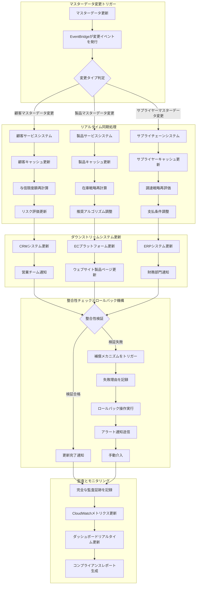

これは、実務におけるMDMの最も複雑で価値のある部分です。マスターデータは変化が遅いとはいえ、変化はします。これは、マスターデータが単に「現在の状態」を持つだけでなく、次のような質問に答えられる必要があることを意味します:

- 「過去のある時点でのこの製品の価格は何だったか?」
- 「将来のある時点でのこの顧客の住所は何になるか?」

したがって、`有効日 → アクティブ期間 → 失効日`のライフサイクル管理、およびAWSサンプルコードで同時に`master_data_versions`(履歴バージョンテーブル)と`master_data_current`(現在のアクティブバージョンテーブル)を使用する設計は、まさにこの時間を超えたデータのクエリ能力を実現するためです。

これは、財務照合、法的コンプライアンス、ビジネス分析において極めて重要です。

**基本的な読み書きフロー**

```mermaid
graph TD
    subgraph "書き込みフロー update_master_record"
        A[更新リクエスト開始] --> B(RDSでトランザクション開始)
        B --> C{1. master_data_versionsに<br/>新バージョンを書き込み}
        C --> D{2. 即座に有効か確認}
        D -->|はい| E{3. master_data_currentを更新}
        E --> F[4. ElastiCacheの関連キャッシュを無効化]
        F --> G[5. EventBridge経由で変更イベントを発行]
        G --> H(RDSトランザクションコミット)
        D -->|いいえ(将来有効)| H
        H --> I[終了]
    end

    subgraph "読み取りフロー get_master_data"
        J[読み取りリクエスト開始] --> K{履歴データのクエリ?}
        K -->|いいえ(現在データのクエリ)| L{1a. ElastiCacheのキャッシュをクエリ}
        L -->|キャッシュヒット| M[キャッシュデータを返す]
        L -->|キャッシュミス| N{2a. RDS master_data_currentをクエリ}
        N --> O{データが見つかった?}
        O -->|はい| P[3a. ElastiCacheにデータを書き戻す]
        P --> Q[データを返す]
        O -->|いいえ| Q

        K -->|はい(履歴データのクエリ)| R{1b. RDS master_data_versionsで<br/>特定時点のバージョンをクエリ}
        R --> Q
        M --> S[終了]
        Q --> S
    end
```

**書き込みロジック(update_master_record)**:

- トランザクション性:すべての書き込み操作はトランザクションでラップされ、原子性を保証—「すべてか無か」。
- バージョン管理:バージョンテーブルと現在テーブルの両方に同時に書き込み、履歴追跡性と現在のクエリパフォーマンスを完璧にバランス。
- キャッシュ無効化:データ更新時、キャッシュ無効化を即座に実行してデータ整合性を保証。

**読み取りロジック(get_master_data):**
- Cache-Aside:まずキャッシュをクエリし、見つからない場合はデータベースをクエリしてキャッシュを埋める。これは最も古典的なキャッシングパターン。
- タイムトラベルサポート:`as_of_date`パラメータを使用して特定時点の履歴データをクエリ可能。これはMDMシステムの最も価値ある機能の一つ。

#### AWS実装:エンタープライズグレードマスターデータ管理システム

**AWSサービスアーキテクチャの組み合わせ**

- RDS (PostgreSQL): 「単一の真実の源泉(SSoT)」として機能し、そのトランザクション機能(ACID)を活用してコアデータの強い一貫性を保証します。これはMDMの基礎です。正しい選択です。
- ElastiCache (Redis): 「分散キャッシュ」として機能し、プライマリデータベースの読み取り圧力を軽減し、ダウンストリームシステムに高性能データアクセスを提供します。これは標準的な高性能アーキテクチャパターンです。
- DynamoDB: RDSも変更を記録できますが、DynamoDBを使用することで、他のシステムがプライマリデータベースのパフォーマンスに影響を与えずに変更履歴を迅速にクエリできる、高速でスケーラブルな独立した監査ログを作成できます。
- EventBridge: 「イベント通知」ハブとして機能し、マスターデータ変更後にすべての関連システムに積極的に通知します。これによりシステム間の疎結合が実現され、これは現代のマイクロサービスアーキテクチャにとって重要です。

```yaml
# エンタープライズグレードマスターデータ管理システムのAWSサービス構成
MasterDataManagementServices:
  # コアデータストレージ層
  CoreStorage:
    PrimaryDatabase:
      Service: "Amazon RDS PostgreSQL"
      Instance: "db.r6g.2xlarge"
      Storage: "2TB gp3 SSD"
      MultiAZ: true
      ReadReplicas: 3
      BackupRetention: 35
      Encryption: "AES-256"

    VersioningStore:
      Service: "Amazon DynamoDB"
      TableName: "master-data-versions"
      BillingMode: "ON_DEMAND"
      GlobalTables: true
      PointInTimeRecovery: true

  # 分散キャッシュ層
  CacheLayer:
    DistributedCache:
      Service: "Amazon ElastiCache Redis"
      NodeType: "cache.r6g.xlarge"
      Nodes: 3
      ClusterMode: true
      Encryption: "in-transit and at-rest"

    CDNCache:
      Service: "Amazon CloudFront"
      Origins: "ALB + ElastiCache"
      TTL: "3600 seconds"

  # イベント処理と通知
  EventProcessing:
    EventBus:
      Service: "Amazon EventBridge"
      Rules: "master-data-change-*"
      Targets: ["Lambda", "SQS", "SNS"]

    MessageQueue:
      Service: "Amazon SQS"
      Type: "FIFO Queue"
      VisibilityTimeout: "300s"
      DeadLetterQueue: true

    Notifications:
      Service: "Amazon SNS"
      Topics: ["master-data-updates", "system-alerts"]
      Subscriptions: ["Email", "SMS", "Lambda"]

  # コンピューティングと処理
  ComputeServices:
    APIGateway:
      Service: "Amazon API Gateway"
      Type: "REST API"
      Authentication: "AWS Cognito"
      RateLimit: "1000 req/sec"

    BusinessLogic:
      Service: "AWS Lambda"
      Runtime: "Python 3.11"
      Memory: "1024 MB"
      Timeout: "15 minutes"
      Concurrency: "100"

    BackgroundProcessing:
      Service: "Amazon ECS Fargate"
      CPU: "2 vCPU"
      Memory: "4 GB"
      AutoScaling: true

  # モニタリングと監査
  ObservabilityStack:
    Monitoring:
      Service: "Amazon CloudWatch"
      Metrics: "Custom + Built-in"
      Alarms: "20+ alerts"
      Dashboards: "Executive + Technical"

    Logging:
      Service: "Amazon CloudWatch Logs"
      RetentionPeriod: "90 days"
      LogGroups: "by service"

    Tracing:
      Service: "AWS X-Ray"
      SamplingRate: "10%"
      TracingEnabled: true

    AuditTrail:
      Service: "AWS CloudTrail"
      LogFileValidation: true
      MultiRegion: true

  # セキュリティとコンプライアンス
  SecurityServices:
    IdentityManagement:
      Service: "AWS IAM"
      Roles: "least-privilege"
      Policies: "resource-based"

    SecretsManagement:
      Service: "AWS Secrets Manager"
      AutoRotation: true
      CrossRegionReplication: true

    KeyManagement:
      Service: "AWS KMS"
      KeyRotation: "annual"
      CustomerManagedKeys: true

    NetworkSecurity:
      Service: "AWS VPC"
      Subnets: "private + public"
      SecurityGroups: "restrictive"
      NACLs: "additional layer"

  # ディザスタリカバリ
  DisasterRecovery:
    Backup:
      Service: "AWS Backup"
      Schedule: "daily + weekly"
      RetentionPeriod: "7 years"
      CrossRegionCopy: true

    ReplicationTarget:
      Service: "Secondary AWS Region"
      RPO: "< 1 hour"
      RTO: "< 4 hours"

# コスト見積もり(月額コスト)
CostEstimation:
  RDS: "$2,400/month"
  ElastiCache: "$1,200/month"
  DynamoDB: "$800/month"
  Lambda: "$300/month"
  Other: "$800/month"
  Total: "$5,500/month"
```

**AWSサービスアーキテクチャ図**

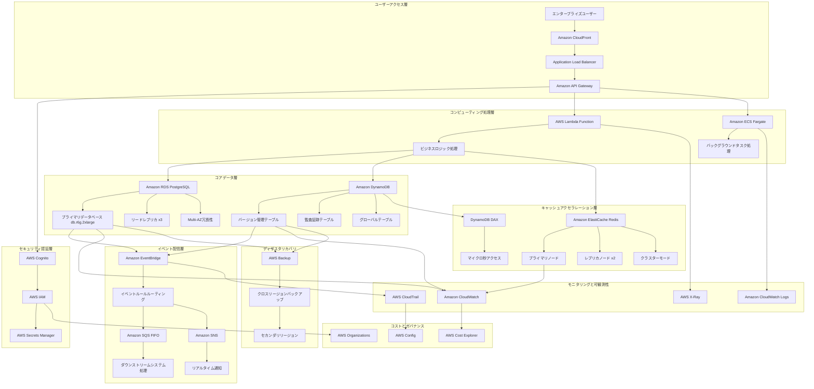

---

### 2. イベント駆動アーキテクチャ(イベント駆動設計)

再び図書館の比喩に戻りましょう。

従来のデータベース設計は、「現在」だけを気にする司書のようなものです。

私たちが「*夜間飛行*はどこにありますか?」と尋ねると、彼らは直接「棚A-7にあります」と答えます。しかし、「昨日の午後3時にこの本はどこにありましたか?」と続けて尋ねると、

彼らは困惑した表情を浮かべるでしょう。なぜなら、彼らは本の最終状態だけを記録しており、その間のすべての変更は失われているからです。

```
//TODO: 「夜間飛行」は私が深く愛する本です。強くお勧めします :))
```

**コアコンセプト:**

イベント駆動設計の哲学:**「何が起こったか」を記録し、「何になったか」ではない。**イベント駆動アーキテクチャ、特にイベントソーシングは、まったく異なる哲学を採用します。それは、本のリストではなく、決して変更されない不変な台帳を維持する几帳面な歴史家のようなものです。

プログラミング言語には、この抽象的な具体性を管理する概念があります:**連結リスト(ノードリスト)**。すべてのイベントには必然的に接続された前後のイベントがあります。**履歴を再生することで、任意の時点の状態を再構築できます。**

そこで、図書館のカウンターに戻ってみましょう—本の旅のイベントログを調べると、次のように表示されます:

- `09:15`: 会員アリスが図書館Cで*夜間飛行*を返却した。
- `11:30`: 管理者が図書館Cから図書館Bへ*夜間飛行*を移動した。
- `15:10`: アルバイトスタッフが返却カートから*夜間飛行*を棚A-7に配架した。

これがイベントストリームです。

わかりますか?私たちは本の「場所」(状態)を保存せず、本の各「移動」(イベント)だけを保存します。

従来のCRUDは「破壊的」です。`UPDATE users SET status = 'inactive'`を実行すると、ユーザーの以前の状態は永久に失われます—情報は更新時に破壊されます。

イベントソーシングは「構築的」です。`UserDeactivated`イベントを記録します。すべての履歴情報ノードが保存されます。

**簡単なまとめ:**

- 状態を保存せず、イベントのみを保存
- 現在の状態 = すべての履歴イベントの再生結果

**適用シナリオ:**

1. マイクロサービス統合:

- これはEDAのコアアプリケーションです。
- Eコマースプラットフォームで、「注文サービス」が`OrderCreated`イベントを生成するとき、どのダウンストリームサービスがこの情報を必要とするかを完全に意識する必要はありません。**「在庫サービス」**はこのイベントをサブスクライブして在庫を減らし、**「物流サービス」**はこれをサブスクライブして出荷準備をし、**「通知サービス」**はこれをサブスクライブして確認メールを送信できます。サービスは完全に分離されており、独立して開発、デプロイ、スケールできます。

2. 非同期ワークフロー:

- EDAは**時間のかかる、シーケンシャルなバックグラウンドタスク**の処理に優れています。例:ユーザーがビデオをアップロードした後、バックエンドはすぐに`VideoReceived`イベントを発行し、「アップロード成功、トランスコーディング中」と応答します。1つ以上の専用「トランスコーディングサービス」がこのイベントを受信し、バックグラウンドで時間のかかるビデオ圧縮、透かし挿入などを実行します。ユーザーはその場で待つ必要はありません—優れたユーザーエクスペリエンスです。

3. リアルタイムデータ処理とIoT:

- シナリオ:終わりのないデータストリームの処理。数千のIoTデバイスからの温度と湿度の読み取り値、または金融市場のリアルタイム株価変動—各データポイントはイベントです。EDAアーキテクチャは、これらのイベントストリームを効率的にフィルタリング、変換、集約し、リアルタイムアラートをトリガーしたり、ダッシュボードを更新したりできます。

4. 監査とコンプライアンス:

- シナリオ:「何が起こったか」が「今何であるか」よりも重要な場合。金融、医療、または法的ドメインでは、すべての取引とすべての医療記録の変更の不変な記録を持つことがコンプライアンスの基本要件です。システムの任意の状態は、これらの履歴イベントから再作成できます。

**利点:**

- 完全な操作証跡
- タイムトラベルのサポート
- 自然な監査機能

しかし、この「ホワイトボードにタスクを書いて去る」コミュニケーションスタイルは、独自の複雑さと課題ももたらします:

1. **認知モデルの複雑さ**:システムの制御フローが不透明になります。イベントが発行された後、「次に何が起こるか?」を直感的に追跡することは困難です。これによりデバッグが非常に困難になります。
2. **結果整合性**:サービスが非同期に処理するため、システムの異なる部分で短時間の状態の不整合が発生します。例えば、注文は作成されましたが、在庫はまだ減らされていないかもしれません。これにより、開発とユーザーエクスペリエンス設計の両方に高い要求が課されます。
3. **イベントスキーマの進化とバージョニング**:「タスクホワイトボード」のメッセージフォーマットが変更された場合(例:注文イベントに「割引コード」フィールドが追加された場合)、すべてのダウンストリームサービスは古いフォーマットと新しいフォーマットの両方を処理できる必要があります。さもなければクラッシュします。これには通常、管理のための追加ツールの導入が必要です。
4. **メッセージブローカーの信頼性**:その「タスクホワイトボード」(KafkaやEventBridgeなど)がシステムの心臓部になります。それが失敗すると、システム全体が崩壊します。したがって、高可用性と信頼性を持つように設計する必要があります—複雑で高価なエンジニアリング努力です。
5. **テストの困難**:エンドツーエンドの統合テストが非常に困難になります。イベントがトリガーされた後、すべての関連するダウンストリームサービスがそれぞれの作業を正しく完了したことを検証する必要があるためです。

要約すると、EDAは極度の柔軟性とスケーラビリティを提供しますが、全体的なシステムの複雑さの増加と「結果整合性」への寛容さという代償を伴います。それを選択するということは、複雑な「非同期協調システム」の管理を個々のサービスの「シンプルさと独立性」と交換する準備ができている必要があることを意味します。

#### AWS実装:投資取引システムのイベントソーシング

```mermaid
graph TD
    subgraph "書き込みフロー store_trade_event"
        A[アプリケーション/サービス] --> B{store_trade_eventを呼び出し}
        B --> C[1. 取引イベントレコードを作成]
        C --> D["2. DynamoDBに書き込み<br/>(PortfolioEventsテーブル)"]
        D --> E["3. Kinesisにイベントを発行<br/>(portfolio-eventsストリーム)"]
        E --> F["ダウンストリームコンシューマ<br/>(例:Lambda、他のマイクロサービス)"]
        F --> G["イベントを処理<br/>(例:ダッシュボード更新、リスク計算)"]
        D -- 強い一貫性書き込み --> C
    end

    subgraph "読み取り/再構築フロー rebuild_portfolio_state"
        H[アプリケーション/サービス] --> I{rebuild_portfolio_stateを呼び出し}
        I --> J["1. DynamoDBにクエリ<br/>(PortfolioEventsテーブル)"]
        J --> K["2. 特定のportfolio_idの<br/>すべての履歴イベントを取得"]
        K --> L["3. メモリ内でイベントを<br/>時系列順に再生"]
        L --> M["4. 再構築されたポートフォリオ状態を取得"]
        M --> N[アプリケーションに状態を返す]
    end
```

**書き込みフロー(左側):**

取引アクションが発生すると、アプリケーションは`store_trade_event`を呼び出します。
この関数はまず、DynamoDBの`PortfolioEvents`テーブルに取引イベントを書き込みます。これが私たちの「イベントログ」です—不変で永続的です。
書き込みが成功した後、同じイベントがKinesisデータストリームに発行されます。
このイベントに関心のある他のダウンストリームサービス(例:レポートサービス、リスク計算サービス)は、Kinesisからイベントをサブスクライブして受信し、それぞれのビジネスロジックを実行します。このプロセスは非同期で分離されています。

**読み取り/再構築フロー(右側):**

ポートフォリオの「現在の状態」をクエリする必要がある場合、アプリケーションは`rebuild_portfolio_state`を呼び出します。
システムはDynamoDBにクエリして、そのポートフォリオのすべての履歴イベントレコードを取得します。
アプリケーションのメモリ内で、最初のイベントから始めて、これらのイベントを段階的に「再生」します。まるで映画を早送りするようなものです。
すべてのイベントを再生した後、特定の時点でのポートフォリオの正確な状態を取得し、リクエスタに返します。

**AWSサービスアーキテクチャの構成**

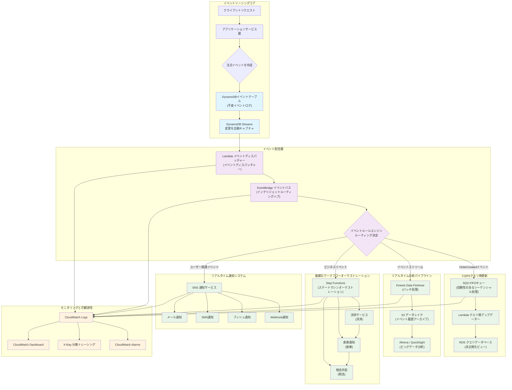

```python
class PortfolioEventStore:
    """投資ポートフォリオのイベントソーシング実装"""

    def __init__(self):
        self.event_store = boto3.client('dynamodb')
        self.event_stream = boto3.client('kinesis')

    async def store_trade_event(self, portfolio_id, event):
        """取引イベントをDynamoDBに保存"""

        event_record = {
            'portfolio_id': {'S': portfolio_id},
            'event_id': {'S': str(uuid.uuid4())},
            'event_type': {'S': event.type},
            'event_data': {'S': json.dumps(event.data)},
            'timestamp': {'N': str(int(time.time() * 1000))},
            'sequence_number': {'N': str(await self.get_next_sequence(portfolio_id))}
        }

        # 強い一貫性書き込み
        await self.event_store.put_item(
            TableName='PortfolioEvents',
            Item=event_record,
            ConditionExpression='attribute_not_exists(event_id)'
        )

        # 他のサービスが消費するためにKinesisに非同期送信
        await self.event_stream.put_record(
            StreamName='portfolio-events',
            Data=json.dumps(event_record),
            PartitionKey=portfolio_id
        )

    async def rebuild_portfolio_state(self, portfolio_id, as_of_time=None):
        """イベントからポートフォリオ状態を再構築"""

        query_params = {
            'TableName': 'PortfolioEvents',
            'KeyConditionExpression': 'portfolio_id = :pid',
            'ExpressionAttributeValues': {':pid': {'S': portfolio_id}},
            'ScanIndexForward': True  # 時系列順
        }

        if as_of_time:
            query_params['FilterExpression'] = 'timestamp <= :time'
            query_params['ExpressionAttributeValues'][':time'] = {'N': str(as_of_time)}

        events = await self.event_store.query(**query_params)

        # イベントを再生して状態を再構築
        portfolio_state = PortfolioState()
        for event_item in events['Items']:
            event = self.deserialize_event(event_item)
            portfolio_state.apply_event(event)

        return portfolio_state
```

シナリオの質問を見てみましょう:

```
株式ティッカーのEDA実装を例として、ユーザーごとに個別の株式取引テーブルを作成する必要がありますか?
```

答えは:絶対にありません。

各ユーザーの各株式に対してデータテーブルを作成することは、「テーブル爆発」災害を引き起こす一般的な設計誤解です。アクティブなユーザーは数百の株式を取引する可能性があり、1万人のユーザーは数十万、さらには数百万のテーブルを生成する可能性があり、これは管理、メンテナンス、クエリに実行不可能です。

**正しいテーブル設計アプローチ:「イベントストリーム」を中心に**

EDAでは、「状態を保存するためにどのテーブルを作成すべきか」と考えるべきではなく、**「どのエンティティのためにイベントストリームを作成すべきか」**と考えるべきです。

株式取引シナリオでは、コアビジネスエンティティ(DDDの「集約ルート」)は**「ユーザーの投資ポートフォリオ」または「取引アカウント」**であり、個々の株式ではありません。実際、ユーザーのすべての取引行動(行為)は、特定のポートフォリオ(要件)を中心に発生します。

したがって、必要なイベントテーブルは1つだけで、`TradingEvents`と呼びます。このテーブルは、すべてのユーザーとすべてのポートフォリオのすべての取引イベントを記録します。

理想的な`TradingEvents`テーブル構造(DynamoDBを例として)

| フィールド名(属性) | 役割                   | 例                                             | 注記                                                                                                                                        |
| :----------------- | :--------------------- | :--------------------------------------------- | :------------------------------------------------------------------------------------------------------------------------------------------ |
| portfolio_id       | パーティションキー     | user123-portfolio-A                            | コア設計:同じポートフォリオに属するすべてのイベントは物理的に一緒に保存され、クエリ効率を最大化します。                                     |
| sequence_number    | ソートキー             | 1, 2, 3, ...                                   | コア設計:ポートフォリオ内のすべてのイベントの厳密な順次順序を保証—履歴を再生して状態を再構築するための基礎。                                 |
| event_id           | イベント一意識別子     | uuid-v4-string                                 | イベントの一意性を保証し、重複処理を防ぐために使用されます。                                                                                |
| event_type         | イベントタイプ         | STOCK_BOUGHT, STOCK_SOLD                       | 「何が起こったか」を説明し、ビジネスロジックがこのイベントをどのように処理するかを決定します。                                              |
| event_payload      | イベント内容(JSON)     | {"symbol": "AAPL", "quantity": 10, "price": 175.50} | 特定のイベント詳細を記録します。                                                                                                            |
| timestamp          | イベント発生時刻       | 2025-09-12T10:00:00Z                           | 監査と分析のために実世界のビジネス時間を記録します。                                                                                        |

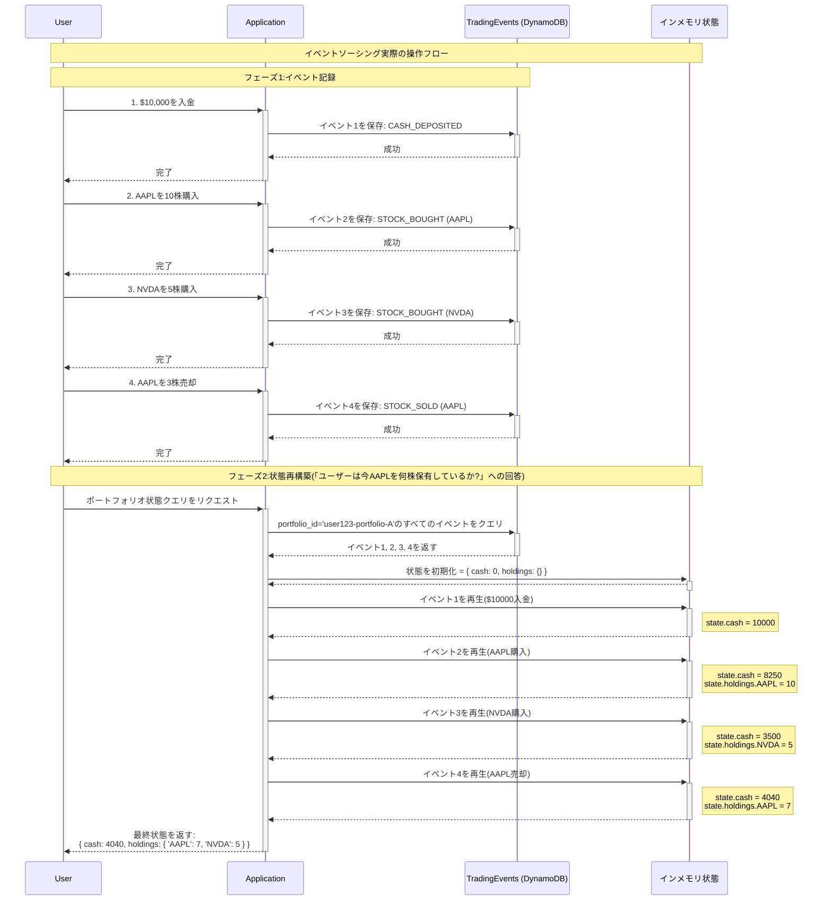

---

### 3. CQRS(コマンド クエリ 責任分離)

図書館の可哀想な管理者と疲れ果てたアルバイトスタッフには休憩してもらいましょう。今度は、世界人口の約3分の1が同時に視聴する、非常に期待され、スリリングなイベントであるワールドカップ決勝のサッカースタジアムに注目します。

フィールド上のイベントは瞬時に変化します。ミリ秒の違いが、チャンピオンシップ表彰台の前でひざまずくか、新しいサッカー伝説の誕生を目撃するかの違いになる可能性があります。しかし、スタジアムの物理的スペースには限りがあります。世界中のすべてのアスリート、メディア、ファンが同じスタジアムに集中することは物理的に不可能です—私たちは人間であり、LEGOブロックではありません。したがって、私たちの大多数は依然として**メディア(記録行動)**とその**報道(記録の影響)**を通じてそれを体験します。

選手がファウルを犯すと、審判は笛を吹いてイエローカードを出します。彼らはノートを取り出して念入りに記録します:`選手番号`、`時間`、`ファウルタイプ`。一方、サイドラインでは、さまざまなメディアが行動を起こします。ラジオ放送者は、自分の席から誰がイエローカードを受けたかをすぐに中継します。オンラインニュース記者は、テレビ番組に表示されるティッカー更新を即座に公開します。現場のライブ記者は、審判と不安で抗議する選手にすぐに焦点を当て、後続のイベントの展開を待ちます。

わかりますか?**事実は1つだけ**(審判がイエローカードを記録した)ですが、**データを提示する方法は何千もある**のです。すべてのメディアに審判の殴り書きでキーワードだけのノートを読ませると、災難になるでしょう。

フィールドで起こっていることは単一の「事実」です。

**コマンド側 - フィールドの審判**
`審判が笛を吹いてイエローカードを出す。彼らはノートを取り出して念入りに記録する...`このアクションは「コマンド」です。試合の公式状態を変更します。審判のノートは「書き込みモデル」であり、**絶対的な正確さとルールの一貫性**を目標として設計されています。報道が興味深いかどうかは気にせず、記録にエラーがないかどうかだけを気にします。

**クエリ側 - 放送局とメディア**

一方、サイドラインでは、さまざまなメディアがまったく異なるニーズ(クエリ)を持っています:

- **テレビ/ラジオ放送局**:彼らは放送のためのリアルタイムデータストリームを必要とします。彼らの「クエリモデル」は、`現在のスコア`、`試合時間`、`ボール支配率`、`ライブイベント(例:シュート、コーナーキック)`を含むダッシュボードです。**速度とナレーティブ**に最適化されています。
- **速報ニュース記者**:彼らは最も重要な情報をすぐに公開する必要があります。彼らの「クエリモデル」は、非常にシンプルなイベントリストかもしれません:`「メッシがゴール!アルゼンチンが1:0でリード!」`。**タイムリネス**に最適化されています。
- **夕方のニュースアナリスト**:彼らは詳細なレポートを書くために完全な試合後の統計が必要です。彼らの「クエリモデル」は、`選手の走行距離`、`パス成功率`、`シュート分布マップ`を含む複雑な集約レポートです。**深さと分析**に最適化されています。
- **ソーシャルメディア編集者**:彼らは注目を集めるためのエキサイティングなクリップが必要です。彼らの「クエリモデル」は、ゴールのGIF、物議を醸す判定の短いビデオです。**インタラクティブ性とバイラリティ**に最適化されています。

CQRSのコア哲学は:**審判に正確な記録保持(コマンド)に集中させ、各メディアが自分たちのニーズに最も適した視聴ノート(クエリ)を構築できるようにする**ことです。

**抽象概念**:書き込み最適化構造 ≠ クエリ最適化構造

**設計原則:**

- **コマンド側:**

  - 高度に正規化
  - 強い一貫性要件
  - 書き込みパフォーマンス最適化

- **クエリ側:**

  - 広範な非正規化
  - 結果整合性
  - 読み取りパフォーマンス最適化

**実用的な利点:**

- 読み取り/書き込み負荷の分離
- 各側の独立したスケーリング
- 複雑なクエリがコアビジネスに影響を与えない

**適用シナリオ:**

CQRSは万能薬ではありません。追加の複雑さをもたらすため、利点がコストを明らかに上回るシナリオでのみ使用すべきです。以下は、CQRSが最大の価値を提供するいくつかの古典的なシナリオです:

1.  **高トラフィック、読み取り集約型システム(読み取り需要が書き込みの平方根以上)**:

    - **シナリオ**:Eコマースプラットフォームの製品カタログ、ニュースメディアの記事ページ、ソーシャルプラットフォームのコンテンツフィード。これらのシステムでは、読み取り操作(製品閲覧、記事閲覧)が書き込み操作(注文、記事公開)をはるかに上回ります。
    - **CQRSを選択する理由**:クエリ側を独立してスケールできます。例えば、10ノードの読み取りデータベースクラスターと高性能キャッシュ層をデプロイして、数百万のユーザーからの閲覧リクエストを処理できます。一方、書き込み側は単一の安定したデータベースインスタンスだけで済むかもしれません。これにより、読み取りトラフィックがコアトランザクションシステムを圧倒することを防ぎます。

2.  **複雑なクエリと多様なデータビュー**:

    - **シナリオ**:ビジネスインテリジェンス(BI)ダッシュボード、データ分析プラットフォーム、管理バックエンド。これらのシステムは、同じコアデータから複数のまったく異なるビューを生成する必要があります。例えば、売上データは同時に「地域別売上トレンドチャート」、「製品カテゴリー別利益分析レポート」、「高価値顧客アクティビティリスト」として提示される必要があります。
    - **CQRSを選択する理由**:各クエリニーズに特別に最適化された「読み取りモデル」を構築できます。トレンドチャートモデルは事前計算された時系列データテーブルかもしれません。利益分析レポートは非正規化されたワイドテーブルかもしれません。顧客リストは検索エンジン(OpenSearchなど)に保存されたインデックスかもしれません。これにより、単一の正規化されたデータベースで多数の複雑で遅い`JOIN`と集約操作を実行することを避けられます。

3.  **イベントソーシングとの組み合わせ**:

    - **シナリオ**:金融取引システム、監査ログシステム、完全な履歴追跡可能性を必要とする任意のドメイン。これらのシナリオでは、システムのコアは不変なイベントログです。
    - **CQRSを選択する理由**:CQRSはイベントソーシングの自然な伴侶です。
      - **コマンド側**:コマンドを検証してイベントに変換し、イベントログ(DynamoDBやKinesisなど)にイベントを保存します。これが唯一の書き込み操作です。
      - **クエリ側**:イベントストリームをサブスクライブすることで、さまざまな「プロジェクション」、つまり読み取りモデルを構築して更新します。システムの「現在の状態」自体は、すべての履歴イベントから投影された読み取りモデルです。

4.  **高並行性協調ドメイン**:
    - **シナリオ**:オンライン協調ドキュメント(Google Docsなど)、マルチユーザー共有ガントチャート、協調編集デザインツール。複数のユーザーが同じリソースを同時に操作します。
    - **CQRSを選択する理由**:競合処理のスコープを狭めることができます。すべての「書き込み」操作(コマンド)は直列に処理でき(例:FIFOキューを通じて)、状態変更の一貫性と順次順序を保証します。一方、各ユーザーの「読み取り」操作は、自分用に最適化された読み取りモデルから迅速にデータを取得でき、他のユーザーの書き込み操作によってブロックされません。

**課題と複雑さ:**

1.  **結果整合性**:これはCQRSの最大の課題です。ユーザーがデータを更新した後、即座のクエリではまだ古いデータが表示される可能性があります。これには注意深いフロントエンドUI/UX設計が必要です(例:「更新中...」を表示したり、楽観的更新を使用したりします)。
2.  **二重モデル**:開発者はコマンドモデルと1つ以上のクエリモデルを維持する必要があり、コードの複雑さと開発作業量が増加します。
3.  **インフラストラクチャの複雑さ**:イベントバス(EventBridgeなど)、メッセージキュー(SQSなど)などのミドルウェアを導入して、両側間のデータを同期する必要があり、運用コストと潜在的な障害点が増加します。
4.  **データ同期と再生**:クエリ側の読み取りモデルが破損したり、構造変更が必要な場合、履歴イベントを「再生」して読み取りモデルを再構築するメカニズムが必要になる可能性があります—これは複雑なプロセスです。

#### AWS実装:サッカー試合イベントのCQRS

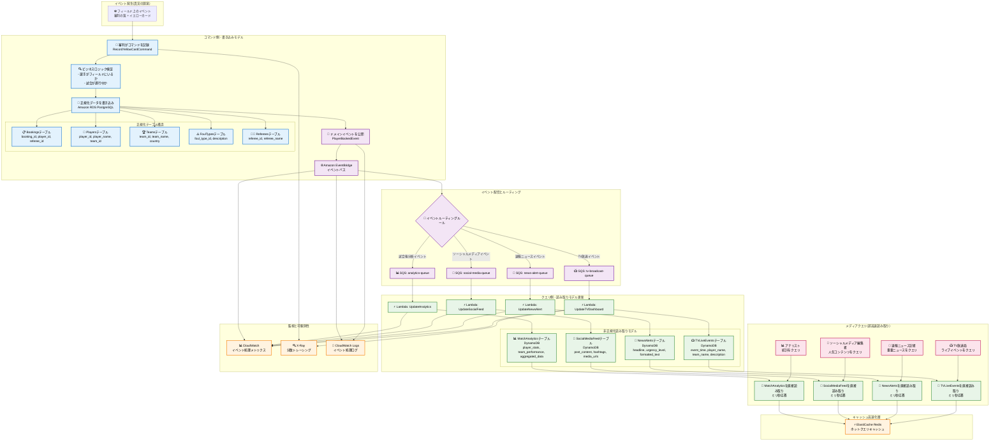

```python
class FootballMatchCQRS:
    """サッカー試合のCQRS実装"""

    def __init__(self):
        # コマンド側:正規化リレーショナルデータベース
        self.command_db = boto3.client('rds-data', database='football_command')

        # クエリ側:非正規化NoSQLデータベース
        self.query_db = boto3.client('dynamodb')

        # イベントバス
        self.event_bridge = boto3.client('events')

        # キャッシュ層
        self.cache = boto3.client('elasticache')

    async def record_yellow_card_command(self, match_id, player_id, referee_id, foul_type_id, minute):
        """コマンド側:イエローカードイベントを記録(正規化ストレージ)"""

        async with self.command_db.begin_transaction() as tx:
            # 1. ビジネスロジック検証
            await self.validate_yellow_card_business_rules(match_id, player_id, minute)

            # 2. 正規化リレーショナルテーブルへ書き込み
            booking_id = await tx.execute("""
                INSERT INTO bookings (match_id, player_id, referee_id, foul_type_id, game_minute, timestamp)
                VALUES (:match_id, :player_id, :referee_id, :foul_type_id, :minute, NOW())
                RETURNING booking_id
            """, {
                'match_id': match_id,
                'player_id': player_id,
                'referee_id': referee_id,
                'foul_type_id': foul_type_id,
                'minute': minute
            })

            # 3. 選手累積統計を更新(同じトランザクション内)
            await tx.execute("""
                UPDATE player_match_stats
                SET yellow_cards = yellow_cards + 1
                WHERE match_id = :match_id AND player_id = :player_id
            """, {'match_id': match_id, 'player_id': player_id})

            # 4. ドメインイベントを公開
            await self.publish_player_booked_event(booking_id, match_id, player_id, foul_type_id, minute)

    async def publish_player_booked_event(self, booking_id, match_id, player_id, foul_type_id, minute):
        """選手警告イベントを公開"""

        # 正規化テーブルから完全なイベントデータを構成
        event_data = await self.build_complete_event_data(match_id, player_id, foul_type_id)

        await self.event_bridge.put_events(
            Entries=[
                {
                    'Source': 'com.football.match',
                    'DetailType': 'PlayerBooked',
                    'Detail': json.dumps({
                        'booking_id': booking_id,
                        'match_id': match_id,
                        'player_name': event_data['player_name'],
                        'team_name': event_data['team_name'],
                        'foul_description': event_data['foul_description'],
                        'game_minute': minute,
                        'timestamp': datetime.utcnow().isoformat()
                    }),
                    'EventBusName': 'football-events'
                }
            ]
        )

    async def update_tv_dashboard_projection(self, event):
        """TVブロードキャストダッシュボードを更新(クエリ側投影)"""

        # TV放送用に最適化された非正規化レコードを作成
        tv_event = {
            'event_id': {'S': str(uuid.uuid4())},
            'match_id': {'S': event['match_id']},
            'display_text': {'S': f"{event['player_name']} ({event['team_name']}) - {event['foul_description']}"},
            'game_minute': {'N': str(event['game_minute'])},
            'urgency_level': {'S': 'MEDIUM'},
            'created_at': {'N': str(int(time.time()))},
            'ttl': {'N': str(int(time.time()) + 86400)}  # 24時間後に自動クリーンアップ
        }

        # TV局専用に設計されたクエリテーブルへ書き込み
        await self.query_db.put_item(
            TableName='TVLiveEvents',
            Item=tv_event
        )

        # TV局のミリ秒レベルクエリのためにキャッシュも更新
        await self.cache.set(
            f"tv:live_events:{event['match_id']}",
            json.dumps(tv_event),
            ex=3600  # 1時間キャッシュ
        )

    async def update_news_alert_projection(self, event):
        """ニュース速報投影を更新"""

        # ニュース見出しに最適化されたデータ構造を作成
        news_alert = {
            'alert_id': {'S': str(uuid.uuid4())},
            'headline': {'S': f"⚠️ {event['player_name']}がイエローカードを受ける!"},
            'sub_headline': {'S': f"{event['team_name']} vs 対戦相手 - {event['game_minute']}分"},
            'urgency_score': {'N': '75'},
            'category': {'S': 'BOOKING'},
            'formatted_content': {'S': self.format_news_content(event)},
            'created_at': {'N': str(int(time.time()))}
        }

        await self.query_db.put_item(
            TableName='NewsAlerts',
            Item=news_alert
        )

    async def update_social_media_projection(self, event):
        """ソーシャルメディア投影を更新"""

        social_post = {
            'post_id': {'S': str(uuid.uuid4())},
            'content': {'S': f"🟨 {event['player_name']}が{event['game_minute']}分に警告を受ける!"},
            'hashtags': {'SS': ['#WorldCup', f"#{event['team_name']}", '#YellowCard']},
            'media_type': {'S': 'TEXT_WITH_EMOJI'},
            'engagement_score': {'N': '0'},
            'created_at': {'N': str(int(time.time()))}
        }

        await self.query_db.put_item(
            TableName='SocialMediaFeed',
            Item=social_post
        )

    async def update_analytics_projection(self, event):
        """アナリスト統計投影を更新"""

        # 選手統計を更新
        await self.query_db.update_item(
            TableName='MatchAnalytics',
            Key={
                'analysis_type': {'S': 'PLAYER_STATS'},
                'entity_id': {'S': f"player_{event['player_id']}"}
            },
            UpdateExpression='ADD yellow_cards :inc SET last_updated = :timestamp',
            ExpressionAttributeValues={
                ':inc': {'N': '1'},
                ':timestamp': {'N': str(int(time.time()))}
            }
        )

        # チーム統計を更新
        await self.query_db.update_item(
            TableName='MatchAnalytics',
            Key={
                'analysis_type': {'S': 'TEAM_STATS'},
                'entity_id': {'S': f"team_{event['team_id']}"}
            },
            UpdateExpression='ADD total_bookings :inc SET last_updated = :timestamp',
            ExpressionAttributeValues={
                ':inc': {'N': '1'},
                ':timestamp': {'N': str(int(time.time()))}
            }
        )

    # 各メディアのための超高速クエリメソッド
    async def get_tv_live_events(self, match_id):
        """TV局クエリ:ミリ秒レベル応答"""

        # まずキャッシュをチェック
        cached = await self.cache.get(f"tv:live_events:{match_id}")
        if cached:
            return json.loads(cached)

        # キャッシュミス、DynamoDBをクエリ
        response = await self.query_db.query(
            TableName='TVLiveEvents',
            KeyConditionExpression='match_id = :match_id',
            ExpressionAttributeValues={':match_id': {'S': match_id}},
            ScanIndexForward=False,  # 最新イベントが最初
            Limit=10
        )

        events = [self.deserialize_tv_event(item) for item in response['Items']]

        # キャッシュをバックフィル
        await self.cache.set(f"tv:live_events:{match_id}", json.dumps(events), ex=300)

        return events

    async def get_breaking_news(self, urgency_threshold=70):
        """速報ニュース記者クエリ:緊急度で並べ替え"""

        response = await self.query_db.scan(
            TableName='NewsAlerts',
            FilterExpression='urgency_score >= :threshold',
            ExpressionAttributeValues={':threshold': {'N': str(urgency_threshold)}},
            Limit=5
        )

        return [self.deserialize_news_alert(item) for item in response['Items']]

    async def get_trending_social_content(self):
        """ソーシャルメディア編集者クエリ:エンゲージメントで並べ替え"""

        response = await self.query_db.scan(
            TableName='SocialMediaFeed',
            IndexName='EngagementScoreIndex',
            ScanIndexForward=False,  # 高エンゲージメントが最初
            Limit=20
        )

        return [self.deserialize_social_post(item) for item in response['Items']]

    async def get_match_analytics(self, match_id):
        """アナリストクエリ:完全な統計データ"""

        response = await self.query_db.query(
            TableName='MatchAnalytics',
            KeyConditionExpression='match_id = :match_id',
            ExpressionAttributeValues={':match_id': {'S': match_id}}
        )

        return [self.deserialize_analytics(item) for item in response['Items']]
```

---

### 4. マルチテナンシーアーキテクチャ

TV放送について話しているので、大学時代に支援した研究プロジェクトを思い出します:「Netflix アジア視聴者嗜好クラスタープロファイリング分析」。これは非常に興味深い研究プロジェクトで、ある期間のNetflixの視聴者嗜好ビデオデータセットと様々な映画/TVシリーズ分類データテーブルを見る特権がありました。最終目標は、様々なタイプのオーディオビジュアル作品にわたる複数の人口統計グループの嗜好ネットワークグラフの構築を支援し、推薦モデルの構築を支援することでした。

話がそれました。Netflixのコンテンツ管理に注目を移しましょう。Netflixがグローバルに数百のコンテンツ制作スタジオ、配給会社、権利保有者に統一されたビデオ管理プラットフォームを提供する必要があるが、各「テナント」がまったく異なるニーズと権限を持っていると想像してください。マルチテナンシーアーキテクチャは、異なる状態のテナントに差別化されたサービスを提供する必要もあります。

1. アジア専用コンテンツは他の大陸からは見えない
2. スペインのスタジオからの生映像はカナダの画像スタジオで後処理が必要 - 一方、フランスの管理チームはファイルステータスの更新を見られなければならない
3. 現在のシーズンの放送権が終了したオーディオビジュアル作品はアーカイブされようとしているが、3年後に放送が再開されることがわかっている。

すべてのスタジオとチームはそれぞれのクラウドシステムを使用していますが、実際には**1つの大きなプール**上に構築されています。

**抽象概念**:1つのアプリケーションが複数の「テナント」に同時にサービスを提供し、各テナントは専用システムを使用していると信じている

- **4つのコア設計哲学指標**:

  - **分離**:マーケティングチームは制作中の未公開コンテンツを絶対に見ることができません。各テナントのデータと操作は完全に分離されなければなりません。

  - **共有**:すべてのスタジオが同じビデオエンコーディング、ストレージ、配信インフラストラクチャを共有します。誰も独自のグローバルCDNネットワークを構築する必要はありません。

  - **カスタマイズ**:一部のスタジオは4K HDR高品質制作ワークフローが必要ですが、一部の独立系映画製作者は1080pだけが必要です。プラットフォームは異なるサービスティアをサポートする必要があります。

  - **スケーラビリティ**:新しい制作スタジオが参加するとき、システムはプラットフォーム全体を再アーキテクトすることなくシームレスにスケールできる必要があります。

#### 3つの古典的なマルチテナンシーモデル:Netflixビデオ管理を例として

**共有ストレージ、共有データ構造**、**共有インフラストラクチャ、独立したストレージスペース**、**完全に独立したインフラストラクチャ**

#### モデル1:共有ストレージ、共有データ構造(共有S3バケット、共有プレフィックス構造)

これは、すべての制作スタジオのビデオが同じ巨大なS3リポジトリに保存されているが、フォルダ構造とアクセス権限を通じて差別化されているようなものです。

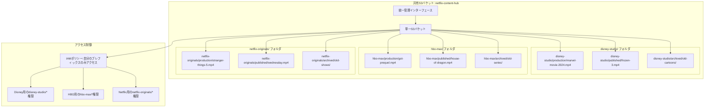

**共有モデルにおけるビデオライフサイクルの具現化**:

- **制作ビデオ**(`production/`):高頻度読み取り/書き込み、バージョン管理が必要、複数人のコラボレーション
- **公開ビデオ**(`published/`):高頻度読み取り、グローバルCDN配信が必要
- **アーカイブビデオ**(`archived/`):低頻度アクセス、より安価なストレージティアに移動可能

**S3ストレージ戦略**:

```python
# ビデオステータスに基づくS3ストレージ戦略
S3_STORAGE_POLICIES = {
    'production': {
        'storage_class': 'STANDARD',
        'versioning': True,
        'encryption': 'aws:kms',
        'backup_frequency': 'hourly',
        'cost_per_gb_month': 0.023
    },
    'published': {
        'storage_class': 'STANDARD',
        'cdn_distribution': True,
        'global_replication': True,
        'cost_per_gb_month': 0.023
    },
    'archived': {
        'storage_class': 'GLACIER_FLEXIBLE_RETRIEVAL',
        'versioning': False,
        'retrieval_time': '1-5 minutes',
        'cost_per_gb_month': 0.0036
    }
}
```

**利点**:

- **最低コスト**:すべてのテナントが同じS3バケットを共有し、リソース利用を最大化
- **シンプルな管理**:1つのリポジトリを維持するだけで、統一されたライフサイクルポリシーと監視
- **最高の柔軟性**:新しいテナントの追加には新しいプレフィックスフォルダを作成するだけで、再設定不要

**欠点**:

- **分離リスク**:IAMの設定ミスによりデータ漏洩が発生する可能性(DisneyがHBOコンテンツを誤って見る)
- **パフォーマンスリスク**:人気スタジオからの大量アップロードが他のテナントのアクセス速度に影響を与える可能性
- **カスタマイズの制限**:すべてのテナントが同じストレージクラスとライフサイクルポリシーを使用する必要がある

#### モデル2:共有インフラストラクチャ、個別S3バケット(共有インフラストラクチャ、個別ストレージスペース)

これは、各制作スタジオが独自の専用「倉庫」を持っているが、同じ物流配送システムを共有しているようなものです。

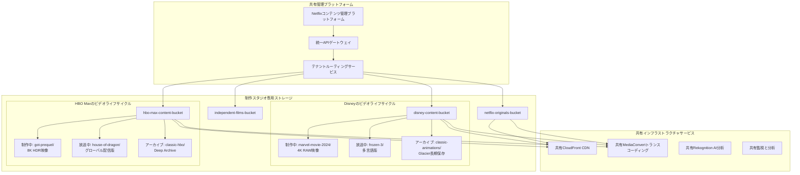

**ビデオステータス駆動の自動管理**:

```python
class ContentLifecycleManager:
    """ビデオステータスに基づく自動ライフサイクル管理"""

    def __init__(self, tenant_id):
        self.tenant_bucket = f"{tenant_id}-content-bucket"
        self.lifecycle_policies = {
            'production': {
                'standard_ia_transition': 30,  # 30日後にIAへ移行
                'glacier_transition': 90,      # 90日後にGlacierへ移行
                'expiration': None             # 削除しない
            },
            'published': {
                'standard_ia_transition': 365, # 1年後にIAへ移行
                'glacier_transition': 1095,    # 3年後にGlacierへ移行
                'expiration': None
            },
            'archived': {
                'immediate_glacier': True,     # 即座にGlacierへ移行
                'deep_archive_transition': 90, # 90日後にDeep Archiveへ移行
                'expiration': 2555             # 7年後に削除
            }
        }

    async def transition_content_status(self, content_id, from_status, to_status):
        """コンテンツステータス移行がストレージポリシー変更をトリガー"""

        if from_status == 'production' and to_status == 'published':
            # 制作完了、リリース準備
            await self.create_distribution_copies(content_id)
            await self.enable_global_cdn(content_id)
            await self.setup_drm_protection(content_id)

        elif from_status == 'published' and to_status == 'archived':
            # 権利失効、アーカイブ処理
            await self.disable_cdn_distribution(content_id)
            await self.transition_to_glacier(content_id)
            await self.update_metadata_only_access(content_id)

    async def create_distribution_copies(self, content_id):
        """配信用の複数フォーマットバージョンを作成"""

        source_key = f"production/{content_id}/master.mp4"

        # 異なる品質バージョンを作成
        encoding_jobs = [
            {'resolution': '4K', 'bitrate': '15000k', 'target': 'premium'},
            {'resolution': '1080p', 'bitrate': '5000k', 'target': 'standard'},
            {'resolution': '720p', 'bitrate': '2500k', 'target': 'mobile'},
            {'resolution': '480p', 'bitrate': '1000k', 'target': 'low_bandwidth'}
        ]

        for job in encoding_jobs:
            await self.submit_encoding_job(source_key, job)

    async def intelligent_cost_optimization(self):
        """視聴データに基づくインテリジェントコスト最適化"""

        # 過去90日間の視聴データを分析
        viewing_analytics = await self.get_viewing_analytics(days=90)

        for content_id, analytics in viewing_analytics.items():
            if analytics['views_per_day'] < 1:
                # 視聴率の低いコンテンツ、ストレージダウングレードを検討
                await self.suggest_storage_downgrade(content_id)
            elif analytics['views_per_day'] > 1000:
                # 視聴率の高いコンテンツ、ストレージアップグレードを検討
                await self.suggest_storage_upgrade(content_id)
```

**利点**:

- **中程度の分離**:各テナントが完全に独立したストレージスペースを持ち、データ漏洩リスクを軽減
- **カスタマイズの柔軟性**:異なるテナントに異なるライフサイクルポリシーとストレージティアを設定可能
- **パフォーマンス分離**:大規模テナントの操作が小規模テナントのストレージパフォーマンスに直接影響しない

**欠点**:

- **管理複雑性の増加**:数百の異なるS3バケットを管理する必要がある
- **コスト可視性の困難**:より複雑なコスト配分メカニズムが必要
- **クロステナント分析の困難**:プラットフォーム全体のコンテンツ分析とトレンド予測の実行が困難

#### モデル3:完全に独立したインフラストラクチャ(専用インフラストラクチャ)

これは、各大手制作スタジオが独自の完全な制作、ストレージ、配信インフラストラクチャを持っているようなものです。

```mermaid
graph TB
    subgraph "Disney専用インフラストラクチャ"
        A1[Disney AWSアカウント] --> B1[専用S3バケット]
        A1 --> C1[専用CloudFront配信]
        A1 --> D1[専用MediaConvertパイプライン]
        A1 --> E1[専用VPCネットワーク]

        subgraph "Disneyコンテンツ階層化"
            B1 --> F1[制作中: 4K RAW<br/>S3 Standard + バージョニング]
            B1 --> F2[公開中: マルチフォーマット<br/>S3 + グローバルCDN]
            B1 --> F3[クラシックコレクション: 旧作映画<br/>S3 Glacier Deep Archive]
        end
    end

    subgraph "HBO Max専用インフラストラクチャ"
        A2[HBO AWSアカウント] --> B2[専用S3バケット]
        A2 --> C2[専用CloudFront配信]
        A2 --> D2[専用MediaConvertパイプライン]
        A2 --> E2[専用VPCネットワーク]

        subgraph "HBOコンテンツ階層化"
            B2 --> G1[制作中: 8K HDR<br/>S3 Standard + リアルタイムバックアップ]
            B2 --> G2[ホット放送: シリーズ<br/>S3 + エッジ最適化]
            B2 --> G3[完了シリーズ: 旧コンテンツ<br/>S3 IA + 選択的復元]
        end
    end

    subgraph "独立系映画スタジオ共有インフラストラクチャ"
        A3[独立系映画共有インフラストラクチャ] --> B3[共有S3バケット]
        A3 --> C3[共有CloudFront]
        A3 --> D3[共有トランスコーディングサービス]

        subgraph "独立系映画コンテンツ管理"
            B3 --> H1[低予算制作<br/>S3 IA + 基本トランスコーディング]
            B3 --> H2[ニッチ配信<br/>オンデマンドCDN]
            B3 --> H3[旧作映画アーカイブ<br/>Glacier + 手動復元]
        end
    end

    subgraph "Netflix中央調整システム"
        I[Netflixパートナーポータル]
        I --> J[統一認証と認可]
        I --> K[クロスプラットフォーム分析ダッシュボード]
        I --> L[統一権利管理]

        A1 --> I
        A2 --> I
        A3 --> I
    end
```

**エンタープライズコンテンツ管理アーキテクチャ**:

```python
class EnterpriseContentInfrastructure:
    """エンタープライズテナント向け専用インフラストラクチャ"""

    def __init__(self, tenant_id, tier='enterprise'):
        self.tenant_id = tenant_id
        self.tier = tier
        self.infrastructure_config = self.get_tier_config(tier)

    def get_tier_config(self, tier):
        """テナントティアに基づいてインフラストラクチャを設定"""

        configs = {
            'enterprise': {
                'dedicated_account': True,
                'vpc': 'dedicated',
                's3_buckets': 'multiple_specialized',
                'cloudfront': 'dedicated_distribution',
                'mediaconvert': 'reserved_capacity',
                'monitoring': 'detailed_metrics',
                'support': '24/7_premium',
                'monthly_cost': 50000,
                'content_limits': 'unlimited'
            },
            'professional': {
                'dedicated_account': False,
                'vpc': 'shared_with_isolation',
                's3_buckets': 'dedicated_bucket',
                'cloudfront': 'shared_distribution',
                'mediaconvert': 'on_demand',
                'monitoring': 'standard_metrics',
                'support': 'business_hours',
                'monthly_cost': 5000,
                'content_limits': '10TB'
            },
            'indie': {
                'dedicated_account': False,
                'vpc': 'shared',
                's3_buckets': 'shared_with_prefix',
                'cloudfront': 'shared_basic',
                'mediaconvert': 'spot_instances',
                'monitoring': 'basic_metrics',
                'support': 'community',
                'monthly_cost': 500,
                'content_limits': '1TB'
            }
        }

        return configs.get(tier, configs['indie'])

    async def provision_dedicated_infrastructure(self):
        """エンタープライズテナント向けに専用インフラストラクチャをプロビジョン"""

        if self.tier == 'enterprise':
            # 専用AWSアカウントを作成
            dedicated_account = await self.create_dedicated_aws_account()

            # 専用コンテンツライフサイクルポリシーを設定
            await self.setup_content_lifecycle_policies(dedicated_account)

            # グローバル配信ネットワークを設定
            await self.setup_global_distribution_network(dedicated_account)

            # 専用セキュリティとコンプライアンス対策を設定
            await self.setup_security_compliance(dedicated_account)

    async def setup_content_lifecycle_policies(self, account_id):
        """コンテンツライフサイクル自動化を設定"""

        lifecycle_rules = {
            'production_content': {
                'versioning': True,
                'mfa_delete': True,
                'backup_frequency': 'real_time',
                'retention_policy': 'indefinite',
                'access_logging': True
            },
            'published_content': {
                'replication': 'cross_region',
                'cdn_integration': True,
                'analytics_tracking': True,
                'drm_protection': True
            },
            'archived_content': {
                'storage_class_transition': {
                    'to_ia': 30,
                    'to_glacier': 90,
                    'to_deep_archive': 365
                },
                'retrieval_policy': 'expedited_available',
                'metadata_preservation': True
            }
        }

        for content_type, rules in lifecycle_rules.items():
            await self.apply_lifecycle_rules(account_id, content_type, rules)
```

**利点**:

- **最高の分離**:完全なデータとインフラストラクチャの分離、データ漏洩リスクゼロ
- **最大のカスタマイズ**:各テナントが完全にカスタマイズされたアーキテクチャとポリシーを持つことができる
- **独立したパフォーマンス**:大規模テナントの操作が他のテナントにまったく影響しない
- **コンプライアンス**:厳格な業界規制要件(映画業界の著作権保護など)を満たすことが容易

**欠点**:

- **最高コスト**:各テナントが独立したインフラストラクチャリソースを必要とする
- **複雑な管理**:複数のAWSアカウントと複雑なクロスアカウント権限を管理する必要がある
- **リソースの浪費**:小規模テナントは割り当てられたリソースを完全に活用できない可能性がある

#### Netflixをシミュレート:コンテンツ価値に基づくインテリジェント階層ハイブリッドモデル

実世界のシナリオをシミュレートしてみましょう。実際のNetflixコンテンツプラットフォームでは、コンテンツの商業的価値、制作コスト、予想視聴者数に基づいてリソースを動的に割り当てる必要があるため、私たちの設計はハイブリッドモデルを採用します。

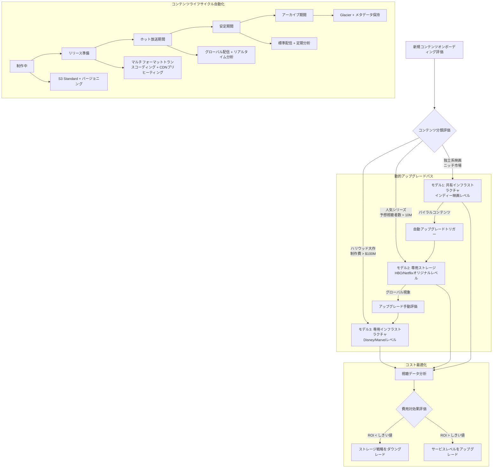

##### AWS S3マルチテナンシー実装コード

```python
class NetflixContentMultiTenantPlatform:
    """Netflix スタイルマルチテナントコンテンツプラットフォーム"""

    def __init__(self):
        self.tenant_strategies = {
            'hollywood_studio': {
                'model': 'dedicated_infrastructure',
                'storage': 'dedicated_s3_account',
                'cdn': 'dedicated_cloudfront',
                'encoding': 'reserved_mediaconvert',
                'isolation': 'account_level',
                'max_content_size': 'unlimited',
                'monthly_cost': 50000,
                'sla': '99.99%'
            },
            'streaming_platform': {
                'model': 'dedicated_storage',
                'storage': 'dedicated_s3_bucket',
                'cdn': 'shared_cloudfront_with_dedicated_behaviors',
                'encoding': 'on_demand_mediaconvert',
                'isolation': 'bucket_level',
                'max_content_size': '100TB',
                'monthly_cost': 5000,
                'sla': '99.9%'
            },
            'independent_creator': {
                'model': 'shared_infrastructure',
                'storage': 'shared_s3_with_prefix',
                'cdn': 'shared_cloudfront_basic',
                'encoding': 'spot_mediaconvert',
                'isolation': 'prefix_level',
                'max_content_size': '1TB',
                'monthly_cost': 500,
                'sla': '99.5%'
            }
        }

        # AWSサービスクライアント
        self.s3 = boto3.client('s3')
        self.cloudfront = boto3.client('cloudfront')
        self.mediaconvert = boto3.client('mediaconvert')
        self.organizations = boto3.client('organizations')

    async def onboard_content_provider(self, provider_info):
        """新しいコンテンツプロバイダーのインフラストラクチャを設定"""

        # 1. プロバイダーティアを評価
        tier = await self.evaluate_provider_tier(provider_info)
        strategy = self.tenant_strategies[tier]

        # 2. ストレージインフラストラクチャを設定
        storage_config = await self.setup_storage_infrastructure(provider_info, strategy)

        # 3. コンテンツ配信ネットワークを設定
        cdn_config = await self.setup_cdn_infrastructure(provider_info, strategy)

        # 4. コンテンツライフサイクル管理を設定
        lifecycle_config = await self.setup_content_lifecycle(provider_info, strategy)

        # 5. 監視と請求を確立
        monitoring_config = await self.setup_monitoring_billing(provider_info, strategy)

        return {
            'provider_id': provider_info['id'],
            'tier': tier,
            'storage': storage_config,
            'cdn': cdn_config,
            'lifecycle': lifecycle_config,
            'monitoring': monitoring_config,
            'monthly_cost_estimate': strategy['monthly_cost']
        }

    async def setup_storage_infrastructure(self, provider_info, strategy):
        """戦略に基づいてストレージインフラストラクチャを設定"""

        if strategy['model'] == 'dedicated_infrastructure':
            # ハリウッドスタジオ向けに専用AWSアカウントを作成
            account_config = await self.create_dedicated_aws_account(provider_info)

            bucket_config = await self.create_dedicated_account_buckets(
                account_config['account_id'], provider_info
            )

        elif strategy['model'] == 'dedicated_storage':
            # ストリーミングプラットフォーム向けに専用S3バケットを作成
            bucket_config = await self.create_dedicated_bucket(provider_info)

        else:  # shared_infrastructure
            # 独立系クリエイター向けに共有バケットプレフィックスを割り当て
            bucket_config = await self.allocate_shared_bucket_prefix(provider_info)

        # ライフサイクルポリシーを設定
        await self.configure_content_lifecycle_policies(bucket_config, strategy)

        return bucket_config

    async def create_dedicated_bucket(self, provider_info):
        """中規模テナント向けに専用バケットを作成"""

        bucket_name = f"{provider_info['id']}-content-{uuid.uuid4().hex[:8]}"

        # プライマリコンテンツバケットを作成
        await self.s3.create_bucket(
            Bucket=bucket_name,
            CreateBucketConfiguration={'LocationConstraint': 'us-west-2'}
        )

        # バージョニングを有効化
        await self.s3.put_bucket_versioning(
            Bucket=bucket_name,
            VersioningConfiguration={'Status': 'Enabled'}
        )

        # 暗号化を設定
        await self.s3.put_bucket_encryption(
            Bucket=bucket_name,
            ServerSideEncryptionConfiguration={
                'Rules': [{
                    'ApplyServerSideEncryptionByDefault': {
                        'SSEAlgorithm': 'aws:kms',
                        'KMSMasterKeyID': f"arn:aws:kms:us-west-2:account:key/{provider_info['kms_key']}"
                    }
                }]
            }
        )

        # アクセスログを設定
        await self.s3.put_bucket_logging(
            Bucket=bucket_name,
            BucketLoggingStatus={
                'LoggingEnabled': {
                    'TargetBucket': 'netflix-access-logs',
                    'TargetPrefix': f"content-access/{provider_info['id']}/"
                }
            }
        )

        return {
            'bucket_name': bucket_name,
            'type': 'dedicated',
            'provider_id': provider_info['id'],
            'versioning': True,
            'encryption': 'kms',
            'regions': ['us-west-2', 'us-east-1', 'eu-west-1']
        }

    async def configure_content_lifecycle_policies(self, bucket_config, strategy):
        """コンテンツステータスに基づいてライフサイクルポリシーを設定"""

        lifecycle_rules = []

        # 制作コンテンツライフサイクル
        production_rule = {
            'ID': 'ProductionContentLifecycle',
            'Status': 'Enabled',
            'Filter': {'Prefix': 'production/'},
            'Transitions': [
                {
                    'Days': 30,
                    'StorageClass': 'STANDARD_IA'
                },
                {
                    'Days': 90,
                    'StorageClass': 'GLACIER'
                }
            ]
        }

        # 公開コンテンツライフサイクル
        published_rule = {
            'ID': 'PublishedContentLifecycle',
            'Status': 'Enabled',
            'Filter': {'Prefix': 'published/'},
            'Transitions': [
                {
                    'Days': 365,
                    'StorageClass': 'STANDARD_IA'
                },
                {
                    'Days': 1095,  # 3年
                    'StorageClass': 'GLACIER'
                }
            ]
        }

        # アーカイブコンテンツライフサイクル
        archived_rule = {
            'ID': 'ArchivedContentLifecycle',
            'Status': 'Enabled',
            'Filter': {'Prefix': 'archived/'},
            'Transitions': [
                {
                    'Days': 1,
                    'StorageClass': 'GLACIER'
                },
                {
                    'Days': 90,
                    'StorageClass': 'DEEP_ARCHIVE'
                }
            ]
        }

        lifecycle_rules.extend([production_rule, published_rule, archived_rule])

        # ライフサイクルポリシーを適用
        await self.s3.put_bucket_lifecycle_configuration(
            Bucket=bucket_config['bucket_name'],
            LifecycleConfiguration={'Rules': lifecycle_rules}
        )

    async def intelligent_content_placement(self, content_metadata):
        """コンテンツ特性に基づくインテリジェント配置決定"""

        # コンテンツ特性を分析
        analysis = {
            'production_budget': content_metadata.get('budget', 0),
            'expected_viewership': content_metadata.get('expected_views', 0),
            'content_type': content_metadata.get('type', 'unknown'),
            'target_audience': content_metadata.get('audience', 'general'),
            'release_strategy': content_metadata.get('release', 'standard')
        }

        # ストレージ戦略を決定
        if analysis['production_budget'] > 100_000_000:  # $100M+
            storage_tier = 'premium'
            storage_class = 'STANDARD'
            replication = 'cross_region'
            cdn_tier = 'dedicated_edge_locations'

        elif analysis['expected_viewership'] > 10_000_000:  # 10M+ views
            storage_tier = 'standard'
            storage_class = 'STANDARD'
            replication = 'same_region'
            cdn_tier = 'shared_optimized'

        else:
            storage_tier = 'basic'
            storage_class = 'STANDARD_IA'
            replication = 'none'
            cdn_tier = 'shared_basic'

        return {
            'storage_tier': storage_tier,
            'storage_class': storage_class,
            'replication_strategy': replication,
            'cdn_configuration': cdn_tier,
            'estimated_monthly_cost': self.calculate_storage_cost(analysis, storage_tier)
        }

    async def handle_viral_content_scaling(self, content_id, metrics):
        """バイラルコンテンツの自動スケーリング処理"""

        # バイラル指標を検出
        if (metrics['views_per_hour'] > 100000 and
            metrics['growth_rate'] > 5.0 and
            metrics['geographic_spread'] > 10):

            # ストレージティアを自動アップグレード
            await self.upgrade_content_storage_tier(content_id, 'premium')

            # グローバルエッジキャッシングを有効化
            await self.enable_global_edge_caching(content_id)

            # CDN容量を増加
            await self.scale_cdn_capacity(content_id, multiplier=10)

            # コンテンツチームに通知
            await self.notify_viral_content_detected(content_id, metrics)

    async def cost_optimization_analysis(self, provider_id):
        """テナントのコスト最適化分析を実行"""

        # 過去30日間の使用メトリクスを収集
        usage_metrics = await self.collect_usage_metrics(provider_id, days=30)

        # アクセスパターンを分析
        access_patterns = await self.analyze_access_patterns(usage_metrics)

        # 最適化推奨事項を生成
        recommendations = []

        for content_item in access_patterns:
            if content_item['views_per_day'] < 1:
                recommendations.append({
                    'content_id': content_item['id'],
                    'action': 'move_to_glacier',
                    'potential_savings': content_item['current_cost'] * 0.8,
                    'impact': 'minimal'
                })
            elif content_item['views_per_day'] > 1000:
                recommendations.append({
                    'content_id': content_item['id'],
                    'action': 'upgrade_to_premium',
                    'additional_cost': content_item['current_cost'] * 0.3,
                    'benefit': 'improved_user_experience'
                })

        return {
            'current_monthly_cost': sum(item['current_cost'] for item in access_patterns),
            'potential_monthly_savings': sum(rec['potential_savings'] for rec in recommendations if 'potential_savings' in rec),
            'recommendations': recommendations,
            'optimization_score': self.calculate_optimization_score(recommendations)
        }
```

Netflixコンテンツプラットフォームの類推を通じて、マルチテナンシーアーキテクチャの本質を見ることができます:

1. **マーケティングチーム**は「小規模テナント」のようなもの:柔軟なリソース、バージョン管理、コラボレーション機能が必要だが、コストに敏感
2. **画像スタジオ**は「成長中のテナント」のようなもの:高パフォーマンス、グローバル配信が必要で、品質に対して支払う意思がある
3. **人気放送ビデオ**は「安定した大規模テナント」のようなもの:長期的な安定性、コスト効率、準拠したアーカイブが必要

**選択ガイド**:

- **共有モデル**:独立系クリエイター、新興スタジオに適している(< 1TBコンテンツ、< $500/月予算)
- **ハイブリッドモデル**:中規模制作会社、ストリーミングプラットフォームに適している(1-100TBコンテンツ、$500-5000/月予算)
- **専用モデル**:ハリウッドメジャー、グローバルメディアコングロマリットに適している(> 100TBコンテンツ、> $5000/月予算)

マルチテナンシーアーキテクチャの知恵は、Netflixの推薦アルゴリズムのようなものです:**異なるニーズを持つユーザーにちょうど良いサービスを提供し、リソースを無駄にすることもなく、体験を犠牲にすることもない**。

---

### 5. シャーディング戦略

最近『Arcane』を見ましたが、「Soda Pop」は本当にキャッチーな曲だと言わざるを得ません。以前のクライアントブランド管理の経験(学生時代にOgilvyでしばらくインターンをしていました)に基づくと、これは非常に巧妙で戦略的な動きです—アニメーションを媒体として新しい顧客セグメントに拡大しています。

サーバーとデータベースのことは一旦忘れましょう。私たちは今、大手エンターテインメント会社(HYBEやJYPのような)のチーフプロデューサーです。

もし私たちの会社が1つの—唯一の—スーパーアイドルグループだけを管理していたらどうなるか想像してみてください。たとえこのグループに全スタイルを扱える20人のメンバーがいたとしても、世界中のすべてのファンの好みを満たすことはできず、アメリカ、ヨーロッパ、アジアで同時にツアーを行うこともできません。

この時点で、私たちは根本的な問題に気づき、直面せざるを得なくなります:単一のグループは**無限にスケールアップ**してすべての市場を征服することはできません。

したがって、私たちは必然的に「すべての人に訴えるスーパーグループを作る」という幻想を捨て、代わりに**「異なる市場とファン層のために、差別化されたスタイルの複数の独立したグループを立ち上げる」**という戦略を採用します。

若くてエネルギッシュなものを好む人は1つの顧客セグメント、成熟した深いストーリーテリングを好む人は別のセグメント、そして人間以外のキャラクターを見たい人はさらに別のセグメントになります。

わかりますか?このプロセスで、私たちは無意識のうちにシャーディング/グループ化戦略を実装しました—そしてこれはマーケティング理論でさえあります!

**シャーディングのコア哲学**は、「全能の願いを叶えるマシン/ツールを作る」という幻想を**放棄**し、代わりに**「異なるニーズとコンテキストのために複数の差別化されたソリューションを立ち上げる」**という戦略を採用することです。これは「分割統治」、別名水平スケーリング(Scale-Out)です。

ファンの視点から見ると、彼らは「HYBE」または「JYP」レーベル(単一の論理エンティティ)下の音楽とアーティストをフォローしているかもしれません。ファンはただ「最新のK-Popを聴きたい」と言いたいだけで、どの特定のグループが歌っているかはあまり気にしません(特定のグループのファンでない限り)。

潜在的なファン(リクエスト)が現れたとき:

1. ファンはYouTubeやSpotifyで会社の音楽に出会います(アプリケーション)。
2. 会社の企画センター(ルーティング層)は、アルゴリズムと市場分析を通じて、リスニング嗜好、年齢、地域(シャードキー)に基づいて、このファンが最も楽しむ可能性が高いグループ(シャード)を正確に決定します。
3. システムは、このファンにそのグループの音楽とコンテンツを優先的に推薦します。

したがって、エンターテインメント帝国全体はブランディングにおいて統一されていますが、音楽製品とファンオペレーションの観点では、多くの独立した自律的なグループで構成されています。

```mermaid
graph TD
    A[潜在的ファン] --> B[エンターテインメント会社企画センター(ルーティング層)<br/>シャードキー:音楽の好み/ユーザープロファイル]
    B -- 嗜好:ヒップホップ、強いスタイル --> C[シャード1<br/>グループA(例:BTS)]
    B -- 嗜好:フレッシュ、ポップダンス --> D[シャード2<br/>グループB(例:NewJeans)]
    B -- 嗜好:ロック、バンドスタイル --> E[シャード3<br/>グループC(例:DAY6)]
```

最終目標は、単一のグループをより「速く」新曲をリリースさせることではなく、会社全体の影響力マップを信じられないほど「大きく」することです。それは、会社の総ファンベースと収益が、成功したグループ(サーバー)の増加に伴って線形的に成長できるようにし、単一グループの市場限界を突破することです。

したがって、**シャーディング戦略の**コア哲学概念をまとめることができます:**ニーズ、特性、コンテキストの差別化を通じて線形スケーラビリティを達成する**

---

異なるグループのファン市場をセグメント化したので、良い戦略を設計するための最高の指導原則は:ファンの相互作用の大多数が単一グループのエコシステム内で完了できるようにし、完全な体験を得るために複数のグループを同時にフォローする必要を避けるよう努めることです。

上記のように、音楽スタイル、メンバーの画像アピール、グループ画像(かわいい/ハンサム/エッジの効いた)に基づいて、私たちには基本的なニーズ(ドメイン要件)があり、この環境でできるだけ迅速かつ完全にニーズを満たすことを望んでいます—おそらくアルバムやポスターを集めたり、ファン交流やミート&グリートをしたり、あるいはアイドルグループがバラエティ番組に参加したり映画に出演したりするのを見たいと思っています。

これにより、3つの重要な設計原則が導かれます:

1. 高凝集性のシャードキーを選択:

- これは、シャーディング戦略の成功または失敗の鍵です。シャードキーは、「どのグループがこのファンを管理すべきか」を決定するために使用するルールです。
- 原則:選択したキー(グループの音楽スタイル、コンセプト、メンバーのアピール)は、同じシャード内でファンのロイヤルティを高度に集約できる必要があります。グループの「コンセプト」が最良のシャードキーです。ファンが特定のグループ(SEVENTEENのCARATのような)の熱狂的なファンになると、彼らのすべての消費、交流、議論はこのグループを中心に展開されます。これにより、ファン管理と商業的収益化が非常に効率的になります。グループのスタイルが頻繁に変わると、ファンは他のグループに流れる可能性があり、災難を引き起こします。

2. 均等な市場分布を追求:

- すべてのトップリソース(最高のソングライター、MVディレクター)を1つのグループだけに割り当てて、そのグループが超人気になり(「ホットスポット」)、他のグループが低迷し、最終的に会社全体の発展が不均等になることはできません。
- 原則:会社のリソース配分と計画戦略は、ファントラフィックと商業収益がすべての有望なグループに均等に分散されるようにし、単一点依存を避ける必要があります。1つのグループが熱すぎると、休息や兵役入隊が必要なとき、会社に大きな影響を与えます。

3. クロスシャードアクティビティを計画(Scatter-Gather):

- 「会社ファミリーコンサート」や「年末特別コラボステージ」のような、グループ間のコラボレーションを必要とするアクティビティが常にあります。
- 原則:
  - 特定する:計画段階から避けられないグループ間コラボレーションを特定します。
  - 分離する:ファミリーコンサートの準備とチケット販売は、単一グループのツアーよりもはるかに複雑な独立した大規模プロジェクトであり、各グループの日常活動に影響を与えません。
  - 受け入れる:ファンと会社の両方が、ファミリーコンサートにはより長い準備、より高いコスト、通常年に1回しか行われないことを受け入れます。これはクロスシャードクエリのようなものです—高価で頻繁に行うべきではありません。

おめでとうございます、私たちは今、ドメインシャーディング戦略能力を持つチーフプロデューサーです。将来、ソフトウェアエンジニアにならなくても、ソーシャルエンジニアになることができます。

短いながらも輝かしいチーフプロデューサーのキャリアを終えて、データベース設計概念がどう言うか振り返ってみましょう:

**コア哲学概念**:**ニーズ、特性、コンテキストの差別化を通じて線形スケーラビリティを達成する**

**3つの重要な設計原則**:

1. 高凝集性のシャードキーを選択

- 選択したキーは、同じシャード内で高度に関連するデータを集約する必要があります。
- 選択したキーは高い一意性と識別可能性を持つ必要があります

2. 均等なデータ分散を追求

- 過負荷でクラッシュした1つのシャードが、システム全体のパフォーマンスを低下させます。
- シャードキーの選択とシャーディングアルゴリズム(ハッシュシャーディングなど)は、データとリクエスト負荷がすべてのドメインシャードに均等に分散されるようにする必要があります。
- 均等な分散のためにシャーディング要件のドメイン意味を**汚染**しないでください

3. クロスシャードクエリを計画(Scatter-Gather)

- シャードを越えることを避けられない操作が常にあります。たとえば、データ要件の説明に**Total**、**Sum**、**All**がある場合
- 原則:
  - 特定する:設計段階から避けられないクロスシャードクエリを特定します。
  - 分離する:コアビジネスとセカンダリビジネス要件を分離する必要があります。例:オンライン株式取引。I/Oリソース競合を避けるために、コア(書き込み)がより多くのリソースを取得し、読み取りは通常専用分析システムに向けられます(これはCQRSとホットコールド分離思考とつながります)。
  - 受け入れる:これらのクエリがより高いレイテンシーを持ち、通常「結果整合性」結果しか提供できないことを受け入れます。

**水平シャーディング思考コンテキスト**:ビジネス <=> 特性 <=> データライフサイクル

**ビジネスロジックによるシャード**:

- 地理的シャーディング:アジア地域、アメリカ地域、ヨーロッパ地域
- 時間的シャーディング:2023年、2024年、2025年
- 顧客シャーディング:エンタープライズ顧客、個人顧客

**データ特性によるシャード**:

- 人気度シャーディング:人気製品 vs 不人気製品
- 頻度シャーディング:高頻度取引 vs 低頻度取引
- サイズシャーディング:大口注文 vs 小口注文

**シャードルーティング設計**:

- 一貫性ハッシング:均等なデータ分散を保証
- 範囲シャーディング:ビジネスロジックで分割
- ディレクトリサービス:シャードマッピングを一元管理

要約すると、シャーディング戦略は「分割」と「トレードオフ」の芸術です。そのコアは「スケール」の究極の課題に対処することであり、その方法は大きな問題を無数の小さな問題に分解し、巧妙な設計を通じて、ほとんどのリクエストを解決するためのシンプルな小さな問題に変えることです。

#### AWS特化実装:シンガポールからウォール街市場の取引

これは株式取引において非常に一般的なシナリオです—私たちは、広大な距離、不安なトレーダー、信号ケーブルを噛むサメを克服するためにあらゆることをして、株式取引を完了しなければなりません。以下は、**ビジネス要件** > **特性** > **データライフサイクル**の論理的思考に従って、脱コンテキスト化後の4つのコア課題です。

```
コア課題:

1. 地理的レイテンシー:シンガポールからニューヨークまでの物理的ファイバー距離が数百ミリ秒のレイテンシーを引き起こし、これは金融取引では致命的です。
2. データの洪水(高速度):市場のティックは瞬時に変化し、取引指示には極めて迅速な応答が必要です。
3. 読み取り/書き込みの非対称性:トレーダーは注文を出す(書き込み)よりもはるかに頻繁に市場相場を読み取ります。
4. 一貫性要件:取引指示の書き込みは強い一貫性が必要で、エラーは許されません。
```

これらは、このニーズに直面したときの長い会議の後に明確にした客観的なコア要件パターンです。しかし、人間の能力を超えた制限がまだあります。課題を段階的に解決する方法を分析しましょう。

**コア矛盾:物理法則 vs. 金融ニーズ**

1. 物理法則(レイテンシー):シンガポールからニューヨークまでのファイバーでの往復には約200-300ミリ秒の物理的レイテンシーがあります。これは高頻度取引には受け入れられません。
2. 金融ニーズ(一貫性):株式取引の「注文配置」と「執行」は、取引所(ニューヨーク)に最も近い場所で強い一貫性で記録されなければならない絶対的な「事実」であり、曖昧さや遅延は許されません。
3. ユーザー体験(リアルタイム):シンガポールのユーザーは、注文を出した後に「すぐに」ポートフォリオの更新を見たいし、「すぐに」最新の市場相場を見たいと思っています。

まず、物理的問題を解決するために、同じ物理的ソリューションを採用できます—イベントが集中的に発生する場所に直接取引サービスを確立します。最も重要な書き込みレイテンシーを最小化します。マッチングエンジンからデータベースへの書き込みは、マイクロ秒またはミリ秒で完了する必要があります。

すべての取引指示の「最終目的地」である書き込みマスターシャードを、取引所(NYSEやNASDAQなど)に最も近いデータセンター、例えばAWSのus-east-1(北バージニア)にデプロイし、ACIDトランザクション機能を持つデータベース、例えばAmazon RDS(PostgreSQL)を使用して、各取引の原子性と耐久性を保証できます。

このアーキテクチャは見覚えがありますか?**コア機能は書き込みに適用されます**。このキーワードを見たら、すぐに**CQRS読み取り/書き込み分離戦略**を考える必要があります。これにより、レイテンシーによる取引機会の損失を避けることができます。ニューヨークの書き込みマスターシャードが取引を完了するか、新しい市場相場を受け取った後、これらの「イベント」を高速データストリームサービス(Amazon Kinesisなど)にすぐに公開します。

~~それから完了した取引結果をすぐにシンガポール取引所に送り返します~~

これを行うと、すぐにレイテンシーの高コストを支払うことになります。読み取り時の実際のニーズは:**「すぐに」**ビジネスロジックの意味を持つ**「データ」**を見たいということです。すべては**需要側(ドメイン)**から分析し再構築する必要があります。したがって、このアーキテクチャソリューションでは、最良のアプローチは実際には**ローカルで実行する**という概念ロジックを継続し、取引完了後のビジネス指向のデータ処理を実行するコストを最小化し、コストセグメントを相対的に要求の少ない購入戦略の書き込みと取引結果の読み取りに配置することです。シンガポールのデータベースアーキテクチャでは、**注文コマンド**と**取引有効性**データベースを保持するだけで済みます。

このアーキテクチャのコア哲学は:「事実を変更する行動(取引)」と「事実結果の解釈ビジネスロジック(分析とプレゼンテーション)」を**地理的**および**システム的**に完全に分離することです。

```mermaid
graph TD
    subgraph "シンガポールリージョン(ap-southeast-1)"
        A[ユーザーブラウザ/アプリ<br/><b>AWS Amplify</b>] --> B[<b>Amazon API Gateway</b><br/>(エッジ最適化)]
        B --> |読み取りリクエスト(GET)| L[クエリサービス<br/><b>AWS Lambda</b>]
        L --> M[<b>Amazon Aurora Global DB(リードレプリカ)</b><br/>読み取り専用レプリカ]
        M --> L --> B --> A

        B -- |書き込みリクエスト(POST)| C
    end

    subgraph "AWSグローバルバックボーンネットワーク"
        C[<b>AWS Global Accelerator</b><br/>最適化されたルーティング、海洋横断レイテンシー削減] --> D
    end

    subgraph "ニューヨーク/北バージニアリージョン(us-east-1)"
        D[<b>Amazon API Gateway</b><br/>(リージョナルエンドポイント)] --> E[コマンド処理サービス<br/><b>AWS Lambda / AWS Fargate</b>]
        E --> F[<b>Amazon Aurora Global DB(プライマリ)</b><br/>書き込みマスター]

        F -- トリガー(CDC) --> G[<b>Amazon Kinesis Data Streams</b><br/>生取引イベントストリーム]
        G --> H[イベントエンリッチメントサービス<br/><b>AWS Lambda</b>]
        H --> I[<b>Amazon EventBridge</b><br/>高レベルビジネスイベントバス]
    end

    subgraph "クロスリージョンデータ同期"
        I -- EventBridge クロスリージョンルール --> J[<b>Amazon EventBridge(シンガポール)</b>]
        F -- Aurora Global DB 物理レプリケーション(<1s) --> M
    end

    subgraph "シンガポールリージョン(ap-southeast-1) - 状態更新"
        J --> K[<b>Amazon SQS</b><br/>バッファリングとデカップリング]
        K --> L_update[クエリモデル更新サービス<br/><b>AWS Lambda</b>]
        L_update --> M
    end

    style M fill:#e8f5e8,stroke:#388e3c,stroke-width:2px
    style F fill:#e3f2fd,stroke:#1976d2,stroke-width:2px
```

**フロー詳細説明**

1. コマンド送信(シンガポール → ニューヨーク)

- シンガポールのユーザーが「AAPLを10株購入」という取引指示を発行します。
- この指示(コマンド)はカプセル化され、AWS Global Acceleratorのような最適化されたネットワークを介して最小レイテンシーでニューヨークにデプロイされた「取引執行サービス」に送信されます。これは重要な設計ポイントです:唯一のリモート書き込みエントリポイント。

2. 事実記録(ニューヨーク内)

- ニューヨークサービスはコマンドを受信し、必要な検証を実行します。
- 「取引データベース」(例:Amazon RDS)と対話して、強い一貫性のあるトランザクションでこの取引を記録します。これはシステム内の唯一の不変の「事実」です。

3. 生イベント生成(ニューヨーク内)

- 取引がデータベースに正常に書き込まれた後、`TradeExecutedV1`のような生の低レベルイベントがすぐに生成されます。これには`trade_id, user_id, symbol, quantity, price`のみが含まれる可能性があります。
- この生イベントはAmazon Kinesisデータストリームに公開されます。Kinesisは高スループット、順序付けられた生データストリームの処理に適しています。

4. ビジネスロジックエンリッチメント(ニューヨーク内)

- このステップが設計の本質です。1つ以上の「取引エンリッチメント/エンハンスメントサービス」(通常Lambdaファンクション)がKinesisストリームをサブスクライブします。
- `TradeExecutedV1`イベントを受信すると、「ビジネスロジック処理」と呼ばれるものを実行します。例えば:
  - ユーザーのポジションコストをクエリし、この取引からの実現/未実現損益を計算します。
  - ユーザーのポートフォリオ総価値とリスクエクスポージャーを更新します。
  - リスク管理ルールやストップロスしきい値がトリガーされたかどうかをチェックします。
- 処理後、データを直接返すのではなく、`PortfolioValueUpdated`、`TradeProfitCalculated`、または`RiskThresholdBreached`のような、豊富なビジネス意味を持つ真新しい高レベルイベントを1つ以上生成します。

5. 高レベルイベント配信と返送(ニューヨーク → シンガポール)

- これらの高レベルイベントはAmazon EventBridgeに公開されます。EventBridgeはインテリジェントなコンテンツベースのルーティングに優れています。
- EventBridgeに「クロスリージョンルール」を設定して、これらすべての高レベルイベントをニューヨークからシンガポールリージョンのEventBridgeバスに転送します。

6. ローカル状態更新(シンガポール内)

- シンガポールのEventBridgeはイベントを受信し、ローカルの「クエリモデル更新サービス」をトリガーします。
- このサービスはイベントコンテンツを解析し、シンガポールユーザー専用に最適化された「ローカル読み取りデータベース」を更新します。このデータベースはAuroraリードレプリカまたはDynamoDBテーブルかもしれません。その構造は非正規化されており、完全に高速クエリ用に設計されています。

**設計の利点の要約**

- 明確な責任:ニューヨーク側は執行と記録に焦点を当て、トランザクションの原子性と速度を保証します。シンガポール側は分析とプレゼンテーションに焦点を当て、スムーズなユーザー体験を保証します。
- データの洗練:太平洋を越えるのは、クライアント側の処理を必要とする生データではなく、ニューヨーク側のサービスによって「消化」され「洗練」された直接的なビジネス価値を持つ「情報」です。これにより、シンガポール側の処理の複雑さが大幅に軽減されます。
- 柔軟性とスケーラビリティ:将来、新しいビジネス分析を追加する必要がある場合(例:マネーロンダリング防止監視を追加)、ニューヨークに新しいLambdaを追加してKinesis生イベントストリームを消費し、新しい高レベルイベントを生成するだけで、既存のプロセスを変更する必要はありません。
- レイテンシーの解決:シンガポールのユーザーによるすべての読み取り操作(レポートの表示、ポジションの更新)は、ローカルデータベースにアクセスし、非常に高速な応答を実現します。唯一のレイテンシーは、「注文配置」から「シンガポールのダッシュボードでの更新表示」までの時間に反映され、この時間は非同期イベント駆動設計を通じて極限まで最適化されています。

要約すると、シャーディング戦略は「分割」と「トレードオフ」の芸術です。そのコアは「スケール」の究極の課題に対処することであり、その方法は大きな問題を無数の小さな問題に分解し、巧妙な設計を通じて、ほとんどのリクエストを解決するためのシンプルな小さな問題に変えることです。

---

### 6. データ階層化(ホット-コールドデータ分離)

これは、初心者によってしばしば見過ごされる大規模システムにおいて非常に重要な戦略です。そのコアは技術的なものではありません—経済的マインドセットです。そして、キャッシング設計戦略と混同または混同することが非常に簡単です。

理解するために毎日遭遇する例を使ってみましょう:**ワードローブ**。

もし私たちのワードローブが無限に大きく、温度と湿度が管理された、プロフェッショナルに管理された最高級のドレッシングルームだったら—それは素晴らしいでしょう。さまざまなバッグのコレクション、無数のクラシックデザイナーウォッチ、数え切れないほどの靴のスタイルがあります。簡単に言うと—私たちは中東の石油大亨で、超高層ビルのデパート全体がワードローブです。

しかし現実は、たとえそうであっても、私たちの生活空間(ストレージリソース)は限られており高価です。言うまでもなく、検索にも時間コストがかかります。

10年以上着ていない高校の制服を、明日のフォーマルスーツや頻繁に着るTシャツと同じ、ワードローブの最もアクセスしやすい場所に置くことはありません。それは非論理的で貴重なスペースを無駄にします。

**ホット-コールドデータ階層化のコア哲学**は、「すべてのデータが**平等に**作られているわけではない」ことを認めることです。データの価値とアクセス頻度は時間とともに急速に低下します。したがって、ワードローブを整理するように、**データストレージコストを現在のビジネス価値とアクセス頻度に正確に一致させる**べきです。

その最終目標は「速い」または「大きい」ではなく、**「コスト効率的」**です。必要なパフォーマンスを犠牲にすることなく、最低総コストで大量のデータを保存することです。

私たちは疑問に思うかもしれません:**この階層化はキャッシングだけではないのか?**

これは優れた質問です—これは、これらの戦略の背後にある**要件実装**と**共通パターン**を考え始めていることを意味します。それらは似ているように見え、両方とも「ホット」と「コールド」に言及していますが、解決するコア問題、出発点、最終目的は完全に異なります。

簡単に言うと:キャッシングは**「速度」**のためであり、ホット-コールド階層化は**「節約」**のためです。

**キャッシング**は`「複製」`戦略であり、**ホット-コールドデータ階層化**は`「移動」`戦略です。

ワードローブから離れて、私の好きなペプシを保管している冷蔵庫に行きましょう。

**キャッシング戦略 - 私の冷蔵庫のコールドゾーン**

- 哲学:**最も頻繁に食べるもの**を**最速で入手する**ためです。
- アクション:スーパーマーケット(データベース)からペプシのケース全体を購入しますが、ケース全体をキッチンカウンターに置くことはありません。1本取り出して冷蔵庫のドア棚(**インメモリキャッシュ / Redis**)に置きます。このペプシボトルは元のペプシの「コピー」であり、喉が渇いたときに1秒以内につかめるようにすることを目的としています。
- コア問題:「アクセス速度」問題を解決します。
- データエンティティ:冷蔵庫のペプシがなくなったら、貯蔵室から新しいものを取得する必要があります。元のデータ(元のコピー)の場所は変わっていません。

**ホット-コールドデータ階層化 - 私の冷蔵庫 vs. 地下室の冷凍庫**

- 哲学:冷蔵庫を混雑させすぎずに、すべての食品を最小コストで保存することです。
- アクション:
  - ホット層:今週のステーキと野菜は冷蔵庫のコールドゾーンに入れます(高性能SSD / RDS)。
  - コールド層:1ヶ月後に食べるために購入した冷凍ピザとアイスクリーム、電力を多く使うが容量が大きい地下室の大型スタンドアロン冷凍庫に移動します(低コストオブジェクトストレージ / S3)。
  - 凍結層:昨年の感謝祭の残り物の「ターキー」、もう二度と食べられないかもしれません—真空シールして冷凍庫の底に投げ込み、いつか思い出したときにガレージで破壊します(アーカイブストレージ / S3 Glacier)。
- コア問題:**「ストレージコスト」**問題を解決します。
- データエンティティ:これは**「移動」**プロセスです。冷凍ピザの**元のデータ(元のコピー)**は、高価な「ホット層」から安価な「コールド層」に本当に移動されます。

したがって、それらは同じものではありません。しかし、完全なシステムアーキテクチャでは、それらはしばしば一緒に機能します:

最高のトラフィックピークを処理するために、**「ホット層」**データベース(RDSなど)の前に**キャッシュ層(ElastiCacheなど)**を追加します。一方、古い、めったにアクセスされないデータをRDSからS3に自動的に定期的に**「移動」**する**ホット-コールド階層化**戦略を設定し、高価なRDSストレージ料金を節約します。

では、冷凍庫のターキーを忘れて、ワードローブに戻りましょう。

階層化の**抽象概念**は、設定したルール(「この衣服は90日以上着用されていない」など)に基づいて、適格な服をワードローブの外層から引き出しへ、そして引き出しからベッドの下の箱へと**自動的に移動**する「スマートバトラー(ライフサイクルポリシー)」を確立することです。

- **ホットデータ:ワードローブの外層にかかっている服、手の届く範囲内** - もちろん、ベッドや枕の下にあるかもしれません。これらは最近着用され、明日着用されるかもしれません。システムでは、これは最も高価で最速の**メモリ(インメモリキャッシュ、Redis)**または**高速SSD**に保存されたデータに対応し、ミリ秒またはマイクロ秒のアクセスが必要です。

- **ウォームデータ:ワードローブの引き出しに折りたたまれて置かれた服。**毎日は着ませんが、週に1回着るかもしれません。取り出すには「引き出しを引く」という追加のアクションが必要です。システムでは、これは標準**SSD(RDSなど)**に保存されたデータに対応し、ミリ秒レベルのアクセスが必要です。

- **コールドデータ:箱に詰められた季節の服、ワードローブの上またはベッドの下に置かれている。**数ヶ月ごとにしか触れません。取り出すには箱を動かして開ける必要があり、より多くの時間がかかります。システムでは、これは安価な**オブジェクトストレージ(Amazon S3 Standardなど)**に保存されたデータに対応し、アクセスレイテンシーは数十から数百ミリ秒の可能性があります。

- **凍結データ:故郷の地下室または外部倉庫に梱包して保管—高校の制服、記念Tシャツ。**ほとんど二度と着ることはありませんが、感傷的価値またはコンプライアンス要件があります(クラス会があったらどうするか?)。取り出すには「計画」が必要です—そこまで車で行き、数時間かけて見つける。システムでは、これは**アーカイブストレージ(Amazon S3 Glacierなど)**に保存されたデータに対応し、アクセスに数分から数時間が必要です。

```mermaid
graph TD
    subgraph "データライフサイクル"
        A[ホット<br/>メモリ/SSD<br/>頻繁に着用する服] -->|30日以上アクセスなし| B[ウォーム<br/>標準SSD<br/>引き出しの服]
        B -->|90日以上アクセスなし| C[コールド<br/>オブジェクトストレージS3<br/>ベッド下の季節の服]
        C -->|1年以上アクセスなし| D[凍結<br/>アーカイブストレージGlacier<br/>故郷の思い出]
    end

    subgraph "アクセスコストとレイテンシー"
        A -- "コスト:$$$$<br/>レイテンシー:マイクロ秒" --> B
        B -- "コスト:$$$<br/>レイテンシー:ミリ秒" --> C
        C -- "コスト:$$<br/>レイテンシー:秒" --> D
        D -- "コスト:$<br/>レイテンシー:分/時間"
    end
```

バトラーのようにデータを自動的に整理したいので、いくつかの重要な設計原則に従う必要があります:

**設計原則:コスト、パフォーマンス、可用性のバランス**

1. 明確なライフサイクルポリシーを定義:

- これは戦略の基礎です。「どのようなデータがコールドデータとしてカウントされるか?」という質問に答えられる必要があります。
- 原則:ポリシーは客観的で定量化可能なメトリクスに基づいている必要があります。最も一般的なのは時間です。例えば:
  - トランザクション注文は「完了」ステータスから30日後にRDS(ウォーム)からS3(コールド)に移動します。
  - ユーザーログは90日後にS3 Standard(コールド)からS3 Glacier(凍結)に移動します。
  - 7年後、GDPR規制に準拠するためにGlacierから完全に削除します。

2. 透明なアクセスを保証:

- アプリケーションは、地下室に保存された衣服を取得するために完全に異なる複雑なロジックを必要とすべきではありません。
- 原則:システムは統一されたデータアクセスビューを提供する必要があります。アプリケーションが5年前の注文をリクエストすると、データ層はアプリケーションに直接「見つかりません」と伝えるのではなく、Glacierからデータを自動的に抽出する必要があります。これは、APIが非同期応答モードをサポートする必要があることを意味するかもしれません。つまり、「リクエストを受信しました。データの準備ができたら通知します。」

3. データ移動を自動化:

- 毎月何万もの服をワードローブから地下室に手動で移動したくありません。
- 原則:異なる層間のデータ移動は、自動化され、信頼性があり、監視可能である必要があります。これは通常、スケジュールされたジョブまたはクラウドサービスに組み込まれたライフサイクルルール(S3ライフサイクルポリシーなど)を通じて達成されます。移行中にデータが失われないようにし、監査のためにすべての移行をログに記録する必要があります。

4. 取得コストと時間のバランス:

- すべてを最も安い「凍結層」に保存することは魅力的に聞こえますが、罠です。
- 原則:**「データを取得するコスト」**を考慮する必要があります。Glacierから大量のデータを緊急に取得するコストは非常に高くなる可能性があります。設計時に、ビジネス関係者と確認する必要があります:コールドおよび凍結データの場合、最大許容待機時間と最高取得予算は何ですか?これにより、S3 IA(即座のアクセスだがわずかに高価)またはS3 Glacier(数分待つが非常に安価)を選択すべきかが決まります。

**抽象階層化概念**:

- **ホットデータ:**
  - インメモリデータベース(Redis/Hazelcast)
  - 高速SSD
  - マイクロ秒レベルのアクセス要件

- **ウォームデータ:**
  - 従来のSSD
  - リレーショナルデータベース
  - ミリ秒レベルのアクセス要件

- **コールドデータ:**
  - 機械式ハードドライブ
  - オブジェクトストレージ(S3)
  - 秒レベルのアクセス要件

- **凍結データ:**
  - テープストレージ
  - アーカイブシステム
  - 分レベルのアクセス要件

**一般的なアプリケーションシナリオ:**

- ほとんどすべての大規模システムがこれに遭遇します。そうでない場合は、逃げる時です

以下では、ホット-コールド階層化の力を完全に示すいくつかの完全な「シナリオ質問」を見ていきます。

#### AWS実装1:IoT TSMCウェーハ工場データライフサイクル

私たちがTSMCのシステムアーキテクトで、工場全体に分散された数千のセンサーを持つウェーハ/チップ工場を処理する責任があると想像してください。これらのセンサーは、ミリ秒レベルのストリーミングで温度、圧力、振動周波数データを報告します。これらのデータの価値は秒単位で減衰します。

- コア要件哲学:リアルタイムデータは**即座の反応**のため、履歴データは**学習**のため。
- 抽象概念:データは`「リアルタイムアラート」価値 => 「トレンド分析」価値に減衰 => 最終的に「モデルトレーニング」価値になる`に移行します。

- ホット層:過去1時間の生データ。
  - ビジネス要件:リアルタイムダッシュボード、異常検出(温度が制限を超えるなど)、アラートをトリガー。
  - ストレージ:Amazon TimestreamのIn-Memory Store。時系列データの超高速書き込みとクエリ専用に設計されています。
- ウォーム層:過去24時間の集約データ(例:1分あたりの平均温度)。
  - ビジネス要件:日次/週次パフォーマンスレポートの生成、短期トレンドの分析。
  - ストレージ:Amazon TimestreamのMagnetic Store。Timestreamは古い生データを自動的に低コストディスク層にダウングレードしながらクエリをサポートします。
- コールド層:3日以上前の生データ。
  - ビジネス要件:機械学習モデルのトレーニング、予知保全分析用。
  - ストレージ:Amazon S3。Timestreamは最も古いデータをS3 Data Lakeに自動的にエクスポートするルールを設定できます。
- 凍結層:365日以上前のビジネス指向情報。
  - ビジネス要件:モデルトレーニング記録、データ使用担当者ログ記録など。
  - ストレージ:Deep Archive。Timestreamは最も古いデータを自動的にアーカイブするルールを設定できます。

```mermaid
graph TD
    subgraph "データ生成層(ミリ秒レベル)"
        A[🏭 スマート工場センサー] --> B[AWS IoT Core<br/>(MQTTプロトコルアクセス)]
    end

    subgraph "ホット層 - 即座の反応(秒/分)"
        B --> C[AWS IoT Rules Engine]
        C -->|リアルタイムアラート| D[Amazon SNS<br/>運用担当者にアラート送信]
        C -->|時系列DBへ書き込み| E[Amazon Timestream<br/>(In-Memory Store)]
        E --> F[Grafana / QuickSight<br/>リアルタイム監視ダッシュボード]
    end

    subgraph "ウォーム層 - 短期分析(時間/日)"
        E -- 自動ダウングレード --> G[Amazon Timestream<br/>(Magnetic Store)]
        G --> H[日次/週次レポート生成<br/>(Lambda + QuickSight)]
    end

    subgraph "コールド層 - 長期分析(月/年)"
        G -- 自動エクスポート --> I[Amazon S3 Data Lake<br/>(Parquet形式)]
        I --> J[Amazon Athena<br/>(アドホックSQLクエリ)]
        J --> K[BIツール<br/>(Tableau, PowerBI)]
    end

    subgraph "凍結層 - モデルトレーニング(全履歴)"
        I -- S3ライフサイクルルール --> L[Amazon S3 Glacier Deep Archive]
        L -- オンデマンド復元 --> M[Amazon SageMaker<br/>(予知保全モデルトレーニング)]
    end

    %% スタイル定義
    classDef hot fill:#fce4ec,stroke:#c2185b
    classDef warm fill:#fff9c4,stroke:#fbc02d
    classDef cold fill:#e3f2fd,stroke:#1976d2
    classDef frozen fill:#eceff1,stroke:#546e7a

    class D,E,F hot
    class G,H warm
    class I,J,K cold
    class L,M frozen
```

偽コード実装:TimestreamとS3ライフサイクル管理

```python
import boto3
import time

class SmartFactoryDataTiering:
    def __init__(self, database_name='SmartFactoryDB', table_name='SensorData'):
        self.timestream = boto3.client('timestream-write')
        self.s3 = boto3.client('s3')
        self.db_name = database_name
        self.table_name = table_name

    def setup_timestream_retention(self):
        """
        Timestreamのメモリとディスク保持ポリシーを設定
        ホット層 -> ウォーム層
        """
        try:
            self.timestream.update_table(
                DatabaseName=self.db_name,
                TableName=self.table_name,
                RetentionProperties={
                    'MemoryStoreRetentionPeriodInHours': 24,  # ホット層:データをメモリに24時間保持
                    'MagneticStoreRetentionPeriodInDays': 90 # ウォーム層:データをディスクに90日間保持
                }
            )
            print("Timestream保持ポリシー(ホット -> ウォーム)を更新しました。")
        except Exception as e:
            print(f"Timestreamポリシー更新エラー: {e}")

    def setup_s3_lifecycle_policy(self, bucket_name):
        """
        S3ライフサイクルポリシーを設定
        コールド層 -> 凍結層
        """
        lifecycle_policy = {
            'Rules': [
                {
                    'ID': 'MoveToGlacierAfter90Days',
                    'Status': 'Enabled',
                    'Filter': {'Prefix': 'sensor-data-archive/'},
                    'Transitions': [
                        {
                            'Days': 90, # コールド層:データをS3 Standardに90日間保持
                            'StorageClass': 'GLACIER'
                        }
                    ]
                },
                {
                    'ID': 'MoveToDeepArchiveAfter1Year',
                    'Status': 'Enabled',
                    'Filter': {'Prefix': 'sensor-data-archive/'},
                    'Transitions': [
                        {
                            'Days': 365, # 凍結層:1年後にDeep Archiveに移動
                            'StorageClass': 'DEEP_ARCHIVE'
                        }
                    ]
                },
                {
                    'ID': 'ExpireAfter7Years',
                    'Status': 'Enabled',
                    'Filter': {'Prefix': 'sensor-data-archive/'},
                    'Expiration': {
                        'Days': 2555 # コンプライアンスのため7年後に削除
                    }
                }
            ]
        }
        try:
            self.s3.put_bucket_lifecycle_configuration(
                Bucket=bucket_name,
                LifecycleConfiguration=lifecycle_policy
            )
            print(f"S3ライフサイクルポリシー(コールド -> 凍結)をバケット '{bucket_name}' に更新しました。")
        except Exception as e:
            print(f"S3ポリシー更新エラー: {e}")

# 使用例
# manager = SmartFactoryDataTiering()
# manager.setup_timestream_retention()
# manager.setup_s3_lifecycle_policy('my-iot-data-lake-bucket')
```

#### AWS実装2:AI ML/LLMデータ階層化アーキテクチャ設計

機械学習ワークフローと生成AIエージェントトレーニングでは、データの価値は「モデルライフサイクル」の段階と密接に関連しています。データ準備からモデルデプロイまでの全プロセスに階層化思考が適用されます。

- コア哲学:プロセスの各段階に最もコスト効率の高いストレージを提供する:`探索 => トレーニング => 推論 => アーカイブ`。
- 抽象概念:データは「原材料」から「洗練された特徴」に変換され、次に「モデルアーティファクト」になり、最終的に「歴史的アーカイブ」になります。

- ホット層:トレーニングに現在使用されている特徴データセット(Feature Store)。
  - ビジネス要件:モデルトレーニングとリアルタイム推論は、特徴への超低レイテンシアクセスが必要です。
  - ストレージ:Amazon SageMaker Feature Store(基盤はDynamoDBまたはS3かもしれませんが、高性能APIを備えています)。
- コールド層:生データセット、実験記録、過去のトレーニングデータ。
  - ビジネス要件:データサイエンティストは新しいトレーニングセットを探索して準備する必要があります。
  - ストレージ:Amazon S3。これはすべての生データと中間製品の理想的なストレージ場所です。
- 凍結層:古いバージョンのモデルアーティファクトとトレーニングログ。
  - ビジネス要件:モデルの再現性とコンプライアンス監査のため、トレーニングされたすべてのモデルと関連メタデータの長期アーカイブが必要です。
  - ストレージ:Amazon S3 Glacier。

```mermaid
graph TD
    subgraph "データレイク - 原材料"
        A[各種ビジネスデータソース<br/>(RDS, S3, オンプレミス)] --> B[AWS Glue<br/>(ETLタスク)]
        B --> C[🧊 コールド/凍結層<br/><b>Amazon S3</b><br/>(生データと履歴データ)]
    end

    subgraph "特徴エンジニアリング"
        C -- データサイエンティストが探索 --> D[Amazon SageMaker Studio<br/>(Jupyter Notebook)]
        D --> E[🔥 ホット層<br/><b>Amazon SageMaker Feature Store</b><br/>(オンライン/オフライン特徴)]
    end

    subgraph "モデルトレーニング"
        E -- オフライン特徴 --> F[SageMaker Training Job]
        F --> G[🧊 コールド層<br/><b>Amazon S3</b><br/>(モデルアーティファクト .tar.gz)]
        G --> H[SageMaker Model Registry<br/>(モデルバージョンとメタデータ)]
    end

    subgraph "モデル推論"
        I[ユーザーリクエスト] --> J[SageMaker Endpoint<br/>(リアルタイム推論)]
        J -- オンライン特徴クエリ --> E
        J --> K[予測結果を返す]
    end

    subgraph "モデル監視とアーカイブ"
        H -- 古いバージョンモデル --> L[🧊 凍結層<br/><b>S3 Glacier Deep Archive</b><br/>(監査用モデルアーカイブ)]
        J -- 推論データをキャプチャ --> M[🧊 コールド層<br/><b>Amazon S3</b><br/>(モデルドリフト検出用)]
    end

    %% スタイル定義
    classDef hot fill:#fce4ec,stroke:#c2185b
    classDef cold fill:#e3f2fd,stroke:#1976d2
    classDef frozen fill:#eceff1,stroke:#546e7a

    class E hot
    class C,G,M cold
    class L frozen
```

偽コード実装:SageMaker Feature StoreとS3の連携

```python
import boto3
from sagemaker.feature_store.feature_group import FeatureGroup

class MLOpsDataTiering:
    def __init__(self, sagemaker_session):
        self.sagemaker_session = sagemaker_session
        self.s3 = boto3.client('s3')

    def create_feature_store(self, feature_group_name, s3_uri):
        """
        特徴グループを作成、S3のコールドデータをホットデータに変換
        コールド層 -> ホット層
        """
        feature_group = FeatureGroup(
            name=feature_group_name,
            sagemaker_session=self.sagemaker_session
        )

        # ... (特徴を定義)

        feature_group.create(
            s3_uri=s3_uri, # オフラインストア用S3 URI(コールド層バックアップ)
            online_store_config=True, # 低レイテンシアクセス用オンラインストアを有効化(ホット層)
            # ...
        )
        print(f"Feature Group '{feature_group_name}' を作成しました。データは現在ホット層にあります。")
        return feature_group

    def archive_old_models(self, model_registry_name, bucket_name):
        """
        古いバージョンのモデルをS3コールド層から凍結層にアーカイブ
        コールド層 -> 凍結層
        """
        sagemaker = boto3.client('sagemaker')
        paginator = sagemaker.get_paginator('list_model_packages')

        for page in paginator.paginate(ModelPackageGroupName=model_registry_name):
            for model_package in page['ModelPackageSummaryList']:
                # 1年前のモデルで承認されていないものをアーカイブすると仮定
                one_year_ago = datetime.now() - timedelta(days=365)
                if model_package['CreationTime'] < one_year_ago and model_package['ModelApprovalStatus'] != 'Approved':

                    model_s3_uri = model_package['InferenceSpecification']['Containers'][0]['ModelDataUrl']
                    s3_key = model_s3_uri.replace(f"s3://{bucket_name}/", "")

                    print(f"モデルをアーカイブ中: {s3_key} をGlacier Deep Archiveに...")

                    # ライフサイクルルールがあるプレフィックスにコピー
                    archive_key = f"model-archive/{s3_key}"
                    self.s3.copy_object(
                        Bucket=bucket_name,
                        CopySource={'Bucket': bucket_name, 'Key': s3_key},
                        Key=archive_key,
                        StorageClass='DEEP_ARCHIVE' # ストレージクラスを直接指定
                    )

                    # ここで元のS3オブジェクトを削除してコストを節約できます
                    # self.s3.delete_object(Bucket=bucket_name, Key=s3_key)

# 使用例
# ml_tiering = MLOpsDataTiering(sagemaker_session)
# # S3からホット層にデータをロード
# ml_tiering.create_feature_store('user-activity-features', 's3://my-data-lake/processed/user-activity/')
# # 古いモデルをアーカイブ
# ml_tiering.archive_old_models('my-recommendation-model-group', 'my-ml-models-bucket')
```

両方のシナリオで、ホットコールド階層化は孤立した戦略ではなく、ビジネスプロセス全体に深く組み込まれたコストとパフォーマンスの動的バランスアートです。

```python
IoT: 階層化基準は時間減衰 vs ML: 階層化基準はプロセス段階。
```

要約すると、システムに**「データ価値が時間とともに減衰する」**現象があり、**「ストレージコスト」**が考慮すべき要素である限り(実際には常にほぼそうです)、ホットコールドデータ階層化は設計ツールボックスに含めなければならない**トレードオフ**戦略です。

---

### 7. マイクロサービスデータベースパターン

おかしいと思いませんか? **マイクロサービスデータベースパターン**について議論する前に、私たちはすでにカバーしてきた多くのコア設計戦略でそれに触れています。マイクロサービスデータベースパターンを設計戦略にふさわしいものにしているのは何でしょうか? なぜそれは単なるシンプルなツールパターンではないのでしょうか?

シナリオを変えましょう。今回は図書館について話すのではなく、モダンな専門的なレストランのキッチン(レストランの名前はOverCook)を運営しましょう - システム設計を議論する際に最もよく引用されるケースです:ウェイター-API <=> システム-キッチン <=> データベース-冷蔵庫。

なぜ**マイクロサービスデータベースパターン**それ自体が「コア戦略」なのでしょうか? 明らかに他の戦略の「応用」のように見えますが?

これは、レストランを開く前に、ヘッドシェフ(アーキテクト)が最初に下さなければならない**戦略的決定**が「どのナイフを買うか」ではなく、**「このレストランのキッチンをどのように組織すべきか?」**だからです。私たちは確かに**モノリシック**アプローチを使用できます。すべてのキッチンスタッフに十種競技選手であることを要求し、野菜洗いから切る、炒める、煮込む、デザート作りまですべてを扱えるようにします。しかし、これはコストが高すぎます - 異なるタスク間を切り替える前の準備作業(メモリ、キャッシュ復元)、清潔さ(VM統合)はすべてのプロセスが**間違いなく進む**ことを保証しなければなりません!

これは非常に重要な問題です。**モノリシック**を選択すると、それはまた以下を意味することに注意してください:キッチンが火事になったら、または不適切に準備された悪臭のある材料が冷蔵庫(データベース)に置かれたら、レストラン全体のワークフローが即座に爆発する可能性があります。最終的に、私たちはレストランの破産宣言と顧客からの苦情の手紙の流れに直面します。

しかし、複数の専門ステーションで構成されたキッチンチームを確立したらどうでしょう - 専用の「冷菜ステーション」、専用の「グリルステーション」、専用の「ソースステーション」、そして専用の「ペストリーステーション」 - 単一のサービスに問題が発生したら、私たちは即座に隔離し、トラブルシューティングし、再起動を試みるか、データベースをクリアできます。

**「マイクロサービスデータベースパターン」**は他の戦略と並行するツールではありません。それは他の戦略を駆動し包含するトップレベルのブループリントであり、**運用パフォーマンス**、**リスク負担能力**、および**サービスコスト**に関するトレードオフのためのコア戦略です。

```python
コア哲学: **分散データ所有権とドメイン自律性**
抽象概念: 「共有大型冷蔵庫」から「各ステーションの専門ツールボックス」へ
```

従来のモノリシックアーキテクチャの哲学は「集中管理」で、すべてのデータは1つの中央データベースによって統一的に管理されます。マイクロサービスデータベースパターンのコア哲学は正反対です - それは「分散化」です。データの所有権と責任はその**ビジネスドメイン**に**密接に結合**されるべきだと提唱します。

言い換えれば、`ユーザーサービス`は「ユーザーデータ」の唯一の所有者であり権限であるべきで、`注文サービス`は「注文データ」の唯一の所有者であり権限であるべきです。他のサービスは自分に属さないデータに直接触れる権利を持ちません。これはデータアプリケーション設計におけるデータの**境界画定**と**説明責任**であり、単なる技術的統一ではありません。

キッチンの運用モデルを想像してください:

- **モノリシックアーキテクチャ:** キッチン全体が1つの巨大で混沌とした中央冷蔵庫(共有データベース)を共有します。グリルシェフの生肉、ペストリーシェフのクリーム、冷菜ステーションシェフの刺身がすべて一緒に詰め込まれています。ペストリーシェフが冷蔵庫の温度を調整したいとき、生肉が腐る原因になり、災害につながる可能性があります。
- **マイクロサービスアーキテクチャ:** 各専門ステーション(グリルステーション、ペストリーステーション)は自分自身の**専用、タスク最適化された**ツールボックスと小型準備冷蔵庫**(サービスごとのデータベース)**を持っています。グリルステーションは高温グリルを持ち、ペストリーステーションは定温オーブンを持っています。それぞれが自分の材料を管理し、互いに干渉しません。

この抽象概念は:各独立したビジネス能力に対して、独立したカスタマイズされたデータ管理ソリューションを装備することです。

この「分散化」哲学を実現するために、私たちはいくつかの不可侵の設計原則に従わなければなりません:

1. **サービスごとのデータベース**:

- 原則:これは黄金律です。各マイクロサービスは自分自身のプライベート永続ストレージを持たなければなりません。複数のサービスが同じデータベーススキーマ、または同じデータベースインスタンスさえも共有することは絶対に許可されません。
- 哲学:各ステーション(サービス)は自分自身の独立したツールと材料(データベース)を所有します。私たちはペストリーシェフにバーベキュー鉄板を使用してスフレを作ることを強制しません、なぜなら彼らの「ドメイン」ニーズは完全に異なるからです。グリルステーションは肉の焼き加減を気にします; ペストリーステーションは小麦粉のグルテンを気にします。
- 目的:サービス間の疎結合を保証します。各チームが自分たちのビジネスに最も適したデータベース技術(SQL、NoSQL、グラフ...)を独立して選択し、他のチームに通知または調整する必要なく、独立してデータモデルを変更および進化させることができるようにします。

2. **APIのみを通じた通信**:

- 原則:あるサービスが別のサービスのデータを必要とする場合、そのサービスのパブリックAPIを通じてリクエストしなければなりません。サービス間の直接データベース接続は厳しく禁止されています。
- 哲学:すべての要件は、データ申請のためのプロセスと標準プロトコルに厳密に従わなければなりません。冷蔵庫に「塩」とラベル付けされた瓶は、内容が本当に「塩」であることを保証できません - トリュフ塩に風味調整されているかもしれないし、長い間砂糖に使われているかもしれません - これは以前にルールに違反して直接データベースをクエリした人からの更新された内容かもしれません。
- 目的:サービスのカプセル化を保護します。APIはサービス間の公開「契約」であり、データアクセスが管理され、安全で、監視可能であることを保証します。直接データベースアクセスは「裏口から侵入する」ことに相当し、すべてのルールと自律性を破壊します。

3. **最終的整合性を受け入れる**:

- 原則:複数のサービスにまたがる必要があるビジネスプロセス(例:注文を行うには在庫の控除と支払いの処理の両方が必要)に対して、従来のクロスデータベースACIDトランザクションを放棄します。代わりに、SagaやEvent Sourcingなどのパターンを使用して調整します。
- 哲学:顧客が「サーフアンドターフミール」を注文し、ステーキ1つとロブスター1つを含みます。これには「グリルステーション」と「シーフードステーション」の協力が必要です。これは単一の同期アクションではありません; それは複数の独立したステップで構成された「ストーリー(Saga)」です。
- 目的:分散システムにおける回復力とスケーラビリティを達成します。私たちは、すべてのステーションのリソースを同時にロックする「強整合性トランザクション」を放棄し、システムが極めて短い時間状態の不整合を持つ可能性があることを受け入れますが、非同期「イベント」と「補償」処理を通じて、最終的に正しく整合性のある状態に到達することを保証します。

**データベース分解戦略**:

- **ビジネスドメインによる分解**:

  - ユーザーサービス:ユーザー基本データ、認証情報
  - 注文サービス:注文、支払い、物流
  - 商品サービス:商品カタログ、在庫、価格
  - レコメンデーションサービス:ユーザー行動、レコメンデーションアルゴリズム

- **サービス間データ整合性**:

  - Sagaパターン:分散トランザクション調整
  - Event Sourcing:非同期最終整合性
  - 補償パターン:障害ロールバックメカニズム

#### AWS実装:マイクロサービスデータベースアーキテクチャ設計

マイクロサービスデータベースパターンは、現実世界で多くの成功したアプリケーションケースがあります。これはマイクロサービスアーキテクチャの礎石であり、最も現代的な大規模アプリケーションはこのパターンを使用しています。

**シナリオ1:Eコマースプラットフォーム**

```python
# 典型的なEコマースプラットフォームのマイクロサービス分解
service_division = {
    "ユーザーサービス": {
        "責任": "ユーザー登録、ログイン、個人データ管理",
        "データベース": "PostgreSQL (ACIDがユーザーデータ整合性を保証)",
        "コアデータ": ["ユーザー基本データ", "認証情報", "設定"]
    },
    "商品サービス": {
        "責任": "商品カタログ、検索、カテゴリー管理",
        "データベース": "Elasticsearch (高速全文検索)",
        "コアデータ": ["商品情報", "カテゴリータグ", "検索インデックス"]
    },
    "注文サービス": {
        "責任": "注文作成、ステータス追跡、履歴記録",
        "データベース": "DynamoDB (高い同時書き込み容量)",
        "コアデータ": ["注文詳細", "取引記録", "物流ステータス"]
    },
    "在庫サービス": {
        "責任": "在庫管理、在庫控除、補充通知",
        "データベース": "Redis + PostgreSQL (キャッシュ + 永続化)",
        "コアデータ": ["リアルタイム在庫", "予約在庫", "補充計画"]
    },
    "レコメンデーションサービス": {
        "責任": "パーソナライズされたレコメンデーション、ユーザー行動分析",
        "データベース": "Neo4j (関係処理のためのグラフデータベース)",
        "コアデータ": ["ユーザー行動グラフ", "商品関連", "レコメンデーションアルゴリズムモデル"]
    }
}
```

**シナリオ2:FinTechプラットフォーム**

```python
# FinTechプラットフォームのマイクロサービスアーキテクチャ
fintech_service_division = {
    "口座サービス": {
        "責任": "口座開設、KYC、口座状態管理",
        "データベース": "PostgreSQL (強整合性要件)",
        "コンプライアンス要件": "金融規制を満たす、データは失われてはならない"
    },
    "取引サービス": {
        "責任": "送金、支払い、取引記録",
        "データベース": "PostgreSQL + Redis (ACID + 高速処理)",
        "特別要件": "高並行性をサポート、重複控除を防ぐ"
    },
    "リスク管理サービス": {
        "責任": "リスク評価、異常検出、マネーロンダリング対策",
        "データベース": "Neo4j + ClickHouse (関係分析 + 時系列分析)",
        "コア能力": "リアルタイムリスク計算、関連分析"
    },
    "レポーティングサービス": {
        "責任": "財務レポート、規制レポート、分析ダッシュボード",
        "データベース": "ClickHouse (OLAP分析データベース)",
        "データソース": "他のサービスからデータを非同期で集約"
    }
}
```

**シナリオ3:IoTプラットフォーム**

```python
# IoTプラットフォームのマイクロサービスとデータ階層化戦略
IoT_service_architecture = {
    "デバイス管理サービス": {
        "責任": "デバイス登録、ステータス監視、ファームウェア更新",
        "データベース": "MongoDB (異なるデバイスに適応する柔軟なスキーマ)",
        "課題": "デバイスタイプの多様性、頻繁なスキーマ変更"
    },
    "データ収集サービス": {
        "責任": "リアルタイムデータ受信、データ検証、予備処理",
        "データベース": "InfluxDB (時系列データベース)",
        "特性": "高い書き込みスループット、時系列最適化"
    },
    "分析サービス": {
        "責任": "データ分析、トレンド予測、異常検出",
        "データベース": "ClickHouse + S3 (ホットコールド階層化)",
        "アーキテクチャ": "ホットデータの高速クエリ、コールドデータの長期保存"
    },
    "通知サービス": {
        "責任": "アラート通知、ステータスプッシュ、レポート生成",
        "データベース": "Redis (高速読み書きキャッシュ)",
        "統合": "メッセージキューとの深い統合"
    }
}
```

以下は、AWSクラウドプラットフォームでマイクロサービスデータベースパターンを実装するための具体的なアーキテクチャ設計です:

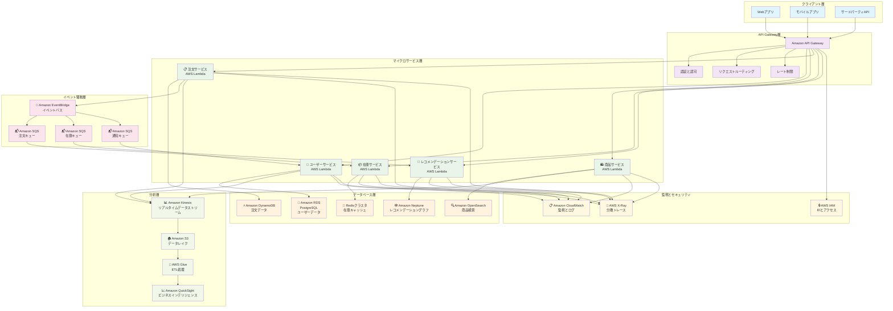

#### サービス間トランザクションSagaパターン実装

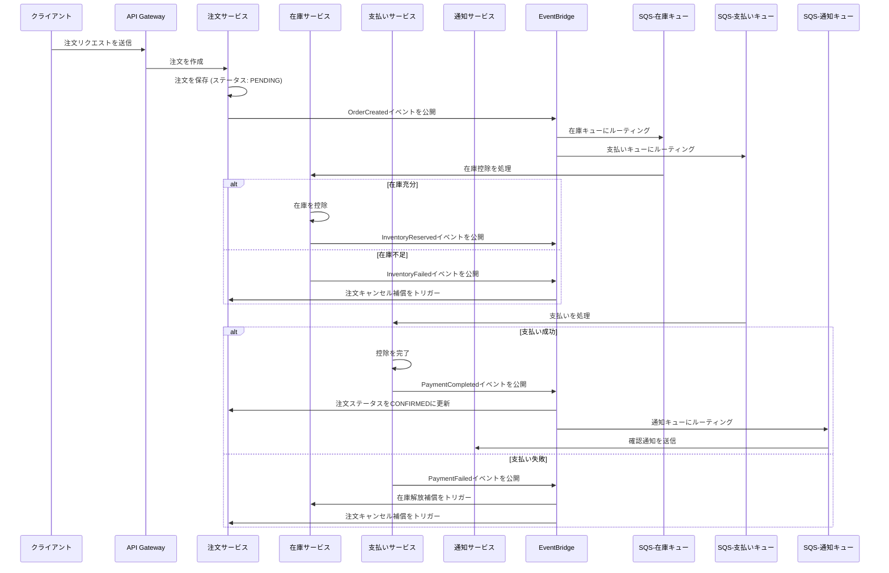

このアーキテクチャ設計は、マイクロサービスデータベースパターンのコアアドバンテージを具現化しています:

1. **サービスの自律性**: 各サービスが最も適したデータベース技術を選択
2. **疎結合**: サービス間はイベント駆動アプローチを通じて非同期通信
3. **スケーラビリティ**: 各サービスが独立してスケール可能
4. **フォールトトレランス**: 単一サービスの障害がシステム全体に影響しない
5. **技術の多様性**: 異なるサービスが異なる技術スタックを使用可能

### 8. グラフデータベース設計思考

最後に、興味深いタイプのデータベース設計について議論しましょう:**グラフデータベース(GDB)**。

もしSQLデータベースが世界を整然としたExcel表に整理し、「正規化」をコア設計原則として、データの整合性とゼロ冗長性を目指す - 「データそのもののために設計された」 - のであれば、グラフデータベースは世界の「関係ネットワーク」そのものを直接保存し、**「あなたが尋ねたい質問のために設計された」**のです。その設計思考は私たちの脳の直感により近いです。私たちはジャーナリストのように行動し、常に尋ねなければなりません:**このデータノードに基づいて、将来最も知りたいことは何か?**

グラフデータベースの世界では、「関係」はもはやJOIN操作を通じて間接的に見つかるものではありません - それらは第一級市民であり、「エンティティ」と同じくらい重要です。これにより、高度に接続されたデータを扱う際に比類のないアドバンテージが得られます。これがまさに、このデータベース設計構造が**連続ドメイン**に特に適している理由です。

**関係指向思考**:

```
- 「このエンティティはどんな属性を持っているか?」ではなく
- 「これらのエンティティ間にどんな関係が存在するか?」
```

テーブル、カラム、主キーを忘れましょう。私たちは新しい視点でデータを見る必要があります - **関係**。

グラフデータベースには3つの最も重要な概念があります:ノード - エッジ(関係) - プロパティ

- ノード(Nodes) - エンティティ

  - これらは私たちの「名詞」で、**ERD(イベント駆動)**で学んだ「エンティティ」に非常に似ています。
  - 例:人、映画、会社、アカウント。
  - ノードはそれらを分類するためのラベルを持つことができます。ノードは複数のラベルを持つことができ、非常に柔軟です。例えば、人は PersonとActorの両方になることができます。

- エッジ(Edges / Relationships) - 関係

  - これがグラフデータベースの魂です! ノードを接続するエッジが**意味**を作り出し、それらの間の**「行動」**を表します。
  - エッジは**有向**です:`(A)-[関係]->(B)` と `(B)-[関係]->(A)` は異なります。
  - エッジは**タイプ**を持ちます:例えば、[:ACTED_IN](出演した)、[:DIRECTED](監督した)、[:FRIENDS_WITH](友達である)。
  - エッジはプロパティを持つことができます:これがSQL接合テーブルよりも強力な点です。例えば、(Tom Hanks)-[:ACTED_IN]->(Forrest Gump)のエッジに、{role: "Forrest Gump"}のプロパティを追加できます。(UserA)-[:PURCHASED]->(ProductB)のエッジに、{date: "2025-09-15", rating: 5}のプロパティを追加できます。

- プロパティ(Properties) - 説明

  - ノードとエッジの両方が自分自身のプロパティを持つことができ、キー値ペアとして存在します。
  - 例えば、Personノードは{name: "Tom Hanks", born: 1956}を持つことができます。

`「...パスを見つける」`、`「...関連を分析する」`、`「...の中心は誰か」`、`「このグループはどんな特性を持っているか」`などと記述できる問題に遭遇し、明確な**指標**と**関係**がある場合、私たちは「グラフデータベース」を強力なツールとして考慮に含めるべきです。

**設計思考の変換**:

SQLでは、「Aの友達の友達」を見つけるには、ユーザーテーブルを2回自己JOINする必要があり、データ量と関係の深さが増加するにつれてパフォーマンスが急激に低下します(友達の友達の友達... * N)。グラフデータベースでは、この質問は「ノードAから始めて、`FRIENDS_WITH`エッジに沿って2ステップ歩き、どの人に到達できるかを見る」になります。この操作はグラフデータベースにとってネイティブで極めて効率的です。私たちはもはや正規化のために多数の「接合テーブル」や「関連テーブル」を作成する必要はありません。グラフの多対多関係は単に直接エッジであり、非常に直感的です!

```python
以前は{N}個のテーブルをJOINする必要があった情報が、今やおそらく豊かなプロパティを持つ1つのエッジで記述できます。
```

この設計思考を理解すると、グラフデータベースは「関係」が「エンティティ」そのものよりも重要なシナリオに特に適していることがわかります。

**一般的なアプリケーションシナリオ:ソーシャルネットワーク / 金融リスク管理 / レコメンデーションシステム / ネットワークとIT運用**

1. **ソーシャルネットワーク** - クラシックシナリオ

- モデル:`(Person)-[:FRIENDS_WITH]->(Person)`、`(Person)-[:LIKES]->(Post)`、`(Person)-[:MEMBER_OF]->(Group)`。
- アプリケーション:

  - 友達レコメンデーション:「私の友達の友達でまだ私の友達ではない人を見つける。」これは単純な2ステップトラバーサルです。
  - 影響力分析:ネットワークで、キーオピニオンリーダー(KOL)は誰か? (誰が最も多くの接続を持っているか、またはネットワークの中心にいるか)。
  - 情報伝播パス:偽ニュースはどのように人々の間に広がったか?

2. 金融リスク管理と詐欺検出

- モデル:`(Person)-[:HAS_ACCOUNT]->(BankAccount)`、`(Person)-[:USES_DEVICE]->(Device)`、`(BankAccount)-[:SENT_TO]->(BankAccount)`。
- アプリケーション:
  - 詐欺グループ識別:一見無関係に見えるいくつかのアカウントがすべて同じデバイスやIPアドレスで登録またはログインしているか? 短時間でお互いに送金し、異常な閉ループを形成しているか?
  - マネーロンダリングパターン分析:お金は複数の複雑な送金パスを経て、最終的に元のソースの近くに戻るか? グラフサイクル検出アルゴリズムはこのパターンを簡単に発見できます。

3. レコメンデーションエンジン

- モデル:`(Customer)-[:PURCHASED]->(Product)`、`(Customer)-[:VIEWED]->(Product)`、`(Product)-[:IN_CATEGORY]->(Category)`。
- アプリケーション:
  - 協調フィルタリング:「商品Aを購入した顧客は他にどの商品も購入したか?」グラフデータベースは`(CustomerA)-[:PURCHASED]->(ProductA)<-[:PURCHASED]-(CustomerB)-[:PURCHASED]->(ProductB)`のようなパスを素早く見つけ、その後ProductBをCustomerAに推薦できます。
  - コンテンツベースのレコメンデーション:「このユーザーが好きな映画と同じ俳優や監督の他の映画を推薦する。」

4. ネットワークとIT運用

- モデル:`(Server)-[:CONNECTED_TO]->(Switch)`、`(Application)-[:RUNS_ON]->(Server)`、`(Database)-[:DEPENDS_ON]->(Server)`。
- アプリケーション:
  - 根本原因分析:アプリケーションが遅くなったとき、それが依存するデータベース、サーバー、ネットワークスイッチの状態はどうか? グラフを使えば依存チェーン全体を素早く見て根本原因を見つけることができます。

政党所属クラスタネットワーク分析システムを視覚化しましょう:

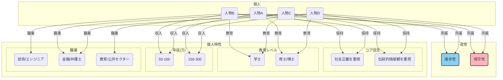

このデータ構造では、いくつかの重要なポイントを簡単に特定できます:

1. 重力中心とクラスタ:

- 進歩党と保守党は2つの重力中心のように機能し、それぞれの支持者(P1、P2とP3、P4)を引き寄せます。
- 社会正義を重視(BeliefX)は二次的な中心となり、P1とP2を緊密に結びつけます。同様に、伝統的価値観を重視(BeliefY)はP3とP4を結びつけます。

2. ブリッジノード:

- 金融/法律(Job2)、修士/博士(Edu2)、高収入(Inc2)は非常に重要なノードになります。それらはブリッジとして機能し、異なる政党に所属するP1とP4を直接接続します。
- 視覚的に、P1とP4がそれぞれの政党と信念によって引き離されているのに、これら3つの共有された社会経済的背景特性によって強く引き寄せられているのがわかります。これは彼らの「対立しながらも類似している」複雑な関係を鮮明に示しています。

3. ネットワーク密度とコミュニティ境界:

- P1とP2の間、およびP3とP4の間の接続は非常に密で、2つの明確なコミュニティを形成しています。
- コミュニティ間の接続(P1とP4のリンクなど)は比較的疎で、これもコミュニティ境界を特定するのに役立ちます。

見えますか? これがグラフデータベースが最も強力で効果的である点です。**エッジ(関係)**に基づいて、データの意味を簡単に解釈できます。私たちはもはや接合テーブルを通じて関係を「シミュレート」する方法を考える必要はなく、関係を直接「記述」できます。グラフデータベースは、ホワイトボードで複雑な関係を描写する直感的な思考プロセスを、保存およびクエリ可能なデータ構造に変換します。それは現実世界のネットワーク関係の直接マッピングであり、表形式の抽象化ではありません。アプリケーションでの私たちの目標は、コアクエリを高速道路を運転するようにスムーズにする「道路ネットワーク」を設計することです。常に最小の「ステップ」(トラバーサル)で質問に答える方法を考え、それに応じてデータ構造のノード、エッジ、プロパティを調整します。

アプリケーションでは、**関係ファースト**キーワードが現れると、この一般的なデータアクセスシナリオが**ドメインチェーンに焦点を当てている**ことを表し、これがグラフ思考がデータベース設計に特に適している時です。

この時点で、実際に何かを発見します:この**クエリニーズが書き込みニーズを絶対的に上回る**シナリオでは、**CQRS(読み書き分離)**アプリケーションによく適合しませんか? この**クエリ**ステップを最小化する設計コンテキストを使用して、読み取りパフォーマンスを最大化できますか?

絶対にイエスで、これはまさに高性能システムを扱う際に多くのシニアアーキテクトの心の中で実行されている「心法」の1つです。

これはコア概念に触れています:**グラフデータベース設計思考は本質的に、極端なクエリ指向の「非正規化」哲学です。**

実際的な例としてUber Eatsを使用しましょう:

#### AWS実装:Uber Eatsの食事レコメンデーション関係ネットワーク推論システム

Uber Eats Appを開くと、バックエンドは次のようなクエリを実行します:

- Aを注文した人(おそらく前回注文したドミノピザ)は他に何を注文しましたか?
- 私たち(現在のアカウント情報)はどんな料理が好きかもしれませんか?

**ドメインコンテキスト**に従って段階的にノードとエッジ(関係)を設計する方法を考えてみましょう:

> Aを注文した人(ドミノピザ + ペプシ - 本当にお勧め)は他に何を注文しましたか?

1. 私たち(`ユーザーA`)が最近注文したレストラン(`レストランX`)を見つける
2. `レストランX`からも注文したすべての他のユーザー(`ユーザーB`、`ユーザーC`)を見つける
3. これらのユーザーが私たちが決して注文したことのない他のどのレストランから注文したか(`レストランY`、`レストランZ`)をトラバースする
4. `レストランY`と`レストランZ`をレコメンデーション結果として提示
5. `レストランZ`が企業プッシュプランに支払ったので、`レストランZ`をレコメンデーションリストのトップ(index=0)に配置

> どんな料理を私たち(`ユーザーA`)は好きかもしれませんか?

1. 私たちが最も頻繁に注文する料理(`料理A`、`料理B`)を見つける
2. コンテキスト関連を通じて検索(地理的位置 / 料理チェーン)
   1. 私たちの地理的位置の近くで、これらの料理を提供する他のレストラン`レストランW`を見つける
   2. `料理A`とよく一緒に愛される`料理C`を見つけ、`料理C`を提供するレストランを推薦(例:アメリカンレストランはよくメキシコレストランをプッシュされる)

しかし、何百万人ものユーザー、何十万ものレストラン、何千万もの食事を持つUber Eatsのようなプラットフォームでは、少なくとも上記の2つのシナリオを満たさなければなりません。「近くの最も人気のあるレストラン」や「最も注文された食事」のような一般的なものは言うまでもありません。

一般的な検索結果だけでは、次のようなパーソナライズされたレコメンデーションのマーケティング利益最大化ニーズを満たすことはできません:

- 「このユーザーが**好きかもしれないが注文したことのない**レストランをいくつか推薦する。」
- 「**『日本ラーメン』**と**『辛い鍋』**を好きなユーザーは通常他にどんな**料理**も楽しむか?」
- 「このユーザーと**似た好み**を持つ**人々のグループ**を見つけ、彼らが最近注文した**新しいもの**を見る。」

これらの質問の共通点は、**「関係」**に大きく依存していることです - ユーザーとレストランの間の関係、ユーザーと料理の間の関係、ユーザー間の暗黙の関係。従来のSQLでこれらの問題を扱うには、非常に複雑で遅いJOINクエリが必要で、リアルタイムレコメンデーションニーズを満たすことができません。同時に、異なるシナリオごとに予測モデルを特別に設計することは、コスト便益の観点から極めて不釣り合いです。

それでは、私たちの**グラフモデル設計(ブループリント)**を進めましょう:

- ノード:

  - ユーザー:プロパティにはユーザーID、地理的位置などが含まれます。
  - レストラン:プロパティにはレストラン名、住所、料理タグが含まれます。
  - MenuItem:プロパティには食事名、価格、材料が含まれます。
  - 料理:例えば、「日本料理」、「イタリア料理」、「四川料理」。
  - 材料:例えば、「牛肉」、「チーズ」、「唐辛子」。

- エッジ / 関係:

  - (ユーザー) -[`:ORDERED {date, rating}`]-> (レストラン):ユーザーがレストランから注文し、エッジは日付と評価のようなプロパティを持つことができます。
  - (ユーザー) -[`:FAVORITED`]-> (レストラン):ユーザーがレストランをお気に入りにしました。
  - (レストラン) -[`:SERVES`]-> (料理):レストランが特定の料理を提供します。
  - (MenuItem) -[`:CONTAINS`]-> (材料):食事が特定の材料を含みます。

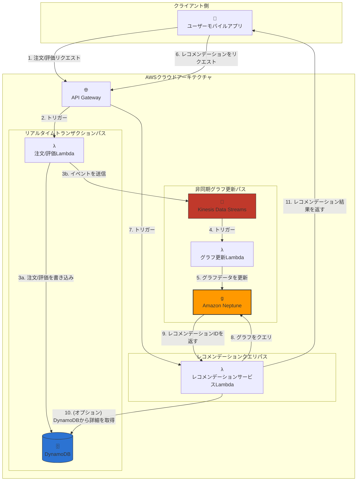

**実際的なシミュレーションシナリオ:「小明(ユーザーA)」が好きかもしれない新しいレストランを推薦する。**

1. レコメンデーションをトリガー:小明がAppを開きレコメンデーションセクションにスクロールします。モバイルAppが「レコメンデーションをリクエスト」APIリクエストを送信します(ステップ6)。
2. API Gateway & トリガー:API Gatewayがリクエストを受信し、IDを検証し、その後レコメンデーションサービスLambda(LambdaRecommend)をトリガーします(ステップ7)。

3. コアグラフクエリ:LambdaRecommendのコアタスクは、Amazon Neptuneにグラフクエリを送信することです(ステップ8)。このクエリのロジックは「協調フィルタリング」です:

> - 「小明(ユーザーA)と似た好みを持つ人々を見つけ、小明が試したことのないレストランで彼らが好きなものを見る。」

このロジックをグラフクエリ言語で記述:

- a. 小明(ユーザーA)が注文したレストラン(Rest_1 - 一蘭ラーメン)を見つける。
- b. Rest_1からも注文した他の人(ユーザーB - 小紫)を見つける。
- c. 小紫が注文した他のレストラン(Rest_3 - Wowprime)を見る。
- d. 小明がRest_3から注文したかどうかを確認。彼が注文していないことを発見。
- e. したがって、Rest_3(Wowprime)は強力なレコメンデーション候補になります。

4. 結果を返す:Neptuneはこのトラバーサルを効率的に完了し、Rest_3のIDをLambdaRecommendに返します(ステップ9)。

5. データエンリッチメント(オプション):LambdaRecommendがRest_3のIDを受信した後、フルネーム、住所、画像URLなどの詳細なレストラン情報についてDynamoDBに再度クエリすることができます(ステップ10)。DynamoDBはこのタイプの高速キー値ルックアップに非常に適しています。

6. ユーザーに提示:LambdaRecommendは完全なレコメンデーション結果(レストラン名、画像などを含む)をJSONにパッケージ化し、API Gatewayを通じて小明のモバイルAppに返します(ステップ11)。小明は「Wowprime」が自分のレコメンデーションリストに表示されるのを見ます。

このレコメンデーションは、グラフ内のデータがリアルタイムであるという前提で成功できます。これが「非同期グラフ更新パス」の役割です。

**データはどのようにグラフに入るのか? (非同期パス)**

1. Appが「注文リクエスト」を送信(ステップ1)、API GatewayがOrder Lambdaをトリガー(ステップ2)。
2. Order Lambdaは2つのことを行います:

- 3a:詳細な注文記録を永続トランザクション記録としてDynamoDBに書き込む。
- 3b:同時に、{ "userId": "User_A", "restaurantId": "Rest_2", "action": "ORDER" }のような簡略化されたイベントをKinesis Data Streamsに送信。

4. Kinesisがイベントを受信した後、自動的にGraph Update Lambdaをトリガーします(ステップ4)。
5. Graph Update LambdaがイベントをパースしNeptuneで更新ステートメントを実行:User_AとRest_2の間のORDEREDエッジを見つけ、そのcountプロパティを1増やす(ステップ5)。

このアーキテクチャは完璧な**読み書き分離**と**関心事の分離**を達成します:

- トランザクションパス(DynamoDB)は高速で安定し、コアトランザクションを処理
- 分析/レコメンデーションパス(Neptune)は複雑な関係クエリに焦点を当て、深い洞察を提供
- Kinesisは両者間の非同期ブリッジとして機能し、システムの回復力と分離を保証

`「...パスを見つける」`、`「...関連を分析する」`、`「...の中心は誰か」`、`「このグループはどんな特性を持っているか」`と記述できる問題に遭遇したとき、特に**読み取りが書き込みを絶対的に上回る**ことを強調し、**ドメインの連続性**を評価する場合、私たちは**「グラフデータベース」**を強力なツールとして考慮に含めるべきです。

## 設計戦略選択のための抽象原則

データベース設計の旅は、**ビジネスドメイン**の深い理解から始まり、合理的なツール選択を経て、最終的にパフォーマンスと回復力の間の繊細なバランスに着地します。それは**ビジネスロジック実装**の沈黙の英雄です。初期段階では気づかれないかもしれませんが、システムが莫大なトラフィックと複雑な要件に直面したとき、その堅固なアーキテクチャがシステムの成功か失敗かを決定します。この先見の明と戦略的思考こそが、データベース設計を**「技術応用」**から**「設計芸術」**に引き上げるものです。

```
成功したデータベース設計は、「ビジネス要件」、「技術的現実」、そして「将来の変化」の間で絶えずトレードオフと妥協を行う戦略的芸術です。
```

データベース技術選択を行う際、私たちは良い**要件分析**作業を行わなければなりません。ある程度、アーキテクトとエンジニアとして、ビジネスドメインに対する私たちの理解は他者よりも深くなければなりませんし、**そうあるべき**です。システムの**コア価値**は何か? **データはどのようなものか?** **システムは最も一般的にデータで何をするか?** **システムのスケールの将来の成長曲線は何か?**

私たちは`要件分析` => `技術選択` => `スキーマ設計`を進めるために、コンテキストとツールの深い理解を持たなければなりません。

データベース設計の哲学は抽象から具体への旅であり、これもまた**DDD**の最も重要なコア概念です:

1. 「人々」から始める:ユーザーのニーズとコンテキストを理解する。
2. 「ストーリー」に洗練する:ニーズを行動と影響のビジネスプロセスに変換する。
3. 「ツール」を選択する:ストーリーの特性(整合性、クエリパターン、スケール)に基づいて、適切な技術の組み合わせを選択する。
4. 「モデル」を構築する:異なる視点のために異なるスキーマを設計し、ストーリーが効率的に記録され語られることを可能にする。

### 堅固な設計プロセス:要件分析 => 技術選択 => スキーマ設計

最初に、私たちはまず技術を忘れ、探偵と心理学者にならなければなりません。私たちは「ビジネスストーリー」を深く理解し、**コア主人公(エンティティ)**、それらの間の**関係**、**起こるストーリー(操作)**、そして**従わなければならないルール(制約)**を見つけなければなりません。

この段階で、私たちは:

```python
技術を忘れ、「ビジネスロジック」と「データストーリー」に焦点を当てる
```

要件分析段階に費やす時間が多いほど、後で作り直す確率は低くなります。曖昧なブループリントは揺れる危険な建物しか建てられません。

以前言及した階層化テナンシー - Netflixを例として使用:

ストリーミングビデオプラットフォームの設計を開始する前に、以下の順序で抽象的な**ビジネス実装ロジック概念**を徐々に明確にできます:

1. **主人公(エンティティ)は誰か?**

- システムのコア役割またはオブジェクトは何か? 例:`ユーザー`、`ビデオコンテンツ`、`スタジオ`、`ライセンス`。これらは将来のデータベースの主な「名詞」です。
- 次に、概念が過度に集中して後続のフォーカス喪失につながらないように、主要なタイプに基づいてそれらをより広いカテゴリーに積極的に分割する必要があります。ビデオコンテンツについては、**単一の独立した作品**(映画)と**連続作品**(シリーズ、リアリティ番組)を区別できます。この時点で、すでに概念的区別に`category`を使用できます。
- `tag`を使用しない理由は:`category`は**本質的、相互排他的な分類**を表すからです。作品は映画かシリーズのどちらかです - この分類はその基本的なデータ構造を決定します(例:シリーズにはシーズンとエピソードがあり、映画にはない)。一方、`tag`(ラベル)は**記述的、非相互排他的属性**です - 映画は同時に「SF」、「アクション」、「オスカー受賞」タグを持つことができます。要件分析段階で、「本質的分類」と「記述的タグ」を区別することは非常に重要です。

2. **それらの間にどんな関係が存在するか(関係)?**

- `ユーザー`は**視聴する**`ビデオコンテンツ`、また**評価する**こともできます。
- `ビデオコンテンツ`は`スタジオ`によって**制作される**。
- 特定の`地域`における`ビデオコンテンツ`の放送権は`ライセンス`の下で**ライセンスされる**。
- `ユーザー`は複数の`プロファイル`を持つことができます、例えば家族共有アカウントの下の「パパ」、「ママ」、「子供」。

3. **どんなストーリーが起こるか(操作)?**

- **高頻度読み取り**:ユーザーがカタログを閲覧し、ビデオを検索し、ビデオを視聴します。これは**システムの主なトラフィックソース**であり、**レイテンシに極めて敏感**です。
- **中頻度書き込み**:システムがユーザーの視聴履歴を記録し、部分的に視聴されたビデオの進捗タイムスタンプを更新し、ユーザー評価を保存します。
- **低頻度書き込み**:コンテンツチームが新しいビデオコンテンツをアップロードし、作品のカバーまたは説明を更新し、新しいライセンス契約を設定します。

4. **従わなければならないルール(制約)?**

- **地理的制限**:日本地域権を持つアニメは米国IPアドレスから絶対に視聴できません。
- **年齢レーティング**:「子供」プロファイルは制限コンテンツを検索または視聴できません。
- **ライセンス期限**:ライセンス契約の有効期限が切れた後、対応するビデオコンテンツは関連地域で即座に削除されなければなりません。
- **アカウント制限**:標準アカウントは最大2つのデバイスで同時に視聴できます。

このロジカルアプローチを使用して2つのシナリオを検証しましょう:**Uber Eats**と**TSMC Wafer Factory IoT**

#### Uber Eats要件分析コンテキスト

1. 主人公(エンティティ)は誰か?

- `ユーザー`:注文する顧客。
- `レストラン`:食事を提供する商人。
- `配達員`:食事の輸送を担当する配達パートナー。
- `注文`:完全な取引記録、すべての主人公を接続する鍵。
- `MenuItem`:メニュー上の特定のアイテム。
- `料理`:「日本料理」、「イタリア料理」、「ファストフード」などの分類。
- `PaymentMethod`:クレジットカード、Apple Payなど。

2. それらの間にどんな関係が存在するか(関係)?

- `ユーザー`は複数の`注文`を**行う**。
- `注文`は1つの`ユーザー`のみに**属し**、1つの`レストラン`から**注文される**。
- `注文`は複数の`MenuItem`を**含む**。
- `注文`は特定の段階で`配達員`に**割り当てられる**。
- `レストラン`は複数の`MenuItem`を**提供し**、1つまたは複数の`料理`に**専門化する**。
- `ユーザー`は複数の`PaymentMethod`を**持つ**。

3. どんなストーリーが起こるか(操作)?

- 超高頻度読み取り/更新(リアルタイムストリーミング):
  - `配達員`のリアルタイム位置追跡。これらは地図上の移動する点で、レイテンシに極めて敏感です。
- 高頻度読み取り(読み取り重視):
  - `ユーザー`が近くのレストランリストを閲覧し、メニューをスクロールし、特定の食事を検索します。
  - `ユーザー`が進行中の注文ステータス(受諾、準備中、配達中)をクエリします。
- 高頻度書き込み(書き込み重視):
  - `ユーザー`が`注文`を送信します。これは食事ピーク時のシステムの書き込みボトルネックです。
- 中頻度書き込み(中書き込み):
  - `ユーザー`が`レストラン`または`MenuItem`を評価します。
  - `ユーザー`が`レストラン`をお気に入りに追加します。
- 低頻度書き込み(低書き込み):
  - `レストラン`がメニュー、価格、または営業時間を更新します。
  - `ユーザー`が`PaymentMethod`を追加または削除します。

4. 従わなければならないルール(制約)?

- 地理的制限:`ユーザー`は配達範囲内の`レストラン`のみを見ることができます。
- 時間制限:`ユーザー`は現在営業中の`レストラン`からのみ注文できます。
- トランザクションアトミック性:`注文`の作成と`支払い`の成功はアトミック操作でなければなりません; 支払いが失敗した場合、注文は作成できません。
- 状態整合性:注文`ステータス`の更新(例:「配達員が食事をピックアップ」)は`ユーザー`と`レストラン`の両方にリアルタイムで表示されなければなりません。
- 排他性:`注文`は一度に1人の`配達員`によってのみ配達できます。

#### TSMC Wafer Factory IoT要件分析コンテキスト

私たちはまずウェーハ製造の「ビジネスストーリー」を深く理解し、データの背後にある物理的意味を明確にしなければなりません:

1. 主人公(エンティティ)は誰か?

- `マシン`:エッチャー、露光機などの装置 - データ生成のソース。
- `センサー`:マシンにインストールされた特定の測定ユニット、温度計、圧力計など。
- `ウェーハ`:処理中の製品、それぞれが一意のIDを持ちます。
- `ロット/バッチ`:一緒に処理されるウェーハのグループ、同じプロセスパラメータを共有します。
- `レシピ`:バッチを処理する際のマシン設定を定義する一連の指示。
- `オペレーター`:マシンの監視と操作を担当する担当者。

2. それらの間にどんな関係が存在するか(関係)?

- `マシン`には複数の`センサー`がインストールされています。
- `マシン`は特定の時間に特定の`ロット`から特定の`ウェーハ`を処理しています。
- `ロット`の処理は`レシピ`に従います。
- データが異常なとき、システムは特定の`オペレーター`に通知する必要があります。

3. どんなストーリーが起こるか(操作)?

- **超高頻度書き込み**:何万もの`センサー`がミリ秒単位で測定データ(温度、圧力、振動)をシステムに連続的に書き込みます。**これはシステムの主な負荷です**。
- **高頻度読み取り**:
  - リアルタイム監視:`オペレーター`ダッシュボードは秒レベルの更新が必要で、過去数分の主要パラメータ曲線を表示します。
  - リアルタイムアラート:システムは受信データを継続的にスキャンする必要があります; `ロット`パラメータ(温度など)が`レシピ`設定から逸脱したら、アラートは数秒以内にトリガーされなければなりません。
- **中頻度読み取り**:
  - 歩留まり分析:品質エンジニアは、歩留まり低下の原因を分析するために、`マシン`での`ロット`の完全な処理履歴をクエリする必要があります。クエリ範囲は通常数時間から数日です。
- **低頻度読み取り**:

  - トレンド分析とモデルトレーニング:R&Dエンジニアは`レシピ`を最適化したり、予知保全機械学習モデルをトレーニングするために何年ものデータを分析する必要があります。クエリ範囲は極めて大きいですが、リアルタイム要件は高くありません。

  4. 従わなければならないルール(制約)?

- データ整合性:`センサー`データは失われてはいけません、単一のデータポイントの欠落がバッチ全体の歩留まり分析失敗を引き起こす可能性があるためです。
- 時間精度:すべてのデータはミリ秒単位で正確なタイムスタンプを持たなければならず、順序は絶対に間違ってはいけません。時間はこのドメインで最も重要な次元です。
- データ保持戦略:品質追跡性とコンプライアンス要件のため、生データは何年も保持する必要があるかもしれません。
- 低レイテンシアラート:異常が発生したとき、データ生成からアラートトリガーまでの総レイテンシは数秒以内に制御されなければなりません。

---

私たちは次のような要件分析(アーキテクチャブループリント)の概念を持っています:

- 要件分析(アーキテクチャブループリント):
  - コア哲学:技術を忘れ、探偵と心理学者になる。
  - ミッション:「ビジネスストーリー」を深く理解し、システムのコア主人公(エンティティ)、それらの間の関係(関係)、起こるストーリー(操作)、従わなければならないルール(制約)を見つける。
  - 出力:技術に依存しない概念モデル(ERDなど)、これは後続のすべての作業の最高指導原則です。

---

要件を初期段階で明確にした後、次の重要なマイルストーンは**技術選択**です。

理論的には、既知の議論領域(<ビジネスロジック変換>を参照)での要件カバレッジができるだけ**80%**に近づいたとき、これは私たちの初期の具体的なシステムに非常に近く、80/20トレードオフ原則の戦略的差別化も満たします。私たちは概念を持つべきです:

**これらの`起こるストーリー(操作)`の下で、`従わなければならないルール(制約)`のため、私は対応するデータベース設計を構築します**

この時点で、**ダイアモンドモデル**という分析ツールがあります。

これは4つの重要なファセット間でトレードオフを行い、最良の設計を磨くのに役立つ抽象的な意思決定芸術です。4つの次元は:ビジネスロジック、データ特性、アプリケーションパターン、システムスケールです。

1. ビジネスロジック(価値の源泉):システムのコア価値は何か? (整合性 vs. 可用性)
2. データ特性(データの性質):データは自然にどのように見えるか? (構造化 vs. 非構造化)
3. アプリケーションパターン(システムの動作):システムは最も一般的にデータで何をするか? (読み書き比、クエリパターン)
4. システムスケール(将来の曲線):システムはどのように成長するか? (垂直スケーリング vs. 水平スケーリング)

ダイアモンドモデルの本質は、これらの次元が互いに相互作用することを強調することです。良い設計は1つのファセットだけを見るのではなく、包括的に評価し、一見矛盾する要件の中でその繊細なバランスポイントを見つけます。例えば、「大規模なスケール」(次元4)を扱うために、「ビジネスロジック」(次元1)でリアルタイム整合性の要件を緩和するかもしれません。

初期の`起こるストーリー(操作)`の`コア主人公(エンティティ)`の`起こるストーリー(操作)`の特性に基づいて技術的選択を行うことができます。一般的な特性は次のとおりです:

**データ変更頻度**:

- 高頻度変更 → イベント駆動 + CQRS
- 中頻度変更 → 従来のCRUD + キャッシュ
- 低頻度変更 → マスターデータ管理パターン

**データ量スケール**:

- TBレベル以下 → 垂直スケーリング + 読み取りレプリカ
- TBからPBレベル → 水平シャーディング
- PBレベル以上 → 分散 + ホットコールド階層化

**整合性要件**:

- 強整合性 → ACIDトランザクション
- 最終整合性 → イベント駆動
- セッション整合性 → 読み書き分離

**クエリパターン**:

- シンプルクエリ → リレーショナルデータベース
- 複雑な分析 → カラムナーデータベース
- グラフトラバーサル → グラフデータベース
- 全文検索 → 検索エンジン

**災害復旧**:

- 高可用性 → マルチAZ
- リージョン間レプリケーション → グローバルテーブル
- 災害復旧 → クロスリージョン

#### TSMC Wafer Factory IoT技術選択分析コンテキスト

今回は順序を変えて**Wafer IoT `起こるストーリー(操作)`**から始めましょう。

> - **超高頻度書き込み**:
>   - 何万もの`センサー`がミリ秒単位で測定データ(温度、圧力、振動)をシステムに連続的に書き込みます。**これはシステムの主な負荷です**。
> - **高頻度読み取り**:
>   - リアルタイム監視:`オペレーター`ダッシュボードは秒レベルの更新が必要で、過去数分の主要パラメータ曲線を表示します。
>   - リアルタイムアラート:システムは受信データを継続的にスキャンする必要があります; `ロット`パラメータ(温度など)が`レシピ`設定から逸脱したら、アラートは数秒以内にトリガーされなければなりません。
> - **中頻度読み取り**:
>   - 歩留まり分析:品質エンジニアは、歩留まり低下の原因を分析するために、`マシン`での`ロット`の完全な処理履歴をクエリする必要があります。クエリ範囲は通常数時間から数日です。
> - **低頻度読み取り**:
>   - トレンド分析とモデルトレーニング:R&Dエンジニアは`レシピ`を最適化したり、予知保全機械学習モデルをトレーニングするために何年ものデータを分析する必要があります。クエリ範囲は極めて大きいですが、リアルタイム要件は高くありません

要件分析から、データ価値とアクセスパターンがその「年齢」と高度に関連していることがわかります。これは**「ホットコールドデータ階層化」**と**「CQRS」**の混合アプリケーションシナリオです。

1. ホット層 - リアルタイム監視とアラート

- 要件:超高頻度書き込みとリアルタイム時系列クエリを処理します。
- 選択:時系列データベース、例えばAmazon Timestream。
  -Timestreamは時系列データ専用に設計されており、そのIn-Memory Storeは大量の書き込みを処理でき、時間範囲クエリに対して極めて最適化されており、リアルタイムダッシュボードとアラートニーズを完璧に満たします。

2. ウォーム層 - 短期歩留まり分析

- 要件:数日または数週間のデータでより複雑な分析クエリを実行します。
- 選択:時系列データベースのディスク層、例えばAmazon TimestreamのMagnetic Store。
  - Timestreamはメモリ保持を超えるデータを自動的に低コストディスク層にダウングレードします。アプリケーションはホットとウォーム層のデータを同時にクエリするためにクエリロジックを変更する必要はありません。

3. コールド/凍結層 - 長期分析とアーカイブ

- 要件:最低コストで何年もの履歴データを保存し、大規模バッチ分析の能力を持ちます。
- 選択:データレイク、例えばAmazon S3 + AWS Glue + Amazon Athena。
  - `S3`はほぼ無限で極めて低コストのストレージを提供します。
  - `AWS Glue`はTimestreamから、またはIoTソースから直接データを分析に適した`Parquet`形式に変換します。
  - `Amazon Athena`はエンジニアがサーバーを管理することなく、大量のS3データに対して標準SQLを使用して直接アドホッククエリを行うことを可能にします。

#### Netflixの複数ドメイン技術選択分析コンテキスト

上記の要件分析から、NetflixはNetflixは単一のシステムではなく、異なる要件を持つ複数の「サブユニバース」で構成された連邦であることが明確にわかります。1つのデータベースにすべての問題を解決させることは、1種類のドライバーだけを使用してコンピューター全体を組み立てるようなものです - 失敗する運命です。したがって、私たちは「ポリグロット永続性」戦略を採用しなければなりません。

> - **高頻度読み取り**:
>   - ユーザーがカタログを閲覧し、ビデオを検索し、ビデオを視聴します。これは**システムの主なトラフィックソース**であり、**レイテンシに極めて敏感**です。
> - **中頻度書き込み**:
>   - システムがユーザーの視聴履歴を記録し、部分的に視聴されたビデオの進捗タイムスタンプを更新し、ユーザー評価を保存します。
> - **低頻度書き込み**:
>   - コンテンツチームが新しいビデオコンテンツをアップロードし、作品のカバーまたは説明を更新し、新しいライセンス契約を設定します。

1. **ビデオカタログ、検索とパーソナライズされたレコメンデーション(メタデータドメイン)**

   - **要件**:半構造化メタデータ(俳優、説明、タグ)を処理し、強力な全文検索と複雑な関連クエリ(レコメンデーション)をサポートする必要があります。
   - **選択**: **ドキュメントデータベース(MongoDBなど) + 検索エンジン(OpenSearch/Elasticsearchなど)**。
     - `MongoDB`は詳細なビデオメタデータを保存し、その柔軟なスキーマは多様なコンテンツ属性に非常に適しています。
     - `OpenSearch`は検索インデックスを構築し、効率的なキーワード検索、カテゴリーフィルタリング、集約分析を提供します。レコメンデーションエンジンの関係データはグラフデータベース`Neptune`に部分的に保存することもできます。

2. **ユーザー視聴履歴と状態(行動ログドメイン)**

   - **要件**:極めて高い書き込みスループット(毎秒何百万ものユーザーが視聴状態を更新)、受け入れ可能な最終整合性、比較的シンプルなクエリパターン(通常ユーザーIDでクエリ)。
   - **選択**: **キー値/ワイドカラムデータベース(DynamoDBまたはCassandraなど)**。
     - `DynamoDB`のキー値モデルは、`UserID`をパーティションキーとし、`VideoID`または`Timestamp`をソートキーとする設計に非常に適しており、ほぼ無限のスケーラビリティと低レイテンシの読み書きを提供します。

3. **ユーザーアカウント、サブスクリプションと支払い(トランザクションドメイン)**
   - **要件**:絶対的な強整合性(ACID)、複雑なトランザクション操作をサポートする必要があります(例:支払い失敗はサブスクリプションステータスをロールバックする必要があります)。
   - **選択**: **リレーショナルデータベース(PostgreSQLまたはMySQLなど)**。
     - `PostgreSQL`のトランザクション能力と成熟したエコシステムは、金融関連データを処理するための代替不可能な選択であり、アカウントの正確性を保証します。

#### Uber Eats技術選択分析コンテキスト

> - 超高頻度読み取り/更新(リアルタイムストリーミング):
>   - `配達員`のリアルタイム位置追跡。これらは地図上の移動する点で、レイテンシに極めて敏感です。
> - 高頻度読み取り(読み取り重視):
>   - `ユーザー`が近くのレストランリストを閲覧し、メニューをスクロールし、特定の食事を検索します。
>   - `ユーザー`が進行中の注文ステータス(受諾、準備中、配達中)をクエリします。
> - 高頻度書き込み(書き込み重視):
>   - `ユーザー`が`注文`を送信します。これは食事ピーク時のシステムの書き込みボトルネックです。
> - 中頻度書き込み(中書き込み):
>   - `ユーザー`が`レストラン`または`MenuItem`を評価します。
>   - `ユーザー`が`レストラン`をお気に入りに追加します。
> - 低頻度書き込み(低書き込み):
>   - `レストラン`がメニュー、価格、または営業時間を更新します。
>   - `ユーザー`が`PaymentMethod`を追加または削除します。

要件分析は、Uber Eatsのビジネスが非常に異なる特性を持つ複数の「境界付けられたコンテキスト」で構成されていることを明確に教えてくれます。

1. 注文とトランザクションドメイン(コアトランザクション)

- 要件:極めて高い書き込みスループット(特にピーク時間中)、高可用性、受け入れ可能な最終整合性(レポートは遅くても良い)。クエリパターンは比較的固定(注文IDまたはユーザーIDでクエリ)。
- 選択:キー値/ドキュメントデータベース(DynamoDBなど)。そのキー値モデルは`order_id`に基づく高速読み書きに非常に適しており、トラフィックピークを簡単に処理でき、水平スケーリングを達成します。

2. レストランとメニュードメイン(マスターデータ)

- 要件:読み取りが書き込みをはるかに上回り、強力なデータ整合性を保証する必要があります(メニュー価格は間違ってはいけない)、比較的安定したデータ構造。
- 選択:リレーショナルデータベース(PostgreSQLなど) + キャッシュ層(Redisなど)。PostgreSQLは権威のあるレストランとメニューマスターデータを管理し、Redisは人気のあるレストランメニュー情報をキャッシュして大量の閲覧リクエストを処理します。

3. 配達員物流ドメイン(地理空間とリアルタイムストリーミング)

- 要件:超高頻度位置更新を処理し、効率的な地理空間クエリをサポート(例:「レストランに最も近い利用可能な配達員5人を見つける」)。
- 選択:インメモリデータベース(Redisなど) + メッセージキュー(Kinesis/Kafkaなど)。RedisのGeo-spatialコマンドはリアルタイム地理位置ストレージとクエリを極めて効率的に処理できます。Kinesisは大量の位置更新データストリームの受信とバッファリングを処理します。

4. 検索とレコメンデーションドメイン(関係探索)

- 要件:複雑な関係クエリを処理、例えば「このレストランから注文した人は他に何を好きか?」または「私と似た好みを持つ人々が最近注文した新しいレストランは何か?」
- 選択:グラフデータベース(Neptuneなど)。以前言及したように、これはグラフデータベースが優れているドメインであり、複雑な「ユーザー-レストラン-料理」関係ネットワークを効率的にトラバースします。

### ドメイン特性に基づく選択マトリックス

#### AWSデータベース選択決定フローチャート

```mermaid
flowchart TD
    A[システム要件分析] --> B{ワークロードタイプ?}

    B -->|OLTPトランザクショナル| C{整合性要件?}
    B -->|OLAP分析| D{データモデル?}
    B -->|検索タイプ| E[OpenSearch + CloudFront]
    B -->|時系列| F[Timestream + Redis]
    B -->|グラフ関係| G[Neptune + Redis]

    C -->|強整合性| H{データモデル?}
    C -->|最終整合性| I{データモデル?}

    H -->|リレーショナル| J[RDS PostgreSQL<br/>+ ElastiCache Redis<br/>+ マルチAZ]
    H -->|ドキュメント| K[DocumentDB<br/>+ DAX<br/>+ クロスリージョン]

    I -->|ドキュメント| L[DynamoDB<br/>+ DAX<br/>+ グローバルテーブル]
    I -->|キー値| M[ElastiCache<br/>+ クロスAZ<br/>+ バックアップ]

    D -->|カラムナーストレージ| N[Redshift<br/>+ Spectrum<br/>+ S3データレイク]
    D -->|ドキュメント分析| O[EMR + S3<br/>+ Glue<br/>+ Athena]

    E --> P[コスト便益分析]
    F --> P
    G --> P
    J --> P
    K --> P
    L --> P
    M --> P
    N --> P
    O --> P

    P --> Q{予算範囲?}
    Q -->|< $1000/月| R[基本構成]
    Q -->|$1000-5000/月| S[標準構成]
    Q -->|> $5000/月| T[エンタープライズ構成]

    R --> U[最終アーキテクチャレコメンデーション]
    S --> U
    T --> U
```

#### 詳細選択決定マトリックス

```mermaid
graph LR
    subgraph "決定次元"
        A1[ワークロード<br/>OLTP/OLAP/検索/グラフ]
        A2[整合性要件<br/>強/最終/因果]
        A3[データモデル<br/>リレーショナル/ドキュメント/KV]
        A4[スケール要件<br/>GB/TB/PBレベル]
    end

    subgraph "AWSサービス選択"
        B1[RDS PostgreSQL<br/>リレーショナルOLTP<br/>強整合性]
        B2[DynamoDB<br/>NoSQL OLTP<br/>最終整合性]
        B3[Redshift<br/>カラムナーOLAP<br/>分析クエリ]
        B4[Neptune<br/>グラフデータベース<br/>関係クエリ]
        B5[OpenSearch<br/>全文検索<br/>ログ分析]
        B6[Timestream<br/>時系列<br/>IoT監視]
    end

    subgraph "キャッシング戦略"
        C1[ElastiCache Redis<br/>ミリ秒キャッシュ]
        C2[DAX<br/>DynamoDB加速]
        C3[CloudFront<br/>エッジキャッシュ]
    end

    subgraph "災害復旧"
        D1[マルチAZ<br/>高可用性]
        D2[グローバルテーブル<br/>リージョン間レプリケーション]
        D3[クロスリージョン<br/>災害復旧]
    end

    A1 --> B1
    A1 --> B2
    A1 --> B3
    A2 --> B1
    A2 --> B2
    A3 --> B4
    A4 --> B5
    A4 --> B6

    B1 --> C1
    B2 --> C2
    B3 --> C3
    B4 --> C1
    B5 --> C3
    B6 --> C1

    B1 --> D1
    B2 --> D2
    B3 --> D3
    B4 --> D3
    B5 --> D3
    B6 --> D3
```

#### コストパフォーマンストレードオフ分析

```mermaid
quadrantChart
    title "AWSデータベースサービスコストパフォーマンス象限"
    x-axis "低コスト" --> "高コスト"
    y-axis "低パフォーマンス" --> "高パフォーマンス"

    quadrant-1 "高パフォーマンス高コスト"
    quadrant-2 "高パフォーマンス低コスト"
    quadrant-3 "低パフォーマンス低コスト"
    quadrant-4 "低パフォーマンス高コスト"

    "RDS PostgreSQL": [0.7, 0.8]
    "DynamoDB": [0.5, 0.9]
    "ElastiCache": [0.8, 0.95]
    "Redshift": [0.6, 0.7]
    "Neptune": [0.75, 0.6]
    "OpenSearch": [0.4, 0.65]
    "Timestream": [0.3, 0.7]
    "S3": [0.1, 0.3]
    "DocumentDB": [0.65, 0.7]
```

私たちの探求は基本的な質問から始まりました:データとは何か? 結論は、データは単に客観的な静的属性ではなく、「特定のコンテキストで特定の要件によって駆動された**行動**によって生成された**影響**が、複数の視点から解釈された後に記録されたもの」です。

```
要件 => 行動 => 影響
```

この理解は、すべての現代的なデータベース戦略を理解するための礎石です。それは、なぜ全能のデータベースが存在しないのかを説明し、`CQRS`、`マイクロサービス`、`Event Sourcing`アーキテクチャの誕生に直接つながります。

上記の哲学に基づいて、異なるビジネス課題に対処する8つのコア戦略を深く分析しました。それぞれが特定のコンテキストで矛盾を解決するために生まれました:

1. マスターデータ管理(MDM):「データ混乱」を解決するために、クロスシステムで信頼できる「Single Source of Truth」を確立します。
2. イベント駆動アーキテクチャ(EDA):「状態変化履歴の喪失」を解決するために、代わりに一連の不変の「イベント」を記録し、「何が起こったか」ではなく「何になったか」を強調します。
3. CQRS(コマンド クエリ 責任分離):「異なる読み書きモデル要件」の矛盾を解決するために、システムの書き込み(コマンド)と読み取り(クエリ)操作を完全に分離し、それぞれ独立して最適化します。
4. マルチテナンシーアーキテクチャ:「リソース共有とデータ隔離」のバランスを解決するために、共有から専用までの複数レベルのソリューションを提供し、異なるテナントのコストとセキュリティ要件に一致させます。
5. シャーディング戦略:「単一点パフォーマンスボトルネック」を解決するために、「分割統治」思考を通じて、大量のデータを複数のシャードに水平スケールし、ほぼ無限のスケーラビリティを達成します。
6. ホットコールドデータ階層化:「ストレージコストとアクセスパフォーマンス」のトレードオフを解決するために、データ価値が時間とともに減衰することを認め、ライフサイクルを通じて自動的にデータを最もコスト効率の高いストレージ層に「移動」します。
7. マイクロサービスデータベースパターン:「組織とシステムの複雑さ」を解決するために、「分散化」を提唱し、各サービスが自分自身のデータベースを所有し、ドメインの自律性と技術的独立性を達成します。
8. グラフデータベース設計思考:「複雑な関係クエリ」のパフォーマンス問題を解決するために、「関係」を第一級市民として扱い、「パスを見つける」と「関連を分析する」シナリオ専用に設計されています。

最後に、すべての戦略を統一された設計フレームワークの下に配置しました:

- 堅固な設計プロセス:常に`要件分析 -> 技術選択 -> スキーマ設計`プロセスに従い、すべての技術的決定が堅固なビジネスロジックのサポートを持つことを保証します。
- ダイアモンド決定モデル:技術選択中、4つの次元を評価することで体系的にトレードオフと妥協を行います:ビジネスロジック、データ特性、アプリケーションパターン、システムスケール、現在のコンテキストに最も適した戦略の組み合わせを見つけます。

要約すると、私たちは一緒にデータベース設計がシンプルな技術応用から`「ビジネス要件」`、`「技術的現実」`、`「将来の変化」`の間で絶えず最適なバランスポイントを求める芸術にどのように昇華するかを理解しました。優れたアーキテクトは、経験豊富なヘッドシェフのように、異なる料理(ビジネスシナリオ)のために最も適切なキッチン用品(設計戦略)を選択し、最終的に安定、効率的、回復力のあるシステムの饗宴を調理します。

これはかなり長引いて申し訳ありませんが、データベース設計はシステム全体の最も基本的な根に影響するため、ここで少し曖昧さを減らして説明する必要がありました。実際、各コア設計戦略はデータベース設計エコシステムに対応し、それ自体が壮大な研究分野です。

明日はもっと軽いものを - Gitバージョン管理戦略についての簡単なチャットです。