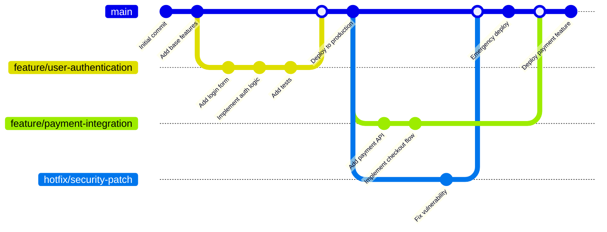
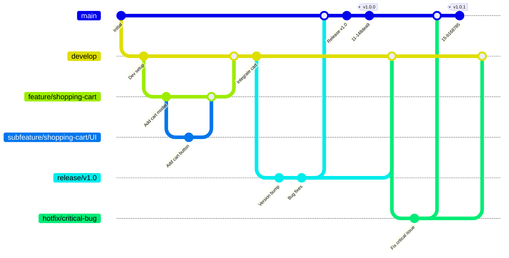
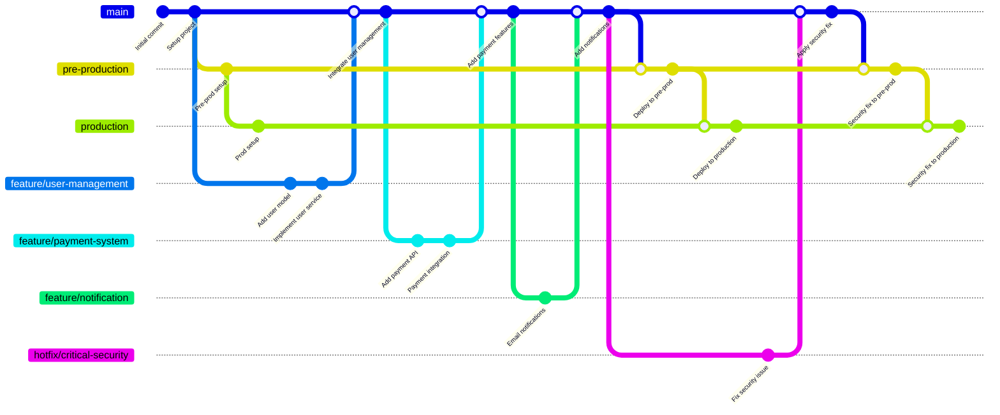
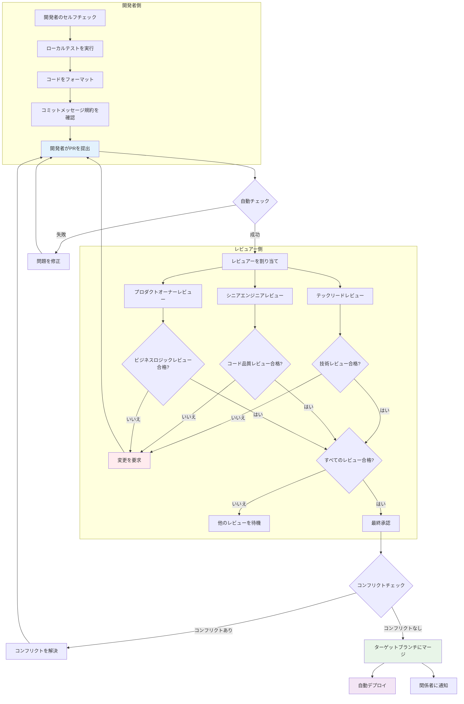
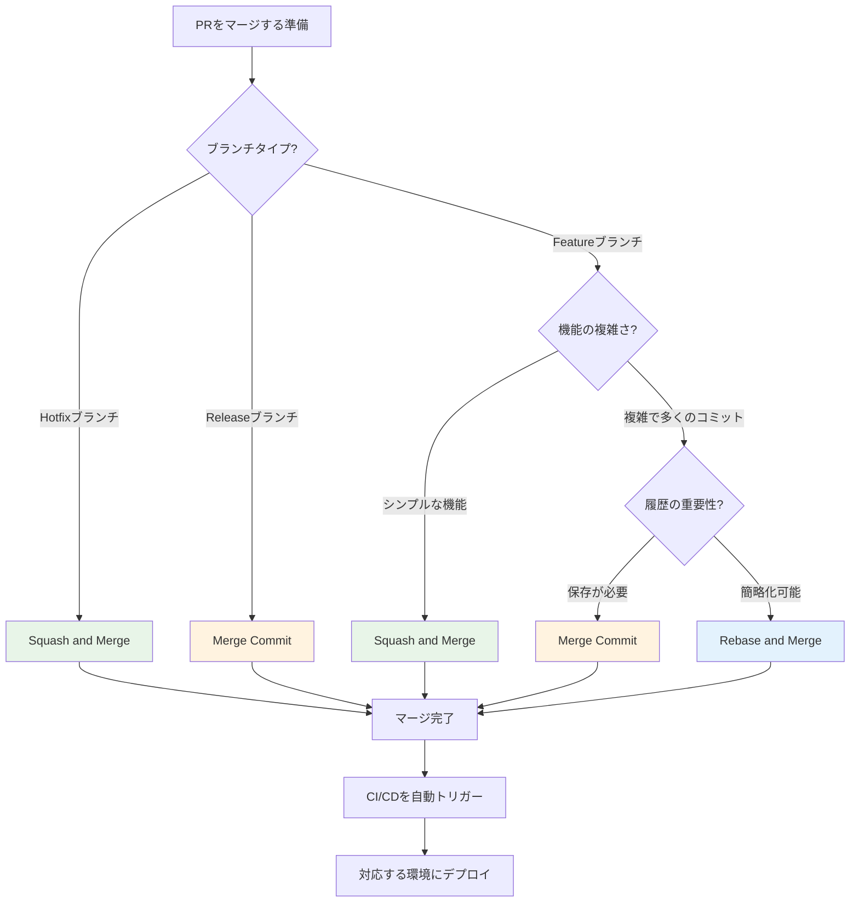

# Day 12 | バージョン管理戦略（PRレビュー戦略）× Git Flow × Lint導入：コード品質管理と開発プロセスの標準化

今日は、シンプルでリラックスした話をしましょう。これは、ある意味ソフトウェアエンジニアリングよりもソーシャルエンジニアリングである可能性が高い内容です—特に最新ブランチとの同期を怠った場合は。

私たちがコードを書いているのではなく、トップライターのグループと一緒に「ハリー・ポッター」や「ロード・オブ・ザ・リング」のような傑作を共同執筆していると想像してみてください。どうすれば、全員の章が一貫したスタイルを持ち、プロットに矛盾がなく、誤字がなく、最終出版前の校正と改訂プロセスが秩序正しいものになることを保証できるでしょうか？
より具体的な例えから始めましょう。

私たちがトップF1レーシングチームのチーフエンジニアリングチームだと想像してください。私たちのミッションは、チャンピオンシップを勝ち取る車を作ることです。空力、エンジン、サスペンション部門からの設計が、互いに干渉することなく完璧に連携することをどう保証しますか？シーズン中に革新的な設計を継続的に導入しながら、メインレースでの車の絶対的な安定性をどう保証しますか？そして、レース中の予期しない状況に、稲妻のように速いピットストップでどう対応しますか？

または、ヘルメットを脱いでファッションデザインのワークショップに入ってみましょう。私たちは今、トップファッションブランドのクリエイティブチームで、高い期待が寄せられる春のファッションショーの準備をしています。どうすれば多くのデザイナーの作品が、個々の才能を発揮するだけでなく、シーズン全体のテーマとブランドDNAに合致することを保証できますか？スケッチ、型紙作成、サンプル衣装から最終フィッティングまでの複雑なプロセスをどう管理し、すべての作品が完璧であることを保証しますか？そして、ショー開始直前のモデルのドレスの予期しない問題にどうエレガントに対処しますか？

レースカーを作ることであれ、ファッションショーの準備であれ、核となる課題は同じです：**高圧で複雑な環境において、チームが体系的に協力し、継続的に高品質な作業を提供し、リスクを効果的に管理する方法。**

言い換えれば、Gitは厳密に言えば単なる記録ツールです。Gitワークフローは文化的に形成されたプロセス管理です。実際、**バージョン管理戦略**のもう一つの顔は**管理方法論**なのです！

これもまた、AIが私たちに代わって決定し実行できない部分です。おそらくAIエージェントはデータの世界で分析を実行し、提案を提供し、さらには微調整された基礎ロジックに基づいて自己成長することができます—有名なフォン・ノイマンマシンのように。しかし、**概念的な意思決定**と実行ポリシーは、私たちによってのみ評価され確認されることができます。これは、現実における客観的な通常の物理法則と数学的理論検証の二重の制約に関連しています（神に感謝、まだ忘れていません）。しかし否定できないことは、**管理**は庭師のようなものだということです。私たちは、集中しているレースカー、衣服、コード、製品が複雑な状況に基づいてトレードオフを必要とすることを発見したとき、**核となる抽象的な要件（ドメイン）**に基づいて将来の方向性を再調整しなければなりません。

それでは、まず管理におけるいくつかの**駆動理由**を理解しましょう。継続的な議論の中で、`GitHub Flow`、`Git Flow`、`GitLab Flow`の管理ポリシースタイルを見ていきます—これは正常なことです。以前述べたように：

```python
Git workflow == 文化的に形成されたプロセス管理 == 管理科学
```

ソフトウェア開発チームの規模が拡大し、プロジェクトの複雑さが増すにつれて、適切なバージョン管理戦略の選択は、開発効率とコード品質に影響を与える重要な要因となっています。現代のソフトウェア開発において、**バージョン管理は単にコード履歴を記録するツールではなく、チームコラボレーション、品質保証、リスク管理のための中核的な基盤プロセスです。**

## 管理駆動原則

ほぼすべての主流の管理方法論の背後には、1つまたは複数のコア「駆動要因」があり、それが方法論が最も重視することと優先的に解決する問題を決定します。主なものは、**プロセス**、**効率**、**品質**、そして後続の拡張である**価値**と**スケジュール**です。

いくつかの短い物語を使って背景を理解しましょう。

### 安定性（プロセスの絶対的正義）、数量（迅速な市場投入）、品質（完璧な納品）の三位一体の方法論

ほとんどのプロセス管理方法論は、産業革命と第二次世界大戦後の産業構造転換後に生まれました。当時、すでに自社の生産ラインを持っていたすべての事業主は、競争と一般環境の変化に直面していました。したがって、より明確で迅速な対応方法が必要でした。こうして、**プロセスと管理駆動**、**効率とフロー駆動**、**品質とデータ駆動**の方法論が生まれました。

#### プロセスの絶対的正義

**プロセスと管理駆動**の中核哲学は、**成功は予測可能性と再現可能性から来る**ということです。堅牢で明確なプロセスを確立し、それを厳格に遵守する限り、リスクを管理し、プロジェクトを軌道に乗せることができます。`「計画に従っているか？」`、`「責任は明確か？」`、`「リスクは管理されているか？」`が、この論理的文脈で最も重要な質問です。この管理プロセスは、要件が明確で変更が少なく、コンプライアンスとドキュメントへの要求が高いプロジェクト（建設、政府プロジェクトなど）に適しています。**`ウォーターフォールモデル`**は、プロセス駆動アプローチの典型的な代表であり、最も純粋な線形プロセスで、次に進む前に1つの段階を完璧に完了することを強調します。さらに、「管理」を極端に強調する**`PRINCE2®`**があり、段階的管理と例外による管理を通じて、プロジェクトのすべてのステップが高レベルの管理下にあり、常にビジネス目標に貢献することを保証します。そして、プロセス駆動の方法の頂点 - **`PMBOK®`**は、プロジェクトの開始から終了まで何をすべきか、何を考慮すべきかを定義する最も包括的なプロセス「マップ」を提供します。

#### 迅速な市場投入

**効率とフロー駆動**の中核哲学は、**出力速度（スループット）を最大化し、入力から出力までの時間を最小化する**ことです。プロジェクトの価値は、スムーズな**「フロー」**にあります。停滞、待機、やり直しは無駄です。中核となる質問は、`「ボトルネックはどこか？」`、`「何が私たちを遅くしているか？」`、`「どうやって無駄を排除できるか？」`です。この方法論は、迅速な納品を必要とし、高度に反復的で、運用効率を追求する環境（製造、カスタマーサービス、ソフトウェアメンテナンスなど）に特に焦点を当てています。代表的な方法論には、**`リーン`** - その唯一の目標は、プロセス内のすべての「無駄」を特定して排除し、価値が顧客にスムーズに流れるようにすることです。**`制約理論（TOC）`** - システム全体の効率が最も遅い「ボトルネック」に依存し、すべての最適化はそこに集中しなければならないことを指摘します。そして**`カンバン`** - 作業を可視化し、進行中の作業（WIP）を制限することで、作業がスムーズに流れ、ブロックを回避することを強制します。

#### 完璧な品質納品

この段階の最後の部分は**品質とデータ駆動**です。その中核哲学は、**直感と経験は信頼できない。客観的なデータと厳格な統計分析のみが品質の根本的な改善をもたらすことができる**ということです。この駆動原則は、精度と信頼性に対する極端な要件がある分野（航空、医療機器、半導体製造など）に主に適用されます。**変動は品質の敵**であり、実行中のタスクの結果には**不一致があってはなりません**。焦点はしばしば、`「データは何を言っているか？」`、`「プロセスの変動はどのくらい大きいか？」`、`「問題の根本原因は何か？」`にあります。実際に適用される方法論は**`シックスシグマ`**です。これは品質駆動の究極の実施形態であり、DMAICなどの統計的手法を使用して、プロセスの不良率をほぼゼロにすることを目指します。

既存のパイプラインプロセスを見ると、製品のメインストリーム（main）は、その**ドメイン**の**要件**の特性に基づいて分業を差別化します。たとえば、**プロセス駆動**は、その主な要件である**順序性**から生まれました—基礎なしに家を建てることはできません。**効率駆動**は、**市場カバレッジ**を獲得するためのものです。製品が市場から除外されると、絞首台に送られたようなものです。絞首刑のロープでゆっくりと絞め殺され、窒息を待つよりも、オールインして製品を最初に顧客に届け、市場のフィードバックに基づいて調整する方が良いです。**品質駆動**は、**エラー率**に焦点を当てています。最も明白な現実世界の例は、手術室のプロセスです。プロセスのどの部分でも問題が発生すれば、命が失われる可能性があります。したがって、品質駆動のアプローチでは、単一のエラーも許されません。

本質的に、第一段階の管理プロセス方法論は、`安定性（プロセスの絶対的正義）` <=> `数量（迅速な市場投入）` <=> `品質（完璧な納品）`の三位一体の問題を表しています。しかし対応して、複雑な要件に直面したときに何をすべきでしょうか？1つの方法論の要件の実装が極端に進むと、他の2つの側面は必然的に放棄されます。量を盲目的に追求すると、基本的な品質がニーズを満たさないため、製品は後続の市場競争で初期の優位性をすべて失う可能性があります。同時に、仕様の絶対的な完璧さを盲目的に追求すると、すべての作業が設計図で停滞し、実行スケジュールを逃す可能性があります。これにより、管理方法論の第二段階が生まれました。**`価値駆動`**と**`スケジュール駆動`**は、それぞれ`品質（完璧な納品）` x `数量（迅速な市場投入）`と`安定性（プロセスの絶対的正義）` x `数量（迅速な市場投入）`に対応しています。`品質（完璧な納品）` x `安定性（プロセスの絶対的正義）`に関しては、理論的にはゆっくりとしかできません（例：深海探査、宇宙植民地化）ので、考慮されません—動力と材料の問題を解決して検証せずに、物理的に宇宙や深海に入ることはできませんよね...？

### 高度な需要駆動型ニーズ：「すべてを望む」

第一段階の終わりに述べたように、1つの方法論の要件の実装が極端に進むと、他の2つの側面は必然的に放棄されます。これが、`品質（完璧な納品）` x `数量（迅速な市場投入）`に焦点を当てた**`価値駆動`**と、`安定性（プロセスの絶対的正義）` x `数量（迅速な市場投入）`に焦点を当てた**`スケジュール駆動`**が生まれた理由です。結局のところ、`Time is money, my friend`という言葉があります。株式市場のブームの開始点を逃すことは、将来のすべての利益率に複利効果をもたらし、市場指数とのギャップを縮小します。

#### 完璧な品質と迅速な納品の両方を要求

**価値と適応性駆動**は、この問題を解決するために作られました。**`唯一不変なのは変化そのものである。`** 完璧な長期計画を作成しようとするのではなく、変化を受け入れ、迅速で短いサイクルの納品を通じて継続的にフィードバックを得て、常に顧客にとって**「最も価値のあること」**を行っていることを確認する方が良いです。新興市場を受け入れる際、私たち自身の想像に基づいて生産を増やすだけではいけません。誰も欲しがらない製品は基本的に損失です。市場のニーズを満たさなければ、なぜ市場はニーズを満たさないソリューションにお金を払うべきでしょうか？`「正しいことをしているか？」`、`「顧客は本当にこれを必要としているか？」`、`「どのくらい早く市場のフィードバックを得られるか？」`これらの質問は、特に要件が不確実で迅速な試行錯誤が必要な分野（革新的な製品開発、ソフトウェアエンジニアリング、マーケティングなど）において、断続的に確認する必要があります。以前述べたように（<ゼロから納品可能なシステム設計を構築する>を参照）、**`システムの有機性と目的`**が鍵です。システムは概念的な生命体です。生存の脅威（市場による淘汰）に直面して、常に市場のフィードバックを確認し、そのフィードバックに基づいて**進化**しなければなりません。したがって、短いサイクルの「スプリント」を通じてチームが定期的に使用可能な製品を納品し、顧客のフィードバックに基づいて次のスプリントの目標を調整することを保証する**`スクラム`**と、「計画に従うこと」よりも「変化への対応」を重視する**`アジャイル`**は、絶えず変化し激しい環境で適応し進化するための生存方法です。

#### 迅速な納品と正しいプロセスの両方を要求

**スケジュールと依存性駆動**の中核哲学は、**プロジェクトの成功は主に期限内に納品できるかどうかにかかっている**ということです。これを達成するには、すべてのタスク間の依存関係を明確にマッピングし、プロジェクトの総期間を決定する「クリティカルパス」を見つける必要があります。`「どのタスクを最初に完了する必要があるか？」`、`「どのタスクの遅延がプロジェクト全体に影響するか？」`、`「クリティカルパスは何か？」`依存関係が多数で複雑な大規模プロジェクトでは、コンテキストを迅速に明確にし、すべてのタスクの優先順位関係に基づいてパイプラインを直ちに分割し、無駄な待機時間を減らすために可能な限り並行ワークフローを分割する必要があります。大規模なイベント計画やエンジニアリング建設では、会場の設営とエンジニアリング材料の準備を同時に行うことができます。H型鋼が到着するのを待ってから適切な量のリベットを準備する必要はありません。ここで適用される方法論は、**`クリティカルパス法（CPM）`**と**`プログラム評価レビュー技法（PERT）`**です。これら2つは、スケジュールと依存関係の問題を解決するために純粋に生まれたツールであり、スケジュール管理の中核です。

## まとめ

1.  **プロセスと管理駆動**
    *   **中核哲学:** 成功は予測可能性と再現可能性から生まれます。堅牢で明確なプロセスを確立し、厳格に遵守することで、リスクを管理し、プロジェクトを軌道に乗せることができます。
    *   **中核となる質問:** 「計画に従っているか？」「責任は明確か？」「リスクは管理されているか？」
    *   **代表的な方法論:**
        *   **PMBOK®:** プロジェクトの開始から終了まで何をすべきか、何を考慮すべきかを定義する最も包括的なプロセス「マップ」を提供します。プロセス駆動の典型です。
        *   **PRINCE2®:** 「管理」を非常に強調します。段階的管理と例外による管理を通じて、すべてのステップが高レベルの管理下にあり、ビジネス目標に貢献することを保証します。
        *   **ウォーターフォールモデル:** 最も純粋な線形プロセスで、次に進む前に1つの段階を完璧に完了することを強調します。
    *   **適用シナリオ:** 要件が明確で安定しており、コンプライアンスとドキュメントへの要求が高いプロジェクト（建設、政府プロジェクトなど）。

2.  **効率とフロー駆動**
    *   **中核哲学:** プロジェクトの価値は、スムーズな「フロー」にあります。停滞、待機、やり直しは無駄です。目標は、スループットを最大化し、リードタイムを最小化することです。
    *   **中核となる質問:** 「ボトルネックはどこか？」「何が私たちを遅くしているか？」「どうやって無駄を排除できるか？」
    *   **代表的な方法論:**
        *   **リーン:** その唯一の目的は、プロセス内のすべての「無駄」を特定して排除し、価値が顧客にスムーズに流れるようにすることです。
        *   **制約理論（TOC）:** システム全体の効率が最も遅い「ボトルネック」によって決定されることを指摘し、すべての最適化はそこに集中すべきです。
        *   **カンバン:** 可視化と進行中の作業（WIP）の制限を通じて、作業がスムーズに流れ、ブロックを防ぎます。
    *   **適用シナリオ:** 高度に反復的で運用効率を追求する環境（製造、カスタマーサービス、ソフトウェアメンテナンスなど）。

3.  **品質とデータ駆動**
    *   **中核哲学:** 直感と経験は信頼できません。客観的なデータと厳格な統計分析のみが品質の根本的な改善をもたらすことができます。変動は品質の敵です。
    *   **中核となる質問:** 「データは何を言っているか？」「プロセスの変動はどのくらい大きいか？」「問題の根本原因は何か？」
    *   **代表的な方法論:**
        *   **シックスシグマ:** 品質駆動の究極の表現。DMAICなどの統計的手法を使用して、不良率をほぼゼロに削減します。
    *   **適用シナリオ:** 精度と信頼性に対する極端な要件がある分野（航空、医療機器、半導体製造など）。

4.  **価値と適応性駆動**
    *   **中核哲学:** 唯一不変なのは変化です。完璧な長期計画を作成するのではなく、変化を受け入れ、迅速で短いサイクルの納品を通じて継続的にフィードバックを得て、常に顧客にとって「最も価値のあること」を行っていることを確認します。
    *   **中核となる質問:** 「正しいことをしているか？」「顧客は本当にこれを必要としているか？」「どのくらい早く市場のフィードバックを得られるか？」
    *   **代表的な方法論:**
        *   **アジャイル:** これがそのマニフェストです。「計画に従うこと」よりも「変化への対応」を重視します。
        *   **スクラム:** 短いサイクルの「スプリント」を通じてチームが定期的に使用可能な製品を納品し、顧客のフィードバックに基づいて次のスプリントの目標を調整することを保証します。
    *   **適用シナリオ:** 要件が不確実で迅速な試行錯誤が必要な分野（革新的な製品開発、ソフトウェアエンジニアリング、マーケティングなど）。

5.  **スケジュールと依存性駆動**
    *   **中核哲学:** プロジェクトの成功は主に期限内の納品にかかっています。これを達成するには、すべてのタスクの依存関係を明確にマッピングし、総期間を決定する「クリティカルパス」を見つける必要があります。
    *   **中核となる質問:** 「どのタスクを最初に完了する必要があるか？」「どのタスクの遅延がプロジェクト全体に影響するか？」「クリティカルパスは何か？」
    *   **代表的な方法論:**
        *   **クリティカルパス法（CPM）**と**プログラム評価レビュー技法（PERT）:** これらは、スケジュールと依存関係の問題を解決するために純粋に作成されたツールであり、スケジュール管理の中核です。
    *   **適用シナリオ:** 依存関係が多数で複雑なプロジェクト（大規模なイベント計画やエンジニアリング建設など）。

### 主流Gitワークフロー分析

プロセス管理の`3+2`駆動理由について議論した後、今日の市場で一般的な**Gitワークフロー**を見てみましょう。

`GitHub Flow`はアジャイルの精神と非常によく合致しています。featureブランチがmainにマージされるたびに、直接デプロイされます。これは迅速な納品と継続的インテグレーションの現れです。ドキュメントで言及されている「コードレビュー文化の確立」と「コミットメッセージの標準化」は、すべてアジャイル開発における効率的なコミュニケーションを促進するためのものです。

#### 1. GitHub Flow - シンプルで効率的な継続的デプロイメントモデル

`GitHub Flow`は非常にアジャイルの精神に沿っています。featureブランチが`main`にマージされるたびに、直接デプロイされます。これは迅速な納品と継続的インテグレーションを体現しており、継続的デプロイメントと迅速な反復を実践するチームに特に適しています。



**GitHub Flowの中核的特徴:**

-   1つの長期的ブランチのみ（`main`/`master`）
-   すべての新機能は`main`から新しいfeatureブランチに分岐
-   コードレビューはPull Requestsを介して実施
-   マージされたコードは即座に本番環境にデプロイ

#### 2. Git Flow - 厳格なリリース管理モデル

`Git Flow`は、バージョンとサイクルへの要件があるため、固定されたリリーススケジュールを持つ大規模プロジェクトに適しています。そのブランチのマージルールには、クリティカルパス法を彷彿とさせる明確な優先順位特性があります：

-   `subfeature`は最初に`feature`にマージする必要があります：壁を建てる前に窓と屋根を設置することはできませんが、「配管と電気の敷設」と「窓の設置」は同時に行われる可能性があります。実際、冗長な時間の無駄を減らすために、大きな機能は最初から可能な限り大きな機能クラスターに分解する必要があります。
-   `feature`は最初に`develop`にマージする必要があります：これは、「設計図」が完成してから「工場」に引き渡して生産できるようなものです。テストされていない機能ドラフトを直接オンラインでリリースすることはできません。
-   `develop`は、テスト後、`release`ブランチを作成できます：これは、工場の「サンプル」が品質管理を通過してから「量産準備」段階に入るようなものです。
-   `release`ブランチは、安定したら`main`にマージできます：これは、「量産準備」が完了した後、製品が正式に「販売開始」できるようなものです。



**Git Flowのブランチタイプ:**

-   **main**: 本番環境コード
-   **develop**: 開発環境統合ブランチ
-   **feature/**: 機能開発ブランチ
-   **subfeature/**: 機能（ドメイン）配下のサブ機能（サブドメイン）開発ブランチ
-   **release/**: リリース準備ブランチ
-   **hotfix/**: 緊急修正ブランチ

#### 3. GitLab Flow - 環境駆動型デプロイメント戦略

GitLab FlowはGitHub FlowのシンプルさとGit Flowの環境管理を組み合わせています：



## レビュープロセス設計

さまざまな管理駆動原則を理解した後、これらの理論が実際のコードレビュープロセスにどのように反映されるかを見てみましょう。**PR（Pull Request）/ MR（Merge Request）レビュープロセスは、本質的に多目的最適化管理意思決定システムです**。

各PRが、会社の公式製品ライン（メインブランチへのマージ）に組み込まれる前に厳格な「レビュープロセス」を経る必要がある「製品提案」のようなものだと想像してください。このレビュープロセスは、**価値創造**と**スケジュール管理**の間で最適なバランスを見つける必要があります。

**完全なコードレビュープロセス**



まず、開発者側では、機能仕様の開発を完了した後、工場の自動品質検査ラインのように、最初に議論された**境界**と**シナリオ**に従ってローカルでテストを実施し、基本仕様が満たされていることを確認し、最初から要件を満たさないことを避ける必要があります。

Lintにより、最初の機会に「低レベルのミス」を発見して修正することができます。すべての開発者のコードをほぼ同一のスタイルに「フォーマット」し、コードの可読性を大幅に向上させます。これは、すべてのライターに同じフォントとレイアウトを使用するよう要求するようなもので、後続の校正（PRレビュー）が「プロット」自体に集中でき、誤字を拾うのに時間を無駄にしないようにします。したがって、フローチャートでは、`P2[ローカルテストを実行]`は以下の基準を完了する必要があります：

1.  ローカルUnitTest
2.  ローカルIntegrationTest
3.  ESLint
4.  SonarLint

修正と調整の後、チームスタイルガイドの統合のために`P3[コードをフォーマット]`に引き渡され、改行やスペースなどの不要なgit diff記録を避けます。

個人チェックを完了した後にのみ、レビュー段階に入り、3つの検証ゲートを通過する必要があります：**ピアレビューゲート**、**ビジネスレビューゲート**、**品質レビューゲート**。

開発プロセス中に、たとえば、`service`（ビジネスロジックアプリケーション層）と`repository`（外部システムインターフェース層）の間で混乱や誤用があるかもしれません。これは機能に影響を与えないかもしれませんが、コードが成長するにつれて、ロジックがきれいに分離されていなければ、将来のレガシーコードの混乱の一部になります。したがって、最初から、アーキテクチャとスタイルを確認するために、別の開発チームパートナーに**ピアレビューゲート**を引き渡す必要があります。

**ビジネスレビューゲート**と**品質レビューゲート**は大きく異なるものではなく、人員が不足している場合（できれば避けたいですが）には統合されることさえあります。具体的には、**ビジネスレビュー**は**単一環境での完璧なビジネス実行率**を確認し、**品質レビューゲート**は**複数環境での最大カバレッジでのビジネス実行成功率**を検証します。このレビューゲートにとって最も重要なことは、**ビジネス機能が完全に実行できる**ことを確認することです。コードがエレガントで簡潔であっても、最終的に最初の要件を満たすことができなければ、市場に見捨てられるという緩慢な死に陥ります。したがって、**ビジネスレビューゲート**にとって最も重要なことは、ビジネスロジックが事前システム設計（これが最良のシナリオ）、または絶えず調整されるビジネス要件（これが最悪のシナリオ - そして最も一般的なもの）と一致していることを確認することです。

ここに参考のための簡単なガイドがあります - 私が言ったように、`（gitバージョン管理）は、ある意味ソフトウェアエンジニアリングよりもソーシャルエンジニアリングである可能性が高い`です。それを扱う際には、Love & Peaceの態度を維持するようにしてください。これは私たち自身の血圧にとって良いことです。

**コードレビューガイド**

```markdown
### レビュアーの責任

1.  **適時性**: 24時間以内にレビューを完了します。
2.  **建設性**: 問題を指摘するだけでなく、具体的な改善提案を提供します。
3.  **教育性**: 知識とベストプラクティスを共有します。
4.  **敬意**: プロフェッショナルでフレンドリーなコミュニケーション態度を維持します。

### レビューの焦点

-   ビジネスロジックの正確性
-   コードの可読性と保守性
-   パフォーマンスへの影響評価
-   セキュリティの考慮事項
-   テストカバレッジ

### 一般的なレビューコメントテンプレート

改善の提案:

-   この変数は再割り当てされないため、`let`の代わりに`const`の使用を検討してください。
-   この関数は少し複雑です。より小さな関数に分割することを検討してください。

質問:

-   ここのエラー処理ロジックは、すべてのエッジケースを考慮していますか？
-   XYZアプローチではなく、この実装が選ばれた理由は何ですか？

称賛:

-   テストカバレッジは非常に包括的で、特にエッジケースの処理が優れています。
-   コード構造が明確で、変数の命名が非常に意味があります。
```

```markdown
### コミットメッセージ規約

CommitMessageFormat:
Pattern: "{type}: {description}"

Types:
feat: "新機能"
fix: "バグ修正"
docs: "ドキュメント更新"
style: "コードスタイル調整"
refactor: "コードリファクタリング"
test: "テスト関連"
chore: "ビルドツールまたは補助ツールへの変更"
perf: "パフォーマンス最適化"

Examples:

- "feat: add user authentication"
- "fix: resolve timeout issue in payment service"
docs: "update installation instructions"
- "refactor: simplify date formatting functions"
```

3者レビューが完了した後にのみ、ブランチをマージできます。受け入れられない不一致がある場合は、再調整のために開発者に返却する必要があります。このプロセス全体は、システム思考の本質を体現しています：**ローカル最適化はグローバル最適化に貢献する必要があります**。各レビューリンクの設計は、リンク自体の「完璧さ」のためではなく、ソフトウェア納品システム全体の安定性、効率性、高品質のためです。精密なスイスの時計のように、各歯車（レビューリンク）には特定の役割とリズムがあり、それらの協調動作が最終的に時計全体（ソフトウェアシステム）の正確な計時（安定した納品）を保証します。



今日は、バージョン管理戦略の管理本質について議論し、Gitワークフローを管理方法論の具体的な実践として見ました。明日は、実践におけるクロスチームコラボレーションについて話しましょう。
