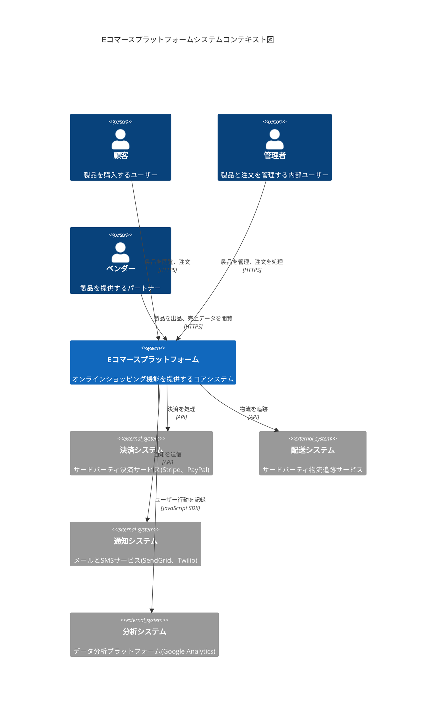

# Day 13 | チーム横断コラボレーションデザイン:技術ドキュメント、OpenAPI、共有契約:APIドキュメンテーションとチームコラボレーションの標準化

まず、様々な要件と技術に関する長い議論(いわゆるミックスダブルス)を経て、ついに実装フェーズに到達したことを祝いましょう。

```python
プロダクトアイデアと機会探索 => 要件定義と優先順位付け => プロダクトデザインとユーザー体験 => 技術計画とシステムデザイン => (現在) ソフトウェア開発と継続的インテグレーション => ...
```

今日の内容は、異なるチーム間の協力基盤と仲介ドキュメントにより焦点を当てます。これは非常に重要なトピックです。皆さんは「伝言ゲーム」という遊びをプレイしたことがあるかもしれません。簡単に言えば、メッセージが起点から各人を通って最後まで伝達され、最後の人が元のメッセージを推測するゲームです。子供や学生の頃は、友達が恥をかくのを見る楽しいゲームです。

しかし、これが実際のワークフローで起こったらどうでしょうか?良いチーム横断コラボレーションデザインがない場合に遭遇する困難な状況を見てみましょう。監督、シーンをお願いします:

### シナリオ1: 要件伝達の歪曲効果

*   **プロダクトマネージャー**: 「ユーザー管理機能が必要です。」
*   **フロントエンドエンジニアの理解**: シンプルなCRUD操作インターフェース。
*   **バックエンドエンジニアの理解**: 完全なユーザー権限管理システム。
*   **結果**: フロントエンドはシンプルなフォームを作成し、バックエンドは複雑な権限アーキテクチャを構築しました。全く一致しません。

### シナリオ2: サイロ化されたUI/UXデザイン

デザイナーは美しい単一ページのワイヤーフレームを描きますが:

*   APIデータ構造の制限を考慮していません。
*   異なる状態(ローディング、エラー、空データ)のデザインが欠けています。
*   モバイルデバイスの技術的制限を無視しています。
*   **結果**: 開発途中で、デザインが実装できないことが判明し、大幅な修正が必要になります。

### シナリオ3: 技術選択の無秩序

*   **フロントエンドチーム**: 最新のReact 18を選択。
*   **バックエンドチーム**: PHP 5.6の使用に固執。
*   **DevOpsチーム**: Dockerデプロイのみに精通。
*   **結果**: 技術スタックが互換性がなく、統合時に多くの問題が発生します。

### シナリオ4: API開発の鶏と卵の問題

```
フロントエンド: 「バックエンドAPIの準備ができていないので、開発を始められません。」
バックエンド: 「フロントエンドの要件が不明確なので、どのデータを提供すべきかわかりません。」
QA: 「APIドキュメントがないので、テストケースを書けません。」
プロダクト: 「なぜ開発がこんなに遅いのですか?」
```

### シナリオ5: リリース調整の悪夢

*   フロントエンドは新機能を完了しました。
*   バックエンドはまだバグ修正中です。
*   データベース移行にはダウンタイムが必要です。
*   **結果**: リリース日が延期され、顧客は不満を持ち、チームは残業します。

### シナリオ6: 知識サイロ効果

```
シナリオ: シニアエンジニアAが辞職。
問題:
- コアシステムにドキュメントがありません。
- APIデザインの背後にあるロジックを知っていたのは彼だけでした。
- 新人はコードを全く理解できません。
結果: 開発速度が急落し、バグが頻繁に発生します。
```

これらのシナリオに見覚えがありますか? もし一部の方にPTSDが引き起こされたなら、PTSDエピソードと同じ悲しい気持ちで謝罪します。これらの様々な超自然的で、スリリングで、さらにはブラックユーモアなシーンは、流通するストーリーに多かれ少なかれ現れています。誰もがこれらのストーリーの登場人物にならないことを願っています。だからこそ、標準化された協力デザインプロセスを確立する必要があります。

## ビジネスロジックのスケッチング

### 虎を描くには骨格から始まる - 骨格の確立

前の記事で、`システムは抽象的なビジネスロジックの実装である`と述べました。今、アイデア、シナリオ確認、境界、技術ソリューションを経て、それを紙に書き留めて描写することができます。

開発チームを含む最初の公式キックオフミーティングを開催する前に、通常はもっと早い「`プロダクトアイデアと機会探索`」フェーズがあります。このフェーズでは、通常4つのコア役割が活性化されます:**ビジネススポンサー**、**プロダクトマネージャー**、**ユーザーエクスペリエンスデザイナー**、および**テクニカルリード**。彼らの仕事は、曖昧なアイデアを実行可能なプロジェクトプロトタイプに形成することです。主な目標は、**ビジネス目標との整合**、**問題範囲の定義**、**ユーザーニーズの検証**、および**技術的実現可能性の評価**です。これらのアウトプットが予備的な形式を持つときにのみ、最初のキックオフミーティングを効果的に開催して、より広い開発チームに明確で合意された実行可能なプロジェクト方向を提示できます。

探索フェーズでは、各役割には理由があって開始されます。**ビジネススポンサー**は、ビジネス目標または解決すべき問題点を持つソースです。**プロダクトマネージャー**は、曖昧なビジネス目標を具体的なプロダクトビジョンと戦略に変換する責任があります。彼らはビジネスニーズとプロダクトソリューション間の橋渡し役であり、プロジェクトの「なぜ」と「何を」を定義します。次に、**デザイナー**は、誰も使わないものを構築するのではなく、チームが最初からユーザー中心であることを保証します。最後に、プロダクトビジョンが技術的現実から乖離しないことを保証するため、**テクニカルリード**は技術的観点から実現可能性を評価し、潜在的な技術リスクと制限を特定し、現実的に実装するにはコストがかかりすぎる美しいデザインを避けます。

> **ビジネススポンサー**
>
> *   **役割の意味**: 要件のソースであり、ビジネス目標または解決すべき問題点を持っています。彼らがいなければ、プロジェクトは存在しません。
> *   **期待されるアウトプットドキュメント**:
>     *   **ビジネス目標**: 「何を達成したいか」を明確に定義します。例:「顧客満足度を10%向上させる」または「注文処理時間を50%削減する」
>     *   **問題声明**: 現在の問題点と課題を明確に説明します。

> **プロダクトマネージャー**
>
> *   **役割の意味**: 曖昧なビジネス目標を具体的なプロダクトビジョンと戦略に変換し、ビジネスニーズとプロダクトソリューション間の橋を構築し、プロジェクトの「なぜ」と「何を」を定義する責任があります。
> *   **期待されるアウトプット**:
>     *   **プロダクトビジョンドキュメント**: プロダクトのターゲットユーザー、解決する問題、およびそのユニークさを説明します。
>     *   **初期ユーザーストーリー/エピック**: プロダクトスコープを概説するために使用される高レベルの機能説明。
>     *   **市場/競合分析**: (オプション) プロダクトポジショニングの基礎を提供するために現在の市場状況を理解します。

> **ユーザーエクスペリエンスデザイナー**
>
> *   **役割の意味**: チームが最初からユーザー中心であることを保証し、ユーザーの真のニーズと行動を探索し、チームが誰も使いたがらないものを構築していないことを保証する責任があります;「誰のために構築しているか?」に焦点を当てます。
> *   **期待されるアウトプット**:
>     *   **ユーザージャーニーマップ**: ユーザーが目標を達成するために経るプロセス、感情、問題点を視覚的に表現します。
>     *   **低忠実度ワイヤーフレーム**: レイアウトとフローの概念を迅速に伝えるために使用されるシンプルなスケッチまたはブロック図で、視覚的詳細ではありません。

> **システムアナリスト a.k.a. テクニカルリード**
>
> *   **役割の意味**: 技術的観点から実現可能性を評価し、潜在的な技術リスクと制限を特定する責任があります。最も早い段階で関与することは、プロダクトビジョンが技術的現実から乖離しないことを保証するためであり、「構築できるか?」という質問に答えます。
> *   **期待されるアウトプット**:
>     *   **実現可能性調査**: アイデアが実現可能かどうか、どのような技術が必要か、潜在的な統合課題を分析します。
>     *   **システムコンテキスト図**: システム、ユーザー、およびそれが相互作用する必要がある外部システムを示す高レベル図。
>     *   **技術リストリスト**: プロジェクトに影響を与える可能性のある技術的な未知または障害物をリストします。

私たちが作成しようとしているシステムの予備的な共有コア理解を持った後、次のステップは蜂蜜と乳香を持ってくることではなく、**シナリオに分岐する**ことを開始することです。

コアビジネスロジックが最初に実現された後、既存の情報に基づいてビジネスドメインの協力的な探索を実施できます。これを行う方法は多数あります。例えば、ミーティングやワークショップなどで、目標はチーム内でビジネスプロセスの共通言語と理解を確立することです。このようにして、**`"正しいものを構築している"`**ことをよりよく保証してから、**`"正しく構築する"`**に進むことができ、極端に異なる状況に陥ることを避けることができます。

しかし、この協力的な議論プロセス中に、チームメンバーが複雑なビジネスプロセスについて共有理解を欠き、コミュニケーションと実装エラーの不良につながることが一般的です。おそらくパイオニアチームはすでに予備的なパラダイム概念を持っていますが、前述の「伝言ゲーム」の例と同じように、初期概念は議論中に徐々にぼやけ、焦点を失い、最終的には開発とビジネス目標の間の断絶につながります。チームは機能を開発するのに忙しいですが、これらの機能が本当に会社がビジネス目標を達成するのに役立つかどうかはわからないため、「機能工場」になります。これは、システムのビジネスロジックが非常に複雑で、複数の部門や役割が関与する場合、誰もの理解が片面的である可能性があるためです - 境界を定義するための予備的なドキュメントがあっても。

したがって、次に、目標を設定する際に、山岳ガイドとしての経験から目標設定戦略を使用して、成功した頂上への道を議論し、マッピングするために使用できる方法について議論します。

次に、私たちは世界最高峰 - エベレストに向けて征服の角笛を鳴らします。

### 神々の頂上への進軍 - 目標達成のための方法論

**困難1. 知識サイロと曖昧なプロセス**

エベレスト登頂前に、最も重要なことは、すべてのガイド、シェルパ、登山者がルートについて共通の理解を持っていることを保証することです。ガイドが南斜面からのルートを頭に入れているが、シェルパが物資が北斜面から輸送されると考えている場合、災害は遠くありません。私たちは、私たちが取るパスについて明確でなければなりません。どのように始めるべきですか? どの国に到達する必要がありますか? 私の補給ステーションは何ですか? チームの最大の恐怖は、誰もが「ルート」の理解が部分的であることです。ここでの核心的な質問は:**`「頂上ルートで実際に何が起こっているのか?(ビジネスプロセスで実際に何が起こっているのか?)」`**です。**`イベントストーミング`**は、この問題を解決する最良の方法です。すべてのコアメンバーを部屋に閉じ込め、巨大なエベレストの地図を広げ、「カトマンズに到着」から「頂上に成功して戻る」までのすべての重要な「イベント」に付箋を使ってマークするように全員に依頼するようなものです。各小さな目標には、独自のユニークなビジネスロジックが含まれている可能性があります - そして、これは実際には**ドメイン**の実装です! 例えば:`装備チェック完了`、`ベースキャンプ到着`、`クンブー氷瀑通過`、`キャンプIV設立`。このプロセスは、共有頂上ブループリントを迅速に確立し、誰もの知識ギャップと間違った仮定を露呈できます。

**困難2. コンテキストを失うTo-Doリスト**

ルートが明確であっても、続く装備リストは混乱する可能性があります。「アイゼン、酸素ボンベ、ロープ、高山ブーツ、エナジーバー」というフラットなリストしか得られない場合、どれがベースキャンプ高度順応用で、どれが最後の頂上プッシュ用かを知るのは難しいです。ここでの核心的な質問は:**`「何を最初に準備すべきですか?登山者はこの遠征を最初から最後までどのように完成させますか?(ユーザーは目標を達成するために私たちのプロダクトをどのように使用しますか?)」`**です。これに答えることができない場合、チームは「高度順応」の第一段階の**最小実行可能プロダクト(MVP)**を定義するのが困難になります。このために、**`ユーザーストーリーマッピング`**は優れた視点を提供します。それは**装備(機能)**のフラットなリストを取り、**「ユーザーアクティビティの時系列順序」**(例: `ネパール到着` -> `ベースキャンプトレッキング` -> `高度順応` -> `頂上プッシュと下降`)に沿ってレイアウトし、コンテキストを持つマップに変換します。これにより、チームは遠征計画全体を俯瞰し、「フェーズ1:ベースキャンプ高度順応」に必要なコア装備とタスクを水平に簡単にスライスでき、各**装備(機能)**が一貫性のある価値のある機能を提供することを保証します。

**困難3. 開発とビジネス目標の断絶**

しかし、計画時に、チームは罠に陥ることがあります:私たちは装備の購入と身体トレーニングが得意なので、装備を購入し続け、トレーニングし続け、効率的な「遠征準備工場」になります。私たちは技術的に熟練した登山者になり、最強の体格を構築するのに忙しいですが、この登山の最終的な目標が**「商業スポンサー露出」**のためか**「科学研究」**のためかを誰も確認しません。チームの成功が「どれだけのトップティア装備を購入したか」だけで測定され、「遠征の商業価値が達成されたか」では測定されない場合、致命的な問題が発生します:**`「このすべての準備は本当に私たちのスポンサーが目標を達成するのに役立ちますか?(なぜ私たちはこれをしているのですか?)」`**。**`インパクトマッピング`**は、この問題を解決するために生まれました。それはチームに最後から(なぜ - ビジネス目標、例: `ブランド露出を30%増加`)始めて、目標を達成するために影響を受ける必要がある人(誰 - `メディア記者`)、彼らの行動をどのように変えたいか(どのように - `成功した頂上についてのプレスリリースを公開`)、そして最後に何をすべきか(何 - `頂上でブランドフラグの写真を撮る`)を遡って推論することを強制します。これにより、すべての準備が最終的なビジネス価値に密接にリンクされることが保証されます。

**困難4. 本当の動機を明らかにできない**

ルートを計画する際、大まかで文化的な共通理解を持つために、参加者の**ペルソナ**を定義することがよくあります。例えば、「マイク、極端なスポーツを愛する30歳の起業家」。しかし、これは、ガイドがクライアントの職業と年齢だけに基づいてルートを計画し、なぜ登りたいのかを尋ねないようなものです。マイクが「好むべき」挑戦的なルートを計画するかもしれませんが、彼の本当の欲求(ソーシャルメディアで有名になる、自己実現、または単に誰かの注意を引く?)に対処していません。問題の核心は:**`「なぜ顧客は登山に連れて行くために私たちを『雇う』のですか?彼が達成したい内部タスクは何ですか?(ユーザーは私たちのプロダクトに何の『仕事』をさせたいのですか?)」`**です。従来の方法は、「登山者が誰であるか」に焦点を当てますが、「彼らが完成したいタスクは何か」を無視します。**`Jobs to be Done (JTBD)`**理論は新しい視点を提供します。それは、顧客が「人生のボトルネックに遭遇した」という「コンテキスト」で、エベレスト登山を「雇って」「自分自身を証明し、ブレークスルーを求める」という「仕事」を「完了させる」ことを探索させます。これを理解すると、私たちが提供するものは単なるルートではなく、彼が反省し成長するのに役立つ経験の全セットかもしれません。これにより、顧客の最も深い動機を明らかにし、彼らの心に真に触れる遠征計画を設計できます。

今、私たちはチームと成功を達成する方法を知っており、テラの最高点で宇宙の色に触れます。

これらの方法論と結果として生じるシナリオ境界設定を通じて、全体の**登山ルート(システムコンテキスト)**についての理解が明確になります。知っていることを知ることは重要ですが、それを達成するための前提条件は、**知らないこと**を知ることでもあります。

1.  **イベントストーミング**
    *   **エントリポイント**: 「ビジネスプロセスで実際に何が起こっているのか?」
    *   **推進理由**: システムのビジネスロジックが非常に複雑で、複数の部門や役割が関与する場合、誰もの理解が部分的である可能性があります。開発者はビジネスを理解せず、ビジネス担当者はシステムの制限を理解しません。
    *   **ソリューション**: 協力的なワークショップを通じて、すべての関係者(ビジネス、PM、開発者、QA)を集めて、ビジネスプロセスで発生したすべての「ドメインイベント」(例:注文作成、支払い実行)を付箋を使用して時系列順に配置します。これにより、誰もがプロセス全体の共有ブループリントを構築することを強制し、それによって知識ギャップと誤解を発見します。

2.  **ユーザーストーリーマッピング**
    *   **エントリポイント**: 「ユーザーは目標を達成するために私たちのプロダクトをどのように使用しますか?」
    *   **推進理由**: 従来のプロダクトバックログは長いショッピングリストのようなもので、コンテキストが欠けています。チームは個々の機能に迷い込み、これらの機能が完全なユーザーエクスペリエンスを形成するためにどのように接続されているかを忘れがちです。
    *   **ソリューション**: それは「ユーザーアクティビティの時系列順序」に従ってユーザーストーリーを2次元的に配置し、マップを形成します。このマップの「バックボーン」はユーザーのジャーニーであり、チームがプロダクトを最初から最後まで俯瞰し、各リリースに含めるべき機能を簡単にスライスして、各リリースが一貫性のある価値のあるエクスペリエンスを提供することを保証するのに役立ちます。

3.  **インパクトマッピング**
    *   **エントリポイント**: 「なぜ私たちはこれをしているのですか?どのような変化をもたらしますか?」
    *   **推進理由**: 多くのプロジェクトは、開始時に「何を」するかを定義するだけで、「なぜ」への明確なリンクがありません。これにより、開発チームが機能を提供しても、ビジネスメトリクス(収益、保持など)は改善されません。
    *   **ソリューション**: これは、チームに最終的な「ビジネス目標(なぜ)」から始めて逆算することを強制する戦略的計画ツールです:この目標を達成するために、どの「アクター」に影響を与える必要がありますか?どのような「インパクト」(行動の変化)を見たいですか?そして最後に、この変化を促進するためにどの「成果物」(機能)を構築すべきですか?それは、すべての開発努力がビジネス価値に直接リンクされることを保証します。

4.  **Jobs to be Done (JTBD)**
    *   **エントリポイント**: 「ユーザーは私たちのプロダクトにどのような『仕事』をさせたいのですか?」
    *   **推進理由**: 従来のペルソナは「ユーザーが誰であるか」(例:35歳、大都市在住、技術好き)を説明しますが、この特定の瞬間に「なぜ」彼らがソリューションを必要とするのかを説明しません。これにより、チームがユーザーのプロファイルに適合するプロダクトを構築しても、根本的な問題を解決できない可能性があります。
    *   **ソリューション**: JTBDフレームワークは、ユーザー自身からユーザーがいる「コンテキスト」と彼らが行いたい「進歩」に焦点を移します。それは、ユーザーが「仕事」を「完了させる」ためにプロダクトを「雇う」と仮定します。この仕事の背後にある闘争と動機を理解することで、チームはよりターゲットを絞った、さらには革新的なソリューションを設計できます。

初期の探索と方法論による洗礼の後、私たちのコアチームはついにこの遠征について明確で深い合意に達しました。私たちは頂上のための**ルートマップ(ビジネスプロセス)**を描いただけでなく、各段階の**旅程(ユーザーストーリーマップ)**を計画し、この登山の**商業目的(インパクトマップ)**を確立し、登山者の最も深い**欲望(Jobs to be Done)**への洞察も得ました。

この時点で、私たちは「なぜ行くのか?」と「一般的にどこに行くのか?」という戦略的質問に成功に答えました。したがって、大規模開発フェーズ、つまり「正しく構築する」に入る前に、この高レベルの合意を、すべての技術チームが理解し遵守できる具体的で実行可能な技術ドキュメントに変換する必要があります。このブループリントが、次に議論する「共有契約」です。

## バージョン管理可能なドキュメントでビジネスロジックを視覚的に具体化

ビジネスロジックの初期スケッチの後、システムとその境界について一般的なアイデアを持っています。異なる背景を持つチームメンバーが効率的に協力できるようにするには、基礎として物理的で非抽象的なドキュメントが必要です。オーケストラが演奏するために楽譜が必要であるように、ソフトウェア開発チームは調和のとれた協力を保証するために明確な技術仕様が必要です。建築家、電気技師、配管工、インテリアデザイナーなどの複数の専門チームの協力を必要とする大きなショッピングモールを建設していると想像してください。統一されたブループリントとコミュニケーション標準がない場合、各チームが独自の理解に従って作業すると、結果は災害になります。

ソフトウェア開発でも同じです:

*   **フロントエンドチーム**は、バックエンドからデータをリクエストする方法を知る必要があります。
*   **バックエンドチーム**は、特定の形式でデータを明確に提供する必要があります。
*   **QAチーム**は、システムがどのように機能するかを理解する必要があります。
*   **プロダクトチーム**は、機能が要件を満たしているかどうかを確認する必要があります。

次に、実際のビジネスシナリオをドキュメントに視覚化して、開発プロセス中にロードマップに対して継続的にチェックし、軌道から外れていないことを保証できます。一般的な参照順序は次のとおりです:

```python
共有契約 => OpenAPI => 技術ドキュメント
```

以下では、アプリケーションシナリオと例を順番に説明します。

### 1. 共有契約

簡単に言えば、共有契約は建築ブループリントの「IPLC回路仕様」または「国際PVC-Uパイプサイズ標準」のようなものです。それは最も基本的な仕様基盤を提供し、異なる部分を担当する作業員(開発チーム)が独立して作業でき、すべての部分が最終的に完全に組み立てられることを保証し、統合中の誤解と混乱を避けます。合意の一般的な側面には:**データ形式合意**、**通信プロトコル合意**、および**エラーハンドリング合意**が含まれます。

例えば:

*   **JSON Schema**または**GraphQL Schema**を使用して、`respond`オブジェクトが`isSuccess`、`element`、`errorMessage`などのフィールドとそのデータ型を含む必要があることを明確に指定します。
*   一般的なHTTP/RESTful APIまたはよりパフォーマンスの高いgRPCを使用します。
*   任意のAPIがエラーに遭遇した場合、固定エラーコードとメッセージ形式を返し、呼び出し元が一貫して処理できるようにします。

この共有理解ドキュメントは、チーム全体の共通言語であり、プロダクト開発に関与するほぼすべての技術および製品チームが異なる方法でそれを使用します。

**フロントエンドチーム** / **モバイルアプリチーム**は、契約を使用してモックデータを生成でき、バックエンドAPIがまだ完成していない場合でも独立して開発とテストを行うことができ、統合中に「バックエンドが提供するデータ形式が期待と異なる」ことを発見することを避けます。契約は、バックエンドからどのようなデータをリクエストできるか、どのような形式でリクエストを送信する必要があるか、どのような形式のレスポンスを受け取るかを伝えます。その後、契約で定義されたデータ構造に基づいてUIインターフェースを開発できます。

**バックエンドチーム**はAPIの「プロバイダー」であり、契約は彼らが履行する必要があるコミットメントと仕様です。いかなる不一致も、フロントエンド、他のバックエンドチーム(AIまたはグラフィックスを専門とする)、QA、プロダクト、DevOpsを含むがこれに限定されないすべてのチームに影響します。したがって、それはAPI開発の明確なガイドとして機能し、提供されたデータ形式、パス、エラーコードがすべて合意に準拠していることを保証します。

**テストチーム(QA)**は、契約のリクエスト/レスポンス形式、HTTPステータスコード、エラー定義に基づいて自動テスト標準(例:スモークテスト)を作成する必要があり、APIの実際の動作が契約の説明と完全に一致しているかどうかを検証します - **契約はテストケースを作成するためのゴールドスタンダードです**。

**プロダクトチーム(PM)**は要件の「定義者」であり、契約ドキュメントは技術実装がビジネスニーズを満たしているかどうかを確認するのに役立ちます。コードを見なくても、OpenAPI(Swagger)ドキュメントのような視覚化された契約を通じてAPI機能を理解でき、APIが提供するフィールドがフロントエンドインターフェースのニーズを満たしているかどうかを確認し、機能の欠落を避けることができます。

**DevOps / SREチーム**の契約ドキュメントは、システム間の相互作用とサービス間の通信プロトコル(HTTP/gRPC)を理解するのに役立ち、正しいネットワークルールと監視を構成します。特に問題が発生した場合、契約に基づいてどのサービスの通信リンクに問題があるかを迅速に特定できます。

#### 実装例

```yaml
openapi: 3.0.3
info:
  title: 共有契約ライブラリ
  description: API契約用の共通の再利用可能なコンポーネント
  version: 1.0.0

components:
  # =================
  # 共通パラメータ
  # =================
  parameters:
    PageNumber:
      name: page
      in: query
      description: ページ番号
      required: true
      schema:
        type: integer
        minimum: 1

    PageSize:
      name: pageSize
      in: query
      description: ページあたりのアイテム数
      required: true
      schema:
        type: integer
        minimum: 1
        maximum: 100

    SortColumn:
      name: sortColumn
      in: query
      description: ソート列
      required: false
      schema:
        type: string
        default: id

    SortOrder:
      name: orderType
      in: query
      description: ソート順
      required: false
      schema:
        type: integer
        format: int32
        enum:
          - 0 # 昇順
          - 1 # 降順
        default: 0

    StartDate:
      name: startDate
      in: query
      description: 開始日フィルター
      required: false
      schema:
        type: string
        format: date

    EndDate:
      name: endDate
      in: query
      description: 終了日フィルター
      required: false
      schema:
        type: string
        format: date

    EntityId:
      name: id
      in: path
      description: エンティティID
      required: true
      schema:
        type: string

  # =================
  # 共通レスポンス
  # =================
  responses:
    Success:
      description: 操作成功
      content:
        application/json:
          schema:
            $ref: "#/components/schemas/BaseResponse"

    Created:
      description: リソース作成成功
      content:
        application/json:
          schema:
            allOf:
              - $ref: "#/components/schemas/BaseResponse"
              - type: object
                properties:
                  id:
                    type: integer
                    description: 新しく作成されたリソースのID

    NotFound:
      description: リソースが見つかりません
      content:
        application/json:
          schema:
            $ref: "#/components/schemas/ErrorResponse"

    BadRequest:
      description: 無効な入力
      content:
        application/json:
          schema:
            $ref: "#/components/schemas/ErrorResponse"

    ValidationError:
      description: バリデーション失敗
      content:
        application/json:
          schema:
            $ref: "#/components/schemas/ValidationErrorResponse"

  # =================
  # 共通スキーマ
  # =================
  schemas:
    # 基本レスポンス構造
    BaseResponse:
      type: object
      required:
        - isSuccess
        - message
      properties:
        isSuccess:
          type: boolean
          description: 操作が成功したかどうかを示します
        message:
          type: string
          description: レスポンスメッセージ
        errors:
          type: object
          nullable: true
          default: null
          description: エラーの詳細(ある場合)

    # エラーレスポンス
    ErrorResponse:
      allOf:
        - $ref: "#/components/schemas/BaseResponse"
        - type: object
          properties:
            isSuccess:
              enum: [false]

    # バリデーションエラーレスポンス
    ValidationErrorResponse:
      allOf:
        - $ref: "#/components/schemas/BaseResponse"
        - type: object
          properties:
            isSuccess:
              enum: [false]
            errors:
              type: object
              additionalProperties:
                type: array
                items:
                  type: string

    # 共通ステータス列挙型
    EntityStatus:
      type: integer
      format: int32
      enum:
        - 0 # ドラフト/テンプレート
        - 1 # レビュー待ち
        - 2 # 承認済み/アクティブ
        - 3 # 却下
        - 4 # 処理中/実行中
        - 5 # 完了/実行済み
        - 6 # 無効/非アクティブ
      description: |
        標準エンティティステータスコード:
        - 0: ドラフト/テンプレート
        - 1: レビュー待ち
        - 2: 承認済み/アクティブ
        - 3: 却下
        - 4: 処理中/実行中
        - 5: 完了/実行済み
        - 6: 無効/非アクティブ

    # 日付範囲フィルター
    DateRangeFilter:
      type: object
      properties:
        startDate:
          type: string
          format: date
          description: フィルター開始日
        endDate:
          type: string
          format: date
          description: フィルター終了日

    # 基本エンティティプロパティ
    BaseEntity:
      type: object
      required:
        - id
      properties:
        id:
          type: integer
          description: 一意の識別子
        status:
          $ref: "#/components/schemas/EntityStatus"

  # =================
  # 共通例
  # =================
  examples:
    SuccessResponse:
      summary: 成功操作
      value:
        isSuccess: true
        message: "操作が正常に完了しました"
        errors: null

    ErrorResponse:
      summary: エラーレスポンス
      value:
        isSuccess: false
        message: "操作が失敗しました"
        errors:
          general: ["エラーが発生しました"]

    PaginatedResponse:
      summary: ページネーションリストレスポンス
      value:
        isSuccess: true
        message: "データが正常に取得されました"
        errors: null
        result:
          page: 1
          totalCount: 100
          datas: []

    SelectOptions:
      summary: 選択オプションリスト
      value:
        isSuccess: true
        message: "オプションが正常に取得されました"
        errors: null
        element:
          - id: "0"
            text: "アクティブ"
            disabled: false
          - id: "1"
            text: "非アクティブ"
            disabled: false
```

```markdown
# 共有契約例: プラットフォームAPI v1

**ドキュメントの目的**: この契約は、Eコマースプラットフォーム API v1のコアエンドポイント(`Product`)の共通仕様と相互作用方法を定義し、フロントエンド、バックエンド、テスト、プロダクトチーム間の協力の共通基盤として機能します。

---

### 1. 通信プロトコル合意

- **プロトコル**: すべてのAPIは`HTTPS`経由で提供されます。
- **ベースURL**: `https://api.your-ecommerce.com/v1`
- **認証**: すべての認可されたリクエストには、値`Bearer <YOUR_API_TOKEN>`を持つ`Authorization`ヘッダーを含める必要があります。
- **リクエストとレスポンス形式**: すべてのリクエストとレスポンスの`body`は`application/json`形式を使用します。

---

### 2. 標準レスポンス形式とエラーハンドリング合意

すべてのクライアント(フロントエンド、APP)がAPIレスポンスを統一された方法で処理できるようにするため、標準レスポンスラッパーを定義します。

#### 2.1. 標準レスポンススキーマ

すべてのAPIレスポンスはこの構造に従う必要があります。TypeScript Interfaceを使用して明確に定義できます:

```typescript
/**
 * 標準APIレスポンスの共有契約
 */
interface ApiResponse<T> {
  /**
   * リクエストが成功したかどうか
   */
  success: boolean;

  /**
   * 成功時のレスポンスデータ(ジェネリックT)
   * リクエストが失敗した場合、このフィールドはnullです
   */
  data: T | null;

  /**
   * 失敗時のエラーオブジェクト
   * リクエストが成功した場合、このフィールドはnullです
   */
  error: ApiError | null;
}

/**
 * 標準エラーオブジェクト構造
 */
interface ApiError {
  /**
   * フロントエンドロジック用の内部定義エラーコード
   */
  code: number;

  /**
   * 人間が読めるエラーメッセージ
   */
  message: string;
}
```

#### 2.2. 共通エラーコード

| HTTPステータスコード | 内部コード(`code`) | 説明 |
| :--- | :--- | :--- |
| `400` | `40001` | 無効なパラメータ |
| `401` | `40101` | 認証されていません |
| `403` | `40301` | 禁止されています |
| `404` | `40401` | リソースが見つかりません |
| `500` | `50000` | 内部サーバーエラー |

---

### 3. 特定のエンドポイント契約: 製品情報の取得

では、上記の一般的な合意を特定のエンドポイントに適用しましょう。

**エンドポイント**: `GET /products/{productId}`

**説明**: 提供された`productId`に基づいて単一の製品の詳細情報を取得します。

#### 3.1. リクエスト

- **パスパラメータ**:
  - `productId` (string, 形式: uuid): 製品の一意の識別子。

#### 3.2. レスポンス

- **データスキーマ合意**: まず、`Product`オブジェクトの契約を定義します。

```typescript
// Productオブジェクトの共有契約
interface Product {
  id: string; // UUID
  name: string;
  description: string;
  price: number;
  currency: 'TWD' | 'USD';
  stock: number;
  imageUrl: string;
  createdAt: string; // ISO 8601形式の日付文字列
}
```

- **成功レスポンス (200 OK)**:
  製品が正常に見つかった場合、HTTPステータスコードは`200`で、レスポンス`body`は`ApiResponse<Product>`構造に従います。

```json
// レスポンスボディ (200 OK)
{
  "success": true,
  "data": {
    "id": "a1b2c3d4-e5f6-7890-1234-567890abcdef",
    "name": "高性能ワイヤレスメカニカルキーボード",
    "description": "RGBライティング効果で究極のタイピング体験を提供します。",
    "price": 3200,
    "currency": "TWD",
    "stock": 150,
    "imageUrl": "https://cdn.your-ecommerce.com/images/keyboard.jpg",
    "createdAt": "2025-09-18T10:00:00Z"
  },
  "error": null
}
```

- **失敗レスポンス (404 Not Found)**:
  `productId`に対応する製品が存在しない場合、HTTPステータスコードは`404`で、レスポンス`body`は`ApiResponse<null>`構造に従います。

```json
// レスポンスボディ (404 Not Found)
{
  "success": false,
  "data": null,
  "error": {
    "code": 40401,
    "message": "製品が見つかりません"
  }
}
```

- **失敗レスポンス (400 Bad Request)**:
  `productId`形式が正しくない(有効なUUIDではない)場合、HTTPステータスコードは`400`です。

```json
// レスポンスボディ (400 Bad Request)
{
  "success": false,
  "data": null,
  "error": {
    "code": 40001,
    "message": "リクエストパラメータの検証に失敗しました: productIdは有効なUUID形式である必要があります"
  }
}
```

---

### この契約の使用方法

- **バックエンドチーム**: これを仕様として使用して`GET /products/{productId}`エンドポイントを実装し、返されるJSON構造が契約に完全に準拠していることを保証します。
- **フロントエンドチーム**: バックエンドがまだ開発中の間、この契約に基づいて`Product`のTypeScript型を作成し、Mock Serverを使用して成功と失敗のレスポンスをシミュレートして製品詳細ページを開発できます。
- **QAチーム**: 200、404、400などのシナリオでのレスポンスが契約と一致していることを検証する自動テストケースを作成します。
```

### 2. OpenAPI

**抽象的な概念**: APIの「標準化された契約」

```
OpenAPI (Swagger) = APIの身分証明書 + ユーザーマニュアル + 自動化ツール
- 入力形式を定義 → 提供する必要があるデータ
- 出力形式を定義 → 受け取るレスポンス
- エラーハンドリングを定義 → エラー発生時の処理
- ドキュメントの自動生成 → チームコラボレーションのためのビジュアルインターフェース
- コード生成 → 反復作業の削減
```

OpenAPI(旧Swagger)は、現代のAPI開発における最も重要な標準の1つです。それは単なるドキュメントではなく、API全体のライフサイクルのためのコアツールです。共有契約が建物の「材料仕様」であるとすれば、OpenAPIは完全な「建築ブループリント」であり、各部屋のレイアウト、ドアと窓の位置、電気配線、その他すべての詳細を詳述しています。

#### 2.1 なぜOpenAPIが必要なのか?

OpenAPI以前、API開発はしばしば以下のジレンマに直面していました:

**シナリオ再訪: API開発の混沌時代**

```
バックエンドエンジニア: 「APIを完成させました!」
フロントエンドエンジニア: 「どうやって呼び出しますか? パラメータは何ですか?」
バックエンドエンジニア: 「コードを見てください...」
フロントエンドエンジニア: 「バックエンドコードは読めません!」
QAエンジニア: 「どうやってテストしますか? ドキュメントはありますか?」
プロダクトマネージャー: 「このAPIは実際に何をしますか?」
```

このシナリオに見覚えがありますか? OpenAPIの出現は、これらのコミュニケーションとコラボレーションの問題を解決するためでした。

#### 2.2 OpenAPIの5つのコア価値

**1. Documentation as Code**

従来のAPIドキュメントは、開発者がコードを更新した後にドキュメントを更新するのを忘れることが多いため、簡単に時代遅れになります。OpenAPIはドキュメントとコードを密接に結合するため、APIが変更されると、ドキュメントも自動的に更新されます。

```yaml
# これは単なるドキュメントではなく、実行可能な仕様です
paths:
  /users/{userId}:
    get:
      summary: ユーザー情報の取得
      parameters:
        - name: userId
          in: path
          required: true
          schema:
            type: string
            format: uuid
      responses:
        "200":
          description: ユーザー情報の取得に成功しました
          content:
            application/json:
              schema:
                $ref: "#/components/schemas/User"
```

**2. Contract-First開発**

OpenAPIは「契約ファースト」の開発モデルをサポートし、フロントエンドとバックエンドチームがまずAPI契約を定義してから、それに基づいて独立して開発できるようにします。

```
従来の開発フロー:
バックエンド完了 → フロントエンド開始 → 問題発見 → 行ったり来たりの修正

契約ファーストフロー:
契約を定義 → フロントエンドとバックエンドが並行開発 → 統合テスト → 迅速な提供
```

**3. 自動化ツールエコシステム**

OpenAPIには、多くの反復タスクを自動化できる豊富なツールエコシステムがあります:

- **コード生成**: フロントエンドSDK、バックエンドスタブコードを自動生成
- **テストツール**: APIテストケースを自動生成
- **ドキュメントWebサイト**: 美しいインタラクティブなドキュメントを自動生成
- **Mockサービス**: Mock Serverを迅速に作成

#### 2.3 OpenAPIドキュメント構造の詳細分析

完全なOpenAPIドキュメントには、以下のコア要素が含まれます:

**Infoオブジェクトブロック**

```yaml
openapi: 3.0.3
info:
  title: EコマースプラットフォームAPI
  description: |
    製品管理、注文処理、ユーザー管理、その他のコア機能を含む完全なEコマース機能を提供します。

    ## 認証
    Bearer Token認証を使用します。AuthorizationヘッダーにAPIトークンを含めてください。

    ## レート制限
    各APIトークンは1分あたり最大1000リクエストを送信できます。

  version: 2.1.0
  contact:
    name: APIサポートチーム
    email: api-support@yourcompany.com
    url: https://docs.yourcompany.com
  license:
    name: MIT
    url: https://opensource.org/licenses/MIT
```

**Servers**

```yaml
servers:
  - url: https://api.yourcompany.com/v2
    description: 本番環境
  - url: https://staging-api.yourcompany.com/v2
    description: ステージング環境
  - url: http://localhost:3000/v2
    description: ローカル開発環境
```

**Paths & Operations**

```yaml
paths:
  /products:
    get:
      tags:
        - 製品管理
      summary: 製品リストの取得
      description: |
        ページネーション、フィルタリング、ソートをサポートする製品のリストを取得します。

        ### 使用例
        - 製品の最初のページを取得: `GET /products?page=1&limit=20`
        - 特定の製品を検索: `GET /products?search=iPhone`
        - 価格範囲でフィルタ: `GET /products?minPrice=1000&maxPrice=5000`
      parameters:
        - $ref: "#/components/parameters/PageParam"
        - $ref: "#/components/parameters/LimitParam"
        - name: search
          in: query
          description: 製品名または説明でキーワード検索
          schema:
            type: string
            example: "iPhone 14"
        - name: category
          in: query
          description: 製品カテゴリでフィルタ
          schema:
            type: string
            enum: [electronics, clothing, books, home]
        - name: minPrice
          in: query
          description: 最小価格
          schema:
            type: number
            minimum: 0
        - name: maxPrice
          in: query
          description: 最大価格
          schema:
            type: number
            minimum: 0
      responses:
        "200":
          description: 製品リストの取得に成功しました
          content:
            application/json:
              schema:
                type: object
                properties:
                  success:
                    type: boolean
                    example: true
                  data:
                    type: object
                    properties:
                      products:
                        type: array
                        items:
                          $ref: "#/components/schemas/Product"
                      pagination:
                        $ref: "#/components/schemas/Pagination"
                  error:
                    type: object
                    nullable: true
                    example: null
              examples:
                SuccessExample:
                  summary: 通常のレスポンス例
                  value:
                    success: true
                    data:
                      products:
                        - id: "prod-001"
                          name: "iPhone 14 Pro"
                          price: 32900
                          category: "electronics"
                      pagination:
                        page: 1
                        limit: 20
                        total: 156
                        totalPages: 8
                    error: null
        "400":
          $ref: "#/components/responses/BadRequest"
        "500":
          $ref: "#/components/responses/InternalServerError"
```

**Components/Schemas** - 再利用可能なデータ構造

```yaml
components:
  # =================
  # 共通パラメータ
  # =================
  parameters:
    PageParam:
      name: page
      in: query
      description: ページ番号
      required: false
      schema:
        type: integer
        minimum: 1
        default: 1

    LimitParam:
      name: limit
      in: query
      description: ページあたりのアイテム数
      required: false
      schema:
        type: integer
        minimum: 1
        maximum: 100
        default: 20

  responses:
    BadRequest:
      description: 不正なリクエストパラメータ
      content:
        application/json:
          schema:
            $ref: "#/components/schemas/ErrorResponse"
          examples:
            ParameterValidationFailed:
              summary: パラメータ形式が不正
              value:
                success: false
                data: null
                error:
                  code: 400001
                  message: "パラメータの検証に失敗しました"
                  details:
                    - field: "price"
                      message: "priceは正の数である必要があります"

    InternalServerError:
      description: 内部サーバーエラー
      content:
        application/json:
          schema:
            $ref: "#/components/schemas/ErrorResponse"
          examples:
            ServerError:
              summary: 内部システムエラー
              value:
                success: false
                data: null
                error:
                  code: 500001
                  message: "システムが一時的にリクエストを処理できません。しばらくしてからもう一度お試しください"
```

**3. Callbacks & Webhooks**

```yaml
paths:
  /orders:
    post:
      summary: 注文の作成
      callbacks:
        orderStatusChanged:
          "{$request.body#/webhookUrl}":
            post:
              summary: 注文ステータス変更通知
              requestBody:
                content:
                  application/json:
                    schema:
                      type: object
                      properties:
                        orderId:
                          type: string
                        status:
                          type: string
                          enum: [pending, paid, shipped, delivered, cancelled]
                        timestamp:
                          type: string
                          format: date-time
```

#### 2.5 チームコラボレーションにおけるOpenAPIベストプラクティス

**1. バージョニング戦略**

```yaml
# セマンティックバージョニング
info:
  version: 2.1.0 # major.minor.patch

# URLバージョニング
servers:
  - url: https://api.example.com/v2

# ヘッダーバージョニング(高度)
components:
  parameters:
    ApiVersion:
      name: Api-Version
      in: header
      schema:
        type: string
        enum: ["2.0", "2.1"]
        default: "2.1"
```

**2. 変更管理プロセス**

```yaml
# タグを使用してライフサイクルステータスをマーク
paths:
  /legacy-endpoint:
    get:
      deprecated: true
      summary: 旧エンドポイント(廃止予定)
      description: |
        ⚠️ **このエンドポイントは廃止予定です**

        新しいエンドポイントをご使用ください: `GET /v2/new-endpoint`

        **廃止予定日**: 2024-06-01
        **削除予定日**: 2024-12-01

  /experimental-feature:
    post:
      tags: [Experimental]
      summary: 実験的機能(テスト中)
      description: |
        🧪 **実験的機能**

        この機能はテストフェーズにあり、APIが変更される可能性があります。
        本番環境での使用は推奨されません。
```

#### 2.6 実際のチームコラボレーションにおけるOpenAPIワークフロー

**シナリオ: Eコマースプラットフォームに「製品レビューシステム」を追加**

実際の例を通じて、OpenAPIがチームコラボレーションをどのように促進するかを見てみましょう:

**ステップ1: 製品要件の確認**

```
プロダクトマネージャーが要件を提案:
「購入した製品にユーザーが評価とコメントを付けられる製品レビューシステムが必要です。」
```

**ステップ2: API契約デザイン(チームコラボレーション)**

```yaml
# 契約の最初のドラフト(バックエンド主導、フロントエンド参加)
paths:
  /products/{productId}/reviews:
    post:
      summary: 製品レビューの送信
      description: |
        ユーザーが購入した製品のレビューを送信します。

        **ビジネスルール**:
        - この製品を購入したユーザーのみがレビューできます
        - 各ユーザーは同じ製品に対して1回のみレビューできます
        - 評価範囲: 1-5つ星
      parameters:
        - name: productId
          in: path
          required: true
          schema:
            type: string
      requestBody:
        required: true
        content:
          application/json:
            schema:
              type: object
              required:
                - rating
                - comment
              properties:
                rating:
                  type: integer
                  minimum: 1
                  maximum: 5
                  description: 評価(1-5つ星)
                comment:
                  type: string
                  minLength: 10
                  maxLength: 500
                  description: レビュー内容
                images:
                  type: array
                  maxItems: 5
                  items:
                    type: string
                    format: uri
                  description: レビュー画像(最大5枚)
      responses:
        "201":
          description: レビューの送信に成功しました
          content:
            application/json:
              schema:
                $ref: "#/components/schemas/ReviewResponse"
        "400":
          description: 不正なパラメータ
        "403":
          description: この製品を購入していないか、すでにレビュー済みです
        "401":
          description: ログインしていません
```

**ステップ3: フロントエンドチームのフィードバックと調整**

```
フロントエンドエンジニア: 「ユーザーがこの製品をレビューできるかどうかを確認するAPIが必要です。」
プロダクトマネージャー: 「製品のすべてのレビューのリストを取得するAPIも必要です。」
QAエンジニア: 「画像アップロードの形式とサイズ制限を明確に定義する必要があります。」
```

**ステップ4: 契約の反復と最適化**

```yaml
# 契約の第2版(チームフィードバックの統合)
paths:
  # レビュー権限の確認
  /products/{productId}/reviews/check-permission:
    get:
      summary: ユーザーのレビュー権限を確認
      description: 現在のユーザーがこの製品をレビューできるかどうかを確認します
      responses:
        "200":
          content:
            application/json:
              schema:
                type: object
                properties:
                  canReview:
                    type: boolean
                  reason:
                    type: string
                    enum: [not_purchased, already_reviewed, pending_delivery]

  # レビューリストの取得
  /products/{productId}/reviews:
    get:
      summary: 製品レビューリストの取得
      parameters:
        - $ref: "#/components/parameters/PageParam"
        - $ref: "#/components/parameters/LimitParam"
        - name: rating
          in: query
          description: 評価でフィルタ
          schema:
            type: integer
            minimum: 1
            maximum: 5
        - name: sort
          in: query
          description: ソート順
          schema:
            type: string
            enum: [latest, oldest, highest_rating, lowest_rating]
            default: latest
      responses:
        "200":
          description: レビューリストの取得に成功しました
          content:
            application/json:
              schema:
                type: object
                properties:
                  success:
                    type: boolean
                  data:
                    type: object
                    properties:
                      reviews:
                        type: array
                        items:
                          $ref: "#/components/schemas/Review"
                      pagination:
                        $ref: "#/components/schemas/Pagination"
                      statistics:
                        $ref: "#/components/schemas/ReviewStatistics"

components:
  schemas:
    Review:
      type: object
      properties:
        id:
          type: string
        userId:
          type: string
        userName:
          type: string
        userAvatar:
          type: string
          format: uri
        rating:
          type: integer
          minimum: 1
          maximum: 5
        comment:
          type: string
        images:
          type: array
          items:
            type: string
            format: uri
        createdAt:
          type: string
          format: date-time
        isVerifiedPurchase:
          type: boolean
          description: 確認済みの購入かどうか

    ReviewStatistics:
      type: object
      properties:
        totalCount:
          type: integer
          description: 総レビュー数
        averageRating:
          type: number
          format: float
          description: 平均評価
        ratingDistribution:
          type: object
          description: 評価分布
          properties:
            "1":
              type: integer
            "2":
              type: integer
            "3":
              type: integer
            "4":
              type: integer
            "5":
              type: integer
```

**ステップ5: 並行開発**

```
フロントエンドチーム:
- OpenAPIドキュメントに基づいてTypeScriptインターフェースを生成
- Mock Serverを使用してバックエンド実装を待たずにレビュー機能を開発

バックエンドチーム:
- 契約仕様に従ってAPIを実装
- ビジネスロジック(権限チェック、データ検証)を処理

QAチーム:
- OpenAPIドキュメントに基づいて自動テストケースを作成
- 契約遵守テストを実行
```

**ステップ6: 統合と検証**

```
フロントエンドとバックエンド統合時:
1. OpenAPIで定義された標準に準拠しているため、統合がスムーズ
2. QA自動テストが契約遵守を検証
3. 問題が発見された場合、OpenAPIドキュメントを参照して迅速にデバッグ
```

これはOpenAPIの真の力です:**それは単なるドキュメントツールではなく、チームコラボレーションのプラットフォームです**。明確な契約を定義することで、チームメンバーはこの契約を中心に独立して作業でき、統合中の驚きやコミュニケーションコストを大幅に削減できます。

### 3. 技術ドキュメント

**抽象的な概念**: システムの「ユーザーマニュアル」と「設計ブループリント」

```
技術ドキュメント = システム知識の外部化された表現
- アーキテクチャ設計ドキュメント → 建物の構造図
- APIドキュメント → 各コンポーネントのインターフェース説明
- デプロイメントドキュメント → 組み立てガイド
- 開発ガイド → 建設マニュアル
- トラブルシューティング → 修理マニュアル
```

技術ドキュメントは、ソフトウェア開発の「知識インフラストラクチャ」です。それは暗黙知を形式知に変換し、チームの知的資産が人材の離職によって失われないことを保証します。ドキュメントなしでプロジェクトを引き継いだ場合を想像してください。それは、マニュアルなしで複雑な機械を受け取るようなものです。それがどのように機能するかを理解するために、多くの時間をかけてリバースエンジニアリングする必要があるでしょう。

#### 3.1 なぜ技術ドキュメントがこれほど重要なのか?

**シナリオ再訪: 技術ドキュメントがないジレンマ**

```
シーン1: 新入社員のオンボーディング
新人エンジニア: 「このシステムをどうやって起動させますか?」
シニアエンジニア: 「まずDockerをインストールする必要があって、それから...待って、他に何が必要だったかな...」
新人エンジニア: 「データベースの設定はどうすればいいですか?」
シニアエンジニア: 「えーと...当時はこうやったと思うんだけど、いくつかのステップを忘れたかもしれない...」

シーン2: システム障害
オンコールエンジニア: 「システムがダウンしました!このエラーは何を意味するんですか?」
(元の開発者に連絡が取れない)
プロダクトマネージャー: 「いつ修正できますか?顧客が待っています!」
オンコールエンジニア: 「まずコードを調べる必要があります...数時間かかるかもしれません...」

シーン3: 技術的負債
マネージャー: 「なぜこの機能はこのように設計されたのですか?」
エンジニア: 「えーと...わかりません、元の開発者はすでに退職しました...」
マネージャー: 「変更できますか?どのような影響がありますか?」
エンジニア: 「触るのが怖いです、他の機能に影響を与えるかもしれません...」
```

これらのシナリオに見覚えがありますか?技術ドキュメントの欠如は以下につながります:

- **知識サイロ**: コア知識が少数の人の頭の中にのみ存在する
- **重複した努力**: 毎回再探索と再学習が必要
- **リスクの蓄積**: 誰も「レガシーコード」に触れようとしない
- **低効率**: 単純な問題が複雑な調査になる

#### 3.2 技術ドキュメントの階層構造

技術ドキュメントは完全な知識システムであるべきです。異なるオーディエンスと目的に応じて階層化できます:

**レイヤー1: 戦略レベルドキュメント**

- **オーディエンス**: テクニカルリード、アーキテクト、プロダクトマネージャー
- **目的**: システムの全体的な設計哲学とビジネスコンテキストを理解する

**レイヤー2: 戦術レベルドキュメント**

- **オーディエンス**: 開発チーム、DevOpsエンジニア
- **目的**: 具体的な技術実装と運用手順を理解する

**レイヤー3: 運用レベルドキュメント**

- **オーディエンス**: すべてのチームメンバー、運用担当者
- **目的**: 日常の開発と運用における特定の問題を解決する

#### 3.3 戦略レベルドキュメント: システムの俯瞰図

**1. システムアーキテクチャ概要**

```markdown
# Eコマースプラットフォーム技術アーキテクチャドキュメント

## システム概要

### ビジネス背景

Eコマースプラットフォームは、高並行性の製品閲覧、注文、決済プロセスを処理する必要があり、同時にデータの一貫性とシステムの安定性を確保する必要があります。

### 技術目標

- **高可用性**: 99.9%のシステムアップタイム
- **高性能**: ホームページの読み込み時間 < 2秒
- **高スケーラビリティ**: 10倍のトラフィック成長をサポート
- **高セキュリティ**: PCI DSS決済セキュリティ基準に準拠

### 全体アーキテクチャ図(C4モデル)

#### レベル1: システムコンテキスト図


```

#### レベル2: コンテナ図

*(注: 完全なmermaid図は元のドキュメントと同じ構造を維持)*

#### レベル3: コンポーネント図 - プロダクトサービスの例

*(注: 完全なmermaid図は元のドキュメントと同じ構造を維持)*

#### レベル4: コード図 - プロダクトモデルの詳細設計

*(注: 完全なclassDiagram図は元のドキュメントと同じ構造を維持)*

#### アーキテクチャ決定の説明

**なぜC4モデルを採用するのか?**

1.  **階層的な視点**: 高レベルのシステムコンテキストから具体的なコード実装まで、完全なアーキテクチャの視点を提供します。
2.  **オーディエンス指向**: 異なるレベルの図は異なるオーディエンス(経営層、アーキテクト、開発者)に適しています。
3.  **標準化された表現**: 統一されたシンボルと慣例を使用し、コミュニケーション効率を向上させます。
4.  **保守性**: 構造化された表現により、ドキュメントの保守と更新が容易になります。

**各レベルの用途**:

-   **レベル1(コンテキスト)**: ビジネス担当者と経営層にシステム境界を提示するのに適しています。
-   **レベル2(コンテナ)**: アーキテクトとテクニカルリードが技術選択を理解するのに適しています。
-   **レベル3(コンポーネント)**: 開発チームがモジュール設計を理解するのに適しています。
-   **レベル4(コード)**: 開発者が具体的な実装の詳細を理解するのに適しています。

### コア設計決定

#### なぜマイクロサービスアーキテクチャを選択するのか?

**問題**: 元のモノリシックアーキテクチャは、トラフィック増加後にパフォーマンスのボトルネックを経験しました。
**ソリューション**: マイクロサービスアーキテクチャを採用し、ビジネスドメインごとにサービスを分割します。
**利点**:

-   **独立したデプロイ**: 異なるサービスを独立してリリースできます。
-   **技術の多様性**: 異なるサービスに最適な技術スタックを選択できます。
-   **障害の分離**: 単一のサービス障害がシステム全体に影響しません。

**トレードオフ**:

-   **複雑性の増加**: 分散システムの複雑性を処理する必要があります。
-   **運用コスト**: より多くの監視とデプロイメントプロセスが必要です。
-   **データの一貫性**: サービス間のトランザクション管理を処理する必要があります。

#### なぜイベント駆動アーキテクチャを選択するのか?

**問題**: サービス間の同期呼び出しがカスケード障害を引き起こしました。
**ソリューション**: イベント駆動アーキテクチャを採用し、メッセージキューを使用して非同期通信を行います。
**実装**: Apache Kafkaをイベントストリーミングプラットフォームとして使用します。

### 主要な品質属性

| 品質属性 | 目標メトリック | 実装戦略 |
| :--- | :--- | :--- |
| 可用性 | 99.9% | マルチリージョンデプロイ、ロードバランシング、自動フェイルオーバー |
| パフォーマンス | < 2秒のレスポンス時間 | CDN、Redisキャッシュ、データベース最適化 |
| スケーラビリティ | 10倍のトラフィックをサポート | 水平スケーリング、オートスケーリング |
| セキュリティ | PCI DSS準拠 | HTTPS、OAuth 2.0、データ暗号化 |

**2. アーキテクチャ決定記録(ADR)**

```markdown
# ADR-001: フロントエンドフレームワークとしてReact.jsを採用

## ステータス

承認済み(2024-01-15)

## コンテキスト

Eコマースプラットフォームのユーザーインターフェースを構築するためのフロントエンドフレームワークを選択する必要があります。主に検討されたオプションは、React.js、Vue.js、Angularでした。

## 決定

React.jsを主要なフロントエンドフレームワークとして選択します。

## 理由

### 利点

1.  **豊富なエコシステム**: 多数のサードパーティパッケージとツールがあります。
2.  **チームの習熟度**: 既存のチームメンバーはReactにより精通しています。
3.  **コミュニティサポート**: アクティブなコミュニティと豊富な学習リソース。
4.  **エンタープライズレベルのアプリケーション**: 多くの大企業で広く使用されており、その安定性が証明されています。

### トレードオフ

1.  **学習曲線**: 新参者はJSX構文に適応するのに時間が必要かもしれません。
2.  **ツールチェーンの複雑性**: webpack、babelなどのツールを設定する必要があります。
3.  **バージョン更新**: Reactの更新は比較的頻繁で、継続的なフォローアップが必要です。

## 代替案

-   **Vue.js**: より穏やかな学習曲線ですが、エコシステムは比較的小さいです。
-   **Angular**: 完全なフレームワークですが、小規模チームには複雑すぎる可能性があります。

## 影響

-   フロントエンド開発チームはReact.jsを統一して使用する必要があります。
-   React関連の開発基準とベストプラクティスを確立する必要があります。
-   CI/CDプロセスはReactプロジェクトのビルドとデプロイをサポートする必要があります。

## 関連ドキュメント

-   [React開発基準](./frontend-coding-standards.md)
-   [フロントエンドプロジェクト構造](./frontend-project-structure.md)
```

#### 3.4 戦術レベルドキュメント: 実装詳細の詳細ガイド

**1. 開発環境セットアップガイド**

```markdown
# 開発環境セットアップガイド

## 前提条件

### システム要件

-   **OS**: macOS 10.15+、Ubuntu 18.04+、Windows 10+
-   **メモリ**: 16GB以上推奨
-   **ディスクスペース**: 少なくとも20GBの空き容量

### 必要なソフトウェア

-   Node.js 18.x(nvmでバージョン管理)
-   Docker Desktop 4.x
-   Git 2.x
-   IDE: VS CodeまたはWebStorm推奨

## 環境インストール手順

### 1. Node.jsとnpmのインストール

### 2. Dockerのインストール

### 3. プロジェクトのクローンと依存関係のインストール

### 4. 環境設定

### 5. ローカルサービスの起動

### 6. インストールの検証

### 一般的な問題のトラブルシューティング

### HTTPステータスコード使用仕様
```

## インタラクティブドキュメントプラットフォーム

### 1. GitBook

**利点**: 美しく、使いやすく、コラボレーションをサポート
**設定例**:

```yaml
# .gitbook.yaml
root: ./docs
structure:
  readme: README.md
  summary: SUMMARY.md
```

### 2. Notion

**利点**: WYSIWYG、データベースをサポート、チームコラボレーションに優れている
**使用のヒント**:

-   ドキュメントテンプレートを作成
-   データベースを使用してAPIリストを管理
-   自動化されたワークフローを設定

### 3. Confluence

**利点**: エンタープライズレベルの機能、Jiraとの統合が良好
**ベストプラクティス**:

-   明確なスペース構造を作成
-   分類にラベルを使用
-   定期的なドキュメントレビュープロセスを設定

```

**3. ドキュメント保守戦略**

```markdown
# ドキュメント保守戦略

## ドキュメントライフサイクル管理

### 作成フェーズ
- [ ] ドキュメントのターゲットオーディエンスを決定
- [ ] 適切なドキュメントタイプとテンプレートを選択
- [ ] 最初のドラフトを書く
- [ ] ピアレビュー

### 保守フェーズ
- [ ] 定期的にレビューと更新(四半期ごと)
- [ ] コード変更と同期して更新
- [ ] ユーザーフィードバックを収集
- [ ] パフォーマンスメトリックを追跡

### 廃止フェーズ
- [ ] 時代遅れのドキュメントを特定
- [ ] アーカイブまたは削除
- [ ] 新しいドキュメントにリダイレクト

## 品質保証チェックリスト

### コンテンツ品質
- [ ] 情報の正確性
- [ ] 完全性チェック
- [ ] 実行可能なコード例
- [ ] リンクの有効性

### ユーザビリティ
- [ ] 明確なナビゲーション
- [ ] 検索機能が利用可能
- [ ] モバイルデバイスの互換性
- [ ] アクセシビリティデザイン

### 保守性
- [ ] バージョン管理
- [ ] 変更ログ
- [ ] 説明責任
- [ ] 更新頻度
```

---

このトピックのコアは、異なる背景を持つチームメンバーが効率的に協力できるようにする「共通言語」を確立することです。すべての共有契約、すべてのOpenAPI仕様、すべての技術ドキュメントは、チームの知恵の結晶であり、将来の協力の礎石です。次の新しいメンバーがチームに参加するとき、次の機能を開発する必要があるとき、次のシステムリファクタリングが来るとき、この協力的デザインへの投資は複利効果を持ちます。

これがチーム横断コラボレーションデザインの真の価値です:**私たちをより速くするのではなく、正しく行うことを可能にし、個人をより強くするのではなく、チームをより強くすることです。**

最終的に、私たちが構築するのは単なる技術仕様ではなく、協力文化です - 合意に基づき、基準によって橋渡しされ、ドキュメントによって運ばれる高効率の協力文化です。この文化はチームの最も価値ある資産となり、急速に変化する技術環境で継続的に価値を創造することを支援します。