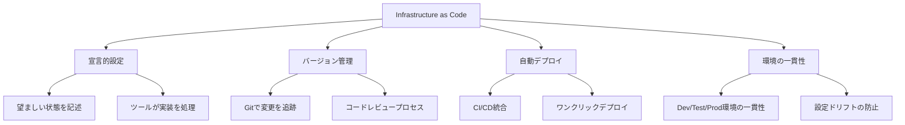
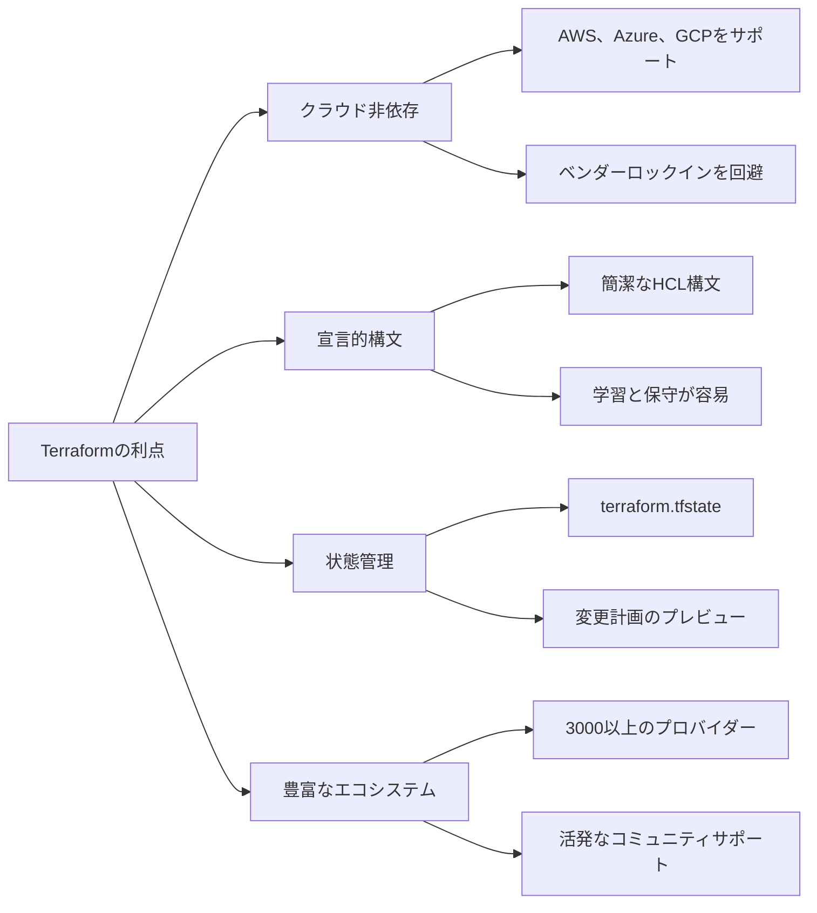

# Day 14 | Infrastructure as Code: Terraformでインフラをコード化しバージョン管理する

現代の開発ワークフローでは、バージョン管理されたドキュメントを通じて仮想環境インフラを構築・維持できるようになりました。これは感謝すべき進化です。

まず、IaC時代以前のインフラ管理の困難さを振り返ってみましょう:

**シナリオ1: 手動設定の悪夢**

```
運用エンジニアA: 「本番環境のデータベース接続プールサイズを手動で調整しました。」
運用エンジニアB: 「え?知らなかった。私も昨日ネットワーク設定を変更しました。」
開発チーム: 「なぜテスト環境と本番環境で動作が違うのですか?」

**核心的な問題**:
- 設定のドリフト
- 環境の不整合
- 変更追跡の困難
- 個人に集中した知識
```

**シナリオ2: 災害復旧の不確実性**

```
午前3時、本番環境がダウン...

チームリーダー: 「復旧まであとどれくらい?」
運用エンジニア: 「全サービスを再構築する必要があります...たぶん6時間?」
チームリーダー: 「なぜそんなに長いの?」
運用エンジニア: 「全ての手動設定手順を思い出す必要があるので...」

**核心的な問題**:
- 予測不可能な復旧時間
- 標準化された再構築プロセスの欠如
- 個人の記憶への過度な依存
- 災害復旧能力の定量化不可能
```

**シナリオ3: スケーリング要求のボトルネック**

```
プロダクトマネージャー: 「新しいリージョンに素早く拡大する必要があります。」
DevOps: 「どのくらいかかりますか?」
プロダクトマネージャー: 「できれば1週間以内に。」
DevOps: 「1週間?リソースの申請だけで3日、環境設定にさらに5日...」

**核心的な問題**:
- 手動プロセスがビジネスペースを遅らせる
- 反復作業が人材を無駄にする
- スケーリングコストの線形成長
- 市場要求への迅速な対応不可能
```

これらのITホラーストーリーは、おそらく誰もがある程度は馴染みがあるでしょう。同様に、私たちがその役者に、あるいは主人公になることは望みません。昨日は、チーム間の協働設計、APIドキュメントとチーム協働の標準を確立することについて議論しました。今日は、基盤となるインフラ管理に焦点を移し、Infrastructure as Code (IaC)の概念をTerraformで使用してインフラをコード化しバージョン管理する方法を探ります。

昨日のテーマが**「チームに同じ言語を話させ、それをバージョン管理可能にする」**だったとすれば、今日のテーマは**「インフラを予測可能、反復可能、バージョン管理可能にする」**です。

## Infrastructure as Codeの核心概念

Infrastructure as Code (IaC)は、コードを通じてインフラを管理・プロビジョニングする方法論です。従来の手動インフラ管理タスクを、バージョン管理可能で、反復可能で、実行可能なコードに変換します。

想像してみてください: `「手作業でカスタムヴィラを建てる」から「無限に複製できる都市を設計する」へ。
過去には、サーバーとネットワーク(つまり「インフラ」)を管理することは、熟練の職人が手作業でカスタムヴィラを建てることに似ていました。

- 彼は長年の経験と記憶に頼ってレンガを積み、配線を引き、パイプを接続しました。
- 窓を追加したい?現場に行って壁を壊す必要があります。
- 隣に同じものを建てたい?記憶から再び建てることしかできず、コンセントの位置やパイプのブランドなどの詳細は異なる可能性が高いです。
- もしヴィラが不幸にも火事になった場合(ノートルダム大聖堂のように)、全ての職人技が職人の頭の中にしか存在しないため、再建は長い悪夢になるでしょう。

これがIaCのない世界です: 手動、人に依存、複製が困難、そして不確実性に満ちています。IaCの誕生は、全ての基本環境パラメータと設定を記録するだけでなく、バージョン管理を通じて管理することでした。**私たちは「建築設計図」(Infrastructure as Code)を発明しました。**

私たちはもはや手作業でレンガを積みません。代わりに、極めて詳細な建築設計図を描くことに焦点を当てます。この設計図が私たちの「コード」です。

これにより、簡単に以下が可能になります:

- 最終状態を記述: 設計図は「3つのレンガを積んで、それから左を向く」とは言いません。直接「高さ3メートル、幅5メートルの壁が必要」と宣言します。私たちは**「何が欲しいか」だけを記述し、「どうやるか」は記述しません。**
- バージョン管理: この設計図(コード)はWordドキュメントのように保存・修正できます。全ての変更が記録されます(例: Gitを使用)。窓を四角から円形に変更したのが誰で、いつだったかを明確に確認できます。これが「バージョン管理」です。
- 反復可能性: この設計図があれば、どの建設チームに渡しても、同じヴィラを建てることができます。100棟建てたい?設計図を100部渡すだけです。



**IaCの核心的な価値提案**

1.  **再現性**
    *   同じコードはどの環境でも同じ結果を生成します。
    *   「私のマシンでは動く」問題を排除します。

2.  **追跡可能性**
    *   全てのインフラ変更には完全なGit履歴があります。
    *   いつでも任意の設定状態にロールバックできます。

3.  **テスト可能性**
    *   インフラ設定をユニットテストおよび統合テストできます。
    *   デプロイ前に潜在的な問題を発見します。

4.  **協働**
    *   インフラ設定がチームの共有資産になります。
    *   コードレビューを通じて設定品質を向上させます。

## Terraformの詳細分析

完璧な設計図(コード)はありますが、誰が建設を担当するのでしょうか?

**Terraformはそのスーパーゼネコンです。** (いいえ、マリオではありません)。

多くのIaCツールの中で、Terraformがいくつかの理由で際立っています:



これはIaC哲学を完璧に実装しており、単一の「設計図」(コード)を使用してクラウド内のデジタル王国を定義、プレビュー、自動構築できます。設計図(TerraformのHCL構文)を理解し、世界中のすべての建材サプライヤー(AWS、Google Cloud、Azureなど)と通信します。設計図を手渡すと、すぐに作業を開始するのではなく、まず建設計画を提供し、「設計図によると、ホストを作成し、データベースをセットアップし、ネットワークを設定します...」と伝えます。この計画をレビューして、全てが正しいことを確認できます。確認したら「作業開始!」と伝えると、全てのリソースを自動的かつ正確にオーケストレーションしてインフラを構築します。

最後に、この建物が不要になったら、ゼネコンに伝えるだけで、建設ゴミを残さず、全てをきれいに解体できます。

私たちは単にツールを学んでいるのではなく、より高度で、より信頼性が高く、よりスケーラブルな現代的なエンジニアリング方法を学んでいるのです。私たちはついに、勤勉なレンガ職人からドメイン実践に焦点を当てたシステムアーキテクトに変革できます。

### Terraformの核心概念

#### 1. Providers

```hcl
# クラウドプロバイダーを定義
terraform {
  required_providers {
    aws = {
      source  = "hashicorp/aws"
      version = "~> 5.0"
    }
    kubernetes = {
      source  = "hashicorp/kubernetes"
      version = "~> 2.23"
    }
  }
}

# AWSプロバイダーを設定
provider "aws" {
  region = var.aws_region

  default_tags {
    tags = {
      Environment = var.environment
      Project     = var.project_name
      ManagedBy   = "terraform"
    }
  }
}
```

#### 2. Resources

```hcl
# VPCを作成
resource "aws_vpc" "main" {
  cidr_block           = var.vpc_cidr
  enable_dns_hostnames = true
  enable_dns_support   = true

  tags = {
    Name = "${var.project_name}-vpc"
  }
}

# サブネットを作成
resource "aws_subnet" "public" {
  count = length(var.availability_zones)

  vpc_id                  = aws_vpc.main.id
  cidr_block              = cidrsubnet(var.vpc_cidr, 8, count.index)
  availability_zone       = var.availability_zones[count.index]
  map_public_ip_on_launch = true

  tags = {
    Name = "${var.project_name}-public-subnet-${count.index + 1}"
    Type = "public"
  }
}
```

#### 3. Variables

```hcl
# variables.tf
variable "aws_region" {
  description = "リソース用のAWSリージョン"
  type        = string
  default     = "ap-northeast-1"
}

variable "environment" {
  description = "環境名"
  type        = string
  validation {
    condition     = contains(["dev", "staging", "prod"], var.environment)
    error_message = "環境はdev、staging、またはprodである必要があります。"
  }
}

variable "instance_type" {
  description = "EC2インスタンスタイプ"
  type        = string
  default     = "t3.micro"
}

variable "availability_zones" {
  description = "アベイラビリティゾーンのリスト"
  type        = list(string)
  default     = ["ap-northeast-1a", "ap-northeast-1c", "ap-northeast-1d"]
}
```

#### 4. Outputs

```hcl
# outputs.tf
output "vpc_id" {
  description = "VPCのID"
  value       = aws_vpc.main.id
}

output "public_subnet_ids" {
  description = "パブリックサブネットのID"
  value       = aws_subnet.public[*].id
}

output "load_balancer_dns" {
  description = "ロードバランサーのDNS名"
  value       = aws_lb.main.dns_name
  sensitive   = false
}
```

#### 5. Data Sources

```hcl
# 最新のAmazon Linux AMIを取得
data "aws_ami" "amazon_linux" {
  most_recent = true
  owners      = ["amazon"]

  filter {
    name   = "name"
    values = ["amzn2-ami-hvm-*-x86_64-gp2"]
  }

  filter {
    name   = "virtualization-type"
    values = ["hvm"]
  }
}

# 現在のAWSアカウント情報を取得
data "aws_caller_identity" "current" {}

# 利用可能なゾーン情報を取得
data "aws_availability_zones" "available" {
  state = "available"
}
```

### Terraformワークフロー

#### 1. 初期化フェーズ (terraform init)

```bash
# Terraformワーキングディレクトリを初期化
terraform init

# プロバイダーをアップグレード
terraform init -upgrade

# バックエンド設定を指定
terraform init -backend-config="bucket=my-terraform-state"
```

#### 2. 計画フェーズ (terraform plan)

```bash
# 実行計画を生成
terraform plan

# 計画をファイルに保存
terraform plan -out=tfplan

# 特定の環境用の計画
terraform plan -var-file="environments/prod.tfvars"
```

#### 3. 適用フェーズ (terraform apply)

```bash
# 変更を適用
terraform apply

# 保存された計画を使用
terraform apply tfplan

# 自動承認 (CI/CD用)
terraform apply -auto-approve
```

#### 4. 破棄フェーズ (terraform destroy)

```bash
# 全てのリソースを破棄
terraform destroy

# 特定の環境を破棄
terraform destroy -var-file="environments/dev.tfvars"
```

## 実践ケース: 完全なWebアプリケーションインフラ

完全なケースでTerraformの実践的な適用を示しましょう:

### プロジェクト構造

```
terraform-web-app/
├── main.tf                 # メインリソース定義
├── variables.tf           # 変数定義
├── outputs.tf            # 出力定義
├── terraform.tfvars      # 変数値
├── versions.tf           # プロバイダーバージョン制約
├── modules/
│   ├── networking/       # ネットワークモジュール
│   ├── compute/         # コンピュートモジュール
│   ├── database/        # データベースモジュール
│   └── security/        # セキュリティモジュール
└── environments/
    ├── dev/
    ├── staging/
    └── prod/
```

### メイン設定ファイル

#### main.tf

```hcl
# ローカル変数定義
locals {
  common_tags = {
    Environment = var.environment
    Project     = var.project_name
    ManagedBy   = "terraform"
    Owner       = var.owner
  }
}

# ネットワークモジュール
module "networking" {
  source = "./modules/networking"

  project_name       = var.project_name
  environment        = var.environment
  vpc_cidr          = var.vpc_cidr
  availability_zones = var.availability_zones

  tags = local.common_tags
}

# セキュリティモジュール
module "security" {
  source = "./modules/security"

  project_name = var.project_name
  environment  = var.environment
  vpc_id       = module.networking.vpc_id

  tags = local.common_tags
}

# コンピュートモジュール
module "compute" {
  source = "./modules/compute"

  project_name          = var.project_name
  environment           = var.environment
  instance_type         = var.instance_type
  min_size             = var.min_size
  max_size             = var.max_size
  desired_capacity     = var.desired_capacity

  vpc_id               = module.networking.vpc_id
  private_subnet_ids   = module.networking.private_subnet_ids
  public_subnet_ids    = module.networking.public_subnet_ids
  security_group_ids   = [module.security.web_security_group_id]

  tags = local.common_tags
}

# データベースモジュール
module "database" {
  source = "./modules/database"

  project_name       = var.project_name
  environment        = var.environment
  engine_version     = var.db_engine_version
  instance_class     = var.db_instance_class
  allocated_storage  = var.db_allocated_storage

  vpc_id            = module.networking.vpc_id
  private_subnet_ids = module.networking.private_subnet_ids
  security_group_ids = [module.security.db_security_group_id]

  tags = local.common_tags
}
```

### ネットワークモジュール (modules/networking/main.tf)

```hcl
# VPC
resource "aws_vpc" "main" {
  cidr_block           = var.vpc_cidr
  enable_dns_hostnames = true
  enable_dns_support   = true

  tags = merge(var.tags, {
    Name = "${var.project_name}-${var.environment}-vpc"
  })
}

# インターネットゲートウェイ
resource "aws_internet_gateway" "main" {
  vpc_id = aws_vpc.main.id

  tags = merge(var.tags, {
    Name = "${var.project_name}-${var.environment}-igw"
  })
}

# パブリックサブネット
resource "aws_subnet" "public" {
  count = length(var.availability_zones)

  vpc_id                  = aws_vpc.main.id
  cidr_block              = cidrsubnet(var.vpc_cidr, 8, count.index)
  availability_zone       = var.availability_zones[count.index]
  map_public_ip_on_launch = true

  tags = merge(var.tags, {
    Name = "${var.project_name}-${var.environment}-public-subnet-${count.index + 1}"
    Type = "public"
  })
}

# プライベートサブネット
resource "aws_subnet" "private" {
  count = length(var.availability_zones)

  vpc_id            = aws_vpc.main.id
  cidr_block        = cidrsubnet(var.vpc_cidr, 8, count.index + 100)
  availability_zone = var.availability_zones[count.index]

  tags = merge(var.tags, {
    Name = "${var.project_name}-${var.environment}-private-subnet-${count.index + 1}"
    Type = "private"
  })
}

# NATゲートウェイ
resource "aws_eip" "nat" {
  count = length(var.availability_zones)

  domain = "vpc"

  tags = merge(var.tags, {
    Name = "${var.project_name}-${var.environment}-eip-${count.index + 1}"
  })

  depends_on = [aws_internet_gateway.main]
}

resource "aws_nat_gateway" "main" {
  count = length(var.availability_zones)

  allocation_id = aws_eip.nat[count.index].id
  subnet_id     = aws_subnet.public[count.index].id

  tags = merge(var.tags, {
    Name = "${var.project_name}-${var.environment}-nat-${count.index + 1}"
  })

  depends_on = [aws_internet_gateway.main]
}

# ルートテーブル
resource "aws_route_table" "public" {
  vpc_id = aws_vpc.main.id

  route {
    cidr_block = "0.0.0.0/0"
    gateway_id = aws_internet_gateway.main.id
  }

  tags = merge(var.tags, {
    Name = "${var.project_name}-${var.environment}-public-rt"
  })
}

resource "aws_route_table" "private" {
  count = length(var.availability_zones)

  vpc_id = aws_vpc.main.id

  route {
    cidr_block     = "0.0.0.0/0"
    nat_gateway_id = aws_nat_gateway.main[count.index].id
  }

  tags = merge(var.tags, {
    Name = "${var.project_name}-${var.environment}-private-rt-${count.index + 1}"
  })
}

# ルートテーブルアソシエーション
resource "aws_route_table_association" "public" {
  count = length(var.availability_zones)

  subnet_id      = aws_subnet.public[count.index].id
  route_table_id = aws_route_table.public.id
}

resource "aws_route_table_association" "private" {
  count = length(var.availability_zones)

  subnet_id      = aws_subnet.private[count.index].id
  route_table_id = aws_route_table.private[count.index].id
}
```

### コンピュートモジュール (modules/compute/main.tf)

```hcl
# 起動テンプレート
resource "aws_launch_template" "web" {
  name_prefix   = "${var.project_name}-${var.environment}-"
  image_id      = data.aws_ami.amazon_linux.id
  instance_type = var.instance_type

  vpc_security_group_ids = var.security_group_ids

  user_data = base64encode(templatefile("${path.module}/user-data.sh", {
    environment = var.environment
  }))

  tag_specifications {
    resource_type = "instance"
    tags = merge(var.tags, {
      Name = "${var.project_name}-${var.environment}-web-server"
    })
  }

  lifecycle {
    create_before_destroy = true
  }
}

# Auto Scalingグループ
resource "aws_autoscaling_group" "web" {
  name                = "${var.project_name}-${var.environment}-asg"
  vpc_zone_identifier = var.private_subnet_ids
  target_group_arns   = [aws_lb_target_group.web.arn]
  health_check_type   = "ELB"
  health_check_grace_period = 300

  min_size         = var.min_size
  max_size         = var.max_size
  desired_capacity = var.desired_capacity

  launch_template {
    id      = aws_launch_template.web.id
    version = "$Latest"
  }

  tag {
    key                 = "Name"
    value               = "${var.project_name}-${var.environment}-asg"
    propagate_at_launch = false
  }

  dynamic "tag" {
    for_each = var.tags
    content {
      key                 = tag.key
      value               = tag.value
      propagate_at_launch = false
    }
  }
}

# Application Load Balancer
resource "aws_lb" "web" {
  name               = "${var.project_name}-${var.environment}-alb"
  internal           = false
  load_balancer_type = "application"
  security_groups    = var.security_group_ids
  subnets            = var.public_subnet_ids

  enable_deletion_protection = var.environment == "prod" ? true : false

  tags = var.tags
}

# ターゲットグループ
resource "aws_lb_target_group" "web" {
  name     = "${var.project_name}-${var.environment}-tg"
  port     = 80
  protocol = "HTTP"
  vpc_id   = var.vpc_id

  health_check {
    enabled             = true
    healthy_threshold   = 2
    interval            = 30
    matcher             = "200"
    path                = "/health"
    port                = "traffic-port"
    protocol            = "HTTP"
    timeout             = 5
    unhealthy_threshold = 2
  }

  tags = var.tags
}

# リスナー
resource "aws_lb_listener" "web" {
  load_balancer_arn = aws_lb.web.arn
  port              = "80"
  protocol          = "HTTP"

  default_action {
    type             = "forward"
    target_group_arn = aws_lb_target_group.web.arn
  }
}
```

### 環境固有の設定

#### environments/prod/terraform.tfvars

```hcl
# プロジェクト基本情報
project_name = "my-web-app"
environment  = "prod"
owner        = "devops-team"

# ネットワーク設定
aws_region         = "ap-northeast-1"
vpc_cidr          = "10.0.0.0/16"
availability_zones = ["ap-northeast-1a", "ap-northeast-1c", "ap-northeast-1d"]

# コンピュートリソース設定
instance_type    = "t3.medium"
min_size        = 2
max_size        = 10
desired_capacity = 3

# データベース設定
db_engine_version    = "13.7"
db_instance_class    = "db.t3.medium"
db_allocated_storage = 100
```

#### environments/dev/terraform.tfvars

```hcl
# プロジェクト基本情報
project_name = "my-web-app"
environment  = "dev"
owner        = "dev-team"

# ネットワーク設定
aws_region         = "ap-northeast-1"
vpc_cidr          = "10.1.0.0/16"
availability_zones = ["ap-northeast-1a", "ap-northeast-1c"]

# コンピュートリソース設定
instance_type    = "t3.micro"
min_size        = 1
max_size        = 3
desired_capacity = 1

# データベース設定
db_engine_version    = "13.7"
db_instance_class    = "db.t3.micro"
db_allocated_storage = 20
```

## 高度なトピック: Terraformのベストプラクティス

### 1. 状態管理

#### リモート状態バックエンド設定

```hcl
# backend.tf
terraform {
  backend "s3" {
    bucket         = "my-terraform-state-bucket"
    key            = "environments/prod/terraform.tfstate"
    region         = "ap-northeast-1"
    encrypt        = true
    dynamodb_table = "terraform-state-lock"
  }
}
```

#### 状態ロックとチーム協働

```hcl
# 状態ロック用のDynamoDBテーブル
resource "aws_dynamodb_table" "terraform_state_lock" {
  name           = "terraform-state-lock"
  billing_mode   = "PAY_PER_REQUEST"
  hash_key       = "LockID"

  attribute {
    name = "LockID"
    type = "S"
  }

  tags = {
    Name        = "Terraform State Lock Table"
    Environment = "all"
  }
}
```

### 2. ワークスペース管理

```bash
# 新しいワークスペースを作成
terraform workspace new dev
terraform workspace new staging
terraform workspace new prod

# ワークスペースを切り替え
terraform workspace select prod

# 全てのワークスペースをリスト
terraform workspace list

# ワークスペースに基づく条件付き設定
locals {
  environment_config = {
    dev = {
      instance_type = "t3.micro"
      min_size     = 1
      max_size     = 2
    }
    staging = {
      instance_type = "t3.small"
      min_size     = 1
      max_size     = 3
    }
    prod = {
      instance_type = "t3.medium"
      min_size     = 2
      max_size     = 10
    }
  }

  current_env = local.environment_config[terraform.workspace]
}
```

### 3. モジュール設計原則

#### モジュール構造のベストプラクティス

```
modules/
├── networking/
│   ├── main.tf
│   ├── variables.tf
│   ├── outputs.tf
│   └── README.md
├── compute/
│   ├── main.tf
│   ├── variables.tf
│   ├── outputs.tf
│   ├── user-data.sh
│   └── README.md
└── database/
    ├── main.tf
    ├── variables.tf
    ├── outputs.tf
    └── README.md
```

#### モジュールバージョニング

```hcl
# Gitタグを使用したモジュールバージョニング
module "networking" {
  source = "git::https://github.com/company/terraform-modules.git//networking?ref=v1.2.0"

  # モジュール入力パラメータ...
}

# Terraform Registryを使用
module "vpc" {
  source  = "terraform-aws-modules/vpc/aws"
  version = "~> 3.0"

  # モジュール入力パラメータ...
}
```

### 4. セキュリティベストプラクティス

#### 機密データ管理

```hcl
# AWS Secrets Managerを使用
data "aws_secretsmanager_secret" "db_password" {
  name = "${var.project_name}-${var.environment}-db-password"
}

data "aws_secretsmanager_secret_version" "db_password" {
  secret_id = data.aws_secretsmanager_secret.db_password.id
}

# リソースで機密データを使用
resource "aws_db_instance" "main" {
  # ... その他の設定 ...

  password = jsondecode(data.aws_secretsmanager_secret_version.db_password.secret_string)["password"]

  # パスワードがplan出力に表示されないようにする
  lifecycle {
    ignore_changes = [password]
  }
}

# 出力をsensitiveとしてマーク
output "database_endpoint" {
  value     = aws_db_instance.main.endpoint
  sensitive = true
}
```

#### IAMロール最小権限の原則

```hcl
# EC2実行ロール
resource "aws_iam_role" "ec2_role" {
  name = "${var.project_name}-${var.environment}-ec2-role"

  assume_role_policy = jsonencode({
    Version = "2012-10-17"
    Statement = [
      {
        Action = "sts:AssumeRole"
        Effect = "Allow"
        Principal = {
          Service = "ec2.amazonaws.com"
        }
      }
    ]
  })
}

# 特定の権限ポリシー
resource "aws_iam_role_policy" "ec2_policy" {
  name = "${var.project_name}-${var.environment}-ec2-policy"
  role = aws_iam_role.ec2_role.id

  policy = jsonencode({
    Version = "2012-10-17"
    Statement = [
      {
        Effect = "Allow"
        Action = [
          "s3:GetObject",
          "s3:PutObject"
        ]
        Resource = [
          "${aws_s3_bucket.app_bucket.arn}/*"
        ]
      },
      {
        Effect = "Allow"
        Action = [
          "cloudwatch:PutMetricData",
          "logs:CreateLogGroup",
          "logs:CreateLogStream",
          "logs:PutLogEvents"
        ]
        Resource = "*"
      }
    ]
  })
}
```

### 5. CI/CD統合

#### GitHub Actionsワークフロー

```yaml
# .github/workflows/terraform.yml
name: "Terraform CI/CD"

on:
  push:
    branches: [main, develop]
  pull_request:
    branches: [main]

env:
  TF_VERSION: 1.5.0
  AWS_REGION: ap-northeast-1

jobs:
  terraform:
    name: "Terraform"
    runs-on: ubuntu-latest

    strategy:
      matrix:
        environment: [dev, staging, prod]

    steps:
      - name: Checkout
        uses: actions/checkout@v3

      - name: Setup Terraform
        uses: hashicorp/setup-terraform@v2
        with:
          terraform_version: ${{ env.TF_VERSION }}

      - name: Configure AWS credentials
        uses: aws-actions/configure-aws-credentials@v2
        with:
          aws-access-key-id: ${{ secrets.AWS_ACCESS_KEY_ID }}
          aws-secret-access-key: ${{ secrets.AWS_SECRET_ACCESS_KEY }}
          aws-region: ${{ env.AWS_REGION }}

      - name: Terraform Format Check
        run: terraform fmt -check -recursive

      - name: Terraform Init
        run: |
          terraform init \
            -backend-config="bucket=${{ secrets.TF_STATE_BUCKET }}" \
            -backend-config="key=environments/${{ matrix.environment }}/terraform.tfstate"

      - name: Terraform Validate
        run: terraform validate

      - name: Terraform Plan
        run: |
          terraform plan \
            -var-file="environments/${{ matrix.environment }}.tfvars" \
            -out=tfplan-${{ matrix.environment }}

      - name: Terraform Apply (Production)
        if: github.ref == 'refs/heads/main' && matrix.environment == 'prod'
        run: terraform apply tfplan-${{ matrix.environment }}

      - name: Terraform Apply (Non-Production)
        if: github.ref == 'refs/heads/develop' && matrix.environment != 'prod'
        run: terraform apply tfplan-${{ matrix.environment }}
```

### 6. モニタリングと可観測性

#### CloudWatch統合

```hcl
# CloudWatchログ群
resource "aws_cloudwatch_log_group" "app_logs" {
  name              = "/aws/ec2/${var.project_name}-${var.environment}"
  retention_in_days = var.environment == "prod" ? 30 : 7

  tags = var.tags
}

# カスタムメトリクス
resource "aws_cloudwatch_metric_alarm" "application_errors" {
  alarm_name          = "${var.project_name}-${var.environment}-app-errors"
  comparison_operator = "GreaterThanThreshold"
  evaluation_periods  = "2"
  metric_name         = "ApplicationErrors"
  namespace           = "Custom/Application"
  period              = "300"
  statistic           = "Sum"
  threshold           = "10"
  alarm_description   = "このメトリクスはアプリケーションエラーを監視します"

  alarm_actions = [aws_sns_topic.alerts.arn]

  tags = var.tags
}

# アラート用のSNSトピック
resource "aws_sns_topic" "alerts" {
  name = "${var.project_name}-${var.environment}-alerts"

  tags = var.tags
}

resource "aws_sns_topic_subscription" "email_alerts" {
  topic_arn = aws_sns_topic.alerts.arn
  protocol  = "email"
  endpoint  = var.alert_email
}
```

### 7. コスト最適化

#### リソースタギング戦略

```hcl
# 統一されたタギング戦略
locals {
  required_tags = {
    Environment   = var.environment
    Project      = var.project_name
    Owner        = var.owner
    CostCenter   = var.cost_center
    CreatedBy    = "terraform"
    CreatedDate  = formatdate("YYYY-MM-DD", timestamp())
  }

  optional_tags = var.additional_tags

  all_tags = merge(local.required_tags, local.optional_tags)
}

# 全てのリソースにタグを適用
resource "aws_instance" "web" {
  # ... その他の設定 ...

  tags = local.all_tags
}
```

#### スポットインスタンス統合

```hcl
# コスト最適化のための混合インスタンスポリシー
resource "aws_autoscaling_group" "web" {
  name                = "${var.project_name}-${var.environment}-asg"
  vpc_zone_identifier = var.private_subnet_ids
  target_group_arns   = [aws_lb_target_group.web.arn]

  min_size         = var.min_size
  max_size         = var.max_size
  desired_capacity = var.desired_capacity

  mixed_instances_policy {
    launch_template {
      launch_template_specification {
        launch_template_id = aws_launch_template.web.id
        version           = "$Latest"
      }

      override {
        instance_type = "t3.medium"
      }
      override {
        instance_type = "t3a.medium"
      }
      override {
        instance_type = "t2.medium"
      }
    }

    instances_distribution {
      on_demand_base_capacity                  = 1
      on_demand_percentage_above_base_capacity = 25
      spot_allocation_strategy                 = "diversified"
    }
  }
}
```

## 持続可能な技術基盤の構築

Terraformを通じたInfrastructure as Codeの実装は、現代のソフトウェア開発に革命的な変化をもたらしました。私たちは従来の手動運用の課題点から始め、IaCの核心概念、Terraformの詳細な応用、そして完全な実践ケースを掘り下げました。

### 核心的価値の再確認

**技術的変革**:

-   **反復可能性**: 「環境のスノーフレーク」問題を排除し、インフラの一貫性を保証します。
-   **追跡可能性**: Gitバージョン管理を通じてインフラ変更の完全な追跡を実現します。
-   **テスト可能性**: インフラ設定を自動的にテストおよび検証できます。
-   **協働**: インフラがチームの共有資産となり、複数人での協働開発をサポートします。

**組織への影響**:

-   **効率の向上**: 自動化が手動運用を置き換え、デプロイ時間を大幅に短縮します。
-   **リスクの削減**: 標準化されたプロセスが人的ミスと設定ドリフトを削減します。
-   **ビジネスアジリティ**: ビジネスニーズに迅速に対応し、急速なスケーリングとデプロイをサポートします。
-   **コスト最適化**: コードを通じたリソース管理により正確なコスト管理を実現します。

### 主要な実装要素

#### 1. 段階的採用戦略

すべてのインフラを一度にTerraformに移行しようとしないでください。代わりに:

-   新しいプロジェクトでIaCの採用を開始します。
-   既存のサービスから適度な複雑さのものを選択して移行パイロットを行います。
-   チームのTerraform専門知識を徐々に構築します。
-   標準化されたモジュールライブラリとベストプラクティスガイドラインを確立します。

#### 2. 協働的なチーム文化の構築

-   コードレビュー文化を確立し、インフラ変更の品質を保証します。
-   明確なGitワークフローとブランチ戦略を開発します。
-   定期的にTerraform知識共有とトレーニングを実施します。
-   チーム横断的なIaCコミュニティを構築し、経験共有を促進します。

#### 3. ツールチェーン統合エコシステム

-   CI/CDパイプライン統合により自動デプロイを実現します。
-   モニタリングと可観測性ツールの統合。
-   セキュリティスキャンとコンプライアンスチェックの自動化。
-   コスト管理と最適化ツールの統合。

### 手動運用からコード運用への考え方の転換

「手動でサーバーを設定する」から「インフラコードを書く」に移行するとき、私たちは実際に根本的な考え方のアップグレードを経ています:

**従来の考え方**: 「アプリケーションを実行するためのサーバーが必要です。」
**IaCの考え方**: 「反復可能で、保守可能で、スケーラブルなコンピューティング環境を定義する必要があります。」

この考え方の転換は、技術的な実装の変化だけでなく、ソフトウェア提供プロセス全体の再考をもたらします。私たちはインフラをソフトウェア製品の一部として扱い始め、ソフトウェアエンジニアリングのベストプラクティスを適用して管理します。

### 将来の展望: Infrastructure as Software

Terraformエコシステムが進化し続けるにつれて、私たちは「Infrastructure as Software」の台頭を目撃しています:

-   **よりスマートなリソース管理**: AI支援のリソース最適化とコスト予測。
-   **より深いクラウド統合**: マルチクラウド管理とクラウド非依存性のさらなる改善。
-   **より強力なPolicy as Code**: セキュリティとコンプライアンス要件の自動チェック。
-   **より良い開発者体験**: IDE統合、構文ハイライト、リアルタイム検証。

TerraformでInfrastructure as Codeを実装することは、単なる技術的選択ではなく、将来への投資という戦略的決定です。全てのTerraformコード行、全てのモジュール設計、全ての状態管理の最適化は、チームと組織のためにより弾力的で機敏な技術基盤を構築しています。

次に新しいリージョンに拡大する必要があるとき、次に災害から迅速に復旧する必要があるとき、次に新しいチームメンバーがシステムアーキテクチャを理解する必要があるとき、Infrastructure as Codeへのこれらの投資は巨大な複利リターンをもたらします。

**Terraformにより、私たちは単なる「インフラを維持するエンジニア」ではなく、「持続可能なシステムを設計するアーキテクト」になることができます。**

これがInfrastructure as Codeの真の価値です: インフラを予測可能、反復可能、進化可能にし、現代のソフトウェア開発のための堅固な基盤を築きます。この急速に変化する技術環境において、IaCを習得することはもはや選択肢ではなく必須です—それは全ての現代的なソフトウェアチームが備えるべき核心的能力です。
