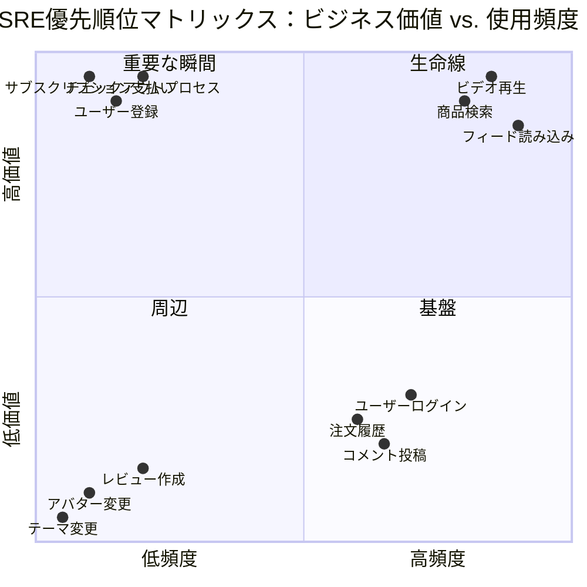
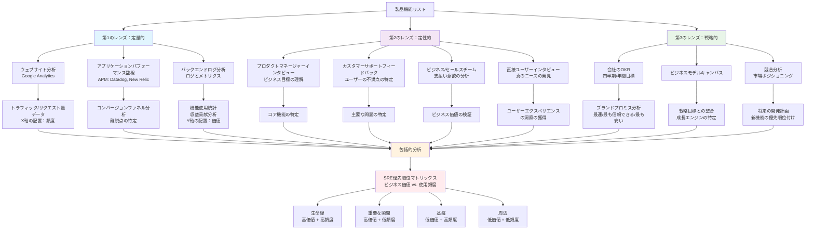
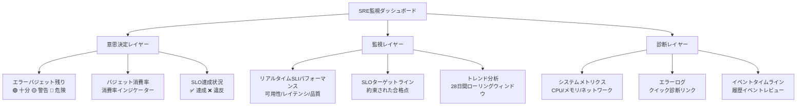
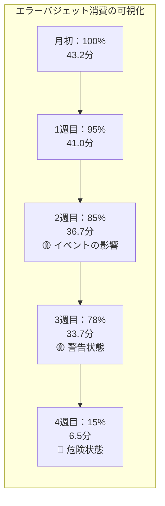
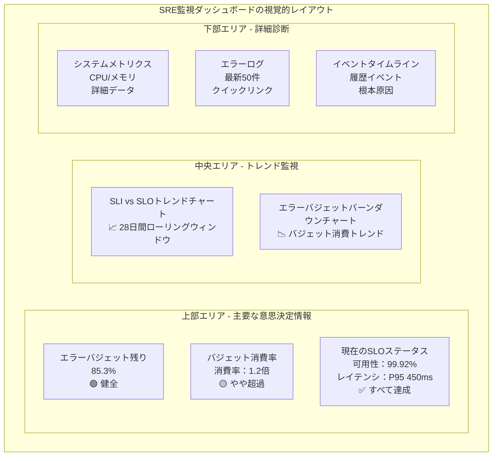
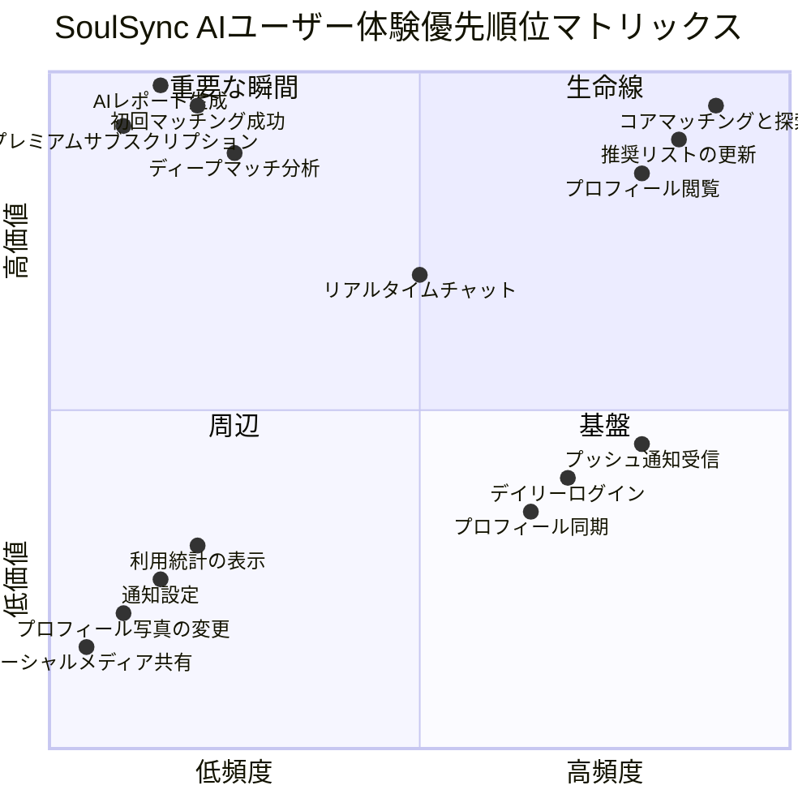

# Day 24 | 信頼性の定義と測定：SRE手法とエラーバジェットの実践 - SLI、SLO、エラーバジェットの核心概念、イノベーション速度とシステム安定性のバランスを取るためのデータ駆動型意思決定

今日は、`システム信頼性`という曖昧な概念を定量化可能なエンジニアリング分野に変えるサイトリライアビリティエンジニアリング（SRE）の手法について議論します。

現代のソフトウェア開発の戦場では、ほとんどすべての組織で終わりのない綱引きが繰り広げられています。

- イノベーションの力（開発者とプロダクトマネージャー）：彼らは迅速なイテレーションを望み、市場を獲得するために新機能をリリースします。彼らは組織の「アクセル」です。
- 安定性の力（運用チームとインフラチーム）：彼らはサービスの正常な運用を確保し、障害を回避し、ユーザーエクスペリエンスを保証する責任があります。彼らは組織の「ブレーキ」です。

伝統的に、これら二つの力の目標は根本的に対立しているように見え、彼らのコミュニケーションはしばしば摩擦、不信、主観的な感情的な議論に満ちています。

> 「あなたの新機能がサーバーをクラッシュさせた！」
>
> 「あなたのプロセスはイノベーションを阻害している！」

このような議論は、多くのエンジニアにとって昼夜を問わず悪夢です。

この対立は、両者の間に共通の言語と目標がないことに起因しています。私たちは<チーム間のコラボレーション設計：技術文書、OpenAPI、共有契約：API文書とチームコラボレーション標準の確立>でシステム境界の共通理解について言及しましたが、この綱引きは本質的に**ゼロサムゲーム**に近いです。迅速な機能リリースを追求することは、100%の機能完全性を保証できないことを意味し、その逆もまた然りです。100%の機能完全性を保証することは、市場投入のタイミングを逃すことを意味するかもしれません。一方はシステムライフの新しい基盤を求め、もう一方は現在の基盤を確保します。どちらが正しいとか間違っているとかいう問題ではなく、単に視点の違いです。

`SRE（サイトリライアビリティエンジニアリング）`の誕生は、この対立を解決するためでした。それは革命的な視点を提案しました。

> 私たちは**「ブレーキを踏むべきかどうか」を問うべきではなく**、**「前方の崖からどれくらい離れているか」を問うべき**です。

SLI、SLO、およびエラーバジェットは、「崖までの距離」を正確に測定するために使用するエンジニアリングツールです。

この記事シリーズを書いている間（2025年）、人類の宇宙植民地の希望を目の当たりにすることができて幸運です。チップのブレークスルー、コンピューティング能力の解放、AIの精度の向上は、伝統的な労働コストを解放する複合的な要因です。イーロン・マスクは夢想家です。彼は自分の資産を古い金融ゲームに再投資して新世代のウォール街の家族になることもできましたが、人類の未来の可能性を切り開くために、新時代の宇宙ロケットの研究開発に資産を投資することを選択しました。もし機会があれば、私は宇宙の冒険と植民地に志願するでしょう—地球の重力が私の魂を縛り付けてきました。次に、私のわがままとロマンスを許していただき、宇宙植民地の「酸素バジェット」を例に説明させてください。

**月面コロニーの「酸素バジェット」—生存と探査のバランス**

私たちは月面探査船の船長であり、これまで人類が訪れたことのない月面の峡谷を探査する任務を負っています。探査船には主に二つのグループがあります。

- 船内の科学者（開発チーム）：彼らは新しい発見に熱心です。彼らは潜水艇が月面の峡谷に長く留まり、未知の領域をさらに深く探査し、高エネルギー消費の検出装置を使用することを望んでいます。
- 船内の生命維持システムエンジニア（運用チーム）：彼らはただ一つ、全員が無事に月面基地に戻れることを保証することだけを気にしています。彼らは酸素レベル、バッテリー電力、船内気圧を注意深く監視しています。

SREがなければ、これは意志の戦いになるでしょう。科学者は常に「あと1時間だけ」と圧力をかけ、エンジニアは「安全第一」を理由に断固として反対するでしょう。

**SREの導入は、「酸素供給」をエラーバジェットとして明示的に定義することです。**

- SLO：このミッションは、酸素安全予備の70%を残して帰還を開始しなければなりません。
- エラーバジェット：これは、**30%の「探査バジェット」**を消費できることを意味します。

これで、すべての決定が明確になります。

- 高出力ソナー検出をオンにする？もちろん、しかしダッシュボードには、これが酸素バジェットの5%を消費すると表示されます。
- 興味深いクレーターで30分余分に滞在する？もちろん、これは酸素バジェットの10%を消費します。
- さらに遠い月面山脈へ移動する？もちろん、しかし往復で酸素バジェットの15%を消費します。

船長とすべての乗組員は、大きなスクリーンでバジェットのリアルタイム消費量を見ることができます。科学者は、科学的成果を最大化するために、バジェットをどのように「使う」かを自律的に決定できます。バジェットが尽きると、自動的にアラームが鳴り、システムは高エネルギー消費機器をロックし、探査船は無条件に帰還しなければなりません。

**SREの重要性**：それは「リスク」という曖昧な概念を、定量化可能で、取引可能で、管理可能な戦略的資源に変えます。これにより、チームは「リスクを冒すべきかどうか」について議論するのではなく、「どこにリスクバジェットを最も価値ある形で使うべきか」を共同で決定できるようになります。

SREの核心的な洞察は、**システムの信頼性は曖昧でとらえどころのない芸術ではなく、`正確に定義`され、`定量化`され、`エンジニアリング手法`を通じて体系的に改善できる科学であるべきだ**ということです。

## SRE手法の核心的思考

SREの最初の破壊的な思考は、**100%の信頼性は嘘であり、さらに言えば罠である**ということです。

絶対的な完璧さを追求することは、非現実的に高価であるだけでなく、イノベーションのあらゆる可能性を阻害します。さらに、ユーザーは**私たちのシステムが100%利用可能であるかどうかを気にしません**。彼らは**必要なときにシステムが「十分に信頼できる」ことを気にします**。

したがって、SREの核心はエラーを「排除する」ことではなく、「エラー」または「信頼性の欠如」を限定的で管理可能なリソースとして扱うことです。これが今日の三人の主人公、SLI（サービスレベル指標）、SLO（サービスレベル目標）、およびエラーバジェットにつながります。

### 「決してダウンしない」から「適切に信頼できる」へ

**100%信頼性の神話と罠**

「ファイブナイン」（99.999%）またはそれ以上の信頼性を追求することは、技術的にほぼ不可能であるだけでなく（基幹ネットワーク、ハードウェア障害、さらには太陽フレアさえ制御できません）、商業的にも災害です。信頼性のコストは線形に増加するのではなく、指数関数的に増加します。

- 99%から99.9%へ：冗長サーバーを追加する必要があるかもしれません。
- 99.9%から99.99%へ：大陸横断の災害復旧、より複雑なロードバランシング、データ同期メカニズムを構築する必要があるかもしれません。
- 99.99%から99.999%へ：コストは想像を絶するほど高くなり、非常に複雑なアーキテクチャが必要となり、この複雑さ自体が新しい障害の原因となります。

最も重要なことは、ユーザーがこの莫大な投資を本当に気にしているかということです。年に5分余分なダウンタイムを避けるためだけに、ユーザーが本当に楽しみにしている新機能の開発を諦める価値が本当にあるのでしょうか？SREは私たちにこの問いを投げかけます。

SREは破壊的な視点を提案します。システムの信頼性は私たちのサーバーによって決定されるのではなく、ユーザーによって定義されます。

もし私たちのシステムが、すべてのユーザーが寝ている午前3時に1時間ダウンした場合、ユーザーの視点から見れば、私たちの可用性は100%です。逆に、すべてのウェブサーバーが正常に稼働しているにもかかわらず、バックエンドのデータベースクエリが遅いためにすべてのページの読み込みに30秒かかる場合、ユーザーの視点から見れば、私たちのサービスは**「利用できない」**のです。

これが、前回のレッスンでSLIがユーザーエクスペリエンスを反映しなければならないと強調した理由です。私たちは機械の稼働状況を監視しているのではなく、ユーザーの満足度を監視しているのです。

「適切に信頼できる」という言葉の「適切に」は、SREの本質です。それは、信頼性が製品の機能であり、コストがかかり、価値をもたらすことを認識しています。したがって、信頼性のレベルは、無限に追求される技術指標ではなく、意識的でデータ駆動型のビジネス上の決定であるべきです。

病院の心拍数モニターシステムとオンラインミームジェネレーターでは、明らかに「適切」な信頼性のレベルが大きく異なります。SREの任務は、製品のポジショニングに合ったSLOを、多すぎず少なすぎず、製品およびビジネス関係者と協力して正確に定義することです。

> **システムは「十分に信頼できる」べきであり、「完璧に信頼できる」べきではありません。**

この「十分」の基準は、SLIとSLOを通じて科学的に定義されます。

### SREの3つの核心的柱

```
SLI (Service Level Indicators) → 「どのように定量化するか」
SLO (Service Level Objectives) → 「目標は何か」
Error Budget → 「どのように決定するか」
```

「適切に信頼できる」がSREの指導哲学であるならば、以下の3つの柱は、その哲学を日常の実践に変換するための行動フレームワークです。

- 第1の柱：データによる目標設定

  - これはすでに深く議論した部分であり、すべての基礎です。
  - 核心ツール：SLI、SLO、エラーバジェット。
  - 核心的価値：組織内のすべてのステークホルダー（開発、運用、製品、経営）に共通の、客観的で議論の余地のない言語を提供します。新機能をリリースすべきかどうかを議論するとき、私たちはもはや感情に基づいて「リスクが高すぎると思う」と言うのではなく、「今月のエラーバジェットは残り15%しかない。過去の経験から、このリリースはバジェットの20%を消費する可能性が50%あるため、リスクが高すぎる」と明確に指摘できます。これにより、潜在的な対立が、確率とデータに基づいた合理的な決定に変わります。

- 第2の柱：トイルに対するエンジニアリング

  - これはSREを従来の運用と区別する最も重要な特徴です。
  - 「トイル」の定義：Google SREは、手作業で反復的で自動化可能であり、長期的な価値を欠く作業と定義しています。例えば、クラッシュしたサービスを手動で再起動する、新しいサーバーを手動で設定する、ディスクスペースをクリーンアップするためにスクリプトを手動で実行するなどです。この作業は退屈であるだけでなく、さらに悪いことに、システムの規模に比例して増加し、最終的には全員の時間を消費します。
  - SREのエンジニアリング的性質：SREは「運用上の問題」を解決するソフトウェアエンジニアです。彼らの主要な任務は、このトイルを「行う」ことではなく、このトイルを恒久的に解決するシステムとツールを「開発する」ことです。彼らは手動で再起動するのではなく、サービスを自動的に監視して再起動するプログラムを作成します。彼らはサーバーにログインしてコマンドを入力するのではなく、TerraformやAnsibleを使用して設定を自動化します。
  - 50%ルール：健全なSREチームは、将来のトイルを削減したり、システム信頼性を向上させたりするためのエンジニアリングプロジェクトに少なくとも50%の時間を費やすべきです。もしトイルが時間の50%以上を占める場合、それはチームが問題に圧倒されており、自動化開発を優先するために新しい運用タスクの受け入れを一時停止する必要があるという明確な警告サインです。

- 第3の柱：リスクの受容と障害の管理

  - これはSREの文化的具現化です。健全なSRE文化では、障害は災害ではなく、システムが私たちに提供する最も価値のある学習機会です。
  - 非難しない事後分析：インシデントが発生した場合、SREの主要な原則は非難しないことです。焦点は常に、システムのどの部分がうまくいかなかったのかにあり、どのオペレーターが間違いを犯したのかではありません。なぜなら、人間のエラーはしばしば、より深いシステム的問題（例えば、貧弱なインターフェース設計、安全チェックの欠如、時代遅れのドキュメント）の症状に過ぎないからです。個人的な非難をしない、深く正直な事後分析を通じて、チームは問題の根本原因を見つけ、同様の問題が二度と起こらないようにするためのエンジニアリング対策（例えば、チェックの追加、プロセスの最適化、自動化の強化）を講じることができます。
  - リスク管理ツールとしてのエラーバジェットの使用：エラーバジェットは単なる受動的な監視指標ではありません。それはまた、積極的なリスク計画ツールでもあります。チームは意識的にバジェットを「消費」して、カオスエンジニアリングテストを実施したり、高リスクのアーキテクチャアップグレードを実行したり、新機能の安定性を検証したりできます。それはチームに、システムの境界を積極的に探索し、安全なフレームワーク内でイノベーションを受け入れる勇気を与えます。

## SLI：サービスレベル指標 - ユーザーエクスペリエンスの定量化

SREのマクロな思考フレームワークを確立したところで、その最も重要な実践的基盤であるサービスレベル指標（SLI）について深く掘り下げていきましょう。

SLI（サービスレベル指標）は、サービスの健全性を測定するために使用する「体温計」です。

良いSLIは黄金律を満たさなければなりません。それは**実際のユーザーエクスペリエンスを反映している**必要があります。ユーザーはサーバーのCPU使用率が10%か90%かを気にしません。しかし、彼らは「購入」ボタンをクリックした後、ページの読み込みに0.5秒かかるか5秒かかるかを気にします。

したがって、SLIは外側から見た指標です。いくつかの例を見てみましょう。

- 可用性：すべての「記事を読む」リクエストのうち、コンテンツが正常に返されるのは何パーセントか？
  - 計算式：（成功したリクエスト数 / 総リクエスト数）* 100%
- レイテンシ：すべての成功した「商品を検索する」リクエストのうち、処理時間が300ミリ秒以内であるのは何パーセントか？
  - 計算式：（応答時間が300ミリ秒未満のリクエスト数 / 成功したリクエスト総数）* 100%
- 品質：すべての「ビデオ再生」リクエストのうち、標準画質（SD）にダウングレードされることなく高画質（HD）でストリーミングされるのは何パーセントか？
  - 計算式：（HD再生数 / 総再生数）* 100%

SLIを定義するプロセスは、エンジニア中心の視点から離れ、ユーザーの視点から自社の製品を見ることを強制します。

### SLIの核心原則

SREのマクロな思考フレームワークを確立したところで、その最も重要な実践的基盤であるサービスレベル指標（SLI）について深く掘り下げていきましょう。

SREが信頼性を科学にするエンジニアリング分野であるならば、SLIはその科学の測定単位です。正確な測定がなければ、すべての目標（SLO）とバジェット（エラーバジェット）は絵に描いた餅に過ぎません。

SLIは次の条件を満たす必要があります。

1.  **実際のユーザーエクスペリエンスを反映していること**
2.  **定量化可能で標準化されていること**
3.  **少ないほど良い**
4.  **ビジネス目標と整合していること**

**1. 絶対的な「ユーザー中心主義」**

これが最も重要な第一原則です。常に「`ユーザーは何を気にしているのか？`」と問いかけ、「`私のサーバーは何をしているのか？`」と問いかけてはいけません。

- 悪い例：サーバーのCPU使用率、メモリ消費量、ネットワークスループット。これらはシステムメトリクスです。問題の原因ではありますが、問題そのものではありません。ユーザーはCPUが10%か90%かを気にしません。
- 良い例：ページの読み込み速度、リクエスト成功率、ファイルアップロード完了時間。これらはユーザーが直接感じることができるエクスペリエンスメトリクスです。

**2. 定量化可能で標準化されていること**

SLIは計算可能な数値でなければならず、通常は比率または分布です。最も一般的な標準化された形式は次のとおりです。

> SLI = (良いイベントの数 / 有効なイベントの総数) * 100%

この単純な計算式は、何が「良い」イベントであり、何が「有効な」イベントであるかを明確に定義することを強制します。例えば、APIの可用性SLIの場合：

- 良いイベント：HTTP応答コードが2xxまたは3xxのリクエスト。
- 有効なイベント：すべてのリクエストですが、クライアント側のエラー（例：HTTP 4xx）によって引き起こされたものは除外します。なぜなら、それは私たちのシステムの責任ではないからです。

**3. 少ないほど良い**

サービスに数十のSLIがあってはなりません。指標が多すぎると、ノイズが多すぎ、アラート疲れを引き起こし、本当の焦点が不明瞭になります。通常、主要なユーザー体験では、2〜3の核心的なSLI（例：可用性、レイテンシ、正確性）に焦点を当てるだけで十分です。私たちは**情報密度**に焦点を当てる必要があります。

**4. 重要なユーザー体験をカバーする**

私たちのサービス内のすべての機能が等しく重要であるわけではありません。ユーザーとビジネスにとって最も価値の高いパスを特定し、それらのSLIを優先的に定義する必要があります。

- Eコマースウェブサイトの場合：商品の検索 -> 商品詳細の表示 -> カートへの追加 -> チェックアウト。このパスの信頼性は、「プロフィール写真の変更」機能の信頼性よりもはるかに重要です。
- ビデオプラットフォームの場合：ビデオ再生の成功率と起動レイテンシは、コメント投稿よりも核心的なSLIです。

**SLIの4つの黄金シグナル**：

| **シグナルタイプ** | **定義** | **ユーザーの関心事** | **AWS実装例** |
|---|---|---|---|
| **レイテンシ** | リクエスト処理時間 | 「ウェブサイトはどれくらい速く読み込まれるか？」 | CloudWatch ResponseTime |
| **トラフィック** | システム需要の測定 | 「システムはどれくらいのユーザーを処理できるか？」 | CloudWatch RequestCount |
| **エラー** | 失敗したリクエストの割合 | 「機能は正しく動作しているか？」 | CloudWatch 4xx/5xx Error Rate |
| **飽和度** | サービスリソース使用率の度合い | 「システムはクラッシュしないか？」 | CloudWatch CPU/Memory Utilization |

「システムとエクスペリエンスのアーキテクト」として、私たちの任務はシステムを構築するだけでなく、構築するシステムが最も価値のある「エクスペリエンス」に真に貢献することを保証することです。これらの主要なパスを特定することが、私たちのアーキテクチャ作業の「アンカーポイント」です。

> **SRE実践の核心は、単なる`技術的な問題`ではなく、`ビジネス戦略の問題`です。SRE実践の核心は実際には、「`デジタル製品の魂をいかに見つけるか？`」です。**

これは直感だけに頼るべきではなく、体系的な方法論が必要です。ここでは、私がデジタルマーケティングキャンペーンを実行する際に使用した、価値と頻度を組み合わせた2次元フレームワークと、これらのパスを正確に特定するための3つのレンズ分析方法を共有します。

まず、ユーザーパスの重要性を特定するには、ビジネスにもたらす**価値**と、使用頻度（**ボリューム**）という2つの側面から評価する必要があります。すべての機能とパスをこの4象限マトリックスに配置することで、それらの優先順位が一目で明確になります。



**第1象限：生命線 - 高価値、高頻度**

特徴：これは私たちの製品の心臓部です。ユーザーはこれらの機能を毎日、毎時間使用し、直接的または間接的にビジネス価値の大部分に貢献します。

例：

- Eコマースプラットフォーム：商品検索、商品リストページの閲覧
- ビデオプラットフォーム：ビデオ再生、ホームページのコンテンツ推奨
- ソーシャルプラットフォーム：フィードの読み込み

SRE戦略：最も厳格なSLI/SLOを設定する必要があります。可用性、レイテンシ、正確性はすべて不可欠です。エラーバジェットは非常に貴重であり、いかなる消費も即座に注意を払う必要があります。ここに最も多くの監視および自動化リソースを投資する必要があります。

**第2象限：重要な瞬間 - 高価値、低頻度**

特徴：これらは決定的な、高リスクの「最後のキック」です。ユーザーは頻繁には実行しませんが、実行するときは、失敗は絶対に許されません。失敗の結果は、しばしば直接的な収益損失またはユーザー離脱です。

例：

- Eコマースプラットフォーム：チェックアウトプロセス、新規アカウント登録
- ビデオプラットフォーム：サブスクリプション支払い
- SaaSサービス：データエクスポート、年次レポート生成

SRE戦略：SLOは、特に可用性と正確性に関して、同様に厳格です。レイテンシに対する許容度は第1象限よりもわずかに高いかもしれませんが、失敗は許容できません。災害復旧計画とデータ整合性の保証がこの象限の焦点です。

**第3象限：周辺 - 低価値、低頻度**

特徴：これらは、コアエクスペリエンスにほとんど影響を与えない二次的または補助的な機能です。

例：

- Eコマースプラットフォーム：プロフィール写真の変更、商品レビューの作成
- ビデオプラットフォーム：テーマの変更

SRE戦略：最も緩やかなSLOを設定します。監視の焦点は、究極のパフォーマンスを追求するのではなく、「完全に壊れていない」ことを保証することです。これらの機能のエラーバジェットは比較的豊富であり、新しい技術や高リスクの変更のテストベッドとして機能することさえできます。

**第4象限：基盤 - 低価値、高頻度**

特徴：これらは、ユーザーエクスペリエンスの背景を形成する基本的な機能です。それ自体が直接的に大きな価値を生み出すわけではありませんが、壊れると製品全体が「おかしい」と感じられ、ユーザーの信頼に影響を与えます。

例：

- Eコマースプラットフォーム：ログイン、注文履歴の表示
- ビデオプラットフォーム：コメント投稿、プレイリストへの追加
- 一般：ヘルプドキュメントの表示（ヘルプ/FAQ）

SRE戦略：信頼できる必要がありますが、SLOは最初の2つの象限よりも緩やかで構いません。焦点は安定性と一貫性です。短期的なパフォーマンス低下は許容できますが、完全な利用不能は許容できません。ここでは自己修復が重要です。

基本的なフレームワークができたところで、機能を象限に正確に配置するにはどうすればよいでしょうか？製品を3つの異なる「レンズ」を通して見る必要があります。これが私たちの標準作業手順（SOP）です。

### 重要なSREパスを特定するための3つのレンズ分析方法

ユーザー体験の重要性を正確に特定するには、3つの異なる視点から製品を検討する必要があります。この3つのレンズ分析方法は、重要な洞察を見逃さないことを保証します。



**第1のレンズ：定量的レンズ - 客観的事実**

これが私たちの最初のステップであり、データに語らせます。

ツール：ウェブサイト分析ツール（Google Analytics）、アプリケーションパフォーマンス監視（APM、例：Datadog、New Relic）、バックエンドログ。

探しているメトリクス：

- **トラフィック/リクエスト量**：どのページ、APIエンドポイントが最も頻繁に呼び出されているか？（X軸の配置：頻度）
- **コンバージョンファネル**：「閲覧 -> カートに追加 -> チェックアウト」のファネルで、各ステップに何人のユーザーがいるか？どのステップで最も離脱率が高いか？
- **機能使用率**：アクティブユーザーのうち、特定の機能を使用した割合はどれくらいか？
- **収益貢献度**：どのトランザクションまたは機能が直接収益を生み出しているか？（Y軸の配置：価値）

**第2のレンズ：定性的レンズ - 人間の洞察**

データは「何が起こったか」を教えてくれますが、定性分析は「なぜそれが重要なのか」を教えてくれます。

ツール：人々と話すこと。

インタビューする必要がある人々：

- **プロダクトマネージャー**：彼らは製品ビジョンとビジネス目標を最もよく知っています。彼らに尋ねてください：「もし給料を賭けるとしたら、絶対に失敗してはならないと思う機能は何ですか？」
- **カスタマーサポートチーム**：彼らはユーザーの苦情に最も近い存在です。彼らに尋ねてください：「どのような問題が最も多くのカスタマーサポートの電話を引き起こしますか？どのような問題がユーザーを激怒させますか？」
- **セールスチーム**：彼らは顧客が何を支払う意思があるかを知っています。彼らに尋ねてください：「私たちの製品のどのセールスポイントが取引を成立させる鍵ですか？」
- **ユーザー**：可能であれば、直接ユーザーインタビューを実施してください。彼らに尋ねてください：「今日、私たちのアプリを開いたときに最も達成したいことは何ですか？」

**第3のレンズ：戦略的レンズ - 将来の方向性**

最後に、会社の視点から見る必要があります。

ツール：会社の四半期/年間目標（OKR）、ビジネスモデルキャンバス、競合分析。

考える必要がある質問：

- **ブランドプロミス**：私たちのブランドは「最速」なのか、「最も信頼できる」のか、それとも「最も安い」のか？もし「速い」と約束するなら、検索とページ読み込み速度のSLIは非常に重要です。
- **戦略目標**：今四半期の会社の目標は「新規ユーザー登録率の向上」か？もしそうなら、低頻度のパスである「登録プロセス」パスの価値は、今四半期は戦略的に高められるべきです。
- **将来の開発**：AIレコメンデーションに基づく新機能をリリースしようとしており、それを次の成長エンジンにする予定か？もしそうなら、この新機能のSLIは最初から潜在的な「生命線」と見なされるべきです。

| **サービスタイプ** | **SLIカテゴリ** | **指標定義（計算式）** | **説明** |
|---|---|---|---|
| **ユーザーリクエスト駆動型サービス**<br/>（例：Web API、Eコマースサイト） | 可用性 | `(HTTP 2xx/3xx応答) / (総リクエスト数 - HTTP 4xx応答)` | サービスが「稼働中」であり、正当なリクエストを正常に処理できるかどうかを測定します。 |
| | レイテンシ | `(応答時間がNミリ秒未満のリクエスト数) / (成功したリクエスト総数)` | サービスの応答性を測定します。95パーセンタイル（p95）や99パーセンタイル（p99）など、複数のパーセンタイルで設定されることが多いです。 |
| | 正確性 | `(期待されるコンテンツを含む成功したリクエスト数) / (成功したリクエスト総数)` | サービス応答が正しいかどうかを測定します。例えば、HTTP 200を返すが結果が空の検索APIは「不正確な」応答である可能性があります。 |
| **データ処理パイプライン**<br/>（例：ETL、レポート生成） | 鮮度 | `データ処理完了時間 - データ生成時間 < N時間` | データ出力の適時性を測定します。ユーザーはレポートデータが昨日の最新のものであるかどうかを気にします。 |
| | カバレッジ | `(正常に処理されたレコード数) / (処理対象のレコード総数)` | データ処理が完了しているか、欠落がないかを測定します。 |
| | 正確性 | `(データ検証に合格した出力数) / (総出力数)` | 出力データがビジネスルールまたは品質基準に準拠しているかどうかを測定します。 |
| **ストレージシステム**<br/>（例：データベース、オブジェクトストレージ） | 可用性 | `(成功した読み取り/書き込み操作数) / (総読み取り/書き込み操作数)` | ストレージシステムが正常にアクセスできるかどうかを測定します。 |
| | 耐久性 | 通常は設計目標であり、リアルタイムSLIではない | 保存されたデータが失われない確率を測定します。これは通常、アーキテクチャ設計（例：複数のレプリカ、チェックサム）によって保証され、リアルタイム監視ではありません。 |

### SLI監視ダッシュボードのセットアップ

SLIを定義した後、次のステップは、意思決定を導くことができるダッシュボードにそれらを視覚化することです。優れたSREダッシュボードは、次の質問に30秒以内に答えることができるはずです。「私たちのサービスは今大丈夫ですか？エラーの余地はどれくらい残っていますか？」

**ダッシュボードのコアコンポーネントアーキテクチャ**



**1. SLOターゲットライン**

これはダッシュボード上で最も重要な視覚要素です。チームがコミットした目標（例：99.9%）を表す明確な水平線です。すべてのメトリクスはこの線と比較されるべきです。

**2. 現在のSLIパフォーマンスグラフ**

特定の時間枠（例：28日間ローリング）における実際のSLIパフォーマンスを示す、時間とともに変化する折れ線グラフです。ターゲットラインを上回っているか下回っているかを一目で確認できます。

**3. エラーバジェットバーンダウンチャート**

これは、意思決定レベルでSRE哲学を実践するための最も重要なチャートです。サイクル開始時（例：毎月1日）から現在までの、残りのエラーバジェットの割合または特定の「信頼できない時間」（例：残り15.3分）を示します。この線がゼロに近づくと、イノベーションの「アクセル」を緩めなければならないことを誰もが知るでしょう。



**4. 消費率とアラート**
優れたダッシュボードは、「どれくらい残っているか」を示すだけでなく、「どれくらい持つか」も予測します。

- 消費率：エラーバジェットを消費する速度を示す指標です。例えば、消費率 = 2は、予想の2倍の速度でバジェットを消費しており、サイクルの半分で尽きる見込みであることを意味します。
- アラート：アラームは「SLOが違反されたとき」にのみトリガーされるべきではありません。それでは遅すぎます。氷山に衝突した後で警報を鳴らすようなものです。より重要なのは、「現在の消費率が続けば、X日後にバジェットが尽きる」という警告を事前に発し、チームに反応する時間を与えることです。

**ダッシュボードレイアウト例**

左上（最も目立つ位置）：現在の残りのエラーバジェットを最大のフォントサイズで表示します。これは意思決定の最も重要な根拠です。

右上：いくつかのコアSLI（可用性、レイテンシ）のSLOターゲットラインに対する長期トレンドチャートを表示します。

下部：より詳細なデータチャート、関連するシステムメトリクス（CPU、メモリ）、および問題発生時の詳細診断（ドリルダウン）のためのエラーログへのクイックリンクを提供します。



SLIの定義、測定、監視方法を習得することで、SRE実践の基礎を習得しました。次はSLOの設定とエラーバジェットの管理です。

## SLO：サービスレベル目標 - 信頼性の目標ライン

SLO（サービスレベル目標）は、SLIに設定する「合格点」です。

それは特定の目標であり、私たち、ユーザー、ビジネスチーム間の公的なコミットメントです。通常、特定の時間枠におけるパーセンテージとして定義されます。

上記の例を続けると：

- 可用性SLO：「過去28日間で、99.9%の『記事を読む』リクエストが成功しなければならない。」
- レイテンシSLO：「過去28日間で、95%の『商品を検索する』リクエストが300ミリ秒以内に完了しなければならない。」

SLOの設定は芸術であり、ビジネスでもあります。高ければ高いほど良いというわけではありません。

99.9%のSLO（しばしば「スリーナイン」と呼ばれる）と99.999%のSLO（「ファイブナイン」）では、エンジニアリングコストと複雑さが大きく異なります。自問自答する必要があります。この追加の0.099%の信頼性のために支払われる莫大なコストは、ユーザーに同等の価値をもたらしているのでしょうか？それとも、これらのリソースを新機能の開発に投資する方が価値があるのでしょうか？

SLIが体温計であるならば、SLOは科学と経験に基づいて温室に設定する「最適な生育温度」です。温度が高すぎると（目標が厳しすぎると）、すべてのエネルギーを使い果たし、成長を阻害します。温度が低すぎると（目標が緩すぎると）、作物（ユーザーエクスペリエンス）は枯れてしまいます。

SLOの設定は純粋に技術的な決定ではありません。それは繊細な外交交渉であり、技術的な実現可能性、ユーザーの期待、ビジネスコストの最適なバランスを見つけるプロセスです。

> **SLOは、製品、開発、運用の共同交渉の結果です。それは、「サービスがうまく機能している」ことの意味を明確に定義する、データ駆動型の境界です。**

### SLO設定の芸術と科学

SLOの数値の背後には、ビジネスの深い理解と技術の正確な把握があります。それは科学的な方法論であると同時に、芸術的な哲学でもあります。共通のSLOの設定は、複数の要素のバランスを取る必要があります。

```yaml
SLO設定の考慮事項：
ユーザーの期待：ユーザーが許容できるサービス品質の最低ライン
ビジネスへの影響：サービス中断がビジネスに与える経済的影響
技術的現実：システムアーキテクチャの技術的限界
費用対効果：信頼性向上の限界費用
リスク許容度：組織のリスク受容度
```

しかし、私たちは主に2つの側面から文脈を設定できます。**科学：データ駆動型の客観的根拠**と**芸術：戦略指向の主観的決定**です。

**科学：データ駆動型の客観的根拠**

これはSLOの論理的な骨格です。私たちは感情に頼るのではなく、データに導かれて合理的な出発点を見つけます。

- **過去のパフォーマンスを分析する**：
  - 過去四半期または半年間のSLIのパフォーマンスはどうでしたか？これは平均を見るのではなく、分布を見ることです。
    - P95（95パーセンタイル）レイテンシはどれくらいですか？P99は？
  - 履歴データは私たちの最も正直なコンサルタントであり、システムの本来の能力がどこにあるかを教えてくれます。
  - 過去の最高のパフォーマンスをはるかに超えるSLOを直接設定することは非現実的です。
- **収穫逓減を理解する**：
  - 99%から99.9%への改善コストは、99.9%から99.99%への改善コストとは指数関数的に異なります。
  - 自問自答する必要があります。この追加の0.09%の信頼性のために投資される莫大なエンジニアリングリソースは、同等のユーザー満足度またはビジネスリターンをもたらすのでしょうか？
    - ある時点を超えると、信頼性向上への投資収益率は急激に低下します。
- **ビジネスメトリクスとの相関**：
  - 例：SLIデータとビジネスメトリクス（例：ユーザー維持率、ショッピングカート放棄率、サブスクリプションコンバージョン率）を比較します。
    - 興味深いパターンが見つかります。ページレイテンシが200ミリ秒から100ミリ秒に低下すると、コンバージョン率が大幅に増加する可能性があります。しかし、100ミリ秒から50ミリ秒に低下しても、ほとんど変化がない場合があります。
  - データにおけるこの「崖」または「高原」は、SLOを設定するための強力な科学的根拠です。

**芸術：戦略指向の主観的決定**

科学が「どこに行けるか」を教えてくれるなら、芸術は「どこに行くべきか」を教えてくれます。

- **ユーザーの期待を管理する**：
  - ユーザーにとって「良い」とは何か？これはしばしば相対的です。
  - 競合他社のウェブサイトが非常に速い場合、私たちのSLOは緩すぎないようにする必要があります。
    - 逆に、私たちの製品が内部のバックエンドシステムである場合、ユーザーの occasional なレイテンシに対する許容度ははるかに高くなります。
  - 芸術とは、ユーザーの心理的感情を理解し、形作ることです。
- **ブランドプロミスを反映する**：
  - 私たちの会社は世界にどのようなブランドイメージを伝えたいですか？トップスポーツカーのような「究極のパフォーマンス」ですか、それともトヨタのような「絶対的な信頼性」ですか？
  - 私たちのSLOはブランドプロミスと一致している必要があります。
    - 「決して中断しない」と主張する金融取引システムは、実験的なソーシャルアプリよりもはるかに厳格なSLOを持つことになります。
- **交渉ツールとして使用する**：
  - SLOは、製品およびビジネスチームとの契約です。
    - プロダクトマネージャーが非常に高いSLOを要求した場合、私たちはデータを使用して、その目標を達成するために必要なエンジニアリングコストを明確に示し、逆に尋ねることができます。「この目標のために、来四半期の3つの新機能の開発を延期する意思がありますか？」
  - これにより、感情的な要求が、合理的なリソース配分の議論に変わります。

**SLO設定のベストプラクティス**

これらの原則に従うことで、SLO設定プロセスをよりスムーズかつ効果的にすることができます。

1.  シンプルに保つ：システムの隅々までSLOを設定しようとしないでください。前述の「重要なユーザー体験」から始め、各体験で最も重要なSLIを3つ以内に絞ってSLOを設定します（通常は可用性、レイテンシ）。

2.  決して100%を設定しない：100%のSLOはゼロのエラーバジェットを意味し、現実世界では不可能です。それはすべての変更とイノベーションを阻害するだけでなく、失敗する運命にある目標を設定することになり、士気を低下させます。

3.  SLOは生き物であり、反復して洗練する：最初のSLOが最も完璧であるとは限りません。初期目標を設定し、1〜2サイクル実行し、実際の状況、エラーバジェットの消費率、ユーザーフィードバックに基づいて調整します。それは継続的な調整が必要な羅針盤です。

4.  共有所有権を確保する：SLOはSREチームの個人的な目標ではありません。それは、製品、開発、SREチームによって議論され、合意され、公に署名された共通の契約でなければなりません。エラーバジェットが尽きたとき、SREだけでなく、製品チーム全体が結果を負います（例：リリース凍結）。

5.  測定期間を明確に定義する：「過去7日間」または「過去28日間」に基づいてSLOを計算するのか？短い期間は障害に敏感で、より迅速に反応します。長い期間は長期的なトレンドをよりよく反映し、短期的な変動に過剰に反応するのを避けることができます。通常、「ローリング28日または30日」が良い出発点です。

**SLO実装戦略**

組織でSLOを実装することは、一朝一夕には達成できない文化的な変化です。「這う-歩く-走る」の3段階戦略を採用することをお勧めします。

**フェーズ1：這う**

- 目標：学習と検証。
- 行動：
  1. 1〜2の内部システムまたは絶対的なコアではない外部サービスをパイロットとして選択します。
  2. そのサービスの開発チームと製品チームで小さな仮想チームを編成します。
  3. 完全なSLI/SLO定義プロセスを共同で完了します。
  4. 基本的な監視ダッシュボードを構築します。
- 焦点：この段階では、全員がこの言語とプロセスに慣れること、そして間違いを許容することに焦点を当てます。SLOの正確性は最も重要なことではなく、コンセンサスを構築し、経験から学ぶことが重要です。

**フェーズ2：歩く**

- 目標：標準化と拡大。
- 行動：
  1. パイロットの成功経験を標準化されたSLO設定SOPに統合します。
  2. すべての「生命線」および「重要な瞬間」サービスにSLO実践を拡大します。
  3. SLOに基づいてエラーバジェットポリシーを正式に実装し始めます。バジェットが尽きたときには、明確な対応策（例：機能リリースの停止、安定性会議の開催）が必要です。
- 焦点：SLOを「監視指標」から意思決定を推進するツールに変革します。エラーバジェットがチームの作業優先順位に真に影響を与え始めるようにします。

**フェーズ3：走る**

- 目標：完全な統合と文化的な定着。
- 行動：
  1. SLOとエラーバジェットをすべての組織プロセスに完全に統合します。四半期計画、製品ロードマップ、リリースレビュー、インシデント対応、事後分析。
  2. 経営陣もサービスの健全性を理解できるように、全社的な信頼性ダッシュボードを構築します。
  3. SLOは、チームのパフォーマンスを評価し、高信頼性エンジニアリングの実践を報奨するための根拠の1つになります。
- 焦点：SLOはもはやSREチームが「推進する」ものではなく、技術組織全体で思考とコミュニケーションのための共通言語とコア文化として内面化されています。

## エラーバジェット：イノベーションと安定性のバランス

SLIが測定単位であり、SLOが羅針盤であるならば、「エラーバジェット」はSRE全体の車輪を動かす**エンジンと燃料**です。それはSREの最も革命的な発明であり、抽象的なビジネス管理哲学を日常の意思決定プロセスに変える強力なメカニズムです。SLOの概念を受動的な監視目標から能動的な管理ツールに変革します。

私たちは、自己調整、自己均衡システムを設計する方法について議論します。それは単なる技術システムではなく、組織的および文化的なシステムでもあります。それは、公正で透明性のあるデータ駆動型のルール（エラーバジェット）を使用して、チームの感情（イノベーションへの衝動 vs. 安定性への不安）を管理し、最終的に共通の理想（ユーザーへの価値創造）を達成します。

正式に始める前に、幽霊話を見てみましょう。

**意思決定モードの比較：感情駆動型 vs. データ駆動型**

### シナリオ1：新機能リリースに関する議論

> **従来の意思決定モード（感情に基づく）**
>
> - **開発者**：「この新機能をリリースできますか？ユーザーはそれを待っていますし、競合他社はすでに持っています！」
> - **運用者**：「いや、前回のリリースで問題が発生しました。リスクが高すぎます！開発者は安定性を考慮しません。」
> - **開発者**：「しかし、プロダクトマネージャーは、この機能が収益を20%増加させると言いました！」
> - **運用者**：「収益は気にしません。システムがダウンすれば、誰もが私たちを非難しに来ることを知っているだけです。」
> - **開発者**：「運用チームはいつも保守的です。このままでは会社は競争力を失います！」
> - **運用者**：「保守的である方が、夜中に起こされてバグを修正するよりもましです！前回のインシデントでは午前3時まで働きました。」
> - **マネージャー**：「議論をやめてください。リリースできるのかできないのか？明確な答えをください！」

> **SRE意思決定モード（データに基づく）**
>
> - **開発者**：「このリリースのリスクをカバーするのに十分なエラーバジェットがありますか？」
> - **SRE**：「現在のエラーバジェットは15%しかありません。過去のデータに基づくと、同様の機能のリリースはバジェットの10%を消費する可能性が30%あります。」
> - **開発者**：「つまり、リリースが失敗した場合、エラーバジェットを使いすぎるということですか？」
> - **SRE**：「はい、しかしリスクを減らすことができます。まず10%のユーザーにカナリアリリースを行い、48時間監視することをお勧めします。」
> - **製品**：「カナリアリリースのリスク見積もりはどれくらいですか？SLOに影響しますか？」
> - **SRE**：「カナリアリリースのリスクは5%に減少し、エラーバジェットの1〜2%を消費すると予想されます。成功すれば、すべてのユーザーに安全に展開できます。」
> - **マネージャー**：「良いですね、データは明確です。カナリアリリース計画は承認されました。エラーバジェットの状況を継続的に監視してください。」

### シナリオ2：緊急インシデント対応

> **従来の意思決定モード（感情に基づく）**
>
> - **運用者**：「システムがダウンしました！すべてのユーザーがログインできず、カスタマーサービスの電話が鳴りっぱなしです！」
> - **開発者**：「ありえません、昨日のコードはログインロジックに触れていません！インフラの問題に違いありません。」
> - **運用者**：「インフラは安定しています。あなたの新しいコードのバグに違いありません！」
> - **マネージャー**：「今は責任をなすりつけ合う時ではありません。早く復旧方法を見つけてください！」
> - **開発者**：「以前のバージョンに戻すのはどうですか？しかし、昨日のセキュリティ脆弱性の修正が失われます。」
> - **運用者**：「では、脆弱性を修正して再度リリースしてください。しかし、どれくらい時間がかかるかわかりません。CEOがすでに問い合わせています...」
> - **マネージャー**：「議論を続けていたら、いつになったら修正できるのですか？時間を教えてください！」

> **SRE意思決定モード（データに基づく）**
>
> - **SRE**：「ログインサービスの可用性が25%に低下し、P1インシデントがトリガーされ、エラーバジェットが急速に消費されています。」
> - **開発者**：「監視データによると、問題はデータベース接続プールにあり、昨日のコードのリリース時間と一致しています。」
> - **SRE**：「MTTR目標は30分です。オプション1：すぐにロールバックし、5分で復旧しますが、セキュリティリスクが再導入されます。」
> - **セキュリティ**：「オプション2：接続プール設定をホットフィックスし、15分で復旧し、セキュリティ修正を維持します。」
> - **製品**：「エラーバジェットによると、まだ8分間のダウンタイムを許容できます。オプション2はリスクが高すぎます。」
> - **SRE**：「明確です。すぐにロールバック計画を実行します。セキュリティ脆弱性の修正は再スケジュールされ、より厳格なテストプロセスが確立されます。」
> - **マネージャー**：「同意します。システムは5分で復旧します。セキュリティ脆弱性修正の安全なリリース計画は来週月曜日に作成されます。」

シナリオに絡み合った対話と決定のように、**エラーバジェットは「リスク」を「取引可能で管理可能な通貨」に定量化します**。バジェットが十分であれば、チームは大胆に革新する自律性を持っています。バジェットが尽きれば、チーム全体の唯一の目標は「支出を止める」、つまり、バジェットが再び蓄積し始めるまで、問題の修正と安定性の向上に集中することです。それは開発と運用の目標を巧みに統一します。

今日は、このエンジンを`核心原則`から`意思決定フレームワーク`、そして世界クラスのクラウドプラットフォームであるAWSでそれを具体化する方法まで、完全に解体します。

### エラーバジェットの核心概念

エラーバジェットの数学的定義は非常に単純です。

```
エラーバジェット = (1 - SLO) × 総時間
```

可用性SLOが99.9%の場合、エラーバジェットは0.1%です。

この0.1%は何を表しているのでしょうか？それは「`障害許容範囲`」を表しています。それは私たちのお小遣いのようなもので、自由に使うことができます。私たちはそれを使って次のことができます。

- 新機能のリリース：新機能のリリースにはリスクがあり、バグを引き起こし、エラーバジェットを消費する可能性があります。
- システムアップグレードの実行：計画されたメンテナンスダウンタイムでさえ、エラーバジェットを消費します。
- 予期せぬ障害の吸収：予期せぬシステム中断は、バジェットを急速に消費します。

この0.1%はもはや受動的な「フォールトトレランス率」ではありません。私たちはそれを能動的な承認と見なすべきです。それは、システム管理者として、製品および開発チームに対して行う厳粛なコミットメントを表しています。

> **「この0.1%を超えない限り、あなたは間違いを犯す権利があります。このバジェットを使ってリスクを冒し、革新し、完璧ではないかもしれないが大きな可能性を秘めた新機能をリリースすることができます。これはあなたのイノベーションのための通貨です。」**

開発チーム（Dev）と運用チーム（Ops/SRE）が共同で銀行口座を管理し、口座のお金が「エラーバジェット」であると想像してください。

**開発チーム**は、お金を使いたい（新機能をリリースし、高リスクの変更を行う）と考えています。なぜなら、お金を使うことでより高いリターン（市場シェア、ユーザー満足度）が得られる可能性があるからです。

**運用チーム**の主要な任務は、予期せぬニーズ（予期せぬ障害）に対処するために、常に口座に十分な預金があることを確認すること（システムの安定性を維持すること）です。

このモデルでは、従来の対立は消え、両者の目標は完全に一致します。**この限られたバジェットを最も賢い方法で使い、製品の長期的な価値を最大化する方法**です。口座残高が少ない場合、合理的なメンバーは誰もが同意するでしょう。今すぐ支出を止め、お金を稼ぎ始める（問題の修正、安定性の向上）必要があります。

したがって、冒頭で述べた2つのシナリオ、`新機能リリースに関する議論`と`緊急インシデント対応`のように、私たちはついに会議室での終わりのない綱引きを終わらせました。

### エラーバジェット駆動型意思決定フレームワーク

エラーバジェットがあれば、意思決定を導くリアルタイムダッシュボードがあります。核心は、主要な指標であるバジェット消費率を監視することです。

消費率とは、エラーバジェットを消費する速度を指します。健全な消費率は約1（つまり、予想される速度で消費する）であるべきです。消費率が1を超える場合、それは将来のイノベーション能力を使いすぎていることを意味します。

これは、私たちが直接適用できるSOP（標準作業手順）です。

| **バジェットステータス** | **消費率（例）** | **ステータスライト** | **核心原則** | **意思決定アクション** |
|---|---|---|---|---|
| **健全**<br/>残り70%以上 | 消費率 ≈ 1 | 🟢 緑 | イノベーションを奨励 | • リリースを加速：より高頻度で高リスクな機能リリースを許可<br/>• 計画された実験：カオスエンジニアリング、ストレステスト、アーキテクチャ変更を実行<br/>• メンテナンスのスケジュール：短時間のダウンタイムを必要とするデータベースアップグレードなどを実行 |
| **枯渇中**<br/>残り30%〜70% | 消費率 > 2 | 🟡 黄 | 慎重に進める | • リリース基準を引き上げる：低リスクで高価値な変更のみを許可<br/>• テストを強化：より包括的な自動テストカバレッジを要求<br/>• 問題分析：どの機能または変更がバジェットを急速に消費しているかを分析し、修正を優先する |
| **危険**<br/>残り30%未満 | 消費率 > 5 | 🟠 オレンジ | ブレーキの準備 | • スラッシュ：緊急でない機能リリースをすべて停止<br/>• 対応チームを編成：開発とSREで構成され、安定性向上に注力<br/>• 根本原因分析（RCA）：急速なバジェット消費の根本原因を深く調査 |
| **枯渇**<br/>残り約0% | 消費率 >> 10 | 🔴 赤 | 安定性最優先 | • ハードフリーズ：機能コードの変更を厳しく禁止<br/>• 全員参加：製品チーム全体の最優先事項は、バグの修正、パフォーマンスの最適化、テストの追加<br/>• 事後分析：SLOがターゲットラインに戻り、バジェットが再び蓄積し始めるまで、フリーズは解除できない |

### AWSにおけるエラーバジェットの実装

次に、一連のAWSサービスを使用して、自動化された視覚性の高いエラーバジェット管理システムを構築しましょう。

1.  計測 - 私たちの神経系

- ソース：Amazon CloudWatch Logs（アプリケーションログ）、Application Load Balancer（ALB）アクセスログ（リクエストログ）、CloudWatch Metrics（システムメトリクス）。
- 目標：SLIを定義するために必要な生の「良いイベント」と「総イベント」データをキャプチャします。例えば、ALBログのHTTPステータスコード。

2.  計算 - 私たちの分析脳

- ツール：CloudWatch Logs InsightsまたはCloudWatch Metric Math。
- 操作：Logs Insightsを使用してログをクエリし、特定の時間枠内の成功したリクエスト数と総リクエスト数を計算します。

```
-- 例：過去1時間の可用性SLIを計算
filter @message like /HTTP/
| stats count(backend_status_code) as total_requests,
        count(backend_status_code = 200 or backend_status_code = 304) as good_requests
| extend sli = (good_requests * 100.0 / total_requests)
```

2.  Metric Mathを使用して、これらの計算結果をカスタムCloudWatch Metricとして公開します。例えば`WebApp/AvailabilitySLI`という名前で。このステップは重要です。これにより、SLIが長期的に追跡およびアラート可能なメトリクスになります。

3.  可視化 - 私たちのコックピットダッシュボード

- ツール：Amazon CloudWatch DashboardsまたはAmazon Managed Grafana。
- コアコンポーネント：
  - 現在のSLI値：リアルタイムのSLIパーセンテージを示すゲージチャートで、SLO（例：99.9%）を示す赤い線が引かれています。
  - 長期SLIトレンド：過去28日間のSLIパフォーマンスを示す折れ線グラフで、SLOターゲットラインも重ねて表示されます。
  - エラーバジェットバーンダウンチャート：これが最も重要なチャートです。Metric Mathを使用して新しいメトリクス`ErrorBudgetRemaining`を作成する必要があります。

```
ErrorBudgetRemaining = 100 - ((100 - WebApp/AvailabilitySLI) / (100 - SLO_TARGET)) * 100
```

このメトリクスは、100%から始まるバジェットの残りを示します。

4.  アラート - 私たちの早期警戒レーダー
    - ツール：CloudWatch AlarmsとAmazon SNSの組み合わせ。
    - アラート戦略（ここでプロフェッショナリズムが発揮されます）：
      - SLO違反時だけでなくアラートを出す：それでは遅すぎます。船が氷山に衝突した後で警報を鳴らすようなものです。
      - 「消費率」でアラートを出す：消費率に基づいてアラームを作成します。これがSREの本質です。
    - 黄色アラート（エンジニアへのページング）：「過去1時間の消費率が24時間続くと、28日間のバジェットの10%を使い果たす。」これはエンジニアの介入が必要な高優先度アラートです。
    - 赤色アラート（チームリーダーへのページング）：「過去2時間の消費率が続くと、3日以内にすべてのバジェットを使い果たす。」これはチームリーダーの介入が必要な深刻なアラートであり、リリース凍結を検討する必要があります。

## ケーススタディ：AI感情マッチングプラットフォームのSRE実践

理論学習は私たちに強固な基盤を与えてくれました。今度は、自分の手で最初の建物を建てる時です。

私たちは実際のSRE実装コンサルティングをシミュレートします。私たちは外部の「システムとエクスペリエンスのアーキテクト」として、「SoulSync AI」というスタートアップに雇われ、彼らのコア製品である「AI感情マッチングプラットフォーム」の完全な信頼性戦略を設計します。

私たちの任務は、曖昧なユーザーの苦情を、会社の将来の発展を導くことができる正確で実行可能なエンジニアリング設計図に変えることです。

### ケースの背景

**1. 会社と製品**

- **会社名**：SoulSync AI
- **製品ポジショニング**：写真のスワイプだけでなく、ユーザーのテキスト入力とインタラクションパターンを分析して「感情共鳴指数」を生成し、独自のAIエンジンを使用してマッチングを推奨することに焦点を当てた新世代の出会い系プラットフォーム。
- **ビジネスモデル**：
  - **無料版**：基本的なマッチング、スワイプ、チャット機能。
  - **プレミアム版**：完全な「感情共鳴分析レポート」のロック解除、他のユーザーとの詳細なマッチング次元の表示、毎日の優先推奨の受信。

**2. 技術アーキテクチャ**

プラットフォームはAWSベースのマイクロサービスアーキテクチャを使用しています。

- **ゲートウェイサービス**：すべてのクライアント（iOS/Android）リクエストの統一されたエントリーポイント（API Gateway + Lambda/Fargate）。
- **ユーザープロファイルサービス**：ユーザーの基本情報、写真、設定を管理（DynamoDB + S3）。
- **マッチングサービス**：コアAIアルゴリズムがここにあります。これは計算集約型非同期サービスであり、ユーザー行動データを受信し、マッチングスコアを継続的に計算し、分析レポートを生成する責任があります（EC2/ECS with GPU + SQS + Batch）。
- **リアルタイムチャットサービス**：WebSocketベースのリアルタイム通信サービス（API Gateway WebSocket + Lambda + ElastiCache/Redis PubSub）。

**3. 核心的な課題（つまり、なぜ私たちが雇われたのか）**

SoulSync AIは急速な成長期にあります。CEOと製品チームは、開発チームに新機能（例：新しいAI分析次元、楽しいクイズゲーム）をリリースするよう常にプッシュしています。しかし、ユーザーはApp Storeで否定的なレビューを残し始めており、苦情は次の点に集中しています。

- 「長い間スワイプしているのに、新しいおすすめが表示されない。」（**マッチングレイテンシ**）
- 「誰かとチャットしていると、メッセージの送信に時間がかかることがある。」（**チャットレイテンシ/障害**）
- 「分析レポートにお金を払ったのに、ずっと読み込み中だ。」（**コア機能の障害**）

開発チームと運用チームは、火消しに追われて疲弊していますが、経営陣に「安定性を固めるためにペースを落とす必要がある」と説明するための客観的なデータが不足しています。従来の開発 vs. 運用チームの対立が勃発しつつあります。**私たちの任務は、SREの秩序を確立することです。**

---

### パート2：SLI/SLO/エラーバジェットの完全な設計

以前に学んだ方法論を使用し、重要なユーザー体験（CUJ）の特定から始めて、各体験に合わせたSREメトリクスを設計します。

#### **ステップ1：重要なユーザー体験（CUJ）を特定する**

「価値 x 頻度」の4象限分析方法を使用して、3つの主要な体験を特定します。



1.  **体験1：コアマッチングと探索（生命線 - 高価値、高頻度）**

    - **説明**：ユーザーがアプリを開き、推奨リストを更新し、左右にスワイプして興味を示します。これは製品の心臓部であり、ユーザーが毎日最も多くの時間を費やす場所です。
    - **コアサービス**：ゲートウェイサービス、ユーザープロファイルサービス。

2.  **体験2：会話の開始とリアルタイムインタラクション（重要な瞬間 - 高価値、中頻度）**

    - **説明**：ユーザーが正常にマッチングすると、最初のメッセージを送信し、リアルタイムチャットに参加します。このステップの成功または失敗は、ユーザーが有効な接続を確立できるかどうかを直接決定するため、体験における重要な瞬間です。
    - **コアサービス**：リアルタイムチャットサービス。

3.  **体験3：AI感情レポートの生成（ペイウォール - 極めて高価値、低頻度）**
    - **説明**：プレミアムユーザーがボタンをクリックして、自分とマッチしたユーザー間の深い感情共鳴レポートを生成します。これはコアの有料機能であり、その信頼性は会社の収益とブランドプロミスに直接関係します。
    - **コアサービス**：マッチングサービス。

#### **ステップ2：各体験のSREメトリクスを設計する（SOP）**

次に、これら3つの体験について、特定のSLI、SLO、およびエラーバジェットを設計します。

| ユーザー体験 | コアサービス | SLI指標 | SLI定義（良いイベント / 有効な総イベント） | 推奨SLO | エラーバジェット（月間 ≈ 43200分） |
| :--- | :--- | :--- | :--- | :--- | :--- |
| **1. コアマッチングと探索** | ゲートウェイ、ユーザープロファイル | **可用性**<br><sub>マッチング取得</sub> | `(ステータスコード200のgetMatchesリクエスト数) / (総getMatchesリクエスト数 - 4xxリクエスト)` | **99.9%** | **約43.2分**<br><sub>完全な利用不能またはエラー</sub> |
| | | **レイテンシ**<br><sub>マッチング取得</sub> | `(応答時間が800ミリ秒未満のgetMatchesリクエスト数) / (成功したgetMatchesリクエスト総数)` | **99%** | **1%**のリクエストは800ミリ秒より遅くなる可能性があります |
| **2. リアルタイムインタラクション** | リアルタイムチャット | **可用性**<br><sub>メッセージ送信成功率</sub> | `(サーバーACKを受信したsendMessageイベント数) / (総sendMessageイベント数)` | **99.95%** | **約21.6分**<br><sub>メッセージ送信失敗</sub> |
| | | **レイテンシ**<br><sub>メッセージリアルタイム</sub> | `(クライアント送信からサーバーACKまでの時間が300ミリ秒未満のイベント数) / (成功したsendMessageイベント総数)` | **99.5%** | **0.5%**のメッセージは遅延を感じる可能性があります |
| **3. AI感情レポート** | マッチング | **鮮度**<br><sub>レポート生成時間</sub> | `(リクエストからレポート生成成功までの時間が10分未満のタスク数) / (総レポート生成タスク数)` | **98%** | **2%**のレポートはユーザーを10分以上待たせる可能性があります |
| | | **正確性**<br><sub>レポートコンテンツ整合性</sub> | `(すべてのデータ検証に合格した正常に生成されたレポート数) / (正常に生成されたレポート総数)` | **99.99%** | **0.01%（約4.3分）**<br><sub>エラーまたは不完全なレポート生成のためのバジェット</sub> |

#### **設計の背後にある思考（「なぜ」）**

- **コアマッチング（99.9%可用性）**：これは製品の顔であり、高い信頼性が不可欠です。しかし、時折のネットワーク変動や単一のリクエスト失敗は許容できるため、99.9%は実用的な出発点であり、チームに月間約43分のエラーバジェットを与えます。
- **リアルタイムインタラクション（99.95%可用性）**：メッセージ送信の失敗は、新しい推奨事項が表示されないよりもイライラします。ユーザーは「メッセージの紛失」に対して非常に低い許容度を持っています。したがって、より高いSLOを設定し、エラーバジェットを約21分に圧縮します。
- **AIレポート（98%鮮度 vs 99.99%正確性）**：これは非同期のバックグラウンドタスクです。ユーザーは、アプリのインターフェースに適切な待機インジケーターがあれば、時折少し遅くなることを許容できます。そのため、計算遅延や再試行を処理するために2%（約14時間）という大きなバジェットを与えました。しかし、レポートが生成されたら、そのコンテンツは**間違っていてはなりません**。これは有料機能の核心的な価値だからです。したがって、「正確性」に対して非常に厳格なSLOを設定し、非常に小さなエラーバジェットを与えます。

**今後：次の実行可能なステップ**

この設計ドキュメントは、SoulSync AI経営陣に提出する**信頼性契約の最初のバージョン**です。

次に、私たちの任務は、製品、開発、CEOとの**SLOレビュー会議**を招集することです。

この設計を提示し、各数値の背後にあるビジネスロジックを説明し、交渉を開始します。おそらくCEOは、AIレポート生成の速度がブランドのセールスポイントであると考えており、鮮度SLOを99%に引き上げたいと考えるでしょう。この時点で、私たちはアーキテクチャの知識を使用して、この目標を達成するために必要な技術的コスト（例：より高価なGPUインスタンス、より複雑なキュー管理）を説明し、逆に尋ねることができます。「この1%の改善のために、来四半期の新機能の開発を延期する意思がありますか？」

## SRE文化の構築と組織変革

これはSREの旅の最後で最も困難な道のりです。多くのチームはSLI/SLOの技術的な詳細を習得しますが、組織内で適切な文化と構造を確立できないために失敗します。私たちにとって、これは技術システムを設計する能力から、人間の組織システムを設計する能力へと拡大する瞬間です。これは単なるエンジニアリングではなく、組織行動とリーダーシップでもあります。覚えておいてください。

> **SREは単なる技術ツールのセットではなく、文化です。**

それを成功裏に実装するには、組織は次のことを行う必要があります。

- 非難しない事後分析を受け入れる：障害が発生した場合、焦点は個人を非難することではなく、システムを改善することにあります。
- トイルを排除する：すべての手作業で反復的な運用作業を自動化し、エンジニアが長期的な価値をもたらすプロジェクトに集中できるようにします。
- チームに権限を与える：エラーバジェットに基づいて、製品にとって最善の決定を下すことをチームに信頼します。

### SREチームの構造

SREは単一の役職ではなく、機能です。この機能はさまざまな組織構造を通じて実現でき、単一の「最良の」モデルはありません。適切な選択は、会社の規模、文化、製品の複雑さ、技術的成熟度によって異なります。

```yaml
SREチームの役割定義：

SRE_Manager:
  責任: "SLO戦略の策定、チーム間のコラボレーション調整"
  スキル: "技術的背景 + 管理経験"
  KPI: "システム全体の信頼性メトリクス"

Site_Reliability_Engineer:
  責任: "システム健全性の監視、インシデント対応、信頼性向上"
  スキル: "運用 + 開発 + 監視ツール"
  KPI: "MTTR、インシデント数、自動化の度合い"

Software_Engineer_in_SRE:
  責任: "監視ツールの開発、運用プロセスの自動化"
  スキル: "ソフトウェア開発 + システムアーキテクチャ"
  KPI: "ツール化の度合い、開発効率の向上"

Product_SRE:
  責任: "製品チームと協力してビジネス関連のSLOを定義"
  スキル: "製品思考 + 技術的理解"
  KPI: "ユーザーエクスペリエンスメトリクス、ビジネス影響分析"
```

リーダーとして、私たちの任務は、組織の現状を診断し、最も適切なモデルを選択または組み合わせることです。一般的な進化の道筋は次のとおりです。コアビジネスに`組み込みSRE`から始め -> 規模が拡大するにつれて、標準を統一するために`中央SREチーム`を設立 -> 最終的には組織全体を強化する強力な`プラットフォームSREチーム`へと進化します。

以下は、業界で最も一般的なSREチームモデルの一部です。トレードオフを理解しやすいように比較表にまとめました。

| **モデル** | **核心的責任** | **利点** | **課題** | **最適な対象** |
|---|---|---|---|---|
| **組み込みSRE** | SREエンジニアが特定の製品/機能開発チームに直接参加 | • **深いコンテキスト**: 製品を深く理解<br/>• **密接なコラボレーション**: 開発者との密接な関係、円滑なコミュニケーション<br/>• **迅速な対応**: 特定のチームの問題を迅速に解決可能 | • **限定的な視野**: 単一の製品にのみ焦点を当て、全体的な視点が欠ける可能性<br/>• **疎外されやすい**: チームの「シニア運用者」として同化され、トイルに埋もれる可能性<br/>• **一貫性のない標準**: チーム間でSREの実践が異なる可能性 | 初期段階のスタートアップ、または会社の最も重要なコア製品チーム向け |
| **中央チーム** | 独立したSREチームを設立し、複数の製品チームをサポートする社内専門家コンサルタントとして機能 | • **専門家の集中**: 最高のSRE人材を引き付け、育成可能<br/>• **統一された標準**: 全社的な一貫した信頼性標準とツールを推進可能<br/>• **マクロな視点**: 全体的な視点からシステムの問題を発見し解決可能 | • **ボトルネックになる可能性**: 要求が多すぎると圧倒される<br/>• **製品コンテキストの欠如**: 特定のビジネスへの理解が不十分な可能性<br/>• **「私たち vs. 彼ら」**: 開発チームとの間に隔たりが生じやすい | 統一された信頼性標準を確立する必要がある中規模から大規模な組織 |
| **プラットフォームSRE** | SREチームは特定の製品を担当せず、すべての開発チームが使用する基盤プラットフォーム（例：Kubernetes、CI/CD、監視システム）の構築と維持を担当 | • **高いレバレッジ**: すべての開発チームを強化し、信頼性向上を「セルフサービス」で可能にする<br/>• **基盤への集中**: 最も複雑なインフラストラクチャの問題解決に集中可能<br/>• **標準化の推進**: プラットフォームを通じてベストプラクティスを強制 | • **ユーザーから遠い**: エンドユーザーエクスペリエンスから乖離する可能性<br/>• **「象牙の塔」のリスク**: 開発されたプラットフォームが開発チームの実際のニーズを満たさない可能性 | 高い技術的成熟度と強力なプラットフォームエンジニアリング文化を持つ大規模な組織 |
| **キッチンシンクSRE** | 「何でも屋」SREとも呼ばれる。これは最も一般的だが最も危険なアンチパターン。チームはSREと呼ばれるが、実際には従来の運用チームの延長であり、誰もやりたがらない雑多なタスクをすべて処理する | • **（明確な利点なし）** | • **不明確な目標**: 明確なエンジニアリング目標がない<br/>• **トイルに埋もれる**: 常に火消しに追われ、長期的な価値のあるエンジニアリングプロジェクトに取り組めない<br/>• **高い離職率**: チームメンバーは不満と燃え尽き症候群に陥りやすい | **（何があっても避けるべき）** |

### SRE実装成熟度モデル

SREの実装はマラソンであり、短距離走ではありません。私たちは今どこにいて、これからどこへ向かうのかを示す地図が必要です。この`成熟度モデル`が私たちの地図です。

| **成熟度レベル** | **主な特徴** | **チームの焦点** | **レベルアップの鍵** |
|---|---|---|---|
| **レベル0：従来の運用** | • 反応的な火消し：問題発生後に対応<br/>• ヒーロー文化：少数の専門家に問題解決を依存<br/>• データ不足：直感と経験に基づく意思決定<br/>• 開発と運用のサイロ化 | サーバー監視（CPU、メモリ）、手動アラート処理 | 自動化スクリプトの導入、基本的なサービスメトリクスの収集開始 |
| **レベル1：初期SRE** | • 基本的な監視：サービスレベルメトリクスの監視を開始<br/>• トイルの自動化：エンジニアリング手法で反復作業の解決を開始<br/>• 予備的なSLI定義：チームが「良いサービス」とは何かを議論し始める | 内部ツールの開発、手動操作の削減、最初のSLIダッシュボードの構築 | SLOを正式に定義し、製品および開発チームと合意する |
| **レベル2：発展途上SRE** | • SLOの定義：信頼性に明確で共通の目標がある<br/>• エラーバジェットの確立：エラーバジェットの追跡を開始するが、まだ厳密には強制されていない<br/>• 事後分析：事後分析を開始するが、まだ非難の文化が残っている可能性 | SLOの監視、エラーバジェット消費の追跡、より深い自動化の推進 | エラーバジェットポリシーを厳密に強制し、リリース決定に真に影響を与える |
| **レベル3：成熟SRE** | • エラーバジェット駆動型意思決定：リリース凍結などのポリシーが厳密に遵守される<br/>• 非難しない文化：事後分析は個人ではなくシステム改善に焦点を当てる<br/>• 50%のエンジニアリング時間：SREチームは時間の半分をシステム改善のためのエンジニアリングプロジェクトに費やすことができる | カオスエンジニアリング、ストレステスト、災害復旧訓練など、信頼性向上プロジェクトに積極的に取り組む | 信頼性メトリクスをビジネス成果に直接結びつける |
| **レベル4：戦略的SRE** | • 信頼性は製品機能：SLOは新機能と同じくらい重要なビジネスメトリクスとして扱われる<br/>• プロアクティブなリスク管理：設計段階で信頼性評価を実施<br/>• SREが組織全体を強化：SRE文化と実践が広く採用され、SREチームに限定されない | 新製品の信頼性コンサルティング、全社的な技術標準の設定、会社戦略への影響 | SREが会社の核心的な競争力の一つとなる |

### SRE投資収益率分析

SREを組織に根付かせるには、経営陣の言葉でコミュニケーションすることを学ぶ必要があります。つまり、SREのビジネス価値を明確に説明する必要があります。マーケティングの論理に従い、「**防御**」（コスト削減）と「**攻撃**」（機会創出）の2つの側面からビジネスケースを構築できます。

#### 防御的価値（コスト削減）

これは定量化が最も簡単な部分であり、SREが会社に「いかに節約するか」を説明することを目的としています。

- ダウンタイムコストの削減：
  - 計算式：ダウンタイムコスト = サービス中断時間 × (時間あたりの収益損失 + 時間あたりのブランド/評判損失)
  - 論点：SREは、より迅速な障害検出と復旧（MTTD/MTTR）、およびより信頼性の高いシステム設計を通じて、サービス中断時間を直接削減し、直接的な収益損失を回避します。
- トイル運用コストの削減：
  - 計算式：トイルコスト = エンジニアがトイルに費やす週あたりの時間 × エンジニアの時間単価 × 52週
  - 論点：SREの核心的な責任の1つはトイルを排除することです。<開発者エクスペリエンス（DX）最適化：内部ツールとデバッグ設計>で述べたように、自動化されたすべての手動タスクは、高価なエンジニアの時間を恒久的に解放し、より価値のある作業に投資できるようにします。
- 人員離職コストの削減：
  - 論点：<開発者エクスペリエンス（DX）最適化：内部ツールとデバッグ設計>で述べたように、`常に高いプレッシャーにさらされ、反応的な火消し状態にある運用チームは離職率が非常に高い`です。新規従業員の採用とトレーニングのコストは莫大です。SREは、持続可能で予測可能な作業環境を構築することで、エンジニアの満足度と定着率を大幅に向上させます。

#### 攻撃的価値（機会創出）

この部分は直接定量化するのが難しいですが、SREがもたらす最大の価値であることが多く、SREが会社に「いかに稼がせるか」を説明することを目的としています。

- イノベーション速度の向上：
  - 論点：エラーバジェットは、「いつ新機能を安全にリリースできるか」について、明確でデータ駆動型の意思決定フレームワークを提供します。これにより、開発と運用の間の終わりのない議論がなくなり、不確実性によるリリース遅延が減少します。製品のイテレーションが速ければ、市場をより早く獲得し、ユーザーのニーズに迅速に対応できます。
- ユーザーエクスペリエンスと定着率の向上：
  - 論点：安定した、高速で信頼性の高い製品は、ユーザー満足度とロイヤルティの基礎です。SREは、SLOを防御することでユーザーエクスペリエンスを直接保証します。データ分析を使用して、SLOの改善とコアビジネスメトリクス（例：ユーザー登録コンバージョン率、ショッピングカート放棄率、月間アクティブユーザー定着率）の改善との相関関係を示すことができます。
- ビジネス拡大能力の強化：
  - 論点：SREは、設計段階からシステムの拡張性と回復力を重視します。これは、ビジネスが爆発的な成長を経験した場合（例：成功したマーケティングキャンペーン）、システムがクラッシュせず、会社が技術的な問題のために市場機会を逃すことなく、しっかりと市場機会を掴むことができることを意味します。

SREは、従来の運用の単なるアップグレード版ではありません。それは`組織のオペレーティングシステムのアップグレード`であり、会社の長期的な`俊敏性と回復力`への戦略的投資です。短期的には、自動化と安定性を通じてコストを節約します。長期的には、より迅速なイノベーションとより良いユーザーエクスペリエンスを可能にすることで、`莫大なビジネス価値を創造します`。

## 結論：SREの核心的価値と将来展望

SREの核心的価値は、「安定性」と「俊敏性」という永遠の矛盾を管理するための科学的で体系的な方法論を提供することです。SLI、SLO、エラーバジェットという3つの強力なツールを使用してコミュニケーションの橋を架け、テクノロジー、製品、ビジネスが最終的に共通の言語で対話できるようにします。

今日のますます複雑化するマイクロサービスとクラウドネイティブアーキテクチャの時代において、システム自体の信頼性は最も核心的な製品機能です。SREを習得することは、この複雑さを管理する能力を習得することです。

### SREがもたらす根本的な変化

SRE手法の最大の貢献は、**信頼性をエンジニアリング化**し、それを芸術から科学へと変革したことです。

1.  **定量化が直感を置き換える**：「システムが遅いと感じる」をSLI/SLOに置き換える
2.  **データ駆動型意思決定**：「リリースを停止すべきか？」という議論をエラーバジェットに置き換える
3.  **イノベーションと安定性のバランス**：両者を対立関係から協力関係に変える
4.  **チーム目標の統一**：開発、運用、製品を同じ側に立たせる

### 実装の提案

```yaml
フェーズ1（基盤構築 - 3ヶ月）：
  - 予備的なSLI/SLOの定義
  - 基本的な監視の確立
  - チームへの概念トレーニング
  - SRE役割の確立

フェーズ2（文化変革 - 6ヶ月）：
  - エラーバジェットの実装
  - 意思決定プロセスの確立
  - 基本的なタスクの自動化
  - チーム間のコラボレーション

フェーズ3（深い統合 - 12ヶ月）：
  - 予測監視
  - インテリジェントアラート
  - 自動化されたインシデント対応
  - 継続的改善サイクル

フェーズ4（運用卓越性 - 継続中）：
  - 自己修復システム
  - 機械学習最適化
  - 業界のベストプラクティス
  - イノベーション実験
```

> **主要なポイント**：
>
> - **SLIは体験を定量化する**：ユーザーの視点から測定可能なサービス品質指標を定義する
> - **SLOは目標を設定する**：ユーザーの期待、技術的現実、ビジネスコストのバランスを取る
> - **エラーバジェットは意思決定を推進する**：信頼性を感情的な議論からデータ駆動型の交渉に変える
> - **文化変革**：開発と運用の目標を統一し、共有責任を確立する
> - **継続的改善**：学習する組織を構築し、すべてのインシデントから成長する
>
> ### **SREの目標はゼロ障害ではなく、イノベーション速度とシステム信頼性の最適なバランスを見つけることです。**
