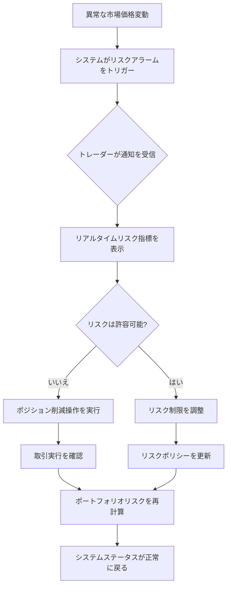
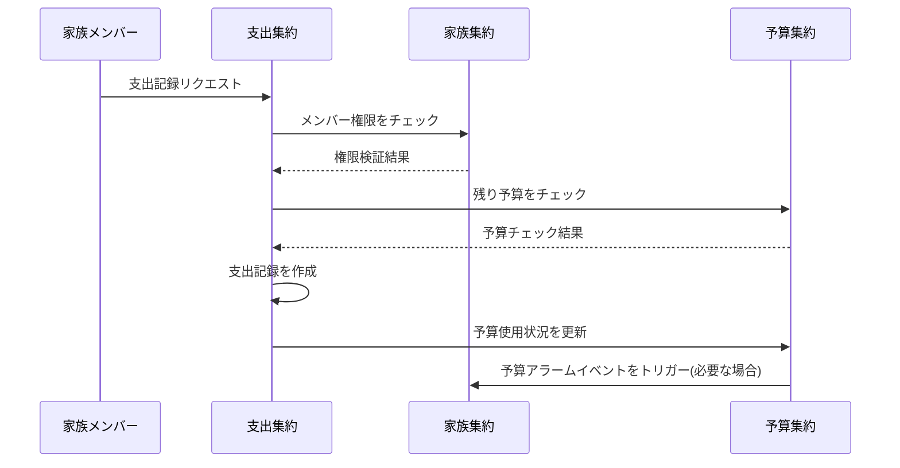
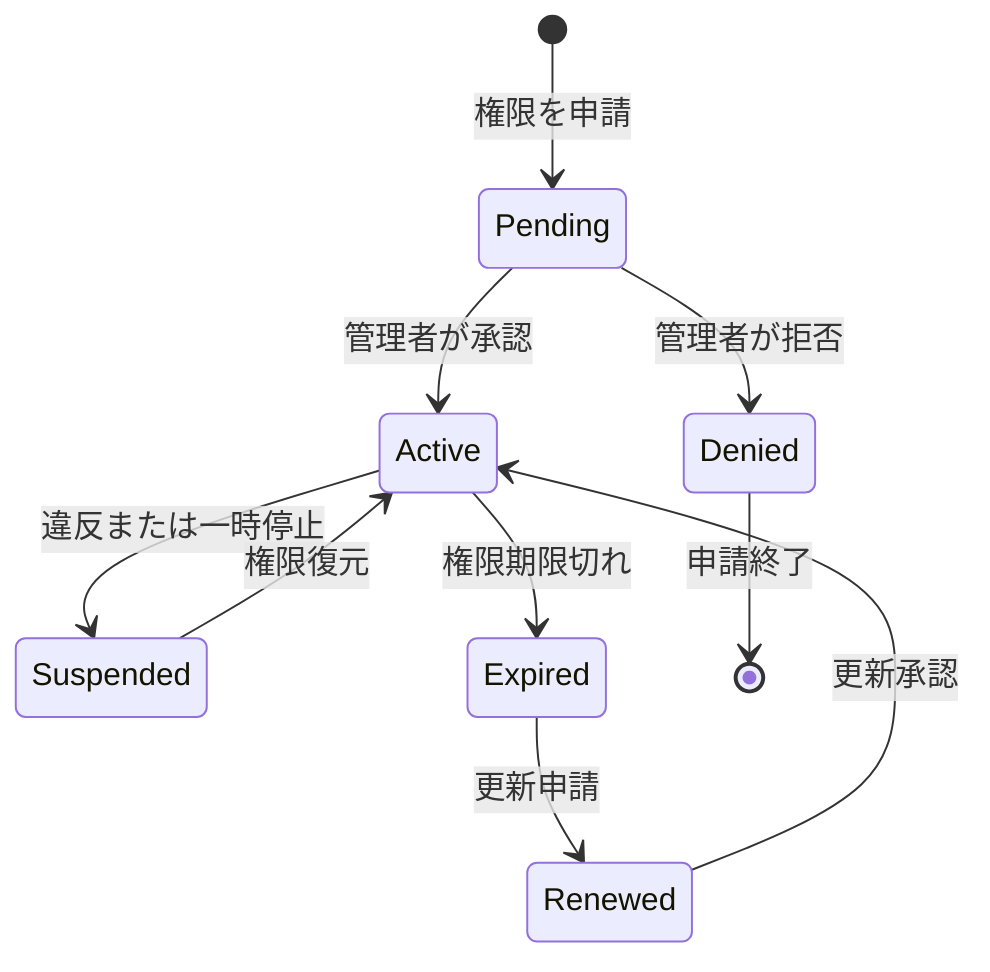

# Day 5 | ユーザーのシステム操作シナリオ - ユーザーストーリーとシナリオフロー

昨日、私たちはドメイン集約の設計を完了し、ビジネスロジックの静的構造を確立しました。しかし、集約は単なる概念的なフレームワークであり、真の価値は**ユーザーがこれらのビジネス概念とどのように相互作用するか**にあります。

今日、私たちは重要な問題を解決する必要があります:**抽象的な集約境界を具体的なユーザー操作体験に変換する方法は?**

これは単なるユーザーストーリーの記述スキルの問題ではなく、**システム視点からユーザー視点への哲学的変換**です。複雑なビジネスロジックを直感的で操作可能なものにし、明日のAWSサービス選択のための明確な技術要件を提供する必要があります。

## ユーザーストーリーの本質:機能から体験へ

### ユーザーストーリーの価値の再定義

従来のユーザーストーリーは、機能の説明で終わることが多いです:

```
投資家として、私は現在の投資状況を理解するために保有資産を表示したい。
```

しかし、DDD集約設計に基づくユーザーストーリーは、**ビジネス価値と操作コンテキスト**を反映する必要があります:

```
プロフェッショナルトレーダーとして、私は30秒以内に保有資産の完全なリスク分析を取得する必要があります。
これにより、市場が変動したときにポジションを増やすか減らすかを迅速に決定でき、
ポートフォリオのリスクが常に管理可能な範囲内にあることを保証します。
```

違いは:

- **役割の具体化**:「投資家」から「プロフェッショナルトレーダー」へ
- **時間制約**:30秒という明確なパフォーマンス要件
- **ビジネス目標**:単なる情報表示ではなくリスク管理
- **操作コンテキスト**:市場変動下での迅速な意思決定

### ユーザーストーリーの三層アーキテクチャ

**レイヤー1:役割識別レイヤー** - 集約所有権に基づく役割定義
**レイヤー2:操作コンテキストレイヤー** - 集約状態変化に基づくシーン設計
**レイヤー3:技術制約レイヤー** - 非機能要件に基づくシステム制限

6つのケースを使用して詳細な分析を行います:

## ケース1:投資取引システムのユーザーストーリー設計

### ポートフォリオ集約に基づく役割システム

昨日、私たちはポートフォリオ集約を設計しました。今日、この集約に基づいてユーザーロールを定義する必要があります:

```typescript
// ポートフォリオ集約のレビュー
class Portfolio {
  private portfolioId: PortfolioId;
  private traderId: TraderId; // ← 役割識別の基礎
  private holdings: Holdings[];
  private riskLimit: RiskLimit; // ← 役割権限の具現化
}
```

**役割権限マトリックス**:

| 役割 | ポートフォリオ所有権 | 操作権限 | 技術要件 |
| --- | --- | --- | --- |
| **プライマリトレーダー** | 完全所有権 | すべての操作のCRUD | < 100msレスポンス |
| **リスクマネージャー** | 読み取り専用アクセス | 表示 + リスク調整 | リアルタイムモニタリング |
| **コンプライアンスオフィサー** | 監査アクセス | 表示 + レポート生成 | 履歴データアクセス |
| **システム管理者** | 技術アクセス | システムステータス管理 | 運用ダッシュボード |

### エピック分解:集約機能からユーザーストーリーへ

**エピック:ポートフォリオ管理**

ポートフォリオ集約のコア機能に基づいて、以下のユーザーストーリーを分解します:

**ストーリー1:リアルタイム保有資産表示**

```
プロフェッショナルトレーダーとして、
私はいつでもリアルタイムの保有資産状況と損益状況を表示する必要があります。
これにより、現在の投資パフォーマンスとリスクエクスポージャーを迅速に評価できます。

受入基準:
- 保有資産データの遅延は5秒を超えない
- リアルタイム損益計算を含む
- 複数通貨表示をサポート
- 資産クラスまたは地域別にグループ化可能

技術制約:
- APIレスポンス時間 < 100ms
- 2000+の同時クエリをサポート
- データ整合性要件:強整合性
```

**ストーリー2:リスク制限管理**

```
プロフェッショナルトレーダーとして、
私はポートフォリオのリスク制限を設定および調整する必要があります。
これにより、取引行動がリスク許容度と投資戦略に沿っていることを保証できます。

受入基準:
- 総ポジション制限、単一銘柄ウェイト制限、業種集中度制限を設定可能
- 変更の有効時間 < 1分
- リスク制限違反のリアルタイム警告を提供
- 異なる期間(日/週/月)の制限設定をサポート

技術制約:
- 設定変更には強整合性が必要
- リスク計算の遅延 < 200ms
- 複雑な多次元リスクルールをサポート
```

**ストーリー3:高速取引実行**

```
プロフェッショナルトレーダーとして、
私は市場機会が生じたときに直ちに取引注文を実行する必要があります。
これにより、瞬間的な価格優位性を捉え、投資収益を最大化できます。

受入基準:
- 注文から確認までの時間 < 2秒
- 成行注文と指値注文をサポート
- 取引前の自動リスクチェック
- 実行失敗時の明確なエラーメッセージ提供

技術制約:
- 取引システムの高可用性 > 99.99%
- ピーク取引量5000 TPSをサポート
- 外部ブローカーAPIとの統合
```

### 操作フローのシナリオ設計

**シナリオ:異常な市場変動下での迅速なリスク調整**



**シナリオに対応するユーザーストーリーセット**:

- リスクモニタリングとアラーム(バックグラウンド自動実行)
- リアルタイムリスク指標表示(クエリ操作)
- 高速ポジション削減取引(書き込み操作)
- リスクポリシー調整(設定操作)

各操作は異なる技術要件に対応し、明日のAWSサービス選択の基礎を提供します。

## ケース2:家族財務システムの協調ユーザーストーリー

### 複数集約協調に基づく複雑な役割設計

昨日、私たちは3つの集約を設計しました:家族、予算、支出。今日、それらの間の協調シナリオを処理する必要があります:

**複数役割協調のユーザーストーリーパターン**:

**ストーリー:家族予算の協調管理**

```
家族財務の責任者として、
私は異なる家族メンバーに支出権限と予算制限を設定する必要があります。
これにより、家族の財務透明性を維持しながら、支出行動が管理可能な範囲内にあることを保証できます。

主要アクター:家族財務責任者
副次アクター:
- 家族メンバー(管理される側)
- システム自動化サービス(予算モニタリング)

メインフロー:
1. 責任者が月間家族総予算を設定(家族集約)
2. 各メンバーに支出制限とカテゴリー権限を割り当て(家族集約 → 予算集約)
3. システムが関連メンバーに権限設定通知を送信(集約間イベント)
4. メンバーが承認範囲内で支出記録を開始(支出集約)
5. システムが予算使用状況をリアルタイムでモニタリング(予算集約モニタリング)
6. 予算が制限に近づいたときに関係者に自動通知(イベント駆動通知)

技術制約:
- 権限設定の強整合性(超過支出の競合状態を回避するため)
- 支出記録の高同時実行性(複数のメンバーが同時に記録)
- 準リアルタイムの予算モニタリング(遅延 < 5分は許容可能)
```

### 権限マトリックスの状態管理

**家族集約の権限状態設計**:

```typescript
class FamilyMember {
  constructor(
    public memberId: MemberId,
    public role: FamilyRole, // ADMIN | MEMBER | CHILD
    public spendingLimit: Money, // 支出権限
    public categories: Category[], // 支出可能カテゴリー
    public status: MemberStatus // ACTIVE | SUSPENDED | PENDING
  ) {}
}

enum FamilyRole {
  ADMIN = "ADMIN", // すべてのルールを設定可能
  MEMBER = "MEMBER", // 支出記録可能、自分のデータを表示可能
  CHILD = "CHILD", // 制限された支出権限
}
```

**集約間権限チェックフロー**:



## ケース3:健康モニタリングシステムのデータ駆動ストーリー

### 時系列データに基づく状態シナリオ

健康モニタリングシステムには独自のデータ特性があります:**連続性**と**異常性**の共存。

**ストーリー:異常データのインテリジェント処理**

```
健康モニタリングユーザーとして、
私はシステムが異常な健康データを自動的に識別し、対応する提案と警告を提供する必要があります。
これにより、生活習慣を適時に調整したり、医療機関を受診したりして、健康の継続的な改善を保証できます。

複雑なシナリオ:
- 正常データ:自動記録、定期分析
- ボーダーラインデータ:システムがユーザーに確認を促す
- 異常データ:即座に警告、推奨アクションを提示
- 継続的異常:警告をエスカレート、医療受診を推奨

状態遷移シナリオ:
正常 → ボーダーライン → ユーザー確認またはシステム自動判定 → 正常/異常
異常 → 継続監視 → 持続的異常/正常に復帰
持続的異常 → 医療受診推奨 → 保留中/処理済み
```

**同時複数状態の技術的課題**:

```typescript
// HealthProfile集約の状態管理
class HealthMetric {
  constructor(
    public metricType: MetricType,
    public currentValue: number,
    public status: HealthStatus,
    public trend: TrendAnalysis,
    public alertLevel: AlertLevel
  ) {}
}

enum HealthStatus {
  NORMAL = "NORMAL",
  BORDERLINE = "BORDERLINE",
  ABNORMAL = "ABNORMAL",
  CRITICAL = "CRITICAL",
}

enum AlertLevel {
  NONE = "NONE",
  INFO = "INFO", // データ記録通知
  WARNING = "WARNING", // ボーダーライン値警告
  URGENT = "URGENT", // 異常値緊急通知
}
```

## 役割管理:集約に基づく権限アーキテクチャ

### 権限設計のDDD原則

**原則1:集約所有権が基本権限を決定する**

- ポートフォリオ集約のオーナーは完全な制御権を持つ
- 家族集約の管理者はメンバー管理権を持つ
- HealthProfile集約のオーナーはデータ制御権を持つ

**原則2:集約間操作には明示的な承認が必要**

- 注文集約への操作にはポートフォリオ集約からの承認が必要
- 支出集約の作成には家族集約からの承認が必要
- DeviceReading集約の作成にはHealthProfile集約からの承認が必要

**原則3:役割権限はビジネスロジックに対応する**

```typescript
// 集約に基づく権限設計
interface Permission {
  aggregateType: string;
  aggregateId: string;
  operations: Operation[];
  constraints: Constraint[];
}

interface Operation {
  type: "CREATE" | "READ" | "UPDATE" | "DELETE";
  fields?: string[]; // フィールドレベル権限
  conditions?: string[]; // 条件制限
}

// 実際の権限設定
const traderPermissions: Permission[] = [
  {
    aggregateType: "Portfolio",
    aggregateId: "portfolio-123",
    operations: [
      { type: "READ", fields: ["*"] },
      { type: "UPDATE", fields: ["holdings", "riskLimit"] },
      { type: "CREATE", fields: ["tradeOrder"] },
    ],
    constraints: [
      "trading_hours_only",
      "risk_limit_check",
      "compliance_approval_for_large_orders",
    ],
  },
  {
    aggregateType: "Order",
    aggregateId: "*", // 自分が作成したすべての注文を操作可能
    operations: [
      { type: "READ", fields: ["*"] },
      {
        type: "UPDATE",
        fields: ["status"],
        conditions: ["only_pending_orders"],
      },
    ],
    constraints: ["no_modification_after_submission"],
  },
];
```

### 動的権限の状態管理

**権限状態のライフサイクル**:



**技術実装の考慮事項**:

- 権限変更のリアルタイム有効性(強整合性要件)
- 権限チェックの高パフォーマンス(すべてのAPI呼び出しでチェック)
- 権限履歴のトレーサビリティ(コンプライアンスと監査要件)

## ステータスシナリオ:集約状態に駆動される操作シナリオ

### 状態シナリオの設計方法論

各集約の状態変化は、対応するユーザー操作シナリオを生成します:

**投資取引システムの状態シナリオ分析**:

```mermaid
graph TB
    subgraph "ポートフォリオ集約状態"
        PS1[空のポートフォリオ] --> PS2[アクティブポートフォリオ]
        PS2 --> PS3[リスク超過ポートフォリオ]
        PS3 --> PS2
        PS2 --> PS4[清算中ポートフォリオ]
        PS4 --> PS1
    end

    subgraph "注文集約状態"
        OS1[下書き] --> OS2[提出済み]
        OS2 --> OS3[実行中]
        OS2 --> OS4[拒否]
        OS3 --> OS5[実行完了]
        OS3 --> OS6[部分実行]
        OS6 --> OS5
    end

    subgraph "集約間調整"
        PS2 -.-> OS1: 取引を作成
        OS5 -.-> PS2: 保有資産を更新
        PS3 -.-> OS4: 高リスク取引を拒否
    end
```

**各状態のユーザーストーリー**:

**ポートフォリオ空 → アクティブ**:

```
ストーリー:投資ポートフォリオの初期化
新規ユーザーとして、私は初期資金とリスク選好を設定する必要があります。
これにより、投資活動を開始できます。

操作フロー:
1. 初期現金額を設定
2. リスク制限パラメータを設定
3. 投資戦略テンプレートを選択
4. ポートフォリオ初期化を確認

技術要件:
- 初期化操作のアトミック性
- リスクパラメータの妥当性検証
- ユーザーガイダンスフローの使いやすさ
```

**アクティブポートフォリオ → リスク超過ポートフォリオ**:

```
ストーリー:リスク超過の自動処理
システムとして、私はポートフォリオリスクが超過したときに自動的に保護措置を講じる必要があります。
これにより、ユーザーの潜在的な損失を軽減できます。

自動化フロー:
1. ポートフォリオリスク指標のリアルタイムモニタリング
2. リスク超過状況の識別
3. 高リスク取引権限の停止
4. ユーザーとリスク管理者への通知
5. リスク削減提案の提供

技術要件:
- リアルタイムリスク計算(< 30秒)
- 権限制御の即座の有効化
- 多チャネル通知の信頼性
```

### 複雑な状態シナリオの処理戦略

**家族財務システムの複数役割状態調整**:

```
シナリオ:予算がほぼ使い果たされたときの家族調整
初期状態:家族予算が10%残っている
トリガー条件:メンバーが大きな支出を記録しようとする

状態遷移フロー:
1. 予算集約が予算逼迫を検出
2. システムがすべてのメンバーの支出権限を停止
3. 家族管理者に予算調整の処理を通知
4. 管理者が選択:予算を増やす OR 制限を維持
5. システムが決定に応じてすべてのメンバーの権限を更新
6. 通常の支出プロセスを再開

集約間調整の技術的課題:
- 複数集約状態の整合性保証
- 権限変更のアトミック操作
- 状態復元の信頼性メカニズム
```

## AWSサービス選択のための要件基盤の提供

### ユーザーストーリーから技術制約へのマッピング

今日のユーザーストーリー分析を通じて、明日のAWSサービス選択のための明確な技術要件を提供しました:

**高頻度リアルタイム操作要件**(投資取引):

- APIレスポンス時間:< 100ms
- 同時実行サポート:2000+ TPS
- 可用性要件:99.99%
- データ整合性:強整合性

→ **明日議論予定**:Lambda vs ECSの選択基準

**協調データ操作要件**(家族財務):

- 複数ユーザー同時実行:中頻度だが競合処理が必要
- 権限チェック:すべての操作で必要
- データ整合性:結果整合性で許容可能
- コスト重視:家族ユーザーは価格に敏感

→ **明日議論予定**:ALB + Auto Scalingのコスト最適化戦略

**データ集約処理要件**(健康モニタリング):

- データ取り込み:IoTデバイスからの連続データストリーム
- ストレージ要件:時系列データの長期保存
- 分析要件:トレンド分析と異常検出
- 地理的分散:ユーザーは異なる地域に分散

→ **明日議論予定**:CDN + マルチリージョンデプロイメントのトレードオフ

### 操作モードがアーキテクチャパターンに与える影響

**同期操作モード** → 低レイテンシサービスが必要
**非同期操作モード** → より高いレイテンシを許容可能
**バッチ操作モード** → 高スループットサービスが必要
**リアルタイム協調モード** → 状態同期メカニズムが必要

各操作モードは異なるAWSサービスの組み合わせに対応し、これが明日の議論の核心となります。

## 明日の技術選択のプレビュー

今日確立したユーザーストーリーと操作シナリオ分析に基づいて、明日は以下について詳しく議論します:

### 🏗️ サービス選択におけるトレードオフの技術

**Lambda vs ECS**:

- いつServerlessを選択すべきか?いつContainerを選択すべきか?
- 操作頻度とレスポンス時間に基づく選択マトリックス

**ALB vs API Gateway**:

- 異なる負荷パターンが選択にどのように影響するか?
- コストモデルの詳細比較と分析

**リージョナル vs グローバルデプロイメント**:

- ユーザー分布がアーキテクチャ戦略にどのように影響するか?
- CDNとエッジコンピューティングのユースケース

### 💰 コスト制御戦略

**インスタンスタイプの最適化**:

- スポットインスタンスのリスク評価
- リザーブドインスタンスのコミットメント戦略
- オンデマンドの弾力的バランス

**DDoS保護レベル**:

- 異なるビジネスシナリオの保護要件
- Shield Standard vs Shield Advancedの選択

## 今日の設計ポイント

- **ユーザーストーリーは集約機能の具体的な表現**:優れたストーリーは集約のビジネス価値を反映する
- **役割権限は集約境界に基づいて設計される**:技術権限はビジネス概念に対応すべき
- **状態シナリオが操作体験を駆動する**:各状態遷移はユーザージャーニーである
- **操作コンテキストが技術選択を決定する**:異なる使用パターンには異なる技術戦略が必要

覚えておいてください:今日確立したのは機能リストではなく、操作体験の完全な説明です。これらの説明は明日の技術アーキテクチャの決定を直接駆動し、選択するAWSサービスがユーザーの操作ニーズを真に満たすことを保証します。

---

> 「ユーザーストーリーは機能のリストではなく、体験の設計です。各ストーリーは、ユーザーがシステムの集約と相互作用する完全なシナリオであり、これらのシナリオの技術要件が私たちのアーキテクチャの選択を決定します。」
