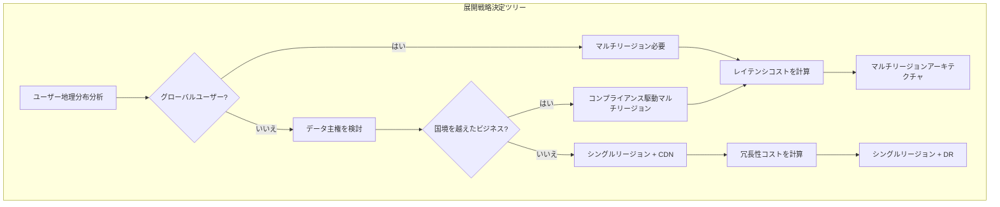

# Day 6 | トレードオフの芸術としてのコスト管理:クラウドアーキテクチャにおけるインスタンス選択

昨日、私たちは完全なUser Storyフレームワークを確立し、抽象的な集約設計を具体的な運用シナリオに変換しました。各Storyには明確な技術的制約が含まれています:投資取引システムは100ms未満のレスポンスが必要、家計管理システムは協調的な競合の処理が必要、健康モニタリングシステムはIoTデータストリームの処理が必要です。

今日私たちが直面する中核的な課題は:**これらの技術要件を満たしながら、どのように最適なコスト管理を実現するか?**

これは単なるサービス選択の技術的な問題ではなく、**ビジネス価値と技術コストの哲学的トレードオフ**です。すべてのアーキテクチャ上の決定の背後には根本的な問いがあります:パフォーマンス、信頼性、柔軟性のために、私たちはどれだけの対価を支払う意思があるのか?

## コストトレードオフの哲学的基盤:価値最大化の原則

### 「コスト」の意味の再定義

クラウドアーキテクチャにおいて、コストは単なる月々の請求書ではなく、**多次元リソースの包括的なトレードオフ**です:

**直接コスト**:

- コンピュートリソース費用(EC2、Lambda実行時間)
- ストレージ費用(S3、EBS、データ転送)
- ネットワーク費用(CloudFront、リージョン間転送)

**暗黙のコスト**:

- 開発・保守コスト(チームの時間、複雑性管理)
- 機会費用(プランBではなくプランAを選択した場合の潜在的な利益)
- リスクコスト(可用性損失、セキュリティ脆弱性、ベンダーロックイン)

**時間コスト**:

- Time to Market(製品投入速度)
- 技術的負債の蓄積(将来のリファクタリングコスト)
- チームの学習曲線(新技術への適応時間)

### Day 5の要件に基づくコストモデル設計

昨日確立した3つの典型的な要件パターンを振り返ると、各パターンは異なるコスト感度に対応しています:

**投資取引システム:パフォーマンス優先モデル**

- コスト感度:低(パフォーマンス損失のコストはインフラコストをはるかに超える)
- 最適化目標:レイテンシ最小化 > 可用性最大化 > コスト管理
- トレードオフ戦略:パフォーマンス不足よりも過剰プロビジョニングの方が良い

**家計管理システム:コスト重視モデル**

- コスト感度:高(ユーザーの支払い能力が限定的)
- 最適化目標:コスト管理 > 基本機能充足 > パフォーマンス向上
- トレードオフ戦略:基本要件を満たしながらコストを最小化

**健康モニタリングシステム:バランス最適化モデル**

- コスト感度:中(B2B2Cモデル、ユーザー体験とビジネスの実行可能性のバランスが必要)
- 最適化目標:安定性 > コスト管理 > 高度な機能
- トレードオフ戦略:コア機能への高投資、エッジ機能のコスト最適化

## ECS vs Lambda:コンピュートサービスにおけるトレードオフの芸術

### 決定マトリクス:運用モードからサービス選択へ

昨日のUser Story分析に基づいて、詳細なコンピュートサービス選択マトリクスを確立しました:

**Lambda適用性判断**:

| 評価次元 | Lambda有利閾値 | 投資取引 | 家計管理 | 健康モニタリング |
| --- | --- | --- | --- | --- |
| 実行頻度 | < 1000回/時間 | ❌ 高頻度取引 | ✅ 断続的記録 | ✅ 定期分析 |
| 実行時間 | < 15分 | ✅ ミリ秒レベル取引 | ✅ 簡単な計算 | ⚠️ ビッグデータ分析 |
| 同時実行要件 | < 1000並行 | ❌ 2000+ TPS | ✅ 家族規模 | ✅ 限定デバイス数 |
| 状態管理 | ステートレス | ⚠️ 複雑な取引状態 | ✅ 各操作が独立 | ✅ データストリーム処理 |
| コールドスタート許容度 | > 100ms | ❌ <50ms要件 | ✅ ユーザーは待てる | ✅ バックグラウンド処理 |

**ECS適用性判断**:

| 評価次元 | ECS有利閾値 | 投資取引 | 家計管理 | 健康モニタリング |
| --- | --- | --- | --- | --- |
| 長時間実行 | > 1時間 | ✅ 市場時間運用 | ❌ オンデマンド使用 | ⚠️ ハイブリッドモード |
| 複雑な依存関係 | マルチサービス連携 | ✅ マルチ集約協働 | ❌ 単一機能 | ✅ IoTデータパイプライン |
| リソース予測可能性 | 安定負荷 | ✅ 固定取引時間 | ❌ ランダム使用 | ⚠️ デバイス数増加 |
| コスト管理 | 高利用率 | ✅ プロユーザー支払い | ❌ コスト重視 | ⚠️ 規模の経済 |

### ハイブリッドアーキテクチャ設計戦略

**投資取引システム:ECS主体 + Lambda補完**

```yaml
# コア取引サービス:ECS Fargate
TradingCore:
  Service: ECS Fargate
  Reason: "継続的運用、低レイテンシ、状態管理"
  Configuration:
    CPU: 2 vCPU
    Memory: 4 GB
    MinCapacity: 2
    MaxCapacity: 10
    TargetCPU: 70%

# 補助機能:Lambda
TradingSupport:
  PriceAlert:
    Service: Lambda
    Reason: "イベント駆動、断続的実行"
    Memory: 512 MB
    Timeout: 30s

  ReportGeneration:
    Service: Lambda
    Reason: "非リアルタイム、コンピュート集約的"
    Memory: 3008 MB
    Timeout: 15 min
```

**家計管理システム:Lambda優先戦略**

```yaml
# 完全サーバーレスアーキテクチャ
FamilyFinance:
  ExpenseRecord:
    Service: Lambda
    Memory: 256 MB
    Timeout: 10s
    ConcurrentExecutions: 100

  BudgetCheck:
    Service: Lambda
    Memory: 512 MB
    Timeout: 30s

  MonthlyReport:
    Service: Lambda
    Memory: 1024 MB
    Timeout: 5 min

# コスト最適化設定
CostOptimization:
  ProvisionedConcurrency: 0 # コールドスタートは許容可能
  ReservedCapacity: false # 使用パターンが固定されていない
  SpotInstances: N/A # Lambdaが自動管理
```

**健康モニタリングシステム:階層型ハイブリッドアーキテクチャ**

```yaml
# データ取り込み層:Lambda
DataIngestion:
  IoTDataProcessor:
    Service: Lambda
    Memory: 256 MB
    Timeout: 1 min
    EventSource: IoT Core

# 分析・処理層:ECS
Analytics:
  TrendAnalysis:
    Service: ECS Fargate
    CPU: 1 vCPU
    Memory: 2 GB
    Schedule: "cron(0 2 * * ? *)" # 毎日午前2時

# アラートサービス:Lambda
Alerting:
  AbnormalDetection:
    Service: Lambda
    Memory: 1024 MB
    Timeout: 30s
    EventSource: DynamoDB Streams
```

### コスト計算モデル

**Lambdaコスト計算**:

```
月間コスト = (実行回数 × 平均実行時間 × メモリ割り当て × Lambda単価) + (リクエスト数 × リクエスト単価)

家計管理システムの例:
- 実行回数: 100,000回/月
- 平均実行時間: 200ms
- メモリ: 256MB
- コスト: 約$2.4/月
```

**ECSコスト計算**:

```
月間コスト = (vCPU × CPU時間 × CPU単価) + (メモリGB × メモリ時間 × メモリ単価)

投資取引システムの例:
- 構成: 2 vCPU、4GB RAM
- 稼働時間: 12時間/日(取引時間)
- 月間コスト: 約$58/月
```

## ALB戦略:ロードバランシングのコストインテリジェンス

### ロードバランサー選択のビジネスロジック

異なるシステム特性は異なるロードバランシング戦略を決定します:

**Application Load Balancer vs Network Load Balancer**:

| 機能比較 | ALB | NLB | 投資取引 | 家計管理 | 健康モニタリング |
| --- | --- | --- | --- | --- | --- |
| レイテンシパフォーマンス | ~100ms | ~1ms | ✅ NLB必要 | ❌ ALBで十分 | ❌ ALBで十分 |
| レイヤー7機能 | サポート | 非サポート | ✅ ルーティング必要 | ✅ ルーティング必要 | ⚠️ 基本要件 |
| TLSターミネーション | サポート | サポート | ✅ 必須 | ✅ 必須 | ✅ 必須 |
| コスト | 高い | 低い | ✅ パフォーマンス優先 | ❌ コスト重視 | ⚠️ バランス考慮 |

**投資取引システムのALB設定**:

```yaml
TradingALB:
  Type: Application Load Balancer
  Scheme: internet-facing

  Listeners:
    HTTPS:443:
      DefaultAction: forward-to-trading-core
      Rules:
        - Condition: path-pattern("/api/market/*")
          Action: forward-to-market-data-service
          Priority: 100
        - Condition: path-pattern("/api/orders/*")
          Action: forward-to-order-service
          Priority: 200

  TargetGroups:
    trading-core:
      Protocol: HTTP
      Port: 8080
      HealthCheck:
        Path: /health
        Interval: 10s
        Timeout: 5s
        HealthyThreshold: 2

  # コスト最適化設定
  CrossZoneLoadBalancing: true # トラフィックを分散してホットスポットを回避
  DeletionProtection: true # 誤削除を防止
  AccessLogs:
    Enabled: true
    S3Bucket: trading-alb-logs
    # ユーザー行動を分析してルーティング戦略を最適化
```

**家計管理システムのコスト最適化ALB**:

```yaml
FamilyFinanceALB:
  Type: Application Load Balancer
  Scheme: internet-facing

  # コスト最適化戦略
  IdleTimeout: 60s # 接続時間を削減

  TargetGroups:
    serverless-backend:
      Protocol: HTTP
      Port: 80
      TargetType: lambda # Lambdaと直接統合
      HealthCheck:
        Path: /health
        Interval: 30s # ヘルスチェック頻度を削減

  # 節約設定
  AccessLogs:
    Enabled: false # ログを無効化してストレージコストを節約

  SecurityGroups:
    - family-finance-sg
    # 最小特権の原則でセキュリティリスクコストを削減
```

### Auto Scalingのコスト管理

**ターゲット追跡に基づくインテリジェントスケーリング**:

```yaml
AutoScalingPolicy:
  投資取引システム:
    MetricType: ALBRequestCountPerTarget
    TargetValue: 1000 # インスタンスあたり1000 RPS
    ScaleOutCooldown: 60s # 急激なトラフィックに対応する高速スケーリング
    ScaleInCooldown: 300s # 振動を避けるための低速スケーリング

  家計管理システム:
    MetricType: CPUUtilization
    TargetValue: 50% # コスト管理のために低いCPUターゲット
    ScaleOutCooldown: 300s # 低速スケーリング、ユーザーは待てる
    ScaleInCooldown: 600s # 頻繁な調整を避けるための低速スケーリング
```

## DDoS保護:セキュリティ投資のROI計算

### 保護レベルのビジネス価値分析

異なるシステムはDDoS攻撃に対する脆弱性と損失許容度が大きく異なります:

**AWS Shield保護レベル選択**:

| 保護レベル | コスト | 投資取引 | 家計管理 | 健康モニタリング |
| --- | --- | --- | --- | --- |
| Shield Standard | 無料 | ❌ 不十分 | ✅ 基本的に十分 | ⚠️ 規模による |
| Shield Advanced | $3000/月 | ✅ 必要な投資 | ❌ 高すぎる | ⚠️ B2Bなら検討可 |

**投資取引システム:Shield Advanced + WAF**

```yaml
DDoSProtection:
  Shield: Advanced
  Cost: $3000/月

  Justification: |
    1時間の取引中断による潜在的損失:
    - ユーザー取引損失: 平均$50K
    - ブランド評判損失: 定量化不可能だが巨大
    - 規制コンプライアンスリスク: 規制当局の処罰の可能性

    保護コスト vs. リスク損失 = 1:15+のROI

  WAF Rules:
    - RateLimiting: IPあたり100 req/分
    - GeoBlocking: 高リスク地域の制限
    - SQLInjection: 自動検出とブロック
    - CustomRules: 取引パターンに基づく異常検出
```

**家計管理システム:Shield Standard + CloudFlare**

```yaml
DDoSProtection:
  Shield: Standard (無料)
  CloudFlare: Pro ($20/月)

  Justification: |
    家族ユーザーの攻撃リスクは低く、損失は限定的:
    - 単一ユーザーデータの価値: 比較的低い
    - ダウンタイムの影響: ユーザーは後で使用可能
    - 攻撃動機: 標的型攻撃の確率が低い

    コスト管理が優先、基本保護で十分

  Protection Strategy:
    - CloudFlareプロキシで実IPを隠す
    - 基本的なRate Limiting
    - Browser Integrity Check
    - 疑わしいトラフィックへのチャレンジ通過
```

**健康モニタリングシステム:階層型保護戦略**

```yaml
DDoSProtection:
  Core Services: Shield Standard
  API Endpoints: WAF ($1-5/月)
  IoT Endpoints: IoT Device Defender

  Risk Assessment: |
    医療データは機密だが攻撃面は分散している:
    - IoTデバイス数は多いが、ポイントあたりの価値は低い
    - ユーザー健康データは機密で保護が必要
    - B2B顧客は安定性に要件がある

    中レベルの保護、コアAPIの保護に焦点
```

## リージョン展開:地理的分散のコスト考慮

### マルチリージョン展開の決定フレームワーク

**シングルリージョンとマルチリージョンのトレードオフ**:



**投資取引システム:低レイテンシマルチリージョン**

```yaml
RegionalDeployment:
  Primary: us-east-1      # 米国東部(取引量最大)
  Secondary: eu-west-1    # 欧州ユーザー
  AsiaSpecific: ap-northeast-1  # アジア市場時間

  Architecture:
    - Active-Active: コア取引サービス
    - Cross-Region Replication: DynamoDB Global Tables
    - Regional Market Data: ローカライズされたデータソース

  Cost Impact:
    Infrastructure: +200% (3リージョン)
    Data Transfer: $0.02/GB リージョン間
    Latency Benefit:
      - US-EU: 150ms → 20ms
      - US-Asia: 200ms → 30ms

    Business Justification:
      レイテンシ1ms改善ごと = 取引成功率0.1%向上
      年間取引額$1B × 0.3%向上 = $3M収益
      インフラコスト増加: $200K/年
      ROI: 15:1
```

**家計管理システム:シングルリージョン + CDN戦略**

```yaml
RegionalDeployment:
  Primary: us-east-1      # コスト削減のためシングルリージョン

  Global Access:
    CloudFront: 静的リソースのグローバルCDN
    Route53: インテリジェントDNSルーティング

  Cost Optimization:
    Regional: $100/月
    vs Multi-Region: $400/月

    CDN: $20/月
    Total Savings: 70%

    Latency Impact:
    - 静的アセット: グローバル<100ms (CDN)
    - APIコール: 100-300ms (許容可能)

    Business Justification:
    家計管理操作はリアルタイムではなく、レイテンシは許容可能
    コスト削減 > パフォーマンス向上の限界利益
```

**健康モニタリングシステム:階層型リージョナル戦略**

```yaml
RegionalDeployment:
  CoreServices:
    Primary: us-east-1
    Disaster Recovery: us-west-2

  DataProcessing:
    Regional: IoTデータをローカルで処理
    - us-east-1: 北米デバイス
    - eu-west-1: 欧州デバイス
    - ap-southeast-1: アジア太平洋デバイス

  Cost Model:
    Core (Single Region): $500/月
    Regional Processing: リージョンあたり$200/月
    Total: $1100/月 vs $1500/月 (フルマルチリージョン)

    Performance Benefit:
    IoTデータ処理レイテンシ: 200ms → 50ms
    Impact: より適時なデバイス応答、ユーザー体験向上
```

## CDNとエッジコンピューティング:コンテンツ配信のコスト最適化

### CDN戦略のROI分析

**CloudFront設定戦略**:

**投資取引システム:パフォーマンス優先CDN**

```yaml
CloudFrontDistribution:
  PriceClass: All Regions # 最高のグローバルパフォーマンス

  CacheBehaviors:
    "/api/static/*":
      TTL: 3600s # 静的データの長期キャッシュ
      Compress: true

    "/api/market/*":
      TTL: 5s # 市場データの短期キャッシュ
      Headers:
        - Authorization # パーソナライズコンテンツ

    "/api/orders/*":
      CachePolicy: CachingDisabled # 取引データのキャッシュなし
      OriginRequestPolicy: CORS-S3Origin

  Cost Analysis:
    Data Transfer: $0.085/GB (Tier 1)
    Requests: $0.0075/10Kリクエスト
    Monthly: ~$500 (高トラフィック)

    Performance Gain:
      - 静的リソース: 200ms → 20ms
      - 市場データ: 100ms → 30ms
      - ユーザー体験の大幅改善、プレミアム価格設定をサポート
```

**家計管理システム:コスト最適化CDN**

```yaml
CloudFrontDistribution:
  PriceClass: US_Europe_Asia  # 高価なリージョンを除外

  CacheBehaviors:
    "/static/*":
      TTL: 86400s            # 24時間長期キャッシュ
      Compress: true

    "/api/*":
      TTL: 300s              # 5分中期キャッシュ

  Cost Analysis:
    Data Transfer: ~$20/月 (低トラフィック)
    Main savings: オリジンサーバー負荷削減

    Origin Server Savings:
    - キャッシュヒット率: 80%
    - サーバー負荷削減: 80%
    - Lambda実行回数削減: 80%
    - 月間節約: $60

    Net Savings: $40/月
```

### エッジコンピューティングの適用シナリオ

**Lambda@Edgeのユースケース**:

```yaml
EdgeComputing:
  投資取引システム:
    Use Case: ユーザー認証と認可
    Function:
      Runtime: Node.js 14
      Memory: 128 MB
      Timeout: 5s

    Business Value:
      - ローカル検証、レイテンシ50ms削減
      - コアサービス負荷削減
      - グローバルユーザー体験向上

  家計管理システム:
    Use Case: A/Bテストと機能フラグ
    Function:
      Runtime: Python 3.9
      Memory: 128 MB
      Timeout: 3s

    Business Value:
      - 動的コンテンツパーソナライゼーション
      - 実験と最適化の低コスト
      - コアサービス変更のデプロイ不要
```

## オンプレミス-クラウドハイブリッド:ハイブリッドクラウドのコストトレードオフ

### ハイブリッドアーキテクチャの適用シナリオ

**投資取引システム:重要データのローカライゼーション**

```yaml
HybridArchitecture:
  Local Components:
    - 取引実行エンジン(低レイテンシ要件)
    - 機密顧客データ(コンプライアンス要件)
    - リアルタイムリスク管理計算(データの国外持ち出し不可)

  Cloud Components:
    - 履歴データ分析(弾力的コンピュート要件)
    - ユーザーインターフェース(グローバルアクセス)
    - ディザスタリカバリ(オフサイトバックアップ)

  Data Sync Strategy:
    - リアルタイム: 取引ステータス同期
    - バッチ: 履歴データETL
    - イベント駆動: ビジネスイベント複製

  Cost Analysis:
    Local Infrastructure: $50K/年
    Cloud Services: $30K/年
    vs Pure Cloud: $80K/年

    Savings: 総コストは同じだが、コンプライアンスとパフォーマンスが向上
```

**健康モニタリングシステム:エッジIoT処理**

```yaml
HybridArchitecture:
  Edge Components:
    - IoTゲートウェイ(データ前処理)
    - ローカルキャッシュ(ネットワーク中断耐性)
    - 緊急アラート(リアルタイム応答)

  Cloud Components:
    - ビッグデータ分析(機械学習)
    - 長期ストレージ(履歴追跡)
    - ユーザーダッシュボード(リモートアクセス)

  Cost Benefits:
    - データアップロードコストを90%削減
    - システム可用性を99%向上
    - クラウドコンピュート需要を70%削減
```

## 明日のアーキテクチャ設計図の準備

### サービス選択決定の文書化

今日の詳細な分析を通じて、各システムの完全なサービス選択決定記録を確立しました:

**アーキテクチャ決定記録(ADR)テンプレート**:

```markdown
## Architecture Decision Record (ADR)

### ADR-001: 投資取引システムのコンピュートサービス選択

**Status**: 承認
**Date**: 2024-09-04
**Deciders**: アーキテクチャチーム

**Context**:
Day 5のUser Story分析に基づいて、投資取引システムには以下が必要:

- APIレスポンス時間 < 100ms
- 2000+ TPSの同時実行サポート
- 99.99%の可用性要件

**Options Considered**:

1. Pure Lambda
2. Pure ECS
3. ハイブリッド(ECS + Lambda)

**Decision**: ハイブリッドアーキテクチャ

- コア取引: ECS Fargate
- サポート機能: Lambda

**Rationale**:

- ECSは継続的運用と低レイテンシを提供
- Lambdaはイベント駆動の補助機能を処理
- コストは高いがパフォーマンス上の利点が大きい

**Consequences**:

- 中程度の開発複雑性
- 運用には2つのシステムが必要
- コストは制御可能でパフォーマンスは最適

**Compliance**:
Day 3で確立された非機能要件を満たす
Day 5で設計されたUser Story運用体験をサポート
```

### コストモデルの定量分析

**3つのシステムのコスト比較概要**:

| システム | 月間コスト | 主要ドライバー | コスト最適化戦略 |
| --- | --- | --- | --- |
| 投資取引 | $2,800 | ECS+Shield Advanced | パフォーマンスROIが投資を正当化 |
| 家計管理 | $150 | Lambda+ALB | 厳格なコスト管理、機能は十分 |
| 健康モニタリング | $800 | ハイブリッドアーキテクチャ + マルチリージョン | オンデマンド弾力性、階層型最適化 |

### 明日のアーキテクチャ設計図の準備要素

今日のサービス選択分析は、明日のアーキテクチャ設計に直接影響します:

**決定された技術スタック**:

- コンピュート層: ECSとLambdaの選択が明確
- ネットワーク層: ALB/NLB設定が決定
- セキュリティ層: DDoS保護レベルが選択
- 配信層: リージョンとCDN戦略が策定

**アーキテクチャパターンの準備**:

- モノリスとマイクロサービスの選択基盤
- 同期 vs 非同期の通信モード
- イベント駆動 vs リクエスト駆動の設計
- Clean Architecture vs 階層型アーキテクチャのトレードオフ

**非機能要件の充足**:

- パフォーマンス: サービス選択がレイテンシとスループットを最適化
- 信頼性: マルチリージョンとバックアップ戦略が決定
- セキュリティ: DDoSとアクセス制御が設定
- コスト: 各選択に明確なROI分析がある

## 明日のアーキテクチャ設計のプレビュー

今日確立したサービス選択基盤に基づいて、明日は以下について詳細に議論します:

### アーキテクチャパターン選択の哲学

- Clean Architecture vs Hexagonal Architectureの適用シナリオ
- マイクロサービス vs モノリスアーキテクチャのビジネス駆動決定
- Event-Driven vs Request-Responseの設計トレードオフ
- CQRS + Event Sourcingの複雑性投資評価

### システム境界分割の芸術

- 集約境界に基づくマイクロサービス分解
- API Gatewayルーティング戦略設計
- サービス間通信のプロトコル選択
- データ一貫性処理戦略

### 可観測性のためのシステム設計

- 監視メトリクスの階層型設計
- 分散トレーシングの実装戦略
- ログ集約と分析システム
- アラートとインシデント対応メカニズム

## 今日のトレードオフの知恵

- **コストは単なるお金ではない**: 時間、複雑性、リスクはすべてコストの次元
- **ビジネス価値が技術選択を駆動する**: すべてのアーキテクチャ決定には明確なROIが必要
- **銀の弾丸は存在しない**: 異なるシステムには異なる最適化戦略が必要
- **決定は文書化が必要**: アーキテクチャ決定記録はチームの重要な資産

覚えておいてください:今日確立したのは最適解ではなく、特定の制約下で最も適切な解決策です。ビジネスの発展と技術の進化に伴い、これらの決定は継続的に評価と調整が必要です。

---

> 「アーキテクチャ設計は制約下の最適化問題です。私たちは完璧な解決策を探しているのではなく、現在の条件下で利益を最大化する選択を探しています。すべてのトレードオフは哲学的判断です:私たちは何のために何を犠牲にしているのか。」
