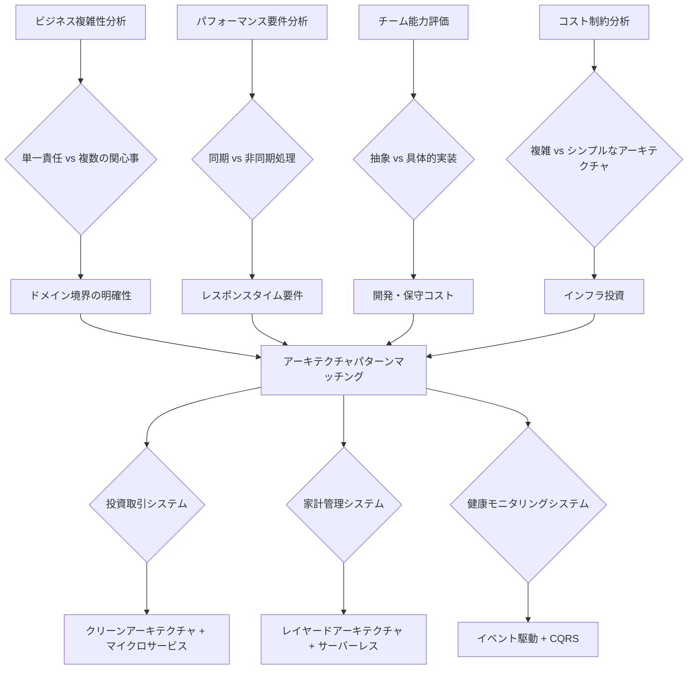
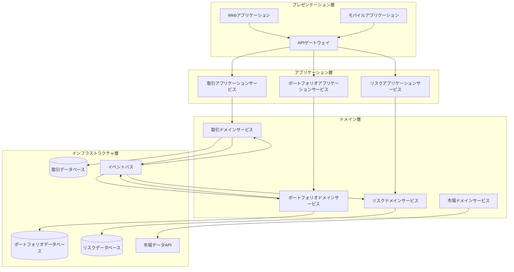
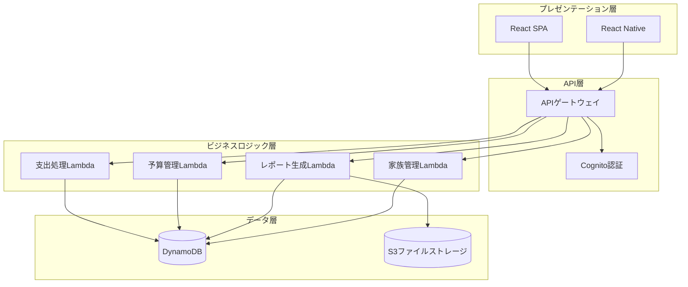
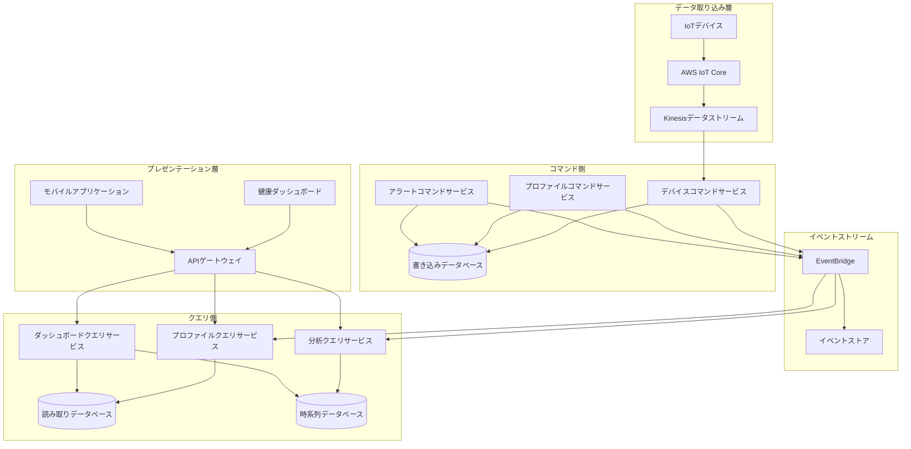
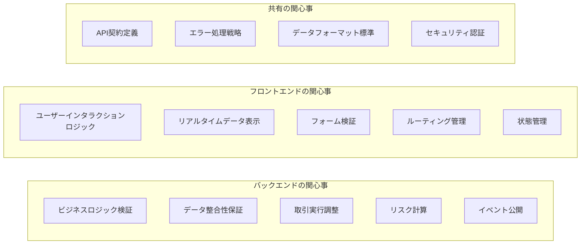

# Day 7 | 最初のシステム設計図の作成: アーキテクチャの選定と設計

6日間の詳細な分析を経て、私たちは完全な設計基盤を確立しました。哲学的思考からドメインモデリング、ユーザーニーズからサービス選定まで。今日解決すべき中核的な問題は次のとおりです。

**これらすべての分析を実行可能なシステムアーキテクチャの青写真にどのように統合するか？**

これは単なる図を描く技術的な問題ではなく、**抽象的思考から具体的な実装へのシステムエンジニアリング**の問題です。すべてのアーキテクチャ決定には明確な演繹的ロジックが必要であり、すべての技術選択はビジネス目標に貢献する必要があります。

## アーキテクチャ選定の体系的方法論

### 要件駆動からアーキテクチャパターンへの演繹的ロジック

過去6日間の分析に基づいて、**アーキテクチャパターンを選定するための意思決定フレームワーク**を確立しました。



### アーキテクチャ適応性評価マトリクス

これまでのユーザーストーリー分析とサービス選定に基づいて、3つのシステムの適応性評価を作成します。

| 評価次元                       | 投資取引 | 家計管理 | 健康モニタリング | 重み付け |
| ----------------------------- | -------- | -------- | --------------- | -------- |
| **ビジネス複雑性**             | 9/10     | 4/10     | 7/10            | 25%      |
| **パフォーマンス要件**         | 10/10    | 3/10     | 6/10            | 30%      |
| **一貫性要件**                 | 10/10    | 5/10     | 7/10            | 20%      |
| **開発リソース**               | 8/10     | 3/10     | 6/10            | 15%      |
| **保守複雑性許容度**           | 8/10     | 2/10     | 5/10            | 10%      |

この評価に基づいて、各システムに最も適したアーキテクチャパターンを導き出すことができます。

Iron Manシリーズでのデータ提示の便宜のため、Mermaidをコード化された表現に使用しています。Mermaidの利点は、ファイルのバージョン管理とGitを使用したドメイン変更への調整が可能であることです。ただし、市場には共通理解のためのシステム設計の可視化とナラティブのためのツールが多数あります。draw.ioも良い選択肢です。

## 投資取引システム: クリーンアーキテクチャ + マイクロサービス設計

### アーキテクチャ選定の演繹プロセス

**なぜクリーンアーキテクチャを選択するのか？**

Day 4の集約設計とDay 5のユーザーストーリー分析に基づいて:

1. **高いビジネス複雑性**: Portfolio、Order、Riskなどの複数の集約には明確な境界が必要です。
2. **厳格なテスト要件**: 金融システムのすべての機能には完全なテストカバレッジが必要です。
3. **頻繁なビジネス変更**: 規制政策と市場ルールは頻繁に変更されるため、安定したアーキテクチャ基盤が必要です。

**なぜマイクロサービスを選択するのか？**

Day 6のサービス選定分析に基づいて:

1. **独立したスケーリングニーズ**: 取引実行、リスク計算、市場データは異なるパフォーマンス特性を持っています。
2. **チームの自律性**: 異なるビジネスドメインは専門チームによって独立して開発・デプロイできます。
3. **障害の分離**: 単一サービスの障害はシステム全体の取引に影響を与えるべきではありません。

### 完全なアーキテクチャ設計



### マイクロサービス境界設計

Day 4の集約境界に基づいて、マイクロサービスの分解を設計します。

**取引サービス**

```yaml
責任: 取引注文のライフサイクルを管理します。
集約: Order、Trade
API:
  - POST /orders # 取引注文を作成
  - GET /orders/{id} # 注文状態を照会
  - PUT /orders/{id}/cancel # 注文をキャンセル

データ所有権:
  - 注文データ
  - 取引実行記録
  - 市場インターフェース設定

公開イベント:
  - OrderCreated
  - OrderExecuted
  - OrderCancelled

消費イベント:
  - PortfolioValidated
  - RiskAssessed
```

**ポートフォリオサービス**

```yaml
責任: ポートフォリオ状態と保有資産を管理します。
集約: Portfolio、Holdings
API:
  - GET /portfolios/{id} # ポートフォリオ詳細を照会
  - PUT /portfolios/{id}/holdings # 保有資産を更新
  - POST /portfolios/{id}/validate # 取引能力を検証

データ所有権:
  - ポートフォリオ基本情報
  - 保有資産詳細データ
  - 現金残高記録

公開イベント:
  - PortfolioValidated
  - PortfolioUpdated
  - HoldingsChanged

消費イベント:
  - OrderExecuted
  - RiskLimitChanged
```

**リスクサービス**

```yaml
責任: リスク評価と制限管理。
集約: RiskProfile、RiskMetric
API:
  - POST /risk/assess # リアルタイムリスク評価
  - GET /risk/profiles/{id} # リスクプロファイルを照会
  - PUT /risk/limits/{id} # リスク制限を更新

データ所有権:
  - リスクパラメータ設定
  - 過去のリスクメトリクス
  - 制限設定記録

公開イベント:
  - RiskAssessed
  - RiskLimitExceeded
  - RiskLimitChanged

消費イベント:
  - PortfolioUpdated
  - MarketVolatilityChanged
```

### クリーンアーキテクチャ実装詳細

**依存性逆転の実装**:

```typescript
// ドメイン層 - 純粋なビジネスロジック
export class Portfolio {
  constructor(
    private portfolioId: PortfolioId,
    private holdings: Holdings[],
    private cashBalance: Money
  ) {}

  validateTrade(
    order: TradeOrder,
    riskAssessment: RiskAssessment
  ): ValidationResult {
    // 純粋なビジネスロジック、外部技術への依存なし
    if (!this.hasSufficientFunds(order)) {
      return ValidationResult.failed("資金不足");
    }

    if (riskAssessment.exceedsLimit()) {
      return ValidationResult.failed("リスク制限超過");
    }

    return ValidationResult.success();
  }
}

// アプリケーション層 - ユースケース調整
export class ValidateTradeUseCase {
  constructor(
    private portfolioRepository: PortfolioRepository, // インターフェース、実装ではない
    private riskService: RiskService, // インターフェース、実装ではない
    private eventPublisher: EventPublisher // インターフェース、実装ではない
  ) {}

  async execute(command: ValidateTradeCommand): Promise<ValidationResult> {
    // ドメインオブジェクトを調整、ビジネスロジックを含まない
    const portfolio = await this.portfolioRepository.findById(
      command.portfolioId
    );
    const riskAssessment = await this.riskService.assess(
      portfolio,
      command.order
    );

    const result = portfolio.validateTrade(command.order, riskAssessment);

    if (result.isValid) {
      await this.eventPublisher.publish(
        new TradeValidatedEvent(command.portfolioId, command.order)
      );
    }

    return result;
  }
}

// インフラストラクチャ層 - 技術実装
export class DynamoDBPortfolioRepository implements PortfolioRepository {
  constructor(private dynamoClient: DynamoDB.DocumentClient) {}

  async findById(portfolioId: PortfolioId): Promise<Portfolio> {
    const params = {
      TableName: "Portfolios",
      Key: { portfolioId: portfolioId.value },
    };

    const result = await this.dynamoClient.get(params).promise();
    return this.mapToDomain(result.Item);
  }
}
```

## 家計管理システム: レイヤードアーキテクチャ + サーバーレス設計

### アーキテクチャ選定の演繹プロセス

**なぜレイヤードアーキテクチャを選択するのか？**

1. **比較的シンプルなビジネスロジック**: 主にCRUD操作と基本的なビジネスルール検証。
2. **限られた開発リソース**: 迅速な開発と市場投入が必要で、チームサイズが小さい。
3. **保守コストに敏感**: 長期的な保守にはシンプルで理解しやすいアーキテクチャが必要。

**なぜサーバーレスを選択するのか？**

Day 6のコスト分析に基づいて:

1. **不規則な利用パターン**: 家族ユーザーのアクセスパターンは大きく異なります。
2. **コスト管理の優先**: Lambdaの従量課金モデルがコスト要件に最適です。
3. **運用の簡素化**: サーバー管理が不要で、運用の複雑性が軽減されます。

### 簡素化されたアーキテクチャ設計



### レイヤードアーキテクチャ実装

**簡素化された3層構造**:

```typescript
// プレゼンテーション層 - APIハンドラー
export const expenseHandler = async (
  event: APIGatewayEvent
): Promise<APIGatewayResponse> => {
  try {
    const expenseData = JSON.parse(event.body);

    // ビジネスロジック層を直接呼び出し
    const result = await ExpenseService.createExpense(expenseData);

    return {
      statusCode: 200,
      body: JSON.stringify(result),
    };
  } catch (error) {
    return {
      statusCode: 500,
      body: JSON.stringify({ error: error.message }),
    };
  }
};

// ビジネスロジック層 - 簡素化されたサービス層
export class ExpenseService {
  static async createExpense(expenseData: ExpenseData): Promise<Expense> {
    // 基本的なビジネスロジック検証
    const validation = await this.validateExpense(expenseData);
    if (!validation.isValid) {
      throw new Error(validation.errors.join(", "));
    }

    // 予算制限をチェック
    const budgetCheck = await BudgetService.checkLimit(
      expenseData.familyId,
      expenseData.category,
      expenseData.amount
    );

    if (!budgetCheck.allowed) {
      throw new Error("予算制限超過");
    }

    // データを保存
    const expense = await ExpenseRepository.save(expenseData);

    // 予算使用状況を更新
    await BudgetService.updateUsage(
      expenseData.familyId,
      expenseData.category,
      expenseData.amount
    );

    return expense;
  }
}

// データ層 - 簡素化されたデータアクセス
export class ExpenseRepository {
  static async save(expenseData: ExpenseData): Promise<Expense> {
    const params = {
      TableName: "FamilyExpenses",
      Item: {
        familyId: expenseData.familyId,
        expenseId: generateId(),
        amount: expenseData.amount,
        category: expenseData.category,
        description: expenseData.description,
        createdAt: new Date().toISOString(),
      },
    };

    await dynamoClient.put(params).promise();
    return params.Item as Expense;
  }
}
```

### サーバーレス最適化戦略

**Lambda関数の構成**:

```yaml
# 機能領域別にLambda関数を整理
Functions:
  expense-create:
    handler: src/handlers/expense.create
    memorySize: 256
    timeout: 10
    events:
      - http:
          path: /expenses
          method: post
          authorizer: aws_iam

  expense-list:
    handler: src/handlers/expense.list
    memorySize: 512
    timeout: 30
    events:
      - http:
          path: /expenses
          method: get
          authorizer: aws_iam

  budget-check:
    handler: src/handlers/budget.check
    memorySize: 256
    timeout: 5

  report-generate:
    handler: src/handlers/report.generate
    memorySize: 3008
    timeout: 900 # 15分、大量データレポート用
    events:
      - schedule: cron(0 6 1 * ? *) # 毎月1日午前6時に月次レポートを生成
```

## 健康モニタリングシステム: イベント駆動 + CQRS設計

### アーキテクチャ選定の演繹プロセス

**なぜイベント駆動アーキテクチャを選択するのか？**

1. **データフロー特性**: IoTデバイスは継続的にデータストリームを生成し、イベント処理に自然に適しています。
2. **非同期処理ニーズ**: データ分析とアラートは同期応答を必要としません。
3. **デカップリングニーズ**: デバイスデータ収集、分析処理、ユーザーインターフェースは独立して進化すべきです。

**なぜCQRSを選択するのか？**

1. **読み取り/書き込み分離ニーズ**: 書き込み(デバイスデータ)と読み取り(ユーザークエリ)は完全に異なる特性を持っています。
2. **クエリ最適化ニーズ**: 健康トレンド分析には複雑な時系列クエリが必要です。
3. **スケーラビリティニーズ**: デバイス数が増加すると、読み取りと書き込みの負荷差がより大きくなります。

### イベント駆動アーキテクチャ設計



### CQRS実装戦略

**コマンド側 - データ書き込み最適化**:

```typescript
// コマンド側 - データ書き込みに焦点
export class DeviceDataCommandHandler {
  constructor(
    private eventStore: EventStore,
    private writeDatabase: WriteDatabase
  ) {}

  async handleDeviceReading(
    command: RecordDeviceReadingCommand
  ): Promise<void> {
    // 1. デバイスデータを検証
    const validation = this.validateReading(command.reading);
    if (!validation.isValid) {
      throw new InvalidDeviceReadingError(validation.errors);
    }

    // 2. 生データを保存(書き込み最適化)
    await this.writeDatabase.insertReading({
      deviceId: command.deviceId,
      userId: command.userId,
      reading: command.reading,
      timestamp: command.timestamp,
      rawData: command.rawData,
    });

    // 3. イベントを公開してクエリ側の更新をトリガー
    const event = new DeviceReadingRecordedEvent(
      command.deviceId,
      command.userId,
      command.reading,
      command.timestamp
    );

    await this.eventStore.append(event);
  }
}

// イベントハンドラー - クエリ側データを更新
export class HealthProfileProjectionHandler {
  constructor(
    private readDatabase: ReadDatabase,
    private timeSeriesDB: TimeSeriesDatabase
  ) {}

  @EventHandler(DeviceReadingRecordedEvent)
  async onDeviceReadingRecorded(
    event: DeviceReadingRecordedEvent
  ): Promise<void> {
    // ユーザー健康プロファイルを更新(クエリ最適化データ構造)
    await this.readDatabase.updateHealthProfile(event.userId, {
      lastReading: event.reading,
      lastUpdated: event.timestamp,
      deviceStatus: "active",
    });

    // 時系列データを更新(分析最適化)
    await this.timeSeriesDB.insertMetric({
      userId: event.userId,
      metricType: event.reading.type,
      value: event.reading.value,
      timestamp: event.timestamp,
      tags: {
        deviceId: event.deviceId,
        dataQuality: event.reading.quality,
      },
    });

    // アラートをトリガーする必要があるかチェック
    const alertCheck = await this.checkAlertConditions(
      event.userId,
      event.reading
    );
    if (alertCheck.shouldAlert) {
      await this.publishAlertEvent(alertCheck.alert);
    }
  }
}
```

**クエリ側 - 読み取り最適化**:

```typescript
// クエリ側 - クエリパフォーマンスに焦点
export class HealthAnalyticsQueryService {
  constructor(
    private timeSeriesDB: TimeSeriesDatabase,
    private readDatabase: ReadDatabase,
    private cacheService: CacheService
  ) {}

  async getTrendAnalysis(
    userId: string,
    period: TimePeriod
  ): Promise<TrendAnalysis> {
    // キャッシュをチェック
    const cacheKey = `trend:${userId}:${period.toString()}`;
    const cached = await this.cacheService.get(cacheKey);
    if (cached) {
      return cached;
    }

    // 時系列データベースからクエリ(クエリ最適化)
    const metrics = await this.timeSeriesDB.query({
      userId: userId,
      timeRange: {
        start: period.startTime,
        end: period.endTime,
      },
      aggregation: {
        interval: "1h",
        functions: ["avg", "min", "max", "stddev"],
      },
    });

    // トレンド分析を計算
    const analysis = this.calculateTrends(metrics);

    // 結果をキャッシュ(TTL: 1時間)
    await this.cacheService.set(cacheKey, analysis, 3600);

    return analysis;
  }
}
```

## アーキテクチャ境界とフロントエンド準備

### フロントエンドとバックエンドの責任の明確化

今日のアーキテクチャ設計に基づいて、明日のフロントエンドアーキテクチャの基盤を築きます。

**投資取引システムのフロントエンド-バックエンド境界**:



**フロントエンドアーキテクチャ要件の抽出**:

1. **リアルタイム要件**: 取引データのリアルタイム更新 → WebSocket + 状態管理
2. **複雑なインタラクション**: 複数ステップの取引フロー → ステートマシン + ルーティング設計
3. **データ集約型**: 多数のチャートとデータ表示 → コンポーネント化 + パフォーマンス最適化
4. **セキュリティ**: 金融グレードのフロントエンドセキュリティ → 認証 + 権限制御

### API設計準備

**RESTful + GraphQLハイブリッド戦略**:

```yaml
# 投資取引システムAPI設計
TradingAPI:
  REST:
    - 取引操作: POST /orders、PUT /orders/{id}
    - 状態クエリ: GET /portfolios/{id}、GET /orders/{id}
    - 設定管理: PUT /risk-limits/{id}

  GraphQL:
    - 複雑なクエリ: 保有詳細 + リアルタイム価格 + リスクメトリクス
    - パーソナライズされたダッシュボード: ユーザー定義データ組み合わせ
    - リアルタイムサブスクリプション: 価格更新、注文状態変更

  WebSocket:
    - リアルタイム市場データ
    - 取引実行通知
    - リスクアラートプッシュ

# 家計管理システムAPI設計
FamilyFinanceAPI:
  REST:
    - すべての操作: シンプルなCRUDインターフェース
    - キャッシュフレンドリー: GETリクエストはキャッシュを広範囲に使用

  GraphQL: 未使用(複雑性を追加、簡素化原則に違反)
  WebSocket: 未使用(リアルタイム要件が低い)

# 健康モニタリングシステムAPI設計
HealthAPI:
  REST:
    - 設定操作: デバイス管理、ユーザー設定
    - 基本クエリ: 現在の状態、シンプルなレポート

  GraphQL:
    - 複雑な分析クエリ: 多次元健康データ組み合わせ
    - カスタムダッシュボード: 柔軟なデータ組み合わせ

  WebSocket:
    - デバイス状態更新
    - 健康アラートプッシュ
    - リアルタイム監視データ
```

### コンポーネントベースアーキテクチャプレビュー

今日のバックエンドアーキテクチャ設計に基づいて、明日は対応するフロントエンドコンポーネントアーキテクチャを設計します。

**投資取引システムフロントエンド**:

- **コア機能コンポーネント**: TradingPanel、PortfolioView、RiskMonitor
- **動的ルーティング**: ユーザー権限に基づく条件付きルーティング
- **フロントエンドDDD適用**: バックエンド集約境界に対応するフロントエンド集約

**家計管理システムフロントエンド**:

- **簡素化されたコンポーネントライブラリ**: ExpenseForm、BudgetChart、FamilyDashboard
- **静的ルーティング**: シンプルなページナビゲーション構造
- **軽量状態管理**: Context APIまたはZustand

**健康モニタリングシステムフロントエンド**:

- **データ駆動コンポーネント**: HealthChart、DevicePanel、AlertCenter
- **レスポンシブデザイン**: 複数デバイスに適応可能なコンポーネントシステム
- **リアルタイム更新アーキテクチャ**: WebSocket + 状態同期

## 明日のフロントエンド設計のプレビュー

今日確立したシステムアーキテクチャ基盤に基づいて、明日は次のことを深く掘り下げます。

### デザインシステムの構築

- **アトミックデザイン方法論**: アトムからテンプレートまでのコンポーネント階層
- **デザイントークンシステム**: 色、フォント、スペーシングの体系的管理
- **テーマシステム設計**: 複数テーマをサポートするアーキテクチャ設計

### フロントエンドアーキテクチャパターン

- **Core-Feature-Serviceアーキテクチャ**: 大規模フロントエンドアプリケーションの組織パターン
- **動的ルーティングシステム**: 権限とビジネスロジックに基づくルーティング設計
- **フロントエンドDDDプラクティス**: フロントエンドでのドメイン概念のマッピングと実装

### モダンフロントエンド技術

- **コンポーネントベースデザインシステム**: 再利用可能で保守可能なコンポーネントアーキテクチャ
- **状態管理戦略**: 複雑なアプリケーションにおける状態の組織と管理
- **パフォーマンス最適化ソリューション**: 大量データのフロントエンドパフォーマンス最適化

## 今日のアーキテクチャ知見のまとめ

- **アーキテクチャ選定は要件駆動のシステムエンジニアリングプロセスです**: すべての選択には明確な演繹的ロジックがあります。
- **異なるシステムには異なるアーキテクチャ戦略が必要です**: 複雑性、パフォーマンス、コスト間のトレードオフは異なります。
- **フロントエンドとバックエンドの境界を明確に定義します**: これは効果的なチームコラボレーションの基盤を築きます。
- **アーキテクチャ設計は継続的な進化プロセスです**: ビジネスの発展に伴い、継続的な最適化と調整が必要です。

忘れないでください。今日設計したものは最終的なソリューションではなく、現在の制約下での最適なソリューションです。ビジネスの発展と技術の進歩に伴い、これらのアーキテクチャは継続的に評価・進化させる必要があります。

---

> 「システムアーキテクチャは制約下での創造的エンジニアリングです。私たちは完璧な設計を追求しているのではなく、現在の条件下でビジネス目標に最も貢献できるソリューションを求めています。私たちが設計するのは最終的なソリューションではなく、現在の制約下での最適なソリューションです。ビジネスの発展と技術の進歩に伴い、これらのアーキテクチャは継続的に評価・進化させる必要があります。」
