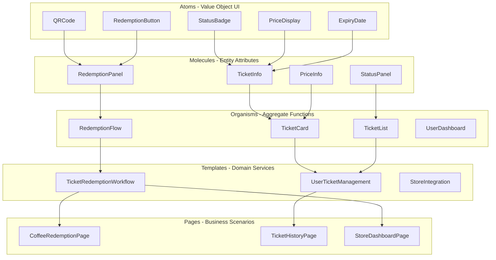
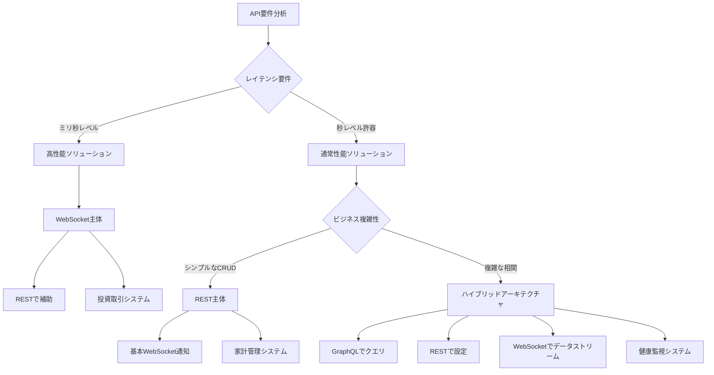
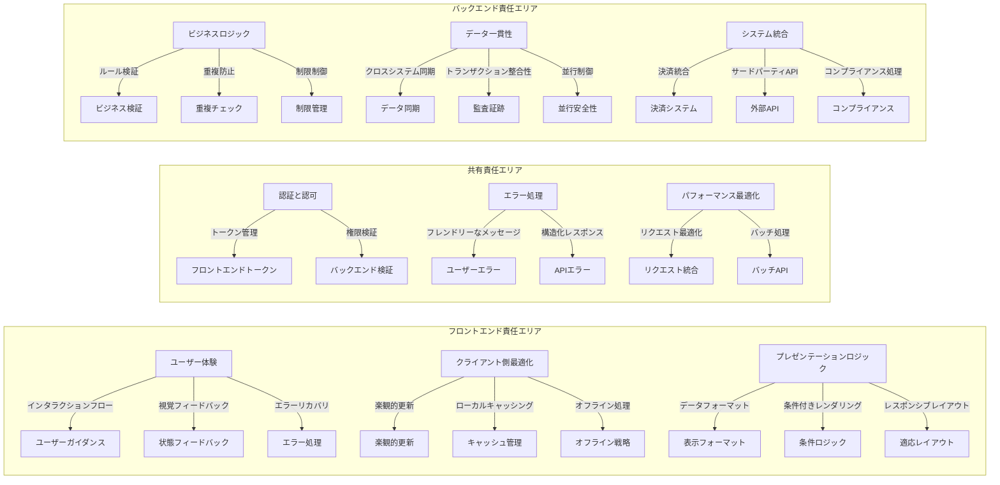

# Day 8 | UIコンポーネントモジュール設計の体系化:デザインシステムとアトミック設計の導入

7日間にわたり、哲学的思考からバックエンドアーキテクチャまでの完全な構造を構築してきた後、今日は重要な問いに取り組みます:**フロントエンドで、バックエンドの集約境界とビジネスロジックを反映した体系的なコンポーネント設計をどのように実装するか?**

これは単なるUIコンポーネントの技術的な問題ではなく、**ドメインモデルからユーザーインターフェースへの完全なマッピングエンジニアリング**です。すべてのフロントエンドコンポーネントは明確なビジネス概念に対応し、すべてのインタラクションフローはドメインロジックの自然な進化を反映すべきです。

## デザインシステムの存在論:ビジネスロジックから視覚言語へ

### 「デザインシステム」の価値の再定義

従来のデザインシステムは、視覚的な一貫性のみに焦点を当てることが多くありました:

```
デザインシステム = 色 + フォント + スペーシング + コンポーネントライブラリ
```

しかし、DDDベースのデザインシステムは、**ビジネス言語から視覚言語への体系的な翻訳**を体現すべきです:

```
DDDデザインシステム = ドメイン概念 + ユーザー意図 + インタラクションパターン + 視覚表現
```

### 集約境界からフロントエンドコンポーネントドメインへのマッピング

一般的な電子チケットシステムを例に、以下のマッピング関係を確立できます:

**チケット集約 → フロントエンドコンポーネントドメインマッピング**:

```typescript
// バックエンド集約境界
Ticket Aggregate ↔ TicketDomain Component Domain
├── Ticket Entity ↔ TicketCard Component
├── RedemptionCode Value Object ↔ QRCodeDisplay Component
└── TicketStatus Value Object ↔ StatusIndicator Component

User Aggregate ↔ UserDomain Component Domain
├── User Entity ↔ UserProfile Component
├── Preferences Value Object ↔ SettingsPanel Component
└── AuthToken Value Object ↔ AuthStatus Component
```

このマッピングにより、フロントエンドコンポーネントとビジネスロジックの一貫性が保証され、各コンポーネントが明確な責任境界を持つことが確保されます。

同時に、複雑なシステムを設計する際、**認知負荷の階層的管理**は、フロントエンドアーキテクチャと設計哲学の核心原則の一つです。

人間が情報を理解する際、異なる抽象化レベル間を切り替える必要があることがよくあります。これを主に3つの層に分けることができます:**概念層**、**知覚層**、そして**翻訳層**です。

```typescript
認知負荷の階層的管理:
├── 概念層: ビジネスロジックの抽象的表現
├── 知覚層: ビジュアルとインタラクションの具体的提示
└── 翻訳層: 概念と知覚の対応メカニズム
```

**概念層**は、ビジネスロジックの抽象的表現を担当します。これはユーザーとシステムの意図の原点です。**知覚層**は、具体的な視覚的・インタラクティブな提示であり、抽象的な意図が直感的で理解しやすい方法でユーザーのメンタルモデルに入ることを保証します。**翻訳層**は橋渡しとして機能し、ビジネス言語を視覚言語に翻訳し、「抽象的意図」と「具体的表現」のシームレスな対応を保証します。

この「ビジネス言語を視覚言語に翻訳する哲学」は、すべてのフロントエンドコンポーネントに体現されています。各コンポーネントは単なる機能モジュールではなく、言語翻訳のフィールドなのです。

例えば、投資取引システムでは、「リスク」という抽象的なビジネス概念は、しばしば赤い警告の視覚シンボルに翻訳され、ユーザーが最短時間で直感的に危険を知覚できるようにします。「機会」は緑のプロンプトで伝えられ、ポジティブな情報を示し、投資家の迅速な意思決定を支援します。「不確実性」は、しばしば動的なローディング状態を通じて提示され、システムの曖昧さを「待機」と「継続的計算」の状態として知覚させます。もちろん、この部分は文化的背景によっても異なります。米国と台湾の株式市場の値の色表示の違いに見られるように。

同じロジックは家計管理システムにも適用され、ビジネス言語の抽象的意味が異なる視覚戦略に変換されます。例えば、「予算管理」は、しばしばプログレスバーと警告シンボルで直感的に表示され、収支のバランスを示します。「家族の協力」は、マルチユーザーステータスインジケーターを通じて明確にされ、メンバー間のインタラクションが一目瞭然になります。「消費習慣」は、カテゴリー別のチャートで視覚化され、ユーザーが日常の消費行動を構造化されたパターンに抽象化し、財務健全性の直感的な認識を形成するのを支援します。

健康監視システムでは、翻訳ロジックは「時間性」と「異常性」の直感的な提示により焦点を当てます。「生理学的サイクル」は、時系列アニメーションで伝えられ、動的な変化を示し、サイクルの抽象的概念を具体的で可視化します。「健康トレンド」は、グラデーションカラーでマッピングされ、ユーザーが自然に状態の改善または悪化を感じることができます。「異常アラート」については、脈動するリマインダーで作成され、緊急性と切迫感を生み出し、重要な情報が即座にキャプチャされることを保証します。

要約すると、認知負荷の階層的管理は単なる設計技術ではなく、設計哲学です。これは抽象から具体への完全な翻訳チェーンを作成し、ビジネスロジックを「視覚化」「知覚化」「文脈化」します。

この方法の価値は、ユーザーの認知圧力を軽減するだけでなく、さまざまなシナリオでのシステムの拡張性と解釈可能性を向上させることです。これが、私が今からアトミックデザインについて議論する主な理由です。

## アトミックデザイン:ドメイン概念の階層的実装

### アトミックデザインのDDD的意義

アトミックデザインは、要件に対する明確で脱構築的な思考ツールです。コンテキストまたはドメインを組み合わせることで、既存のページをモジュールとコンポーネントに効果的に分解し、また、アトミックコンポーネントを設計することで、ゼロから完全なシステムを構築するためにも使用できます。

Brad Frostのアトミックデザイン手法は、DDDの文脈で再解釈する必要があります:

**Atoms(原子)**: ドメイン値オブジェクトのUI表現

-   Money、Status、Codeなどの基本的なビジネス概念。
-   これらは不可分なビジネス意味の単位です。

**Molecules(分子)**: ドメインエンティティの属性の組み合わせ

-   関連する値オブジェクトを意味のあるUIフラグメントにグループ化します。
-   エンティティの属性グループに対応します。

**Organisms(有機体)**: ドメイン集約の完全な表現

-   完全なビジネス機能の実装。
-   集約の核心機能に対応します。

**Templates(テンプレート)**: ドメインサービスの調整層

-   集約をまたがるビジネスプロセス。
-   複雑なユーザージャーニーの構造。

**Pages(ページ)**: ビジネスシナリオの具体的なインスタンス

-   特定のコンテキストにおける特定の役割の完全な操作。

チケットシステムを再び簡単な例として使用しましょう。

### チケットシステムのアトミックデザインの実践



**具体的な実装例**:

```typescript
// Atom層: Status値オブジェクトのUI表現
interface StatusBadgeProps {
  status: TicketStatus;
  size?: "sm" | "md" | "lg";
  variant?: "filled" | "outlined";
}

const StatusBadge: React.FC<StatusBadgeProps> = ({
  status,
  size = "md",
  variant = "filled",
}) => {
  const getStatusConfig = (): StatusConfig => {
    switch (status) {
      case TicketStatus.AVAILABLE:
        return { color: "green", label: "利用可能", icon: "check-circle" };
      case TicketStatus.USED:
        return { color: "gray", label: "使用済み", icon: "check" };
      case TicketStatus.EXPIRED:
        return { color: "red", label: "期限切れ", icon: "x-circle" };
      case TicketStatus.PENDING:
        return { color: "yellow", label: "処理中", icon: "clock" };
    }
  };

  const config = getStatusConfig();

  return (
    <span className={`status-badge ${config.color} ${size} ${variant}`}>
      <Icon name={config.icon} />
      {config.label}
    </span>
  );
};

// Molecule層: Ticketエンティティの属性の組み合わせ
interface TicketInfoProps {
  ticket: Ticket;
  showDetails?: boolean;
}

const TicketInfo: React.FC<TicketInfoProps> = ({
  ticket,
  showDetails = true,
}) => {
  return (
    <div className="ticket-info">
      <div className="ticket-header">
        <h3>{ticket.productName}</h3>
        <StatusBadge status={ticket.status} />
      </div>

      {showDetails && (
        <div className="ticket-details">
          <PriceDisplay
            amount={ticket.value}
            originalPrice={ticket.originalPrice}
          />
          <ExpiryDate date={ticket.expiryDate} />
          <div className="store-info">
            <span>適用店舗: {ticket.applicableStores.join(", ")}</span>
          </div>
        </div>
      )}
    </div>
  );
};

// Organism層: Ticket集約の完全な表現
interface TicketCardProps {
  ticket: Ticket;
  onRedeem?: (ticket: Ticket) => void;
  onViewDetails?: (ticket: Ticket) => void;
}

const TicketCard: React.FC<TicketCardProps> = ({
  ticket,
  onRedeem,
  onViewDetails,
}) => {
  const canRedeem = ticket.isRedeemable();
  const isNearExpiry = ticket.isNearExpiry();

  return (
    <div className={`ticket-card ${isNearExpiry ? "near-expiry" : ""}`}>
      <TicketInfo ticket={ticket} />

      {canRedeem && <RedemptionPanel ticket={ticket} onRedeem={onRedeem} />}

      <div className="ticket-actions">
        <button
          onClick={() => onViewDetails?.(ticket)}
          className="btn-secondary"
        >
          詳細を表示
        </button>

        {canRedeem && (
          <button onClick={() => onRedeem?.(ticket)} className="btn-primary">
            今すぐ引き換え
          </button>
        )}
      </div>

      {isNearExpiry && (
        <div className="expiry-warning">
          <Icon name="alert-triangle" />
          まもなく期限切れです。できるだけ早くご使用ください。
        </div>
      )}
    </div>
  );
};
```

## フロントエンドアーキテクチャ境界の認知的対応

**フロントエンドアーキテクチャ計画の必要性:クロスファンクショナルチームの共通言語**

アトミックデザインにおけるドメイン概念の階層的実装について議論した後、さらなる概念に移りましょう:**設計されたコンポーネントとモジュールをどこに配置するか**。

フロントエンドアーキテクチャの組織化は、単なるコード構造ではなく、**認知ドメインを分割するための戦略**です。

多くのエンジニアやクライアントは、「なぜフロントエンドにアーキテクチャ計画が必要なのか?」や「フロントエンド開発は、デザインモックアップをWebページに変換することではないのか?」と考えることがよくあります。しかし実際には、フロントエンドシステムの複雑さは、バックエンドと同等であることが少なくありません。

プロダクトマネージャー(PM)の視点から見ると、フロントエンドアーキテクチャは、機能提供の速度、ユーザー体験の品質、および製品の長期的な進化能力に関するものです。優れたアーキテクチャを持たないフロントエンドは、以下の問題を引き起こします:

-   機能開発サイクルがどんどん長くなる:PMが「新しいフィルター条件を追加する」という一見シンプルな要件を提案したとき、フロントエンドに優れたアーキテクチャがなければ、開発チームは十数個のファイルを修正し、無数のページをテストする必要があるかもしれません。元々1日と見積もられていたタスクが1週間になります。これは、関連するロジックがあちこちに散在しており、統一された管理メカニズムがないためです。

-   ユーザー体験の不一致のリスク:アーキテクチャ仕様のないフロントエンドは、同じ機能が異なるページで異なる動作をする傾向があります。例えば、「削除」機能がページAでは赤いボタン、ページBではテキストリンク、ページCではダブルクリック確認を必要とする場合があります。ユーザーは各ページで操作ロジックを再学習する必要があり、製品の使いやすさが大幅に低下します。

-   エラー追跡と問題の特定の困難:ユーザーがバグを報告したとき、フロントエンドコード構造が混沌としていれば、開発チームは問題の特定に多くの時間を費やす可能性があります。これは、顧客サービス効率とユーザー満足度に直接影響します。

受け入れ前保証の観点から、QAエンジニアはテストケースを設計し、回帰テストを実行し、製品品質を保証する必要があります。これらのタスクは、フロントエンドアーキテクチャの品質に直接依存し、テスト作業の効率に非常に明確かつ直接的に影響します。

-   テストケースの再利用性:優れたフロントエンドアーキテクチャは、同じ機能コンポーネントを統一的に管理します。例えば、「ログインフォーム」がシステム全体で同じコンポーネントを使用している場合、QAはこのコンポーネントで一度完全なテストを実行するだけで、それを使用するすべてのページが同じ品質保証を持つことが保証されます。逆に、各ページが独自のログインフォーム実装を持っている場合、QAはテストを複数回繰り返す必要があります。

-   自動テストの作成:構造化されたフロントエンドアーキテクチャにより、自動テストの作成が容易になります。コンポーネントに明確な入力と出力の定義がある場合、QAはより簡単に安定したテストスクリプトを書くことができます。混沌としたコード構造は、自動テストを脆弱にし、小さな修正のためにしばしば失敗します。

-   回帰テストのスコープ制御:特定の機能が変更されたとき、優れたアーキテクチャにより、QAはどの関連機能をテストする必要があるかを明確に知ることができます。アーキテクチャがよく設計されていれば、「ユーザー情報」コンポーネントの修正は、システム全体ではなく、いくつかの特定のページにのみ影響します。

要約すると、アーキテクチャ計画は都市計画のようなものです。異なる機能エリアの境界とインタラクションルールを定義します。優れたアーキテクチャ計画がなければ、コードはすぐに保守不可能な「スパゲッティコード」になります。

現代のフロントエンドは、もはや単なる「プレゼンテーション層」ではありません。大量のビジネスロジックを担っています。ユーザー権限制御、データ検証、状態管理、エラー処理などは、すべてフロントエンドで実装する必要があります。アーキテクチャ計画がなければ、このロジックはあちこちに散在し、テストと保守が困難になります。

### 主流のフロントエンドアーキテクチャパターンの概要

**フロントエンドにおける従来のMVCアーキテクチャの進化**:

初期のフロントエンド開発は、主にjQuery + ページテンプレート(Pug、Gulp)を使用していました。しかし、シングルページアプリケーション(SPA)の台頭により、フロントエンドはより複雑なアーキテクチャパターンを必要としました。以下では、今日の一般的なアーキテクチャ戦略を簡単に紹介します:

**コンポーネントベースアーキテクチャ**、**機能ベースアーキテクチャ**、**レイヤードアーキテクチャ**

**1. コンポーネントベースアーキテクチャ**

これは現在最も主流のフロントエンドアーキテクチャパターンであり、React、Vue、Angularで代表されます:

```
project-root/
├── src/
│   ├── components/           # 再利用可能なコンポーネント
│   │   ├── Button/
│   │   ├── Modal/
│   │   └── DataTable/
│   ├── pages/               # ページレベルのコンポーネント
│   │   ├── Home/
│   │   ├── Profile/
│   │   └── Settings/
│   ├── hooks/               # カスタムフック(React)
│   ├── stores/              # 状態管理
│   ├── services/            # APIサービス
│   └── utils/               # ユーティリティ関数
```

**適用シナリオ**: 小規模から中規模のプロジェクト、平均的な技術スキルのチーム、迅速な開発が必要。
**利点**: 学習曲線が緩やか、開発速度が速い、豊富なコミュニティリソース。
**欠点**: 大規模プロジェクトでは、コンポーネントの責任が不明確になりやすく、コードの重複につながる。

**2. 機能ベースアーキテクチャ**

ビジネス機能ごとにコードを組織化し、各機能モジュールがその機能に関連するすべてのコードを含みます:

```
project-root/
├── src/
│   ├── features/
│   │   ├── authentication/
│   │   │   ├── components/
│   │   │   ├── hooks/
│   │   │   ├── services/
│   │   │   ├── stores/
│   │   │   └── types/
│   │   ├── user-management/
│   │   │   ├── components/
│   │   │   ├── hooks/
│   │   │   └── services/
│   │   └── product-catalog/
│   ├── shared/              # 共有リソース
│   │   ├── components/
│   │   ├── hooks/
│   │   └── utils/
│   └── core/               # コア機能
│       ├── api/
│       ├── auth/
│       └── routing/
```

**適用シナリオ**: 中規模から大規模のプロジェクト、マルチチームコラボレーション、複雑なビジネスロジック。
**利点**: モジュールの独立性が高い、責任が明確、テストしやすい。
**欠点**: 初期セットアップがより複雑、より多くのアーキテクチャ計画が必要。

**3. レイヤードアーキテクチャ**

アプリケーションを異なる論理層に分割し、各層が特定の責任を負います:

```
project-root/
├── src/
│   ├── presentation/        # プレゼンテーション層
│   │   ├── components/
│   │   ├── pages/
│   │   └── layouts/
│   ├── application/         # アプリケーション層
│   │   ├── stores/
│   │   ├── hooks/
│   │   └── services/
│   ├── domain/              # ドメイン層
│   │   ├── entities/
│   │   ├── repositories/
│   │   └── use-cases/
│   └── infrastructure/      # インフラストラクチャ層
│       ├── api/
│       ├── storage/
│       └── external-services/
```

**適用シナリオ**: エンタープライズレベルのアプリケーション、長期メンテナンスプロジェクト、複雑なビジネスロジック。
**利点**: 責任の明確な分離、テストしやすい、SOLID原則に準拠。
**欠点**: 学習曲線が急、初期開発速度が遅い。

### Core-Shared-Feature vs. Next.js DDDアーキテクチャの比較

**Core-Shared-Featureアーキテクチャの詳細分析**:

このアーキテクチャは、コードを3つの主要レベルに分割し、それぞれが明確な責任境界を持ちます:

```
src/
├── core/                    # コア層: アプリケーションのインフラストラクチャ
│   ├── api/
│   │   ├── client.ts        # APIクライアント設定
│   │   ├── interceptors.ts  # リクエスト/レスポンスインターセプター
│   │   └── endpoints.ts     # APIエンドポイント定義
│   ├── auth/
│   │   ├── AuthContext.tsx  # 認証コンテキスト
│   │   ├── AuthGuard.tsx    # ルートガード
│   │   └── auth.service.ts  # 認証サービス
│   ├── router/
│   │   ├── Router.tsx       # ルーター設定
│   │   ├── routes.ts        # ルート定義
│   │   └── guards.ts        # ルートガードロジック
│   ├── store/
│   │   ├── index.ts         # ルート状態管理設定
│   │   ├── middleware.ts    # ミドルウェア
│   │   └── persistConfig.ts # 永続化設定
│   └── types/
│       ├── api.ts           # API関連型
│       ├── auth.ts          # 認証関連型
│       └── common.ts        # 共通型
├── shared/                  # 共有層: 再利用可能なコンポーネントとロジック
│   ├── components/
│   │   ├── ui/              # 基本UIコンポーネント
│   │   │   ├── Button/
│   │   │   │   ├── Button.tsx
│   │   │   │   ├── Button.test.tsx
│   │   │   │   ├── Button.stories.tsx
│   │   │   │   └── index.ts
│   │   │   ├── Input/
│   │   │   ├── Modal/
│   │   │   └── Table/
│   │   ├── layout/          # レイアウトコンポーネント
│   │   │   ├── Header/
│   │   │   ├── Sidebar/
│   │   │   └── Footer/
│   │   └── form/            # フォームコンポーネント
│   │       ├── FormField/
│   │       ├── Validation/
│   │       └── FormBuilder/
│   ├── hooks/
│   │   ├── useApi.ts        # API呼び出しフック
│   │   ├── useDebounce.ts   # デバウンスフック
│   │   ├── useLocalStorage.ts # ローカルストレージフック
│   │   └── usePermission.ts # 権限チェックフック
│   ├── utils/
│   │   ├── formatters.ts    # フォーマッティングユーティリティ
│   │   ├── validators.ts    # 検証ユーティリティ
│   │   ├── constants.ts     # 定数定義
│   │   └── helpers.ts       # ヘルパー関数
│   └── services/
│       ├── storage.service.ts # ストレージサービス
│       ├── notification.service.ts # 通知サービス
│       └── analytics.service.ts # アナリティクスサービス
└── features/                # 機能層: 特定のビジネス機能
    ├── authentication/
    │   ├── components/
    │   │   ├── LoginForm/
    │   │   │   ├── LoginForm.tsx
    │   │   │   ├── LoginForm.test.tsx
    │   │   │   └── useLoginForm.ts
    │   │   ├── RegisterForm/
    │   │   └── PasswordReset/
    │   ├── pages/
    │   │   ├── LoginPage.tsx
    │   │   ├── RegisterPage.tsx
    │   │   └── ForgotPasswordPage.tsx
    │   ├── store/
    │   │   ├── authSlice.ts # Redux Toolkitスライス
    │   │   └── authThunks.ts # 非同期操作
    │   ├── services/
    │   │   └── auth.api.ts  # 認証関連API
    │   ├── types/
    │   │   └── auth.types.ts # 認証関連型
    │   └── utils/
    │       └── authHelpers.ts
    ├── user-management/
    │   ├── components/
    │   │   ├── UserList/
    │   │   ├── UserForm/
    │   │   └── UserProfile/
    │   ├── pages/
    │   │   ├── UsersPage.tsx
    │   │   └── UserDetailPage.tsx
    │   ├── store/
    │   │   └── userSlice.ts
    │   └── services/
    │       └── user.api.ts
    └── dashboard/
        ├── components/
        │   ├── StatsCard/
        │   ├── ChartWidget/
        │   └── RecentActivity/
        ├── pages/
        │   └── DashboardPage.tsx
        └── hooks/
            └── useDashboardData.ts
```

**Core-Shared-Featureの利点**:

1.  **責任の明確な分離**: コア層はアプリケーションインフラストラクチャを処理し、共有層は再利用可能なコンポーネントを提供し、機能層は特定のビジネス機能を実装します。各レベルの責任は非常に明確で、新しいチームメンバーがコード構造を迅速に理解できます。

2.  **高い再利用性**: 共有層のコンポーネントとユーティリティは、複数の機能間で再利用でき、コードの重複を回避します。複数の機能で同じUIコンポーネントやビジネスロジックを使用する必要がある場合、共有層から参照するだけです。

3.  **テストしやすい**: 各層を独立してテストできます。コア層の基本サービスは単体テスト、共有層のコンポーネントはコンポーネントテスト、機能層のビジネスロジックは統合テストが可能です。

4.  **チームコラボレーションに優しい**: 異なるチームが異なる機能を担当でき、コア層と共有層はアーキテクチャチームが維持できます。これにより、複数のチームが同じコードを修正することによる競合を防ぐことができます。

**Core-Shared-Featureの欠点**:

1.  **複雑な初期セットアップ**: 各層の境界とインターフェースを事前に設計する必要があり、より高いアーキテクチャ設計スキルが要求されます。境界が適切に設計されていない場合、後でリファクタリングするコストが高くなります。

2.  **機能間の依存関係の管理**: 機能が一部のロジックを共有する必要がある場合、それを共有層に昇格させるべきか、別の方法で依存関係を解決するかを慎重に検討する必要があります。

3.  **学習曲線**: 新しいエンジニアは、各層間でコードを正しく組織化するために、アーキテクチャ全体の設計哲学を理解する必要があります。

**Next.js DDDアーキテクチャの詳細分析**:

Next.jsとドメイン駆動設計を組み合わせたアーキテクチャは、ドメインモデリングとビジネスロジックの組織化により焦点を当てます:

```
src/
├── app/                     # Next.js 13+ App Router
│   ├── (auth)/             # ルートグループ
│   │   ├── login/
│   │   │   └── page.tsx
│   │   └── register/
│   │       └── page.tsx
│   ├── dashboard/
│   │   ├── page.tsx
│   │   └── layout.tsx
│   ├── users/
│   │   ├── page.tsx
│   │   ├── [id]/
│   │   │   └── page.tsx
│   │   └── loading.tsx
│   ├── api/                # APIルート
│   │   ├── auth/
│   │   │   └── route.ts
│   │   └── users/
│   │       └── route.ts
│   ├── globals.css
│   ├── layout.tsx
│   └── page.tsx
├── domains/                 # ドメイン層
│   ├── auth/
│   │   ├── entities/
│   │   │   ├── User.ts     # ユーザーエンティティ
│   │   │   └── Session.ts  # セッションエンティティ
│   │   ├── repositories/
│   │   │   └── UserRepository.ts
│   │   ├── services/
│   │   │   ├── AuthService.ts
│   │   │   └── UserService.ts
│   │   ├── value-objects/
│   │   │   ├── Email.ts
│   │   │   └── Password.ts
│   │   └── use-cases/
│   │       ├── LoginUseCase.ts
│   │       ├── RegisterUseCase.ts
│   │       └── LogoutUseCase.ts
│   ├── user-management/
│   │   ├── entities/
│   │   │   └── UserProfile.ts
│   │   ├── repositories/
│   │   │   └── UserProfileRepository.ts
│   │   ├── services/
│   │   │   └── UserManagementService.ts
│   │   └── use-cases/
│   │       ├── GetUserListUseCase.ts
│   │       ├── CreateUserUseCase.ts
│   │       └── UpdateUserUseCase.ts
│   └── shared/
│       ├── entities/
│       │   └── BaseEntity.ts
│       ├── value-objects/
│       │   ├── Id.ts
│       │   └── DateRange.ts
│       └── interfaces/
│           ├── Repository.ts
│           └── UseCase.ts
├── infrastructure/          # インフラストラクチャ層
│   ├── database/
│   │   ├── prisma/
│   │   │   ├── schema.prisma
│   │   │   └── migrations/
│   │   └── repositories/
│   │       ├── PrismaUserRepository.ts
│   │       └── PrismaUserProfileRepository.ts
│   ├── external-services/
│   │   ├── EmailService.ts
│   │   └── PaymentService.ts
│   ├── auth/
│   │   └── NextAuthConfig.ts
│   └── api/
│       └── ApiClient.ts
├── presentation/            # プレゼンテーション層
│   ├── components/
│   │   ├── auth/
│   │   │   ├── LoginForm.tsx
│   │   │   └── RegisterForm.tsx
│   │   ├── users/
│   │   │   ├── UserList.tsx
│   │   │   └── UserCard.tsx
│   │   └── shared/
│   │       ├── Button.tsx
│   │       ├── Input.tsx
│   │       └── Modal.tsx
│   ├── hooks/
│   │   ├── useAuth.ts
│   │   └── useUsers.ts
│   └── providers/
│       ├── AuthProvider.tsx
│       └── QueryProvider.tsx
└── application/             # アプリケーション層
    ├── dto/
    │   ├── auth/
    │   │   ├── LoginDto.ts
    │   │   └── RegisterDto.ts
    │   └── users/
    │       ├── CreateUserDto.ts
    │       └── UpdateUserDto.ts
    ├── handlers/
    │   ├── auth/
    │   │   ├── LoginHandler.ts
    │   │   └── RegisterHandler.ts
    │   └── users/
    │       ├── GetUsersHandler.ts
    │       └── CreateUserHandler.ts
    └── middleware/
        ├── AuthMiddleware.ts
        └── ValidationMiddleware.ts
```

**Next.js DDDの利点**:

1.  **ビジネスロジックの一元化**: ドメイン層にすべてのビジネスロジックとルールが含まれ、ビジネスロジックを技術実装から分離します。ビジネス要件が変更された場合、修正は主にドメイン層で行われ、他の層への影響を最小限に抑えます。

2.  **フルスタックの一貫性**: フロントエンドとバックエンドが同じドメインモデルとビジネスロジックを共有し、両者間の認知負荷とコミュニケーションコストを削減します。API設計もビジネスロジックとより密接に整合します。

3.  **優れたテスト可能性**: ドメイン層のビジネスロジックは、技術的詳細から完全に切り離してテストできます。ユースケースは、依存性注入を使用して単体テストできます。

4.  **技術に依存しない**: ドメイン層は特定の技術やフレームワークに依存しません。技術スタックを切り替える必要がある場合、ビジネスロジックは変更されません。

**Next.js DDDの欠点**:

1.  **急な学習曲線**: DDD概念と設計パターンの深い理解が必要で、チームに高い技術レベルが求められます。ジュニアエンジニアは習得に時間がかかる可能性があります。

2.  **遅い初期開発速度**: エンティティ、値オブジェクト、ユースケースなど、複数レベルの抽象化を設計する必要があり、初期開発速度が遅くなります。

3.  **過剰エンジニアリングのリスク**: シンプルなCRUDアプリケーションでは、DDDは不必要な複雑さをもたらす可能性があります。プロジェクトの規模と複雑さに基づいて適用可能性を判断する必要があります。

### アーキテクチャ選択の意思決定フレームワーク

**プロジェクト規模駆動のアーキテクチャ選択**:

1.  **小規模プロジェクト(< 10ページ、< 3人の開発者)**:
    -   推奨: シンプルなコンポーネントベースアーキテクチャ
    -   理由: 迅速な開発、過剰エンジニアリングを削減。

2.  **中規模プロジェクト(10-50ページ、3-10人の開発者)**:
    -   推奨: Core-Shared-Featureアーキテクチャ
    -   理由: 開発効率とコード組織化のバランス。

3.  **大規模プロジェクト(> 50ページ、> 10人の開発者)**:
    -   推奨: Next.js DDDアーキテクチャまたはマイクロフロントエンドアーキテクチャ
    -   理由: 複雑なビジネスロジックには、より厳格なアーキテクチャ制約が必要。

**チームの技術レベルの考慮**:

-   **ジュニアチーム**: 学習曲線が緩やかなアーキテクチャを選択し、理解しやすさと開発効率に焦点を当てます。
-   **シニアチーム**: より複雑だが長期的な利益の高いアーキテクチャを選択でき、保守性と拡張性に焦点を当てます。
-   **混合チーム**: 明確な境界を持つアーキテクチャを選択し、異なるレベルの開発者が異なる層で作業できるようにします。

**ビジネス特性の影響**:

-   **迅速なイテレーションを伴う製品**: 開発速度を優先するアーキテクチャを選択。
-   **長期メンテナンスを伴う製品**: 保守性を優先するアーキテクチャを選択。
-   **マルチチームコラボレーションを伴う製品**: モジュール性の高いアーキテクチャを選択。

## API設計戦略とフロントエンド・バックエンド協働境界

### コア設計原則

よく管理されたフロントエンド・バックエンド協働システムでは、通常、5層のフレームワークを使用します:**「意図—契約—転送—一貫性—観察」**。まず、ビジネス意図が測定可能な体験とデータの適時性を定義します。次に、**契約**が境界と予測可能性を固定します。その後、データを配信するために適切な転送形式が選択されます。同時に、一貫性戦略により、読み取りと書き込みのセマンティクスがビジネスリスクと整合することが保証されます。最後に、観察がテスト可能性、追跡可能性、遡及機能で体験のクローズドループを完成させます。

**契約と境界**の観点から、契約ファーストアプローチとバージョンガバナンス(REST/OpenAPI、GraphQL SDL、gRPC/proto)を採用することで、チーム間のリスクを最小限に抑えることができます。フロントエンドは、型付きDTO(またはGraphQLフラグメント)を使用して表示モデルと整合し、データベースの形状をUIに漏らすことを避けます。バックエンドは、ビジネスルール、権限、データ一貫性の**「最終責任」**を負い、フロントエンドはプレゼンテーションと体験のみを処理します(楽観的更新、エラーリカバリ、オフライン戦略を含む)。

要約すると、フロントエンド・バックエンド協働とAPI設計の成熟度は、どれだけ多くのプロトコルが積み重ねられているかではなく、ビジネス特性に基づいて明確な契約で責任とリスクを前倒しできるか、適切な転送と一貫性セマンティクスで体験、パフォーマンス、正確性を同時に達成できるかにあります。

以下、ビジネス特性に基づいた適切なAPIプロトコル設計について簡単に説明します。

ビジネス特性に基づいて最も適切なAPI技術スタックを選択します:

-   **高頻度取引システム**: WebSocket主体 + RESTで補助
-   **家計管理システム**: REST主体 + 基本WebSocket
-   **健康監視システム**: ハイブリッドアーキテクチャ(REST + GraphQL + WebSocket)

### 投資取引システム

```typescript
// コア戦略: WebSocket + 優先メッセージキュー
class TradingAPI {
  // メインWebSocketチャネル: リアルタイム取引と市場データ
  // RESTで補助: 設定と履歴クエリ
  // キー: ミリ秒レベルのレイテンシ最適化
}
```

### 家計管理システム

```typescript
// コア戦略: REST + シンプルなWebSocket通知
class FamilyFinanceAPI {
  // REST主体: シンプルなCRUD操作
  // WebSocketで補助: 協働通知
  // キー: シンプルな開発と保守
}
```

### 健康監視システム

```typescript
// コア戦略: REST + GraphQL + WebSocketハイブリッド
class HealthMonitorAPI {
  // REST: 基本クエリと設定
  // GraphQL: 複雑な相関分析
  // WebSocket: IoTデータストリームとアラート
  // キー: データタイプ最適化戦略
}
```

## 技術選択ガイドライン

| システム特性 | 推奨技術スタック | 適用シナリオ         |
| --------------------- | ---------------------- | ---------------------------- |
| 超低レイテンシ     | WebSocket主体     | 取引、ゲーム、リアルタイム協働 |
| シンプルで信頼性が高い   | REST主体          | 企業内部、小規模アプリケーション |
| 複雑なクエリ       | GraphQLで強化| データ分析、パーソナライズドサービス |
| データストリーム処理| ハイブリッドアーキテクチャ    | IoT、監視、ソーシャルメディア |

## 3つのビジネスシナリオのシステムアーキテクチャ比較

```mermaid
graph TB
    subgraph "投資取引システム - 極限パフォーマンス"
        Trading[取引フロントエンド]
        TradingWS[メインWebSocketチャネル]
        TradingREST[補助REST API]
        TradingDB[(市場データベース)]

        Trading --> TradingWS
        Trading --> TradingREST
        TradingWS --> TradingDB
        TradingREST --> TradingDB

        TradingWS -.-> |リアルタイム価格| Trading
        TradingWS -.-> |取引実行| Trading
        TradingREST -.-> |設定クエリ| Trading
    end

    subgraph "家計管理システム - シンプルで信頼性が高い"
        Family[家計フロントエンド]
        FamilyREST[メインREST API]
        FamilyWS[協働通知]
        FamilyDB[(家計データベース)]

        Family --> FamilyREST
        Family --> FamilyWS
        FamilyREST --> FamilyDB
        FamilyWS --> FamilyDB

        FamilyREST -.-> |CRUD操作| Family
        FamilyWS -.-> |リアルタイム通知| Family
    end

    subgraph "健康監視システム - データストリーム駆動"
        Health[健康フロントエンド]
        HealthREST[REST API]
        HealthGQL[GraphQL API]
        HealthWS[WebSocketストリーム]
        HealthDB[(健康データベース)]
        IoT[IoTデバイス]

        Health --> HealthREST
        Health --> HealthGQL
        Health --> HealthWS
        IoT --> HealthWS

        HealthREST --> HealthDB
        HealthGQL --> HealthDB
        HealthWS --> HealthDB

        HealthREST -.-> |基本クエリ| Health
        HealthGQL -.-> |複雑な分析| Health
        HealthWS -.-> |リアルタイムデータ| Health
    end
```



## API技術選択決定木



## フロントエンド・バックエンド責任の線引き



## 境界調整のベストプラクティス

1.  **責任の明確な分担**: フロントエンドとバックエンド間でロジックを重複させることを避けます。
2.  **統一されたエラー処理**: 構造化されたエラーレスポンスメカニズム。
3.  **協働的なパフォーマンス最適化**: フロントエンドキャッシング + バックエンドバッチ処理。
4.  **一貫したセキュリティ戦略**: 調整されたトークン管理と権限検証。
5.  **監視とロギング**: フルスタックトレーシングと問題の特定。

## Day 9の高並行性アーキテクチャの基礎構築

フロントエンドアーキテクチャについての簡単な議論の後、明日は注目をアーキテクチャシナリオとAWSに戻します:

### データ集約型アプリケーションの戦略

-   **リクエスト最適化とバッチ処理**: ネットワークオーバーヘッドを削減し、ユーザー体験を向上させます。
-   **状態同期と競合解決**: 複数のユーザーからの並行操作の処理。

### マイクロサービスアーキテクチャ

-   **サーキットブレーカーパターン**: 障害分離とグレースフルデグラデーション。
-   **分散トレーシング**: サービス間のユーザー操作トレーシングとデバッグ。

### AWS高並行性アーキテクチャの最適化

-   **CDNとエッジコンピューティング**: CloudFrontのメリットを最大化する方法。
-   **Lambda@Edge**: エッジ実行戦略。
-   **API Gatewayスロットリング**: スロットリングレスポンスの処理。

## 今日の体系的な要点

-   **デザインシステムはビジネス言語の視覚的翻訳**: すべての設計決定はビジネス概念を反映すべきです。
-   **アトミックデザイン + DDD = 有機的なコンポーネント階層**: 値オブジェクトから集約への自然なマッピング。
-   **Core-Share-Feature vs. DDDレイヤードアーキテクチャはドメイン境界を反映**: フロントエンドアーキテクチャのトレードオフとバックエンド集約境界との対応。

覚えておいてください:今日私たちが構築したのは、UIフレームワークではなく、視覚層におけるビジネスロジックの体系的な表現です。各コンポーネントは特定のビジネスセマンティクスを担い、すべての設計決定はユーザーのビジネス目標に奉仕すべきです。

---

> 「コンポーネントはUIの構成要素ではなく、ビジネス概念の視覚的キャリアです。私たちはインターフェースを設計しているのではなく、ユーザーとビジネスドメイン間の対話の媒体を設計しているのです。真のデザインシステムは、複雑なビジネスロジックを直感的に知覚可能にする翻訳の芸術です。」
