# Day 9 | 高並行処理とレート制限設計:リソースボトルネックを回避する方法

昨日、私たちは3つのAPIアーキテクチャを確立しました:投資取引のためのWebSocket主体、家計管理のための簡素化されたREST、健康モニタリングのためのハイブリッド戦略です。今日は、より根本的な問題に取り組みます:**システムが大量の同時リクエストに直面したとき、ボトルネックを回避し、キャッシュ最適化の基盤を築くために、データフローアーキテクチャをどのように設計すればよいのでしょうか?**

これは単なる技術的な容量計画の問題ではなく、**データ集約型アプリケーションに対する哲学的アプローチ**です。Martin Kleppmannが『Designing Data-Intensive Applications』で指摘しているように、現代システムの課題は計算集約型ではなく、**信頼性、スケーラビリティ、保守性**の制約の下でデータフローをどのように処理するかということです。

## 高並行処理の本質:データフローパターンとアクセス特性

### 「高並行処理」の本質を再理解する

従来、私たちは高並行処理を「大量のリクエストを同時に処理すること」と理解していました。しかし、Kleppmannはより深い視点を提供しています:

**並行処理は量的な問題ではなく、質的な課題です**:

```
従来の見方:並行処理 = 1秒あたりに処理されるリクエスト数
データ集約型の見方:並行処理 = データ整合性制約下での調整の複雑さ
```

**3つの柱(信頼性、スケーラビリティ、保守性)が並行処理シナリオで現れる形**:

**信頼性**:一部のコンポーネントが故障してもシステムは正しく動作し続けます。

-   投資取引:取引注文は失われたり、複数回実行されたりしてはいけません。
-   家計管理:支出記録は並行処理により不整合になってはいけません。
-   健康モニタリング:デバイスデータはネットワーク問題により永久に失われてはいけません。

**スケーラビリティ**:システムは増加した負荷を処理できます。

-   水平スケーリング:より多くのマシンを追加する。
-   垂直スケーリング:単一マシンのパフォーマンスを向上させる。
-   機能的スケーリング:システムの複雑さを管理する。

**保守性**:システムは効果的に運用、理解、変更できます。

-   可観測性:システムの動作状態を理解する。
-   運用性:システムを効果的に稼働させ続ける。
-   シンプルさ:複雑さを管理し、偶発的な複雑さを避ける。

従来、私たちは高並行処理を「大量のリクエストを同時に処理すること」と理解していましたが、システムアーキテクチャの観点から見ると、並行処理は本質的に**データフローパターンの管理課題**です:

### 並行処理ボトルネック問題の体系的な特定

| レベル          | メトリック名                         | 説明                                          | 一般的な検出ツール/方法                   |
| -------------- | ----------------------------------- | ---------------------------------------------------- | -------------------------------------------------- |
| **アプリケーション**| スループット(RPS/QPS)                | 1秒あたりに処理されるリクエスト数、システム容量を測定 | JMeter, k6, Locust, New Relic                      |
|                | レスポンスレイテンシ                    | リクエスト受信からレスポンスまでの時間、P50/P95/P99に注目 | APM (Datadog, New Relic), OpenTelemetry            |
|                | エラー率                          | HTTP 4xx/5xxの割合、アプリケーションの堅牢性を反映 | APM, ELK, Sentry                                   |
|                | 同時接続数              | 同時に処理されるユーザー/セッション数      | システム監視 (Prometheus, Grafana)            |
|                | キュー長                        | スレッドプール、タスクキューのバックログ                 | Micrometer, RabbitMQ/Kafkaメトリクス                 |
|                | 待機時間                           | DB接続プール、APIゲートウェイキューでの待機時間 | APM Trace, pgbouncer stats                         |
|                | メモリ/GC動作                  | GC一時停止、ヒープ使用量、アプリケーションレスポンス時間に影響 | JVisualVM, JFR, Prometheus Exporter                |
| **データベース**   | クエリレイテンシ                       | 単一のSQLクエリまたはトランザクションにかかる時間     | MySQL Slow Query Log, pg_stat_statements           |
|                | 秒あたりのクエリ数(QPS/TPS)        | データベーススループット                                  | MySQL performance_schema, Postgresメトリクス         |
|                | スロークエリ%                        | 閾値を超えるクエリの割合          | スロークエリログ分析, pt-query-digest           |
|                | インデックスヒット率                     | クエリがインデックスを効果的に使用しているか              | EXPLAIN, pg_stat_user_indexes                      |
|                | キャッシュヒット率                     | DBバッファプール/Redis/Memcachedのヒット率         | MySQL InnoDBメトリクス, Redis INFO                   |
|                | ロック待機/デッドロック                | トランザクション競合による待機やデッドロック   | MySQL Performance Schema, pg_locks                 |
|                | 接続プール使用率               | 接続プールリソースが飽和しているか      | HikariCPメトリクス, pgbouncer stats                  |

私たちの主な議論の文脈では、データフローの特性は次のとおりです:

**3つのシステムのデータフロー特性分析**:

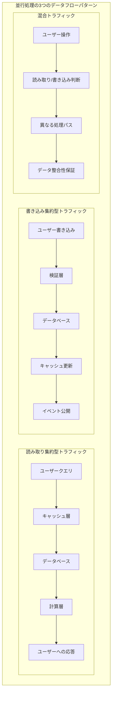

| システム             | 主なトラフィックパターン          | アクセスパターン   | 整合性要件 | キャッシュ適合性 |
| ------------------ | ----------------------------- | ---------------- | ----------------------- | ------------------ |
| 投資取引 | 読み取り集約型(90%) + 重要な書き込み(10%) | ホットスポット集中 | 強整合性      | 高               |
| 家計管理     | 読み取り/書き込みバランス(60:40)   | 均等に分散 | 結果整合性    | 中               |
| 健康モニタリング  | 書き込み集約型(70%) + 分析読み取り(30%) | 時系列パターン | 順序整合性  | 低                |

並行処理について語るとき、最も重要なことは**予防は治療に勝る**という哲学を理解することです:問題が発生してから解決するのではなく、設計段階でパフォーマンスのボトルネックを回避する方法です。

---

## パート1:アプリケーション層のパフォーマンスボトルネックの予防 - 4つのコア概念(接続プーリング、非同期処理、キャッシング、バッチ処理)

### 概念1:接続プーリング - 「リソース再利用の知恵」

**コアアイデア**:公共図書館での座席管理を想像してください。

-   すべての読者が自分のテーブルと椅子を持ち込み、帰るときに片付ける必要がある場合、非常に非効率的です。
-   図書館は事前に座席を準備しています。読者は来て、座って、次の人のために座席を残します。
-   データベース接続プールも同じ原理で機能します。

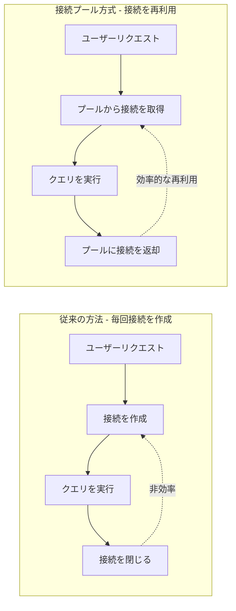

**重要な考察ポイント**:

-   **事前割り当て**:一時的な作成のオーバーヘッドを避けるため、事前にリソースを準備します。
-   **再利用性**:1つの接続を複数のリクエストが順番に使用できます。
-   **境界制御**:最小および最大接続数を設定して、リソースの浪費や不足を避けます。

### 概念2:非同期処理 - 「時間と空間の分離」

**コアアイデア**:レストランでの注文プロセスを想像してください。

-   従来の方法:顧客が注文 → シェフが調理 → 顧客が待つ → 料理が提供される → 支払い。
-   非同期方式:顧客が注文 → 番号札を受け取り退席 → シェフが調理 → 番号が呼ばれて受け取り。

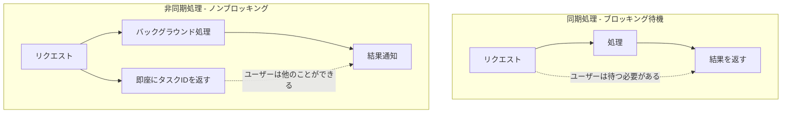

**重要な考察ポイント**:

-   **時間の分離**:処理時間とレスポンス時間を分離します。
-   **スループットの向上**:同じ時間でより多くのリクエストを受け入れることができます。
-   **ユーザーエクスペリエンス**:ユーザーは無為に待つ必要がなく、他のことができます。

### 概念3:キャッシング - 「メモリの階層構造」

**コアアイデア**:人間の記憶システムのようなものです。

-   **短期記憶**:たった今覚えた電話番号(ローカルキャッシュ)。
-   **長期記憶**:親しい友人の電話番号(分散キャッシュ)。
-   **外部記憶**:電話帳を調べる(データベース)。

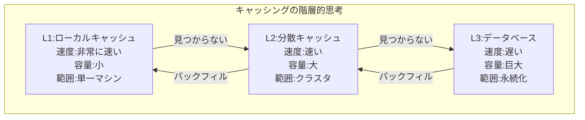

**重要な考察ポイント**:

-   **近接性の原則**:ユーザーに近いデータほど高速にアクセスできます。
-   **ホットスポットの集中**:頻繁に使用されるデータを高速アクセス可能な場所に配置します。
-   **容量トレードオフ**:空間を時間と交換し、コストをパフォーマンスと交換します。

### 概念4:バッチ処理 - 「大量処理の経済効果」

**コアアイデア**:宅配便の配送ロジックのようなものです。

-   受け取った荷物ごとに車両を派遣するわけではありません。
-   代わりに、一定数を蓄積するか、特定の時間まで待って一度に配送します。

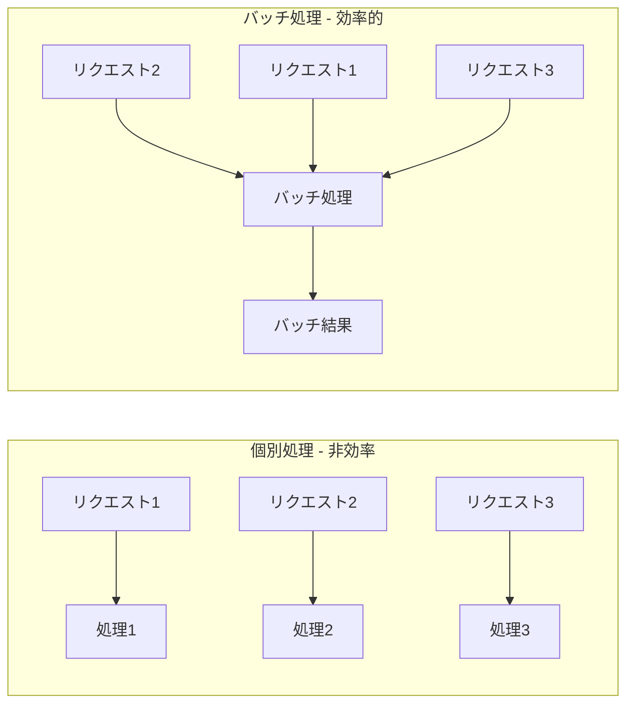

**重要な考察ポイント**:

-   **集約効果**:複数の小さなタスクを1つの大きなタスクに結合します。
-   **コストの償却**:固定オーバーヘッドを複数の操作で共有します。
-   **時間トレードオフ**:わずかな遅延と引き換えに全体的な効率を高めます。

---

## パート2:データ層のパフォーマンスボトルネックの予防 - 4つのコア戦略(インデックス作成、クエリ最適化、パーティショニング/シャーディング、読み取り/書き込み分離)

### 戦略1:インデックス作成 - 「データのディレクトリシステム」

**コアアイデア**:図書館の分類システムのようなものです。

-   カタログなし:本を見つけるには棚を1つずつ探す必要があります。
-   カタログあり:カタログを確認して特定の位置をすばやく特定します。

```mermaid
graph TB
    subgraph "インデックス作成の本質的思考"
        subgraph "インデックスなし"
            N1[全表スキャン] --> N2[行ごとにチェック] --> N3[ターゲットを見つける]
            N2 -.->|効率:O(n)| N3
        end

        subgraph "インデックスあり"
            H1[インデックス検索] --> H2[直接位置特定] --> H3[データを取得]
            H2 -.->|効率:O(log n)| H3
        end
    end
```

**重要な考察ポイント**:

-   **空間を時間と交換**:追加のストレージスペースを使用してクエリ速度を得ます。
-   **選択性の原則**:インデックスの効果はデータの一意性に依存します。
-   **メンテナンスコスト**:データが変更されるとインデックスも同期的に更新する必要があります。

### 戦略2:クエリ最適化 - 「質問の技術」

**コアアイデア**:情報を尋ねるスキルのようなものです。

-   悪い質問:「この人についてすべて知っていますか?」
-   良い質問:「John Smithの電話番号を知っていますか?」

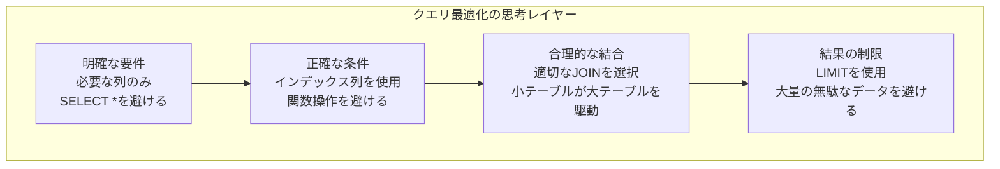

**重要な考察ポイント**:

-   **正確な表現**:クエリ条件が具体的であるほど、システムは最適化しやすくなります。
-   **最小性の原則**:必要なものだけを取得し、それ以上は取得しません。
-   **最適経路**:最も効果的なデータアクセスパスを選択します。

### 戦略3:パーティショニング/シャーディング - 「分割統治の知恵」

**コアアイデア**:巨大な図書館を管理するようなものです。

-   単一図書館:すべての本が一緒にあり、何かを見つけるのが難しい。
-   支店管理:科目ごとにいくつかの小さな図書館に分割され、それぞれ独立して管理されます。

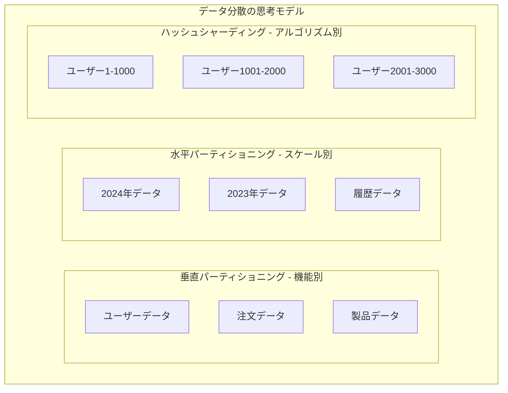

**重要な考察ポイント**:

-   **スケール制御**:大きな問題を複数の小さな問題に分解します。
-   **並列処理**:複数のシャードが同時に動作できます。
-   **局所性**:関連データをまとめて保持し、クロスシャードクエリを減らします。

### 戦略4:読み取り/書き込み分離 - 「専門化の効率性」

**コアアイデア**:病院での分業のようなものです。

-   受付デスク:登録処理を専門とします(書き込み操作)。
-   案内デスク:質問への回答を専門とします(読み取り操作)。
-   それぞれが自分の職務を持ち、互いに干渉しません。

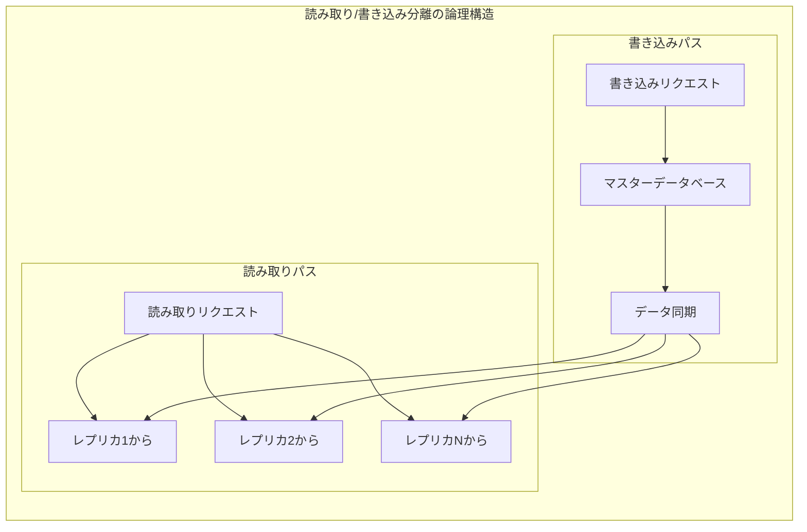

**重要な考察ポイント**:

-   **職務の分離**:読み取りと書き込み操作は異なるリソースを使用します。
-   **負荷分散**:複数の読み取りレプリカがクエリ圧力を共有します。
-   **整合性トレードオフ**:パフォーマンスと引き換えに短いデータ遅延を受け入れます。

---

## パート3:システム調整の最適化 - 全体的思考(キャッシュ整合性、トランザクション境界)

### 概念1:キャッシュ整合性 - 「同期の技術」

**コアチャレンジ**:複数の人が同時に同じドキュメントを編集することを想像してください。

-   全員が最新バージョンを見ることをどのように保証しますか?
-   競合をどのように処理しますか?
-   効率と正確性のバランスをどのように取りますか?

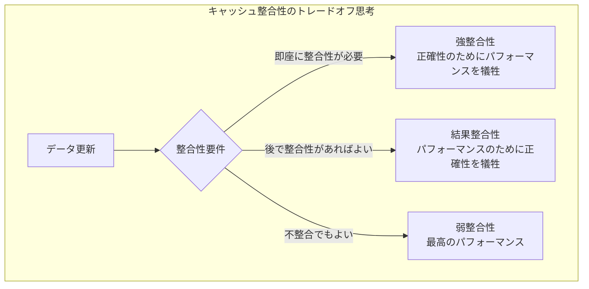

### 概念2:トランザクション境界 - 「責任の範囲」

**コアアイデア**:契約書への署名のロジックのようなものです。

-   契約範囲が大きすぎる:リスクが高く、問題が発生しやすい。
-   契約範囲が小さすぎる:非効率で、何度も署名が必要。
-   適切な範囲:責任が明確で、リスクが管理可能。

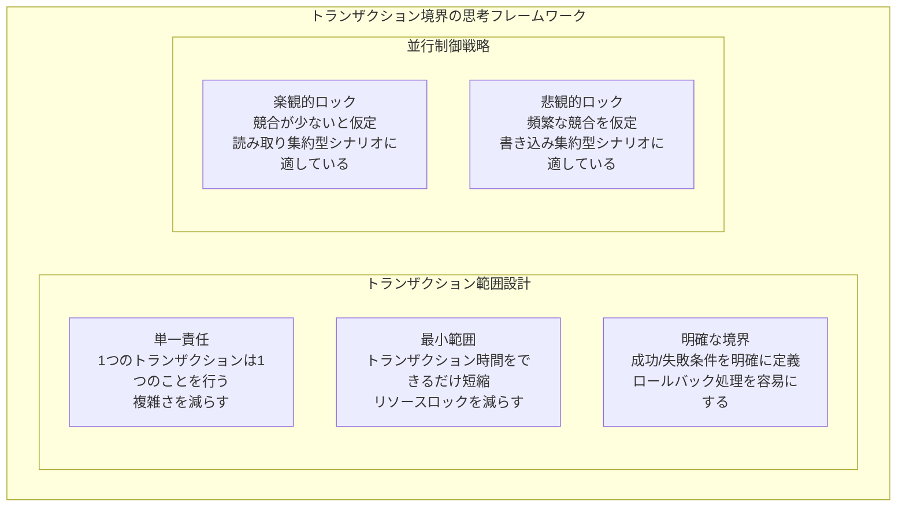

---

## パート4:レート制限設計の抽象モデル:保護とガイダンスのバランス

### レート制限の3つの目標

レート制限はシステムリソースを保護するだけでなく、**データトラフィックの知的調整メカニズム**です:

**保護**:システムの過負荷を防ぎます。
**ガイダンス**:リソース使用効率を最適化します。
**予測**:キャッシュ事前加熱のためのデータを提供します。

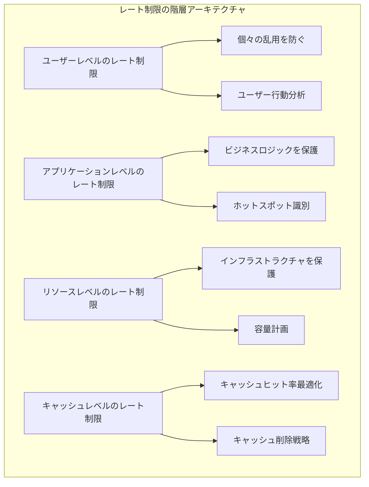

### 3.1 レート制限の体系的設計哲学

**FluxNinaの2x2フレームワーク**は、2024年のレート制限設計の標準方法論を提供し、戦略を4つの象限に分け、それぞれ異なるビジネスシナリオと技術実装に対応しています:

```mermaid
quadrantChart
    title レート制限戦略選択の2x2フレームワーク
    x-axis 静的戦略 --> 適応型戦略
    y-axis グローバルレート制限 --> ユーザーごとのレート制限

    quadrant-1 インテリジェントなパーソナライズドレート制限
        : Netflixのユーザーレベル並行制御
        : Stripeの顧客ごとのAPIクォータ
        : 40%のパフォーマンス向上を達成

    quadrant-2 エンタープライズレベルのグローバルレート制限
        : AWS API Gateway
        : クラウドサービスの総量制御
        : インフラストラクチャを保護

    quadrant-3 基本サービス保護
        : 従来のレート制限
        : 固定QPSしきい値
        : シンプルで信頼性が高い

    quadrant-4 インテリジェントトラフィック制御
        : 適応型並行制限
        : レイテンシフィードバックに基づく
        : 平均レイテンシを35%削減
```

### 3.2 適応型レート制限アルゴリズムのコアブレークスルー

**Netflixの適応型並行制限アルゴリズム**は、リトルの法則に基づいて、レート制限分野で大きなブレークスルーを達成しました:

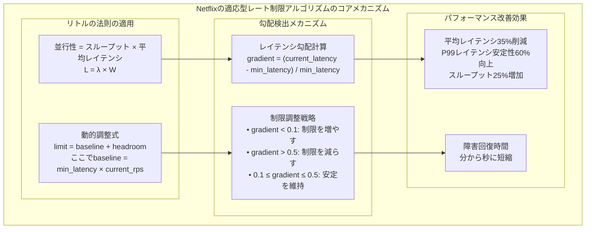

### 3.3 アルゴリズムパフォーマンスベンチマークと選択戦略

2024年の最新ストレステストデータに基づく、標準化されたシナリオにおける異なるレート制限アルゴリズムのパフォーマンス:

```mermaid
xychart-beta
    title "レート制限アルゴリズムのパフォーマンスベンチマーク比較(10K並行リクエスト)"
    x-axis [Token_Bucket, Sliding_Window, Fixed_Window, Leaky_Bucket]
    y-axis "QPS処理能力" 0 50000
    bar [45000, 42000, 38000, 35000]
```

```mermaid
xychart-beta
    title "P99レイテンシパフォーマンス比較"
    x-axis [Token_Bucket, Sliding_Window, Fixed_Window, Leaky_Bucket]
    y-axis "レイテンシ(ms)" 0 30
    line [12, 15, 22, 18]
```

**アルゴリズム選択決定木**:

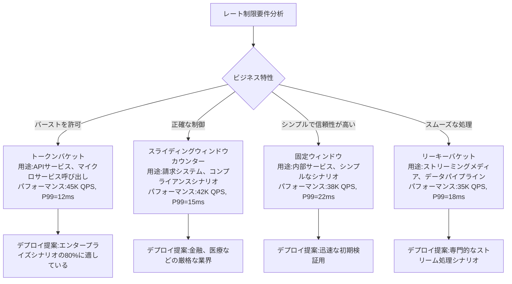

## 結論:パフォーマンス最適化のコア哲学

### 設計原則の階層的思考

```mermaid
pyramid
    title パフォーマンス最適化の知恵ピラミッド
    "予防的設計" : 40
    "監視とアラート" : 30
    "問題診断" : 20
    "緊急消火活動" : 10
```

**第1層:予防的設計(最も重要)**

-   システム設計段階で並行処理とスケーラビリティを考慮します。
-   適切なアーキテクチャパターンと技術ソリューションを選択します。
-   合理的なリソース割り当てと境界設定を確立します。

**第2層:監視とアラート**

-   包括的な監視システムを確立します。
-   合理的なアラートしきい値を設定します。
-   潜在的な問題を事前に発見します。

**第3層:問題診断**

-   パフォーマンスボトルネックを迅速に特定します。
-   根本原因を分析します。
-   的を絞ったソリューションを開発します。

**第4層:緊急消火活動**

-   一時的なパフォーマンスチューニング。
-   緊急スケーリング。
-   緊急時の劣化計画。

### 実際の適用のための思考フレームワーク

システム設計問題に直面したとき、これらの質問を自問する必要があります:

1.  **リソースの再利用**:この操作は既存のリソースを再利用できますか?
2.  **非同期分離**:このプロセスは即座に完了する必要がありますか?非同期で処理できますか?
3.  **キャッシュアクセラレーション**:このデータは繰り返しアクセスされますか?キャッシュできますか?
4.  **バッチ処理**:複数の類似操作を一緒に処理できますか?
5.  **分割統治**:この大きな問題を小さな問題に分解できますか?
6.  **専門化**:異なる種類の操作を別々に処理できますか?

覚えておいてください:**最良のパフォーマンス最適化は、問題が発生してから解決することではなく、設計段階でパフォーマンス問題を回避することです。**

## AWSベストプラクティスの概要

### AWSサービス選択ガイド

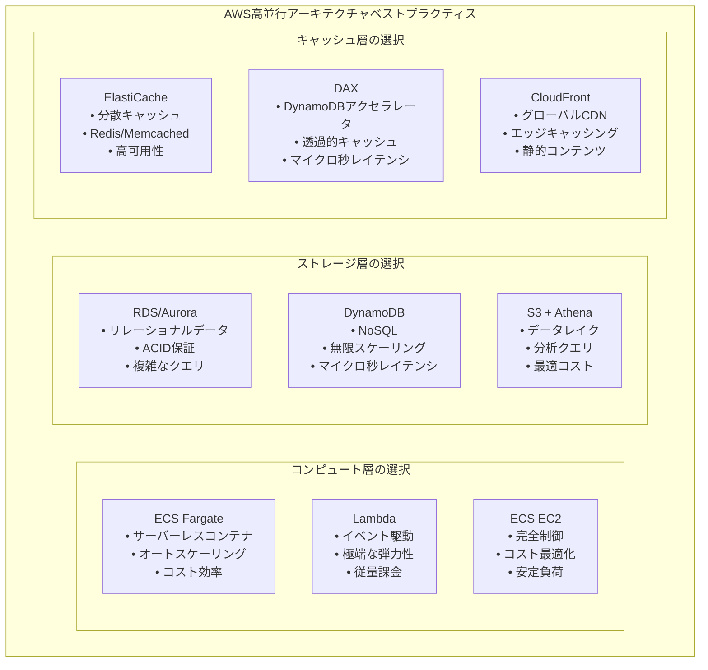

### コスト最適化戦略

| サービス組み合わせ                 | 適用可能なシナリオ          | コスト特性       | パフォーマンス特性      |
| ----------------------------------- | ---------------------------- | -------------------------- | -------------------------------- |
| **Lambda + DynamoDB + DAX**         | バーストトラフィック、イベント駆動 | 従量課金、制御可能なコスト | 極端な弾力性、コールドスタートレイテンシ |
| **ECS Fargate + Aurora Serverless** | 予測可能な負荷、オートスケーリング | バランスの取れたコストとパフォーマンス | 高速スケーリング、良好な安定性     |
| **ECS EC2 + RDS + ElastiCache**     | 安定した高負荷、コスト意識 | リザーブドインスタンスで60%節約 | 最高のパフォーマンス、複雑な管理 |

### 監視とアラート設定

**CloudWatchキーメトリクス**:

-   **アプリケーション層**: ECS CPU/メモリ使用率、Lambda実行時間、API Gatewayレイテンシ
-   **データベース層**: RDS接続数、Auroraレプリケーションラグ、DynamoDB読み取り/書き込み容量
-   **キャッシュ層**: ElastiCacheヒット率、DAXレイテンシ、CloudFrontキャッシュヒット率

**自動化ベストプラクティス**:

-   Auto Scalingを使用してメトリクスに基づいてリソースを自動調整します。
-   CloudWatchアラームを設定して予防的監視を行います。
-   AWS Configを利用してベストプラクティス設定を保証します。

最後に、実際のパフォーマンステストとコスト分析に基づいて、私たちが議論してきた3つのシナリオに対して差別化されたAWS設定推奨事項を提供します:

**投資取引システム:極限パフォーマンス構成**

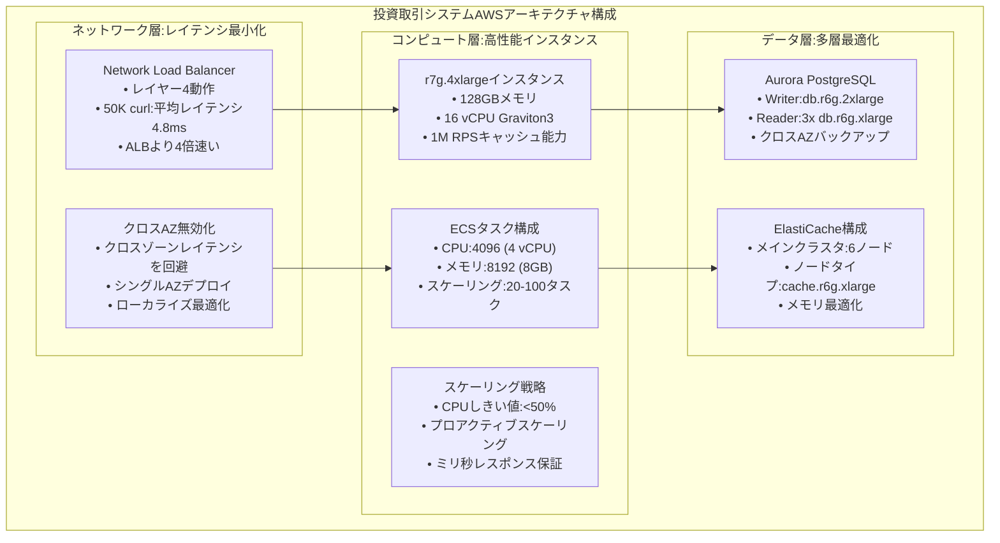

**家計管理システム:コスト最適化構成**

```mermaid
graph TB
    subgraph "家計管理システムAWSコスト最適化アーキテクチャ"
        subgraph "ハイブリッドコンピュート戦略"
            H1["Lambda + ECSハイブリッド<br/>• Lambda:バースト処理<br/>• ECS:安定負荷<br/>• コスト:60%節約"]
            H2["ECS構成<br/>• CPU:1024 (1 vCPU)<br/>• メモリ:2048 (2GB)<br/>• スケーリング:2-10タスク"]
            H3["Lambda構成<br/>• メモリ:512MB<br/>• タイムアウト:30s<br/>• 並行性:100"]
        end

        subgraph "データベース簡素化"
            DB1["RDS PostgreSQL<br/>• インスタンス:db.t4g.medium<br/>• ストレージ:汎用SSD<br/>• バックアップ:7日間保持"]
            DB2["ElastiCache節約<br/>• ノード:cache.t4g.medium<br/>• シングルノード:開発環境<br/>• 2ノード:本番環境"]
        end

        subgraph "コスト制御戦略"
            CC1["スポットインスタンス<br/>• ECS Spot:70%コスト削減<br/>• 非クリティカル負荷<br/>• 自動フェイルオーバー"]
            CC2["リザーブドインスタンス<br/>• 1年契約:40%割引<br/>• 3年契約:60%割引<br/>• 安定負荷に適している"]
        end

        H1 --> DB1 --> CC1
        H2 --> DB2 --> CC2
        H3 --> CC1
    end
```

これらのAWSサービス構成は、明日のキャッシュ設計のための具体的な技術基盤を提供します:

-   **多層キャッシュアーキテクチャ**: ElastiCache + アプリケーションキャッシュ + CDN
-   **キャッシュ戦略選択**: ECSタスク数と負荷パターンに基づく
-   **コスト最適化**: 異なるサービス組み合わせのコストベネフィット分析
-   **監視統合**: CloudWatchメトリクス駆動のキャッシュ戦略調整

## 今日の並行処理設計哲学

-   **並行処理の本質はデータフロー管理の技術です**:異なるトラフィックパターンには異なるアーキテクチャ戦略が必要です。
-   **レート制限はガイダンスのためであり、ブロッキングのためではありません**:インテリジェントなレート制限がキャッシュ最適化の条件を作り出します。
-   **データ階層化はキャッシュ戦略に役立ちます**:ホット、ウォーム、コールドデータの階層化はキャッシュレベルに直接対応します。
-   **アーキテクチャの進化は複雑性管理を反映します**:モノリスからマイクロサービス、イベント駆動への段階的な進行。

### アーキテクチャ進化の3つの段階

#### 段階1:モノリシックアーキテクチャにおける並行処理最適化

-   **コア戦略**:すべてのパフォーマンスを単一のエンティティに集中させ、「垂直スケーリング」に依存して需要をサポートします。
-   **象徴的意味**:木の幹が上に成長するように、同じ方向にエネルギーを積み重ねます。
-   **制限**:ハードウェア限界を超えると、拡張スペースが制限されます。

#### 段階2:マイクロサービスアーキテクチャにおける並行処理調整

-   **コア戦略**:マルチサービスの並列処理とオートスケーリングによってグループの弾力性を実現します。
-   **象徴的意味**:オーケストラのように、調整と分業によってより大きな音量と調和を実現します。
-   **制限**:サービス間通信、レイテンシ、整合性管理が新たな課題になります。

#### 段階3:イベント駆動アーキテクチャにおける並行処理ストリーム処理

-   **コア戦略**:イベントを最小単位として、システムはリアルタイムで弾力的に認識して応答できます。
-   **象徴的意味**:絶え間なく流れる川のように、地形と時間の変化に基づいて速度と方向を調整できます。
-   **制限**:イベントの順序、時間的整合性、ストリーム処理の安定性が新時代のボトルネックになります。

#### 抽象的進化軌跡

1.  **集中強化**:単一ポイントを大きくし、ハードウェアとシンプルなゲートキーピングで秩序を維持します。
2.  **分散オーケストレーション**:複数のポイントが並列に動作し、調整と共有によって全体の調和を維持します。
3.  **動的フロー**:イベントを脈拍として、フロー制御と弾力的応答によって環境に適応します。

全体として、これら3層の抽象化は、**静的安定性 → 動的調整 → 流動的適応**への進化経路を明らかにしています。

```mermaid
flowchart TD
    A[段階1:モノリシックアーキテクチャ\n「集中強化」] --> B[段階2:マイクロサービスアーキテクチャ\n「分散オーケストレーション」]
    B --> C[段階3:イベント駆動アーキテクチャ\n「動的フロー」]

    subgraph S1[モノリス特性]
      A1[(垂直スケーリング)]
      A2[(ローカルキャッシュ)]
      A3[(シンプルなレート制限)]
    end
    A --> A1 & A2 & A3

    subgraph S2[マイクロサービス特性]
      B1[(水平スケーリング)]
      B2[(分散キャッシュ)]
      B3[(多層制限)]
    end
    B --> B1 & B2 & B3

    subgraph S3[イベント駆動特性]
      C1[(弾力的イベント駆動)]
      C2[(ストリーミングキャッシュ)]
      C3[(バックプレッシャー制御)]
    end
    C --> C1 & C2 & C3

```

覚えておいてください:高並行処理設計の究極の目標は、より多くのリクエストを処理することではなく、ユーザーに安定した、高速で、コスト最適化されたサービス体験を提供することです。並行処理戦略のすべての選択は、全体的なアーキテクチャの**信頼性、スケーラビリティ、保守性**に役立つべきです。

---

> 「並行システムの真の技術はこれにあります:私たちはトラフィックを処理する機械を設計しているのではなく、データの流れを導くインテリジェントなパイプラインを設計しているのです。すべてのアーキテクチャ決定は、適切な場所に、適切な時間に、適切な方法でデータを流すようにすべきです。」
