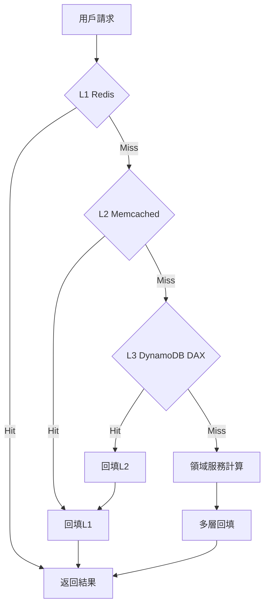

# Day 10 | 快取策略的哲學：時間、空間與一致性的權衡藝術

經過前面九天的建模與分析，我們已經確定了系統的本質、邊界和交互模式。但現在面臨一個更實際的問題：**如何在真實世界的約束下，讓這些精心設計的領域概念快速響應用戶需求？**

當投資交易系統需要在毫秒內完成風險計算、家庭財務系統要支撐多人同時操作、健康監控要處理海量 IoT 數據時，純粹的業務邏輯計算已經無法滿足性能要求。

這就是**快取設計**的本體論意義：**在保持領域純粹性的同時，為系統注入時間和空間的優化策略。**

每個快取決策都會影響用戶體驗、系統成本和數據正確性。所以快取的架構設計在 Domain 的驅動開發中無疑也是重中之重的議題。

我們在每次的需求確認中，需要且必須追問的是

**這個業務場景對延遲和數據不一致的容忍度是多少？我們願意為此付出多少開發和維運成本？**

我們接下來將逐步一同討論在快取中我們最常遇見的情境與議題。這裡簡單列下主題:

- 快取的三重存在論：本地、雲端、數據端
- 資料一致性的三個層次：強一致、最終一致、因果一致
- 資安暴露風險與效能的辯證關係
- 快取失效策略：時間的哲學
- 成本建模：ROI 驅動的快取決策
- 快取監控：可觀測性的三個維度

記住這個框架：**熱度決定位置**，**容忍度決定模型**，**耦合度決定實現**。當我們面對任何一個需要快取的場景時，先用這三個原則去剖析它，技術選型自然會水到渠成。

## 快取的三重存在論：本地、雲端、數據端

**在什麼時機更新快取？如何在成本控制與系統性能之間找到最佳平衡點？如何處理快取帶來的資料一致性問題？**

快取不只是技術優化，而是對**數據存在狀態**的深層思考。所有數據在不同的位置、不同的時間，都有其特定的存在意義和價值。

快取（Cache）的本質，就是在我們身邊放一個書架。

這個書架可以放在我們的書桌上（**本地端快取**）、樓下的閱覽室（**雲端快取**），甚至是圖書館門口的快速取書櫃（**資料庫快取**）。

但問題來了：

1. 空間有限：我們的書架放不下所有書。我們放了 A 書，就可能得把 B 書拿掉。這就是 替換策略（Eviction Policy），比如 LRU（把最久沒看的書丟掉）。

2. 資訊會過期：圖書館的書更新了，我們書架上的還是舊版。這就是 一致性（Consistency） 問題。
3. 管理成本：我們得花心力去整理書架，決定哪些書要放、哪些要更新。這就是 快取策略（Caching Strategy） 的成本。

所以，快取設計的全部技術，都是圍繞著「如何用最小的管理成本，在有限的書架空間上，最大化地存放最有價值且不過時的資訊」這個核心問題展開的。

常見的區分方式有:熱數據 (Hot Data)、溫數據 (Warm Data)、冷數據 (Cold Data)

**熱數據** (Hot Data)：例如，一個交易系統的即時股價、社群媒體的熱門貼文。

- 特徵：讀取頻率極高，時效性極短（秒級甚至毫秒級）。
- 選型依據：速度就是一切。我們需要最快的書架，而且要離我們最近。
- 技術選型：In-Memory Cache，如 Redis 或 Memcached。它們把數據直接放在記憶體裡，讀取速度是微秒級的，就像我們大腦裡的記憶一樣快。
- 優劣：
  - 優：極致的速度。
  - 劣：昂貴（記憶體比硬碟貴得多），且數據易失（斷電就沒了，除非有額外持久化機制）。

**溫數據** (Warm Data)：例如，我們的個人資料頁面、不常變動的產品目錄。

- 特徵：讀取頻率高，但可以容忍幾分鐘甚至幾小時的延遲。
- 選型依據：平衡成本與效能。可以放在離用戶近、但又不用自己維護的地方。
- 技術選型：CDN (Content Delivery Network)，如 CloudFront 或 Cloudflare。它們在全球各地都有節點（閱覽室），能把我們的數據快取到離用戶最近的地方。
- 優劣：
  - 優：大幅降低伺服器負載，提升全球用戶的訪問速度。
  - 劣：主要適用於公開或半公開數據，對於個人化動態內容的快取配置複雜，且快取失效（更新）不夠即時。

**冷數據** (Cold Data)：例如，幾年前的交易紀錄、不活躍用戶的資料。

- 特徵：很少讀取，但需要時仍要能取得。
- 選型依據：成本最低化。直接去圖書館（資料庫）拿就好，甚至可以考慮把這些書放到更便宜的地下書庫（歸檔儲存）。這類數據通常不值得快取。

```mermaid
graph TB
    subgraph "數據時效性矩陣"
        A1[實時價格數據<br/>秒級更新]
        A2[用戶持倉數據<br/>交易觸發更新]
        A3[風險指標數據<br/>分鐘級重算]
        A4[歷史報表數據<br/>日級更新]

        B1[家庭預算狀態<br/>支出觸發更新]
        B2[月度統計數據<br/>天級更新]
        B3[用戶偏好設定<br/>手動更新]
        B4[歷史支出數據<br/>不變數據]

        C1[設備即時數據<br/>分鐘級更新]
        C2[健康趨勢分析<br/>小時級更新]
        C3[告警閾值設定<br/>手動更新]
        C4[醫療歷史記錄<br/>追加型數據]
    end

    subgraph "快取策略映射"
        S1[Write-Through<br/>即寫即快取<br/>強一致性]
        S2[Write-Behind<br/>延遲寫入<br/>最終一致性]
        S3[Cache-Aside<br/>手動管理<br/>因果一致性]
        S4[Read-Through<br/>穿透讀取<br/>可配置一致性]
    end

    subgraph "技術實現"
        T1[Redis Cluster<br/>+ ElastiCache]
        T2[DynamoDB DAX<br/>+ Lambda 異步]
        T3[Application Cache<br/>+ EventBridge]
        T4[CloudFront<br/>+ S3 Origin]
    end

    %% 投資交易系統映射
    A1 --> S1
    A1 --> T1
    A2 --> S2
    A2 --> T2
    A3 --> S3
    A3 --> T1
    A4 --> S4
    A4 --> T4

    %% 家庭財務系統映射
    B1 --> S3
    B1 --> T3
    B2 --> S4
    B2 --> T2
    B3 --> S3
    B3 --> T3
    B4 --> S4
    B4 --> T4

    %% 健康監控系統映射
    C1 --> S1
    C1 --> T1
    C2 --> S2
    C2 --> T2
    C3 --> S3
    C3 --> T3
    C4 --> S4
    C4 --> T4

    %% 策略到技術的關聯
    S1 --> T1
    S2 --> T2
    S3 --> T3
    S4 --> T4

    classDef hotData fill:#ff6b6b,stroke:#333,stroke-width:2px,color:#fff
    classDef warmData fill:#ffd93d,stroke:#333,stroke-width:2px,color:#333
    classDef coldData fill:#6bcf7f,stroke:#333,stroke-width:2px,color:#333
    classDef strategy fill:#4ecdc4,stroke:#333,stroke-width:2px,color:#fff
    classDef tech fill:#a8e6cf,stroke:#333,stroke-width:2px,color:#333

    class A1,C1 hotData
    class A2,A3,B1,B2,C2 warmData
    class A4,B3,B4,C3,C4 coldData
    class S1,S2,S3,S4 strategy
    class T1,T2,T3,T4 tech
```



結合到快取位置遠近的關係，我們可以整理出常見的幾重關卡: 本地、雲端、數據端

### 第一重存在：本地端快取 - 最接近用戶意識的數據

**哲學定位**：本地端快取是數據與用戶認知最直接的接觸點，它回答了「什麼數據應該立即可得」的問題。

#### 投資交易系統的本地端快取設計

```javascript
// 前端本地快取的領域抽象
class PortfolioLocalCache {
  constructor() {
    this.realtimeData = new Map(); // 實時數據：價格、持倉
    this.calculatedMetrics = new Map(); // 計算結果：風險值、損益
    this.userPreferences = new Map(); // 用戶偏好：介面設定、警告閾值
  }

  // 核心洞察：不同數據的失效策略反映了其業務重要性
  getDataWithStrategy(key, dataType) {
    switch (dataType) {
      case "REAL_TIME_PRICE":
        return this.getOrFetch(key, 100); // 100ms 失效
      case "RISK_CALCULATION":
        return this.getOrFetch(key, 1000); // 1s 失效，允許短暫延遲
      case "USER_PREFERENCES":
        return this.getOrFetch(key, 300000); // 5分鐘失效，穩定性優先
    }
  }
}
```

**本地端快取的設計哲學**：

1. **認知負荷最小化**：最常用的功能應該零延遲
2. **離線容錯能力**：網路中斷時系統仍可部分運作
3. **隱私優先策略**：敏感數據優先在本地處理

**AWS 實現策略**：

```yaml
# CloudFront Edge Locations 作為本地端延伸
CloudFrontDistribution:
  PriceClass: PriceClass_All
  CacheBehaviors:
    - PathPattern: "/api/realtime/*"
      CachePolicyId: 4135ea2d-6df8-44a3-9df3-4b5a84be39ad # Caching Disabled
    - PathPattern: "/api/historical/*"
      CachePolicyId: 658327ea-f89d-4fab-a63d-7e88639e58f6 # Caching Optimized
      TTL: 3600 # 1小時快取，歷史數據相對穩定
```

### 第二重存在：雲端快取 - 分散式數據的協調中心

**哲學定位**：雲端快取是多個服務間數據共享的協調機制，它解決了「如何在分散式環境中維持數據的一致性視圖」的問題。

#### 多層次雲端快取架構的設計

```python
# 雲端快取的層次化設計
class DistributedCacheStrategy:
    def __init__(self):
        self.l1_cache = ElastiCacheRedis(node_type="cache.r6g.large")
        self.l2_cache = ElastiCacheMemcached(node_type="cache.r6g.xlarge")
        self.l3_cache = DynamoDBDAX()  # 數據庫快取層

    async def get_portfolio_risk(self, portfolio_id):
        # L1: 熱數據，毫秒級存取
        risk_data = await self.l1_cache.get(f"risk:{portfolio_id}")
        if risk_data:
            return risk_data

        # L2: 溫數據，支援複雜計算結果
        risk_data = await self.l2_cache.get(f"risk:{portfolio_id}")
        if risk_data:
            await self.l1_cache.set(f"risk:{portfolio_id}", risk_data, ttl=60)
            return risk_data

        # L3: 冷數據，從數據庫快取層獲取
        risk_data = await self.calculate_and_cache_risk(portfolio_id)
        return risk_data
```

**雲端快取的領域映射**：



**成本考量的策略決策**：

```yaml
# ElastiCache 成本優化配置
RedisCluster:
  NodeType: cache.r6g.large # 記憶體優化型
  NumCacheNodes: 3
  AutomaticFailoverEnabled: true
  MultiAZEnabled: true
  # 成本分析：$0.2016/小時 * 3 節點 * 24 * 30 = $435.5/月

MemcachedCluster:
  NodeType: cache.r6g.xlarge # 更大容量，更低單位成本
  NumCacheNodes: 2
  # 成本分析：$0.4032/小時 * 2 節點 * 24 * 30 = $580.6/月
# 總快取成本：$1016.1/月
# 效益：減少 RDS 查詢 80%，節省資料庫執行成本 $2000/月
# ROI：(2000 - 1016) / 1016 = 96.8% 正向投資報酬率
```

### 第三重存在：數據端快取 - 最接近數據本源的優化

**哲學定位**：數據端快取是數據在其原生環境中的預處理和優化，它回答了「如何讓數據自身更高效」的問題。

#### DynamoDB DAX 的領域價值

```python
# DynamoDB DAX 作為數據端快取的抽象
class DomainDataCache:
    def __init__(self):
        self.dax_client = boto3.client('dax',
                                     endpoint_url='daxs://portfolio-cluster.abcdef.dax-clusters.us-east-1.amazonaws.com')
        self.dynamodb = boto3.resource('dynamodb')

    async def get_portfolio_holdings(self, portfolio_id):
        # DAX 自動處理快取邏輯，對應用透明
        response = await self.dax_client.get_item(
            TableName='Portfolios',
            Key={'portfolio_id': {'S': portfolio_id}},
            ConsistentRead=False  # 接受最終一致性換取效能
        )
        return response['Item']
```

**數據端快取的設計原則**：

1. **透明性**：應用代碼無需感知快取存在
2. **一致性等級**：根據業務需求選擇合適的一致性
3. **成本效益**：計算快取成本 vs 查詢成本的平衡點

## 資料一致性的三個層次：強一致、最終一致、因果一致

### 一致性模型的領域語義

我們必須去思考我們所面對的業務能容忍多大程度的「數據不一致」？這是快取設計中最具挑戰性的哲學問題。例如，銀行帳戶餘額、交易下單，數據不一致會導致直接的金融損失或法律問題，在這個情境中 **正確性壓倒一切**。寧可慢，不可錯。這種就要求強一致性。

#### 強一致性、最終一致性與因果一致性

在設計分散式系統時，「一致性」是一個核心議題。特別是在涉及快取策略時，理解不同的一致性模型對於系統的行為和性能有著直接的影響。以下是三種主要的一致性模型及其特點：

#### 1. 強一致性 (Strong Consistency)

**概念與比喻：**
就像在使用 Google Docs 時，我們打下一個字，我們的同事（理論上）會**立即**看到這個字。任何後續的操作都是基於這個最新的版本。所有人都看到完全相同的、唯一的「真相」。

**特性：**

- **線性化 (Linearizability)**：一旦寫入操作完成，任何後續的讀取操作（無論來自哪個用戶或節點）都必須返回該寫入的值或更新的值。
- **原子性 (Atomicity)**：操作要麼完全成功，要麼完全失敗，不存在中間狀態。
- **全局順序 (Global Order)**：系統中的所有操作看起來就像是按照一個唯一的、全局的時間線順序執行的。

**優點：**

- **開發心智負擔低**：開發者無需處理數據可能過期的複雜情況，邏輯最直觀。
- **數據絕對正確**：對於金融交易、庫存管理、帳戶餘額等零容忍場景，這是唯一選擇。

**缺點：**

- **高延遲 (High Latency)**：系統需要確保所有副本都同步完成數據更新後，才能向客戶端確認寫入成功，這會增加寫入操作的耗時。
- **低可用性 (Lower Availability)**：在網路分區（Partition）的情況下，為了保證一致性，系統可能會拒絕服務（寫入或讀取），犧牲了可用性（違反了 CAP 定理中的 A）。
- **擴展性差**：在地理上分散的系統中，跨區域同步的延遲會成為巨大瓶頸。

**AWS 應用服務：**

- **Amazon RDS (單一主節點)**：傳統的關聯式資料庫是強一致性的典型代表。所有寫入都發生在主節點上。
- **Amazon DynamoDB (搭配 `ConsistentRead=True`)**：當我們進行讀取時，可以明確要求 DynamoDB 執行「強一致性讀取」。這會直接從主分區讀取最新數據，但會消耗更多讀取容量單位（RCU）且延遲較高。
- **Amazon ElastiCache for Redis (搭配交易或鎖)**：通過使用 Redis 的 `MULTI/EXEC` 事務或分散式鎖（如 RedLock），可以在特定操作上強制實現原子性和強一致性。

#### 2. 最終一致性 (Eventual Consistency)

**概念與比喻：**
我們在 Facebook 或 Instagram 上發布了一張照片。我們的朋友可能不會在同一毫秒看到它。美國的朋友可能比台灣的朋友晚幾秒鐘才看到，但系統**最終**會保證，在一段時間後，所有人都能看到這張照片。

**特性：**

- **最終同步**：如果沒有新的更新操作，最終所有副本的數據都會達到一致的狀態。
- **高可用性**：即使部分節點或網路出現問題，系統仍然可以接受讀寫操作，優先保證服務不中斷。
- **無特定順序**：不保證不同副本更新的順序。

**優點：**

- **低延遲 (Low Latency)**：寫入操作可以快速在本地副本完成並返回，無需等待所有副本同步，用戶體驗極佳。
- **高可用性 (High Availability)**：系統容錯能力強，是為大規模、全球分佈的系統設計的。
- **高吞吐量**：讀寫操作可以分散到多個節點，極大地提高了系統的吞吐能力。

**缺點：**

- **開發心智負擔高**：開發者必須設計能處理「讀到舊數據」情況的應用邏輯。
- **數據短暫不一致**：在同步完成前的時間窗口內，讀取操作可能拿到過期的數據。

**AWS 應用服務：**

- **Amazon DynamoDB (預設讀取)**：DynamoDB 的預設讀取模式就是「最終一致性讀取」，它速度快且成本只有強一致性讀取的一半。
- **Amazon S3**：S3 在覆蓋寫（PUT）和刪除（DELETE）操作上提供最終一致性。（注意：S3 現在對新對象的 PUT 操作提供強一致性）。
- **Amazon CloudFront**：CDN 是最終一致性的典型範例。當我們更新源站內容後，全球各地的邊緣節點需要時間來同步最新的內容。

#### 3. 因果一致性 (Causal Consistency)

**概念與比喻：**
這是一致性模型中的一個精妙平衡。想像一個論壇的留言串：

1.  我們發表了一篇主題文章 A。
2.  有人接著對文章 A 發表了一條評論 B。

因果一致性保證：**任何看到評論 B 的人，必須也能看到文章 A**。它不關心其他無關的操作順序，但它嚴格保護有「因果關係」的操作順序。一個用戶不可能看到「回覆」，卻看不到「原文」。

**特性：**

- **保留因果順序**：如果操作 A 在因果上發生在操作 B 之前（例如，B 是對 A 的回應），那麼系統保證任何進程讀取到 B 時，也必須能讀取到 A。
- **並行操作無序**：對於沒有因果關係的並行操作（例如，兩個用戶同時評論文章 A），它們的順序則不被保證。

**優點：**

- **兼顧效能與邏輯正確性**：比強一致性有更好的效能和可用性，同時又比最終一致性提供了更強的邏輯保證，避免了許多用戶體驗上的混亂。
- **符合人類直覺**：非常適合對話、評論、協作編輯等場景。

**缺點：**

- **實現複雜**：需要系統追蹤操作之間的依賴關係（通常使用向量時鐘等技術），比最終一致性更難實現。
- **仍非強一致**：對於無因果關係的數據，仍然可能存在不一致。

**AWS 應用服務：**

- **Amazon DynamoDB Streams**：這是一個非常巧妙的應用。我們可以利用 Streams 來捕捉一個表的所有修改事件（A、B、C...），並確保它們是按順序處理的。這允許在下游系統中重建因果關係。例如，在我們的家庭財務系統範例中，使用 Streams 來處理支出記錄，就能保證按順序更新預算，這就是一種因果一致性的實現。
- **Amazon QLDB (Quantum Ledger Database)**：QLDB 是一個可驗證的帳本資料庫，它記錄了數據的完整變更歷史。通過查詢這個日誌，可以明確地重建所有操作的因果鏈。

#### 總結對照表

| 特性           | 強一致性 (Strong)             | 因果一致性 (Causal)    | 最終一致性 (Eventual)             |
| :------------- | :---------------------------- | :--------------------- | :-------------------------------- |
| **核心保證**   | 讀取最新寫入                  | 讀取操作必先於其因     | 最終會讀到最新寫入                |
| **延遲**       | 高                            | 中                     | 低                                |
| **可用性**     | 低                            | 中                     | 高                                |
| **開發複雜度** | 低                            | 高                     | 中                                |
| **適用場景**   | 銀行交易、庫存                | 留言系統、協作文檔     | 社群動態、點讚數                  |
| **AWS 範例**   | RDS, DynamoDB(ConsistentRead) | DynamoDB Streams, QLDB | S3, DynamoDB(Default), CloudFront |

不同的業務場景對數據一致性有不同的容忍度，這直接影響快取策略的設計，接下來我們用我們一直以來的財務情境:投資財務與家庭財務，來討論在不同情境中對於一致性的需求。

### 投資交易系統的一致性權衡

**場景分析**：當用戶同時在手機和電腦上操作投資組合時：

```python
class PortfolioConsistencyManager:
    def __init__(self):
        self.strong_consistency_cache = RedisCluster(consistency='strong')
        self.eventual_consistency_cache = CloudFrontCache(ttl=300)

    async def handle_trade_order(self, user_id, order):
        # 交易執行：必須強一致
        async with self.strong_consistency_cache.lock(f"portfolio:{user_id}"):
            current_balance = await self.get_account_balance(user_id)
            if current_balance >= order.amount:
                await self.execute_trade(order)
                await self.invalidate_all_portfolio_caches(user_id)

    async def get_portfolio_summary(self, user_id):
        # 組合總覽：可接受最終一致性
        cached_summary = await self.eventual_consistency_cache.get(f"summary:{user_id}")
        if cached_summary and self.is_acceptable_staleness(cached_summary.timestamp):
            return cached_summary
        return await self.calculate_fresh_summary(user_id)
```

### 家庭財務系統的協作一致性

**多用戶協作的一致性挑戰**：

```python
class FamilyFinanceConsistency:
    """家庭成員間的數據一致性管理"""

    async def record_expense(self, family_id, member_id, expense):
        # 支出記錄：需要因果一致性，保證操作順序
        sequence_id = await self.get_next_sequence(family_id)

        # 使用 DynamoDB Streams 確保順序
        await self.expenses_table.put_item(
            Item={
                'family_id': family_id,
                'sequence_id': sequence_id,
                'member_id': member_id,
                'expense': expense,
                'timestamp': datetime.utcnow().isoformat()
            }
        )

        # 觸發其他家庭成員的快取更新
        await self.notify_family_members(family_id, member_id, expense)
```

**快取策略選擇的業務邏輯簡要歸納**：

| 數據類型     | 更新頻率 | 一致性需求 | 快取策略      | 技術選型          | 業務理由                 |
| ------------ | -------- | ---------- | ------------- | ----------------- | ------------------------ |
| **實時價格** | 秒級     | 強一致性   | Write-Through | Redis Cluster     | 交易決策基礎，零容忍錯誤 |
| **用戶持倉** | 事件觸發 | 最終一致性 | Write-Behind  | DynamoDB DAX      | 寫入頻繁，允許短暫延遲   |
| **風險指標** | 分鐘級   | 因果一致性 | Cache-Aside   | Application Cache | 計算密集，需控制更新時機 |
| **歷史報表** | 日級     | 最終一致性 | Read-Through  | CloudFront + S3   | 讀多寫少，全球分發需求   |
| **預算狀態** | 支出觸發 | 因果一致性 | Cache-Aside   | EventBridge       | 家庭成員協作，需序列更新 |
| **設備數據** | 分鐘級   | 強一致性   | Write-Through | Redis Cluster     | 告警基礎，即時響應需求   |

## 資安暴露風險與效能的辯證關係

簡單來說，這兩者在本質上是一對矛盾體。

效能的極致追求是將數據盡可能地複製、分發，並放置在離用戶最近的地方（瀏覽器、CDN、記憶體快取），以求最快的回應速度。但安全的極致追求是將數據的副本減到最少，最好只存在於一個地方（如加密的資料庫），並對其進行最嚴格的存取控制。

一個要「散」，一個要「收」。這就是它們的辯證關係。快取設計的藝術，就是在這兩者之間找到一個最適合業務的平衡點。

### 快取作為攻擊面的擴大

每個快取層都是潛在的安全風險點，這是理解整個問題的基礎。當我們為了效能而建立一個快取層時，無論是 Redis、Memcached 還是 CDN，我們都創造了一個新的、可能比我們的主資料庫更容易被攻擊的目標。

- 數據洩漏風險：如果快取服務（如 Redis）沒有配置好存取控制，攻擊者可能直接從記憶體中讀取到大量敏感數據。
- 數據篡改風險：攻擊者可能修改快取中的內容（例如，將商品價格改為 0），導致業務邏輯錯亂。
- 中間人攻擊：如果應用程式與快取之間的通訊沒有加密，數據可能在傳輸過程中被竊聽。

既然風險客觀存在，我們就不能一刀切地「全快取」或「不快取」。我們必須為**不同敏感度**的數據，制定不同的快取策略。

```python
class SecureCacheDesign:
    """安全優先的快取設計"""

    def __init__(self):
        self.sensitive_data_policy = {
            'PII': 'NEVER_CACHE',  # 個人身分資訊永不快取
            'CREDENTIALS': 'NEVER_CACHE',  # 認證資訊永不快取
            'FINANCIAL_DETAILS': 'ENCRYPTED_CACHE_ONLY',  # 金融資訊僅加密快取
            'PREFERENCES': 'LOCAL_CACHE_OK',  # 偏好設定可本地快取
            'PUBLIC_DATA': 'FULL_CACHE_OK'  # 公開資料可完全快取
        }

    async def cache_with_security_policy(self, data_type, data, user_context):
        policy = self.sensitive_data_policy.get(data_type)

        if policy == 'NEVER_CACHE':
            return await self.fetch_fresh_data(data, user_context)

        elif policy == 'ENCRYPTED_CACHE_ONLY':
            encrypted_data = await self.encrypt_with_user_key(data, user_context)
            return await self.secure_cache.set_encrypted(data.key, encrypted_data)

        else:
            return await self.standard_cache.set(data.key, data)
```

- 'PII': 'NEVER_CACHE'：像身分證號碼、真實姓名這類個人可識別資訊，其洩漏的法律和商譽風險極高。為了安全，我們寧願犧牲效能，永遠直接從受嚴格保護的資料庫讀取。
- 'FINANCIAL_DETAILS': 'ENCRYPTED_CACHE_ONLY'：像帳戶餘額、交易紀錄，這些數據需要高效能存取，但又極度敏感。這裡的平衡點就是「加密快取」。數據在存入快取前，使用用戶特定的金鑰進行加密。即使快取被攻破，攻擊者拿到的也只是一堆無法解讀的密文。這是在效能和安全之間找到的一個精妙的折衷。
- 'PREFERENCES': 'LOCAL_CACHE_OK'：像用戶的介面主題、語言偏好，這些數據敏感度低，且與單一用戶強相關。將其放在本地（瀏覽器快取）是最佳選擇，既能提供零延遲的體驗，又不會造成大規模數據洩漏風險。

### AWS 的安全快取實現

```yaml
# Redis 加密快取配置
ElastiCacheReplicationGroup:
  AtRestEncryptionEnabled: true
  TransitEncryptionEnabled: true
  AuthToken: !Ref RedisAuthToken
  KmsKeyId: !Ref CacheEncryptionKey
  SecurityGroupIds:
    - !Ref CacheSecurityGroup

# VPC 內部快取，最小化暴露面
CacheSecurityGroup:
  SecurityGroupIngress:
    - IpProtocol: tcp
      FromPort: 6379
      ToPort: 6379
      SourceSecurityGroupId: !Ref ApplicationSecurityGroup
      # 只允許應用層存取，拒絕外部直接連線
```

- AtRestEncryptionEnabled: true：靜態加密。確保 Redis 儲存在硬碟上的數據（無論是備份還是 Swap）都是加密的。
- TransitEncryptionEnabled: true：傳輸中加密。確保我們的應用程式和 Redis 之間的所有通訊都經過 TLS 加密，防止網路竊聽。
- AuthToken: 為 Redis 設置密碼，這是最基本的存取控制。
- SecurityGroupIds: 這是最重要的安全措施之一。通過 AWS 的安全群組，我們可以設定一個防火牆規則，只允許我們的應用程式伺服器（ApplicationSecurityGroup）存取 Redis 的 6379 端口。這意味著，即使攻擊者在網際網路上掃描，也根本「看不到」我們的快取服務，極大地縮小了攻擊面。

### 效能與安全的平衡策略

「資安與效能的辯證關係」的核心思想是：**沒有絕對的安全，也沒有無限的效能**。

我們必須像一個風險投資家一樣，評估每一份數據的「風險敞口」和它能帶來的「效能回報」，然後為其量身定做一套包含技術實現、存取策略和生命週期管理的綜合性快取方案。

**四象限分析法**：

```
      高安全性
         |
低效能 ---|--- 高效能
         |
      低安全性
```

- 高敏感 & 高效能（右上象限）：這是最挑戰的場景，如投資交易的核心數據。策略是：使用加密的記憶體快取，並設置極短的 TTL（例如 60 秒）。短 TTL 意味著即使數據被洩漏，它的有效期也很短，從而降低了風險。
- 高敏感 & 低效能（左上象限）：最簡單的決策：不快取。安全永遠是第一位。
- 低敏感 & 高效能（右下象限）：這是最適合大展拳腳的場景，如公開的產品目錄、新聞文章。策略是：多層次快取，從 CDN 到應用層，並設置長 TTL，最大化效能。
- 低敏感 & 低效能（左下象限）：使用簡單的應用層快取即可，不需要複雜的架構。

```python
class PerformanceSecurityBalance:
    """效能與安全性的動態平衡"""

    def get_cache_strategy(self, data_sensitivity, performance_requirement):
        strategies = {
            ('HIGH_SENSITIVITY', 'HIGH_PERFORMANCE'): {
                'cache_type': 'encrypted_in_memory',
                'ttl': 60,  # 短暫快取減少暴露時間
                'location': 'application_tier_only'
            },
            ('HIGH_SENSITIVITY', 'LOW_PERFORMANCE'): {
                'cache_type': 'no_cache',
                'strategy': 'always_fetch_fresh'
            },
            ('LOW_SENSITIVITY', 'HIGH_PERFORMANCE'): {
                'cache_type': 'multi_tier',
                'ttl': 3600,
                'location': 'edge_and_application'
            },
            ('LOW_SENSITIVITY', 'LOW_PERFORMANCE'): {
                'cache_type': 'simple_cache',
                'ttl': 1800
            }
        }
        return strategies.get((data_sensitivity, performance_requirement))
```

## 快取失效策略：時間的哲學

如果說建立快取是為了縮短「空間」的距離，那麼**快取失效策略**，就是為了管理「時間」的維度。我們書架上的書（快取）總會變舊，圖書館（資料庫）總會有新版。我們什麼時候該把舊書扔掉？這就是失效策略的核心。

### 主動失效 vs 被動失效的辯證

**被動失效 (Passive Invalidation)**

這是最簡單的驅動哲學：萬物皆有其事件生命週期時效。我們為每一份數據設定一個「保質期」，也就是 TTL (Time-To-Live)。時間一到，數據自然「死亡」，完成他的 Domain 任務與結束他的 Event。

- 優點：實現極其簡單，管理成本低。
- 缺點：在數據過期之前，用戶可能一直讀到舊數據。TTL 的設定完全依賴猜測和經驗，難以精確。

**主動失效 (Active Invalidation)**

當「因」改變時，「果」必須立即更新。我們不等待 TTL 結束，而是在源頭數據發生變化的那一刻，主動發出一個信號，強制讓快取中的數據失效。

- 優點：數據一致性極高，能最大限度避免用戶讀到舊數據。
- 缺點：實現複雜，需要在寫入數據的邏輯中，耦合快取失效的操作。

```python
class CacheInvalidationPhilosophy:
    def __init__(self):
        self.time_based_invalidation = TTLManager()
        self.event_based_invalidation = EventBridge()
        self.dependency_based_invalidation = DependencyTracker()

    async def invalidate_portfolio_cache(self, portfolio_id, cause):
        """根據失效原因選擇策略"""

        if cause == 'TRADE_EXECUTED':
            # 交易執行：立即失效所有相關快取
            await self.immediate_invalidation(portfolio_id, [
                'holdings', 'balance', 'risk_metrics', 'performance'
            ])

        elif cause == 'MARKET_DATA_UPDATE':
            # 市場數據更新：漸進式失效，避免雪崩
            await self.gradual_invalidation(portfolio_id, [
                'market_value', 'unrealized_pnl'
            ], delay_seconds=random.randint(0, 30))

        elif cause == 'DAILY_ROLLOVER':
            # 日終處理：預定義失效，批次更新
            await self.scheduled_invalidation(portfolio_id, [
                'daily_reports', 'historical_performance'
            ], schedule_time='23:59:00')
```

在 PortfolioLocalCache 中的被動/主動失效設計如下:
**被動失效(自然失效)**

1. REAL_TIME_PRICE: TTL 設為 100ms。價格的「真相」非常短暫。
2. RISK_CALCULATION: TTL 設為 1s。業務需求允許風險值的「真相」可以稍微延遲。
3. USER_PREFERENCES: TTL 設為 5 分鐘。業務需求認為用戶偏好的「真相」是相對穩定的。
   **主動失效(強制失效)**
4. `cause == 'TRADE_EXECUTED'`：立即失效。這是一個關鍵的業務事件，它創造了一個新的「紀元」。舊的持倉、餘額、風險指標在一瞬間全部作廢，立即重置時間。
5. `cause == 'MARKET_DATA_UPDATE'`：漸進式失效。市場數據更新頻繁，如果所有相關快取同時失效，會導致大量請求同時打向資料庫，引發「雪崩」。我們選擇了更溫和的方式，在 0-30 秒內隨機失效。這是一種中庸的妥協，有時候我們會承認「絕對的即時」是不必要的，通過在時間上製造微小的抖動，來換取整個系統的穩定。
6. `cause == 'DAILY_ROLLOVER'`：預定時失效。這是一種有計劃、有預謀的干預。當我們知道在每天的特定時刻，時間需要被重置，我們便可以設定了一個鬧鐘進行排程清除。

### 雪崩效應的預防機制

時間的流動並非總是平靜的。在快取的世界裡，時間的**絕對及時**同步性可能引發災難。大量快取在同一時刻集體失效（例如，服務重啟、或大量 key 有相同的 TTL），這就像大壩在同一時間開了無數個口，洪水（請求）會瞬間淹沒下游的資料庫，這就是 **「雪崩效應」**。

另外還有一種常見的快取議題叫做 **快取擊穿 (Cache Penetration)**，一個熱點數據的快取剛好失效，無數請求繞過快取，直接打在資料庫的同一個數據點上，這就像用放大鏡聚焦陽光，能輕易燒穿一點。

```python
class CacheAvalanchePrevention:
    """快取雪崩與快取擊穿的系統性預防"""

    def __init__(self):
        self.circuit_breaker = CircuitBreaker(
            failure_threshold=50,
            timeout=30,
            fallback=self.degraded_service
        )

    async def get_with_avalanche_protection(self, key):
        try:
            # 使用斷路器保護
            async with self.circuit_breaker:
                data = await self.primary_cache.get(key)
                if data is None:
                    # 使用分散式鎖防止快取擊穿
                    async with self.distributed_lock(f"rebuild:{key}"):
                        data = await self.rebuild_cache_entry(key)
                return data

        except CircuitBreakerOpen:
            # 降級服務：返回舊快取或預設值
            return await self.degraded_service(key)
```

常見的對應解決方案如下:

1. 斷路器 (CircuitBreaker)：這是應對「雪崩」的終極防線。當它偵測到資料庫的失敗率過高時，會主動「跳閘」，在一段時間內不再將請求轉發到資料庫，而是直接返回一個降級的結果（如舊的快取數據或預設值），這是一種「犧牲局部，保全整體」的生存智慧。
2. 分散式鎖 (distributed_lock)：這是應對「擊穿」的利器。當熱點數據失效時，只允許第一個請求去重建快取，其他請求則在原地等待。這避免了對資料庫的重複轟炸。

總結來說，「快取失效策略」的哲學，就是一場在「順應時間（被動失效）」與「改變時間（主動失效）」之間的權衡。一個成熟的架構師，不僅僅滿足於設定一個 TTL，而是會深入業務剖析 Domain，理解每個事件(Event)對時間的意義，並為可能發生的「時間災難」準備好預案。

## 成本建模：ROI 驅動的快取決策

在業界，尤其是在我的經驗中，這部分往往是決定一個技術方案能否落地的**最終審判**，再優雅、高彈性、高維護性的架構，如果算不過來經濟帳，也只是一張廢稿。這就像我們經常遇到的三相性問題，一旦有了預算考量的限制，我們勢必就必須做出許多的權衡取捨。

讓我們來深入探討，如何像一個 CFO 一樣思考快取這筆 **「投資」**。

### 快取投資的 TCO 分析

首先，**快取不是「開銷」，而是「投資」**。這是思維上的第一個也是最重要的轉變，**開銷是消耗品，而投資是為了獲得回報**。當我們決定啟用一個 ElastiCache 叢集時不應該想：「我這個月要多花 1000 美元」。我們應該想：「我投資 1000 美元，期望能換回什麼？」

這個「回報」（Return）是什麼？它通常體現在以下幾個方面：

1. **節省的資料庫成本**：這是最直接、最容易量化的回報。如果快取擋掉了 80% 的資料庫讀取請求，我們原本需要 5000 USD 的 RDS 實例，現在可能只需要 1000 USD 就夠了。這就是 +4000 USD 的直接收益。
2. **改善的用戶體驗(UX)**：這比較難量化，但價值巨大，頁面載入時間從 2 秒縮短到 200 毫秒，可能意味著電商網站的轉化率提升 5%，或用戶流失率降低 10%。我們可以將這些業務指標換算成透過既有流量進行回歸數據分析，建構預測性模型來回推金錢收益價值。
3. **提升的系統吞吐量**：原本的架構每秒只能處理 1000 個請求，加入快取後能處理 10000 個。這意味著我們的業務天花板被提高了 10 倍，這就是未來的增長潛力。

#### 全面成本分析 (TCO - Total Cost of Ownership)

一項投資的成本，絕不僅僅是購買設備的價格，我們來一同看看常見的四項成本：

1. **基礎設施成本 (infrastructure)**：這是最顯性的成本。包括 ElastiCache/Redis 的節點費用、CDN 的流量費用、CloudWatch 的監控費用等。
2. **開發成本 (development)**：這是最容易被忽略的隱性成本。工程師需要花時間去設計、編寫、測試和整合快取邏輯。假設兩個工程師花了一個月，這就是他們一個月的薪水成本。
3. **維運成本 (maintenance)**：快取不是一勞永逸的。我們需要監控它、為它擴容、處理告警、進行版本升級。這同樣是工程師的時間成本。
4. **風險成本 (security & Complexity)**：引入快取會增加系統的複雜度和攻擊面。一次因快取數據錯誤導致的事故，或一次安全漏洞造成的損失，都是極其高昂的成本。

現在，我們可以把公式具象化了

```python
ROI = (總收益 - 總成本) / 總成本：
```

```python
class CacheCostModel:
    """快取成本的全生命週期公式化分析"""

    def calculate_cache_roi(self, scenario):
        costs = {
            'infrastructure': self.calculate_infrastructure_cost(scenario),
            'development': self.calculate_development_cost(scenario),
            'maintenance': self.calculate_maintenance_cost(scenario),
            'security': self.calculate_security_cost(scenario)
        }

        benefits = {
            'reduced_database_load': self.calculate_db_cost_savings(scenario),
            'improved_user_experience': self.calculate_ux_value(scenario),
            'reduced_compute_cost': self.calculate_compute_savings(scenario)
        }

        total_cost = sum(costs.values())
        total_benefit = sum(benefits.values())

        return {
            'roi': (total_benefit - total_cost) / total_cost,
            'payback_period_months': total_cost / (total_benefit / 12),
            'cost_breakdown': costs,
            'benefit_breakdown': benefits
        }
```

```yaml
# 小型系統 (< 1000 用戶)
SmallScaleCache:
  Strategy: "Application-level caching only"
  Technology: "In-memory dictionaries + Redis single node"
  Cost: "$50-100/month"
  ROI: "200-300%"

# 中型系統 (1000-100k 用戶)
MediumScaleCache:
  Strategy: "Multi-tier with CloudFront"
  Technology: "CloudFront + ElastiCache + Application cache"
  Cost: "$500-2000/month"
  ROI: "150-250%"

# 大型系統 (100k+ 用戶)
LargeScaleCache:
  Strategy: "Global distributed cache"
  Technology: "Global CloudFront + Multi-region ElastiCache + DAX"
  Cost: "$5000-20000/month"
  ROI: "100-200%"
```

我們用筆記中的例子來做一次沙盤推演：

- 場景：為中型系統引入一個 Redis 快取叢集。

- 總成本 (TCO)：

  - 基礎設施：每月 $1016.1
  - 開發成本：$20000 (2 個工程師半個月薪水，一次性投入)
  - 維運成本：每月 $2000 (預估 0.2 個人力)
  - 第一年總成本 = $20000 + ($1016.1 + $2000) \* 12 = $56193.2

- 總收益 (Benefits)：

  - 節省的資料庫成本：每月 $2000
  - 改善 UX 帶來的額外銷售額：每月 $1500 (假設)
  - 第一年總收益 = ($2000 + $1500) \* 12 = $42000

- 第一年 ROI 計算：

```
ROI = ($42000 - $56193.2) / $56193.2 = -25.2%
```

這個結果是負的！這是否意味著這個決策是錯的？

不一定。這引出了 ROI 分析的另一個關鍵點：時間維度。

第二年 ROI 計算 (假設沒有額外開發成本)：

- 第二年成本 = ($1016.1 + $2000) \* 12 = $36193.2
- 第二年收益 = $42000

```
ROI = ($42000 - $36193.2) / $36193.2 = +16%
```

這告訴我們，這項投資需要大約一年半的時間才能「回本」（Payback Period），但從長遠來看是正向的。這就是一個數據驅動的決策，中型系統需要**平衡**人力和基礎設施成本，引入託管服務（如 ElastiCache）和 CDN 是合理的，因為它們能用可控的基礎設施費用，換取大量的資料庫成本節省和開發效率提升。

小型系統則是**人力成本**遠高於基礎設施成本，最優策略是使用最簡單、開發最快的方案（如應用內存快取），即使基礎設施不是最高效的。ROI 極高，因為投入極小。

但當我們終於邁過中型系統的極限來到大型系統的流量時，**基礎設施成本**就會成為主導。此時，需要精打細算，例如使用 Graviton (ARM) 實例來降低 20% 的成本，或者利用 Spot 實例做快取節點。在巨大規模下，這些微小的優化會帶來巨大的成本節省，直接影響 ROI。

總結來說，「成本建模」是將架構師從「技術實現者」提升為「業務價值創造者」的關鍵能力。它要求我們不僅僅關注 Hit Ratio 和 Latency，更要關注 Trade-off、TCO、ROI 和 Payback Period。

## 快取監控：可觀測性的三個維度

如果說建立快取是一項投資，那麼監控就是我們的定期財務審計。它告訴我們這項投資是否達到了預期回報，是否產生了意料之外的風險，以及我們是否需要調整投資策略。

傳統的監控只關心「服務是否活著」，而現代的可觀測性（Observability）則要回答「服務為什麼會這樣」。這需要我們從三個不同的維度去審視快取系統。

### 效能指標的領域意義

#### 維度一：技術健康度 ("What") - 快取本身工作得如何？

這是最基礎、最直接的維度，它衡量快取基礎設施本身的運行狀態。

- **命中率 (Hit Ratio)**：這是快取的「靈魂指標」。它回答了：「我的快取有效嗎？」一個持續低於 80% 的命中率可能意味著：
  - 我們的快取策略有問題，沒有快取到用戶真正需要的「熱數據」。
  - 我們的 TTL 設定太短，數據還沒來得及被重複使用就失效了。
  - 快取容量太小，導致有用的數據被頻繁地「替換」出去 (Evictions)。
- **延遲 (Latency)**：它回答了：「我的快取夠快嗎？」我們通常關注 P99 延遲，也就是 99% 的請求都應在此時間內完成。如果 P99 延遲過高（例如超過 10ms），快取就失去了它作為「高速公路」的意義，甚至可能成為新的系統瓶頸。
- **資源利用率 (Resource Utilization)**：包括 CPU、記憶體使用率、網路流量等，也是傳統我們所進行**生命狀態**的監控指標。它回答了：「我的快取還能撐多久？」記憶體利用率持續高於 80% 就是一個明確的信號，說明快取容量即將耗盡，我們需要考慮擴容或優化數據結構了

#### 維度二：業務影響力 ("So What") - 快取為業務帶來了什麼價值？

這是將技術指標與商業價值關聯起來的關鍵維度。

一個 99.9% 的命中率如果沒有帶來任何商業上的好處，那它就是一個虛榮指標，這個維度回答了：「我的快取投資賺錢了嗎？」

- **用戶體驗分數 (user_experience_score)**：這是一個複合指標，可以由「頁面載入時間」、「API 回應速度」等計算得出。它直接反映了快取對終端用戶的價值，可以透過可用性測試(Usability Testing)進行量化驗證。
- **單次請求成本 (cost_per_request)**：通過 `(快取總成本 + 穿透的資料庫成本) / 總請求數` 計算得出。這個指標可以清晰地看到，我們的快取策略是否在經濟上是高效的。
- **營收影響 (revenue_impact)**：這是最高級的指標。通過 A/B 測試（一組使用快取，一組不使用），我們可以直接量化出快取帶來的轉化率提升或用戶留存率改善，並將其換算成金錢。

#### 維度三：安全與風險 ( "What If") - 快取帶來了哪些新風險？

「我的快取安全嗎？」這是最容易被忽略，但可能造成最大損失的維度。

- **高未命中率告警 (HighMissRatio)**：這不僅是技術問題，也可能是業務風險。例如，它可能預示著「快取穿透」攻擊，攻擊者正用大量不存在的 key 繞過快取，直接攻擊我們的資料庫。
- **高延遲告警 (HighLatency)**：持續的高延遲可能表明快取節點出現問題，或網路存在瓶頸。
- **安全事件告警 (SecurityBreach)**：這是最高優先級的告警。任何一次未授權的存取嘗試都必須觸發最高級別的應急響應，甚至自動觸發防火牆規則，暫時禁用外部對快取的存取。

---

總結來說，「可觀測性的三個維度」構成了一個完整的決策閉環：

1. 技術維度 告訴我們系統的現狀
2. 業務維度 告訴我們這個現狀的價值。
3. 安全維度 告訴我們這個現狀的風險。

```python
class CacheObservability:
    """快取可觀測性的多維度分析"""

    def __init__(self):
        self.cloudwatch = boto3.client('cloudwatch')
        self.xray = boto3.client('xray')

    async def monitor_cache_health(self):
        metrics = {
            # 技術指標
            'hit_ratio': await self.get_hit_ratio(),
            'latency_p99': await self.get_latency_percentile(99),
            'memory_utilization': await self.get_memory_usage(),

            # 業務指標
            'user_experience_score': await self.calculate_ux_score(),
            'cost_per_request': await self.calculate_cost_efficiency(),
            'revenue_impact': await self.estimate_revenue_impact()
        }

        # 根據指標自動調整快取策略
        await self.adaptive_cache_tuning(metrics)
```

一個成熟的團隊，會將這三個維度的指標呈現在同一個儀表板（Dashboard）上。當我們做決策時，例如「是否要將某個數據的 TTL 從 1 分鐘延長到 10 分鐘？」，我們會同時看到這個決策對「命中率」、「P99 延遲」、「單次請求成本」和「數據過期風險」的綜合影響，以量化的方式去評估我們的領域業務(Domain)是否能被如期呈現與權衡利弊。

### 告警策略的 AWS 設計哲學

一個告警不僅僅是「發送一封郵件」。它代表著系統在觸及我們預設的某個「不可接受」的邊界時，所採取的自動化反應。當我們接收到**安全事件告警 (SecurityBreach)**時，必須立即觸發通知系統管理人員來即時同步當前情境並權衡是否排除。

常見的告警策略專注於可觀測性（Observability），不僅僅是監控系統是否「活著」，而是要能回答「為什麼會這樣」。這通常圍繞我們上述所提過的三個維度(技術健康度-業務影響力-安全與風險)展開。

**技術健康度：這是最基礎的告警，專注於基礎設施的運行狀態**

- 指標：CPU/記憶體利用率、網路流量、磁碟空間、服務延遲（尤其是 P99 百分位數）、錯誤率、快取命中率等。
- 策略：當指標超過預設的健康閾值時觸發告警，例如「記憶體利用率連續 5 分鐘超過 80%」。

**業務影響力：將技術指標與商業價值關聯，衡量問題對業務的實際衝擊**

- 指標：用戶體驗分數、單次請求成本、訂單成功率、用戶註冊流程失敗率、營收影響等。
- 策略：當影響核心業務流程的指標出現異常時告警，例如「結帳 API 的錯誤率在 5 分鐘內上升 10%」。

**安全與風險：監控潛在的安全威脅和異常行為。**

- 指標：未授權的存取嘗試、異常的登入失敗次數、來自可疑 IP 的流量、快取穿透攻擊模式（大量請求不存在的資源）等。
- 策略：任何安全相關的事件都應觸發最高優先級的告警，並可能觸發自動化的防禦措施，例如「偵測到未授權存取嘗試，立即封鎖來源 IP 並通知安全團隊」。

```yaml
CacheAlarms:
  HighMissRatio:
    MetricName: CacheMissRatio
    Threshold: 0.4 # 40% 以上未命中率
    ComparisonOperator: GreaterThanThreshold
    AlarmActions:
      - !Ref ScaleUpCacheCapacity
      - !Ref NotifyEngineering

  HighLatency:
    MetricName: CacheLatencyP99
    Threshold: 10 # 99% 請求超過 10ms
    EvaluationPeriods: 2
    AlarmActions:
      - !Ref InvestigatePerformance

  SecurityBreach:
    MetricName: UnauthorizedCacheAccess
    Threshold: 1 # 任何未授權存取
    TreatMissingData: breaching
    AlarmActions:
      - !Ref SecurityIncidentResponse
      - !Ref DisableCacheAccess
```

在 AWS 生態系中，我們可以透過以下服務與工具來實現這些告警策略：

1. **Amazon CloudWatch**：這是 AWS 的核心監控與告警服務。

- CloudWatch Metrics：收集來自 AWS 服務、應用程式和伺服器的各種指標。
- CloudWatch Alarms：我們可以根據指標設定閾值。當指標觸及閾值時，警報會改變狀態並觸發相應的動作。
- CloudWatch Logs：集中收集、監控和分析來自我們所有系統和應用程式的日誌檔案。我們可以根據日誌中的特定模式（例如 "ERROR" 或 "UnauthorizedAccess"）建立指標和警報。

2. **Amazon Simple Notification Service (Amazon SNS)**：這是 AWS 的訊息通知服務，通常與 CloudWatch Alarms 結合使用。當警報觸發時，可以透過 SNS 向指定的「主題（Topic）」發布訊息，訂閱該主題的端點（如 E-mail、SMS、AWS Lambda 函數）就會收到通知。

3. **AWS Lambda**：可以作為 CloudWatch Alarm 的一個動作。這讓我們能實現自動化修復（Auto-remediation），例如，當偵測到伺服器 CPU 過高時，觸發一個 Lambda 函數來自動重啟服務或進行擴容。

4. **AWS X-Ray**：幫助開發人員分析和偵錯分散式應用程式，例如微服務架構。它可以追蹤請求的完整路徑，幫助我們快速定位效能瓶頸和錯誤發生的環節，並可基於追蹤數據建立告警。

5. **Amazon EventBridge**：這是一個無伺服器事件匯流排，可以連接來自自己的應用程式、SaaS 應用程式和 AWS 服務的數據。我們可以建立規則來響應特定的事件（例如，一個服務狀態變為 "FAILED"），並觸發告警或修復流程。

我們可以透過執行 Show Alarms 命令來查看和管理在 CloudWatch 中設定的所有警報。

## 明天的預告：資料庫選型與 Schema 設計策略

經過今天對快取策略的深度探討，我們已經理解了如何在時間、空間、一致性和安全性之間找到平衡點。明天我們將抵達資料的最源頭 - 資料庫。

我們會學習：

- 依據需求進行資料庫選型與設計
- 資料保護成本與生命週期
- SQL v.s NoSQL v.s File
- 效能與一致性的取捨
