# Day 11 | 資料庫設計哲學:需求解析、技術選型與 Schema 設計策略

昨天我們探討了快取的三重存在論，今天我們深入到數據的最終歸宿：**持久化存儲層**。

如果說快取是系統的短期記憶，那麼資料庫就是系統的長期記憶與知識庫。當快取失效、系統重啟、災難恢復時，資料庫承載著系統重新構建世界觀的責任。

但更重要的是：**資料庫設計直接決定了快取策略的有效性。**錯誤的資料庫模式會讓再完美的快取設計都變成徒勞。

## 資料庫設計的本體論：從存在到結構

在開始資料庫的設計前，我們可能會需要先釐清一個問題

**什麼是資料?**

### 資料的本質: 行為影響乃是被記錄的具體

學生在課堂時全神貫注的追隨老師與教授的講解，將知識的個人理解重點記錄在某個載體上；醫生一步步診斷病患自述後根據自己的專業評估逐步記錄病人感覺自述與診斷推估記錄；華爾街股票交易市場不斷記錄買入賣出的價格，這些記錄並再由其他專業經理人整理並記錄成圖表、曲線或是專業分析報告。

注意到規律了嗎? 不論在哪一個載體上，舉凡課堂筆記、醫療診間病例或是股票交易價格變化，其本質上都是遵循著一個規律

```
行為 => 影響(被記錄) = 被記錄的資料
```

所有的資料背後都代表著某一個 **行為** 執行後，所造成的影響。

這個影響可以是根據某個抽象化概念的具體描述，如同語言學對於文法的解析辯證或數學中的對於公式的推導。抑或是狀態經歷過某個 **行為** 後，產生的新的、被記錄下來的影響具體，就如同我們透過閱讀他人的著作，來了解作者眼中的世界一樣。

那為什麼我們會有 **行為** ? 我們做出 **行為**的依據是什麼?

```
需求( require )
```

在我們執行某一個行為前，它必定會被某一個原始或深思熟慮的需求所驅動。渴了我們下意識會想找水喝、遇到危險時會下意識逃跑或戰鬥。同時，當我們感知到我們渴了的時候，也有可能考慮到我們正身處在圖書館，所以會忍住喝水的行為直到可以解渴的情境中。

所以對於資料的產生流程我們可以再度調整成

```
需求( require ) => 行為(conduct) => 影響(effect)
```

而這，也是 Domain-Driven 最重要的概念。

我們所有系統設計都有其來源，身為一個系統架構師，我們必須在基於理解需求、了解需求最終解構需求。

所以對於資料庫設計我們也需要分析資料產生的源頭、理解它的誕生原因，然後進行設計。

一個專業的電影製作人員正在創作中的原始檔的儲存方式與同步方式，與在 NetFlix 上發行的電影儲存方式與同步方式，其儲存與使用情境需求是非常之不一樣的。

### 視角的轉換：從單一事實到多重詮釋

我們剛才建立了 `需求( require ) => 行為(conduct) => 影響(effect)` 這個核心流程。我們延續一個更深層的問題：**誰在記錄？什麼背景情境的記錄？**

同一個「影響」，在不同的「觀察者」眼中，會被記錄成截然不同的「資料」。

想像一筆網路書店的交易完成（影響）：

- **對財務部門而言**：這是一個會計分錄。他們的需求是「對帳與報稅」，記錄的資料是「訂單金額、稅金、支付方式、時間戳」。
- **對倉儲部門而言**：這是一次庫存變動。他們的需求是「管理庫存」，記錄的資料是「商品 SKU、出庫數量、庫存剩餘」。
- **對行銷部門而言**：這是一個用戶行為。他們的需求是「分析偏好以利推薦」，記錄的資料是「用戶 ID、購買商品類別、購買關聯性」。

**事實（Fact）只有一個**：一筆交易發生了。
**資料（Data）卻有多個版本**：每個部門根據自身的「需求」，從這個「影響」中提取、轉化並記錄了對自己有意義的片段。

這就是系統設計中「界定上下文（Bounded Context）」概念的體現。每個上下文（部門）都有一套自己的語言模型和資料模型，它們都服務於該上下文的特定需求。

因此，我們的資料產生流程可以進一步精煉為：

```
在「特定上下文」中 =>
  「特定需求」驅動 =>
    「特定行為」產生 =>
      「單一影響」被 =>
        「多重視角」詮釋為 =>
          「多種被記錄的資料」
```

這個認知直接導向了現代資料庫架構的核心策略，例如：

1.  **微服務（Microservices）**：每個服務（上下文）擁有自己的資料庫，因為它們對資料的「詮釋」和「需求」不同。強行統一資料庫只會導致模型混亂和權責不清。
2.  **CQRS (命令查詢責任分離)**：將「記錄行為」（命令端）和「查詢詮釋」（查詢端）的資料庫分開。寫入操作優化於記錄事實，讀取操作優化於特定視角的快速查詢。
3.  **事件溯源（Event Sourcing）**：不直接儲存「狀態」，而是儲存一系列不可變的「影響」（事件）。系統的任何「當前狀態」都只是對歷史事件的一種「詮釋」或「投影」。

所以，當我們設計 Schema 時，不應再問「這個東西有哪些屬性？」，而應該問：

- **這個資料是為了滿足哪個上下文的什麼需求？** (定位 Bounded Context)
- **是哪個行為產生了這個資料？** (追溯 Event/Command)
- **未來會有多少種不同的視角來查詢和詮釋這個資料？** (規劃 Query Models / Read Models)

理解了資料是「被詮釋的影響」，我們才能擺脫單一、僵化的資料庫設計思維，進而擁抱一個更能適應複雜業務變化的、彈性的、多維度的資料架構。

## 核心設計策略深度解析

### 1. 主檔管理策略（Master Data Management）

想像一下，如果圖書館裡，櫃台人員、管理員、採購部門各自都有一份**自己的**的會員名冊。

- 一位會員來櫃台更新了他的電話號碼。
- 但採購部門在通知他預定的新書到貨時，打的還是舊號碼。
- 管理員在寄送年度報告時，用的地址也是舊的。

這就是資料不一致所導致的混亂，而且是我們日常生活中永遠都會遇到的困擾。在企業中，這種混亂的代價是巨大的：送錯貨、開錯發票、失去客戶。

**主檔管理(MDM)** 的核心目的，就是為了解決這個混亂，建立一個全組織公認的、唯一的、可信的資料來源。

**核心設計哲學**：

**單一事實來源（Single Source of Truth）**

這是 MDM 的靈魂。它強制規定：「關於『客戶』的權威資料，只能從我這裡拿；關於『商品』的標準資訊，也只能問我。」

它不是資料的儲存中心，不是所有資料都放這裡。它是資料的權威中心，定義了最關鍵、最核心資料的「正確版本」。其他系統（如訂單系統、物流系統）可以複製這份資料去使用，但當需要最準確的資料時，都必須回來向主檔系統查詢。

**快速摘要**

- 所有系統都從同一個主檔獲取基礎資料
- 避免資料不一致的根本解決方案
- 減少維護成本和錯誤風險

**參考資料與交易資料分離**

- **主檔（參照資料）**：
  - 本質：業務中的「名詞」。它們是相對靜態的、被反覆參考的實體。
  - 特性：變化緩慢，但一旦變更，影響範圍極廣。
  - 例子：股票上市代碼、客戶基本資料、商品規格、分店地址、國家代碼。
- **交易資料(行為依據資料)**：變化頻繁、時效性要求高
  - 本質：業務中的「動詞」。它們是描述某個時間點發生的「事件」。
  - 特性：頻繁產生、數量龐大、通常產生後就不再修改。
  - 例子：一筆訂單、一次付款、一條出貨紀錄。

我們可以這樣想：一筆「訂單」（交易資料）會參考「客戶是誰」以及「買了什麼商品」（主檔資料）。

如果沒有主檔，每筆訂單裡都要重複記錄完整的客戶地址和商品描述，一旦客戶搬家，我們就得去修改歷史上所有的訂單，那是不可能的。

**版本控制與時效性管理**

```
生效日期 → 活躍期 → 失效日期 → 歷史保存
```

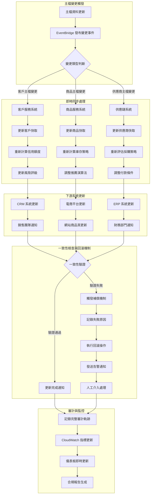

這是 MDM 在實務上最複雜也最價值的部分。主檔資料雖然變化慢，但終究會變，這意味著主檔不能只有「當前狀態」，它必須能回答：

- 「這個商品在過去某個時間點的價格是多少？」
- 「這個客戶在未來某個時間點的地址將會是什麼？」

所以， `生效日期 → 活躍期 → 失效日期` 的生命週期管理，以及 AWS 範例程式碼中，同時有 `master_data_versions（歷史版本表`）和 `master_data_current（當前活躍版本表` 的設計，正是為了實現這種跨越時間的資料查詢能力。

這對於財務對帳、法律合規和商業分析至關重要。

**基本讀寫流程**

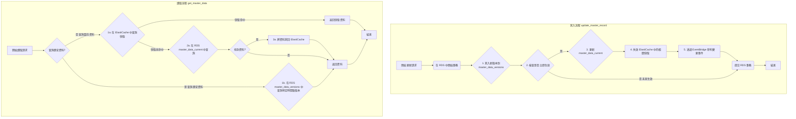

**寫入邏輯 (update_master_record)**：

- 事務性：將所有寫入操作包裹在 transaction 中，確保了「要麼全部成功，要麼全部失敗」的原子性。
- 版本控制：同時寫入 versions 表和 current 表，完美實現了歷史追溯與當前查詢效能的平衡。
- 快取失效：在資料更新後，立刻執行快取失效，保證了資料的一致性。
  **讀取邏輯 (get_master_data)：**
- 快取優先 (Cache-Aside)：先查快取，沒有再查資料庫，並回填快取。這是最經典的快取模式。
- 支援時間旅行 (Time-Travel)：能夠根據 as_of_date 參數查詢特定時間點的歷史資料，這是 MDM 系統最有價值的功能之一。

#### AWS 實現：企業級主檔管理系統

**AWS 服務架構組合**

- RDS (PostgreSQL)：作為「單一事實來源 (SSoT)」，利用其事務能力（ACID）保證核心資料的強一致性，這是 MDM 的基石。選擇正確。
- ElastiCache (Redis)：作為「分發快取」，緩解主資料庫的讀取壓力，為下游系統提供高效能的資料存取。這是標準的高效能架構模式。
- DynamoDB：雖然 RDS 也能記錄變更，但使用 DynamoDB 可以建立一個快速、可擴展、獨立的審計日誌 (Audit Log)，供其他系統高速查詢變更歷史，而不會影響主資料庫效能。
- EventBridge：作為「事件通知」中心，在主檔變更後，主動通知所有相關系統。這實現了系統間的松耦合，是現代微服務架構的關鍵。

```yaml
# 企業級主檔管理系統的 AWS 服務配置
MasterDataManagementServices:
  # 核心資料存儲層
  CoreStorage:
    PrimaryDatabase:
      Service: "Amazon RDS PostgreSQL"
      Instance: "db.r6g.2xlarge"
      Storage: "2TB gp3 SSD"
      MultiAZ: true
      ReadReplicas: 3
      BackupRetention: 35
      Encryption: "AES-256"

    VersioningStore:
      Service: "Amazon DynamoDB"
      TableName: "master-data-versions"
      BillingMode: "ON_DEMAND"
      GlobalTables: true
      PointInTimeRecovery: true

  # 分散式快取層
  CacheLayer:
    DistributedCache:
      Service: "Amazon ElastiCache Redis"
      NodeType: "cache.r6g.xlarge"
      Nodes: 3
      ClusterMode: true
      Encryption: "in-transit and at-rest"

    CDNCache:
      Service: "Amazon CloudFront"
      Origins: "ALB + ElastiCache"
      TTL: "3600 seconds"

  # 事件處理與通知
  EventProcessing:
    EventBus:
      Service: "Amazon EventBridge"
      Rules: "master-data-change-*"
      Targets: ["Lambda", "SQS", "SNS"]

    MessageQueue:
      Service: "Amazon SQS"
      Type: "FIFO Queue"
      VisibilityTimeout: "300s"
      DeadLetterQueue: true

    Notifications:
      Service: "Amazon SNS"
      Topics: ["master-data-updates", "system-alerts"]
      Subscriptions: ["Email", "SMS", "Lambda"]

  # 計算與處理
  ComputeServices:
    APIGateway:
      Service: "Amazon API Gateway"
      Type: "REST API"
      Authentication: "AWS Cognito"
      RateLimit: "1000 req/sec"

    BusinessLogic:
      Service: "AWS Lambda"
      Runtime: "Python 3.11"
      Memory: "1024 MB"
      Timeout: "15 minutes"
      Concurrency: "100"

    BackgroundProcessing:
      Service: "Amazon ECS Fargate"
      CPU: "2 vCPU"
      Memory: "4 GB"
      AutoScaling: true

  # 監控與審計
  ObservabilityStack:
    Monitoring:
      Service: "Amazon CloudWatch"
      Metrics: "Custom + Built-in"
      Alarms: "20+ alerts"
      Dashboards: "Executive + Technical"

    Logging:
      Service: "Amazon CloudWatch Logs"
      RetentionPeriod: "90 days"
      LogGroups: "by service"

    Tracing:
      Service: "AWS X-Ray"
      SamplingRate: "10%"
      TracingEnabled: true

    AuditTrail:
      Service: "AWS CloudTrail"
      LogFileValidation: true
      MultiRegion: true

  # 安全與合規
  SecurityServices:
    IdentityManagement:
      Service: "AWS IAM"
      Roles: "least-privilege"
      Policies: "resource-based"

    SecretsManagement:
      Service: "AWS Secrets Manager"
      AutoRotation: true
      CrossRegionReplication: true

    KeyManagement:
      Service: "AWS KMS"
      KeyRotation: "annual"
      CustomerManagedKeys: true

    NetworkSecurity:
      Service: "AWS VPC"
      Subnets: "private + public"
      SecurityGroups: "restrictive"
      NACLs: "additional layer"

  # 災難恢復
  DisasterRecovery:
    Backup:
      Service: "AWS Backup"
      Schedule: "daily + weekly"
      RetentionPeriod: "7 years"
      CrossRegionCopy: true

    ReplicationTarget:
      Service: "Secondary AWS Region"
      RPO: "< 1 hour"
      RTO: "< 4 hours"

# 成本估算 (月費用)
CostEstimation:
  RDS: "$2,400/month"
  ElastiCache: "$1,200/month"
  DynamoDB: "$800/month"
  Lambda: "$300/month"
  Other: "$800/month"
  Total: "$5,500/month"
```

**AWS 服務架構圖**

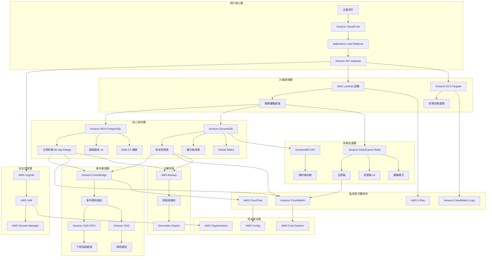

---

### 2. 事件驅動架構（Event-Driven Design）

再次回到我們的圖書館比喻。

傳統的資料庫設計，就像一個只關心「現在」的圖書館員。

我們問他：「《夜間飛行》在哪裡？」他會直接告訴我們：「在 A-7 書架上。」但如果我們追問：「那昨天下午三點，這本書在哪裡？」

他會一臉茫然，因為他只記錄書的最終狀態，過程中的變化都遺失了。

```
//TODO:《夜間飛行》是一本我非常喜歡的書，非常推薦大家看看:))
```

**概念核心**：

事件驅動的哲學：**記錄「發生了什麼」，而非「變成了什麼」**，事件驅動架構，尤其是事件溯源，採用了一種截然不同的哲學。它像一位一絲不苟的歷史學家，他維護的不是一份書單，而是一本永不修改的流水帳 (Immutable Ledger)。

程式語言有一個概念來管理這樣子的抽象具體 **Link** **(Node-List)**。所有的事件都必然有其連接的前後事件，**透過重播歷程，來重建任何一個時間點的狀態**

所以，回到我們的圖書館吧檯，當我們檢視書籍的歷程記錄事件列時，我們會看到:

- `09:15`：會員 Alice 在 圖書館 C 歸還了《夜間飛行》。
- `11:30`：管理員將《夜間飛行》從 圖書館 C 移至 圖書館 B。
- `15:10`：工讀生將《夜間飛行》從還書車上架到 A-7。

這樣子的事件流。

看到了嗎？我們不儲存書的「位置」（狀態），我們只儲存書的每一次「移動」（事件）。

傳統 CRUD 是「破壞性」的，`UPDATE users SET status = 'inactive'`時，我們就永遠失去了這個用戶之前的狀態 - 資訊在更新中被破壞了。

事件溯源則是「建構性」記錄下 `UserDeactivated` 事件。所有的歷史資訊節點都被保留下來

**快速摘要**

- 不儲存狀態，只儲存事件
- 現在的狀態 = 所有歷史事件的重播結果

**應用場景**：

1. 微服務整合 (Microservices Integration)：

- 這是 EDA 最核心的應用。
- 在電商平台中，當「訂單服務」產生一筆 `OrderCreated` 事件後，它可以完全不知道下游有哪些服務需要這個資訊。 **「庫存服務」** 可以訂閱此事件來扣減庫存，**「物流服務」** 可以訂閱它來準備出貨，**「通知服務」** 可以訂閱它來發送確認郵件。服務之間完全解耦，可以獨立開發、部署和擴展。

2. 異步工作流程 (Asynchronous Workflows)：

- EDA 擅長於處理 **耗時的連續性背景任務**。例如 : 用戶上傳一段影片後，後端立即發布一個 VideoReceived 事件並馬上回應「上傳成功，轉檔中」。一個或多個專門的「轉檔服務」會接收此事件，在背景進行耗時的影片壓縮、加水印等工作。用戶無需在原地等待，體驗極佳。

3. 即時數據處理與物聯網 (Real-time Data Processing & IoT)：

- 情境：處理源源不絕的數據流。來自成千上萬個 IoT 設備的溫度、濕度讀數，或是金融市場的即時股價波動，每一條數據都是一個事件。EDA 架構可以高效地對這些事件流進行過濾、轉換、聚合，並觸發即時警報或更新儀表板。

4. 審計與合規 (Audit and Compliance)：

- 情境：當「發生了什麼」比「現在是什麼」更重要時。在金融、醫療或法律領域，擁有每一筆交易、每一次病歷修改的不可變紀錄，是合規性的基本要求。系統的任何狀態都可以從這些歷史事件中重現出來。

**優勢**：

- 完整的操作軌跡
- 支援時光回溯
- 天然的審計功能

然而，這種「把任務寫在白板上就走人」的溝通方式，也帶來了它獨有的複雜性與挑戰。

1. **心智模型的複雜性**：系統的控制流程變得隱晦。一個事件發布後，我們很難直觀地追蹤「接下來會發生什麼？」，這讓除錯變得極具挑戰性。
2. **最終一致性**：由於服務是異步處理的，系統在不同部分會存在短暫的狀態不一致。例如，訂單已成立，但庫存可能還沒被扣減。這對開發和用戶體驗設計都提出了更高的要求。
3. **事件結構的演進與版本控制**：如果「任務白板」上的訊息格式改變了（例如，訂單事件增加了「折扣碼」欄位），所有下游服務都必須能兼容新舊兩種格式，否則就會崩潰。這通常需要引入額外的工具來管理。
4. **訊息中介層的可靠性**：那個「任務白板」（如 Kafka、EventBridge）成為了系統的心臟。如果它故障，整個系統就會癱瘓。因此，它本身必須被設計成高可用、高可靠的，這是一項複雜且昂貴的工程。
5. **測試的困難度**：端到端的整合測試變得非常困難，因為我們需要驗證一個事件觸發後，所有相關的下游服務是否都正確地完成了它們各自的工作。

總結來說，EDA 提供了極致的靈活性和擴展性，但代價是增加了系統的整體複雜度和對「最終一致性」的容忍。選擇它，意味著我們必須準備好用管理一個複雜的「異步協作系統」來換取單個服務的「簡單和獨立」。

#### AWS 實現：投資交易系統的事件溯源

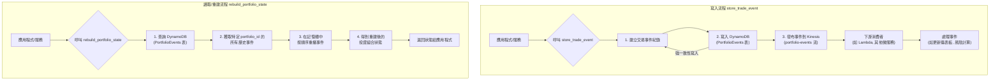

**寫入流程 (左側)：**

當一個交易行為發生時，應用程式會呼叫 `store_trade_event`。
該函數首先將這個交易事件寫入 DynamoDB 的 PortfolioEvents 表中。這是我們的「事件日誌」，是不可變的、永久的紀錄。
寫入成功後，同一個事件會被發布到 Kinesis 數據流中。
其他關心此事件的下游服務（例如：更新報表的服務、計算風險的服務）會從 Kinesis 訂閱並接收到這個事件，然後執行各自的業務邏輯。這個過程是異步且解耦的。

**讀取/重建流程 (右側)：**

當需要查詢某個投資組合的「當前狀態」時，應用程式會呼叫 `rebuild_portfolio_state`。
系統會去查詢 DynamoDB，拉取該投資組合的所有歷史事件紀錄。
在應用程式的記憶體中，從第一個事件開始，一步步地「重播」這些事件，就像快進電影一樣。
所有事件重播完畢後，就得到了該投資組合在特定時間點的精確狀態，並返回給請求方。

**AWS 服務架構組合**

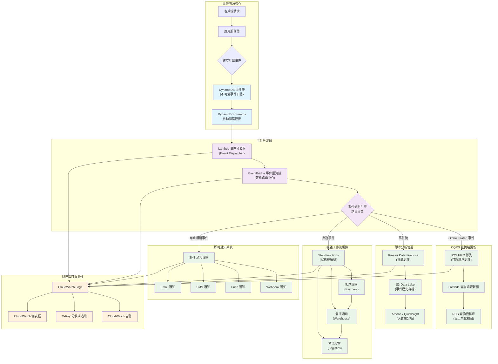

```python
class PortfolioEventStore:
    """投資組合的事件溯源實現"""

    def __init__(self):
        self.event_store = boto3.client('dynamodb')
        self.event_stream = boto3.client('kinesis')

    async def store_trade_event(self, portfolio_id, event):
        """儲存交易事件到 DynamoDB"""

        event_record = {
            'portfolio_id': {'S': portfolio_id},
            'event_id': {'S': str(uuid.uuid4())},
            'event_type': {'S': event.type},
            'event_data': {'S': json.dumps(event.data)},
            'timestamp': {'N': str(int(time.time() * 1000))},
            'sequence_number': {'N': str(await self.get_next_sequence(portfolio_id))}
        }

        # 強一致性寫入
        await self.event_store.put_item(
            TableName='PortfolioEvents',
            Item=event_record,
            ConditionExpression='attribute_not_exists(event_id)'
        )

        # 異步發送到 Kinesis 供其他服務消費
        await self.event_stream.put_record(
            StreamName='portfolio-events',
            Data=json.dumps(event_record),
            PartitionKey=portfolio_id
        )

    async def rebuild_portfolio_state(self, portfolio_id, as_of_time=None):
        """從事件重建組合狀態"""

        query_params = {
            'TableName': 'PortfolioEvents',
            'KeyConditionExpression': 'portfolio_id = :pid',
            'ExpressionAttributeValues': {':pid': {'S': portfolio_id}},
            'ScanIndexForward': True  # 按時間順序
        }

        if as_of_time:
            query_params['FilterExpression'] = 'timestamp <= :time'
            query_params['ExpressionAttributeValues'][':time'] = {'N': str(as_of_time)}

        events = await self.event_store.query(**query_params)

        # 重播事件重建狀態
        portfolio_state = PortfolioState()
        for event_item in events['Items']:
            event = self.deserialize_event(event_item)
            portfolio_state.apply_event(event)

        return portfolio_state
```

我們來看看一個情境題

```
以股票代碼的EDA實現為例，我需要針對某一個用戶建立他的某一支股票交易表嗎?
```

答案是：絕對不要。

為每個用戶的每支股票都建立一個資料表，是一種常見的設計誤區，會導致「資料表爆炸」的災難。一個活躍的用戶可能交易上百支股票，一萬個用戶就可能產生數十萬甚至上百萬個資料表，這在管理、維護和查詢上都是不可行的。

**正確的建表思路：以「事件流」為核心**

在 EDA 中，我們不應該思考「該建什麼表來存狀態」，而應該思考 **「該為哪個實體建立事件流」** 。

在股票交易的場景中，最核心的業務實體（也就是 DDD 中的「聚合根」）是 **「用戶的投資組合」或「交易帳戶」** ，而不是單一的股票。實際上，一個用戶的所有交易行為(conduct)，都是圍繞著他的某個投資組合(requirement)發生的。

因此，我們只需要一張事件表，我稱之為 TradingEvents。這張表記錄了所有用戶、所有投資組合的所有交易事件。

理想的 `TradingEvents` 資料表結構 (以 DynamoDB 為例)

| 欄位名稱 (Attribute) | 作用                   | 範例                                                | 備註                                                                                     |
| :------------------- | :--------------------- | :-------------------------------------------------- | :--------------------------------------------------------------------------------------- |
| portfolio_id         | 分區鍵 (Partition Key) | user123-portfolio-A                                 | 核心設計：所有屬於同一個投資組合的事件都會被物理地存放在一起，極大化查詢效率。           |
| sequence_number      | 排序鍵 (Sort Key)      | 1, 2, 3, ...                                        | 核心設計：保證一個投資組合內的所有事件都有嚴格的先後順序，這是重播歷史、重建狀態的基礎。 |
| event_id             | 事件唯一標識           | uuid-v4-string                                      | 用於確保事件的唯一性，防止重複處理。                                                     |
| event_type           | 事件類型               | STOCK_BOUGHT, STOCK_SOLD                            | 描述「發生了什麼」，決定了業務邏輯如何處理這個事件。                                     |
| event_payload        | 事件內容 (JSON)        | {"symbol": "AAPL", "quantity": 10, "price": 175.50} | 記錄事件的具體細節。                                                                     |
| timestamp            | 事件發生時間           | 2025-09-12T10:00:00Z                                | 記錄真實世界的業務時間，用於審計和分析。                                                 |

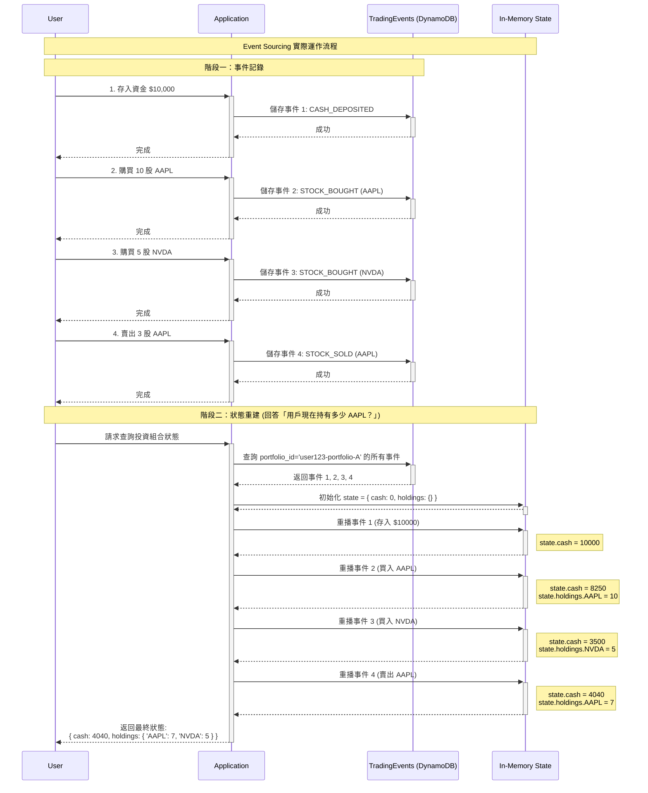

---

### 3. CQRS（命令查詢責任分離）

讓我們放過圖書館可憐的管理員與累癱的工讀生，現在我們將我們的興致延燒到全世界將近三分之一的人同時觀看、萬萬眾矚目且緊張刺激的世界盃決賽足球場。

球場上的事件瞬息萬變，一毫秒之差就有可能跪倒在冠軍台階前又或是誕生出了新的足球先生。然而，足球場就這麼大，假如全世界的運動員、媒體與愛好者都集中在同一個球場中，那勢必在物理法則上是不可能的 - 我們是人，不是樂高積木。所以絕大多數我們還是透過 **媒體(紀錄行為)** 的 **報導(紀錄的影響)**

當一名球員犯規，裁判吹哨並掏出黃牌。他會拿出筆記本，嚴謹地記錄下：`球員背號`、`時間`、`犯規類型`。與此同時，場邊有各種媒體，廣播直播員立即在現場位席中轉述誰領到了黃牌，線上快報記者也立即發布了走馬燈消息呈現在電視台既有節目中，現場 Live 記者祖業立即對焦裁判與焦急反駁的犯規球員等待後續事件的發生。

看到了嗎？**事實只有一個**（裁判記錄了一張黃牌），但**資料的呈現方式卻有千百種**。如果強迫所有媒體都去讀裁判那本潦草、只有關鍵字的筆記本，那將是一場災難。

球場上正在發生的事，是唯一的「事實」。

**命令端 (Command Side) - 球場上的裁判**  
`裁判吹哨並掏出黃牌。他會拿出筆記本，嚴謹地記錄...` 這個動作就是一個「命令」。它改變了比賽的官方狀態。裁判的筆記本就是「寫入模型」（Write Model），它的設計目標是**絕對的準確性與規則一致性**。它不關心報導是否精彩，只關心記錄是否無誤。

**查詢端 (Query Side) - 轉播單位與媒體**

與此同時，場邊有各種媒體，他們的需求（查詢）截然不同：

- **電視/廣播直播員**：他們需要即時的數據流來進行播報。他們的「查詢模型」是一個包含`目前比分`、`比賽時間`、`控球方`、`即時事件（如：射門、角球）`的儀表板。它為**速度和敘事**而優化。
- **快報記者**：他們需要立即發布最關鍵的資訊。他們的「查詢模型」可能只是一個極簡的事件列表：`「梅西進球！阿根廷 1:0 領先！」`。它為**時效性**而優化。
- **晚報分析師**：他們需要賽後的完整統計數據來撰寫深度報導。他們的「查詢模型」是一個包含`球員跑動距離`、`傳球成功率`、`射門分佈圖`的複雜聚合報表。它為**深度與分析**而優化。
- **社群媒體小編**：他們需要精彩的片段來吸引眼球。他們的「查詢模型」是進球的 GIF 動圖、爭議判罰的短影片。它為**互動性與傳播性**而優化。

CQRS 的核心哲學就是：**讓裁判專心做好記錄（命令），同時允許各家媒體根據自己的需求，建立最適合自己的觀賽筆記（查詢）。**

**抽象概念**：寫入優化的結構 ≠ 查詢優化的結構

**設計原則**：

- **命令端（Command）**：

  - 高度正規化
  - 強一致性要求
  - 寫入效能優化

- **查詢端（Query）**：

  - 大量反正規化
  - 最終一致性
  - 讀取效能優化

**實際效益**：

- 讀寫負載分離
- 各自獨立擴展
- 複雜查詢不影響核心業務

**應用場景**：

CQRS 不是萬靈丹。它會引入額外的複雜性，因此只應在收益明顯大於成本的場景中使用。以下是 CQRS 發揮最大價值的幾個經典場景：

1.  **高流量讀取密集型系統(讀取需求是寫入的平方根以上)**：

    - **情境**：電商平台的商品目錄、新聞媒體的報導頁面、社交平台的內容流。在這些系統中，讀取操作（瀏覽商品、閱讀文章）的數量遠遠超過寫入操作（下訂單、發布文章）。
    - **為何選擇 CQRS**：可以獨立擴展查詢端。例如，我們可以部署一個由 10 個節點組成的讀取資料庫叢集和一個高性能快取層，來應對數百萬用戶的瀏覽請求，而寫入端可能只需要一個單一、穩定的資料庫實例。這避免了讀取流量衝垮核心交易系統的風險。

2.  **複雜的查詢與多樣化的資料視圖**：

    - **情境**：商業智慧（BI）儀表板、數據分析平台、管理後台。這些系統需要從同一個核心數據中，產生多種完全不同的視圖（View）。例如，一個銷售數據，需要同時被呈現為「按地區的銷售額趨勢圖」、「按產品類別的利潤分析報表」和「高價值客戶的活躍度列表」。
    - **為何選擇 CQRS**：可以為每種查詢需求建立一個專門優化的「讀取模型」（Read Model）。趨勢圖的模型可能是一個預先計算好的時間序列數據表；利潤分析報表可能是一個反正規化的寬表；而客戶列表則可能是一個儲存在搜尋引擎（如 OpenSearch）中的索引。這避免了在單一、正規化的資料庫上執行大量複雜、緩慢的 `JOIN` 和聚合操作。

3.  **與事件溯源（Event Sourcing）的結合**：

    - **情境**：金融交易系統、審計日誌系統、任何需要完整歷史追溯能力的領域。在這些場景中，系統的核心是不可變的事件日誌。
    - **為何選擇 CQRS**：CQRS 是實現事件溯源的天然搭檔。
      - **命令端**：負責驗證命令並將其轉化為事件，然後將事件儲存到事件日誌中（如 DynamoDB 或 Kinesis）。這是唯一的寫入操作。
      - **查詢端**：透過訂閱事件流，建立和更新各種「投影」（Projections），也就是讀取模型。系統的「當前狀態」本身就是一個由所有歷史事件投影而來的讀取模型。

4.  **高併發協作領域**：
    - **情境**：線上協作文件（如 Google Docs）、多人共享的甘特圖、共同編輯的設計工具。多個用戶同時對同一個資源進行操作。
    - **為何選擇 CQRS**：可以將衝突的處理範圍縮小。所有的「寫入」操作（Commands）可以被序列化處理（例如通過一個 FIFO 佇列），確保狀態變更的一致性和順序性。同時，每個用戶的「讀取」操作可以從為他們自己優化的讀取模型中快速獲取數據，而不會被其他人的寫入操作阻塞。

**挑戰與複雜性**：

1.  **最終一致性**：這是 CQRS 最大的挑戰。用戶更新資料後，立即查詢可能看到的還是舊資料，這需要前端 UI/UX 設計來妥善處理（例如，顯示「更新中...」或使用樂觀更新）。
2.  **雙倍的模型**：開發者需要維護命令模型和一個或多個查詢模型，增加了程式碼的複雜度和開發工作量。
3.  **基礎設施複雜度**：需要引入事件匯流排（如 EventBridge）、訊息佇列（如 SQS）等中介軟體來同步兩端資料，增加了系統的維運成本和潛在故障點。
4.  **資料同步與回放**：如果查詢端的讀取模型損壞或需要變更結構，可能需要一個機制來「重播」（Replay）歷史事件以重建讀取模型，這是一個複雜的過程。

#### AWS 實現：足球賽事事件的 CQRS

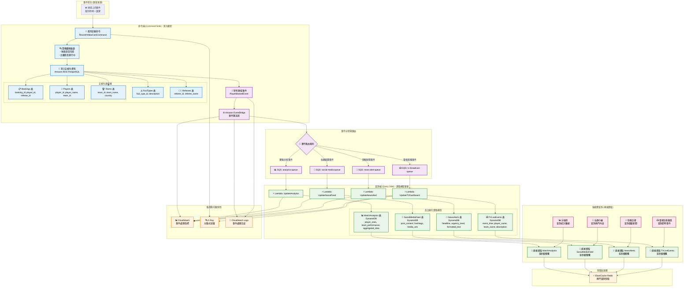

```python
class FootballMatchCQRS:
    """足球賽事的 CQRS 實現"""

    def __init__(self):
        # 命令端：正規化的關聯式資料庫
        self.command_db = boto3.client('rds-data', database='football_command')

        # 查詢端：反正規化的 NoSQL 資料庫
        self.query_db = boto3.client('dynamodb')

        # 事件匯流排
        self.event_bridge = boto3.client('events')

        # 快取層
        self.cache = boto3.client('elasticache')

    async def record_yellow_card_command(self, match_id, player_id, referee_id, foul_type_id, minute):
        """命令端：記錄黃牌事件（正規化存儲）"""

        async with self.command_db.begin_transaction() as tx:
            # 1. 業務邏輯驗證
            await self.validate_yellow_card_business_rules(match_id, player_id, minute)

            # 2. 寫入正規化的關聯表
            booking_id = await tx.execute("""
                INSERT INTO bookings (match_id, player_id, referee_id, foul_type_id, game_minute, timestamp)
                VALUES (:match_id, :player_id, :referee_id, :foul_type_id, :minute, NOW())
                RETURNING booking_id
            """, {
                'match_id': match_id,
                'player_id': player_id,
                'referee_id': referee_id,
                'foul_type_id': foul_type_id,
                'minute': minute
            })

            # 3. 更新球員累計統計（在同一事務中）
            await tx.execute("""
                UPDATE player_match_stats
                SET yellow_cards = yellow_cards + 1
                WHERE match_id = :match_id AND player_id = :player_id
            """, {'match_id': match_id, 'player_id': player_id})

            # 4. 發布領域事件
            await self.publish_player_booked_event(booking_id, match_id, player_id, foul_type_id, minute)

    async def publish_player_booked_event(self, booking_id, match_id, player_id, foul_type_id, minute):
        """發布球員被罰黃牌事件"""

        # 從正規化表中組合完整的事件資料
        event_data = await self.build_complete_event_data(match_id, player_id, foul_type_id)

        await self.event_bridge.put_events(
            Entries=[
                {
                    'Source': 'com.football.match',
                    'DetailType': 'PlayerBooked',
                    'Detail': json.dumps({
                        'booking_id': booking_id,
                        'match_id': match_id,
                        'player_name': event_data['player_name'],
                        'team_name': event_data['team_name'],
                        'foul_description': event_data['foul_description'],
                        'game_minute': minute,
                        'timestamp': datetime.utcnow().isoformat()
                    }),
                    'EventBusName': 'football-events'
                }
            ]
        )

    async def update_tv_dashboard_projection(self, event):
        """更新電視直播儀表板（查詢端投影）"""

        # 建立為電視直播優化的反正規化記錄
        tv_event = {
            'event_id': {'S': str(uuid.uuid4())},
            'match_id': {'S': event['match_id']},
            'display_text': {'S': f"{event['player_name']} ({event['team_name']}) - {event['foul_description']}"},
            'game_minute': {'N': str(event['game_minute'])},
            'urgency_level': {'S': 'MEDIUM'},
            'created_at': {'N': str(int(time.time()))},
            'ttl': {'N': str(int(time.time()) + 86400)}  # 24小時後自動清理
        }

        # 寫入專為電視台設計的查詢表
        await self.query_db.put_item(
            TableName='TVLiveEvents',
            Item=tv_event
        )

        # 同時更新快取，供電視台毫秒級查詢
        await self.cache.set(
            f"tv:live_events:{event['match_id']}",
            json.dumps(tv_event),
            ex=3600  # 1小時快取
        )

    async def update_news_alert_projection(self, event):
        """更新新聞快報投影"""

        # 建立新聞標題優化的資料結構
        news_alert = {
            'alert_id': {'S': str(uuid.uuid4())},
            'headline': {'S': f"⚠️ {event['player_name']} 獲得黃牌！"},
            'sub_headline': {'S': f"{event['team_name']} vs 對手 - 第{event['game_minute']}分鐘"},
            'urgency_score': {'N': '75'},
            'category': {'S': 'BOOKING'},
            'formatted_content': {'S': self.format_news_content(event)},
            'created_at': {'N': str(int(time.time()))}
        }

        await self.query_db.put_item(
            TableName='NewsAlerts',
            Item=news_alert
        )

    async def update_social_media_projection(self, event):
        """更新社群媒體投影"""

        social_post = {
            'post_id': {'S': str(uuid.uuid4())},
            'content': {'S': f"🟨 {event['player_name']} 第{event['game_minute']}分鐘吃牌！"},
            'hashtags': {'SS': ['#世界盃', f"#{event['team_name']}", '#黃牌']},
            'media_type': {'S': 'TEXT_WITH_EMOJI'},
            'engagement_score': {'N': '0'},
            'created_at': {'N': str(int(time.time()))}
        }

        await self.query_db.put_item(
            TableName='SocialMediaFeed',
            Item=social_post
        )

    async def update_analytics_projection(self, event):
        """更新分析師統計投影"""

        # 更新球員統計
        await self.query_db.update_item(
            TableName='MatchAnalytics',
            Key={
                'analysis_type': {'S': 'PLAYER_STATS'},
                'entity_id': {'S': f"player_{event['player_id']}"}
            },
            UpdateExpression='ADD yellow_cards :inc SET last_updated = :timestamp',
            ExpressionAttributeValues={
                ':inc': {'N': '1'},
                ':timestamp': {'N': str(int(time.time()))}
            }
        )

        # 更新團隊統計
        await self.query_db.update_item(
            TableName='MatchAnalytics',
            Key={
                'analysis_type': {'S': 'TEAM_STATS'},
                'entity_id': {'S': f"team_{event['team_id']}"}
            },
            UpdateExpression='ADD total_bookings :inc SET last_updated = :timestamp',
            ExpressionAttributeValues={
                ':inc': {'N': '1'},
                ':timestamp': {'N': str(int(time.time()))}
            }
        )

    # 各媒體的極速查詢方法
    async def get_tv_live_events(self, match_id):
        """電視台查詢：毫秒級響應"""

        # 先查快取
        cached = await self.cache.get(f"tv:live_events:{match_id}")
        if cached:
            return json.loads(cached)

        # 快取未命中，查詢 DynamoDB
        response = await self.query_db.query(
            TableName='TVLiveEvents',
            KeyConditionExpression='match_id = :match_id',
            ExpressionAttributeValues={':match_id': {'S': match_id}},
            ScanIndexForward=False,  # 最新事件在前
            Limit=10
        )

        events = [self.deserialize_tv_event(item) for item in response['Items']]

        # 回填快取
        await self.cache.set(f"tv:live_events:{match_id}", json.dumps(events), ex=300)

        return events

    async def get_breaking_news(self, urgency_threshold=70):
        """快報記者查詢：按急迫性排序"""

        response = await self.query_db.scan(
            TableName='NewsAlerts',
            FilterExpression='urgency_score >= :threshold',
            ExpressionAttributeValues={':threshold': {'N': str(urgency_threshold)}},
            Limit=5
        )

        return [self.deserialize_news_alert(item) for item in response['Items']]

    async def get_trending_social_content(self):
        """社群小編查詢：按互動度排序"""

        response = await self.query_db.scan(
            TableName='SocialMediaFeed',
            IndexName='EngagementScoreIndex',
            ScanIndexForward=False,  # 高互動度在前
            Limit=20
        )

        return [self.deserialize_social_post(item) for item in response['Items']]

    async def get_match_analytics(self, match_id):
        """分析師查詢：完整統計數據"""

        response = await self.query_db.query(
            TableName='MatchAnalytics',
            KeyConditionExpression='match_id = :match_id',
            ExpressionAttributeValues={':match_id': {'S': match_id}}
        )

        return [self.deserialize_analytics(item) for item in response['Items']]
```

### 4. 多租戶架構（Multi-Tenancy）

既然說到了電視轉播，我想到了在我的大學生涯中有協助執行一個研究案 《NetFlix 亞洲地區閱聽眾愛好集群側寫分析》，這是一個非常有意思的研究項目，我有幸看到了當時 Netflix 某個時間區段的關於觀眾的偏好影片資料集與各種電影連續劇的的分類資料表，當時最終目標是要協助建立多族群對於不同影視作品類型的偏好網絡圖，來協助建立推送模型。

說遠了，我們把注意力轉到 Netflix 的內容管理上。想像 Netflix 需要為全球數百個內容製作工作室、發行商和版權方提供一個統一的影片管理平台，但每個「租戶」都有完全不同的需求和權限。而多租戶架構也需要為不同狀態的「租戶」提供差異化的服務。

1. 獨家亞洲播送的內容不能讓其他洲所看到
2. 西班牙攝影棚的毛片需要請加拿大影像工作室在行後製處理 - 同時間位於法國的管理團隊必須可以看到檔案狀態的更新
3. 已經結束當季放映權的影視作品即將入庫收藏，但已知 3 年後將重啟放映播送。

所有的工作室與團隊都在使用各自的雲端系統，但實際上它是建立在一個 **大池子**中。

**抽象概念**：一個應用程式同時服務多個「租戶」，每個租戶認為自己在使用專屬的系統

- **核心設計哲學四指標**：

  - **隔離性 (Isolation)**：行銷團隊絕對不能看到還在製作中的未發布內容。每個租戶的資料和操作必須完全隔離。

  - **共享性 (Sharing)**：所有工作室都共享同一套影片編碼、儲存、分發的基礎設施。沒有人需要自己建置一套全球 CDN 網路。

  - **客製化 (Customization)**：有些工作室需要 4K HDR 的高品質製作流程，有些獨立製片只需要 1080p。平台必須支援不同等級的服務。

  - **可擴展性 (Scalability)**：當新的製作工作室加入時，系統應該能夠無縫擴展，而不是重新架構整個平台。

#### 三種經典的多租戶模式：以 Netflix 影片管理為例

**共享儲存，共享資料結構** 、**共享基礎設施，獨立儲存空間**、**完全獨立的基礎設施**

#### 模式一：共享儲存，共享資料結構 (Shared S3 Bucket, Shared Prefix Structure)

這就像所有製作工作室的影片都存放在同一個巨大的 S3 儲存庫中，但透過資料夾結構和存取權限來區分。

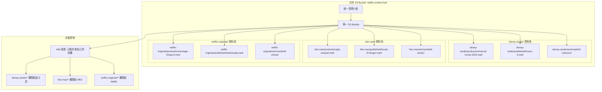

**影片生命週期在共享模式中的體現**：

- **製作中影片** (`production/`)：高頻讀寫，需要版本控制，多人協作
- **放送中影片** (`published/`)：高頻讀取，需要全球 CDN 分發
- **入庫影片** (`archived/`)：低頻存取，可以移至較便宜的儲存層級

**S3 儲存策略**：

```python
# 基於影片狀態的 S3 儲存策略
S3_STORAGE_POLICIES = {
    'production': {
        'storage_class': 'STANDARD',
        'versioning': True,
        'encryption': 'aws:kms',
        'backup_frequency': 'hourly',
        'cost_per_gb_month': 0.023
    },
    'published': {
        'storage_class': 'STANDARD',
        'cdn_distribution': True,
        'global_replication': True,
        'cost_per_gb_month': 0.023
    },
    'archived': {
        'storage_class': 'GLACIER_FLEXIBLE_RETRIEVAL',
        'versioning': False,
        'retrieval_time': '1-5 minutes',
        'cost_per_gb_month': 0.0036
    }
}
```

**優點**：

- **成本最低**：所有租戶共享同一個 S3 bucket，最大化資源利用率
- **管理簡單**：只需要維護一個儲存庫，統一的生命週期政策和監控
- **彈性最佳**：新增租戶只需要建立新的前綴資料夾，不需要重新配置

**缺點**：

- **隔離性風險**：IAM 設定錯誤可能導致資料洩露（迪士尼意外看到 HBO 的內容）
- **效能風險**：熱門工作室的大量上傳可能影響其他租戶的存取速度
- **客製化限制**：所有租戶必須使用相同的儲存等級和生命週期政策

#### 模式二：共享基礎設施，獨立儲存空間 (Shared Infrastructure, Separate S3 Buckets)

這就像每個製作工作室都有自己專屬的「倉庫」，但共享同一套物流配送系統。

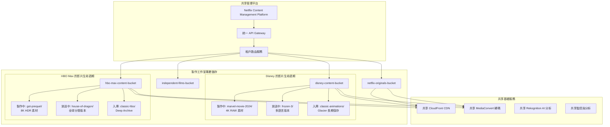

**影片狀態驅動的自動化管理**：

```python
class ContentLifecycleManager:
    """基於影片狀態的自動化生命週期管理"""

    def __init__(self, tenant_id):
        self.tenant_bucket = f"{tenant_id}-content-bucket"
        self.lifecycle_policies = {
            'production': {
                'standard_ia_transition': 30,  # 30天後轉入 IA
                'glacier_transition': 90,      # 90天後轉入 Glacier
                'expiration': None             # 永不刪除
            },
            'published': {
                'standard_ia_transition': 365, # 1年後轉入 IA
                'glacier_transition': 1095,    # 3年後轉入 Glacier
                'expiration': None
            },
            'archived': {
                'immediate_glacier': True,     # 立即轉入 Glacier
                'deep_archive_transition': 90, # 90天後轉入 Deep Archive
                'expiration': 2555             # 7年後刪除
            }
        }

    async def transition_content_status(self, content_id, from_status, to_status):
        """內容狀態轉換觸發儲存策略變更"""

        if from_status == 'production' and to_status == 'published':
            # 製作完成，準備發行
            await self.create_distribution_copies(content_id)
            await self.enable_global_cdn(content_id)
            await self.setup_drm_protection(content_id)

        elif from_status == 'published' and to_status == 'archived':
            # 版權到期，歸檔處理
            await self.disable_cdn_distribution(content_id)
            await self.transition_to_glacier(content_id)
            await self.update_metadata_only_access(content_id)

    async def create_distribution_copies(self, content_id):
        """為發行創建多個格式版本"""

        source_key = f"production/{content_id}/master.mp4"

        # 創建不同品質版本
        encoding_jobs = [
            {'resolution': '4K', 'bitrate': '15000k', 'target': 'premium'},
            {'resolution': '1080p', 'bitrate': '5000k', 'target': 'standard'},
            {'resolution': '720p', 'bitrate': '2500k', 'target': 'mobile'},
            {'resolution': '480p', 'bitrate': '1000k', 'target': 'low_bandwidth'}
        ]

        for job in encoding_jobs:
            await self.submit_encoding_job(source_key, job)

    async def intelligent_cost_optimization(self):
        """基於觀看數據的智能成本優化"""

        # 分析最近90天的觀看數據
        viewing_analytics = await self.get_viewing_analytics(days=90)

        for content_id, analytics in viewing_analytics.items():
            if analytics['views_per_day'] < 1:
                # 低觀看量內容，考慮降級儲存
                await self.suggest_storage_downgrade(content_id)
            elif analytics['views_per_day'] > 1000:
                # 高觀看量內容，考慮升級儲存
                await self.suggest_storage_upgrade(content_id)
```

**優點**：

- **中等隔離性**：每個租戶有完全獨立的儲存空間，降低資料洩露風險
- **客製化彈性**：可以為不同租戶設定不同的生命週期政策和儲存等級
- **效能隔離**：大租戶的操作不會直接影響小租戶的儲存效能

**缺點**：

- **管理複雜度增加**：需要管理數百個不同的 S3 buckets
- **成本可見性困難**：需要更複雜的成本分攤機制
- **跨租戶分析困難**：難以進行全平台的內容分析和趨勢預測

#### 模式三：完全獨立的基礎設施 (Dedicated Infrastructure)

這就像每個大型製作工作室都有自己完整的製作、儲存、分發基礎設施。

```mermaid
graph TB
    subgraph "迪士尼專屬基礎設施"
        A1[Disney AWS Account] --> B1[專屬 S3 Buckets]
        A1 --> C1[專屬 CloudFront Distribution]
        A1 --> D1[專屬 MediaConvert Pipeline]
        A1 --> E1[專屬 VPC 網路]

        subgraph "Disney 內容分層"
            B1 --> F1[製作中: 4K RAW<br/>S3 Standard + 版本控制]
            B1 --> F2[發行中: 多格式<br/>S3 + 全球 CDN]
            B1 --> F3[經典館藏: 老電影<br/>S3 Glacier Deep Archive]
        end
    end

    subgraph "HBO Max 專屬基礎設施"
        A2[HBO AWS Account] --> B2[專屬 S3 Buckets]
        A2 --> C2[專屬 CloudFront Distribution]
        A2 --> D2[專屬 MediaConvert Pipeline]
        A2 --> E2[專屬 VPC 網路]

        subgraph "HBO 內容分層"
            B2 --> G1[製作中: 8K HDR<br/>S3 Standard + 即時備份]
            B2 --> G2[熱播中: 影集<br/>S3 + Edge 優化]
            B2 --> G3[完結影集: 舊內容<br/>S3 IA + 選擇性恢復]
        end
    end

    subgraph "獨立製片工作室共享基礎設施"
        A3[Independent Films Shared Infrastructure] --> B3[共享 S3 Buckets]
        A3 --> C3[共享 CloudFront]
        A3 --> D3[共享轉碼服務]

        subgraph "獨立製片內容管理"
            B3 --> H1[低預算製作<br/>S3 IA + 基礎轉碼]
            B3 --> H2[小眾發行<br/>按需 CDN]
            B3 --> H3[舊片庫存<br/>Glacier + 手動恢復]
        end
    end

    subgraph "Netflix 中央協調系統"
        I[Netflix 合作夥伴入口]
        I --> J[統一認證與授權]
        I --> K[跨平台分析儀表板]
        I --> L[統一版權管理]

        A1 --> I
        A2 --> I
        A3 --> I
    end
```

**企業級內容管理架構**：

```python
class EnterpriseContentInfrastructure:
    """企業級租戶的專屬基礎設施"""

    def __init__(self, tenant_id, tier='enterprise'):
        self.tenant_id = tenant_id
        self.tier = tier
        self.infrastructure_config = self.get_tier_config(tier)

    def get_tier_config(self, tier):
        """根據租戶等級配置基礎設施"""

        configs = {
            'enterprise': {
                'dedicated_account': True,
                'vpc': 'dedicated',
                's3_buckets': 'multiple_specialized',
                'cloudfront': 'dedicated_distribution',
                'mediaconvert': 'reserved_capacity',
                'monitoring': 'detailed_metrics',
                'support': '24/7_premium',
                'monthly_cost': 50000,
                'content_limits': 'unlimited'
            },
            'professional': {
                'dedicated_account': False,
                'vpc': 'shared_with_isolation',
                's3_buckets': 'dedicated_bucket',
                'cloudfront': 'shared_distribution',
                'mediaconvert': 'on_demand',
                'monitoring': 'standard_metrics',
                'support': 'business_hours',
                'monthly_cost': 5000,
                'content_limits': '10TB'
            },
            'indie': {
                'dedicated_account': False,
                'vpc': 'shared',
                's3_buckets': 'shared_with_prefix',
                'cloudfront': 'shared_basic',
                'mediaconvert': 'spot_instances',
                'monitoring': 'basic_metrics',
                'support': 'community',
                'monthly_cost': 500,
                'content_limits': '1TB'
            }
        }

        return configs.get(tier, configs['indie'])

    async def provision_dedicated_infrastructure(self):
        """為企業租戶配置專屬基礎設施"""

        if self.tier == 'enterprise':
            # 創建專屬的 AWS 帳戶
            dedicated_account = await self.create_dedicated_aws_account()

            # 設定專屬的內容生命週期策略
            await self.setup_content_lifecycle_policies(dedicated_account)

            # 配置全球分發網路
            await self.setup_global_distribution_network(dedicated_account)

            # 設定專屬的安全與合規措施
            await self.setup_security_compliance(dedicated_account)

    async def setup_content_lifecycle_policies(self, account_id):
        """設定內容生命週期自動化"""

        lifecycle_rules = {
            'production_content': {
                'versioning': True,
                'mfa_delete': True,
                'backup_frequency': 'real_time',
                'retention_policy': 'indefinite',
                'access_logging': True
            },
            'published_content': {
                'replication': 'cross_region',
                'cdn_integration': True,
                'analytics_tracking': True,
                'drm_protection': True
            },
            'archived_content': {
                'storage_class_transition': {
                    'to_ia': 30,
                    'to_glacier': 90,
                    'to_deep_archive': 365
                },
                'retrieval_policy': 'expedited_available',
                'metadata_preservation': True
            }
        }

        for content_type, rules in lifecycle_rules.items():
            await self.apply_lifecycle_rules(account_id, content_type, rules)
```

**優點**：

- **最高隔離性**：完全的資料和基礎設施隔離，零資料洩露風險
- **最大客製化**：每個租戶可以有完全客製化的架構和政策
- **獨立效能**：大租戶的操作完全不會影響其他租戶
- **合規性**：容易滿足嚴格的行業法規要求（如電影行業的版權保護）

**缺點**：

- **成本最高**：每個租戶都需要獨立的基礎設施資源
- **管理複雜**：需要管理多個 AWS 帳戶和複雜的跨帳戶權限
- **資源浪費**：小租戶可能無法充分利用分配給他們的資源

#### 模擬 Netflix ：基於內容價值的智能分層混合模式

我們來試試看模擬一下現實情境，在實際的 Netflix 內容平台中應該會根據內容的商業價值、製作成本和觀看預期來動態分配資源，所以我們設計上來說會採用混合模式。

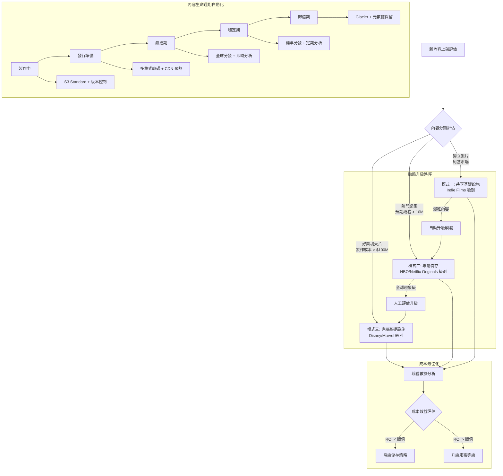

##### AWS S3 多租戶的 fake code 實現

```python
class NetflixContentMultiTenantPlatform:
    """Netflix 風格的多租戶內容平台"""

    def __init__(self):
        self.tenant_strategies = {
            'hollywood_studio': {
                'model': 'dedicated_infrastructure',
                'storage': 'dedicated_s3_account',
                'cdn': 'dedicated_cloudfront',
                'encoding': 'reserved_mediaconvert',
                'isolation': 'account_level',
                'max_content_size': 'unlimited',
                'monthly_cost': 50000,
                'sla': '99.99%'
            },
            'streaming_platform': {
                'model': 'dedicated_storage',
                'storage': 'dedicated_s3_bucket',
                'cdn': 'shared_cloudfront_with_dedicated_behaviors',
                'encoding': 'on_demand_mediaconvert',
                'isolation': 'bucket_level',
                'max_content_size': '100TB',
                'monthly_cost': 5000,
                'sla': '99.9%'
            },
            'independent_creator': {
                'model': 'shared_infrastructure',
                'storage': 'shared_s3_with_prefix',
                'cdn': 'shared_cloudfront_basic',
                'encoding': 'spot_mediaconvert',
                'isolation': 'prefix_level',
                'max_content_size': '1TB',
                'monthly_cost': 500,
                'sla': '99.5%'
            }
        }

        # AWS 服務客戶端
        self.s3 = boto3.client('s3')
        self.cloudfront = boto3.client('cloudfront')
        self.mediaconvert = boto3.client('mediaconvert')
        self.organizations = boto3.client('organizations')

    async def onboard_content_provider(self, provider_info):
        """為新的內容提供者配置基礎設施"""

        # 1. 評估提供者等級
        tier = await self.evaluate_provider_tier(provider_info)
        strategy = self.tenant_strategies[tier]

        # 2. 配置儲存基礎設施
        storage_config = await self.setup_storage_infrastructure(provider_info, strategy)

        # 3. 配置內容分發網路
        cdn_config = await self.setup_cdn_infrastructure(provider_info, strategy)

        # 4. 設定內容生命週期管理
        lifecycle_config = await self.setup_content_lifecycle(provider_info, strategy)

        # 5. 建立監控和計費
        monitoring_config = await self.setup_monitoring_billing(provider_info, strategy)

        return {
            'provider_id': provider_info['id'],
            'tier': tier,
            'storage': storage_config,
            'cdn': cdn_config,
            'lifecycle': lifecycle_config,
            'monitoring': monitoring_config,
            'monthly_cost_estimate': strategy['monthly_cost']
        }

    async def setup_storage_infrastructure(self, provider_info, strategy):
        """根據策略設定儲存基礎設施"""

        if strategy['model'] == 'dedicated_infrastructure':
            # 為好萊塢工作室創建專屬 AWS 帳戶
            account_config = await self.create_dedicated_aws_account(provider_info)

            bucket_config = await self.create_dedicated_account_buckets(
                account_config['account_id'], provider_info
            )

        elif strategy['model'] == 'dedicated_storage':
            # 為串流平台創建專屬 S3 bucket
            bucket_config = await self.create_dedicated_bucket(provider_info)

        else:  # shared_infrastructure
            # 為獨立創作者分配共享 bucket 的前綴
            bucket_config = await self.allocate_shared_bucket_prefix(provider_info)

        # 設定生命週期政策
        await self.configure_content_lifecycle_policies(bucket_config, strategy)

        return bucket_config

    async def create_dedicated_bucket(self, provider_info):
        """為中等規模租戶創建專屬 bucket"""

        bucket_name = f"{provider_info['id']}-content-{uuid.uuid4().hex[:8]}"

        # 創建主要內容 bucket
        await self.s3.create_bucket(
            Bucket=bucket_name,
            CreateBucketConfiguration={'LocationConstraint': 'us-west-2'}
        )

        # 啟用版本控制
        await self.s3.put_bucket_versioning(
            Bucket=bucket_name,
            VersioningConfiguration={'Status': 'Enabled'}
        )

        # 設定加密
        await self.s3.put_bucket_encryption(
            Bucket=bucket_name,
            ServerSideEncryptionConfiguration={
                'Rules': [{
                    'ApplyServerSideEncryptionByDefault': {
                        'SSEAlgorithm': 'aws:kms',
                        'KMSMasterKeyID': f"arn:aws:kms:us-west-2:account:key/{provider_info['kms_key']}"
                    }
                }]
            }
        )

        # 設定存取日誌
        await self.s3.put_bucket_logging(
            Bucket=bucket_name,
            BucketLoggingStatus={
                'LoggingEnabled': {
                    'TargetBucket': 'netflix-access-logs',
                    'TargetPrefix': f"content-access/{provider_info['id']}/"
                }
            }
        )

        return {
            'bucket_name': bucket_name,
            'type': 'dedicated',
            'provider_id': provider_info['id'],
            'versioning': True,
            'encryption': 'kms',
            'regions': ['us-west-2', 'us-east-1', 'eu-west-1']
        }

    async def configure_content_lifecycle_policies(self, bucket_config, strategy):
        """配置基於內容狀態的生命週期政策"""

        lifecycle_rules = []

        # 製作中內容的生命週期
        production_rule = {
            'ID': 'ProductionContentLifecycle',
            'Status': 'Enabled',
            'Filter': {'Prefix': 'production/'},
            'Transitions': [
                {
                    'Days': 30,
                    'StorageClass': 'STANDARD_IA'
                },
                {
                    'Days': 90,
                    'StorageClass': 'GLACIER'
                }
            ]
        }

        # 發行中內容的生命週期
        published_rule = {
            'ID': 'PublishedContentLifecycle',
            'Status': 'Enabled',
            'Filter': {'Prefix': 'published/'},
            'Transitions': [
                {
                    'Days': 365,
                    'StorageClass': 'STANDARD_IA'
                },
                {
                    'Days': 1095,  # 3 years
                    'StorageClass': 'GLACIER'
                }
            ]
        }

        # 歸檔內容的生命週期
        archived_rule = {
            'ID': 'ArchivedContentLifecycle',
            'Status': 'Enabled',
            'Filter': {'Prefix': 'archived/'},
            'Transitions': [
                {
                    'Days': 1,
                    'StorageClass': 'GLACIER'
                },
                {
                    'Days': 90,
                    'StorageClass': 'DEEP_ARCHIVE'
                }
            ]
        }

        lifecycle_rules.extend([production_rule, published_rule, archived_rule])

        # 應用生命週期政策
        await self.s3.put_bucket_lifecycle_configuration(
            Bucket=bucket_config['bucket_name'],
            LifecycleConfiguration={'Rules': lifecycle_rules}
        )

    async def intelligent_content_placement(self, content_metadata):
        """基於內容特性的智能放置決策"""

        # 分析內容特性
        analysis = {
            'production_budget': content_metadata.get('budget', 0),
            'expected_viewership': content_metadata.get('expected_views', 0),
            'content_type': content_metadata.get('type', 'unknown'),
            'target_audience': content_metadata.get('audience', 'general'),
            'release_strategy': content_metadata.get('release', 'standard')
        }

        # 決定儲存策略
        if analysis['production_budget'] > 100_000_000:  # $100M+
            storage_tier = 'premium'
            storage_class = 'STANDARD'
            replication = 'cross_region'
            cdn_tier = 'dedicated_edge_locations'

        elif analysis['expected_viewership'] > 10_000_000:  # 10M+ views
            storage_tier = 'standard'
            storage_class = 'STANDARD'
            replication = 'same_region'
            cdn_tier = 'shared_optimized'

        else:
            storage_tier = 'basic'
            storage_class = 'STANDARD_IA'
            replication = 'none'
            cdn_tier = 'shared_basic'

        return {
            'storage_tier': storage_tier,
            'storage_class': storage_class,
            'replication_strategy': replication,
            'cdn_configuration': cdn_tier,
            'estimated_monthly_cost': self.calculate_storage_cost(analysis, storage_tier)
        }

    async def handle_viral_content_scaling(self, content_id, metrics):
        """處理爆紅內容的自動擴展"""

        # 檢測爆紅指標
        if (metrics['views_per_hour'] > 100000 and
            metrics['growth_rate'] > 5.0 and
            metrics['geographic_spread'] > 10):

            # 自動升級儲存等級
            await self.upgrade_content_storage_tier(content_id, 'premium')

            # 啟用全球邊緣快取
            await self.enable_global_edge_caching(content_id)

            # 增加 CDN 容量
            await self.scale_cdn_capacity(content_id, multiplier=10)

            # 通知內容團隊
            await self.notify_viral_content_detected(content_id, metrics)

    async def cost_optimization_analysis(self, provider_id):
        """為租戶進行成本最佳化分析"""

        # 收集過去30天的使用數據
        usage_metrics = await self.collect_usage_metrics(provider_id, days=30)

        # 分析內容存取模式
        access_patterns = await self.analyze_access_patterns(usage_metrics)

        # 生成最佳化建議
        recommendations = []

        for content_item in access_patterns:
            if content_item['views_per_day'] < 1:
                recommendations.append({
                    'content_id': content_item['id'],
                    'action': 'move_to_glacier',
                    'potential_savings': content_item['current_cost'] * 0.8,
                    'impact': 'minimal'
                })
            elif content_item['views_per_day'] > 1000:
                recommendations.append({
                    'content_id': content_item['id'],
                    'action': 'upgrade_to_premium',
                    'additional_cost': content_item['current_cost'] * 0.3,
                    'benefit': 'improved_user_experience'
                })

        return {
            'current_monthly_cost': sum(item['current_cost'] for item in access_patterns),
            'potential_monthly_savings': sum(rec['potential_savings'] for rec in recommendations if 'potential_savings' in rec),
            'recommendations': recommendations,
            'optimization_score': self.calculate_optimization_score(recommendations)
        }
```

通過 Netflix 內容平台的比喻，我們可以看到多租戶架構的本質：

1. **行銷團隊** 像是「小租戶」：需要靈活的資源、版本控制、協作功能，但成本敏感
2. **影像工作室** 像是「成長中的租戶」：需要高效能、全球分發，願意為品質付費
3. **熱門放送影片** 像是「穩定的大租戶」：需要長期穩定、成本效益、合規歸檔

**選擇指南**：

- **共享模式**：適合獨立創作者、新興工作室（< 1TB 內容，< $500/月預算）
- **混合模式**：適合中型製作公司、串流平台（1-100TB 內容，$500-5000/月預算）
- **專屬模式**：適合好萊塢大廠、全球媒體集團（> 100TB 內容，> $5000/月預算）

多租戶架構的智慧，就像 Netflix 的推薦算法一樣：**為不同需求的用戶提供恰到好處的服務，既不浪費資源，也不犧牲體驗**。

### 5. 分片策略（Sharding Strategies）

最近看了獵魔女團，不得不說《Soda Pop》真的是一首很洗腦的歌，而且根據我以前操作客戶品牌的經驗(我曾經在奧美擔任實習生一段時間，在學期間)，這是一個非常聰明且敏略的策略，透過動畫這個載體來擴張新的客群。

我們先忘掉伺服器和資料庫，現在我們是一家大型娛樂公司（比如 HYBE 或 JYP）的首席製作人。

想像一下，如果我們的公司只經營一個、也是唯一一個超級偶像團體。就算這個團體有 20 個成員，能駕馭所有風格，他們也無法滿足全球所有粉絲的喜好，也無法同時在美洲、歐洲和亞洲舉辦巡迴演唱會。

這時，我們會意識到且不得不面對一個根本問題：沒有任何單一團體可以 **無限擴張 (Scale-Up)** 以佔領所有市場。

所以我們勢必放棄「打造一個能迎合所有人的超級天團」的幻想，轉而採納「 **針對不同市場和粉絲群，推出多個風格差異化的獨立團體** 」的策略。

喜歡年輕且具有活力的會是一種客群、喜歡成熟且具有深沉故事性的又會是一種客群，同時，喜歡看到非真人的又會是一種客群。

看到了嗎? 在這個過程中，我們已經不知不覺的進行分片 / 分組策略了 - 這甚至是行銷學的學理!

**分片 (Sharding) 的核心哲學**，就是 **放棄** 「打造一個萬能許願機/工具」的幻想，轉而採納「 **針對不同需求與背景** ，推出多個風格差異化的解決方案」的策略。這就是「分而治之」，也就是水平擴展 (Scale-Out)。

從粉絲的角度來看，他們可能追的是「HYBE」或「JYP」這個廠牌下的音樂和藝人（單一的邏輯實體）。粉絲只想說：「我要聽最新的 K-Pop」，而不太關心這首歌具體是哪個團體唱的（除非他們是特定團體的粉絲）。

當一個潛在的粉絲（請求）出現時：

1. 粉絲在 YouTube 或 Spotify（應用程式）上接觸到公司的音樂。
2. 公司的企劃中心（路由層）通過演算法和市場分析，根據粉絲的聽歌偏好、年齡、地區（分片鍵 Shard Key），精準地判斷出這位粉絲最可能喜歡哪個團體（Shard）。
3. 系統會優先向這位粉絲推薦該團體的音樂和內容。

因此，整個娛樂帝國在品牌上是統一的，但在音樂產品和粉絲運營上，是由許多個獨立、自治的團體組成的。

```mermaid
graph TD
    A[潛在粉絲] --> B[娛樂公司企劃中心 (Routing Layer)<br/>Shard Key: 音樂品味/用戶畫像]
    B -- 偏好: Hip-hop, 強烈風格 --> C[分片 1 (Shard 1)<br/>團體 A (e.g., BTS)]
    B -- 偏好: 清新, 流行舞曲 --> D[分片 2 (Shard 2)<br/>團體 B (e.g., NewJeans)]
    B -- 偏好: 搖滾, 樂團風格 --> E[分片 3 (Shard 3)<br/>團體 C (e.g., DAY6)]
```

其終極目標不是為了讓單一團體變得更「快」地出新歌，而是為了讓整個公司的影響力版圖變得無比「大」。是為了讓公司的總粉絲數和收入，可以隨著成功團體（伺服器）的增加而線性地增長，從而突破單一團體的市場極限。

所以我們可以整理出 **分片策略（Sharding Strategies）** 最核心的哲學概念 : **透過需求、特性與情境的區分化，以換取規模的線性擴展**

---

既然我們把粉絲市場切割給不同團體，那麼設計一個好策略的最高指導原則就是：讓絕大多數的粉絲互動，都能在單一團體的生態系內完成，並極力避免需要粉絲同時關注好幾個團體才能獲得完整體驗。

就像我們在上述所提到說根據曲風、團員形象魅力以及團體形象(奶狗/帥氣/魔鬼)，我們會有一個基礎的需求( Domain requirement )並希望在這個環境中盡可能快速且完整的滿足我的需求，可能會是有收藏專輯與海報、粉絲互動與牽手會乃至於想要看到偶像團體參加綜藝節目會擔任電影演員。

這引導出三個關鍵的設計原則：

1. 選擇高內聚的分片鍵 (Shard Key)：

- 這是分片策略的成敗關鍵。分片鍵就是我們用來決定「這位粉絲該歸哪個團體經營」的規則。
- 原則：選擇的鍵（團體的音樂風格、概念、成員魅力）必須能將粉絲的忠誠度高度聚合在同一個分片內。一個團體的「概念」就是最好的分片鍵。一旦粉絲成為某個團體（如 SEVENTEEN）的死忠粉絲（CARAT），他們的所有消費、互動、討論都會圍繞這個團體展開。這使得粉絲管理和商業變現的效率極高。如果團體風格頻繁變動，粉絲就可能流失到其他團體，造成災難。

2. 追求市場的均勻分佈 (Even Distribution)：

- 我們不能把所有頂級資源（最好的詞曲作者、MV 導演）都只給一個團體，導致這個團體紅得發紫（「熱點 Hotspot」），而其他團體卻無人問津，最終導致公司整體發展不均。
- 原則：公司的資源分配和企劃策略，必須能讓粉絲流量和商業收入均勻地分佈到各個有潛力的團體上，避免產生單點依賴。一個團體過熱，當他們需要休息或入伍時，會對公司造成巨大衝擊。

3. 為跨分片活動做好預期管理 (Plan for Scatter-Gather)：

- 總有些活動是需要跨團的，例如「公司家族演唱會」或「年末特別合作舞台」。
- 原則：
  - 識別它：在企劃之初就要識別出哪些是必然的跨團合作。
  - 隔離它：家族演唱會的籌備和售票是一個獨立的大型專案，它的複雜度遠高於單一團體的巡演，不會影響各個團體自身的日常活動。
  - 接受它：粉絲和公司都接受，家族演唱會的準備時間更長、成本更高，而且通常一年只有一次，不可能每個月都辦。這就像跨分片查詢，成本高昂且不應頻繁進行。

恭喜，現在我們是一名具有領域(Domain)分片策略能力的首席製作人了，未來我們不做軟體工程師，也可以去當一個社交工程師

結束了我們短暫且精彩的的首席製作人生涯，回過頭來看看用資料庫設計的概念怎麼說:

**核心的哲學概念** : **透過需求、特性與情境的區分化，以換取規模的線性擴展**

**關鍵設計三原則** :

1. 選擇高內聚的分片鍵 (Shard Key)

- 選擇的鍵必須能將高度關聯的資料聚合在同一個分片內。
- 選擇的鍵必須具有高度唯一性與識別性

2. 追求數據的均勻分佈 (Even Distribution)

- 一個分片過載崩潰，會拖垮整個系統的效能。
- 分片鍵的選擇和分片演算法（如雜湊分片）必須能讓資料和請求負載均勻地分佈到所有領域(domain)分片上。
- 不要為了追求均勻分布，而 **汙染** 分片需求領域意涵

3. 為跨分片查詢做好預期管理 (Plan for Scatter-Gather)

- 總有些操作是無法避免跨分片的，例如我們的資料需求描述中有 **Total** 、 **Sum** 、 **All**
- 原則 :
  - 識別它：在設計之初就要識別出哪些是必然的跨分片查詢。
  - 隔離它：核心業務與次級業務需求必須要切分，例如 : 股票線上交易。為了避免 I/O 搶資源，寫入作為核心會放較多資源，而讀取通常會將其導向一個專門的分析系統（這就和 CQRS、冷熱分離的思想連接起來了）。
  - 接受它：接受這類查詢的延遲會更高，且通常只能提供「最終一致性」的結果。

**水平分片思維脈絡**： 業務<=>特性<=>資料生命週期

**依據業務邏輯分片**：

- 地理分片：亞洲區、美洲區、歐洲區
- 時間分片：2023 年、2024 年、2025 年
- 客戶分片：企業客戶、個人客戶

**依據資料特性分片**：

- 熱度分片：熱門商品 vs 冷門商品
- 頻率分片：高頻交易 vs 低頻交易
- 大小分片：大額訂單 vs 小額訂單

**分片路由設計**：

- 一致性雜湊：確保資料分佈均勻
- 範圍分片：依據業務邏輯劃分
- 目錄服務：集中管理分片映射

總結來說，分片策略是一門關於「切割」與「權衡」的藝術。它的核心是為了應對「規模」這個終極挑戰，其手段是將一個大問題拆解成無數個小問題，並通過精巧的設計，讓絕大多數請求都變成簡單的小問題來解決。

#### AWS 特化實作：在新加坡交易華爾街市場

這是一個以股票交易來說非常常見的情形，我們必須想盡辦法去克服遙遠的距離、氣急敗壞的交易員與咬信號線的鯊魚來完成我們的股票交易。以下是去脈絡化之後所產生的 4 個核心挑戰，也是依循了 **業務需求** > **特性** > **資料生命週期**的邏輯思考脈絡。

```
核心挑戰：

1. 地理延遲 (Latency)：新加坡到紐約的光纖物理距離導致了數百毫秒的延遲，這在金融交易中是致命的。
2. 資料洪流 (High Velocity)：市場行情（Ticks）瞬息萬變，交易指令要求極速響應。
3. 讀寫不對稱 (Read/Write Asymmetry)：交易員讀取市場行情的頻率遠高於他們下單（寫入）的頻率。
4. 一致性要求 (Consistency)：交易指令的寫入必須是強一致的，不能出錯。
```

以上是我們面對這個需求時，在長期的開會溝通後所釐清出來的客觀核心需求式樣。但依舊有人所不能及的限制，接下來我們來逐步解析挑戰該如何解決。

**核心矛盾：物理定律 vs. 金融需求**

1. 物理定律 (延遲)：光纖從新加坡到紐約來回一次，物理延遲就在 200-300 毫秒左右。這對於高頻交易來說是無法接受的。
2. 金融需求 (一致性)：一筆股票交易的「下單」和「成交」是絕對的「事實」，必須被強一致地記錄在離交易所最近的地方（紐約），不容許任何模糊或延遲。
3. 用戶體驗 (即時性)：新加坡的用戶下單後，希望「立即」看到自己的投資組合更新，也希望「立即」看到最新的市場報價。

首先，為了解決物理問題，我們可以採用的措施是同樣用物理來解決 - 在事件密集發生地直接設立交易服務。我們將最關鍵的寫入延遲降到最低。從撮合引擎到資料庫的寫入必須在微秒或毫秒內完成。

我們可以將所有交易指令的「最終目的地」——寫入主分片，且必須部署在離交易所（如 NYSE, NASDAQ）最近的資料中心，例如 AWS 的 us-east-1（北維吉尼亞），並使用具備 ACID 事務能力的資料庫，如 Amazon RDS (PostgreSQL)，確保每一筆交易的原子性和持久性。

這樣架構有沒有很熟悉? **核心功能應用在寫入** 看到這個關鍵字的時候我們就必須立刻聯想到 **CQRS 讀寫分離策略**， 這樣子就能盡可能避免因為延遲錯過交易時機，在紐約的寫入主分片完成交易或接收到市場新行情後，會立即將這些「事件」發布到一個高速數據流服務中（如 Amazon Kinesis）。

~~然後我們立即將完成的交易成果送回到新加坡交易所~~

假如這樣做，我們就會立刻吃到延遲的高昂成本了。要注意，我們在讀取的時候，實際上的需求其實是：想要 **「立即」** 看到具有業務邏輯意涵的 **「數據」** 。所有的一切我們都必須站在 **需求端(Domain)** 去進行解析與重構。所以對於這個架構解來說，最好的方式其實是延續 **在本地端執行** 的概念邏輯，盡可能減少交易完成與後續的業務化數據的執行處理成本，然後將成本段放在相對需求較少的購買策略寫入與交易成果讀取。在新加坡的資料庫架構中，我只需要留存 **下單命令** 與 **交易成效** 的資料庫即可。

這個架構的核心哲學是：將 「改變事實的行為（交易）」 與 「詮釋事實結果的業務邏輯（分析與呈現）」 在 **地理上** 和 **系統上** 徹底分離。

```mermaid
graph TD
    subgraph "新加坡區域 (ap-southeast-1)"
        A[用戶瀏覽器/App<br/><b>AWS Amplify</b>] --> B[<b>Amazon API Gateway</b><br/>(Edge-optimized)]
        B --> |讀取請求 (GET)| L[查詢服務<br/><b>AWS Lambda</b>]
        L --> M[<b>Amazon Aurora Global DB (Read Replica)</b><br/>唯讀副本]
        M --> L --> B --> A

        B -- |寫入請求 (POST)| C
    end

    subgraph "AWS 全球骨幹網路"
        C[<b>AWS Global Accelerator</b><br/>優化路由，降低跨洋延遲] --> D
    end

    subgraph "紐約/北維吉尼亞區域 (us-east-1)"
        D[<b>Amazon API Gateway</b><br/>(Regional Endpoint)] --> E[命令處理服務<br/><b>AWS Lambda / AWS Fargate</b>]
        E --> F[<b>Amazon Aurora Global DB (Primary)</b><br/>寫入主庫]

        F -- 觸發 (CDC) --> G[<b>Amazon Kinesis Data Streams</b><br/>原始交易事件流]
        G --> H[事件增值服務<br/><b>AWS Lambda</b>]
        H --> I[<b>Amazon EventBridge</b><br/>高階業務事件總線]
    end

    subgraph "跨區域數據同步"
        I -- EventBridge 跨區域規則 --> J[<b>Amazon EventBridge (新加坡)</b>]
        F -- Aurora Global DB 物理複製 (<1s) --> M
    end

    subgraph "新加坡區域 (ap-southeast-1) - 狀態更新"
        J --> K[<b>Amazon SQS</b><br/>緩衝與解耦]
        K --> L_update[查詢模型更新服務<br/><b>AWS Lambda</b>]
        L_update --> M
    end

    style M fill:#e8f5e8,stroke:#388e3c,stroke-width:2px
    style F fill:#e3f2fd,stroke:#1976d2,stroke-width:2px
```

**流程詳解**

1. 命令發送（新加坡 → 紐約）

- 新加坡的用戶發出一個「買入 10 股 AAPL」的交易指令。
- 這個指令（Command）被封裝後，通過 AWS Global Accelerator 這樣的優化網路，以最低延遲發送到部署在紐約的 「交易執行服務」。這是我們設計的關鍵：唯一的遠端寫入入口。

2. 事實記錄（在紐約內部）

- 紐約的服務接收到命令，執行必要的驗證。
- 它與 「交易資料庫」（例如 Amazon RDS）進行交互，以一個強一致性的事務（Transaction）記錄下這筆交易。這是系統中唯一的、不可變的「事實」。

3. 原始事件產生（在紐約內部）

- 交易成功寫入資料庫後，立即產生一個 原始的、低階的事件，例如 TradeExecutedV1，內容可能只包含 trade_id, user_id, symbol, quantity, price。
- 這個原始事件被發布到 Amazon Kinesis 數據流中。Kinesis 非常適合處理這種高吞吐量、有序的原始數據流。

4. 業務邏輯增值（在紐約內部）

- 這一步是設計的精髓。一個或多個 「交易濃縮/增值服務」（通常是 Lambda 函數）會訂閱 Kinesis 流。
- 當它收到 TradeExecutedV1 事件後，它會執行我們所說的「業務邏輯處理」。例如：
  - 查詢用戶的持倉成本，計算本次交易的已實現/未實現損益。
  - 更新該用戶投資組合的總價值和風險敞口。
  - 檢查是否觸發了某個風控規則或止損線。
- 處理完成後，它不會直接回傳數據，而是產生一個或多個 全新的、具有豐富業務意涵的高階事件，例如 `PortfolioValueUpdated`、`TradeProfitCalculated` 或 `RiskThresholdBreached`。 5.高階事件分發與回傳（紐約 → 新加坡）

- 這些高階事件被發布到 Amazon EventBridge。EventBridge 擅長基於內容的智能路由。
- 我們在 EventBridge 上設定一條「跨區域規則」，將所有來自紐約的這些高階事件，轉發到新加坡區域的 EventBridge 總線上。 6.本地狀態更新（在新加坡內部）

- 新加坡的 EventBridge 接收到事件後，觸發本地的 「查詢模型更新服務」。
- 該服務解析事件內容，並更新專門為新加坡用戶優化的 「本地讀取資料庫」。這個資料庫可能是 Aurora 的讀取副本，或是 DynamoDB 表。它的結構是反正規化的，完全為了快速查詢而設計。

**設計的優勢總結**

- 職責清晰：紐約端專注於 執行與記錄，確保交易的原子性和速度。新加坡端專注於 分析與呈現，確保用戶體驗的流暢性。
- 數據精煉：跨越太平洋傳輸的不再是原始的、需要客戶端再加工的數據，而是已經被紐約端服務「消化」和「提煉」過的、具有直接業務價值的 「資訊」。這極大地降低了新加坡端的處理複雜性。
- 彈性與可擴展性：如果未來需要增加新的業務分析（例如，增加一個反洗錢監控），我們只需要在紐約增加一個新的 Lambda 來消費 Kinesis 的原始事件流，並產生新的高階事件，而無需改動任何現有流程。
- 解決延遲：用戶在新加坡的所有讀取操作（查看報表、刷新持倉）都是訪問本地資料庫，響應極快。唯一的延遲體現在「下單」到「在新加坡的儀表板上看到更新」的這段時間，而這個時間因為非同步事件驅動的設計，已經被優化到極致

總結來說，分片策略是一門關於「切割」與「權衡」的藝術。它的核心是為了應對「規模」這個終極挑戰，其手段是將一個大問題拆解成無數個小問題，並通過精巧的設計，讓絕大多數請求都變成簡單的小問題來解決。

### 6. 冷熱資料分層（Data Tiering）

這是一個在大型系統中極其重要，但經常被初學者忽略的策略，它的核心不是技術，而是一種經濟學思維。而且非常容易跟快取設計策略結合與搞混。

我們用一個我們我每天都會接觸的例子來理解：**衣櫃**。

想像一下，如果我們的衣櫃是一個無限大的、恆溫恆濕、有專人打理的頂級衣帽間，那當然很棒，有收藏的各式各樣包包、恆河沙數的經典設計手錶、不勝凡幾的鞋款，簡單來比喻 - 我們是中東石油大亨，有一整座摩天百貨公司是我們的衣櫃。

但現實是，就算如此我們的居住空間（儲存資源）是有限且昂貴的；更別說，要查找也是需要花費時間成本。

我們不會把十幾年沒穿過的高中制服，和明天要穿的正裝禮服、常穿的 T-shirt 放在衣櫃裡最順手的位置。這不合邏輯，也浪費了寶貴的空間。

**冷熱資料分層的核心哲學** ，就是承認 「所有資料都生而 **不** 平等」。資料的價值和被存取的頻率會隨著時間流逝而急劇下降。因此，我們應該像整理衣櫃一樣，**將資料的儲存成本與其當前的業務價值和存取頻率進行精準匹配** 。

其終極目標不是為了「快」或「大」，而是為了「 **省 (Cost-Effective)** 」。是在不犧牲必要效能的前提下，以最低的總體成本儲存海量資料。

那我們可能會好奇一個問題，**這樣子做分層不就是快取了嗎?**

這個問題發現得非常好，這代表我們已經開始考慮這些策略背後的 **需求實現** 與 **共通模式** 了。它們看似相似，都提到了「熱」與「冷」，但它們解決的核心問題、出發點和最終目的，是完全不同的。

簡單來說：快取是為了 **「快」** ，而冷熱分層是為了 **「省」** 。

**快取 (Caching)** 是一種 `「複製」` 策略，而 **冷熱資料分層 (Data Tiering)** 是一種 `「搬家」` 策略。

讓我們從衣櫃前離開一下，來到放了我最喜歡的百事可樂的冰箱前。

**快取策略 (Caching) - 我的冰箱冷藏區**

- 哲學：為了讓我 **最快拿到** 且 **最常吃** 的東西。
- 動作：從超市買回一整箱百事可樂（資料庫），但我不會把整箱都放在廚房檯面上。我會拿一瓶出來，放進冰箱門邊的置物架上（ **記憶體快取 / Redis** ）。這瓶百事可樂是原始百事可樂的 「副本」，目的是為了讓我口渴時能在一秒內拿到。
- 核心問題：解決 「存取速度」 的問題。
- 數據本體：冰箱裡的百事可樂喝完了，還要去儲藏室拿新的。原始數據（正本）的位置從未改變。

**冷熱資料分層 (Data Tiering) - 我的冰箱 vs. 地下室的冰櫃**

- 哲學：為了用最低的成本儲存所有食物，同時不讓冰箱太擠。
  動作：
- 熱層：這週要吃的牛排、蔬菜，放在冰箱冷藏區（高效能 SSD / RDS）。
- 冷層：買來預備一個月後才要吃的冷凍披薩、冰淇淋，我會把它們搬到地下室那個比較耗電、但容量巨大的獨立冰櫃裡（低成本物件儲存 / S3）。
- 凍結層：去年感恩節吃剩的、可能永遠不會再吃的 "火雞" ，我先用真空袋包好，扔到冰櫃最底層，然後等到哪天想到的時候再到車庫把它銷毀（歸檔儲存 / S3 Glacier）。
- 核心問題：解決 **「儲存成本」** 的問題。
- 數據本體：這是一個 **「搬家」** 的過程。冷凍披薩的 **原始數據（正本）**，真的從昂貴的「熱層」被移動到了便宜的「冷層」

所以，它們不是一回事。但在一個完整的系統架構中，它們經常協同工作：

我們對 **「熱層」** 的資料庫（例如 RDS）前面，再加一層 **快取（例如 ElastiCache）** ，來應對最高的流量洪峰。同時，我們設定一個 **冷熱分層** 的策略，定期將 RDS 中不常被訪問的舊數據，自動 **「搬家」** 到 S3，以節省昂貴的 RDS 儲存費用。

接下來讓我們忘了被放在冷凍庫的火雞，轉身回到衣櫃前。

分層的 **抽象概念**，就是建立一個「智慧管家 (Lifecycle Policy)」，它會根據我們設定的規則（例如「這件衣服超過 90 天沒穿了」）， **自動地搬移** 符合條件的衣服從衣櫃外層移到抽屜，再從抽屜移到床底的箱子裡。

- **熱資料 (Hot Data)：掛在衣櫃最外層、隨手可及的衣服** - 當然，也有可能在床上或是枕頭下。這是最近常穿的、明天可能要穿的。對應到系統中，就是儲存在最昂貴、最快的 記憶體 (In-Memory Cache, Redis) 或 **高速 SSD** 上的資料，需要毫秒甚至微秒級的存取。

- **溫資料 (Warm Data)：摺好放在衣櫃抽屜裡的衣服。** 我們不是每天穿，但一週可能穿一次。拿取它們需要「拉開抽屜」這個額外動作。對應到系統中，就是儲存在標準 **SSD (如 RDS)** 上的資料，需要毫秒級的存取。

- **冷資料 (Cold Data)：裝在箱子裡、放在衣櫃頂部或床下的換季衣物。** 我們幾個月才會動一次。拿取它們需要搬箱子、打開，比較費時。對應到系統中，就是儲存在廉價的 **物件儲存 (如 Amazon S3 Standard)** 上的資料，存取延遲可能在數十到數百毫秒。

凍結資料 (Frozen Data)：打包好、存放在老家地下室或外部倉庫裡的高中制服、紀念 T-shirt。我們幾乎永遠不會再穿，但有情感價值或合規需求（萬一開同學會呢？）。拿取它們需要一個「計畫」，開車過去，花幾個小時才能找到。對應到系統中，就是儲存在 歸檔儲存 (如 Amazon S3 Glacier) 上的資料，存取需要幾分鐘到幾小時。

```mermaid
graph TD
    subgraph "資料生命週期"
        A[熱 (Hot)<br/>記憶體/SSD<br/>常穿的衣服] -->|超過 30 天未存取| B[溫 (Warm)<br/>標準 SSD<br/>抽屜裡的衣服]
        B -->|超過 90 天未存取| C[冷 (Cold)<br/>物件儲存 S3<br/>床底的換季衣物]
        C -->|超過 1 年未存取| D[凍結 (Frozen)<br/>歸檔儲存 Glacier<br/>老家的紀念品]
    end

    subgraph "存取成本與延遲"
        A -- "成本:$$$$<br/>延遲:微秒" --> B
        B -- "成本:$$$<br/>延遲:毫秒" --> C
        C -- "成本:$$<br/>延遲:秒級" --> D
        D -- "成本:$<br/>延遲:分鐘/小時"
    end
```

既然我們要像管家一樣自動整理資料，就需要遵循幾條關鍵的設計原則：

**設計原則：在成本、效能與可用性之間取得平衡**

1. 義清晰的資料生命週期 (Define Clear Lifecycle Policies)：

- 這是策略的基石。我們必須能回答：「什麼樣的資料算冷資料？」
- 原則：策略必須基於客觀且可量化的指標。最常見的就是時間。例如：

  - 交易訂單在「完成」狀態 30 天後，從 RDS (溫) 遷移到 S3 (冷)。
  - 用戶日誌在 90 天後，從 S3 Standard (冷) 遷移到 S3 Glacier (凍結)。
  - 7 年後，從 Glacier 中徹底刪除以符合 GDPR 法規。 2.確保存取的透明性 (Ensure Transparent Access)：

- 我們的應用程式不應該為了拿一件存在地下室的衣服，而需要一套完全不同的複雜邏輯。
- 原則：系統應該提供一個統一的資料存取視圖。當應用程式請求一筆 5 年前的訂單時，資料層應該能自動地從 Glacier 中提取資料，而不是直接告訴應用程式「找不到」。這可能意味著 API 需要支援非同步回應模式，即「您的請求已收到，資料準備好後會通知您」。

3. 自動化遷移過程 (Automate Data Movement)：

- 我們不會想每個月手動把上萬件衣服從衣櫃搬到地下室。
- 原則：資料在不同層級之間的移動必須是自動化、可靠且可監控的。這通常通過排程作業（Scheduled Jobs）或雲端服務內建的生命週期規則（如 S3 Lifecycle Policies）來實現。我們必須確保遷移過程中資料不會遺失，並記錄下每一次遷移的日誌以供審計。

4. 權衡檢索成本與時間 (Balance Retrieval Cost and Time)：

- 把所有東西都存到最便宜的「凍結層」聽起來很誘人，但這是一個陷阱。
- 原則：必須考慮到**「取回資料的成本」**。從 Glacier 中緊急取回大量資料的費用可能非常高昂。在設計時，必須與業務方確認：對於冷資料和凍結資料，他們能接受的最長等待時間和最高檢索預算是多少？這決定了我們應該選擇 S3 IA（立即存取但稍貴）還是 S3 Glacier（等待幾分鐘但極便宜）。

**抽象分層概念**：

- **熱資料（Hot）**：

  - 記憶體資料庫（Redis/Hazelcast）
  - 高速 SSD
  - 微秒級存取需求

- **溫資料（Warm）**：

  - 傳統 SSD
  - 關聯式資料庫
  - 毫秒級存取需求

- **冷資料（Cold）**：

  - 機械硬碟
  - 物件儲存（S3）
  - 秒級存取需求

- **凍結資料（Frozen）**：

  - 磁帶儲存
  - 歸檔系統
  - 分鐘級存取需求

**常見應用場景 :**

- 幾乎所有大型系統都會遇到，如果沒有，那就該換我們跑了

以下我們來看看一些完整體現冷熱分層威力的 **「情境題」**

#### AWS 實現 1：IoT TSMC 晶圓工廠的數據生命週期

想像一下我們是 TSMC 台積電的系統架構師，要負責處理一個遍布數千個感測器的晶圓、晶片工廠，這些感測器以毫秒等級的串流回報溫度、壓力、震動頻率等數據。這些數據的價值是以秒為單位在逐步衰退的。

- 核心需求哲學：即時數據用於 **立即反應 (Immediately React)**，歷史數據用於 **學習 (Learn)**。
- 抽象概念：數據從 `「即時警報」的價值 => 衰退為「趨勢分析」的價值 => 最終變為「模型訓練」的價值`。

- 熱層 (Hot Tier)：最近 1 小時的原始數據。
  - 業務需求：即時儀表板、異常偵測（如溫度超標）、觸發警報。
  - 儲存：Amazon Timestream 的 記憶體儲存 (In-Memory Store)。專為時間序列數據的超高速寫入和查詢而設計。
- 溫層 (Warm Tier)：最近 24 小時 的聚合數據（例如，每分鐘的平均溫度）。
  - 業務需求：生成每日/每週的效能報告，分析短期趨勢。
  - 儲存：Amazon Timestream 的 磁碟儲存 (Magnetic Store)。Timestream 會自動將舊的原始數據降級到成本更低的磁碟層，並支援對其進行查詢。
- 冷層 (Cold Tier)：超過 3 天的原始數據。
  - 業務需求：用於訓練機器學習模型、預測性維護分析。
  - 儲存：Amazon S3。Timestream 可以配置規則，自動將最舊的數據匯出到 S3 Data Lake 中。
- 凍結層 (Frozen Tier)：超過 365 天的業務化資訊。
  - 業務需求：用於製成模型訓練紀錄、數據使用人員 Log 紀錄...等。
  - 儲存：Deep Archive。Timestream 可以配置規則，自動將最舊的數據封存。

```mermaid
graph TD
    subgraph "數據產生層 (毫秒級)"
        A[🏭 智慧工廠感測器] --> B[AWS IoT Core<br/>(MQTT 協議接入)]
    end

    subgraph "熱層 (Hot Tier) - 即時反應 (秒/分鐘)"
        B --> C[AWS IoT Rules Engine]
        C -->|即時警報| D[Amazon SNS<br/>發送警報給維運人員]
        C -->|寫入時序數據庫| E[Amazon Timestream<br/>(In-Memory Store)]
        E --> F[Grafana / QuickSight<br/>即時監控儀表板]
    end

    subgraph "溫層 (Warm Tier) - 短期分析 (小時/天)"
        E -- 自動降級 --> G[Amazon Timestream<br/>(Magnetic Store)]
        G --> H[生成每日/每週報告<br/>(Lambda + QuickSight)]
    end

    subgraph "冷層 (Cold Tier) - 長期分析 (月/年)"
        G -- 自動匯出 --> I[Amazon S3 Data Lake<br/>(Parquet 格式)]
        I --> J[Amazon Athena<br/>(Ad-hoc SQL 查詢)]
        J --> K[BI 工具<br/>(Tableau, PowerBI)]
    end

    subgraph "凍結層 (Frozen Tier) - 模型訓練 (全部歷史)"
        I -- S3 生命週期規則 --> L[Amazon S3 Glacier Deep Archive]
        L -- 按需恢復 --> M[Amazon SageMaker<br/>(訓練預測性維護模型)]
    end

    %% 樣式定義
    classDef hot fill:#fce4ec,stroke:#c2185b
    classDef warm fill:#fff9c4,stroke:#fbc02d
    classDef cold fill:#e3f2fd,stroke:#1976d2
    classDef frozen fill:#eceff1,stroke:#546e7a

    class D,E,F hot
    class G,H warm
    class I,J,K cold
    class L,M frozen
```

Fake Code 實現：Timestream 與 S3 的生命週期管理

```python
import boto3
import time

class SmartFactoryDataTiering:
    def __init__(self, database_name='SmartFactoryDB', table_name='SensorData'):
        self.timestream = boto3.client('timestream-write')
        self.s3 = boto3.client('s3')
        self.db_name = database_name
        self.table_name = table_name

    def setup_timestream_retention(self):
        """
        設定 Timestream 的內存與磁盤保留策略
        熱層 -> 溫層
        """
        try:
            self.timestream.update_table(
                DatabaseName=self.db_name,
                TableName=self.table_name,
                RetentionProperties={
                    'MemoryStoreRetentionPeriodInHours': 24,  # 熱層: 數據在內存中保留 24 小時
                    'MagneticStoreRetentionPeriodInDays': 90 # 溫層: 數據在磁盤中保留 90 天
                }
            )
            print("Timestream retention policy (Hot -> Warm) updated.")
        except Exception as e:
            print(f"Error updating Timestream policy: {e}")

    def setup_s3_lifecycle_policy(self, bucket_name):
        """
        設定 S3 的生命週期策略
        冷層 -> 凍結層
        """
        lifecycle_policy = {
            'Rules': [
                {
                    'ID': 'MoveToGlacierAfter90Days',
                    'Status': 'Enabled',
                    'Filter': {'Prefix': 'sensor-data-archive/'},
                    'Transitions': [
                        {
                            'Days': 90, # 冷層: 數據在 S3 Standard 中保留 90 天
                            'StorageClass': 'GLACIER'
                        }
                    ]
                },
                {
                    'ID': 'MoveToDeepArchiveAfter1Year',
                    'Status': 'Enabled',
                    'Filter': {'Prefix': 'sensor-data-archive/'},
                    'Transitions': [
                        {
                            'Days': 365, # 凍結層: 1 年後移至 Deep Archive
                            'StorageClass': 'DEEP_ARCHIVE'
                        }
                    ]
                },
                {
                    'ID': 'ExpireAfter7Years',
                    'Status': 'Enabled',
                    'Filter': {'Prefix': 'sensor-data-archive/'},
                    'Expiration': {
                        'Days': 2555 # 7 年後刪除以符合合規
                    }
                }
            ]
        }
        try:
            self.s3.put_bucket_lifecycle_configuration(
                Bucket=bucket_name,
                LifecycleConfiguration=lifecycle_policy
            )
            print(f"S3 lifecycle policy (Cold -> Frozen) for bucket '{bucket_name}' updated.")
        except Exception as e:
            print(f"Error updating S3 policy: {e}")

# 使用範例
# manager = SmartFactoryDataTiering()
# manager.setup_timestream_retention()
# manager.setup_s3_lifecycle_policy('my-iot-data-lake-bucket')

```

#### AWS 實現 2：AI ML/LLM 資料分層架構設計

在機器學習工作流程中與生成式 AI 代理(AI Agent)的訓練中，數據的價值與其在「模型生命週期」中的階段緊密相關，從資料準備到模型部署，整個流程都適用於分層思想。

- 核心哲學：為流程的每個階段: `探索 => 訓練 => 推論 => 歸檔` ，提供成本效益最佳的儲存。
- 抽象概念：數據從「原始素材」轉化為「精煉特徵」，再到「模型成品」，最後成為「歷史檔案」。

- 熱層 (Hot Tier)：當前正在用於訓練的特徵數據集 (Feature Store)。
  - 業務需求：模型訓練和即時推論 (Inference) 需要以極低延遲獲取特徵。
  - 儲存：Amazon SageMaker Feature Store (底層可能是 DynamoDB 或 S3，但有高效能 API)。
- 冷層 (Cold Tier)：原始數據集、實驗記錄、歷史訓練數據。
  - 業務需求：數據科學家需要探索和準備新的訓練集。
  - 儲存：Amazon S3。這是所有原始數據和中間產物最理想的儲存位置。
- 凍結層 (Frozen Tier)：舊版本的模型成品和訓練日誌。
  - 業務需求：為了模型的可重現性和合規審計，需要長期存檔所有訓練過的模型及其相關元數據。
  - 儲存：Amazon S3 Glacier。

```mermaid
graph TD
    subgraph "數據湖 (Data Lake) - 原始素材"
        A[各種業務數據源<br/>(RDS, S3, On-premise)] --> B[AWS Glue<br/>(ETL 任務)]
        B --> C[🧊 冷層/凍結層<br/><b>Amazon S3</b><br/>(原始數據與歷史數據)]
    end

    subgraph "特徵工程 (Feature Engineering)"
        C -- 數據科學家探索 --> D[Amazon SageMaker Studio<br/>(Jupyter Notebook)]
        D --> E[🔥 熱層<br/><b>Amazon SageMaker Feature Store</b><br/>(線上/離線特徵)]
    end

    subgraph "模型訓練 (Model Training)"
        E -- 離線特徵 --> F[SageMaker Training Job]
        F --> G[🧊 冷層<br/><b>Amazon S3</b><br/>(模型成品 .tar.gz)]
        G --> H[SageMaker Model Registry<br/>(模型版本與元數據)]
    end

    subgraph "模型推論 (Model Inference)"
        I[用戶請求] --> J[SageMaker Endpoint<br/>(即時推論)]
        J -- 線上特徵查詢 --> E
        J --> K[返回預測結果]
    end

    subgraph "模型監控與歸檔"
        H -- 舊版本模型 --> L[🧊 凍結層<br/><b>S3 Glacier Deep Archive</b><br/>(模型歸檔以供審計)]
        J -- 捕獲推論數據 --> M[🧊 冷層<br/><b>Amazon S3</b><br/>(用於模型漂移檢測)]
    end

    %% 樣式定義
    classDef hot fill:#fce4ec,stroke:#c2185b
    classDef cold fill:#e3f2fd,stroke:#1976d2
    classDef frozen fill:#eceff1,stroke:#546e7a

    class E hot
    class C,G,M cold
    class L frozen
```

Fake Code 實現：SageMaker Feature Store 與 S3 的協作

```python
import boto3
from sagemaker.feature_store.feature_group import FeatureGroup

class MLOpsDataTiering:
    def __init__(self, sagemaker_session):
        self.sagemaker_session = sagemaker_session
        self.s3 = boto3.client('s3')

    def create_feature_store(self, feature_group_name, s3_uri):
        """
        創建特徵組，將 S3 中的冷數據轉化為熱數據
        冷層 -> 熱層
        """
        feature_group = FeatureGroup(
            name=feature_group_name,
            sagemaker_session=self.sagemaker_session
        )

        # ... (定義特徵)

        feature_group.create(
            s3_uri=s3_uri, # S3 URI for offline store (冷層備份)
            online_store_config=True, # Enable online store for low-latency access (熱層)
            # ...
        )
        print(f"Feature Group '{feature_group_name}' created. Data is now in Hot Tier.")
        return feature_group

    def archive_old_models(self, model_registry_name, bucket_name):
        """
        將舊版本的模型從 S3 冷層歸檔到凍結層
        冷層 -> 凍結層
        """
        sagemaker = boto3.client('sagemaker')
        paginator = sagemaker.get_paginator('list_model_packages')

        for page in paginator.paginate(ModelPackageGroupName=model_registry_name):
            for model_package in page['ModelPackageSummaryList']:
                # 假設我們歸檔一年前且非 Approved 狀態的模型
                one_year_ago = datetime.now() - timedelta(days=365)
                if model_package['CreationTime'] < one_year_ago and model_package['ModelApprovalStatus'] != 'Approved':

                    model_s3_uri = model_package['InferenceSpecification']['Containers'][0]['ModelDataUrl']
                    s3_key = model_s3_uri.replace(f"s3://{bucket_name}/", "")

                    print(f"Archiving model: {s3_key} to Glacier Deep Archive...")

                    # 複製到一個有生命週期規則的前綴下
                    archive_key = f"model-archive/{s3_key}"
                    self.s3.copy_object(
                        Bucket=bucket_name,
                        CopySource={'Bucket': bucket_name, 'Key': s3_key},
                        Key=archive_key,
                        StorageClass='DEEP_ARCHIVE' # 直接指定儲存等級
                    )

                    # 可以在這裡刪除原始 S3 物件以節省成本
                    # self.s3.delete_object(Bucket=bucket_name, Key=s3_key)

# 使用範例
# ml_tiering = MLOpsDataTiering(sagemaker_session)
# # 將 S3 中的數據加載到熱層
# ml_tiering.create_feature_store('user-activity-features', 's3://my-data-lake/processed/user-activity/')
# # 歸檔舊模型
# ml_tiering.archive_old_models('my-recommendation-model-group', 'my-ml-models-bucket')
```

在這兩個場景中，冷熱分層都不是一個孤立的策略，而是深度嵌入在整個業務流程中的一種成本與效能的動態平衡藝術。

```python
IoT，分層的依據是時間的衰減 v.s  ML，分層的依據是流程的階段。
```

總結來說，只要系統中存在 **「數據價值隨時間衰減」** 的現象，並且 **「儲存成本」** 是一個需要考慮的因素(事實上，always and almost)，那麼冷熱資料分層就是一個必須納入設計工具箱的 **trade-off** 策略。

### 7. 微服務資料庫模式

有沒有覺得很奇怪。在討論 **微服務資料庫模式**之前，我們已經在前面的諸多核心設計策略中討論到它了，微服務資料庫模式究竟何德何能得以成為一種設計策略? 為什麼它不是一種單純的工具模式?

我們換個場景，這次我們不談圖書館，我們來經營一家現代化的專業餐廳廚房(餐廳名稱叫做 OverCook) - 一個在討論系統設計時最常被舉例的案例 : 服務生-API <=> 系統-廚房 <=> 資料庫-冰箱。

為什麼 **微服務資料庫模式** 本身也是一個「核心策略」？ 看起來明明像是其他策略的「應用」?

這是因為，在開一家餐廳前，主廚（架構師）第一個要做的 **戰略決策**，不是「該買哪一把刀」，而是 **「這家餐廳的廚房應該如何組織？」** 。我們當然可以用 **單體式(Monolith)** 的要求廚房內的所有夥伴十項全能，每個人都能負責從洗菜、切菜、炒菜、燉湯到甜點的所有工作，但這樣子成本太高了，切換不同工作內容前的前置作業(記憶體、緩存還原)、環境整潔(VM integration)都必須要確保所有流程 **不會出錯!**

這是非常重要的議題，要注意，我們選擇 **單體式(Monolith)** 的時候也意味著: 一旦廚房失火，或是將沒有依照標準預製的惡臭前置備料放入冰箱(資料庫)，可能整個餐廳流程瞬間爆炸。最終我們面對的是餐廳破產宣告與川流不息的客訴信件。

但假如我們建立一個由多個專業站點組成的廚房團隊。有專門的「冷盤站」、專門的「燒烤站」、專門的「醬汁站」和專門的「甜點站」。一旦單一服務出現問題，我們可以立即隔離排除並嘗試重新啟動或清空資料庫。

**「微服務資料庫模式」** 不是與其他策略並列的工具，它是驅動和包含其他策略的頂層藍圖，關於**運作效能** 、 **風險承擔能力** 、 **服務成本** 的權衡核心策略 。

```python
核心哲學：**權力下放與領域自治 (Decentralized Data Ownership & Domain Autonomy)**
抽象概念：從「共享大冰箱」到「各站點的專業工具箱」
```

傳統單體式架構的哲學是「中央集權」，所有資料都由一個中央資料庫統一管理。而微服務資料庫模式的核心哲學恰好相反，它是「權力下放」。它主張資料的所有權和責任，應該與其所屬的 **業務領域（Domain）緊密綁定** 。

換句話說，`用戶服務` 就應該是「用戶資料」的唯一主人和權威，`訂單服務` 就應該是「訂單資料」的唯一主人和權威。任何其他服務都無權直接碰觸不屬於自己的資料。這是一種資料應用設計上的資料 **邊界化** 與 **責任制** ，而非單純技術上的統一。

想像一下廚房的運作模式：

- **單體式架構：** 整個廚房共享一個巨大、混亂的中央大冰箱（Shared Database）。燒烤師傅的生肉、甜點師傅的奶油、冷盤師傅的生魚片全都塞在一起。當甜點師傅想調整冰箱溫度時，可能會導致生肉變質，引發災難。
- **微服務架構：** 每個專業站點（燒烤站、甜點站）都有自己 **專屬的、為其任務優化**的工具箱與小型備料冰箱 **（Database per Service）** 。燒烤站有高溫烤架，甜點站有恆溫烤箱。它們各自管理自己的食材，互不干擾。

這個抽象概念就是：為每個獨立的業務能力，配備一套獨立的、客製化的資料管理方案。

要實現這種「權力下放」的哲學，必須遵循以下幾條不可逾越的設計原則：

1. **每個服務一個資料庫叢 (Database per Service)**：

- 原則：這是黃金準則。每個微服務必須擁有自己私有的持久化儲存。絕不允許多個服務共享同一個資料庫 Schema，甚至同一個資料庫實例。
- 哲學：每個站點（服務）擁有自己獨立的工具和備料（資料庫）。我們不會強迫甜點師傅用烤肉的鐵板來做舒芙蕾，因為他們的「領域」需求完全不同。燒烤站關心肉的熟度，甜點站關心麵粉的筋度。
- 目的：確保服務之間的松耦合 (Loose Coupling)。讓每個團隊可以獨立地選擇最適合其業務的資料庫技術（SQL, NoSQL, Graph...），並能獨立地修改、演進自己的資料模型，而無需通知或協調其他團隊。

2. **只能透過 API 進行通訊 (Communication Through APIs Only)** ：

- 原則：一個服務如果需要另一個服務的資料，必須透過該服務公開的 API 來請求，嚴禁直接跨服務連接資料庫。
- 哲學：所有的需求必須嚴格依照流程與規範說法進行資料間的應用，冰箱中寫著 "鹽巴" 罐子，我們無法確保裡面的內容物真的是 "鹽巴"，可能已經被重新調整風味過程為了松露鹽，也有可能早就用來裝糖了 - 這可能是上一個違反規定直接查找資料庫的人更新後的內容
- 目的：保護服務的封裝性 (Encapsulation)。API 是服務之間公開的「合約」，確保了資料的存取是有管理的、安全的、可監控的。直接存取資料庫等於是「從後門闖入」，破壞了所有的規則和自治權。

3. **擁抱最終一致性 (Embrace Eventual Consistency)** ：

- 原則：對於需要跨越多個服務的業務流程（例如：下訂單同時需要扣庫存和處理支付），放棄傳統的跨資料庫 ACID 事務。轉而使用 Saga、事件溯源 等模式來協調。
- 哲學：一位客人點了一份「海陸大餐」，包含一份牛排和一份龍蝦。這需要「燒烤站」和「海鮮站」協同工作，這不是一個單一同步的動作，它是一個由多個獨立步驟組成的「故事 (Saga)」。
- 目的：在分散式系統中實現彈性 (Resilience) 和可擴展性 (Scalability)。我們放棄了讓所有站點同時鎖定資源的「強一致性事務」，接受系統在極短時間內可能存在狀態不一致，但保證透過異步事件的「事件」和「補償」處理，最終會達到正確的、一致的狀態。

**資料庫拆分策略**：

- **依據業務域拆分**：

  - 用戶服務：用戶基本資料、認證資訊
  - 訂單服務：訂單、支付、物流
  - 商品服務：商品目錄、庫存、價格
  - 推薦服務：用戶行為、推薦演算法

- **跨服務資料一致性**：

  - Saga 模式：分散式事務協調
  - 事件溯源：異步最終一致性
  - 補償模式：失敗回滾機制

#### AWS 實現微服務資料庫架構設計

微服務資料庫模式在現實世界中有許多成功的應用案例，這是微服務架構的基石，現代化的大型應用大多都會使用此模式。

**情境一：電商平台**

```python
# 典型的電商平台微服務拆分
服務劃分 = {
    "用戶服務": {
        "職責": "用戶註冊、登入、個人資料管理",
        "資料庫": "PostgreSQL (ACID 保證用戶資料一致性)",
        "核心資料": ["用戶基本資料", "認證資訊", "偏好設定"]
    },
    "商品服務": {
        "職責": "商品目錄、搜尋、分類管理",
        "資料庫": "Elasticsearch (快速全文搜尋)",
        "核心資料": ["商品資訊", "分類標籤", "搜尋索引"]
    },
    "訂單服務": {
        "職責": "訂單建立、狀態追蹤、歷史記錄",
        "資料庫": "DynamoDB (高併發寫入能力)",
        "核心資料": ["訂單詳情", "交易記錄", "物流狀態"]
    },
    "庫存服務": {
        "職責": "庫存管理、庫存扣減、補貨通知",
        "資料庫": "Redis + PostgreSQL (快取 + 持久化)",
        "核心資料": ["實時庫存", "預留庫存", "補貨計畫"]
    },
    "推薦服務": {
        "職責": "個性化推薦、用戶行為分析",
        "資料庫": "Neo4j (圖形資料庫處理關係)",
        "核心資料": ["用戶行為圖譜", "商品關聯性", "推薦演算法模型"]
    }
}
```

**情境二：金融科技平台**

```python
# 金融科技平台的微服務架構
金融服務劃分 = {
    "帳戶服務": {
        "職責": "帳戶開立、KYC、帳戶狀態管理",
        "資料庫": "PostgreSQL (強一致性需求)",
        "合規要求": "符合金融監管，資料不可遺失"
    },
    "交易服務": {
        "職責": "轉帳、支付、交易記錄",
        "資料庫": "PostgreSQL + Redis (ACID + 高速處理)",
        "特殊需求": "支援高併發、防止重複扣款"
    },
    "風控服務": {
        "職責": "風險評估、異常檢測、反洗錢",
        "資料庫": "Neo4j + ClickHouse (關係分析 + 時序分析)",
        "核心能力": "實時風險計算、關聯性分析"
    },
    "報表服務": {
        "職責": "財務報表、監管報告、分析儀表板",
        "資料庫": "ClickHouse (OLAP 分析型資料庫)",
        "資料來源": "從其他服務異步匯聚資料"
    }
}
```

**情境三：IoT 物聯網平台**

```python
# IoT 平台的微服務與資料分層策略
IoT服務架構 = {
    "設備管理服務": {
        "職責": "設備註冊、狀態監控、韌體更新",
        "資料庫": "MongoDB (彈性 Schema 適應不同設備)",
        "挑戰": "設備類型多樣化、Schema 經常變更"
    },
    "數據收集服務": {
        "職責": "即時數據接收、數據驗證、初步處理",
        "資料庫": "InfluxDB (時序資料庫)",
        "特性": "高寫入吞吐量、時間序列優化"
    },
    "分析服務": {
        "職責": "數據分析、趨勢預測、異常檢測",
        "資料庫": "ClickHouse + S3 (冷熱分層)",
        "架構": "熱數據快速查詢、冷數據長期儲存"
    },
    "通知服務": {
        "職責": "告警通知、狀態推送、報告生成",
        "資料庫": "Redis (快速讀寫緩存)",
        "整合": "與消息佇列深度整合"
    }
}
```

以下是在 AWS 雲端平台上實現微服務資料庫模式的具體架構設計：

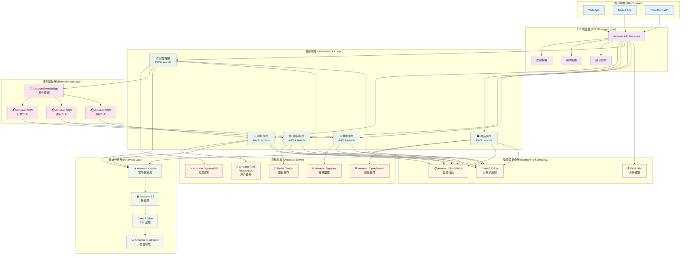

#### 跨服務交易的 Saga 模式實現

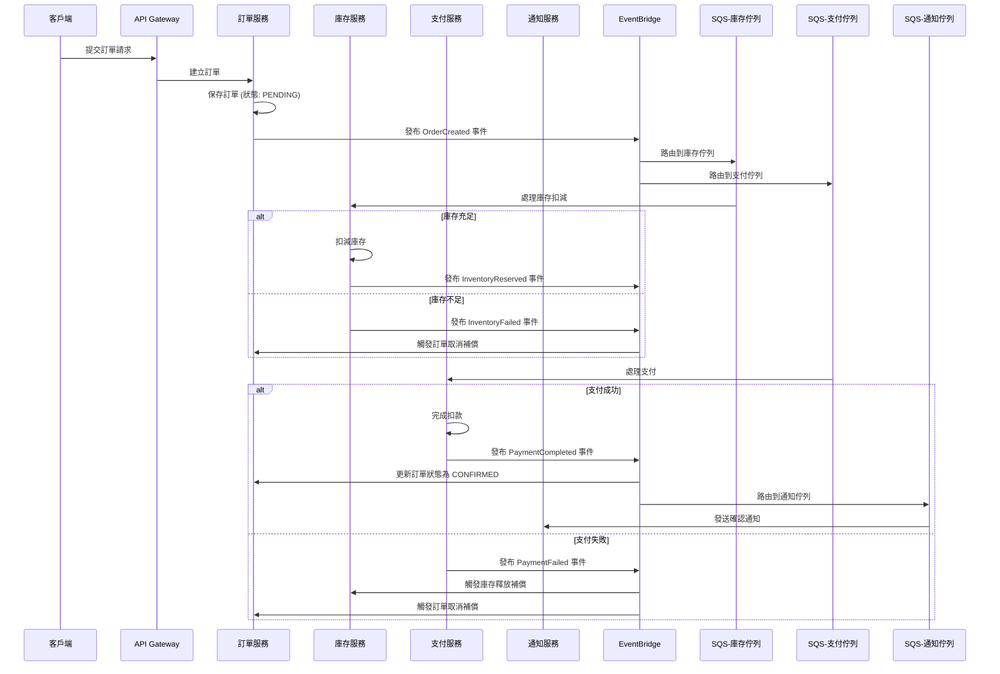

這個架構設計體現了微服務資料庫模式的核心優勢：

1. **服務自治**：每個服務選擇最適合的資料庫技術
2. **松耦合**：透過事件驅動實現服務間的異步通訊
3. **可擴展性**：各服務可獨立擴展
4. **容錯性**：單一服務故障不影響整體系統
5. **技術多樣性**：不同服務可使用不同的技術棧

### 8. 圖資料庫設計思維

最後的最後，我們來談談一種有意思的資料庫設計，**圖(graph database，GDB)** 。

如果說 SQL 資料庫是把世界整理成一張張整齊的 Excel 表格，設計的核心是「正規化」，目標是資料的完整性與無冗餘，是「為資料本身而設計」。那麼圖資料庫，就是直接把世界的「關係網絡」本身給存了下來 **「為你想問的問題而設計」**。它的設計思維，更接近我們大腦的直覺，我們必須像個記者，不斷追問： **根據這個資料節點，我們未來最想知道的是什麼？** 。

在圖資料庫的世界裡，「關係」不再是需要透過 JOIN 操作才能間接找到的東西，它本身就是一等公民，和「實體」一樣重要。這讓它在處理高度連接的資料時，擁有無與倫比的優勢。也正因為如此這個資料庫設計結構特別適合 **情境(Domain)的連續**。

**關係導向的思考方式**：

```
- 不是「這個實體有什麼屬性」
- 而是「這些實體間有什麼關係」
```

忘掉表格、欄位和主鍵。我們需要用一種新的眼光來看待資料 - **關聯**

一個圖資料表最重要的有三個概念: 節點 (Nodes)-邊 (Edges / Relationships)-屬性 (Properties)

- 節點 (Nodes) - 實體

  - 這就是我們的「名詞」，跟我們之前在 **ERD(事件驅動)** 中學到的「實體」很像。
  - 例如：人 (Person)、電影 (Movie)、公司 (Company)、帳戶 (Account)。
  - 節點可以有標籤 (Labels) 來分類。一個節點可以有多個標籤，這非常靈活。例如，一個人可以同時是 Person 和 Actor。

- 邊 (Edges / Relationships) - 關係

  - 這是圖資料庫的靈魂！邊連接了節點才有 **意義** ，代表它們之間的 **「行為(Conduct)」**。
  - 邊是 **有向** 的：`(A)-[關係]->(B)` 和 `(B)-[關係]->(A)` 是不同的。
  - 邊是有 **類型** 的：例如，[:ACTED_IN] (出演了)、[:DIRECTED] (導演了)、[:FRIENDS_WITH] (是...的朋友)。
  - 邊可以有屬性：這是它比 SQL 中間表更強大的地方。例如，在 (Tom Hanks)-[:ACTED_IN]->(Forrest Gump) 這條邊上，可以加上屬性 {role: "Forrest Gump"}。在 (UserA)-[:PURCHASED]->(ProductB) 這條邊上，可以加上屬性 {date: "2025-09-15", rating: 5}。

- 屬性 (Properties) - 描述

  - 節點和邊都可以有自己的屬性，以鍵值對 (Key-Value) 的形式存在。
  - 例如，Person 節點可以有 {name: "Tom Hanks", born: 1956}。

  當我們遇到的問題，可以被描述為 `「尋找...的路徑」`、`「分析...的關聯」`、`「誰是...的中心」`、`「這個群體有什麼特徵」`，等具有明顯 **指標性** 與 **關連性** 時，就應該把「圖資料庫」這個強大的工具納入我們的考量範圍。

  **設計思維的轉變**:

  在 SQL 中，我們想知道「A 的朋友的朋友」，我們需要把使用者表格自己跟自己 JOIN 兩次，效能會隨著資料量和關聯深度( 朋友的朋友的朋友... \* N )急遽下降。在圖資料庫中，這個問題變成了「從 A 節點出發，沿著 `FRIENDS_WITH` 的邊走兩步，看看能到達哪些人」。這個操作對圖資料庫來說是原生且極度高效的，我們不再需要為了正規化而建立大量的「中間表」或「關聯表」。多對多的關係，在圖中就是一條直接的邊，非常直觀!

```python
  過去需要 JOIN {N} 個表格才能得到的資訊，現在可能只需要一條帶有豐富屬性的邊就能描述。
```

了解了設計思維，我們就會發現，圖資料庫特別適合那些「關係」比「實體」本身更重要的場景。

**常見應用場景：社交網路/金融風控/推薦系統/網路與 IT 維運 **

1. **社交網絡 (Social Networks)** - 經典場景

- 模型： `(Person)-[:FRIENDS_WITH]->(Person)`、`(Person)-[:LIKES]->(Post)`、`(Person)-[:MEMBER_OF]->(Group)`。
- 應用：

  - 好友推薦： 「尋找我朋友的朋友，但我們還不是朋友的人」。這是一個簡單的兩步遍歷。
  - 影響力分析： 在網絡中，誰是關鍵意見領袖 (KOL)？（誰的連接最多，或在網絡中心）。
  - 資訊傳播路徑： 一則假新聞是如何在人群中傳播開來的？

2. 金融風控與反詐欺 (Fraud Detection)

- 模型： `(Person)-[:HAS_ACCOUNT]->(BankAccount)`、`(Person)-[:USES_DEVICE]->(Device)`、`(BankAccount)-[:SENT_TO]->(BankAccount)`。
- 應用：
  - 詐欺團夥識別： 幾個看似無關的帳戶，是否都使用了同一個設備或 IP 地址進行註冊或登入？是否在短時間內互相轉帳，形成一個不尋常的閉環？
  - 洗錢模式分析： 資金是否通過多層複雜的轉帳路徑，最終又回到了源頭附近？圖的環路檢測演算法能輕易發現這種模式。

3. 推薦引擎 (Recommendation Engines)

- 模型： `(Customer)-[:PURCHASED]->(Product)`、`(Customer)-[:VIEWED]->(Product)`、`(Product)-[:IN_CATEGORY]->(Category)`。
- 應用：
  - 協同過濾： 「購買了商品 A 的顧客，還購買了哪些其他商品？」圖資料庫可以快速找到 `(CustomerA)-[:PURCHASED]->(ProductA)<-[:PURCHASED]-(CustomerB)-[:PURCHASED]->(ProductB)` 這樣的路徑，然後將 ProductB 推薦給 CustomerA。
  - 基於內容的推薦： 「推薦給這個用戶和他過去喜歡的電影有相同演員或導演的其他電影」。

4. 網路與 IT 維運 (Network and IT Operations)

- 模型： `(Server)-[:CONNECTED_TO]->(Switch)`、`(Application)-[:RUNS_ON]->(Server)`、`(Database)-[:DEPENDS_ON]->(Server)`。
- 應用：
  - 根因分析 (Root Cause Analysis)： 當一個應用程式變慢時，它依賴的資料庫、伺服器、網路交換機的狀態是什麼？圖可以讓我們快速看到整條依賴鏈，找到問題的根源。

我們來視覺化看看關於政黨傾向集群網絡分析系統

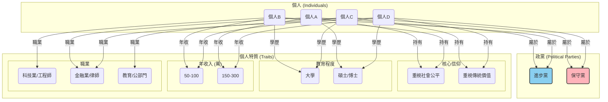

在這個資料結構中，我們可以很簡單的發現幾個要點:

1. 引力中心與集群：

- 進步黨 和 保守黨 像兩個引力中心，將各自的支持者（P1, P2 和 P3, P4）拉向自己。
- 重視社會公平 (BeliefX) 成為一個次級中心，將 P1 和 P2 緊密地連接在一起。同樣地，重視傳統價值 (BeliefY) 也將 P3 和 P4 綁定。

2. 橋接節點 (Bridge Nodes):

- 金融/法律 (Job2)、碩士/博士 (Edu2) 和 高年收 (Inc2) 這三個節點變得極為關鍵。它們像一座座橋樑，直接連接了分屬不同政黨的 P1 和 P4。
- 在視覺上，您會看到 P1 和 P4 雖然被各自的政黨和信仰拉開，但又被這三個共享的社經背景特質強力地拉近。這生動地展示了他們之間「既對立又相似」的複雜關係。

3. 網絡密度與社群邊界：

- 在 P1 和 P2 之間，以及 P3 和 P4 之間，連線非常密集，形成了兩個清晰的社群。
- 而社群之間的連結（如 P1 和 P4 的連結）則相對稀疏，這也幫助我們識別社群的邊界。

發現了嗎? 這是圖資料庫效用與威力最大的地方，根據 **邊(關係)** 我們可以輕而易舉的解讀資料意涵，我們不再需要思考如何透過中間表來「模擬」關係，而是可以直接地「描述」關係。圖資料庫，就是將人類在白板上描繪複雜關係的直觀思考過程，直接轉化為一種可儲存、可查詢的資料結構。它是一種對現實世界網絡關係的直接映射，而非表格化的抽象。我們在應用上的目標是設計一個「路網」，讓我們的核心查詢能像在高速公路上開車一樣順暢。不斷思考如何用最少的「步數」（遍歷）來回答我們的問題，並據此來調整資料結構中的節點、邊和屬性。

在應用上，當出現 **關係優先 (Relationship-First)** 的關鍵字時，他就代表著這個常態資料取用的情境是 **關注情境(Domain)的連鎖** ，這時候就特別適合用圖思維去進行資料庫設計。

這時候其實我們其實發現了一件事，在這個 **查找需求絕對大於寫入需求** 的情境中，是不是很符合 **CQRS(讀寫分離)** 的應用? 我們是不是可以利用這個盡可能減少 **查找** 步數的設計脈絡，來盡可能地放大我讀取效能?

絕對可以，而且這正是許多資深架構師在處理高效能系統時，腦中所運行的「心法」之一。

這觸及到一個核心觀念：**圖資料庫的設計思維，本質上就是一種極致的、以查詢為導向的「反正規化」哲學。**

以下我們用 Uber Eats 來進行實戰範例

#### AWS 實現 : Uber Eats 的餐點推薦關係網絡推導系統

當我們打開 Uber Eats App 時，後端會執行類似這樣的查詢：

- 點過 A(可能是我們上一次點的達美樂 Pizza) 的人還點了什麼？
- 我們(當前帳戶資訊)可能喜歡的菜系

我們先依循 **情境脈絡** 來逐步想想我們可以怎麼設計節點 (Nodes)與邊 (Edges / Relationships)

> 點過 A(達美樂 Pizza + 百事可樂 真的很推) 的人還點了什麼？

1. 找到我們 ( `User A` ) 最近訂購過的餐廳 (`Restaurant X` )
2. 找出所有也訂購過 `Restaurant X` 的其他用戶 (`User B`, `User C`)
3. 遍歷這些用戶還訂購過哪些我們從未訂購過的餐廳 ( `Restaurant Y`, `Restaurant Z`)
4. 將 `Restaurant Y` 和 `Restaurant Z` 作為推薦結果
5. 因為 `Restaurant Z` 有付錢購買企業推送方案，所以將 `Restaurant Z` 放置到推薦結果列表首位(index=0)

> 我們( `User A` )可能喜歡的菜系

1. 找到我們最常訂購的幾種菜系 (`Cuisine A`, `Cuisine B`)
2. 透過情境關聯進行查找(地理位置 / 菜系連鎖)
   1. 在我們的地理位置附近，找出其他也提供這些菜系的餐廳`Restaurant W`
   2. 找出和 `Cuisine A` 經常被一同喜愛的 `Cuisine C`，並推薦提供 `Cuisine C` 的餐廳 (ex: 美系餐廳經常被推送墨系餐廳)

但在 Uber Eats 這樣的平台上，有數百萬的用戶、數十萬的餐廳和數千萬的餐點，至少必須被滿足上述兩種情境，更別說來還有像是常見的「附近最熱門的餐廳」或「最多人點的餐點」

單單只有 General 的查找結果是無法滿足個人化推送的行銷利益最大化需求的，就像是:

- 「推薦給這位用戶一些他 **可能喜歡但從未點過** 的餐廳。」
- 「喜歡 **『日式拉麵』** 和 **『麻辣鍋』** 的用戶，通常還會喜歡 **哪種菜系** ？」
- 「找出和這位用戶 **口味相似** 的 **另一群人**，看看他們最近點了什麼 **新東西** 。」

這些問題的共同點是，它們都極度依賴 **「關係」** ——用戶與餐廳的關係、用戶與菜系的關係、用戶與用戶之間的隱含關係。用傳統 SQL 來處理這些問題，會需要極其複雜且緩慢的 JOIN 查詢，根本無法滿足即時推薦的需求。同時，為了這樣子的需求特別根據每種不同情境去設計一個預測模型也是成本-效益極大不符合比例原則的。

那麼我們來進行我們的 **圖譜模型設計 (The Blueprint)**

- 節點 (Nodes):

  - User (用戶)：屬性包含用戶 ID、地理位置等。
  - Restaurant (餐廳)：屬性包含餐廳名稱、地址、菜系標籤。
  - MenuItem (餐點)：屬性包含餐點名稱、價格、食材。
  - Cuisine (菜系)：例如「日式」、「義式」、「川菜」。
  - Ingredient (食材)：例如「牛肉」、「起司」、「辣椒」。

- 邊 (Edges / Relationships):

  - (User) -[ `:ORDERED {date, rating}` ]-> (Restaurant)：用戶訂購過某餐廳，邊上可以有日期和評分等屬性。
  - (User) -[ `:FAVORITED` ]-> (Restaurant)：用戶收藏了某餐廳。
  - (Restaurant) -[ `:SERVES` ]-> (Cuisine)：餐廳提供某種菜系。
  - (MenuItem) -[ `:CONTAINS` ]-> (Ingredient)：餐點包含某種食材。

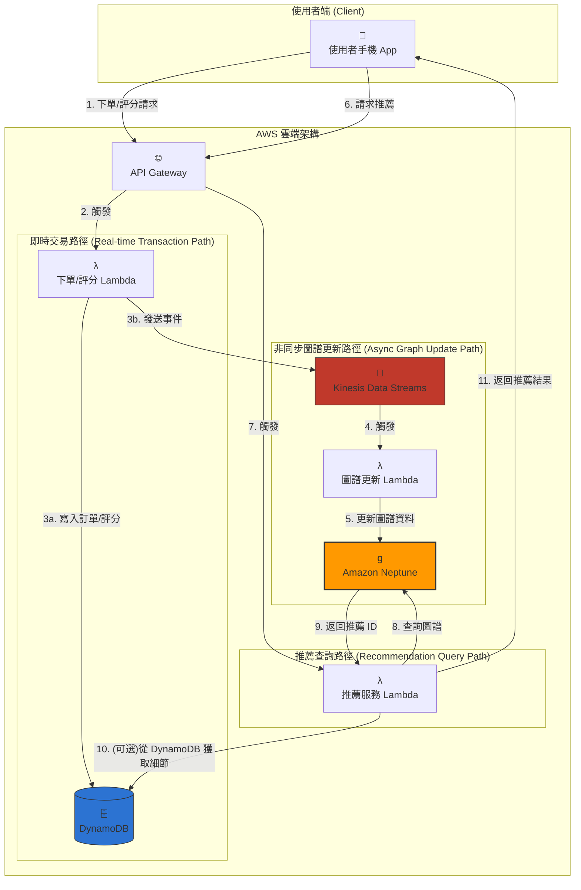

**實戰模擬場景：為「小名 (User_A)」推薦他可能喜歡的新餐廳。**

1. 觸發推薦： 小名打開 App，滑到推薦區塊。手機 App 發送一個「請求推薦」的 API 請求 (步驟 6)。
2. API 閘道與觸發： API Gateway 收到請求，驗證身分後，觸發 推薦服務 Lambda (LambdaRecommend) (步驟 7)。

3. 核心圖查詢： LambdaRecommend 的核心任務是向 Amazon Neptune 發送一個圖查詢 (步驟 8)。這個查詢的邏輯是「協同過濾」：

> - "尋找與小名 (User_A) 口味相似的人，看看他們還喜歡什麼小名沒吃過的餐廳。"

用圖查詢的語言來描述這個邏輯：

- a. 找到小名 (User_A) 訂購過的餐廳 (Rest_1 - 一蘭拉麵)。
- b. 找到也訂購過 Rest_1 的其他人 (User_B - 小字)。
- c. 看看小字還訂購過哪些餐廳 (Rest_3 - 瓦城)。
- d. 檢查小名是否訂購過 Rest_3。發現沒有。
- e. 因此，Rest_3 (瓦城) 成為一個強力的推薦候選。

4. 返回結果： Neptune 高效地完成這個遍歷，將 Rest_3 的 ID 返回給 LambdaRecommend (步驟 9)。

5. 豐富化資料 (可選)： LambdaRecommend 拿到 Rest_3 的 ID 後，可能會再去 DynamoDB 查詢這家餐廳的詳細資訊，如完整名稱、地址、圖片 URL 等 (步驟 10)。DynamoDB 非常適合這種 Key-Value 形式的快速查找。

6. 呈現給使用者： LambdaRecommend 將完整的推薦結果（包含餐廳名稱、圖片等）打包成 JSON，透過 API Gateway 返回給小名的手機 App (步驟 11)。小名於是看到了「瓦城」出現在他的推薦列表上。

這個推薦能夠成功，前提是圖譜裡的資料是即時的。這就是「非同步圖譜更新路徑」的作用。
**資料如何進入圖譜？(非同步路徑)**

1. App 發送「下單請求」(步驟 1)，API Gateway 觸發 下單 Lambda (步驟 2)。
2. 下單 Lambda 會做兩件事：

- 3a: 將訂單的詳細記錄寫入 DynamoDB，作為永久的交易存根。
- 3b: 同時，發送一個簡化的事件，如 { "userId": "User_A", "restaurantId": "Rest_2", "action": "ORDER" } 到 Kinesis Data Streams。

4. Kinesis 收到事件後，自動觸發 圖譜更新 Lambda (步驟 4)。
5. 圖譜更新 Lambda 解析事件，並在 Neptune 中執行一條更新語句：找到 User_A 和 Rest_2 之間的 ORDERED 邊，將其 count 屬性加 1 (步驟 5)。

這個架構實現了完美的 **讀寫分離** 與 **關注點分離**

- 交易路徑 (DynamoDB) 快速、穩定，負責處理核心交易
- 分析/推薦路徑 (Neptune) 專注於複雜的關係查詢，提供深度洞察
- Kinesis 作為兩者之間的非同步橋樑，確保系統的彈性和解耦

當我們遇到的問題，可以被描述為「尋找...的路徑」、「分析...的關聯」、「誰是...的中心」、「這個群體有什麼特徵」，這些特別強調 **讀取絕對大於寫入** 且重視 **情境(Domain)的連續** ，就應該把 **「圖資料庫」** 這個強大的工具納入我們的考量範圍。

## 設計策略選擇的抽象原則

資料庫設計的旅程，始於對 **商業領域(Domain)** 的深刻理解，途經對工具的理性選擇，最終落實於對效能與彈性的精巧平衡。它是一個 **商業邏輯思維實現** 的沉默英雄。在初期可能不被注意，但在系統面對巨大流量和複雜需求的壓力時，其堅實的架構將決定系統的成敗。這份遠見與戰略思維，正是資料庫設計從 **「技術應用」** 昇華為 **「設計藝術」** 的關鍵。

```
成功的資料庫設計，是一場在「商業需求」、「技術現實」與「未來變化」之間，不斷權衡與取捨的戰略藝術。
```

在進行資料庫技術選型時，我們就必須做好 **需求解析**的工作。某種程度上，身為一個架構師與工程師，商業領域(Domain)的理解程度上一定會且 **要** 比其他人來得更加深刻。 系統的 **核心價值** 是什麼? **資料的樣貌是什麼?** **系統最常對資料做什麼？** **系統規模的未來曲線如何成長?**

我們必須要有個深刻理解脈絡與工具，好進行 `需求解析` => `技術選型` => `Schema 設計`

資料庫設計的哲學，就是一場從抽象到具體的旅程，這也是 **DDD** 最重要、最核心的概念：

1. 始於「人」：理解使用者的需求與情境。
2. 精煉為「故事」：將需求轉化為行為與影響的業務流程。
3. 選擇「工具」：根據故事的特性（一致性、查詢模式、規模），選擇合適的技術組合。
4. 建構「模型」：為不同的視角設計不同的 Schema，讓故事能被有效率地記錄與訴說。

### 穩固的設計流程: 需求解析 => 技術選型 => Schema 設計

我們在一開始時，必須先忘掉技術，成為偵探與心理學家，我們必須深入理解「商業故事」，找出系統中的 **核心主角 (Entities)** 、他們之間的 **關係 (Relationships)**、 **會發生的故事 (Operations)**，以及必須遵守的 **規則 (Constraints)**。

我們在這個階段，必須

```python
忘掉技術，專注於「商業邏輯」與「資料故事」
```

我們需求解析階段花的時間越多，後面返工的機率就越低。一個模糊的藍圖，只會蓋出一棟搖搖欲墜的危樓。

以之前所說的分層租戶-Netflix 為例

在串流影視平台的設計開始前，可以先按照以下順序逐步釐清我們抽象的 **商業實現邏輯概念**

1.  **主角是誰 (Entities)？**

- 我們的系統裡有哪些核心的角色或物件？例如：`使用者 (User)`、`影視作品 (VideoContent)`、`工作室 (Studio)`、`版權合約 (License)`。這些就是我們未來資料庫裡的主要「名詞」。
- 然後我們要主動根據大類別進行在更粗略化的區分，避免概念的叢集過大導致後續失焦。像是影視作品，我們就可以切分出 **單一獨立作品** (電影) 和 **連續型作品** (連續劇、實境秀)。這時候已經可以初步用 `category` 來進行概念上的區分了。
- 為什麼不選用 `tag` 的原因是：`category` 代表的是一種**本質性、互斥的分類**，一個作品要嘛是電影，要嘛是連續劇，這個分類決定了它的基本資料結構（例如連續劇有季、集的概念，電影則沒有）。而 `tag` (標籤) 是一種**描述性、非互斥的屬性**，一部電影可以同時有「科幻」、「動作」、「奧斯卡得獎」等多個標籤。在需求解析階段，分清「本質分類」與「描述標籤」至關重要。

2.  **他們之間有什麼關係 (Relationships)？**

- `使用者` **觀看 (WATCHES)** `影視作品`，也可以 **評分 (RATES)** 它。
- `影視作品` 由某個 `工作室` **製作 (PRODUCED_BY)**。
- `影視作品` 在特定 `地理區域 (Region)` 的播放權，受一份 `版權合約` **約束 (LICENSED_UNDER)**。
- 一個 `使用者` 可以有多個 `使用者設定檔 (Profile)`，例如家庭共享帳號下的「爸爸」、「媽媽」、「小孩」。

3.  **會發生的故事 (Operations)？**

- **高頻讀取**：使用者瀏覽目錄、搜尋影片、觀看影片。這是系統 **最主要的流量來源** ，對 **延遲極度敏感**。
- **中頻寫入**：系統記錄使用者的觀看歷史、更新看到一半的影片時間戳、儲存用戶的評分。
- **低頻寫入**：內容團隊上傳新的影視作品、更新作品的封面或簡介、設定新的版權合約。

4.  **必須遵守的規則 (Constraints)？**

- **地理限制**：一部有日本地區版權的動畫，絕對不能被美國地區的 IP 位址觀看。
- **年齡分級**：「小孩」的 Profile 不能搜尋或觀看限制級的內容。
- **版權時效**：一份版權合約到期後，對應的影視作品必須立即在相關地區下架。
- **帳號限制**：一個標準帳號最多只能在兩個裝置上同時觀看。

再用這個邏輯思路來進行兩個情境復驗 **Uber Eats** 與 **TSMC 晶圓工廠 IoT**

#### Uber Eats 需求解析脈絡

1. 主角是誰 (Entities)？

- `用戶 (User)`：下訂單的顧客。
- `餐廳 (Restaurant)`：提供餐點的商家。
- `外送員 (Courier)`：負責運送餐點的合作夥伴。
- `訂單 (Order)`：一次完整的交易紀錄，是連接所有主角的關鍵。
- `餐點 (MenuItem)`：菜單上的具體品項。
- `菜系 (Cuisine)`：如「日式」、「義式」、「速食」等分類。
- `支付方式 (PaymentMethod)`：如信用卡、Apple Pay。

2. 他們之間有什麼關係 (Relationships)？

- 一個 `用戶` **可以下多筆 (PLACES)** `訂單`。
- 一筆 `訂單` **只能屬於一個 (BELONGS_TO)** `用戶`，並且 **來自一家 (ORDERED_FROM)** `餐廳`。
- 一筆 `訂單` **包含多個 (CONTAINS)** `餐點`。
- 一筆 `訂單` 在特定階段會被 **指派給 (ASSIGNED_TO)** 一位 `外送員`。
- 一家 `餐廳` **提供多種 (SERVES)** `餐點`，並 **屬於一種或多種 (SPECIALIZES_IN)** `菜系`。
- 一個 `用戶` **可以有多種 (HAS_PAYMENT_METHOD)** `支付方式`。

3. 會發生的故事 (Operations)？

- 超高頻讀取/更新 (Real-time Streaming)：
  - `外送員` 位置的即時追蹤。這是地圖上移動的點，對延遲極度敏感。
- 高頻讀取 (Read-Heavy)：
  - `用戶` 瀏覽附近餐廳列表、滑動菜單、搜尋特定餐點。
  - `用戶` 查詢進行中訂單的狀態（已接單、準備中、外送中）。
- 高頻寫入 (Write-Heavy)：
  - `用戶` 提交 `訂單`。這是系統在用餐尖峰時段的寫入瓶頸。
- 中頻寫入 (Medium-Write)：
  - `用戶` 給予 `餐廳` 或 `餐點` 評分。
  - `用戶` 將某家 `餐廳` 加入收藏。
- 低頻寫入 (Low-Write)：
  - `餐廳` 更新菜單、價格或營業時間。
  - `用戶` 新增或刪除 `支付方式`。

4. 必須遵守的規則 (Constraints)？

- 地理限制：`用戶` 只能看到在其外送範圍內的 `餐廳`。
- 時間限制：`用戶` 只能向正在營業的 `餐廳` 下訂單。
- 交易原子性：`訂單` 的成立與 `支付` 的成功必須是原子操作；支付失敗，訂單就不能成立。
- 狀態一致性：訂單 `狀態`（例如「外送員已取餐」）的更新，必須能即時地被 `用戶` 和 `餐廳` 兩方看到。
- 獨佔性：一筆 `訂單` 在同一時間只能被一位 `外送員` 配送。

#### TSMC 晶圓工廠 IoT 需求解析脈絡

我們首先要深入理解晶圓製造的「商業故事」，釐清數據背後的物理意義

1. 主角是誰 (Entities)？

- `機台 (Machine)`：如蝕刻機、曝光機，是數據產生的源頭。
- `感測器 (Sensor)`：安裝在機台上的具體測量單元，如溫度計、壓力計。
- `晶圓 (Wafer)`：正在被加工的產品，每一片都有獨一無二的 ID。
- `批次 (Lot/Batch)`：一組一起加工的晶圓，共享相同的製程參數。
- `製程參數 (Recipe)`：一套指令，定義了機台在處理某個批次時的設定值。
- `維運人員 (Operator)`：負責監控與操作機台的人。

2. 他們之間有什麼關係 (Relationships)？

- 一個 `機台` 上安裝了多個 `感測器`。
- 一個 `機台` 在特定時間正在處理某一個 `批次` 中的某一片 `晶圓`。
- 一個 `批次` 的加工過程遵循一套 `製程參數`。
- 當數據異常時，系統需要通知特定的 `維運人員`。

3. 會發生的故事 (Operations)？

- **超高頻寫入 (Ultra High-Frequency Write)**：數萬個 `感測器` 以毫秒為單位，持續不斷地將測量數據（溫度、壓力、震動）寫入系統。 **這是系統最主要的負載**。
- **高頻讀取 (High-Frequency Read)**：
  - 即時監控：`維運人員` 的儀表板需要以秒級更新，顯示最近幾分鐘的關鍵參數曲線。
  - 即時警報：系統需要持續掃描傳入的數據，一旦某個 `批次` 參數（如溫度）偏離 製程參數 設定的範圍，必須在秒內觸發警報。
- **中頻讀取 (Medium-Frequency Read)**：
  - 良率分析：品管工程師需要查詢某個 `批次` 在某個 `機台` 上的完整加工歷史數據，以分析良率下降的原因。查詢範圍通常是數小時到數天。
- **低頻讀取 (Low-Frequency Read)**：

  - 趨勢分析與模型訓練：研發工程師需要分析過去數年的數據，以優化 製程參數 或訓練預測性維護的機器學習模型。查詢範圍極大，但對即時性要求不高。

  4. 必須遵守的規則 (Constraints)？

- 數據完整性：任何 `感測器` 的數據都不能遺失，因為單一數據點的遺失可能導致整個批次的良率分析失敗。
- 時間精確性：所有數據必須帶有精確到毫秒的時間戳，且順序絕不能錯亂。時間是這個領域最重要的維度。
- 數據保留策略：出於品質追溯和合規要求，原始數據可能需要被保留數年之久。
- 低延遲警報：異常發生時，從數據產生到觸發警報的總延遲必須控制在秒級以內。

---

我們對於 需求解析 (建築藍圖) 有個概念如下

- 需求解析 (建築藍圖):
  - 核心哲學： 忘掉技術，成為偵探與心理學家。
  - 任務： 深入理解「商業故事」，找出系統中的核心主角 (Entities)、他們之間的關係 (Relationships)、會發生的故事 (Operations)，以及必須遵守的規則 (Constraints)。
  - 產出： 一份與技術無關的概念模型 (如 ERD)，這是所有後續工作的最高指導原則。

---

初步釐清需求後，接下來的重要節點是 **技術選型**

理論上來說，當需求的覆蓋率在已知的討論環節中(詳見<商業邏輯的轉化發>)已經盡可能地趨近 **80%**，這已經很接近我們的初步具體化系統，也符合 80/20 權衡法則的策略區分，我們應該會有一個概念:

**我會在這個 `會發生的故事 (Operations)` 下，因為 `必須遵守的規則 (Constraints)`，建置對應的資料庫設計**

在這時候有一個分析工具叫做 **鑽石模型**

這是一種抽象的決策藝術，幫助我們在四個關鍵切面之間進行權衡，打磨出最佳設計，四個面向分別是 : 業務邏輯、資料特性、應用模式、系統規模

1. 業務邏輯 (價值的源頭): 系統的核心價值是什麼？（一致性 vs. 可用性）
2. 資料特性 (資料的樣貌): 資料天生長什麼樣子？（結構化 vs. 非結構化）
3. 應用模式 (系統的行為): 系統最常對資料做什麼？（讀寫比、查詢模式）
4. 系統規模 (未來的曲線): 系統將如何成長？（垂直擴展 vs. 水平擴展）

鑽石模型的精髓在於，它強調這些維度是交互影響的。一個好的設計，不會只看單一切面，而是會綜合評估，在看似衝突的需求中找到那個精妙的平衡點。例如，為了應對「海量規模」（維度四），我們可能會在「業務邏輯」（維度一）上放寬對即時一致性的要求。

我們可以根據在一開始 **`會發生的故事 (Operations)`** 中依據 **`核心主角 (Entities)`** 的 **`會發生的故事 (Operations)`** 特性進行技術上的選擇，而常見的特性如下

**資料變更頻率**：

- 高頻變更 → 事件驅動 + CQRS
- 中頻變更 → 傳統 CRUD + 快取
- 低頻變更 → 主檔管理模式

**資料量級規模**：

- TB 級以下 → 垂直擴展 + 讀取副本
- TB 到 PB 級 → 水平分片
- PB 級以上 → 分散式 + 冷熱分層

**一致性需求**：

- 強一致性 → ACID 事務
- 最終一致性 → 事件驅動
- 會話一致性 → 讀寫分離

**查詢模式**：

- 簡單查詢 → 關聯式資料庫
- 複雜分析 → 列式資料庫
- 圖遍歷 → 圖資料庫
- 全文檢索 → 搜尋引擎

**災難恢復**：

- 高可用性 → Multi-AZ
- 跨區域複製 → Global Tables
- 災難恢復 → Cross-Region

#### TSMC 晶圓工廠 IoT 技術選型解析脈絡

這次我們換個順序，從 **晶圓 IoT `會發生的故事 (Operations)` ** 開始說起。

> - **超高頻寫入 (Ultra High-Frequency Write)**：
>   - 數萬個 `感測器` 以毫秒為單位，持續不斷地將測量數據（溫度、壓力、震動）寫入系統。 **這是系統最主要的負載**。
> - **高頻讀取 (High-Frequency Read)**：
>   - 即時監控：`維運人員` 的儀表板需要以秒級更新，顯示最近幾分鐘的關鍵參數曲線。
>   - 即時警報：系統需要持續掃描傳入的數據，一旦某個 `批次` 參數（如溫度）偏離 製程參數 設定的範圍，必須在秒內觸發警報。
> - **中頻讀取 (Medium-Frequency Read)**：
>   - 良率分析：品管工程師需要查詢某個 `批次` 在某個 `機台` 上的完整加工歷史數據，以分析良率下降的原因。查詢範圍通常是數小時到數天。
> - **低頻讀取 (Low-Frequency Read)**：
>   - 趨勢分析與模型訓練：研發工程師需要分析過去數年的數據，以優化 製程參數 或訓練預測性維護的機器學習模型。查詢範圍極大，但對即時性要求不高

從需求解析中我們看到，數據的價值和存取模式與其「年齡」高度相關。這是一個 **「冷熱資料分層」** 與 **「CQRS」** 混合應用場景。

1. 熱層 (Hot Tier) - 即時監控與警報

- 需求：處理超高頻寫入和即時時間序列查詢。
- 選型：時序資料庫 (Time-Series Database)，如 Amazon Timestream。
  -Timestream 專為時間序列數據設計，其 In-Memory Store 能應對海量寫入，並對時間範圍的查詢進行了極致優化，完美滿足即時儀表板和警報的需求。

2. 溫層 (Warm Tier) - 短期良率分析

- 需求：對數天或數週的數據進行較複雜的分析查詢。
- 選型：時序資料庫的磁碟層，如 Amazon Timestream 的 Magnetic Store。
  - Timestream 會自動將超過記憶體保留期限的數據降級到成本更低的磁碟層。應用程式無需修改查詢邏輯，即可同時查詢熱層和溫層的數據。

3. 冷層/凍結層 (Cold/Frozen Tier) - 長期分析與歸檔

- 需求：以最低成本儲存數年的歷史數據，並能對其進行大規模的批次分析。
- 選型：數據湖 (Data Lake)，如 Amazon S3 + AWS Glue + Amazon Athena。
  - `S3` 提供近乎無限且成本極低的儲存空間。
  - `AWS Glue` 負責將數據從 Timestream 或直接從 IoT 來源轉換為適合分析的 `Parquet` 格式。
  - `Amazon Athena` 讓工程師可以直接用標準 SQL 對儲存在 S3 上的海量數據進行 ad-hoc 查詢，而無需管理任何伺服器。

#### Netflix 的多重 Domain 技術選型解析脈絡

從上面的需求解析我們能清楚看到，Netflix 不是一個單一的系統，而是一個由多個不同需求的「子宇宙」組成的聯邦。強行用一種資料庫解決所有問題，就像只用一種螺絲起子去組裝一整台電腦，是注定會失敗的。因此，我們必須採用「多語言持久化 (Polyglot Persistence)」的策略。

> - **高頻讀取**:
>   - 使用者瀏覽目錄、搜尋影片、觀看影片。這是系統 **最主要的流量來源** ，對 **延遲極度敏感**。
> - **中頻寫入**：
>   - 系統記錄使用者的觀看歷史、更新看到一半的影片時間戳、儲存用戶的評分。
> - **低頻寫入**：
>   - 內容團隊上傳新的影視作品、更新作品的封面或簡介、設定新的版權合約。

1.  **影視目錄、搜尋與個人化推薦 (元數據 Domain)**

    - **需求**：需要處理半結構化的元數據（演員、簡介、標籤），並支援強大的全文搜尋與複雜的關聯查詢（推薦）。
    - **選型**：**文件資料庫 (如 MongoDB) + 搜尋引擎 (如 OpenSearch/Elasticsearch)**。
      - `MongoDB` 用來儲存影視作品的詳細元數據，其彈性的 Schema 非常適合應對多變的內容屬性。
      - `OpenSearch` 則用來建立搜尋索引，提供高效能的關鍵字搜尋、分類篩選與聚合分析。推薦引擎的關係數據也可以部分儲存在圖資料庫 `Neptune` 中。

2.  **使用者觀看歷史與狀態 (行為日誌 Domain)**

    - **需求**：極高的寫入吞吐量（每秒數百萬用戶在更新觀看狀態），可接受最終一致性，查詢模式相對簡單（通常是根據用戶 ID 查詢）。
    - **選型**：**鍵值/寬列資料庫 (如 DynamoDB 或 Cassandra)**。
      - `DynamoDB` 的鍵值模型非常適合以 `UserID` 為分區鍵，`VideoID` 或 `Timestamp` 為排序鍵的設計，能提供近乎無限的擴展性與低延遲的讀寫。

3.  **用戶帳號、訂閱與支付 (交易 Domain)**
    - **需求**：絕對的強一致性 (ACID)，需要支援複雜的交易事務（例如，扣款失敗需要回滾訂閱狀態）。
    - **選型**：**關聯式資料庫 (如 PostgreSQL 或 MySQL)**。
      - `PostgreSQL` 的事務能力和成熟的生態系，是處理金融相關數據、確保帳務準確無誤的不二之選。

#### Uber Eats 技術選型解析脈絡

> - 超高頻讀取/更新 (Real-time Streaming)：
>   - `外送員` 位置的即時追蹤。這是地圖上移動的點，對延遲極度敏感。
> - 高頻讀取 (Read-Heavy)：
>   - `用戶` 瀏覽附近餐廳列表、滑動菜單、搜尋特定餐點。
>   - `用戶` 查詢進行中訂單的狀態（已接單、準備中、外送中）。
> - 高頻寫入 (Write-Heavy)：
>   - `用戶` 提交 `訂單`。這是系統在用餐尖峰時段的寫入瓶頸。
> - 中頻寫入 (Medium-Write)：
>   - `用戶` 給予 `餐廳` 或 `餐點` 評分。
>   - `用戶` 將某家 `餐廳` 加入收藏。
> - 低頻寫入 (Low-Write)：
>   - `餐廳` 更新菜單、價格或營業時間。
>   - `用戶` 新增或刪除 `支付方式`。

需求解析清楚地告訴我們，Uber Eats 的業務是由多個特性迥異的「界定上下文 (Bounded Context)」組成的。

1. 訂單與交易 Domain (核心交易)

- 需求：極高的寫入吞 öt 量（尤其在尖峰時段）、高可用性、可接受最終一致性（報表可以慢一點）。查詢模式相對固定（按訂單 ID 或用戶 ID 查）。
- 選型：鍵值/文件資料庫 (如 DynamoDB)。其鍵值模型非常適合根據 `order_id` 進行快速讀寫，並能輕鬆應對流量洪峰，實現水平擴展。

2. 餐廳與菜單 Domain (主檔資料)

- 需求：讀取遠大於寫入，需要保證資料的強一致性（菜單價格不能錯），資料結構相對穩定。
- 選型：關聯式資料庫 (如 PostgreSQL) + 快取層 (如 Redis)。PostgreSQL 負責管理權威的餐廳和菜單主檔，Redis 則快取熱門餐廳的菜單資訊，應對海量的瀏覽請求。

3. 外送員物流 Domain (地理空間與即時串流)

- 需求：處理超高頻的位置更新，並支援高效的地理空間查詢（例如「尋找離餐廳最近的 5 位空閒外送員」）。
- 選型：記憶體資料庫 (如 Redis) + 訊息佇列 (如 Kinesis/Kafka)。Redis 的 Geo-spatial 指令可以極其高效地處理即時地理位置的儲存和查詢。Kinesis 則負責接收和緩衝海量的位置更新數據流。

4. 搜尋與推薦 Domain (關係探索)

- 需求：處理複雜的關係查詢，例如「點過這家餐廳的人還喜歡什麼？」或「與我口味相似的人最近點了什麼新餐廳？」。
- 選型：圖資料庫 (如 Neptune)。如我們之前所述，這是圖資料庫最擅長的領域，能夠高效遍歷複雜的「用戶-餐廳-菜系」關係網絡。

### 基於領域特性的選型矩陣

#### AWS 資料庫選型決策流程圖

```mermaid
flowchart TD
    A[系統需求分析] --> B{工作負載類型?}

    B -->|OLTP 交易型| C{一致性需求?}
    B -->|OLAP 分析型| D{資料模型?}
    B -->|搜尋型| E[OpenSearch + CloudFront]
    B -->|時間序列| F[Timestream + Redis]
    B -->|圖形關係| G[Neptune + Redis]

    C -->|強一致性| H{資料模型?}
    C -->|最終一致性| I{資料模型?}

    H -->|關聯式| J[RDS PostgreSQL<br/>+ ElastiCache Redis<br/>+ Multi-AZ]
    H -->|文件型| K[DocumentDB<br/>+ DAX<br/>+ Cross-Region]

    I -->|文件型| L[DynamoDB<br/>+ DAX<br/>+ Global Tables]
    I -->|鍵值對| M[ElastiCache<br/>+ Cross-AZ<br/>+ Backup]

    D -->|列式存儲| N[Redshift<br/>+ Spectrum<br/>+ S3 Data Lake]
    D -->|文件分析| O[EMR + S3<br/>+ Glue<br/>+ Athena]

    E --> P[成本效益分析]
    F --> P
    G --> P
    J --> P
    K --> P
    L --> P
    M --> P
    N --> P
    O --> P

    P --> Q{預算範圍?}
    Q -->|< $1000/月| R[基礎配置]
    Q -->|$1000-5000/月| S[標準配置]
    Q -->|> $5000/月| T[企業配置]

    R --> U[最終架構建議]
    S --> U
    T --> U
```

#### 詳細選型決策矩陣

```mermaid
graph LR
    subgraph "決策維度"
        A1[工作負載<br/>OLTP/OLAP/Search/Graph]
        A2[一致性需求<br/>Strong/Eventual/Causal]
        A3[資料模型<br/>Relational/Document/KV]
        A4[規模需求<br/>GB/TB/PB級別]
    end

    subgraph "AWS 服務選型"
        B1[RDS PostgreSQL<br/>關聯式OLTP<br/>強一致性]
        B2[DynamoDB<br/>NoSQL OLTP<br/>最終一致性]
        B3[Redshift<br/>列式OLAP<br/>分析查詢]
        B4[Neptune<br/>圖資料庫<br/>關係查詢]
        B5[OpenSearch<br/>全文搜尋<br/>日誌分析]
        B6[Timestream<br/>時間序列<br/>IoT監控]
    end

    subgraph "快取策略"
        C1[ElastiCache Redis<br/>毫秒級快取]
        C2[DAX<br/>DynamoDB加速]
        C3[CloudFront<br/>邊緣快取]
    end

    subgraph "災難恢復"
        D1[Multi-AZ<br/>高可用性]
        D2[Global Tables<br/>跨區域複製]
        D3[Cross-Region<br/>災難恢復]
    end

    A1 --> B1
    A1 --> B2
    A1 --> B3
    A2 --> B1
    A2 --> B2
    A3 --> B4
    A4 --> B5
    A4 --> B6

    B1 --> C1
    B2 --> C2
    B3 --> C3
    B4 --> C1
    B5 --> C3
    B6 --> C1

    B1 --> D1
    B2 --> D2
    B3 --> D3
    B4 --> D3
    B5 --> D3
    B6 --> D3
```

#### 成本與效能權衡分析

```mermaid
quadrantChart
    title "AWS 資料庫服務的成本效能象限"
    x-axis "低成本" --> "高成本"
    y-axis "低效能" --> "高效能"

    quadrant-1 "高效能高成本"
    quadrant-2 "高效能低成本"
    quadrant-3 "低效能低成本"
    quadrant-4 "低效能高成本"

    "RDS PostgreSQL": [0.7, 0.8]
    "DynamoDB": [0.5, 0.9]
    "ElastiCache": [0.8, 0.95]
    "Redshift": [0.6, 0.7]
    "Neptune": [0.75, 0.6]
    "OpenSearch": [0.4, 0.65]
    "Timestream": [0.3, 0.7]
    "S3": [0.1, 0.3]
    "DocumentDB": [0.65, 0.7]
```

我們的探討始於一個根本性的問題：什麼是資料？ 結論是，資料並非單純且客觀的靜態屬性，而是 「在 **特定上下文** 中，由特定需求驅動的 **行為** 所產生的 **影響** ，再經由多重視角詮釋後的記錄」。

```
需求( require ) => 行為(conduct) => 影響(effect)
```

這個認知是理解所有現代資料庫策略的基石，它解釋了為何不存在萬能的資料庫，並直接導向了 `CQRS`、`微服務` 與 `事件溯源` 等架構的誕生。

基於上述哲學，我們深入解析了八種應對不同業務挑戰的核心策略，每種策略都是為了解決特定情境下的矛盾而生：

1. 主檔管理 (MDM)：為了解決「資料混亂」，建立一個跨系統、可信的「單一事實來源 (Single Source of Truth)」。
2. 事件驅動架構 (EDA)：為了解決「狀態變更的歷史遺失」，轉而記錄一系列不可變的「事件」，強調「發生了什麼」而非「變成了什麼」。
3. CQRS (命令查詢責任分離)：為了解決「讀寫模型需求不一」的矛盾，將系統的寫入（命令）與讀取（查詢）操作徹底分離，各自優化。
4. 多租戶架構：為了解決「資源共享與資料隔離」的平衡，提供從共享到專屬的多層次方案，以匹配不同租戶的成本與安全需求。
5. 分片策略：為了解決「單點效能瓶頸」，透過「分而治之」的思想，將海量資料水平擴展到多個分片上，以換取近乎無限的規模擴展性。
6. 冷熱資料分層：為了解決「儲存成本與存取效能」的權衡，承認資料價值隨時間衰減，將資料在其生命週期中自動「搬家」到成本效益最佳的儲存層。
7. 微服務資料庫模式：為了解決「組織與系統的複雜性」，提倡「權力下放」，讓每個服務擁有自己的資料庫，實現領域自治與技術獨立。
8. 圖資料庫設計思維：為了解決「複雜關係查詢」的效能問題，將「關係」視為一等公民，專為「尋找路徑」與「分析關聯」等情境而設計。

最後，我們將所有策略置於一個統一的設計框架下：

- 穩固的設計流程：始終遵循 `需求解析 -> 技術選型 -> Schema` 設計 的流程，確保每一個技術決策都有堅實的業務邏輯支撐。
- 鑽石決策模型：在技術選型時，透過評估 業務邏輯、資料特性、應用模式、系統規模 四個維度，系統性地權衡與取捨，找到最適合當下情境的策略組合。

總而言之，我們一同了解了資料庫設計從單純的技術應用，昇華為一門在 `「商業需求」`、`「技術現實」`與 `「未來變化」`之間不斷尋求最佳平衡點的戰略藝術。一個卓越的架構師，如同經驗豐富的主廚，會為不同的菜餚（業務場景）挑選最合適的廚具（設計策略），最終烹調出穩定、高效且具彈性的系統盛宴。

拖了這麼久也非常不好意思，但由於資料庫的設計影響到了整個系統最基礎的根源，不得不再這邊稍微講的沒那麼模糊一點，實際上每一個核心設計策略都對應了一個資料庫設計生態系，本身就是一個宏大的學問。

明天我們將會來點輕鬆的，簡單的聊聊 Git 版本控制策略。
