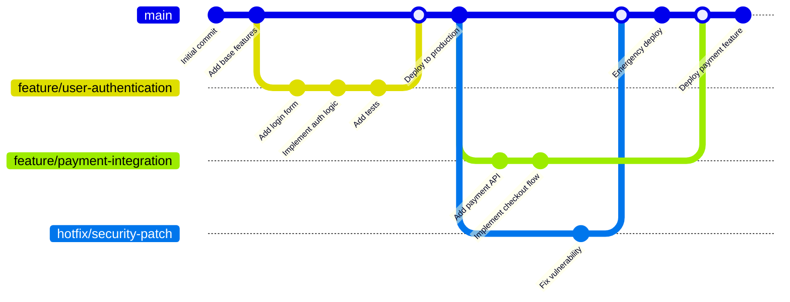
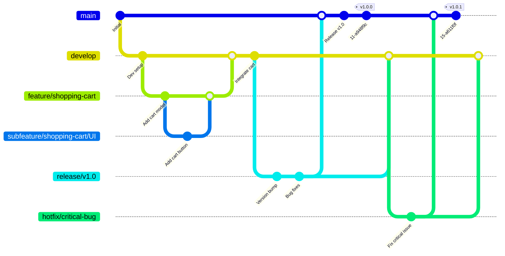
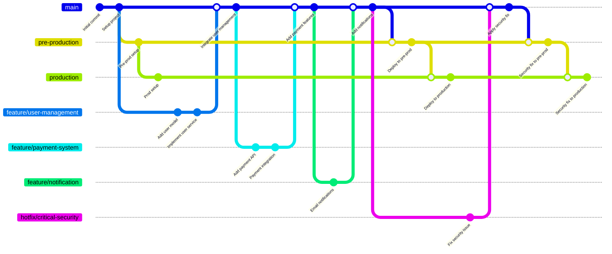
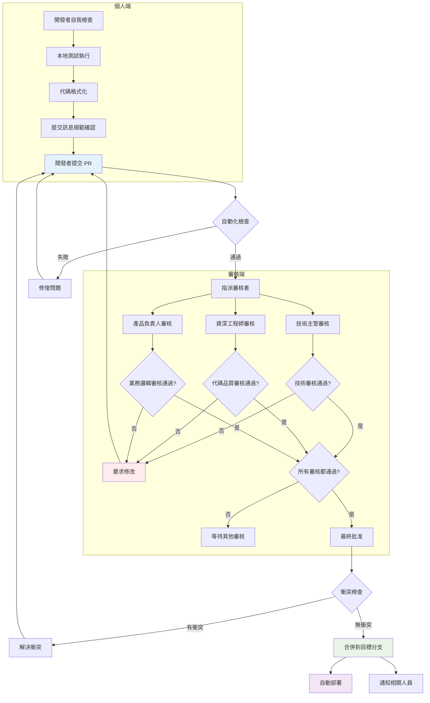
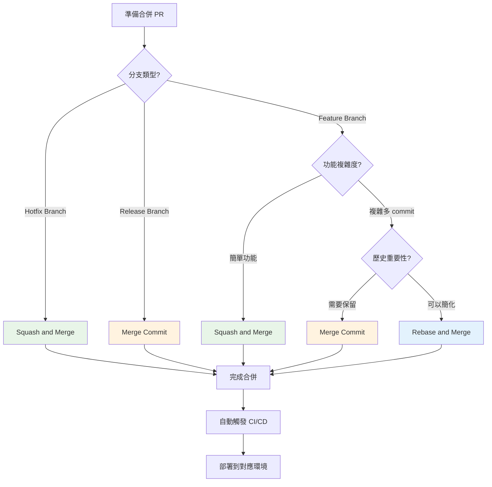

# Day 12 | 版本控制策略(PRReview strategy) × Git Flow × Lint 導入思維 :代碼品質管控與開發流程規範

今天我們來談點簡單輕鬆的，某種程度上比起軟體工程，更大概率會接近所謂的社交工程 - 假如我們沒有乖乖同步最新分支的話。

想像一下，我們不是在寫程式，而是在和一群頂尖作家合寫一部鉅作，比如《哈利波特》或《魔戒》。你該如何確保每個人寫的章節風格一致、劇情不會前後矛盾、沒有錯別字，而且在最終出版前，還能有條不紊地進行校稿和修訂？
讓我們用一個更具象化的比喻來開場。

可以想像我們是一支頂尖 F1 車隊的首席工程團隊。我們的任務是打造一輛冠軍賽車。你該如何確保空氣動力學、引擎、懸吊各部門的設計能完美協作，而不是互相干擾？如何在賽季中不斷推出創新的設計，同時保證賽車在正賽時的絕對穩定？又該如何應對比賽中的突發狀況，進行閃電般的進站維修？

又或者我們脫下安全帽走進時尚設計車間，現在的我們是頂級時尚品牌的創意團隊，正在籌備萬眾矚目的春季時裝大秀。我們該如何確保旗下眾多設計師的作品，既能展現個人才華，又能符合本季的整體主題與品牌 DNA？如何管理從草圖、打版、樣衣到最終定裝的繁複流程，確保每一件作品都完美無瑕？又該如何在開秀前一刻，優雅地處理模特身上禮服的意外狀況？

無論是打造賽車還是籌備大秀，其核心挑戰都是一樣的：**如何在高壓、複雜的環境下，讓一個團隊有條不紊地協作，持續交付高品質的作品，並有效管理風險。**

換言之 git 硬要說的話只能是紀錄工具，Git 工作流程是已經被涵化的流程控管；實際上，**版本控制策略** 的另一個面貌就是 **管理學方法論** !

這也是 AI 無法替我們決策與執行的部分，或許 AI Agent 能夠替我們進行數據世界中的分析與建議，乃至於根據調校好的底層邏輯進行自我增長 - 例如著名的馮諾伊曼機。但關於 **概念化的決策** 與執行方針是只有我們能夠評估與進行確認的。這有關於現實中的客觀普通物理法則與數學學理驗證的雙重限制(感謝老天，我竟然還沒有忘)，但不可否認的是， **管理** 就像是一個園丁，我們必須在發現我們專注的賽車、服裝、程式碼與產品出現需要根據複雜情境進行權衡的時候。 由我們根據 **核心抽象需求(Domain)** 進行未來方向的重新調控。

所以以下讓我們先一同了解幾個管理學中的 **驅動原因** ，在不斷討論的過程中我們會看到 `GitHub Flow` 、 `Git Flow` 、 `GitLab Flow` 的管理方針模樣 - 這是很正常的，就像我們之前所說

```python
Git工作流程 == 被涵化的流程控管 == 管理學
```

隨著軟體開發團隊規模的擴大和項目複雜度的提升，選擇適合的版本控制管理策略已成為影響開發效率和代碼品質的關鍵因素。在現代軟體開發中，**版本管理不僅僅是代碼的歷史記錄工具，更是團隊協作、品質保證和風險控制的核心基礎流程。**

## 管理學驅動原理

幾乎每種主流的管理方法論，其背後都有一個或多個核心的「驅動因子 (Driver)」，這個驅動因子決定了該方法論最關心什麼、優先解決什麼問題。最主要的有 **流程** 、 **效率** 、 **品質** 以及後續延伸的 **價值** 與 **時程**

我們用一些小故事來了解背景。

### 穩(流程的絕對正義)、量(快速地進入市場)、質(無錯的品質交付)的三相性方法論

大多數的流程管理的誕生背景都誕生在工業革命與二戰戰後產業結構轉型之後，在當時所有企業主在已經有自己的流水產線之後面對競爭與大環境的變化，所以需要有一個更加清晰與快速應對的方法，因此 **流程與控制驅動 (Process & Control Driven)** 、 **效率與流動驅動 (Efficiency & Flow Driven)** 、 **品質與數據驅動 (Quality & Data Driven)** 孕育而生。

#### 流程的絕對正義

**流程與控制驅動** 主要的核心哲學是 **成功源於可預測性與可重複性** ，只要我們建立一套穩健、清晰的流程，並嚴格遵循它，就能控制風險，確保專案在 **軌道** 上運行。 `「我們是否遵循了計畫？」` 、 `「權責是否清晰？」` 、 `「風險是否在控制之中？」` 是依循這個邏輯脈絡中最重要的問題，這個管理流程適合需求明確、變動少、對合規性和文件記錄要求高的專案（如建築、政府專案）。 **`瀑布模型 (Waterfall)`** 就是典型的 流程驅動(Process Driven) 呈現，它是最純粹的線性流程，強調一個階段的完美結束才能進入下一個階段。 除此之外還有極度強調「控制」，透過分階段管理和例外管理，確保專案的每一步都在高層的掌控之下，並且始終服務於商業目標的 **`PRINCE2®`**；以及流程驅動的集大成者 - **`PMBOK®`**，它提供了最全面的流程「地圖」，定義了專案從頭到尾應該做什麼、考慮什麼。

#### 快速地進入市場

**效率與流動驅動** 主要的核心哲學是 **最大化產出速度（吞吐量），最小化投入到產出的時間** ，專案的價值在於順暢地 **「流動」**，任何停滯、等待、返工都是浪費。核心問題是 `「瓶頸在哪裡？」` 、 `「什麼東西減慢了我們的速度？」` 、 `「如何消除浪費？」`，這個方法論特別注重快速交付、重複性高、追求運營效率的環境（如製造業、客戶服務、軟體維護）。代表方法論有:**`精實 (Lean)`** - 唯一目標就是識別並消除流程中的一切「浪費」，讓價值順暢地流向客戶、 **`限制理論 (TOC)`** - 指出整個系統的效率取決於最慢的「瓶頸」且所有優化都必須聚焦於此，以及 **`看板 (Kanban)`** - 透過視覺化和限制在製品 (WIP)強制讓工作順暢流動，避免堵塞。

#### 無錯的品質交付

一階段的最後則是 **品質與數據驅動** ，主要的核心哲學是 **直覺和經驗是不可靠的，唯有客觀的數據和嚴謹的統計分析才能帶來品質的根本性提升。** 這個驅動原則最主要應用於對精確度和可靠性有極致要求的領域（如航空、醫療設備、半導體製造），**變異是品質的敵人** ，執行中的任務結果是 **絕對不能出現差異** 。 關注的焦點經常是 `「數據怎麼說？」` 、 `「流程的變異有多大？」` 、 `「問題的根本原因是什麼？」` ， 而被實際應用的方法論是 **`六標準差 (Six Sigma)`** 。 這是品質驅動的終極體現，它使用 DMAIC 等統計方法，旨在將流程的缺陷率降到幾乎為零。

我們透過一個既有的流水線流程來看，一個產品生產的主流( main )，他會根據其 **領域(Domain)** 的 **需求( requirement )** 特性來進行其分工區分，像是 **流程驅動** 就因為其對於 **順序性** 的最主要的要求而誕生 - 我們不可能再沒有地基的時候蓋房。 **效率驅動** 則是為了搶 **覆蓋率** ，一旦市場將自己的產品排出就等於被推上了絞刑台，與其被套索持續性拉緊並等待斷氣，倒不如孤注一擲先將產品交付的客戶手上後續再根據市場反映調整。 **品質驅動** 著重在 **出錯率**，最明顯的實際案例就是手術台流程，但凡一點流程出錯，人命可能就此煙消雲散，所以對於品質驅動而言，一點錯誤都是不能被允許的。

本質上來說一階段的管理流程方法論其代表核心是 `穩(流程的絕對正義)` <=> `量(快速地進入市場)` <=> `質(無錯的品質交付)` 三相議題。但相對應的，在流程我們面對到複合性的需求時，該怎麼辦? 一個方法論需求的實現走向極端化時，其他兩面向勢必會被放棄，一昧地追求產量可能會讓產品在先行取得的優勢紅利全部在後續市場競爭中因基礎品質不符合需求就被淘汰，同時，一昧的追求規格的絕對完美性有可能所有工作都卡在設計桌上的藍圖，反而錯過了執行時程。也因此第二階段的管理方法論誕生了， **`價值驅動`** 與 **`時程驅動`** 分別對應 `質(無錯的品質交付)`x `量(快速地進入市場)` 和 `穩(流程的絕對正義)` x `量(快速地進入市場)`，至於 `質(無錯的品質交付)` x `穩(流程的絕對正義)`，理論上來說可以慢慢來也只能慢慢來(例如深海探索、太空殖民)就不考慮了 - 你應該沒辦法在尚未解決動力與材料問題與驗證下，肉身進入太空與深海中吧...?

### 既要又要的進階需求驅動

就相我們在第一階段的末尾所說的，一個方法論需求的實現走向極端化時，其他兩面向勢必會被放棄。也因此著重在`質(無錯的品質交付)`x `量(快速地進入市場)` 的 **`價值驅動`** 與 `穩(流程的絕對正義)` x `量(快速地進入市場)` 的 **`時程驅動`** ， 畢竟有這麼一句話 `時間就是金錢，我的朋友`，就像錯過了股市起風點，往後的所有利差都會產生複利效應進而減少與市場大盤的差距。

#### 既要無錯的品質交付，又要快速交付

**價值與適應驅動 (Value & Adaptability Driven)** 就是為了解決這個問題。 **`唯一不變的就是變化本身`** ，與其試圖制定一個完美的長期計畫，不如擁抱變化，透過快速、短週期的交付來持續獲取回饋，並確保我們 **始終** 在做 **「對客戶最有價值」** 的事。我們在擁抱新興市場的時候，不能單純地根據自己的想像爆產能，沒人要的產品基本上等於虧損，你沒有滿足市場的需求，市場為什麼要為沒有滿足需求的解決方式買單? `「我們在做『對』的事情嗎？」` 、 `「客戶真的需要這個嗎？」` 、 `「我們能多快得到市場的回饋？」` ， 特別需要在創新產品開發、軟體工程、市場行銷等需求不確定、需要快速試錯的領域被間斷地確認。就像最早的時候(詳見<從 0 開始打造可交付的系統設計>)時所提到的 **`系統的有機性與目的`** ，系統是一個概念化的生命，面對生存的威脅(被市場淘汰)，必須不斷地確認市場反饋並根據反饋 **演化** ，也因此透過短週期的「衝刺 (Sprint)」，確保團隊能定期交付可用產品，並根據客戶回饋調整下一個衝刺的目標的 **`Scrum`** 與將「回應變化」置於「遵循計畫」之上的 **`敏捷 (Agile)`** 就是為了應對不斷變化的激烈環境快速適應並演化生長對應的存活方式。

#### 既要快速交付，又要流程正確

**時程與依賴驅動 (Schedule & Dependency Driven)**的核心哲學理念認為 **專案的成功首先取決於能否按時交付。** 要做到這一點，必須清晰地梳理出所有任務之間的依賴關係，並找出那條決定了總工期的「關鍵路徑」。 `「哪些任務必須先完成？」` 、 `「哪項任務的延遲會影響整個專案？」` 、 `「我們的要徑是什麼？」` ，在一個大型專案之中有眾多且依賴關係複雜的任務，我們必須快速釐清脈絡並根據所有任務的先後需求關係立即切分流水線進行，盡可能地分割出併行工作流來減少等待的時間浪費，就像是大型活動策劃、工程建設時，分別布置場地與準備工程材料是可以同時進行的，不必在等待 H 鋼到位後才準備鉚釘的量，在這其中應用的方法論有 **`要徑法 (CPM)`** 和 **`計畫評核術 (PERT)`** ，這兩者是純粹為了解決時程與依賴問題而生的工具，是時程管理的核心。

## 以下是摘要總結

1. 流程與控制驅動 (Process & Control Driven)

- 核心哲學：成功源於可預測性與可重複性。只要我們建立一套穩健、清晰的流程，並嚴格遵循它，就能控制風險，確保專案在軌道上運行。
- 核心問題：「我們是否遵循了計畫？」「權責是否清晰？」「風險是否在控制之中？」
- 代表方法論：
  - PMBOK®：提供了最全面的流程「地圖」，定義了專案從頭到尾應該做什麼、考慮什麼。它是流程驅動的集大成者。
  - PRINCE2®：極度強調「控制」。透過分階段管理和例外管理，確保專案的每一步都在高層的掌控之下，並且始終服務於商業目標。
  - 瀑布模型 (Waterfall)：最純粹的線性流程，強調一個階段的完美結束才能進入下一個階段。
- 適用場景：需求明確、變動少、對合規性和文件記錄要求高的專案（如建築、政府專案）。

2. 效率與流動驅動 (Efficiency & Flow Driven)

- 核心哲學：專案的價值在於順暢地「流動」，任何停滯、等待、返工都是浪費。我們的目標是最大化產出速度（吞吐量），最小化投入到產出的時間。
- 核心問題：「瓶頸在哪裡？」「什麼東西減慢了我們的速度？」「如何消除浪費？」
- 代表方法論：
  - 精實 (Lean)：其唯一目標就是識別並消除流程中的一切「浪費」，讓價值順暢地流向客戶。
  - 限制理論 (TOC)：精準地指出，整個系統的效率取決於最慢的「瓶頸」，所有優化都應聚焦於此。
  - 看板 (Kanban)：透過視覺化和限制在製品 (WIP)，強制讓工作順暢流動，避免堵塞。
- 適用場景：重複性高、追求運營效率的環境（如製造業、客戶服務、軟體維護）。

3. 品質與數據驅動 (Quality & Data Driven)

- 核心哲學：直覺和經驗是不可靠的，唯有客觀的數據和嚴謹的統計分析才能帶來品質的根本性提升。變異是品質的敵人。
- 核心問題：「數據怎麼說？」「流程的變異有多大？」「問題的根本原因是什麼？」
- 代表方法論：
  - 六標準差 (Six Sigma)：這是品質驅動的終極體現。它使用 DMAIC 等統計方法，旨在將流程的缺陷率降到幾乎為零。
- 適用場景：對精確度和可靠性有極致要求的領域（如航空、醫療設備、半導體製造）。

4. 價值與適應驅動 (Value & Adaptability Driven)

- 核心哲學：唯一不變的就是變化本身。與其試圖制定一個完美的長期計畫，不如擁抱變化，透過快速、短週期的交付來持續獲取回饋，並確保我們始終在做「對客戶最有價值」的事。
- 核心問題：「我們在做『對』的事情嗎？」「客戶真的需要這個嗎？」「我們能多快得到市場的回饋？」
- 代表方法論：
  - 敏捷 (Agile)：這就是它的宣言。它將「回應變化」置於「遵循計畫」之上。
  - Scrum：透過短週期的「衝刺 (Sprint)」，確保團隊能定期交付可用產品，並根據客戶回饋調整下一個衝刺的目標。
- 適用場景：創新產品開發、軟體工程、市場行銷等需求不確定、需要快速試錯的領域。

5. 時程與依賴驅動 (Schedule & Dependency Driven)

- 核心哲學：專案的成功首先取決於能否按時交付。要做到這一點，必須清晰地梳理出所有任務之間的依賴關係，並找出那條決定了總工期的「關鍵路徑」。
- 核心問題：「哪些任務必須先完成？」「哪項任務的延遲會影響整個專案？」「我們的要徑是什麼？」
- 代表方法論：
  - 要徑法 (CPM) 和 計畫評核術 (PERT)：這兩者是純粹為了解決時程與依賴問題而生的工具，是時程管理的核心。
- 適用場景：任務眾多且依賴關係複雜的專案，如大型活動策劃、工程建設。

### 主流 Git 工作流程分析

說完了 `3+2` 進程管理的驅動原因，我們來看看目前市場上常見的 **Git 工作流程**

`GitHub Flow` 就非常符合敏捷精神。每次 feature 分支合併到 main 就直接部署，這就是一種快速交付、持續整合的體現。您的文件中提到的「代碼審核文化建立」和「提交訊息規範」，都是為了促進敏捷開發中的高效溝通。

#### 1. GitHub Flow - 簡潔高效的持續部署模式

`GitHub Flow` 就非常符合敏捷精神。每次 feature 分支合併到 main 就直接部署，這就是一種快速交付、持續整合的體現，特別適合持續部署和快速迭代的團隊。



**GitHub Flow 核心特點：**

- 只有一個長期分支（main/master）
- 所有新功能都從 main 分支出新的功能分支
- 通過 Pull Request 進行代碼審查
- 合併後立即部署到生產環境

#### 2. Git Flow - 嚴格的發布管理模式

`Git Flow` 因為對於版本與週期的需求，適合有固定發布週期的大型項目，他的分支的合併規則任務的有著明顯的要徑法 (Critical Path Method)先後順序特徵:

- `subfeature` 必須先合併到 `feature`：雖然必須先蓋好牆壁，才能裝窗戶和蓋屋頂，但「鋪設水電」和「裝窗戶」可能可以同時進行。事實上，為了減少冗餘時間浪費，應該盡可能地在一開始的時候切分大型功能為大型功能叢集。
- `feature` 必須先合併到 `develop`：這就像「設計圖」必須先完成，才能交給「工廠」生產。你不能直接把一個未經整合測試的功能草稿直接發布上線。
- `develop` 經過測試後，才能開 `release` 分支：這就像工廠的「樣品」必須先通過品管，才能進入「量產準備」階段。
- `release` 分支穩定後，才能合併到 `main`：這就像「量產準備」完成後，產品才能正式「上市銷售」。



**Git Flow 分支類型：**

- **main**: 生產環境代碼
- **develop**: 開發環境集成分支
- **feature/**: 功能開發分支
- **subfeature/**: feature(domain)下子功能(subdomain)開發分支
- **release/**: 發布準備分支
- **hotfix/**: 緊急修復分支

#### 3. GitLab Flow - 環境驅動的部署策略

GitLab Flow 結合了 GitHub Flow 的簡潔性和 Git Flow 的環境管理：



## 審核流程設計

在了解了各種管理學驅動原理之後，我們來看看這些理論如何在實際的程式碼審核流程中得到體現。**PR (Pull Request) / MR (Merge Request) 審核流程本質上是一個多目標優化的管理決策系統**。

想像一下，每一個 PR 就像是一份「產品提案」，它必須經過一個嚴謹的「評審審查程序」，才能被納入公司的正式產品線（合併到主分支）。這個審查程序必須在**價值創造**和**時程管理**之間找到最佳平衡點。

**代碼審核的完整流程**



首先在個人端部分，當我們完成一個功能式樣的開發後，必須依照當初討論的 **邊界** 與 **情境**於本地端進行測試，如同工廠的自動品檢線，確保基礎規格符合標，避免從一開始就沒有達成需求端的目標。

Lint 讓我們在犯下「低級錯誤」的第一時間就能發現並修正。它把所有開發者的程式碼「格式化」成幾乎一致的風格，大幅提升了程式碼的可讀性。這就像要求所有作家都用同樣的字體和版面寫作，讓後續的審稿（PR Review）可以專注在「劇情」本身，而不是浪費時間在挑錯別字上，因此在流程圖中的 `P2[本地測試執行]` 必須完成如下標準:

1. Local UnitTest
2. Local IntegrationTest
3. ESLint
4. SonarLint

修改並調整後再交由 `P3[代碼格式化]` 來進行團隊風格規範整合，避免產生不必要的 git diff 紀錄，例如換行與空格。

只有完成了個人段後的檢驗才能進入到審核段並且需要通過 **同儕審核門檻** 、 **業務審核門檻** 、 **品質審核門檻** 三方驗證

在開發過程中，舉個例子，可能會出現 service(商業邏輯應用段) 與 repository( 與外部系統介接段 )混淆甚至是誤用的狀況，雖然對於功能的應用上是沒有關係，但隨著程式碼的增長，邏輯的抽換沒有整線乾淨在未來將成為屎山代碼的一部份。所以在一開始就必須要交由另一個開發團隊夥伴進行 **同儕審核門檻** 來執行架構與風格的確認。

**業務審核門檻** 與 **品質審核門檻** 兩者差距不大，甚至在人力不足時有可能會被整合在一起(希望不要)，硬要戲分的話， **業務審核** 確認的是 **單一環境下最完美的業務執行率** ，而 **品質審核門檻** 則是驗證在 **多環境下最大覆蓋率的業務執行成功率** 。這個審核門檻最重要的事情在於確認 **業務功能是否可完整執行** ，就算程式碼寫得在優雅且簡潔，若他最終無法完成一開始的需求，那最終也還是落入到被市場拋棄的慢性死亡中，所以 **業務審核門檻** 最重要的事情就是確保業務邏輯跟當初系統設計前(這是最好的情境)，或是在不斷調整後的業務需求( 這是最糟糕的情境 - 也是最常見的情境) 一致。

以下有個簡易指南可以參考看看 - 就像我說的 `(git版本管理)某種程度上比起軟體工程，更大概率會接近所謂的社交工程 `，盡可能地抱持著 Love&Peace 的心態來看與應對，這對我們自己的腦血壓也較好

**代碼審核指南**

```markdown
### 審核者責任

1. **及時性**: 在 24 小時內完成審核
2. **建設性**: 提供具體改進建議，不只是指出問題
3. **教育性**: 分享知識和最佳實踐
4. **尊重性**: 保持專業和友善的溝通態度

### 審核重點

- 業務邏輯正確性
- 代碼可讀性和維護性
- 性能影響評估
- 安全性考量
- 測試覆蓋率

### 常見審核評論模板

建議改進:

- 考慮使用 const 而不是 let，因為該變數不會被重新賦值
- 這個函數有點複雜，建議拆分成更小的函數

疑問:

- 這裡的錯誤處理邏輯是否考慮了所有邊界情況？
- 為什麼選擇這種實現方式而不是 XYZ 方式？

讚揚:

- 測試覆蓋很全面，特別是邊界情況的處理
- 代碼結構清晰，變數命名很有意義
```

```markdown
### 提交訊息規範

CommitMessageFormat:
Pattern: "{type}: {description}"

Types:
feat: "新功能"
fix: "Bug 修復"
docs: "文檔更新"
style: "代碼格式調整"
refactor: "代碼重構"
test: "測試相關"
chore: "構建工具或輔助工具的變動"
perf: "性能優化"

Examples:

- "feat: add user authentication"
- "fix: resolve timeout issue in payment service"
- "docs: update installation instructions"
- "refactor: simplify date formatting functions"
```

只有在三方審核完畢後才可以進行整入分枝的作業，若是其中有任何不可被接受的差異，都必須退回個人端重新調整，這整個流程體現了系統思維的精髓：**局部優化必須服務於全局優化**。每個審核環節的設計，都不是為了該環節本身的「完美」，而是為了整個軟體交付系統的穩定、高效和高品質。就像一個精密的瑞士鐘錶，每個齒輪（審核環節）都有其特定的角色和節奏，它們的協調運作，最終確保了整個時鐘（軟體系統）的準確計時（穩定交付）。



我們今天討論了版本控制策略的管理學本質，將 Git 工作流程視為管理方法論的具體實踐。明天讓我們來實際談談跨團隊的合作。
