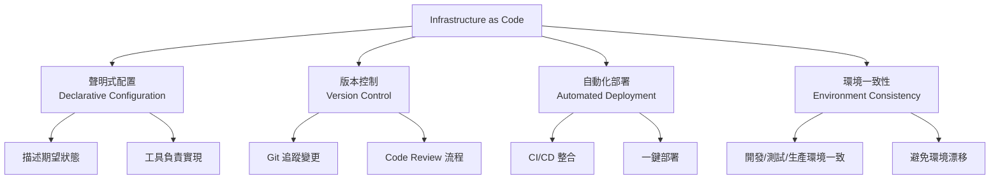
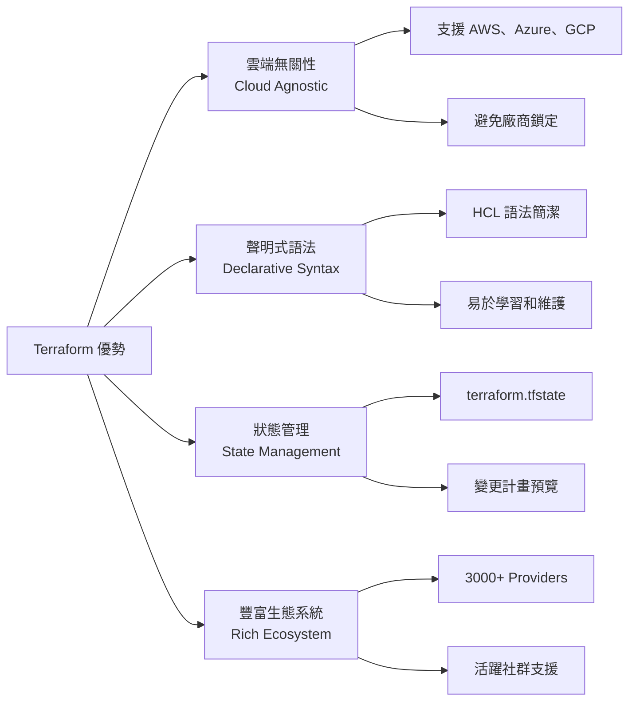

# Day 14 | Infrastructure as Code : Terraform 基礎設施代碼化與版本管控

在現代的開發流程中，我們已經可以透過文檔版控來進行我們的虛擬環境基礎建置與維護了，這是一個足以謝天的進化。

讓我們先回顧一下沒有 IaC 時代的基礎設施管理困境：

**情境一：手動配置的噩夢**

```
運維工程師 A：「我在生產環境手動調整了資料庫連線數」
運維工程師 B：「什麼？我不知道啊，我昨天也改了網路設定」
開發團隊：「為什麼測試環境和生產環境行為不一樣？」

**問題核心**：
- 配置漂移 (Configuration Drift)
- 環境不一致性
- 變更追蹤困難
- 知識集中在個人身上
```

**情境二：災難恢復的不確定性**

```
凌晨 3 點，生產環境當機...

團隊 Leader：「多久能恢復？」
運維工程師：「我需要重建所有服務...大概要 6 小時？」
團隊 Leader：「為什麼這麼久？」
運維工程師：「因為我需要回想所有的手動配置步驟...」


**問題核心**：
- 恢復時間不可預測
- 缺乏標準化的重建流程
- 過度依賴個人記憶
- 無法量化災難恢復能力
```

**情境三：擴展需求的瓶頸**

```
產品經理：「我們需要快速擴展到新的地區」
DevOps：「需要多久？」
產品經理：「最好一週內」
DevOps：「一週？光是申請資源就要三天，配置環境又要五天...」


**問題核心**：
- 手動流程拖慢業務節奏
- 重複性工作浪費人力
- 擴展成本線性增長
- 無法快速響應市場需求
```

這些 IT 鬼故事，想必大家都或多或少聽過，同樣的，我也不希望我們成為了裡面的演員之一 - 甚至是主演。昨天我們討論了跨團隊協作設計，建立了 API 文檔化與團隊協作的標準，今天就讓我們將視野來到底層的基礎設施管理，探討如何透過 Infrastructure as Code (IaC) 的概念，使用 Terraform 來實現基礎設施的代碼化與版本管控。

如果說昨天的主題是 **「讓團隊說同一種語言並讓它可記錄的版本化」**，那麼今天的主題就是 **「讓基礎設施變得可預測、可重複、可版本化」**。

## Infrastructure as Code 的核心概念

Infrastructure as Code (IaC) 是一種透過程式碼來管理和配置基礎設施的方法論。它將傳統上需要手動操作的基礎設施管理工作轉化為可版本化、可重複執行的程式碼。

想像一下：`從「蓋一棟手工別墅」到「設計一座可以無限複製的城市」`
過去，我們管理伺服器和網路（也就是「基礎設施」），就像一位老師傅在蓋一棟手工別墅。

- 他憑藉多年的經驗和記憶，親手砌磚、拉電線、接水管。
- 我們想加個窗戶？他得親自到現場敲牆。
- 我們想在隔壁蓋一棟一模一樣的？他只能憑記憶再蓋一次，但很可能有些細節會不一樣，比如插座的位置、水管的品牌。
- 如果別墅不幸失火了(就像是巴黎聖母院)，重建將是一場漫長的惡夢，因為所有的工藝都只存在老師傅的腦海裡。

這就是沒有 IaC 的世界：手動、依賴個人、難以複製、充滿不確定性。所以 IaC 的誕生就是為了將所有基礎環境參數與設置不只記錄下來，還要可以用版控的方式來進行管理， **我們發明了「建築藍圖」(Infrastructure as Code )**

我們不再親手砌磚，而是專注於繪製一份極其詳盡的建築藍圖，這份藍圖，就是我們的「Code（程式碼）」。

有了它，我們可以輕而易舉地做到:

- 描述最終樣貌：藍圖上不會寫「先砌三塊磚，再左轉」，而是直接宣告「我需要一堵高 3 米、寬 5 米的牆」。我們只描述**「我們想要什麼 (What)」，而不是「該怎麼做 (How)」**。
- 版本管控：這份藍圖（程式碼）可以像 Word 文件一樣存檔、修改。每一次修改都有紀錄（例如用 Git）。我們可以清楚看到是誰在什麼時候把窗戶從方形改成了圓形。這就是「版本管控」。
- 可重複性：有了這份藍圖，我們可以交給任何一個施工隊，他們都能蓋出一模一樣的別墅。想蓋一百棟？給他們一百份藍圖副本就行。



**IaC 的核心價值主張**

1. **可重複性 (Reproducibility)**

   - 同樣的程式碼在任何環境都能產生相同的結果
   - 消除「在我的機器上可以執行」的問題

2. **可追蹤性 (Traceability)**

   - 所有基礎設施變更都有完整的 Git 歷史記錄
   - 可以回溯任何時間點的配置狀態

3. **可測試性 (Testability)**

   - 基礎設施配置可以進行單元測試、整合測試
   - 在部署前發現潛在問題

4. **協作性 (Collaboration)**
   - 基礎設施配置成為團隊共同資產
   - 透過 Code Review 提升配置品質

## Terraform 深度解析

我們有了完美的藍圖（程式碼），但誰來負責建造呢？

**Terraform 就是那位超級總工頭。** (當然不是 Mario)

在眾多 IaC 工具中，Terraform 脫穎而出的原因：



他完美地實現了 IaC 的思想，讓我們能用一份「建築藍圖」（程式碼）來定義、預覽、並自動化建構我們在雲端上的數位王國。他看得懂我們的藍圖（Terraform 的 HCL 語法），並且他會跟全世界的建材供應商溝通（例如 AWS、Google Cloud、Azure 這些雲端平台）。當我們把藍圖交給他後，他不會馬上動工，而是先給出一份施工計畫書，告訴我們：「根據你的藍圖，我將會建立一台主機、設定一個資料庫、配置好網路...」。我們可以審核這份計畫，確保一切無誤。等到確認計畫後，跟他說「動工！」，他就會自動化地、精準地調度所有資源，把我們的基礎設施蓋好。

最後，當我們不再需要這棟建築時，只需要跟總工頭說一聲，他就能把所有東西乾淨俐落地拆除，不留任何建築垃圾。

我們學的不只是一個工具，而是一種更先進、更可靠、更具規模化能力的現代工程方法。終於能夠將從一位辛苦的勤勤勉勉磚瓦匠，蛻變為一位關注 Domain 實踐的系統架構師。

### Terraform 核心概念

#### 1. Providers（提供者）

```hcl
# 定義雲端提供者
terraform {
  required_providers {
    aws = {
      source  = "hashicorp/aws"
      version = "~> 5.0"
    }
    kubernetes = {
      source  = "hashicorp/kubernetes"
      version = "~> 2.23"
    }
  }
}

# 配置 AWS Provider
provider "aws" {
  region = var.aws_region

  default_tags {
    tags = {
      Environment = var.environment
      Project     = var.project_name
      ManagedBy   = "terraform"
    }
  }
}
```

#### 2. Resources（資源）

```hcl
# 創建 VPC
resource "aws_vpc" "main" {
  cidr_block           = var.vpc_cidr
  enable_dns_hostnames = true
  enable_dns_support   = true

  tags = {
    Name = "${var.project_name}-vpc"
  }
}

# 創建 Subnet
resource "aws_subnet" "public" {
  count = length(var.availability_zones)

  vpc_id                  = aws_vpc.main.id
  cidr_block              = cidrsubnet(var.vpc_cidr, 8, count.index)
  availability_zone       = var.availability_zones[count.index]
  map_public_ip_on_launch = true

  tags = {
    Name = "${var.project_name}-public-subnet-${count.index + 1}"
    Type = "public"
  }
}
```

#### 3. Variables（變數）

```hcl
# variables.tf
variable "aws_region" {
  description = "AWS region for resources"
  type        = string
  default     = "ap-northeast-1"
}

variable "environment" {
  description = "Environment name"
  type        = string
  validation {
    condition = contains(["dev", "staging", "prod"], var.environment)
    error_message = "Environment must be dev, staging, or prod."
  }
}

variable "instance_type" {
  description = "EC2 instance type"
  type        = string
  default     = "t3.micro"
}

variable "availability_zones" {
  description = "List of availability zones"
  type        = list(string)
  default     = ["ap-northeast-1a", "ap-northeast-1c", "ap-northeast-1d"]
}
```

#### 4. Outputs（輸出）

```hcl
# outputs.tf
output "vpc_id" {
  description = "ID of the VPC"
  value       = aws_vpc.main.id
}

output "public_subnet_ids" {
  description = "IDs of the public subnets"
  value       = aws_subnet.public[*].id
}

output "load_balancer_dns" {
  description = "DNS name of the load balancer"
  value       = aws_lb.main.dns_name
  sensitive   = false
}
```

#### 5. Data Sources（資料源）

```hcl
# 獲取最新的 Amazon Linux AMI
data "aws_ami" "amazon_linux" {
  most_recent = true
  owners      = ["amazon"]

  filter {
    name   = "name"
    values = ["amzn2-ami-hvm-*-x86_64-gp2"]
  }

  filter {
    name   = "virtualization-type"
    values = ["hvm"]
  }
}

# 獲取當前 AWS 帳戶資訊
data "aws_caller_identity" "current" {}

# 獲取可用區域資訊
data "aws_availability_zones" "available" {
  state = "available"
}
```

### Terraform 工作流程

#### 1. 初始化階段 (terraform init)

```bash
# 初始化 Terraform 工作目錄
terraform init

# 升級 Providers
terraform init -upgrade

# 指定後端配置
terraform init -backend-config="bucket=my-terraform-state"
```

#### 2. 規劃階段 (terraform plan)

```bash
# 生成執行計畫
terraform plan

# 將計畫儲存到檔案
terraform plan -out=tfplan

# 針對特定環境規劃
terraform plan -var-file="environments/prod.tfvars"
```

#### 3. 應用階段 (terraform apply)

```bash
# 應用變更
terraform apply

# 使用儲存的計畫
terraform apply tfplan

# 自動批准（適用於 CI/CD）
terraform apply -auto-approve
```

#### 4. 銷毀階段 (terraform destroy)

```bash
# 銷毀所有資源
terraform destroy

# 針對特定環境銷毀
terraform destroy -var-file="environments/dev.tfvars"
```

## 實戰案例：完整的 Web 應用基礎設施

讓我們透過一個完整的案例來展示 Terraform 的實際應用：

### 專案結構

```
terraform-web-app/
├── main.tf                 # 主要資源定義
├── variables.tf           # 變數定義
├── outputs.tf            # 輸出定義
├── terraform.tfvars      # 變數值
├── versions.tf           # Provider 版本約束
├── modules/
│   ├── networking/       # 網路模組
│   ├── compute/         # 運算模組
│   ├── database/        # 資料庫模組
│   └── security/        # 安全模組
└── environments/
    ├── dev/
    ├── staging/
    └── prod/
```

### 主要配置檔案

#### main.tf

```hcl
# 本地變數定義
locals {
  common_tags = {
    Environment = var.environment
    Project     = var.project_name
    ManagedBy   = "terraform"
    Owner       = var.owner
  }
}

# 網路模組
module "networking" {
  source = "./modules/networking"

  project_name       = var.project_name
  environment        = var.environment
  vpc_cidr          = var.vpc_cidr
  availability_zones = var.availability_zones

  tags = local.common_tags
}

# 安全模組
module "security" {
  source = "./modules/security"

  project_name = var.project_name
  environment  = var.environment
  vpc_id       = module.networking.vpc_id

  tags = local.common_tags
}

# 運算模組
module "compute" {
  source = "./modules/compute"

  project_name          = var.project_name
  environment           = var.environment
  instance_type         = var.instance_type
  min_size             = var.min_size
  max_size             = var.max_size
  desired_capacity     = var.desired_capacity

  vpc_id               = module.networking.vpc_id
  private_subnet_ids   = module.networking.private_subnet_ids
  public_subnet_ids    = module.networking.public_subnet_ids
  security_group_ids   = [module.security.web_security_group_id]

  tags = local.common_tags
}

# 資料庫模組
module "database" {
  source = "./modules/database"

  project_name       = var.project_name
  environment        = var.environment
  engine_version     = var.db_engine_version
  instance_class     = var.db_instance_class
  allocated_storage  = var.db_allocated_storage

  vpc_id            = module.networking.vpc_id
  private_subnet_ids = module.networking.private_subnet_ids
  security_group_ids = [module.security.db_security_group_id]

  tags = local.common_tags
}
```

### 網路模組 (modules/networking/main.tf)

```hcl
# VPC
resource "aws_vpc" "main" {
  cidr_block           = var.vpc_cidr
  enable_dns_hostnames = true
  enable_dns_support   = true

  tags = merge(var.tags, {
    Name = "${var.project_name}-${var.environment}-vpc"
  })
}

# Internet Gateway
resource "aws_internet_gateway" "main" {
  vpc_id = aws_vpc.main.id

  tags = merge(var.tags, {
    Name = "${var.project_name}-${var.environment}-igw"
  })
}

# Public Subnets
resource "aws_subnet" "public" {
  count = length(var.availability_zones)

  vpc_id                  = aws_vpc.main.id
  cidr_block              = cidrsubnet(var.vpc_cidr, 8, count.index)
  availability_zone       = var.availability_zones[count.index]
  map_public_ip_on_launch = true

  tags = merge(var.tags, {
    Name = "${var.project_name}-${var.environment}-public-subnet-${count.index + 1}"
    Type = "public"
  })
}

# Private Subnets
resource "aws_subnet" "private" {
  count = length(var.availability_zones)

  vpc_id            = aws_vpc.main.id
  cidr_block        = cidrsubnet(var.vpc_cidr, 8, count.index + 100)
  availability_zone = var.availability_zones[count.index]

  tags = merge(var.tags, {
    Name = "${var.project_name}-${var.environment}-private-subnet-${count.index + 1}"
    Type = "private"
  })
}

# NAT Gateways
resource "aws_eip" "nat" {
  count = length(var.availability_zones)

  domain = "vpc"

  tags = merge(var.tags, {
    Name = "${var.project_name}-${var.environment}-eip-${count.index + 1}"
  })

  depends_on = [aws_internet_gateway.main]
}

resource "aws_nat_gateway" "main" {
  count = length(var.availability_zones)

  allocation_id = aws_eip.nat[count.index].id
  subnet_id     = aws_subnet.public[count.index].id

  tags = merge(var.tags, {
    Name = "${var.project_name}-${var.environment}-nat-${count.index + 1}"
  })

  depends_on = [aws_internet_gateway.main]
}

# Route Tables
resource "aws_route_table" "public" {
  vpc_id = aws_vpc.main.id

  route {
    cidr_block = "0.0.0.0/0"
    gateway_id = aws_internet_gateway.main.id
  }

  tags = merge(var.tags, {
    Name = "${var.project_name}-${var.environment}-public-rt"
  })
}

resource "aws_route_table" "private" {
  count = length(var.availability_zones)

  vpc_id = aws_vpc.main.id

  route {
    cidr_block     = "0.0.0.0/0"
    nat_gateway_id = aws_nat_gateway.main[count.index].id
  }

  tags = merge(var.tags, {
    Name = "${var.project_name}-${var.environment}-private-rt-${count.index + 1}"
  })
}

# Route Table Associations
resource "aws_route_table_association" "public" {
  count = length(var.availability_zones)

  subnet_id      = aws_subnet.public[count.index].id
  route_table_id = aws_route_table.public.id
}

resource "aws_route_table_association" "private" {
  count = length(var.availability_zones)

  subnet_id      = aws_subnet.private[count.index].id
  route_table_id = aws_route_table.private[count.index].id
}
```

### 運算模組 (modules/compute/main.tf)

```hcl
# Launch Template
resource "aws_launch_template" "web" {
  name_prefix   = "${var.project_name}-${var.environment}-"
  image_id      = data.aws_ami.amazon_linux.id
  instance_type = var.instance_type

  vpc_security_group_ids = var.security_group_ids

  user_data = base64encode(templatefile("${path.module}/user-data.sh", {
    environment = var.environment
  }))

  tag_specifications {
    resource_type = "instance"
    tags = merge(var.tags, {
      Name = "${var.project_name}-${var.environment}-web-server"
    })
  }

  lifecycle {
    create_before_destroy = true
  }
}

# Auto Scaling Group
resource "aws_autoscaling_group" "web" {
  name                = "${var.project_name}-${var.environment}-asg"
  vpc_zone_identifier = var.private_subnet_ids
  target_group_arns   = [aws_lb_target_group.web.arn]
  health_check_type   = "ELB"
  health_check_grace_period = 300

  min_size         = var.min_size
  max_size         = var.max_size
  desired_capacity = var.desired_capacity

  launch_template {
    id      = aws_launch_template.web.id
    version = "$Latest"
  }

  tag {
    key                 = "Name"
    value               = "${var.project_name}-${var.environment}-asg"
    propagate_at_launch = false
  }

  dynamic "tag" {
    for_each = var.tags
    content {
      key                 = tag.key
      value               = tag.value
      propagate_at_launch = false
    }
  }
}

# Application Load Balancer
resource "aws_lb" "web" {
  name               = "${var.project_name}-${var.environment}-alb"
  internal           = false
  load_balancer_type = "application"
  security_groups    = var.security_group_ids
  subnets            = var.public_subnet_ids

  enable_deletion_protection = var.environment == "prod" ? true : false

  tags = var.tags
}

# Target Group
resource "aws_lb_target_group" "web" {
  name     = "${var.project_name}-${var.environment}-tg"
  port     = 80
  protocol = "HTTP"
  vpc_id   = var.vpc_id

  health_check {
    enabled             = true
    healthy_threshold   = 2
    interval            = 30
    matcher             = "200"
    path                = "/health"
    port                = "traffic-port"
    protocol            = "HTTP"
    timeout             = 5
    unhealthy_threshold = 2
  }

  tags = var.tags
}

# Listener
resource "aws_lb_listener" "web" {
  load_balancer_arn = aws_lb.web.arn
  port              = "80"
  protocol          = "HTTP"

  default_action {
    type             = "forward"
    target_group_arn = aws_lb_target_group.web.arn
  }
}
```

### 環境特定配置

#### environments/prod/terraform.tfvars

```hcl
# 專案基本資訊
project_name = "my-web-app"
environment  = "prod"
owner        = "devops-team"

# 網路配置
aws_region         = "ap-northeast-1"
vpc_cidr          = "10.0.0.0/16"
availability_zones = ["ap-northeast-1a", "ap-northeast-1c", "ap-northeast-1d"]

# 運算資源配置
instance_type    = "t3.medium"
min_size        = 2
max_size        = 10
desired_capacity = 3

# 資料庫配置
db_engine_version    = "13.7"
db_instance_class    = "db.t3.medium"
db_allocated_storage = 100
```

#### environments/dev/terraform.tfvars

```hcl
# 專案基本資訊
project_name = "my-web-app"
environment  = "dev"
owner        = "dev-team"

# 網路配置
aws_region         = "ap-northeast-1"
vpc_cidr          = "10.1.0.0/16"
availability_zones = ["ap-northeast-1a", "ap-northeast-1c"]

# 運算資源配置
instance_type    = "t3.micro"
min_size        = 1
max_size        = 3
desired_capacity = 1

# 資料庫配置
db_engine_version    = "13.7"
db_instance_class    = "db.t3.micro"
db_allocated_storage = 20
```

## 進階主題：Terraform 最佳實務

### 1. 狀態管理 (State Management)

#### 遠端狀態後端配置

```hcl
# backend.tf
terraform {
  backend "s3" {
    bucket         = "my-terraform-state-bucket"
    key            = "environments/prod/terraform.tfstate"
    region         = "ap-northeast-1"
    encrypt        = true
    dynamodb_table = "terraform-state-lock"
  }
}
```

#### 狀態鎖定與團隊協作

```hcl
# DynamoDB 表格用於狀態鎖定
resource "aws_dynamodb_table" "terraform_state_lock" {
  name           = "terraform-state-lock"
  billing_mode   = "PAY_PER_REQUEST"
  hash_key       = "LockID"

  attribute {
    name = "LockID"
    type = "S"
  }

  tags = {
    Name        = "Terraform State Lock Table"
    Environment = "all"
  }
}
```

### 2. 工作空間管理 (Workspace Management)

```bash
# 創建新工作空間
terraform workspace new dev
terraform workspace new staging
terraform workspace new prod

# 切換工作空間
terraform workspace select prod

# 列出所有工作空間
terraform workspace list

# 基於工作空間的條件配置
locals {
  environment_config = {
    dev = {
      instance_type = "t3.micro"
      min_size     = 1
      max_size     = 2
    }
    staging = {
      instance_type = "t3.small"
      min_size     = 1
      max_size     = 3
    }
    prod = {
      instance_type = "t3.medium"
      min_size     = 2
      max_size     = 10
    }
  }

  current_env = local.environment_config[terraform.workspace]
}
```

### 3. 模組化設計原則

#### 模組結構最佳實務

```
modules/
├── networking/
│   ├── main.tf
│   ├── variables.tf
│   ├── outputs.tf
│   └── README.md
├── compute/
│   ├── main.tf
│   ├── variables.tf
│   ├── outputs.tf
│   ├── user-data.sh
│   └── README.md
└── database/
    ├── main.tf
    ├── variables.tf
    ├── outputs.tf
    └── README.md
```

#### 模組版本化

```hcl
# 使用 Git 標籤進行模組版本化
module "networking" {
  source = "git::https://github.com/company/terraform-modules.git//networking?ref=v1.2.0"

  # 模組輸入參數...
}

# 使用 Terraform Registry
module "vpc" {
  source  = "terraform-aws-modules/vpc/aws"
  version = "~> 3.0"

  # 模組輸入參數...
}
```

### 4. 安全性最佳實務

#### 敏感資料管理

```hcl
# 使用 AWS Secrets Manager
data "aws_secretsmanager_secret" "db_password" {
  name = "${var.project_name}-${var.environment}-db-password"
}

data "aws_secretsmanager_secret_version" "db_password" {
  secret_id = data.aws_secretsmanager_secret.db_password.id
}

# 在資源中使用敏感資料
resource "aws_db_instance" "main" {
  # ... 其他配置 ...

  password = jsondecode(data.aws_secretsmanager_secret_version.db_password.secret_string)["password"]

  # 防止密碼出現在 plan 輸出中
  lifecycle {
    ignore_changes = [password]
  }
}

# 標記 Output 為敏感
output "database_endpoint" {
  value     = aws_db_instance.main.endpoint
  sensitive = true
}
```

#### IAM 角色最小權限原則

```hcl
# EC2 執行角色
resource "aws_iam_role" "ec2_role" {
  name = "${var.project_name}-${var.environment}-ec2-role"

  assume_role_policy = jsonencode({
    Version = "2012-10-17"
    Statement = [
      {
        Action = "sts:AssumeRole"
        Effect = "Allow"
        Principal = {
          Service = "ec2.amazonaws.com"
        }
      }
    ]
  })
}

# 具體權限策略
resource "aws_iam_role_policy" "ec2_policy" {
  name = "${var.project_name}-${var.environment}-ec2-policy"
  role = aws_iam_role.ec2_role.id

  policy = jsonencode({
    Version = "2012-10-17"
    Statement = [
      {
        Effect = "Allow"
        Action = [
          "s3:GetObject",
          "s3:PutObject"
        ]
        Resource = [
          "${aws_s3_bucket.app_bucket.arn}/*"
        ]
      },
      {
        Effect = "Allow"
        Action = [
          "cloudwatch:PutMetricData",
          "logs:CreateLogGroup",
          "logs:CreateLogStream",
          "logs:PutLogEvents"
        ]
        Resource = "*"
      }
    ]
  })
}
```

### 5. CI/CD 整合

#### GitHub Actions 工作流程

```yaml
# .github/workflows/terraform.yml
name: "Terraform CI/CD"

on:
  push:
    branches: [main, develop]
  pull_request:
    branches: [main]

env:
  TF_VERSION: 1.5.0
  AWS_REGION: ap-northeast-1

jobs:
  terraform:
    name: "Terraform"
    runs-on: ubuntu-latest

    strategy:
      matrix:
        environment: [dev, staging, prod]

    steps:
      - name: Checkout
        uses: actions/checkout@v3

      - name: Setup Terraform
        uses: hashicorp/setup-terraform@v2
        with:
          terraform_version: ${{ env.TF_VERSION }}

      - name: Configure AWS credentials
        uses: aws-actions/configure-aws-credentials@v2
        with:
          aws-access-key-id: ${{ secrets.AWS_ACCESS_KEY_ID }}
          aws-secret-access-key: ${{ secrets.AWS_SECRET_ACCESS_KEY }}
          aws-region: ${{ env.AWS_REGION }}

      - name: Terraform Format Check
        run: terraform fmt -check -recursive

      - name: Terraform Init
        run: |
          terraform init \
            -backend-config="bucket=${{ secrets.TF_STATE_BUCKET }}" \
            -backend-config="key=environments/${{ matrix.environment }}/terraform.tfstate"

      - name: Terraform Validate
        run: terraform validate

      - name: Terraform Plan
        run: |
          terraform plan \
            -var-file="environments/${{ matrix.environment }}.tfvars" \
            -out=tfplan-${{ matrix.environment }}

      - name: Terraform Apply (Production)
        if: github.ref == 'refs/heads/main' && matrix.environment == 'prod'
        run: terraform apply tfplan-${{ matrix.environment }}

      - name: Terraform Apply (Non-Production)
        if: github.ref == 'refs/heads/develop' && matrix.environment != 'prod'
        run: terraform apply tfplan-${{ matrix.environment }}
```

### 6. 監控與可觀測性

#### CloudWatch 整合

```hcl
# CloudWatch Log Groups
resource "aws_cloudwatch_log_group" "app_logs" {
  name              = "/aws/ec2/${var.project_name}-${var.environment}"
  retention_in_days = var.environment == "prod" ? 30 : 7

  tags = var.tags
}

# Custom Metrics
resource "aws_cloudwatch_metric_alarm" "application_errors" {
  alarm_name          = "${var.project_name}-${var.environment}-app-errors"
  comparison_operator = "GreaterThanThreshold"
  evaluation_periods  = "2"
  metric_name         = "ApplicationErrors"
  namespace           = "Custom/Application"
  period              = "300"
  statistic           = "Sum"
  threshold           = "10"
  alarm_description   = "This metric monitors application errors"

  alarm_actions = [aws_sns_topic.alerts.arn]

  tags = var.tags
}

# SNS Topic for Alerts
resource "aws_sns_topic" "alerts" {
  name = "${var.project_name}-${var.environment}-alerts"

  tags = var.tags
}

resource "aws_sns_topic_subscription" "email_alerts" {
  topic_arn = aws_sns_topic.alerts.arn
  protocol  = "email"
  endpoint  = var.alert_email
}
```

### 7. 成本最佳化

#### 資源標籤策略

```hcl
# 統一的標籤策略
locals {
  required_tags = {
    Environment   = var.environment
    Project      = var.project_name
    Owner        = var.owner
    CostCenter   = var.cost_center
    CreatedBy    = "terraform"
    CreatedDate  = formatdate("YYYY-MM-DD", timestamp())
  }

  optional_tags = var.additional_tags

  all_tags = merge(local.required_tags, local.optional_tags)
}

# 在所有資源上應用標籤
resource "aws_instance" "web" {
  # ... 其他配置 ...

  tags = local.all_tags
}
```

#### Spot Instance 整合

```hcl
# Mixed Instance Policy for Cost Optimization
resource "aws_autoscaling_group" "web" {
  name                = "${var.project_name}-${var.environment}-asg"
  vpc_zone_identifier = var.private_subnet_ids
  target_group_arns   = [aws_lb_target_group.web.arn]

  min_size         = var.min_size
  max_size         = var.max_size
  desired_capacity = var.desired_capacity

  mixed_instances_policy {
    launch_template {
      launch_template_specification {
        launch_template_id = aws_launch_template.web.id
        version           = "$Latest"
      }

      override {
        instance_type = "t3.medium"
      }
      override {
        instance_type = "t3a.medium"
      }
      override {
        instance_type = "t2.medium"
      }
    }

    instances_distribution {
      on_demand_base_capacity                  = 1
      on_demand_percentage_above_base_capacity = 25
      spot_allocation_strategy                 = "diversified"
    }
  }
}
```

## 構建可持續的技術基礎環境

Infrastructure as Code 透過 Terraform 的實現，為現代軟體開發帶來了革命性的變化。我們從傳統手動運維的痛點出發，深入探討了 IaC 的核心概念、Terraform 的深度應用，以及完整的實戰案例。

### 核心價值重申

**技術層面的轉變**：

- **可重複性**：消除「環境雪花」問題，確保基礎設施一致性
- **可追蹤性**：透過 Git 版本控制實現基礎設施變更的完整追蹤
- **可測試性**：基礎設施配置可以進行自動化測試和驗證
- **協作性**：基礎設施成為團隊共同資產，支援多人協作開發

**組織層面的影響**：

- **效率提升**：自動化取代手動操作，大幅縮短部署時間
- **風險降低**：標準化流程減少人為錯誤和配置漂移
- **業務敏捷性**：快速響應業務需求，支援快速擴展和部署
- **成本最佳化**：透過程式碼管理資源，實現精確的成本控制

### 實施關鍵因素

#### 1. 漸進式採用策略

不要試圖一次性將所有基礎設施遷移到 Terraform，而是：

- 從新專案開始採用 IaC
- 選擇複雜度適中的現有服務進行遷移試點
- 逐步建立團隊的 Terraform 專業能力
- 建立標準化的模組庫和最佳實務指導

#### 2. 團隊協作文化建設

- 建立 Code Review 文化，確保基礎設施變更的品質
- 制定清晰的 Git 工作流程和分支策略
- 定期進行 Terraform 知識分享和培訓
- 建立跨團隊的 IaC 社群，促進經驗交流

#### 3. 工具鏈整合生態

- CI/CD 管道整合，實現自動化部署
- 監控和可觀測性工具整合
- 安全掃描和合規檢查自動化
- 成本管理和最佳化工具整合

### 從手動運維到代碼運維的思維轉變

當我們從「手動配置伺服器」轉向「編寫基礎設施程式碼」時，我們實際上是在進行一種根本性的思維模式升級：

**傳統思維**：「我需要一台伺服器來跑我的應用程式」
**IaC 思維**：「我需要定義一個可重複、可維護、可擴展的運算環境」

這種思維轉變帶來的不僅是技術實作的改變，更是對整個軟體交付流程的重新思考。我們開始將基礎設施視為軟體產品的一部分，應用軟體工程的最佳實務來管理它。

### 未來展望：Infrastructure as Software

隨著 Terraform 生態系統的不斷演進，我們正在見證「Infrastructure as Software」的興起：

- **更智慧的資源管理**：AI 輔助的資源最佳化和成本預測
- **更深度的雲端整合**：多雲管理和雲端無關性的進一步完善
- **更強大的政策即程式碼**：安全性、合規性要求的自動化檢查
- **更完善的開發者體驗**：IDE 整合、語法提示、即時驗證

透過 Terraform 實現的 Infrastructure as Code 不僅是一種技術選型，更是一種投資未來的策略決策。每一行 Terraform 程式碼、每一個模組設計、每一次狀態管理的最佳化，都在為團隊和組織建立更強韌、更敏捷的技術基礎。

當下一次需要擴展到新地區時，當下一次需要快速恢復災難時，當新的團隊成員需要理解系統架構時，這些 Infrastructure as Code 的投入將會產生巨大的複利效應。

**Terraform 讓我們不再是「維護基礎設施的工程師」，而是「設計可持續系統的架構師」。**

這就是 Infrastructure as Code 的真正價值：它讓基礎設施變得可預測、可重複、可進化，為現代軟體開發奠定了堅實的基礎。在這個快速變化的技術環境中，掌握 IaC 已經不再是選項，而是必需——它是每個現代軟體團隊都應該具備的核心能力。
