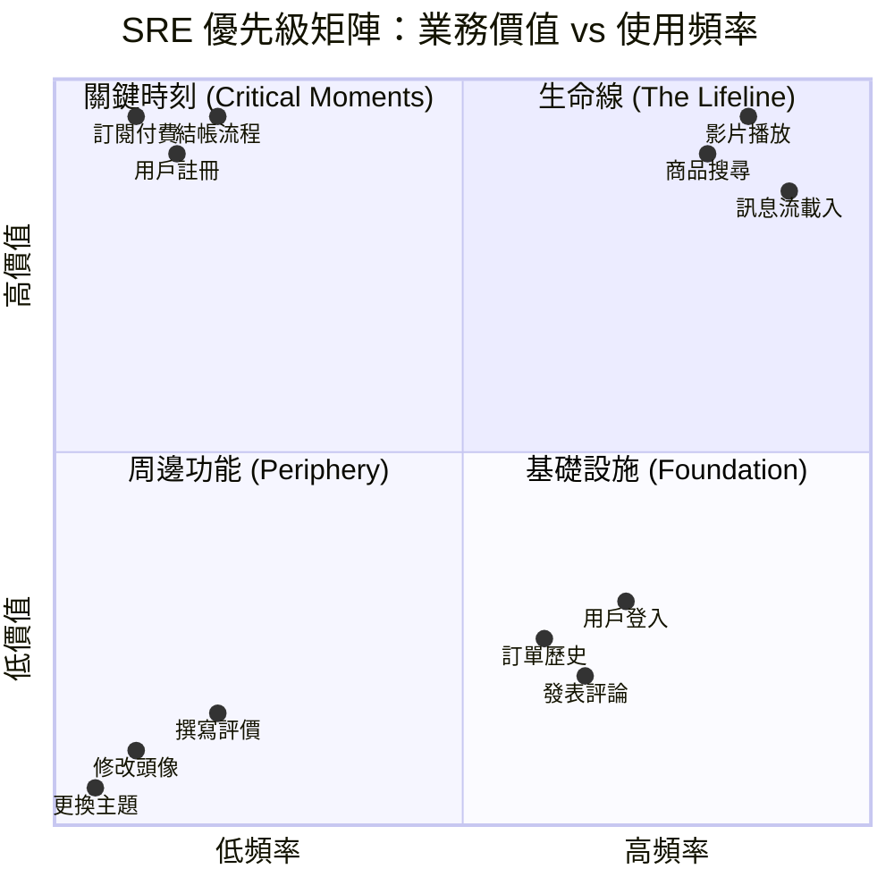
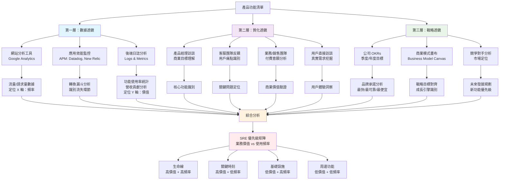
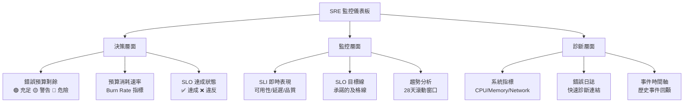
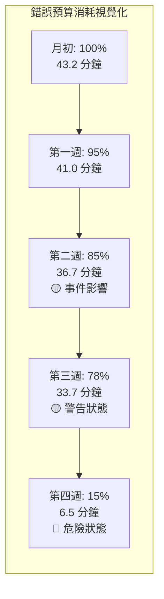
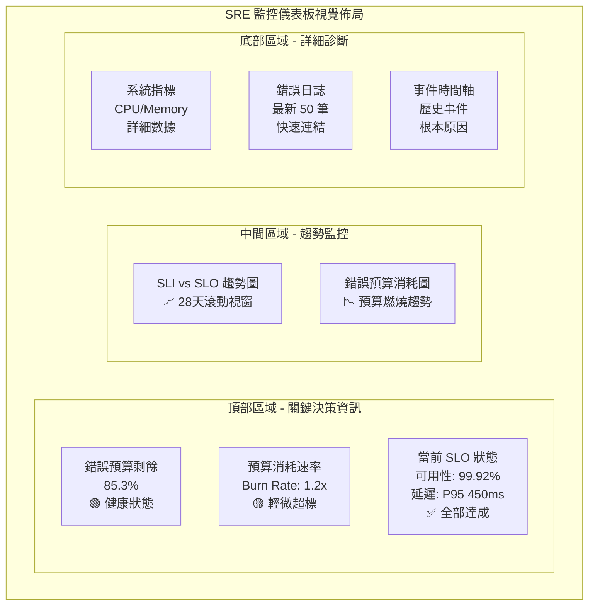
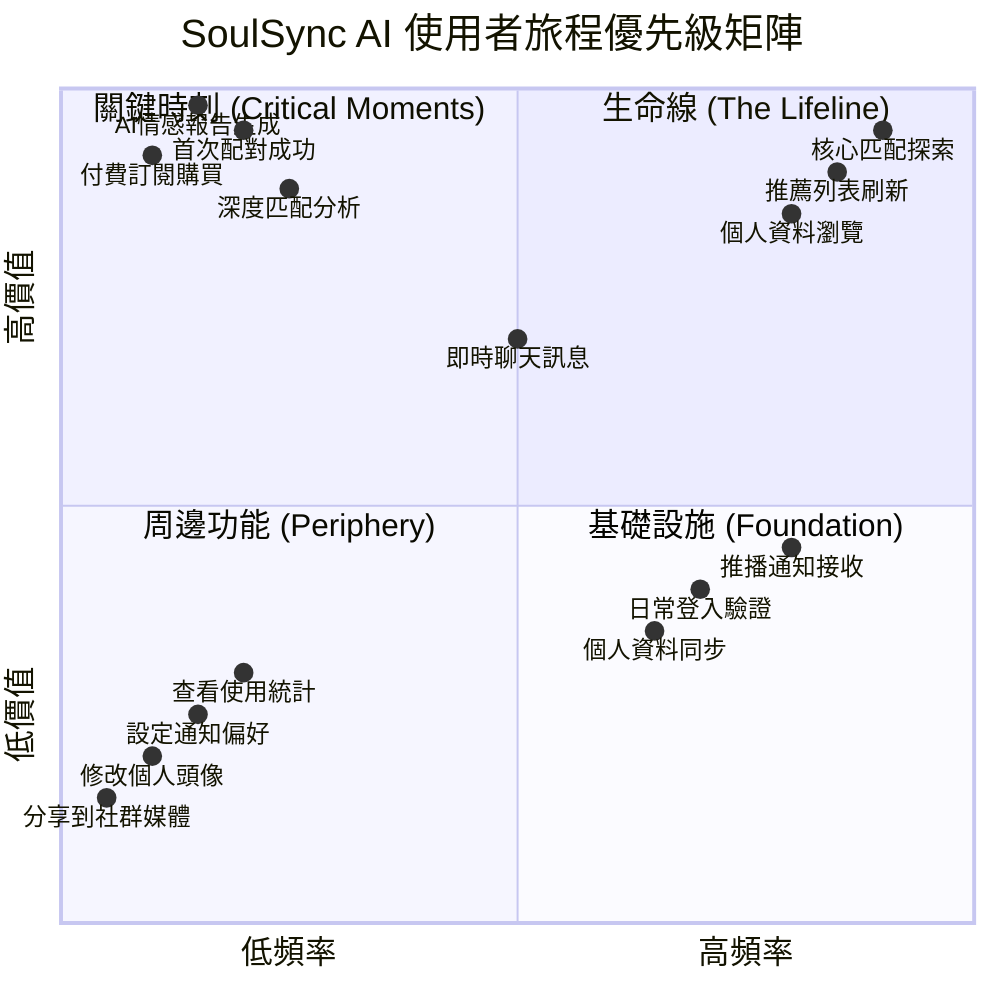

# Day 24 | 定義與衡量可靠性:SRE 方法與錯誤預算的實踐 - SLI、SLO 與錯誤預算的核心概念，平衡創新速度與系統穩定性的數據驅動決策

今天，我們將聊聊網站可靠性工程 (Site Reliability Engineering, SRE) 方法論，，將 `系統可靠性` 從一個模糊的概念轉化為一門可量化的工程學科。

在現代軟體開發的戰場上，一場永無休止的拉鋸戰幾乎在每個組織中上演：

- 創新的力量 (Devs & Product Managers): 他們渴望快速迭代，推出新功能，搶佔市場。他們是組織的「油門」。
- 穩定的力量 (Ops & Infra Teams): 他們負責保障服務的正常運行，避免故障，確保使用者體驗。他們是組織的「煞車」。

傳統上，這兩股力量的目標看似根本對立，兩者的溝通往往充滿了摩擦、猜疑與主觀的情感辯論。

> 「你們的新功能搞爆了伺服器！」
>
> 「你們的流程限制了創新！」

這樣的爭吵，是許多工程師白日與深夜的夢魘。

這種衝突，源於雙方缺乏一個共同的語言和目標，雖然我們在<跨團隊協作設計：技術文件、OpenAPI、共用契約 : API 文檔化與團隊協作標準建立>中有說到系統邊界的共同默契，但這次的拔河本質上來說更接近 **零和競賽** ，想要追求功能快速發布就不能百分百確保功能的完整，反之亦然，要百分百確保功能的完整就有可能賠上進入市場的時機，一個是尋找新的系統生命依據，一個是確保當前的系統生命依據。兩者並沒有對錯，著重在立場而已。

`SRE (Site Reliability Engineering)` 的誕生，就是為了解決這個衝突，它提出了一個革命性的觀點：

> 我們 **不應該問「是否要踩煞車」** ，而 **應該問「我們離前方的懸崖還有多遠？」**

SLI, SLO, 和 Error Budget，就是我們用來精確測量「與懸崖之間距離」的工程儀器。

我有幸在撰寫這個系列文章的時候(2025)見證到人類殖民太空的希望，晶片的突破、算力的解放與 AI 的精度提高，複合性的因子正在解放傳統人力的勞動成本。伊隆·馬斯克是一個夢想家，他本可將資產再次投入到舊時代金融遊戲之中成為新一代的華爾街家族，但卻選擇了將資產投入至新時代的太空火箭研發上開拓人類未來的可能性。如果機會，我會主動報名太空冒險與前往殖民 - 地球的重力束縛了我的靈魂，接下來，請包容一下我的任性與浪漫，讓我用太空殖民的「氧氣預算」來做舉例說明。

**月球殖民隊的「氧氣預算」—— 生存與探索的平衡**

我們是一艘月面探險船的船長，任務是探索一個人類從未到過的月球峽谷。探險船上最主要有兩個團體:

- 船上的科學家 (開發團隊)：他們渴望新發現。他們想讓潛水器在月球峽谷停留更久、探索更遠的未知區域、使用高耗能的探測設備。
- 船上的維生系統工程師 (維運團隊)：他們只關心一件事：確保所有人能活著回到月面基地。他們緊盯著氧氣存量、電池電量和艙體壓力。

如果沒有 SRE，這將是一場意志力的較量，科學家會不斷施壓、要求「再多待一小時」，而工程師會堅決反對，理由是「安全第一」。

**SRE 的導入，就是將「氧氣存量」明確定義為錯誤預算。**

- SLO：本次任務必須在 70% 的氧氣安全存量下開始返航。
- Error Budget：這意味著我們有 **30% 的「探索預算」**可以消耗。

現在，所有決策都變得清晰：

- 開啟高功率聲納探測？可以，但儀表板會顯示這將消耗 5% 的氧氣預算。
- 在一個有趣的隕石坑多停留 30 分鐘？可以，這將消耗 10% 的氧氣預算。
- 航行到一個更遠的月面山脈？可以，但往返航程將消耗 15% 的氧氣預算。

船長和所有船員都能在一個巨大的螢幕上看到預算的即時消耗情況。科學家可以自主決定如何「花費」他們的預算來最大化科研成果。一旦預算消耗殆盡，警報會自動響起，系統會鎖定高耗能設備，探險艇必須無條件返航。

**SRE 的重要性**：它將「風險」這個模糊的概念，轉化為一個可以被量化、被交易、被管理的戰略資源。它讓團隊不再爭論「要不要冒險」，而是共同決策「我們的風險預算應該花在哪個最值得的地方」。

SRE 的核心洞見在於：**系統的可靠性不應該是一個模糊不清、無法捉摸的藝術，而是一門可以被 `精確定義`、 `量化` 、並透過 `工程方法` 來系統性提升的科學**。

## SRE 方法論的核心思維

SRE 的第一個顛覆性思維是： **100% 的可靠性是一個謊言，更是一個陷阱。**

追求絕對的完美，不僅成本高昂到不切實際，更會扼殺所有創新的可能性，況且，使用者其實 **並不在乎我們的系統是否達到 100% 可用** ，他們 **在乎的是系統在他們需要時「足夠可靠」**。

因此，SRE 的核心不是「消除」錯誤，而是將「錯誤」或「不可靠」視為一種有限的、可管理的資源，這就引出了我們今天的三個主角: SLI (Service Level Indicators)、SLO (Service Level Objectives) 、Error Budget (錯誤預算)

### 從「永遠不當機」到「適度可靠」

**100% 可靠性的神話與陷阱**

追求「五個九」(99.999%) 甚至更高的可靠性，不僅在技術上幾乎不可能（我們無法控制骨幹網路、硬體故障，甚至太陽閃焰），在商業上更是一個災難。可靠性的成本並非線性增長，而是指數級的。

- 從 99% 到 99.9%：可能需要增加一些備援伺服器。
- 從 99.9% 到 99.99%：可能需要建立跨洲的異地備援、更複雜的負載平衡與資料同步機制。
- 從 99.99% 到 99.999%：成本將會高到難以想像，需要極度複雜的架構，而這份複雜性本身又會成為新的故障來源。

最關鍵的是，這鉅額的投入，使用者真的在乎嗎？為了避免一年中額外的 5 分鐘停機，而放棄開發使用者真正期盼的新功能，這筆交易真的划算嗎？SRE 強迫我們問這個問題。

SRE 提出了一個顛覆性的觀點：系統的可靠性，不由我們的伺服器決定，而由我們的使用者定義。

如果我們的系統在凌晨三點，當所有使用者都在睡覺時，當機了一小時，那麼從使用者的角度來看，我們的可用性是 100%。反之，如果我們的網站伺服器全部正常運行，但因為後端資料庫的查詢緩慢，導致每個頁面都需要 30 秒才能載入，那麼從使用者的角度來看，我們的服務就是 **「不可用」** 的。

這就是為何我們在前一堂課強調 SLI 必須反映使用者體驗。我們守護的不是機器的運行燈號，而是使用者的滿意度。

「適度可靠」(Appropriately Reliable) 中的「適度」二字，是 SRE 的精髓。它承認可靠性是產品的一個功能 (feature)，它有成本，也帶來價值。因此，可靠性的等級應該是一個有意識的、數據驅動的商業決策，而非一個無限追求的技術指標。

一個醫院的心律調節器監控系統，和一個線上梗圖產生器，它們所需要的「適度」可靠性，顯然天差地遠。SRE 的任務，就是與產品和業務方合作，精確定義出符合該產品定位的 SLO，不多不少，恰到好處

> **系統應該「足夠可靠」，而不是「完美可靠」**

這個「足夠」的標準，就是通過 SLI 和 SLO 來科學定義的。

### SRE 的三大核心支柱

```
SLI (Service Level Indicators) → 「如何量化」
SLO (Service Level Objectives) → 「目標是什麼」
Error Budget (錯誤預算) → 「如何決策」
```

如果說「適度可靠」是 SRE 的指導思想，那麼以下三大支柱，就是將思想轉化為日常實踐的行動框架:

- 支柱一：以數據定義目標 (Defining Goals with Data)

  - 這是我們已經深入探討過的部分，也是一切的基礎。
  - 核心工具：SLI、SLO、錯誤預算。
  - 核心價值：它為組織內部的所有利害關係人（開發、維運、產品、管理層）提供了一套共同的、客觀的、無可爭議的語言。當討論是否要發布新功能時，我們不再是憑感覺說「我覺得太危險了」，而是可以明確地指出「我們本月的錯誤預算只剩下 15%，根據過往經驗，這次發布有 50% 的機率會消耗掉 20% 的預算，因此風險過高」。這將一場潛在的衝突，轉化為一次基於機率和數據的理性決策。

- 支柱二：致力消除瑣務 (Engineering against Toil)

  - 這是區分 SRE 與傳統維運最顯著的特徵。
  - 定義「瑣務」(Toil)：Google SRE 將其定義為手動的、重複的、可被自動化的、缺乏長期價值的工作。例如，手動重啟一個崩潰的服務、手動配置一台新的伺服器、手動執行一個腳本來清理磁碟空間。這些工作不僅枯燥，更糟的是，它們的規模會隨著系統規模的擴大而線性增長，最終會耗盡所有人的時間。
  - SRE 的工程師本質：SRE 是軟體工程師，他們解決的是「運營問題」。他們的首要任務，不是去「做」這些瑣務，而是去「開發」能夠永久性解決這些瑣務的系統和工具。他們會寫一個自動監控並重啟服務的程式，而不是親手去重啟它。他們會用 Terraform 或 Ansible 來自動化配置，而不是登入到伺服器裡敲指令。
  - 50% 準則：一個健康的 SRE 團隊，應將至少 50% 的時間投入在工程專案上，用以減少未來的瑣務、或提升系統的可靠性。如果瑣務佔據的時間超過 50%，這是一個明確的警訊，代表團隊正被問題淹沒，需要暫停接受新的運營任務，優先進行自動化開發。

- 支柱三：擁抱風險與管理失敗 (Embracing Risk & Managing Failure)

  - 這是 SRE 在文化層面的體現。在一個健康的 SRE 文化中，失敗不是災難，而是系統提供給我們的最寶貴的學習機會。
  - 無指責驗屍報告 (Blameless Postmortems)：當事故發生後，SRE 的首要原則是無指責。焦點永遠在於系統的哪個環節出了問題，而不是哪個操作者犯了錯。因為人為失誤往往只是更深層次的系統性問題的表徵（例如：介面設計不良、缺乏安全校驗、文檔過時）。透過深入、誠實且不追究個人責任的事後分析，團隊才能找到問題的根本原因，並採取工程手段（例如：增加校驗、優化流程、強化自動化）來確保同類問題不再發生。
  - 將錯誤預算作為風險管理的工具：錯誤預算不僅僅是一個被動的監控指標，它更是一個主動的風險規劃工具。團隊可以有意識地「花費」預算來進行混沌工程測試 (Chaos Engineering)、執行高風險的架構升級、或是驗證新功能的穩定性。它賦予了團隊在一個安全的框架內，主動探索系統邊界、擁抱創新的勇氣。

## SLI：服務等級指標 - 量化使用者體驗

在建立了 SRE 的宏觀思維框架，現在是時候深入其最關鍵的實踐基礎——服務等級指標 (SLI)。

SLI (Service Level Indicator) 是我們用來衡量服務健康狀況的「體溫計」。

一個好的 SLI，必須滿足一個黃金法則： **它必須能反映真實的使用者體驗** 。 我們的伺服器 CPU 使用率是 10% 還是 90%，使用者毫無感覺；但他們點擊「購買」按鈕後，頁面是 0.5 秒載入完成還是 5 秒才回應，這是他們能切身感受到的。

所以，SLI 是從外向內看的指標。我們來舉幾個例子：

- 可用性 (Availability): 在使用者所有「讀取文章」的請求中，有多少比例是成功返回內容的？
  - 公式: (成功的請求數 / 總請求數) \* 100%
- 延遲 (Latency): 在所有成功的「搜尋商品」請求中，有多少比例的處理時間是在 300 毫秒以內的？
  - 公式: (回應時間 < 300ms 的請求數 / 總成功請求數) \* 100%
- 品質 (Quality): 在所有「影片播放」的請求中，有多少比例是以高畫質 (HD) 串流，而不是降級到標清 (SD)？
  - 公式: (HD 播放次數 / 總播放次數) \* 100%

定義 SLI 的過程，就是強迫我們從工程師的本位主義中跳脫出來，開始用我們使用者的眼睛去審視我們自己的產品。

### SLI 的核心原則

在建立了 SRE 的宏觀思維框架，現在是時候深入其最關鍵的實踐基礎——服務等級指標 (SLI)。

如果說 SRE 是一門將可靠性科學化的工程學科，那麼 SLI 就是這門科學的度量衡單位。沒有精確的度量，一切的目標（SLO）與預算（Error Budget）都只是空中樓閣。

SLI 必須：

1. **反映真實的使用者體驗**
2. **可量化與標準化**
3. **少即是多**
4. **與業務目標對齊**

**1. 絕對的「使用者導向」(User-Centricity)**

這是最重要的第一原則。永遠要問： `「我的使用者在乎什麼？」` 而不是 `「我的伺服器在做什麼？」`

- 反面教材：伺服器 CPU 使用率、記憶體佔用量、網路吞吐量。這些是系統指標 (System Metrics)，它們是診斷問題的原因，但不是問題本身。使用者對我們的 CPU 是 10% 還是 90% 毫無感覺。
- 正面範例：頁面載入速度、請求成功率、檔案上傳完成的時間。這些是使用者能直接感受到的體驗指標 (Experience Metrics)。

**2. 可量化與標準化 (Quantifiable & Standardized)**

SLI 必須是一個可以計算的數字，通常是比例或分佈。最常見的標準化格式是：

> SLI = (好的事件數量 / 有效的事件總數) \* 100%

這個簡單的公式強迫我們去清晰地定義何謂「好」的事件、何謂「有效」的事件。例如，對於一個 API 的可用性 SLI：

- 好的事件：HTTP 回應碼為 2xx 或 3xx 的請求。
- 有效的事件：所有的請求，但排除掉那些因使用者端錯誤導致的請求（例如 HTTP 4xx），因為那不是我們系統的責任。

**3. 少即是多 (Less is More)**

一個服務不應該有幾十個 SLI。過多的指標會導致雜訊過多、警報疲勞，並模糊了真正重要的焦點。通常，一個關鍵的使用者旅程，只需要關注 2-3 個核心的 SLI 就足夠了（例如，可用性、延遲、正確性）- 我們要關注的是 **資訊濃度**。

**4. 涵蓋關鍵使用者旅程 (Cover Critical User Journeys)**

我們的服務中，並非所有功能都同等重要。我們需要識別出那些對使用者和業務價值最高的路徑，並優先為它們定義 SLI。

- 對於電商網站：搜尋商品 -> 查看商品詳情 -> 加入購物車 -> 結帳，這條路徑的可靠性，遠比 修改個人頭像 功能的可靠性更重要。
- 對於影音平台：影片播放成功率 和 起播延遲，是比 發表評論 更核心的 SLI。

**SLI 的四大類型 (Four Golden Signals)**：

| **信號類型**            | **定義**           | **使用者關心的問題**       | **AWS 實作範例**                  |
| ----------------------- | ------------------ | -------------------------- | --------------------------------- |
| **延遲 (Latency)**      | 處理請求所需的時間 | 「網站載入速度如何？」     | CloudWatch ResponseTime           |
| **流量 (Traffic)**      | 系統需求的度量     | 「系統能處理多少使用者？」 | CloudWatch RequestCount           |
| **錯誤 (Errors)**       | 失敗請求的速率     | 「功能是否正常工作？」     | CloudWatch 4xx/5xx Error Rate     |
| **飽和度 (Saturation)** | 服務資源使用程度   | 「系統會不會崩潰？」       | CloudWatch CPU/Memory Utilization |

身為一個「系統與體驗的架構師」(Architect of Systems & Experiences)，我們的任務不僅是建構系統，更是要確保我們所建構的系統，真正在為最有價值的「體驗」服務。辨別出這些關鍵路徑，就是我們架構工作的「定錨點」。

> ** SRE 實踐的核心不僅是一個 `技術問題` ，更是一個 `商業策略問題`。SRE 實踐的核心其實是： `「如何找到一個數位產品的靈魂？」` **

這不應該只靠直覺，而是需要一套系統性的方法論。我這邊分享當初在執行數位行銷投放的一個結合價值與頻率的二維框架，以及一套三層透鏡的分析法，來精準地定位這些路徑。

首先，要辨別一個使用者路徑的重要性，我們必須從兩個維度去評估它：它為業務帶來多少 **價值 (Value)** ，以及它被使用的 **頻率 (Volume)**。將所有功能與路徑放入這個四象限中，它們的優先級便一目了然。



**第一象限：生命線 (The Lifeline) - 高價值，高頻率**

特徵：這是我們產品的心跳。使用者每天、每小時都在使用這些功能，並且它們直接或間接地貢獻了絕大部分的商業價值。

範例：

- 電商平台：商品搜尋、瀏覽商品列表頁
- 影音平台：影片播放、首頁內容推薦
- 社群平台：訊息流 (Feed) 的載入

SRE 策略：必須設定最嚴苛的 SLI/SLO。可用性、延遲、正確性三者缺一不可。錯誤預算極其珍貴，任何消耗都需立刻警覺。這是我們需要投入最多監控與自動化資源的地方。

**第二象限：關鍵時刻 (The Critical Moments) - 高價值，低頻率**

特徵：這些是決定性的、高風險的「臨門一腳」。使用者不常執行，但一旦執行，就絕對不容許失敗。失敗的後果往往是直接的營收損失或用戶流失。

範例：

- 電商平台：結帳流程、註冊新帳號
- 影音平台：訂閱付費
- SaaS 服務：數據導出、年度報告生成

SRE 策略：SLO 同樣嚴苛，尤其是在可用性 (Availability) 與正確性 (Correctness) 上。延遲的容忍度可能稍高於第一象限，但失敗是不可接受的。災難恢復計畫與數據一致性的保障是此象限的重點。

**第三象限：周邊功能 (The Periphery) - 低價值，低頻率**

特徵：這些是次要或輔助性的功能，對核心體驗影響不大。

範例：

- 電商平台：修改個人頭像、撰寫商品評價
- 影音平台：更換佈景主題

SRE 策略：設定最寬鬆的 SLO。監控的重點是確保它們「沒有完全壞掉」，而不是追求極致的性能。這些功能的錯誤預算可以相對充裕，甚至可以作為新技術或高風險變更的試驗田。

**第四象限：基礎設施 (The Foundation) - 低價值，高頻率**

特徵：這些是構成使用者體驗背景的基礎功能。它們本身不直接創造巨大價值，但如果它們壞了，會讓整個產品感覺「不對勁」，影響使用者信任感。

範例：

- 電商平台：登入、查看訂單歷史
- 影音平台：發表評論、新增播放清單
- 通用：查看幫助文檔 (Help/FAQ)

SRE 策略：需要可靠，但 SLO 可以比前兩者寬鬆一些。重點在於穩定與一致。我們可以容忍短時間的性能下降，但不能完全不可用。自動化修復 (self-healing) 是此處的關鍵。

我們有了基礎框架後，要如何將功能準確地填入象限中？我們需要透過三種不同的「透鏡」去審視我們的產品，這就是我們的標準作業程序 (SOP)。

### SRE 關鍵路徑識別的三層透鏡分析法

要精準地辨別出使用者旅程的重要性，我們必須從三個不同的角度來審視我們的產品。這套三層透鏡的分析法，能確保我們不會遺漏任何關鍵的洞察。



**第一層：數據透鏡 (The Quantitative Lens) - 客觀事實**

這是我們的第一步，用數據說話。

工具：網站分析工具 (Google Analytics)、應用效能監控 (APM, 如 Datadog, New Relic)、後端日誌 (Logs)。

我們要找的指標：

- **流量/請求量**：哪些頁面、API 端點的呼叫次數最多？(定位 X 軸：頻率)
- **轉換漏斗 (Conversion Funnel)**：在「瀏覽 -> 加入購物車 -> 結帳」這個漏斗中，每一步的用戶數量有多少？哪個環節流失率最高？
- **功能使用率**：有多少比例的活躍用戶使用過某項功能？
- **營收貢獻**：哪些交易或功能直接產生收入？(定位 Y 軸：價值)

**第二層：質化透鏡 (The Qualitative Lens) - 人性洞察**

數據告訴我們「發生了什麼」，但質化分析告訴我們「為什麼重要」。

工具：與人交談。

我們要訪談的對象：

- **產品經理 (Product Managers)**：他們最清楚產品的願景與商業目標。問他們：「如果讓我們賭上自己的薪水，我們認為哪個功能絕對不能倒？」
- **客服團隊 (Customer Support)**：他們是離使用者抱怨最近的人。問他們：「哪一類型的問題最常接到客訴電話？什麼問題會讓使用者暴跳如雷？」
- **業務/銷售團隊 (Sales)**：他們知道客戶願意為什麼功能付錢。問他們：「我們產品的哪個賣點，是簽下合約的關鍵？」
- **使用者 (Users)**：如果可能，直接進行用戶訪談。問他們：「我們今天打開我們 App，最想完成的一件事是什麼？」

**第三層：戰略透鏡 (The Strategic Lens) - 未來方向**

最後，我們需要從公司的高度來審視。

工具：公司季度/年度目標 (OKRs)、商業模式畫布 (Business Model Canvas)、競爭對手分析。

我們要思考的問題：

- **品牌承諾**：我們的品牌是「最快」、「最可靠」還是「最便宜」？如果我們承諾「快」，那麼搜尋與頁面載入速度的 SLI 就至關重要。
- **戰略目標**：公司本季的目標是「提升新用戶註冊率」嗎？如果是，那「註冊流程」這個低頻率路徑的價值，在本季就應該被策略性地調高。
- **未來發展**：我們即將推出一個基於 AI 推薦的新功能，並計畫將其作為下一個成長引擎嗎？那麼這個新功能的 SLI，從第一天起就應該被視為潛在的「生命線」。

| **服務類型**                                       | **SLI 類別**          | **指標定義 (公式)**                                    | **說明**                                                                                               |
| -------------------------------------------------- | --------------------- | ------------------------------------------------------ | ------------------------------------------------------------------------------------------------------ |
| **使用者請求驅動服務**<br/>(如：Web API, 電商網站) | 可用性 (Availability) | `(HTTP 2xx/3xx 回應數) / (總請求數 - HTTP 4xx 回應數)` | 衡量服務是否「活著」並能成功處理合法請求                                                               |
|                                                    | 延遲 (Latency)        | `(回應時間 < N 毫秒的請求數) / (總成功請求數)`         | 衡量服務反應速度。通常會設定多個分位點，如 95% (p95) 和 99% (p99)                                      |
|                                                    | 正確性 (Correctness)  | `(返回符合預期內容的成功請求數) / (總成功請求數)`      | 衡量服務的回應內容是否正確。例如，搜尋 API 雖返回 HTTP 200，但結果為空，這可能就是一個「不正確」的回應 |
| **數據處理管線**<br/>(如：ETL, 報表生成)           | 新鮮度 (Freshness)    | `數據處理完成時間 - 數據生成時間 < N 小時`             | 衡量數據產出的即時性。使用者在乎報表數據是不是昨天的最新數據                                           |
|                                                    | 覆蓋率 (Coverage)     | `(成功處理的記錄數) / (總應處理的記錄數)`              | 衡量數據處理是否完整，有沒有遺漏                                                                       |
|                                                    | 正確性 (Correctness)  | `(通過數據驗證的輸出數) / (總輸出數)`                  | 衡量產出的數據是否符合業務規則或品質標準                                                               |
| **儲存系統**<br/>(如：資料庫, 物件儲存)            | 可用性 (Availability) | `(成功的讀/寫操作數) / (總讀/寫操作數)`                | 衡量儲存系統是否能正常存取                                                                             |
|                                                    | 耐久性 (Durability)   | 通常是設計目標，而非即時 SLI                           | 衡量數據儲存後不會丟失的概率。這通常是透過架構設計（如多副本、校驗碼）來保障，而非即時監控             |

### SLI 監控儀表板設定

定義了 SLI 之後，下一步就是將它們視覺化，變成一個能指導決策的儀表板。一個優秀的 SRE 儀表板，應該能在 30 秒內回答以下問題：「我們的服務現在好嗎？我們還有多少犯錯的空間？」

**儀表板核心元件架構**



**1. SLO 目標線 (The SLO Target Line)**

這是儀表板上最重要的視覺元素。一條清晰的水平線，代表我們團隊承諾的目標（例如 99.9%）。所有指標都應該與這條線進行比較。

**2. 當前 SLI 表現圖 (Current SLI Performance Graph)**

一條隨著時間變動的曲線圖，顯示在特定時間窗口內（例如，滾動的 28 天）的 SLI 實際表現。我們一眼就能看出當前是在目標線之上還是之下。

**3. 錯誤預算消耗圖 (Error Budget Burn-down Chart)**

這是將 SRE 理念落實到決策層面的關鍵圖表。它顯示了從週期開始（例如，每月 1 號）到現在，剩餘的錯誤預算百分比或具體的「不可靠時間」（例如，剩餘 15.3 分鐘）。當這條線趨近於零時，所有人都會知道創新的「油門」必須鬆開了



**4. 預算消耗速率與預警 (Burn Rate & Alerts)**
一個好的儀表板不只顯示「還剩多少」，更要預測「能撐多久」。

- 消耗速率 (Burn Rate)：一個指標，顯示我們的錯誤預算正在以多快的速度被消耗。例如，Burn Rate = 2 意味著我們消耗預算的速度是正常預期的 2 倍，預計在半個週期內就會用完。
- 預警 (Alerts)：警報不應該只在「SLO 被違反」時才觸發，那已經太晚了。更重要的是在「如果當前的消耗速率持續，我們的預算將在 X 天內耗盡」時就提前發出警告，讓團隊有時間做出反應。

**儀表板佈局範例**

左上角 (最顯眼位置)：用最大號字體顯示當前剩餘的錯誤預算。這是最重要的決策依據。

右上角：顯示幾個核心 SLI（可用性、延遲）相對於 SLO 目標線的長期趨勢圖。

下方：提供更詳細的數據圖表、相關的系統指標（CPU、Memory）以及錯誤日誌的快速連結，方便在問題發生時進行深入診斷 (drill-down)。



掌握了如何定義、衡量並監控 SLI，我們就掌握了 SRE 實踐的基石。接下來的 SLO 設定與錯誤預算管理

## SLO：服務等級目標 - 可靠性的目標線

SLO (Service Level Objective) 是我們為 SLI 設下的「及格線」。

它是一個具體的目標，是我們和我們的使用者、我們的業務團隊之間的一個公開承諾。它通常以百分比的形式，在一個特定的時間窗口內定義。

延續上面的例子：

- 可用性 SLO: 「在過去 28 天內，99.9% 的『讀取文章』請求必須成功。」
- 延遲 SLO: 「在過去 28 天內，95% 的『搜尋商品』請求必須在 300 毫秒內完成。」

設定 SLO 是一門藝術，也是一門生意 - 它不是越高越好。

一個 99.9% 的 SLO（常被稱為 "three nines"）和一個 99.999% 的 SLO ("five nines")，背後的工程成本和複雜度是天壤之別。我們需要問自己：為了這額外的 0.099% 的可靠性，所付出的巨大成本，真的能為使用者帶來對等的價值嗎？還是說，把這些資源投入到開發一個新功能會更有價值？

如果 SLI 是溫度計，那麼 SLO 就是我們根據科學與經驗，為我們的溫室設定的「最佳生長溫度」。溫度太高（目標設太嚴苛），會耗盡所有能源，扼殺成長；溫度太低（目標設太寬鬆），則會讓作物（使用者體驗）枯萎。

設定 SLO，不是一個單純的技術決策。它是一場精密的外交談判，是我們在技術可能性、使用者期望、與商業成本之間，尋找那個最佳平衡點的過程。

> **SLO 是產品、開發、維運三方共同協商的結果。它是一條數據化的界線，明確定義了什麼叫做「服務運行良好」。**

### SLO 設定的藝術與科學

一個 SLO 數字的背後，蘊含著對商業的深刻理解和對技術的精準掌握 - 它既是科學方法，也是藝術哲學。常見的 SLO 的設定需要平衡多個因素：

```yaml
SLO 設定考量因素：
使用者期望：使用者能容忍的服務品質底線
商業影響：服務中斷對業務的財務影響
技術現實：系統架構的技術限制
成本效益：提高可靠性的邊際成本
風險承受：組織對於風險的接受度
```

但我們可以從最主要的兩個面向 **數據驅動的客觀基礎 (The Science)** 與 **藝術面：策略導向的主觀決策 (The Art)** 來進行脈絡的設定

**科學面：數據驅動的客觀基礎 (The Science)**

這是 SLO 的邏輯骨架。我們不憑感覺，而是讓數據引導我們找到合理的起點。

- **分析歷史數據 (Analyze Historical Performance)：**
  - 我們的 SLI 在過去一個季度或半年的表現如何？這不是看平均值，而是看分佈。
    - P95（95% 的時間）的延遲是多少？P99 是多少？
  - 歷史數據是我們最誠實的顧問，它告訴我們系統的內在能力在哪裡。
  - 直接設定一個遠超歷史最佳表現的 SLO，是不切實際的。
- **理解邊際效益 (Understand Diminishing Returns)**：
  - 從 99% 提升到 99.9% 的成本，和從 99.9% 提升到 99.99% 的成本，是指數級的差異。
  - 我們必須問：為了這額外的 0.09% 可靠性，所投入的巨大工程資源，是否能帶來對等的使用者滿意度或商業回報？
    - 在某個點之後，繼續提升可靠性的投資報酬率會急遽下降。
- **關聯性分析 (Correlate with Business Metrics)**：
  - 範例: 將我們的 SLI 數據與商業指標（如：使用者留存率、購物車放棄率、訂閱轉換率）進行對比
    - 我們發現一個有趣的模式：當頁面延遲從 200ms 降到 100ms 時，轉換率可能顯著提升；但從 100ms 降到 50ms，可能就幾乎沒有變化了。
  - 這個數據上的「懸崖」或「平原」，就是設定 SLO 的強力科學依據。

**藝術面：策略導向的主觀決策 (The Art)**

如果科學告訴我們「能做到哪裡」，藝術則告訴我們「應該做到哪裡」。

- **使用者期望管理 (Manage User Expectations)**：
  - 使用者對「好」的定義是什麼？這往往是相對的。
  - 如果我們的競爭對手網站快如閃電，那麼我們的 SLO 就不能太寬鬆。
    - 反之，如果我們的產品是一個內部使用的後台系統，使用者對偶發的延遲容忍度就高得多。
  - 藝術，就是理解並塑造使用者的心理感受。
- **品牌承諾的體現 (Reflect Brand Promise)**：
  - 我們的公司想傳遞給世界的品牌形象是什麼？是像頂級跑車一樣的「極致性能」，還是像豐田一樣的「絕對可靠」？
  - 我們的 SLO 必須與品牌承諾保持一致。
    - 一個宣稱「永不中斷」的金融交易系統，其 SLO 必然要比一個實驗性的社群 App 嚴苛得多。
- **作為談判的籌碼 (Use as a Negotiation Tool)**：
  - SLO 是我們與產品、業務團隊溝通的契約。
    - 當產品經理要求一個極高的 SLO 時，我們可以用數據清晰地向他展示達成該目標所需的工程成本，並反問：「我們是否願意為了這個目標，推遲下個季度三個新功能的開發？」
  - 這將一場感性的要求，轉化為一場理性的資源配置討論。

**SLO 設定的最佳實踐**

遵循以下原則，可以讓我們的 SLO 設定過程更順暢、更有效。

1. 從簡開始 (Keep it Simple)：不要試圖為系統的每個角落都設定 SLO。從我們之前討論過的「關鍵使用者旅程」開始，為每個旅程選擇不超過 3 個最重要的 SLI 來設定 SLO（通常是可用性、延遲）。

2. 永遠不要設定 100% (Never Set 100%): 100% 的 SLO 意味著零錯誤預算，這在現實世界中是不可能的。它不僅扼殺了所有變更與創新，也為團隊設定了一個註定失敗的目標，打擊士氣。

3. SLO 是活的，持續迭代 (Iterate and Refine)：我們的第一個 SLO 很可能不是最完美的。設定一個初始目標，運行一兩個週期，然後根據實際情況、錯誤預算的消耗速率和使用者回饋，進行調整。它是一個需要持續校準的羅盤。

4. 確保共同承擔 (Ensure Shared Ownership)：SLO 不是 SRE 團隊的個人目標。它必須是產品、開發、SRE 團隊共同討論、一致同意並公開簽署的共同契約。當錯誤預算耗盡時，承擔後果（例如凍結發布）的是整個產品團隊，而不僅僅是 SRE。

5. 明確定義衡量窗口 (Define the Measurement Window)：我們的 SLO 是基於「過去 7 天」還是「過去 28 天」計算的？較短的窗口對故障更敏感，反應更快；較長的窗口更能反映長期趨勢，避免對短暫的波動過度反應。通常，「滾動的 28 天或 30 天」是一個很好的起點。

**SLO 實施策略**

在組織中推行 SLO 是一項文化變革，不能一蹴可幾。建議採用「起步-行走-奔跑」的三階段策略。

**第一階段：起步 (Crawl)**

- 目標：學習與驗證。
- 行動：
  1. 選擇 1-2 個內部系統或非絕對核心的外部服務作為試點。
  2. 與該服務的開發和產品團隊組建一個小型的虛擬團隊。
  3. 共同完成一次完整的 SLI/SLO 定義流程。
  4. 建立一個基本的監控儀表板。
- 重點：在此階段，重點是讓大家熟悉這套語言和流程，允許犯錯。SLO 的準確性不是最重要的，建立共識與學習經驗才是。

**第二階段：行走 (Walk)**

- 目標：標準化與擴展。
- 行動：
  1. 將試點的成功經驗，沉澱為一套標準化的 SLO 設定 SOP。
  2. 將 SLO 實踐擴展到所有「生命線」與「關鍵時刻」的服務上。
  3. 開始正式實施基於 SLO 的錯誤預算政策。當預算耗盡時，必須有明確的應對措施（如：暫停功能發布，召開穩定性會議）。
- 重點：將 SLO 從一個「監控指標」轉變為一個驅動決策的工具。讓錯誤預算真正開始影響團隊的工作優先級。

**第三階段：奔跑 (Run)**

- 目標：全面整合與文化深植。
- 行動：
  1. 將 SLO 與錯誤預算，全面整合進組織的各個流程中：季度規劃、產品路線圖、發布審核、事故響應、事後檢討 (Postmortem)。
  2. 建立全公司級別的可靠性儀表板，讓管理層也能看懂服務的健康狀況。
  3. SLO 成為評估團隊績效、獎勵高可靠性工程實踐的依據之一。
- 重點：SLO 不再是一個需要 SRE 團隊去「推動」的東西，它已經內化為整個技術組織思考和溝通的共同語言與核心文化。

## Error Budget：錯誤預算 - 創新與穩定的平衡

如果說 SLI 是度量衡，SLO 是羅盤，那麼「錯誤預算」( `Error Budget` ) 就是驅動整個 SRE 巨輪運轉的 **引擎與燃料** 。它是 SRE 最具革命性的發明，一個將抽象的商業管理哲學轉化為日常決策的強大機制 - 將 SLO 的概念從一個被動的監控目標，轉化為一個主動的管理工具。

我們將聊聊如何設計一個能自我調節、自我平衡的系統 - 不僅是技術系統，更是組織與文化系統。它用一個公平、透明、數據驅動的法則 (Error Budget)，來駕馭團隊的情感 (創新衝動 vs. 穩定焦慮)，最終達成共同的理想 (為使用者創造價值)。

在正式開始前，我們來看看鬼故事

**決策模式對比：情感驅動 vs 數據驅動**

### 情境一：新功能發布討論

> **傳統決策模式 (基於情感)**
>
> - **Dev**: "我們能發布這個新功能嗎？用戶期待已久，競爭對手都有了！"
> - **Ops**: "不行，上次發布就出事了，太危險了！你們開發總是不考慮穩定性。"
> - **Dev**: "但是產品經理說這個功能會帶來 20% 的營收提升！"
> - **Ops**: "我不管什麼營收，我只知道如果系統掛了，所有人都會來罵我們。"
> - **Dev**: "你們運維總是保守，這樣下去公司會失去競爭力的！"
> - **Ops**: "保守總比半夜被叫起來修 Bug 好！上次那個事故我們加班到凌晨 3 點。"
> - **Manager**: "你們別吵了，到底能不能發布？給我一個明確答案！"

> **SRE 決策模式 (基於數據)**
>
> - **Dev**: "我們還有足夠的錯誤預算來承擔這次發布的風險嗎？"
> - **SRE**: "目前錯誤預算僅剩 15%，根據歷史數據，類似功能的發布有 30% 機率消耗 10% 預算。"
> - **Dev**: "那意味著如果發布失敗，我們會超支錯誤預算？"
> - **SRE**: "是的，但我們可以降低風險。建議先在 10% 用戶中進行灰度發布，觀察 48 小時。"
> - **Product**: "灰度發布的風險預估是多少？會影響 SLO 嗎？"
> - **SRE**: "灰度發布風險降至 5%，預計消耗 1-2% 錯誤預算。如果成功，可以安全擴展到全用戶。"
> - **Manager**: "很好，數據清晰。批准灰度發布計劃，請持續監控錯誤預算狀況。"

### 情境二：緊急事故處理

> **傳統決策模式 (基於情感)**
>
> - **Ops**: "系統掛了！所有用戶都無法登入，客服電話被打爆了！"
> - **Dev**: "不可能啊，我們昨天的代碼沒有動登入邏輯！一定是基礎設施的問題。"
> - **Ops**: "基礎設施一直很穩定，肯定是你們的新代碼有 Bug！"
> - **Manager**: "現在不是追究責任的時候，趕快想辦法恢復！"
> - **Dev**: "要不先回滾到上個版本？但是會丟失昨天修復的安全漏洞。"
> - **Ops**: "那就修復漏洞再發布，但不知道要多久，CEO 已經開始問了..."
> - **Manager**: "這樣吵下去什麼時候能修好？給我一個時間！"

> **SRE 決策模式 (基於數據)**
>
> - **SRE**: "檢測到登入服務可用性降至 25%，已觸發 P1 事故，錯誤預算快速消耗中。"
> - **Dev**: "根據監控數據，問題出現在數據庫連接池，與昨天的代碼發布時間吻合。"
> - **SRE**: "MTTR 目標是 30 分鐘。選項一：立即回滾，5 分鐘恢復但重新引入安全風險。"
> - **Security**: "選項二：熱修復連接池配置，15 分鐘恢復且保留安全修復。"
> - **Product**: "根據錯誤預算，我們還能承受 8 分鐘停機。選項二風險太高。"
> - **SRE**: "明確：立即執行回滾計劃。安全漏洞修復重新安排，並建立更嚴格的測試流程。"
> - **Manager**: "同意。5 分鐘後系統恢復，下週一制定安全漏洞修復的安全發布計劃。"

就像是情境中所呈現的對話內容與交織而成的決策一樣， **錯誤預算將「風險」量化成一種可以交易和管理的「貨幣」**。當預算充足時，團隊獲得了自主權，可以大膽創新；當預算耗盡時，整個團隊的唯一目標就是「停止花錢」，即專注於修復問題、提升穩定性，直到預算開始重新累積。它巧妙地將開發和維運的目標統一起來。

今天，我們將徹底拆解這個引擎，從它的 `核心原理` 到 `決策框架`，再到如何在 AWS 這個世界級的雲端平台上將它具象化。

### 錯誤預算的核心概念

錯誤預算的數學定義非常簡單：

```
Error Budget = (1 - SLO) × Total Time
```

如果我們的可用性 SLO 是 99.9%，那麼我們的錯誤預算就是 0.1%。

這個 0.1% 代表什麼？它代表了「 `被允許的失敗額度` 」。它就像我們的零用錢，我們可以自由支配它。我們可以用它來：

- 發布新功能：任何新功能上線都有風險，可能會引發 Bug，消耗我們的錯誤預算。
- 進行系統升級：即便計畫性停機維護，也會消耗錯誤預算。
- 承擔意外故障：非預期的系統中斷會快速燃燒我們的預算。

這個 0.1% 不再是一個消極的「容錯率」，我們必須將它視為一個積極的授權。它代表了我們，作為系統的管理者，向產品與開發團隊所做出的鄭重承諾：

> **「在不超過這 0.1% 的前提下，你們擁有犯錯的權利。你們可以用這個預算去冒險、去創新、去發布那些可能不完美但極具潛力的新功能。這是你們創新的貨幣。」**

想像一下，開發團隊 (Dev) 和維運團隊 (Ops/SRE) 共同管理一個銀行帳戶，戶頭裡的錢就是「錯誤預算」。

**開發團隊** 想花錢（發布新功能、進行高風險變更），因為花錢可能帶來更高的回報（市場佔有率、使用者滿意度）。

**維運團隊** 的首要任務是確保戶頭裡永遠有足夠的存款（維持系統穩定），以應對不時之需（非預期的故障）。

在這個模型下，傳統的對立消失了，雙方的目標變得完全一致： **如何以最聰明的方式花費這筆有限的預算，來最大化產品的長期價值。** 當帳戶餘額告急時，任何一個理智的成員都會同意：現在必須停止消費，開始賺錢（修復問題、提升穩定性）。

也因此就像最早我們提到的兩種情境 `新功能發布討論` 、 `緊急事故處理` 一樣，我們終於終結了會議室裡無休止的拉扯。

### 錯誤預算驅動的決策框架

有了錯誤預算，我們就有了一個即時的儀表板來指導我們的決策。核心是監控一個關鍵指標：預算消耗速率 (Burn Rate)。

Burn Rate 指的是我們消耗錯誤預算的速度。一個健康的 Burn Rate 應該約等於 1（即按照預期速度消耗）。當 Burn Rate > 1 時，意味著我們正在透支未來的創新能力。

這是一個我們可以直接應用的 SOP (Standard Operating Procedure)：

| **預算狀態**                              | **Burn Rate (範例)** | **狀態燈號** | **核心原則** | **決策行動**                                                                                                                                                                                              |
| ----------------------------------------- | -------------------- | ------------ | ------------ | --------------------------------------------------------------------------------------------------------------------------------------------------------------------------------------------------------- |
| **健康 (Healthy)**<br/>> 70% 剩餘         | Burn Rate ≈ 1        | 🟢 綠燈      | 鼓勵創新     | • 加速發布：允許更高頻率、更高風險的功能發布<br/>• 計畫性實驗：執行混沌工程、壓力測試、架構變更<br/>• 安排維護：執行需要短暫停機的資料庫升級等                                                            |
| **消耗中 (Depleting)**<br/>30% - 70% 剩餘 | Burn Rate > 2        | 🟡 黃燈      | 謹慎前行     | • 提高發布門檻：只允許低風險、高價值的變更<br/>• 強化測試：要求更全面的自動化測試覆蓋率<br/>• 問題分析：分析是哪個功能或變更在快速消耗預算，優先修復                                                      |
| **告急 (Endangered)**<br/>< 30% 剩餘      | Burn Rate > 5        | 🟠 橘燈      | 準備煞車     | • 半凍結 (Slush)：暫停所有非緊急的功能發布<br/>• 成立應變小組：由 Dev 和 SRE 組成，專注於提升穩定性<br/>• 根本原因分析 (RCA)：深入調查導致預算快速消耗的根本原因                                          |
| **耗盡 (Exhausted)**<br/>≈ 0% 剩餘        | Burn Rate >> 10      | 🔴 紅燈      | 穩定優先     | • 硬凍結 (Freeze)：嚴禁任何功能性程式碼變更<br/>• 全員投入：整個產品團隊的最高優先級是修復 Bug、優化性能、增加測試<br/>• 事後檢討 (Postmortem)：直到 SLO 回到目標線之上，且預算開始重新累積，才能解除凍結 |

### 錯誤預算的 AWS 實作

接下來讓我們來利用一系列 AWS 服務，打造一個自動化、高度視覺化的錯誤預算管理系統。

1. 數據收集 (Instrumentation) - 我們的神經系統

- 來源：Amazon CloudWatch Logs (應用程式日誌)、Application Load Balancer (ALB) Access Logs (請求日誌)、CloudWatch Metrics (系統指標)。
- 目標：捕獲定義 SLI 所需的原始「好事件」與「總事件」數據。例如，ALB 日誌中的 HTTP 狀態碼。

2. SLI 計算 (Calculation) - 我們的分析大腦

- 工具：CloudWatch Logs Insights 或 CloudWatch Metric Math。
- 操作：使用 Logs Insights 查詢日誌，計算在特定時間窗口內的成功請求數和總請求數。

```
-- 範例：計算過去 1 小時的可用性 SLI
filter @message like /HTTP/
| stats count(backend_status_code) as total_requests,
        count(backend_status_code = 200 or backend_status_code = 304) as good_requests
| extend sli = (good_requests * 100.0 / total_requests)
```

2.  使用 Metric Math，將這些計算結果發布為一個自訂的 CloudWatch Metric，命名為例如 WebApp/AvailabilitySLI。這一步是關鍵，它將 SLI 變成了一個可以被長期追蹤和告警的指標。

3.  視覺化 (Visualization) - 我們的駕駛艙儀表板

- 工具：Amazon CloudWatch Dashboards 或 Amazon Managed Grafana。
- 核心組件：
  - SLI 當前值：一個儀錶盤 (Gauge) 圖，顯示即時的 SLI 百分比，並畫出 SLO (例如 99.9%) 的紅線。
  - SLI 長期趨勢：一個折線圖，顯示過去 28 天的 SLI 表現，同樣疊加 SLO 目標線。
  - 錯誤預算燃盡圖 (Burn-down Chart)：這是最重要的圖表。我們需要用 Metric Math 建立一個新指標 ErrorBudgetRemaining。

```
ErrorBudgetRemaining = 100 - ((100 - WebApp/AvailabilitySLI) / (100 - SLO_TARGET)) * 100
```

這個指標會顯示從 100% 開始，我們的預算還剩下多少。

4. 警報 (Alerting) - 我們的預警雷達
   - 工具：CloudWatch Alarms 結合 Amazon SNS。
   - 告警策略 (這正是專業的體現)：
     - 不要只在 SLO 被違反時告警：那太晚了，相當於船撞上冰山了才拉響警報。
     - 要對「消耗速率」告警：建立一個基於 Burn Rate 的告警。這才是 SRE 的精髓。
   - 黃燈告警 (Paging an Engineer)：「若過去 1 小時的錯誤預算消耗速度持續 24 小時，將會耗盡 28 天預算的 10%」。這是一個高優先級、需要工程師介入的警報。
   - 紅燈告警 (Paging the Team Lead)：「若過去 2 小時的錯誤預算消耗速度持續，將在 3 天內耗盡所有預算」。這是一個需要團隊管理者介入，考慮凍結發布的嚴重警報。

## 實戰案例：AI 情感媒合平台的 SRE 實踐

理論的學習已經為我們打下了堅實的地基，現在，是時候親手蓋起第一座大樓了。

我們將模擬一場真實的 SRE 導入諮詢。我們和我，作為外部的「系統與體驗架構師」，被一家名為「SoulSync AI」的新創公司聘請，為他們的核心產品「AI 情感媒合平台」設計一套完整的可靠性策略。

我們的任務，就是將模糊的使用者抱怨，轉化為一套精確、可執行、且能引導公司未來發展的工程藍圖。

### 案例背景

**1. 公司與產品**

- **公司名稱**: SoulSync AI
- **產品定位**: 一個主打「深度靈魂匹配」的新世代交友平台。它不僅僅是看照片左滑右滑，而是透過分析使用者的文字輸入、互動模式，利用其專有的 AI 引擎，為使用者生成「情感共鳴指數」，並推薦匹配對象。
- **商業模式**:
  - **免費版**: 基本的配對、滑動、聊天功能。
  - **付費版 (Premium)**: 解鎖完整的「情感共鳴分析報告」，查看與對方的詳細匹配維度，並獲得每日優先推薦。

**2. 技術架構 **

平台採用基於 AWS 的微服務架構：

- **Gateway 服務**: 所有客戶端 (iOS/Android) 請求的統一入口 (API Gateway + Lambda/Fargate)。
- **UserProfile 服務**: 管理使用者基本資料、照片、偏好設定 (DynamoDB + S3)。
- **Matching 服務**: 核心的 AI 演算法所在。這是一個計算密集型的非同步服務，負責接收使用者行為數據，持續運算匹配分數，並生成分析報告 (EC2/ECS a/GPU + SQS + Batch)。
- **Realtime-Chat 服務**: 基於 WebSocket 的即時通訊服務 (API Gateway WebSocket + Lambda + ElastiCache/Redis PubSub)。

**3. 核心挑戰 (a.k.a 我們被聘請的原因)**

SoulSync AI 正處於快速成長期。CEO 和產品團隊不斷催促開發團隊上線新功能（例如新的 AI 分析維度、趣味問答遊戲等）。然而，使用者開始在 App Store 留下負面評論，抱怨的焦點集中在：

- 「滑了半天都沒看到新的推薦對象。」（**匹配延遲**）
- 「跟對方聊天，訊息有時候要等很久才發出去。」（**聊天延遲/失敗**）
- 「付費買了分析報告，結果一直在轉圈圈。」（**核心功能失敗**）

開發團隊和維運人員疲於奔命地救火，但缺乏客觀數據來向管理層說明「放慢速度、鞏固穩定性」的必要性。傳統的 Dev vs. Ops 衝突正在醞釀。**我們的任務，就是建立 SRE 的秩序。**

---

### 第二部分：SLI/SLO/Error Budget 完整設計

我們將採用之前學到的方法論，從識別關鍵使用者旅程 (CUJ) 開始，為每一段旅程量身打造其 SRE 指標。

#### **步驟一：識別關鍵使用者旅程 (CUJ)**

我們使用「價值 x 頻率」四象限分析法，識別出三大關鍵旅程：



1.  **旅程一：核心匹配與探索 (生命線 - 高價值，高頻率)**

    - **描述**: 使用者打開 App，刷新推薦列表，左右滑動來表達興趣。這是產品的心跳，使用者每日停留時間最長的地方。
    - **核心服務**: Gateway 服務, UserProfile 服務。

2.  **旅程二：發起對話與即時互動 (關鍵時刻 - 高價值，中頻率)**

    - **描述**: 當使用者成功配對後，發送第一則訊息，並進行即時聊天。這一步的成敗，直接決定了使用者能否建立有效連結，是體驗的關鍵時刻。
    - **核心服務**: Realtime-Chat 服務。

3.  **旅程三：生成 AI 情感報告 (付費牆 - 極高價值，低頻率)**
    - **描述**: 付費用戶點擊按鈕，生成一份自己與某位配對對象的深度情感共鳴報告。這是核心的付費功能，其可靠性直接關係到公司的營收與品牌承諾。
    - **核心服務**: Matching 服務。

#### **步驟二：為每個旅程設計 SRE 指標 (SOP)**

現在，我們將為這三段旅程，設計具體的 SLI、SLO 與錯誤預算。

| 使用者旅程            | 核心服務             | SLI 指標                                               | SLI 定義 (好的事件 / 有效的總事件)                                              | 建議 SLO   | 錯誤預算 (每月 ≈ 43200 分鐘)                                         |
| :-------------------- | :------------------- | :----------------------------------------------------- | :------------------------------------------------------------------------------ | :--------- | :------------------------------------------------------------------- |
| **1. 核心匹配與探索** | Gateway, UserProfile | **可用性 (Availability)**<br><sub>獲取推薦列表</sub>   | `(狀態碼為 200 的 getMatches 請求數) / (總 getMatches 請求數 - 4xx 請求數)`     | **99.9%**  | **~43.2 分鐘**<br><sub>的完全不可用或錯誤</sub>                      |
|                       |                      | **延遲 (Latency)**<br><sub>獲取推薦列表</sub>          | `(回應時間 < 800ms 的 getMatches 請求數) / (總成功 getMatches 請求數)`          | **99%**    | **1%** 的請求可以慢於 800ms                                          |
| **2. 即時互動**       | Realtime-Chat        | **可用性 (Availability)**<br><sub>訊息發送成功率</sub> | `(成功收到伺服器確認 (ACK) 的 sendMessage 事件數) / (總 sendMessage 事件數)`    | **99.95%** | **~21.6 分鐘**<br><sub>的訊息發送失敗</sub>                          |
|                       |                      | **延遲 (Latency)**<br><sub>訊息即時性</sub>            | `(從客戶端發送到收到伺服器 ACK < 300ms 的事件數) / (總成功 sendMessage 事件數)` | **99.5%**  | **0.5%** 的訊息可以感到延遲                                          |
| **3. AI 情感報告**    | Matching             | **新鮮度 (Freshness)**<br><sub>報告生成時間</sub>      | `(從請求到報告生成成功 < 10 分鐘的任務數) / (總報告生成任務數)`                 | **98%**    | **2%** 的報告可以讓使用者等超過 10 分鐘                              |
|                       |                      | **正確性 (Correctness)**<br><sub>報告內容完整性</sub>  | `(成功生成且通過所有資料驗證的報告數) / (總成功生成的報告數)`                   | **99.99%** | **0.01% (~4.3 分鐘)**<br><sub>的預算用於生成錯誤或不完整的報告</sub> |

#### **設計背後的思考 (The "Why")**

- **核心匹配 (99.9% 可用性)**：這是產品的門面，必須高度可靠。但偶發的網路波動或單次請求失敗是可以接受的，因此 99.9% 是個務實的起點，給了團隊約 43 分鐘的每月錯誤預算。
- **即時互動 (99.95% 可用性)**：發送訊息失敗比看不到推薦列表更令人沮喪。使用者對「訊息丟失」的容忍度極低。因此，我們設定了更高的 SLO，將錯誤預算壓縮到約 21 分鐘。
- **AI 報告 (98% 新鮮度 vs 99.99% 正確性)**：這是一個非同步的背景任務。使用者可以接受它偶爾慢一點（只要 App 介面有良好的等待提示），所以我們給了 2% 的較大預算（約 14 小時）來處理計算延遲或重試。但是，一旦報告生成，內容**絕對不能出錯**，因為這是付費功能的核心價值。因此，我們對「正確性」設定了極其嚴苛的 SLO，只給了極少的錯誤預算。

**未來：下一步行動建議**

這份設計文件就是我們提交給 SoulSync AI 管理層的**第一版可靠性契約**。

下一步，我們的任務就是召集產品、開發、CEO 共同參與一場 **SLO 審核會議**。

我們將展示這份設計，解釋每個數字背後的商業邏輯，然後開始協商。也許 CEO 認為 AI 報告的生成速度是品牌賣點，希望將新鮮度 SLO 提升到 99%。這時，我們就可以利用我們的架構知識，向他闡述達成這個目標所需的技術成本（例如，更昂貴的 GPU 實例、更複雜的佇列管理），並反問：「我們是否願意為了這 1% 的提升，推遲下個季度的新功能開發？」

## SRE 文化建設與組織轉型

這是 SRE 旅程的最後一哩路，也是最具挑戰性的一哩路。許多團隊掌握了 SLI/SLO 的技術細節，卻因為無法在組織內建立正確的文化與結構而失敗。對我們而言，這是將能力從設計技術系，擴展到設計人類組織系統的時刻 - 這不僅是工程學，更是組織行為學與領導力的展現。記住，

> **SRE 不僅僅是一套技術工具，它更是一種文化。**

要成功導入，組織需要：

- 擁抱無指責的驗屍報告 (Blameless Postmortems): 故障發生後，焦點是改善系統，而不是追究個人責任。
- 消除苦差事 (Toil): 將所有手動、重複性的維運工作自動化，讓工程師專注於能帶來長期價值的專案。
- 賦予團隊權力: 相信團隊能根據錯誤預算，自主做出最有利於產品的決策。

### SRE 團隊結構

SRE 不是一個單一的職位，而是一種職能 (function)。這種職能可以透過不同的組織結構來實現而不存在唯一的「最佳」模型，正確的選擇取決於公司的規模、文化、產品複雜度和技術成熟度。

```yaml
SRE 團隊角色定義：

SRE_Manager:
  職責: "制定 SLO 策略，協調跨團隊合作"
  技能: "技術背景 + 管理經驗"
  KPI: "整體系統可靠性指標"

Site_Reliability_Engineer:
  職責: "監控系統健康，事件回應，可靠性改善"
  技能: "運維 + 開發 + 監控工具"
  KPI: "MTTR, 事件數量，自動化程度"

Software_Engineer_in_SRE:
  職責: "開發監控工具，自動化運維流程"
  技能: "軟體開發 + 系統架構"
  KPI: "工具化程度，開發效率提升"

Product_SRE:
  職責: "與產品團隊協作，定義業務相關 SLO"
  技能: "產品思維 + 技術理解"
  KPI: "用戶體驗指標，業務影響分析"
```

身為領導者，我們的任務是診斷組織的現狀，並選擇或組合最適合的模式。一個常見的演進路徑是： 從針對核心業務的 `嵌入式 SRE` 開始 -> 隨著規模擴大，建立 `中央 SRE 團隊` 來統一標準 -> 最終演化出一個強大的 `平台 SRE 團隊` 來賦能整個組織。

以下是業界最常見的幾種 SRE 團隊模型，我們整理成一個對比表，方便理解其間的權衡：

| **模型 (Model)**                     | **核心職責 (Core Responsibility)**                                                                                           | **優點 (Pros)**                                                                                                                                                    | **挑戰 (Challenges)**                                                                                                                                           | **最適用場景**                                 |
| ------------------------------------ | ---------------------------------------------------------------------------------------------------------------------------- | ------------------------------------------------------------------------------------------------------------------------------------------------------------------ | --------------------------------------------------------------------------------------------------------------------------------------------------------------- | ---------------------------------------------- |
| **嵌入式 SRE**<br/>(Embedded SRE)    | SRE 工程師直接加入特定的產品/功能開發團隊                                                                                    | • **深度情境**：對產品有深入理解<br/>• **緊密協作**：與開發者關係密切，溝通順暢<br/>• **反應迅速**：能快速解決特定團隊的問題                                       | • **視野局限**：可能只專注於單一產品，缺乏全域視野<br/>• **容易異化**：可能被同化為團隊的「高級維運」，陷入瑣務<br/>• **標準不一**：各團隊的 SRE 實踐可能不同調 | 創業初期、或針對公司最重要的核心產品團隊       |
| **中央 SRE 團隊**<br/>(Central Team) | 建立一個獨立的 SRE 團隊，作為內部專家顧問，為多個產品團隊提供支持                                                            | • **專家集中**：能吸引並培養頂尖的 SRE 人才<br/>• **標準統一**：能推動全公司一致的可靠性標準與工具<br/>• **視野宏觀**：能從全域角度發現並解決系統性問題            | • **可能成為瓶頸**：如果需求過多，會疲於奔命<br/>• **缺乏產品情境**：對具體業務的理解可能不夠深入<br/>• **「我們 vs. 他們」**：容易與開發團隊產生隔閡           | 中型到大型組織，需要建立統一的可靠性標準       |
| **平台 SRE 團隊**<br/>(Platform SRE) | SRE 團隊不負責具體的產品，而是負責打造並維護所有開發團隊都會使用的底層平台（如 Kubernetes、CI/CD、監控系統）                 | • **極高槓桿**：賦能所有開發團隊，讓他們能「自服務」地提升可靠性<br/>• **專注底層**：能專心解決最複雜的基礎設施問題<br/>• **推動標準化**：透過平台強制推行最佳實踐 | • **遠離使用者**：可能與終端使用者體驗脫節<br/>• **「象牙塔」風險**：開發的平台可能不符合開發團隊的實際需求                                                     | 技術成熟度高的大型組織，擁有強大的平台工程文化 |
| **廚房 SRE 團隊**<br/>(Kitchen Sink) | 也稱為「什麼都做」的 SRE。這是最常見但也最危險的反模式。團隊名為 SRE，但實際上是傳統維運團隊的延伸，處理所有沒人願意做的雜事 | • **（無明顯優點）**                                                                                                                                               | • **目標不清**：缺乏明確的工程目標<br/>• **瑣務纏身**：永遠在救火，無法進行有長期價值的工程專案<br/>• **高耗損率**：團隊成員容易感到挫敗和倦怠                  | **（應極力避免）**                             |

### SRE 實施的成熟度模型

SRE 的導入是一場馬拉松，不是短跑。我們需要一個地圖來標示我們現在身在何方以及前方的路。這個 `成熟度模型` 就是我們的地圖。

| **成熟度等級**         | **核心特徵 (Key Characteristics)**                                                                                                                                        | **團隊焦點 (Team Focus)**                                  | **晉級關鍵 (Key to Level Up)**             |
| ---------------------- | ------------------------------------------------------------------------------------------------------------------------------------------------------------------------- | ---------------------------------------------------------- | ------------------------------------------ |
| **等級 0：傳統維運**   | • 被動救火：問題發生了才處理<br/>• 英雄文化：依賴少數專家來解決問題<br/>• 缺乏數據：決策基於直覺和經驗<br/>• Dev 與 Ops 之間存在壁壘                                      | 監控伺服器（CPU、記憶體），手動處理警報                    | 引入自動化腳本，開始收集基礎的服務指標     |
| **等級 1：萌芽期 SRE** | • 基礎監控：開始監控服務等級的指標<br/>• 瑣務自動化：開始用工程方法解決重複性工作<br/>• 初步定義 SLI：團隊內部開始討論什麼是「好的服務」                                  | 開發內部工具，減少手動操作，建立第一個 SLI 儀表板          | 正式定義 SLO，並與產品、開發團隊達成共識   |
| **等級 2：發展期 SRE** | • SLO 已定義：可靠性有了明確的、共同認可的目標<br/>• 錯誤預算已建立：開始追蹤錯誤預算，但尚未嚴格執行<br/>• 事後檢討：開始進行事後分析，但可能仍有指責文化                | 監控 SLO，追蹤錯誤預算消耗，推動更深入的自動化             | 嚴格執行錯誤預算政策，讓它真正影響發布決策 |
| **等級 3：成熟期 SRE** | • 錯誤預算驅動決策：發布凍結等政策被嚴格遵守<br/>• 無指責文化：事後檢討專注於系統性改進，而非個人<br/>• 50% 工程時間：SRE 團隊能將一半時間用於提升系統的工程專案          | 主動進行可靠性改善專案，如混沌工程、壓力測試、災難演練     | 將可靠性指標與商業成果直接掛鉤             |
| **等級 4：戰略級 SRE** | • 可靠性是產品功能：SLO 被視為和新功能同等重要的業務指標<br/>• 主動風險管理：在設計階段就進行可靠性評估<br/>• SRE 賦能全組織：SRE 文化和實踐被廣泛採納，不僅限於 SRE 團隊 | 為新產品提供可靠性諮詢，制定全公司的技術標準，影響公司戰略 | SRE 成為公司的核心競爭力之一               |

### SRE 投資回報率分析

要讓 SRE 在組織中生根發芽，我們必須學會用管理層的語言溝通。這意味著，必須且需要清晰地闡述 SRE 的商業價值。我們可以依照行銷學的邏輯，從 **「防禦」(成本節省)** 和 **「進攻」(機會創造)** 兩個層面來構建你的商業案例。

#### 防禦性價值 (成本節省)

這是最容易量化的部分，旨在說明 SRE 如何為公司「省錢」。

- 降低停機成本：
  - 公式: 停機成本 = 服務中斷小時數 × (每小時營收損失 + 每小時品牌/聲譽損失)
  - 論述: SRE 透過更快的故障檢測與恢復 (MTTD/MTTR)，以及更可靠的系統設計，直接減少了服務中斷時間，從而避免了直接的營收損失。
- 節省瑣務操作成本：
  - 公式: 瑣務成本 = 工程師每週處理瑣務的小時數 × 工程師時薪 × 52 週
  - 論述: SRE 的核心職責之一是消除瑣務。我們在<開發者體驗（DX）優化：內部工具與排錯設計>中有提到，每將一項手動任務自動化，就等於永久性地釋放了昂貴的工程師時間，讓他們可以投入到更有價值的工作中。
- 降低人員流失成本：
  - 論述: 在<開發者體驗（DX）優化：內部工具與排錯設計>中提到說 `長期處於高壓、被動救火狀態的維運團隊，人員流失率極高`。招聘和培訓新員工的成本是巨大的，SRE 透過建立一個可持續、可預測的工作環境，顯著提升了工程師的滿意度和留存率。

#### 進攻性價值 (機會創造)

這部分較難直接量化，但往往是 SRE 帶來的最大價值，旨在說明 SRE 如何幫助公司「賺錢」。

- 提升創新速度 (Increased Velocity)：
  - 論述: 錯誤預算為「何時可以安全地發布新功能」提供了一個清晰、數據驅動的決策框架。這消除了開發和維運之間無休止的爭論，減少了因不確定性而導致的發布延遲。更快的產品迭代意味著更早地佔領市場、更快地回應使用者需求。
- 改善使用者體驗與留存：
  - 論述: 一個穩定、快速、可靠的產品，是使用者滿意度和忠誠度的基石。SRE 透過捍衛 SLO，直接保障了使用者體驗。你可以透過數據分析，將 SLO 的改善與核心業務指標（如：使用者註冊轉換率、購物車放棄率、月活躍使用者留存率）的提升關聯起來。
- 增強業務擴展能力：
  - 論述: SRE 從設計之初就強調系統的可擴展性與韌性。這意味著當業務迎來爆發性增長時（例如，一次成功的市場行銷活動），系統不會崩潰，公司能夠穩穩地抓住市場機遇，而不是因為技術問題而錯失良機。

SRE 絕非僅僅是傳統維運的升級版，它是一種 `組織操作系統的升級` 、一項對公司長期 `敏捷性與韌性的戰略投資` 。短期來看，它透過自動化和穩定性來節省成本；長期來看，它透過賦能更快的創新和更佳的使用者體驗，來 `創造巨大的商業價值` 。

## 總結：SRE 的核心價值與未來展望

SRE 的核心價值，是提供了一套科學的、系統化的方法論，來管理「穩定性」與「敏捷性」這對永恆的矛盾。它用 SLI、SLO、Error Budget 這三個強大的工具，建立了一座溝通的橋樑，讓技術、產品、商業之間終於有了可以對話的共同語言。

在今天這個微服務、雲原生架構日益複雜的時代，系統的可靠性本身就是最核心的產品功能。掌握 SRE，就是掌握了駕馭這種複雜性的能力。

### SRE 帶來的根本性轉變

SRE 方法論的最大貢獻是將**可靠性工程化**，從藝術轉為科學：

1. **量化取代直覺**：用 SLI/SLO 取代「感覺系統很慢」
2. **數據驅動決策**：用錯誤預算取代「應該停止發布嗎？」的爭論
3. **平衡創新與穩定**：將兩者從對立關係轉為協作關係
4. **統一團隊目標**：讓開發、運維、產品站在同一陣線

### 實施建議

```yaml
階段一 (建立基礎 - 3個月):
  - 定義初步 SLI/SLO
  - 建立基礎監控
  - 培訓團隊概念
  - 設立 SRE 角色

階段二 (文化轉型 - 6個月):
  - 實施錯誤預算
  - 建立決策流程
  - 自動化基礎任務
  - 跨團隊協作

階段三 (深度整合 - 12個月):
  - 預測性監控
  - 智能告警
  - 自動化事件回應
  - 持續改善循環

階段四 (卓越運營 - 持續):
  - 自我修復系統
  - 機器學習優化
  - 行業最佳實踐
  - 創新實驗
```

> **關鍵要點**：
>
> - **SLI 量化體驗**：從使用者角度定義可量測的服務品質指標
> - **SLO 設定目標**：平衡使用者期望、技術現實與商業成本
> - **錯誤預算決策**：將可靠性從情感辯論轉為數據驅動的協商
> - **文化轉型**：統一開發與運維的目標，建立共同責任
> - **持續改善**：建立學習型組織，從每次事件中成長
>
> ### **SRE 的目標不是零故障，而是在創新速度和系統可靠性之間找到最佳平衡點。**
