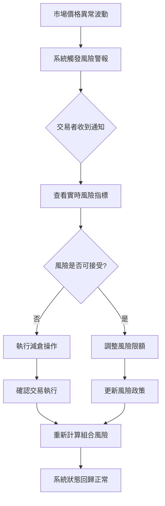
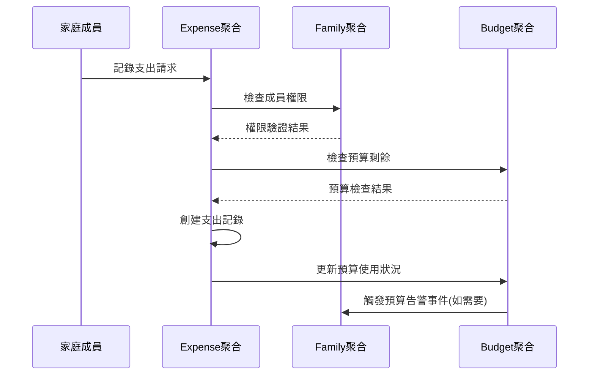
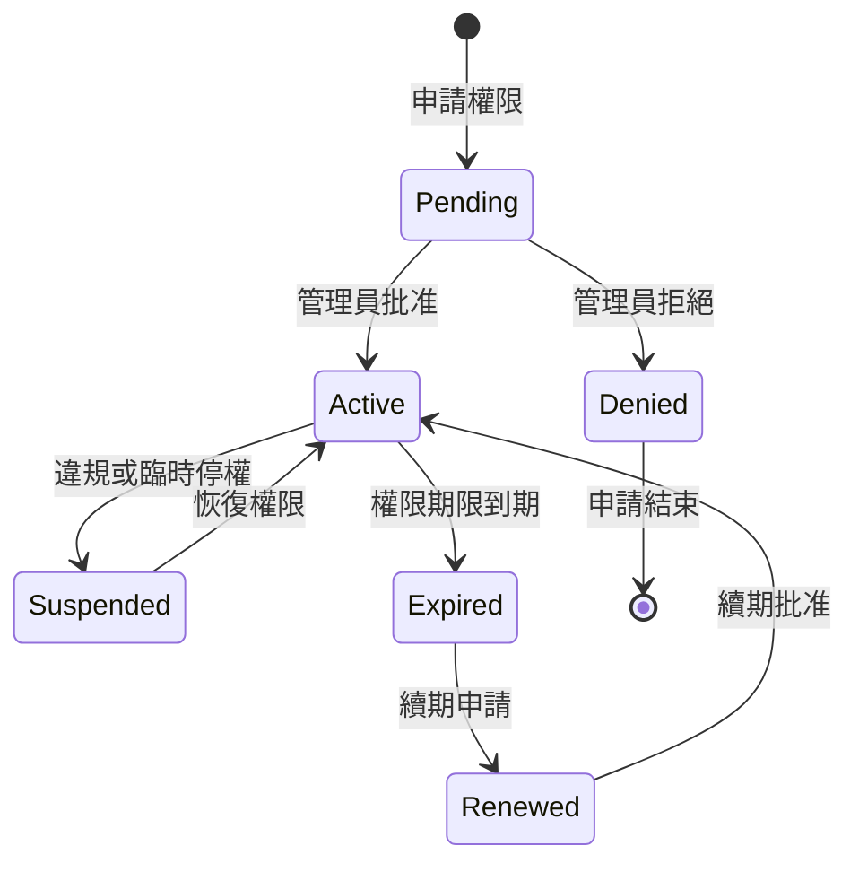

# Day 5 | 使用者的系統操作情境 - User Story 與 Scenario Flow

昨天我們完成了領域聚合的設計，建立了業務邏輯的靜態結構。但聚合只是概念框架，真正的價值在於**使用者如何與這些業務概念互動**。

今天我們要解決一個關鍵問題：**如何將抽象的聚合邊界轉化為具體的使用者操作體驗？**

這不只是寫 User Story 的技巧問題，更是**從系統視角到使用者視角的哲學轉換**。我們需要讓複雜的業務邏輯變得直觀可操作，同時為明天的 AWS 服務選型提供明確的技術需求。

## User Story 的本體論：從功能到體驗的昇華

### 重新定義 User Story 的價值

傳統的 User Story 往往停留在功能描述：

```
作為一個投資者，我想要查看我的持倉，以便了解當前的投資狀況。
```

但基於 DDD 聚合設計的 User Story，應該體現**業務價值和操作情境**：

```
作為一個專業交易者，我需要在30秒內獲得完整的持倉風險分析，
以便在市場波動時快速做出加減倉決策，
確保我的投資組合風險始終在可控範圍內。
```

差異在於：

- **角色具體化**：從"投資者"到"專業交易者"
- **時間約束**：明確 30 秒的性能需求
- **業務目標**：風險控制而非單純信息查看
- **操作情境**：市場波動下的快速決策

### User Story 的三層架構

**Layer 1: 角色識別層** - 基於聚合所有權的角色定義
**Layer 2: 操作情境層** - 基於聚合狀態變化的場景設計  
**Layer 3: 技術約束層** - 基於非功能需求的系統限制

讓我們用六個案例來深入分析：

## 案例 1：投資交易系統的 User Story 設計

### 基於 Portfolio 聚合的角色體系

昨天我們設計了 Portfolio 聚合，今天要基於這個聚合定義使用者角色：

```typescript
// Portfolio聚合回顧
class Portfolio {
  private portfolioId: PortfolioId;
  private traderId: TraderId; // ← 角色識別的基礎
  private holdings: Holdings[];
  private riskLimit: RiskLimit; // ← 角色權限的體現
}
```

**角色權限矩陣**：

| 角色                   | Portfolio 所有權 | 操作權限      | 技術需求     |
| ---------------------- | ---------------- | ------------- | ------------ |
| **Primary Trader**     | 完全擁有         | CRUD 所有操作 | < 100ms 響應 |
| **Risk Manager**       | 只讀權限         | 查看+風險調整 | 實時監控     |
| **Compliance Officer** | 審計權限         | 查看+報告生成 | 歷史數據存取 |
| **System Admin**       | 技術權限         | 系統狀態管理  | 運維面板     |

### Epic 分解：從聚合能力到 User Story

**Epic: 投資組合管理**

基於 Portfolio 聚合的核心能力，我們分解出以下 User Story：

**Story 1: 即時持倉查看**

```
作為專業交易者，
我需要在任何時候查看我的實時持倉狀態和盈虧情況，
以便快速評估當前的投資表現和風險敞口。

接受條件：
- 持倉數據延遲不超過5秒
- 包含實時盈虧計算
- 支援多幣別顯示
- 可按資產類別或地區分組查看

技術約束：
- API響應時間 < 100ms
- 支援2000+併發查詢
- 數據一致性要求：強一致性
```

**Story 2: 風險限額管理**

```
作為專業交易者，
我需要設定和調整我的投資組合風險限額，
以便確保我的交易行為符合我的風險承受能力和投資策略。

接受條件：
- 可設定總持倉上限、單一標的比重限制、行業集中度限制
- 修改生效時間 < 1分鐘
- 提供風險限額違反的即時警告
- 支援不同時間段的限額設定（日/週/月）

技術約束：
- 設定變更需要強一致性
- 風險計算延遲 < 200ms
- 支援複雜的多維度風險規則
```

**Story 3: 快速交易執行**

```
作為專業交易者，
我需要在市場機會出現時立即執行交易指令，
以便抓住短暫的價格優勢，實現投資收益最大化。

接受條件：
- 從下單到確認時間 < 2秒
- 支援市價單和限價單
- 交易前自動風險檢查
- 執行失敗時提供明確的錯誤信息

技術約束：
- 交易系統高可用性 > 99.99%
- 支援峰值交易量 5000 TPS
- 與外部券商API整合
```

### 操作流程的 Scenario 設計

**Scenario: 市場異常波動下的快速風險調整**



**Scenario 對應的 User Story 集合**：

- 風險監控和告警 (背景自動執行)
- 實時風險指標查看 (查詢操作)
- 快速減倉交易 (寫入操作)
- 風險政策調整 (配置操作)

每個操作對應不同的技術需求，為明天的 AWS 服務選型提供依據。

## 案例 2：家庭財務系統的協作式 User Story

### 基於多聚合協作的複雜角色設計

昨天我們設計了 Family、Budget、Expense 三個聚合，今天要處理它們之間的協作場景：

**多角色協作的 User Story 模式**：

**Story: 家庭預算的協作管理**

```
作為家庭財務負責人，
我需要設定不同家庭成員的支出權限和預算額度，
以便在保持家庭財務透明的同時，確保支出行為在可控範圍內。

Primary Actor: 家庭財務負責人
Secondary Actors:
- 家庭成員（被管理者）
- 系統自動化服務（預算監控）

主要流程：
1. 負責人設定家庭月度預算總額 (Family聚合)
2. 分配各成員的支出額度和類別權限 (Family聚合 → Budget聚合)
3. 系統發送權限設定通知給相關成員 (跨聚合事件)
4. 成員開始在授權範圍內記錄支出 (Expense聚合)
5. 系統實時監控預算使用情況 (Budget聚合監控)
6. 預算接近限額時自動通知相關人員 (事件驅動通知)

技術約束：
- 權限設定的強一致性（避免超支的競態條件）
- 支出記錄的高併發（多成員同時記錄）
- 預算監控的近實時性（延遲<5分鐘可接受）
```

### 權限矩陣的狀態管理

**Family 聚合的權限狀態設計**：

```typescript
class FamilyMember {
  constructor(
    public memberId: MemberId,
    public role: FamilyRole, // ADMIN | MEMBER | CHILD
    public spendingLimit: Money, // 支出權限
    public categories: Category[], // 可支出類別
    public status: MemberStatus // ACTIVE | SUSPENDED | PENDING
  ) {}
}

enum FamilyRole {
  ADMIN = "ADMIN", // 可設定所有規則
  MEMBER = "MEMBER", // 可記錄支出，查看自己的數據
  CHILD = "CHILD", // 受限的支出權限
}
```

**跨聚合的權限檢查流程**：



## 案例 3：健康監控系統的數據驅動 Story

### 基於時序數據的狀態場景

健康監控系統有獨特的數據特性：**連續性**和**異常性**的並存。

**Story: 異常數據的智能處理**

```
作為健康監控用戶，
我需要系統自動識別我的健康數據異常，並提供相應的建議和警告，
以便及時調整生活習慣或就醫，確保健康狀況的持續改善。

複雜情境：
- 正常數據：自動記錄，週期性分析
- 邊界數據：系統提醒用戶確認
- 異常數據：立即警告，建議行動
- 連續異常：升級警告，建議就醫

狀態轉換場景：
Normal → Borderline → 用戶確認或系統自動判斷 → Normal/Abnormal
Abnormal → 連續監控 → 持續異常/恢復正常
持續異常 → 建議就醫 → 待處理/已處理
```

**多狀態並發的技術挑戰**：

```typescript
// HealthProfile聚合的狀態管理
class HealthMetric {
  constructor(
    public metricType: MetricType,
    public currentValue: number,
    public status: HealthStatus,
    public trend: TrendAnalysis,
    public alertLevel: AlertLevel
  ) {}
}

enum HealthStatus {
  NORMAL = "NORMAL",
  BORDERLINE = "BORDERLINE",
  ABNORMAL = "ABNORMAL",
  CRITICAL = "CRITICAL",
}

enum AlertLevel {
  NONE = "NONE",
  INFO = "INFO", // 數據記錄通知
  WARNING = "WARNING", // 邊界值警告
  URGENT = "URGENT", // 異常值緊急通知
}
```

## Role Management：基於聚合的權限架構

### 權限設計的 DDD 原則

**原則 1：聚合所有權決定基礎權限**

- Portfolio 聚合的 Owner 擁有完全控制權
- Family 聚合的 Admin 擁有成員管理權
- HealthProfile 聚合的 Owner 擁有數據控制權

**原則 2：跨聚合操作需要明確授權**

- Order 聚合的操作需要 Portfolio 聚合的授權
- Expense 聚合的創建需要 Family 聚合的授權
- DeviceReading 聚合的創建需要 HealthProfile 聚合的授權

**原則 3：角色權限與業務邏輯對應**

```typescript
// 基於聚合的權限設計
interface Permission {
  aggregateType: string;
  aggregateId: string;
  operations: Operation[];
  constraints: Constraint[];
}

interface Operation {
  type: "CREATE" | "READ" | "UPDATE" | "DELETE";
  fields?: string[]; // 欄位級權限
  conditions?: string[]; // 條件限制
}

// 實際權限配置
const traderPermissions: Permission[] = [
  {
    aggregateType: "Portfolio",
    aggregateId: "portfolio-123",
    operations: [
      { type: "READ", fields: ["*"] },
      { type: "UPDATE", fields: ["holdings", "riskLimit"] },
      { type: "CREATE", fields: ["tradeOrder"] },
    ],
    constraints: [
      "trading_hours_only",
      "risk_limit_check",
      "compliance_approval_for_large_orders",
    ],
  },
  {
    aggregateType: "Order",
    aggregateId: "*", // 可操作自己創建的所有訂單
    operations: [
      { type: "READ", fields: ["*"] },
      {
        type: "UPDATE",
        fields: ["status"],
        conditions: ["only_pending_orders"],
      },
    ],
    constraints: ["no_modification_after_submission"],
  },
];
```

### 動態權限的狀態管理

**權限狀態的生命週期**：



**技術實現的考量**：

- 權限變更的即時生效（強一致性需求）
- 權限檢查的高性能（每個 API 調用都要檢查）
- 權限歷史的可追蹤（合規和審計需求）

## Status Scenario：聚合狀態驅動的操作情境

### 狀態場景的設計方法論

每個聚合的狀態變化都會產生對應的使用者操作場景：

**投資交易系統的狀態場景分析**：

```mermaid
graph TB
    subgraph "Portfolio聚合狀態"
        PS1[空組合] --> PS2[活躍組合]
        PS2 --> PS3[風險超限組合]
        PS3 --> PS2
        PS2 --> PS4[清算中組合]
        PS4 --> PS1
    end

    subgraph "Order聚合狀態"
        OS1[草稿] --> OS2[已提交]
        OS2 --> OS3[執行中]
        OS2 --> OS4[已拒絕]
        OS3 --> OS5[已執行]
        OS3 --> OS6[部分執行]
        OS6 --> OS5
    end

    subgraph "跨聚合協調"
        PS2 -.-> OS1: 創建交易
        OS5 -.-> PS2: 更新持倉
        PS3 -.-> OS4: 拒絕高風險交易
    end
```

**每個狀態對應的 User Story**：

**Portfolio 空組合 → 活躍組合**：

```
Story: 初始化投資組合
作為新用戶，我需要設定初始資金和風險偏好，
以便開始我的投資活動。

操作流程：
1. 設定初始現金額度
2. 配置風險限額參數
3. 選擇投資策略模板
4. 確認組合初始化

技術需求：
- 初始化操作的原子性
- 風險參數的合理性驗證
- 用戶引導流程的友好性
```

**活躍組合 → 風險超限組合**：

```
Story: 風險超限的自動處理
作為系統，我需要在投資組合風險超限時自動采取保護措施，
以便降低用戶的潛在損失。

自動化流程：
1. 實時監控組合風險指標
2. 識別風險超限情況
3. 暫停高風險交易權限
4. 通知用戶和風控人員
5. 提供風險降低建議

技術需求：
- 風險計算的實時性（< 30秒）
- 權限控制的即時生效
- 多渠道通知的可靠性
```

### 複雜狀態場景的處理策略

**家庭財務系統的多角色狀態協調**：

```
場景: 預算接近用盡時的家庭協調
初始狀態: 家庭預算剩餘10%
觸發條件: 任一成員嘗試記錄大額支出

狀態轉換流程:
1. Budget聚合檢測到預算緊張
2. 系統暫停所有成員的支出權限
3. 通知家庭管理員處理預算調整
4. 管理員選擇: 增加預算 OR 維持限制
5. 系統根據決策更新所有成員權限
6. 恢復正常支出流程

跨聚合協調的技術挑戰：
- 多聚合狀態的一致性保證
- 權限變更的原子性操作
- 狀態恢復的可靠性機制
```

## 為 AWS 服務選型提供需求基礎

### 從 User Story 到技術約束的映射

通過今天的 User Story 分析，我們為明天的 AWS 服務選型提供了清晰的技術需求：

**高頻實時操作需求** (投資交易)：

- API 響應時間：< 100ms
- 併發支援：2000+ TPS
- 可用性要求：99.99%
- 數據一致性：強一致性

→ **明天討論**：Lambda vs ECS 的選擇標準

**協作式數據操作需求** (家庭財務)：

- 多用戶併發：中等頻率但需要衝突處理
- 權限檢查：每個操作都需要驗證
- 數據一致性：最終一致性可接受
- 成本敏感：家庭用戶對價格敏感

→ **明天討論**：ALB + Auto Scaling 的成本優化策略

**數據密集型處理需求** (健康監控)：

- 數據攝取：IoT 設備的持續數據流
- 存儲需求：時序數據的長期保存
- 分析需求：趨勢分析和異常檢測
- 地域分佈：用戶分散在不同地區

→ **明天討論**：CDN + 多 Region 部署的權衡

### 操作模式對架構模式的影響

**同步操作模式** → 需要低延遲服務
**異步操作模式** → 可以接受較高延遲
**批量操作模式** → 需要高吞吐量服務
**實時協作模式** → 需要狀態同步機制

每種操作模式對應不同的 AWS 服務組合，這將是明天討論的核心。

## 明天的技術選型預告

基於今天建立的 User Story 和操作情境分析，明天我們將深入討論：

### 🏗️ 服務選型的權衡藝術

**Lambda vs ECS**：

- 何時選擇 Serverless？何時選擇 Container？
- 基於操作頻率和響應時間的選擇矩陣

**ALB vs API Gateway**：

- 不同的負載模式如何影響選擇？
- 成本模型的詳細對比分析

**Regional vs Global 部署**：

- 用戶分佈如何影響架構策略？
- CDN 和邊緣計算的使用場景

### 💰 成本控制策略

**實例類型優化**：

- Spot Instance 的風險評估
- Reserved Instance 的承諾策略
- On-Demand 的彈性平衡

**DDoS 防護等級**：

- 不同業務場景的防護需求
- Shield Standard vs Shield Advanced 的選擇

## 今日的設計收穫

- **User Story 是聚合能力的具體表達**：好的 Story 反映了聚合的業務價值
- **角色權限基於聚合邊界設計**：技術權限應該對應業務概念
- **狀態場景驅動操作體驗**：每個狀態轉換都是一個用戶旅程
- **操作情境決定技術選型**：不同的使用模式需要不同的技術策略

記住：我們今天建立的不是功能清單，而是操作體驗的完整描述。這些描述將直接驅動明天的技術架構決策，確保我們選擇的 AWS 服務能真正滿足用戶的操作需求。

---

> 「User Story 不是功能的羅列，而是體驗的設計。每個 Story 都是用戶與系統聚合互動的一個完整情境，而這些情境的技術需求將決定我們的架構選擇。」
