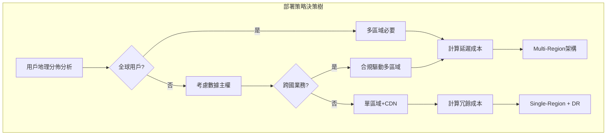

# Day 6 | Trade-off 的成本管控藝術：雲端架構的 Instance 選用

昨天我們建立了完整的 User Story 框架，將抽象的聚合設計轉化為具體的操作情境。每個 Story 都包含明確的技術約束：投資交易系統需要<100ms 響應、家庭財務系統需要協作衝突處理、健康監控系統需要 IoT 數據流處理。

今天面臨的核心挑戰是：**如何在滿足這些技術需求的同時，實現成本的最優化控制？**

這不只是服務選型的技術問題，更是**業務價值與技術成本的哲學權衡**。每個架構決策背後都隱藏著一個根本問題：我們願意為了性能、可靠性、靈活性付出多少代價？

## 成本權衡的哲學基礎：價值最大化原則

### 重新定義「成本」的內涵

在雲端架構中，成本不只是月度帳單，而是**多維度資源的綜合權衡**：

**直接成本**：

- 計算資源費用（EC2、Lambda 執行時間）
- 存儲費用（S3、EBS、數據傳輸）
- 網路費用（CloudFront、跨區域傳輸）

**隱性成本**：

- 開發維護成本（團隊時間、複雜度管理）
- 機會成本（選擇 A 方案放棄 B 方案的潛在收益）
- 風險成本（可用性損失、安全漏洞、供應商鎖定）

**時間成本**：

- Time to Market（產品上市速度）
- 技術債務累積（未來重構的成本）
- 團隊學習曲線（新技術的適應時間）

### 基於 Day 5 需求的成本模型設計

回顧昨天建立的三種典型需求模式，每種模式對應不同的成本敏感度：

**投資交易系統：性能優先模型**

- 成本敏感度：低（性能損失的代價遠超基礎設施成本）
- 優化目標：延遲最小化 > 可用性最大化 > 成本控制
- 權衡策略：寧可過度配置也不能性能不足

**家庭財務系統：成本敏感模型**

- 成本敏感度：高（用戶付費能力有限）
- 優化目標：成本控制 > 基本功能滿足 > 性能提升
- 權衡策略：在滿足基本需求前提下最小化成本

**健康監控系統：平衡優化模型**

- 成本敏感度：中（B2B2C 模式，需要平衡用戶體驗和商業可行性）
- 優化目標：穩定性 > 成本控制 > 高級功能
- 權衡策略：核心功能高投入，邊緣功能成本優化

## ECS vs Lambda：計算服務的權衡藝術

### 決策矩陣：從操作模式到服務選型

基於昨天的 User Story 分析，我們建立了詳細的計算服務選擇矩陣：

**Lambda 適用場景判斷**：

| 評估維度   | Lambda 優勢閾值 | 投資交易        | 家庭財務        | 健康監控        |
| ---------- | --------------- | --------------- | --------------- | --------------- |
| 執行頻率   | < 1000 次/小時  | ❌ 高頻交易     | ✅ 間歇記錄     | ✅ 週期性分析   |
| 執行時長   | < 15 分鐘       | ✅ 毫秒級交易   | ✅ 簡單計算     | ⚠️ 大數據分析   |
| 併發需求   | < 1000 併發     | ❌ 2000+ TPS    | ✅ 家庭規模     | ✅ 設備數量有限 |
| 狀態管理   | 無狀態          | ⚠️ 交易狀態複雜 | ✅ 每次獨立操作 | ✅ 數據流處理   |
| 冷啟動容忍 | > 100ms         | ❌ <50ms 要求   | ✅ 用戶可等待   | ✅ 背景處理     |

**ECS 適用場景判斷**：

| 評估維度   | ECS 優勢閾值 | 投資交易        | 家庭財務    | 健康監控        |
| ---------- | ------------ | --------------- | ----------- | --------------- |
| 長時間運行 | > 1 小時     | ✅ 市場時間運行 | ❌ 按需使用 | ⚠️ 混合模式     |
| 複雜依賴   | 多服務協調   | ✅ 多聚合協作   | ❌ 單一功能 | ✅ IoT 數據管道 |
| 資源可預測 | 穩定負載     | ✅ 交易時段固定 | ❌ 使用隨機 | ⚠️ 設備數增長   |
| 成本控制   | 高使用率     | ✅ 專業用戶付費 | ❌ 成本敏感 | ⚠️ 規模經濟     |

### 混合架構的設計策略

**投資交易系統：ECS 主體 + Lambda 補充**

```yaml
# 核心交易服務：ECS Fargate
TradingCore:
  Service: ECS Fargate
  Reason: "持續運行、低延遲、狀態管理"
  Configuration:
    CPU: 2 vCPU
    Memory: 4 GB
    MinCapacity: 2
    MaxCapacity: 10
    TargetCPU: 70%

# 輔助功能：Lambda
TradingSupport:
  PriceAlert:
    Service: Lambda
    Reason: "事件驅動、間歇執行"
    Memory: 512 MB
    Timeout: 30s

  ReportGeneration:
    Service: Lambda
    Reason: "非實時、計算密集"
    Memory: 3008 MB
    Timeout: 15 min
```

**家庭財務系統：Lambda 優先策略**

```yaml
# 全Serverless架構
FamilyFinance:
  ExpenseRecord:
    Service: Lambda
    Memory: 256 MB
    Timeout: 10s
    ConcurrentExecutions: 100

  BudgetCheck:
    Service: Lambda
    Memory: 512 MB
    Timeout: 30s

  MonthlyReport:
    Service: Lambda
    Memory: 1024 MB
    Timeout: 5 min

# 成本優化配置
CostOptimization:
  ProvisionedConcurrency: 0 # 冷啟動可接受
  ReservedCapacity: false # 使用模式不固定
  SpotInstances: N/A # Lambda自動管理
```

**健康監控系統：分層混合架構**

```yaml
# 數據攝取層：Lambda
DataIngestion:
  IoTDataProcessor:
    Service: Lambda
    Memory: 256 MB
    Timeout: 1 min
    EventSource: IoT Core

# 分析處理層：ECS
Analytics:
  TrendAnalysis:
    Service: ECS Fargate
    CPU: 1 vCPU
    Memory: 2 GB
    Schedule: "cron(0 2 * * ? *)" # 每日凌晨2點

# 告警服務：Lambda
Alerting:
  AbnormalDetection:
    Service: Lambda
    Memory: 1024 MB
    Timeout: 30s
    EventSource: DynamoDB Streams
```

### 成本計算模型

**Lambda 成本計算**：

```
月度成本 = (執行次數 × 平均執行時間 × 記憶體配置 × Lambda單價) + (請求次數 × 請求單價)

家庭財務系統範例：
- 執行次數：100,000次/月
- 平均執行時間：200ms
- 記憶體：256MB
- 成本：約$2.4/月
```

**ECS 成本計算**：

```
月度成本 = (vCPU × CPU小時數 × CPU單價) + (記憶體GB × 記憶體小時數 × 記憶體單價)

投資交易系統範例：
- 配置：2 vCPU, 4GB RAM
- 運行時間：12小時/日（交易時間）
- 月度成本：約$58/月
```

## ALB 策略：負載均衡的成本智慧

### 負載均衡器選型的業務邏輯

不同的系統特性決定了不同的負載均衡策略：

**Application Load Balancer vs Network Load Balancer**：

| 特性對比 | ALB    | NLB    | 投資交易    | 家庭財務    | 健康監控    |
| -------- | ------ | ------ | ----------- | ----------- | ----------- |
| 延遲性能 | ~100ms | ~1ms   | ✅ 需要 NLB | ❌ALB 足夠  | ❌ALB 足夠  |
| 7 層功能 | 支援   | 不支援 | ✅ 需要路由 | ✅ 需要路由 | ⚠️ 基本需求 |
| TLS 終止 | 支援   | 支援   | ✅ 必需     | ✅ 必需     | ✅ 必需     |
| 成本     | 較高   | 較低   | ✅ 性能優先 | ❌ 成本敏感 | ⚠️ 平衡考慮 |

**投資交易系統的 ALB 配置**：

```yaml
TradingALB:
  Type: Application Load Balancer
  Scheme: internet-facing

  Listeners:
    HTTPS:443:
      DefaultAction: forward-to-trading-core
      Rules:
        - Condition: path-pattern("/api/market/*")
          Action: forward-to-market-data-service
          Priority: 100
        - Condition: path-pattern("/api/orders/*")
          Action: forward-to-order-service
          Priority: 200

  TargetGroups:
    trading-core:
      Protocol: HTTP
      Port: 8080
      HealthCheck:
        Path: /health
        Interval: 10s
        Timeout: 5s
        HealthyThreshold: 2

  # 成本優化配置
  CrossZoneLoadBalancing: true # 分散流量，避免熱點
  DeletionProtection: true # 防止意外刪除
  AccessLogs:
    Enabled: true
    S3Bucket: trading-alb-logs
    # 分析用戶行為，優化路由策略
```

**家庭財務系統的成本優化 ALB**：

```yaml
FamilyFinanceALB:
  Type: Application Load Balancer
  Scheme: internet-facing

  # 成本優化策略
  IdleTimeout: 60s # 減少連接時間

  TargetGroups:
    serverless-backend:
      Protocol: HTTP
      Port: 80
      TargetType: lambda # 直接集成Lambda
      HealthCheck:
        Path: /health
        Interval: 30s # 降低健康檢查頻率

  # 省錢配置
  AccessLogs:
    Enabled: false # 關閉日誌節省存儲成本

  SecurityGroups:
    - family-finance-sg
    # 最小權限原則，減少安全風險成本
```

### 自動擴展的成本控制

**基於目標追蹤的智能擴展**：

```yaml
AutoScalingPolicy:
  投資交易系統:
    MetricType: ALBRequestCountPerTarget
    TargetValue: 1000 # 每個實例1000 RPS
    ScaleOutCooldown: 60s # 快速擴展應對突發流量
    ScaleInCooldown: 300s # 緩慢縮容避免震盪

  家庭財務系統:
    MetricType: CPUUtilization
    TargetValue: 50% # 較低CPU目標，控制成本
    ScaleOutCooldown: 300s # 較慢擴展，用戶可等待
    ScaleInCooldown: 600s # 更慢縮容，避免頻繁調整
```

## DDoS 防護：安全投資的 ROI 計算

### 防護等級的業務價值分析

不同系統對 DDoS 攻擊的脆弱性和損失承受度截然不同：

**AWS Shield 防護等級選擇**：

| 防護級別        | 成本     | 投資交易    | 家庭財務    | 健康監控     |
| --------------- | -------- | ----------- | ----------- | ------------ |
| Shield Standard | 免費     | ❌ 不足     | ✅ 基本夠用 | ⚠️ 視規模    |
| Shield Advanced | $3000/月 | ✅ 必要投資 | ❌ 成本過高 | ⚠️B2B 可考慮 |

**投資交易系統：Shield Advanced + WAF**

```yaml
DDoSProtection:
  Shield: Advanced
  Cost: $3000/月

  Justification: |
    交易中斷1小時的潛在損失：
    - 用戶交易損失：平均$50K
    - 品牌信譽損失：無法量化但巨大
    - 法規合規風險：可能面臨監管處罰

    防護成本 vs 風險損失 = 1:15+ ROI

  WAF Rules:
    - RateLimiting: 100 req/min per IP
    - GeoBlocking: 限制高風險地區
    - SQLInjection: 自動檢測和攔截
    - CustomRules: 基於交易模式的異常檢測
```

**家庭財務系統：Shield Standard + CloudFlare**

```yaml
DDoSProtection:
  Shield: Standard (免費)
  CloudFlare: Pro ($20/月)

  Justification: |
    家庭用戶攻擊風險低，損失有限：
    - 單用戶數據價值：相對較低
    - 停機影響：用戶可稍後使用
    - 攻擊動機：針對性攻擊可能性小

    成本控制優先，基本防護足夠

  Protection Strategy:
    - CloudFlare代理隱藏真實IP
    - 基本Rate Limiting
    - Browser Integrity Check
    - Challenge Passage for suspicious traffic
```

**健康監控系統：分層防護策略**

```yaml
DDoSProtection:
  Core Services: Shield Standard
  API Endpoints: WAF ($1-5/月)
  IoT Endpoints: IoT Device Defender

  Risk Assessment: |
    醫療數據敏感但攻擊面分散：
    - IoT設備數量大，單點價值低
    - 用戶健康數據敏感，需要保護
    - B2B客戶對穩定性有要求

    中等防護水平，重點保護核心API
```

## Region 部署：地理分佈的成本考量

### 多區域部署的決策框架

**單區域 vs 多區域的權衡**：



**投資交易系統：低延遲多區域**

```yaml
RegionalDeployment:
  Primary: us-east-1      # 美國東部（最大交易量）
  Secondary: eu-west-1    # 歐洲用戶
  AsiaSpecific: ap-northeast-1  # 亞洲市場時間

  Architecture:
    - Active-Active: 交易核心服務
    - Cross-Region Replication: DynamoDB Global Tables
    - Regional Market Data: 本地化數據源

  Cost Impact:
    Infrastructure: +200% (3個區域)
    Data Transfer: $0.02/GB跨區域
    Latency Benefit:
      - US-EU: 150ms → 20ms
      - US-Asia: 200ms → 30ms

    Business Justification:
      每毫秒延遲改善 = 0.1%交易成功率提升
      年交易量$1B × 0.3%提升 = $3M收益
      基礎設施增加成本：$200K/年
      ROI: 15:1
```

**家庭財務系統：單區域+CDN 策略**

```yaml
RegionalDeployment:
  Primary: us-east-1      # 單一區域降低成本

  Global Access:
    CloudFront: 全球CDN分發靜態資源
    Route53: 智能DNS路由

  Cost Optimization:
    Regional: $100/月
    vs Multi-Region: $400/月

    CDN: $20/月
    Total Savings: 70%

    Latency Impact:
    - Static Assets: 全球<100ms (CDN)
    - API Calls: 100-300ms (可接受)

    Business Justification:
    家庭財務操作非實時，延遲可接受
    成本節省 > 性能提升的邊際效益
```

**健康監控系統：分層區域策略**

```yaml
RegionalDeployment:
  CoreServices:
    Primary: us-east-1
    Disaster Recovery: us-west-2

  DataProcessing:
    Regional: 就近處理IoT數據
    - us-east-1: 北美設備
    - eu-west-1: 歐洲設備
    - ap-southeast-1: 亞太設備

  Cost Model:
    Core (Single Region): $500/月
    Regional Processing: $200/月 per region
    Total: $1100/月 vs $1500/月 (Full Multi-Region)

    Performance Benefit:
    IoT數據處理延遲：200ms → 50ms
    影響：設備響應更及時，用戶體驗提升
```

## CDN 與邊緣計算：內容分發的成本優化

### CDN 策略的 ROI 分析

**CloudFront 配置策略**：

**投資交易系統：性能優先 CDN**

```yaml
CloudFrontDistribution:
  PriceClass: All Regions # 全球最佳性能

  CacheBehaviors:
    "/api/static/*":
      TTL: 3600s # 靜態數據長緩存
      Compress: true

    "/api/market/*":
      TTL: 5s # 市場數據短緩存
      Headers:
        - Authorization # 個性化內容

    "/api/orders/*":
      CachePolicy: CachingDisabled # 交易數據不緩存
      OriginRequestPolicy: CORS-S3Origin

  Cost Analysis:
    Data Transfer: $0.085/GB (Tier 1)
    Requests: $0.0075/10K requests
    Monthly: ~$500 (高流量)

    Performance Gain:
      - 靜態資源：200ms → 20ms
      - 市場數據：100ms → 30ms
      - 用戶體驗顯著提升，支撐溢價收費
```

**家庭財務系統：成本優化 CDN**

```yaml
CloudFrontDistribution:
  PriceClass: US_Europe_Asia  # 排除昂貴地區

  CacheBehaviors:
    "/static/*":
      TTL: 86400s            # 24小時長緩存
      Compress: true

    "/api/*":
      TTL: 300s              # 5分鐘中等緩存

  Cost Analysis:
    Data Transfer: ~$20/月 (低流量)
    主要節省：減少原始伺服器負載

    Origin Server Savings:
    - 緩存命中率：80%
    - 伺服器負載減少：80%
    - Lambda執行次數減少：80%
    - 月節省：$60

    Net Savings: $40/月
```

### 邊緣計算的場景應用

**Lambda@Edge 的使用場景**：

```yaml
EdgeComputing:
  投資交易系統:
    Use Case: 用戶認證和授權
    Function:
      Runtime: Node.js 14
      Memory: 128 MB
      Timeout: 5s

    Business Value:
      - 就近驗證，減少50ms延遲
      - 減少核心服務負載
      - 提升全球用戶體驗

  家庭財務系統:
    Use Case: A/B測試和功能開關
    Function:
      Runtime: Python 3.9
      Memory: 128 MB
      Timeout: 3s

    Business Value:
      - 動態內容個性化
      - 實驗和優化成本低
      - 無需部署核心服務變更
```

## Local-Cloud Hybrid：混合雲的成本權衡

### 混合架構的適用場景

**投資交易系統：關鍵數據本地化**

```yaml
HybridArchitecture:
  Local Components:
    - 交易執行引擎（低延遲要求）
    - 敏感客戶數據（合規要求）
    - 實時風控計算（數據不能出境）

  Cloud Components:
    - 歷史數據分析（彈性計算需求）
    - 用戶介面（全球訪問）
    - 災難恢復（異地備援）

  Data Sync Strategy:
    - Real-time: 交易狀態同步
    - Batch: 歷史數據ETL
    - Event-driven: 業務事件複製

  Cost Analysis:
    Local Infrastructure: $50K/年
    Cloud Services: $30K/年
    vs Pure Cloud: $80K/年

    Savings: 總成本持平，但合規和性能提升
```

**健康監控系統：邊緣 IoT 處理**

```yaml
HybridArchitecture:
  Edge Components:
    - IoT Gateway（數據預處理）
    - 本地緩存（網路中斷容忍）
    - 緊急告警（即時響應）

  Cloud Components:
    - 大數據分析（機器學習）
    - 長期存儲（歷史追蹤）
    - 用戶面板（遠程訪問）

  Cost Benefits:
    - 減少90%的數據上傳成本
    - 提升99%的系統可用性
    - 降低70%的雲端計算需求
```

## 為明天的架構藍圖做準備

### 服務選型決策的文檔化

通過今天的詳細分析，我們為每個系統建立了完整的服務選型決策記錄：

**決策記錄模板**：

```markdown
## 架構決策記錄 (ADR)

### ADR-001: 投資交易系統計算服務選型

**Status**: Accepted
**Date**: 2024-09-04
**Deciders**: Architecture Team

**Context**:
基於 Day 5 的 User Story 分析，投資交易系統需要：

- API 響應時間 < 100ms
- 支援 2000+ TPS 併發
- 99.99%可用性要求

**Options Considered**:

1. Pure Lambda
2. Pure ECS
3. Hybrid (ECS + Lambda)

**Decision**: Hybrid Architecture

- Core Trading: ECS Fargate
- Support Functions: Lambda

**Rationale**:

- ECS 提供持續運行和低延遲
- Lambda 處理事件驅動的輔助功能
- 成本雖高但性能收益顯著

**Consequences**:

- 開發複雜度中等
- 運維需要兩套體系
- 成本可控且性能最優

**Compliance**:
滿足 Day 3 建立的非功能需求
支撐 Day 5 設計的 User Story 操作體驗
```

### 成本模型的量化分析

**三系統成本對比總結**：

| 系統     | 月度成本 | 主要驅動因子        | 成本優化策略               |
| -------- | -------- | ------------------- | -------------------------- |
| 投資交易 | $2,800   | ECS+Shield Advanced | 性能 ROI 證明投資合理性    |
| 家庭財務 | $150     | Lambda+ALB          | 嚴格成本控制，功能夠用即可 |
| 健康監控 | $800     | 混合架構+多區域     | 按需彈性，分層優化         |

### 明天架構藍圖的準備要素

今天的服務選型分析將直接影響明天的架構設計：

**技術棧確定**：

- 計算層：ECS vs Lambda 的選擇已明確
- 網路層：ALB/NLB 配置已確定
- 安全層：DDoS 防護等級已選定
- 分佈層：Region 和 CDN 策略已制定

**架構模式準備**：

- 單體 vs 微服務的選擇基礎
- 同步 vs 異步的通信模式
- 事件驅動 vs 請求驅動的設計
- Clean Architecture vs 分層架構的權衡

**非功能需求滿足**：

- 性能：服務選型已優化延遲和吞吐量
- 可靠性：多區域和備援策略已確定
- 安全性：DDoS 和訪問控制已配置
- 成本：每項選擇都有清晰的 ROI 分析

## 明天的架構設計預告

基於今天建立的服務選型基礎，明天我們將深入討論：

### 架構模式的選擇哲學

- Clean Architecture vs Hexagonal Architecture 的適用場景
- 微服務 vs 單體架構的業務驅動決策
- Event-Driven vs Request-Response 的設計權衡
- CQRS + Event Sourcing 的複雜度投資評估

### 系統邊界的劃分藝術

- 基於聚合邊界的微服務拆分
- API Gateway 的路由策略設計
- 服務間通信的協議選擇
- 數據一致性的處理策略

### 可觀測性的系統設計

- 監控指標的層次化設計
- 分散式追蹤的實現策略
- 日誌聚合和分析系統
- 告警和故障響應機制

## 今日的權衡智慧總結

- **成本不只是金錢**：時間、複雜度、風險都是成本的維度
- **業務價值驅動技術選型**：每個架構決策都應該有明確的 ROI
- **沒有銀彈**：不同系統需要不同的優化策略
- **決策需要文檔化**：架構決策記錄是團隊的重要資產

記住：我們今天建立的不是最優解，而是在特定約束條件下的最適解。隨著業務發展和技術演進，這些決策需要持續評估和調整。

---

> 「架構設計是約束條件下的最優化問題。我們不是在尋找完美的解決方案，而是在尋找在當前條件下收益最大化的選擇。每個 trade-off 都是一個哲學判斷：我們為了什麼而犧牲什麼。」
