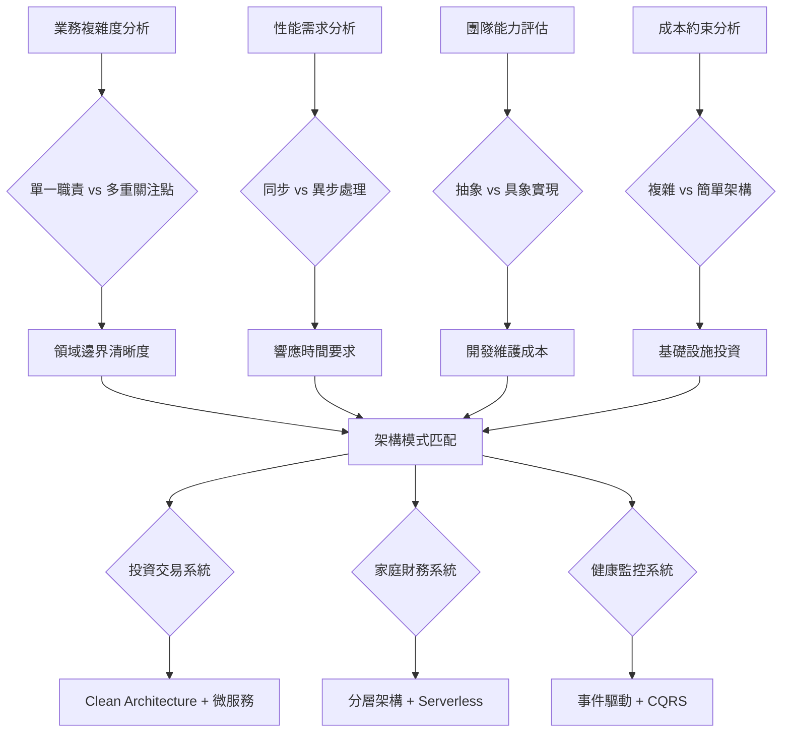
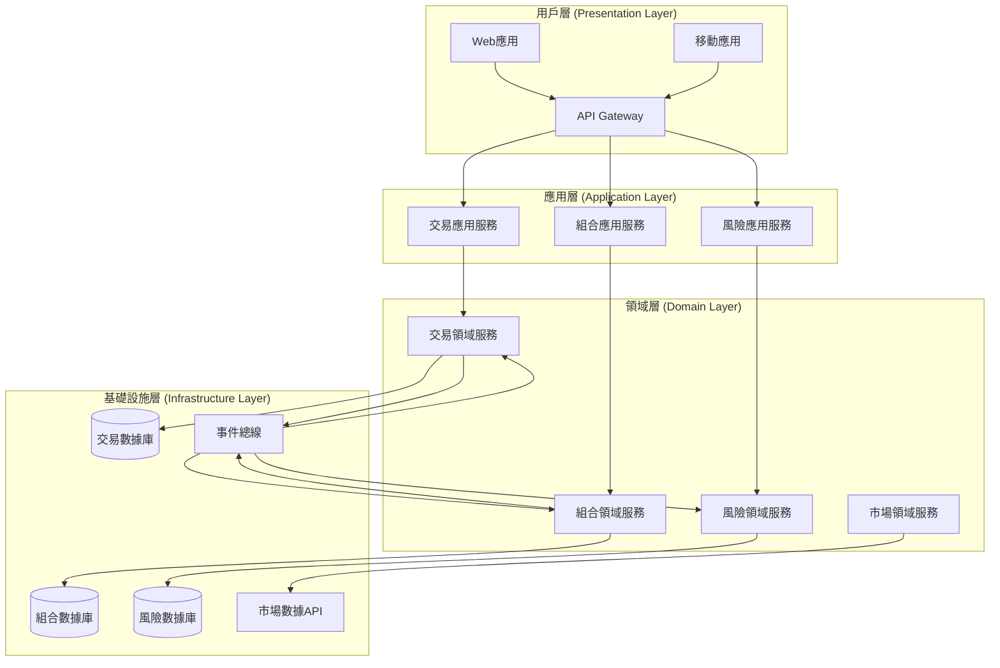
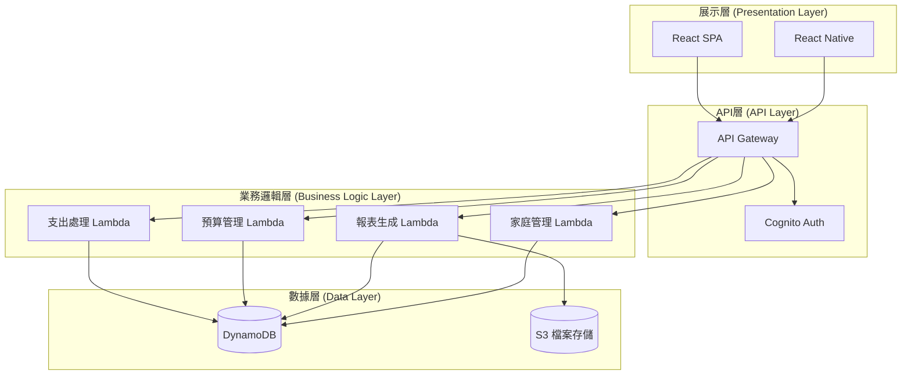
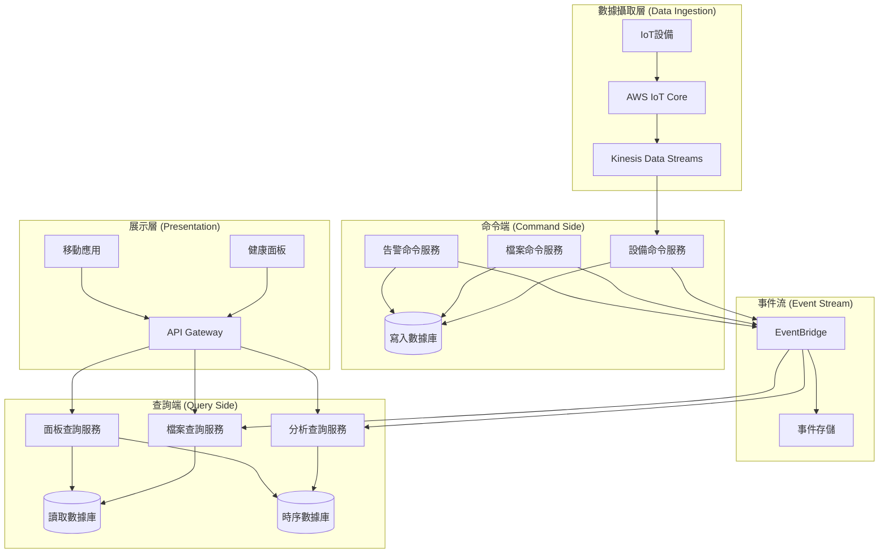
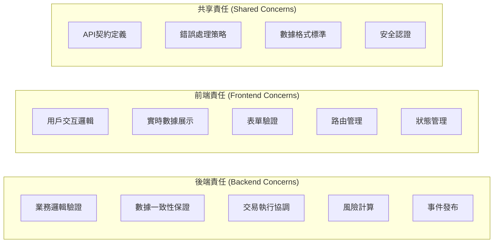

# Day 7 | 畫出你的第一份系統藍圖：架構選型與設計

經過六天的深度分析，我們已經建立了完整的設計基礎：從哲學思考到領域建模，從用戶需求到服務選型。今天要解決的核心問題是：

**如何將所有這些分析整合成一份可執行的系統架構藍圖？**

這不只是畫圖的技術問題，更是**從抽象思考到具體實現的系統工程學**。每個架構決策都必須有明確的推導邏輯，每個技術選擇都必須服務於業務目標。

## 架構選型的系統方法論

### 從需求驅動到架構模式的推導邏輯

基於前六天的分析，我們建立了一個**架構模式選擇的決策框架**：



### 架構適配性評估矩陣

基於前面的 User Story 分析和服務選型，我們為三個系統建立適配性評估：

| 評估維度           | 投資交易 | 家庭財務 | 健康監控 | 權重 |
| ------------------ | -------- | -------- | -------- | ---- |
| **業務複雜度**     | 9/10     | 4/10     | 7/10     | 25%  |
| **性能要求**       | 10/10    | 3/10     | 6/10     | 30%  |
| **一致性需求**     | 10/10    | 5/10     | 7/10     | 20%  |
| **開發資源**       | 8/10     | 3/10     | 6/10     | 15%  |
| **維護複雜度容忍** | 8/10     | 2/10     | 5/10     | 10%  |

基於這個評估，我們可以推導出每個系統的最適架構模式。

有鑑於在鐵人賽中所的資料呈現方便性原因，所以使用 mermaid 進行代碼化的呈現，mermaid 的好處在於可用 git 進行文件的板控與 domain 異動的調整，但實際上市面上也有許多工具可以進行系統設計視覺化與同步認知的敘事性，draw.io 也是一個不錯的方式

## 投資交易系統：Clean Architecture + 微服務設計

### 架構選型推導過程

**為什麼選擇 Clean Architecture？**

基於 Day 4 的聚合設計和 Day 5 的 User Story 分析：

1. **高業務複雜度**：Portfolio、Order、Risk 等多個聚合需要清晰的邊界
2. **嚴格測試要求**：金融系統的每個功能都必須有完整的測試覆蓋
3. **頻繁業務變更**：監管政策和市場規則經常變化，需要穩定的架構基礎

**為什麼選擇微服務？**

基於 Day 6 的服務選型分析：

1. **獨立擴展需求**：交易執行、風險計算、市場數據各有不同的性能特徵
2. **團隊自主性**：不同業務領域可以由專門團隊獨立開發部署
3. **故障隔離**：單一服務故障不應該影響整個交易系統

### 完整架構設計



### 微服務邊界設計

基於 Day 4 的聚合邊界，我們設計微服務拆分：

**Trading Service (交易服務)**

```yaml
Responsibility: 處理交易指令的生命週期
Aggregates: Order, Trade
APIs:
  - POST /orders # 創建交易訂單
  - GET /orders/{id} # 查詢訂單狀態
  - PUT /orders/{id}/cancel # 取消訂單

Data Ownership:
  - 訂單數據
  - 交易執行記錄
  - 市場接口配置

Events Published:
  - OrderCreated
  - OrderExecuted
  - OrderCancelled

Events Consumed:
  - PortfolioValidated
  - RiskAssessed
```

**Portfolio Service (組合服務)**

```yaml
Responsibility: 管理投資組合狀態和持倉
Aggregates: Portfolio, Holdings
APIs:
  - GET /portfolios/{id} # 查詢組合詳情
  - PUT /portfolios/{id}/holdings # 更新持倉
  - POST /portfolios/{id}/validate # 驗證交易能力

Data Ownership:
  - 組合基本信息
  - 持倉詳細數據
  - 現金餘額記錄

Events Published:
  - PortfolioValidated
  - PortfolioUpdated
  - HoldingsChanged

Events Consumed:
  - OrderExecuted
  - RiskLimitChanged
```

**Risk Service (風險服務)**

```yaml
Responsibility: 風險評估和限額管理
Aggregates: RiskProfile, RiskMetric
APIs:
  - POST /risk/assess # 實時風險評估
  - GET /risk/profiles/{id} # 風險檔案查詢
  - PUT /risk/limits/{id} # 更新風險限額

Data Ownership:
  - 風險參數配置
  - 歷史風險指標
  - 限額設定記錄

Events Published:
  - RiskAssessed
  - RiskLimitExceeded
  - RiskLimitChanged

Events Consumed:
  - PortfolioUpdated
  - MarketVolatilityChanged
```

### Clean Architecture 實現細節

**依賴倒置的實現**：

```typescript
// Domain Layer - 純業務邏輯
export class Portfolio {
  constructor(
    private portfolioId: PortfolioId,
    private holdings: Holdings[],
    private cashBalance: Money
  ) {}

  validateTrade(
    order: TradeOrder,
    riskAssessment: RiskAssessment
  ): ValidationResult {
    // 純業務邏輯，不依賴任何外部技術
    if (!this.hasSufficientFunds(order)) {
      return ValidationResult.failed("Insufficient funds");
    }

    if (riskAssessment.exceedsLimit()) {
      return ValidationResult.failed("Risk limit exceeded");
    }

    return ValidationResult.success();
  }
}

// Application Layer - 用例協調
export class ValidateTradeUseCase {
  constructor(
    private portfolioRepository: PortfolioRepository, // 接口，不是實現
    private riskService: RiskService, // 接口，不是實現
    private eventPublisher: EventPublisher // 接口，不是實現
  ) {}

  async execute(command: ValidateTradeCommand): Promise<ValidationResult> {
    // 協調領域對象，不包含業務邏輯
    const portfolio = await this.portfolioRepository.findById(
      command.portfolioId
    );
    const riskAssessment = await this.riskService.assess(
      portfolio,
      command.order
    );

    const result = portfolio.validateTrade(command.order, riskAssessment);

    if (result.isValid) {
      await this.eventPublisher.publish(
        new TradeValidatedEvent(command.portfolioId, command.order)
      );
    }

    return result;
  }
}

// Infrastructure Layer - 技術實現
export class DynamoDBPortfolioRepository implements PortfolioRepository {
  constructor(private dynamoClient: DynamoDB.DocumentClient) {}

  async findById(portfolioId: PortfolioId): Promise<Portfolio> {
    const params = {
      TableName: "Portfolios",
      Key: { portfolioId: portfolioId.value },
    };

    const result = await this.dynamoClient.get(params).promise();
    return this.mapToDomain(result.Item);
  }
}
```

## 家庭財務系統：分層架構 + Serverless 設計

### 架構選型推導過程

**為什麼選擇分層架構？**

1. **業務邏輯相對簡單**：主要是 CRUD 操作和基本的業務規則驗證
2. **開發資源有限**：需要快速開發和上市，團隊規模較小
3. **維護成本敏感**：長期維護需要簡單易懂的架構

**為什麼選擇 Serverless？**

基於 Day 6 的成本分析：

1. **使用模式不規律**：家庭用戶的訪問模式差異很大
2. **成本控制優先**：Lambda 的按需付費模式最符合成本要求
3. **運維簡化**：無需管理伺服器，降低運維複雜度

### 簡化架構設計



### 分層架構實現

**簡化的三層結構**：

```typescript
// Presentation Layer - API Handler
export const expenseHandler = async (
  event: APIGatewayEvent
): Promise<APIGatewayResponse> => {
  try {
    const expenseData = JSON.parse(event.body);

    // 直接調用業務邏輯層
    const result = await ExpenseService.createExpense(expenseData);

    return {
      statusCode: 200,
      body: JSON.stringify(result),
    };
  } catch (error) {
    return {
      statusCode: 500,
      body: JSON.stringify({ error: error.message }),
    };
  }
};

// Business Logic Layer - 簡化的服務層
export class ExpenseService {
  static async createExpense(expenseData: ExpenseData): Promise<Expense> {
    // 基本業務邏輯驗證
    const validation = await this.validateExpense(expenseData);
    if (!validation.isValid) {
      throw new Error(validation.errors.join(", "));
    }

    // 檢查預算限額
    const budgetCheck = await BudgetService.checkLimit(
      expenseData.familyId,
      expenseData.category,
      expenseData.amount
    );

    if (!budgetCheck.allowed) {
      throw new Error("Budget limit exceeded");
    }

    // 保存數據
    const expense = await ExpenseRepository.save(expenseData);

    // 更新預算使用狀況
    await BudgetService.updateUsage(
      expenseData.familyId,
      expenseData.category,
      expenseData.amount
    );

    return expense;
  }
}

// Data Layer - 簡化的數據訪問
export class ExpenseRepository {
  static async save(expenseData: ExpenseData): Promise<Expense> {
    const params = {
      TableName: "FamilyExpenses",
      Item: {
        familyId: expenseData.familyId,
        expenseId: generateId(),
        amount: expenseData.amount,
        category: expenseData.category,
        description: expenseData.description,
        createdAt: new Date().toISOString(),
      },
    };

    await dynamoClient.put(params).promise();
    return params.Item as Expense;
  }
}
```

### Serverless 優化策略

**Lambda 函數組織**：

```yaml
# 按功能領域組織Lambda函數
Functions:
  expense-create:
    handler: src/handlers/expense.create
    memorySize: 256
    timeout: 10
    events:
      - http:
          path: /expenses
          method: post
          authorizer: aws_iam

  expense-list:
    handler: src/handlers/expense.list
    memorySize: 512
    timeout: 30
    events:
      - http:
          path: /expenses
          method: get
          authorizer: aws_iam

  budget-check:
    handler: src/handlers/budget.check
    memorySize: 256
    timeout: 5

  report-generate:
    handler: src/handlers/report.generate
    memorySize: 3008
    timeout: 900 # 15分鐘，用於大數據量報表
    events:
      - schedule: cron(0 6 1 * ? *) # 每月1號早上6點生成月報
```

## 健康監控系統：事件驅動 + CQRS 設計

### 架構選型推導過程

**為什麼選擇事件驅動架構？**

1. **數據流特性**：IoT 設備持續產生數據流，天然適合事件處理
2. **異步處理需求**：數據分析和告警不需要同步響應
3. **解耦需求**：設備數據收集、分析處理、用戶界面應該獨立演進

**為什麼選擇 CQRS？**

1. **讀寫分離需求**：寫入（設備數據）和讀取（用戶查詢）有完全不同的特徵
2. **查詢優化需求**：健康趨勢分析需要複雜的時序查詢
3. **擴展性需求**：隨著設備數量增長，讀寫負載差異會越來越大

### 事件驅動架構設計



### CQRS 實現策略

**命令端 - 數據寫入優化**：

```typescript
// Command Side - 專注於數據寫入
export class DeviceDataCommandHandler {
  constructor(
    private eventStore: EventStore,
    private writeDatabase: WriteDatabase
  ) {}

  async handleDeviceReading(
    command: RecordDeviceReadingCommand
  ): Promise<void> {
    // 1. 驗證設備數據
    const validation = this.validateReading(command.reading);
    if (!validation.isValid) {
      throw new InvalidDeviceReadingError(validation.errors);
    }

    // 2. 存儲原始數據（寫入優化）
    await this.writeDatabase.insertReading({
      deviceId: command.deviceId,
      userId: command.userId,
      reading: command.reading,
      timestamp: command.timestamp,
      rawData: command.rawData,
    });

    // 3. 發布事件以觸發查詢端更新
    const event = new DeviceReadingRecordedEvent(
      command.deviceId,
      command.userId,
      command.reading,
      command.timestamp
    );

    await this.eventStore.append(event);
  }
}

// Event Handler - 更新查詢端數據
export class HealthProfileProjectionHandler {
  constructor(
    private readDatabase: ReadDatabase,
    private timeSeriesDB: TimeSeriesDatabase
  ) {}

  @EventHandler(DeviceReadingRecordedEvent)
  async onDeviceReadingRecorded(
    event: DeviceReadingRecordedEvent
  ): Promise<void> {
    // 更新用戶健康檔案（查詢優化的數據結構）
    await this.readDatabase.updateHealthProfile(event.userId, {
      lastReading: event.reading,
      lastUpdated: event.timestamp,
      deviceStatus: "active",
    });

    // 更新時序數據（分析優化）
    await this.timeSeriesDB.insertMetric({
      userId: event.userId,
      metricType: event.reading.type,
      value: event.reading.value,
      timestamp: event.timestamp,
      tags: {
        deviceId: event.deviceId,
        dataQuality: event.reading.quality,
      },
    });

    // 檢查是否需要觸發告警
    const alertCheck = await this.checkAlertConditions(
      event.userId,
      event.reading
    );
    if (alertCheck.shouldAlert) {
      await this.publishAlertEvent(alertCheck.alert);
    }
  }
}
```

**查詢端 - 讀取優化**：

```typescript
// Query Side - 專注於查詢性能
export class HealthAnalyticsQueryService {
  constructor(
    private timeSeriesDB: TimeSeriesDatabase,
    private readDatabase: ReadDatabase,
    private cacheService: CacheService
  ) {}

  async getTrendAnalysis(
    userId: string,
    period: TimePeriod
  ): Promise<TrendAnalysis> {
    // 檢查緩存
    const cacheKey = `trend:${userId}:${period.toString()}`;
    const cached = await this.cacheService.get(cacheKey);
    if (cached) {
      return cached;
    }

    // 從時序數據庫查詢（查詢優化）
    const metrics = await this.timeSeriesDB.query({
      userId: userId,
      timeRange: {
        start: period.startTime,
        end: period.endTime,
      },
      aggregation: {
        interval: "1h",
        functions: ["avg", "min", "max", "stddev"],
      },
    });

    // 計算趨勢分析
    const analysis = this.calculateTrends(metrics);

    // 緩存結果（TTL: 1小時）
    await this.cacheService.set(cacheKey, analysis, 3600);

    return analysis;
  }
}
```

## 架構邊界與前端準備

### 前後端責任邊界劃分

基於今天的架構設計，我們為明天的前端架構奠定基礎：

**投資交易系統的前後端邊界**：



**前端架構需求提取**：

1. **實時性需求**：交易數據的實時更新 → WebSocket + 狀態管理
2. **複雜交互**：多步驟交易流程 → 狀態機 + 路由設計
3. **數據密集**：大量圖表和數據展示 → 組件化 + 性能優化
4. **安全性**：金融級別的前端安全 → 認證 + 權限控制

### API 設計準備

**RESTful + GraphQL 混合策略**：

```yaml
# 投資交易系統API設計
TradingAPI:
  REST:
    - 交易操作：POST /orders, PUT /orders/{id}
    - 狀態查詢：GET /portfolios/{id}, GET /orders/{id}
    - 配置管理：PUT /risk-limits/{id}

  GraphQL:
    - 複雜查詢：持倉詳情 + 實時價格 + 風險指標
    - 個性化面板：用戶自定義數據組合
    - 實時訂閱：價格更新、訂單狀態變化

  WebSocket:
    - 實時市場數據
    - 交易執行通知
    - 風險告警推送

# 家庭財務系統API設計
FamilyFinanceAPI:
  REST:
    - 所有操作：簡單的CRUD接口
    - 緩存友好：GET請求大量使用緩存

  GraphQL: 不使用（增加複雜度，違背簡化原則）
  WebSocket: 不使用（實時性需求低）

# 健康監控系統API設計
HealthAPI:
  REST:
    - 配置操作：設備管理、用戶設定
    - 基本查詢：當前狀態、簡單報告

  GraphQL:
    - 複雜分析查詢：多維度健康數據組合
    - 自定義面板：靈活的數據組合

  WebSocket:
    - 設備狀態更新
    - 健康告警推送
    - 實時監控數據
```

### 組件化架構預告

基於今天的後端架構設計，明天我們將設計對應的前端組件架構：

**投資交易系統前端**：

- **核心特性組件**：TradingPanel, PortfolioView, RiskMonitor
- **動態路由**：基於用戶權限的條件路由
- **DDD 前端應用**：前端聚合對應後端聚合邊界

**家庭財務系統前端**：

- **簡化組件庫**：ExpenseForm, BudgetChart, FamilyDashboard
- **靜態路由**：簡單的頁面導航結構
- **輕量狀態管理**：Context API 或 Zustand

**健康監控系統前端**：

- **數據驅動組件**：HealthChart, DevicePanel, AlertCenter
- **響應式設計**：多設備適配的組件系統
- **實時更新架構**：WebSocket + 狀態同步

## 明天的前端設計預告

基於今天建立的系統架構基礎，明天我們將深入討論：

### 🎨 設計系統構建

- **原子化設計方法論**：從原子到模板的組件層次
- **設計令牌系統**：顏色、字體、間距的系統化管理
- **主題系統設計**：支援多主題的架構設計

### 🏗️ 前端架構模式

- **Core-Feature-Service 架構**：大型前端應用的組織模式
- **動態路由系統**：基於權限和業務邏輯的路由設計
- **前端 DDD 實踐**：領域概念在前端的映射和實現

### 📱 現代前端技術

- **組件化設計系統**：可復用、可維護的組件架構
- **狀態管理策略**：複雜應用的狀態組織和管理
- **性能優化方案**：大數據量下的前端性能優化

## 今日的架構智慧總結

- **架構選型是需求驅動的系統工程**：每個選擇都有明確的推導邏輯
- **不同系統需要不同的架構策略**：複雜度、性能、成本的權衡各不相同
- **前後端邊界清晰定義**：為有效的團隊協作奠定基礎
- **架構設計是持續演進的過程**：隨業務發展持續優化和調整

記住：我們今天設計的不是最終方案，而是在當前約束條件下的最優解。隨著業務發展和技術進步，這些架構需要持續評估和演進。

---

> 「系統架構是約束條件下的創造性工程。我們不是在追求完美的設計，而是在尋找能夠在當前條件下最好地服務於業務目標的解決方案。我們設計的不是最終方案，而是在當前約束條件下的最優解。隨著業務發展和技術進步，這些架構需要持續評估和演進。」
