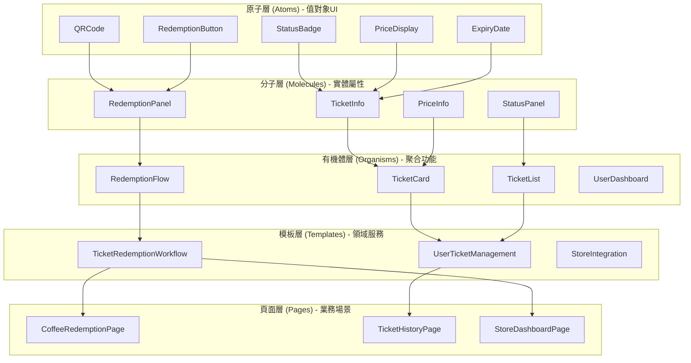
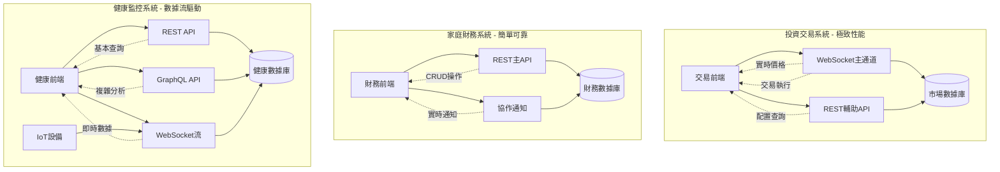
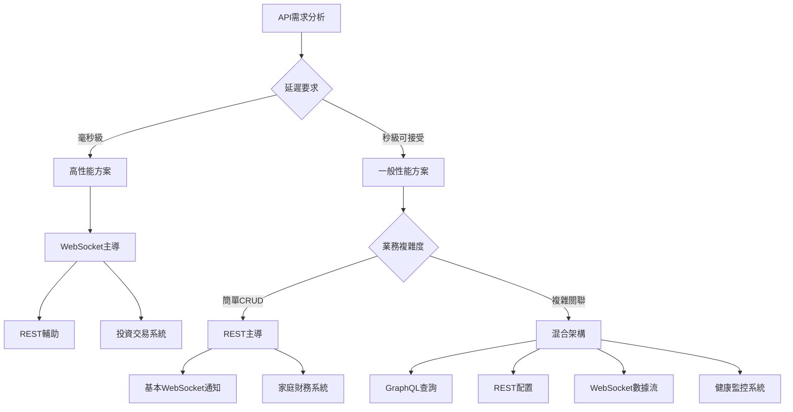
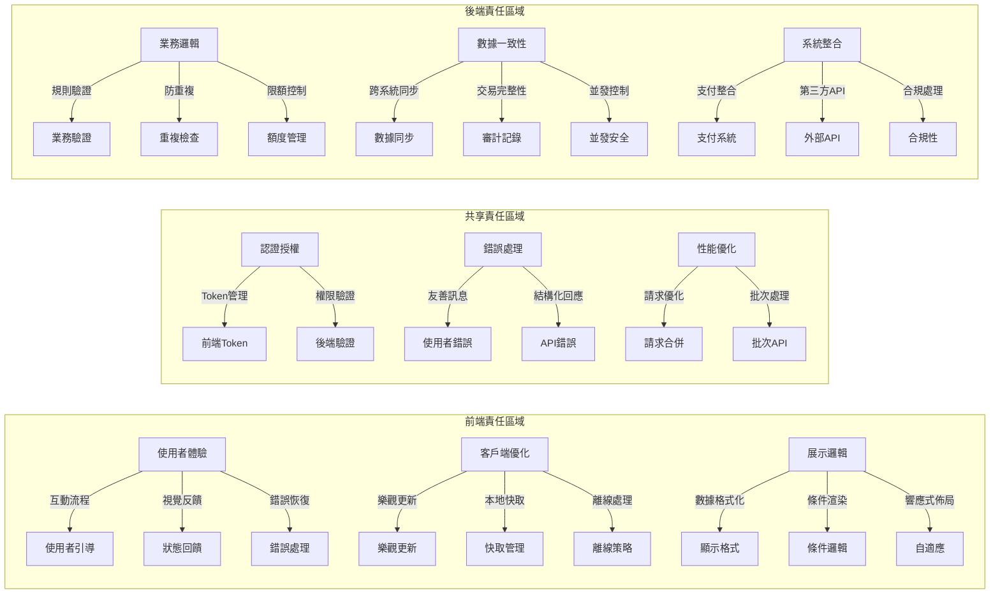

# Day 8 | 畫面元件模組設計系統化：設計系統與原子化架構導入

經過前七天從哲學思維到後端架構的完整建構，今天我們要解決一個關鍵問題：**如何將後端的聚合邊界和業務邏輯在前端實現系統化的組件設計？**

這不只是 UI 組件的技術問題，更是**從領域模型到使用者介面的完整映射工程**。每個前端組件都應該對應明確的業務概念，每個互動流程都應該反映領域邏輯的自然演進。

## 設計系統的本體論：從業務邏輯到視覺語言

### 重新定義「設計系統」的價值

傳統的設計系統往往只關注視覺一致性：

```
設計系統 = 顏色 + 字體 + 間距 + 組件庫
```

但基於 DDD 的設計系統應該體現**業務語言到視覺語言的系統化翻譯**：

```
DDD設計系統 = 領域概念 + 使用者意圖 + 互動模式 + 視覺表達
```

### 從聚合邊界到前端組件域的映射

以我們生活周遭常見的電子票券系統為例，我們可以建立這樣的映射關係：

**票券聚合 → 前端組件域映射**：

```typescript
// 後端聚合邊界
Ticket聚合 ↔ TicketDomain組件域
├── Ticket實體 ↔ TicketCard組件
├── RedemptionCode值對象 ↔ QRCodeDisplay組件
└── TicketStatus值對象 ↔ StatusIndicator組件

User聚合 ↔ UserDomain組件域
├── User實體 ↔ UserProfile組件
├── Preferences值對象 ↔ SettingsPanel組件
└── AuthToken值對象 ↔ AuthStatus組件
```

這種映射確保了前端組件與業務邏輯的一致性，每個組件都有明確的職責邊界。

同時，在設計複雜系統時，**認知負荷的分層管理**是前端架構與設計哲學的核心之一。

人類在理解資訊時，往往需要在不同抽象層次之間切換，我們可以將其劃分為三個主要層次：**概念層**、**感知層**與**翻譯層**。

```typescript
認知負荷的分層管理：
├── 概念層：業務邏輯的抽象表達
├── 感知層：視覺和互動的具體呈現
└── 翻譯層：概念與感知之間的對應機制
```

**概念層**負責承載業務邏輯的抽象表達，它是使用者與系統意圖的原始來源，**感知層**則是具體的視覺與互動呈現，確保抽象的意圖能以直觀、易懂的方式進入使用者心智模型，而**翻譯層**則扮演橋樑角色，將業務語言轉化為視覺語言，確保「抽象意圖」與「具體表達」之間能夠無縫對應。

這種「業務語言到視覺語言的翻譯哲學」體現於每一個前端組件之中。每個組件不僅是功能模組，更是一個語言轉譯的場域。

舉例來說，在投資交易系統中，抽象的業務概念「風險」往往會被翻譯為紅色警示的視覺符號，讓使用者在最短時間內直覺感知危險；「機會」則以綠色提示傳達正向信號，幫助投資人快速決策；而「不確定性」則常透過動態載入狀態呈現，讓系統的模糊性被感知為一種「等待」與「持續演算」。當然，這部分也根據文化背景有所差異，詳見美國股市與台灣股市數值標記顏色。

同樣的邏輯應用在家庭財務系統時，業務語言的抽象含義會轉化為不同的視覺策略。例如，「預算控制」常以進度條與警告符號來直觀展現收支平衡；「家庭協作」則透過多用戶狀態指示來讓成員之間的互動一目了然；「消費習慣」則以類別化圖表進行視覺化，幫助使用者將日常消費行為抽象為結構化的模式，從而形成對財務健康的直觀感知。

而在健康監控系統中，翻譯邏輯更注重「時間性」與「異常性」的直覺呈現。「生理週期」以時序動畫來傳遞動態變化，將抽象的週期概念具象化為可視的流動；「健康趨勢」則透過漸變色彩映射，讓使用者自然地感受到狀態的提升或衰退；至於「異常警示」，則以脈衝式提醒營造即時性與緊迫感，確保重要訊息能被即刻捕捉。

綜合來看，認知負荷分層管理不僅是一種設計技術，更是一種設計哲學。它讓系統從抽象到具體形成一條完整的翻譯鏈，使業務邏輯能夠被「視覺化」「感知化」「語境化」。

這種方法的價值在於，它不僅降低了使用者的認知壓力，也提升了系統在多樣場景中的可擴展性與可解釋性。這也是接下來我將講述 Atomic Design(原子設計) 最主要的原因。

## Atomic Design：領域概念的層次化實現

### Atomic Design 的 DDD 意義

Atomic Design 是一個脈絡清晰且解構需求的思維工具，它可以良好的協助我們由既有頁面結合語境或者說領域進行模組與元件的拆分，也可以從一片白地設計原子元件逐漸建構起完整系統。

Brad Frost 的 Atomic Design 方法論需在 DDD 語境下重新詮釋：

**原子（Atoms）**：領域值對象的 UI 表達

- Money、Status、Code 等基礎業務概念
- 這些是不可再分的業務意義單位

**分子（Molecules）**：領域實體的屬性組合

- 將相關的值對象組合成有意義的 UI 片段
- 對應實體的屬性群組

**有機體（Organisms）**：領域聚合的完整表達

- 完整的業務功能實現
- 對應聚合的核心能力

**模板（Templates）**：領域服務的協調層

- 跨聚合的業務流程
- 複雜使用者旅程的結構

**頁面（Pages）**：具體的業務場景實例

- 特定角色在特定情境下的完整操作

我們一樣借用票券系統進行簡單的範例

### 票券系統的 Atomic Design 實踐



**具體實現範例**：

```typescript
// 原子層：Status值對象的UI表達
interface StatusBadgeProps {
  status: TicketStatus;
  size?: "sm" | "md" | "lg";
  variant?: "filled" | "outlined";
}

const StatusBadge: React.FC<StatusBadgeProps> = ({
  status,
  size = "md",
  variant = "filled",
}) => {
  const getStatusConfig = (): StatusConfig => {
    switch (status) {
      case TicketStatus.AVAILABLE:
        return { color: "green", label: "可使用", icon: "check-circle" };
      case TicketStatus.USED:
        return { color: "gray", label: "已使用", icon: "check" };
      case TicketStatus.EXPIRED:
        return { color: "red", label: "已過期", icon: "x-circle" };
      case TicketStatus.PENDING:
        return { color: "yellow", label: "處理中", icon: "clock" };
    }
  };

  const config = getStatusConfig();

  return (
    <span className={`status-badge ${config.color} ${size} ${variant}`}>
      <Icon name={config.icon} />
      {config.label}
    </span>
  );
};

// 分子層：Ticket實體的屬性組合
interface TicketInfoProps {
  ticket: Ticket;
  showDetails?: boolean;
}

const TicketInfo: React.FC<TicketInfoProps> = ({
  ticket,
  showDetails = true,
}) => {
  return (
    <div className="ticket-info">
      <div className="ticket-header">
        <h3>{ticket.productName}</h3>
        <StatusBadge status={ticket.status} />
      </div>

      {showDetails && (
        <div className="ticket-details">
          <PriceDisplay
            amount={ticket.value}
            originalPrice={ticket.originalPrice}
          />
          <ExpiryDate date={ticket.expiryDate} />
          <div className="store-info">
            <span>適用店家：{ticket.applicableStores.join(", ")}</span>
          </div>
        </div>
      )}
    </div>
  );
};

// 有機體層：Ticket聚合的完整表達
interface TicketCardProps {
  ticket: Ticket;
  onRedeem?: (ticket: Ticket) => void;
  onViewDetails?: (ticket: Ticket) => void;
}

const TicketCard: React.FC<TicketCardProps> = ({
  ticket,
  onRedeem,
  onViewDetails,
}) => {
  const canRedeem = ticket.isRedeemable();
  const isNearExpiry = ticket.isNearExpiry();

  return (
    <div className={`ticket-card ${isNearExpiry ? "near-expiry" : ""}`}>
      <TicketInfo ticket={ticket} />

      {canRedeem && <RedemptionPanel ticket={ticket} onRedeem={onRedeem} />}

      <div className="ticket-actions">
        <button
          onClick={() => onViewDetails?.(ticket)}
          className="btn-secondary"
        >
          查看詳情
        </button>

        {canRedeem && (
          <button onClick={() => onRedeem?.(ticket)} className="btn-primary">
            立即使用
          </button>
        )}
      </div>

      {isNearExpiry && (
        <div className="expiry-warning">
          <Icon name="alert-triangle" />
          即將過期，請盡快使用
        </div>
      )}
    </div>
  );
};
```

## 前端架構邊界的認知對應

** 前端架構規劃的必要性：跨職能團隊的共同語言 **

結束了 Atomic Design 在領域概念的層次化實現後，我們來討論在近一步的概念: **設計完的元件與模組該如何放置**。

前端架構的組織不只是代碼結構，更是**認知域的劃分策略**。

許多工程師與客戶經常會認為「為什麼前端也需要講架構規劃？」、「前端開發不是只要把設計稿變成網頁嗎?」但現實中，前端系統的複雜度往往不亞於後端。

從產品經理（PM）的角度看前端架構，關心的是功能交付速度、用戶體驗品質、以及長期的產品演進能力。沒有良好架構的前端會導致以下問題：

- 功能開發週期越來越長：當 PM 提出一個看似簡單的需求「增加一個新的篩選條件」時，如果前端缺乏良好架構，開發團隊可能需要修改十幾個檔案，測試無數個頁面，原本預估 1 天的工作變成 1 週。這是因為相關邏輯散落在各處，沒有統一的管理機制。

- 用戶體驗不一致的風險：沒有架構規範的前端，容易出現同樣功能在不同頁面有不同的操作方式。比如「刪除」功能，在 A 頁面是紅色按鈕，在 B 頁面是文字連結，在 C 頁面需要雙擊確認。用戶需要重新學習每個頁面的操作邏輯，大大降低產品的易用性。

- 錯誤追蹤和問題定位困難：當用戶回報 bug 時，如果前端代碼結構混亂，開發團隊可能需要花費大量時間才能定位問題所在。這直接影響客服效率和用戶滿意度。

而從驗收前確保的角度來看，QA 工程師需要設計測試案例、執行回歸測試、確保產品品質。這些業務內容直接依賴於前端架構的好壞，會非常明顯且直接地影響測試工作的效率。

- 測試案例的可重用性：良好的前端架構會將相同的功能元件統一管理。比如「登入表單」如果在整個系統中都使用同一個元件，QA 只需要對這個元件進行一次完整測試，就能確保所有使用到這個元件的頁面都具備相同的品質保證。反之，如果每個頁面都有自己的登入表單實作，QA 就需要重複測試多次。

- 自動化測試的建立：結構化的前端架構更容易建立自動化測試。當元件有明確的輸入和輸出定義時，QA 可以更容易寫出穩定的測試腳本。而混亂的代碼結構會讓自動化測試變得脆弱，經常因為小幅修改就失效。

- 回歸測試的範圍控制：當某個功能發生變更時，良好的架構能讓 QA 清楚知道需要測試哪些相關功能。如果架構設計得當，修改「用戶資訊」元件只會影響特定的幾個頁面，而不是整個系統。

綜合來說，架構規劃就像城市規劃一樣，定義了不同功能區域的邊界和交互規則，如果沒有良好的架構規劃，這些代碼很快就會變成無法維護的「義大利麵條代碼」。

現代前端不再只是「展示層」，而是承載了大量的業務邏輯。用戶權限控制、數據驗證、狀態管理、錯誤處理等都需要在前端實現。沒有架構規劃，這些邏輯會散落在各處，難以測試和維護。

### 主流前端架構模式概覽

**傳統 MVC 架構在前端的演進**：

早期的前端開發主要採用 jQuery + 頁面模板(Pug、Gulp)的方式，但隨著單頁應用（SPA）的興起，前端需要更複雜的架構模式，以下將分別簡單介紹目前常見的架構策略:

**組件化架構（Component-Based Architecture）**、**功能導向架構（Feature-Based Architecture）**、**分層架構（Layered Architecture）**

**1. 組件化架構（Component-Based Architecture）**

這是目前最主流的前端架構模式，以 React、Vue、Angular 為代表：

```
專案根目錄/
├── src/
│   ├── components/           # 可重用組件
│   │   ├── Button/
│   │   ├── Modal/
│   │   └── DataTable/
│   ├── pages/               # 頁面級組件
│   │   ├── Home/
│   │   ├── Profile/
│   │   └── Settings/
│   ├── hooks/               # 自定義Hook（React）
│   ├── stores/              # 狀態管理
│   ├── services/            # API服務
│   └── utils/               # 工具函數
```

**適用場景**：中小型專案、團隊技術水平一般、需要快速開發
**優點**：學習曲線平緩、開發速度快、社群資源豐富
**缺點**：大型專案中容易出現組件職責不清、代碼重複

**2. 功能導向架構（Feature-Based Architecture）**

將代碼按業務功能進行組織，每個功能模組包含該功能的所有相關代碼：

```
專案根目錄/
├── src/
│   ├── features/
│   │   ├── authentication/
│   │   │   ├── components/
│   │   │   ├── hooks/
│   │   │   ├── services/
│   │   │   ├── stores/
│   │   │   └── types/
│   │   ├── user-management/
│   │   │   ├── components/
│   │   │   ├── hooks/
│   │   │   └── services/
│   │   └── product-catalog/
│   ├── shared/              # 共享資源
│   │   ├── components/
│   │   ├── hooks/
│   │   └── utils/
│   └── core/               # 核心功能
│       ├── api/
│       ├── auth/
│       └── routing/
```

**適用場景**：中大型專案、多團隊協作、業務邏輯複雜
**優點**：模組獨立性高、職責清晰、易於測試
**缺點**：初期設置複雜、需要更多的架構規劃

**3. 分層架構（Layered Architecture）**

將應用分為不同的邏輯層，每層負責特定的職責：

```
專案根目錄/
├── src/
│   ├── presentation/        # 展示層
│   │   ├── components/
│   │   ├── pages/
│   │   └── layouts/
│   ├── application/         # 應用層
│   │   ├── stores/
│   │   ├── hooks/
│   │   └── services/
│   ├── domain/              # 領域層
│   │   ├── entities/
│   │   ├── repositories/
│   │   └── use-cases/
│   └── infrastructure/      # 基礎設施層
│       ├── api/
│       ├── storage/
│       └── external-services/
```

**適用場景**：企業級應用、長期維護專案、複雜業務邏輯
**優點**：職責分離清晰、易於測試、符合 SOLID 原則
**缺點**：學習曲線陡峭、初期開發速度較慢

### Core-Shared-Feature vs NextJS DDD 架構比較

**Core-Shared-Feature 架構深度分析**：

這種架構將代碼分為三個主要層級，每個層級都有明確的職責邊界：

```
src/
├── core/                    # 核心層：應用的基礎設施
│   ├── api/
│   │   ├── client.ts        # API客戶端配置
│   │   ├── interceptors.ts  # 請求/響應攔截器
│   │   └── endpoints.ts     # API端點定義
│   ├── auth/
│   │   ├── AuthContext.tsx  # 認證上下文
│   │   ├── AuthGuard.tsx    # 路由守衛
│   │   └── auth.service.ts  # 認證服務
│   ├── router/
│   │   ├── Router.tsx       # 路由配置
│   │   ├── routes.ts        # 路由定義
│   │   └── guards.ts        # 路由守衛邏輯
│   ├── store/
│   │   ├── index.ts         # 狀態管理根配置
│   │   ├── middleware.ts    # 中間件
│   │   └── persistConfig.ts # 持久化配置
│   └── types/
│       ├── api.ts           # API相關類型
│       ├── auth.ts          # 認證相關類型
│       └── common.ts        # 通用類型
├── shared/                  # 共享層：可重用的組件和邏輯
│   ├── components/
│   │   ├── ui/              # 基礎UI組件
│   │   │   ├── Button/
│   │   │   │   ├── Button.tsx
│   │   │   │   ├── Button.test.tsx
│   │   │   │   ├── Button.stories.tsx
│   │   │   │   └── index.ts
│   │   │   ├── Input/
│   │   │   ├── Modal/
│   │   │   └── Table/
│   │   ├── layout/          # 佈局組件
│   │   │   ├── Header/
│   │   │   ├── Sidebar/
│   │   │   └── Footer/
│   │   └── form/            # 表單組件
│   │       ├── FormField/
│   │       ├── Validation/
│   │       └── FormBuilder/
│   ├── hooks/
│   │   ├── useApi.ts        # API調用Hook
│   │   ├── useDebounce.ts   # 防抖Hook
│   │   ├── useLocalStorage.ts # 本地存儲Hook
│   │   └── usePermission.ts # 權限檢查Hook
│   ├── utils/
│   │   ├── formatters.ts    # 格式化工具
│   │   ├── validators.ts    # 驗證工具
│   │   ├── constants.ts     # 常量定義
│   │   └── helpers.ts       # 輔助函數
│   └── services/
│       ├── storage.service.ts # 存儲服務
│       ├── notification.service.ts # 通知服務
│       └── analytics.service.ts # 分析服務
└── features/                # 功能層：具體的業務功能
    ├── authentication/
    │   ├── components/
    │   │   ├── LoginForm/
    │   │   │   ├── LoginForm.tsx
    │   │   │   ├── LoginForm.test.tsx
    │   │   │   └── useLoginForm.ts
    │   │   ├── RegisterForm/
    │   │   └── PasswordReset/
    │   ├── pages/
    │   │   ├── LoginPage.tsx
    │   │   ├── RegisterPage.tsx
    │   │   └── ForgotPasswordPage.tsx
    │   ├── store/
    │   │   ├── authSlice.ts # Redux Toolkit slice
    │   │   └── authThunks.ts # 異步操作
    │   ├── services/
    │   │   └── auth.api.ts  # 認證相關API
    │   ├── types/
    │   │   └── auth.types.ts # 認證相關類型
    │   └── utils/
    │       └── authHelpers.ts
    ├── user-management/
    │   ├── components/
    │   │   ├── UserList/
    │   │   ├── UserForm/
    │   │   └── UserProfile/
    │   ├── pages/
    │   │   ├── UsersPage.tsx
    │   │   └── UserDetailPage.tsx
    │   ├── store/
    │   │   └── userSlice.ts
    │   └── services/
    │       └── user.api.ts
    └── dashboard/
        ├── components/
        │   ├── StatsCard/
        │   ├── ChartWidget/
        │   └── RecentActivity/
        ├── pages/
        │   └── DashboardPage.tsx
        └── hooks/
            └── useDashboardData.ts
```

**Core-Shared-Feature 的優勢**：

1. **清晰的職責分離**：Core 層處理應用基礎設施，Shared 層提供可重用組件，Feature 層實現具體業務功能。每個層級的職責非常明確，新加入團隊的工程師可以快速理解代碼結構。

2. **高度的可重用性**：Shared 層的組件和工具可以在多個 Feature 中重用，避免代碼重複。當你需要在多個功能中使用相同的 UI 組件或業務邏輯時，只需要從 Shared 層引用即可。

3. **易於測試**：每個層級都可以獨立測試。Core 層的基礎服務可以進行單元測試，Shared 層的組件可以進行組件測試，Feature 層的業務邏輯可以進行集成測試。

4. **團隊協作友好**：不同的團隊可以負責不同的 Feature，而 Core 和 Shared 層可以由架構團隊統一維護。這樣可以避免多個團隊修改同一份代碼造成的衝突。

**Core-Shared-Feature 的劣勢**：

1. **初期設置複雜**：需要預先設計好各層的邊界和接口，對架構設計能力要求較高。如果邊界設計不當，後期重構成本會很高。

2. **Feature 間依賴管理**：當 Feature 之間需要共享某些邏輯時，需要仔細考慮是否應該提升到 Shared 層，還是通過其他方式解決依賴問題。

3. **學習曲線**：新手工程師需要理解整個架構的設計理念，才能正確地在各層之間組織代碼。

**NextJS DDD 架構深度分析**：

NextJS 結合 Domain-Driven Design 的架構更加注重領域建模和業務邏輯的組織：

```
src/
├── app/                     # NextJS 13+ App Router
│   ├── (auth)/             # 路由群組
│   │   ├── login/
│   │   │   └── page.tsx
│   │   └── register/
│   │       └── page.tsx
│   ├── dashboard/
│   │   ├── page.tsx
│   │   └── layout.tsx
│   ├── users/
│   │   ├── page.tsx
│   │   ├── [id]/
│   │   │   └── page.tsx
│   │   └── loading.tsx
│   ├── api/                # API Routes
│   │   ├── auth/
│   │   │   └── route.ts
│   │   └── users/
│   │       └── route.ts
│   ├── globals.css
│   ├── layout.tsx
│   └── page.tsx
├── domains/                 # 領域層
│   ├── auth/
│   │   ├── entities/
│   │   │   ├── User.ts     # 用戶實體
│   │   │   └── Session.ts  # 會話實體
│   │   ├── repositories/
│   │   │   └── UserRepository.ts
│   │   ├── services/
│   │   │   ├── AuthService.ts
│   │   │   └── UserService.ts
│   │   ├── value-objects/
│   │   │   ├── Email.ts
│   │   │   └── Password.ts
│   │   └── use-cases/
│   │       ├── LoginUseCase.ts
│   │       ├── RegisterUseCase.ts
│   │       └── LogoutUseCase.ts
│   ├── user-management/
│   │   ├── entities/
│   │   │   └── UserProfile.ts
│   │   ├── repositories/
│   │   │   └── UserProfileRepository.ts
│   │   ├── services/
│   │   │   └── UserManagementService.ts
│   │   └── use-cases/
│   │       ├── GetUserListUseCase.ts
│   │       ├── CreateUserUseCase.ts
│   │       └── UpdateUserUseCase.ts
│   └── shared/
│       ├── entities/
│       │   └── BaseEntity.ts
│       ├── value-objects/
│       │   ├── Id.ts
│       │   └── DateRange.ts
│       └── interfaces/
│           ├── Repository.ts
│           └── UseCase.ts
├── infrastructure/          # 基礎設施層
│   ├── database/
│   │   ├── prisma/
│   │   │   ├── schema.prisma
│   │   │   └── migrations/
│   │   └── repositories/
│   │       ├── PrismaUserRepository.ts
│   │       └── PrismaUserProfileRepository.ts
│   ├── external-services/
│   │   ├── EmailService.ts
│   │   └── PaymentService.ts
│   ├── auth/
│   │   └── NextAuthConfig.ts
│   └── api/
│       └── ApiClient.ts
├── presentation/            # 展示層
│   ├── components/
│   │   ├── auth/
│   │   │   ├── LoginForm.tsx
│   │   │   └── RegisterForm.tsx
│   │   ├── users/
│   │   │   ├── UserList.tsx
│   │   │   └── UserCard.tsx
│   │   └── shared/
│   │       ├── Button.tsx
│   │       ├── Input.tsx
│   │       └── Modal.tsx
│   ├── hooks/
│   │   ├── useAuth.ts
│   │   └── useUsers.ts
│   └── providers/
│       ├── AuthProvider.tsx
│       └── QueryProvider.tsx
└── application/             # 應用層
    ├── dto/
    │   ├── auth/
    │   │   ├── LoginDto.ts
    │   │   └── RegisterDto.ts
    │   └── users/
    │       ├── CreateUserDto.ts
    │       └── UpdateUserDto.ts
    ├── handlers/
    │   ├── auth/
    │   │   ├── LoginHandler.ts
    │   │   └── RegisterHandler.ts
    │   └── users/
    │       ├── GetUsersHandler.ts
    │       └── CreateUserHandler.ts
    └── middleware/
        ├── AuthMiddleware.ts
        └── ValidationMiddleware.ts
```

**NextJS DDD 的優勢**：

1. **業務邏輯中心化**：Domain 層包含了所有的業務邏輯和業務規則，使得業務邏輯與技術實現分離。當業務需求變化時，主要修改 Domain 層即可，其他層的影響最小。

2. **全棧一致性**：前後端共享相同的領域模型和業務邏輯，減少了前後端的認知負荷和溝通成本。API 的設計也更加符合業務邏輯。

3. **可測試性極佳**：Domain 層的業務邏輯可以完全脫離技術細節進行測試，Use Case 可以通過依賴注入的方式進行單元測試。

4. **技術無關性**：Domain 層不依賴任何特定的技術或框架，當需要切換技術棧時，業務邏輯可以保持不變。

**NextJS DDD 的劣勢**：

1. **學習曲線陡峭**：需要深入理解 DDD 的概念和設計模式，對團隊的技術水平要求較高。Junior 工程師可能需要較長時間才能掌握。

2. **初期開發速度慢**：需要設計實體、值對象、用例等多個層次的抽象，初期的開發速度會比較慢。

3. **過度設計風險**：對於簡單的 CRUD 應用，DDD 可能會引入不必要的複雜性。需要根據專案規模和複雜度來判斷是否適用。

### 架構選擇的決策框架

**專案規模驅動的架構選擇**：

1. **小型專案（< 10 個頁面，< 3 個開發者）**：

   - 推薦：簡單的組件化架構
   - 理由：快速開發，減少過度設計

2. **中型專案（10-50 個頁面，3-10 個開發者）**：

   - 推薦：Core-Shared-Feature 架構
   - 理由：平衡了開發效率和代碼組織

3. **大型專案（> 50 個頁面，> 10 個開發者）**：
   - 推薦：NextJS DDD 架構或微前端架構
   - 理由：複雜的業務邏輯需要更嚴格的架構約束

**團隊技術水平的考量**：

- **Junior 團隊**：選擇學習曲線平緩的架構，重點是可理解性和開發效率
- **Senior 團隊**：可以選擇更複雜但長期收益更高的架構，重點是可維護性和擴展性
- **混合團隊**：選擇有明確邊界的架構，讓不同水平的開發者可以在不同層級工作

**業務特性的影響**：

- **快速迭代的產品**：選擇開發速度優先的架構
- **長期維護的產品**：選擇可維護性優先的架構
- **多團隊協作的產品**：選擇模組化程度高的架構

## API 設計策略與前後端協作邊界

### 核心設計原則

在一個良好治理的前後端協作體系裡，我們通常以**「意圖—契約—傳輸—一致性—觀測」作為五層骨架**。首先由業務意圖定義可度量的體驗與資料時效性；其次以契約\*\*（contract）固定邊界與可預期性；再選擇合適的傳輸形態把資料交接到位；同時以一致性策略確保讀寫語義符合業務風險；最後用觀測完善可測、可追、可回溯的體驗閉環。

在**契約與邊界**上，採用 contract-first 與版本治理（REST/OpenAPI、GraphQL SDL、gRPC/proto）能把跨團隊風險降到最低：前端以型別化 DTO（或 GraphQL fragments）對齊顯示模型，避免把資料庫形狀外洩到 UI；後端承擔業務規則、權限與資料一致性的**「最後責任」**，前端只處理呈現與體驗（含樂觀更新、錯誤回復與離線策略）。

總的來說，前後端協作與 API 設計的成熟度，不在於堆了多少協議，而在於能否根據業務特性用清晰的契約把責任與風險前置，並以適配的傳輸與一致性語義，讓體驗、效能與正確性同時成立。

以下基於業務特性簡易探討適合的 API 協議設計

基於業務特性選擇最適合的 API 技術棧：

- **高頻交易系統**：WebSocket 主導 + REST 輔助
- **家庭財務系統**：REST 主導 + 基本 WebSocket
- **健康監控系統**：混合式架構（REST + GraphQL + WebSocket）

### 投資交易系統

```typescript
// 核心策略：WebSocket + 優先級消息隊列
class TradingAPI {
  // WebSocket主通道：實時交易和市場數據
  // REST輔助：配置和歷史查詢
  // 關鍵：毫秒級延遲優化
}
```

### 家庭財務系統

```typescript
// 核心策略：REST + 簡單WebSocket通知
class FamilyFinanceAPI {
  // REST主導：簡單CRUD操作
  // WebSocket輔助：協作通知
  // 關鍵：開發維護簡單
}
```

### 健康監控系統

```typescript
// 核心策略：REST + GraphQL + WebSocket混合
class HealthMonitorAPI {
  // REST：基本查詢和配置
  // GraphQL：複雜關聯分析
  // WebSocket：IoT數據流和告警
  // 關鍵：數據類型優化策略
}
```

## 技術選型指導原則

| 系統特性   | 推薦技術棧     | 應用場景             |
| ---------- | -------------- | -------------------- |
| 超低延遲   | WebSocket 主導 | 交易、遊戲、即時協作 |
| 簡單可靠   | REST 主導      | 企業內部、小型應用   |
| 複雜查詢   | GraphQL 補強   | 數據分析、個性化服務 |
| 數據流處理 | 混合架構       | IoT、監控、社交媒體  |

## 三業務情境系統架構對比



## API 技術選型決策樹



## 前後端責任邊界劃分



## 邊界協調最佳實踐

1. **清晰的責任劃分**：避免前後端邏輯重複
2. **統一的錯誤處理**：結構化錯誤回應機制
3. **性能協同優化**：前端快取+後端批次處理
4. **安全策略一致**：Token 管理和權限驗證協調
5. **監控和日誌**：全鏈路追踪和問題定位

## 為 Day 9 的高併發架構建立基礎

簡短的進行前端架構的討論後，明天我們將回頭探討架構情境與 AWS：

### 資料密集型的應用策略

- **請求優化與批次處理**：減少網路開銷，提升用戶體驗
- **狀態同步與衝突解決**：多用戶併發操作的處理

### 微服務架構

- **斷路器模式**：故障隔離和優雅降級
- **分散式追蹤**：跨服務的用戶操作追蹤和除錯

### AWS 高併發架構的優化

- **CDN 與邊緣計算**：如何最大化 CloudFront 的效益
- **Lambda@Edge**：邊緣執行策略
- **API Gateway 限流**：限流回應處理

## 今日的系統化收穫

- **設計系統是業務語言的視覺翻譯**：每個設計決策都應該反映業務概念
- **Atomic Design + DDD = 有機的組件層次**：從值對象到聚合的自然映射
- **Core-Share-Feature v.s DDD 分層架構體現領域邊界**：前端架構權衡與對應後端聚合邊界

記住：我們今天建立的不是 UI 框架，而是業務邏輯在視覺層的系統化表達。每個組件都承載著特定的業務語義，每個設計決策都應該服務於使用者的業務目標。

---

> 「組件不是 UI 的積木，而是業務概念的視覺化載體。我們設計的不是介面，而是使用者與業務領域對話的媒介。真正的設計系統，是讓複雜的業務邏輯變得直觀可感的翻譯藝術。」
