# Day 9 | 高併發與限流設計：如何避免資源瓶頸

昨天我們建立了三套 API 架構：投資交易的 WebSocket 主導、家庭財務的 REST 簡化、健康監控的混合策略。今天要解決一個更本質的問題：**當系統面臨大量併發請求時，如何設計資料流架構以避免瓶頸，並為快取最佳化奠定基礎？**

這不只是技術容量規劃問題，更是**資料密集型應用的架構哲學**。正如 Martin Kleppmann 在《Designing Data-Intensive Applications》中指出的：現代系統的挑戰不是計算密集，而是如何在**可靠性、可擴展性、可維護性**的約束下處理資料流。

## 高併發的本質：資料流模式與存取特徵

### 重新認識「高併發」的本質

傳統上我們把高併發理解為「同時處理大量請求」，但 Kleppmann 提出了更深刻的視角：

**併發不是量的問題，而是質的挑戰**：

```
傳統觀點：併發 = 每秒處理的請求數量
資料密集觀點：併發 = 在數據一致性約束下的協調複雜度
```

**三大支柱(Reliability、Scalability、Maintainability)在併發場景下的體現**：

**可靠性（Reliability）**：系統在部分組件失效時仍能正確工作

- 投資交易：交易指令不能遺失或重複執行
- 家庭財務：支出記錄不能因併發而產生不一致
- 健康監控：設備數據不能因網路問題而永久遺失

**可擴展性（Scalability）**：系統能應對增長的負載

- 水平擴展：增加更多機器
- 垂直擴展：增強單機性能
- 功能擴展：系統複雜度的管理

**可維護性（Maintainability）**：系統能被有效操作、理解、和修改

- 可觀測性：能理解系統運行狀況
- 可操作性：能有效地保持系統運行
- 簡單性：管理複雜度，避免意外複雜性

傳統上我們把高併發理解為「同時處理大量請求」，但從系統架構角度看，併發本質上是**資料流模式的管理挑戰**：

### 併發瓶頸議題系統化識別

| 層級         | 指標名稱                            | 說明                                         | 常見檢測工具 / 方法                        |
| ------------ | ----------------------------------- | -------------------------------------------- | ------------------------------------------ |
| **應用層**   | 吞吐量 (Throughput / RPS/QPS)       | 每秒可處理的請求數，衡量系統承載能力         | JMeter, k6, Locust, New Relic              |
|              | 響應延遲 (Response Latency)         | 請求從進入到回應的耗時，通常關注 P50/P95/P99 | APM (Datadog, New Relic), OpenTelemetry    |
|              | 錯誤率 (Error Rate)                 | HTTP 4xx/5xx 比例，反映應用健壯性            | APM, ELK, Sentry                           |
|              | 併發連線數 (Concurrent Connections) | 同時處理的使用者/會話數量                    | 系統監控 (Prometheus, Grafana)             |
|              | 任務排隊長度 (Queue Length)         | Thread pool、任務隊列積壓狀況                | Micrometer, RabbitMQ/Kafka metrics         |
|              | 資源等待時間 (Wait Time)            | DB 連線池、API Gateway 排隊耗時              | APM Trace, pgbouncer stats                 |
|              | 記憶體/GC 行為                      | GC 停頓、Heap 使用率，影響應用反應時間       | JVisualVM, JFR, Prometheus Exporter        |
| **資料庫層** | 查詢延遲 (Query Latency)            | 單次 SQL 查詢或交易的耗時                    | MySQL Slow Query Log, pg_stat_statements   |
|              | 每秒查詢數 (QPS/TPS)                | 資料庫吞吐量                                 | MySQL performance_schema, Postgres metrics |
|              | 慢查詢比率 (Slow Query %)           | 超過閾值的查詢比例                           | 慢查詢日誌分析, pt-query-digest            |
|              | 索引命中率 (Index Hit Ratio)        | 查詢是否有效利用索引                         | EXPLAIN, pg_stat_user_indexes              |
|              | 快取命中率 (Cache Hit Ratio)        | DB buffer pool / Redis/Memcached 命中率      | MySQL InnoDB metrics, Redis INFO           |
|              | 鎖等待/死鎖 (Lock Waits/Deadlocks)  | 交易衝突造成的等待或死鎖                     | MySQL Performance Schema, pg_locks         |
|              | 連線池使用率                        | 連線池資源是否飽和                           | HikariCP metrics, pgbouncer stats          |

而在我們的主要討論情境中，資料流特徵如下

**三系統的資料流特徵分析**：

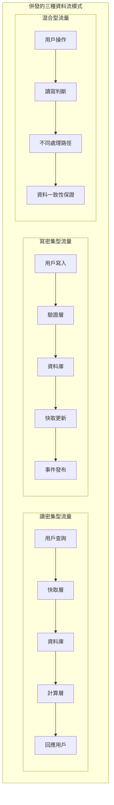

| 系統     | 主要流量模式                | 存取模式 | 一致性需求 | 快取友善度 |
| -------- | --------------------------- | -------- | ---------- | ---------- |
| 投資交易 | 讀密集(90%) + 關鍵寫入(10%) | 熱點集中 | 強一致性   | 高         |
| 家庭財務 | 讀寫平衡(60:40)             | 分散均勻 | 最終一致性 | 中         |
| 健康監控 | 寫密集(70%) + 分析讀取(30%) | 時序模式 | 時序一致性 | 低         |

當我們談論併發時，最重要的是理解**預防勝於治療**的哲學：如何在設計階段就避免效能瓶頸，而不是等問題發生後再去救火。

---

## 第一部分：應用層效能瓶頸預防 - 四大核心概念(連接池思維-異步處理思維-緩存思維-批處理思維)

### 概念一：連接池思維 - 「資源複用的智慧」

**核心理念**：想像一下公共圖書館的座位管理

- 如果每個讀者來都要搬桌椅，走時又要收拾，效率會很低
- 圖書館預先準備好座位，讀者來了直接坐，走了留給下一個人
- 資料庫連接池就是這個道理

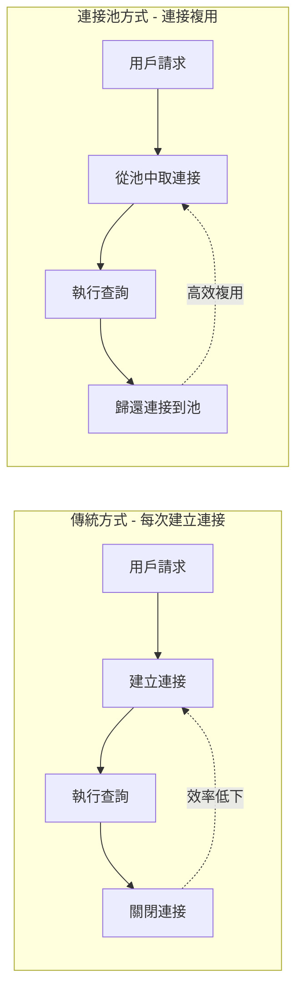

**關鍵思維點**：

- **預分配**：提前準備好資源，避免臨時創建的開銷
- **複用性**：一個連接可以被多個請求輪流使用
- **邊界控制**：設定最小和最大連接數，避免資源浪費或不足

### 概念二：異步處理思維 - 「時間與空間的解耦」

**核心理念**：想像餐廳的點餐流程

- 傳統方式：顧客點餐 → 廚師做菜 → 顧客等待 → 上菜 → 結帳
- 異步方式：顧客點餐 → 拿號碼牌離開 → 廚師做菜 → 叫號取餐

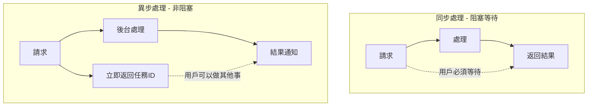

**關鍵思維點**：

- **解耦時間**：處理時間和響應時間分離
- **提升吞吐量**：同樣時間內可以接受更多請求
- **用戶體驗**：用戶不用傻等，可以去做其他事情

### 概念三：緩存思維 - 「記憶的層次結構」

**核心理念**：就像人的記憶系統

- **短期記憶**：剛剛記住的電話號碼（本地緩存）
- **長期記憶**：熟悉的朋友電話（分散式緩存）
- **外部記憶**：電話簿查找（資料庫）

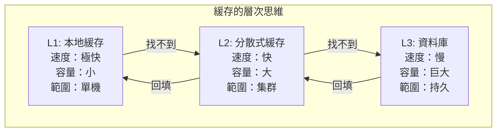

**關鍵思維點**：

- **就近原則**：越靠近用戶的數據訪問越快
- **熱點集中**：經常用的數據放在快速存取的地方
- **容量交換**：用空間換時間，用成本換效能

### 概念四：批處理思維 - 「批量的經濟效應」

**核心理念**：就像快遞配送的邏輯

- 不會每收到一個包裹就派車送一次
- 而是積累到一定數量，或到了特定時間，統一配送

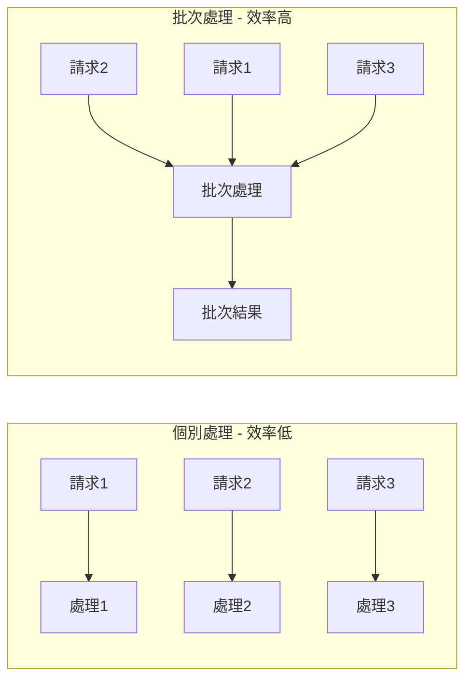

**關鍵思維點**：

- **聚合效應**：多個小任務合併成一個大任務
- **攤薄成本**：固定開銷被多個操作分擔
- **時間權衡**：稍微延遲換取更高的整體效率

---

## 第二部分：資料層效能瓶頸預防 - 四大核心策略( 索引思維-查詢優化思維-分區分片思維-讀寫分離思維 )

### 策略一：索引思維 - 「資料的目錄系統」

**核心理念**：就像圖書館的分類系統

- 沒有目錄：要找一本書必須一排排翻找
- 有了目錄：直接查目錄，快速定位到具體位置

```mermaid
graph TB
    subgraph "索引的本質思維"
        subgraph "沒有索引"
            N1[全表掃描] --> N2[逐行檢查] --> N3[找到目標]
            N2 -.->|效率：O(n)| N3
        end

        subgraph "有索引"
            H1[索引查找] --> H2[直接定位] --> H3[獲取數據]
            H2 -.->|效率：O(log n)| H3
        end
    end
```

**關鍵思維點**：

- **空間換時間**：用額外存儲空間來換取查詢速度
- **選擇性原則**：索引的效果取決於數據的獨特性
- **維護成本**：索引需要在數據變更時同步更新

### 策略二：查詢優化思維 - 「提問的藝術」

**核心理念**：就像向人詢問信息的技巧

- 糟糕的提問：「你知道所有關於這個人的事情嗎？」
- 優秀的提問：「你知道張三的電話號碼嗎？」

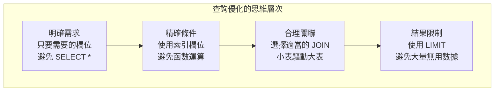

**關鍵思維點**：

- **精確表達**：越具體的查詢條件，系統越容易優化
- **最小原則**：只取需要的，不取多餘的
- **路徑最優**：選擇最有效的數據訪問路徑

### 策略三：分區分片思維 - 「分而治之的智慧」

**核心理念**：就像管理一個巨大的圖書館

- 單一圖書館：所有書都放在一起，查找困難
- 分館管理：按主題分成多個小館，各自獨立管理

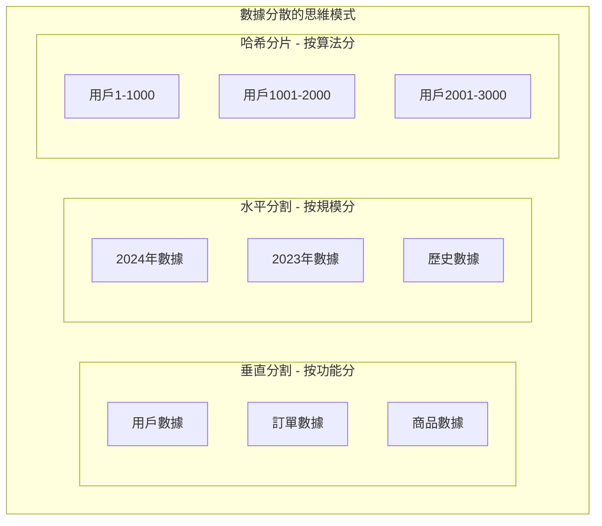

**關鍵思維點**：

- **規模控制**：將大問題分解為多個小問題
- **並行處理**：多個分片可以同時工作
- **局部性**：相關數據放在一起，減少跨分片查詢

### 策略四：讀寫分離思維 - 「專業分工的效率」

**核心理念**：就像醫院的分工模式

- 掛號處：專門處理登記（寫入操作）
- 諮詢台：專門回答問題（讀取操作）
- 各司其職，互不干擾

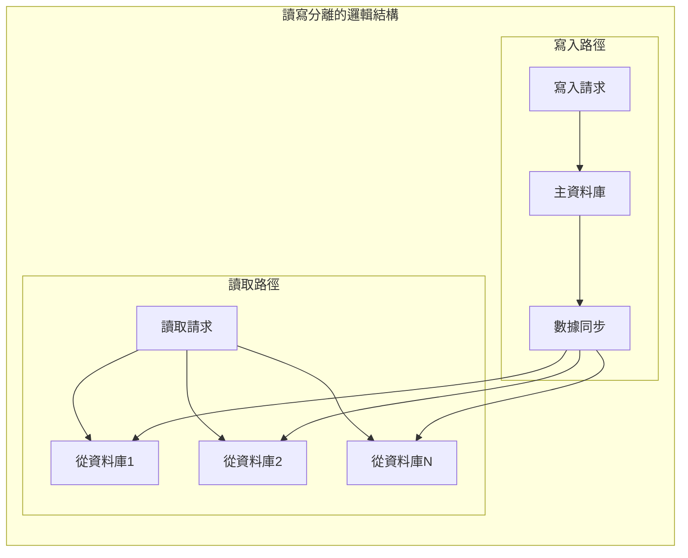

**關鍵思維點**：

- **職責分離**：讀和寫操作使用不同的資源
- **負載分散**：多個讀取副本分擔查詢壓力
- **一致性權衡**：接受短暫的數據延遲來換取性能

---

## 第三部分：系統協調優化 - 整體思維 ( 緩存一致性-事務邊界 )

### 概念一：緩存一致性 - 「同步的藝術」

**核心挑戰**：想像多個人同時編輯同一份文檔

- 如何確保每個人看到的都是最新版本？
- 如何處理衝突？
- 如何平衡效率和準確性？

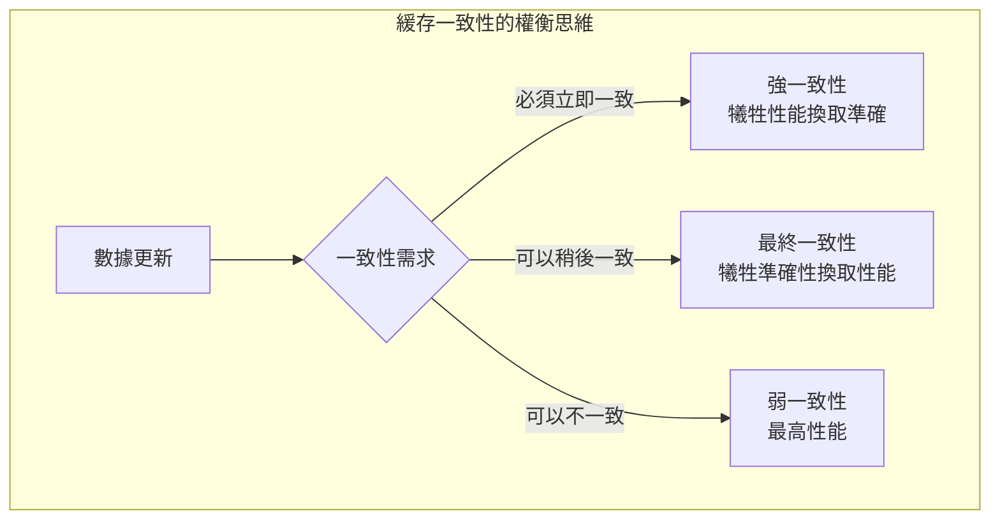

### 概念二：事務邊界 - 「責任的範圍」

**核心理念**：就像簽合約的邏輯

- 合約範圍太大：風險高，容易出問題
- 合約範圍太小：效率低，來回簽約
- 合適的範圍：責任明確，風險可控

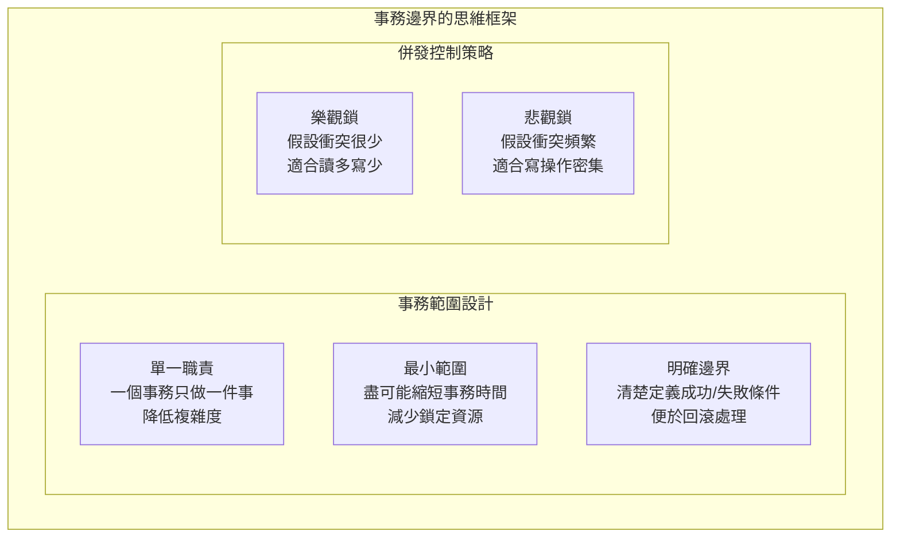

---

## 第四部分：限流設計的抽象模型：保護與引導的平衡

### 限流的三重目標

限流不僅是保護系統資源，更是**資料流量的智能調節機制**：

**保護（Protection）**：防止系統過載
**引導（Guidance）**：優化資源使用效率  
**預測（Prediction）**：為快取預熱提供資料

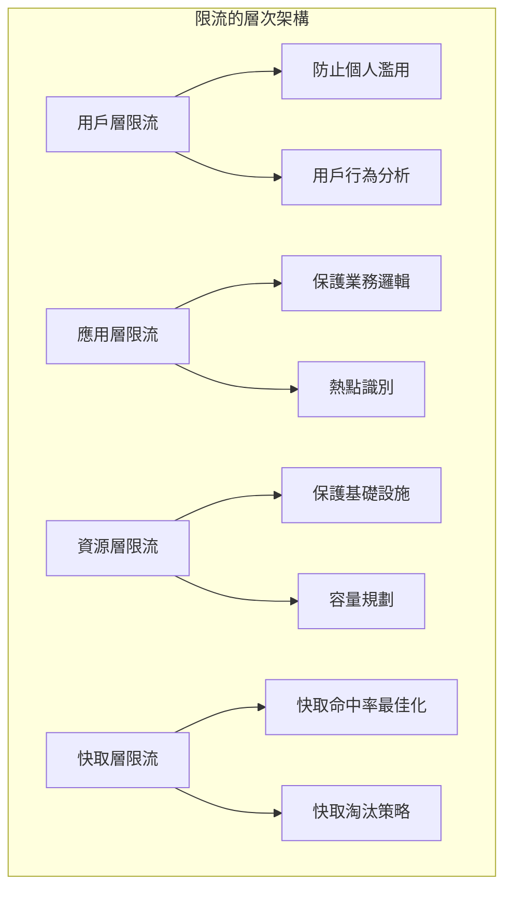

### 3.1 限流的系統化設計哲學

**FluxNinja 的 2x2 框架**提供了 2024 年限流設計的標準方法論，將限流策略分為四個象限，每個象限對應不同的業務場景和技術實現：

```mermaid
quadrantChart
    title 限流策略選擇的2x2框架
    x-axis 靜態策略 --> 自適應策略
    y-axis 全局限流 --> 每用戶限流

    quadrant-1 智能個人化限流
        : Netflix用戶級並發控制
        : Stripe每客戶API配額
        : 實現40%性能提升

    quadrant-2 企業級全局限流
        : AWS API Gateway
        : 雲服務總量控制
        : 保護基礎設施

    quadrant-3 基礎服務保護
        : 傳統Rate Limiting
        : 固定QPS閾值
        : 簡單可靠

    quadrant-4 智能流量控制
        : 自適應並發限制
        : 基於延遲反饋
        : 平均延遲降低35%
```

### 3.2 自適應限流算法的核心突破

**Netflix 自適應並發限制算法**基於 Little's Law 實現了限流領域的重大突破：

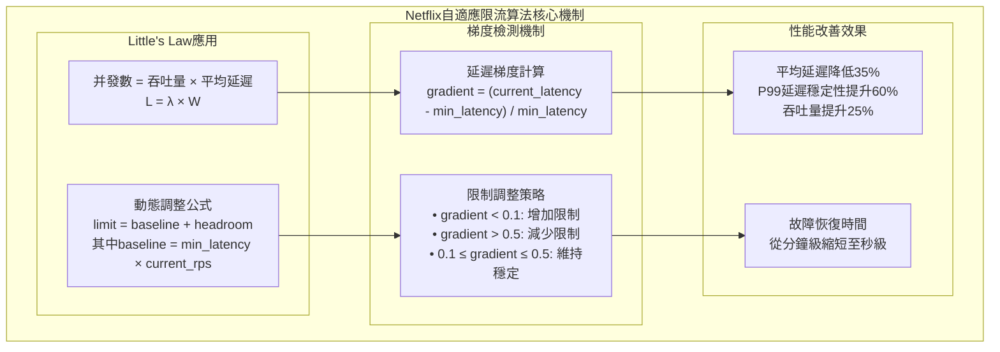

### 3.3 演算法性能基準與選擇策略

基於 2024 年最新壓力測試數據，不同限流算法在標準化場景下的性能表現：

```mermaid
xychart-beta
    title "限流算法性能基準對比（10K併發請求）"
    x-axis [Token_Bucket, Sliding_Window, Fixed_Window, Leaky_Bucket]
    y-axis "QPS處理能力" 0 50000
    bar [45000, 42000, 38000, 35000]
```

```mermaid
xychart-beta
    title "P99延遲表現對比"
    x-axis [Token_Bucket, Sliding_Window, Fixed_Window, Leaky_Bucket]
    y-axis "延遲(ms)" 0 30
    line [12, 15, 22, 18]
```

**演算法選擇決策樹**：

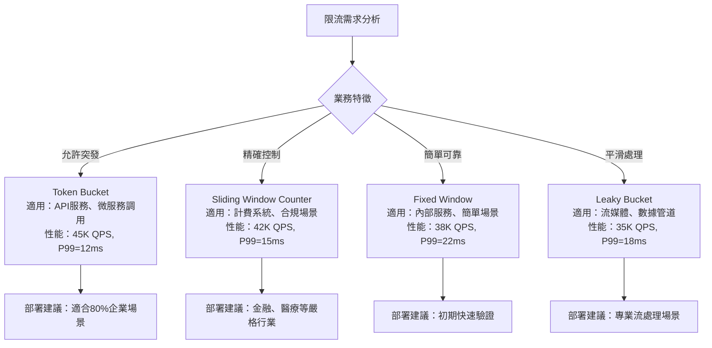

## 總結：效能優化的核心哲學

### 設計原則的層次思維

```mermaid
pyramid
    title 效能優化的智慧金字塔
    "預防設計" : 40
    "監控預警" : 30
    "問題診斷" : 20
    "緊急救火" : 10
```

**第一層：預防設計（最重要）**

- 在系統設計階段就考慮併發和擴展性
- 選擇合適的架構模式和技術方案
- 建立合理的資源配置和邊界設定

**第二層：監控預警**

- 建立完善的監控體系
- 設定合理的告警閾值
- 提前發現潛在問題

**第三層：問題診斷**

- 快速定位效能瓶頸
- 分析根本原因
- 制定針對性解決方案

**第四層：緊急救火**

- 臨時性能調優
- 緊急擴容
- 應急降級方案

### 實務應用的思考框架

當我們面對一個系統設計問題時，需要且必要問自己這些問題：

1. **資源複用**：這個操作可以重複利用已有資源嗎？
2. **異步解耦**：這個處理必須立即完成嗎？可以異步處理嗎？
3. **緩存加速**：這個數據會被重複訪問嗎？可以緩存嗎？
4. **批量處理**：多個類似操作可以合併處理嗎？
5. **分而治之**：這個大問題可以分解成小問題嗎？
6. **專業分工**：不同類型的操作可以分別處理嗎？

記住：**最好的效能優化是在設計階段就避免效能問題，而不是在出現問題後才去解決。**

## AWS 最佳實踐總結

### AWS 服務選擇指南

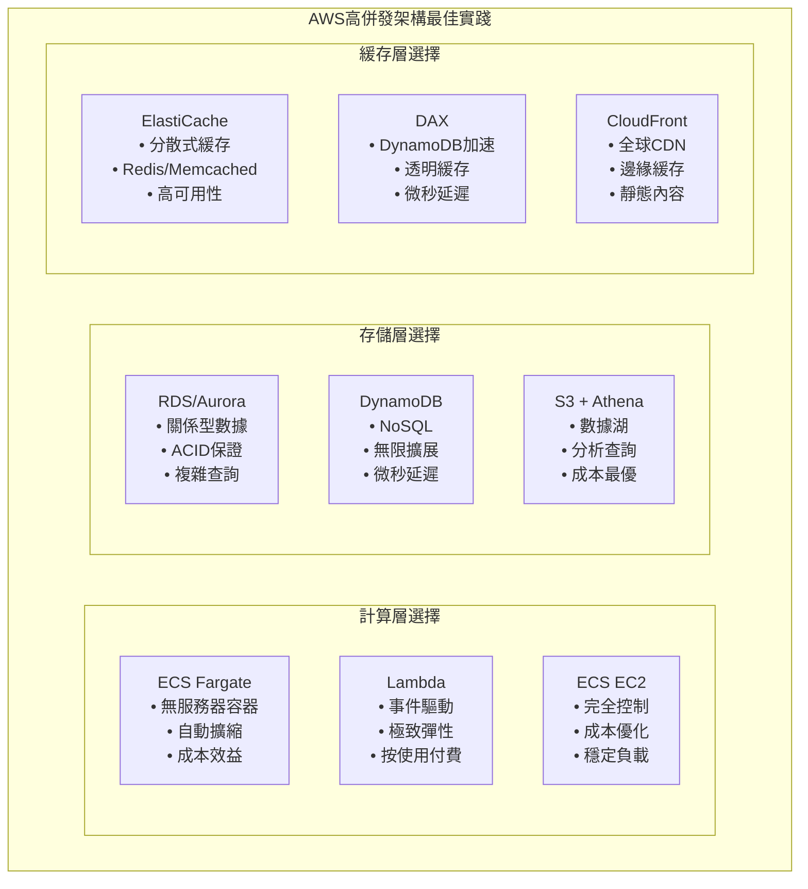

### 成本優化策略

| 服務組合                            | 適用場景             | 成本特點             | 性能特點             |
| ----------------------------------- | -------------------- | -------------------- | -------------------- |
| **Lambda + DynamoDB + DAX**         | 突發流量、事件驅動   | 按使用付費，成本可控 | 極致彈性，冷啟動延遲 |
| **ECS Fargate + Aurora Serverless** | 可預測負載，自動擴縮 | 平衡成本與性能       | 快速擴縮，穩定性好   |
| **ECS EC2 + RDS + ElastiCache**     | 穩定高負載，成本敏感 | 預留實例節省 60%     | 最高性能，管理複雜   |

### 監控與告警配置

**CloudWatch 關鍵指標**：

- **應用層**：ECS CPU/記憶體使用率、Lambda 執行時間、API Gateway 延遲
- **資料庫層**：RDS 連接數、Aurora 複製延遲、DynamoDB 讀寫容量
- **緩存層**：ElastiCache 命中率、DAX 延遲、CloudFront 緩存比率

**自動化最佳實踐**：

- 使用 Auto Scaling 根據指標自動調整資源
- 設置 CloudWatch 告警進行預防性監控
- 利用 AWS Config 確保最佳實踐配置

最終基於實際性能測試和成本分析，將一直以來討論的三種情境提供差異化的 AWS 配置建議：

**投資交易系統：極致性能配置**

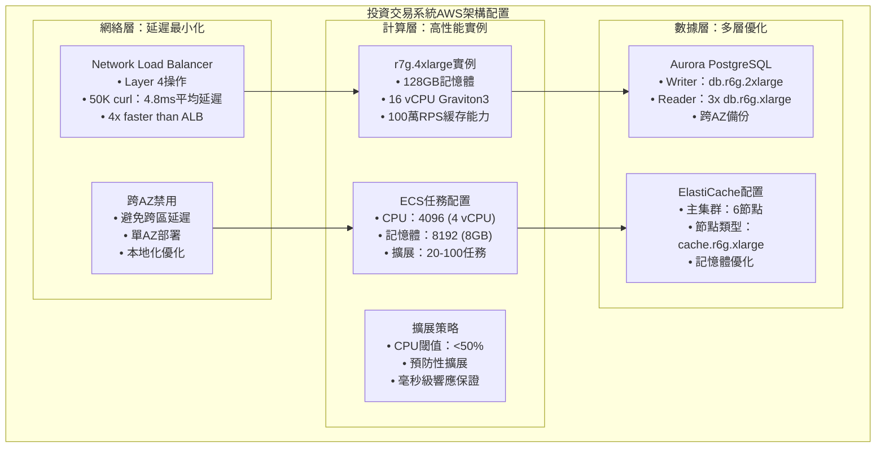

**家庭財務系統：成本優化配置**

```mermaid
graph TB
    subgraph "家庭財務系統AWS成本優化架構"
        subgraph "混合計算策略"
            H1["Lambda + ECS混合<br/>• Lambda：突發處理<br/>• ECS：穩定負載<br/>• 成本：60%節省"]
            H2["ECS配置<br/>• CPU：1024 (1 vCPU)<br/>• 記憶體：2048 (2GB)<br/>• 擴展：2-10任務"]
            H3["Lambda配置<br/>• 記憶體：512MB<br/>• 超時：30秒<br/>• 併發：100"]
        end

        subgraph "數據庫簡化"
            DB1["RDS PostgreSQL<br/>• 實例：db.t4g.medium<br/>• 存儲：通用SSD<br/>• 備份：7天保留"]
            DB2["ElastiCache節約型<br/>• 節點：cache.t4g.medium<br/>• 單節點：開發環境<br/>• 2節點：生產環境"]
        end

        subgraph "成本控制策略"
            CC1["Spot實例<br/>• ECS Spot：70%成本節省<br/>• 非關鍵負載<br/>• 自動故障轉移"]
            CC2["預留實例<br/>• 1年期：40%折扣<br/>• 3年期：60%折扣<br/>• 穩定負載適用"]
        end

        H1 --> DB1 --> CC1
        H2 --> DB2 --> CC2
        H3 --> CC1
    end
```

這些 AWS 服務配置為明天的快取設計提供了具體的技術基礎：

- **多層快取架構**：ElastiCache + Application Cache + CDN
- **快取策略選擇**：基於 ECS task 數量和負載模式
- **成本最佳化**：不同服務組合的成本效益分析
- **監控整合**：CloudWatch 指標驅動的快取策略調整

## 今日的併發設計哲學

- **併發本質是資料流的管理藝術**：不同流量模式需要不同的架構策略
- **限流是引導而非阻擋**：智能限流為快取最佳化創造條件
- **資料分層服務於快取策略**：熱溫冷資料的分層直接對應快取層次
- **架構演進反映複雜度管理**：從單體到微服務到事件驅動的漸進式複雜度

### 架構演進的三個階段

#### Stage 1：單體架構的併發最佳化

- 核心策略：將所有效能集中在一個實體上，靠「垂直延伸」來支撐需求。

- 象徵意涵：像是一棵向上生長的樹幹，把能量不斷往同一方向堆疊。

- 限制：一旦超過硬體極限，擴展空間有限。

#### Stage 2：微服務架構的併發協調

- 核心策略：透過多服務並行與自動擴展，讓系統具備群體韌性。

- 象徵意涵：像是一個樂團，藉由協調與分工來達成更大音量與和諧。

- 限制：跨服務溝通、延遲與一致性管理成為新的挑戰

#### Stage 3：事件驅動架構的併發流處理

- 核心策略：以事件為最小單元，系統能夠即時感知並彈性回應。

- 象徵意涵：像是一條持續流動的河流，能因地形與時間的變化調整流速與方向。

- 限制：事件排序、時間一致性與流處理的穩定性，成為新時代的瓶頸。

#### 抽象演進軌跡

1. 集中強化：單點做大，靠硬體與簡單守門維持秩序。

2. 分布協奏：多點並行，靠協調與共享來維持整體和諧。

3. 動態流動：以事件為脈搏，靠流控與彈性回應來適應環境。

整體來說，這三層抽象揭示了從 靜態穩固 → 動態協調 → 流動適應 的演進路徑。

```mermaid
flowchart TD
    A[Stage 1：單體架構\n「集中強化」] --> B[Stage 2：微服務架構\n「分布協奏」]
    B --> C[Stage 3：事件驅動架構\n「動態流動」]

    subgraph S1[單體特徵]
      A1[(Vertical Scaling)]
      A2[(Local Cache)]
      A3[(Simple Rate Limit)]
    end
    A --> A1 & A2 & A3

    subgraph S2[微服務特徵]
      B1[(Horizontal Scaling)]
      B2[(Distributed Cache)]
      B3[(Multi-tier Limit)]
    end
    B --> B1 & B2 & B3

    subgraph S3[事件驅動特徵]
      C1[(Elastic Event-driven)]
      C2[(Streaming Cache)]
      C3[(Backpressure Control)]
    end
    C --> C1 & C2 & C3

```

記住：高併發設計的終極目標不是處理更多請求，而是為用戶提供穩定、快速、成本最佳化的服務體驗。每個併發策略的選擇都應該服務於整體架構的**可靠性、可擴展性、可維護性**。

---

> 「併發系統的真正藝術在於：我們設計的不是處理流量的機器，而是引導資料流動的智能管道。每個架構決策都應該讓資料在正確的時間、以正確的方式、流向正確的地方。」
